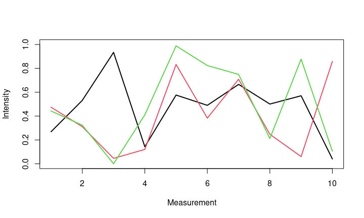
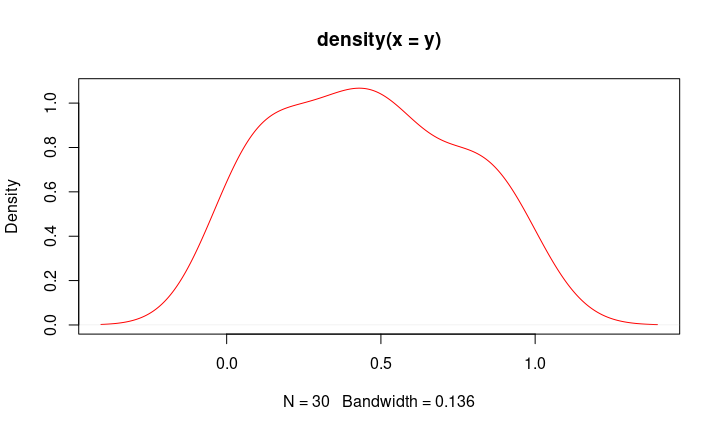
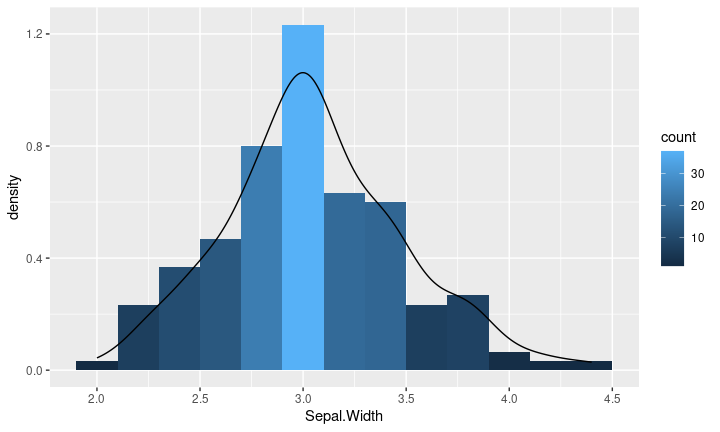
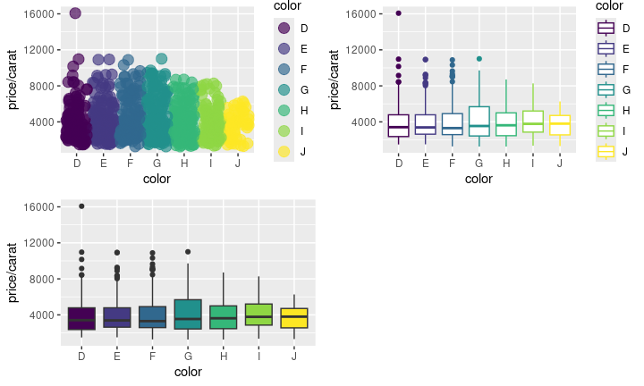
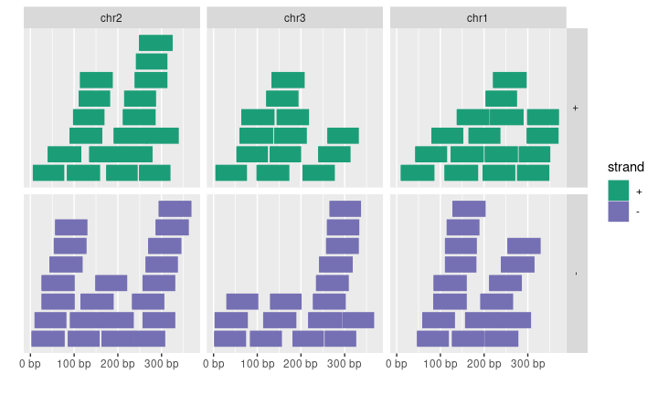
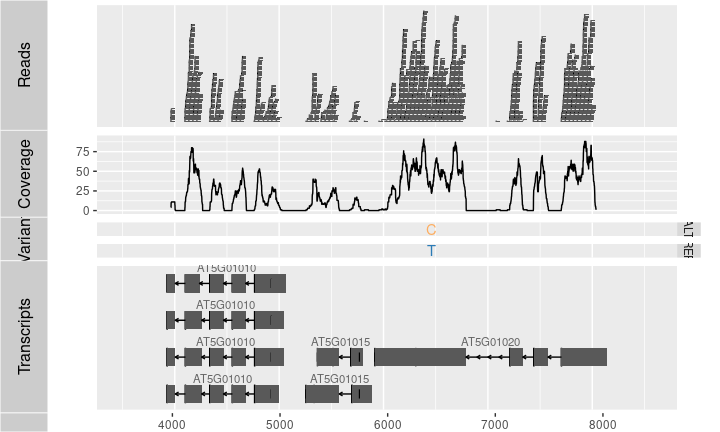

<!---
- ioslides manual: 
   https://bookdown.org/yihui/rmarkdown/ioslides-presentation.html

- Compile from command-line
Rscript -e "rmarkdown::render('rgraphics_slides.Rmd'); knitr::knit('rgraphics_slides.Rmd', tangle=TRUE)"
-->

<!---
  Note: following css chunks are required for scrolling support beyond slide boundaries
-->

<style>
slides > slide {
  overflow-x: auto !important;
  overflow-y: auto !important;
}
</style>

<style type="text/css">
pre {
  max-height: 300px;
  overflow-y: auto;
}

pre[class] {
  max-height: 300px;
}
</style>

<style type="text/css">
.scroll-300 {
  max-height: 300px;
  overflow-y: auto;
  background-color: inherit;
}
</style>

## How to Navigate this Slide Show?

<br/>

- This __ioslides__ presentation contains scrollable slides. 
- Which slides are scrollable, is indicated by a tag at the bottom of the corresponding slides stating: 

<p style='text-align: center;'> __[ Scroll down to continue ]__ </p>

- The following single character keyboard shortcuts enable alternate display modes of __ioslides__:
    - `f`: enable fullscreen mode
    - `w`: toggle widescreen mode
    - `o`: enable overview mode
    - `h`: enable code highlight mode
- Pressing Esc exits all of these modes. Additional details can be found [here](https://bookdown.org/yihui/rmarkdown/ioslides-presentation.html).

# Outline

- <div class="white">__Overview__</div>
- Base Graphics
- Grid Graphics
- Graphics with _lattice_
- Graphics with _ggplot2_ (_ggplotly_) 
- Specialty Graphics
- Genome Graphics
- References

## Overview

### Graphics in R

-   Large ecosystem for visualizing data
-   Fully programmable and highly reproducible publication quality graphics
-   Full [LaTeX](http://www.latex-project.org/), [Sweave](http://www.stat.auckland.ac.nz/~dscott/782/Sweave-manual-20060104.pdf), [knitr](http://yihui.name/knitr/) and [R Markdown](http://rmarkdown.rstudio.com/) support.

### Documentation on Graphics in R

- General 
    - [Graphics Task Page](https://cran.r-project.org/web/views/)
    - [R Graph Gallery](http://www.r-graph-gallery.com/)
    - [R Graphical Manual](https://www.imsbio.co.jp/RGM/R_image_list?page=575&init=true)
    - [Paul Murrell’s book R (Grid) Graphics](http://www.stat.auckland.ac.nz/~paul/RGraphics/rgraphics.html)

- Interactive graphics
    - [plotly](https://plotly.com/r/) and [iplots](http://www.iplots.org/)
    - [Open GL (`rgl`)](http://rgl.neoscientists.org/gallery.shtml) and [rggobi (GGobi)](http://www.ggobi.org/)

## Graphics Environments

- Viewing and savings graphics in R
    - On-screen graphics
    - postscript, pdf, svg
    - jpeg/png/wmf/tiff/...

- Four major graphics environments
    - Low-level infrastructure
        - R Base Graphics (low- and high-level)
        - `grid`: [Manual](http://www.stat.auckland.ac.nz/~paul/grid/grid.html), [Book](http://www.stat.auckland.ac.nz/~paul/RGraphics/rgraphics.html)
    - High-level infrastructure
        - `lattice`: [Manual](http://lmdvr.r-forge.r-project.org), [Intro](https://lattice.r-forge.r-project.org/Vignettes/src/lattice-intro/lattice-intro.pdf), [Book](http://www.amazon.com/Lattice-Multivariate-Data-Visualization-Use/dp/0387759689)
        - `ggplot2`: [Manual](https://r4ds.hadley.nz/data-visualize.html), [Intro](http://www.ling.upenn.edu/~joseff/rstudy/summer2010_ggplot2_intro.html), [Book](https://ggplot2-book.org/introduction.html)

# Outline

- Overview
- <div class="white">__Base Graphics__</div>
- Grid Graphics
- Graphics with _lattice_
- Graphics with _ggplot2_ (_ggplotly_) 
- Specialty Graphics
- Genome Graphics
- References

## Base Graphics

### Overview

- Important high-level plotting functions
    - `plot`: generic x-y plotting
    - `barplot`: bar plots
    - `boxplot`: box-and-whisker plot
    - `hist`: histograms
    - `pie`: pie charts
    - `dotchart`: cleveland dot plots
    - `image, heatmap, contour, persp`: functions to generate image-like plots
    - `qqnorm, qqline, qqplot`: distribution comparison plots
    - `pairs, coplot`: display of multivariant data

- Help on these functions
    - `?myfct`
<p style='text-align: right;'> __[ Scroll down to continue ]__ </p>
<br/><br/>
    - `?plot`
    - `?par`

### Preferred Input Data Objects

- Matrices and data frames
- Vectors
- Named vectors

### Scatter Plots

<br/>

#### Basic scatter plots

<br/>

Sample data set for subsequent plots

```r
set.seed(1410)
y <- matrix(runif(30), ncol=3, dimnames=list(letters[1:10], LETTERS[1:3]))
y
```

```
##            A          B            C
## a 0.26904539 0.47439030 0.4427788756
## b 0.53178658 0.31128960 0.3233293493
## c 0.93379571 0.04576263 0.0004628517
## d 0.14314802 0.12066723 0.4104402000
## e 0.57627063 0.83251909 0.9884746270
## f 0.49001235 0.38298651 0.8235850153
## g 0.66562596 0.70857731 0.7490944304
## h 0.50089252 0.24772695 0.2117313873
## i 0.57033245 0.06044799 0.8776291364
## j 0.04087422 0.85814118 0.1061618729
```

```r
plot(y[,1], y[,2]) 
```

<!-- -->

<br/>

#### All pairs

<br/>


```r
pairs(y) 
```

<!-- -->

<br/>

#### Plot labels

<br/>


```r
plot(y[,1], y[,2], pch=20, col="red", main="Symbols and Labels")
text(y[,1]+0.03, y[,2], rownames(y))
```

<!-- -->

<br/>

#### More examples

<br/>

Print instead of symbols the row names


```r
plot(y[,1], y[,2], type="n", main="Plot of Labels")
text(y[,1], y[,2], rownames(y)) 
```

Usage of important plotting parameters


```r
grid(5, 5, lwd = 2) 
op <- par(mar=c(8,8,8,8), bg="lightblue")
plot(y[,1], y[,2], type="p", col="red", cex.lab=1.2, cex.axis=1.2, 
     cex.main=1.2, cex.sub=1, lwd=4, pch=20, xlab="x label", 
     ylab="y label", main="My Main", sub="My Sub")
par(op)
```

Important arguments}
    - `mar`: specifies the margin sizes around the plotting area in order: `c(bottom, left, top, right)` 
    - `col`: color of symbols
    - `pch`: type of symbols, samples: `example(points)`
    - `lwd`: size of symbols
    - `cex.*`: control font sizes
    - For details see `?par`


Add a regression line to a plot


```r
plot(y[,1], y[,2])
myline <- lm(y[,2]~y[,1]); abline(myline, lwd=2) 
```

<!-- -->

```r
summary(myline) 
```

```
## 
## Call:
## lm(formula = y[, 2] ~ y[, 1])
## 
## Residuals:
##      Min       1Q   Median       3Q      Max 
## -0.40357 -0.17912 -0.04299  0.22147  0.46623 
## 
## Coefficients:
##             Estimate Std. Error t value Pr(>|t|)  
## (Intercept)   0.5764     0.2110   2.732   0.0258 *
## y[, 1]       -0.3647     0.3959  -0.921   0.3839  
## ---
## Signif. codes:  0 '***' 0.001 '**' 0.01 '*' 0.05 '.' 0.1 ' ' 1
## 
## Residual standard error: 0.3095 on 8 degrees of freedom
## Multiple R-squared:  0.09589,	Adjusted R-squared:  -0.01712 
## F-statistic: 0.8485 on 1 and 8 DF,  p-value: 0.3839
```

Same plot as above, but on log scale


```r
plot(y[,1], y[,2], log="xy") 
```

<!-- -->

Add a mathematical expression to a plot


```r
plot(y[,1], y[,2]); text(y[1,1], y[1,2], 
     expression(sum(frac(1,sqrt(x^2*pi)))), cex=1.3) 
```

<!-- -->

<br/>

#### Exercise 1

<br/>

- __Task 1__: Generate scatter plot for first two columns in `iris` data frame and color dots by its `Species` column.
- __Task 2__: Use the `xlim/ylim` arguments to set limits on the x- and y-axes so that all data points are restricted to the left bottom quadrant of the plot. 

Structure of iris data set:

```r
class(iris)
```

```
## [1] "data.frame"
```

```r
iris[1:4,]
```

<div data-pagedtable="false">
  <script data-pagedtable-source type="application/json">
{"columns":[{"label":[""],"name":["_rn_"],"type":[""],"align":["left"]},{"label":["Sepal.Length"],"name":[1],"type":["dbl"],"align":["right"]},{"label":["Sepal.Width"],"name":[2],"type":["dbl"],"align":["right"]},{"label":["Petal.Length"],"name":[3],"type":["dbl"],"align":["right"]},{"label":["Petal.Width"],"name":[4],"type":["dbl"],"align":["right"]},{"label":["Species"],"name":[5],"type":["fct"],"align":["left"]}],"data":[{"1":"5.1","2":"3.5","3":"1.4","4":"0.2","5":"setosa","_rn_":"1"},{"1":"4.9","2":"3.0","3":"1.4","4":"0.2","5":"setosa","_rn_":"2"},{"1":"4.7","2":"3.2","3":"1.3","4":"0.2","5":"setosa","_rn_":"3"},{"1":"4.6","2":"3.1","3":"1.5","4":"0.2","5":"setosa","_rn_":"4"}],"options":{"columns":{"min":{},"max":[10]},"rows":{"min":[10],"max":[10]},"pages":{}}}
  </script>
</div>

```r
table(iris$Species)
```

```
## 
##     setosa versicolor  virginica 
##         50         50         50
```


### Line Plots

<br/>

#### Single Data Set

<br/>


```r
plot(y[,1], type="l", lwd=2, col="blue") 
```

<!-- -->

<br/>

#### Many Data Sets

<br/>

Plots line graph for all columns in data frame `y`. The `split.screen` function is used in this example in a for loop to overlay several line graphs in the same plot. 


```r
split.screen(c(1,1)) 
```

```
## [1] 1
```

```r
plot(y[,1], ylim=c(0,1), xlab="Measurement", ylab="Intensity", type="l", lwd=2, col=1)
for(i in 2:length(y[1,])) { 
	screen(1, new=FALSE)
	plot(y[,i], ylim=c(0,1), type="l", lwd=2, col=i, xaxt="n", yaxt="n", ylab="", 
             xlab="", main="", bty="n") 
}
```

<!-- -->

```r
close.screen(all=TRUE) 
```

### Bar Plots

<br/>

#### Basics

<br/>


```r
barplot(y[1:4,], ylim=c(0, max(y[1:4,])+0.3), beside=TRUE, 
        legend=letters[1:4]) 
text(labels=round(as.vector(as.matrix(y[1:4,])),2), x=seq(1.5, 13, by=1)
     +sort(rep(c(0,1,2), 4)), y=as.vector(as.matrix(y[1:4,]))+0.04) 
```

<!-- -->
	
<br/>

#### Error bars

<br/>


```r
bar <- barplot(m <- rowMeans(y) * 10, ylim=c(0, 10))
stdev <- sd(t(y))
arrows(bar, m, bar, m + stdev, length=0.15, angle = 90)
```

<!-- -->

<br/>

#### Mirrored bar plot

<br/>


```r
df <- data.frame(group = rep(c("Above", "Below"), each=10), x = rep(1:10, 2), y = c(runif(10, 0, 1), runif(10, -1, 0)))
plot(c(0,12), range(df$y), type = "n")
barplot(height = df$y[df$group == "Above"], add = TRUE, axes = FALSE)
barplot(height = df$y[df$group == "Below"], add = TRUE, axes = FALSE)
```

<!-- -->

### Histograms


```r
hist(y, freq=TRUE, breaks=10)
```

<!-- -->

### Density Plots}


```r
plot(density(y), col="red")
```

<!-- -->

### Pie Charts


```r
pie(y[,1], col=rainbow(length(y[,1]), start=0.1, end=0.8), clockwise=TRUE)
legend("topright", legend=row.names(y), cex=1.3, bty="n", pch=15, pt.cex=1.8, 
col=rainbow(length(y[,1]), start=0.1, end=0.8), ncol=1) 
```

<!-- -->

### Color Selection Utilities

Default color palette and how to change it


```r
palette()
```

```
## [1] "black"   "#DF536B" "#61D04F" "#2297E6" "#28E2E5" "#CD0BBC" "#F5C710" "gray62"
```

```r
palette(rainbow(5, start=0.1, end=0.2))
palette()
```

```
## [1] "#FF9900" "#FFBF00" "#FFE600" "#F2FF00" "#CCFF00"
```

```r
palette("default")
```

The `gray` function allows to select any type of gray shades by providing values from 0 to 1


```r
gray(seq(0.1, 1, by= 0.2))
```

```
## [1] "#1A1A1A" "#4D4D4D" "#808080" "#B3B3B3" "#E6E6E6"
```

Color gradients with `colorpanel` function from `gplots` library


```r
library(gplots)
colorpanel(5, "darkblue", "yellow", "white")
```

Much more on colors in R see Earl Glynn's [color chart](http://earlglynn.github.io/color/ColorInR)


### Arranging Several Plots on Single Page

With `par(mfrow=c(nrow, ncol))` one can define how several plots are arranged next to each other.


```r
par(mfrow=c(2,3)) 
for(i in 1:6) plot(1:10) 
```

<!-- -->

<br/>

#### Arranging Plots with Variable Width

<br/>

The `layout` function allows to divide the plotting device into variable numbers of rows and columns with the column-widths and the row-heights specified in the respective arguments.


```r
nf <- layout(matrix(c(1,2,3,3), 2, 2, byrow=TRUE), c(3,7), c(5,5), 
             respect=TRUE)
# layout.show(nf)
for(i in 1:3) barplot(1:10) 
```

<!-- -->

### Saving Graphics to Files

After the `pdf()` command all graphs are redirected to file `test.pdf`. Works for all common formats similarly: jpeg, png, ps, tiff, ...


```r
pdf("test.pdf"); plot(1:10, 1:10); dev.off() 
```

Generates Scalable Vector Graphics (SVG) files that can be edited in vector graphics programs, such as InkScape.


```r
svg("test.svg"); plot(1:10, 1:10); dev.off() 
```

<br/>

#### Exercise 2

<br/>

Bar plots
        
- __Task 1__: Calculate the mean values for the `Species` components of the first four columns in the `iris` data set. Organize the results in a matrix where the row names are the unique values from the `iris Species` column and the column names are the same as in the first four `iris` columns. 
- __Task 2__: Generate two bar plots: one with stacked bars and one with horizontally arranged bars. 

Structure of iris data set:


```r
class(iris)
```

```
## [1] "data.frame"
```

```r
iris[1:4,]
```

<div data-pagedtable="false">
  <script data-pagedtable-source type="application/json">
{"columns":[{"label":[""],"name":["_rn_"],"type":[""],"align":["left"]},{"label":["Sepal.Length"],"name":[1],"type":["dbl"],"align":["right"]},{"label":["Sepal.Width"],"name":[2],"type":["dbl"],"align":["right"]},{"label":["Petal.Length"],"name":[3],"type":["dbl"],"align":["right"]},{"label":["Petal.Width"],"name":[4],"type":["dbl"],"align":["right"]},{"label":["Species"],"name":[5],"type":["fct"],"align":["left"]}],"data":[{"1":"5.1","2":"3.5","3":"1.4","4":"0.2","5":"setosa","_rn_":"1"},{"1":"4.9","2":"3.0","3":"1.4","4":"0.2","5":"setosa","_rn_":"2"},{"1":"4.7","2":"3.2","3":"1.3","4":"0.2","5":"setosa","_rn_":"3"},{"1":"4.6","2":"3.1","3":"1.5","4":"0.2","5":"setosa","_rn_":"4"}],"options":{"columns":{"min":{},"max":[10]},"rows":{"min":[10],"max":[10]},"pages":{}}}
  </script>
</div>

```r
table(iris$Species)
```

```
## 
##     setosa versicolor  virginica 
##         50         50         50
```


# Outline

- Overview
- Base Graphics
- <div class="white">__Grid Graphics__</div>
- Graphics with _lattice_
- Graphics with _ggplot2_ (_ggplotly_) 
- Specialty Graphics
- Genome Graphics
- References

## Grid Graphics

- What is `grid`?
    - Low-level graphics system 
    - Highly flexible and controllable system
    - Does not provide high-level functions 
    - Intended as development environment for custom plotting functions 
    - Pre-installed on new R distributions

- Documentation and Help
    - [Manual](http://www.stat.auckland.ac.nz/~paul/grid/grid.html)
    - [Book](http://www.stat.auckland.ac.nz/~paul/RGraphics/rgraphics.html)


# Outline

- Overview
- Base Graphics
- Grid Graphics
- <div class="white">__Graphics with _lattice_ __</div>
- Graphics with _ggplot2_ (_ggplotly_) 
- Specialty Graphics
- Genome Graphics
- References

## lattice Graphics

- What is `lattice`?
    - High-level graphics system 
    - Developed by Deepayan Sarkar 
    - Implements Trellis graphics system from S-Plus
    - Simplifies high-level plotting tasks: arranging complex graphical features 
    - Syntax similar to R's base graphics

- Documentation and Help
    - [Manual](http://lmdvr.r-forge.r-project.org)
    - [Intro](https://www.statmethods.net/advgraphs/trellis.html)
    - [Book](http://www.amazon.com/Lattice-Multivariate-Data-Visualization-Use/dp/0387759689)
		
Open a list of all functions available in the lattice package


```r
library(lattice) 
library(help=lattice) 
```
<p style='text-align: right;'> __[ Scroll down to continue ]__ </p>
<br/><br/>

Accessing and changing global parameters:


```r
?lattice.options
?trellis.device
```

### Scatter Plot Sample


```r
library(lattice)
p1 <- xyplot(1:8 ~ 1:8 | rep(LETTERS[1:4], each=2), as.table=TRUE) 
plot(p1)
```

<!-- -->

### Line Plot Sample


```r
library(lattice)
p2 <- parallelplot(~iris[1:4] | Species, iris, horizontal.axis = FALSE, 
              layout = c(1, 3, 1))  
plot(p2)
```

<!-- -->

# Outline

- Overview
- Base Graphics
- Grid Graphics
- Graphics with _lattice_ 
- <div class="white">__Graphics with _ggplot2_ (_ggplotly_) __</div>
- Specialty Graphics
- 
- References

## ggplot2 Graphics

- What is `ggplot2`?
    - High-level graphics system developed by Hadley Wickham
    - Implements grammar of graphics from [Leland Wilkinson](http://www.amazon.com/Grammar-Graphics-Leland-Wilkinson/dp/0387987746) 
    - Streamlines many graphics workflows for complex plots
    - Syntax centered around main `ggplot` function 
    - Simpler `qplot` function provides many shortcuts
        
- Documentation and Help
    - [Manual](https://ggplot2.tidyverse.org/reference/)
    - [Book](https://ggplot2-book.org/)
    - [Cookbook for R](http://www.cookbook-r.com/Graphs/)


## Design Concept of `ggplot2`

Plotting formalized and implemented by the grammar of graphics by Leland Wilkinson and Hadley Wickham [@Wickham2010-nu; @Wilkinson2012-wv; @Wickham2009-aq]. The plotting process
in `ggplot2` is devided into layers including:

<div class="columns-2">

1. Theme: styles to be used, such as fonts, backgrounds, etc.
2. Coordinates: the plotting space
3. Statistics: data models and summaries
4. Facets: row and column layout of sub-plots
5. Geometries: shapes used to represent data (_e.g._ bar or scatter plot)
6. Aesthetics: the scales onto which the data will be mapped
7. Data: the actual data to be plotted

<center></center>


## `ggplot2` Usage
	
- `ggplot` function accepts two main arguments
    - Data set to be plotted 
	- Aesthetic mappings provided by `aes` function
- Additional parameters such as geometric objects (_e.g._ points, lines, bars) are passed on by appending them with `+` as separator. 
- List of available `geom_*` functions see [here](https://ggplot2.tidyverse.org/reference/) 
- Settings of plotting theme can be accessed with the command `theme_get()` and its settings can be changed with `theme()`. 
- Preferred input data object 
    - `qplot`: `data.frame` or `tibble` (support for `vector`, `matrix`, `...`)
    - `ggplot`: `data.frame` or `tibble`
- Packages with convenience utilities to create expected inputs
    - `dplyr` (`plyr`)
    - `tidyr` and `reshape2`

## Usage with `qplot` Function

The syntax of `qplot` is similar as R's basic `plot` function

- Arguments
    - `x`: x-coordinates (_e.g._ `col1`)
    - `y`: y-coordinates (_e.g._ `col2`)
	- `data`: `data.frame` or `tibble` with corresponding column names
	- `xlim, ylim`: _e.g._ `xlim=c(0,10)` 
    - `log`: _e.g._ `log="x"` or `log="xy"`
	- `main`: main title; see `?plotmath` for mathematical formula
	- `xlab, ylab`: labels for the x- and y-axes
	- `color`, `shape`, `size`
	- `...`: many arguments accepted by `plot` function

<br/><br/>
<p style='text-align: right;'> __[ Scroll down to continue ]__ </p>
<br/><br/>

### `qplot`: scatter plot basics

Create sample data, here 3 vectors: `x`, `y` and `cat`

```r
library(ggplot2)
x <- sample(1:10, 10); y <- sample(1:10, 10); cat <- rep(c("A", "B"), 5)
```

Simple scatter plot


```r
qplot(x, y, geom="point")
```

```
## Warning: `qplot()` was deprecated in ggplot2 3.4.0.
## This warning is displayed once every 8 hours.
## Call `lifecycle::last_lifecycle_warnings()` to see where this warning was generated.
```

<!-- -->

Prints dots with different sizes and colors


```r
qplot(x, y, geom="point", size=x, color=cat, 
      main="Dot Size and Color Relative to Some Values")
```

<!-- -->

Drops legend


```r
qplot(x, y, geom="point", size=x, color=cat) + 
      theme(legend.position = "none")
```

<!-- -->

Plot different shapes


```r
qplot(x, y, geom="point", size=5, shape=cat)
```

<!-- -->

<br/>

#### Colored groups

<br/>


```r
p <- qplot(x, y, geom="point", size=x, color=cat, 
           main="Dot Size and Color Relative to Some Values") + 
           theme(legend.position = "none")
print(p)
```

<!-- -->

<br/>

#### Regression line

<br/>


```r
set.seed(1410)
dsmall <- diamonds[sample(nrow(diamonds), 1000), ]
p <- qplot(carat, price, data = dsmall) +
           geom_smooth(method="lm")
print(p)
```

```
## `geom_smooth()` using formula = 'y ~ x'
```

<!-- -->

<br/>

#### Local regression curve (loess)

<br/>


```r
p <- qplot(carat, price, data=dsmall, geom=c("point", "smooth")) 
print(p) # Setting se=FALSE removes error shade
```

```
## `geom_smooth()` using method = 'gam' and formula = 'y ~ s(x, bs = "cs")'
```

<!-- -->

## Usage with `ggplot` Function

- More important than `qplot` to access full functionality of `ggplot2`
- Main arguments
    - data set, usually a `data.frame` or `tibble`
	- aesthetic mappings provided by `aes` function
- General `ggplot` syntax
    - `ggplot(data, aes(...)) + geom() + ... + stat() + ...`
- Layer specifications
    - `geom(mapping, data, ..., geom, position)`
    - `stat(mapping, data, ..., stat, position)`
- Additional components
    - `scales`
	- `coordinates`
	- `facet`
<p style='text-align: right;'> __[ Scroll down to continue ]__ </p>
<br/><br/>
- `aes()` mappings can be passed on to all components (`ggplot, geom`, etc.). Effects are global when passed on to `ggplot()` and local for other components.
    - `x, y`
	- `color`: grouping vector (factor) 
	- `group`: grouping vector (factor)

<br/>

#### Changing Plotting Themes in `ggplot`

<br/>

- Theme settings can be accessed with `theme_get()`
- Their settings can be changed with `theme()`

Example how to change background color to white
		

```r
... + theme(panel.background=element_rect(fill = "white", colour = "black")) 
```

<br/>

#### Storing `ggplot` Specifications

<br/>

Plots and layers can be stored in variables


```r
p <- ggplot(dsmall, aes(carat, price)) + geom_point() 
p # or print(p)
```

Returns information about data and aesthetic mappings followed by each layer


```r
summary(p) 
```

Print dots with different sizes and colors


```r
bestfit <- geom_smooth(method = "lm", se = F, color = alpha("steelblue", 0.5), size = 2)
p + bestfit # Plot with custom regression line
```

Syntax to pass on other data sets


```r
p %+% diamonds[sample(nrow(diamonds), 100),] 
```

Saves plot stored in variable `p` to file


```r
ggsave(p, file="myplot.pdf") 
```

Standard R export functons for graphics work as well (see [here](https://girke.bioinformatics.ucr.edu/GEN242/tutorials/rgraphics/rgraphics/#saving-graphics-to-files)). 

### `ggplot`: scatter plots

<br/>

#### Basic example

<br/>


```r
set.seed(1410)  
dsmall <- as.data.frame(diamonds[sample(nrow(diamonds), 1000), ])
p <- ggplot(dsmall, aes(carat, price, color=color)) + 
            geom_point(size=4)
print(p) 
```

<!-- -->

Interactive version of above plot can be generated with the `ggplotly` function from 
the `plotly` package.


```r
library(plotly)
ggplotly(p)
```

```{=html}
<div class="plotly html-widget html-fill-item" id="htmlwidget-7d670bfea5cc1c5d088c" style="width:480px;height:480px;"></div>
<script type="application/json" data-for="htmlwidget-7d670bfea5cc1c5d088c">{"x":{"data":[{"x":[0.32000000000000001,0.34000000000000002,1.54,1.52,1.51,0.52000000000000002,0.32000000000000001,0.52000000000000002,0.66000000000000003,1,1,0.5,0.46999999999999997,1.0900000000000001,0.34999999999999998,1.01,0.53000000000000003,0.41999999999999998,0.5,2.0299999999999998,1,0.60999999999999999,0.90000000000000002,0.56000000000000005,0.90000000000000002,0.28000000000000003,0.33000000000000002,1.3400000000000001,0.52000000000000002,0.79000000000000004,0.5,0.69999999999999996,0.27000000000000002,0.90000000000000002,0.31,1.5,0.56999999999999995,0.56999999999999995,0.60999999999999999,0.37,0.90000000000000002,0.32000000000000001,0.77000000000000002,0.29999999999999999,0.33000000000000002,0.65000000000000002,0.56999999999999995,0.90000000000000002,1.52,0.41999999999999998,1.0800000000000001,0.23000000000000001,0.32000000000000001,1.1799999999999999,0.31,0.47999999999999998,0.90000000000000002,0.53000000000000003,1.01,0.70999999999999996,1.02,0.90000000000000002,0.79000000000000004,0.84999999999999998,0.71999999999999997,0.40999999999999998,0.5,0.93000000000000005,0.44,0.31,0.42999999999999999,0.39000000000000001,0.33000000000000002,0.23999999999999999,0.52000000000000002,0.32000000000000001,1,0.42999999999999999,0.69999999999999996,0.37,0.26000000000000001,0.69999999999999996,0.73999999999999999,1.2,1.03,1.05,1.01,1.04,1.71,0.31,1.1299999999999999,0.51000000000000001,0.44,0.38,0.46000000000000002,0.40999999999999998,0.40999999999999998,1.1100000000000001,0.35999999999999999,0.31,0.23999999999999999,0.25,0.32000000000000001,1.5800000000000001,1.5,2.0299999999999998,0.23000000000000001,0.54000000000000004,0.57999999999999996,0.35999999999999999,0.34999999999999998,1,0.35999999999999999,0.40999999999999998,0.53000000000000003,0.5,0.79000000000000004,0.31,1.03,0.52000000000000002,0.80000000000000004,1,0.35999999999999999,0.38,0.59999999999999998,0.35999999999999999,1.03,0.69999999999999996,1.02,0.31,0.73999999999999999,0.31,0.92000000000000004,0.34000000000000002,0.91000000000000003,0.69999999999999996,0.23000000000000001],"y":[589,805,16889,7702,12738,1605,756,1919,3915,3965,16073,1272,1270,5164,829,5543,1956,1621,958,13858,5286,3397,4435,1243,3205,452,492,6303,1774,3328,1589,2355,622,4068,1075,15240,2015,1262,2266,857,3812,756,3428,670,492,4275,2047,6872,9789,1031,5758,530,758,5168,766,2329,3755,2266,5939,2516,4912,8239,2823,2737,2951,920,1354,4140,1235,942,774,1170,492,367,3284,657,5775,919,2596,1124,554,2218,3138,4203,4845,7965,7303,6115,11737,982,4406,1431,1294,871,1262,1295,1018,6241,1064,732,552,548,972,13329,12060,13229,425,1786,1879,689,1026,6762,851,791,1412,1436,3270,734,5804,2217,3312,4786,713,1257,2010,1042,8645,1770,5918,593,2906,571,3916,803,5535,2804,680],"text":["carat: 0.32<br />price:   589<br />color: D","carat: 0.34<br />price:   805<br />color: D","carat: 1.54<br />price: 16889<br />color: D","carat: 1.52<br />price:  7702<br />color: D","carat: 1.51<br />price: 12738<br />color: D","carat: 0.52<br />price:  1605<br />color: D","carat: 0.32<br />price:   756<br />color: D","carat: 0.52<br />price:  1919<br />color: D","carat: 0.66<br />price:  3915<br />color: D","carat: 1.00<br />price:  3965<br />color: D","carat: 1.00<br />price: 16073<br />color: D","carat: 0.50<br />price:  1272<br />color: D","carat: 0.47<br />price:  1270<br />color: D","carat: 1.09<br />price:  5164<br />color: D","carat: 0.35<br />price:   829<br />color: D","carat: 1.01<br />price:  5543<br />color: D","carat: 0.53<br />price:  1956<br />color: D","carat: 0.42<br />price:  1621<br />color: D","carat: 0.50<br />price:   958<br />color: D","carat: 2.03<br />price: 13858<br />color: D","carat: 1.00<br />price:  5286<br />color: D","carat: 0.61<br />price:  3397<br />color: D","carat: 0.90<br />price:  4435<br />color: D","carat: 0.56<br />price:  1243<br />color: D","carat: 0.90<br />price:  3205<br />color: D","carat: 0.28<br />price:   452<br />color: D","carat: 0.33<br />price:   492<br />color: D","carat: 1.34<br />price:  6303<br />color: D","carat: 0.52<br />price:  1774<br />color: D","carat: 0.79<br />price:  3328<br />color: D","carat: 0.50<br />price:  1589<br />color: D","carat: 0.70<br />price:  2355<br />color: D","carat: 0.27<br />price:   622<br />color: D","carat: 0.90<br />price:  4068<br />color: D","carat: 0.31<br />price:  1075<br />color: D","carat: 1.50<br />price: 15240<br />color: D","carat: 0.57<br />price:  2015<br />color: D","carat: 0.57<br />price:  1262<br />color: D","carat: 0.61<br />price:  2266<br />color: D","carat: 0.37<br />price:   857<br />color: D","carat: 0.90<br />price:  3812<br />color: D","carat: 0.32<br />price:   756<br />color: D","carat: 0.77<br />price:  3428<br />color: D","carat: 0.30<br />price:   670<br />color: D","carat: 0.33<br />price:   492<br />color: D","carat: 0.65<br />price:  4275<br />color: D","carat: 0.57<br />price:  2047<br />color: D","carat: 0.90<br />price:  6872<br />color: D","carat: 1.52<br />price:  9789<br />color: D","carat: 0.42<br />price:  1031<br />color: D","carat: 1.08<br />price:  5758<br />color: D","carat: 0.23<br />price:   530<br />color: D","carat: 0.32<br />price:   758<br />color: D","carat: 1.18<br />price:  5168<br />color: D","carat: 0.31<br />price:   766<br />color: D","carat: 0.48<br />price:  2329<br />color: D","carat: 0.90<br />price:  3755<br />color: D","carat: 0.53<br />price:  2266<br />color: D","carat: 1.01<br />price:  5939<br />color: D","carat: 0.71<br />price:  2516<br />color: D","carat: 1.02<br />price:  4912<br />color: D","carat: 0.90<br />price:  8239<br />color: D","carat: 0.79<br />price:  2823<br />color: D","carat: 0.85<br />price:  2737<br />color: D","carat: 0.72<br />price:  2951<br />color: D","carat: 0.41<br />price:   920<br />color: D","carat: 0.50<br />price:  1354<br />color: D","carat: 0.93<br />price:  4140<br />color: D","carat: 0.44<br />price:  1235<br />color: D","carat: 0.31<br />price:   942<br />color: D","carat: 0.43<br />price:   774<br />color: D","carat: 0.39<br />price:  1170<br />color: D","carat: 0.33<br />price:   492<br />color: D","carat: 0.24<br />price:   367<br />color: D","carat: 0.52<br />price:  3284<br />color: D","carat: 0.32<br />price:   657<br />color: D","carat: 1.00<br />price:  5775<br />color: D","carat: 0.43<br />price:   919<br />color: D","carat: 0.70<br />price:  2596<br />color: D","carat: 0.37<br />price:  1124<br />color: D","carat: 0.26<br />price:   554<br />color: D","carat: 0.70<br />price:  2218<br />color: D","carat: 0.74<br />price:  3138<br />color: D","carat: 1.20<br />price:  4203<br />color: D","carat: 1.03<br />price:  4845<br />color: D","carat: 1.05<br />price:  7965<br />color: D","carat: 1.01<br />price:  7303<br />color: D","carat: 1.04<br />price:  6115<br />color: D","carat: 1.71<br />price: 11737<br />color: D","carat: 0.31<br />price:   982<br />color: D","carat: 1.13<br />price:  4406<br />color: D","carat: 0.51<br />price:  1431<br />color: D","carat: 0.44<br />price:  1294<br />color: D","carat: 0.38<br />price:   871<br />color: D","carat: 0.46<br />price:  1262<br />color: D","carat: 0.41<br />price:  1295<br />color: D","carat: 0.41<br />price:  1018<br />color: D","carat: 1.11<br />price:  6241<br />color: D","carat: 0.36<br />price:  1064<br />color: D","carat: 0.31<br />price:   732<br />color: D","carat: 0.24<br />price:   552<br />color: D","carat: 0.25<br />price:   548<br />color: D","carat: 0.32<br />price:   972<br />color: D","carat: 1.58<br />price: 13329<br />color: D","carat: 1.50<br />price: 12060<br />color: D","carat: 2.03<br />price: 13229<br />color: D","carat: 0.23<br />price:   425<br />color: D","carat: 0.54<br />price:  1786<br />color: D","carat: 0.58<br />price:  1879<br />color: D","carat: 0.36<br />price:   689<br />color: D","carat: 0.35<br />price:  1026<br />color: D","carat: 1.00<br />price:  6762<br />color: D","carat: 0.36<br />price:   851<br />color: D","carat: 0.41<br />price:   791<br />color: D","carat: 0.53<br />price:  1412<br />color: D","carat: 0.50<br />price:  1436<br />color: D","carat: 0.79<br />price:  3270<br />color: D","carat: 0.31<br />price:   734<br />color: D","carat: 1.03<br />price:  5804<br />color: D","carat: 0.52<br />price:  2217<br />color: D","carat: 0.80<br />price:  3312<br />color: D","carat: 1.00<br />price:  4786<br />color: D","carat: 0.36<br />price:   713<br />color: D","carat: 0.38<br />price:  1257<br />color: D","carat: 0.60<br />price:  2010<br />color: D","carat: 0.36<br />price:  1042<br />color: D","carat: 1.03<br />price:  8645<br />color: D","carat: 0.70<br />price:  1770<br />color: D","carat: 1.02<br />price:  5918<br />color: D","carat: 0.31<br />price:   593<br />color: D","carat: 0.74<br />price:  2906<br />color: D","carat: 0.31<br />price:   571<br />color: D","carat: 0.92<br />price:  3916<br />color: D","carat: 0.34<br />price:   803<br />color: D","carat: 0.91<br />price:  5535<br />color: D","carat: 0.70<br />price:  2804<br />color: D","carat: 0.23<br />price:   680<br />color: D"],"type":"scatter","mode":"markers","marker":{"autocolorscale":false,"color":"rgba(68,1,84,1)","opacity":1,"size":15.118110236220474,"symbol":"circle","line":{"width":1.8897637795275593,"color":"rgba(68,1,84,1)"}},"hoveron":"points","name":"D","legendgroup":"D","showlegend":true,"xaxis":"x","yaxis":"y","hoverinfo":"text","frame":null},{"x":[0.25,0.90000000000000002,0.75,1.01,1.01,0.54000000000000004,0.39000000000000001,0.69999999999999996,1.01,0.34000000000000002,0.51000000000000001,0.40999999999999998,1.02,0.38,0.42999999999999999,0.59999999999999998,1.71,0.70999999999999996,0.31,0.33000000000000002,1.51,0.31,2.0099999999999998,0.91000000000000003,1.0900000000000001,0.39000000000000001,0.5,1.51,0.46000000000000002,0.34999999999999998,0.35999999999999999,0.56000000000000005,1.26,1.1200000000000001,0.56000000000000005,0.63,0.34999999999999998,0.33000000000000002,1.6599999999999999,0.32000000000000001,0.40999999999999998,0.37,1.02,0.26000000000000001,0.73999999999999999,0.71999999999999997,0.35999999999999999,1.6299999999999999,0.34000000000000002,0.40999999999999998,0.52000000000000002,0.31,2,0.69999999999999996,0.42999999999999999,0.38,1.52,0.94999999999999996,0.40999999999999998,0.51000000000000001,0.55000000000000004,1.01,0.78000000000000003,0.31,0.40999999999999998,0.33000000000000002,1.51,0.34000000000000002,0.40999999999999998,0.63,0.34000000000000002,1.0900000000000001,0.53000000000000003,0.28999999999999998,0.38,0.33000000000000002,0.89000000000000001,0.40999999999999998,1,0.29999999999999999,0.75,0.32000000000000001,1.21,1,1.1200000000000001,0.23999999999999999,0.5,0.34000000000000002,0.72999999999999998,1.1100000000000001,0.46000000000000002,0.57999999999999996,0.40999999999999998,0.5,0.5,0.70999999999999996,0.78000000000000003,0.32000000000000001,0.5,0.56999999999999995,0.31,0.33000000000000002,0.42999999999999999,0.90000000000000002,0.23000000000000001,0.55000000000000004,0.32000000000000001,1,0.51000000000000001,1,0.28000000000000003,0.75,0.33000000000000002,0.5,1.5700000000000001,0.70999999999999996,2,2.0099999999999998,1.05,0.26000000000000001,0.29999999999999999,0.90000000000000002,1,0.73999999999999999,0.76000000000000001,0.55000000000000004,0.29999999999999999,0.52000000000000002,0.70999999999999996,0.77000000000000002,0.32000000000000001,0.40000000000000002,1.7,0.31,0.29999999999999999,1.4199999999999999,0.37,1.02,0.71999999999999997,1.01,0.28000000000000003,0.58999999999999997,1.01,0.71999999999999997,1,1,1.01,1.3600000000000001,1,0.28000000000000003,0.47999999999999998,1.6000000000000001,0.52000000000000002,0.31,0.69999999999999996,0.72999999999999998,0.51000000000000001,0.23000000000000001,0.52000000000000002,0.29999999999999999,1.22,0.31,0.33000000000000002,1.6000000000000001,0.79000000000000004,0.34999999999999998,1.03,0.69999999999999996,0.26000000000000001,1.01,0.54000000000000004,1.02,0.69999999999999996,0.70999999999999996,0.31,0.32000000000000001,1.1100000000000001,0.52000000000000002,0.34000000000000002,0.69999999999999996,1.01,1.01],"y":[783,3239,3231,4912,8976,1250,601,3504,5279,556,1656,1249,7277,1267,1433,2774,14319,3360,816,804,12530,879,16733,3743,10111,985,1217,9302,1661,767,933,1915,6085,5546,1915,2765,921,957,10553,768,1079,1041,4465,556,2999,2498,738,17825,765,1153,1601,872,15840,3419,716,866,12418,4738,638,1340,1551,6128,2379,872,981,693,9343,612,1431,2565,1033,5127,1438,619,1053,928,3872,1187,4435,895,2940,1095,6708,6315,7589,362,1240,1014,2409,4532,1070,1641,818,1351,1410,2190,3444,1095,1746,1613,872,1002,669,3662,530,1448,1080,5330,1831,3763,642,2674,928,1259,10362,2891,16064,15618,5494,599,526,4092,9139,2464,2580,1675,564,1229,2329,3291,954,1125,9596,936,895,8019,999,11128,3235,4608,470,2177,5751,3550,9224,4916,6268,7677,4805,688,1323,10798,1646,958,2952,2886,1443,530,1793,578,7395,734,743,12467,3539,767,5010,2757,554,6968,1163,4540,2415,2921,1133,528,6800,1689,881,2952,5366,4751],"text":["carat: 0.25<br />price:   783<br />color: E","carat: 0.90<br />price:  3239<br />color: E","carat: 0.75<br />price:  3231<br />color: E","carat: 1.01<br />price:  4912<br />color: E","carat: 1.01<br />price:  8976<br />color: E","carat: 0.54<br />price:  1250<br />color: E","carat: 0.39<br />price:   601<br />color: E","carat: 0.70<br />price:  3504<br />color: E","carat: 1.01<br />price:  5279<br />color: E","carat: 0.34<br />price:   556<br />color: E","carat: 0.51<br />price:  1656<br />color: E","carat: 0.41<br />price:  1249<br />color: E","carat: 1.02<br />price:  7277<br />color: E","carat: 0.38<br />price:  1267<br />color: E","carat: 0.43<br />price:  1433<br />color: E","carat: 0.60<br />price:  2774<br />color: E","carat: 1.71<br />price: 14319<br />color: E","carat: 0.71<br />price:  3360<br />color: E","carat: 0.31<br />price:   816<br />color: E","carat: 0.33<br />price:   804<br />color: E","carat: 1.51<br />price: 12530<br />color: E","carat: 0.31<br />price:   879<br />color: E","carat: 2.01<br />price: 16733<br />color: E","carat: 0.91<br />price:  3743<br />color: E","carat: 1.09<br />price: 10111<br />color: E","carat: 0.39<br />price:   985<br />color: E","carat: 0.50<br />price:  1217<br />color: E","carat: 1.51<br />price:  9302<br />color: E","carat: 0.46<br />price:  1661<br />color: E","carat: 0.35<br />price:   767<br />color: E","carat: 0.36<br />price:   933<br />color: E","carat: 0.56<br />price:  1915<br />color: E","carat: 1.26<br />price:  6085<br />color: E","carat: 1.12<br />price:  5546<br />color: E","carat: 0.56<br />price:  1915<br />color: E","carat: 0.63<br />price:  2765<br />color: E","carat: 0.35<br />price:   921<br />color: E","carat: 0.33<br />price:   957<br />color: E","carat: 1.66<br />price: 10553<br />color: E","carat: 0.32<br />price:   768<br />color: E","carat: 0.41<br />price:  1079<br />color: E","carat: 0.37<br />price:  1041<br />color: E","carat: 1.02<br />price:  4465<br />color: E","carat: 0.26<br />price:   556<br />color: E","carat: 0.74<br />price:  2999<br />color: E","carat: 0.72<br />price:  2498<br />color: E","carat: 0.36<br />price:   738<br />color: E","carat: 1.63<br />price: 17825<br />color: E","carat: 0.34<br />price:   765<br />color: E","carat: 0.41<br />price:  1153<br />color: E","carat: 0.52<br />price:  1601<br />color: E","carat: 0.31<br />price:   872<br />color: E","carat: 2.00<br />price: 15840<br />color: E","carat: 0.70<br />price:  3419<br />color: E","carat: 0.43<br />price:   716<br />color: E","carat: 0.38<br />price:   866<br />color: E","carat: 1.52<br />price: 12418<br />color: E","carat: 0.95<br />price:  4738<br />color: E","carat: 0.41<br />price:   638<br />color: E","carat: 0.51<br />price:  1340<br />color: E","carat: 0.55<br />price:  1551<br />color: E","carat: 1.01<br />price:  6128<br />color: E","carat: 0.78<br />price:  2379<br />color: E","carat: 0.31<br />price:   872<br />color: E","carat: 0.41<br />price:   981<br />color: E","carat: 0.33<br />price:   693<br />color: E","carat: 1.51<br />price:  9343<br />color: E","carat: 0.34<br />price:   612<br />color: E","carat: 0.41<br />price:  1431<br />color: E","carat: 0.63<br />price:  2565<br />color: E","carat: 0.34<br />price:  1033<br />color: E","carat: 1.09<br />price:  5127<br />color: E","carat: 0.53<br />price:  1438<br />color: E","carat: 0.29<br />price:   619<br />color: E","carat: 0.38<br />price:  1053<br />color: E","carat: 0.33<br />price:   928<br />color: E","carat: 0.89<br />price:  3872<br />color: E","carat: 0.41<br />price:  1187<br />color: E","carat: 1.00<br />price:  4435<br />color: E","carat: 0.30<br />price:   895<br />color: E","carat: 0.75<br />price:  2940<br />color: E","carat: 0.32<br />price:  1095<br />color: E","carat: 1.21<br />price:  6708<br />color: E","carat: 1.00<br />price:  6315<br />color: E","carat: 1.12<br />price:  7589<br />color: E","carat: 0.24<br />price:   362<br />color: E","carat: 0.50<br />price:  1240<br />color: E","carat: 0.34<br />price:  1014<br />color: E","carat: 0.73<br />price:  2409<br />color: E","carat: 1.11<br />price:  4532<br />color: E","carat: 0.46<br />price:  1070<br />color: E","carat: 0.58<br />price:  1641<br />color: E","carat: 0.41<br />price:   818<br />color: E","carat: 0.50<br />price:  1351<br />color: E","carat: 0.50<br />price:  1410<br />color: E","carat: 0.71<br />price:  2190<br />color: E","carat: 0.78<br />price:  3444<br />color: E","carat: 0.32<br />price:  1095<br />color: E","carat: 0.50<br />price:  1746<br />color: E","carat: 0.57<br />price:  1613<br />color: E","carat: 0.31<br />price:   872<br />color: E","carat: 0.33<br />price:  1002<br />color: E","carat: 0.43<br />price:   669<br />color: E","carat: 0.90<br />price:  3662<br />color: E","carat: 0.23<br />price:   530<br />color: E","carat: 0.55<br />price:  1448<br />color: E","carat: 0.32<br />price:  1080<br />color: E","carat: 1.00<br />price:  5330<br />color: E","carat: 0.51<br />price:  1831<br />color: E","carat: 1.00<br />price:  3763<br />color: E","carat: 0.28<br />price:   642<br />color: E","carat: 0.75<br />price:  2674<br />color: E","carat: 0.33<br />price:   928<br />color: E","carat: 0.50<br />price:  1259<br />color: E","carat: 1.57<br />price: 10362<br />color: E","carat: 0.71<br />price:  2891<br />color: E","carat: 2.00<br />price: 16064<br />color: E","carat: 2.01<br />price: 15618<br />color: E","carat: 1.05<br />price:  5494<br />color: E","carat: 0.26<br />price:   599<br />color: E","carat: 0.30<br />price:   526<br />color: E","carat: 0.90<br />price:  4092<br />color: E","carat: 1.00<br />price:  9139<br />color: E","carat: 0.74<br />price:  2464<br />color: E","carat: 0.76<br />price:  2580<br />color: E","carat: 0.55<br />price:  1675<br />color: E","carat: 0.30<br />price:   564<br />color: E","carat: 0.52<br />price:  1229<br />color: E","carat: 0.71<br />price:  2329<br />color: E","carat: 0.77<br />price:  3291<br />color: E","carat: 0.32<br />price:   954<br />color: E","carat: 0.40<br />price:  1125<br />color: E","carat: 1.70<br />price:  9596<br />color: E","carat: 0.31<br />price:   936<br />color: E","carat: 0.30<br />price:   895<br />color: E","carat: 1.42<br />price:  8019<br />color: E","carat: 0.37<br />price:   999<br />color: E","carat: 1.02<br />price: 11128<br />color: E","carat: 0.72<br />price:  3235<br />color: E","carat: 1.01<br />price:  4608<br />color: E","carat: 0.28<br />price:   470<br />color: E","carat: 0.59<br />price:  2177<br />color: E","carat: 1.01<br />price:  5751<br />color: E","carat: 0.72<br />price:  3550<br />color: E","carat: 1.00<br />price:  9224<br />color: E","carat: 1.00<br />price:  4916<br />color: E","carat: 1.01<br />price:  6268<br />color: E","carat: 1.36<br />price:  7677<br />color: E","carat: 1.00<br />price:  4805<br />color: E","carat: 0.28<br />price:   688<br />color: E","carat: 0.48<br />price:  1323<br />color: E","carat: 1.60<br />price: 10798<br />color: E","carat: 0.52<br />price:  1646<br />color: E","carat: 0.31<br />price:   958<br />color: E","carat: 0.70<br />price:  2952<br />color: E","carat: 0.73<br />price:  2886<br />color: E","carat: 0.51<br />price:  1443<br />color: E","carat: 0.23<br />price:   530<br />color: E","carat: 0.52<br />price:  1793<br />color: E","carat: 0.30<br />price:   578<br />color: E","carat: 1.22<br />price:  7395<br />color: E","carat: 0.31<br />price:   734<br />color: E","carat: 0.33<br />price:   743<br />color: E","carat: 1.60<br />price: 12467<br />color: E","carat: 0.79<br />price:  3539<br />color: E","carat: 0.35<br />price:   767<br />color: E","carat: 1.03<br />price:  5010<br />color: E","carat: 0.70<br />price:  2757<br />color: E","carat: 0.26<br />price:   554<br />color: E","carat: 1.01<br />price:  6968<br />color: E","carat: 0.54<br />price:  1163<br />color: E","carat: 1.02<br />price:  4540<br />color: E","carat: 0.70<br />price:  2415<br />color: E","carat: 0.71<br />price:  2921<br />color: E","carat: 0.31<br />price:  1133<br />color: E","carat: 0.32<br />price:   528<br />color: E","carat: 1.11<br />price:  6800<br />color: E","carat: 0.52<br />price:  1689<br />color: E","carat: 0.34<br />price:   881<br />color: E","carat: 0.70<br />price:  2952<br />color: E","carat: 1.01<br />price:  5366<br />color: E","carat: 1.01<br />price:  4751<br />color: E"],"type":"scatter","mode":"markers","marker":{"autocolorscale":false,"color":"rgba(68,58,131,1)","opacity":1,"size":15.118110236220474,"symbol":"circle","line":{"width":1.8897637795275593,"color":"rgba(68,58,131,1)"}},"hoveron":"points","name":"E","legendgroup":"E","showlegend":true,"xaxis":"x","yaxis":"y","hoverinfo":"text","frame":null},{"x":[1.25,1.04,0.90000000000000002,0.68999999999999995,0.57999999999999996,1.1100000000000001,0.72999999999999998,0.80000000000000004,1.1599999999999999,0.70999999999999996,0.90000000000000002,1.02,0.91000000000000003,0.29999999999999999,0.56999999999999995,0.91000000000000003,1.5900000000000001,2.0699999999999998,0.32000000000000001,0.79000000000000004,0.39000000000000001,1.04,1.29,0.82999999999999996,0.51000000000000001,0.32000000000000001,0.29999999999999999,1.02,1.05,0.71999999999999997,1.52,0.42999999999999999,1.5,1.21,0.41999999999999998,0.90000000000000002,0.58999999999999997,0.29999999999999999,0.90000000000000002,0.34999999999999998,1.2,0.40000000000000002,0.40000000000000002,0.40000000000000002,0.52000000000000002,0.51000000000000001,0.40999999999999998,1.0700000000000001,0.69999999999999996,0.54000000000000004,0.56000000000000005,0.69999999999999996,0.42999999999999999,0.31,1,0.73999999999999999,1.23,0.69999999999999996,0.29999999999999999,0.73999999999999999,1.6200000000000001,0.32000000000000001,1.01,0.41999999999999998,0.29999999999999999,0.40999999999999998,1.23,0.81000000000000005,0.5,0.29999999999999999,0.64000000000000001,0.51000000000000001,1.24,0.34000000000000002,0.52000000000000002,1.1100000000000001,0.29999999999999999,0.71999999999999997,0.40999999999999998,0.25,0.40999999999999998,0.37,1.27,0.69999999999999996,1.27,1.5,0.31,1.01,1.01,1.3300000000000001,0.72999999999999998,0.33000000000000002,0.56999999999999995,0.31,1.29,1.1399999999999999,0.75,0.70999999999999996,0.29999999999999999,0.5,0.29999999999999999,1,0.54000000000000004,0.54000000000000004,0.40999999999999998,0.69999999999999996,1.01,0.34999999999999998,0.90000000000000002,0.28999999999999998,2.02,1.51,2.0499999999999998,1.01,0.27000000000000002,0.28000000000000003,1.74,2,1.22,1.01,0.94999999999999996,0.29999999999999999,1.05,0.29999999999999999,0.32000000000000001,0.23999999999999999,1.22,0.69999999999999996,0.56000000000000005,0.38,0.32000000000000001,0.70999999999999996,0.26000000000000001,1.0900000000000001,0.35999999999999999,0.41999999999999998,1.1799999999999999,0.55000000000000004,0.70999999999999996,0.70999999999999996,0.53000000000000003,0.31,0.47999999999999998,0.90000000000000002,0.27000000000000002,1.3200000000000001,0.52000000000000002,1,2.02,1.21,0.55000000000000004,0.33000000000000002,0.31,0.33000000000000002,0.40000000000000002,0.70999999999999996,0.59999999999999998,1.03,0.23999999999999999,1.01,0.69999999999999996,0.41999999999999998,1.47,0.70999999999999996,0.31,0.23999999999999999,0.29999999999999999,0.35999999999999999,0.51000000000000001,1,0.72999999999999998,0.60999999999999999,0.72999999999999998,0.40999999999999998,0.37,1.01,1,2.02,0.55000000000000004,0.31,0.55000000000000004,0.31,0.60999999999999999,0.33000000000000002,0.23000000000000001,0.56999999999999995],"y":[8764,5650,3470,1951,1401,10141,2355,3293,10809,2999,4441,4162,4423,945,1760,3489,9972,18611,828,3806,1183,4321,7126,1968,1574,828,776,4043,6933,2607,11405,1169,12389,8879,910,3619,1195,658,2964,872,9586,982,1404,945,1227,2041,1356,6828,2662,1385,2554,3154,1422,625,5221,2319,11141,3300,886,3454,11733,828,6702,926,886,755,9660,2761,1849,730,2074,1334,10033,784,1250,7823,795,2829,1007,633,870,957,5308,2373,13823,10962,917,4791,6083,8163,2527,1040,1397,625,4977,7293,2648,2809,873,1333,694,6927,1937,1836,1323,1134,5662,906,4232,555,13453,11302,15017,4416,820,825,6821,16580,6518,5345,2867,776,7276,886,977,540,10100,1806,1950,870,645,2409,597,8422,781,773,12175,1692,2416,2590,1610,921,1279,3898,560,12736,1600,4037,18274,8691,1698,957,394,841,1323,2130,1367,5356,370,8552,3270,1031,8115,2103,802,678,601,803,1100,4155,2951,2634,2801,1107,957,7122,6424,15261,1580,901,1692,802,1547,801,402,1746],"text":["carat: 1.25<br />price:  8764<br />color: F","carat: 1.04<br />price:  5650<br />color: F","carat: 0.90<br />price:  3470<br />color: F","carat: 0.69<br />price:  1951<br />color: F","carat: 0.58<br />price:  1401<br />color: F","carat: 1.11<br />price: 10141<br />color: F","carat: 0.73<br />price:  2355<br />color: F","carat: 0.80<br />price:  3293<br />color: F","carat: 1.16<br />price: 10809<br />color: F","carat: 0.71<br />price:  2999<br />color: F","carat: 0.90<br />price:  4441<br />color: F","carat: 1.02<br />price:  4162<br />color: F","carat: 0.91<br />price:  4423<br />color: F","carat: 0.30<br />price:   945<br />color: F","carat: 0.57<br />price:  1760<br />color: F","carat: 0.91<br />price:  3489<br />color: F","carat: 1.59<br />price:  9972<br />color: F","carat: 2.07<br />price: 18611<br />color: F","carat: 0.32<br />price:   828<br />color: F","carat: 0.79<br />price:  3806<br />color: F","carat: 0.39<br />price:  1183<br />color: F","carat: 1.04<br />price:  4321<br />color: F","carat: 1.29<br />price:  7126<br />color: F","carat: 0.83<br />price:  1968<br />color: F","carat: 0.51<br />price:  1574<br />color: F","carat: 0.32<br />price:   828<br />color: F","carat: 0.30<br />price:   776<br />color: F","carat: 1.02<br />price:  4043<br />color: F","carat: 1.05<br />price:  6933<br />color: F","carat: 0.72<br />price:  2607<br />color: F","carat: 1.52<br />price: 11405<br />color: F","carat: 0.43<br />price:  1169<br />color: F","carat: 1.50<br />price: 12389<br />color: F","carat: 1.21<br />price:  8879<br />color: F","carat: 0.42<br />price:   910<br />color: F","carat: 0.90<br />price:  3619<br />color: F","carat: 0.59<br />price:  1195<br />color: F","carat: 0.30<br />price:   658<br />color: F","carat: 0.90<br />price:  2964<br />color: F","carat: 0.35<br />price:   872<br />color: F","carat: 1.20<br />price:  9586<br />color: F","carat: 0.40<br />price:   982<br />color: F","carat: 0.40<br />price:  1404<br />color: F","carat: 0.40<br />price:   945<br />color: F","carat: 0.52<br />price:  1227<br />color: F","carat: 0.51<br />price:  2041<br />color: F","carat: 0.41<br />price:  1356<br />color: F","carat: 1.07<br />price:  6828<br />color: F","carat: 0.70<br />price:  2662<br />color: F","carat: 0.54<br />price:  1385<br />color: F","carat: 0.56<br />price:  2554<br />color: F","carat: 0.70<br />price:  3154<br />color: F","carat: 0.43<br />price:  1422<br />color: F","carat: 0.31<br />price:   625<br />color: F","carat: 1.00<br />price:  5221<br />color: F","carat: 0.74<br />price:  2319<br />color: F","carat: 1.23<br />price: 11141<br />color: F","carat: 0.70<br />price:  3300<br />color: F","carat: 0.30<br />price:   886<br />color: F","carat: 0.74<br />price:  3454<br />color: F","carat: 1.62<br />price: 11733<br />color: F","carat: 0.32<br />price:   828<br />color: F","carat: 1.01<br />price:  6702<br />color: F","carat: 0.42<br />price:   926<br />color: F","carat: 0.30<br />price:   886<br />color: F","carat: 0.41<br />price:   755<br />color: F","carat: 1.23<br />price:  9660<br />color: F","carat: 0.81<br />price:  2761<br />color: F","carat: 0.50<br />price:  1849<br />color: F","carat: 0.30<br />price:   730<br />color: F","carat: 0.64<br />price:  2074<br />color: F","carat: 0.51<br />price:  1334<br />color: F","carat: 1.24<br />price: 10033<br />color: F","carat: 0.34<br />price:   784<br />color: F","carat: 0.52<br />price:  1250<br />color: F","carat: 1.11<br />price:  7823<br />color: F","carat: 0.30<br />price:   795<br />color: F","carat: 0.72<br />price:  2829<br />color: F","carat: 0.41<br />price:  1007<br />color: F","carat: 0.25<br />price:   633<br />color: F","carat: 0.41<br />price:   870<br />color: F","carat: 0.37<br />price:   957<br />color: F","carat: 1.27<br />price:  5308<br />color: F","carat: 0.70<br />price:  2373<br />color: F","carat: 1.27<br />price: 13823<br />color: F","carat: 1.50<br />price: 10962<br />color: F","carat: 0.31<br />price:   917<br />color: F","carat: 1.01<br />price:  4791<br />color: F","carat: 1.01<br />price:  6083<br />color: F","carat: 1.33<br />price:  8163<br />color: F","carat: 0.73<br />price:  2527<br />color: F","carat: 0.33<br />price:  1040<br />color: F","carat: 0.57<br />price:  1397<br />color: F","carat: 0.31<br />price:   625<br />color: F","carat: 1.29<br />price:  4977<br />color: F","carat: 1.14<br />price:  7293<br />color: F","carat: 0.75<br />price:  2648<br />color: F","carat: 0.71<br />price:  2809<br />color: F","carat: 0.30<br />price:   873<br />color: F","carat: 0.50<br />price:  1333<br />color: F","carat: 0.30<br />price:   694<br />color: F","carat: 1.00<br />price:  6927<br />color: F","carat: 0.54<br />price:  1937<br />color: F","carat: 0.54<br />price:  1836<br />color: F","carat: 0.41<br />price:  1323<br />color: F","carat: 0.70<br />price:  1134<br />color: F","carat: 1.01<br />price:  5662<br />color: F","carat: 0.35<br />price:   906<br />color: F","carat: 0.90<br />price:  4232<br />color: F","carat: 0.29<br />price:   555<br />color: F","carat: 2.02<br />price: 13453<br />color: F","carat: 1.51<br />price: 11302<br />color: F","carat: 2.05<br />price: 15017<br />color: F","carat: 1.01<br />price:  4416<br />color: F","carat: 0.27<br />price:   820<br />color: F","carat: 0.28<br />price:   825<br />color: F","carat: 1.74<br />price:  6821<br />color: F","carat: 2.00<br />price: 16580<br />color: F","carat: 1.22<br />price:  6518<br />color: F","carat: 1.01<br />price:  5345<br />color: F","carat: 0.95<br />price:  2867<br />color: F","carat: 0.30<br />price:   776<br />color: F","carat: 1.05<br />price:  7276<br />color: F","carat: 0.30<br />price:   886<br />color: F","carat: 0.32<br />price:   977<br />color: F","carat: 0.24<br />price:   540<br />color: F","carat: 1.22<br />price: 10100<br />color: F","carat: 0.70<br />price:  1806<br />color: F","carat: 0.56<br />price:  1950<br />color: F","carat: 0.38<br />price:   870<br />color: F","carat: 0.32<br />price:   645<br />color: F","carat: 0.71<br />price:  2409<br />color: F","carat: 0.26<br />price:   597<br />color: F","carat: 1.09<br />price:  8422<br />color: F","carat: 0.36<br />price:   781<br />color: F","carat: 0.42<br />price:   773<br />color: F","carat: 1.18<br />price: 12175<br />color: F","carat: 0.55<br />price:  1692<br />color: F","carat: 0.71<br />price:  2416<br />color: F","carat: 0.71<br />price:  2590<br />color: F","carat: 0.53<br />price:  1610<br />color: F","carat: 0.31<br />price:   921<br />color: F","carat: 0.48<br />price:  1279<br />color: F","carat: 0.90<br />price:  3898<br />color: F","carat: 0.27<br />price:   560<br />color: F","carat: 1.32<br />price: 12736<br />color: F","carat: 0.52<br />price:  1600<br />color: F","carat: 1.00<br />price:  4037<br />color: F","carat: 2.02<br />price: 18274<br />color: F","carat: 1.21<br />price:  8691<br />color: F","carat: 0.55<br />price:  1698<br />color: F","carat: 0.33<br />price:   957<br />color: F","carat: 0.31<br />price:   394<br />color: F","carat: 0.33<br />price:   841<br />color: F","carat: 0.40<br />price:  1323<br />color: F","carat: 0.71<br />price:  2130<br />color: F","carat: 0.60<br />price:  1367<br />color: F","carat: 1.03<br />price:  5356<br />color: F","carat: 0.24<br />price:   370<br />color: F","carat: 1.01<br />price:  8552<br />color: F","carat: 0.70<br />price:  3270<br />color: F","carat: 0.42<br />price:  1031<br />color: F","carat: 1.47<br />price:  8115<br />color: F","carat: 0.71<br />price:  2103<br />color: F","carat: 0.31<br />price:   802<br />color: F","carat: 0.24<br />price:   678<br />color: F","carat: 0.30<br />price:   601<br />color: F","carat: 0.36<br />price:   803<br />color: F","carat: 0.51<br />price:  1100<br />color: F","carat: 1.00<br />price:  4155<br />color: F","carat: 0.73<br />price:  2951<br />color: F","carat: 0.61<br />price:  2634<br />color: F","carat: 0.73<br />price:  2801<br />color: F","carat: 0.41<br />price:  1107<br />color: F","carat: 0.37<br />price:   957<br />color: F","carat: 1.01<br />price:  7122<br />color: F","carat: 1.00<br />price:  6424<br />color: F","carat: 2.02<br />price: 15261<br />color: F","carat: 0.55<br />price:  1580<br />color: F","carat: 0.31<br />price:   901<br />color: F","carat: 0.55<br />price:  1692<br />color: F","carat: 0.31<br />price:   802<br />color: F","carat: 0.61<br />price:  1547<br />color: F","carat: 0.33<br />price:   801<br />color: F","carat: 0.23<br />price:   402<br />color: F","carat: 0.57<br />price:  1746<br />color: F"],"type":"scatter","mode":"markers","marker":{"autocolorscale":false,"color":"rgba(49,104,142,1)","opacity":1,"size":15.118110236220474,"symbol":"circle","line":{"width":1.8897637795275593,"color":"rgba(49,104,142,1)"}},"hoveron":"points","name":"F","legendgroup":"F","showlegend":true,"xaxis":"x","yaxis":"y","hoverinfo":"text","frame":null},{"x":[0.29999999999999999,0.90000000000000002,0.56999999999999995,0.29999999999999999,1.5,0.40000000000000002,0.29999999999999999,0.40999999999999998,0.32000000000000001,1.1599999999999999,1.6200000000000001,0.69999999999999996,1.01,0.70999999999999996,2.02,1.24,0.69999999999999996,0.31,1.1200000000000001,1,1.0600000000000001,0.29999999999999999,0.69999999999999996,1.5,1.2,0.90000000000000002,1.05,0.32000000000000001,1.01,0.31,0.53000000000000003,0.40999999999999998,1.53,1,1.0700000000000001,0.5,1.74,0.41999999999999998,1.05,0.34999999999999998,0.31,0.29999999999999999,0.69999999999999996,1.01,0.26000000000000001,1.02,1.55,0.29999999999999999,1.28,1.2,0.31,2,1,1.03,1.25,0.29999999999999999,2.0299999999999998,0.90000000000000002,0.5,1.03,1.54,0.29999999999999999,1.1499999999999999,2.1800000000000002,1.1799999999999999,0.58999999999999997,0.72999999999999998,0.58999999999999997,0.31,0.33000000000000002,1.01,0.54000000000000004,0.38,0.33000000000000002,0.69999999999999996,0.33000000000000002,0.55000000000000004,1.25,0.40000000000000002,1.02,0.45000000000000001,1.51,0.5,1.01,2.1400000000000001,0.92000000000000004,0.95999999999999996,1.04,0.71999999999999997,0.5,0.72999999999999998,0.70999999999999996,0.48999999999999999,1.51,1.0900000000000001,1.26,0.51000000000000001,0.41999999999999998,0.53000000000000003,1.03,1.3200000000000001,1,0.28999999999999998,1.21,1.3,0.56000000000000005,1.04,0.29999999999999999,0.90000000000000002,0.62,0.32000000000000001,0.40999999999999998,0.70999999999999996,0.54000000000000004,2.04,0.72999999999999998,0.5,0.31,1.05,0.41999999999999998,1,0.42999999999999999,0.70999999999999996,0.41999999999999998,1.0600000000000001,0.90000000000000002,0.69999999999999996,0.32000000000000001,0.37,0.46000000000000002,0.5,0.32000000000000001,1.0600000000000001,0.39000000000000001,0.58999999999999997,0.90000000000000002,0.40999999999999998,0.70999999999999996,0.42999999999999999,0.81999999999999995,0.31,1.0700000000000001,1.01,1.2,1.52,0.23999999999999999,0.34999999999999998,0.39000000000000001,0.54000000000000004,1.01,0.40000000000000002,0.42999999999999999,0.32000000000000001,0.52000000000000002,0.25,0.55000000000000004,1.71,0.33000000000000002,0.34999999999999998,0.53000000000000003,0.40999999999999998,1.01,0.31,0.31,1.1299999999999999,0.5,0.33000000000000002,0.5,0.32000000000000001,0.40999999999999998,0.70999999999999996,0.51000000000000001,1,0.31,1.53,0.5,1.04,0.73999999999999999,0.51000000000000001,0.31,0.31,0.25,1,0.70999999999999996,0.90000000000000002,1.7,0.76000000000000001,0.40000000000000002,0.32000000000000001,0.52000000000000002,2.3199999999999998,0.44,0.53000000000000003,1.1699999999999999,0.31,1.01,0.55000000000000004,0.32000000000000001,0.70999999999999996,1.0700000000000001,0.71999999999999997],"y":[878,4314,1617,684,14067,822,673,801,936,9901,15318,2010,4588,2386,17099,6895,2282,544,8072,4816,6325,863,1420,13998,7380,3976,9013,607,6734,605,1273,899,9572,5500,6779,1935,16316,882,7028,659,891,655,2478,8029,394,8489,14106,956,9505,6494,391,12654,6699,5518,11089,650,18680,4133,1787,5814,14438,638,7175,18003,9366,1782,3183,1355,500,1052,6295,2274,983,594,2056,702,2028,9173,1035,5398,1297,14674,1449,5049,12792,3377,3858,6831,2720,1659,2825,3299,1865,11153,3601,8113,1825,1048,1598,6479,9715,3965,712,8774,9540,1819,4200,776,3820,933,842,671,2334,1090,14900,2919,1449,629,3599,1087,7623,929,2443,737,5435,5978,2562,720,746,1560,1020,828,4238,855,1437,5855,839,2492,729,3652,542,7858,4672,5996,12161,559,756,1095,1985,6239,765,1264,698,2012,460,1667,11227,1114,669,1655,1068,4004,583,802,4707,1153,868,1354,645,986,2649,1438,5483,698,13994,1966,9465,3402,1438,816,816,454,4095,2515,3303,18718,2972,870,720,1244,18532,990,1692,9289,789,5741,2016,918,2613,4419,3179],"text":["carat: 0.30<br />price:   878<br />color: G","carat: 0.90<br />price:  4314<br />color: G","carat: 0.57<br />price:  1617<br />color: G","carat: 0.30<br />price:   684<br />color: G","carat: 1.50<br />price: 14067<br />color: G","carat: 0.40<br />price:   822<br />color: G","carat: 0.30<br />price:   673<br />color: G","carat: 0.41<br />price:   801<br />color: G","carat: 0.32<br />price:   936<br />color: G","carat: 1.16<br />price:  9901<br />color: G","carat: 1.62<br />price: 15318<br />color: G","carat: 0.70<br />price:  2010<br />color: G","carat: 1.01<br />price:  4588<br />color: G","carat: 0.71<br />price:  2386<br />color: G","carat: 2.02<br />price: 17099<br />color: G","carat: 1.24<br />price:  6895<br />color: G","carat: 0.70<br />price:  2282<br />color: G","carat: 0.31<br />price:   544<br />color: G","carat: 1.12<br />price:  8072<br />color: G","carat: 1.00<br />price:  4816<br />color: G","carat: 1.06<br />price:  6325<br />color: G","carat: 0.30<br />price:   863<br />color: G","carat: 0.70<br />price:  1420<br />color: G","carat: 1.50<br />price: 13998<br />color: G","carat: 1.20<br />price:  7380<br />color: G","carat: 0.90<br />price:  3976<br />color: G","carat: 1.05<br />price:  9013<br />color: G","carat: 0.32<br />price:   607<br />color: G","carat: 1.01<br />price:  6734<br />color: G","carat: 0.31<br />price:   605<br />color: G","carat: 0.53<br />price:  1273<br />color: G","carat: 0.41<br />price:   899<br />color: G","carat: 1.53<br />price:  9572<br />color: G","carat: 1.00<br />price:  5500<br />color: G","carat: 1.07<br />price:  6779<br />color: G","carat: 0.50<br />price:  1935<br />color: G","carat: 1.74<br />price: 16316<br />color: G","carat: 0.42<br />price:   882<br />color: G","carat: 1.05<br />price:  7028<br />color: G","carat: 0.35<br />price:   659<br />color: G","carat: 0.31<br />price:   891<br />color: G","carat: 0.30<br />price:   655<br />color: G","carat: 0.70<br />price:  2478<br />color: G","carat: 1.01<br />price:  8029<br />color: G","carat: 0.26<br />price:   394<br />color: G","carat: 1.02<br />price:  8489<br />color: G","carat: 1.55<br />price: 14106<br />color: G","carat: 0.30<br />price:   956<br />color: G","carat: 1.28<br />price:  9505<br />color: G","carat: 1.20<br />price:  6494<br />color: G","carat: 0.31<br />price:   391<br />color: G","carat: 2.00<br />price: 12654<br />color: G","carat: 1.00<br />price:  6699<br />color: G","carat: 1.03<br />price:  5518<br />color: G","carat: 1.25<br />price: 11089<br />color: G","carat: 0.30<br />price:   650<br />color: G","carat: 2.03<br />price: 18680<br />color: G","carat: 0.90<br />price:  4133<br />color: G","carat: 0.50<br />price:  1787<br />color: G","carat: 1.03<br />price:  5814<br />color: G","carat: 1.54<br />price: 14438<br />color: G","carat: 0.30<br />price:   638<br />color: G","carat: 1.15<br />price:  7175<br />color: G","carat: 2.18<br />price: 18003<br />color: G","carat: 1.18<br />price:  9366<br />color: G","carat: 0.59<br />price:  1782<br />color: G","carat: 0.73<br />price:  3183<br />color: G","carat: 0.59<br />price:  1355<br />color: G","carat: 0.31<br />price:   500<br />color: G","carat: 0.33<br />price:  1052<br />color: G","carat: 1.01<br />price:  6295<br />color: G","carat: 0.54<br />price:  2274<br />color: G","carat: 0.38<br />price:   983<br />color: G","carat: 0.33<br />price:   594<br />color: G","carat: 0.70<br />price:  2056<br />color: G","carat: 0.33<br />price:   702<br />color: G","carat: 0.55<br />price:  2028<br />color: G","carat: 1.25<br />price:  9173<br />color: G","carat: 0.40<br />price:  1035<br />color: G","carat: 1.02<br />price:  5398<br />color: G","carat: 0.45<br />price:  1297<br />color: G","carat: 1.51<br />price: 14674<br />color: G","carat: 0.50<br />price:  1449<br />color: G","carat: 1.01<br />price:  5049<br />color: G","carat: 2.14<br />price: 12792<br />color: G","carat: 0.92<br />price:  3377<br />color: G","carat: 0.96<br />price:  3858<br />color: G","carat: 1.04<br />price:  6831<br />color: G","carat: 0.72<br />price:  2720<br />color: G","carat: 0.50<br />price:  1659<br />color: G","carat: 0.73<br />price:  2825<br />color: G","carat: 0.71<br />price:  3299<br />color: G","carat: 0.49<br />price:  1865<br />color: G","carat: 1.51<br />price: 11153<br />color: G","carat: 1.09<br />price:  3601<br />color: G","carat: 1.26<br />price:  8113<br />color: G","carat: 0.51<br />price:  1825<br />color: G","carat: 0.42<br />price:  1048<br />color: G","carat: 0.53<br />price:  1598<br />color: G","carat: 1.03<br />price:  6479<br />color: G","carat: 1.32<br />price:  9715<br />color: G","carat: 1.00<br />price:  3965<br />color: G","carat: 0.29<br />price:   712<br />color: G","carat: 1.21<br />price:  8774<br />color: G","carat: 1.30<br />price:  9540<br />color: G","carat: 0.56<br />price:  1819<br />color: G","carat: 1.04<br />price:  4200<br />color: G","carat: 0.30<br />price:   776<br />color: G","carat: 0.90<br />price:  3820<br />color: G","carat: 0.62<br />price:   933<br />color: G","carat: 0.32<br />price:   842<br />color: G","carat: 0.41<br />price:   671<br />color: G","carat: 0.71<br />price:  2334<br />color: G","carat: 0.54<br />price:  1090<br />color: G","carat: 2.04<br />price: 14900<br />color: G","carat: 0.73<br />price:  2919<br />color: G","carat: 0.50<br />price:  1449<br />color: G","carat: 0.31<br />price:   629<br />color: G","carat: 1.05<br />price:  3599<br />color: G","carat: 0.42<br />price:  1087<br />color: G","carat: 1.00<br />price:  7623<br />color: G","carat: 0.43<br />price:   929<br />color: G","carat: 0.71<br />price:  2443<br />color: G","carat: 0.42<br />price:   737<br />color: G","carat: 1.06<br />price:  5435<br />color: G","carat: 0.90<br />price:  5978<br />color: G","carat: 0.70<br />price:  2562<br />color: G","carat: 0.32<br />price:   720<br />color: G","carat: 0.37<br />price:   746<br />color: G","carat: 0.46<br />price:  1560<br />color: G","carat: 0.50<br />price:  1020<br />color: G","carat: 0.32<br />price:   828<br />color: G","carat: 1.06<br />price:  4238<br />color: G","carat: 0.39<br />price:   855<br />color: G","carat: 0.59<br />price:  1437<br />color: G","carat: 0.90<br />price:  5855<br />color: G","carat: 0.41<br />price:   839<br />color: G","carat: 0.71<br />price:  2492<br />color: G","carat: 0.43<br />price:   729<br />color: G","carat: 0.82<br />price:  3652<br />color: G","carat: 0.31<br />price:   542<br />color: G","carat: 1.07<br />price:  7858<br />color: G","carat: 1.01<br />price:  4672<br />color: G","carat: 1.20<br />price:  5996<br />color: G","carat: 1.52<br />price: 12161<br />color: G","carat: 0.24<br />price:   559<br />color: G","carat: 0.35<br />price:   756<br />color: G","carat: 0.39<br />price:  1095<br />color: G","carat: 0.54<br />price:  1985<br />color: G","carat: 1.01<br />price:  6239<br />color: G","carat: 0.40<br />price:   765<br />color: G","carat: 0.43<br />price:  1264<br />color: G","carat: 0.32<br />price:   698<br />color: G","carat: 0.52<br />price:  2012<br />color: G","carat: 0.25<br />price:   460<br />color: G","carat: 0.55<br />price:  1667<br />color: G","carat: 1.71<br />price: 11227<br />color: G","carat: 0.33<br />price:  1114<br />color: G","carat: 0.35<br />price:   669<br />color: G","carat: 0.53<br />price:  1655<br />color: G","carat: 0.41<br />price:  1068<br />color: G","carat: 1.01<br />price:  4004<br />color: G","carat: 0.31<br />price:   583<br />color: G","carat: 0.31<br />price:   802<br />color: G","carat: 1.13<br />price:  4707<br />color: G","carat: 0.50<br />price:  1153<br />color: G","carat: 0.33<br />price:   868<br />color: G","carat: 0.50<br />price:  1354<br />color: G","carat: 0.32<br />price:   645<br />color: G","carat: 0.41<br />price:   986<br />color: G","carat: 0.71<br />price:  2649<br />color: G","carat: 0.51<br />price:  1438<br />color: G","carat: 1.00<br />price:  5483<br />color: G","carat: 0.31<br />price:   698<br />color: G","carat: 1.53<br />price: 13994<br />color: G","carat: 0.50<br />price:  1966<br />color: G","carat: 1.04<br />price:  9465<br />color: G","carat: 0.74<br />price:  3402<br />color: G","carat: 0.51<br />price:  1438<br />color: G","carat: 0.31<br />price:   816<br />color: G","carat: 0.31<br />price:   816<br />color: G","carat: 0.25<br />price:   454<br />color: G","carat: 1.00<br />price:  4095<br />color: G","carat: 0.71<br />price:  2515<br />color: G","carat: 0.90<br />price:  3303<br />color: G","carat: 1.70<br />price: 18718<br />color: G","carat: 0.76<br />price:  2972<br />color: G","carat: 0.40<br />price:   870<br />color: G","carat: 0.32<br />price:   720<br />color: G","carat: 0.52<br />price:  1244<br />color: G","carat: 2.32<br />price: 18532<br />color: G","carat: 0.44<br />price:   990<br />color: G","carat: 0.53<br />price:  1692<br />color: G","carat: 1.17<br />price:  9289<br />color: G","carat: 0.31<br />price:   789<br />color: G","carat: 1.01<br />price:  5741<br />color: G","carat: 0.55<br />price:  2016<br />color: G","carat: 0.32<br />price:   918<br />color: G","carat: 0.71<br />price:  2613<br />color: G","carat: 1.07<br />price:  4419<br />color: G","carat: 0.72<br />price:  3179<br />color: G"],"type":"scatter","mode":"markers","marker":{"autocolorscale":false,"color":"rgba(33,144,140,1)","opacity":1,"size":15.118110236220474,"symbol":"circle","line":{"width":1.8897637795275593,"color":"rgba(33,144,140,1)"}},"hoveron":"points","name":"G","legendgroup":"G","showlegend":true,"xaxis":"x","yaxis":"y","hoverinfo":"text","frame":null},{"x":[1.76,0.90000000000000002,0.54000000000000004,1.1899999999999999,1.02,0.75,2.0800000000000001,0.56999999999999995,1.1100000000000001,1.5,0.90000000000000002,0.40999999999999998,1.1000000000000001,1.5600000000000001,1.2,0.41999999999999998,0.71999999999999997,1.21,0.85999999999999999,0.42999999999999999,2,0.34999999999999998,0.82999999999999996,0.53000000000000003,1.3,1.1899999999999999,0.31,0.53000000000000003,0.32000000000000001,1.4099999999999999,1.5,0.56999999999999995,1,0.40999999999999998,1.52,1.1000000000000001,0.29999999999999999,0.35999999999999999,0.42999999999999999,0.32000000000000001,0.40999999999999998,0.69999999999999996,0.34999999999999998,0.69999999999999996,0.33000000000000002,1.73,1,0.44,0.53000000000000003,1.4099999999999999,1.29,1,0.69999999999999996,2.77,0.80000000000000004,1.51,0.34999999999999998,1.45,0.90000000000000002,0.32000000000000001,1.28,0.29999999999999999,0.40000000000000002,0.35999999999999999,1.51,1.21,0.62,0.90000000000000002,0.32000000000000001,1.3700000000000001,0.37,0.41999999999999998,0.70999999999999996,0.29999999999999999,0.41999999999999998,0.51000000000000001,1.28,0.34000000000000002,0.63,0.29999999999999999,0.34999999999999998,0.32000000000000001,1.23,2.0099999999999998,1.21,0.40999999999999998,0.70999999999999996,0.90000000000000002,2.02,1.2,0.5,1.1599999999999999,1.02,0.40000000000000002,1,0.69999999999999996,1.2,0.77000000000000002,0.69999999999999996,0.32000000000000001,1.01,1.1799999999999999,0.32000000000000001,1.5600000000000001,1.0900000000000001,0.29999999999999999,0.31,2.0099999999999998,1.71,0.37,1,0.90000000000000002,1.71,1.6299999999999999,0.5,1.1699999999999999,1.0900000000000001,0.34000000000000002,1.0600000000000001,1.01,0.29999999999999999,0.44,0.77000000000000002,1.5,1.5,0.54000000000000004,0.33000000000000002,0.40999999999999998,0.31,0.51000000000000001,0.32000000000000001,0.95999999999999996,0.84999999999999998,1.7,0.52000000000000002,0.26000000000000001,0.35999999999999999,0.34000000000000002,0.70999999999999996,0.90000000000000002,1.01,0.29999999999999999,1.21,2.1899999999999999,1.71,2,0.92000000000000004,0.96999999999999997,1],"y":[13626,4194,1439,7147,5335,3011,15065,1077,4456,10584,4657,1115,4276,12098,5016,1087,2056,5936,3115,716,12554,647,2201,1020,5824,7152,435,2031,936,9752,9987,1558,5000,1043,9527,5729,378,794,919,561,1011,2508,788,2137,854,6007,3248,1124,2154,9254,6588,4702,2010,10424,2867,10763,798,8550,4234,580,3355,450,1017,475,10411,7426,1616,4082,708,6337,666,1108,2918,540,898,1443,6093,852,1196,655,859,505,5717,17458,6974,876,2246,3989,15996,6129,1844,6954,4703,800,5069,2066,5082,3996,2815,461,3999,5674,461,11922,4700,675,660,6592,9193,749,4732,4309,13376,12620,1068,4717,4639,526,4401,4965,878,1196,3208,10206,9576,1560,787,827,558,1438,936,4456,1274,14275,1639,482,980,477,2096,2934,4242,776,4249,17016,14893,12765,3854,4943,4042],"text":["carat: 1.76<br />price: 13626<br />color: H","carat: 0.90<br />price:  4194<br />color: H","carat: 0.54<br />price:  1439<br />color: H","carat: 1.19<br />price:  7147<br />color: H","carat: 1.02<br />price:  5335<br />color: H","carat: 0.75<br />price:  3011<br />color: H","carat: 2.08<br />price: 15065<br />color: H","carat: 0.57<br />price:  1077<br />color: H","carat: 1.11<br />price:  4456<br />color: H","carat: 1.50<br />price: 10584<br />color: H","carat: 0.90<br />price:  4657<br />color: H","carat: 0.41<br />price:  1115<br />color: H","carat: 1.10<br />price:  4276<br />color: H","carat: 1.56<br />price: 12098<br />color: H","carat: 1.20<br />price:  5016<br />color: H","carat: 0.42<br />price:  1087<br />color: H","carat: 0.72<br />price:  2056<br />color: H","carat: 1.21<br />price:  5936<br />color: H","carat: 0.86<br />price:  3115<br />color: H","carat: 0.43<br />price:   716<br />color: H","carat: 2.00<br />price: 12554<br />color: H","carat: 0.35<br />price:   647<br />color: H","carat: 0.83<br />price:  2201<br />color: H","carat: 0.53<br />price:  1020<br />color: H","carat: 1.30<br />price:  5824<br />color: H","carat: 1.19<br />price:  7152<br />color: H","carat: 0.31<br />price:   435<br />color: H","carat: 0.53<br />price:  2031<br />color: H","carat: 0.32<br />price:   936<br />color: H","carat: 1.41<br />price:  9752<br />color: H","carat: 1.50<br />price:  9987<br />color: H","carat: 0.57<br />price:  1558<br />color: H","carat: 1.00<br />price:  5000<br />color: H","carat: 0.41<br />price:  1043<br />color: H","carat: 1.52<br />price:  9527<br />color: H","carat: 1.10<br />price:  5729<br />color: H","carat: 0.30<br />price:   378<br />color: H","carat: 0.36<br />price:   794<br />color: H","carat: 0.43<br />price:   919<br />color: H","carat: 0.32<br />price:   561<br />color: H","carat: 0.41<br />price:  1011<br />color: H","carat: 0.70<br />price:  2508<br />color: H","carat: 0.35<br />price:   788<br />color: H","carat: 0.70<br />price:  2137<br />color: H","carat: 0.33<br />price:   854<br />color: H","carat: 1.73<br />price:  6007<br />color: H","carat: 1.00<br />price:  3248<br />color: H","carat: 0.44<br />price:  1124<br />color: H","carat: 0.53<br />price:  2154<br />color: H","carat: 1.41<br />price:  9254<br />color: H","carat: 1.29<br />price:  6588<br />color: H","carat: 1.00<br />price:  4702<br />color: H","carat: 0.70<br />price:  2010<br />color: H","carat: 2.77<br />price: 10424<br />color: H","carat: 0.80<br />price:  2867<br />color: H","carat: 1.51<br />price: 10763<br />color: H","carat: 0.35<br />price:   798<br />color: H","carat: 1.45<br />price:  8550<br />color: H","carat: 0.90<br />price:  4234<br />color: H","carat: 0.32<br />price:   580<br />color: H","carat: 1.28<br />price:  3355<br />color: H","carat: 0.30<br />price:   450<br />color: H","carat: 0.40<br />price:  1017<br />color: H","carat: 0.36<br />price:   475<br />color: H","carat: 1.51<br />price: 10411<br />color: H","carat: 1.21<br />price:  7426<br />color: H","carat: 0.62<br />price:  1616<br />color: H","carat: 0.90<br />price:  4082<br />color: H","carat: 0.32<br />price:   708<br />color: H","carat: 1.37<br />price:  6337<br />color: H","carat: 0.37<br />price:   666<br />color: H","carat: 0.42<br />price:  1108<br />color: H","carat: 0.71<br />price:  2918<br />color: H","carat: 0.30<br />price:   540<br />color: H","carat: 0.42<br />price:   898<br />color: H","carat: 0.51<br />price:  1443<br />color: H","carat: 1.28<br />price:  6093<br />color: H","carat: 0.34<br />price:   852<br />color: H","carat: 0.63<br />price:  1196<br />color: H","carat: 0.30<br />price:   655<br />color: H","carat: 0.35<br />price:   859<br />color: H","carat: 0.32<br />price:   505<br />color: H","carat: 1.23<br />price:  5717<br />color: H","carat: 2.01<br />price: 17458<br />color: H","carat: 1.21<br />price:  6974<br />color: H","carat: 0.41<br />price:   876<br />color: H","carat: 0.71<br />price:  2246<br />color: H","carat: 0.90<br />price:  3989<br />color: H","carat: 2.02<br />price: 15996<br />color: H","carat: 1.20<br />price:  6129<br />color: H","carat: 0.50<br />price:  1844<br />color: H","carat: 1.16<br />price:  6954<br />color: H","carat: 1.02<br />price:  4703<br />color: H","carat: 0.40<br />price:   800<br />color: H","carat: 1.00<br />price:  5069<br />color: H","carat: 0.70<br />price:  2066<br />color: H","carat: 1.20<br />price:  5082<br />color: H","carat: 0.77<br />price:  3996<br />color: H","carat: 0.70<br />price:  2815<br />color: H","carat: 0.32<br />price:   461<br />color: H","carat: 1.01<br />price:  3999<br />color: H","carat: 1.18<br />price:  5674<br />color: H","carat: 0.32<br />price:   461<br />color: H","carat: 1.56<br />price: 11922<br />color: H","carat: 1.09<br />price:  4700<br />color: H","carat: 0.30<br />price:   675<br />color: H","carat: 0.31<br />price:   660<br />color: H","carat: 2.01<br />price:  6592<br />color: H","carat: 1.71<br />price:  9193<br />color: H","carat: 0.37<br />price:   749<br />color: H","carat: 1.00<br />price:  4732<br />color: H","carat: 0.90<br />price:  4309<br />color: H","carat: 1.71<br />price: 13376<br />color: H","carat: 1.63<br />price: 12620<br />color: H","carat: 0.50<br />price:  1068<br />color: H","carat: 1.17<br />price:  4717<br />color: H","carat: 1.09<br />price:  4639<br />color: H","carat: 0.34<br />price:   526<br />color: H","carat: 1.06<br />price:  4401<br />color: H","carat: 1.01<br />price:  4965<br />color: H","carat: 0.30<br />price:   878<br />color: H","carat: 0.44<br />price:  1196<br />color: H","carat: 0.77<br />price:  3208<br />color: H","carat: 1.50<br />price: 10206<br />color: H","carat: 1.50<br />price:  9576<br />color: H","carat: 0.54<br />price:  1560<br />color: H","carat: 0.33<br />price:   787<br />color: H","carat: 0.41<br />price:   827<br />color: H","carat: 0.31<br />price:   558<br />color: H","carat: 0.51<br />price:  1438<br />color: H","carat: 0.32<br />price:   936<br />color: H","carat: 0.96<br />price:  4456<br />color: H","carat: 0.85<br />price:  1274<br />color: H","carat: 1.70<br />price: 14275<br />color: H","carat: 0.52<br />price:  1639<br />color: H","carat: 0.26<br />price:   482<br />color: H","carat: 0.36<br />price:   980<br />color: H","carat: 0.34<br />price:   477<br />color: H","carat: 0.71<br />price:  2096<br />color: H","carat: 0.90<br />price:  2934<br />color: H","carat: 1.01<br />price:  4242<br />color: H","carat: 0.30<br />price:   776<br />color: H","carat: 1.21<br />price:  4249<br />color: H","carat: 2.19<br />price: 17016<br />color: H","carat: 1.71<br />price: 14893<br />color: H","carat: 2.00<br />price: 12765<br />color: H","carat: 0.92<br />price:  3854<br />color: H","carat: 0.97<br />price:  4943<br />color: H","carat: 1.00<br />price:  4042<br />color: H"],"type":"scatter","mode":"markers","marker":{"autocolorscale":false,"color":"rgba(53,183,121,1)","opacity":1,"size":15.118110236220474,"symbol":"circle","line":{"width":1.8897637795275593,"color":"rgba(53,183,121,1)"}},"hoveron":"points","name":"H","legendgroup":"H","showlegend":true,"xaxis":"x","yaxis":"y","hoverinfo":"text","frame":null},{"x":[1.6100000000000001,1.21,1,1.5,1.5,0.56999999999999995,0.76000000000000001,1.04,1.7,1.27,1.6100000000000001,1.1100000000000001,2.02,0.40000000000000002,0.69999999999999996,1.0600000000000001,1.22,1.01,0.34000000000000002,2.1099999999999999,0.51000000000000001,0.70999999999999996,2,0.72999999999999998,1.01,1.5,2.0099999999999998,1.27,0.88,2.0099999999999998,0.26000000000000001,1.28,0.71999999999999997,0.69999999999999996,0.70999999999999996,0.70999999999999996,1.8300000000000001,1.3300000000000001,0.27000000000000002,0.71999999999999997,1.1799999999999999,0.71999999999999997,1.21,1.02,0.5,0.69999999999999996,0.27000000000000002,1.21,0.46999999999999997,0.32000000000000001,1.5600000000000001,1.01,1.21,1.52,1.01,1.21,0.70999999999999996,1.6100000000000001,1.3300000000000001,0.37,0.33000000000000002,0.29999999999999999,1.22,1,1.5800000000000001,2.04,0.55000000000000004,0.79000000000000004,2.0099999999999998,1.26,1.55,2.04,0.37,0.40000000000000002,0.40000000000000002,2.48,0.38,0.69999999999999996,1.02,1.02,1.04,1.5,1.4199999999999999,0.33000000000000002,1.5,0.90000000000000002,0.90000000000000002,0.56999999999999995,1,1.0700000000000001,1.26,0.77000000000000002,0.29999999999999999,0.34000000000000002],"y":[9341,5124,3276,9702,6115,1180,2175,4013,11888,5249,10098,3183,16128,765,1724,4745,5368,4759,574,15282,1140,2218,16407,2351,4118,7912,15475,7312,3328,10711,445,6762,2148,2083,2400,2161,13711,5094,534,2650,5551,2441,5421,3656,1054,2332,432,7086,884,648,7326,4872,5866,7506,3299,5962,2376,8978,7325,754,608,405,4099,4538,9457,15543,1281,2539,15952,5207,8056,16874,666,849,667,16820,746,2335,3856,4478,3774,8920,7157,891,12148,3274,2948,1212,3360,4451,6566,2375,422,765],"text":["carat: 1.61<br />price:  9341<br />color: I","carat: 1.21<br />price:  5124<br />color: I","carat: 1.00<br />price:  3276<br />color: I","carat: 1.50<br />price:  9702<br />color: I","carat: 1.50<br />price:  6115<br />color: I","carat: 0.57<br />price:  1180<br />color: I","carat: 0.76<br />price:  2175<br />color: I","carat: 1.04<br />price:  4013<br />color: I","carat: 1.70<br />price: 11888<br />color: I","carat: 1.27<br />price:  5249<br />color: I","carat: 1.61<br />price: 10098<br />color: I","carat: 1.11<br />price:  3183<br />color: I","carat: 2.02<br />price: 16128<br />color: I","carat: 0.40<br />price:   765<br />color: I","carat: 0.70<br />price:  1724<br />color: I","carat: 1.06<br />price:  4745<br />color: I","carat: 1.22<br />price:  5368<br />color: I","carat: 1.01<br />price:  4759<br />color: I","carat: 0.34<br />price:   574<br />color: I","carat: 2.11<br />price: 15282<br />color: I","carat: 0.51<br />price:  1140<br />color: I","carat: 0.71<br />price:  2218<br />color: I","carat: 2.00<br />price: 16407<br />color: I","carat: 0.73<br />price:  2351<br />color: I","carat: 1.01<br />price:  4118<br />color: I","carat: 1.50<br />price:  7912<br />color: I","carat: 2.01<br />price: 15475<br />color: I","carat: 1.27<br />price:  7312<br />color: I","carat: 0.88<br />price:  3328<br />color: I","carat: 2.01<br />price: 10711<br />color: I","carat: 0.26<br />price:   445<br />color: I","carat: 1.28<br />price:  6762<br />color: I","carat: 0.72<br />price:  2148<br />color: I","carat: 0.70<br />price:  2083<br />color: I","carat: 0.71<br />price:  2400<br />color: I","carat: 0.71<br />price:  2161<br />color: I","carat: 1.83<br />price: 13711<br />color: I","carat: 1.33<br />price:  5094<br />color: I","carat: 0.27<br />price:   534<br />color: I","carat: 0.72<br />price:  2650<br />color: I","carat: 1.18<br />price:  5551<br />color: I","carat: 0.72<br />price:  2441<br />color: I","carat: 1.21<br />price:  5421<br />color: I","carat: 1.02<br />price:  3656<br />color: I","carat: 0.50<br />price:  1054<br />color: I","carat: 0.70<br />price:  2332<br />color: I","carat: 0.27<br />price:   432<br />color: I","carat: 1.21<br />price:  7086<br />color: I","carat: 0.47<br />price:   884<br />color: I","carat: 0.32<br />price:   648<br />color: I","carat: 1.56<br />price:  7326<br />color: I","carat: 1.01<br />price:  4872<br />color: I","carat: 1.21<br />price:  5866<br />color: I","carat: 1.52<br />price:  7506<br />color: I","carat: 1.01<br />price:  3299<br />color: I","carat: 1.21<br />price:  5962<br />color: I","carat: 0.71<br />price:  2376<br />color: I","carat: 1.61<br />price:  8978<br />color: I","carat: 1.33<br />price:  7325<br />color: I","carat: 0.37<br />price:   754<br />color: I","carat: 0.33<br />price:   608<br />color: I","carat: 0.30<br />price:   405<br />color: I","carat: 1.22<br />price:  4099<br />color: I","carat: 1.00<br />price:  4538<br />color: I","carat: 1.58<br />price:  9457<br />color: I","carat: 2.04<br />price: 15543<br />color: I","carat: 0.55<br />price:  1281<br />color: I","carat: 0.79<br />price:  2539<br />color: I","carat: 2.01<br />price: 15952<br />color: I","carat: 1.26<br />price:  5207<br />color: I","carat: 1.55<br />price:  8056<br />color: I","carat: 2.04<br />price: 16874<br />color: I","carat: 0.37<br />price:   666<br />color: I","carat: 0.40<br />price:   849<br />color: I","carat: 0.40<br />price:   667<br />color: I","carat: 2.48<br />price: 16820<br />color: I","carat: 0.38<br />price:   746<br />color: I","carat: 0.70<br />price:  2335<br />color: I","carat: 1.02<br />price:  3856<br />color: I","carat: 1.02<br />price:  4478<br />color: I","carat: 1.04<br />price:  3774<br />color: I","carat: 1.50<br />price:  8920<br />color: I","carat: 1.42<br />price:  7157<br />color: I","carat: 0.33<br />price:   891<br />color: I","carat: 1.50<br />price: 12148<br />color: I","carat: 0.90<br />price:  3274<br />color: I","carat: 0.90<br />price:  2948<br />color: I","carat: 0.57<br />price:  1212<br />color: I","carat: 1.00<br />price:  3360<br />color: I","carat: 1.07<br />price:  4451<br />color: I","carat: 1.26<br />price:  6566<br />color: I","carat: 0.77<br />price:  2375<br />color: I","carat: 0.30<br />price:   422<br />color: I","carat: 0.34<br />price:   765<br />color: I"],"type":"scatter","mode":"markers","marker":{"autocolorscale":false,"color":"rgba(143,215,68,1)","opacity":1,"size":15.118110236220474,"symbol":"circle","line":{"width":1.8897637795275593,"color":"rgba(143,215,68,1)"}},"hoveron":"points","name":"I","legendgroup":"I","showlegend":true,"xaxis":"x","yaxis":"y","hoverinfo":"text","frame":null},{"x":[1.3799999999999999,1.05,0.51000000000000001,0.84999999999999998,1.02,0.60999999999999999,4.5,0.73999999999999999,2.0299999999999998,1.6000000000000001,0.29999999999999999,2.0099999999999998,1.1100000000000001,1.1200000000000001,1.6499999999999999,1.5,1.0700000000000001,0.40000000000000002,0.76000000000000001,0.77000000000000002,1.3500000000000001,1.22,1.74,0.34000000000000002,2,1.6000000000000001,1.25,1.0700000000000001,0.40000000000000002,2.0099999999999998,0.31,0.71999999999999997,1.0800000000000001,1.25,1.55,0.34999999999999998,1.21,1.3700000000000001,1.1699999999999999,1.25,0.56000000000000005,2.3100000000000001,1.01,0.53000000000000003,0.40999999999999998,2,1.5,1.27,0.90000000000000002,2.0099999999999998,1.76],"y":[6494,4145,1071,2295,3879,1233,18531,2154,12268,8904,394,12607,4497,4066,5914,8760,4686,641,1809,2086,4974,4676,8690,469,6521,7550,4690,4422,631,12209,453,2136,4633,5110,8749,591,6299,5063,2825,4331,1119,12369,3906,1122,637,11189,6750,5690,3024,9725,9053],"text":["carat: 1.38<br />price:  6494<br />color: J","carat: 1.05<br />price:  4145<br />color: J","carat: 0.51<br />price:  1071<br />color: J","carat: 0.85<br />price:  2295<br />color: J","carat: 1.02<br />price:  3879<br />color: J","carat: 0.61<br />price:  1233<br />color: J","carat: 4.50<br />price: 18531<br />color: J","carat: 0.74<br />price:  2154<br />color: J","carat: 2.03<br />price: 12268<br />color: J","carat: 1.60<br />price:  8904<br />color: J","carat: 0.30<br />price:   394<br />color: J","carat: 2.01<br />price: 12607<br />color: J","carat: 1.11<br />price:  4497<br />color: J","carat: 1.12<br />price:  4066<br />color: J","carat: 1.65<br />price:  5914<br />color: J","carat: 1.50<br />price:  8760<br />color: J","carat: 1.07<br />price:  4686<br />color: J","carat: 0.40<br />price:   641<br />color: J","carat: 0.76<br />price:  1809<br />color: J","carat: 0.77<br />price:  2086<br />color: J","carat: 1.35<br />price:  4974<br />color: J","carat: 1.22<br />price:  4676<br />color: J","carat: 1.74<br />price:  8690<br />color: J","carat: 0.34<br />price:   469<br />color: J","carat: 2.00<br />price:  6521<br />color: J","carat: 1.60<br />price:  7550<br />color: J","carat: 1.25<br />price:  4690<br />color: J","carat: 1.07<br />price:  4422<br />color: J","carat: 0.40<br />price:   631<br />color: J","carat: 2.01<br />price: 12209<br />color: J","carat: 0.31<br />price:   453<br />color: J","carat: 0.72<br />price:  2136<br />color: J","carat: 1.08<br />price:  4633<br />color: J","carat: 1.25<br />price:  5110<br />color: J","carat: 1.55<br />price:  8749<br />color: J","carat: 0.35<br />price:   591<br />color: J","carat: 1.21<br />price:  6299<br />color: J","carat: 1.37<br />price:  5063<br />color: J","carat: 1.17<br />price:  2825<br />color: J","carat: 1.25<br />price:  4331<br />color: J","carat: 0.56<br />price:  1119<br />color: J","carat: 2.31<br />price: 12369<br />color: J","carat: 1.01<br />price:  3906<br />color: J","carat: 0.53<br />price:  1122<br />color: J","carat: 0.41<br />price:   637<br />color: J","carat: 2.00<br />price: 11189<br />color: J","carat: 1.50<br />price:  6750<br />color: J","carat: 1.27<br />price:  5690<br />color: J","carat: 0.90<br />price:  3024<br />color: J","carat: 2.01<br />price:  9725<br />color: J","carat: 1.76<br />price:  9053<br />color: J"],"type":"scatter","mode":"markers","marker":{"autocolorscale":false,"color":"rgba(253,231,37,1)","opacity":1,"size":15.118110236220474,"symbol":"circle","line":{"width":1.8897637795275593,"color":"rgba(253,231,37,1)"}},"hoveron":"points","name":"J","legendgroup":"J","showlegend":true,"xaxis":"x","yaxis":"y","hoverinfo":"text","frame":null}],"layout":{"margin":{"t":23.305936073059364,"r":7.3059360730593621,"b":37.260273972602747,"l":54.794520547945211},"plot_bgcolor":"rgba(235,235,235,1)","paper_bgcolor":"rgba(255,255,255,1)","font":{"color":"rgba(0,0,0,1)","family":"","size":14.611872146118724},"xaxis":{"domain":[0,1],"automargin":true,"type":"linear","autorange":false,"range":[0.016500000000000015,4.7134999999999998],"tickmode":"array","ticktext":["1","2","3","4"],"tickvals":[1,2,3,4],"categoryorder":"array","categoryarray":["1","2","3","4"],"nticks":null,"ticks":"outside","tickcolor":"rgba(51,51,51,1)","ticklen":3.6529680365296811,"tickwidth":0.66417600664176002,"showticklabels":true,"tickfont":{"color":"rgba(77,77,77,1)","family":"","size":11.68949771689498},"tickangle":-0,"showline":false,"linecolor":null,"linewidth":0,"showgrid":true,"gridcolor":"rgba(255,255,255,1)","gridwidth":0.66417600664176002,"zeroline":false,"anchor":"y","title":{"text":"carat","font":{"color":"rgba(0,0,0,1)","family":"","size":14.611872146118724}},"hoverformat":".2f"},"yaxis":{"domain":[0,1],"automargin":true,"type":"linear","autorange":false,"range":[-555.80000000000007,19635.799999999999],"tickmode":"array","ticktext":["0","5000","10000","15000"],"tickvals":[0,5000,10000,15000],"categoryorder":"array","categoryarray":["0","5000","10000","15000"],"nticks":null,"ticks":"outside","tickcolor":"rgba(51,51,51,1)","ticklen":3.6529680365296811,"tickwidth":0.66417600664176002,"showticklabels":true,"tickfont":{"color":"rgba(77,77,77,1)","family":"","size":11.68949771689498},"tickangle":-0,"showline":false,"linecolor":null,"linewidth":0,"showgrid":true,"gridcolor":"rgba(255,255,255,1)","gridwidth":0.66417600664176002,"zeroline":false,"anchor":"x","title":{"text":"price","font":{"color":"rgba(0,0,0,1)","family":"","size":14.611872146118724}},"hoverformat":".2f"},"shapes":[{"type":"rect","fillcolor":null,"line":{"color":null,"width":0,"linetype":[]},"yref":"paper","xref":"paper","x0":0,"x1":1,"y0":0,"y1":1}],"showlegend":true,"legend":{"bgcolor":"rgba(255,255,255,1)","bordercolor":"transparent","borderwidth":1.8897637795275593,"font":{"color":"rgba(0,0,0,1)","family":"","size":11.68949771689498},"title":{"text":"color","font":{"color":"rgba(0,0,0,1)","family":"","size":14.611872146118724}}},"hovermode":"closest","barmode":"relative"},"config":{"doubleClick":"reset","modeBarButtonsToAdd":["hoverclosest","hovercompare"],"showSendToCloud":false},"source":"A","attrs":{"d9d25449a6b":{"x":{},"y":{},"colour":{},"type":"scatter"}},"cur_data":"d9d25449a6b","visdat":{"d9d25449a6b":["function (y) ","x"]},"highlight":{"on":"plotly_click","persistent":false,"dynamic":false,"selectize":false,"opacityDim":0.20000000000000001,"selected":{"opacity":1},"debounce":0},"shinyEvents":["plotly_hover","plotly_click","plotly_selected","plotly_relayout","plotly_brushed","plotly_brushing","plotly_clickannotation","plotly_doubleclick","plotly_deselect","plotly_afterplot","plotly_sunburstclick"],"base_url":"https://plot.ly"},"evals":[],"jsHooks":[]}</script>
```

<br/>

#### Regression line

<br/>


```r
p <- ggplot(dsmall, aes(carat, price)) + geom_point() + 
            geom_smooth(method="lm", se=FALSE) +
    	    theme(panel.background=element_rect(fill = "white", colour = "black"))
print(p) 
```

```
## `geom_smooth()` using formula = 'y ~ x'
```

<!-- -->

<br/>

#### Several regression lines

<br/>


```r
p <- ggplot(dsmall, aes(carat, price, group=color)) + 
            geom_point(aes(color=color), size=2) + 
            geom_smooth(aes(color=color), method = "lm", se=FALSE) 
print(p) 
```

```
## `geom_smooth()` using formula = 'y ~ x'
```

<!-- -->

<br/>

#### Local regression curve (loess)

<br/>


```r
p <- ggplot(dsmall, aes(carat, price)) + geom_point() + geom_smooth() 
print(p) # Setting se=FALSE removes error shade
```

```
## `geom_smooth()` using method = 'gam' and formula = 'y ~ s(x, bs = "cs")'
```

<!-- -->

### `ggplot`: line plot


```r
p <- ggplot(iris, aes(Petal.Length, Petal.Width, group=Species, 
            color=Species)) + geom_line() 
print(p) 
```

<!-- -->

### Faceting


```r
p <- ggplot(iris, aes(Sepal.Length, Sepal.Width)) + 
    	    geom_line(aes(color=Species), size=1) + 
            facet_wrap(~Species, ncol=1)
```

```
## Warning: Using `size` aesthetic for lines was deprecated in ggplot2 3.4.0.
## ℹ Please use `linewidth` instead.
## This warning is displayed once every 8 hours.
## Call `lifecycle::last_lifecycle_warnings()` to see where this warning was generated.
```

```r
print(p) 
```

<!-- -->

<br/>

#### Exercise 3

<br/>

Scatter plots with `ggplot2`

- __Task 1__: Generate scatter plot for first two columns in `iris` data frame and color dots by its `Species` column.
- __Task 2__: Use the `xlim` and `ylim` arguments to set limits on the x- and y-axes so that all data points are restricted to the left bottom quadrant of the plot. 
- __Task 3__: Generate corresponding line plot with faceting presenting the individual data sets in saparate plots. 

Structure of `iris` data set


```r
class(iris)
```

```
## [1] "data.frame"
```

```r
iris[1:4,]
```

<div data-pagedtable="false">
  <script data-pagedtable-source type="application/json">
{"columns":[{"label":[""],"name":["_rn_"],"type":[""],"align":["left"]},{"label":["Sepal.Length"],"name":[1],"type":["dbl"],"align":["right"]},{"label":["Sepal.Width"],"name":[2],"type":["dbl"],"align":["right"]},{"label":["Petal.Length"],"name":[3],"type":["dbl"],"align":["right"]},{"label":["Petal.Width"],"name":[4],"type":["dbl"],"align":["right"]},{"label":["Species"],"name":[5],"type":["fct"],"align":["left"]}],"data":[{"1":"5.1","2":"3.5","3":"1.4","4":"0.2","5":"setosa","_rn_":"1"},{"1":"4.9","2":"3.0","3":"1.4","4":"0.2","5":"setosa","_rn_":"2"},{"1":"4.7","2":"3.2","3":"1.3","4":"0.2","5":"setosa","_rn_":"3"},{"1":"4.6","2":"3.1","3":"1.5","4":"0.2","5":"setosa","_rn_":"4"}],"options":{"columns":{"min":{},"max":[10]},"rows":{"min":[10],"max":[10]},"pages":{}}}
  </script>
</div>

```r
table(iris$Species)
```

```
## 
##     setosa versicolor  virginica 
##         50         50         50
```


### Bar Plots

Sample Set: the following transforms the `iris` data set into a ggplot2-friendly format.

Calculate mean values for aggregates given by `Species` column in `iris` data set


```r
iris_mean <- aggregate(iris[,1:4], by=list(Species=iris$Species), FUN=mean) 
```

Calculate standard deviations for aggregates given by `Species` column in `iris` data set


```r
iris_sd <- aggregate(iris[,1:4], by=list(Species=iris$Species), FUN=sd) 
```

Reformat `iris_mean` with `melt` from wide to long form as expected by `ggplot2`. Newer 
alternatives for restructuring `data.frames` and `tibbles` from wide into long form use the 
`gather` and  `pivot_longer` functions defined by the `tidyr` package. Their usage is shown 
below as well. The functions `pivot_longer` and `pivot_wider` are expected to provide the most
flexible long-term solution, but may not work in older R versions.


```r
library(reshape2) # Defines melt function
df_mean <- melt(iris_mean, id.vars=c("Species"), variable.name = "Samples", value.name="Values")
df_mean2 <- tidyr::gather(iris_mean, !Species, key = "Samples", value = "Values")
df_mean3 <- tidyr::pivot_longer(iris_mean, !Species, names_to="Samples", values_to="Values") 
```

Reformat `iris_sd` with `melt`


```r
df_sd <- melt(iris_sd, id.vars=c("Species"), variable.name = "Samples", value.name="Values")
```

Define standard deviation limits


```r
limits <- aes(ymax = df_mean[,"Values"] + df_sd[,"Values"], ymin=df_mean[,"Values"] - df_sd[,"Values"])
```

<br/>

#### Verical orientation

<br/>


```r
p <- ggplot(df_mean, aes(Samples, Values, fill = Species)) + 
            geom_bar(position="dodge", stat="identity")
print(p) 
```

<!-- -->

To enforce that the bars are plotted in the order specified in the input data, one can instruct `ggplot` 
to do so by turning the corresponding column (here `Species`) into an ordered factor as follows. 


```r
df_mean$Species <- factor(df_mean$Species, levels=unique(df_mean$Species), ordered=TRUE)
```

In the above example this is not necessary since `ggplot` uses this order already. 

<br/>

#### Horizontal orientation

<br/>


```r
p <- ggplot(df_mean, aes(Samples, Values, fill = Species)) + 
            geom_bar(position="dodge", stat="identity") + coord_flip() + 
            theme(axis.text.y=element_text(angle=0, hjust=1))
print(p) 
```

<!-- -->

<br/>

#### Faceting

<br/>


```r
p <- ggplot(df_mean, aes(Samples, Values)) + geom_bar(aes(fill = Species), stat="identity") +
            facet_wrap(~Species, ncol=1)
print(p) 
```

<br/>

#### Error bars

<br/>


```r
p <- ggplot(df_mean, aes(Samples, Values, fill = Species)) + 
            geom_bar(position="dodge", stat="identity") + 
            geom_errorbar(limits, position="dodge") 
print(p) 
```

<!-- -->

<br/>

#### Mirrored 

<br/>


```r
df <- data.frame(group = rep(c("Above", "Below"), each=10), x = rep(1:10, 2), y = c(runif(10, 0, 1), runif(10, -1, 0)))
p <- ggplot(df, aes(x=x, y=y, fill=group)) + 
	        geom_col()
print(p)
```

<!-- -->

### Changing Color Settings


```r
library(RColorBrewer)
# display.brewer.all() 
p <- ggplot(df_mean, aes(Samples, Values, fill=Species, color=Species)) +
            geom_bar(position="dodge", stat="identity") + geom_errorbar(limits, position="dodge") + 
            scale_fill_brewer(palette="Blues") + scale_color_brewer(palette = "Greys") 
print(p) 
```

<!-- -->

<br/>

#### Using standard R color theme

<br/>


```r
p <- ggplot(df_mean, aes(Samples, Values, fill=Species, color=Species)) + 
            geom_bar(position="dodge", stat="identity") + geom_errorbar(limits, position="dodge") + 
            scale_fill_manual(values=c("red", "green3", "blue")) + 
            scale_color_manual(values=c("red", "green3", "blue")) 
print(p) 
```

<!-- -->

<br/>

#### Exercise 4

<br/>


Bar plots

- __Task 1__: Calculate the mean values for the `Species` components of the first four columns in the `iris` data set. Use the `melt` function from the `reshape2` package to bring the data into the expected format for `ggplot`.
- __Task 2__: Generate two bar plots: one with stacked bars and one with horizontally arranged bars. 

Structure of iris data set


```r
class(iris)
```

```
## [1] "data.frame"
```

```r
iris[1:4,]
```

<div data-pagedtable="false">
  <script data-pagedtable-source type="application/json">
{"columns":[{"label":[""],"name":["_rn_"],"type":[""],"align":["left"]},{"label":["Sepal.Length"],"name":[1],"type":["dbl"],"align":["right"]},{"label":["Sepal.Width"],"name":[2],"type":["dbl"],"align":["right"]},{"label":["Petal.Length"],"name":[3],"type":["dbl"],"align":["right"]},{"label":["Petal.Width"],"name":[4],"type":["dbl"],"align":["right"]},{"label":["Species"],"name":[5],"type":["fct"],"align":["left"]}],"data":[{"1":"5.1","2":"3.5","3":"1.4","4":"0.2","5":"setosa","_rn_":"1"},{"1":"4.9","2":"3.0","3":"1.4","4":"0.2","5":"setosa","_rn_":"2"},{"1":"4.7","2":"3.2","3":"1.3","4":"0.2","5":"setosa","_rn_":"3"},{"1":"4.6","2":"3.1","3":"1.5","4":"0.2","5":"setosa","_rn_":"4"}],"options":{"columns":{"min":{},"max":[10]},"rows":{"min":[10],"max":[10]},"pages":{}}}
  </script>
</div>

```r
table(iris$Species)
```

```
## 
##     setosa versicolor  virginica 
##         50         50         50
```


### Data reformatting example 

Here for line plot


```r
y <- matrix(rnorm(500), 100, 5, dimnames=list(paste("g", 1:100, sep=""), paste("Sample", 1:5, sep="")))
y <- data.frame(Position=1:length(y[,1]), y)
y[1:4, ] # First rows of input format expected by melt()
```

<div data-pagedtable="false">
  <script data-pagedtable-source type="application/json">
{"columns":[{"label":[""],"name":["_rn_"],"type":[""],"align":["left"]},{"label":["Position"],"name":[1],"type":["int"],"align":["right"]},{"label":["Sample1"],"name":[2],"type":["dbl"],"align":["right"]},{"label":["Sample2"],"name":[3],"type":["dbl"],"align":["right"]},{"label":["Sample3"],"name":[4],"type":["dbl"],"align":["right"]},{"label":["Sample4"],"name":[5],"type":["dbl"],"align":["right"]},{"label":["Sample5"],"name":[6],"type":["dbl"],"align":["right"]}],"data":[{"1":"1","2":"1.5336975","3":"-1.0365027","4":"-2.0276195","5":"-0.4580396","6":"-0.06460952","_rn_":"g1"},{"1":"2","2":"-2.0960304","3":"2.1878704","4":"0.7260334","5":"0.8274617","6":"0.24192162","_rn_":"g2"},{"1":"3","2":"-0.8233125","3":"0.4250477","4":"0.6526331","5":"-0.4509962","6":"-1.06778801","_rn_":"g3"},{"1":"4","2":"1.0961555","3":"0.8101104","4":"-0.3403762","5":"-0.7222191","6":"-0.72737741","_rn_":"g4"}],"options":{"columns":{"min":{},"max":[10]},"rows":{"min":[10],"max":[10]},"pages":{}}}
  </script>
</div>

```r
df <- melt(y, id.vars=c("Position"), variable.name = "Samples", value.name="Values")
p <- ggplot(df, aes(Position, Values)) + geom_line(aes(color=Samples)) + facet_wrap(~Samples, ncol=1)
print(p)
```

<!-- -->

Same data can be represented in box plot as follows


```r
ggplot(df, aes(Samples, Values, fill=Samples)) + geom_boxplot() + geom_jitter(color="darkgrey")
```

### Jitter Plots


```r
p <- ggplot(dsmall, aes(color, price/carat)) + 
            geom_jitter(alpha = I(1 / 2), aes(color=color))
print(p) 
```

<!-- -->

### Box plots


```r
p <- ggplot(dsmall, aes(color, price/carat, fill=color)) + geom_boxplot()
print(p) 
```

<!-- -->

### Violin plots                                                                                                                                                               
                                                                                                                                                                              

```r
p <- ggplot(dsmall, aes(color, price/carat, fill=color)) + geom_violin()                                                                                                      
print(p)                                                                                                                                                                      
```

<!-- -->

Same violin plot as interactive plot generated with `ggplotly`, where the actual data points 
are shown as well by including `geom_jitter()`. 


```r
p <- ggplot(dsmall, aes(color, price/carat, fill=color)) + geom_violin() + geom_jitter(aes(color=color))
ggplotly(p) 
```

```{=html}
<div class="plotly html-widget html-fill-item" id="htmlwidget-dda1fd57ea438421f82e" style="width:720px;height:432px;"></div>
<script type="application/json" data-for="htmlwidget-dda1fd57ea438421f82e">{"x":{"data":[{"x":[0.81054877565839423,0.80227889177167078,0.79393539722448825,0.78552832075190571,0.77705933175716901,0.768562678618399,0.76005663040505667,0.75155257657554997,0.74307770025916842,0.73465475227311305,0.72629229128075168,0.71800210459966474,0.70983599817669429,0.70180263895986017,0.69389909426545171,0.68613644470802626,0.67858778800101216,0.67124626557767275,0.66409668768589791,0.6571483474135662,0.65049020907321076,0.64409991579842707,0.63795049042033125,0.63204856404287701,0.62649217518139155,0.62124507747012725,0.6162702346368214,0.61157110403104609,0.60724761726249676,0.60325266998599147,0.59954194684636208,0.59611566943973748,0.59306911545901886,0.59034834989306995,0.58790519839427646,0.58573702556662433,0.58392938145206097,0.58242590708023956,0.58117809866958825,0.5801811790554543,0.57950784830750091,0.57910344184814067,0.57892224007657522,0.57895820647421148,0.57927006722950747,0.57980812032815754,0.58053173159753202,0.58143447050521191,0.58256163546725181,0.58387057438013734,0.58532704221161702,0.58692491502881317,0.58869772934021602,0.59061074198601937,0.5926364437028715,0.5947694765785847,0.59703381752917828,0.59940246342519965,0.6018542426655803,0.60438478260923789,0.60701077722303776,0.60971211139986781,0.61247309663203242,0.61529038198351449,0.61817545999477985,0.62111392981350411,0.6240945410088401,0.62711489492773653,0.63018307244182414,0.63328916524353607,0.63642530540228237,0.63958993254794261,0.64278920876156809,0.64601658844145149,0.64926660208347831,0.65253839510104894,0.65583740138927338,0.65915942318481857,0.66250049501264241,0.66586030993967116,0.66924440100067484,0.67264998552413124,0.67607380584842836,0.67951589772780641,0.68298224505757466,0.6864706101226401,0.68997778756505279,0.69350389367977927,0.69705513183582357,0.70062904042188912,0.70422203926030646,0.70783402455623445,0.71147057854807683,0.71512844785548602,0.71880358571292891,0.722495380032384,0.7262074556353364,0.72993552495429403,0.7336753947859318,0.73742573923667831,0.74118665786260118,0.74495300499275252,0.74872116906405128,0.75248905394132071,0.75625180424223881,0.76000402150684132,0.76374369955264587,0.76746810280522249,0.77116651690520255,0.77483422870749319,0.77847194434843792,0.78207660026530679,0.78563154678822544,0.78913383383183811,0.7925878009767533,0.79599049429730362,0.7993202104092525,0.80257673207992775,0.80576850883669715,0.80889316905497077,0.81192570972286304,0.81486926718957831,0.81773625435588237,0.82052528408555836,0.82321039138013252,0.82579816524463645,0.82830416718988842,0.83072823351295488,0.83304593199520538,0.83526682384317619,0.83740824439530837,0.83947127360550378,0.84143520299182306,0.84331158061319456,0.84511782209977793,0.8468560494011621,0.84851078189428908,0.8500942551972579,0.85162227072749652,0.85309761891390079,0.85451064971694679,0.85587293321556568,0.85719727684462232,0.85848668325012589,0.8597370308301715,0.86095808027636833,0.86215881485134982,0.86334201324007653,0.86450806545814285,0.86566418713265036,0.86681535510630126,0.8679637956422851,0.86911299219806792,0.87026737477251648,0.87142832602831866,0.87259734836928959,0.87377953652012896,0.87497675064843761,0.87618761000367196,0.87741287997994377,0.87865798803041928,0.87992275654072061,0.8812040551925906,0.88250201726956179,0.88382146803753014,0.88516085202181716,0.88651626529582739,0.88788736976621208,0.88927780299064574,0.89068524510612934,0.89210580909622117,0.89353884227863634,0.8949864698610227,0.89644606376894265,0.89791430973547159,0.89939035577206983,0.90087463265562517,0.90236447614086779,0.90385750121553321,0.90535272327322092,0.90684875142733246,0.90834301827593789,0.90983430355481354,0.91132152663979782,0.91280137893006896,0.91427146548964544,0.91573191759282968,0.91718159513221753,0.91861524535558181,0.92003074048086453,0.92142973203409761,0.92281108228923103,0.92416770810019955,0.92549790286921751,0.92680496781994126,0.92808786421251854,0.92933799467650369,0.93055428075924296,0.93174170572542736,0.93289945166098664,0.93401794653509151,0.93509695648280966,0.93614301748203732,0.93715565602262485,0.93812505402591506,0.93905198908179266,0.93994421775351955,0.94080170788380335,0.94161522911691897,0.94238663527950517,0.9431243699282017,0.94382888826657674,0.94449237227256511,0.94511768346187564,0.94571326473178707,0.94628003926212334,0.94681229563035396,0.9473136960774885,0.94779192536072443,0.94824828735529521,0.94867963459771953,0.94909010344962885,0.94948589812809425,0.94986855697414507,0.95023764192641791,0.95059735476946994,0.95095183962710961,0.95130268287590192,0.9516519583012425,0.95200349355077074,0.95235902962191432,0.95272000061513973,0.95309047202652342,0.95347348659275066,0.95386833969914619,0.95427612962769159,0.95470214349776739,0.95514831784012033,0.95561178151335446,0.95609316032784464,0.95659805878158011,0.95712712656719867,0.9576758962365215,0.95824445475145092,0.95883782470394086,0.95945535865162335,0.96009177282846647,0.96074662997658056,0.96142361142324895,0.96212093169708579,0.96283336062692837,0.96356002714444511,0.96430275491285367,0.96505891586385151,0.96582415829461399,0.96659732343617488,0.96737815555890028,0.96816355852666169,0.96895071728391546,0.96973835774495543,0.97052421312133241,0.97130510667266656,0.97208016786765528,0.97284817514805411,0.97360515790957625,0.97434820082965679,0.97507850321853462,0.97579503453906791,0.97649258811814188,0.97716876799907149,0.9778267039167361,0.97846565096219817,0.97907970981577541,0.97966716244124141,0.98023271963469327,0.98077596886337637,0.98129086164504864,0.98177642080159089,0.98223845237219765,0.9826768790122743,0.98308598802601643,0.98346552525411546,0.98382184551825713,0.9841551738007287,0.98446051956741421,0.98473827182762774,0.98499479468694717,0.98523055687380645,0.98544155522129928,0.98562869923999175,0.98579788436973192,0.98594974927319912,0.98608141601432298,0.98619416849215702,0.98629305678147272,0.98637881112965309,0.98644969893282364,0.98650722886902831,0.98655535343680345,0.98659482184345804,0.9866249723860514,0.98664740440841048,0.98666485016097039,0.98667801919346365,0.98668718330541971,0.98669392790532096,0.98669975871707949,0.98670530531497835,0.98671160422295034,0.98672015630026844,0.98673132355425275,0.98674563262272108,0.98676470762675961,0.98678992124308862,0.98682063076651672,0.98685724876693881,0.98690181101167485,0.98695552973616274,0.98701692484323411,0.98708628813537247,0.9871658896472012,0.98725674337844627,0.98735671271635039,0.98746596086831906,0.98758680592970993,0.98772001072917104,0.98786297644074861,0.98801572790061731,0.98818043379143972,0.98835754110931628,0.98854420487152106,0.98874030430012916,0.98894765964611409,0.98916634190775921,0.98939350351985278,0.98962888099470081,0.9898737682981793,0.99012782746765349,0.99038847229037097,0.99065531646207994,0.9909290004643676,0.99120879116083305,0.99149262361265444,0.99178002788318853,0.99207094020154907,0.99236430056082259,0.99265878388815532,0.99295389099986664,0.99324889155949647,0.99354251360859991,0.99383431018245472,0.99412381283116769,0.99440974380676883,0.99469075943224694,0.99496732138046695,0.99523904551657982,0.99550428280709524,0.99576175577359904,0.99601275168142445,0.99625700745431711,0.99649270112873223,0.99671873176426162,0.99693703372562981,0.99714747915330038,0.99734825857580311,0.99753851436693053,0.99772059077217068,0.99789448689421467,0.99805855133762389,0.99821218924285349,0.99835790345195974,0.99849579461255256,0.99862446137826444,0.99874355095551282,0.99885550034171311,0.99896047721224945,0.9990573682854561,0.99914601586970997,0.99922862186820449,0.99930538560491344,0.99937547568535789,0.99943887181705404,0.99949743877223152,0.99955137762166391,0.99960010335714844,0.9996436776566634,0.99968359030355181,0.99972002312781694,0.99975258788491472,0.99978138334088074,0.99980753720316862,0.99983120058819375,0.99985213051786481,0.9998704317762338,0.99988691573566624,0.99990169939111428,0.99991463953322635,0.99992582906817151,0.99993582419090865,0.99994470997047546,0.99995240710454669,0.99995898901259717,0.99996481963068551,0.99996995733600214,0.99997436094625625,0.9999780834684503,0.9999813525700908,0.99998420611731031,0.99998662387247894,0.99998864090121409,0.99999039360902475,0.99999190508026137,0.99999316519802683,0.9999941944490629,0.99999507140931065,0.99999580890778594,0.99999640013346247,0.99999685353246559,0.99999721323021995,0.99999748483281936,0.99999765992698986,0.99999773545254467,0.99999773692637417,0.99999766422310532,0.99999750249969011,0.99999723473997892,0.99999687897247769,0.99999642931676247,0.99999585809595826,0.99999512784374489,0.99999425832868505,0.99999323638603821,0.99999201192543052,0.99999051522897353,0.99998877799875596,0.99998677675057734,0.99998442469158688,0.99998160140190817,0.99997836469473822,0.99997467631951809,0.99997039253957465,0.99996531615101192,0.99995955248153412,0.99995304303063481,0.99994556047440397,0.99993679727209894,0.99992693813201272,0.99991589866927044,0.99990333603353432,0.9998887936879417,0.99987258057237416,0.99985458222360857,0.99983430656930306,0.99981110997592837,0.99978548395895317,0.99975728355905347,0.99972583868485876,0.99969029072035354,0.99965138228905948,0.99960894411841816,0.99956211400569517,0.99950981401224848,0.99945310758302197,0.99939181657541998,0.99932489915440947,0.99925109237690868,0.99917183548447763,0.99908696762819427,0.99899531781102202,0.99889552424223571,0.99878941987097025,0.99867689707800922,0.99855675137519584,0.99842766624576951,0.99829182363339308,0.99814921053258188,0.99799872861467376,0.99783930252161335,0.99767333326312357,0.9975009413864494,0.99732130542942909,0.99713381683932578,0.99694086938788873,0.99674274324165391,0.99653907026541666,0.99632992673366771,0.99611738534826122,0.99590188849885319,0.99568366907259032,0.99546365142031079,0.99524322015331501,0.99502295155180254,0.99480376185857822,0.99458748558665633,0.99437445799925162,0.99416532885712339,0.99396168574953869,0.99376620169889462,0.99357788155483528,0.99339736316957639,0.99322678721783209,0.99306945270690872,0.99292290649549031,0.9927876790584601,0.9926662506865398,0.99256221718837501,0.99247174533673421,0.99239517228510699,0.99233504298715791,0.99229485704844056,0.99226969769089002,0.99225965157333618,1.0077403484266638,1.00773030230911,1.0077051429515596,1.0076649570128422,1.007604827714893,1.0075282546632658,1.007437782811625,1.0073337493134602,1.00721232094154,1.0070770935045097,1.0069305472930914,1.006773212782168,1.0066026368304235,1.0064221184451647,1.0062337983011054,1.0060383142504614,1.0058346711428767,1.0056255420007483,1.0054125144133437,1.0051962381414219,1.0049770484481975,1.004756779846685,1.0045363485796892,1.0043163309274097,1.0040981115011469,1.0038826146517388,1.0036700732663322,1.0034609297345833,1.003257256758346,1.0030591306121113,1.0028661831606742,1.0026786945705708,1.0024990586135507,1.0023266667368764,1.0021606974783865,1.0020012713853264,1.0018507894674182,1.0017081763666069,1.0015723337542306,1.0014432486248042,1.0013231029219907,1.0012105801290296,1.0011044757577643,1.001004682188978,1.0009130323718056,1.0008281645155224,1.0007489076230913,1.0006751008455905,1.0006081834245801,1.000546892416978,1.0004901859877515,1.0004378859943048,1.0003910558815818,1.0003486177109404,1.0003097092796465,1.0002741613151411,1.0002427164409464,1.0002145160410467,1.0001888900240716,1.0001656934306971,1.0001454177763913,1.0001274194276257,1.0001112063120583,1.0000966639664657,1.0000841013307296,1.0000730618679872,1.0000632027279011,1.0000544395255961,1.0000469569693651,1.0000404475184659,1.000034683848988,1.0000296074604254,1.0000253236804819,1.0000216353052618,1.0000183985980917,1.000015575308413,1.0000132232494228,1.000011222001244,1.0000094847710264,1.0000079880745694,1.0000067636139618,1.0000057416713148,1.0000048721562551,1.0000041419040417,1.0000035706832375,1.0000031210275224,1.0000027652600212,1.0000024975003099,1.0000023357768946,1.0000022630736258,1.0000022645474553,1.00000234007301,1.0000025151671805,1.00000278676978,1.0000031464675343,1.0000035998665375,1.0000041910922139,1.0000049285906893,1.0000058055509371,1.0000068348019731,1.0000080949197385,1.0000096063909751,1.000011359098786,1.0000133761275212,1.0000157938826897,1.0000186474299093,1.0000219165315498,1.0000256390537436,1.0000300426639979,1.0000351803693144,1.0000410109874029,1.0000475928954533,1.0000552900295245,1.0000641758090913,1.0000741709318284,1.0000853604667737,1.0000983006088857,1.0001130842643338,1.0001295682237661,1.0001478694821351,1.0001687994118063,1.0001924627968313,1.0002186166591194,1.0002474121150853,1.0002799768721831,1.0003164096964481,1.0003563223433365,1.0003998966428516,1.000448622378336,1.0005025612277685,1.0005611281829458,1.0006245243146421,1.0006946143950866,1.0007713781317955,1.0008539841302901,1.000942631714544,1.0010395227877507,1.001144499658287,1.0012564490444873,1.0013755386217356,1.0015042053874474,1.0016420965480402,1.0017878107571465,1.0019414486623761,1.0021055131057854,1.0022794092278293,1.0024614856330694,1.0026517414241969,1.0028525208466996,1.0030629662743702,1.0032812682357384,1.0035072988712677,1.0037429925456829,1.0039872483185754,1.0042382442264011,1.0044957171929048,1.0047609544834202,1.0050326786195329,1.0053092405677531,1.0055902561932311,1.0058761871688322,1.0061656898175453,1.0064574863914,1.0067511084405034,1.0070461090001335,1.0073412161118447,1.0076356994391775,1.0079290597984509,1.0082199721168115,1.0085073763873456,1.0087912088391668,1.0090709995356324,1.0093446835379201,1.0096115277096291,1.0098721725323465,1.0101262317018207,1.0103711190052993,1.0106064964801471,1.0108336580922408,1.011052340353886,1.0112596956998707,1.0114557951284788,1.0116424588906838,1.0118195662085603,1.0119842720993826,1.0121370235592513,1.012279989270829,1.0124131940702901,1.0125340391316811,1.0126432872836497,1.0127432566215537,1.0128341103527987,1.0129137118646274,1.0129830751567659,1.0130444702638373,1.013098188988325,1.0131427512330613,1.0131793692334834,1.0132100787569114,1.0132352923732404,1.0132543673772789,1.0132686764457473,1.0132798436997315,1.0132883957770495,1.0132946946850216,1.0133002412829206,1.0133060720946789,1.0133128166945802,1.0133219808065363,1.0133351498390295,1.0133525955915894,1.0133750276139486,1.0134051781565421,1.0134446465631965,1.0134927711309718,1.0135503010671765,1.013621188870347,1.0137069432185273,1.0138058315078429,1.013918583985677,1.014050250726801,1.0142021156302681,1.0143713007600084,1.0145584447787006,1.0147694431261935,1.0150052053130529,1.0152617281723721,1.0155394804325859,1.0158448261992714,1.016178154481743,1.0165344747458844,1.0169140119739837,1.0173231209877256,1.0177615476278024,1.0182235791984091,1.0187091383549514,1.0192240311366236,1.0197672803653066,1.0203328375587586,1.0209202901842245,1.0215343490378017,1.0221732960832639,1.0228312320009285,1.0235074118818581,1.024204965460932,1.0249214967814655,1.0256517991703433,1.0263948420904239,1.0271518248519458,1.0279198321323446,1.0286948933273334,1.0294757868786677,1.0302616422550446,1.0310492827160844,1.0318364414733383,1.0326218444410997,1.0334026765638251,1.0341758417053861,1.0349410841361486,1.0356972450871464,1.0364399728555549,1.0371666393730716,1.0378790683029142,1.0385763885767512,1.0392533700234194,1.0399082271715334,1.0405446413483765,1.0411621752960591,1.0417555452485492,1.0423241037634785,1.0428728734328014,1.0434019412184199,1.0439068396721554,1.0443882184866455,1.0448516821598797,1.0452978565022326,1.0457238703723084,1.0461316603008537,1.0465265134072492,1.0469095279734766,1.0472799993848603,1.0476409703780856,1.0479965064492291,1.0483480416987574,1.0486973171240981,1.0490481603728905,1.0494026452305301,1.049762358073582,1.0501314430258548,1.0505141018719057,1.0509098965503711,1.0513203654022805,1.0517517126447049,1.0522080746392755,1.0526863039225114,1.053187704369646,1.0537199607378767,1.054286735268213,1.0548823165381245,1.0555076277274349,1.0561711117334234,1.0568756300717983,1.0576133647204948,1.0583847708830809,1.0591982921161966,1.0600557822464804,1.0609480109182072,1.061874945974085,1.0628443439773751,1.0638569825179627,1.0649030435171902,1.0659820534649085,1.0671005483390135,1.0682582942745726,1.0694457192407572,1.0706620053234963,1.0719121357874815,1.0731950321800587,1.0745020971307824,1.0758322918998005,1.077188917710769,1.0785702679659024,1.0799692595191355,1.0813847546444182,1.0828184048677825,1.0842680824071704,1.0857285345103544,1.0871986210699309,1.0886784733602022,1.0901656964451865,1.091656981724062,1.0931512485726675,1.0946472767267792,1.0961424987844668,1.0976355238591322,1.0991253673443748,1.1006096442279301,1.1020856902645284,1.1035539362310574,1.1050135301389772,1.1064611577213637,1.1078941909037787,1.1093147548938707,1.1107221970093544,1.112112630233788,1.1134837347041726,1.1148391479781827,1.1161785319624697,1.1174979827304381,1.1187959448074094,1.1200772434592794,1.1213420119695807,1.1225871200200563,1.1238123899963282,1.1250232493515624,1.1262204634798709,1.1274026516307105,1.1285716739716813,1.1297326252274835,1.1308870078019322,1.132036204357715,1.1331846448936989,1.1343358128673495,1.1354919345418573,1.1366579867599236,1.1378411851486501,1.1390419197236317,1.1402629691698285,1.1415133167498741,1.1428027231553777,1.1441270667844343,1.1454893502830532,1.1469023810860992,1.1483777292725035,1.1499057448027421,1.151489218105711,1.1531439505988379,1.1548821779002221,1.1566884193868054,1.1585647970081769,1.1605287263944963,1.1625917556046916,1.1647331761568238,1.1669540680047947,1.1692717664870451,1.1716958328101117,1.1742018347553635,1.1767896086198675,1.1794747159144416,1.1822637456441176,1.1851307328104217,1.1880742902771371,1.1911068309450292,1.194231491163303,1.1974232679200723,1.2006797895907475,1.2040095057026963,1.2074121990232467,1.2108661661681619,1.2143684532117744,1.2179233997346932,1.2215280556515622,1.2251657712925068,1.2288334830947973,1.2325318971947774,1.2362563004473541,1.2399959784931587,1.2437481957577612,1.2475109460586793,1.2512788309359486,1.2550469950072474,1.2588133421373988,1.2625742607633217,1.2663246052140682,1.270064475045706,1.2737925443646636,1.2775046199676159,1.2811964142870711,1.284871552144514,1.2885294214519232,1.2921659754437655,1.2957779607396935,1.2993709595781109,1.3029448681641764,1.3064961063202207,1.3100222124349472,1.3135293898773599,1.3170177549424253,1.3204841022721936,1.3239261941515716,1.3273500144758688,1.3307555989993252,1.3341396900603288,1.3374995049873575,1.3408405768151814,1.3441625986107266,1.3474616048989509,1.3507333979165217,1.3539834115585485,1.3572107912384319,1.3604100674520574,1.3635746945977176,1.3667108347564638,1.3698169275581757,1.3728851050722635,1.3759054589911599,1.3788860701864958,1.38182454000522,1.3847096180164855,1.3875269033679676,1.3902878886001322,1.3929892227769622,1.3956152173907621,1.3981457573344196,1.4005975365748005,1.4029661824708217,1.4052305234214153,1.4073635562971285,1.4093892580139806,1.411302270659784,1.4130750849711868,1.414672957788383,1.4161294256198627,1.4174383645327482,1.4185655294947881,1.419468268402468,1.4201918796718425,1.4207299327704925,1.4210417935257884,1.4210777599234248,1.4208965581518593,1.4204921516924991,1.4198188209445457,1.4188219013304117,1.4175740929197604,1.416070618547939,1.4142629744333757,1.4120948016057235,1.4096516501069301,1.4069308845409811,1.4038843305602624,1.4004580531536379,1.3967473300140085,1.3927523827375032,1.3884288959689539,1.3837297653631786,1.3787549225298728,1.3735078248186086,1.367951435957123,1.3620495095796687,1.3559000842015729,1.3495097909267892,1.3428516525864338,1.3359033123141022,1.3287537344223272,1.3214122119989877,1.3138635552919737,1.3061009057345483,1.2981973610401398,1.2901640018233058,1.2819978954003353,1.2737077087192483,1.2653452477268869,1.2569222997408316,1.24844742342445,1.2399433695949433,1.231437321381601,1.222940668242831,1.2144716792480943,1.2060646027755118,1.1977211082283292,1.1894512243416058,0.81054877565839423],"y":[1490.9090909090908,1519.4454723358831,1547.9818537626757,1576.518235189468,1605.0546166162603,1633.5909980430527,1662.127379469845,1690.6637608966375,1719.2001423234299,1747.7365237502222,1776.2729051770148,1804.8092866038071,1833.3456680305994,1861.8820494573918,1890.4184308841841,1918.9548123109766,1947.491193737769,1976.0275751645613,2004.5639565913539,2033.1003380181462,2061.6367194449385,2090.1731008717306,2118.7094822985232,2147.2458637253158,2175.7822451521079,2204.3186265789004,2232.855008005693,2261.3913894324851,2289.9277708592776,2318.4641522860702,2347.0005337128623,2375.5369151396549,2404.0732965664474,2432.6096779932395,2461.1460594200321,2489.6824408468246,2518.2188222736168,2546.7552037004089,2575.2915851272019,2603.827966553994,2632.3643479807861,2660.9007294075786,2689.4371108343712,2717.9734922611633,2746.5098736879559,2775.0462551147484,2803.5826365415405,2832.1190179683331,2860.6553993951256,2889.1917808219177,2917.7281622487099,2946.2645436755029,2974.800925102295,3003.3373065290871,3031.8736879558801,3060.4100693826722,3088.9464508094643,3117.4828322362569,3146.0192136630494,3174.5555950898415,3203.0919765166341,3231.6283579434266,3260.1647393702187,3288.7011207970113,3317.2375022238039,3345.773883650596,3374.3102650773881,3402.8466465041811,3431.3830279309732,3459.9194093577653,3488.4557907845583,3516.9921722113504,3545.5285536381425,3574.0649350649355,3602.6013164917276,3631.1376979185197,3659.6740793453127,3688.2104607721049,3716.746842198897,3745.2832236256891,3773.8196050524821,3802.3559864792742,3830.8923679060663,3859.4287493328593,3887.9651307596514,3916.5015121864435,3945.0378936132365,3973.5742750400286,4002.1106564668207,4030.6470378936137,4059.1834193204058,4087.719800747198,4116.256182173991,4144.7925636007831,4173.3289450275752,4201.8653264543673,4230.4017078811603,4258.9380893079524,4287.4744707347445,4316.0108521615375,4344.5472335883296,4373.0836150151217,4401.6199964419147,4430.1563778687068,4458.6927592954989,4487.229140722292,4515.7655221490841,4544.3019035758762,4572.8382850026692,4601.3746664294613,4629.9110478562534,4658.4474292830455,4686.9838107098385,4715.5201921366306,4744.0565735634227,4772.5929549902157,4801.1293364170078,4829.6657178437999,4858.202099270593,4886.7384806973851,4915.2748621241772,4943.8112435509702,4972.3476249777623,5000.8840064045544,5029.4203878313474,5057.9567692581395,5086.4931506849316,5115.0295321117237,5143.5659135385167,5172.1022949653088,5200.6386763921009,5229.1750578188939,5257.7114392456861,5286.2478206724782,5314.7842020992712,5343.3205835260633,5371.8569649528554,5400.3933463796484,5428.9297278064405,5457.4661092332326,5486.0024906600256,5514.5388720868177,5543.0752535136098,5571.6116349404019,5600.1480163671949,5628.684397793987,5657.2207792207801,5685.7571606475722,5714.2935420743643,5742.8299235011573,5771.3663049279494,5799.9026863547415,5828.4390677815345,5856.9754492083266,5885.5118306351187,5914.0482120619108,5942.5845934887038,5971.1209749154959,5999.657356342288,6028.1937377690811,6056.7301191958732,6085.2665006226653,6113.8028820494583,6142.3392634762504,6170.8756449030425,6199.4120263298355,6227.9484077566276,6256.4847891834197,6285.0211706102118,6313.5575520370048,6342.0939334637969,6370.630314890589,6399.166696317382,6427.7030777441742,6456.2394591709663,6484.7758405977593,6513.3122220245514,6541.8486034513435,6570.3849848781365,6598.9213663049286,6627.4577477317207,6655.9941291585137,6684.5305105853058,6713.0668920120979,6741.6032734388909,6770.139654865683,6798.6760362924751,6827.2124177192673,6855.7487991460603,6884.2851805728524,6912.8215619996445,6941.3579434264375,6969.8943248532296,6998.4307062800217,7026.9670877068147,7055.5034691336068,7084.0398505603989,7112.5762319871919,7141.112613413984,7169.6489948407761,7198.1853762675682,7226.7217576943613,7255.2581391211534,7283.7945205479455,7312.3309019747385,7340.8672834015306,7369.4036648283227,7397.9400462551157,7426.4764276819078,7455.0128091086999,7483.5491905354929,7512.085571962285,7540.6219533890771,7569.1583348158701,7597.6947162426623,7626.2310976694544,7654.7674790962474,7683.3038605230395,7711.8402419498316,7740.3766233766237,7768.9130048034167,7797.4493862302088,7825.9857676570009,7854.5221490837939,7883.058530510586,7911.5949119373781,7940.1312933641711,7968.6676747909632,7997.2040562177554,8025.7404376445484,8054.2768190713405,8082.8132004981326,8111.3495819249247,8139.8859633517177,8168.4223447785098,8196.958726205301,8225.495107632094,8254.031489058887,8282.5678704856782,8311.1042519124712,8339.6406333392642,8368.1770147660554,8396.7133961928484,8425.2497776196415,8453.7861590464327,8482.3225404732257,8510.8589219000187,8539.3953033268099,8567.9316847536029,8596.4680661803959,8625.0044476071871,8653.5408290339801,8682.0772104607731,8710.6135918875643,8739.1499733143573,8767.6863547411504,8796.2227361679415,8824.7591175947346,8853.2954990215276,8881.8318804483188,8910.3682618751118,8938.9046433019048,8967.441024728696,8995.977406155489,9024.5137875822802,9053.0501690090732,9081.5865504358662,9110.1229318626574,9138.6593132894504,9167.1956947162435,9195.7320761430346,9224.2684575698277,9252.8048389966207,9281.3412204234119,9309.8776018502049,9338.4139832769979,9366.9503647037891,9395.4867461305821,9424.0231275573751,9452.5595089841663,9481.0958904109593,9509.6322718377523,9538.1686532645435,9566.7050346913366,9595.2414161181296,9623.7777975449208,9652.3141789717138,9680.8505603985068,9709.386941825298,9737.923323252091,9766.4597046788822,9794.9960861056752,9823.5324675324682,9852.0688489592594,9880.6052303860524,9909.1416118128454,9937.6779932396366,9966.2143746664296,9994.7507560932227,10023.287137520014,10051.823518946807,10080.3599003736,10108.896281800391,10137.432663227184,10165.969044653977,10194.505426080768,10223.041807507561,10251.578188934353,10280.114570361146,10308.650951787939,10337.18733321473,10365.723714641523,10394.260096068316,10422.796477495107,10451.3328589219,10479.869240348693,10508.405621775484,10536.942003202277,10565.47838462907,10594.014766055861,10622.551147482654,10651.087528909447,10679.623910336239,10708.160291763032,10736.696673189825,10765.233054616616,10793.769436043409,10822.305817470202,10850.842198896993,10879.378580323786,10907.914961750579,10936.45134317737,10964.987724604163,10993.524106030956,11022.060487457748,11050.596868884541,11079.133250311332,11107.669631738125,11136.206013164918,11164.742394591709,11193.278776018502,11221.815157445295,11250.351538872086,11278.887920298879,11307.424301725672,11335.960683152463,11364.497064579256,11393.033446006049,11421.569827432841,11450.106208859634,11478.642590286427,11507.178971713218,11535.715353140011,11564.251734566804,11592.788115993595,11621.324497420388,11649.860878847181,11678.397260273972,11706.933641700765,11735.470023127558,11764.00640455435,11792.542785981143,11821.079167407936,11849.615548834727,11878.15193026152,11906.688311688313,11935.224693115104,11963.761074541897,11992.29745596869,12020.833837395481,12049.370218822274,12077.906600249065,12106.442981675858,12134.979363102651,12163.515744529443,12192.052125956236,12220.588507383029,12249.12488880982,12277.661270236613,12306.197651663406,12334.734033090197,12363.27041451699,12391.806795943783,12420.343177370574,12448.879558797367,12477.41594022416,12505.952321650951,12534.488703077745,12563.025084504538,12591.561465931329,12620.097847358122,12648.634228784915,12677.170610211706,12705.706991638499,12734.243373065292,12762.779754492083,12791.316135918876,12819.852517345669,12848.38889877246,12876.925280199253,12905.461661626045,12933.998043052838,12962.534424479631,12991.070805906422,13019.607187333215,13048.143568760008,13076.679950186799,13105.216331613592,13133.752713040385,13162.289094467176,13190.825475893969,13219.361857320762,13247.898238747553,13276.434620174346,13304.97100160114,13333.507383027931,13362.043764454724,13390.580145881517,13419.116527308308,13447.652908735101,13476.189290161894,13504.725671588685,13533.262053015478,13561.798434442271,13590.334815869062,13618.871197295855,13647.407578722648,13675.94396014944,13704.480341576233,13733.016723003026,13761.553104429817,13790.08948585661,13818.625867283403,13847.162248710194,13875.698630136987,13904.235011563778,13932.771392990571,13961.307774417364,13989.844155844155,14018.380537270948,14046.916918697741,14075.453300124533,14103.989681551326,14132.526062978119,14161.06244440491,14189.598825831703,14218.135207258496,14246.671588685287,14275.20797011208,14303.744351538873,14332.280732965664,14360.817114392457,14389.35349581925,14417.889877246042,14446.426258672835,14474.962640099628,14503.499021526419,14532.035402953212,14560.571784380005,14589.108165806796,14617.644547233589,14646.180928660382,14674.717310087173,14703.253691513966,14731.790072940757,14760.32645436755,14788.862835794343,14817.399217221135,14845.935598647928,14874.471980074721,14903.008361501512,14931.544742928305,14960.081124355098,14988.617505781889,15017.153887208682,15045.690268635475,15074.226650062266,15102.763031489059,15131.299412915852,15159.835794342644,15188.372175769437,15216.90855719623,15245.444938623021,15273.981320049814,15302.517701476607,15331.054082903398,15359.590464330191,15388.126845756984,15416.663227183775,15445.199608610568,15473.735990037361,15502.272371464152,15530.808752890945,15559.345134317738,15587.88151574453,15616.417897171323,15644.954278598116,15673.490660024907,15702.0270414517,15730.563422878491,15759.099804305284,15787.636185732077,15816.172567158868,15844.708948585661,15873.245330012454,15901.781711439246,15930.318092866039,15958.854474292832,15987.390855719623,16015.927237146416,16044.463618573209,16073,16073,16044.463618573209,16015.927237146416,15987.390855719623,15958.854474292832,15930.318092866039,15901.781711439246,15873.245330012454,15844.708948585661,15816.172567158868,15787.636185732077,15759.099804305284,15730.563422878491,15702.0270414517,15673.490660024907,15644.954278598116,15616.417897171323,15587.88151574453,15559.345134317738,15530.808752890945,15502.272371464152,15473.735990037361,15445.199608610568,15416.663227183775,15388.126845756984,15359.590464330191,15331.054082903398,15302.517701476607,15273.981320049814,15245.444938623021,15216.90855719623,15188.372175769437,15159.835794342644,15131.299412915852,15102.763031489059,15074.226650062266,15045.690268635475,15017.153887208682,14988.617505781889,14960.081124355098,14931.544742928305,14903.008361501512,14874.471980074721,14845.935598647928,14817.399217221135,14788.862835794343,14760.32645436755,14731.790072940757,14703.253691513966,14674.717310087173,14646.180928660382,14617.644547233589,14589.108165806796,14560.571784380005,14532.035402953212,14503.499021526419,14474.962640099628,14446.426258672835,14417.889877246042,14389.35349581925,14360.817114392457,14332.280732965664,14303.744351538873,14275.20797011208,14246.671588685287,14218.135207258496,14189.598825831703,14161.06244440491,14132.526062978119,14103.989681551326,14075.453300124533,14046.916918697741,14018.380537270948,13989.844155844155,13961.307774417364,13932.771392990571,13904.235011563778,13875.698630136987,13847.162248710194,13818.625867283403,13790.08948585661,13761.553104429817,13733.016723003026,13704.480341576233,13675.94396014944,13647.407578722648,13618.871197295855,13590.334815869062,13561.798434442271,13533.262053015478,13504.725671588685,13476.189290161894,13447.652908735101,13419.116527308308,13390.580145881517,13362.043764454724,13333.507383027931,13304.97100160114,13276.434620174346,13247.898238747553,13219.361857320762,13190.825475893969,13162.289094467176,13133.752713040385,13105.216331613592,13076.679950186799,13048.143568760008,13019.607187333215,12991.070805906422,12962.534424479631,12933.998043052838,12905.461661626045,12876.925280199253,12848.38889877246,12819.852517345669,12791.316135918876,12762.779754492083,12734.243373065292,12705.706991638499,12677.170610211706,12648.634228784915,12620.097847358122,12591.561465931329,12563.025084504538,12534.488703077745,12505.952321650951,12477.41594022416,12448.879558797367,12420.343177370574,12391.806795943783,12363.27041451699,12334.734033090197,12306.197651663406,12277.661270236613,12249.12488880982,12220.588507383029,12192.052125956236,12163.515744529443,12134.979363102651,12106.442981675858,12077.906600249065,12049.370218822274,12020.833837395481,11992.29745596869,11963.761074541897,11935.224693115104,11906.688311688313,11878.15193026152,11849.615548834727,11821.079167407936,11792.542785981143,11764.00640455435,11735.470023127558,11706.933641700765,11678.397260273972,11649.860878847181,11621.324497420388,11592.788115993595,11564.251734566804,11535.715353140011,11507.178971713218,11478.642590286427,11450.106208859634,11421.569827432841,11393.033446006049,11364.497064579256,11335.960683152463,11307.424301725672,11278.887920298879,11250.351538872086,11221.815157445295,11193.278776018502,11164.742394591709,11136.206013164918,11107.669631738125,11079.133250311332,11050.596868884541,11022.060487457748,10993.524106030956,10964.987724604163,10936.45134317737,10907.914961750579,10879.378580323786,10850.842198896993,10822.305817470202,10793.769436043409,10765.233054616616,10736.696673189825,10708.160291763032,10679.623910336239,10651.087528909447,10622.551147482654,10594.014766055861,10565.47838462907,10536.942003202277,10508.405621775484,10479.869240348693,10451.3328589219,10422.796477495107,10394.260096068316,10365.723714641523,10337.18733321473,10308.650951787939,10280.114570361146,10251.578188934353,10223.041807507561,10194.505426080768,10165.969044653977,10137.432663227184,10108.896281800391,10080.3599003736,10051.823518946807,10023.287137520014,9994.7507560932227,9966.2143746664296,9937.6779932396366,9909.1416118128454,9880.6052303860524,9852.0688489592594,9823.5324675324682,9794.9960861056752,9766.4597046788822,9737.923323252091,9709.386941825298,9680.8505603985068,9652.3141789717138,9623.7777975449208,9595.2414161181296,9566.7050346913366,9538.1686532645435,9509.6322718377523,9481.0958904109593,9452.5595089841663,9424.0231275573751,9395.4867461305821,9366.9503647037891,9338.4139832769979,9309.8776018502049,9281.3412204234119,9252.8048389966207,9224.2684575698277,9195.7320761430346,9167.1956947162435,9138.6593132894504,9110.1229318626574,9081.5865504358662,9053.0501690090732,9024.5137875822802,8995.977406155489,8967.441024728696,8938.9046433019048,8910.3682618751118,8881.8318804483188,8853.2954990215276,8824.7591175947346,8796.2227361679415,8767.6863547411504,8739.1499733143573,8710.6135918875643,8682.0772104607731,8653.5408290339801,8625.0044476071871,8596.4680661803959,8567.9316847536029,8539.3953033268099,8510.8589219000187,8482.3225404732257,8453.7861590464327,8425.2497776196415,8396.7133961928484,8368.1770147660554,8339.6406333392642,8311.1042519124712,8282.5678704856782,8254.031489058887,8225.495107632094,8196.958726205301,8168.4223447785098,8139.8859633517177,8111.3495819249247,8082.8132004981326,8054.2768190713405,8025.7404376445484,7997.2040562177554,7968.6676747909632,7940.1312933641711,7911.5949119373781,7883.058530510586,7854.5221490837939,7825.9857676570009,7797.4493862302088,7768.9130048034167,7740.3766233766237,7711.8402419498316,7683.3038605230395,7654.7674790962474,7626.2310976694544,7597.6947162426623,7569.1583348158701,7540.6219533890771,7512.085571962285,7483.5491905354929,7455.0128091086999,7426.4764276819078,7397.9400462551157,7369.4036648283227,7340.8672834015306,7312.3309019747385,7283.7945205479455,7255.2581391211534,7226.7217576943613,7198.1853762675682,7169.6489948407761,7141.112613413984,7112.5762319871919,7084.0398505603989,7055.5034691336068,7026.9670877068147,6998.4307062800217,6969.8943248532296,6941.3579434264375,6912.8215619996445,6884.2851805728524,6855.7487991460603,6827.2124177192673,6798.6760362924751,6770.139654865683,6741.6032734388909,6713.0668920120979,6684.5305105853058,6655.9941291585137,6627.4577477317207,6598.9213663049286,6570.3849848781365,6541.8486034513435,6513.3122220245514,6484.7758405977593,6456.2394591709663,6427.7030777441742,6399.166696317382,6370.630314890589,6342.0939334637969,6313.5575520370048,6285.0211706102118,6256.4847891834197,6227.9484077566276,6199.4120263298355,6170.8756449030425,6142.3392634762504,6113.8028820494583,6085.2665006226653,6056.7301191958732,6028.1937377690811,5999.657356342288,5971.1209749154959,5942.5845934887038,5914.0482120619108,5885.5118306351187,5856.9754492083266,5828.4390677815345,5799.9026863547415,5771.3663049279494,5742.8299235011573,5714.2935420743643,5685.7571606475722,5657.2207792207801,5628.684397793987,5600.1480163671949,5571.6116349404019,5543.0752535136098,5514.5388720868177,5486.0024906600256,5457.4661092332326,5428.9297278064405,5400.3933463796484,5371.8569649528554,5343.3205835260633,5314.7842020992712,5286.2478206724782,5257.7114392456861,5229.1750578188939,5200.6386763921009,5172.1022949653088,5143.5659135385167,5115.0295321117237,5086.4931506849316,5057.9567692581395,5029.4203878313474,5000.8840064045544,4972.3476249777623,4943.8112435509702,4915.2748621241772,4886.7384806973851,4858.202099270593,4829.6657178437999,4801.1293364170078,4772.5929549902157,4744.0565735634227,4715.5201921366306,4686.9838107098385,4658.4474292830455,4629.9110478562534,4601.3746664294613,4572.8382850026692,4544.3019035758762,4515.7655221490841,4487.229140722292,4458.6927592954989,4430.1563778687068,4401.6199964419147,4373.0836150151217,4344.5472335883296,4316.0108521615375,4287.4744707347445,4258.9380893079524,4230.4017078811603,4201.8653264543673,4173.3289450275752,4144.7925636007831,4116.256182173991,4087.719800747198,4059.1834193204058,4030.6470378936137,4002.1106564668207,3973.5742750400286,3945.0378936132365,3916.5015121864435,3887.9651307596514,3859.4287493328593,3830.8923679060663,3802.3559864792742,3773.8196050524821,3745.2832236256891,3716.746842198897,3688.2104607721049,3659.6740793453127,3631.1376979185197,3602.6013164917276,3574.0649350649355,3545.5285536381425,3516.9921722113504,3488.4557907845583,3459.9194093577653,3431.3830279309732,3402.8466465041811,3374.3102650773881,3345.773883650596,3317.2375022238039,3288.7011207970113,3260.1647393702187,3231.6283579434266,3203.0919765166341,3174.5555950898415,3146.0192136630494,3117.4828322362569,3088.9464508094643,3060.4100693826722,3031.8736879558801,3003.3373065290871,2974.800925102295,2946.2645436755029,2917.7281622487099,2889.1917808219177,2860.6553993951256,2832.1190179683331,2803.5826365415405,2775.0462551147484,2746.5098736879559,2717.9734922611633,2689.4371108343712,2660.9007294075786,2632.3643479807861,2603.827966553994,2575.2915851272019,2546.7552037004089,2518.2188222736168,2489.6824408468246,2461.1460594200321,2432.6096779932395,2404.0732965664474,2375.5369151396549,2347.0005337128623,2318.4641522860702,2289.9277708592776,2261.3913894324851,2232.855008005693,2204.3186265789004,2175.7822451521079,2147.2458637253158,2118.7094822985232,2090.1731008717306,2061.6367194449385,2033.1003380181462,2004.5639565913539,1976.0275751645613,1947.491193737769,1918.9548123109766,1890.4184308841841,1861.8820494573918,1833.3456680305994,1804.8092866038071,1776.2729051770148,1747.7365237502222,1719.2001423234299,1690.6637608966375,1662.127379469845,1633.5909980430527,1605.0546166162603,1576.518235189468,1547.9818537626757,1519.4454723358831,1490.9090909090908,1490.9090909090908],"text":["color: D<br />price/carat:  1490.909<br />color: D<br />density: 1.173632e-04","color: D<br />price/carat:  1519.445<br />color: D<br />density: 1.224864e-04","color: D<br />price/carat:  1547.982<br />color: D<br />density: 1.276551e-04","color: D<br />price/carat:  1576.518<br />color: D<br />density: 1.328632e-04","color: D<br />price/carat:  1605.055<br />color: D<br />density: 1.381096e-04","color: D<br />price/carat:  1633.591<br />color: D<br />density: 1.433732e-04","color: D<br />price/carat:  1662.127<br />color: D<br />density: 1.486426e-04","color: D<br />price/carat:  1690.664<br />color: D<br />density: 1.539108e-04","color: D<br />price/carat:  1719.200<br />color: D<br />density: 1.591609e-04","color: D<br />price/carat:  1747.737<br />color: D<br />density: 1.643789e-04","color: D<br />price/carat:  1776.273<br />color: D<br />density: 1.695593e-04","color: D<br />price/carat:  1804.809<br />color: D<br />density: 1.746950e-04","color: D<br />price/carat:  1833.346<br />color: D<br />density: 1.797538e-04","color: D<br />price/carat:  1861.882<br />color: D<br />density: 1.847304e-04","color: D<br />price/carat:  1890.418<br />color: D<br />density: 1.896266e-04","color: D<br />price/carat:  1918.955<br />color: D<br />density: 1.944355e-04","color: D<br />price/carat:  1947.491<br />color: D<br />density: 1.991118e-04","color: D<br />price/carat:  1976.028<br />color: D<br />density: 2.036598e-04","color: D<br />price/carat:  2004.564<br />color: D<br />density: 2.080889e-04","color: D<br />price/carat:  2033.100<br />color: D<br />density: 2.123933e-04","color: D<br />price/carat:  2061.637<br />color: D<br />density: 2.165180e-04","color: D<br />price/carat:  2090.173<br />color: D<br />density: 2.204767e-04","color: D<br />price/carat:  2118.709<br />color: D<br />density: 2.242862e-04","color: D<br />price/carat:  2147.246<br />color: D<br />density: 2.279424e-04","color: D<br />price/carat:  2175.782<br />color: D<br />density: 2.313846e-04","color: D<br />price/carat:  2204.319<br />color: D<br />density: 2.346351e-04","color: D<br />price/carat:  2232.855<br />color: D<br />density: 2.377170e-04","color: D<br />price/carat:  2261.391<br />color: D<br />density: 2.406280e-04","color: D<br />price/carat:  2289.928<br />color: D<br />density: 2.433064e-04","color: D<br />price/carat:  2318.464<br />color: D<br />density: 2.457812e-04","color: D<br />price/carat:  2347.001<br />color: D<br />density: 2.480800e-04","color: D<br />price/carat:  2375.537<br />color: D<br />density: 2.502025e-04","color: D<br />price/carat:  2404.073<br />color: D<br />density: 2.520898e-04","color: D<br />price/carat:  2432.610<br />color: D<br />density: 2.537753e-04","color: D<br />price/carat:  2461.146<br />color: D<br />density: 2.552888e-04","color: D<br />price/carat:  2489.682<br />color: D<br />density: 2.566320e-04","color: D<br />price/carat:  2518.219<br />color: D<br />density: 2.577518e-04","color: D<br />price/carat:  2546.755<br />color: D<br />density: 2.586832e-04","color: D<br />price/carat:  2575.292<br />color: D<br />density: 2.594562e-04","color: D<br />price/carat:  2603.828<br />color: D<br />density: 2.600738e-04","color: D<br />price/carat:  2632.364<br />color: D<br />density: 2.604909e-04","color: D<br />price/carat:  2660.901<br />color: D<br />density: 2.607414e-04","color: D<br />price/carat:  2689.437<br />color: D<br />density: 2.608537e-04","color: D<br />price/carat:  2717.973<br />color: D<br />density: 2.608314e-04","color: D<br />price/carat:  2746.510<br />color: D<br />density: 2.606382e-04","color: D<br />price/carat:  2775.046<br />color: D<br />density: 2.603049e-04","color: D<br />price/carat:  2803.583<br />color: D<br />density: 2.598566e-04","color: D<br />price/carat:  2832.119<br />color: D<br />density: 2.592974e-04","color: D<br />price/carat:  2860.655<br />color: D<br />density: 2.585991e-04","color: D<br />price/carat:  2889.192<br />color: D<br />density: 2.577882e-04","color: D<br />price/carat:  2917.728<br />color: D<br />density: 2.568860e-04","color: D<br />price/carat:  2946.265<br />color: D<br />density: 2.558961e-04","color: D<br />price/carat:  2974.801<br />color: D<br />density: 2.547979e-04","color: D<br />price/carat:  3003.337<br />color: D<br />density: 2.536128e-04","color: D<br />price/carat:  3031.874<br />color: D<br />density: 2.523579e-04","color: D<br />price/carat:  3060.410<br />color: D<br />density: 2.510365e-04","color: D<br />price/carat:  3088.946<br />color: D<br />density: 2.496337e-04","color: D<br />price/carat:  3117.483<br />color: D<br />density: 2.481664e-04","color: D<br />price/carat:  3146.019<br />color: D<br />density: 2.466475e-04","color: D<br />price/carat:  3174.556<br />color: D<br />density: 2.450799e-04","color: D<br />price/carat:  3203.092<br />color: D<br />density: 2.434531e-04","color: D<br />price/carat:  3231.628<br />color: D<br />density: 2.417796e-04","color: D<br />price/carat:  3260.165<br />color: D<br />density: 2.400692e-04","color: D<br />price/carat:  3288.701<br />color: D<br />density: 2.383240e-04","color: D<br />price/carat:  3317.238<br />color: D<br />density: 2.365367e-04","color: D<br />price/carat:  3345.774<br />color: D<br />density: 2.347163e-04","color: D<br />price/carat:  3374.310<br />color: D<br />density: 2.328699e-04","color: D<br />price/carat:  3402.847<br />color: D<br />density: 2.309988e-04","color: D<br />price/carat:  3431.383<br />color: D<br />density: 2.290981e-04","color: D<br />price/carat:  3459.919<br />color: D<br />density: 2.271739e-04","color: D<br />price/carat:  3488.456<br />color: D<br />density: 2.252311e-04","color: D<br />price/carat:  3516.992<br />color: D<br />density: 2.232706e-04","color: D<br />price/carat:  3545.529<br />color: D<br />density: 2.212887e-04","color: D<br />price/carat:  3574.065<br />color: D<br />density: 2.192894e-04","color: D<br />price/carat:  3602.601<br />color: D<br />density: 2.172760e-04","color: D<br />price/carat:  3631.138<br />color: D<br />density: 2.152492e-04","color: D<br />price/carat:  3659.674<br />color: D<br />density: 2.132055e-04","color: D<br />price/carat:  3688.210<br />color: D<br />density: 2.111475e-04","color: D<br />price/carat:  3716.747<br />color: D<br />density: 2.090777e-04","color: D<br />price/carat:  3745.283<br />color: D<br />density: 2.069964e-04","color: D<br />price/carat:  3773.820<br />color: D<br />density: 2.049000e-04","color: D<br />price/carat:  3802.356<br />color: D<br />density: 2.027902e-04","color: D<br />price/carat:  3830.892<br />color: D<br />density: 2.006692e-04","color: D<br />price/carat:  3859.429<br />color: D<br />density: 1.985369e-04","color: D<br />price/carat:  3887.965<br />color: D<br />density: 1.963895e-04","color: D<br />price/carat:  3916.502<br />color: D<br />density: 1.942285e-04","color: D<br />price/carat:  3945.038<br />color: D<br />density: 1.920558e-04","color: D<br />price/carat:  3973.574<br />color: D<br />density: 1.898714e-04","color: D<br />price/carat:  4002.111<br />color: D<br />density: 1.876715e-04","color: D<br />price/carat:  4030.647<br />color: D<br />density: 1.854575e-04","color: D<br />price/carat:  4059.183<br />color: D<br />density: 1.832316e-04","color: D<br />price/carat:  4087.720<br />color: D<br />density: 1.809941e-04","color: D<br />price/carat:  4116.256<br />color: D<br />density: 1.787412e-04","color: D<br />price/carat:  4144.793<br />color: D<br />density: 1.764752e-04","color: D<br />price/carat:  4173.329<br />color: D<br />density: 1.741985e-04","color: D<br />price/carat:  4201.865<br />color: D<br />density: 1.719115e-04","color: D<br />price/carat:  4230.402<br />color: D<br />density: 1.696119e-04","color: D<br />price/carat:  4258.938<br />color: D<br />density: 1.673024e-04","color: D<br />price/carat:  4287.474<br />color: D<br />density: 1.649856e-04","color: D<br />price/carat:  4316.011<br />color: D<br />density: 1.626623e-04","color: D<br />price/carat:  4344.547<br />color: D<br />density: 1.603324e-04","color: D<br />price/carat:  4373.084<br />color: D<br />density: 1.579992e-04","color: D<br />price/carat:  4401.620<br />color: D<br />density: 1.556649e-04","color: D<br />price/carat:  4430.156<br />color: D<br />density: 1.533307e-04","color: D<br />price/carat:  4458.693<br />color: D<br />density: 1.509997e-04","color: D<br />price/carat:  4487.229<br />color: D<br />density: 1.486752e-04","color: D<br />price/carat:  4515.766<br />color: D<br />density: 1.463585e-04","color: D<br />price/carat:  4544.302<br />color: D<br />density: 1.440513e-04","color: D<br />price/carat:  4572.838<br />color: D<br />density: 1.417602e-04","color: D<br />price/carat:  4601.375<br />color: D<br />density: 1.394881e-04","color: D<br />price/carat:  4629.911<br />color: D<br />density: 1.372345e-04","color: D<br />price/carat:  4658.447<br />color: D<br />density: 1.350015e-04","color: D<br />price/carat:  4686.984<br />color: D<br />density: 1.327992e-04","color: D<br />price/carat:  4715.520<br />color: D<br />density: 1.306296e-04","color: D<br />price/carat:  4744.057<br />color: D<br />density: 1.284899e-04","color: D<br />price/carat:  4772.593<br />color: D<br />density: 1.263820e-04","color: D<br />price/carat:  4801.129<br />color: D<br />density: 1.243192e-04","color: D<br />price/carat:  4829.666<br />color: D<br />density: 1.223018e-04","color: D<br />price/carat:  4858.202<br />color: D<br />density: 1.203246e-04","color: D<br />price/carat:  4886.738<br />color: D<br />density: 1.183889e-04","color: D<br />price/carat:  4915.275<br />color: D<br />density: 1.165102e-04","color: D<br />price/carat:  4943.811<br />color: D<br />density: 1.146867e-04","color: D<br />price/carat:  4972.348<br />color: D<br />density: 1.129107e-04","color: D<br />price/carat:  5000.884<br />color: D<br />density: 1.111829e-04","color: D<br />price/carat:  5029.420<br />color: D<br />density: 1.095195e-04","color: D<br />price/carat:  5057.957<br />color: D<br />density: 1.079164e-04","color: D<br />price/carat:  5086.493<br />color: D<br />density: 1.063639e-04","color: D<br />price/carat:  5115.030<br />color: D<br />density: 1.048623e-04","color: D<br />price/carat:  5143.566<br />color: D<br />density: 1.034265e-04","color: D<br />price/carat:  5172.102<br />color: D<br />density: 1.020506e-04","color: D<br />price/carat:  5200.639<br />color: D<br />density: 1.007241e-04","color: D<br />price/carat:  5229.175<br />color: D<br />density: 9.944602e-05","color: D<br />price/carat:  5257.711<br />color: D<br />density: 9.822939e-05","color: D<br />price/carat:  5286.248<br />color: D<br />density: 9.706699e-05","color: D<br />price/carat:  5314.784<br />color: D<br />density: 9.594804e-05","color: D<br />price/carat:  5343.321<br />color: D<br />density: 9.487123e-05","color: D<br />price/carat:  5371.857<br />color: D<br />density: 9.384613e-05","color: D<br />price/carat:  5400.393<br />color: D<br />density: 9.286519e-05","color: D<br />price/carat:  5428.930<br />color: D<br />density: 9.191860e-05","color: D<br />price/carat:  5457.466<br />color: D<br />density: 9.100463e-05","color: D<br />price/carat:  5486.002<br />color: D<br />density: 9.012927e-05","color: D<br />price/carat:  5514.539<br />color: D<br />density: 8.928535e-05","color: D<br />price/carat:  5543.075<br />color: D<br />density: 8.846493e-05","color: D<br />price/carat:  5571.612<br />color: D<br />density: 8.766616e-05","color: D<br />price/carat:  5600.148<br />color: D<br />density: 8.689158e-05","color: D<br />price/carat:  5628.684<br />color: D<br />density: 8.613515e-05","color: D<br />price/carat:  5657.221<br />color: D<br />density: 8.539131e-05","color: D<br />price/carat:  5685.757<br />color: D<br />density: 8.465833e-05","color: D<br />price/carat:  5714.294<br />color: D<br />density: 8.393597e-05","color: D<br />price/carat:  5742.830<br />color: D<br />density: 8.321976e-05","color: D<br />price/carat:  5771.366<br />color: D<br />density: 8.250663e-05","color: D<br />price/carat:  5799.903<br />color: D<br />density: 8.179518e-05","color: D<br />price/carat:  5828.439<br />color: D<br />density: 8.108326e-05","color: D<br />price/carat:  5856.975<br />color: D<br />density: 8.036813e-05","color: D<br />price/carat:  5885.512<br />color: D<br />density: 7.964893e-05","color: D<br />price/carat:  5914.048<br />color: D<br />density: 7.892474e-05","color: D<br />price/carat:  5942.585<br />color: D<br />density: 7.819238e-05","color: D<br />price/carat:  5971.121<br />color: D<br />density: 7.745072e-05","color: D<br />price/carat:  5999.657<br />color: D<br />density: 7.670060e-05","color: D<br />price/carat:  6028.194<br />color: D<br />density: 7.594156e-05","color: D<br />price/carat:  6056.730<br />color: D<br />density: 7.517023e-05","color: D<br />price/carat:  6085.267<br />color: D<br />density: 7.438671e-05","color: D<br />price/carat:  6113.803<br />color: D<br />density: 7.359296e-05","color: D<br />price/carat:  6142.339<br />color: D<br />density: 7.278889e-05","color: D<br />price/carat:  6170.876<br />color: D<br />density: 7.197150e-05","color: D<br />price/carat:  6199.412<br />color: D<br />density: 7.114176e-05","color: D<br />price/carat:  6227.948<br />color: D<br />density: 7.030210e-05","color: D<br />price/carat:  6256.485<br />color: D<br />density: 6.945271e-05","color: D<br />price/carat:  6285.021<br />color: D<br />density: 6.859135e-05","color: D<br />price/carat:  6313.558<br />color: D<br />density: 6.771945e-05","color: D<br />price/carat:  6342.094<br />color: D<br />density: 6.683943e-05","color: D<br />price/carat:  6370.630<br />color: D<br />density: 6.595168e-05","color: D<br />price/carat:  6399.167<br />color: D<br />density: 6.505489e-05","color: D<br />price/carat:  6427.703<br />color: D<br />density: 6.415068e-05","color: D<br />price/carat:  6456.239<br />color: D<br />density: 6.324112e-05","color: D<br />price/carat:  6484.776<br />color: D<br />density: 6.232672e-05","color: D<br />price/carat:  6513.312<br />color: D<br />density: 6.140723e-05","color: D<br />price/carat:  6541.849<br />color: D<br />density: 6.048428e-05","color: D<br />price/carat:  6570.385<br />color: D<br />density: 5.955937e-05","color: D<br />price/carat:  6598.921<br />color: D<br />density: 5.863309e-05","color: D<br />price/carat:  6627.458<br />color: D<br />density: 5.770632e-05","color: D<br />price/carat:  6655.994<br />color: D<br />density: 5.678063e-05","color: D<br />price/carat:  6684.531<br />color: D<br />density: 5.585679e-05","color: D<br />price/carat:  6713.067<br />color: D<br />density: 5.493547e-05","color: D<br />price/carat:  6741.603<br />color: D<br />density: 5.401872e-05","color: D<br />price/carat:  6770.140<br />color: D<br />density: 5.310801e-05","color: D<br />price/carat:  6798.676<br />color: D<br />density: 5.220328e-05","color: D<br />price/carat:  6827.212<br />color: D<br />density: 5.130522e-05","color: D<br />price/carat:  6855.749<br />color: D<br />density: 5.041708e-05","color: D<br />price/carat:  6884.285<br />color: D<br />density: 4.954020e-05","color: D<br />price/carat:  6912.822<br />color: D<br />density: 4.867354e-05","color: D<br />price/carat:  6941.358<br />color: D<br />density: 4.781780e-05","color: D<br />price/carat:  6969.894<br />color: D<br />density: 4.697739e-05","color: D<br />price/carat:  6998.431<br />color: D<br />density: 4.615334e-05","color: D<br />price/carat:  7026.967<br />color: D<br />density: 4.534363e-05","color: D<br />price/carat:  7055.503<br />color: D<br />density: 4.454889e-05","color: D<br />price/carat:  7084.040<br />color: D<br />density: 4.377444e-05","color: D<br />price/carat:  7112.576<br />color: D<br />density: 4.302096e-05","color: D<br />price/carat:  7141.113<br />color: D<br />density: 4.228537e-05","color: D<br />price/carat:  7169.649<br />color: D<br />density: 4.156815e-05","color: D<br />price/carat:  7198.185<br />color: D<br />density: 4.087526e-05","color: D<br />price/carat:  7226.722<br />color: D<br />density: 4.020682e-05","color: D<br />price/carat:  7255.258<br />color: D<br />density: 3.955880e-05","color: D<br />price/carat:  7283.795<br />color: D<br />density: 3.893148e-05","color: D<br />price/carat:  7312.331<br />color: D<br />density: 3.833094e-05","color: D<br />price/carat:  7340.867<br />color: D<br />density: 3.775672e-05","color: D<br />price/carat:  7369.404<br />color: D<br />density: 3.720399e-05","color: D<br />price/carat:  7397.940<br />color: D<br />density: 3.667278e-05","color: D<br />price/carat:  7426.476<br />color: D<br />density: 3.616881e-05","color: D<br />price/carat:  7455.013<br />color: D<br />density: 3.569093e-05","color: D<br />price/carat:  7483.549<br />color: D<br />density: 3.523391e-05","color: D<br />price/carat:  7512.086<br />color: D<br />density: 3.479747e-05","color: D<br />price/carat:  7540.622<br />color: D<br />density: 3.438645e-05","color: D<br />price/carat:  7569.158<br />color: D<br />density: 3.399907e-05","color: D<br />price/carat:  7597.695<br />color: D<br />density: 3.363012e-05","color: D<br />price/carat:  7626.231<br />color: D<br />density: 3.327901e-05","color: D<br />price/carat:  7654.767<br />color: D<br />density: 3.294928e-05","color: D<br />price/carat:  7683.304<br />color: D<br />density: 3.263867e-05","color: D<br />price/carat:  7711.840<br />color: D<br />density: 3.234241e-05","color: D<br />price/carat:  7740.377<br />color: D<br />density: 3.205970e-05","color: D<br />price/carat:  7768.913<br />color: D<br />density: 3.179248e-05","color: D<br />price/carat:  7797.449<br />color: D<br />density: 3.153820e-05","color: D<br />price/carat:  7825.986<br />color: D<br />density: 3.129301e-05","color: D<br />price/carat:  7854.522<br />color: D<br />density: 3.105595e-05","color: D<br />price/carat:  7883.059<br />color: D<br />density: 3.082731e-05","color: D<br />price/carat:  7911.595<br />color: D<br />density: 3.060447e-05","color: D<br />price/carat:  7940.131<br />color: D<br />density: 3.038487e-05","color: D<br />price/carat:  7968.668<br />color: D<br />density: 3.016753e-05","color: D<br />price/carat:  7997.204<br />color: D<br />density: 2.995115e-05","color: D<br />price/carat:  8025.740<br />color: D<br />density: 2.973338e-05","color: D<br />price/carat:  8054.277<br />color: D<br />density: 2.951313e-05","color: D<br />price/carat:  8082.813<br />color: D<br />density: 2.928951e-05","color: D<br />price/carat:  8111.350<br />color: D<br />density: 2.906001e-05","color: D<br />price/carat:  8139.886<br />color: D<br />density: 2.882273e-05","color: D<br />price/carat:  8168.422<br />color: D<br />density: 2.857813e-05","color: D<br />price/carat:  8196.959<br />color: D<br />density: 2.832550e-05","color: D<br />price/carat:  8225.495<br />color: D<br />density: 2.806159e-05","color: D<br />price/carat:  8254.031<br />color: D<br />density: 2.778519e-05","color: D<br />price/carat:  8282.568<br />color: D<br />density: 2.749808e-05","color: D<br />price/carat:  8311.104<br />color: D<br />density: 2.719987e-05","color: D<br />price/carat:  8339.641<br />color: D<br />density: 2.688709e-05","color: D<br />price/carat:  8368.177<br />color: D<br />density: 2.655934e-05","color: D<br />price/carat:  8396.713<br />color: D<br />density: 2.621938e-05","color: D<br />price/carat:  8425.250<br />color: D<br />density: 2.586716e-05","color: D<br />price/carat:  8453.786<br />color: D<br />density: 2.549958e-05","color: D<br />price/carat:  8482.323<br />color: D<br />density: 2.511702e-05","color: D<br />price/carat:  8510.859<br />color: D<br />density: 2.472277e-05","color: D<br />price/carat:  8539.395<br />color: D<br />density: 2.431709e-05","color: D<br />price/carat:  8567.932<br />color: D<br />density: 2.389771e-05","color: D<br />price/carat:  8596.468<br />color: D<br />density: 2.346572e-05","color: D<br />price/carat:  8625.004<br />color: D<br />density: 2.302438e-05","color: D<br />price/carat:  8653.541<br />color: D<br />density: 2.257422e-05","color: D<br />price/carat:  8682.077<br />color: D<br />density: 2.211411e-05","color: D<br />price/carat:  8710.614<br />color: D<br />density: 2.164567e-05","color: D<br />price/carat:  8739.150<br />color: D<br />density: 2.117161e-05","color: D<br />price/carat:  8767.686<br />color: D<br />density: 2.069264e-05","color: D<br />price/carat:  8796.223<br />color: D<br />density: 2.020892e-05","color: D<br />price/carat:  8824.759<br />color: D<br />density: 1.972237e-05","color: D<br />price/carat:  8853.295<br />color: D<br />density: 1.923474e-05","color: D<br />price/carat:  8881.832<br />color: D<br />density: 1.874680e-05","color: D<br />price/carat:  8910.368<br />color: D<br />density: 1.825997e-05","color: D<br />price/carat:  8938.905<br />color: D<br />density: 1.777621e-05","color: D<br />price/carat:  8967.441<br />color: D<br />density: 1.729607e-05","color: D<br />price/carat:  8995.977<br />color: D<br />density: 1.682030e-05","color: D<br />price/carat:  9024.514<br />color: D<br />density: 1.635135e-05","color: D<br />price/carat:  9053.050<br />color: D<br />density: 1.589105e-05","color: D<br />price/carat:  9081.587<br />color: D<br />density: 1.543863e-05","color: D<br />price/carat:  9110.123<br />color: D<br />density: 1.499475e-05","color: D<br />price/carat:  9138.659<br />color: D<br />density: 1.456262e-05","color: D<br />price/carat:  9167.196<br />color: D<br />density: 1.414373e-05","color: D<br />price/carat:  9195.732<br />color: D<br />density: 1.373615e-05","color: D<br />price/carat:  9224.268<br />color: D<br />density: 1.334033e-05","color: D<br />price/carat:  9252.805<br />color: D<br />density: 1.295992e-05","color: D<br />price/carat:  9281.341<br />color: D<br />density: 1.259600e-05","color: D<br />price/carat:  9309.878<br />color: D<br />density: 1.224564e-05","color: D<br />price/carat:  9338.414<br />color: D<br />density: 1.190911e-05","color: D<br />price/carat:  9366.950<br />color: D<br />density: 1.159013e-05","color: D<br />price/carat:  9395.487<br />color: D<br />density: 1.128933e-05","color: D<br />price/carat:  9424.023<br />color: D<br />density: 1.100311e-05","color: D<br />price/carat:  9452.560<br />color: D<br />density: 1.073151e-05","color: D<br />price/carat:  9481.096<br />color: D<br />density: 1.047807e-05","color: D<br />price/carat:  9509.632<br />color: D<br />density: 1.024295e-05","color: D<br />price/carat:  9538.169<br />color: D<br />density: 1.002221e-05","color: D<br />price/carat:  9566.705<br />color: D<br />density: 9.815720e-06","color: D<br />price/carat:  9595.241<br />color: D<br />density: 9.626561e-06","color: D<br />price/carat:  9623.778<br />color: D<br />density: 9.454496e-06","color: D<br />price/carat:  9652.314<br />color: D<br />density: 9.295582e-06","color: D<br />price/carat:  9680.851<br />color: D<br />density: 9.149530e-06","color: D<br />price/carat:  9709.387<br />color: D<br />density: 9.018819e-06","color: D<br />price/carat:  9737.923<br />color: D<br />density: 8.902885e-06","color: D<br />price/carat:  9766.460<br />color: D<br />density: 8.798076e-06","color: D<br />price/carat:  9794.996<br />color: D<br />density: 8.703997e-06","color: D<br />price/carat:  9823.532<br />color: D<br />density: 8.622431e-06","color: D<br />price/carat:  9852.069<br />color: D<br />density: 8.552582e-06","color: D<br />price/carat:  9880.605<br />color: D<br />density: 8.491321e-06","color: D<br />price/carat:  9909.142<br />color: D<br />density: 8.438197e-06","color: D<br />price/carat:  9937.678<br />color: D<br />density: 8.394283e-06","color: D<br />price/carat:  9966.214<br />color: D<br />density: 8.358644e-06","color: D<br />price/carat:  9994.751<br />color: D<br />density: 8.328831e-06","color: D<br />price/carat: 10023.287<br />color: D<br />density: 8.304381e-06","color: D<br />price/carat: 10051.824<br />color: D<br />density: 8.285703e-06","color: D<br />price/carat: 10080.360<br />color: D<br />density: 8.271806e-06","color: D<br />price/carat: 10108.896<br />color: D<br />density: 8.260999e-06","color: D<br />price/carat: 10137.433<br />color: D<br />density: 8.252841e-06","color: D<br />price/carat: 10165.969<br />color: D<br />density: 8.247164e-06","color: D<br />price/carat: 10194.505<br />color: D<br />density: 8.242986e-06","color: D<br />price/carat: 10223.042<br />color: D<br />density: 8.239373e-06","color: D<br />price/carat: 10251.578<br />color: D<br />density: 8.235937e-06","color: D<br />price/carat: 10280.115<br />color: D<br />density: 8.232035e-06","color: D<br />price/carat: 10308.651<br />color: D<br />density: 8.226737e-06","color: D<br />price/carat: 10337.187<br />color: D<br />density: 8.219819e-06","color: D<br />price/carat: 10365.724<br />color: D<br />density: 8.210955e-06","color: D<br />price/carat: 10394.260<br />color: D<br />density: 8.199138e-06","color: D<br />price/carat: 10422.796<br />color: D<br />density: 8.183519e-06","color: D<br />price/carat: 10451.333<br />color: D<br />density: 8.164494e-06","color: D<br />price/carat: 10479.869<br />color: D<br />density: 8.141810e-06","color: D<br />price/carat: 10508.406<br />color: D<br />density: 8.114204e-06","color: D<br />price/carat: 10536.942<br />color: D<br />density: 8.080926e-06","color: D<br />price/carat: 10565.478<br />color: D<br />density: 8.042892e-06","color: D<br />price/carat: 10594.015<br />color: D<br />density: 7.999922e-06","color: D<br />price/carat: 10622.551<br />color: D<br />density: 7.950610e-06","color: D<br />price/carat: 10651.088<br />color: D<br />density: 7.894327e-06","color: D<br />price/carat: 10679.624<br />color: D<br />density: 7.832397e-06","color: D<br />price/carat: 10708.160<br />color: D<br />density: 7.764718e-06","color: D<br />price/carat: 10736.697<br />color: D<br />density: 7.689856e-06","color: D<br />price/carat: 10765.233<br />color: D<br />density: 7.607337e-06","color: D<br />price/carat: 10793.769<br />color: D<br />density: 7.518771e-06","color: D<br />price/carat: 10822.306<br />color: D<br />density: 7.424143e-06","color: D<br />price/carat: 10850.842<br />color: D<br />density: 7.322109e-06","color: D<br />price/carat: 10879.379<br />color: D<br />density: 7.212393e-06","color: D<br />price/carat: 10907.915<br />color: D<br />density: 7.096757e-06","color: D<br />price/carat: 10936.451<br />color: D<br />density: 6.975275e-06","color: D<br />price/carat: 10964.988<br />color: D<br />density: 6.846820e-06","color: D<br />price/carat: 10993.524<br />color: D<br />density: 6.711349e-06","color: D<br />price/carat: 11022.060<br />color: D<br />density: 6.570624e-06","color: D<br />price/carat: 11050.597<br />color: D<br />density: 6.424810e-06","color: D<br />price/carat: 11079.133<br />color: D<br />density: 6.273105e-06","color: D<br />price/carat: 11107.670<br />color: D<br />density: 6.115717e-06","color: D<br />price/carat: 11136.206<br />color: D<br />density: 5.954250e-06","color: D<br />price/carat: 11164.742<br />color: D<br />density: 5.788943e-06","color: D<br />price/carat: 11193.279<br />color: D<br />density: 5.619398e-06","color: D<br />price/carat: 11221.815<br />color: D<br />density: 5.446071e-06","color: D<br />price/carat: 11250.352<br />color: D<br />density: 5.270239e-06","color: D<br />price/carat: 11278.888<br />color: D<br />density: 5.092195e-06","color: D<br />price/carat: 11307.424<br />color: D<br />density: 4.911977e-06","color: D<br />price/carat: 11335.961<br />color: D<br />density: 4.730243e-06","color: D<br />price/carat: 11364.497<br />color: D<br />density: 4.547814e-06","color: D<br />price/carat: 11393.033<br />color: D<br />density: 4.364998e-06","color: D<br />price/carat: 11421.570<br />color: D<br />density: 4.182248e-06","color: D<br />price/carat: 11450.106<br />color: D<br />density: 4.000352e-06","color: D<br />price/carat: 11478.643<br />color: D<br />density: 3.819586e-06","color: D<br />price/carat: 11507.179<br />color: D<br />density: 3.640242e-06","color: D<br />price/carat: 11535.715<br />color: D<br />density: 3.463111e-06","color: D<br />price/carat: 11564.252<br />color: D<br />density: 3.289024e-06","color: D<br />price/carat: 11592.788<br />color: D<br />density: 3.117697e-06","color: D<br />price/carat: 11621.324<br />color: D<br />density: 2.949366e-06","color: D<br />price/carat: 11649.861<br />color: D<br />density: 2.785054e-06","color: D<br />price/carat: 11678.397<br />color: D<br />density: 2.625552e-06","color: D<br />price/carat: 11706.934<br />color: D<br />density: 2.470063e-06","color: D<br />price/carat: 11735.470<br />color: D<br />density: 2.318748e-06","color: D<br />price/carat: 11764.006<br />color: D<br />density: 2.172738e-06","color: D<br />price/carat: 11792.543<br />color: D<br />density: 2.032715e-06","color: D<br />price/carat: 11821.079<br />color: D<br />density: 1.897479e-06","color: D<br />price/carat: 11849.616<br />color: D<br />density: 1.767110e-06","color: D<br />price/carat: 11878.152<br />color: D<br />density: 1.642729e-06","color: D<br />price/carat: 11906.688<br />color: D<br />density: 1.524867e-06","color: D<br />price/carat: 11935.225<br />color: D<br />density: 1.412072e-06","color: D<br />price/carat: 11963.761<br />color: D<br />density: 1.304345e-06","color: D<br />price/carat: 11992.297<br />color: D<br />density: 1.202709e-06","color: D<br />price/carat: 12020.834<br />color: D<br />density: 1.107532e-06","color: D<br />price/carat: 12049.370<br />color: D<br />density: 1.017263e-06","color: D<br />price/carat: 12077.907<br />color: D<br />density: 9.318410e-07","color: D<br />price/carat: 12106.443<br />color: D<br />density: 8.521331e-07","color: D<br />price/carat: 12134.979<br />color: D<br />density: 7.783583e-07","color: D<br />price/carat: 12163.516<br />color: D<br />density: 7.090067e-07","color: D<br />price/carat: 12192.052<br />color: D<br />density: 6.439745e-07","color: D<br />price/carat: 12220.589<br />color: D<br />density: 5.839514e-07","color: D<br />price/carat: 12249.125<br />color: D<br />density: 5.290351e-07","color: D<br />price/carat: 12277.661<br />color: D<br />density: 4.778614e-07","color: D<br />price/carat: 12306.198<br />color: D<br />density: 4.303070e-07","color: D<br />price/carat: 12334.734<br />color: D<br />density: 3.868869e-07","color: D<br />price/carat: 12363.270<br />color: D<br />density: 3.476136e-07","color: D<br />price/carat: 12391.807<br />color: D<br />density: 3.113319e-07","color: D<br />price/carat: 12420.343<br />color: D<br />density: 2.779173e-07","color: D<br />price/carat: 12448.880<br />color: D<br />density: 2.477322e-07","color: D<br />price/carat: 12477.416<br />color: D<br />density: 2.207383e-07","color: D<br />price/carat: 12505.952<br />color: D<br />density: 1.960128e-07","color: D<br />price/carat: 12534.489<br />color: D<br />density: 1.734430e-07","color: D<br />price/carat: 12563.025<br />color: D<br />density: 1.532695e-07","color: D<br />price/carat: 12591.561<br />color: D<br />density: 1.354309e-07","color: D<br />price/carat: 12620.098<br />color: D<br />density: 1.192289e-07","color: D<br />price/carat: 12648.634<br />color: D<br />density: 1.045696e-07","color: D<br />price/carat: 12677.171<br />color: D<br />density: 9.160374e-08","color: D<br />price/carat: 12705.707<br />color: D<br />density: 8.026629e-08","color: D<br />price/carat: 12734.243<br />color: D<br />density: 7.005463e-08","color: D<br />price/carat: 12762.780<br />color: D<br />density: 6.089630e-08","color: D<br />price/carat: 12791.316<br />color: D<br />density: 5.288000e-08","color: D<br />price/carat: 12819.853<br />color: D<br />density: 4.594819e-08","color: D<br />price/carat: 12848.389<br />color: D<br />density: 3.975631e-08","color: D<br />price/carat: 12876.925<br />color: D<br />density: 3.425165e-08","color: D<br />price/carat: 12905.462<br />color: D<br />density: 2.948335e-08","color: D<br />price/carat: 12933.998<br />color: D<br />density: 2.540592e-08","color: D<br />price/carat: 12962.534<br />color: D<br />density: 2.179391e-08","color: D<br />price/carat: 12991.071<br />color: D<br />density: 1.861115e-08","color: D<br />price/carat: 13019.607<br />color: D<br />density: 1.588315e-08","color: D<br />price/carat: 13048.144<br />color: D<br />density: 1.357708e-08","color: D<br />price/carat: 13076.680<br />color: D<br />density: 1.155191e-08","color: D<br />price/carat: 13105.216<br />color: D<br />density: 9.784161e-09","color: D<br />price/carat: 13133.753<br />color: D<br />density: 8.286384e-09","color: D<br />price/carat: 13162.289<br />color: D<br />density: 7.036854e-09","color: D<br />price/carat: 13190.825<br />color: D<br />density: 5.951068e-09","color: D<br />price/carat: 13219.362<br />color: D<br />density: 5.014726e-09","color: D<br />price/carat: 13247.898<br />color: D<br />density: 4.234095e-09","color: D<br />price/carat: 13276.435<br />color: D<br />density: 3.596484e-09","color: D<br />price/carat: 13304.971<br />color: D<br />density: 3.053215e-09","color: D<br />price/carat: 13333.507<br />color: D<br />density: 2.596342e-09","color: D<br />price/carat: 13362.044<br />color: D<br />density: 2.230083e-09","color: D<br />price/carat: 13390.580<br />color: D<br />density: 1.949207e-09","color: D<br />price/carat: 13419.117<br />color: D<br />density: 1.726377e-09","color: D<br />price/carat: 13447.653<br />color: D<br />density: 1.558122e-09","color: D<br />price/carat: 13476.189<br />color: D<br />density: 1.449653e-09","color: D<br />price/carat: 13504.726<br />color: D<br />density: 1.402866e-09","color: D<br />price/carat: 13533.262<br />color: D<br />density: 1.401953e-09","color: D<br />price/carat: 13561.798<br />color: D<br />density: 1.446992e-09","color: D<br />price/carat: 13590.335<br />color: D<br />density: 1.547178e-09","color: D<br />price/carat: 13618.871<br />color: D<br />density: 1.713052e-09","color: D<br />price/carat: 13647.408<br />color: D<br />density: 1.933447e-09","color: D<br />price/carat: 13675.944<br />color: D<br />density: 2.212004e-09","color: D<br />price/carat: 13704.480<br />color: D<br />density: 2.565870e-09","color: D<br />price/carat: 13733.017<br />color: D<br />density: 3.018255e-09","color: D<br />price/carat: 13761.553<br />color: D<br />density: 3.556911e-09","color: D<br />price/carat: 13790.089<br />color: D<br />density: 4.189995e-09","color: D<br />price/carat: 13818.626<br />color: D<br />density: 4.948536e-09","color: D<br />price/carat: 13847.162<br />color: D<br />density: 5.875726e-09","color: D<br />price/carat: 13875.699<br />color: D<br />density: 6.951923e-09","color: D<br />price/carat: 13904.235<br />color: D<br />density: 8.191678e-09","color: D<br />price/carat: 13932.771<br />color: D<br />density: 9.648756e-09","color: D<br />price/carat: 13961.308<br />color: D<br />density: 1.139776e-08","color: D<br />price/carat: 13989.844<br />color: D<br />density: 1.340287e-08","color: D<br />price/carat: 14018.381<br />color: D<br />density: 1.568778e-08","color: D<br />price/carat: 14046.917<br />color: D<br />density: 1.834154e-08","color: D<br />price/carat: 14075.453<br />color: D<br />density: 2.148632e-08","color: D<br />price/carat: 14103.990<br />color: D<br />density: 2.505685e-08","color: D<br />price/carat: 14132.526<br />color: D<br />density: 2.908940e-08","color: D<br />price/carat: 14161.062<br />color: D<br />density: 3.372477e-08","color: D<br />price/carat: 14189.599<br />color: D<br />density: 3.915349e-08","color: D<br />price/carat: 14218.135<br />color: D<br />density: 4.526113e-08","color: D<br />price/carat: 14246.672<br />color: D<br />density: 5.209998e-08","color: D<br />price/carat: 14275.208<br />color: D<br />density: 5.988241e-08","color: D<br />price/carat: 14303.744<br />color: D<br />density: 6.889126e-08","color: D<br />price/carat: 14332.281<br />color: D<br />density: 7.893513e-08","color: D<br />price/carat: 14360.817<br />color: D<br />density: 9.008493e-08","color: D<br />price/carat: 14389.353<br />color: D<br />density: 1.026455e-07","color: D<br />price/carat: 14417.890<br />color: D<br />density: 1.170156e-07","color: D<br />price/carat: 14446.426<br />color: D<br />density: 1.328907e-07","color: D<br />price/carat: 14474.963<br />color: D<br />density: 1.503605e-07","color: D<br />price/carat: 14503.499<br />color: D<br />density: 1.698403e-07","color: D<br />price/carat: 14532.035<br />color: D<br />density: 1.918620e-07","color: D<br />price/carat: 14560.572<br />color: D<br />density: 2.159654e-07","color: D<br />price/carat: 14589.108<br />color: D<br />density: 2.422554e-07","color: D<br />price/carat: 14617.645<br />color: D<br />density: 2.712662e-07","color: D<br />price/carat: 14646.181<br />color: D<br />density: 3.036656e-07","color: D<br />price/carat: 14674.717<br />color: D<br />density: 3.387947e-07","color: D<br />price/carat: 14703.254<br />color: D<br />density: 3.767639e-07","color: D<br />price/carat: 14731.790<br />color: D<br />density: 4.182186e-07","color: D<br />price/carat: 14760.326<br />color: D<br />density: 4.639412e-07","color: D<br />price/carat: 14788.863<br />color: D<br />density: 5.130401e-07","color: D<br />price/carat: 14817.399<br />color: D<br />density: 5.656149e-07","color: D<br />price/carat: 14845.936<br />color: D<br />density: 6.223911e-07","color: D<br />price/carat: 14874.472<br />color: D<br />density: 6.842123e-07","color: D<br />price/carat: 14903.008<br />color: D<br />density: 7.499429e-07","color: D<br />price/carat: 14931.545<br />color: D<br />density: 8.196497e-07","color: D<br />price/carat: 14960.081<br />color: D<br />density: 8.940788e-07","color: D<br />price/carat: 14988.618<br />color: D<br />density: 9.740459e-07","color: D<br />price/carat: 15017.154<br />color: D<br />density: 1.058199e-06","color: D<br />price/carat: 15045.690<br />color: D<br />density: 1.146547e-06","color: D<br />price/carat: 15074.227<br />color: D<br />density: 1.239769e-06","color: D<br />price/carat: 15102.763<br />color: D<br />density: 1.338532e-06","color: D<br />price/carat: 15131.299<br />color: D<br />density: 1.441348e-06","color: D<br />price/carat: 15159.836<br />color: D<br />density: 1.548143e-06","color: D<br />price/carat: 15188.372<br />color: D<br />density: 1.659426e-06","color: D<br />price/carat: 15216.909<br />color: D<br />density: 1.775573e-06","color: D<br />price/carat: 15245.445<br />color: D<br />density: 1.895102e-06","color: D<br />price/carat: 15273.981<br />color: D<br />density: 2.017840e-06","color: D<br />price/carat: 15302.518<br />color: D<br />density: 2.144013e-06","color: D<br />price/carat: 15331.054<br />color: D<br />density: 2.273576e-06","color: D<br />price/carat: 15359.590<br />color: D<br />density: 2.405243e-06","color: D<br />price/carat: 15388.127<br />color: D<br />density: 2.538741e-06","color: D<br />price/carat: 15416.663<br />color: D<br />density: 2.673926e-06","color: D<br />price/carat: 15445.200<br />color: D<br />density: 2.810225e-06","color: D<br />price/carat: 15473.736<br />color: D<br />density: 2.946780e-06","color: D<br />price/carat: 15502.272<br />color: D<br />density: 3.083234e-06","color: D<br />price/carat: 15530.809<br />color: D<br />density: 3.219020e-06","color: D<br />price/carat: 15559.345<br />color: D<br />density: 3.353001e-06","color: D<br />price/carat: 15587.882<br />color: D<br />density: 3.484970e-06","color: D<br />price/carat: 15616.418<br />color: D<br />density: 3.614523e-06","color: D<br />price/carat: 15644.954<br />color: D<br />density: 3.740678e-06","color: D<br />price/carat: 15673.491<br />color: D<br />density: 3.861779e-06","color: D<br />price/carat: 15702.027<br />color: D<br />density: 3.978442e-06","color: D<br />price/carat: 15730.563<br />color: D<br />density: 4.090271e-06","color: D<br />price/carat: 15759.100<br />color: D<br />density: 4.195941e-06","color: D<br />price/carat: 15787.636<br />color: D<br />density: 4.293408e-06","color: D<br />price/carat: 15816.173<br />color: D<br />density: 4.384192e-06","color: D<br />price/carat: 15844.709<br />color: D<br />density: 4.467964e-06","color: D<br />price/carat: 15873.245<br />color: D<br />density: 4.543188e-06","color: D<br />price/carat: 15901.782<br />color: D<br />density: 4.607636e-06","color: D<br />price/carat: 15930.318<br />color: D<br />density: 4.663682e-06","color: D<br />price/carat: 15958.854<br />color: D<br />density: 4.711119e-06","color: D<br />price/carat: 15987.391<br />color: D<br />density: 4.748368e-06","color: D<br />price/carat: 16015.927<br />color: D<br />density: 4.773263e-06","color: D<br />price/carat: 16044.464<br />color: D<br />density: 4.788849e-06","color: D<br />price/carat: 16073.000<br />color: D<br />density: 4.795072e-06","color: D<br />price/carat: 16073.000<br />color: D<br />density: 4.795072e-06","color: D<br />price/carat: 16044.464<br />color: D<br />density: 4.788849e-06","color: D<br />price/carat: 16015.927<br />color: D<br />density: 4.773263e-06","color: D<br />price/carat: 15987.391<br />color: D<br />density: 4.748368e-06","color: D<br />price/carat: 15958.854<br />color: D<br />density: 4.711119e-06","color: D<br />price/carat: 15930.318<br />color: D<br />density: 4.663682e-06","color: D<br />price/carat: 15901.782<br />color: D<br />density: 4.607636e-06","color: D<br />price/carat: 15873.245<br />color: D<br />density: 4.543188e-06","color: D<br />price/carat: 15844.709<br />color: D<br />density: 4.467964e-06","color: D<br />price/carat: 15816.173<br />color: D<br />density: 4.384192e-06","color: D<br />price/carat: 15787.636<br />color: D<br />density: 4.293408e-06","color: D<br />price/carat: 15759.100<br />color: D<br />density: 4.195941e-06","color: D<br />price/carat: 15730.563<br />color: D<br />density: 4.090271e-06","color: D<br />price/carat: 15702.027<br />color: D<br />density: 3.978442e-06","color: D<br />price/carat: 15673.491<br />color: D<br />density: 3.861779e-06","color: D<br />price/carat: 15644.954<br />color: D<br />density: 3.740678e-06","color: D<br />price/carat: 15616.418<br />color: D<br />density: 3.614523e-06","color: D<br />price/carat: 15587.882<br />color: D<br />density: 3.484970e-06","color: D<br />price/carat: 15559.345<br />color: D<br />density: 3.353001e-06","color: D<br />price/carat: 15530.809<br />color: D<br />density: 3.219020e-06","color: D<br />price/carat: 15502.272<br />color: D<br />density: 3.083234e-06","color: D<br />price/carat: 15473.736<br />color: D<br />density: 2.946780e-06","color: D<br />price/carat: 15445.200<br />color: D<br />density: 2.810225e-06","color: D<br />price/carat: 15416.663<br />color: D<br />density: 2.673926e-06","color: D<br />price/carat: 15388.127<br />color: D<br />density: 2.538741e-06","color: D<br />price/carat: 15359.590<br />color: D<br />density: 2.405243e-06","color: D<br />price/carat: 15331.054<br />color: D<br />density: 2.273576e-06","color: D<br />price/carat: 15302.518<br />color: D<br />density: 2.144013e-06","color: D<br />price/carat: 15273.981<br />color: D<br />density: 2.017840e-06","color: D<br />price/carat: 15245.445<br />color: D<br />density: 1.895102e-06","color: D<br />price/carat: 15216.909<br />color: D<br />density: 1.775573e-06","color: D<br />price/carat: 15188.372<br />color: D<br />density: 1.659426e-06","color: D<br />price/carat: 15159.836<br />color: D<br />density: 1.548143e-06","color: D<br />price/carat: 15131.299<br />color: D<br />density: 1.441348e-06","color: D<br />price/carat: 15102.763<br />color: D<br />density: 1.338532e-06","color: D<br />price/carat: 15074.227<br />color: D<br />density: 1.239769e-06","color: D<br />price/carat: 15045.690<br />color: D<br />density: 1.146547e-06","color: D<br />price/carat: 15017.154<br />color: D<br />density: 1.058199e-06","color: D<br />price/carat: 14988.618<br />color: D<br />density: 9.740459e-07","color: D<br />price/carat: 14960.081<br />color: D<br />density: 8.940788e-07","color: D<br />price/carat: 14931.545<br />color: D<br />density: 8.196497e-07","color: D<br />price/carat: 14903.008<br />color: D<br />density: 7.499429e-07","color: D<br />price/carat: 14874.472<br />color: D<br />density: 6.842123e-07","color: D<br />price/carat: 14845.936<br />color: D<br />density: 6.223911e-07","color: D<br />price/carat: 14817.399<br />color: D<br />density: 5.656149e-07","color: D<br />price/carat: 14788.863<br />color: D<br />density: 5.130401e-07","color: D<br />price/carat: 14760.326<br />color: D<br />density: 4.639412e-07","color: D<br />price/carat: 14731.790<br />color: D<br />density: 4.182186e-07","color: D<br />price/carat: 14703.254<br />color: D<br />density: 3.767639e-07","color: D<br />price/carat: 14674.717<br />color: D<br />density: 3.387947e-07","color: D<br />price/carat: 14646.181<br />color: D<br />density: 3.036656e-07","color: D<br />price/carat: 14617.645<br />color: D<br />density: 2.712662e-07","color: D<br />price/carat: 14589.108<br />color: D<br />density: 2.422554e-07","color: D<br />price/carat: 14560.572<br />color: D<br />density: 2.159654e-07","color: D<br />price/carat: 14532.035<br />color: D<br />density: 1.918620e-07","color: D<br />price/carat: 14503.499<br />color: D<br />density: 1.698403e-07","color: D<br />price/carat: 14474.963<br />color: D<br />density: 1.503605e-07","color: D<br />price/carat: 14446.426<br />color: D<br />density: 1.328907e-07","color: D<br />price/carat: 14417.890<br />color: D<br />density: 1.170156e-07","color: D<br />price/carat: 14389.353<br />color: D<br />density: 1.026455e-07","color: D<br />price/carat: 14360.817<br />color: D<br />density: 9.008493e-08","color: D<br />price/carat: 14332.281<br />color: D<br />density: 7.893513e-08","color: D<br />price/carat: 14303.744<br />color: D<br />density: 6.889126e-08","color: D<br />price/carat: 14275.208<br />color: D<br />density: 5.988241e-08","color: D<br />price/carat: 14246.672<br />color: D<br />density: 5.209998e-08","color: D<br />price/carat: 14218.135<br />color: D<br />density: 4.526113e-08","color: D<br />price/carat: 14189.599<br />color: D<br />density: 3.915349e-08","color: D<br />price/carat: 14161.062<br />color: D<br />density: 3.372477e-08","color: D<br />price/carat: 14132.526<br />color: D<br />density: 2.908940e-08","color: D<br />price/carat: 14103.990<br />color: D<br />density: 2.505685e-08","color: D<br />price/carat: 14075.453<br />color: D<br />density: 2.148632e-08","color: D<br />price/carat: 14046.917<br />color: D<br />density: 1.834154e-08","color: D<br />price/carat: 14018.381<br />color: D<br />density: 1.568778e-08","color: D<br />price/carat: 13989.844<br />color: D<br />density: 1.340287e-08","color: D<br />price/carat: 13961.308<br />color: D<br />density: 1.139776e-08","color: D<br />price/carat: 13932.771<br />color: D<br />density: 9.648756e-09","color: D<br />price/carat: 13904.235<br />color: D<br />density: 8.191678e-09","color: D<br />price/carat: 13875.699<br />color: D<br />density: 6.951923e-09","color: D<br />price/carat: 13847.162<br />color: D<br />density: 5.875726e-09","color: D<br />price/carat: 13818.626<br />color: D<br />density: 4.948536e-09","color: D<br />price/carat: 13790.089<br />color: D<br />density: 4.189995e-09","color: D<br />price/carat: 13761.553<br />color: D<br />density: 3.556911e-09","color: D<br />price/carat: 13733.017<br />color: D<br />density: 3.018255e-09","color: D<br />price/carat: 13704.480<br />color: D<br />density: 2.565870e-09","color: D<br />price/carat: 13675.944<br />color: D<br />density: 2.212004e-09","color: D<br />price/carat: 13647.408<br />color: D<br />density: 1.933447e-09","color: D<br />price/carat: 13618.871<br />color: D<br />density: 1.713052e-09","color: D<br />price/carat: 13590.335<br />color: D<br />density: 1.547178e-09","color: D<br />price/carat: 13561.798<br />color: D<br />density: 1.446992e-09","color: D<br />price/carat: 13533.262<br />color: D<br />density: 1.401953e-09","color: D<br />price/carat: 13504.726<br />color: D<br />density: 1.402866e-09","color: D<br />price/carat: 13476.189<br />color: D<br />density: 1.449653e-09","color: D<br />price/carat: 13447.653<br />color: D<br />density: 1.558122e-09","color: D<br />price/carat: 13419.117<br />color: D<br />density: 1.726377e-09","color: D<br />price/carat: 13390.580<br />color: D<br />density: 1.949207e-09","color: D<br />price/carat: 13362.044<br />color: D<br />density: 2.230083e-09","color: D<br />price/carat: 13333.507<br />color: D<br />density: 2.596342e-09","color: D<br />price/carat: 13304.971<br />color: D<br />density: 3.053215e-09","color: D<br />price/carat: 13276.435<br />color: D<br />density: 3.596484e-09","color: D<br />price/carat: 13247.898<br />color: D<br />density: 4.234095e-09","color: D<br />price/carat: 13219.362<br />color: D<br />density: 5.014726e-09","color: D<br />price/carat: 13190.825<br />color: D<br />density: 5.951068e-09","color: D<br />price/carat: 13162.289<br />color: D<br />density: 7.036854e-09","color: D<br />price/carat: 13133.753<br />color: D<br />density: 8.286384e-09","color: D<br />price/carat: 13105.216<br />color: D<br />density: 9.784161e-09","color: D<br />price/carat: 13076.680<br />color: D<br />density: 1.155191e-08","color: D<br />price/carat: 13048.144<br />color: D<br />density: 1.357708e-08","color: D<br />price/carat: 13019.607<br />color: D<br />density: 1.588315e-08","color: D<br />price/carat: 12991.071<br />color: D<br />density: 1.861115e-08","color: D<br />price/carat: 12962.534<br />color: D<br />density: 2.179391e-08","color: D<br />price/carat: 12933.998<br />color: D<br />density: 2.540592e-08","color: D<br />price/carat: 12905.462<br />color: D<br />density: 2.948335e-08","color: D<br />price/carat: 12876.925<br />color: D<br />density: 3.425165e-08","color: D<br />price/carat: 12848.389<br />color: D<br />density: 3.975631e-08","color: D<br />price/carat: 12819.853<br />color: D<br />density: 4.594819e-08","color: D<br />price/carat: 12791.316<br />color: D<br />density: 5.288000e-08","color: D<br />price/carat: 12762.780<br />color: D<br />density: 6.089630e-08","color: D<br />price/carat: 12734.243<br />color: D<br />density: 7.005463e-08","color: D<br />price/carat: 12705.707<br />color: D<br />density: 8.026629e-08","color: D<br />price/carat: 12677.171<br />color: D<br />density: 9.160374e-08","color: D<br />price/carat: 12648.634<br />color: D<br />density: 1.045696e-07","color: D<br />price/carat: 12620.098<br />color: D<br />density: 1.192289e-07","color: D<br />price/carat: 12591.561<br />color: D<br />density: 1.354309e-07","color: D<br />price/carat: 12563.025<br />color: D<br />density: 1.532695e-07","color: D<br />price/carat: 12534.489<br />color: D<br />density: 1.734430e-07","color: D<br />price/carat: 12505.952<br />color: D<br />density: 1.960128e-07","color: D<br />price/carat: 12477.416<br />color: D<br />density: 2.207383e-07","color: D<br />price/carat: 12448.880<br />color: D<br />density: 2.477322e-07","color: D<br />price/carat: 12420.343<br />color: D<br />density: 2.779173e-07","color: D<br />price/carat: 12391.807<br />color: D<br />density: 3.113319e-07","color: D<br />price/carat: 12363.270<br />color: D<br />density: 3.476136e-07","color: D<br />price/carat: 12334.734<br />color: D<br />density: 3.868869e-07","color: D<br />price/carat: 12306.198<br />color: D<br />density: 4.303070e-07","color: D<br />price/carat: 12277.661<br />color: D<br />density: 4.778614e-07","color: D<br />price/carat: 12249.125<br />color: D<br />density: 5.290351e-07","color: D<br />price/carat: 12220.589<br />color: D<br />density: 5.839514e-07","color: D<br />price/carat: 12192.052<br />color: D<br />density: 6.439745e-07","color: D<br />price/carat: 12163.516<br />color: D<br />density: 7.090067e-07","color: D<br />price/carat: 12134.979<br />color: D<br />density: 7.783583e-07","color: D<br />price/carat: 12106.443<br />color: D<br />density: 8.521331e-07","color: D<br />price/carat: 12077.907<br />color: D<br />density: 9.318410e-07","color: D<br />price/carat: 12049.370<br />color: D<br />density: 1.017263e-06","color: D<br />price/carat: 12020.834<br />color: D<br />density: 1.107532e-06","color: D<br />price/carat: 11992.297<br />color: D<br />density: 1.202709e-06","color: D<br />price/carat: 11963.761<br />color: D<br />density: 1.304345e-06","color: D<br />price/carat: 11935.225<br />color: D<br />density: 1.412072e-06","color: D<br />price/carat: 11906.688<br />color: D<br />density: 1.524867e-06","color: D<br />price/carat: 11878.152<br />color: D<br />density: 1.642729e-06","color: D<br />price/carat: 11849.616<br />color: D<br />density: 1.767110e-06","color: D<br />price/carat: 11821.079<br />color: D<br />density: 1.897479e-06","color: D<br />price/carat: 11792.543<br />color: D<br />density: 2.032715e-06","color: D<br />price/carat: 11764.006<br />color: D<br />density: 2.172738e-06","color: D<br />price/carat: 11735.470<br />color: D<br />density: 2.318748e-06","color: D<br />price/carat: 11706.934<br />color: D<br />density: 2.470063e-06","color: D<br />price/carat: 11678.397<br />color: D<br />density: 2.625552e-06","color: D<br />price/carat: 11649.861<br />color: D<br />density: 2.785054e-06","color: D<br />price/carat: 11621.324<br />color: D<br />density: 2.949366e-06","color: D<br />price/carat: 11592.788<br />color: D<br />density: 3.117697e-06","color: D<br />price/carat: 11564.252<br />color: D<br />density: 3.289024e-06","color: D<br />price/carat: 11535.715<br />color: D<br />density: 3.463111e-06","color: D<br />price/carat: 11507.179<br />color: D<br />density: 3.640242e-06","color: D<br />price/carat: 11478.643<br />color: D<br />density: 3.819586e-06","color: D<br />price/carat: 11450.106<br />color: D<br />density: 4.000352e-06","color: D<br />price/carat: 11421.570<br />color: D<br />density: 4.182248e-06","color: D<br />price/carat: 11393.033<br />color: D<br />density: 4.364998e-06","color: D<br />price/carat: 11364.497<br />color: D<br />density: 4.547814e-06","color: D<br />price/carat: 11335.961<br />color: D<br />density: 4.730243e-06","color: D<br />price/carat: 11307.424<br />color: D<br />density: 4.911977e-06","color: D<br />price/carat: 11278.888<br />color: D<br />density: 5.092195e-06","color: D<br />price/carat: 11250.352<br />color: D<br />density: 5.270239e-06","color: D<br />price/carat: 11221.815<br />color: D<br />density: 5.446071e-06","color: D<br />price/carat: 11193.279<br />color: D<br />density: 5.619398e-06","color: D<br />price/carat: 11164.742<br />color: D<br />density: 5.788943e-06","color: D<br />price/carat: 11136.206<br />color: D<br />density: 5.954250e-06","color: D<br />price/carat: 11107.670<br />color: D<br />density: 6.115717e-06","color: D<br />price/carat: 11079.133<br />color: D<br />density: 6.273105e-06","color: D<br />price/carat: 11050.597<br />color: D<br />density: 6.424810e-06","color: D<br />price/carat: 11022.060<br />color: D<br />density: 6.570624e-06","color: D<br />price/carat: 10993.524<br />color: D<br />density: 6.711349e-06","color: D<br />price/carat: 10964.988<br />color: D<br />density: 6.846820e-06","color: D<br />price/carat: 10936.451<br />color: D<br />density: 6.975275e-06","color: D<br />price/carat: 10907.915<br />color: D<br />density: 7.096757e-06","color: D<br />price/carat: 10879.379<br />color: D<br />density: 7.212393e-06","color: D<br />price/carat: 10850.842<br />color: D<br />density: 7.322109e-06","color: D<br />price/carat: 10822.306<br />color: D<br />density: 7.424143e-06","color: D<br />price/carat: 10793.769<br />color: D<br />density: 7.518771e-06","color: D<br />price/carat: 10765.233<br />color: D<br />density: 7.607337e-06","color: D<br />price/carat: 10736.697<br />color: D<br />density: 7.689856e-06","color: D<br />price/carat: 10708.160<br />color: D<br />density: 7.764718e-06","color: D<br />price/carat: 10679.624<br />color: D<br />density: 7.832397e-06","color: D<br />price/carat: 10651.088<br />color: D<br />density: 7.894327e-06","color: D<br />price/carat: 10622.551<br />color: D<br />density: 7.950610e-06","color: D<br />price/carat: 10594.015<br />color: D<br />density: 7.999922e-06","color: D<br />price/carat: 10565.478<br />color: D<br />density: 8.042892e-06","color: D<br />price/carat: 10536.942<br />color: D<br />density: 8.080926e-06","color: D<br />price/carat: 10508.406<br />color: D<br />density: 8.114204e-06","color: D<br />price/carat: 10479.869<br />color: D<br />density: 8.141810e-06","color: D<br />price/carat: 10451.333<br />color: D<br />density: 8.164494e-06","color: D<br />price/carat: 10422.796<br />color: D<br />density: 8.183519e-06","color: D<br />price/carat: 10394.260<br />color: D<br />density: 8.199138e-06","color: D<br />price/carat: 10365.724<br />color: D<br />density: 8.210955e-06","color: D<br />price/carat: 10337.187<br />color: D<br />density: 8.219819e-06","color: D<br />price/carat: 10308.651<br />color: D<br />density: 8.226737e-06","color: D<br />price/carat: 10280.115<br />color: D<br />density: 8.232035e-06","color: D<br />price/carat: 10251.578<br />color: D<br />density: 8.235937e-06","color: D<br />price/carat: 10223.042<br />color: D<br />density: 8.239373e-06","color: D<br />price/carat: 10194.505<br />color: D<br />density: 8.242986e-06","color: D<br />price/carat: 10165.969<br />color: D<br />density: 8.247164e-06","color: D<br />price/carat: 10137.433<br />color: D<br />density: 8.252841e-06","color: D<br />price/carat: 10108.896<br />color: D<br />density: 8.260999e-06","color: D<br />price/carat: 10080.360<br />color: D<br />density: 8.271806e-06","color: D<br />price/carat: 10051.824<br />color: D<br />density: 8.285703e-06","color: D<br />price/carat: 10023.287<br />color: D<br />density: 8.304381e-06","color: D<br />price/carat:  9994.751<br />color: D<br />density: 8.328831e-06","color: D<br />price/carat:  9966.214<br />color: D<br />density: 8.358644e-06","color: D<br />price/carat:  9937.678<br />color: D<br />density: 8.394283e-06","color: D<br />price/carat:  9909.142<br />color: D<br />density: 8.438197e-06","color: D<br />price/carat:  9880.605<br />color: D<br />density: 8.491321e-06","color: D<br />price/carat:  9852.069<br />color: D<br />density: 8.552582e-06","color: D<br />price/carat:  9823.532<br />color: D<br />density: 8.622431e-06","color: D<br />price/carat:  9794.996<br />color: D<br />density: 8.703997e-06","color: D<br />price/carat:  9766.460<br />color: D<br />density: 8.798076e-06","color: D<br />price/carat:  9737.923<br />color: D<br />density: 8.902885e-06","color: D<br />price/carat:  9709.387<br />color: D<br />density: 9.018819e-06","color: D<br />price/carat:  9680.851<br />color: D<br />density: 9.149530e-06","color: D<br />price/carat:  9652.314<br />color: D<br />density: 9.295582e-06","color: D<br />price/carat:  9623.778<br />color: D<br />density: 9.454496e-06","color: D<br />price/carat:  9595.241<br />color: D<br />density: 9.626561e-06","color: D<br />price/carat:  9566.705<br />color: D<br />density: 9.815720e-06","color: D<br />price/carat:  9538.169<br />color: D<br />density: 1.002221e-05","color: D<br />price/carat:  9509.632<br />color: D<br />density: 1.024295e-05","color: D<br />price/carat:  9481.096<br />color: D<br />density: 1.047807e-05","color: D<br />price/carat:  9452.560<br />color: D<br />density: 1.073151e-05","color: D<br />price/carat:  9424.023<br />color: D<br />density: 1.100311e-05","color: D<br />price/carat:  9395.487<br />color: D<br />density: 1.128933e-05","color: D<br />price/carat:  9366.950<br />color: D<br />density: 1.159013e-05","color: D<br />price/carat:  9338.414<br />color: D<br />density: 1.190911e-05","color: D<br />price/carat:  9309.878<br />color: D<br />density: 1.224564e-05","color: D<br />price/carat:  9281.341<br />color: D<br />density: 1.259600e-05","color: D<br />price/carat:  9252.805<br />color: D<br />density: 1.295992e-05","color: D<br />price/carat:  9224.268<br />color: D<br />density: 1.334033e-05","color: D<br />price/carat:  9195.732<br />color: D<br />density: 1.373615e-05","color: D<br />price/carat:  9167.196<br />color: D<br />density: 1.414373e-05","color: D<br />price/carat:  9138.659<br />color: D<br />density: 1.456262e-05","color: D<br />price/carat:  9110.123<br />color: D<br />density: 1.499475e-05","color: D<br />price/carat:  9081.587<br />color: D<br />density: 1.543863e-05","color: D<br />price/carat:  9053.050<br />color: D<br />density: 1.589105e-05","color: D<br />price/carat:  9024.514<br />color: D<br />density: 1.635135e-05","color: D<br />price/carat:  8995.977<br />color: D<br />density: 1.682030e-05","color: D<br />price/carat:  8967.441<br />color: D<br />density: 1.729607e-05","color: D<br />price/carat:  8938.905<br />color: D<br />density: 1.777621e-05","color: D<br />price/carat:  8910.368<br />color: D<br />density: 1.825997e-05","color: D<br />price/carat:  8881.832<br />color: D<br />density: 1.874680e-05","color: D<br />price/carat:  8853.295<br />color: D<br />density: 1.923474e-05","color: D<br />price/carat:  8824.759<br />color: D<br />density: 1.972237e-05","color: D<br />price/carat:  8796.223<br />color: D<br />density: 2.020892e-05","color: D<br />price/carat:  8767.686<br />color: D<br />density: 2.069264e-05","color: D<br />price/carat:  8739.150<br />color: D<br />density: 2.117161e-05","color: D<br />price/carat:  8710.614<br />color: D<br />density: 2.164567e-05","color: D<br />price/carat:  8682.077<br />color: D<br />density: 2.211411e-05","color: D<br />price/carat:  8653.541<br />color: D<br />density: 2.257422e-05","color: D<br />price/carat:  8625.004<br />color: D<br />density: 2.302438e-05","color: D<br />price/carat:  8596.468<br />color: D<br />density: 2.346572e-05","color: D<br />price/carat:  8567.932<br />color: D<br />density: 2.389771e-05","color: D<br />price/carat:  8539.395<br />color: D<br />density: 2.431709e-05","color: D<br />price/carat:  8510.859<br />color: D<br />density: 2.472277e-05","color: D<br />price/carat:  8482.323<br />color: D<br />density: 2.511702e-05","color: D<br />price/carat:  8453.786<br />color: D<br />density: 2.549958e-05","color: D<br />price/carat:  8425.250<br />color: D<br />density: 2.586716e-05","color: D<br />price/carat:  8396.713<br />color: D<br />density: 2.621938e-05","color: D<br />price/carat:  8368.177<br />color: D<br />density: 2.655934e-05","color: D<br />price/carat:  8339.641<br />color: D<br />density: 2.688709e-05","color: D<br />price/carat:  8311.104<br />color: D<br />density: 2.719987e-05","color: D<br />price/carat:  8282.568<br />color: D<br />density: 2.749808e-05","color: D<br />price/carat:  8254.031<br />color: D<br />density: 2.778519e-05","color: D<br />price/carat:  8225.495<br />color: D<br />density: 2.806159e-05","color: D<br />price/carat:  8196.959<br />color: D<br />density: 2.832550e-05","color: D<br />price/carat:  8168.422<br />color: D<br />density: 2.857813e-05","color: D<br />price/carat:  8139.886<br />color: D<br />density: 2.882273e-05","color: D<br />price/carat:  8111.350<br />color: D<br />density: 2.906001e-05","color: D<br />price/carat:  8082.813<br />color: D<br />density: 2.928951e-05","color: D<br />price/carat:  8054.277<br />color: D<br />density: 2.951313e-05","color: D<br />price/carat:  8025.740<br />color: D<br />density: 2.973338e-05","color: D<br />price/carat:  7997.204<br />color: D<br />density: 2.995115e-05","color: D<br />price/carat:  7968.668<br />color: D<br />density: 3.016753e-05","color: D<br />price/carat:  7940.131<br />color: D<br />density: 3.038487e-05","color: D<br />price/carat:  7911.595<br />color: D<br />density: 3.060447e-05","color: D<br />price/carat:  7883.059<br />color: D<br />density: 3.082731e-05","color: D<br />price/carat:  7854.522<br />color: D<br />density: 3.105595e-05","color: D<br />price/carat:  7825.986<br />color: D<br />density: 3.129301e-05","color: D<br />price/carat:  7797.449<br />color: D<br />density: 3.153820e-05","color: D<br />price/carat:  7768.913<br />color: D<br />density: 3.179248e-05","color: D<br />price/carat:  7740.377<br />color: D<br />density: 3.205970e-05","color: D<br />price/carat:  7711.840<br />color: D<br />density: 3.234241e-05","color: D<br />price/carat:  7683.304<br />color: D<br />density: 3.263867e-05","color: D<br />price/carat:  7654.767<br />color: D<br />density: 3.294928e-05","color: D<br />price/carat:  7626.231<br />color: D<br />density: 3.327901e-05","color: D<br />price/carat:  7597.695<br />color: D<br />density: 3.363012e-05","color: D<br />price/carat:  7569.158<br />color: D<br />density: 3.399907e-05","color: D<br />price/carat:  7540.622<br />color: D<br />density: 3.438645e-05","color: D<br />price/carat:  7512.086<br />color: D<br />density: 3.479747e-05","color: D<br />price/carat:  7483.549<br />color: D<br />density: 3.523391e-05","color: D<br />price/carat:  7455.013<br />color: D<br />density: 3.569093e-05","color: D<br />price/carat:  7426.476<br />color: D<br />density: 3.616881e-05","color: D<br />price/carat:  7397.940<br />color: D<br />density: 3.667278e-05","color: D<br />price/carat:  7369.404<br />color: D<br />density: 3.720399e-05","color: D<br />price/carat:  7340.867<br />color: D<br />density: 3.775672e-05","color: D<br />price/carat:  7312.331<br />color: D<br />density: 3.833094e-05","color: D<br />price/carat:  7283.795<br />color: D<br />density: 3.893148e-05","color: D<br />price/carat:  7255.258<br />color: D<br />density: 3.955880e-05","color: D<br />price/carat:  7226.722<br />color: D<br />density: 4.020682e-05","color: D<br />price/carat:  7198.185<br />color: D<br />density: 4.087526e-05","color: D<br />price/carat:  7169.649<br />color: D<br />density: 4.156815e-05","color: D<br />price/carat:  7141.113<br />color: D<br />density: 4.228537e-05","color: D<br />price/carat:  7112.576<br />color: D<br />density: 4.302096e-05","color: D<br />price/carat:  7084.040<br />color: D<br />density: 4.377444e-05","color: D<br />price/carat:  7055.503<br />color: D<br />density: 4.454889e-05","color: D<br />price/carat:  7026.967<br />color: D<br />density: 4.534363e-05","color: D<br />price/carat:  6998.431<br />color: D<br />density: 4.615334e-05","color: D<br />price/carat:  6969.894<br />color: D<br />density: 4.697739e-05","color: D<br />price/carat:  6941.358<br />color: D<br />density: 4.781780e-05","color: D<br />price/carat:  6912.822<br />color: D<br />density: 4.867354e-05","color: D<br />price/carat:  6884.285<br />color: D<br />density: 4.954020e-05","color: D<br />price/carat:  6855.749<br />color: D<br />density: 5.041708e-05","color: D<br />price/carat:  6827.212<br />color: D<br />density: 5.130522e-05","color: D<br />price/carat:  6798.676<br />color: D<br />density: 5.220328e-05","color: D<br />price/carat:  6770.140<br />color: D<br />density: 5.310801e-05","color: D<br />price/carat:  6741.603<br />color: D<br />density: 5.401872e-05","color: D<br />price/carat:  6713.067<br />color: D<br />density: 5.493547e-05","color: D<br />price/carat:  6684.531<br />color: D<br />density: 5.585679e-05","color: D<br />price/carat:  6655.994<br />color: D<br />density: 5.678063e-05","color: D<br />price/carat:  6627.458<br />color: D<br />density: 5.770632e-05","color: D<br />price/carat:  6598.921<br />color: D<br />density: 5.863309e-05","color: D<br />price/carat:  6570.385<br />color: D<br />density: 5.955937e-05","color: D<br />price/carat:  6541.849<br />color: D<br />density: 6.048428e-05","color: D<br />price/carat:  6513.312<br />color: D<br />density: 6.140723e-05","color: D<br />price/carat:  6484.776<br />color: D<br />density: 6.232672e-05","color: D<br />price/carat:  6456.239<br />color: D<br />density: 6.324112e-05","color: D<br />price/carat:  6427.703<br />color: D<br />density: 6.415068e-05","color: D<br />price/carat:  6399.167<br />color: D<br />density: 6.505489e-05","color: D<br />price/carat:  6370.630<br />color: D<br />density: 6.595168e-05","color: D<br />price/carat:  6342.094<br />color: D<br />density: 6.683943e-05","color: D<br />price/carat:  6313.558<br />color: D<br />density: 6.771945e-05","color: D<br />price/carat:  6285.021<br />color: D<br />density: 6.859135e-05","color: D<br />price/carat:  6256.485<br />color: D<br />density: 6.945271e-05","color: D<br />price/carat:  6227.948<br />color: D<br />density: 7.030210e-05","color: D<br />price/carat:  6199.412<br />color: D<br />density: 7.114176e-05","color: D<br />price/carat:  6170.876<br />color: D<br />density: 7.197150e-05","color: D<br />price/carat:  6142.339<br />color: D<br />density: 7.278889e-05","color: D<br />price/carat:  6113.803<br />color: D<br />density: 7.359296e-05","color: D<br />price/carat:  6085.267<br />color: D<br />density: 7.438671e-05","color: D<br />price/carat:  6056.730<br />color: D<br />density: 7.517023e-05","color: D<br />price/carat:  6028.194<br />color: D<br />density: 7.594156e-05","color: D<br />price/carat:  5999.657<br />color: D<br />density: 7.670060e-05","color: D<br />price/carat:  5971.121<br />color: D<br />density: 7.745072e-05","color: D<br />price/carat:  5942.585<br />color: D<br />density: 7.819238e-05","color: D<br />price/carat:  5914.048<br />color: D<br />density: 7.892474e-05","color: D<br />price/carat:  5885.512<br />color: D<br />density: 7.964893e-05","color: D<br />price/carat:  5856.975<br />color: D<br />density: 8.036813e-05","color: D<br />price/carat:  5828.439<br />color: D<br />density: 8.108326e-05","color: D<br />price/carat:  5799.903<br />color: D<br />density: 8.179518e-05","color: D<br />price/carat:  5771.366<br />color: D<br />density: 8.250663e-05","color: D<br />price/carat:  5742.830<br />color: D<br />density: 8.321976e-05","color: D<br />price/carat:  5714.294<br />color: D<br />density: 8.393597e-05","color: D<br />price/carat:  5685.757<br />color: D<br />density: 8.465833e-05","color: D<br />price/carat:  5657.221<br />color: D<br />density: 8.539131e-05","color: D<br />price/carat:  5628.684<br />color: D<br />density: 8.613515e-05","color: D<br />price/carat:  5600.148<br />color: D<br />density: 8.689158e-05","color: D<br />price/carat:  5571.612<br />color: D<br />density: 8.766616e-05","color: D<br />price/carat:  5543.075<br />color: D<br />density: 8.846493e-05","color: D<br />price/carat:  5514.539<br />color: D<br />density: 8.928535e-05","color: D<br />price/carat:  5486.002<br />color: D<br />density: 9.012927e-05","color: D<br />price/carat:  5457.466<br />color: D<br />density: 9.100463e-05","color: D<br />price/carat:  5428.930<br />color: D<br />density: 9.191860e-05","color: D<br />price/carat:  5400.393<br />color: D<br />density: 9.286519e-05","color: D<br />price/carat:  5371.857<br />color: D<br />density: 9.384613e-05","color: D<br />price/carat:  5343.321<br />color: D<br />density: 9.487123e-05","color: D<br />price/carat:  5314.784<br />color: D<br />density: 9.594804e-05","color: D<br />price/carat:  5286.248<br />color: D<br />density: 9.706699e-05","color: D<br />price/carat:  5257.711<br />color: D<br />density: 9.822939e-05","color: D<br />price/carat:  5229.175<br />color: D<br />density: 9.944602e-05","color: D<br />price/carat:  5200.639<br />color: D<br />density: 1.007241e-04","color: D<br />price/carat:  5172.102<br />color: D<br />density: 1.020506e-04","color: D<br />price/carat:  5143.566<br />color: D<br />density: 1.034265e-04","color: D<br />price/carat:  5115.030<br />color: D<br />density: 1.048623e-04","color: D<br />price/carat:  5086.493<br />color: D<br />density: 1.063639e-04","color: D<br />price/carat:  5057.957<br />color: D<br />density: 1.079164e-04","color: D<br />price/carat:  5029.420<br />color: D<br />density: 1.095195e-04","color: D<br />price/carat:  5000.884<br />color: D<br />density: 1.111829e-04","color: D<br />price/carat:  4972.348<br />color: D<br />density: 1.129107e-04","color: D<br />price/carat:  4943.811<br />color: D<br />density: 1.146867e-04","color: D<br />price/carat:  4915.275<br />color: D<br />density: 1.165102e-04","color: D<br />price/carat:  4886.738<br />color: D<br />density: 1.183889e-04","color: D<br />price/carat:  4858.202<br />color: D<br />density: 1.203246e-04","color: D<br />price/carat:  4829.666<br />color: D<br />density: 1.223018e-04","color: D<br />price/carat:  4801.129<br />color: D<br />density: 1.243192e-04","color: D<br />price/carat:  4772.593<br />color: D<br />density: 1.263820e-04","color: D<br />price/carat:  4744.057<br />color: D<br />density: 1.284899e-04","color: D<br />price/carat:  4715.520<br />color: D<br />density: 1.306296e-04","color: D<br />price/carat:  4686.984<br />color: D<br />density: 1.327992e-04","color: D<br />price/carat:  4658.447<br />color: D<br />density: 1.350015e-04","color: D<br />price/carat:  4629.911<br />color: D<br />density: 1.372345e-04","color: D<br />price/carat:  4601.375<br />color: D<br />density: 1.394881e-04","color: D<br />price/carat:  4572.838<br />color: D<br />density: 1.417602e-04","color: D<br />price/carat:  4544.302<br />color: D<br />density: 1.440513e-04","color: D<br />price/carat:  4515.766<br />color: D<br />density: 1.463585e-04","color: D<br />price/carat:  4487.229<br />color: D<br />density: 1.486752e-04","color: D<br />price/carat:  4458.693<br />color: D<br />density: 1.509997e-04","color: D<br />price/carat:  4430.156<br />color: D<br />density: 1.533307e-04","color: D<br />price/carat:  4401.620<br />color: D<br />density: 1.556649e-04","color: D<br />price/carat:  4373.084<br />color: D<br />density: 1.579992e-04","color: D<br />price/carat:  4344.547<br />color: D<br />density: 1.603324e-04","color: D<br />price/carat:  4316.011<br />color: D<br />density: 1.626623e-04","color: D<br />price/carat:  4287.474<br />color: D<br />density: 1.649856e-04","color: D<br />price/carat:  4258.938<br />color: D<br />density: 1.673024e-04","color: D<br />price/carat:  4230.402<br />color: D<br />density: 1.696119e-04","color: D<br />price/carat:  4201.865<br />color: D<br />density: 1.719115e-04","color: D<br />price/carat:  4173.329<br />color: D<br />density: 1.741985e-04","color: D<br />price/carat:  4144.793<br />color: D<br />density: 1.764752e-04","color: D<br />price/carat:  4116.256<br />color: D<br />density: 1.787412e-04","color: D<br />price/carat:  4087.720<br />color: D<br />density: 1.809941e-04","color: D<br />price/carat:  4059.183<br />color: D<br />density: 1.832316e-04","color: D<br />price/carat:  4030.647<br />color: D<br />density: 1.854575e-04","color: D<br />price/carat:  4002.111<br />color: D<br />density: 1.876715e-04","color: D<br />price/carat:  3973.574<br />color: D<br />density: 1.898714e-04","color: D<br />price/carat:  3945.038<br />color: D<br />density: 1.920558e-04","color: D<br />price/carat:  3916.502<br />color: D<br />density: 1.942285e-04","color: D<br />price/carat:  3887.965<br />color: D<br />density: 1.963895e-04","color: D<br />price/carat:  3859.429<br />color: D<br />density: 1.985369e-04","color: D<br />price/carat:  3830.892<br />color: D<br />density: 2.006692e-04","color: D<br />price/carat:  3802.356<br />color: D<br />density: 2.027902e-04","color: D<br />price/carat:  3773.820<br />color: D<br />density: 2.049000e-04","color: D<br />price/carat:  3745.283<br />color: D<br />density: 2.069964e-04","color: D<br />price/carat:  3716.747<br />color: D<br />density: 2.090777e-04","color: D<br />price/carat:  3688.210<br />color: D<br />density: 2.111475e-04","color: D<br />price/carat:  3659.674<br />color: D<br />density: 2.132055e-04","color: D<br />price/carat:  3631.138<br />color: D<br />density: 2.152492e-04","color: D<br />price/carat:  3602.601<br />color: D<br />density: 2.172760e-04","color: D<br />price/carat:  3574.065<br />color: D<br />density: 2.192894e-04","color: D<br />price/carat:  3545.529<br />color: D<br />density: 2.212887e-04","color: D<br />price/carat:  3516.992<br />color: D<br />density: 2.232706e-04","color: D<br />price/carat:  3488.456<br />color: D<br />density: 2.252311e-04","color: D<br />price/carat:  3459.919<br />color: D<br />density: 2.271739e-04","color: D<br />price/carat:  3431.383<br />color: D<br />density: 2.290981e-04","color: D<br />price/carat:  3402.847<br />color: D<br />density: 2.309988e-04","color: D<br />price/carat:  3374.310<br />color: D<br />density: 2.328699e-04","color: D<br />price/carat:  3345.774<br />color: D<br />density: 2.347163e-04","color: D<br />price/carat:  3317.238<br />color: D<br />density: 2.365367e-04","color: D<br />price/carat:  3288.701<br />color: D<br />density: 2.383240e-04","color: D<br />price/carat:  3260.165<br />color: D<br />density: 2.400692e-04","color: D<br />price/carat:  3231.628<br />color: D<br />density: 2.417796e-04","color: D<br />price/carat:  3203.092<br />color: D<br />density: 2.434531e-04","color: D<br />price/carat:  3174.556<br />color: D<br />density: 2.450799e-04","color: D<br />price/carat:  3146.019<br />color: D<br />density: 2.466475e-04","color: D<br />price/carat:  3117.483<br />color: D<br />density: 2.481664e-04","color: D<br />price/carat:  3088.946<br />color: D<br />density: 2.496337e-04","color: D<br />price/carat:  3060.410<br />color: D<br />density: 2.510365e-04","color: D<br />price/carat:  3031.874<br />color: D<br />density: 2.523579e-04","color: D<br />price/carat:  3003.337<br />color: D<br />density: 2.536128e-04","color: D<br />price/carat:  2974.801<br />color: D<br />density: 2.547979e-04","color: D<br />price/carat:  2946.265<br />color: D<br />density: 2.558961e-04","color: D<br />price/carat:  2917.728<br />color: D<br />density: 2.568860e-04","color: D<br />price/carat:  2889.192<br />color: D<br />density: 2.577882e-04","color: D<br />price/carat:  2860.655<br />color: D<br />density: 2.585991e-04","color: D<br />price/carat:  2832.119<br />color: D<br />density: 2.592974e-04","color: D<br />price/carat:  2803.583<br />color: D<br />density: 2.598566e-04","color: D<br />price/carat:  2775.046<br />color: D<br />density: 2.603049e-04","color: D<br />price/carat:  2746.510<br />color: D<br />density: 2.606382e-04","color: D<br />price/carat:  2717.973<br />color: D<br />density: 2.608314e-04","color: D<br />price/carat:  2689.437<br />color: D<br />density: 2.608537e-04","color: D<br />price/carat:  2660.901<br />color: D<br />density: 2.607414e-04","color: D<br />price/carat:  2632.364<br />color: D<br />density: 2.604909e-04","color: D<br />price/carat:  2603.828<br />color: D<br />density: 2.600738e-04","color: D<br />price/carat:  2575.292<br />color: D<br />density: 2.594562e-04","color: D<br />price/carat:  2546.755<br />color: D<br />density: 2.586832e-04","color: D<br />price/carat:  2518.219<br />color: D<br />density: 2.577518e-04","color: D<br />price/carat:  2489.682<br />color: D<br />density: 2.566320e-04","color: D<br />price/carat:  2461.146<br />color: D<br />density: 2.552888e-04","color: D<br />price/carat:  2432.610<br />color: D<br />density: 2.537753e-04","color: D<br />price/carat:  2404.073<br />color: D<br />density: 2.520898e-04","color: D<br />price/carat:  2375.537<br />color: D<br />density: 2.502025e-04","color: D<br />price/carat:  2347.001<br />color: D<br />density: 2.480800e-04","color: D<br />price/carat:  2318.464<br />color: D<br />density: 2.457812e-04","color: D<br />price/carat:  2289.928<br />color: D<br />density: 2.433064e-04","color: D<br />price/carat:  2261.391<br />color: D<br />density: 2.406280e-04","color: D<br />price/carat:  2232.855<br />color: D<br />density: 2.377170e-04","color: D<br />price/carat:  2204.319<br />color: D<br />density: 2.346351e-04","color: D<br />price/carat:  2175.782<br />color: D<br />density: 2.313846e-04","color: D<br />price/carat:  2147.246<br />color: D<br />density: 2.279424e-04","color: D<br />price/carat:  2118.709<br />color: D<br />density: 2.242862e-04","color: D<br />price/carat:  2090.173<br />color: D<br />density: 2.204767e-04","color: D<br />price/carat:  2061.637<br />color: D<br />density: 2.165180e-04","color: D<br />price/carat:  2033.100<br />color: D<br />density: 2.123933e-04","color: D<br />price/carat:  2004.564<br />color: D<br />density: 2.080889e-04","color: D<br />price/carat:  1976.028<br />color: D<br />density: 2.036598e-04","color: D<br />price/carat:  1947.491<br />color: D<br />density: 1.991118e-04","color: D<br />price/carat:  1918.955<br />color: D<br />density: 1.944355e-04","color: D<br />price/carat:  1890.418<br />color: D<br />density: 1.896266e-04","color: D<br />price/carat:  1861.882<br />color: D<br />density: 1.847304e-04","color: D<br />price/carat:  1833.346<br />color: D<br />density: 1.797538e-04","color: D<br />price/carat:  1804.809<br />color: D<br />density: 1.746950e-04","color: D<br />price/carat:  1776.273<br />color: D<br />density: 1.695593e-04","color: D<br />price/carat:  1747.737<br />color: D<br />density: 1.643789e-04","color: D<br />price/carat:  1719.200<br />color: D<br />density: 1.591609e-04","color: D<br />price/carat:  1690.664<br />color: D<br />density: 1.539108e-04","color: D<br />price/carat:  1662.127<br />color: D<br />density: 1.486426e-04","color: D<br />price/carat:  1633.591<br />color: D<br />density: 1.433732e-04","color: D<br />price/carat:  1605.055<br />color: D<br />density: 1.381096e-04","color: D<br />price/carat:  1576.518<br />color: D<br />density: 1.328632e-04","color: D<br />price/carat:  1547.982<br />color: D<br />density: 1.276551e-04","color: D<br />price/carat:  1519.445<br />color: D<br />density: 1.224864e-04","color: D<br />price/carat:  1490.909<br />color: D<br />density: 1.173632e-04","color: D<br />price/carat:  1490.909<br />color: D<br />density: 1.173632e-04"],"type":"scatter","mode":"lines","line":{"width":1.8897637795275593,"color":"rgba(51,51,51,1)","dash":"solid"},"fill":"toself","fillcolor":"rgba(68,1,84,1)","hoveron":"points","name":"(D,1)","legendgroup":"(D,1)","showlegend":true,"xaxis":"x","yaxis":"y","hoverinfo":"text","frame":null},{"x":[1.8484205236987639,1.8432565124872622,1.8379781700882081,1.8326358541386567,1.8272301371221604,1.8217279996930622,1.8161555910108693,1.8105256317123428,1.804820949746073,1.799040599477622,1.7932094757665473,1.7873236132991219,1.7813607834625964,1.7753549997510378,1.7693071529688376,1.7631961446119326,1.7570460423243153,1.7508630443474233,1.7446379406316075,1.7383781078013971,1.7320958521894931,1.725789788153496,1.7194594059892019,1.7131184617057493,1.7067682727319378,1.700411600544997,1.6940573788566256,1.6877073899623243,1.6813700986631188,1.6750528163956688,1.6687546050859576,1.662483738046431,1.6562581328934447,1.6500676583987564,1.6439140447243719,1.6378385343115256,1.6318154885557754,1.6258464734469893,1.6199689972579765,1.6141758732131097,1.6084545643875954,1.6028314262061498,1.5973323214062496,1.5919230233732604,1.5866111091565998,1.5814703005152411,1.576437028042569,1.5715131037714469,1.5667729252869029,1.5621777594249511,1.5577087312560758,1.5534162721797176,1.5493176258380816,1.5453605112744491,1.5415645076057363,1.5380153742537912,1.5346212504737973,1.5313834132001736,1.5284112940983736,1.5256236399504266,1.5230029617070013,1.5206227172306315,1.5184759110729797,1.51650387293612,1.5147400063957326,1.5132580458363991,1.511955413726104,1.510832420164159,1.5100187040168158,1.5093946235548086,1.5089507653274483,1.5087729993058967,1.5088244249679668,1.5090530493354135,1.509501221809491,1.510212706908586,1.5110947687846248,1.5121485669543331,1.5134924268736436,1.5149967688856045,1.5166602827275675,1.518562740507821,1.5206467417702167,1.5228761638896455,1.5252911322002227,1.5279017079967541,1.5306411396815571,1.533516488837561,1.5365914127920846,1.5397762726283126,1.5430689559530857,1.5465225431259297,1.5500812539834303,1.5537268555660317,1.5574836503393792,1.561339550669296,1.5652603060352102,1.5692506448679069,1.5733240710027401,1.5774398680597526,1.5815956815380987,1.5858031939051571,1.5900337887992451,1.5942822412703384,1.5985469914403265,1.6028142500320248,1.6070782253088878,1.6113334603079841,1.6155635540347337,1.6197708850276817,1.6239535061823114,1.628080046014259,1.6321655358414033,1.6362094544192809,1.6401835643037423,1.644090784297664,1.647942410355002,1.65172020890146,1.655402998155393,1.6590193945897158,1.6625662282331264,1.6659898258881594,1.6693397136510897,1.6726153894577331,1.6757725988207981,1.6788369228125493,1.6818238263138234,1.6847074896640251,1.6874795115783121,1.6901744409930164,1.6927853545483353,1.6952702615464805,1.6976817267169628,1.7000203277833128,1.7022442922372214,1.7043915139617252,1.7064728677726033,1.7084658797049954,1.7103773772671673,1.7122324031940719,1.714024199475721,1.7157360375046316,1.7174026163727591,1.719025184704094,1.7205819878423942,1.7221029003319384,1.7235922947249376,1.725041610134241,1.7264623599360827,1.7278644801746841,1.7292470687207513,1.7306136973353443,1.7319743345096303,1.7333302782331799,1.7346872653487078,1.7360500598487243,1.7374197843462509,1.7388055491069205,1.7402101609479306,1.7416318768643624,1.7430782989790581,1.7445588611565268,1.7460648471690678,1.747598490810282,1.7491823973302285,1.7507979000461571,1.7524454829855607,1.7541462977777798,1.7558888041180449,1.7576669018291513,1.7594936949807731,1.7613725836989005,1.7632882007311634,1.7652446761293084,1.7672612383375832,1.7693133679655049,1.7714008112693513,1.7735444356761723,1.7757245252492335,1.7779363694975729,1.7801910893629582,1.78248380009007,1.7848029035592576,1.7871517065607665,1.7895359196249474,1.7919397050399779,1.7943622872710601,1.796811383285573,1.7992730836560102,1.8017455806055687,1.8042300585796018,1.806720077027467,1.8092123206208912,1.8117050366219112,1.8141923591956912,1.8166731925712845,1.8191465817657182,1.8216001827902457,1.8240388511793144,1.8264617480381347,1.8288561950597015,1.8312236538079603,1.8335676821023308,1.8358789788949155,1.8381490676351966,1.8403891032224147,1.842596186323517,1.8447466257030349,1.8468616852370308,1.8489409052347712,1.8509603296335817,1.8529342834677713,1.8548687792153173,1.856748423359369,1.858570466795322,1.8603510368519509,1.8620844911413126,1.8637493643948528,1.8653723686936743,1.8669535541406568,1.8684658214270675,1.8699330755954147,1.8713598862628107,1.8727298870358102,1.8740483251394151,1.8753290959062185,1.876565685041121,1.8777468155568553,1.8788942554964774,1.8800084716140537,1.8810689296629413,1.8820993577828584,1.8831016043209596,1.8840644801035198,1.8849969402224958,1.8859068851368932,1.88679016141418,1.8876454612582216,1.88848423825412,1.8893068334448326,1.8901065549777967,1.8908957745715029,1.8916751079197804,1.8924422917350865,1.8932030847280463,1.8939596937485543,1.8947125671407421,1.8954647030082796,1.8962178109266716,1.8969727302653625,1.8977338470615641,1.898500340032107,1.8992726136491145,1.9000565186192699,1.9008503639517509,1.9016533435522156,1.9024700258983118,1.9033018531591923,1.9041451422277254,1.9050019608652764,1.9058788108702376,1.9067683809382814,1.907670744208209,1.9085948727418591,1.9095330232225773,1.9104840131579055,1.9114533305816288,1.9124387911183875,1.9134361326625393,1.914447529466444,1.9154756824805528,1.9165138403249995,1.9175617681921788,1.9186247728707162,1.919695293455929,1.9207727976220288,1.9218592334202276,1.9229511495556555,1.9240466084237073,1.9251455015440089,1.9262457790375507,1.9273456447462911,1.9284445528158325,1.9295385638020066,1.9306278417046847,1.9317119159078731,1.9327852507557848,1.9338479942943754,1.9349009834143942,1.9359393442464512,1.9369591624105775,1.9379646423237586,1.9389535327827165,1.9399141102151853,1.9408558923682293,1.9417784276273469,1.9426667812416394,1.9435294496068725,1.9443687626349548,1.9451738066439925,1.9459432641373455,1.9466857429650866,1.9473960333096709,1.9480600489714199,1.9486941111249816,1.949297947216162,1.9498487843242476,1.9503654004099762,1.9508497457871607,1.9512861430801975,1.9516793150384359,1.9520391319967538,1.9523577665033072,1.9526249311205646,1.9528587193647777,1.9530591752473856,1.9532016331870519,1.9533116867156108,1.9533896743803458,1.9534197000553186,1.9534122169271801,1.9533750694017351,1.9533004624242247,1.9531854829507391,1.9530443212714725,1.9528759728860103,1.9526671309085268,1.9524365557749326,1.9521847716520209,1.9519022397525847,1.9515998345779764,1.9512815547108662,1.9509437721554514,1.9505894322696076,1.9502250795652118,1.9498505689021304,1.9494656855890726,1.9490769095161042,1.9486848847031104,1.9482915163415058,1.947900251280495,1.9475117906494461,1.9471297591940853,1.9467572486188638,1.9463932182118171,1.94604044678179,1.9457062926617874,1.9453856439524861,1.9450789876278016,1.9447995129580191,1.9445384566323509,1.9442953900955873,1.9440806074551162,1.9438919459836237,1.9437241853182456,1.9435831517431221,1.9434758156417065,1.9433911094567562,1.9433294989111858,1.9433083182880071,1.9433102966486673,1.9433354010563721,1.9433960699775676,1.9434843452021742,1.9435949876743535,1.9437345540489526,1.9439050650177094,1.9440962111384119,1.9443092763199459,1.9445548500093202,1.9448185604602402,1.9451001078461287,1.9454085737655979,1.9457347834570446,1.9460757702076994,1.9464358678743883,1.9468132634118542,1.9472021803964825,1.9476036135925181,1.9480205419946821,1.948445810513739,1.9488791000773007,1.9493238009190743,1.9497746172970609,1.9502306568861183,1.9506931190580281,1.9511601759294928,1.9516302018725455,1.9521033409589379,1.9525793725200802,1.9530567868836375,1.9535354505796294,1.9540155393806522,1.9544961703308483,1.9549772870331561,1.955458964435399,1.955941092510183,1.9564236311574672,1.9569067589685707,1.9573909170384738,1.9578759983052834,1.9583621216664968,1.9588506955858127,1.9593411386633581,1.9598335705647774,1.9603297599727012,1.960829490275279,1.961332408605009,1.9618399823321069,1.9623533584542867,1.9628711183444445,1.963393867089599,1.9639249900154885,1.9644614865472496,1.9650034384922681,1.9655547123242088,1.9661127594214884,1.9666768001125587,1.9672492932874264,1.9678301163661507,1.9684169359156014,1.9690106510743772,1.9696135317665719,1.9702218030990686,1.9708353681361443,1.9714571004145436,1.9720833551163868,1.972713585636003,1.9733488577722091,1.9739875408109855,1.9746283066969856,1.9752710825105357,1.9759147710495661,1.976558168647877,1.9772010088419818,1.9778407889326584,1.9784775322459816,1.979110956086495,1.9797378529929501,1.9803577531931127,1.980971401373214,1.9815761272818693,1.9821686199028619,1.9827519200991011,1.9833251682139117,1.9838798486539049,1.9844225462341258,1.9849529872981033,1.9854625370988268,1.9859551897734853,1.9864331440903018,1.9868904942020751,1.9873249056498934,1.9877426097003175,1.988141386010575,1.9885109618838963,1.9888623447360347,1.9891954134975884,1.9894976767827737,1.9897786023506809,1.9900404021818645,1.9902750143508021,1.9904834361637491,1.9906725461104211,1.9908389419218204,1.9909749745464886,1.9910921408158235,1.991190518758007,1.9912574769169942,1.9913055846018994,1.9913360490990148,1.9913411901961882,1.9913251666486156,1.991293214215107,1.9912420224032417,1.9911686777725728,1.991081627948234,1.9909810472821816,1.9908588564946998,1.9907256162781899,1.9905816326550487,1.9904226804635239,1.9902534548312685,1.9900765159194465,1.9898905129535225,1.989696465600288,1.9894979441184684,1.9892951170836044,1.9890879875151448,1.9888797088163994,1.9886706283434432,1.9884622431044296,1.9882560599020034,1.9880523339634968,1.9878531335809579,1.9876604848553969,1.987473350133105,1.9872930057718872,1.9871244785358608,1.9869641911972031,1.9868124054864451,1.9866763602575686,1.9865517950413418,1.9864379373198939,1.9863402007030135,1.986258505614964,1.9861891681141826,1.9861349218991318,1.9861012507566667,1.9860809689376644,1.9860741541913904,1.9860909695919491,2.0139090304080511,2.0139258458086098,2.0139190310623354,2.0138987492433333,2.013865078100868,2.0138108318858174,2.013741494385036,2.0136597992969865,2.0135620626801063,2.0134482049586579,2.0133236397424317,2.0131875945135551,2.0130358088027971,2.0128755214641392,2.0127069942281128,2.0125266498668948,2.0123395151446033,2.0121468664190418,2.0119476660365034,2.0117439400979964,2.0115377568955704,2.0113293716565566,2.0111202911836008,2.0109120124848552,2.0107048829163956,2.0105020558815316,2.010303534399712,2.0101094870464773,2.0099234840805535,2.0097465451687317,2.0095773195364761,2.0094183673449511,2.0092743837218099,2.0091411435053002,2.0090189527178182,2.0089183720517658,2.0088313222274272,2.0087579775967583,2.0087067857848928,2.0086748333513844,2.0086588098038116,2.0086639509009854,2.0086944153981006,2.0087425230830056,2.0088094812419932,2.0089078591841765,2.0090250254535116,2.0091610580781794,2.0093274538895787,2.0095165638362507,2.0097249856491981,2.0099595978181357,2.0102213976493193,2.0105023232172266,2.0108045865024113,2.011137655263965,2.0114890381161037,2.0118586139894248,2.0122573902996828,2.0126750943501066,2.0131095057979249,2.0135668559096982,2.0140448102265149,2.0145374629011732,2.0150470127018969,2.0155774537658742,2.0161201513460951,2.0166748317860885,2.0172480799008987,2.0178313800971384,2.018423872718131,2.019028598626786,2.0196422468068871,2.0202621470070499,2.0208890439135048,2.0215224677540187,2.0221592110673416,2.0227989911580182,2.0234418313521227,2.0240852289504336,2.024728917489464,2.0253716933030144,2.0260124591890145,2.0266511422277911,2.027286414363997,2.027916644883613,2.0285428995854566,2.0291646318638557,2.0297781969009314,2.0303864682334281,2.030989348925623,2.0315830640843986,2.0321698836338493,2.0327507067125734,2.0333231998874415,2.0338872405785118,2.0344452876757915,2.0349965615077319,2.0355385134527504,2.0360750099845117,2.0366061329104008,2.0371288816555557,2.0376466415457135,2.0381600176678933,2.038667591394991,2.039170509724721,2.039670240027299,2.0401664294352226,2.0406588613366416,2.0411493044141875,2.0416378783335034,2.0421240016947166,2.0426090829615262,2.0430932410314293,2.0435763688425328,2.0440589074898172,2.0445410355646008,2.0450227129668441,2.0455038296691517,2.0459844606193478,2.0464645494203708,2.0469432131163625,2.0474206274799198,2.0478966590410623,2.0483697981274545,2.0488398240705075,2.0493068809419719,2.0497693431138817,2.0502253827029389,2.0506761990809257,2.0511208999226995,2.0515541894862612,2.0519794580053179,2.0523963864074819,2.0527978196035175,2.0531867365881458,2.0535641321256115,2.0539242297923006,2.0542652165429551,2.0545914262344023,2.054899892153871,2.0551814395397598,2.0554451499906796,2.0556907236800539,2.0559037888615879,2.0560949349822906,2.0562654459510474,2.0564050123256465,2.0565156547978258,2.0566039300224324,2.0566645989436276,2.0566897033513327,2.0566916817119929,2.056670501088814,2.0566088905432438,2.0565241843582935,2.0564168482568781,2.0562758146817544,2.0561080540163763,2.055919392544884,2.0557046099044127,2.0554615433676493,2.0552004870419807,2.0549210123721982,2.0546143560475136,2.0542937073382124,2.0539595532182098,2.0536067817881829,2.053242751381136,2.0528702408059147,2.0524882093505541,2.0520997487195047,2.0517084836584942,2.0513151152968896,2.050923090483896,2.0505343144109274,2.0501494310978696,2.0497749204347882,2.0494105677303924,2.0490562278445483,2.048718445289134,2.0484001654220236,2.0480977602474155,2.0478152283479791,2.0475634442250672,2.0473328690914734,2.0471240271139894,2.0469556787285277,2.0468145170492611,2.0466995375757753,2.0466249305982651,2.0465877830728201,2.0465802999446812,2.0466103256196542,2.0466883132843892,2.0467983668129484,2.0469408247526144,2.0471412806352225,2.0473750688794357,2.0476422334966928,2.0479608680032459,2.0483206849615638,2.0487138569198025,2.0491502542128393,2.049634599590024,2.0501512156757524,2.050702052783838,2.0513058888750182,2.0519399510285798,2.0526039666903291,2.0533142570349137,2.0540567358626545,2.0548261933560075,2.0556312373650449,2.0564705503931275,2.0573332187583606,2.0582215723726534,2.0591441076317709,2.0600858897848147,2.0610464672172832,2.0620353576762414,2.0630408375894227,2.0640606557535488,2.0650990165856058,2.0661520057056246,2.067214749244215,2.0682880840921269,2.0693721582953155,2.0704614361979932,2.0715554471841675,2.0726543552537087,2.0737542209624493,2.0748544984559909,2.0759533915762924,2.0770488504443447,2.0781407665797724,2.0792272023779712,2.0803047065440712,2.0813752271292838,2.0824382318078212,2.0834861596750005,2.0845243175194472,2.085552470533556,2.0865638673374609,2.0875612088816125,2.088546669418371,2.0895159868420943,2.0904669767774227,2.0914051272581409,2.0923292557917907,2.0932316190617186,2.0941211891297624,2.0949980391347234,2.0958548577722746,2.0966981468408079,2.0975299741016884,2.0983466564477844,2.0991496360482493,2.0999434813807301,2.1007273863508855,2.1014996599678932,2.1022661529384359,2.1030272697346373,2.1037821890733284,2.1045352969917204,2.1052874328592579,2.1060403062514457,2.1067969152719535,2.1075577082649133,2.1083248920802196,2.1091042254284971,2.1098934450222031,2.1106931665551674,2.11151576174588,2.1123545387417786,2.1132098385858202,2.1140931148631066,2.1150030597775045,2.1159355198964804,2.1168983956790401,2.1179006422171418,2.1189310703370587,2.1199915283859463,2.1211057445035224,2.1222531844431445,2.123434314958879,2.1246709040937812,2.1259516748605849,2.1272701129641898,2.1286401137371893,2.1300669244045851,2.1315341785729327,2.1330464458593434,2.1346276313063259,2.1362506356051472,2.1379155088586876,2.1396489631480491,2.1414295332046782,2.143251576640631,2.1451312207846827,2.1470657165322287,2.1490396703664181,2.1510590947652286,2.1531383147629692,2.1552533742969651,2.157403813676483,2.1596108967775853,2.1618509323648034,2.1641210211050845,2.166432317897669,2.1687763461920397,2.1711438049402982,2.1735382519618653,2.1759611488206856,2.1783998172097543,2.1808534182342818,2.1833268074287155,2.1858076408043088,2.1882949633780888,2.1907876793791088,2.193279922972533,2.1957699414203979,2.1982544193944316,2.2007269163439895,2.203188616714427,2.2056377127289402,2.2080602949600223,2.2104640803750528,2.2128482934392335,2.2151970964407424,2.2175161999099302,2.2198089106370418,2.2220636305024271,2.2242754747507667,2.2264555643238277,2.2285991887306489,2.2306866320344949,2.232738761662417,2.2347553238706914,2.2367117992688366,2.2386274163010995,2.2405063050192271,2.2423330981708487,2.2441111958819553,2.2458537022222202,2.2475545170144393,2.2492020999538429,2.2508176026697715,2.2524015091897178,2.2539351528309322,2.255441138843473,2.2569217010209419,2.2583681231356376,2.2597898390520692,2.2611944508930795,2.2625802156537489,2.2639499401512757,2.2653127346512925,2.2666697217668199,2.2680256654903697,2.2693863026646555,2.2707529312792487,2.2721355198253157,2.2735376400639176,2.274958389865759,2.2764077052750622,2.2778970996680616,2.2794180121576058,2.280974815295906,2.2825973836272406,2.2842639624953684,2.285975800524279,2.2877675968059279,2.2896226227328329,2.2915341202950046,2.2935271322273967,2.2956084860382751,2.2977557077627786,2.2999796722166872,2.3023182732830372,2.3047297384535197,2.3072146454516647,2.3098255590069838,2.3125204884216881,2.3152925103359747,2.3181761736861763,2.321163077187451,2.3242274011792019,2.3273846105422669,2.3306602863489103,2.3340101741118406,2.3374337717668734,2.3409806054102842,2.344597001844607,2.3482797910985402,2.352057589644998,2.355909215702336,2.3598164356962577,2.3637905455807191,2.3678344641585967,2.3719199539857407,2.3760464938176886,2.3802291149723183,2.3844364459652665,2.3886665396920161,2.3929217746911124,2.3971857499679752,2.4014530085596735,2.4057177587296614,2.4099662112007549,2.4141968060948429,2.4184043184619015,2.4225601319402474,2.4266759289972599,2.4307493551320931,2.4347396939647901,2.4386604493307038,2.4425163496606208,2.446273144433968,2.4499187460165697,2.4534774568740705,2.4569310440469141,2.4602237273716874,2.4634085872079154,2.4664835111624388,2.4693588603184429,2.4720982920032459,2.4747088677997775,2.4771238361103545,2.479353258229783,2.481437259492179,2.4833397172724325,2.4850032311143955,2.4865075731263566,2.4878514330456669,2.4889052312153752,2.489787293091414,2.490498778190509,2.4909469506645863,2.4911755750320332,2.4912270006941033,2.4910492346725515,2.4906053764451914,2.4899812959831844,2.4891675798358408,2.488044586273896,2.4867419541636009,2.4852599936042674,2.48349612706388,2.4815240889270203,2.4793772827693688,2.4769970382929989,2.4743763600495736,2.4715887059016262,2.4686165867998264,2.4653787495262027,2.4619846257462088,2.4584354923942637,2.4546394887255509,2.4506823741619184,2.4465837278202822,2.442291268743924,2.4378222405750489,2.4332270747130971,2.4284868962285531,2.423562971957431,2.4185296994847589,2.4133888908434002,2.4080769766267398,2.4026676785937502,2.3971685737938504,2.3915454356124046,2.3858241267868903,2.3800310027420233,2.3741535265530107,2.3681845114442246,2.3621614656884744,2.3560859552756281,2.3499323416012436,2.3437418671065551,2.337516261953569,2.3312453949140424,2.3249471836043312,2.3186299013368812,2.3122926100376757,2.3059426211433744,2.2995883994550028,2.2932317272680622,2.2868815382942507,2.2805405940107981,2.274210211846504,2.2679041478105066,2.2616218921986029,2.2553620593683927,2.2491369556525767,2.2429539576756845,2.2368038553880671,2.2306928470311624,2.2246450002489624,2.2186392165374036,2.2126763867008781,2.2067905242334529,2.200959400522378,2.1951790502539272,2.189474368287657,2.1838444089891307,2.1782720003069378,2.1727698628778396,2.1673641458613431,2.1620218299117919,2.1567434875127378,2.1515794763012361,1.8484205236987639],"y":[1508.3333333333335,1526.7819624698357,1545.2305916063376,1563.6792207428398,1582.1278498793417,1600.5764790158439,1619.0251081523459,1637.473737288848,1655.92236642535,1674.3709955618522,1692.8196246983541,1711.2682538348563,1729.7168829713582,1748.1655121078604,1766.6141412443626,1785.0627703808645,1803.5113995173665,1821.9600286538687,1840.4086577903709,1858.8572869268728,1877.3059160633748,1895.7545451998769,1914.2031743363791,1932.6518034728811,1951.1004326093832,1969.5490617458852,1987.9976908823874,2006.4463200188893,2024.8949491553915,2043.3435782918937,2061.7922074283956,2080.2408365648976,2098.6894657014,2117.1380948379019,2135.5867239744039,2154.0353531109058,2172.4839822474078,2190.9326113839102,2209.3812405204121,2227.8298696569141,2246.2784987934165,2264.7271279299184,2283.1757570664204,2301.6243862029223,2320.0730153394247,2338.5216444759267,2356.9702736124286,2375.418902748931,2393.867531885433,2412.3161610219349,2430.7647901584369,2449.2134192949388,2467.6620484314412,2486.1106775679432,2504.5593067044451,2523.0079358409475,2541.4565649774495,2559.9051941139514,2578.3538232504534,2596.8024523869553,2615.2510815234577,2633.6997106599597,2652.1483397964621,2670.596968932964,2689.045598069466,2707.4942272059679,2725.9428563424699,2744.3914854789723,2762.8401146154742,2781.2887437519767,2799.7373728884786,2818.1860020249806,2836.6346311614825,2855.0832602979845,2873.5318894344864,2891.9805185709888,2910.4291477074908,2928.8777768439932,2947.3264059804951,2965.7750351169971,2984.223664253499,3002.672293390001,3021.1209225265034,3039.5695516630053,3058.0181807995077,3076.4668099360097,3094.9154390725116,3113.3640682090136,3131.8126973455155,3150.2613264820175,3168.7099556185199,3187.1585847550218,3205.6072138915242,3224.0558430280262,3242.5044721645281,3260.9531013010301,3279.401730437532,3297.8503595740344,3316.2989887105364,3334.7476178470388,3353.1962469835407,3371.6448761200427,3390.0935052565446,3408.5421343930466,3426.9907635295485,3445.4393926660509,3463.8880218025529,3482.3366509390553,3500.7852800755572,3519.2339092120592,3537.6825383485611,3556.1311674850631,3574.5797966215655,3593.0284257580674,3611.4770548945694,3629.9256840310718,3648.3743131675737,3666.8229423040757,3685.2715714405776,3703.72020057708,3722.168829713582,3740.6174588500839,3759.0660879865859,3777.5147171230883,3795.9633462595903,3814.4119753960922,3832.8606045325942,3851.3092336690966,3869.7578628055985,3888.2064919421005,3906.6551210786029,3925.1037502151048,3943.5523793516068,3962.0010084881087,3980.4496376246111,3998.8982667611131,4017.346895897615,4035.795525034117,4054.2441541706194,4072.6927833071213,4091.1414124436233,4109.5900415801252,4128.0386707166272,4146.48729985313,4164.9359289896311,4183.3845581261339,4201.8331872626359,4220.2818163991378,4238.7304455356398,4257.1790746721417,4275.6277038086446,4294.0763329451456,4312.5249620816485,4330.9735912181504,4349.4222203546524,4367.8708494911543,4386.3194786276563,4404.7681077641591,4423.2167369006602,4441.665366037163,4460.1139951736641,4478.5626243101669,4497.0112534466689,4515.4598825831708,4533.9085117196737,4552.3571408561747,4570.8057699926776,4589.2543991291786,4607.7030282656815,4626.1516574021834,4644.6002865386854,4663.0489156751873,4681.4975448116893,4699.9461739481922,4718.3948030846932,4736.8434322211961,4755.292061357698,4773.7406904942,4792.1893196307019,4810.6379487672039,4829.0865779037067,4847.5352070402078,4865.9838361767106,4884.4324653132126,4902.8810944497145,4921.3297235862165,4939.7783527227184,4958.2269818592213,4976.6756109957223,4995.1242401322252,5013.5728692687262,5032.0214984052291,5050.470127541731,5068.918756678233,5087.3673858147358,5105.8160149512369,5124.2646440877397,5142.7132732242408,5161.1619023607436,5179.6105314972456,5198.0591606337475,5216.5077897702495,5234.9564189067514,5253.4050480432543,5271.8536771797553,5290.3023063162582,5308.7509354527601,5327.1995645892621,5345.648193725764,5364.096822862266,5382.5454519987688,5400.9940811352699,5419.4427102717727,5437.8913394082747,5456.3399685447766,5474.7885976812786,5493.2372268177805,5511.6858559542834,5530.1344850907844,5548.5831142272873,5567.0317433637883,5585.4803725002912,5603.9290016367931,5622.3776307732951,5640.826259909798,5659.274889046299,5677.7235181828019,5696.1721473193029,5714.6207764558058,5733.0694055923068,5751.5180347288097,5769.9666638653125,5788.4152930018136,5806.8639221383164,5825.3125512748175,5843.7611804113203,5862.2098095478214,5880.6584386843242,5899.1070678208271,5917.5556969573281,5936.004326093831,5954.452955230332,5972.9015843668349,5991.3502135033359,6009.7988426398388,6028.2474717763416,6046.6961009128427,6065.1447300493455,6083.5933591858466,6102.0419883223494,6120.4906174588505,6138.9392465953533,6157.3878757318544,6175.8365048683572,6194.2851340048601,6212.7337631413611,6231.182392277864,6249.631021414365,6268.0796505508679,6286.5282796873689,6304.9769088238718,6323.4255379603746,6341.8741670968757,6360.3227962333785,6378.7714253698796,6397.2200545063824,6415.6686836428835,6434.1173127793863,6452.5659419158892,6471.0145710523902,6489.4632001888931,6507.9118293253941,6526.360458461897,6544.809087598398,6563.2577167349009,6581.7063458714038,6600.1549750079048,6618.6036041444077,6637.0522332809087,6655.5008624174116,6673.9494915539126,6692.3981206904155,6710.8467498269165,6729.2953789634194,6747.7440080999222,6766.1926372364233,6784.6412663729261,6803.0898955094272,6821.53852464593,6839.9871537824311,6858.4357829189339,6876.8844120554368,6895.3330411919378,6913.7816703284407,6932.2302994649417,6950.6789286014446,6969.1275577379456,6987.5761868744485,7006.0248160109513,7024.4734451474524,7042.9220742839552,7061.3707034204563,7079.8193325569591,7098.2679616934602,7116.716590829963,7135.1652199664659,7153.6138491029669,7172.0624782394698,7190.5111073759708,7208.9597365124737,7227.4083656489747,7245.8569947854776,7264.3056239219786,7282.7542530584815,7301.2028821949843,7319.6515113314854,7338.1001404679882,7356.5487696044893,7374.9973987409921,7393.4460278774932,7411.894657013996,7430.3432861504989,7448.7919152869999,7467.2405444235028,7485.6891735600038,7504.1378026965067,7522.5864318330077,7541.0350609695106,7559.4836901060135,7577.9323192425145,7596.3809483790174,7614.8295775155184,7633.2782066520213,7651.7268357885223,7670.1754649250252,7688.6240940615262,7707.0727231980291,7725.5213523345319,7743.969981471033,7762.4186106075358,7780.8672397440369,7799.3158688805397,7817.7644980170408,7836.2131271535436,7854.6617562900465,7873.1103854265475,7891.5590145630504,7910.0076436995514,7928.4562728360543,7946.9049019725553,7965.3535311090582,7983.802160245561,8002.2507893820621,8020.6994185185649,8039.148047655066,8057.5966767915688,8076.0453059280699,8094.4939350645727,8112.9425642010756,8131.3911933375766,8149.8398224740795,8168.2884516105805,8186.7370807470834,8205.1857098835844,8223.6343390200873,8242.0829681565883,8260.5315972930912,8278.980226429594,8297.4288555660951,8315.8774847025979,8334.326113839099,8352.7747429756018,8371.2233721121029,8389.6720012486057,8408.1206303851086,8426.5692595216096,8445.0178886581125,8463.4665177946135,8481.9151469311164,8500.3637760676174,8518.8124052041203,8537.2610343406232,8555.7096634771242,8574.1582926136271,8592.6069217501281,8611.055550886631,8629.504180023132,8647.9528091596349,8666.4014382961377,8684.8500674326388,8703.2986965691416,8721.7473257056427,8740.1959548421455,8758.6445839786466,8777.0932131151494,8795.5418422516505,8813.9904713881533,8832.4391005246562,8850.8877296611572,8869.3363587976601,8887.7849879341611,8906.233617070664,8924.682246207165,8943.1308753436679,8961.5795044801707,8980.0281336166718,8998.4767627531746,9016.9253918896757,9035.3740210261785,9053.8226501626796,9072.2712792991824,9090.7199084356853,9109.1685375721863,9127.6171667086892,9146.0657958451902,9164.5144249816931,9182.9630541181941,9201.411683254697,9219.8603123911998,9238.3089415277009,9256.7575706642037,9275.2061998007048,9293.6548289372076,9312.1034580737087,9330.5520872102115,9349.0007163467126,9367.4493454832154,9385.8979746197183,9404.3466037562193,9422.7952328927222,9441.2438620292232,9459.6924911657261,9478.1411203022271,9496.58974943873,9515.0383785752329,9533.4870077117339,9551.9356368482368,9570.3842659847378,9588.8328951212407,9607.2815242577417,9625.7301533942446,9644.1787825307474,9662.6274116672485,9681.0760408037513,9699.5246699402524,9717.9732990767552,9736.4219282132581,9754.8705573497591,9773.319186486262,9791.767815622763,9810.2164447592659,9828.6650738957669,9847.1137030322698,9865.5623321687726,9884.0109613052737,9902.4595904417765,9920.9082195782776,9939.3568487147804,9957.8054778512815,9976.2541069877843,9994.7027361242872,10013.151365260788,10031.599994397291,10050.048623533792,10068.497252670295,10086.945881806796,10105.394510943299,10123.843140079802,10142.291769216303,10160.740398352806,10179.189027489307,10197.63765662581,10216.086285762311,10234.534914898813,10252.983544035314,10271.432173171817,10289.88080230832,10308.329431444821,10326.778060581324,10345.226689717825,10363.675318854328,10382.123947990829,10400.572577127332,10419.021206263835,10437.469835400336,10455.918464536839,10474.36709367334,10492.815722809843,10511.264351946344,10529.712981082846,10548.161610219349,10566.61023935585,10585.058868492353,10603.507497628854,10621.956126765357,10640.404755901858,10658.853385038361,10677.302014174864,10695.750643311365,10714.199272447868,10732.647901584369,10751.096530720872,10769.545159857373,10787.993788993876,10806.442418130377,10824.891047266879,10843.339676403382,10861.788305539883,10880.236934676386,10898.685563812887,10917.13419294939,10935.582822085891,10935.582822085891,10917.13419294939,10898.685563812887,10880.236934676386,10861.788305539883,10843.339676403382,10824.891047266879,10806.442418130377,10787.993788993876,10769.545159857373,10751.096530720872,10732.647901584369,10714.199272447868,10695.750643311365,10677.302014174864,10658.853385038361,10640.404755901858,10621.956126765357,10603.507497628854,10585.058868492353,10566.61023935585,10548.161610219349,10529.712981082846,10511.264351946344,10492.815722809843,10474.36709367334,10455.918464536839,10437.469835400336,10419.021206263835,10400.572577127332,10382.123947990829,10363.675318854328,10345.226689717825,10326.778060581324,10308.329431444821,10289.88080230832,10271.432173171817,10252.983544035314,10234.534914898813,10216.086285762311,10197.63765662581,10179.189027489307,10160.740398352806,10142.291769216303,10123.843140079802,10105.394510943299,10086.945881806796,10068.497252670295,10050.048623533792,10031.599994397291,10013.151365260788,9994.7027361242872,9976.2541069877843,9957.8054778512815,9939.3568487147804,9920.9082195782776,9902.4595904417765,9884.0109613052737,9865.5623321687726,9847.1137030322698,9828.6650738957669,9810.2164447592659,9791.767815622763,9773.319186486262,9754.8705573497591,9736.4219282132581,9717.9732990767552,9699.5246699402524,9681.0760408037513,9662.6274116672485,9644.1787825307474,9625.7301533942446,9607.2815242577417,9588.8328951212407,9570.3842659847378,9551.9356368482368,9533.4870077117339,9515.0383785752329,9496.58974943873,9478.1411203022271,9459.6924911657261,9441.2438620292232,9422.7952328927222,9404.3466037562193,9385.8979746197183,9367.4493454832154,9349.0007163467126,9330.5520872102115,9312.1034580737087,9293.6548289372076,9275.2061998007048,9256.7575706642037,9238.3089415277009,9219.8603123911998,9201.411683254697,9182.9630541181941,9164.5144249816931,9146.0657958451902,9127.6171667086892,9109.1685375721863,9090.7199084356853,9072.2712792991824,9053.8226501626796,9035.3740210261785,9016.9253918896757,8998.4767627531746,8980.0281336166718,8961.5795044801707,8943.1308753436679,8924.682246207165,8906.233617070664,8887.7849879341611,8869.3363587976601,8850.8877296611572,8832.4391005246562,8813.9904713881533,8795.5418422516505,8777.0932131151494,8758.6445839786466,8740.1959548421455,8721.7473257056427,8703.2986965691416,8684.8500674326388,8666.4014382961377,8647.9528091596349,8629.504180023132,8611.055550886631,8592.6069217501281,8574.1582926136271,8555.7096634771242,8537.2610343406232,8518.8124052041203,8500.3637760676174,8481.9151469311164,8463.4665177946135,8445.0178886581125,8426.5692595216096,8408.1206303851086,8389.6720012486057,8371.2233721121029,8352.7747429756018,8334.326113839099,8315.8774847025979,8297.4288555660951,8278.980226429594,8260.5315972930912,8242.0829681565883,8223.6343390200873,8205.1857098835844,8186.7370807470834,8168.2884516105805,8149.8398224740795,8131.3911933375766,8112.9425642010756,8094.4939350645727,8076.0453059280699,8057.5966767915688,8039.148047655066,8020.6994185185649,8002.2507893820621,7983.802160245561,7965.3535311090582,7946.9049019725553,7928.4562728360543,7910.0076436995514,7891.5590145630504,7873.1103854265475,7854.6617562900465,7836.2131271535436,7817.7644980170408,7799.3158688805397,7780.8672397440369,7762.4186106075358,7743.969981471033,7725.5213523345319,7707.0727231980291,7688.6240940615262,7670.1754649250252,7651.7268357885223,7633.2782066520213,7614.8295775155184,7596.3809483790174,7577.9323192425145,7559.4836901060135,7541.0350609695106,7522.5864318330077,7504.1378026965067,7485.6891735600038,7467.2405444235028,7448.7919152869999,7430.3432861504989,7411.894657013996,7393.4460278774932,7374.9973987409921,7356.5487696044893,7338.1001404679882,7319.6515113314854,7301.2028821949843,7282.7542530584815,7264.3056239219786,7245.8569947854776,7227.4083656489747,7208.9597365124737,7190.5111073759708,7172.0624782394698,7153.6138491029669,7135.1652199664659,7116.716590829963,7098.2679616934602,7079.8193325569591,7061.3707034204563,7042.9220742839552,7024.4734451474524,7006.0248160109513,6987.5761868744485,6969.1275577379456,6950.6789286014446,6932.2302994649417,6913.7816703284407,6895.3330411919378,6876.8844120554368,6858.4357829189339,6839.9871537824311,6821.53852464593,6803.0898955094272,6784.6412663729261,6766.1926372364233,6747.7440080999222,6729.2953789634194,6710.8467498269165,6692.3981206904155,6673.9494915539126,6655.5008624174116,6637.0522332809087,6618.6036041444077,6600.1549750079048,6581.7063458714038,6563.2577167349009,6544.809087598398,6526.360458461897,6507.9118293253941,6489.4632001888931,6471.0145710523902,6452.5659419158892,6434.1173127793863,6415.6686836428835,6397.2200545063824,6378.7714253698796,6360.3227962333785,6341.8741670968757,6323.4255379603746,6304.9769088238718,6286.5282796873689,6268.0796505508679,6249.631021414365,6231.182392277864,6212.7337631413611,6194.2851340048601,6175.8365048683572,6157.3878757318544,6138.9392465953533,6120.4906174588505,6102.0419883223494,6083.5933591858466,6065.1447300493455,6046.6961009128427,6028.2474717763416,6009.7988426398388,5991.3502135033359,5972.9015843668349,5954.452955230332,5936.004326093831,5917.5556969573281,5899.1070678208271,5880.6584386843242,5862.2098095478214,5843.7611804113203,5825.3125512748175,5806.8639221383164,5788.4152930018136,5769.9666638653125,5751.5180347288097,5733.0694055923068,5714.6207764558058,5696.1721473193029,5677.7235181828019,5659.274889046299,5640.826259909798,5622.3776307732951,5603.9290016367931,5585.4803725002912,5567.0317433637883,5548.5831142272873,5530.1344850907844,5511.6858559542834,5493.2372268177805,5474.7885976812786,5456.3399685447766,5437.8913394082747,5419.4427102717727,5400.9940811352699,5382.5454519987688,5364.096822862266,5345.648193725764,5327.1995645892621,5308.7509354527601,5290.3023063162582,5271.8536771797553,5253.4050480432543,5234.9564189067514,5216.5077897702495,5198.0591606337475,5179.6105314972456,5161.1619023607436,5142.7132732242408,5124.2646440877397,5105.8160149512369,5087.3673858147358,5068.918756678233,5050.470127541731,5032.0214984052291,5013.5728692687262,4995.1242401322252,4976.6756109957223,4958.2269818592213,4939.7783527227184,4921.3297235862165,4902.8810944497145,4884.4324653132126,4865.9838361767106,4847.5352070402078,4829.0865779037067,4810.6379487672039,4792.1893196307019,4773.7406904942,4755.292061357698,4736.8434322211961,4718.3948030846932,4699.9461739481922,4681.4975448116893,4663.0489156751873,4644.6002865386854,4626.1516574021834,4607.7030282656815,4589.2543991291786,4570.8057699926776,4552.3571408561747,4533.9085117196737,4515.4598825831708,4497.0112534466689,4478.5626243101669,4460.1139951736641,4441.665366037163,4423.2167369006602,4404.7681077641591,4386.3194786276563,4367.8708494911543,4349.4222203546524,4330.9735912181504,4312.5249620816485,4294.0763329451456,4275.6277038086446,4257.1790746721417,4238.7304455356398,4220.2818163991378,4201.8331872626359,4183.3845581261339,4164.9359289896311,4146.48729985313,4128.0386707166272,4109.5900415801252,4091.1414124436233,4072.6927833071213,4054.2441541706194,4035.795525034117,4017.346895897615,3998.8982667611131,3980.4496376246111,3962.0010084881087,3943.5523793516068,3925.1037502151048,3906.6551210786029,3888.2064919421005,3869.7578628055985,3851.3092336690966,3832.8606045325942,3814.4119753960922,3795.9633462595903,3777.5147171230883,3759.0660879865859,3740.6174588500839,3722.168829713582,3703.72020057708,3685.2715714405776,3666.8229423040757,3648.3743131675737,3629.9256840310718,3611.4770548945694,3593.0284257580674,3574.5797966215655,3556.1311674850631,3537.6825383485611,3519.2339092120592,3500.7852800755572,3482.3366509390553,3463.8880218025529,3445.4393926660509,3426.9907635295485,3408.5421343930466,3390.0935052565446,3371.6448761200427,3353.1962469835407,3334.7476178470388,3316.2989887105364,3297.8503595740344,3279.401730437532,3260.9531013010301,3242.5044721645281,3224.0558430280262,3205.6072138915242,3187.1585847550218,3168.7099556185199,3150.2613264820175,3131.8126973455155,3113.3640682090136,3094.9154390725116,3076.4668099360097,3058.0181807995077,3039.5695516630053,3021.1209225265034,3002.672293390001,2984.223664253499,2965.7750351169971,2947.3264059804951,2928.8777768439932,2910.4291477074908,2891.9805185709888,2873.5318894344864,2855.0832602979845,2836.6346311614825,2818.1860020249806,2799.7373728884786,2781.2887437519767,2762.8401146154742,2744.3914854789723,2725.9428563424699,2707.4942272059679,2689.045598069466,2670.596968932964,2652.1483397964621,2633.6997106599597,2615.2510815234577,2596.8024523869553,2578.3538232504534,2559.9051941139514,2541.4565649774495,2523.0079358409475,2504.5593067044451,2486.1106775679432,2467.6620484314412,2449.2134192949388,2430.7647901584369,2412.3161610219349,2393.867531885433,2375.418902748931,2356.9702736124286,2338.5216444759267,2320.0730153394247,2301.6243862029223,2283.1757570664204,2264.7271279299184,2246.2784987934165,2227.8298696569141,2209.3812405204121,2190.9326113839102,2172.4839822474078,2154.0353531109058,2135.5867239744039,2117.1380948379019,2098.6894657014,2080.2408365648976,2061.7922074283956,2043.3435782918937,2024.8949491553915,2006.4463200188893,1987.9976908823874,1969.5490617458852,1951.1004326093832,1932.6518034728811,1914.2031743363791,1895.7545451998769,1877.3059160633748,1858.8572869268728,1840.4086577903709,1821.9600286538687,1803.5113995173665,1785.0627703808645,1766.6141412443626,1748.1655121078604,1729.7168829713582,1711.2682538348563,1692.8196246983541,1674.3709955618522,1655.92236642535,1637.473737288848,1619.0251081523459,1600.5764790158439,1582.1278498793417,1563.6792207428398,1545.2305916063376,1526.7819624698357,1508.3333333333335,1508.3333333333335],"text":["color: E<br />price/carat:  1508.333<br />color: E<br />density: 9.390205e-05","color: E<br />price/carat:  1526.782<br />color: E<br />density: 9.710111e-05","color: E<br />price/carat:  1545.231<br />color: E<br />density: 1.003710e-04","color: E<br />price/carat:  1563.679<br />color: E<br />density: 1.036805e-04","color: E<br />price/carat:  1582.128<br />color: E<br />density: 1.070293e-04","color: E<br />price/carat:  1600.576<br />color: E<br />density: 1.104378e-04","color: E<br />price/carat:  1619.025<br />color: E<br />density: 1.138899e-04","color: E<br />price/carat:  1637.474<br />color: E<br />density: 1.173776e-04","color: E<br />price/carat:  1655.922<br />color: E<br />density: 1.209116e-04","color: E<br />price/carat:  1674.371<br />color: E<br />density: 1.244924e-04","color: E<br />price/carat:  1692.820<br />color: E<br />density: 1.281048e-04","color: E<br />price/carat:  1711.268<br />color: E<br />density: 1.317510e-04","color: E<br />price/carat:  1729.717<br />color: E<br />density: 1.354449e-04","color: E<br />price/carat:  1748.166<br />color: E<br />density: 1.391654e-04","color: E<br />price/carat:  1766.614<br />color: E<br />density: 1.429120e-04","color: E<br />price/carat:  1785.063<br />color: E<br />density: 1.466977e-04","color: E<br />price/carat:  1803.511<br />color: E<br />density: 1.505077e-04","color: E<br />price/carat:  1821.960<br />color: E<br />density: 1.543380e-04","color: E<br />price/carat:  1840.409<br />color: E<br />density: 1.581944e-04","color: E<br />price/carat:  1858.857<br />color: E<br />density: 1.620723e-04","color: E<br />price/carat:  1877.306<br />color: E<br />density: 1.659641e-04","color: E<br />price/carat:  1895.755<br />color: E<br />density: 1.698706e-04","color: E<br />price/carat:  1914.203<br />color: E<br />density: 1.737922e-04","color: E<br />price/carat:  1932.652<br />color: E<br />density: 1.777204e-04","color: E<br />price/carat:  1951.100<br />color: E<br />density: 1.816543e-04","color: E<br />price/carat:  1969.549<br />color: E<br />density: 1.855922e-04","color: E<br />price/carat:  1987.998<br />color: E<br />density: 1.895286e-04","color: E<br />price/carat:  2006.446<br />color: E<br />density: 1.934623e-04","color: E<br />price/carat:  2024.895<br />color: E<br />density: 1.973882e-04","color: E<br />price/carat:  2043.344<br />color: E<br />density: 2.013017e-04","color: E<br />price/carat:  2061.792<br />color: E<br />density: 2.052034e-04","color: E<br />price/carat:  2080.241<br />color: E<br />density: 2.090881e-04","color: E<br />price/carat:  2098.689<br />color: E<br />density: 2.129448e-04","color: E<br />price/carat:  2117.138<br />color: E<br />density: 2.167798e-04","color: E<br />price/carat:  2135.587<br />color: E<br />density: 2.205919e-04","color: E<br />price/carat:  2154.035<br />color: E<br />density: 2.243556e-04","color: E<br />price/carat:  2172.484<br />color: E<br />density: 2.280868e-04","color: E<br />price/carat:  2190.933<br />color: E<br />density: 2.317846e-04","color: E<br />price/carat:  2209.381<br />color: E<br />density: 2.354256e-04","color: E<br />price/carat:  2227.830<br />color: E<br />density: 2.390144e-04","color: E<br />price/carat:  2246.278<br />color: E<br />density: 2.425587e-04","color: E<br />price/carat:  2264.727<br />color: E<br />density: 2.460422e-04","color: E<br />price/carat:  2283.176<br />color: E<br />density: 2.494488e-04","color: E<br />price/carat:  2301.624<br />color: E<br />density: 2.527998e-04","color: E<br />price/carat:  2320.073<br />color: E<br />density: 2.560905e-04","color: E<br />price/carat:  2338.522<br />color: E<br />density: 2.592752e-04","color: E<br />price/carat:  2356.970<br />color: E<br />density: 2.623932e-04","color: E<br />price/carat:  2375.419<br />color: E<br />density: 2.654436e-04","color: E<br />price/carat:  2393.868<br />color: E<br />density: 2.683801e-04","color: E<br />price/carat:  2412.316<br />color: E<br />density: 2.712267e-04","color: E<br />price/carat:  2430.765<br />color: E<br />density: 2.739952e-04","color: E<br />price/carat:  2449.213<br />color: E<br />density: 2.766544e-04","color: E<br />price/carat:  2467.662<br />color: E<br />density: 2.791935e-04","color: E<br />price/carat:  2486.111<br />color: E<br />density: 2.816449e-04","color: E<br />price/carat:  2504.559<br />color: E<br />density: 2.839964e-04","color: E<br />price/carat:  2523.008<br />color: E<br />density: 2.861951e-04","color: E<br />price/carat:  2541.457<br />color: E<br />density: 2.882977e-04","color: E<br />price/carat:  2559.905<br />color: E<br />density: 2.903035e-04","color: E<br />price/carat:  2578.354<br />color: E<br />density: 2.921447e-04","color: E<br />price/carat:  2596.802<br />color: E<br />density: 2.938717e-04","color: E<br />price/carat:  2615.251<br />color: E<br />density: 2.954951e-04","color: E<br />price/carat:  2633.700<br />color: E<br />density: 2.969697e-04","color: E<br />price/carat:  2652.148<br />color: E<br />density: 2.982996e-04","color: E<br />price/carat:  2670.597<br />color: E<br />density: 2.995213e-04","color: E<br />price/carat:  2689.046<br />color: E<br />density: 3.006140e-04","color: E<br />price/carat:  2707.494<br />color: E<br />density: 3.015320e-04","color: E<br />price/carat:  2725.943<br />color: E<br />density: 3.023390e-04","color: E<br />price/carat:  2744.391<br />color: E<br />density: 3.030347e-04","color: E<br />price/carat:  2762.840<br />color: E<br />density: 3.035388e-04","color: E<br />price/carat:  2781.289<br />color: E<br />density: 3.039254e-04","color: E<br />price/carat:  2799.737<br />color: E<br />density: 3.042003e-04","color: E<br />price/carat:  2818.186<br />color: E<br />density: 3.043105e-04","color: E<br />price/carat:  2836.635<br />color: E<br />density: 3.042786e-04","color: E<br />price/carat:  2855.083<br />color: E<br />density: 3.041370e-04","color: E<br />price/carat:  2873.532<br />color: E<br />density: 3.038593e-04","color: E<br />price/carat:  2891.981<br />color: E<br />density: 3.034186e-04","color: E<br />price/carat:  2910.429<br />color: E<br />density: 3.028722e-04","color: E<br />price/carat:  2928.878<br />color: E<br />density: 3.022193e-04","color: E<br />price/carat:  2947.326<br />color: E<br />density: 3.013868e-04","color: E<br />price/carat:  2965.775<br />color: E<br />density: 3.004549e-04","color: E<br />price/carat:  2984.224<br />color: E<br />density: 2.994244e-04","color: E<br />price/carat:  3002.672<br />color: E<br />density: 2.982458e-04","color: E<br />price/carat:  3021.121<br />color: E<br />density: 2.969548e-04","color: E<br />price/carat:  3039.570<br />color: E<br />density: 2.955737e-04","color: E<br />price/carat:  3058.018<br />color: E<br />density: 2.940776e-04","color: E<br />price/carat:  3076.467<br />color: E<br />density: 2.924604e-04","color: E<br />price/carat:  3094.915<br />color: E<br />density: 2.907634e-04","color: E<br />price/carat:  3113.364<br />color: E<br />density: 2.889821e-04","color: E<br />price/carat:  3131.813<br />color: E<br />density: 2.870772e-04","color: E<br />price/carat:  3150.261<br />color: E<br />density: 2.851042e-04","color: E<br />price/carat:  3168.710<br />color: E<br />density: 2.830645e-04","color: E<br />price/carat:  3187.159<br />color: E<br />density: 2.809250e-04","color: E<br />price/carat:  3205.607<br />color: E<br />density: 2.787204e-04","color: E<br />price/carat:  3224.056<br />color: E<br />density: 2.764620e-04","color: E<br />price/carat:  3242.504<br />color: E<br />density: 2.741347e-04","color: E<br />price/carat:  3260.953<br />color: E<br />density: 2.717460e-04","color: E<br />price/carat:  3279.402<br />color: E<br />density: 2.693171e-04","color: E<br />price/carat:  3297.850<br />color: E<br />density: 2.668451e-04","color: E<br />price/carat:  3316.299<br />color: E<br />density: 2.643217e-04","color: E<br />price/carat:  3334.748<br />color: E<br />density: 2.617720e-04","color: E<br />price/carat:  3353.196<br />color: E<br />density: 2.591975e-04","color: E<br />price/carat:  3371.645<br />color: E<br />density: 2.565910e-04","color: E<br />price/carat:  3390.094<br />color: E<br />density: 2.539702e-04","color: E<br />price/carat:  3408.542<br />color: E<br />density: 2.513383e-04","color: E<br />price/carat:  3426.991<br />color: E<br />density: 2.486963e-04","color: E<br />price/carat:  3445.439<br />color: E<br />density: 2.460528e-04","color: E<br />price/carat:  3463.888<br />color: E<br />density: 2.434113e-04","color: E<br />price/carat:  3482.337<br />color: E<br />density: 2.407752e-04","color: E<br />price/carat:  3500.785<br />color: E<br />density: 2.381547e-04","color: E<br />price/carat:  3519.234<br />color: E<br />density: 2.355483e-04","color: E<br />price/carat:  3537.683<br />color: E<br />density: 2.329572e-04","color: E<br />price/carat:  3556.131<br />color: E<br />density: 2.304009e-04","color: E<br />price/carat:  3574.580<br />color: E<br />density: 2.278700e-04","color: E<br />price/carat:  3593.028<br />color: E<br />density: 2.253648e-04","color: E<br />price/carat:  3611.477<br />color: E<br />density: 2.229029e-04","color: E<br />price/carat:  3629.926<br />color: E<br />density: 2.204824e-04","color: E<br />price/carat:  3648.374<br />color: E<br />density: 2.180963e-04","color: E<br />price/carat:  3666.823<br />color: E<br />density: 2.157560e-04","color: E<br />price/carat:  3685.272<br />color: E<br />density: 2.134746e-04","color: E<br />price/carat:  3703.720<br />color: E<br />density: 2.112343e-04","color: E<br />price/carat:  3722.169<br />color: E<br />density: 2.090370e-04","color: E<br />price/carat:  3740.617<br />color: E<br />density: 2.069161e-04","color: E<br />price/carat:  3759.066<br />color: E<br />density: 2.048409e-04","color: E<br />price/carat:  3777.515<br />color: E<br />density: 2.028117e-04","color: E<br />price/carat:  3795.963<br />color: E<br />density: 2.008558e-04","color: E<br />price/carat:  3814.412<br />color: E<br />density: 1.989575e-04","color: E<br />price/carat:  3832.861<br />color: E<br />density: 1.971071e-04","color: E<br />price/carat:  3851.309<br />color: E<br />density: 1.953207e-04","color: E<br />price/carat:  3869.758<br />color: E<br />density: 1.936035e-04","color: E<br />price/carat:  3888.206<br />color: E<br />density: 1.919340e-04","color: E<br />price/carat:  3906.655<br />color: E<br />density: 1.903166e-04","color: E<br />price/carat:  3925.104<br />color: E<br />density: 1.887772e-04","color: E<br />price/carat:  3943.552<br />color: E<br />density: 1.872833e-04","color: E<br />price/carat:  3962.001<br />color: E<br />density: 1.858346e-04","color: E<br />price/carat:  3980.450<br />color: E<br />density: 1.844568e-04","color: E<br />price/carat:  3998.898<br />color: E<br />density: 1.831267e-04","color: E<br />price/carat:  4017.347<br />color: E<br />density: 1.818373e-04","color: E<br />price/carat:  4035.796<br />color: E<br />density: 1.806026e-04","color: E<br />price/carat:  4054.244<br />color: E<br />density: 1.794185e-04","color: E<br />price/carat:  4072.693<br />color: E<br />density: 1.782693e-04","color: E<br />price/carat:  4091.141<br />color: E<br />density: 1.771593e-04","color: E<br />price/carat:  4109.590<br />color: E<br />density: 1.760988e-04","color: E<br />price/carat:  4128.039<br />color: E<br />density: 1.750664e-04","color: E<br />price/carat:  4146.487<br />color: E<br />density: 1.740612e-04","color: E<br />price/carat:  4164.936<br />color: E<br />density: 1.730968e-04","color: E<br />price/carat:  4183.385<br />color: E<br />density: 1.721546e-04","color: E<br />price/carat:  4201.833<br />color: E<br />density: 1.712320e-04","color: E<br />price/carat:  4220.282<br />color: E<br />density: 1.703341e-04","color: E<br />price/carat:  4238.730<br />color: E<br />density: 1.694540e-04","color: E<br />price/carat:  4257.179<br />color: E<br />density: 1.685854e-04","color: E<br />price/carat:  4275.628<br />color: E<br />density: 1.677289e-04","color: E<br />price/carat:  4294.076<br />color: E<br />density: 1.668823e-04","color: E<br />price/carat:  4312.525<br />color: E<br />density: 1.660394e-04","color: E<br />price/carat:  4330.974<br />color: E<br />density: 1.651994e-04","color: E<br />price/carat:  4349.422<br />color: E<br />density: 1.643587e-04","color: E<br />price/carat:  4367.871<br />color: E<br />density: 1.635145e-04","color: E<br />price/carat:  4386.319<br />color: E<br />density: 1.626660e-04","color: E<br />price/carat:  4404.768<br />color: E<br />density: 1.618075e-04","color: E<br />price/carat:  4423.217<br />color: E<br />density: 1.609373e-04","color: E<br />price/carat:  4441.665<br />color: E<br />density: 1.600566e-04","color: E<br />price/carat:  4460.114<br />color: E<br />density: 1.591606e-04","color: E<br />price/carat:  4478.563<br />color: E<br />density: 1.582434e-04","color: E<br />price/carat:  4497.011<br />color: E<br />density: 1.573104e-04","color: E<br />price/carat:  4515.460<br />color: E<br />density: 1.563603e-04","color: E<br />price/carat:  4533.909<br />color: E<br />density: 1.553791e-04","color: E<br />price/carat:  4552.357<br />color: E<br />density: 1.543783e-04","color: E<br />price/carat:  4570.806<br />color: E<br />density: 1.533577e-04","color: E<br />price/carat:  4589.254<br />color: E<br />density: 1.523040e-04","color: E<br />price/carat:  4607.703<br />color: E<br />density: 1.512246e-04","color: E<br />price/carat:  4626.152<br />color: E<br />density: 1.501231e-04","color: E<br />price/carat:  4644.600<br />color: E<br />density: 1.489914e-04","color: E<br />price/carat:  4663.049<br />color: E<br />density: 1.478274e-04","color: E<br />price/carat:  4681.498<br />color: E<br />density: 1.466407e-04","color: E<br />price/carat:  4699.946<br />color: E<br />density: 1.454287e-04","color: E<br />price/carat:  4718.395<br />color: E<br />density: 1.441795e-04","color: E<br />price/carat:  4736.843<br />color: E<br />density: 1.429082e-04","color: E<br />price/carat:  4755.292<br />color: E<br />density: 1.416150e-04","color: E<br />price/carat:  4773.741<br />color: E<br />density: 1.402871e-04","color: E<br />price/carat:  4792.189<br />color: E<br />density: 1.389365e-04","color: E<br />price/carat:  4810.638<br />color: E<br />density: 1.375663e-04","color: E<br />price/carat:  4829.087<br />color: E<br />density: 1.361695e-04","color: E<br />price/carat:  4847.535<br />color: E<br />density: 1.347492e-04","color: E<br />price/carat:  4865.984<br />color: E<br />density: 1.333126e-04","color: E<br />price/carat:  4884.432<br />color: E<br />density: 1.318575e-04","color: E<br />price/carat:  4902.881<br />color: E<br />density: 1.303805e-04","color: E<br />price/carat:  4921.330<br />color: E<br />density: 1.288914e-04","color: E<br />price/carat:  4939.778<br />color: E<br />density: 1.273906e-04","color: E<br />price/carat:  4958.227<br />color: E<br />density: 1.258734e-04","color: E<br />price/carat:  4976.676<br />color: E<br />density: 1.243484e-04","color: E<br />price/carat:  4995.124<br />color: E<br />density: 1.228167e-04","color: E<br />price/carat:  5013.573<br />color: E<br />density: 1.212776e-04","color: E<br />price/carat:  5032.021<br />color: E<br />density: 1.197351e-04","color: E<br />price/carat:  5050.470<br />color: E<br />density: 1.181912e-04","color: E<br />price/carat:  5068.919<br />color: E<br />density: 1.166469e-04","color: E<br />price/carat:  5087.367<br />color: E<br />density: 1.151061e-04","color: E<br />price/carat:  5105.816<br />color: E<br />density: 1.135692e-04","color: E<br />price/carat:  5124.265<br />color: E<br />density: 1.120370e-04","color: E<br />price/carat:  5142.713<br />color: E<br />density: 1.105170e-04","color: E<br />price/carat:  5161.162<br />color: E<br />density: 1.090063e-04","color: E<br />price/carat:  5179.611<br />color: E<br />density: 1.075053e-04","color: E<br />price/carat:  5198.059<br />color: E<br />density: 1.060220e-04","color: E<br />price/carat:  5216.508<br />color: E<br />density: 1.045553e-04","color: E<br />price/carat:  5234.956<br />color: E<br />density: 1.031032e-04","color: E<br />price/carat:  5253.405<br />color: E<br />density: 1.016714e-04","color: E<br />price/carat:  5271.854<br />color: E<br />density: 1.002651e-04","color: E<br />price/carat:  5290.302<br />color: E<br />density: 9.887744e-05","color: E<br />price/carat:  5308.751<br />color: E<br />density: 9.751017e-05","color: E<br />price/carat:  5327.200<br />color: E<br />density: 9.617799e-05","color: E<br />price/carat:  5345.648<br />color: E<br />density: 9.486773e-05","color: E<br />price/carat:  5364.097<br />color: E<br />density: 9.357968e-05","color: E<br />price/carat:  5382.545<br />color: E<br />density: 9.232866e-05","color: E<br />price/carat:  5400.994<br />color: E<br />density: 9.110582e-05","color: E<br />price/carat:  5419.443<br />color: E<br />density: 8.990742e-05","color: E<br />price/carat:  5437.891<br />color: E<br />density: 8.874299e-05","color: E<br />price/carat:  5456.340<br />color: E<br />density: 8.761426e-05","color: E<br />price/carat:  5474.789<br />color: E<br />density: 8.651121e-05","color: E<br />price/carat:  5493.237<br />color: E<br />density: 8.543735e-05","color: E<br />price/carat:  5511.686<br />color: E<br />density: 8.440598e-05","color: E<br />price/carat:  5530.134<br />color: E<br />density: 8.340054e-05","color: E<br />price/carat:  5548.583<br />color: E<br />density: 8.242101e-05","color: E<br />price/carat:  5567.032<br />color: E<br />density: 8.148418e-05","color: E<br />price/carat:  5585.480<br />color: E<br />density: 8.057523e-05","color: E<br />price/carat:  5603.929<br />color: E<br />density: 7.969133e-05","color: E<br />price/carat:  5622.378<br />color: E<br />density: 7.884263e-05","color: E<br />price/carat:  5640.826<br />color: E<br />density: 7.802587e-05","color: E<br />price/carat:  5659.275<br />color: E<br />density: 7.723244e-05","color: E<br />price/carat:  5677.724<br />color: E<br />density: 7.646639e-05","color: E<br />price/carat:  5696.172<br />color: E<br />density: 7.573469e-05","color: E<br />price/carat:  5714.621<br />color: E<br />density: 7.502386e-05","color: E<br />price/carat:  5733.069<br />color: E<br />density: 7.433361e-05","color: E<br />price/carat:  5751.518<br />color: E<br />density: 7.367667e-05","color: E<br />price/carat:  5769.967<br />color: E<br />density: 7.303833e-05","color: E<br />price/carat:  5788.415<br />color: E<br />density: 7.241745e-05","color: E<br />price/carat:  5806.864<br />color: E<br />density: 7.182096e-05","color: E<br />price/carat:  5825.313<br />color: E<br />density: 7.124331e-05","color: E<br />price/carat:  5843.761<br />color: E<br />density: 7.067960e-05","color: E<br />price/carat:  5862.210<br />color: E<br />density: 7.013242e-05","color: E<br />price/carat:  5880.658<br />color: E<br />density: 6.960257e-05","color: E<br />price/carat:  5899.107<br />color: E<br />density: 6.908296e-05","color: E<br />price/carat:  5917.556<br />color: E<br />density: 6.857337e-05","color: E<br />price/carat:  5936.004<br />color: E<br />density: 6.807795e-05","color: E<br />price/carat:  5954.453<br />color: E<br />density: 6.758903e-05","color: E<br />price/carat:  5972.902<br />color: E<br />density: 6.710624e-05","color: E<br />price/carat:  5991.350<br />color: E<br />density: 6.663098e-05","color: E<br />price/carat:  6009.799<br />color: E<br />density: 6.615968e-05","color: E<br />price/carat:  6028.247<br />color: E<br />density: 6.569096e-05","color: E<br />price/carat:  6046.696<br />color: E<br />density: 6.522457e-05","color: E<br />price/carat:  6065.145<br />color: E<br />density: 6.475863e-05","color: E<br />price/carat:  6083.593<br />color: E<br />density: 6.429208e-05","color: E<br />price/carat:  6102.042<br />color: E<br />density: 6.382442e-05","color: E<br />price/carat:  6120.491<br />color: E<br />density: 6.335291e-05","color: E<br />price/carat:  6138.939<br />color: E<br />density: 6.287808e-05","color: E<br />price/carat:  6157.388<br />color: E<br />density: 6.239966e-05","color: E<br />price/carat:  6175.837<br />color: E<br />density: 6.191404e-05","color: E<br />price/carat:  6194.285<br />color: E<br />density: 6.142226e-05","color: E<br />price/carat:  6212.734<br />color: E<br />density: 6.092482e-05","color: E<br />price/carat:  6231.182<br />color: E<br />density: 6.041889e-05","color: E<br />price/carat:  6249.631<br />color: E<br />density: 5.990359e-05","color: E<br />price/carat:  6268.080<br />color: E<br />density: 5.938118e-05","color: E<br />price/carat:  6286.528<br />color: E<br />density: 5.885038e-05","color: E<br />price/carat:  6304.977<br />color: E<br />density: 5.830718e-05","color: E<br />price/carat:  6323.426<br />color: E<br />density: 5.775610e-05","color: E<br />price/carat:  6341.874<br />color: E<br />density: 5.719710e-05","color: E<br />price/carat:  6360.323<br />color: E<br />density: 5.662461e-05","color: E<br />price/carat:  6378.771<br />color: E<br />density: 5.604343e-05","color: E<br />price/carat:  6397.220<br />color: E<br />density: 5.545431e-05","color: E<br />price/carat:  6415.669<br />color: E<br />density: 5.485382e-05","color: E<br />price/carat:  6434.117<br />color: E<br />density: 5.424334e-05","color: E<br />price/carat:  6452.566<br />color: E<br />density: 5.362550e-05","color: E<br />price/carat:  6471.015<br />color: E<br />density: 5.299894e-05","color: E<br />price/carat:  6489.463<br />color: E<br />density: 5.236201e-05","color: E<br />price/carat:  6507.912<br />color: E<br />density: 5.171888e-05","color: E<br />price/carat:  6526.360<br />color: E<br />density: 5.106970e-05","color: E<br />price/carat:  6544.809<br />color: E<br />density: 5.041118e-05","color: E<br />price/carat:  6563.258<br />color: E<br />density: 4.974800e-05","color: E<br />price/carat:  6581.706<br />color: E<br />density: 4.908050e-05","color: E<br />price/carat:  6600.155<br />color: E<br />density: 4.840746e-05","color: E<br />price/carat:  6618.604<br />color: E<br />density: 4.773103e-05","color: E<br />price/carat:  6637.052<br />color: E<br />density: 4.705241e-05","color: E<br />price/carat:  6655.501<br />color: E<br />density: 4.637165e-05","color: E<br />price/carat:  6673.949<br />color: E<br />density: 4.569004e-05","color: E<br />price/carat:  6692.398<br />color: E<br />density: 4.500868e-05","color: E<br />price/carat:  6710.847<br />color: E<br />density: 4.432792e-05","color: E<br />price/carat:  6729.295<br />color: E<br />density: 4.365019e-05","color: E<br />price/carat:  6747.744<br />color: E<br />density: 4.297539e-05","color: E<br />price/carat:  6766.193<br />color: E<br />density: 4.230382e-05","color: E<br />price/carat:  6784.641<br />color: E<br />density: 4.163890e-05","color: E<br />price/carat:  6803.090<br />color: E<br />density: 4.098054e-05","color: E<br />price/carat:  6821.539<br />color: E<br />density: 4.032822e-05","color: E<br />price/carat:  6839.987<br />color: E<br />density: 3.968497e-05","color: E<br />price/carat:  6858.436<br />color: E<br />density: 3.905320e-05","color: E<br />price/carat:  6876.884<br />color: E<br />density: 3.843032e-05","color: E<br />price/carat:  6895.333<br />color: E<br />density: 3.781771e-05","color: E<br />price/carat:  6913.782<br />color: E<br />density: 3.722264e-05","color: E<br />price/carat:  6932.230<br />color: E<br />density: 3.663921e-05","color: E<br />price/carat:  6950.679<br />color: E<br />density: 3.606771e-05","color: E<br />price/carat:  6969.128<br />color: E<br />density: 3.551739e-05","color: E<br />price/carat:  6987.576<br />color: E<br />density: 3.498297e-05","color: E<br />price/carat:  7006.025<br />color: E<br />density: 3.446302e-05","color: E<br />price/carat:  7024.473<br />color: E<br />density: 3.396431e-05","color: E<br />price/carat:  7042.922<br />color: E<br />density: 3.348764e-05","color: E<br />price/carat:  7061.371<br />color: E<br />density: 3.302768e-05","color: E<br />price/carat:  7079.819<br />color: E<br />density: 3.258766e-05","color: E<br />price/carat:  7098.268<br />color: E<br />density: 3.217631e-05","color: E<br />price/carat:  7116.717<br />color: E<br />density: 3.178351e-05","color: E<br />price/carat:  7135.165<br />color: E<br />density: 3.140944e-05","color: E<br />price/carat:  7153.614<br />color: E<br />density: 3.106820e-05","color: E<br />price/carat:  7172.062<br />color: E<br />density: 3.074816e-05","color: E<br />price/carat:  7190.511<br />color: E<br />density: 3.044812e-05","color: E<br />price/carat:  7208.960<br />color: E<br />density: 3.017777e-05","color: E<br />price/carat:  7227.408<br />color: E<br />density: 2.993421e-05","color: E<br />price/carat:  7245.857<br />color: E<br />density: 2.971130e-05","color: E<br />price/carat:  7264.306<br />color: E<br />density: 2.951391e-05","color: E<br />price/carat:  7282.754<br />color: E<br />density: 2.934841e-05","color: E<br />price/carat:  7301.203<br />color: E<br />density: 2.920358e-05","color: E<br />price/carat:  7319.652<br />color: E<br />density: 2.907940e-05","color: E<br />price/carat:  7338.100<br />color: E<br />density: 2.899114e-05","color: E<br />price/carat:  7356.549<br />color: E<br />density: 2.892297e-05","color: E<br />price/carat:  7374.997<br />color: E<br />density: 2.887466e-05","color: E<br />price/carat:  7393.446<br />color: E<br />density: 2.885605e-05","color: E<br />price/carat:  7411.895<br />color: E<br />density: 2.886069e-05","color: E<br />price/carat:  7430.343<br />color: E<br />density: 2.888370e-05","color: E<br />price/carat:  7448.792<br />color: E<br />density: 2.892992e-05","color: E<br />price/carat:  7467.241<br />color: E<br />density: 2.900115e-05","color: E<br />price/carat:  7485.689<br />color: E<br />density: 2.908860e-05","color: E<br />price/carat:  7504.138<br />color: E<br />density: 2.919289e-05","color: E<br />price/carat:  7522.586<br />color: E<br />density: 2.932226e-05","color: E<br />price/carat:  7541.035<br />color: E<br />density: 2.946510e-05","color: E<br />price/carat:  7559.484<br />color: E<br />density: 2.962108e-05","color: E<br />price/carat:  7577.932<br />color: E<br />density: 2.979611e-05","color: E<br />price/carat:  7596.381<br />color: E<br />density: 2.998344e-05","color: E<br />price/carat:  7614.830<br />color: E<br />density: 3.018062e-05","color: E<br />price/carat:  7633.278<br />color: E<br />density: 3.038987e-05","color: E<br />price/carat:  7651.727<br />color: E<br />density: 3.060938e-05","color: E<br />price/carat:  7670.175<br />color: E<br />density: 3.083509e-05","color: E<br />price/carat:  7688.624<br />color: E<br />density: 3.106710e-05","color: E<br />price/carat:  7707.073<br />color: E<br />density: 3.130553e-05","color: E<br />price/carat:  7725.521<br />color: E<br />density: 3.154637e-05","color: E<br />price/carat:  7743.970<br />color: E<br />density: 3.178923e-05","color: E<br />price/carat:  7762.419<br />color: E<br />density: 3.203292e-05","color: E<br />price/carat:  7780.867<br />color: E<br />density: 3.227530e-05","color: E<br />price/carat:  7799.316<br />color: E<br />density: 3.251595e-05","color: E<br />price/carat:  7817.764<br />color: E<br />density: 3.275261e-05","color: E<br />price/carat:  7836.213<br />color: E<br />density: 3.298338e-05","color: E<br />price/carat:  7854.662<br />color: E<br />density: 3.320889e-05","color: E<br />price/carat:  7873.110<br />color: E<br />density: 3.342743e-05","color: E<br />price/carat:  7891.559<br />color: E<br />density: 3.363444e-05","color: E<br />price/carat:  7910.008<br />color: E<br />density: 3.383308e-05","color: E<br />price/carat:  7928.456<br />color: E<br />density: 3.402305e-05","color: E<br />price/carat:  7946.905<br />color: E<br />density: 3.419618e-05","color: E<br />price/carat:  7965.354<br />color: E<br />density: 3.435790e-05","color: E<br />price/carat:  7983.802<br />color: E<br />density: 3.450848e-05","color: E<br />price/carat:  8002.251<br />color: E<br />density: 3.464153e-05","color: E<br />price/carat:  8020.699<br />color: E<br />density: 3.475841e-05","color: E<br />price/carat:  8039.148<br />color: E<br />density: 3.486233e-05","color: E<br />price/carat:  8057.597<br />color: E<br />density: 3.494970e-05","color: E<br />price/carat:  8076.045<br />color: E<br />density: 3.501620e-05","color: E<br />price/carat:  8094.494<br />color: E<br />density: 3.506867e-05","color: E<br />price/carat:  8112.943<br />color: E<br />density: 3.510684e-05","color: E<br />price/carat:  8131.391<br />color: E<br />density: 3.511996e-05","color: E<br />price/carat:  8149.840<br />color: E<br />density: 3.511873e-05","color: E<br />price/carat:  8168.288<br />color: E<br />density: 3.510318e-05","color: E<br />price/carat:  8186.737<br />color: E<br />density: 3.506560e-05","color: E<br />price/carat:  8205.186<br />color: E<br />density: 3.501091e-05","color: E<br />price/carat:  8223.634<br />color: E<br />density: 3.494237e-05","color: E<br />price/carat:  8242.083<br />color: E<br />density: 3.485591e-05","color: E<br />price/carat:  8260.532<br />color: E<br />density: 3.475028e-05","color: E<br />price/carat:  8278.980<br />color: E<br />density: 3.463187e-05","color: E<br />price/carat:  8297.429<br />color: E<br />density: 3.449988e-05","color: E<br />price/carat:  8315.877<br />color: E<br />density: 3.434774e-05","color: E<br />price/carat:  8334.326<br />color: E<br />density: 3.418438e-05","color: E<br />price/carat:  8352.775<br />color: E<br />density: 3.400996e-05","color: E<br />price/carat:  8371.223<br />color: E<br />density: 3.381887e-05","color: E<br />price/carat:  8389.672<br />color: E<br />density: 3.361679e-05","color: E<br />price/carat:  8408.121<br />color: E<br />density: 3.340555e-05","color: E<br />price/carat:  8426.569<br />color: E<br />density: 3.318247e-05","color: E<br />price/carat:  8445.018<br />color: E<br />density: 3.294868e-05","color: E<br />price/carat:  8463.467<br />color: E<br />density: 3.270775e-05","color: E<br />price/carat:  8481.915<br />color: E<br />density: 3.245906e-05","color: E<br />price/carat:  8500.364<br />color: E<br />density: 3.220078e-05","color: E<br />price/carat:  8518.812<br />color: E<br />density: 3.193733e-05","color: E<br />price/carat:  8537.261<br />color: E<br />density: 3.166891e-05","color: E<br />price/carat:  8555.710<br />color: E<br />density: 3.139343e-05","color: E<br />price/carat:  8574.158<br />color: E<br />density: 3.111415e-05","color: E<br />price/carat:  8592.607<br />color: E<br />density: 3.083164e-05","color: E<br />price/carat:  8611.056<br />color: E<br />density: 3.054515e-05","color: E<br />price/carat:  8629.504<br />color: E<br />density: 3.025581e-05","color: E<br />price/carat:  8647.953<br />color: E<br />density: 2.996463e-05","color: E<br />price/carat:  8666.401<br />color: E<br />density: 2.967153e-05","color: E<br />price/carat:  8684.850<br />color: E<br />density: 2.937663e-05","color: E<br />price/carat:  8703.299<br />color: E<br />density: 2.908088e-05","color: E<br />price/carat:  8721.747<br />color: E<br />density: 2.878435e-05","color: E<br />price/carat:  8740.196<br />color: E<br />density: 2.848694e-05","color: E<br />price/carat:  8758.645<br />color: E<br />density: 2.818919e-05","color: E<br />price/carat:  8777.093<br />color: E<br />density: 2.789114e-05","color: E<br />price/carat:  8795.542<br />color: E<br />density: 2.759275e-05","color: E<br />price/carat:  8813.990<br />color: E<br />density: 2.729408e-05","color: E<br />price/carat:  8832.439<br />color: E<br />density: 2.699515e-05","color: E<br />price/carat:  8850.888<br />color: E<br />density: 2.669585e-05","color: E<br />price/carat:  8869.336<br />color: E<br />density: 2.639592e-05","color: E<br />price/carat:  8887.785<br />color: E<br />density: 2.609542e-05","color: E<br />price/carat:  8906.234<br />color: E<br />density: 2.579427e-05","color: E<br />price/carat:  8924.682<br />color: E<br />density: 2.549160e-05","color: E<br />price/carat:  8943.131<br />color: E<br />density: 2.518778e-05","color: E<br />price/carat:  8961.580<br />color: E<br />density: 2.488272e-05","color: E<br />price/carat:  8980.028<br />color: E<br />density: 2.457534e-05","color: E<br />price/carat:  8998.477<br />color: E<br />density: 2.426576e-05","color: E<br />price/carat:  9016.925<br />color: E<br />density: 2.395421e-05","color: E<br />price/carat:  9035.374<br />color: E<br />density: 2.363977e-05","color: E<br />price/carat:  9053.823<br />color: E<br />density: 2.332174e-05","color: E<br />price/carat:  9072.271<br />color: E<br />density: 2.300099e-05","color: E<br />price/carat:  9090.720<br />color: E<br />density: 2.267715e-05","color: E<br />price/carat:  9109.169<br />color: E<br />density: 2.234813e-05","color: E<br />price/carat:  9127.617<br />color: E<br />density: 2.201577e-05","color: E<br />price/carat:  9146.066<br />color: E<br />density: 2.168004e-05","color: E<br />price/carat:  9164.514<br />color: E<br />density: 2.133853e-05","color: E<br />price/carat:  9182.963<br />color: E<br />density: 2.099282e-05","color: E<br />price/carat:  9201.412<br />color: E<br />density: 2.064341e-05","color: E<br />price/carat:  9219.860<br />color: E<br />density: 2.028875e-05","color: E<br />price/carat:  9238.309<br />color: E<br />density: 1.992894e-05","color: E<br />price/carat:  9256.758<br />color: E<br />density: 1.956541e-05","color: E<br />price/carat:  9275.206<br />color: E<br />density: 1.919761e-05","color: E<br />price/carat:  9293.655<br />color: E<br />density: 1.882413e-05","color: E<br />price/carat:  9312.103<br />color: E<br />density: 1.844731e-05","color: E<br />price/carat:  9330.552<br />color: E<br />density: 1.806721e-05","color: E<br />price/carat:  9349.001<br />color: E<br />density: 1.768206e-05","color: E<br />price/carat:  9367.449<br />color: E<br />density: 1.729410e-05","color: E<br />price/carat:  9385.898<br />color: E<br />density: 1.690368e-05","color: E<br />price/carat:  9404.347<br />color: E<br />density: 1.651013e-05","color: E<br />price/carat:  9422.795<br />color: E<br />density: 1.611447e-05","color: E<br />price/carat:  9441.244<br />color: E<br />density: 1.571752e-05","color: E<br />price/carat:  9459.692<br />color: E<br />density: 1.531933e-05","color: E<br />price/carat:  9478.141<br />color: E<br />density: 1.492057e-05","color: E<br />price/carat:  9496.590<br />color: E<br />density: 1.452199e-05","color: E<br />price/carat:  9515.038<br />color: E<br />density: 1.412376e-05","color: E<br />price/carat:  9533.487<br />color: E<br />density: 1.372742e-05","color: E<br />price/carat:  9551.936<br />color: E<br />density: 1.333296e-05","color: E<br />price/carat:  9570.384<br />color: E<br />density: 1.294056e-05","color: E<br />price/carat:  9588.833<br />color: E<br />density: 1.255221e-05","color: E<br />price/carat:  9607.282<br />color: E<br />density: 1.216819e-05","color: E<br />price/carat:  9625.730<br />color: E<br />density: 1.178804e-05","color: E<br />price/carat:  9644.179<br />color: E<br />density: 1.141341e-05","color: E<br />price/carat:  9662.627<br />color: E<br />density: 1.104637e-05","color: E<br />price/carat:  9681.076<br />color: E<br />density: 1.068502e-05","color: E<br />price/carat:  9699.525<br />color: E<br />density: 1.032990e-05","color: E<br />price/carat:  9717.973<br />color: E<br />density: 9.986281e-06","color: E<br />price/carat:  9736.422<br />color: E<br />density: 9.650085e-06","color: E<br />price/carat:  9754.871<br />color: E<br />density: 9.321482e-06","color: E<br />price/carat:  9773.319<br />color: E<br />density: 9.005820e-06","color: E<br />price/carat:  9791.768<br />color: E<br />density: 8.700627e-06","color: E<br />price/carat:  9810.216<br />color: E<br />density: 8.404539e-06","color: E<br />price/carat:  9828.665<br />color: E<br />density: 8.121215e-06","color: E<br />price/carat:  9847.114<br />color: E<br />density: 7.852101e-06","color: E<br />price/carat:  9865.562<br />color: E<br />density: 7.593337e-06","color: E<br />price/carat:  9884.011<br />color: E<br />density: 7.346299e-06","color: E<br />price/carat:  9902.460<br />color: E<br />density: 7.117350e-06","color: E<br />price/carat:  9920.908<br />color: E<br />density: 6.899672e-06","color: E<br />price/carat:  9939.357<br />color: E<br />density: 6.693339e-06","color: E<br />price/carat:  9957.805<br />color: E<br />density: 6.506090e-06","color: E<br />price/carat:  9976.254<br />color: E<br />density: 6.332059e-06","color: E<br />price/carat:  9994.703<br />color: E<br />density: 6.169876e-06","color: E<br />price/carat: 10013.151<br />color: E<br />density: 6.024536e-06","color: E<br />price/carat: 10031.600<br />color: E<br />density: 5.895421e-06","color: E<br />price/carat: 10050.049<br />color: E<br />density: 5.778269e-06","color: E<br />price/carat: 10068.497<br />color: E<br />density: 5.675189e-06","color: E<br />price/carat: 10086.946<br />color: E<br />density: 5.590918e-06","color: E<br />price/carat: 10105.395<br />color: E<br />density: 5.518334e-06","color: E<br />price/carat: 10123.843<br />color: E<br />density: 5.457390e-06","color: E<br />price/carat: 10142.292<br />color: E<br />density: 5.415910e-06","color: E<br />price/carat: 10160.740<br />color: E<br />density: 5.386108e-06","color: E<br />price/carat: 10179.189<br />color: E<br />density: 5.367235e-06","color: E<br />price/carat: 10197.638<br />color: E<br />density: 5.364051e-06","color: E<br />price/carat: 10216.086<br />color: E<br />density: 5.373977e-06","color: E<br />price/carat: 10234.535<br />color: E<br />density: 5.393771e-06","color: E<br />price/carat: 10252.984<br />color: E<br />density: 5.425484e-06","color: E<br />price/carat: 10271.432<br />color: E<br />density: 5.470920e-06","color: E<br />price/carat: 10289.881<br />color: E<br />density: 5.524847e-06","color: E<br />price/carat: 10308.329<br />color: E<br />density: 5.587156e-06","color: E<br />price/carat: 10326.778<br />color: E<br />density: 5.662852e-06","color: E<br />price/carat: 10345.227<br />color: E<br />density: 5.745393e-06","color: E<br />price/carat: 10363.675<br />color: E<br />density: 5.834589e-06","color: E<br />price/carat: 10382.124<br />color: E<br />density: 5.933059e-06","color: E<br />price/carat: 10400.573<br />color: E<br />density: 6.037892e-06","color: E<br />price/carat: 10419.021<br />color: E<br />density: 6.147504e-06","color: E<br />price/carat: 10437.470<br />color: E<br />density: 6.262731e-06","color: E<br />price/carat: 10455.918<br />color: E<br />density: 6.382942e-06","color: E<br />price/carat: 10474.367<br />color: E<br />density: 6.505924e-06","color: E<br />price/carat: 10492.816<br />color: E<br />density: 6.631574e-06","color: E<br />price/carat: 10511.264<br />color: E<br />density: 6.759888e-06","color: E<br />price/carat: 10529.713<br />color: E<br />density: 6.888915e-06","color: E<br />price/carat: 10548.162<br />color: E<br />density: 7.018438e-06","color: E<br />price/carat: 10566.610<br />color: E<br />density: 7.147531e-06","color: E<br />price/carat: 10585.059<br />color: E<br />density: 7.275260e-06","color: E<br />price/carat: 10603.507<br />color: E<br />density: 7.401466e-06","color: E<br />price/carat: 10621.956<br />color: E<br />density: 7.524869e-06","color: E<br />price/carat: 10640.405<br />color: E<br />density: 7.644213e-06","color: E<br />price/carat: 10658.853<br />color: E<br />density: 7.760141e-06","color: E<br />price/carat: 10677.302<br />color: E<br />density: 7.871863e-06","color: E<br />price/carat: 10695.751<br />color: E<br />density: 7.976264e-06","color: E<br />price/carat: 10714.199<br />color: E<br />density: 8.075560e-06","color: E<br />price/carat: 10732.648<br />color: E<br />density: 8.169590e-06","color: E<br />price/carat: 10751.097<br />color: E<br />density: 8.253869e-06","color: E<br />price/carat: 10769.545<br />color: E<br />density: 8.331036e-06","color: E<br />price/carat: 10787.994<br />color: E<br />density: 8.401569e-06","color: E<br />price/carat: 10806.442<br />color: E<br />density: 8.462116e-06","color: E<br />price/carat: 10824.891<br />color: E<br />density: 8.512726e-06","color: E<br />price/carat: 10843.340<br />color: E<br />density: 8.555679e-06","color: E<br />price/carat: 10861.788<br />color: E<br />density: 8.589284e-06","color: E<br />price/carat: 10880.237<br />color: E<br />density: 8.610143e-06","color: E<br />price/carat: 10898.686<br />color: E<br />density: 8.622708e-06","color: E<br />price/carat: 10917.134<br />color: E<br />density: 8.626930e-06","color: E<br />price/carat: 10935.583<br />color: E<br />density: 8.616513e-06","color: E<br />price/carat: 10935.583<br />color: E<br />density: 8.616513e-06","color: E<br />price/carat: 10917.134<br />color: E<br />density: 8.626930e-06","color: E<br />price/carat: 10898.686<br />color: E<br />density: 8.622708e-06","color: E<br />price/carat: 10880.237<br />color: E<br />density: 8.610143e-06","color: E<br />price/carat: 10861.788<br />color: E<br />density: 8.589284e-06","color: E<br />price/carat: 10843.340<br />color: E<br />density: 8.555679e-06","color: E<br />price/carat: 10824.891<br />color: E<br />density: 8.512726e-06","color: E<br />price/carat: 10806.442<br />color: E<br />density: 8.462116e-06","color: E<br />price/carat: 10787.994<br />color: E<br />density: 8.401569e-06","color: E<br />price/carat: 10769.545<br />color: E<br />density: 8.331036e-06","color: E<br />price/carat: 10751.097<br />color: E<br />density: 8.253869e-06","color: E<br />price/carat: 10732.648<br />color: E<br />density: 8.169590e-06","color: E<br />price/carat: 10714.199<br />color: E<br />density: 8.075560e-06","color: E<br />price/carat: 10695.751<br />color: E<br />density: 7.976264e-06","color: E<br />price/carat: 10677.302<br />color: E<br />density: 7.871863e-06","color: E<br />price/carat: 10658.853<br />color: E<br />density: 7.760141e-06","color: E<br />price/carat: 10640.405<br />color: E<br />density: 7.644213e-06","color: E<br />price/carat: 10621.956<br />color: E<br />density: 7.524869e-06","color: E<br />price/carat: 10603.507<br />color: E<br />density: 7.401466e-06","color: E<br />price/carat: 10585.059<br />color: E<br />density: 7.275260e-06","color: E<br />price/carat: 10566.610<br />color: E<br />density: 7.147531e-06","color: E<br />price/carat: 10548.162<br />color: E<br />density: 7.018438e-06","color: E<br />price/carat: 10529.713<br />color: E<br />density: 6.888915e-06","color: E<br />price/carat: 10511.264<br />color: E<br />density: 6.759888e-06","color: E<br />price/carat: 10492.816<br />color: E<br />density: 6.631574e-06","color: E<br />price/carat: 10474.367<br />color: E<br />density: 6.505924e-06","color: E<br />price/carat: 10455.918<br />color: E<br />density: 6.382942e-06","color: E<br />price/carat: 10437.470<br />color: E<br />density: 6.262731e-06","color: E<br />price/carat: 10419.021<br />color: E<br />density: 6.147504e-06","color: E<br />price/carat: 10400.573<br />color: E<br />density: 6.037892e-06","color: E<br />price/carat: 10382.124<br />color: E<br />density: 5.933059e-06","color: E<br />price/carat: 10363.675<br />color: E<br />density: 5.834589e-06","color: E<br />price/carat: 10345.227<br />color: E<br />density: 5.745393e-06","color: E<br />price/carat: 10326.778<br />color: E<br />density: 5.662852e-06","color: E<br />price/carat: 10308.329<br />color: E<br />density: 5.587156e-06","color: E<br />price/carat: 10289.881<br />color: E<br />density: 5.524847e-06","color: E<br />price/carat: 10271.432<br />color: E<br />density: 5.470920e-06","color: E<br />price/carat: 10252.984<br />color: E<br />density: 5.425484e-06","color: E<br />price/carat: 10234.535<br />color: E<br />density: 5.393771e-06","color: E<br />price/carat: 10216.086<br />color: E<br />density: 5.373977e-06","color: E<br />price/carat: 10197.638<br />color: E<br />density: 5.364051e-06","color: E<br />price/carat: 10179.189<br />color: E<br />density: 5.367235e-06","color: E<br />price/carat: 10160.740<br />color: E<br />density: 5.386108e-06","color: E<br />price/carat: 10142.292<br />color: E<br />density: 5.415910e-06","color: E<br />price/carat: 10123.843<br />color: E<br />density: 5.457390e-06","color: E<br />price/carat: 10105.395<br />color: E<br />density: 5.518334e-06","color: E<br />price/carat: 10086.946<br />color: E<br />density: 5.590918e-06","color: E<br />price/carat: 10068.497<br />color: E<br />density: 5.675189e-06","color: E<br />price/carat: 10050.049<br />color: E<br />density: 5.778269e-06","color: E<br />price/carat: 10031.600<br />color: E<br />density: 5.895421e-06","color: E<br />price/carat: 10013.151<br />color: E<br />density: 6.024536e-06","color: E<br />price/carat:  9994.703<br />color: E<br />density: 6.169876e-06","color: E<br />price/carat:  9976.254<br />color: E<br />density: 6.332059e-06","color: E<br />price/carat:  9957.805<br />color: E<br />density: 6.506090e-06","color: E<br />price/carat:  9939.357<br />color: E<br />density: 6.693339e-06","color: E<br />price/carat:  9920.908<br />color: E<br />density: 6.899672e-06","color: E<br />price/carat:  9902.460<br />color: E<br />density: 7.117350e-06","color: E<br />price/carat:  9884.011<br />color: E<br />density: 7.346299e-06","color: E<br />price/carat:  9865.562<br />color: E<br />density: 7.593337e-06","color: E<br />price/carat:  9847.114<br />color: E<br />density: 7.852101e-06","color: E<br />price/carat:  9828.665<br />color: E<br />density: 8.121215e-06","color: E<br />price/carat:  9810.216<br />color: E<br />density: 8.404539e-06","color: E<br />price/carat:  9791.768<br />color: E<br />density: 8.700627e-06","color: E<br />price/carat:  9773.319<br />color: E<br />density: 9.005820e-06","color: E<br />price/carat:  9754.871<br />color: E<br />density: 9.321482e-06","color: E<br />price/carat:  9736.422<br />color: E<br />density: 9.650085e-06","color: E<br />price/carat:  9717.973<br />color: E<br />density: 9.986281e-06","color: E<br />price/carat:  9699.525<br />color: E<br />density: 1.032990e-05","color: E<br />price/carat:  9681.076<br />color: E<br />density: 1.068502e-05","color: E<br />price/carat:  9662.627<br />color: E<br />density: 1.104637e-05","color: E<br />price/carat:  9644.179<br />color: E<br />density: 1.141341e-05","color: E<br />price/carat:  9625.730<br />color: E<br />density: 1.178804e-05","color: E<br />price/carat:  9607.282<br />color: E<br />density: 1.216819e-05","color: E<br />price/carat:  9588.833<br />color: E<br />density: 1.255221e-05","color: E<br />price/carat:  9570.384<br />color: E<br />density: 1.294056e-05","color: E<br />price/carat:  9551.936<br />color: E<br />density: 1.333296e-05","color: E<br />price/carat:  9533.487<br />color: E<br />density: 1.372742e-05","color: E<br />price/carat:  9515.038<br />color: E<br />density: 1.412376e-05","color: E<br />price/carat:  9496.590<br />color: E<br />density: 1.452199e-05","color: E<br />price/carat:  9478.141<br />color: E<br />density: 1.492057e-05","color: E<br />price/carat:  9459.692<br />color: E<br />density: 1.531933e-05","color: E<br />price/carat:  9441.244<br />color: E<br />density: 1.571752e-05","color: E<br />price/carat:  9422.795<br />color: E<br />density: 1.611447e-05","color: E<br />price/carat:  9404.347<br />color: E<br />density: 1.651013e-05","color: E<br />price/carat:  9385.898<br />color: E<br />density: 1.690368e-05","color: E<br />price/carat:  9367.449<br />color: E<br />density: 1.729410e-05","color: E<br />price/carat:  9349.001<br />color: E<br />density: 1.768206e-05","color: E<br />price/carat:  9330.552<br />color: E<br />density: 1.806721e-05","color: E<br />price/carat:  9312.103<br />color: E<br />density: 1.844731e-05","color: E<br />price/carat:  9293.655<br />color: E<br />density: 1.882413e-05","color: E<br />price/carat:  9275.206<br />color: E<br />density: 1.919761e-05","color: E<br />price/carat:  9256.758<br />color: E<br />density: 1.956541e-05","color: E<br />price/carat:  9238.309<br />color: E<br />density: 1.992894e-05","color: E<br />price/carat:  9219.860<br />color: E<br />density: 2.028875e-05","color: E<br />price/carat:  9201.412<br />color: E<br />density: 2.064341e-05","color: E<br />price/carat:  9182.963<br />color: E<br />density: 2.099282e-05","color: E<br />price/carat:  9164.514<br />color: E<br />density: 2.133853e-05","color: E<br />price/carat:  9146.066<br />color: E<br />density: 2.168004e-05","color: E<br />price/carat:  9127.617<br />color: E<br />density: 2.201577e-05","color: E<br />price/carat:  9109.169<br />color: E<br />density: 2.234813e-05","color: E<br />price/carat:  9090.720<br />color: E<br />density: 2.267715e-05","color: E<br />price/carat:  9072.271<br />color: E<br />density: 2.300099e-05","color: E<br />price/carat:  9053.823<br />color: E<br />density: 2.332174e-05","color: E<br />price/carat:  9035.374<br />color: E<br />density: 2.363977e-05","color: E<br />price/carat:  9016.925<br />color: E<br />density: 2.395421e-05","color: E<br />price/carat:  8998.477<br />color: E<br />density: 2.426576e-05","color: E<br />price/carat:  8980.028<br />color: E<br />density: 2.457534e-05","color: E<br />price/carat:  8961.580<br />color: E<br />density: 2.488272e-05","color: E<br />price/carat:  8943.131<br />color: E<br />density: 2.518778e-05","color: E<br />price/carat:  8924.682<br />color: E<br />density: 2.549160e-05","color: E<br />price/carat:  8906.234<br />color: E<br />density: 2.579427e-05","color: E<br />price/carat:  8887.785<br />color: E<br />density: 2.609542e-05","color: E<br />price/carat:  8869.336<br />color: E<br />density: 2.639592e-05","color: E<br />price/carat:  8850.888<br />color: E<br />density: 2.669585e-05","color: E<br />price/carat:  8832.439<br />color: E<br />density: 2.699515e-05","color: E<br />price/carat:  8813.990<br />color: E<br />density: 2.729408e-05","color: E<br />price/carat:  8795.542<br />color: E<br />density: 2.759275e-05","color: E<br />price/carat:  8777.093<br />color: E<br />density: 2.789114e-05","color: E<br />price/carat:  8758.645<br />color: E<br />density: 2.818919e-05","color: E<br />price/carat:  8740.196<br />color: E<br />density: 2.848694e-05","color: E<br />price/carat:  8721.747<br />color: E<br />density: 2.878435e-05","color: E<br />price/carat:  8703.299<br />color: E<br />density: 2.908088e-05","color: E<br />price/carat:  8684.850<br />color: E<br />density: 2.937663e-05","color: E<br />price/carat:  8666.401<br />color: E<br />density: 2.967153e-05","color: E<br />price/carat:  8647.953<br />color: E<br />density: 2.996463e-05","color: E<br />price/carat:  8629.504<br />color: E<br />density: 3.025581e-05","color: E<br />price/carat:  8611.056<br />color: E<br />density: 3.054515e-05","color: E<br />price/carat:  8592.607<br />color: E<br />density: 3.083164e-05","color: E<br />price/carat:  8574.158<br />color: E<br />density: 3.111415e-05","color: E<br />price/carat:  8555.710<br />color: E<br />density: 3.139343e-05","color: E<br />price/carat:  8537.261<br />color: E<br />density: 3.166891e-05","color: E<br />price/carat:  8518.812<br />color: E<br />density: 3.193733e-05","color: E<br />price/carat:  8500.364<br />color: E<br />density: 3.220078e-05","color: E<br />price/carat:  8481.915<br />color: E<br />density: 3.245906e-05","color: E<br />price/carat:  8463.467<br />color: E<br />density: 3.270775e-05","color: E<br />price/carat:  8445.018<br />color: E<br />density: 3.294868e-05","color: E<br />price/carat:  8426.569<br />color: E<br />density: 3.318247e-05","color: E<br />price/carat:  8408.121<br />color: E<br />density: 3.340555e-05","color: E<br />price/carat:  8389.672<br />color: E<br />density: 3.361679e-05","color: E<br />price/carat:  8371.223<br />color: E<br />density: 3.381887e-05","color: E<br />price/carat:  8352.775<br />color: E<br />density: 3.400996e-05","color: E<br />price/carat:  8334.326<br />color: E<br />density: 3.418438e-05","color: E<br />price/carat:  8315.877<br />color: E<br />density: 3.434774e-05","color: E<br />price/carat:  8297.429<br />color: E<br />density: 3.449988e-05","color: E<br />price/carat:  8278.980<br />color: E<br />density: 3.463187e-05","color: E<br />price/carat:  8260.532<br />color: E<br />density: 3.475028e-05","color: E<br />price/carat:  8242.083<br />color: E<br />density: 3.485591e-05","color: E<br />price/carat:  8223.634<br />color: E<br />density: 3.494237e-05","color: E<br />price/carat:  8205.186<br />color: E<br />density: 3.501091e-05","color: E<br />price/carat:  8186.737<br />color: E<br />density: 3.506560e-05","color: E<br />price/carat:  8168.288<br />color: E<br />density: 3.510318e-05","color: E<br />price/carat:  8149.840<br />color: E<br />density: 3.511873e-05","color: E<br />price/carat:  8131.391<br />color: E<br />density: 3.511996e-05","color: E<br />price/carat:  8112.943<br />color: E<br />density: 3.510684e-05","color: E<br />price/carat:  8094.494<br />color: E<br />density: 3.506867e-05","color: E<br />price/carat:  8076.045<br />color: E<br />density: 3.501620e-05","color: E<br />price/carat:  8057.597<br />color: E<br />density: 3.494970e-05","color: E<br />price/carat:  8039.148<br />color: E<br />density: 3.486233e-05","color: E<br />price/carat:  8020.699<br />color: E<br />density: 3.475841e-05","color: E<br />price/carat:  8002.251<br />color: E<br />density: 3.464153e-05","color: E<br />price/carat:  7983.802<br />color: E<br />density: 3.450848e-05","color: E<br />price/carat:  7965.354<br />color: E<br />density: 3.435790e-05","color: E<br />price/carat:  7946.905<br />color: E<br />density: 3.419618e-05","color: E<br />price/carat:  7928.456<br />color: E<br />density: 3.402305e-05","color: E<br />price/carat:  7910.008<br />color: E<br />density: 3.383308e-05","color: E<br />price/carat:  7891.559<br />color: E<br />density: 3.363444e-05","color: E<br />price/carat:  7873.110<br />color: E<br />density: 3.342743e-05","color: E<br />price/carat:  7854.662<br />color: E<br />density: 3.320889e-05","color: E<br />price/carat:  7836.213<br />color: E<br />density: 3.298338e-05","color: E<br />price/carat:  7817.764<br />color: E<br />density: 3.275261e-05","color: E<br />price/carat:  7799.316<br />color: E<br />density: 3.251595e-05","color: E<br />price/carat:  7780.867<br />color: E<br />density: 3.227530e-05","color: E<br />price/carat:  7762.419<br />color: E<br />density: 3.203292e-05","color: E<br />price/carat:  7743.970<br />color: E<br />density: 3.178923e-05","color: E<br />price/carat:  7725.521<br />color: E<br />density: 3.154637e-05","color: E<br />price/carat:  7707.073<br />color: E<br />density: 3.130553e-05","color: E<br />price/carat:  7688.624<br />color: E<br />density: 3.106710e-05","color: E<br />price/carat:  7670.175<br />color: E<br />density: 3.083509e-05","color: E<br />price/carat:  7651.727<br />color: E<br />density: 3.060938e-05","color: E<br />price/carat:  7633.278<br />color: E<br />density: 3.038987e-05","color: E<br />price/carat:  7614.830<br />color: E<br />density: 3.018062e-05","color: E<br />price/carat:  7596.381<br />color: E<br />density: 2.998344e-05","color: E<br />price/carat:  7577.932<br />color: E<br />density: 2.979611e-05","color: E<br />price/carat:  7559.484<br />color: E<br />density: 2.962108e-05","color: E<br />price/carat:  7541.035<br />color: E<br />density: 2.946510e-05","color: E<br />price/carat:  7522.586<br />color: E<br />density: 2.932226e-05","color: E<br />price/carat:  7504.138<br />color: E<br />density: 2.919289e-05","color: E<br />price/carat:  7485.689<br />color: E<br />density: 2.908860e-05","color: E<br />price/carat:  7467.241<br />color: E<br />density: 2.900115e-05","color: E<br />price/carat:  7448.792<br />color: E<br />density: 2.892992e-05","color: E<br />price/carat:  7430.343<br />color: E<br />density: 2.888370e-05","color: E<br />price/carat:  7411.895<br />color: E<br />density: 2.886069e-05","color: E<br />price/carat:  7393.446<br />color: E<br />density: 2.885605e-05","color: E<br />price/carat:  7374.997<br />color: E<br />density: 2.887466e-05","color: E<br />price/carat:  7356.549<br />color: E<br />density: 2.892297e-05","color: E<br />price/carat:  7338.100<br />color: E<br />density: 2.899114e-05","color: E<br />price/carat:  7319.652<br />color: E<br />density: 2.907940e-05","color: E<br />price/carat:  7301.203<br />color: E<br />density: 2.920358e-05","color: E<br />price/carat:  7282.754<br />color: E<br />density: 2.934841e-05","color: E<br />price/carat:  7264.306<br />color: E<br />density: 2.951391e-05","color: E<br />price/carat:  7245.857<br />color: E<br />density: 2.971130e-05","color: E<br />price/carat:  7227.408<br />color: E<br />density: 2.993421e-05","color: E<br />price/carat:  7208.960<br />color: E<br />density: 3.017777e-05","color: E<br />price/carat:  7190.511<br />color: E<br />density: 3.044812e-05","color: E<br />price/carat:  7172.062<br />color: E<br />density: 3.074816e-05","color: E<br />price/carat:  7153.614<br />color: E<br />density: 3.106820e-05","color: E<br />price/carat:  7135.165<br />color: E<br />density: 3.140944e-05","color: E<br />price/carat:  7116.717<br />color: E<br />density: 3.178351e-05","color: E<br />price/carat:  7098.268<br />color: E<br />density: 3.217631e-05","color: E<br />price/carat:  7079.819<br />color: E<br />density: 3.258766e-05","color: E<br />price/carat:  7061.371<br />color: E<br />density: 3.302768e-05","color: E<br />price/carat:  7042.922<br />color: E<br />density: 3.348764e-05","color: E<br />price/carat:  7024.473<br />color: E<br />density: 3.396431e-05","color: E<br />price/carat:  7006.025<br />color: E<br />density: 3.446302e-05","color: E<br />price/carat:  6987.576<br />color: E<br />density: 3.498297e-05","color: E<br />price/carat:  6969.128<br />color: E<br />density: 3.551739e-05","color: E<br />price/carat:  6950.679<br />color: E<br />density: 3.606771e-05","color: E<br />price/carat:  6932.230<br />color: E<br />density: 3.663921e-05","color: E<br />price/carat:  6913.782<br />color: E<br />density: 3.722264e-05","color: E<br />price/carat:  6895.333<br />color: E<br />density: 3.781771e-05","color: E<br />price/carat:  6876.884<br />color: E<br />density: 3.843032e-05","color: E<br />price/carat:  6858.436<br />color: E<br />density: 3.905320e-05","color: E<br />price/carat:  6839.987<br />color: E<br />density: 3.968497e-05","color: E<br />price/carat:  6821.539<br />color: E<br />density: 4.032822e-05","color: E<br />price/carat:  6803.090<br />color: E<br />density: 4.098054e-05","color: E<br />price/carat:  6784.641<br />color: E<br />density: 4.163890e-05","color: E<br />price/carat:  6766.193<br />color: E<br />density: 4.230382e-05","color: E<br />price/carat:  6747.744<br />color: E<br />density: 4.297539e-05","color: E<br />price/carat:  6729.295<br />color: E<br />density: 4.365019e-05","color: E<br />price/carat:  6710.847<br />color: E<br />density: 4.432792e-05","color: E<br />price/carat:  6692.398<br />color: E<br />density: 4.500868e-05","color: E<br />price/carat:  6673.949<br />color: E<br />density: 4.569004e-05","color: E<br />price/carat:  6655.501<br />color: E<br />density: 4.637165e-05","color: E<br />price/carat:  6637.052<br />color: E<br />density: 4.705241e-05","color: E<br />price/carat:  6618.604<br />color: E<br />density: 4.773103e-05","color: E<br />price/carat:  6600.155<br />color: E<br />density: 4.840746e-05","color: E<br />price/carat:  6581.706<br />color: E<br />density: 4.908050e-05","color: E<br />price/carat:  6563.258<br />color: E<br />density: 4.974800e-05","color: E<br />price/carat:  6544.809<br />color: E<br />density: 5.041118e-05","color: E<br />price/carat:  6526.360<br />color: E<br />density: 5.106970e-05","color: E<br />price/carat:  6507.912<br />color: E<br />density: 5.171888e-05","color: E<br />price/carat:  6489.463<br />color: E<br />density: 5.236201e-05","color: E<br />price/carat:  6471.015<br />color: E<br />density: 5.299894e-05","color: E<br />price/carat:  6452.566<br />color: E<br />density: 5.362550e-05","color: E<br />price/carat:  6434.117<br />color: E<br />density: 5.424334e-05","color: E<br />price/carat:  6415.669<br />color: E<br />density: 5.485382e-05","color: E<br />price/carat:  6397.220<br />color: E<br />density: 5.545431e-05","color: E<br />price/carat:  6378.771<br />color: E<br />density: 5.604343e-05","color: E<br />price/carat:  6360.323<br />color: E<br />density: 5.662461e-05","color: E<br />price/carat:  6341.874<br />color: E<br />density: 5.719710e-05","color: E<br />price/carat:  6323.426<br />color: E<br />density: 5.775610e-05","color: E<br />price/carat:  6304.977<br />color: E<br />density: 5.830718e-05","color: E<br />price/carat:  6286.528<br />color: E<br />density: 5.885038e-05","color: E<br />price/carat:  6268.080<br />color: E<br />density: 5.938118e-05","color: E<br />price/carat:  6249.631<br />color: E<br />density: 5.990359e-05","color: E<br />price/carat:  6231.182<br />color: E<br />density: 6.041889e-05","color: E<br />price/carat:  6212.734<br />color: E<br />density: 6.092482e-05","color: E<br />price/carat:  6194.285<br />color: E<br />density: 6.142226e-05","color: E<br />price/carat:  6175.837<br />color: E<br />density: 6.191404e-05","color: E<br />price/carat:  6157.388<br />color: E<br />density: 6.239966e-05","color: E<br />price/carat:  6138.939<br />color: E<br />density: 6.287808e-05","color: E<br />price/carat:  6120.491<br />color: E<br />density: 6.335291e-05","color: E<br />price/carat:  6102.042<br />color: E<br />density: 6.382442e-05","color: E<br />price/carat:  6083.593<br />color: E<br />density: 6.429208e-05","color: E<br />price/carat:  6065.145<br />color: E<br />density: 6.475863e-05","color: E<br />price/carat:  6046.696<br />color: E<br />density: 6.522457e-05","color: E<br />price/carat:  6028.247<br />color: E<br />density: 6.569096e-05","color: E<br />price/carat:  6009.799<br />color: E<br />density: 6.615968e-05","color: E<br />price/carat:  5991.350<br />color: E<br />density: 6.663098e-05","color: E<br />price/carat:  5972.902<br />color: E<br />density: 6.710624e-05","color: E<br />price/carat:  5954.453<br />color: E<br />density: 6.758903e-05","color: E<br />price/carat:  5936.004<br />color: E<br />density: 6.807795e-05","color: E<br />price/carat:  5917.556<br />color: E<br />density: 6.857337e-05","color: E<br />price/carat:  5899.107<br />color: E<br />density: 6.908296e-05","color: E<br />price/carat:  5880.658<br />color: E<br />density: 6.960257e-05","color: E<br />price/carat:  5862.210<br />color: E<br />density: 7.013242e-05","color: E<br />price/carat:  5843.761<br />color: E<br />density: 7.067960e-05","color: E<br />price/carat:  5825.313<br />color: E<br />density: 7.124331e-05","color: E<br />price/carat:  5806.864<br />color: E<br />density: 7.182096e-05","color: E<br />price/carat:  5788.415<br />color: E<br />density: 7.241745e-05","color: E<br />price/carat:  5769.967<br />color: E<br />density: 7.303833e-05","color: E<br />price/carat:  5751.518<br />color: E<br />density: 7.367667e-05","color: E<br />price/carat:  5733.069<br />color: E<br />density: 7.433361e-05","color: E<br />price/carat:  5714.621<br />color: E<br />density: 7.502386e-05","color: E<br />price/carat:  5696.172<br />color: E<br />density: 7.573469e-05","color: E<br />price/carat:  5677.724<br />color: E<br />density: 7.646639e-05","color: E<br />price/carat:  5659.275<br />color: E<br />density: 7.723244e-05","color: E<br />price/carat:  5640.826<br />color: E<br />density: 7.802587e-05","color: E<br />price/carat:  5622.378<br />color: E<br />density: 7.884263e-05","color: E<br />price/carat:  5603.929<br />color: E<br />density: 7.969133e-05","color: E<br />price/carat:  5585.480<br />color: E<br />density: 8.057523e-05","color: E<br />price/carat:  5567.032<br />color: E<br />density: 8.148418e-05","color: E<br />price/carat:  5548.583<br />color: E<br />density: 8.242101e-05","color: E<br />price/carat:  5530.134<br />color: E<br />density: 8.340054e-05","color: E<br />price/carat:  5511.686<br />color: E<br />density: 8.440598e-05","color: E<br />price/carat:  5493.237<br />color: E<br />density: 8.543735e-05","color: E<br />price/carat:  5474.789<br />color: E<br />density: 8.651121e-05","color: E<br />price/carat:  5456.340<br />color: E<br />density: 8.761426e-05","color: E<br />price/carat:  5437.891<br />color: E<br />density: 8.874299e-05","color: E<br />price/carat:  5419.443<br />color: E<br />density: 8.990742e-05","color: E<br />price/carat:  5400.994<br />color: E<br />density: 9.110582e-05","color: E<br />price/carat:  5382.545<br />color: E<br />density: 9.232866e-05","color: E<br />price/carat:  5364.097<br />color: E<br />density: 9.357968e-05","color: E<br />price/carat:  5345.648<br />color: E<br />density: 9.486773e-05","color: E<br />price/carat:  5327.200<br />color: E<br />density: 9.617799e-05","color: E<br />price/carat:  5308.751<br />color: E<br />density: 9.751017e-05","color: E<br />price/carat:  5290.302<br />color: E<br />density: 9.887744e-05","color: E<br />price/carat:  5271.854<br />color: E<br />density: 1.002651e-04","color: E<br />price/carat:  5253.405<br />color: E<br />density: 1.016714e-04","color: E<br />price/carat:  5234.956<br />color: E<br />density: 1.031032e-04","color: E<br />price/carat:  5216.508<br />color: E<br />density: 1.045553e-04","color: E<br />price/carat:  5198.059<br />color: E<br />density: 1.060220e-04","color: E<br />price/carat:  5179.611<br />color: E<br />density: 1.075053e-04","color: E<br />price/carat:  5161.162<br />color: E<br />density: 1.090063e-04","color: E<br />price/carat:  5142.713<br />color: E<br />density: 1.105170e-04","color: E<br />price/carat:  5124.265<br />color: E<br />density: 1.120370e-04","color: E<br />price/carat:  5105.816<br />color: E<br />density: 1.135692e-04","color: E<br />price/carat:  5087.367<br />color: E<br />density: 1.151061e-04","color: E<br />price/carat:  5068.919<br />color: E<br />density: 1.166469e-04","color: E<br />price/carat:  5050.470<br />color: E<br />density: 1.181912e-04","color: E<br />price/carat:  5032.021<br />color: E<br />density: 1.197351e-04","color: E<br />price/carat:  5013.573<br />color: E<br />density: 1.212776e-04","color: E<br />price/carat:  4995.124<br />color: E<br />density: 1.228167e-04","color: E<br />price/carat:  4976.676<br />color: E<br />density: 1.243484e-04","color: E<br />price/carat:  4958.227<br />color: E<br />density: 1.258734e-04","color: E<br />price/carat:  4939.778<br />color: E<br />density: 1.273906e-04","color: E<br />price/carat:  4921.330<br />color: E<br />density: 1.288914e-04","color: E<br />price/carat:  4902.881<br />color: E<br />density: 1.303805e-04","color: E<br />price/carat:  4884.432<br />color: E<br />density: 1.318575e-04","color: E<br />price/carat:  4865.984<br />color: E<br />density: 1.333126e-04","color: E<br />price/carat:  4847.535<br />color: E<br />density: 1.347492e-04","color: E<br />price/carat:  4829.087<br />color: E<br />density: 1.361695e-04","color: E<br />price/carat:  4810.638<br />color: E<br />density: 1.375663e-04","color: E<br />price/carat:  4792.189<br />color: E<br />density: 1.389365e-04","color: E<br />price/carat:  4773.741<br />color: E<br />density: 1.402871e-04","color: E<br />price/carat:  4755.292<br />color: E<br />density: 1.416150e-04","color: E<br />price/carat:  4736.843<br />color: E<br />density: 1.429082e-04","color: E<br />price/carat:  4718.395<br />color: E<br />density: 1.441795e-04","color: E<br />price/carat:  4699.946<br />color: E<br />density: 1.454287e-04","color: E<br />price/carat:  4681.498<br />color: E<br />density: 1.466407e-04","color: E<br />price/carat:  4663.049<br />color: E<br />density: 1.478274e-04","color: E<br />price/carat:  4644.600<br />color: E<br />density: 1.489914e-04","color: E<br />price/carat:  4626.152<br />color: E<br />density: 1.501231e-04","color: E<br />price/carat:  4607.703<br />color: E<br />density: 1.512246e-04","color: E<br />price/carat:  4589.254<br />color: E<br />density: 1.523040e-04","color: E<br />price/carat:  4570.806<br />color: E<br />density: 1.533577e-04","color: E<br />price/carat:  4552.357<br />color: E<br />density: 1.543783e-04","color: E<br />price/carat:  4533.909<br />color: E<br />density: 1.553791e-04","color: E<br />price/carat:  4515.460<br />color: E<br />density: 1.563603e-04","color: E<br />price/carat:  4497.011<br />color: E<br />density: 1.573104e-04","color: E<br />price/carat:  4478.563<br />color: E<br />density: 1.582434e-04","color: E<br />price/carat:  4460.114<br />color: E<br />density: 1.591606e-04","color: E<br />price/carat:  4441.665<br />color: E<br />density: 1.600566e-04","color: E<br />price/carat:  4423.217<br />color: E<br />density: 1.609373e-04","color: E<br />price/carat:  4404.768<br />color: E<br />density: 1.618075e-04","color: E<br />price/carat:  4386.319<br />color: E<br />density: 1.626660e-04","color: E<br />price/carat:  4367.871<br />color: E<br />density: 1.635145e-04","color: E<br />price/carat:  4349.422<br />color: E<br />density: 1.643587e-04","color: E<br />price/carat:  4330.974<br />color: E<br />density: 1.651994e-04","color: E<br />price/carat:  4312.525<br />color: E<br />density: 1.660394e-04","color: E<br />price/carat:  4294.076<br />color: E<br />density: 1.668823e-04","color: E<br />price/carat:  4275.628<br />color: E<br />density: 1.677289e-04","color: E<br />price/carat:  4257.179<br />color: E<br />density: 1.685854e-04","color: E<br />price/carat:  4238.730<br />color: E<br />density: 1.694540e-04","color: E<br />price/carat:  4220.282<br />color: E<br />density: 1.703341e-04","color: E<br />price/carat:  4201.833<br />color: E<br />density: 1.712320e-04","color: E<br />price/carat:  4183.385<br />color: E<br />density: 1.721546e-04","color: E<br />price/carat:  4164.936<br />color: E<br />density: 1.730968e-04","color: E<br />price/carat:  4146.487<br />color: E<br />density: 1.740612e-04","color: E<br />price/carat:  4128.039<br />color: E<br />density: 1.750664e-04","color: E<br />price/carat:  4109.590<br />color: E<br />density: 1.760988e-04","color: E<br />price/carat:  4091.141<br />color: E<br />density: 1.771593e-04","color: E<br />price/carat:  4072.693<br />color: E<br />density: 1.782693e-04","color: E<br />price/carat:  4054.244<br />color: E<br />density: 1.794185e-04","color: E<br />price/carat:  4035.796<br />color: E<br />density: 1.806026e-04","color: E<br />price/carat:  4017.347<br />color: E<br />density: 1.818373e-04","color: E<br />price/carat:  3998.898<br />color: E<br />density: 1.831267e-04","color: E<br />price/carat:  3980.450<br />color: E<br />density: 1.844568e-04","color: E<br />price/carat:  3962.001<br />color: E<br />density: 1.858346e-04","color: E<br />price/carat:  3943.552<br />color: E<br />density: 1.872833e-04","color: E<br />price/carat:  3925.104<br />color: E<br />density: 1.887772e-04","color: E<br />price/carat:  3906.655<br />color: E<br />density: 1.903166e-04","color: E<br />price/carat:  3888.206<br />color: E<br />density: 1.919340e-04","color: E<br />price/carat:  3869.758<br />color: E<br />density: 1.936035e-04","color: E<br />price/carat:  3851.309<br />color: E<br />density: 1.953207e-04","color: E<br />price/carat:  3832.861<br />color: E<br />density: 1.971071e-04","color: E<br />price/carat:  3814.412<br />color: E<br />density: 1.989575e-04","color: E<br />price/carat:  3795.963<br />color: E<br />density: 2.008558e-04","color: E<br />price/carat:  3777.515<br />color: E<br />density: 2.028117e-04","color: E<br />price/carat:  3759.066<br />color: E<br />density: 2.048409e-04","color: E<br />price/carat:  3740.617<br />color: E<br />density: 2.069161e-04","color: E<br />price/carat:  3722.169<br />color: E<br />density: 2.090370e-04","color: E<br />price/carat:  3703.720<br />color: E<br />density: 2.112343e-04","color: E<br />price/carat:  3685.272<br />color: E<br />density: 2.134746e-04","color: E<br />price/carat:  3666.823<br />color: E<br />density: 2.157560e-04","color: E<br />price/carat:  3648.374<br />color: E<br />density: 2.180963e-04","color: E<br />price/carat:  3629.926<br />color: E<br />density: 2.204824e-04","color: E<br />price/carat:  3611.477<br />color: E<br />density: 2.229029e-04","color: E<br />price/carat:  3593.028<br />color: E<br />density: 2.253648e-04","color: E<br />price/carat:  3574.580<br />color: E<br />density: 2.278700e-04","color: E<br />price/carat:  3556.131<br />color: E<br />density: 2.304009e-04","color: E<br />price/carat:  3537.683<br />color: E<br />density: 2.329572e-04","color: E<br />price/carat:  3519.234<br />color: E<br />density: 2.355483e-04","color: E<br />price/carat:  3500.785<br />color: E<br />density: 2.381547e-04","color: E<br />price/carat:  3482.337<br />color: E<br />density: 2.407752e-04","color: E<br />price/carat:  3463.888<br />color: E<br />density: 2.434113e-04","color: E<br />price/carat:  3445.439<br />color: E<br />density: 2.460528e-04","color: E<br />price/carat:  3426.991<br />color: E<br />density: 2.486963e-04","color: E<br />price/carat:  3408.542<br />color: E<br />density: 2.513383e-04","color: E<br />price/carat:  3390.094<br />color: E<br />density: 2.539702e-04","color: E<br />price/carat:  3371.645<br />color: E<br />density: 2.565910e-04","color: E<br />price/carat:  3353.196<br />color: E<br />density: 2.591975e-04","color: E<br />price/carat:  3334.748<br />color: E<br />density: 2.617720e-04","color: E<br />price/carat:  3316.299<br />color: E<br />density: 2.643217e-04","color: E<br />price/carat:  3297.850<br />color: E<br />density: 2.668451e-04","color: E<br />price/carat:  3279.402<br />color: E<br />density: 2.693171e-04","color: E<br />price/carat:  3260.953<br />color: E<br />density: 2.717460e-04","color: E<br />price/carat:  3242.504<br />color: E<br />density: 2.741347e-04","color: E<br />price/carat:  3224.056<br />color: E<br />density: 2.764620e-04","color: E<br />price/carat:  3205.607<br />color: E<br />density: 2.787204e-04","color: E<br />price/carat:  3187.159<br />color: E<br />density: 2.809250e-04","color: E<br />price/carat:  3168.710<br />color: E<br />density: 2.830645e-04","color: E<br />price/carat:  3150.261<br />color: E<br />density: 2.851042e-04","color: E<br />price/carat:  3131.813<br />color: E<br />density: 2.870772e-04","color: E<br />price/carat:  3113.364<br />color: E<br />density: 2.889821e-04","color: E<br />price/carat:  3094.915<br />color: E<br />density: 2.907634e-04","color: E<br />price/carat:  3076.467<br />color: E<br />density: 2.924604e-04","color: E<br />price/carat:  3058.018<br />color: E<br />density: 2.940776e-04","color: E<br />price/carat:  3039.570<br />color: E<br />density: 2.955737e-04","color: E<br />price/carat:  3021.121<br />color: E<br />density: 2.969548e-04","color: E<br />price/carat:  3002.672<br />color: E<br />density: 2.982458e-04","color: E<br />price/carat:  2984.224<br />color: E<br />density: 2.994244e-04","color: E<br />price/carat:  2965.775<br />color: E<br />density: 3.004549e-04","color: E<br />price/carat:  2947.326<br />color: E<br />density: 3.013868e-04","color: E<br />price/carat:  2928.878<br />color: E<br />density: 3.022193e-04","color: E<br />price/carat:  2910.429<br />color: E<br />density: 3.028722e-04","color: E<br />price/carat:  2891.981<br />color: E<br />density: 3.034186e-04","color: E<br />price/carat:  2873.532<br />color: E<br />density: 3.038593e-04","color: E<br />price/carat:  2855.083<br />color: E<br />density: 3.041370e-04","color: E<br />price/carat:  2836.635<br />color: E<br />density: 3.042786e-04","color: E<br />price/carat:  2818.186<br />color: E<br />density: 3.043105e-04","color: E<br />price/carat:  2799.737<br />color: E<br />density: 3.042003e-04","color: E<br />price/carat:  2781.289<br />color: E<br />density: 3.039254e-04","color: E<br />price/carat:  2762.840<br />color: E<br />density: 3.035388e-04","color: E<br />price/carat:  2744.391<br />color: E<br />density: 3.030347e-04","color: E<br />price/carat:  2725.943<br />color: E<br />density: 3.023390e-04","color: E<br />price/carat:  2707.494<br />color: E<br />density: 3.015320e-04","color: E<br />price/carat:  2689.046<br />color: E<br />density: 3.006140e-04","color: E<br />price/carat:  2670.597<br />color: E<br />density: 2.995213e-04","color: E<br />price/carat:  2652.148<br />color: E<br />density: 2.982996e-04","color: E<br />price/carat:  2633.700<br />color: E<br />density: 2.969697e-04","color: E<br />price/carat:  2615.251<br />color: E<br />density: 2.954951e-04","color: E<br />price/carat:  2596.802<br />color: E<br />density: 2.938717e-04","color: E<br />price/carat:  2578.354<br />color: E<br />density: 2.921447e-04","color: E<br />price/carat:  2559.905<br />color: E<br />density: 2.903035e-04","color: E<br />price/carat:  2541.457<br />color: E<br />density: 2.882977e-04","color: E<br />price/carat:  2523.008<br />color: E<br />density: 2.861951e-04","color: E<br />price/carat:  2504.559<br />color: E<br />density: 2.839964e-04","color: E<br />price/carat:  2486.111<br />color: E<br />density: 2.816449e-04","color: E<br />price/carat:  2467.662<br />color: E<br />density: 2.791935e-04","color: E<br />price/carat:  2449.213<br />color: E<br />density: 2.766544e-04","color: E<br />price/carat:  2430.765<br />color: E<br />density: 2.739952e-04","color: E<br />price/carat:  2412.316<br />color: E<br />density: 2.712267e-04","color: E<br />price/carat:  2393.868<br />color: E<br />density: 2.683801e-04","color: E<br />price/carat:  2375.419<br />color: E<br />density: 2.654436e-04","color: E<br />price/carat:  2356.970<br />color: E<br />density: 2.623932e-04","color: E<br />price/carat:  2338.522<br />color: E<br />density: 2.592752e-04","color: E<br />price/carat:  2320.073<br />color: E<br />density: 2.560905e-04","color: E<br />price/carat:  2301.624<br />color: E<br />density: 2.527998e-04","color: E<br />price/carat:  2283.176<br />color: E<br />density: 2.494488e-04","color: E<br />price/carat:  2264.727<br />color: E<br />density: 2.460422e-04","color: E<br />price/carat:  2246.278<br />color: E<br />density: 2.425587e-04","color: E<br />price/carat:  2227.830<br />color: E<br />density: 2.390144e-04","color: E<br />price/carat:  2209.381<br />color: E<br />density: 2.354256e-04","color: E<br />price/carat:  2190.933<br />color: E<br />density: 2.317846e-04","color: E<br />price/carat:  2172.484<br />color: E<br />density: 2.280868e-04","color: E<br />price/carat:  2154.035<br />color: E<br />density: 2.243556e-04","color: E<br />price/carat:  2135.587<br />color: E<br />density: 2.205919e-04","color: E<br />price/carat:  2117.138<br />color: E<br />density: 2.167798e-04","color: E<br />price/carat:  2098.689<br />color: E<br />density: 2.129448e-04","color: E<br />price/carat:  2080.241<br />color: E<br />density: 2.090881e-04","color: E<br />price/carat:  2061.792<br />color: E<br />density: 2.052034e-04","color: E<br />price/carat:  2043.344<br />color: E<br />density: 2.013017e-04","color: E<br />price/carat:  2024.895<br />color: E<br />density: 1.973882e-04","color: E<br />price/carat:  2006.446<br />color: E<br />density: 1.934623e-04","color: E<br />price/carat:  1987.998<br />color: E<br />density: 1.895286e-04","color: E<br />price/carat:  1969.549<br />color: E<br />density: 1.855922e-04","color: E<br />price/carat:  1951.100<br />color: E<br />density: 1.816543e-04","color: E<br />price/carat:  1932.652<br />color: E<br />density: 1.777204e-04","color: E<br />price/carat:  1914.203<br />color: E<br />density: 1.737922e-04","color: E<br />price/carat:  1895.755<br />color: E<br />density: 1.698706e-04","color: E<br />price/carat:  1877.306<br />color: E<br />density: 1.659641e-04","color: E<br />price/carat:  1858.857<br />color: E<br />density: 1.620723e-04","color: E<br />price/carat:  1840.409<br />color: E<br />density: 1.581944e-04","color: E<br />price/carat:  1821.960<br />color: E<br />density: 1.543380e-04","color: E<br />price/carat:  1803.511<br />color: E<br />density: 1.505077e-04","color: E<br />price/carat:  1785.063<br />color: E<br />density: 1.466977e-04","color: E<br />price/carat:  1766.614<br />color: E<br />density: 1.429120e-04","color: E<br />price/carat:  1748.166<br />color: E<br />density: 1.391654e-04","color: E<br />price/carat:  1729.717<br />color: E<br />density: 1.354449e-04","color: E<br />price/carat:  1711.268<br />color: E<br />density: 1.317510e-04","color: E<br />price/carat:  1692.820<br />color: E<br />density: 1.281048e-04","color: E<br />price/carat:  1674.371<br />color: E<br />density: 1.244924e-04","color: E<br />price/carat:  1655.922<br />color: E<br />density: 1.209116e-04","color: E<br />price/carat:  1637.474<br />color: E<br />density: 1.173776e-04","color: E<br />price/carat:  1619.025<br />color: E<br />density: 1.138899e-04","color: E<br />price/carat:  1600.576<br />color: E<br />density: 1.104378e-04","color: E<br />price/carat:  1582.128<br />color: E<br />density: 1.070293e-04","color: E<br />price/carat:  1563.679<br />color: E<br />density: 1.036805e-04","color: E<br />price/carat:  1545.231<br />color: E<br />density: 1.003710e-04","color: E<br />price/carat:  1526.782<br />color: E<br />density: 9.710111e-05","color: E<br />price/carat:  1508.333<br />color: E<br />density: 9.390205e-05","color: E<br />price/carat:  1508.333<br />color: E<br />density: 9.390205e-05"],"type":"scatter","mode":"lines","line":{"width":1.8897637795275593,"color":"rgba(51,51,51,1)","dash":"solid"},"fill":"toself","fillcolor":"rgba(68,58,131,1)","hoveron":"points","name":"(E,1)","legendgroup":"(E,1)","showlegend":true,"xaxis":"x","yaxis":"y","hoverinfo":"text","frame":null},{"x":[2.9179032576178607,2.9140108745997866,2.9099483754359179,2.9057803286956867,2.9014999424013213,2.8970293245419931,2.8924515319412514,2.8877665282375715,2.8828937909822652,2.8779041190646799,2.8728077937053929,2.8675424762416641,2.8621464235075398,2.8566465545939046,2.85099898030415,2.8452105823879985,2.839323712846797,2.8333122325059952,2.8271547758675655,2.8209068595969695,2.8145583293059229,2.8080648138039455,2.801491593953426,2.7948395309124647,2.7880549145047593,2.7812019842584235,2.7742839556501968,2.7672675478639994,2.7601900569098148,2.7530637781373821,2.7458722544288774,2.7386342409988256,2.7313660593289701,2.7240634011168043,2.7167367490964449,2.7094004935985141,2.7020568903747426,2.6947199321576818,2.6873954197189738,2.680085898624502,2.6728217055198868,2.6655929509491068,2.6584013181113759,2.6512901987291291,2.6442433954256503,2.6372570374676103,2.6303778298379852,2.6235991820801905,2.6169039344702001,2.6103350407963397,2.603908538111968,2.59758738732434,2.5914039515096081,2.5854091790274873,2.5795401008155601,2.5738121943417518,2.5683222702549413,2.5629762209483964,2.5577752715076452,2.5528469008465615,2.5480860405212242,2.5434855293661065,2.5391552768876053,2.5350314885476233,2.5310802384279567,2.5273887983838947,2.5239425496421792,2.5206777061871435,2.5176551329712038,2.5149147078391296,2.5123610824366849,2.5100263475138083,2.508007457520117,2.5061772489998408,2.504538109024621,2.5032438764400116,2.5021367598612039,2.501216473773229,2.5006112155090729,2.5002147739654617,2.5,2.5000624289022686,2.5003528953952294,2.5008168704058988,2.5015185465949008,2.502461817471894,2.5035677745800156,2.5048717785229551,2.5064246570481541,2.5081271287394236,2.5099892331020626,2.5121008604619166,2.5143471561581832,2.5167269830951975,2.5193305605107068,2.522062375083272,2.524911333400595,2.5279392618215137,2.5310943704539945,2.5343494310587404,2.537742728337101,2.5412567212577222,2.5448531669361993,2.5485519406733346,2.5523599486499009,2.5562330873048196,2.5601779834925544,2.5642163421826667,2.568303142872804,2.5724372043359591,2.5766445148770352,2.5808851124228216,2.5851574542110711,2.5894735353770608,2.5938125499662084,2.5981692265770029,2.602546490084551,2.6069341122461549,2.6113270127266905,2.6157233425059152,2.6201161416936567,2.6245037110369753,2.6288829824630104,2.6332444094511551,2.6375920577174905,2.6419243942321842,2.6462249631206034,2.6505051534382433,2.654764571734928,2.6589840720880886,2.6631760973371348,2.6673427753239607,2.6714673157951343,2.675556792860625,2.6796179914916904,2.6836379123440404,2.687616040448578,2.691564357012147,2.6954744311623506,2.6993370751060373,2.7031694879488257,2.7069680692862472,2.7107147378938228,2.7144315684368596,2.718118609051476,2.7217524860426798,2.7253563518372506,2.7289313727434776,2.7324594451692872,2.7359542732418292,2.7394214179046461,2.7428476892572196,2.7462378488934092,2.7496014819412888,2.7529299017985078,2.7562195014009689,2.7594835594410059,2.7627175284166432,2.7659099037559511,2.7690774422569939,2.7722194820540782,2.7753168849518777,2.778389824722336,2.781438311993659,2.7844448904831736,2.7874239504437468,2.7903785716306531,2.7932949467055663,2.7961797356742237,2.7990398224822211,2.8018650425942044,2.8046542726867609,2.8074183370086998,2.8101508181950736,2.8128425967210191,2.8155086371783296,2.8181464370161526,2.8207385924400978,2.8233044220232406,2.825843885023001,2.8283359196749855,2.8307994742935629,2.8332361540072184,2.8356288518496178,2.8379884464378282,2.8403207963783683,2.8426129415486368,2.8448674492872192,2.8470945168721977,2.8492854536153001,2.8514343938659947,2.853555880367014,2.855645534371416,2.857689065179946,2.8597052909203002,2.8616941136924003,2.863632934428983,2.8655447175647337,2.8674294861083607,2.8692687410069952,2.8710772062902592,2.8728589815670498,2.8745998964414459,2.8763062366428684,2.8779861868029175,2.8796297779969424,2.8812349948384597,2.8828140231636024,2.88436098925161,2.8858656425633211,2.8873441444438779,2.8887946680808709,2.8901986613511323,2.8915763256340972,2.8929276382345641,2.894232346552275,2.8955080251440819,2.8967569071870147,2.8979625127826547,2.8991341766390528,2.9002783586070513,2.9013824551295397,2.9024472473024558,2.903483664553264,2.9044831885482578,2.9054375763602844,2.9063625494767402,2.9072539635136692,2.9080939829231074,2.90890348645511,2.9096823945563464,2.9104046078098187,2.9110946094728858,2.9117529676429994,2.9123579323282796,2.9129247779728487,2.9134591023207603,2.9139439002031433,2.9143847153731377,2.9147924154351941,2.9151550587698578,2.915468135942437,2.9157478921622313,2.915987633357997,2.9161727752205771,2.9163248642428465,2.9164424547879109,2.9165012480447712,2.9165277920965402,2.9165221709101532,2.9164616742386489,2.9163667980249284,2.9162411868554332,2.9160680333355558,2.9158579203945689,2.9156190721851454,2.9153402338871799,2.9150230832299124,2.914679737350911,2.9143039071626582,2.9138897992271415,2.913452523515037,2.9129899566065647,2.9124906441567924,2.9119716075417768,2.9114331076881794,2.9108625548174243,2.9102752512387271,2.9096722891175237,2.9090460098008721,2.9084049548662692,2.9077522793268851,2.9070841519776782,2.9064045719820499,2.9057175544279015,2.9050219044675827,2.9043194334203344,2.9036137693301236,2.9029051194834663,2.9021955144596934,2.9014869452086374,2.900779784047927,2.9000786633893583,2.8993827211807544,2.8986922496691307,2.8980138943178106,2.8973456680666891,2.8966868841199962,2.8960447345630707,2.8954186511342939,2.8948057619333949,2.8942126091769094,2.8936422229633934,2.8930885035937282,2.8925562431443885,2.892054027733602,2.8915716126559139,2.891111065686637,2.8906882041064961,2.8902878769394316,2.8899102647366934,2.8895747842956641,2.8892657680739733,2.8889816916696636,2.8887391000250098,2.8885288550369692,2.8883452532121265,2.8882012195515028,2.8880952603358638,2.8880170790541264,2.8879754513624571,2.8879771976227042,2.8880072538675408,2.888069957402851,2.8881806348217074,2.8883195350214579,2.8884866354829337,2.8887051260249152,2.8889512531301644,2.8892248182493585,2.8895438480730475,2.8898934272217049,2.8902691022923697,2.8906838644488695,2.8911311111728573,2.8916025882857639,2.8921066213197024,2.892643969132429,2.8932032364503177,2.8937886604246454,2.894407057288797,2.8950447127280894,2.8957025135699244,2.896391770151995,2.8970973806497722,2.8978191284379737,2.8985668940586242,2.8993293773256132,2.9001049538216401,2.9008997009783442,2.9017077048620408,2.9025257430729612,2.903357013278725,2.9041992688651166,2.9050485785774134,2.9059061753290778,2.9067718036039851,2.9076416614683684,2.9085158801186703,2.909394637931725,2.9102750139725271,2.9111568269607813,2.9120392753621123,2.9129209914472294,2.9138018106206318,2.9146797832861622,2.9155546068970697,2.916426471182993,2.9172930073626495,2.9181536909223844,2.9190096279182236,2.9198586448670087,2.9206989259925069,2.9215329440037827,2.9223592229013651,2.9231738035670456,2.9239808680417063,2.9247800322818263,2.925564554680073,2.9263405661952655,2.9271080071872082,2.9278600989608274,2.9286018861715903,2.929334393687085,2.930052044568817,2.9307573796916828,2.9314529939254532,2.9321347540113685,2.9328023913584054,2.9334601489596843,2.934105470844651,2.9347352016948931,2.9353551932096633,2.9359644827604896,2.9365571935410091,2.9371406192829834,2.9377148040863084,2.9382729967383727,2.9388222027773145,2.9393629747536383,2.9398905583081567,2.9404090333299613,2.940920191958178,2.9414210854542397,2.9419134012910275,2.9423998005489529,2.9428788169663433,2.9433505004338913,2.943817899158967,2.9442805941085366,2.9447379248531931,2.9451927631203003,2.9456452230231007,2.9460949604933226,2.9465440678104304,2.9469926787539711,2.9474416958357255,2.9478919455082662,2.9483435150392445,2.9487979991385163,2.9492559305423529,2.9497168402374654,2.9501824284034321,2.9506538641953619,2.9511296725608598,2.9516111525987831,2.9521008404142774,2.9525959373380544,2.9530969670574048,2.9536082746793251,2.9541255974678013,2.9546489605702222,2.9551831712340335,2.9557240059636758,2.9562709617382512,2.9568276491005676,2.9573915341441377,2.95796113245104,2.9585387665827079,2.9591235066796724,2.959713087326183,2.9603086595910817,2.960910449655997,2.9615157969636283,2.9621249837158463,2.9627386326845047,2.9633542256064418,2.9639716383601304,2.9645908633889864,2.9652102017281154,2.9658295003201518,2.9664474744093341,2.9670634565065188,2.9676774365734313,2.9682874308589167,2.9688927553376665,2.969494128277999,2.970089480693141,2.9706770445450439,2.9712588296931921,2.9718332716883622,2.9723965389876854,2.9729524193752481,2.9735003660180892,2.9740336854737044,2.9745583068908799,2.9750741507901175,2.9755739503957792,2.9760631490678842,2.9765426503729291,2.9770063962062761,2.9774573465720984,2.9778980662384855,2.9783240285631534,2.9787353087872219,2.9791362159902519,2.9795239126421302,2.9798954910987612,2.9802569278311615,2.9806070719258799,2.9809402225690542,2.9812638002399612,2.9815778558640682,2.9818753528383688,2.982163793105471,2.9824435917095546,2.9827097544993149,2.9829666884002615,2.9832160776241503,2.9834547211460776,2.9836844612290689,2.9839079022272719,2.984123302088391,2.9843306018438551,2.9845329274658177,2.9847296128625942,2.9849194265565395,2.9851056035439605,2.9852881568189673,2.9854654110759085,2.9856403170153478,2.985812963137092,2.9859825743234563,2.9861507979800241,2.9863179334248628,2.9864839348479286,2.986649606348931,2.9868152094633995,2.9869810560399004,2.9871477113155294,2.9873151339589272,2.9874836907762905,2.9876541727810451,2.9878260525679394,2.9879995310820369,2.9881759286486895,2.988354138783488,2.9885341834814119,2.9887176876512256,2.9889033233309359,2.9890909717639071,2.9892819236518706,3.0107180763481294,3.0109090282360929,3.0110966766690641,3.0112823123487744,3.0114658165185881,3.011645861216512,3.0118240713513105,3.0120004689179631,3.0121739474320606,3.0123458272189549,3.0125163092237095,3.0126848660410728,3.0128522886844706,3.0130189439600996,3.0131847905366005,3.013350393651069,3.0135160651520714,3.0136820665751372,3.0138492020199759,3.0140174256765437,3.014187036862908,3.0143596829846522,3.0145345889240915,3.0147118431810327,3.0148943964560395,3.0150805734434605,3.0152703871374058,3.0154670725341823,3.0156693981561449,3.015876697911609,3.0160920977727281,3.0163155387709311,3.0165452788539224,3.0167839223758497,3.0170333115997385,3.0172902455006851,3.0175564082904454,3.017836206894529,3.0181246471616312,3.0184221441359318,3.0187361997600388,3.0190597774309458,3.0193929280741201,3.0197430721688385,3.0201045089012388,3.0204760873578698,3.0208637840097481,3.0212646912127781,3.0216759714368466,3.0221019337615145,3.0225426534279016,3.0229936037937239,3.0234573496270709,3.0239368509321158,3.0244260496042208,3.0249258492098825,3.0254416931091201,3.0259663145262956,3.0264996339819108,3.0270475806247519,3.0276034610123146,3.0281667283116378,3.0287411703068079,3.0293229554549561,3.029910519306859,3.030505871722001,3.0311072446623335,3.0317125691410833,3.0323225634265687,3.0329365434934812,3.0335525255906659,3.0341704996798482,3.0347897982718846,3.0354091366110136,3.0360283616398696,3.0366457743935582,3.0372613673154953,3.0378750162841537,3.0384842030363717,3.039089550344003,3.0396913404089183,3.040286912673817,3.0408764933203276,3.0414612334172921,3.04203886754896,3.0426084658558623,3.0431723508994324,3.0437290382617488,3.0442759940363242,3.0448168287659665,3.0453510394297778,3.0458744025321987,3.0463917253206749,3.0469030329425952,3.0474040626619456,3.0478991595857226,3.0483888474012169,3.0488703274391402,3.0493461358046381,3.0498175715965679,3.0502831597625346,3.0507440694576471,3.0512020008614837,3.0516564849607555,3.0521080544917338,3.0525583041642745,3.0530073212460289,3.0534559321895696,3.0539050395066774,3.0543547769768993,3.0548072368796997,3.0552620751468069,3.0557194058914634,3.056182100841033,3.0566494995661087,3.0571211830336567,3.0576001994510471,3.0580865987089725,3.0585789145457603,3.059079808041822,3.0595909666700387,3.0601094416918433,3.0606370252463617,3.0611777972226855,3.0617270032616273,3.0622851959136916,3.0628593807170166,3.0634428064589909,3.0640355172395104,3.0646448067903367,3.0652647983051069,3.065894529155349,3.0665398510403157,3.0671976086415946,3.0678652459886315,3.0685470060745468,3.0692426203083172,3.069947955431183,3.070665606312915,3.0713981138284097,3.0721399010391726,3.0728919928127918,3.0736594338047345,3.074435445319927,3.0752199677181737,3.0760191319582937,3.0768261964329544,3.0776407770986349,3.0784670559962173,3.0793010740074931,3.0801413551329913,3.0809903720817764,3.0818463090776156,3.0827069926373505,3.083573528817007,3.0844453931029303,3.0853202167138378,3.0861981893793682,3.0870790085527706,3.0879607246378877,3.0888431730392187,3.0897249860274729,3.090605362068275,3.0914841198813297,3.0923583385316316,3.0932281963960149,3.0940938246709222,3.0949514214225866,3.0958007311348834,3.096642986721275,3.0974742569270388,3.0982922951379592,3.0991002990216558,3.0998950461783599,3.1006706226743868,3.1014331059413758,3.1021808715620263,3.1029026193502278,3.103608229848005,3.1042974864300756,3.1049552872719106,3.105592942711203,3.1062113395753546,3.1067967635496823,3.107356030867571,3.1078933786802976,3.1083974117142361,3.1088688888271427,3.1093161355511305,3.1097308977076303,3.1101065727782951,3.1104561519269525,3.1107751817506415,3.1110487468698356,3.1112948739750848,3.1115133645170663,3.1116804649785421,3.1118193651782926,3.111930042597149,3.1119927461324592,3.1120228023772958,3.1120245486375429,3.1119829209458736,3.1119047396641362,3.1117987804484972,3.1116547467878735,3.1114711449630308,3.1112608999749902,3.1110183083303364,3.1107342319260267,3.1104252157043359,3.1100897352633066,3.1097121230605684,3.1093117958935039,3.108888934313363,3.1084283873440861,3.107945972266398,3.1074437568556115,3.1069114964062718,3.1063577770366066,3.1057873908230906,3.1051942380666051,3.1045813488657061,3.1039552654369293,3.1033131158800038,3.1026543319333109,3.1019861056821894,3.1013077503308693,3.1006172788192456,3.0999213366106417,3.099220215952073,3.0985130547913626,3.0978044855403066,3.0970948805165337,3.0963862306698764,3.0956805665796656,3.0949780955324173,3.0942824455720985,3.0935954280179501,3.0929158480223218,3.0922477206731149,3.0915950451337308,3.0909539901991279,3.0903277108824763,3.0897247487612729,3.0891374451825757,3.0885668923118206,3.0880283924582232,3.0875093558432076,3.0870100433934353,3.086547476484963,3.0861102007728585,3.0856960928373418,3.085320262649089,3.0849769167700876,3.0846597661128201,3.0843809278148546,3.0841420796054311,3.0839319666644442,3.0837588131445668,3.0836332019750716,3.0835383257613511,3.0834778290898468,3.0834722079034598,3.0834987519552288,3.0835575452120891,3.0836751357571535,3.0838272247794229,3.084012366642003,3.0842521078377687,3.084531864057563,3.0848449412301422,3.0852075845648059,3.0856152846268623,3.0860560997968567,3.0865408976792397,3.0870752220271513,3.0876420676717204,3.0882470323570006,3.0889053905271142,3.0895953921901813,3.0903176054436536,3.09109651354489,3.0919060170768926,3.0927460364863308,3.0936374505232598,3.0945624236397156,3.0955168114517422,3.096516335446736,3.0975527526975442,3.0986175448704603,3.0997216413929487,3.1008658233609472,3.1020374872173453,3.1032430928129853,3.1044919748559181,3.105767653447725,3.1070723617654359,3.1084236743659028,3.1098013386488677,3.1112053319191291,3.1126558555561221,3.1141343574366789,3.11563901074839,3.1171859768363976,3.1187650051615403,3.1203702220030576,3.1220138131970825,3.1236937633571316,3.1254001035585541,3.1271410184329502,3.1289227937097408,3.1307312589930048,3.1325705138916393,3.1344552824352663,3.136367065571017,3.1383058863075997,3.1402947090796998,3.142310934820054,3.144354465628584,3.146444119632986,3.1485656061340053,3.1507145463846999,3.1529054831278023,3.1551325507127808,3.1573870584513632,3.1596792036216317,3.1620115535621718,3.1643711481503822,3.1667638459927816,3.1692005257064371,3.1716640803250145,3.174156114976999,3.1766955779767594,3.1792614075599022,3.1818535629838474,3.1844913628216704,3.1871574032789809,3.1898491818049264,3.1925816629913002,3.1953457273132391,3.1981349574057956,3.2009601775177789,3.2038202643257763,3.2067050532944337,3.2096214283693469,3.2125760495562532,3.2155551095168264,3.218561688006341,3.221610175277664,3.2246831150481223,3.2277805179459218,3.2309225577430061,3.2340900962440489,3.2372824715833568,3.2405164405589941,3.2437804985990311,3.2470700982014922,3.2503985180587112,3.2537621511065908,3.2571523107427804,3.2605785820953539,3.2640457267581708,3.2675405548307128,3.2710686272565224,3.2746436481627494,3.2782475139573202,3.281881390948524,3.2855684315631404,3.2892852621061772,3.2930319307137528,3.2968305120511743,3.3006629248939627,3.3045255688376494,3.308435642987853,3.312383959551422,3.3163620876559596,3.3203820085083096,3.324443207139375,3.3285326842048657,3.3326572246760393,3.3368239026628652,3.3410159279119114,3.345235428265072,3.3494948465617567,3.3537750368793966,3.3580756057678158,3.3624079422825095,3.3667555905488449,3.3711170175369896,3.3754962889630247,3.3798838583063433,3.3842766574940848,3.3886729872733095,3.3930658877538451,3.397453509915449,3.4018307734229971,3.4061874500337916,3.4105264646229392,3.4148425457889289,3.4191148875771784,3.4233554851229648,3.4275627956640409,3.431696857127196,3.4357836578173333,3.4398220165074456,3.4437669126951804,3.4476400513500991,3.4514480593266654,3.4551468330638007,3.4587432787422778,3.462257271662899,3.4656505689412596,3.4689056295460055,3.4720607381784863,3.475088666599405,3.477937624916728,3.4806694394892932,3.4832730169048025,3.4856528438418168,3.4878991395380834,3.4900107668979374,3.4918728712605764,3.4935753429518459,3.4951282214770449,3.4964322254199844,3.497538182528106,3.4984814534050992,3.4991831295941012,3.4996471046047706,3.4999375710977314,3.5,3.4997852260345383,3.4993887844909271,3.498783526226771,3.4978632401387961,3.4967561235599884,3.495461890975379,3.4938227510001592,3.491992542479883,3.4899736524861917,3.4876389175633151,3.4850852921608704,3.4823448670287962,3.4793222938128565,3.4760574503578208,3.4726112016161053,3.4689197615720433,3.4649685114523767,3.4608447231123947,3.4565144706338935,3.4519139594787758,3.4471530991534385,3.4422247284923548,3.4370237790516036,3.4316777297450587,3.4261878056582482,3.4204598991844399,3.4145908209725127,3.4085960484903919,3.40241261267566,3.396091461888032,3.3896649592036603,3.3830960655297999,3.3764008179198095,3.3696221701620148,3.3627429625323897,3.3557566045743497,3.3487098012708709,3.3415986818886241,3.3344070490508932,3.3271782944801132,3.319914101375498,3.3126045802810262,3.3052800678423182,3.2979431096252574,3.2905995064014859,3.2832632509035551,3.2759365988831957,3.2686339406710299,3.2613657590011744,3.2541277455711226,3.2469362218626179,3.2398099430901852,3.2327324521360006,3.2257160443498032,3.2187980157415765,3.2119450854952407,3.2051604690875353,3.198508406046574,3.1919351861960545,3.1854416706940771,3.1790931404030305,3.1728452241324345,3.1666877674940048,3.160676287153203,3.1547894176120015,3.14900101969585,3.1433534454060954,3.1378535764924602,3.1324575237583359,3.1271922062946071,3.1220958809353201,3.1171062090177348,3.1122334717624285,3.1075484680587486,3.1029706754580069,3.0985000575986787,3.0942196713043133,3.0900516245640821,3.0859891254002134,3.0820967423821393,2.9179032576178607],"y":[1270.9677419354839,1289.7804312242677,1308.5931205130512,1327.4058098018349,1346.2184990906185,1365.0311883794022,1383.843877668186,1402.6565669569695,1421.4692562457533,1440.2819455345368,1459.0946348233206,1477.9073241121041,1496.7200134008879,1515.5327026896716,1534.3453919784552,1553.1580812672389,1571.9707705560224,1590.7834598448062,1609.5961491335897,1628.4088384223735,1647.2215277111573,1666.0342169999408,1684.8469062887245,1703.6595955775081,1722.4722848662918,1741.2849741550754,1760.0976634438591,1778.9103527326429,1797.7230420214264,1816.5357313102102,1835.3484205989939,1854.1611098877775,1872.973799176561,1891.7864884653447,1910.5991777541285,1929.411867042912,1948.2245563316958,1967.0372456204796,1985.8499349092631,2004.6626241980466,2023.4753134868304,2042.2880027756141,2061.1006920643977,2079.9133813531816,2098.7260706419652,2117.5387599307487,2136.3514492195322,2155.1641385083158,2173.9768277970998,2192.7895170858833,2211.6022063746668,2230.4148956634508,2249.2275849522343,2268.0402742410179,2286.8529635298019,2305.6656528185854,2324.4783421073689,2343.2910313961529,2362.1037206849364,2380.91640997372,2399.729099262504,2418.541788551287,2437.354477840071,2456.1671671288545,2474.9798564176381,2493.7925457064221,2512.6052349952056,2531.4179242839891,2550.2306135727731,2569.0433028615566,2587.8559921503402,2606.6686814391242,2625.4813707279077,2644.2940600166912,2663.1067493054752,2681.9194385942583,2700.7321278830423,2719.5448171718263,2738.3575064606093,2757.1701957493933,2775.9828850381768,2794.7955743269604,2813.6082636157444,2832.4209529045279,2851.2336421933114,2870.0463314820954,2888.8590207708789,2907.6717100596625,2926.4843993484465,2945.2970886372295,2964.1097779260135,2982.9224672147975,3001.7351565035806,3020.5478457923646,3039.3605350811481,3058.1732243699316,3076.9859136587156,3095.7986029474991,3114.6112922362827,3133.4239815250667,3152.2366708138502,3171.0493601026337,3189.8620493914177,3208.6747386802012,3227.4874279689848,3246.3001172577688,3265.1128065465518,3283.9254958353358,3302.7381851241194,3321.5508744129033,3340.3635637016869,3359.1762529904704,3377.9889422792539,3396.8016315680379,3415.6143208568215,3434.427010145605,3453.239699434389,3472.0523887231725,3490.865078011956,3509.6777673007396,3528.4904565895235,3547.3031458783071,3566.1158351670906,3584.9285244558746,3603.7412137446581,3622.5539030334417,3641.3665923222252,3660.1792816110092,3678.9919708997927,3697.8046601885762,3716.6173494773602,3735.4300387661438,3754.2427280549273,3773.0554173437108,3791.8681066324948,3810.6807959212783,3829.4934852100619,3848.3061744988458,3867.1188637876294,3885.9315530764129,3904.7442423651964,3923.5569316539804,3942.369620942764,3961.1823102315475,3979.9949995203315,3998.807688809115,4017.6203780978985,4036.4330673866821,4055.2457566754661,4074.0584459642496,4092.8711352530331,4111.6838245418166,4130.4965138306006,4149.3092031193846,4168.1218924081677,4186.9345816969517,4205.7472709857357,4224.5599602745187,4243.3726495633027,4262.1853388520867,4280.9980281408698,4299.8107174296538,4318.6234067184378,4337.4360960072208,4356.2487852960039,4375.0614745847888,4393.8741638735719,4412.686853162355,4431.4995424511399,4450.3122317399229,4469.124921028706,4487.93761031749,4506.750299606274,4525.5629888950571,4544.375678183841,4563.188367472625,4582.0010567614081,4600.8137460501921,4619.6264353389761,4638.4391246277592,4657.2518139165431,4676.0645032053271,4694.8771924941102,4713.6898817828942,4732.5025710716782,4751.3152603604613,4770.1279496492452,4788.9406389380292,4807.7533282268123,4826.5660175155963,4845.3787068043803,4864.1913960931633,4883.0040853819473,4901.8167746707313,4920.6294639595144,4939.4421532482975,4958.2548425370824,4977.0675318258654,4995.8802211146485,5014.6929104034334,5033.5055996922165,5052.3182889809996,5071.1309782697836,5089.9436675585675,5108.7563568473506,5127.5690461361346,5146.3817354249186,5165.1944247137017,5184.0071140024857,5202.8198032912696,5221.6324925800527,5240.4451818688367,5259.2578711576207,5278.0705604464038,5296.8832497351877,5315.6959390239717,5334.5086283127548,5353.3213176015388,5372.1340068903228,5390.9466961791059,5409.7593854678898,5428.5720747566729,5447.3847640454569,5466.1974533342409,5485.010142623024,5503.822831911808,5522.6355212005919,5541.448210489375,5560.260899778159,5579.073589066943,5597.8862783557261,5616.69896764451,5635.511656933294,5654.3243462220771,5673.1370355108611,5691.9497247996442,5710.7624140884282,5729.5751033772121,5748.3877926659952,5767.2004819547792,5786.0131712435632,5804.8258605323463,5823.6385498211303,5842.4512391099142,5861.2639283986973,5880.0766176874813,5898.8893069762653,5917.7019962650484,5936.5146855538324,5955.3273748426154,5974.1400641313994,5992.9527534201834,6011.7654427089665,6030.5781319977505,6049.3908212865344,6068.2035105753175,6087.0161998641015,6105.8288891528855,6124.6415784416686,6143.4542677304526,6162.2669570192365,6181.0796463080196,6199.8923355968036,6218.7050248855876,6237.5177141743707,6256.3304034631547,6275.1430927519377,6293.9557820407217,6312.7684713295057,6331.5811606182888,6350.3938499070728,6369.2065391958567,6388.0192284846398,6406.8319177734238,6425.6446070622078,6444.4572963509909,6463.2699856397749,6482.0826749285588,6500.8953642173419,6519.7080535061259,6538.520742794909,6557.333432083693,6576.146121372477,6594.95881066126,6613.771499950044,6632.584189238828,6651.3968785276111,6670.2095678163951,6689.0222571051791,6707.8349463939621,6726.6476356827461,6745.4603249715301,6764.2730142603132,6783.0857035490972,6801.8983928378802,6820.7110821266642,6839.5237714154482,6858.3364607042313,6877.1491499930153,6895.9618392817993,6914.7745285705823,6933.5872178593663,6952.3999071481503,6971.2125964369334,6990.0252857257174,7008.8379750145014,7027.6506643032844,7046.4633535920684,7065.2760428808524,7084.0887321696355,7102.9014214584195,7121.7141107472025,7140.5268000359865,7159.3394893247705,7178.1521786135536,7196.9648679023376,7215.7775571911216,7234.5902464799046,7253.4029357686886,7272.2156250574726,7291.0283143462557,7309.8410036350397,7328.6536929238237,7347.4663822126067,7366.2790715013907,7385.0917607901738,7403.9044500789578,7422.7171393677418,7441.5298286565248,7460.3425179453088,7479.1552072340928,7497.9678965228759,7516.7805858116599,7535.5932751004439,7554.4059643892269,7573.2186536780109,7592.0313429667949,7610.844032255578,7629.656721544362,7648.469410833145,7667.282100121929,7686.094789410713,7704.9074786994961,7723.7201679882801,7742.5328572770641,7761.3455465658471,7780.1582358546311,7798.9709251434151,7817.7836144321982,7836.5963037209822,7855.4089930097662,7874.2216822985492,7893.0343715873332,7911.8470608761172,7930.6597501649003,7949.4724394536843,7968.2851287424674,7987.0978180312513,8005.9105073200353,8024.7231966088184,8043.5358858976024,8062.3485751863864,8081.1612644751694,8099.9739537639534,8118.7866430527374,8137.5993323415205,8156.4120216303045,8175.2247109190885,8194.0374002078715,8212.8500894966564,8231.6627787854377,8250.4754680742226,8269.2881573630075,8288.1008466517887,8306.9135359405736,8325.7262252293585,8344.5389145181398,8363.3516038069247,8382.1642930957096,8400.9769823844908,8419.7896716732757,8438.6023609620606,8457.4150502508419,8476.2277395396268,8495.0404288284117,8513.8531181171929,8532.6658074059778,8551.4784966947609,8570.291185983544,8589.1038752723289,8607.916564561112,8626.729253849895,8645.5419431386799,8664.354632427463,8683.1673217162461,8701.980011005031,8720.7927002938141,8739.6053895825971,8758.418078871382,8777.2307681601651,8796.0434574489482,8814.8561467377331,8833.6688360265161,8852.4815253152992,8871.2942146040841,8890.1069038928672,8908.9195931816503,8927.7322824704352,8946.5449717592182,8965.3576610480013,8984.1703503367862,9002.9830396255693,9021.7957289143524,9040.6084182031373,9059.4211074919203,9078.2337967807034,9097.0464860694883,9115.8591753582714,9134.6718646470545,9153.4845539358394,9172.2972432246224,9191.1099325134055,9209.9226218021904,9228.7353110909735,9247.5480003797566,9266.3606896685415,9285.1733789573245,9303.9860682461076,9322.7987575348925,9341.6114468236756,9360.4241361124587,9379.2368254012436,9398.0495146900248,9416.8622039788097,9435.6748932675946,9454.4875825563759,9473.3002718451608,9492.1129611339456,9510.9256504227269,9529.7383397115118,9548.5510290002967,9567.363718289078,9586.1764075778628,9604.9890968666477,9623.801786155429,9642.6144754442139,9661.4271647329988,9680.23985402178,9699.0525433105649,9717.8652325993498,9736.6779218881311,9755.490611176916,9774.3033004657009,9793.1159897544821,9811.928679043267,9830.7413683320519,9849.5540576208332,9868.3667469096181,9887.179436198403,9905.9921254871842,9924.8048147759691,9943.617504064754,9962.4301933535353,9981.2428826423202,10000.055571931105,10018.868261219886,10037.680950508671,10056.493639797452,10075.306329086237,10094.119018375022,10112.931707663804,10131.744396952588,10150.557086241373,10169.369775530155,10188.182464818939,10206.995154107724,10225.807843396506,10244.620532685291,10263.433221974075,10282.245911262857,10301.058600551642,10319.871289840426,10338.683979129208,10357.496668417993,10376.309357706778,10395.122046995559,10413.934736284344,10432.747425573129,10451.56011486191,10470.372804150695,10489.18549343948,10507.998182728261,10526.810872017046,10545.623561305831,10564.436250594612,10583.248939883397,10602.061629172182,10620.874318460963,10639.687007749748,10658.499697038533,10677.312386327314,10696.125075616099,10714.937764904884,10733.750454193665,10752.56314348245,10771.375832771235,10790.188522060016,10809.001211348801,10827.813900637586,10846.626589926367,10865.439279215152,10884.251968503937,10884.251968503937,10865.439279215152,10846.626589926367,10827.813900637586,10809.001211348801,10790.188522060016,10771.375832771235,10752.56314348245,10733.750454193665,10714.937764904884,10696.125075616099,10677.312386327314,10658.499697038533,10639.687007749748,10620.874318460963,10602.061629172182,10583.248939883397,10564.436250594612,10545.623561305831,10526.810872017046,10507.998182728261,10489.18549343948,10470.372804150695,10451.56011486191,10432.747425573129,10413.934736284344,10395.122046995559,10376.309357706778,10357.496668417993,10338.683979129208,10319.871289840426,10301.058600551642,10282.245911262857,10263.433221974075,10244.620532685291,10225.807843396506,10206.995154107724,10188.182464818939,10169.369775530155,10150.557086241373,10131.744396952588,10112.931707663804,10094.119018375022,10075.306329086237,10056.493639797452,10037.680950508671,10018.868261219886,10000.055571931105,9981.2428826423202,9962.4301933535353,9943.617504064754,9924.8048147759691,9905.9921254871842,9887.179436198403,9868.3667469096181,9849.5540576208332,9830.7413683320519,9811.928679043267,9793.1159897544821,9774.3033004657009,9755.490611176916,9736.6779218881311,9717.8652325993498,9699.0525433105649,9680.23985402178,9661.4271647329988,9642.6144754442139,9623.801786155429,9604.9890968666477,9586.1764075778628,9567.363718289078,9548.5510290002967,9529.7383397115118,9510.9256504227269,9492.1129611339456,9473.3002718451608,9454.4875825563759,9435.6748932675946,9416.8622039788097,9398.0495146900248,9379.2368254012436,9360.4241361124587,9341.6114468236756,9322.7987575348925,9303.9860682461076,9285.1733789573245,9266.3606896685415,9247.5480003797566,9228.7353110909735,9209.9226218021904,9191.1099325134055,9172.2972432246224,9153.4845539358394,9134.6718646470545,9115.8591753582714,9097.0464860694883,9078.2337967807034,9059.4211074919203,9040.6084182031373,9021.7957289143524,9002.9830396255693,8984.1703503367862,8965.3576610480013,8946.5449717592182,8927.7322824704352,8908.9195931816503,8890.1069038928672,8871.2942146040841,8852.4815253152992,8833.6688360265161,8814.8561467377331,8796.0434574489482,8777.2307681601651,8758.418078871382,8739.6053895825971,8720.7927002938141,8701.980011005031,8683.1673217162461,8664.354632427463,8645.5419431386799,8626.729253849895,8607.916564561112,8589.1038752723289,8570.291185983544,8551.4784966947609,8532.6658074059778,8513.8531181171929,8495.0404288284117,8476.2277395396268,8457.4150502508419,8438.6023609620606,8419.7896716732757,8400.9769823844908,8382.1642930957096,8363.3516038069247,8344.5389145181398,8325.7262252293585,8306.9135359405736,8288.1008466517887,8269.2881573630075,8250.4754680742226,8231.6627787854377,8212.8500894966564,8194.0374002078715,8175.2247109190885,8156.4120216303045,8137.5993323415205,8118.7866430527374,8099.9739537639534,8081.1612644751694,8062.3485751863864,8043.5358858976024,8024.7231966088184,8005.9105073200353,7987.0978180312513,7968.2851287424674,7949.4724394536843,7930.6597501649003,7911.8470608761172,7893.0343715873332,7874.2216822985492,7855.4089930097662,7836.5963037209822,7817.7836144321982,7798.9709251434151,7780.1582358546311,7761.3455465658471,7742.5328572770641,7723.7201679882801,7704.9074786994961,7686.094789410713,7667.282100121929,7648.469410833145,7629.656721544362,7610.844032255578,7592.0313429667949,7573.2186536780109,7554.4059643892269,7535.5932751004439,7516.7805858116599,7497.9678965228759,7479.1552072340928,7460.3425179453088,7441.5298286565248,7422.7171393677418,7403.9044500789578,7385.0917607901738,7366.2790715013907,7347.4663822126067,7328.6536929238237,7309.8410036350397,7291.0283143462557,7272.2156250574726,7253.4029357686886,7234.5902464799046,7215.7775571911216,7196.9648679023376,7178.1521786135536,7159.3394893247705,7140.5268000359865,7121.7141107472025,7102.9014214584195,7084.0887321696355,7065.2760428808524,7046.4633535920684,7027.6506643032844,7008.8379750145014,6990.0252857257174,6971.2125964369334,6952.3999071481503,6933.5872178593663,6914.7745285705823,6895.9618392817993,6877.1491499930153,6858.3364607042313,6839.5237714154482,6820.7110821266642,6801.8983928378802,6783.0857035490972,6764.2730142603132,6745.4603249715301,6726.6476356827461,6707.8349463939621,6689.0222571051791,6670.2095678163951,6651.3968785276111,6632.584189238828,6613.771499950044,6594.95881066126,6576.146121372477,6557.333432083693,6538.520742794909,6519.7080535061259,6500.8953642173419,6482.0826749285588,6463.2699856397749,6444.4572963509909,6425.6446070622078,6406.8319177734238,6388.0192284846398,6369.2065391958567,6350.3938499070728,6331.5811606182888,6312.7684713295057,6293.9557820407217,6275.1430927519377,6256.3304034631547,6237.5177141743707,6218.7050248855876,6199.8923355968036,6181.0796463080196,6162.2669570192365,6143.4542677304526,6124.6415784416686,6105.8288891528855,6087.0161998641015,6068.2035105753175,6049.3908212865344,6030.5781319977505,6011.7654427089665,5992.9527534201834,5974.1400641313994,5955.3273748426154,5936.5146855538324,5917.7019962650484,5898.8893069762653,5880.0766176874813,5861.2639283986973,5842.4512391099142,5823.6385498211303,5804.8258605323463,5786.0131712435632,5767.2004819547792,5748.3877926659952,5729.5751033772121,5710.7624140884282,5691.9497247996442,5673.1370355108611,5654.3243462220771,5635.511656933294,5616.69896764451,5597.8862783557261,5579.073589066943,5560.260899778159,5541.448210489375,5522.6355212005919,5503.822831911808,5485.010142623024,5466.1974533342409,5447.3847640454569,5428.5720747566729,5409.7593854678898,5390.9466961791059,5372.1340068903228,5353.3213176015388,5334.5086283127548,5315.6959390239717,5296.8832497351877,5278.0705604464038,5259.2578711576207,5240.4451818688367,5221.6324925800527,5202.8198032912696,5184.0071140024857,5165.1944247137017,5146.3817354249186,5127.5690461361346,5108.7563568473506,5089.9436675585675,5071.1309782697836,5052.3182889809996,5033.5055996922165,5014.6929104034334,4995.8802211146485,4977.0675318258654,4958.2548425370824,4939.4421532482975,4920.6294639595144,4901.8167746707313,4883.0040853819473,4864.1913960931633,4845.3787068043803,4826.5660175155963,4807.7533282268123,4788.9406389380292,4770.1279496492452,4751.3152603604613,4732.5025710716782,4713.6898817828942,4694.8771924941102,4676.0645032053271,4657.2518139165431,4638.4391246277592,4619.6264353389761,4600.8137460501921,4582.0010567614081,4563.188367472625,4544.375678183841,4525.5629888950571,4506.750299606274,4487.93761031749,4469.124921028706,4450.3122317399229,4431.4995424511399,4412.686853162355,4393.8741638735719,4375.0614745847888,4356.2487852960039,4337.4360960072208,4318.6234067184378,4299.8107174296538,4280.9980281408698,4262.1853388520867,4243.3726495633027,4224.5599602745187,4205.7472709857357,4186.9345816969517,4168.1218924081677,4149.3092031193846,4130.4965138306006,4111.6838245418166,4092.8711352530331,4074.0584459642496,4055.2457566754661,4036.4330673866821,4017.6203780978985,3998.807688809115,3979.9949995203315,3961.1823102315475,3942.369620942764,3923.5569316539804,3904.7442423651964,3885.9315530764129,3867.1188637876294,3848.3061744988458,3829.4934852100619,3810.6807959212783,3791.8681066324948,3773.0554173437108,3754.2427280549273,3735.4300387661438,3716.6173494773602,3697.8046601885762,3678.9919708997927,3660.1792816110092,3641.3665923222252,3622.5539030334417,3603.7412137446581,3584.9285244558746,3566.1158351670906,3547.3031458783071,3528.4904565895235,3509.6777673007396,3490.865078011956,3472.0523887231725,3453.239699434389,3434.427010145605,3415.6143208568215,3396.8016315680379,3377.9889422792539,3359.1762529904704,3340.3635637016869,3321.5508744129033,3302.7381851241194,3283.9254958353358,3265.1128065465518,3246.3001172577688,3227.4874279689848,3208.6747386802012,3189.8620493914177,3171.0493601026337,3152.2366708138502,3133.4239815250667,3114.6112922362827,3095.7986029474991,3076.9859136587156,3058.1732243699316,3039.3605350811481,3020.5478457923646,3001.7351565035806,2982.9224672147975,2964.1097779260135,2945.2970886372295,2926.4843993484465,2907.6717100596625,2888.8590207708789,2870.0463314820954,2851.2336421933114,2832.4209529045279,2813.6082636157444,2794.7955743269604,2775.9828850381768,2757.1701957493933,2738.3575064606093,2719.5448171718263,2700.7321278830423,2681.9194385942583,2663.1067493054752,2644.2940600166912,2625.4813707279077,2606.6686814391242,2587.8559921503402,2569.0433028615566,2550.2306135727731,2531.4179242839891,2512.6052349952056,2493.7925457064221,2474.9798564176381,2456.1671671288545,2437.354477840071,2418.541788551287,2399.729099262504,2380.91640997372,2362.1037206849364,2343.2910313961529,2324.4783421073689,2305.6656528185854,2286.8529635298019,2268.0402742410179,2249.2275849522343,2230.4148956634508,2211.6022063746668,2192.7895170858833,2173.9768277970998,2155.1641385083158,2136.3514492195322,2117.5387599307487,2098.7260706419652,2079.9133813531816,2061.1006920643977,2042.2880027756141,2023.4753134868304,2004.6626241980466,1985.8499349092631,1967.0372456204796,1948.2245563316958,1929.411867042912,1910.5991777541285,1891.7864884653447,1872.973799176561,1854.1611098877775,1835.3484205989939,1816.5357313102102,1797.7230420214264,1778.9103527326429,1760.0976634438591,1741.2849741550754,1722.4722848662918,1703.6595955775081,1684.8469062887245,1666.0342169999408,1647.2215277111573,1628.4088384223735,1609.5961491335897,1590.7834598448062,1571.9707705560224,1553.1580812672389,1534.3453919784552,1515.5327026896716,1496.7200134008879,1477.9073241121041,1459.0946348233206,1440.2819455345368,1421.4692562457533,1402.6565669569695,1383.843877668186,1365.0311883794022,1346.2184990906185,1327.4058098018349,1308.5931205130512,1289.7804312242677,1270.9677419354839,1270.9677419354839],"text":["color: F<br />price/carat:  1270.968<br />color: F<br />density: 5.085815e-05","color: F<br />price/carat:  1289.780<br />color: F<br />density: 5.326945e-05","color: F<br />price/carat:  1308.593<br />color: F<br />density: 5.578613e-05","color: F<br />price/carat:  1327.406<br />color: F<br />density: 5.836819e-05","color: F<br />price/carat:  1346.218<br />color: F<br />density: 6.101985e-05","color: F<br />price/carat:  1365.031<br />color: F<br />density: 6.378936e-05","color: F<br />price/carat:  1383.844<br />color: F<br />density: 6.662526e-05","color: F<br />price/carat:  1402.657<br />color: F<br />density: 6.952757e-05","color: F<br />price/carat:  1421.469<br />color: F<br />density: 7.254619e-05","color: F<br />price/carat:  1440.282<br />color: F<br />density: 7.563724e-05","color: F<br />price/carat:  1459.095<br />color: F<br />density: 7.879437e-05","color: F<br />price/carat:  1477.907<br />color: F<br />density: 8.205618e-05","color: F<br />price/carat:  1496.720<br />color: F<br />density: 8.539898e-05","color: F<br />price/carat:  1515.533<br />color: F<br />density: 8.880610e-05","color: F<br />price/carat:  1534.345<br />color: F<br />density: 9.230472e-05","color: F<br />price/carat:  1553.158<br />color: F<br />density: 9.589058e-05","color: F<br />price/carat:  1571.971<br />color: F<br />density: 9.953744e-05","color: F<br />price/carat:  1590.783<br />color: F<br />density: 1.032615e-04","color: F<br />price/carat:  1609.596<br />color: F<br />density: 1.070760e-04","color: F<br />price/carat:  1628.409<br />color: F<br />density: 1.109465e-04","color: F<br />price/carat:  1647.222<br />color: F<br />density: 1.148794e-04","color: F<br />price/carat:  1666.034<br />color: F<br />density: 1.189020e-04","color: F<br />price/carat:  1684.847<br />color: F<br />density: 1.229741e-04","color: F<br />price/carat:  1703.660<br />color: F<br />density: 1.270950e-04","color: F<br />price/carat:  1722.472<br />color: F<br />density: 1.312980e-04","color: F<br />price/carat:  1741.285<br />color: F<br />density: 1.355433e-04","color: F<br />price/carat:  1760.098<br />color: F<br />density: 1.398290e-04","color: F<br />price/carat:  1778.910<br />color: F<br />density: 1.441755e-04","color: F<br />price/carat:  1797.723<br />color: F<br />density: 1.485600e-04","color: F<br />price/carat:  1816.536<br />color: F<br />density: 1.529746e-04","color: F<br />price/carat:  1835.348<br />color: F<br />density: 1.574297e-04","color: F<br />price/carat:  1854.161<br />color: F<br />density: 1.619136e-04","color: F<br />price/carat:  1872.974<br />color: F<br />density: 1.664162e-04","color: F<br />price/carat:  1891.786<br />color: F<br />density: 1.709401e-04","color: F<br />price/carat:  1910.599<br />color: F<br />density: 1.754789e-04","color: F<br />price/carat:  1929.412<br />color: F<br />density: 1.800236e-04","color: F<br />price/carat:  1948.225<br />color: F<br />density: 1.845729e-04","color: F<br />price/carat:  1967.037<br />color: F<br />density: 1.891181e-04","color: F<br />price/carat:  1985.850<br />color: F<br />density: 1.936556e-04","color: F<br />price/carat:  2004.663<br />color: F<br />density: 1.981838e-04","color: F<br />price/carat:  2023.475<br />color: F<br />density: 2.026839e-04","color: F<br />price/carat:  2042.288<br />color: F<br />density: 2.071620e-04","color: F<br />price/carat:  2061.101<br />color: F<br />density: 2.116171e-04","color: F<br />price/carat:  2079.913<br />color: F<br />density: 2.160224e-04","color: F<br />price/carat:  2098.726<br />color: F<br />density: 2.203878e-04","color: F<br />price/carat:  2117.539<br />color: F<br />density: 2.247158e-04","color: F<br />price/carat:  2136.351<br />color: F<br />density: 2.289774e-04","color: F<br />price/carat:  2155.164<br />color: F<br />density: 2.331767e-04","color: F<br />price/carat:  2173.977<br />color: F<br />density: 2.373244e-04","color: F<br />price/carat:  2192.790<br />color: F<br />density: 2.413937e-04","color: F<br />price/carat:  2211.602<br />color: F<br />density: 2.453749e-04","color: F<br />price/carat:  2230.415<br />color: F<br />density: 2.492908e-04","color: F<br />price/carat:  2249.228<br />color: F<br />density: 2.531214e-04","color: F<br />price/carat:  2268.040<br />color: F<br />density: 2.568351e-04","color: F<br />price/carat:  2286.853<br />color: F<br />density: 2.604709e-04","color: F<br />price/carat:  2305.666<br />color: F<br />density: 2.640193e-04","color: F<br />price/carat:  2324.478<br />color: F<br />density: 2.674203e-04","color: F<br />price/carat:  2343.291<br />color: F<br />density: 2.707321e-04","color: F<br />price/carat:  2362.104<br />color: F<br />density: 2.739540e-04","color: F<br />price/carat:  2380.916<br />color: F<br />density: 2.770071e-04","color: F<br />price/carat:  2399.729<br />color: F<br />density: 2.799564e-04","color: F<br />price/carat:  2418.542<br />color: F<br />density: 2.828064e-04","color: F<br />price/carat:  2437.354<br />color: F<br />density: 2.854889e-04","color: F<br />price/carat:  2456.167<br />color: F<br />density: 2.880436e-04","color: F<br />price/carat:  2474.980<br />color: F<br />density: 2.904913e-04","color: F<br />price/carat:  2493.793<br />color: F<br />density: 2.927782e-04","color: F<br />price/carat:  2512.605<br />color: F<br />density: 2.949131e-04","color: F<br />price/carat:  2531.418<br />color: F<br />density: 2.969356e-04","color: F<br />price/carat:  2550.231<br />color: F<br />density: 2.988081e-04","color: F<br />price/carat:  2569.043<br />color: F<br />density: 3.005057e-04","color: F<br />price/carat:  2587.856<br />color: F<br />density: 3.020877e-04","color: F<br />price/carat:  2606.669<br />color: F<br />density: 3.035340e-04","color: F<br />price/carat:  2625.481<br />color: F<br />density: 3.047847e-04","color: F<br />price/carat:  2644.294<br />color: F<br />density: 3.059185e-04","color: F<br />price/carat:  2663.107<br />color: F<br />density: 3.069339e-04","color: F<br />price/carat:  2681.919<br />color: F<br />density: 3.077357e-04","color: F<br />price/carat:  2700.732<br />color: F<br />density: 3.084216e-04","color: F<br />price/carat:  2719.545<br />color: F<br />density: 3.089917e-04","color: F<br />price/carat:  2738.358<br />color: F<br />density: 3.093666e-04","color: F<br />price/carat:  2757.170<br />color: F<br />density: 3.096122e-04","color: F<br />price/carat:  2775.983<br />color: F<br />density: 3.097453e-04","color: F<br />price/carat:  2794.796<br />color: F<br />density: 3.097066e-04","color: F<br />price/carat:  2813.608<br />color: F<br />density: 3.095266e-04","color: F<br />price/carat:  2832.421<br />color: F<br />density: 3.092392e-04","color: F<br />price/carat:  2851.234<br />color: F<br />density: 3.088045e-04","color: F<br />price/carat:  2870.046<br />color: F<br />density: 3.082202e-04","color: F<br />price/carat:  2888.859<br />color: F<br />density: 3.075351e-04","color: F<br />price/carat:  2907.672<br />color: F<br />density: 3.067272e-04","color: F<br />price/carat:  2926.484<br />color: F<br />density: 3.057652e-04","color: F<br />price/carat:  2945.297<br />color: F<br />density: 3.047106e-04","color: F<br />price/carat:  2964.110<br />color: F<br />density: 3.035570e-04","color: F<br />price/carat:  2982.922<br />color: F<br />density: 3.022489e-04","color: F<br />price/carat:  3001.735<br />color: F<br />density: 3.008573e-04","color: F<br />price/carat:  3020.548<br />color: F<br />density: 2.993831e-04","color: F<br />price/carat:  3039.361<br />color: F<br />density: 2.977702e-04","color: F<br />price/carat:  3058.173<br />color: F<br />density: 2.960778e-04","color: F<br />price/carat:  3076.986<br />color: F<br />density: 2.943129e-04","color: F<br />price/carat:  3095.799<br />color: F<br />density: 2.924372e-04","color: F<br />price/carat:  3114.611<br />color: F<br />density: 2.904826e-04","color: F<br />price/carat:  3133.424<br />color: F<br />density: 2.884661e-04","color: F<br />price/carat:  3152.237<br />color: F<br />density: 2.863640e-04","color: F<br />price/carat:  3171.049<br />color: F<br />density: 2.841871e-04","color: F<br />price/carat:  3189.862<br />color: F<br />density: 2.819591e-04","color: F<br />price/carat:  3208.675<br />color: F<br />density: 2.796678e-04","color: F<br />price/carat:  3227.487<br />color: F<br />density: 2.773088e-04","color: F<br />price/carat:  3246.300<br />color: F<br />density: 2.749094e-04","color: F<br />price/carat:  3265.113<br />color: F<br />density: 2.724656e-04","color: F<br />price/carat:  3283.925<br />color: F<br />density: 2.699638e-04","color: F<br />price/carat:  3302.738<br />color: F<br />density: 2.674321e-04","color: F<br />price/carat:  3321.551<br />color: F<br />density: 2.648711e-04","color: F<br />price/carat:  3340.364<br />color: F<br />density: 2.622647e-04","color: F<br />price/carat:  3359.176<br />color: F<br />density: 2.596377e-04","color: F<br />price/carat:  3377.989<br />color: F<br />density: 2.569910e-04","color: F<br />price/carat:  3396.802<br />color: F<br />density: 2.543173e-04","color: F<br />price/carat:  3415.614<br />color: F<br />density: 2.516293e-04","color: F<br />price/carat:  3434.427<br />color: F<br />density: 2.489304e-04","color: F<br />price/carat:  3453.240<br />color: F<br />density: 2.462187e-04","color: F<br />price/carat:  3472.052<br />color: F<br />density: 2.435006e-04","color: F<br />price/carat:  3490.865<br />color: F<br />density: 2.407792e-04","color: F<br />price/carat:  3509.678<br />color: F<br />density: 2.380557e-04","color: F<br />price/carat:  3528.490<br />color: F<br />density: 2.353345e-04","color: F<br />price/carat:  3547.303<br />color: F<br />density: 2.326164e-04","color: F<br />price/carat:  3566.116<br />color: F<br />density: 2.299035e-04","color: F<br />price/carat:  3584.929<br />color: F<br />density: 2.272016e-04","color: F<br />price/carat:  3603.741<br />color: F<br />density: 2.245083e-04","color: F<br />price/carat:  3622.554<br />color: F<br />density: 2.218244e-04","color: F<br />price/carat:  3641.367<br />color: F<br />density: 2.191603e-04","color: F<br />price/carat:  3660.179<br />color: F<br />density: 2.165087e-04","color: F<br />price/carat:  3678.992<br />color: F<br />density: 2.138701e-04","color: F<br />price/carat:  3697.805<br />color: F<br />density: 2.112561e-04","color: F<br />price/carat:  3716.617<br />color: F<br />density: 2.086592e-04","color: F<br />price/carat:  3735.430<br />color: F<br />density: 2.060780e-04","color: F<br />price/carat:  3754.243<br />color: F<br />density: 2.035229e-04","color: F<br />price/carat:  3773.055<br />color: F<br />density: 2.009895e-04","color: F<br />price/carat:  3791.868<br />color: F<br />density: 1.984736e-04","color: F<br />price/carat:  3810.681<br />color: F<br />density: 1.959833e-04","color: F<br />price/carat:  3829.493<br />color: F<br />density: 1.935189e-04","color: F<br />price/carat:  3848.306<br />color: F<br />density: 1.910730e-04","color: F<br />price/carat:  3867.119<br />color: F<br />density: 1.886507e-04","color: F<br />price/carat:  3885.932<br />color: F<br />density: 1.862578e-04","color: F<br />price/carat:  3904.744<br />color: F<br />density: 1.838837e-04","color: F<br />price/carat:  3923.557<br />color: F<br />density: 1.815305e-04","color: F<br />price/carat:  3942.370<br />color: F<br />density: 1.792095e-04","color: F<br />price/carat:  3961.182<br />color: F<br />density: 1.769069e-04","color: F<br />price/carat:  3979.995<br />color: F<br />density: 1.746229e-04","color: F<br />price/carat:  3998.808<br />color: F<br />density: 1.723717e-04","color: F<br />price/carat:  4017.620<br />color: F<br />density: 1.701391e-04","color: F<br />price/carat:  4036.433<br />color: F<br />density: 1.679244e-04","color: F<br />price/carat:  4055.246<br />color: F<br />density: 1.657388e-04","color: F<br />price/carat:  4074.058<br />color: F<br />density: 1.635738e-04","color: F<br />price/carat:  4092.871<br />color: F<br />density: 1.614260e-04","color: F<br />price/carat:  4111.684<br />color: F<br />density: 1.593034e-04","color: F<br />price/carat:  4130.497<br />color: F<br />density: 1.572032e-04","color: F<br />price/carat:  4149.309<br />color: F<br />density: 1.551195e-04","color: F<br />price/carat:  4168.122<br />color: F<br />density: 1.530576e-04","color: F<br />price/carat:  4186.935<br />color: F<br />density: 1.510197e-04","color: F<br />price/carat:  4205.747<br />color: F<br />density: 1.489977e-04","color: F<br />price/carat:  4224.560<br />color: F<br />density: 1.469942e-04","color: F<br />price/carat:  4243.373<br />color: F<br />density: 1.450166e-04","color: F<br />price/carat:  4262.185<br />color: F<br />density: 1.430543e-04","color: F<br />price/carat:  4280.998<br />color: F<br />density: 1.411079e-04","color: F<br />price/carat:  4299.811<br />color: F<br />density: 1.391891e-04","color: F<br />price/carat:  4318.623<br />color: F<br />density: 1.372854e-04","color: F<br />price/carat:  4337.436<br />color: F<br />density: 1.353969e-04","color: F<br />price/carat:  4356.249<br />color: F<br />density: 1.335343e-04","color: F<br />price/carat:  4375.061<br />color: F<br />density: 1.316888e-04","color: F<br />price/carat:  4393.874<br />color: F<br />density: 1.298585e-04","color: F<br />price/carat:  4412.687<br />color: F<br />density: 1.280518e-04","color: F<br />price/carat:  4431.500<br />color: F<br />density: 1.262647e-04","color: F<br />price/carat:  4450.312<br />color: F<br />density: 1.244929e-04","color: F<br />price/carat:  4469.125<br />color: F<br />density: 1.227427e-04","color: F<br />price/carat:  4487.938<br />color: F<br />density: 1.210148e-04","color: F<br />price/carat:  4506.750<br />color: F<br />density: 1.193025e-04","color: F<br />price/carat:  4525.563<br />color: F<br />density: 1.176098e-04","color: F<br />price/carat:  4544.376<br />color: F<br />density: 1.159422e-04","color: F<br />price/carat:  4563.188<br />color: F<br />density: 1.142907e-04","color: F<br />price/carat:  4582.001<br />color: F<br />density: 1.126566e-04","color: F<br />price/carat:  4600.814<br />color: F<br />density: 1.110507e-04","color: F<br />price/carat:  4619.626<br />color: F<br />density: 1.094612e-04","color: F<br />price/carat:  4638.439<br />color: F<br />density: 1.078881e-04","color: F<br />price/carat:  4657.252<br />color: F<br />density: 1.063443e-04","color: F<br />price/carat:  4676.065<br />color: F<br />density: 1.048181e-04","color: F<br />price/carat:  4694.877<br />color: F<br />density: 1.033086e-04","color: F<br />price/carat:  4713.690<br />color: F<br />density: 1.018264e-04","color: F<br />price/carat:  4732.503<br />color: F<br />density: 1.003646e-04","color: F<br />price/carat:  4751.315<br />color: F<br />density: 9.891975e-05","color: F<br />price/carat:  4770.128<br />color: F<br />density: 9.749979e-05","color: F<br />price/carat:  4788.941<br />color: F<br />density: 9.610314e-05","color: F<br />price/carat:  4807.753<br />color: F<br />density: 9.472350e-05","color: F<br />price/carat:  4826.566<br />color: F<br />density: 9.336623e-05","color: F<br />price/carat:  4845.379<br />color: F<br />density: 9.203499e-05","color: F<br />price/carat:  4864.191<br />color: F<br />density: 9.072074e-05","color: F<br />price/carat:  4883.004<br />color: F<br />density: 8.942622e-05","color: F<br />price/carat:  4901.817<br />color: F<br />density: 8.816028e-05","color: F<br />price/carat:  4920.629<br />color: F<br />density: 8.691124e-05","color: F<br />price/carat:  4939.442<br />color: F<br />density: 8.567919e-05","color: F<br />price/carat:  4958.255<br />color: F<br />density: 8.447810e-05","color: F<br />price/carat:  4977.068<br />color: F<br />density: 8.329377e-05","color: F<br />price/carat:  4995.880<br />color: F<br />density: 8.212618e-05","color: F<br />price/carat:  5014.693<br />color: F<br />density: 8.098678e-05","color: F<br />price/carat:  5033.506<br />color: F<br />density: 7.986645e-05","color: F<br />price/carat:  5052.318<br />color: F<br />density: 7.876266e-05","color: F<br />price/carat:  5071.131<br />color: F<br />density: 7.768418e-05","color: F<br />price/carat:  5089.944<br />color: F<br />density: 7.662711e-05","color: F<br />price/carat:  5108.756<br />color: F<br />density: 7.558640e-05","color: F<br />price/carat:  5127.569<br />color: F<br />density: 7.456821e-05","color: F<br />price/carat:  5146.382<br />color: F<br />density: 7.357380e-05","color: F<br />price/carat:  5165.194<br />color: F<br />density: 7.259560e-05","color: F<br />price/carat:  5184.007<br />color: F<br />density: 7.163727e-05","color: F<br />price/carat:  5202.820<br />color: F<br />density: 7.070515e-05","color: F<br />price/carat:  5221.632<br />color: F<br />density: 6.978923e-05","color: F<br />price/carat:  5240.445<br />color: F<br />density: 6.889065e-05","color: F<br />price/carat:  5259.258<br />color: F<br />density: 6.802089e-05","color: F<br />price/carat:  5278.071<br />color: F<br />density: 6.716744e-05","color: F<br />price/carat:  5296.883<br />color: F<br />density: 6.633031e-05","color: F<br />price/carat:  5315.696<br />color: F<br />density: 6.552206e-05","color: F<br />price/carat:  5334.509<br />color: F<br />density: 6.473179e-05","color: F<br />price/carat:  5353.321<br />color: F<br />density: 6.395812e-05","color: F<br />price/carat:  5372.134<br />color: F<br />density: 6.321126e-05","color: F<br />price/carat:  5390.947<br />color: F<br />density: 6.248542e-05","color: F<br />price/carat:  5409.759<br />color: F<br />density: 6.177661e-05","color: F<br />price/carat:  5428.572<br />color: F<br />density: 6.109263e-05","color: F<br />price/carat:  5447.385<br />color: F<br />density: 6.043301e-05","color: F<br />price/carat:  5466.197<br />color: F<br />density: 5.979096e-05","color: F<br />price/carat:  5485.010<br />color: F<br />density: 5.917176e-05","color: F<br />price/carat:  5503.823<br />color: F<br />density: 5.858053e-05","color: F<br />price/carat:  5522.636<br />color: F<br />density: 5.800751e-05","color: F<br />price/carat:  5541.448<br />color: F<br />density: 5.745529e-05","color: F<br />price/carat:  5560.261<br />color: F<br />density: 5.693491e-05","color: F<br />price/carat:  5579.074<br />color: F<br />density: 5.643343e-05","color: F<br />price/carat:  5597.886<br />color: F<br />density: 5.595090e-05","color: F<br />price/carat:  5616.699<br />color: F<br />density: 5.550350e-05","color: F<br />price/carat:  5635.512<br />color: F<br />density: 5.507605e-05","color: F<br />price/carat:  5654.324<br />color: F<br />density: 5.466820e-05","color: F<br />price/carat:  5673.137<br />color: F<br />density: 5.429343e-05","color: F<br />price/carat:  5691.950<br />color: F<br />density: 5.394227e-05","color: F<br />price/carat:  5710.762<br />color: F<br />density: 5.361127e-05","color: F<br />price/carat:  5729.575<br />color: F<br />density: 5.331094e-05","color: F<br />price/carat:  5748.388<br />color: F<br />density: 5.303786e-05","color: F<br />price/carat:  5767.200<br />color: F<br />density: 5.278529e-05","color: F<br />price/carat:  5786.013<br />color: F<br />density: 5.256064e-05","color: F<br />price/carat:  5804.826<br />color: F<br />density: 5.236669e-05","color: F<br />price/carat:  5823.639<br />color: F<br />density: 5.219338e-05","color: F<br />price/carat:  5842.451<br />color: F<br />density: 5.204486e-05","color: F<br />price/carat:  5861.264<br />color: F<br />density: 5.193017e-05","color: F<br />price/carat:  5880.077<br />color: F<br />density: 5.183595e-05","color: F<br />price/carat:  5898.889<br />color: F<br />density: 5.176311e-05","color: F<br />price/carat:  5917.702<br />color: F<br />density: 5.172669e-05","color: F<br />price/carat:  5936.515<br />color: F<br />density: 5.171024e-05","color: F<br />price/carat:  5955.327<br />color: F<br />density: 5.171372e-05","color: F<br />price/carat:  5974.140<br />color: F<br />density: 5.175120e-05","color: F<br />price/carat:  5992.953<br />color: F<br />density: 5.180998e-05","color: F<br />price/carat:  6011.765<br />color: F<br />density: 5.188779e-05","color: F<br />price/carat:  6030.578<br />color: F<br />density: 5.199506e-05","color: F<br />price/carat:  6049.391<br />color: F<br />density: 5.212522e-05","color: F<br />price/carat:  6068.204<br />color: F<br />density: 5.227319e-05","color: F<br />price/carat:  6087.016<br />color: F<br />density: 5.244592e-05","color: F<br />price/carat:  6105.829<br />color: F<br />density: 5.264239e-05","color: F<br />price/carat:  6124.642<br />color: F<br />density: 5.285509e-05","color: F<br />price/carat:  6143.454<br />color: F<br />density: 5.308792e-05","color: F<br />price/carat:  6162.267<br />color: F<br />density: 5.334445e-05","color: F<br />price/carat:  6181.080<br />color: F<br />density: 5.361534e-05","color: F<br />price/carat:  6199.892<br />color: F<br />density: 5.390190e-05","color: F<br />price/carat:  6218.705<br />color: F<br />density: 5.421122e-05","color: F<br />price/carat:  6237.518<br />color: F<br />density: 5.453275e-05","color: F<br />price/carat:  6256.330<br />color: F<br />density: 5.486635e-05","color: F<br />price/carat:  6275.143<br />color: F<br />density: 5.521980e-05","color: F<br />price/carat:  6293.956<br />color: F<br />density: 5.558363e-05","color: F<br />price/carat:  6312.768<br />color: F<br />density: 5.595716e-05","color: F<br />price/carat:  6331.581<br />color: F<br />density: 5.634513e-05","color: F<br />price/carat:  6350.394<br />color: F<br />density: 5.674226e-05","color: F<br />price/carat:  6369.207<br />color: F<br />density: 5.714659e-05","color: F<br />price/carat:  6388.019<br />color: F<br />density: 5.756049e-05","color: F<br />price/carat:  6406.832<br />color: F<br />density: 5.798148e-05","color: F<br />price/carat:  6425.645<br />color: F<br />density: 5.840708e-05","color: F<br />price/carat:  6444.457<br />color: F<br />density: 5.883803e-05","color: F<br />price/carat:  6463.270<br />color: F<br />density: 5.927320e-05","color: F<br />price/carat:  6482.083<br />color: F<br />density: 5.971036e-05","color: F<br />price/carat:  6500.895<br />color: F<br />density: 6.014936e-05","color: F<br />price/carat:  6519.708<br />color: F<br />density: 6.058895e-05","color: F<br />price/carat:  6538.521<br />color: F<br />density: 6.102790e-05","color: F<br />price/carat:  6557.333<br />color: F<br />density: 6.146598e-05","color: F<br />price/carat:  6576.146<br />color: F<br />density: 6.190032e-05","color: F<br />price/carat:  6594.959<br />color: F<br />density: 6.233145e-05","color: F<br />price/carat:  6613.771<br />color: F<br />density: 6.275919e-05","color: F<br />price/carat:  6632.584<br />color: F<br />density: 6.317943e-05","color: F<br />price/carat:  6651.397<br />color: F<br />density: 6.359339e-05","color: F<br />price/carat:  6670.210<br />color: F<br />density: 6.400150e-05","color: F<br />price/carat:  6689.022<br />color: F<br />density: 6.439930e-05","color: F<br />price/carat:  6707.835<br />color: F<br />density: 6.478715e-05","color: F<br />price/carat:  6726.648<br />color: F<br />density: 6.516683e-05","color: F<br />price/carat:  6745.460<br />color: F<br />density: 6.553429e-05","color: F<br />price/carat:  6764.273<br />color: F<br />density: 6.588763e-05","color: F<br />price/carat:  6783.086<br />color: F<br />density: 6.623066e-05","color: F<br />price/carat:  6801.898<br />color: F<br />density: 6.656039e-05","color: F<br />price/carat:  6820.711<br />color: F<br />density: 6.687151e-05","color: F<br />price/carat:  6839.524<br />color: F<br />density: 6.717036e-05","color: F<br />price/carat:  6858.336<br />color: F<br />density: 6.745566e-05","color: F<br />price/carat:  6877.149<br />color: F<br />density: 6.771762e-05","color: F<br />price/carat:  6895.962<br />color: F<br />density: 6.796562e-05","color: F<br />price/carat:  6914.775<br />color: F<br />density: 6.819955e-05","color: F<br />price/carat:  6933.587<br />color: F<br />density: 6.840737e-05","color: F<br />price/carat:  6952.400<br />color: F<br />density: 6.859881e-05","color: F<br />price/carat:  6971.213<br />color: F<br />density: 6.877479e-05","color: F<br />price/carat:  6990.025<br />color: F<br />density: 6.892507e-05","color: F<br />price/carat:  7008.838<br />color: F<br />density: 6.905532e-05","color: F<br />price/carat:  7027.651<br />color: F<br />density: 6.916906e-05","color: F<br />price/carat:  7046.463<br />color: F<br />density: 6.925828e-05","color: F<br />price/carat:  7065.276<br />color: F<br />density: 6.932393e-05","color: F<br />price/carat:  7084.089<br />color: F<br />density: 6.937236e-05","color: F<br />price/carat:  7102.901<br />color: F<br />density: 6.939815e-05","color: F<br />price/carat:  7121.714<br />color: F<br />density: 6.939706e-05","color: F<br />price/carat:  7140.527<br />color: F<br />density: 6.937844e-05","color: F<br />price/carat:  7159.339<br />color: F<br />density: 6.933960e-05","color: F<br />price/carat:  7178.152<br />color: F<br />density: 6.927104e-05","color: F<br />price/carat:  7196.965<br />color: F<br />density: 6.918499e-05","color: F<br />price/carat:  7215.778<br />color: F<br />density: 6.908147e-05","color: F<br />price/carat:  7234.590<br />color: F<br />density: 6.894612e-05","color: F<br />price/carat:  7253.403<br />color: F<br />density: 6.879365e-05","color: F<br />price/carat:  7272.216<br />color: F<br />density: 6.862418e-05","color: F<br />price/carat:  7291.028<br />color: F<br />density: 6.842654e-05","color: F<br />price/carat:  7309.841<br />color: F<br />density: 6.820998e-05","color: F<br />price/carat:  7328.654<br />color: F<br />density: 6.797725e-05","color: F<br />price/carat:  7347.466<br />color: F<br />density: 6.772031e-05","color: F<br />price/carat:  7366.279<br />color: F<br />density: 6.744324e-05","color: F<br />price/carat:  7385.092<br />color: F<br />density: 6.715117e-05","color: F<br />price/carat:  7403.904<br />color: F<br />density: 6.683893e-05","color: F<br />price/carat:  7422.717<br />color: F<br />density: 6.650604e-05","color: F<br />price/carat:  7441.530<br />color: F<br />density: 6.615958e-05","color: F<br />price/carat:  7460.343<br />color: F<br />density: 6.579692e-05","color: F<br />price/carat:  7479.155<br />color: F<br />density: 6.541383e-05","color: F<br />price/carat:  7497.968<br />color: F<br />density: 6.501881e-05","color: F<br />price/carat:  7516.781<br />color: F<br />density: 6.461130e-05","color: F<br />price/carat:  7535.593<br />color: F<br />density: 6.418432e-05","color: F<br />price/carat:  7554.406<br />color: F<br />density: 6.374720e-05","color: F<br />price/carat:  7573.219<br />color: F<br />density: 6.330008e-05","color: F<br />price/carat:  7592.031<br />color: F<br />density: 6.283685e-05","color: F<br />price/carat:  7610.844<br />color: F<br />density: 6.236450e-05","color: F<br />price/carat:  7629.657<br />color: F<br />density: 6.188403e-05","color: F<br />price/carat:  7648.469<br />color: F<br />density: 6.139170e-05","color: F<br />price/carat:  7667.282<br />color: F<br />density: 6.089115e-05","color: F<br />price/carat:  7686.095<br />color: F<br />density: 6.038438e-05","color: F<br />price/carat:  7704.907<br />color: F<br />density: 5.986941e-05","color: F<br />price/carat:  7723.720<br />color: F<br />density: 5.934765e-05","color: F<br />price/carat:  7742.533<br />color: F<br />density: 5.882151e-05","color: F<br />price/carat:  7761.346<br />color: F<br />density: 5.829023e-05","color: F<br />price/carat:  7780.158<br />color: F<br />density: 5.775398e-05","color: F<br />price/carat:  7798.971<br />color: F<br />density: 5.721512e-05","color: F<br />price/carat:  7817.784<br />color: F<br />density: 5.667355e-05","color: F<br />price/carat:  7836.596<br />color: F<br />density: 5.612916e-05","color: F<br />price/carat:  7855.409<br />color: F<br />density: 5.558378e-05","color: F<br />price/carat:  7874.222<br />color: F<br />density: 5.503750e-05","color: F<br />price/carat:  7893.034<br />color: F<br />density: 5.449084e-05","color: F<br />price/carat:  7911.847<br />color: F<br />density: 5.394462e-05","color: F<br />price/carat:  7930.660<br />color: F<br />density: 5.339896e-05","color: F<br />price/carat:  7949.472<br />color: F<br />density: 5.285507e-05","color: F<br />price/carat:  7968.285<br />color: F<br />density: 5.231312e-05","color: F<br />price/carat:  7987.098<br />color: F<br />density: 5.177301e-05","color: F<br />price/carat:  8005.911<br />color: F<br />density: 5.123620e-05","color: F<br />price/carat:  8024.723<br />color: F<br />density: 5.070301e-05","color: F<br />price/carat:  8043.536<br />color: F<br />density: 5.017277e-05","color: F<br />price/carat:  8062.349<br />color: F<br />density: 4.964681e-05","color: F<br />price/carat:  8081.161<br />color: F<br />density: 4.912626e-05","color: F<br />price/carat:  8099.974<br />color: F<br />density: 4.860960e-05","color: F<br />price/carat:  8118.787<br />color: F<br />density: 4.809773e-05","color: F<br />price/carat:  8137.599<br />color: F<br />density: 4.759310e-05","color: F<br />price/carat:  8156.412<br />color: F<br />density: 4.709313e-05","color: F<br />price/carat:  8175.225<br />color: F<br />density: 4.659806e-05","color: F<br />price/carat:  8194.037<br />color: F<br />density: 4.611205e-05","color: F<br />price/carat:  8212.850<br />color: F<br />density: 4.563132e-05","color: F<br />price/carat:  8231.663<br />color: F<br />density: 4.515590e-05","color: F<br />price/carat:  8250.475<br />color: F<br />density: 4.468999e-05","color: F<br />price/carat:  8269.288<br />color: F<br />density: 4.423045e-05","color: F<br />price/carat:  8288.101<br />color: F<br />density: 4.377667e-05","color: F<br />price/carat:  8306.914<br />color: F<br />density: 4.333210e-05","color: F<br />price/carat:  8325.726<br />color: F<br />density: 4.289515e-05","color: F<br />price/carat:  8344.539<br />color: F<br />density: 4.246422e-05","color: F<br />price/carat:  8363.352<br />color: F<br />density: 4.204188e-05","color: F<br />price/carat:  8382.164<br />color: F<br />density: 4.162828e-05","color: F<br />price/carat:  8400.977<br />color: F<br />density: 4.122081e-05","color: F<br />price/carat:  8419.790<br />color: F<br />density: 4.082104e-05","color: F<br />price/carat:  8438.602<br />color: F<br />density: 4.043092e-05","color: F<br />price/carat:  8457.415<br />color: F<br />density: 4.004685e-05","color: F<br />price/carat:  8476.228<br />color: F<br />density: 3.966940e-05","color: F<br />price/carat:  8495.040<br />color: F<br />density: 3.930222e-05","color: F<br />price/carat:  8513.853<br />color: F<br />density: 3.894079e-05","color: F<br />price/carat:  8532.666<br />color: F<br />density: 3.858509e-05","color: F<br />price/carat:  8551.478<br />color: F<br />density: 3.823929e-05","color: F<br />price/carat:  8570.291<br />color: F<br />density: 3.789907e-05","color: F<br />price/carat:  8589.104<br />color: F<br />density: 3.756406e-05","color: F<br />price/carat:  8607.917<br />color: F<br />density: 3.723723e-05","color: F<br />price/carat:  8626.729<br />color: F<br />density: 3.691604e-05","color: F<br />price/carat:  8645.542<br />color: F<br />density: 3.659938e-05","color: F<br />price/carat:  8664.355<br />color: F<br />density: 3.628908e-05","color: F<br />price/carat:  8683.167<br />color: F<br />density: 3.598410e-05","color: F<br />price/carat:  8701.980<br />color: F<br />density: 3.568278e-05","color: F<br />price/carat:  8720.793<br />color: F<br />density: 3.538603e-05","color: F<br />price/carat:  8739.605<br />color: F<br />density: 3.509383e-05","color: F<br />price/carat:  8758.418<br />color: F<br />density: 3.480428e-05","color: F<br />price/carat:  8777.231<br />color: F<br />density: 3.451764e-05","color: F<br />price/carat:  8796.043<br />color: F<br />density: 3.423433e-05","color: F<br />price/carat:  8814.856<br />color: F<br />density: 3.395256e-05","color: F<br />price/carat:  8833.669<br />color: F<br />density: 3.367227e-05","color: F<br />price/carat:  8852.482<br />color: F<br />density: 3.339366e-05","color: F<br />price/carat:  8871.294<br />color: F<br />density: 3.311544e-05","color: F<br />price/carat:  8890.107<br />color: F<br />density: 3.283753e-05","color: F<br />price/carat:  8908.920<br />color: F<br />density: 3.255937e-05","color: F<br />price/carat:  8927.732<br />color: F<br />density: 3.228045e-05","color: F<br />price/carat:  8946.545<br />color: F<br />density: 3.200070e-05","color: F<br />price/carat:  8965.358<br />color: F<br />density: 3.171915e-05","color: F<br />price/carat:  8984.170<br />color: F<br />density: 3.143547e-05","color: F<br />price/carat:  9002.983<br />color: F<br />density: 3.114994e-05","color: F<br />price/carat:  9021.796<br />color: F<br />density: 3.086151e-05","color: F<br />price/carat:  9040.608<br />color: F<br />density: 3.056946e-05","color: F<br />price/carat:  9059.421<br />color: F<br />density: 3.027470e-05","color: F<br />price/carat:  9078.234<br />color: F<br />density: 2.997643e-05","color: F<br />price/carat:  9097.046<br />color: F<br />density: 2.967308e-05","color: F<br />price/carat:  9115.859<br />color: F<br />density: 2.936637e-05","color: F<br />price/carat:  9134.672<br />color: F<br />density: 2.905598e-05","color: F<br />price/carat:  9153.485<br />color: F<br />density: 2.873923e-05","color: F<br />price/carat:  9172.297<br />color: F<br />density: 2.841876e-05","color: F<br />price/carat:  9191.110<br />color: F<br />density: 2.809454e-05","color: F<br />price/carat:  9209.923<br />color: F<br />density: 2.776360e-05","color: F<br />price/carat:  9228.735<br />color: F<br />density: 2.742856e-05","color: F<br />price/carat:  9247.548<br />color: F<br />density: 2.708972e-05","color: F<br />price/carat:  9266.361<br />color: F<br />density: 2.674486e-05","color: F<br />price/carat:  9285.173<br />color: F<br />density: 2.639554e-05","color: F<br />price/carat:  9303.986<br />color: F<br />density: 2.604268e-05","color: F<br />price/carat:  9322.799<br />color: F<br />density: 2.568484e-05","color: F<br />price/carat:  9341.611<br />color: F<br />density: 2.532260e-05","color: F<br />price/carat:  9360.424<br />color: F<br />density: 2.495736e-05","color: F<br />price/carat:  9379.237<br />color: F<br />density: 2.458841e-05","color: F<br />price/carat:  9398.050<br />color: F<br />density: 2.421561e-05","color: F<br />price/carat:  9416.862<br />color: F<br />density: 2.384060e-05","color: F<br />price/carat:  9435.675<br />color: F<br />density: 2.346321e-05","color: F<br />price/carat:  9454.488<br />color: F<br />density: 2.308306e-05","color: F<br />price/carat:  9473.300<br />color: F<br />density: 2.270171e-05","color: F<br />price/carat:  9492.113<br />color: F<br />density: 2.231923e-05","color: F<br />price/carat:  9510.926<br />color: F<br />density: 2.193562e-05","color: F<br />price/carat:  9529.738<br />color: F<br />density: 2.155195e-05","color: F<br />price/carat:  9548.551<br />color: F<br />density: 2.116830e-05","color: F<br />price/carat:  9567.364<br />color: F<br />density: 2.078547e-05","color: F<br />price/carat:  9586.176<br />color: F<br />density: 2.040388e-05","color: F<br />price/carat:  9604.989<br />color: F<br />density: 2.002352e-05","color: F<br />price/carat:  9623.802<br />color: F<br />density: 1.964564e-05","color: F<br />price/carat:  9642.614<br />color: F<br />density: 1.927064e-05","color: F<br />price/carat:  9661.427<br />color: F<br />density: 1.889810e-05","color: F<br />price/carat:  9680.240<br />color: F<br />density: 1.852928e-05","color: F<br />price/carat:  9699.053<br />color: F<br />density: 1.816529e-05","color: F<br />price/carat:  9717.865<br />color: F<br />density: 1.780488e-05","color: F<br />price/carat:  9736.678<br />color: F<br />density: 1.744902e-05","color: F<br />price/carat:  9755.491<br />color: F<br />density: 1.710008e-05","color: F<br />price/carat:  9774.303<br />color: F<br />density: 1.675572e-05","color: F<br />price/carat:  9793.116<br />color: F<br />density: 1.641627e-05","color: F<br />price/carat:  9811.929<br />color: F<br />density: 1.608589e-05","color: F<br />price/carat:  9830.741<br />color: F<br />density: 1.576089e-05","color: F<br />price/carat:  9849.554<br />color: F<br />density: 1.544133e-05","color: F<br />price/carat:  9868.367<br />color: F<br />density: 1.513171e-05","color: F<br />price/carat:  9887.179<br />color: F<br />density: 1.482865e-05","color: F<br />price/carat:  9905.992<br />color: F<br />density: 1.453161e-05","color: F<br />price/carat:  9924.805<br />color: F<br />density: 1.424432e-05","color: F<br />price/carat:  9943.618<br />color: F<br />density: 1.396496e-05","color: F<br />price/carat:  9962.430<br />color: F<br />density: 1.369194e-05","color: F<br />price/carat:  9981.243<br />color: F<br />density: 1.342806e-05","color: F<br />price/carat: 10000.056<br />color: F<br />density: 1.317327e-05","color: F<br />price/carat: 10018.868<br />color: F<br />density: 1.292492e-05","color: F<br />price/carat: 10037.681<br />color: F<br />density: 1.268474e-05","color: F<br />price/carat: 10056.494<br />color: F<br />density: 1.245455e-05","color: F<br />price/carat: 10075.306<br />color: F<br />density: 1.223065e-05","color: F<br />price/carat: 10094.119<br />color: F<br />density: 1.201374e-05","color: F<br />price/carat: 10112.932<br />color: F<br />density: 1.180735e-05","color: F<br />price/carat: 10131.744<br />color: F<br />density: 1.160690e-05","color: F<br />price/carat: 10150.557<br />color: F<br />density: 1.141234e-05","color: F<br />price/carat: 10169.370<br />color: F<br />density: 1.122805e-05","color: F<br />price/carat: 10188.182<br />color: F<br />density: 1.104936e-05","color: F<br />price/carat: 10206.995<br />color: F<br />density: 1.087603e-05","color: F<br />price/carat: 10225.808<br />color: F<br />density: 1.071114e-05","color: F<br />price/carat: 10244.621<br />color: F<br />density: 1.055198e-05","color: F<br />price/carat: 10263.433<br />color: F<br />density: 1.039748e-05","color: F<br />price/carat: 10282.246<br />color: F<br />density: 1.024964e-05","color: F<br />price/carat: 10301.059<br />color: F<br />density: 1.010732e-05","color: F<br />price/carat: 10319.871<br />color: F<br />density: 9.968902e-06","color: F<br />price/carat: 10338.684<br />color: F<br />density: 9.835464e-06","color: F<br />price/carat: 10357.497<br />color: F<br />density: 9.707044e-06","color: F<br />price/carat: 10376.309<br />color: F<br />density: 9.581705e-06","color: F<br />price/carat: 10395.122<br />color: F<br />density: 9.459860e-06","color: F<br />price/carat: 10413.935<br />color: F<br />density: 9.342272e-06","color: F<br />price/carat: 10432.747<br />color: F<br />density: 9.226937e-06","color: F<br />price/carat: 10451.560<br />color: F<br />density: 9.113847e-06","color: F<br />price/carat: 10470.373<br />color: F<br />density: 9.004040e-06","color: F<br />price/carat: 10489.185<br />color: F<br />density: 8.895688e-06","color: F<br />price/carat: 10507.998<br />color: F<br />density: 8.788735e-06","color: F<br />price/carat: 10526.811<br />color: F<br />density: 8.683662e-06","color: F<br />price/carat: 10545.624<br />color: F<br />density: 8.579449e-06","color: F<br />price/carat: 10564.436<br />color: F<br />density: 8.475911e-06","color: F<br />price/carat: 10583.249<br />color: F<br />density: 8.373074e-06","color: F<br />price/carat: 10602.062<br />color: F<br />density: 8.270442e-06","color: F<br />price/carat: 10620.874<br />color: F<br />density: 8.167853e-06","color: F<br />price/carat: 10639.687<br />color: F<br />density: 8.065112e-06","color: F<br />price/carat: 10658.500<br />color: F<br />density: 7.961871e-06","color: F<br />price/carat: 10677.312<br />color: F<br />density: 7.858154e-06","color: F<br />price/carat: 10696.125<br />color: F<br />density: 7.753735e-06","color: F<br />price/carat: 10714.938<br />color: F<br />density: 7.648123e-06","color: F<br />price/carat: 10733.750<br />color: F<br />density: 7.541645e-06","color: F<br />price/carat: 10752.563<br />color: F<br />density: 7.434177e-06","color: F<br />price/carat: 10771.376<br />color: F<br />density: 7.324900e-06","color: F<br />price/carat: 10790.189<br />color: F<br />density: 7.214501e-06","color: F<br />price/carat: 10809.001<br />color: F<br />density: 7.102965e-06","color: F<br />price/carat: 10827.814<br />color: F<br />density: 6.989286e-06","color: F<br />price/carat: 10846.627<br />color: F<br />density: 6.874286e-06","color: F<br />price/carat: 10865.439<br />color: F<br />density: 6.758040e-06","color: F<br />price/carat: 10884.252<br />color: F<br />density: 6.639747e-06","color: F<br />price/carat: 10884.252<br />color: F<br />density: 6.639747e-06","color: F<br />price/carat: 10865.439<br />color: F<br />density: 6.758040e-06","color: F<br />price/carat: 10846.627<br />color: F<br />density: 6.874286e-06","color: F<br />price/carat: 10827.814<br />color: F<br />density: 6.989286e-06","color: F<br />price/carat: 10809.001<br />color: F<br />density: 7.102965e-06","color: F<br />price/carat: 10790.189<br />color: F<br />density: 7.214501e-06","color: F<br />price/carat: 10771.376<br />color: F<br />density: 7.324900e-06","color: F<br />price/carat: 10752.563<br />color: F<br />density: 7.434177e-06","color: F<br />price/carat: 10733.750<br />color: F<br />density: 7.541645e-06","color: F<br />price/carat: 10714.938<br />color: F<br />density: 7.648123e-06","color: F<br />price/carat: 10696.125<br />color: F<br />density: 7.753735e-06","color: F<br />price/carat: 10677.312<br />color: F<br />density: 7.858154e-06","color: F<br />price/carat: 10658.500<br />color: F<br />density: 7.961871e-06","color: F<br />price/carat: 10639.687<br />color: F<br />density: 8.065112e-06","color: F<br />price/carat: 10620.874<br />color: F<br />density: 8.167853e-06","color: F<br />price/carat: 10602.062<br />color: F<br />density: 8.270442e-06","color: F<br />price/carat: 10583.249<br />color: F<br />density: 8.373074e-06","color: F<br />price/carat: 10564.436<br />color: F<br />density: 8.475911e-06","color: F<br />price/carat: 10545.624<br />color: F<br />density: 8.579449e-06","color: F<br />price/carat: 10526.811<br />color: F<br />density: 8.683662e-06","color: F<br />price/carat: 10507.998<br />color: F<br />density: 8.788735e-06","color: F<br />price/carat: 10489.185<br />color: F<br />density: 8.895688e-06","color: F<br />price/carat: 10470.373<br />color: F<br />density: 9.004040e-06","color: F<br />price/carat: 10451.560<br />color: F<br />density: 9.113847e-06","color: F<br />price/carat: 10432.747<br />color: F<br />density: 9.226937e-06","color: F<br />price/carat: 10413.935<br />color: F<br />density: 9.342272e-06","color: F<br />price/carat: 10395.122<br />color: F<br />density: 9.459860e-06","color: F<br />price/carat: 10376.309<br />color: F<br />density: 9.581705e-06","color: F<br />price/carat: 10357.497<br />color: F<br />density: 9.707044e-06","color: F<br />price/carat: 10338.684<br />color: F<br />density: 9.835464e-06","color: F<br />price/carat: 10319.871<br />color: F<br />density: 9.968902e-06","color: F<br />price/carat: 10301.059<br />color: F<br />density: 1.010732e-05","color: F<br />price/carat: 10282.246<br />color: F<br />density: 1.024964e-05","color: F<br />price/carat: 10263.433<br />color: F<br />density: 1.039748e-05","color: F<br />price/carat: 10244.621<br />color: F<br />density: 1.055198e-05","color: F<br />price/carat: 10225.808<br />color: F<br />density: 1.071114e-05","color: F<br />price/carat: 10206.995<br />color: F<br />density: 1.087603e-05","color: F<br />price/carat: 10188.182<br />color: F<br />density: 1.104936e-05","color: F<br />price/carat: 10169.370<br />color: F<br />density: 1.122805e-05","color: F<br />price/carat: 10150.557<br />color: F<br />density: 1.141234e-05","color: F<br />price/carat: 10131.744<br />color: F<br />density: 1.160690e-05","color: F<br />price/carat: 10112.932<br />color: F<br />density: 1.180735e-05","color: F<br />price/carat: 10094.119<br />color: F<br />density: 1.201374e-05","color: F<br />price/carat: 10075.306<br />color: F<br />density: 1.223065e-05","color: F<br />price/carat: 10056.494<br />color: F<br />density: 1.245455e-05","color: F<br />price/carat: 10037.681<br />color: F<br />density: 1.268474e-05","color: F<br />price/carat: 10018.868<br />color: F<br />density: 1.292492e-05","color: F<br />price/carat: 10000.056<br />color: F<br />density: 1.317327e-05","color: F<br />price/carat:  9981.243<br />color: F<br />density: 1.342806e-05","color: F<br />price/carat:  9962.430<br />color: F<br />density: 1.369194e-05","color: F<br />price/carat:  9943.618<br />color: F<br />density: 1.396496e-05","color: F<br />price/carat:  9924.805<br />color: F<br />density: 1.424432e-05","color: F<br />price/carat:  9905.992<br />color: F<br />density: 1.453161e-05","color: F<br />price/carat:  9887.179<br />color: F<br />density: 1.482865e-05","color: F<br />price/carat:  9868.367<br />color: F<br />density: 1.513171e-05","color: F<br />price/carat:  9849.554<br />color: F<br />density: 1.544133e-05","color: F<br />price/carat:  9830.741<br />color: F<br />density: 1.576089e-05","color: F<br />price/carat:  9811.929<br />color: F<br />density: 1.608589e-05","color: F<br />price/carat:  9793.116<br />color: F<br />density: 1.641627e-05","color: F<br />price/carat:  9774.303<br />color: F<br />density: 1.675572e-05","color: F<br />price/carat:  9755.491<br />color: F<br />density: 1.710008e-05","color: F<br />price/carat:  9736.678<br />color: F<br />density: 1.744902e-05","color: F<br />price/carat:  9717.865<br />color: F<br />density: 1.780488e-05","color: F<br />price/carat:  9699.053<br />color: F<br />density: 1.816529e-05","color: F<br />price/carat:  9680.240<br />color: F<br />density: 1.852928e-05","color: F<br />price/carat:  9661.427<br />color: F<br />density: 1.889810e-05","color: F<br />price/carat:  9642.614<br />color: F<br />density: 1.927064e-05","color: F<br />price/carat:  9623.802<br />color: F<br />density: 1.964564e-05","color: F<br />price/carat:  9604.989<br />color: F<br />density: 2.002352e-05","color: F<br />price/carat:  9586.176<br />color: F<br />density: 2.040388e-05","color: F<br />price/carat:  9567.364<br />color: F<br />density: 2.078547e-05","color: F<br />price/carat:  9548.551<br />color: F<br />density: 2.116830e-05","color: F<br />price/carat:  9529.738<br />color: F<br />density: 2.155195e-05","color: F<br />price/carat:  9510.926<br />color: F<br />density: 2.193562e-05","color: F<br />price/carat:  9492.113<br />color: F<br />density: 2.231923e-05","color: F<br />price/carat:  9473.300<br />color: F<br />density: 2.270171e-05","color: F<br />price/carat:  9454.488<br />color: F<br />density: 2.308306e-05","color: F<br />price/carat:  9435.675<br />color: F<br />density: 2.346321e-05","color: F<br />price/carat:  9416.862<br />color: F<br />density: 2.384060e-05","color: F<br />price/carat:  9398.050<br />color: F<br />density: 2.421561e-05","color: F<br />price/carat:  9379.237<br />color: F<br />density: 2.458841e-05","color: F<br />price/carat:  9360.424<br />color: F<br />density: 2.495736e-05","color: F<br />price/carat:  9341.611<br />color: F<br />density: 2.532260e-05","color: F<br />price/carat:  9322.799<br />color: F<br />density: 2.568484e-05","color: F<br />price/carat:  9303.986<br />color: F<br />density: 2.604268e-05","color: F<br />price/carat:  9285.173<br />color: F<br />density: 2.639554e-05","color: F<br />price/carat:  9266.361<br />color: F<br />density: 2.674486e-05","color: F<br />price/carat:  9247.548<br />color: F<br />density: 2.708972e-05","color: F<br />price/carat:  9228.735<br />color: F<br />density: 2.742856e-05","color: F<br />price/carat:  9209.923<br />color: F<br />density: 2.776360e-05","color: F<br />price/carat:  9191.110<br />color: F<br />density: 2.809454e-05","color: F<br />price/carat:  9172.297<br />color: F<br />density: 2.841876e-05","color: F<br />price/carat:  9153.485<br />color: F<br />density: 2.873923e-05","color: F<br />price/carat:  9134.672<br />color: F<br />density: 2.905598e-05","color: F<br />price/carat:  9115.859<br />color: F<br />density: 2.936637e-05","color: F<br />price/carat:  9097.046<br />color: F<br />density: 2.967308e-05","color: F<br />price/carat:  9078.234<br />color: F<br />density: 2.997643e-05","color: F<br />price/carat:  9059.421<br />color: F<br />density: 3.027470e-05","color: F<br />price/carat:  9040.608<br />color: F<br />density: 3.056946e-05","color: F<br />price/carat:  9021.796<br />color: F<br />density: 3.086151e-05","color: F<br />price/carat:  9002.983<br />color: F<br />density: 3.114994e-05","color: F<br />price/carat:  8984.170<br />color: F<br />density: 3.143547e-05","color: F<br />price/carat:  8965.358<br />color: F<br />density: 3.171915e-05","color: F<br />price/carat:  8946.545<br />color: F<br />density: 3.200070e-05","color: F<br />price/carat:  8927.732<br />color: F<br />density: 3.228045e-05","color: F<br />price/carat:  8908.920<br />color: F<br />density: 3.255937e-05","color: F<br />price/carat:  8890.107<br />color: F<br />density: 3.283753e-05","color: F<br />price/carat:  8871.294<br />color: F<br />density: 3.311544e-05","color: F<br />price/carat:  8852.482<br />color: F<br />density: 3.339366e-05","color: F<br />price/carat:  8833.669<br />color: F<br />density: 3.367227e-05","color: F<br />price/carat:  8814.856<br />color: F<br />density: 3.395256e-05","color: F<br />price/carat:  8796.043<br />color: F<br />density: 3.423433e-05","color: F<br />price/carat:  8777.231<br />color: F<br />density: 3.451764e-05","color: F<br />price/carat:  8758.418<br />color: F<br />density: 3.480428e-05","color: F<br />price/carat:  8739.605<br />color: F<br />density: 3.509383e-05","color: F<br />price/carat:  8720.793<br />color: F<br />density: 3.538603e-05","color: F<br />price/carat:  8701.980<br />color: F<br />density: 3.568278e-05","color: F<br />price/carat:  8683.167<br />color: F<br />density: 3.598410e-05","color: F<br />price/carat:  8664.355<br />color: F<br />density: 3.628908e-05","color: F<br />price/carat:  8645.542<br />color: F<br />density: 3.659938e-05","color: F<br />price/carat:  8626.729<br />color: F<br />density: 3.691604e-05","color: F<br />price/carat:  8607.917<br />color: F<br />density: 3.723723e-05","color: F<br />price/carat:  8589.104<br />color: F<br />density: 3.756406e-05","color: F<br />price/carat:  8570.291<br />color: F<br />density: 3.789907e-05","color: F<br />price/carat:  8551.478<br />color: F<br />density: 3.823929e-05","color: F<br />price/carat:  8532.666<br />color: F<br />density: 3.858509e-05","color: F<br />price/carat:  8513.853<br />color: F<br />density: 3.894079e-05","color: F<br />price/carat:  8495.040<br />color: F<br />density: 3.930222e-05","color: F<br />price/carat:  8476.228<br />color: F<br />density: 3.966940e-05","color: F<br />price/carat:  8457.415<br />color: F<br />density: 4.004685e-05","color: F<br />price/carat:  8438.602<br />color: F<br />density: 4.043092e-05","color: F<br />price/carat:  8419.790<br />color: F<br />density: 4.082104e-05","color: F<br />price/carat:  8400.977<br />color: F<br />density: 4.122081e-05","color: F<br />price/carat:  8382.164<br />color: F<br />density: 4.162828e-05","color: F<br />price/carat:  8363.352<br />color: F<br />density: 4.204188e-05","color: F<br />price/carat:  8344.539<br />color: F<br />density: 4.246422e-05","color: F<br />price/carat:  8325.726<br />color: F<br />density: 4.289515e-05","color: F<br />price/carat:  8306.914<br />color: F<br />density: 4.333210e-05","color: F<br />price/carat:  8288.101<br />color: F<br />density: 4.377667e-05","color: F<br />price/carat:  8269.288<br />color: F<br />density: 4.423045e-05","color: F<br />price/carat:  8250.475<br />color: F<br />density: 4.468999e-05","color: F<br />price/carat:  8231.663<br />color: F<br />density: 4.515590e-05","color: F<br />price/carat:  8212.850<br />color: F<br />density: 4.563132e-05","color: F<br />price/carat:  8194.037<br />color: F<br />density: 4.611205e-05","color: F<br />price/carat:  8175.225<br />color: F<br />density: 4.659806e-05","color: F<br />price/carat:  8156.412<br />color: F<br />density: 4.709313e-05","color: F<br />price/carat:  8137.599<br />color: F<br />density: 4.759310e-05","color: F<br />price/carat:  8118.787<br />color: F<br />density: 4.809773e-05","color: F<br />price/carat:  8099.974<br />color: F<br />density: 4.860960e-05","color: F<br />price/carat:  8081.161<br />color: F<br />density: 4.912626e-05","color: F<br />price/carat:  8062.349<br />color: F<br />density: 4.964681e-05","color: F<br />price/carat:  8043.536<br />color: F<br />density: 5.017277e-05","color: F<br />price/carat:  8024.723<br />color: F<br />density: 5.070301e-05","color: F<br />price/carat:  8005.911<br />color: F<br />density: 5.123620e-05","color: F<br />price/carat:  7987.098<br />color: F<br />density: 5.177301e-05","color: F<br />price/carat:  7968.285<br />color: F<br />density: 5.231312e-05","color: F<br />price/carat:  7949.472<br />color: F<br />density: 5.285507e-05","color: F<br />price/carat:  7930.660<br />color: F<br />density: 5.339896e-05","color: F<br />price/carat:  7911.847<br />color: F<br />density: 5.394462e-05","color: F<br />price/carat:  7893.034<br />color: F<br />density: 5.449084e-05","color: F<br />price/carat:  7874.222<br />color: F<br />density: 5.503750e-05","color: F<br />price/carat:  7855.409<br />color: F<br />density: 5.558378e-05","color: F<br />price/carat:  7836.596<br />color: F<br />density: 5.612916e-05","color: F<br />price/carat:  7817.784<br />color: F<br />density: 5.667355e-05","color: F<br />price/carat:  7798.971<br />color: F<br />density: 5.721512e-05","color: F<br />price/carat:  7780.158<br />color: F<br />density: 5.775398e-05","color: F<br />price/carat:  7761.346<br />color: F<br />density: 5.829023e-05","color: F<br />price/carat:  7742.533<br />color: F<br />density: 5.882151e-05","color: F<br />price/carat:  7723.720<br />color: F<br />density: 5.934765e-05","color: F<br />price/carat:  7704.907<br />color: F<br />density: 5.986941e-05","color: F<br />price/carat:  7686.095<br />color: F<br />density: 6.038438e-05","color: F<br />price/carat:  7667.282<br />color: F<br />density: 6.089115e-05","color: F<br />price/carat:  7648.469<br />color: F<br />density: 6.139170e-05","color: F<br />price/carat:  7629.657<br />color: F<br />density: 6.188403e-05","color: F<br />price/carat:  7610.844<br />color: F<br />density: 6.236450e-05","color: F<br />price/carat:  7592.031<br />color: F<br />density: 6.283685e-05","color: F<br />price/carat:  7573.219<br />color: F<br />density: 6.330008e-05","color: F<br />price/carat:  7554.406<br />color: F<br />density: 6.374720e-05","color: F<br />price/carat:  7535.593<br />color: F<br />density: 6.418432e-05","color: F<br />price/carat:  7516.781<br />color: F<br />density: 6.461130e-05","color: F<br />price/carat:  7497.968<br />color: F<br />density: 6.501881e-05","color: F<br />price/carat:  7479.155<br />color: F<br />density: 6.541383e-05","color: F<br />price/carat:  7460.343<br />color: F<br />density: 6.579692e-05","color: F<br />price/carat:  7441.530<br />color: F<br />density: 6.615958e-05","color: F<br />price/carat:  7422.717<br />color: F<br />density: 6.650604e-05","color: F<br />price/carat:  7403.904<br />color: F<br />density: 6.683893e-05","color: F<br />price/carat:  7385.092<br />color: F<br />density: 6.715117e-05","color: F<br />price/carat:  7366.279<br />color: F<br />density: 6.744324e-05","color: F<br />price/carat:  7347.466<br />color: F<br />density: 6.772031e-05","color: F<br />price/carat:  7328.654<br />color: F<br />density: 6.797725e-05","color: F<br />price/carat:  7309.841<br />color: F<br />density: 6.820998e-05","color: F<br />price/carat:  7291.028<br />color: F<br />density: 6.842654e-05","color: F<br />price/carat:  7272.216<br />color: F<br />density: 6.862418e-05","color: F<br />price/carat:  7253.403<br />color: F<br />density: 6.879365e-05","color: F<br />price/carat:  7234.590<br />color: F<br />density: 6.894612e-05","color: F<br />price/carat:  7215.778<br />color: F<br />density: 6.908147e-05","color: F<br />price/carat:  7196.965<br />color: F<br />density: 6.918499e-05","color: F<br />price/carat:  7178.152<br />color: F<br />density: 6.927104e-05","color: F<br />price/carat:  7159.339<br />color: F<br />density: 6.933960e-05","color: F<br />price/carat:  7140.527<br />color: F<br />density: 6.937844e-05","color: F<br />price/carat:  7121.714<br />color: F<br />density: 6.939706e-05","color: F<br />price/carat:  7102.901<br />color: F<br />density: 6.939815e-05","color: F<br />price/carat:  7084.089<br />color: F<br />density: 6.937236e-05","color: F<br />price/carat:  7065.276<br />color: F<br />density: 6.932393e-05","color: F<br />price/carat:  7046.463<br />color: F<br />density: 6.925828e-05","color: F<br />price/carat:  7027.651<br />color: F<br />density: 6.916906e-05","color: F<br />price/carat:  7008.838<br />color: F<br />density: 6.905532e-05","color: F<br />price/carat:  6990.025<br />color: F<br />density: 6.892507e-05","color: F<br />price/carat:  6971.213<br />color: F<br />density: 6.877479e-05","color: F<br />price/carat:  6952.400<br />color: F<br />density: 6.859881e-05","color: F<br />price/carat:  6933.587<br />color: F<br />density: 6.840737e-05","color: F<br />price/carat:  6914.775<br />color: F<br />density: 6.819955e-05","color: F<br />price/carat:  6895.962<br />color: F<br />density: 6.796562e-05","color: F<br />price/carat:  6877.149<br />color: F<br />density: 6.771762e-05","color: F<br />price/carat:  6858.336<br />color: F<br />density: 6.745566e-05","color: F<br />price/carat:  6839.524<br />color: F<br />density: 6.717036e-05","color: F<br />price/carat:  6820.711<br />color: F<br />density: 6.687151e-05","color: F<br />price/carat:  6801.898<br />color: F<br />density: 6.656039e-05","color: F<br />price/carat:  6783.086<br />color: F<br />density: 6.623066e-05","color: F<br />price/carat:  6764.273<br />color: F<br />density: 6.588763e-05","color: F<br />price/carat:  6745.460<br />color: F<br />density: 6.553429e-05","color: F<br />price/carat:  6726.648<br />color: F<br />density: 6.516683e-05","color: F<br />price/carat:  6707.835<br />color: F<br />density: 6.478715e-05","color: F<br />price/carat:  6689.022<br />color: F<br />density: 6.439930e-05","color: F<br />price/carat:  6670.210<br />color: F<br />density: 6.400150e-05","color: F<br />price/carat:  6651.397<br />color: F<br />density: 6.359339e-05","color: F<br />price/carat:  6632.584<br />color: F<br />density: 6.317943e-05","color: F<br />price/carat:  6613.771<br />color: F<br />density: 6.275919e-05","color: F<br />price/carat:  6594.959<br />color: F<br />density: 6.233145e-05","color: F<br />price/carat:  6576.146<br />color: F<br />density: 6.190032e-05","color: F<br />price/carat:  6557.333<br />color: F<br />density: 6.146598e-05","color: F<br />price/carat:  6538.521<br />color: F<br />density: 6.102790e-05","color: F<br />price/carat:  6519.708<br />color: F<br />density: 6.058895e-05","color: F<br />price/carat:  6500.895<br />color: F<br />density: 6.014936e-05","color: F<br />price/carat:  6482.083<br />color: F<br />density: 5.971036e-05","color: F<br />price/carat:  6463.270<br />color: F<br />density: 5.927320e-05","color: F<br />price/carat:  6444.457<br />color: F<br />density: 5.883803e-05","color: F<br />price/carat:  6425.645<br />color: F<br />density: 5.840708e-05","color: F<br />price/carat:  6406.832<br />color: F<br />density: 5.798148e-05","color: F<br />price/carat:  6388.019<br />color: F<br />density: 5.756049e-05","color: F<br />price/carat:  6369.207<br />color: F<br />density: 5.714659e-05","color: F<br />price/carat:  6350.394<br />color: F<br />density: 5.674226e-05","color: F<br />price/carat:  6331.581<br />color: F<br />density: 5.634513e-05","color: F<br />price/carat:  6312.768<br />color: F<br />density: 5.595716e-05","color: F<br />price/carat:  6293.956<br />color: F<br />density: 5.558363e-05","color: F<br />price/carat:  6275.143<br />color: F<br />density: 5.521980e-05","color: F<br />price/carat:  6256.330<br />color: F<br />density: 5.486635e-05","color: F<br />price/carat:  6237.518<br />color: F<br />density: 5.453275e-05","color: F<br />price/carat:  6218.705<br />color: F<br />density: 5.421122e-05","color: F<br />price/carat:  6199.892<br />color: F<br />density: 5.390190e-05","color: F<br />price/carat:  6181.080<br />color: F<br />density: 5.361534e-05","color: F<br />price/carat:  6162.267<br />color: F<br />density: 5.334445e-05","color: F<br />price/carat:  6143.454<br />color: F<br />density: 5.308792e-05","color: F<br />price/carat:  6124.642<br />color: F<br />density: 5.285509e-05","color: F<br />price/carat:  6105.829<br />color: F<br />density: 5.264239e-05","color: F<br />price/carat:  6087.016<br />color: F<br />density: 5.244592e-05","color: F<br />price/carat:  6068.204<br />color: F<br />density: 5.227319e-05","color: F<br />price/carat:  6049.391<br />color: F<br />density: 5.212522e-05","color: F<br />price/carat:  6030.578<br />color: F<br />density: 5.199506e-05","color: F<br />price/carat:  6011.765<br />color: F<br />density: 5.188779e-05","color: F<br />price/carat:  5992.953<br />color: F<br />density: 5.180998e-05","color: F<br />price/carat:  5974.140<br />color: F<br />density: 5.175120e-05","color: F<br />price/carat:  5955.327<br />color: F<br />density: 5.171372e-05","color: F<br />price/carat:  5936.515<br />color: F<br />density: 5.171024e-05","color: F<br />price/carat:  5917.702<br />color: F<br />density: 5.172669e-05","color: F<br />price/carat:  5898.889<br />color: F<br />density: 5.176311e-05","color: F<br />price/carat:  5880.077<br />color: F<br />density: 5.183595e-05","color: F<br />price/carat:  5861.264<br />color: F<br />density: 5.193017e-05","color: F<br />price/carat:  5842.451<br />color: F<br />density: 5.204486e-05","color: F<br />price/carat:  5823.639<br />color: F<br />density: 5.219338e-05","color: F<br />price/carat:  5804.826<br />color: F<br />density: 5.236669e-05","color: F<br />price/carat:  5786.013<br />color: F<br />density: 5.256064e-05","color: F<br />price/carat:  5767.200<br />color: F<br />density: 5.278529e-05","color: F<br />price/carat:  5748.388<br />color: F<br />density: 5.303786e-05","color: F<br />price/carat:  5729.575<br />color: F<br />density: 5.331094e-05","color: F<br />price/carat:  5710.762<br />color: F<br />density: 5.361127e-05","color: F<br />price/carat:  5691.950<br />color: F<br />density: 5.394227e-05","color: F<br />price/carat:  5673.137<br />color: F<br />density: 5.429343e-05","color: F<br />price/carat:  5654.324<br />color: F<br />density: 5.466820e-05","color: F<br />price/carat:  5635.512<br />color: F<br />density: 5.507605e-05","color: F<br />price/carat:  5616.699<br />color: F<br />density: 5.550350e-05","color: F<br />price/carat:  5597.886<br />color: F<br />density: 5.595090e-05","color: F<br />price/carat:  5579.074<br />color: F<br />density: 5.643343e-05","color: F<br />price/carat:  5560.261<br />color: F<br />density: 5.693491e-05","color: F<br />price/carat:  5541.448<br />color: F<br />density: 5.745529e-05","color: F<br />price/carat:  5522.636<br />color: F<br />density: 5.800751e-05","color: F<br />price/carat:  5503.823<br />color: F<br />density: 5.858053e-05","color: F<br />price/carat:  5485.010<br />color: F<br />density: 5.917176e-05","color: F<br />price/carat:  5466.197<br />color: F<br />density: 5.979096e-05","color: F<br />price/carat:  5447.385<br />color: F<br />density: 6.043301e-05","color: F<br />price/carat:  5428.572<br />color: F<br />density: 6.109263e-05","color: F<br />price/carat:  5409.759<br />color: F<br />density: 6.177661e-05","color: F<br />price/carat:  5390.947<br />color: F<br />density: 6.248542e-05","color: F<br />price/carat:  5372.134<br />color: F<br />density: 6.321126e-05","color: F<br />price/carat:  5353.321<br />color: F<br />density: 6.395812e-05","color: F<br />price/carat:  5334.509<br />color: F<br />density: 6.473179e-05","color: F<br />price/carat:  5315.696<br />color: F<br />density: 6.552206e-05","color: F<br />price/carat:  5296.883<br />color: F<br />density: 6.633031e-05","color: F<br />price/carat:  5278.071<br />color: F<br />density: 6.716744e-05","color: F<br />price/carat:  5259.258<br />color: F<br />density: 6.802089e-05","color: F<br />price/carat:  5240.445<br />color: F<br />density: 6.889065e-05","color: F<br />price/carat:  5221.632<br />color: F<br />density: 6.978923e-05","color: F<br />price/carat:  5202.820<br />color: F<br />density: 7.070515e-05","color: F<br />price/carat:  5184.007<br />color: F<br />density: 7.163727e-05","color: F<br />price/carat:  5165.194<br />color: F<br />density: 7.259560e-05","color: F<br />price/carat:  5146.382<br />color: F<br />density: 7.357380e-05","color: F<br />price/carat:  5127.569<br />color: F<br />density: 7.456821e-05","color: F<br />price/carat:  5108.756<br />color: F<br />density: 7.558640e-05","color: F<br />price/carat:  5089.944<br />color: F<br />density: 7.662711e-05","color: F<br />price/carat:  5071.131<br />color: F<br />density: 7.768418e-05","color: F<br />price/carat:  5052.318<br />color: F<br />density: 7.876266e-05","color: F<br />price/carat:  5033.506<br />color: F<br />density: 7.986645e-05","color: F<br />price/carat:  5014.693<br />color: F<br />density: 8.098678e-05","color: F<br />price/carat:  4995.880<br />color: F<br />density: 8.212618e-05","color: F<br />price/carat:  4977.068<br />color: F<br />density: 8.329377e-05","color: F<br />price/carat:  4958.255<br />color: F<br />density: 8.447810e-05","color: F<br />price/carat:  4939.442<br />color: F<br />density: 8.567919e-05","color: F<br />price/carat:  4920.629<br />color: F<br />density: 8.691124e-05","color: F<br />price/carat:  4901.817<br />color: F<br />density: 8.816028e-05","color: F<br />price/carat:  4883.004<br />color: F<br />density: 8.942622e-05","color: F<br />price/carat:  4864.191<br />color: F<br />density: 9.072074e-05","color: F<br />price/carat:  4845.379<br />color: F<br />density: 9.203499e-05","color: F<br />price/carat:  4826.566<br />color: F<br />density: 9.336623e-05","color: F<br />price/carat:  4807.753<br />color: F<br />density: 9.472350e-05","color: F<br />price/carat:  4788.941<br />color: F<br />density: 9.610314e-05","color: F<br />price/carat:  4770.128<br />color: F<br />density: 9.749979e-05","color: F<br />price/carat:  4751.315<br />color: F<br />density: 9.891975e-05","color: F<br />price/carat:  4732.503<br />color: F<br />density: 1.003646e-04","color: F<br />price/carat:  4713.690<br />color: F<br />density: 1.018264e-04","color: F<br />price/carat:  4694.877<br />color: F<br />density: 1.033086e-04","color: F<br />price/carat:  4676.065<br />color: F<br />density: 1.048181e-04","color: F<br />price/carat:  4657.252<br />color: F<br />density: 1.063443e-04","color: F<br />price/carat:  4638.439<br />color: F<br />density: 1.078881e-04","color: F<br />price/carat:  4619.626<br />color: F<br />density: 1.094612e-04","color: F<br />price/carat:  4600.814<br />color: F<br />density: 1.110507e-04","color: F<br />price/carat:  4582.001<br />color: F<br />density: 1.126566e-04","color: F<br />price/carat:  4563.188<br />color: F<br />density: 1.142907e-04","color: F<br />price/carat:  4544.376<br />color: F<br />density: 1.159422e-04","color: F<br />price/carat:  4525.563<br />color: F<br />density: 1.176098e-04","color: F<br />price/carat:  4506.750<br />color: F<br />density: 1.193025e-04","color: F<br />price/carat:  4487.938<br />color: F<br />density: 1.210148e-04","color: F<br />price/carat:  4469.125<br />color: F<br />density: 1.227427e-04","color: F<br />price/carat:  4450.312<br />color: F<br />density: 1.244929e-04","color: F<br />price/carat:  4431.500<br />color: F<br />density: 1.262647e-04","color: F<br />price/carat:  4412.687<br />color: F<br />density: 1.280518e-04","color: F<br />price/carat:  4393.874<br />color: F<br />density: 1.298585e-04","color: F<br />price/carat:  4375.061<br />color: F<br />density: 1.316888e-04","color: F<br />price/carat:  4356.249<br />color: F<br />density: 1.335343e-04","color: F<br />price/carat:  4337.436<br />color: F<br />density: 1.353969e-04","color: F<br />price/carat:  4318.623<br />color: F<br />density: 1.372854e-04","color: F<br />price/carat:  4299.811<br />color: F<br />density: 1.391891e-04","color: F<br />price/carat:  4280.998<br />color: F<br />density: 1.411079e-04","color: F<br />price/carat:  4262.185<br />color: F<br />density: 1.430543e-04","color: F<br />price/carat:  4243.373<br />color: F<br />density: 1.450166e-04","color: F<br />price/carat:  4224.560<br />color: F<br />density: 1.469942e-04","color: F<br />price/carat:  4205.747<br />color: F<br />density: 1.489977e-04","color: F<br />price/carat:  4186.935<br />color: F<br />density: 1.510197e-04","color: F<br />price/carat:  4168.122<br />color: F<br />density: 1.530576e-04","color: F<br />price/carat:  4149.309<br />color: F<br />density: 1.551195e-04","color: F<br />price/carat:  4130.497<br />color: F<br />density: 1.572032e-04","color: F<br />price/carat:  4111.684<br />color: F<br />density: 1.593034e-04","color: F<br />price/carat:  4092.871<br />color: F<br />density: 1.614260e-04","color: F<br />price/carat:  4074.058<br />color: F<br />density: 1.635738e-04","color: F<br />price/carat:  4055.246<br />color: F<br />density: 1.657388e-04","color: F<br />price/carat:  4036.433<br />color: F<br />density: 1.679244e-04","color: F<br />price/carat:  4017.620<br />color: F<br />density: 1.701391e-04","color: F<br />price/carat:  3998.808<br />color: F<br />density: 1.723717e-04","color: F<br />price/carat:  3979.995<br />color: F<br />density: 1.746229e-04","color: F<br />price/carat:  3961.182<br />color: F<br />density: 1.769069e-04","color: F<br />price/carat:  3942.370<br />color: F<br />density: 1.792095e-04","color: F<br />price/carat:  3923.557<br />color: F<br />density: 1.815305e-04","color: F<br />price/carat:  3904.744<br />color: F<br />density: 1.838837e-04","color: F<br />price/carat:  3885.932<br />color: F<br />density: 1.862578e-04","color: F<br />price/carat:  3867.119<br />color: F<br />density: 1.886507e-04","color: F<br />price/carat:  3848.306<br />color: F<br />density: 1.910730e-04","color: F<br />price/carat:  3829.493<br />color: F<br />density: 1.935189e-04","color: F<br />price/carat:  3810.681<br />color: F<br />density: 1.959833e-04","color: F<br />price/carat:  3791.868<br />color: F<br />density: 1.984736e-04","color: F<br />price/carat:  3773.055<br />color: F<br />density: 2.009895e-04","color: F<br />price/carat:  3754.243<br />color: F<br />density: 2.035229e-04","color: F<br />price/carat:  3735.430<br />color: F<br />density: 2.060780e-04","color: F<br />price/carat:  3716.617<br />color: F<br />density: 2.086592e-04","color: F<br />price/carat:  3697.805<br />color: F<br />density: 2.112561e-04","color: F<br />price/carat:  3678.992<br />color: F<br />density: 2.138701e-04","color: F<br />price/carat:  3660.179<br />color: F<br />density: 2.165087e-04","color: F<br />price/carat:  3641.367<br />color: F<br />density: 2.191603e-04","color: F<br />price/carat:  3622.554<br />color: F<br />density: 2.218244e-04","color: F<br />price/carat:  3603.741<br />color: F<br />density: 2.245083e-04","color: F<br />price/carat:  3584.929<br />color: F<br />density: 2.272016e-04","color: F<br />price/carat:  3566.116<br />color: F<br />density: 2.299035e-04","color: F<br />price/carat:  3547.303<br />color: F<br />density: 2.326164e-04","color: F<br />price/carat:  3528.490<br />color: F<br />density: 2.353345e-04","color: F<br />price/carat:  3509.678<br />color: F<br />density: 2.380557e-04","color: F<br />price/carat:  3490.865<br />color: F<br />density: 2.407792e-04","color: F<br />price/carat:  3472.052<br />color: F<br />density: 2.435006e-04","color: F<br />price/carat:  3453.240<br />color: F<br />density: 2.462187e-04","color: F<br />price/carat:  3434.427<br />color: F<br />density: 2.489304e-04","color: F<br />price/carat:  3415.614<br />color: F<br />density: 2.516293e-04","color: F<br />price/carat:  3396.802<br />color: F<br />density: 2.543173e-04","color: F<br />price/carat:  3377.989<br />color: F<br />density: 2.569910e-04","color: F<br />price/carat:  3359.176<br />color: F<br />density: 2.596377e-04","color: F<br />price/carat:  3340.364<br />color: F<br />density: 2.622647e-04","color: F<br />price/carat:  3321.551<br />color: F<br />density: 2.648711e-04","color: F<br />price/carat:  3302.738<br />color: F<br />density: 2.674321e-04","color: F<br />price/carat:  3283.925<br />color: F<br />density: 2.699638e-04","color: F<br />price/carat:  3265.113<br />color: F<br />density: 2.724656e-04","color: F<br />price/carat:  3246.300<br />color: F<br />density: 2.749094e-04","color: F<br />price/carat:  3227.487<br />color: F<br />density: 2.773088e-04","color: F<br />price/carat:  3208.675<br />color: F<br />density: 2.796678e-04","color: F<br />price/carat:  3189.862<br />color: F<br />density: 2.819591e-04","color: F<br />price/carat:  3171.049<br />color: F<br />density: 2.841871e-04","color: F<br />price/carat:  3152.237<br />color: F<br />density: 2.863640e-04","color: F<br />price/carat:  3133.424<br />color: F<br />density: 2.884661e-04","color: F<br />price/carat:  3114.611<br />color: F<br />density: 2.904826e-04","color: F<br />price/carat:  3095.799<br />color: F<br />density: 2.924372e-04","color: F<br />price/carat:  3076.986<br />color: F<br />density: 2.943129e-04","color: F<br />price/carat:  3058.173<br />color: F<br />density: 2.960778e-04","color: F<br />price/carat:  3039.361<br />color: F<br />density: 2.977702e-04","color: F<br />price/carat:  3020.548<br />color: F<br />density: 2.993831e-04","color: F<br />price/carat:  3001.735<br />color: F<br />density: 3.008573e-04","color: F<br />price/carat:  2982.922<br />color: F<br />density: 3.022489e-04","color: F<br />price/carat:  2964.110<br />color: F<br />density: 3.035570e-04","color: F<br />price/carat:  2945.297<br />color: F<br />density: 3.047106e-04","color: F<br />price/carat:  2926.484<br />color: F<br />density: 3.057652e-04","color: F<br />price/carat:  2907.672<br />color: F<br />density: 3.067272e-04","color: F<br />price/carat:  2888.859<br />color: F<br />density: 3.075351e-04","color: F<br />price/carat:  2870.046<br />color: F<br />density: 3.082202e-04","color: F<br />price/carat:  2851.234<br />color: F<br />density: 3.088045e-04","color: F<br />price/carat:  2832.421<br />color: F<br />density: 3.092392e-04","color: F<br />price/carat:  2813.608<br />color: F<br />density: 3.095266e-04","color: F<br />price/carat:  2794.796<br />color: F<br />density: 3.097066e-04","color: F<br />price/carat:  2775.983<br />color: F<br />density: 3.097453e-04","color: F<br />price/carat:  2757.170<br />color: F<br />density: 3.096122e-04","color: F<br />price/carat:  2738.358<br />color: F<br />density: 3.093666e-04","color: F<br />price/carat:  2719.545<br />color: F<br />density: 3.089917e-04","color: F<br />price/carat:  2700.732<br />color: F<br />density: 3.084216e-04","color: F<br />price/carat:  2681.919<br />color: F<br />density: 3.077357e-04","color: F<br />price/carat:  2663.107<br />color: F<br />density: 3.069339e-04","color: F<br />price/carat:  2644.294<br />color: F<br />density: 3.059185e-04","color: F<br />price/carat:  2625.481<br />color: F<br />density: 3.047847e-04","color: F<br />price/carat:  2606.669<br />color: F<br />density: 3.035340e-04","color: F<br />price/carat:  2587.856<br />color: F<br />density: 3.020877e-04","color: F<br />price/carat:  2569.043<br />color: F<br />density: 3.005057e-04","color: F<br />price/carat:  2550.231<br />color: F<br />density: 2.988081e-04","color: F<br />price/carat:  2531.418<br />color: F<br />density: 2.969356e-04","color: F<br />price/carat:  2512.605<br />color: F<br />density: 2.949131e-04","color: F<br />price/carat:  2493.793<br />color: F<br />density: 2.927782e-04","color: F<br />price/carat:  2474.980<br />color: F<br />density: 2.904913e-04","color: F<br />price/carat:  2456.167<br />color: F<br />density: 2.880436e-04","color: F<br />price/carat:  2437.354<br />color: F<br />density: 2.854889e-04","color: F<br />price/carat:  2418.542<br />color: F<br />density: 2.828064e-04","color: F<br />price/carat:  2399.729<br />color: F<br />density: 2.799564e-04","color: F<br />price/carat:  2380.916<br />color: F<br />density: 2.770071e-04","color: F<br />price/carat:  2362.104<br />color: F<br />density: 2.739540e-04","color: F<br />price/carat:  2343.291<br />color: F<br />density: 2.707321e-04","color: F<br />price/carat:  2324.478<br />color: F<br />density: 2.674203e-04","color: F<br />price/carat:  2305.666<br />color: F<br />density: 2.640193e-04","color: F<br />price/carat:  2286.853<br />color: F<br />density: 2.604709e-04","color: F<br />price/carat:  2268.040<br />color: F<br />density: 2.568351e-04","color: F<br />price/carat:  2249.228<br />color: F<br />density: 2.531214e-04","color: F<br />price/carat:  2230.415<br />color: F<br />density: 2.492908e-04","color: F<br />price/carat:  2211.602<br />color: F<br />density: 2.453749e-04","color: F<br />price/carat:  2192.790<br />color: F<br />density: 2.413937e-04","color: F<br />price/carat:  2173.977<br />color: F<br />density: 2.373244e-04","color: F<br />price/carat:  2155.164<br />color: F<br />density: 2.331767e-04","color: F<br />price/carat:  2136.351<br />color: F<br />density: 2.289774e-04","color: F<br />price/carat:  2117.539<br />color: F<br />density: 2.247158e-04","color: F<br />price/carat:  2098.726<br />color: F<br />density: 2.203878e-04","color: F<br />price/carat:  2079.913<br />color: F<br />density: 2.160224e-04","color: F<br />price/carat:  2061.101<br />color: F<br />density: 2.116171e-04","color: F<br />price/carat:  2042.288<br />color: F<br />density: 2.071620e-04","color: F<br />price/carat:  2023.475<br />color: F<br />density: 2.026839e-04","color: F<br />price/carat:  2004.663<br />color: F<br />density: 1.981838e-04","color: F<br />price/carat:  1985.850<br />color: F<br />density: 1.936556e-04","color: F<br />price/carat:  1967.037<br />color: F<br />density: 1.891181e-04","color: F<br />price/carat:  1948.225<br />color: F<br />density: 1.845729e-04","color: F<br />price/carat:  1929.412<br />color: F<br />density: 1.800236e-04","color: F<br />price/carat:  1910.599<br />color: F<br />density: 1.754789e-04","color: F<br />price/carat:  1891.786<br />color: F<br />density: 1.709401e-04","color: F<br />price/carat:  1872.974<br />color: F<br />density: 1.664162e-04","color: F<br />price/carat:  1854.161<br />color: F<br />density: 1.619136e-04","color: F<br />price/carat:  1835.348<br />color: F<br />density: 1.574297e-04","color: F<br />price/carat:  1816.536<br />color: F<br />density: 1.529746e-04","color: F<br />price/carat:  1797.723<br />color: F<br />density: 1.485600e-04","color: F<br />price/carat:  1778.910<br />color: F<br />density: 1.441755e-04","color: F<br />price/carat:  1760.098<br />color: F<br />density: 1.398290e-04","color: F<br />price/carat:  1741.285<br />color: F<br />density: 1.355433e-04","color: F<br />price/carat:  1722.472<br />color: F<br />density: 1.312980e-04","color: F<br />price/carat:  1703.660<br />color: F<br />density: 1.270950e-04","color: F<br />price/carat:  1684.847<br />color: F<br />density: 1.229741e-04","color: F<br />price/carat:  1666.034<br />color: F<br />density: 1.189020e-04","color: F<br />price/carat:  1647.222<br />color: F<br />density: 1.148794e-04","color: F<br />price/carat:  1628.409<br />color: F<br />density: 1.109465e-04","color: F<br />price/carat:  1609.596<br />color: F<br />density: 1.070760e-04","color: F<br />price/carat:  1590.783<br />color: F<br />density: 1.032615e-04","color: F<br />price/carat:  1571.971<br />color: F<br />density: 9.953744e-05","color: F<br />price/carat:  1553.158<br />color: F<br />density: 9.589058e-05","color: F<br />price/carat:  1534.345<br />color: F<br />density: 9.230472e-05","color: F<br />price/carat:  1515.533<br />color: F<br />density: 8.880610e-05","color: F<br />price/carat:  1496.720<br />color: F<br />density: 8.539898e-05","color: F<br />price/carat:  1477.907<br />color: F<br />density: 8.205618e-05","color: F<br />price/carat:  1459.095<br />color: F<br />density: 7.879437e-05","color: F<br />price/carat:  1440.282<br />color: F<br />density: 7.563724e-05","color: F<br />price/carat:  1421.469<br />color: F<br />density: 7.254619e-05","color: F<br />price/carat:  1402.657<br />color: F<br />density: 6.952757e-05","color: F<br />price/carat:  1383.844<br />color: F<br />density: 6.662526e-05","color: F<br />price/carat:  1365.031<br />color: F<br />density: 6.378936e-05","color: F<br />price/carat:  1346.218<br />color: F<br />density: 6.101985e-05","color: F<br />price/carat:  1327.406<br />color: F<br />density: 5.836819e-05","color: F<br />price/carat:  1308.593<br />color: F<br />density: 5.578613e-05","color: F<br />price/carat:  1289.780<br />color: F<br />density: 5.326945e-05","color: F<br />price/carat:  1270.968<br />color: F<br />density: 5.085815e-05","color: F<br />price/carat:  1270.968<br />color: F<br />density: 5.085815e-05"],"type":"scatter","mode":"lines","line":{"width":1.8897637795275593,"color":"rgba(51,51,51,1)","dash":"solid"},"fill":"toself","fillcolor":"rgba(49,104,142,1)","hoveron":"points","name":"(F,1)","legendgroup":"(F,1)","showlegend":true,"xaxis":"x","yaxis":"y","hoverinfo":"text","frame":null},{"x":[3.8535672688912022,3.8491784441139374,3.8447443697265795,3.8402468004503176,3.8357204425267555,3.8311470063867716,3.826533072745836,3.8218960589893127,3.8172165841518817,3.8125154886386938,3.8077965766504214,3.8030486918651043,3.7982920790160093,3.7935232876962379,3.7887464979262795,3.7839679873702217,3.77918988696588,3.7744190519807872,3.7696537077976515,3.7649084492428311,3.7601793720267778,3.7554665963000611,3.7507935574094513,3.7461423683013844,3.7415266905007769,3.7369601438935445,3.7324226631442645,3.7279462538372221,3.7235212758723195,3.7191323717123108,3.7148357808348389,3.710585951750871,3.7063937235876367,3.7023001739012558,3.6982569775014893,3.6943004151546122,3.6904367193794667,3.6866289897457132,3.6829408370531311,3.6793332572750708,3.675790240421815,3.6723953035352661,3.6690666019184217,3.6658327163053954,3.6627321576706331,3.6597012619927023,3.6567973403271345,3.6540067329099521,3.6512884975751234,3.6487299524564145,3.6462606716191432,3.6438788613591142,3.6416624365749586,3.6395216159517618,3.6374979071531413,3.6356126836171923,3.6338032729351371,3.6321393410091027,3.6305849216758919,3.6291058422767164,3.6277982225378986,3.6265703918236554,3.625438134916056,3.6244572935923562,3.6235483366387742,3.6227585164628078,3.6220881675028798,3.6214872582342261,3.6210256669943277,3.6206527502423462,3.6203489205560495,3.6201956337108716,3.6201048373011644,3.6201021681778527,3.6202175616732011,3.6203918258960628,3.6206695013720913,3.6210354508698268,3.6214564804155547,3.6219923378274048,3.6225899207265555,3.623246336066889,3.6240099423837977,3.6248199227714148,3.6257003190097246,3.6266610681186817,3.6276643467866529,3.6287462414613398,3.6298854543700965,3.6310634722496351,3.6323252994265998,3.6336251394888026,3.6349692602542092,3.6363817929642797,3.6378255550413612,3.6393199494742157,3.6408640465820863,3.6424363779555056,3.6440635317164922,3.6457250767291605,3.6474126717162152,3.6491565517547269,3.6509230009107121,3.6527209045021443,3.6545607933666879,3.6564211929372195,3.6583170306886976,3.6602432584863358,3.662188198167835,3.664171569193436,3.6661759222014001,3.668199726970037,3.6702597199536346,3.6723352913752882,3.6744342968882222,3.6765608004033661,3.6787018006616572,3.6808695636373736,3.6830575473485738,3.6852590840665349,3.6874902004435373,3.6897353245845492,3.6919963183303897,3.694282910164727,3.6965812779024199,3.6988986835819331,3.7012355677140611,3.7035834787090316,3.7059529227516235,3.7083363804728489,3.7107301568930962,3.7131470164349247,3.7155731032671659,3.718011912219283,3.7204679846221453,3.7229323399312348,3.7254108058821593,3.7279012679519568,3.7303989578699679,3.7329108873141235,3.7354302374337447,3.7379562787416427,3.740493871414158,3.7430358474701908,3.7455842283062331,3.7481389008534438,3.750696440048273,3.7532584345353399,3.7558224609863586,3.7583877011235365,3.7609535546130868,3.7635184434395494,3.766082269329063,3.7686417804918664,3.7711983485442029,3.7737496796057162,3.7762931331725982,3.7788316117276994,3.7813586235322512,3.783875867221977,3.786386034961517,3.7888764026559194,3.7913569643350331,3.7938242961988888,3.7962694374870396,3.7987026928053313,3.8011144801505097,3.803503859900955,3.8058792089960924,3.8082229518079989,3.8105461299521104,3.8128512732848252,3.8151167605230456,3.8173636544917144,3.8195828046016418,3.821764332038172,3.823925386981915,3.8260474742370403,3.8281360432130458,3.8302023905787626,3.8322173259585792,3.8342047487648667,3.8361626857089148,3.8380672208419253,3.8399462478279465,3.8417841583408405,3.8435752545348376,3.8453396815780603,3.8470507164060743,3.8487231012432424,3.8503678564890822,3.8519466907472624,3.8534962813490115,3.8550075173071696,3.8564604026873566,3.8578843522707778,3.8592584213932914,3.8605843001965097,3.8618810243734147,3.8631166836156803,3.864315021541548,3.8654815281268999,3.8665818678129327,3.8676533906953656,3.8686827195334343,3.8696576818058239,3.8706043494038092,3.8714993319559441,3.8723518666577013,3.8731768309414214,3.8739418298736243,3.8746760312098432,3.8753781283522035,3.8760243978589082,3.8766454362974851,3.8772267585650182,3.877764690654085,3.8782787324487584,3.8787470242330517,3.879183539164424,3.8795976542708366,3.8799617822375483,3.8803046152099174,3.8806202940794208,3.880896468827979,3.8811540576277492,3.8813806256941481,3.8815786993198387,3.8817600624084014,3.881908463565233,3.8820378341193806,3.8821514201384013,3.8822341186171729,3.8823045149072568,3.8823572238884481,3.8823888380401601,3.8824101760154761,3.8824138124844141,3.8824043026796469,3.8823865375480162,3.8823528758354264,3.8823121121608288,3.8822641474903996,3.8822056543049586,3.882143267351867,3.8820751325211349,3.8820024260819408,3.8819276614287355,3.8818501105019001,3.8817720124325765,3.8816935921807616,3.881616616651721,3.8815413142133659,3.8814680861657398,3.8813999622549544,3.881334893459877,3.8812754212225831,3.881222857419131,3.8811746135787355,3.8811362745228339,3.8811051018191853,3.881079709105312,3.8810682756876003,3.8810633544706823,3.8810678043971283,3.881085802210515,3.8811109910505288,3.8811494502519124,3.8811999038467131,3.8812580540684798,3.8813333782104347,3.8814183213445927,3.8815127511829197,3.8816250792428586,3.8817455979863635,3.8818788340771664,3.8820269794246793,3.8821832782647228,3.8823551933994636,3.8825386959392016,3.8827301840247266,3.8829396683523223,3.8831573609495433,3.883384949835551,3.8836278756558791,3.8838779977865268,3.8841400025643988,3.8844136127431454,3.8846939316213991,3.8849875150131985,3.8852892812933901,3.8855974648197296,3.8859191614886321,3.8862463117229833,3.8865811618347954,3.88692593725587,3.8872755698927324,3.8876336183156961,3.8879985415358096,3.8883677289855068,3.8887455231118269,3.8891277147023748,3.8895141247862215,3.8899078125648536,3.8903045178234263,3.8907057730602559,3.8911119030143464,3.8915205465312459,3.8919336817802992,3.8923498543591362,3.8927680753877114,3.8931904187724018,3.8936144640881927,3.8940405048684568,3.8944693166236459,3.8948992953105441,3.8953311020644632,3.8957644571010057,3.8961986460424489,3.8966342702315027,3.8970706042931216,3.89750747960001,3.8979451904202138,3.8983830987405144,3.8988212774079041,3.8992595289086549,3.8996977265197792,3.9001357215471808,3.9005732973250624,3.9010105780418414,3.9014469845898612,3.9018827134186029,3.9023178098832205,3.9027513539463059,3.9031840764432664,3.9036155193191591,3.9040451255907951,3.904473669548937,3.904900057782398,3.9053245326034496,3.9057476993463025,3.9061675946943692,3.9065857166438342,3.9070018164289242,3.9074142161125875,3.9078247474548395,3.9082321531501734,3.9086359804561597,3.9090376922693619,3.9094349612927366,3.9098290233981881,3.9102207085176004,3.9106065142959814,3.9109897080958782,3.911369287584018,3.9117434435143408,3.9121148139493918,3.9124812276678975,3.9128429491789629,3.9132017544453483,3.9135542567011625,3.9139030319707331,3.9142484248326621,3.914587073189113,3.9149227322793316,3.9152539053833855,3.9155795824586868,3.9159023630492644,3.9162197904948468,3.9165331156406351,3.9168437215863587,3.9171485163757782,3.9174506168165775,3.9177497291652954,3.9180442389910612,3.9183367844588393,3.9186262537222127,3.91891293449279,3.9191981546742207,3.9194808898485012,3.9197624334657073,3.9200431158032814,3.9203227443279451,3.9206023805112347,3.9208820270955949,3.9211626615316839,3.9214441137504394,3.9217273162734876,3.9220130433754625,3.9223004623119992,3.9225923324569978,3.9228875882910939,3.9231858326012361,3.9234914876098665,3.9238009540440553,3.9241161826775937,3.9244398719777633,3.9247683531205837,3.925106281909351,3.9254528081576923,3.9258050931000379,3.9261713372375056,3.9265453615802102,3.92692777817757,3.9273259338537598,3.9277318252325615,3.9281503137685347,3.9285835134523572,3.929025198581626,3.9294841678399632,3.9299558623799169,3.9304366819188172,3.9309396915288795,3.9314526312055098,3.9319786805848027,3.9325247886733741,3.9330809067121124,3.9336543601576279,3.9342445380945441,3.9348448557521767,3.9354664402134674,3.9361009005665135,3.9367464142624424,3.9374145859230807,3.9380925248003491,3.9387847834490173,3.9394950778605176,3.9402146627420116,3.9409510634800502,3.9417008104923825,3.9424591998875016,3.9432358431764487,3.9440214066695347,3.9448163290118585,3.945626588443139,3.9464434450483257,3.947270555561941,3.9481079470323683,3.9489507924640739,3.9498034776731923,3.950662149374168,3.9515250287488848,3.9523959113994662,3.9532694899136587,3.954146528617148,3.9550271171347622,3.9559088700880358,3.9567921175550662,3.9576753742090593,3.9585583816922805,3.9594395945896723,3.9603185791444355,3.9611957033852589,3.9620669375966586,3.9629348446674211,3.9637978232403177,3.9646527548323554,3.9655030771215092,3.9663443525018254,3.967176833490683,3.968003511473936,3.968816187092552,3.9696206319689908,3.9704166773205918,3.9711962022683478,3.9719676998580691,3.9727264154850994,3.9734696122840676,3.9742040132884298,3.9749208415145794,3.975624238795501,3.9763182172656877,3.9769897023112679,3.9776506828097236,3.9782985538962365,3.9789255881255512,3.9795423991550836,3.9801418619156568,3.9807239378751254,3.9812956764089669,3.9818460659776638,3.9823829544765292,3.9829088824867176,3.983411206656974,3.9839034391316939,3.9843811903802493,3.9848397624240142,3.9852885561261391,3.9857198335930208,3.9861363723860284,3.9865435416349468,3.9869307774756964,3.9873075139035472,3.9876738283047066,3.9880215776940751,3.9883611502425489,3.9886881103680492,3.9890010154719886,3.989306363396798,3.9895975602166551,3.9898787288573203,3.9901529865561201,3.9904122060587564,3.9906648536042946,3.9909095259385277,3.9911423306911935,3.9913696856919207,3.9915881186700086,3.9917981561077536,3.9920033755624629,3.9921992547625487,3.992389565907525,4.0076104340924754,4.0078007452374518,4.0079966244375376,4.0082018438922464,4.0084118813299909,4.0086303143080793,4.0088576693088065,4.0090904740614723,4.0093351463957054,4.0095877939412432,4.0098470134438795,4.0101212711426797,4.0104024397833449,4.010693636603202,4.010998984528011,4.0113118896319513,4.0116388497574516,4.0119784223059245,4.0123261716952934,4.0126924860964532,4.0130692225243036,4.0134564583650532,4.0138636276139712,4.0142801664069792,4.0147114438738614,4.0151602375759854,4.0156188096197507,4.0160965608683057,4.0165887933430264,4.0170911175132824,4.0176170455234708,4.0181539340223367,4.0187043235910327,4.0192760621248746,4.0198581380843432,4.0204576008449164,4.0210744118744488,4.0217014461037639,4.022349317190276,4.0230102976887325,4.0236817827343128,4.0243757612044986,4.0250791584854202,4.0257959867115698,4.0265303877159324,4.0272735845149006,4.0280323001419314,4.0288037977316522,4.0295833226794082,4.0303793680310092,4.0311838129074475,4.0319964885260635,4.032823166509317,4.0336556474981746,4.0344969228784908,4.0353472451676442,4.0362021767596818,4.0370651553325789,4.0379330624033418,4.0388042966147406,4.0396814208555645,4.0405604054103277,4.0414416183077195,4.0423246257909407,4.0432078824449338,4.0440911299119646,4.0449728828652383,4.045853471382852,4.0467305100863413,4.0476040886005338,4.0484749712511157,4.0493378506258324,4.0501965223268082,4.0510492075359261,4.0518920529676317,4.052729444438059,4.0535565549516743,4.0543734115568615,4.0551836709881419,4.0559785933304653,4.0567641568235517,4.0575408001124984,4.0582991895076175,4.0590489365199494,4.0597853372579884,4.060504922139482,4.0612152165509823,4.0619074751996509,4.0625854140769189,4.0632535857375576,4.0638990994334865,4.0645335597865326,4.0651551442478233,4.0657554619054563,4.0663456398423721,4.0669190932878871,4.0674752113266255,4.0680213194151973,4.0685473687944897,4.069060308471121,4.0695633180811823,4.0700441376200835,4.0705158321600372,4.070974801418374,4.0714164865476423,4.0718496862314648,4.072268174767439,4.0726740661462397,4.0730722218224296,4.0734546384197898,4.0738286627624944,4.0741949068999617,4.0745471918423073,4.0748937180906495,4.0752316468794163,4.0755601280222367,4.0758838173224063,4.0761990459559447,4.0765085123901335,4.0768141673987639,4.0771124117089057,4.0774076675430022,4.0776995376880008,4.0779869566245379,4.0782726837265129,4.0785558862495606,4.0788373384683165,4.0791179729044051,4.0793976194887653,4.0796772556720553,4.0799568841967186,4.0802375665342927,4.0805191101514984,4.0808018453257793,4.0810870655072105,4.0813737462777873,4.0816632155411607,4.0819557610089383,4.0822502708347042,4.082549383183423,4.0828514836242213,4.0831562784136413,4.0834668843593649,4.0837802095051527,4.0840976369507356,4.0844204175413132,4.0847460946166141,4.0850772677206679,4.0854129268108874,4.0857515751673379,4.0860969680292669,4.086445743298837,4.0867982455546521,4.0871570508210375,4.0875187723321025,4.0878851860506087,4.0882565564856597,4.0886307124159824,4.0890102919041214,4.0893934857040186,4.0897792914824,4.0901709766018115,4.0905650387072638,4.0909623077306385,4.0913640195438399,4.0917678468498266,4.09217525254516,4.0925857838874125,4.0929981835710754,4.0934142833561653,4.0938324053056308,4.0942523006536975,4.0946754673965504,4.095099942217602,4.0955263304510625,4.0959548744092045,4.0963844806808414,4.0968159235567336,4.0972486460536945,4.097682190116779,4.0981172865813971,4.0985530154101388,4.0989894219581586,4.099426702674938,4.0998642784528192,4.1003022734802208,4.1007404710913447,4.1011787225920955,4.1016169012594856,4.1020548095797862,4.1024925203999896,4.1029293957068784,4.1033657297684973,4.1038013539575511,4.1042355428989943,4.1046688979355368,4.1051007046894563,4.1055306833763536,4.1059594951315432,4.1063855359118069,4.1068095812275986,4.1072319246122886,4.1076501456408634,4.1080663182197004,4.1084794534687541,4.1088880969856536,4.1092942269397437,4.1096954821765737,4.1100921874351464,4.1104858752137785,4.1108722852976252,4.1112544768881731,4.1116322710144937,4.1120014584641904,4.1123663816843044,4.1127244301072681,4.11307406274413,4.113418838165205,4.1137536882770167,4.1140808385113683,4.1144025351802709,4.1147107187066103,4.1150124849868019,4.1153060683786009,4.1155863872568546,4.1158599974356012,4.1161220022134737,4.1163721243441209,4.116615050164449,4.1168426390504562,4.1170603316476777,4.1172698159752734,4.1174613040607984,4.1176448066005369,4.1178167217352772,4.1179730205753202,4.1181211659228341,4.1182544020136369,4.1183749207571418,4.1184872488170807,4.1185816786554073,4.1186666217895649,4.1187419459315198,4.1188000961532873,4.1188505497480881,4.1188890089494716,4.1189141977894845,4.1189321956028717,4.1189366455293177,4.1189317243123993,4.118920290894688,4.1188948981808151,4.1188637254771665,4.1188253864212641,4.1187771425808695,4.1187245787774165,4.1186651065401234,4.118600037745046,4.1185319138342598,4.1184586857866341,4.118383383348279,4.1183064078192384,4.1182279875674235,4.1181498894980999,4.118072338571265,4.1179975739180588,4.1179248674788651,4.117856732648133,4.1177943456950414,4.1177358525096004,4.1176878878391712,4.1176471241645736,4.1176134624519838,4.1175956973203531,4.1175861875155855,4.1175898239845239,4.1176111619598403,4.1176427761115519,4.1176954850927432,4.1177658813828266,4.1178485798615982,4.1179621658806198,4.1180915364347666,4.118239937591599,4.1184213006801613,4.1186193743058519,4.1188459423722508,4.119103531172021,4.1193797059205792,4.1196953847900826,4.1200382177624517,4.1204023457291639,4.1208164608355764,4.1212529757669483,4.1217212675512416,4.122235309345915,4.1227732414349818,4.1233545637025149,4.1239756021410923,4.1246218716477969,4.1253239687901564,4.1260581701263757,4.1268231690585786,4.1276481333422987,4.1285006680440564,4.1293956505961908,4.1303423181941756,4.1313172804665657,4.1323466093046344,4.1334181321870673,4.1345184718731005,4.1356849784584515,4.1368833163843197,4.1381189756265853,4.1394156998034903,4.1407415786067086,4.1421156477292218,4.1435395973126434,4.1449924826928308,4.1465037186509885,4.1480533092527381,4.1496321435109174,4.1512768987567572,4.1529492835939257,4.1546603184219393,4.1564247454651619,4.1582158416591595,4.1600537521720531,4.1619327791580742,4.1638373142910856,4.1657952512351333,4.1677826740414208,4.169797609421237,4.1718639567869547,4.1739525257629593,4.176074613018085,4.178235667961828,4.1804171953983582,4.1826363455082856,4.1848832394769548,4.1871487267151748,4.18945387004789,4.1917770481920016,4.1941207910039076,4.196496140099045,4.1988855198494903,4.2012973071946691,4.20373056251296,4.2061757038011116,4.2086430356649664,4.2111235973440806,4.2136139650384834,4.216124132778023,4.2186413764677484,4.221168388272301,4.2237068668274018,4.2262503203942838,4.2288016514557976,4.2313582195081336,4.233917730670937,4.2364815565604506,4.2390464453869132,4.2416122988764631,4.2441775390136414,4.2467415654646601,4.249303559951727,4.2518610991465566,4.2544157716937665,4.2569641525298092,4.2595061285858424,4.2620437212583573,4.2645697625662553,4.2670891126858761,4.2696010421300317,4.2720987320480432,4.2745891941178407,4.2770676600687656,4.2795320153778542,4.281988087780717,4.2844268967328345,4.2868529835650753,4.2892698431069043,4.2916636195271511,4.2940470772483765,4.2964165212909684,4.2987644322859389,4.3011013164180669,4.3034187220975797,4.305717089835273,4.3080036816696108,4.3102646754154508,4.3125097995564623,4.3147409159334655,4.3169424526514257,4.3191304363626264,4.3212981993383428,4.3234391995966339,4.3255657031117778,4.3276647086247113,4.3297402800463649,4.3318002730299625,4.3338240777985995,4.335828430806564,4.3378118018321654,4.3397567415136642,4.3416829693113019,4.343578807062781,4.3454392066333121,4.3472790954978553,4.3490769990892879,4.3508434482452731,4.3525873282837848,4.3542749232708395,4.3559364682835078,4.3575636220444949,4.3591359534179137,4.3606800505257848,4.3621744449586384,4.3636182070357208,4.3650307397457908,4.3663748605111978,4.3676747005734002,4.3689365277503649,4.370114545629904,4.3712537585386597,4.3723356532133471,4.3733389318813183,4.3742996809902754,4.3751800772285847,4.3759900576162023,4.376753663933111,4.3774100792734441,4.3780076621725952,4.3785435195844453,4.3789645491301732,4.3793304986279082,4.3796081741039377,4.3797824383267985,4.3798978318221469,4.3798951626988352,4.3798043662891279,4.3796510794439509,4.3793472497576538,4.3789743330056723,4.3785127417657739,4.3779118324971202,4.3772414835371922,4.3764516633612258,4.3755427064076438,4.374561865083944,4.3734296081763446,4.3722017774621014,4.3708941577232832,4.3694150783241081,4.3678606589908977,4.3661967270648629,4.3643873163828077,4.3625020928468592,4.3604783840482382,4.3583375634250414,4.3561211386408853,4.3537393283808568,4.3512700475435855,4.3487115024248766,4.3459932670900479,4.3432026596728655,4.3402987380072977,4.3372678423293669,4.3341672836946046,4.3309333980815783,4.3276046964647339,4.324209759578185,4.3206667427249297,4.3170591629468689,4.3133710102542864,4.3095632806205337,4.3056995848453878,4.3017430224985107,4.2976998260987447,4.2936062764123628,4.289414048249129,4.2851642191651607,4.2808676282876892,4.2764787241276805,4.2720537461627783,4.2675773368557355,4.2630398561064551,4.2584733094992231,4.2538576316986161,4.2492064425905491,4.2445334036999389,4.2398206279732227,4.2350915507571694,4.2303462922023485,4.2255809480192132,4.22081011303412,4.2160320126297783,4.2112535020737205,4.2064767123037621,4.2017079209839912,4.1969513081348957,4.1922034233495786,4.1874845113613066,4.1827834158481183,4.1781039410106873,4.1734669272541645,4.1688529936132284,4.1642795574732441,4.1597531995496819,4.1552556302734205,4.1508215558860631,4.1464327311087983,3.8535672688912022],"y":[1261.2903225806451,1280.3691834665815,1299.4480443525179,1318.5269052384542,1337.6057661243906,1356.6846270103269,1375.7634878962631,1394.8423487821995,1413.9212096681358,1433.0000705540722,1452.0789314400085,1471.1577923259449,1490.2366532118813,1509.3155140978176,1528.394374983754,1547.4732358696901,1566.5520967556267,1585.6309576415629,1604.7098185274992,1623.7886794134356,1642.867540299372,1661.9464011853083,1681.0252620712447,1700.1041229571811,1719.1829838431174,1738.2618447290538,1757.3407056149899,1776.4195665009265,1795.4984273868627,1814.5772882727993,1833.6561491587354,1852.7350100446718,1871.8138709306081,1890.8927318165445,1909.9715927024808,1929.050453588417,1948.1293144743536,1967.2081753602897,1986.2870362462263,2005.3658971321624,2024.4447580180988,2043.5236189040352,2062.6024797899718,2081.6813406759079,2100.760201561844,2119.8390624477806,2138.9179233337168,2157.9967842196534,2177.0756451055895,2196.1545059915261,2215.2333668774622,2234.3122277633984,2253.391088649335,2272.4699495352716,2291.5488104212077,2310.6276713071438,2329.7065321930804,2348.785393079017,2367.8642539649531,2386.9431148508893,2406.0219757368259,2425.100836622762,2444.1796975086982,2463.2585583946347,2482.3374192805713,2501.4162801665075,2520.4951410524436,2539.5740019383802,2558.6528628243168,2577.7317237102529,2596.8105845961891,2615.8894454821257,2634.9683063680618,2654.0471672539979,2673.1260281399345,2692.2048890258711,2711.2837499118073,2730.3626107977434,2749.44147168368,2768.5203325696166,2787.5991934555523,2806.6780543414889,2825.7569152274255,2844.8357761133616,2863.9146369992977,2882.9934978852343,2902.0723587711709,2921.151219657107,2940.2300805430432,2959.3089414289798,2978.3878023149164,2997.4666632008521,3016.5455240867886,3035.6243849727252,3054.7032458586614,3073.7821067445975,3092.8609676305341,3111.9398285164707,3131.0186894024068,3150.097550288343,3169.1764111742796,3188.2552720602162,3207.3341329461518,3226.4129938320884,3245.491854718025,3264.5707156039612,3283.6495764898973,3302.7284373758339,3321.8072982617705,3340.8861591477062,3359.9650200336428,3379.0438809195794,3398.1227418055159,3417.2016026914516,3436.2804635773882,3455.3593244633248,3474.4381853492614,3493.5170462351971,3512.5959071211337,3531.6747680070703,3550.753628893006,3569.8324897789425,3588.9113506648791,3607.9902115508157,3627.0690724367514,3646.147933322688,3665.2267942086246,3684.3056550945612,3703.3845159804969,3722.4633768664335,3741.5422377523701,3760.6210986383057,3779.6999595242423,3798.7788204101789,3817.8576812961155,3836.9365421820512,3856.0154030679878,3875.0942639539244,3894.173124839861,3913.2519857257967,3932.3308466117333,3951.4097074976698,3970.4885683836055,3989.5674292695421,4008.6462901554787,4027.7251510414153,4046.804011927351,4065.8828728132876,4084.9617336992242,4104.0405945851608,4123.1194554710964,4142.198316357033,4161.2771772429696,4180.3560381289053,4199.4348990148419,4218.5137599007785,4237.5926207867151,4256.6714816726508,4275.7503425585874,4294.829203444524,4313.9080643304596,4332.9869252163962,4352.0657861023328,4371.1446469882694,4390.2235078742051,4409.3023687601417,4428.3812296460783,4447.4600905320149,4466.5389514179506,4485.6178123038871,4504.6966731898237,4523.7755340757594,4542.854394961696,4561.9332558476326,4581.0121167335692,4600.0909776195049,4619.1698385054415,4638.2486993913781,4657.3275602773147,4676.4064211632503,4695.4852820491869,4714.5641429351235,4733.6430038210592,4752.7218647069958,4771.8007255929324,4790.879586478869,4809.9584473648047,4829.0373082507413,4848.1161691366779,4867.1950300226144,4886.2738909085501,4905.3527517944867,4924.4316126804233,4943.510473566359,4962.5893344522956,4981.6681953382322,5000.7470562241688,5019.8259171101045,5038.904777996041,5057.9836388819776,5077.0624997679142,5096.1413606538499,5115.2202215397865,5134.2990824257231,5153.3779433116588,5172.4568041975954,5191.535665083532,5210.6145259694686,5229.6933868554042,5248.7722477413408,5267.8511086272774,5286.929969513214,5306.0088303991497,5325.0876912850863,5344.1665521710229,5363.2454130569586,5382.3242739428952,5401.4031348288318,5420.4819957147674,5439.560856600704,5458.6397174866406,5477.7185783725772,5496.7974392585129,5515.8763001444495,5534.9551610303861,5554.0340219163218,5573.1128828022584,5592.1917436881949,5611.2706045741315,5630.3494654600672,5649.4283263460038,5668.5071872319404,5687.586048117877,5706.6649090038127,5725.7437698897493,5744.8226307756859,5763.9014916616215,5782.9803525475581,5802.0592134334947,5821.1380743194313,5840.216935205367,5859.2957960913036,5878.3746569772402,5897.4535178631768,5916.5323787491125,5935.6112396350491,5954.6901005209857,5973.7689614069213,5992.8478222928579,6011.9266831787945,6031.0055440647311,6050.0844049506668,6069.1632658366034,6088.24212672254,6107.3209876084766,6126.3998484944123,6145.4787093803488,6164.5575702662854,6183.6364311522211,6202.7152920381577,6221.7941529240943,6240.8730138100309,6259.9518746959666,6279.0307355819032,6298.1095964678398,6317.1884573537764,6336.267318239712,6355.3461791256486,6374.4250400115852,6393.5039008975209,6412.5827617834575,6431.6616226693941,6450.7404835553307,6469.8193444412664,6488.898205327203,6507.9770662131396,6527.0559270990761,6546.1347879850118,6565.2136488709484,6584.292509756885,6603.3713706428207,6622.4502315287573,6641.5290924146939,6660.6079533006305,6679.6868141865662,6698.7656750725027,6717.8445359584393,6736.9233968443759,6756.0022577303116,6775.0811186162482,6794.1599795021848,6813.2388403881205,6832.3177012740571,6851.3965621599937,6870.4754230459303,6889.5542839318659,6908.6331448178025,6927.7120057037391,6946.7908665896757,6965.8697274756114,6984.948588361548,7004.0274492474846,7023.1063101334203,7042.1851710193569,7061.2640319052935,7080.34289279123,7099.4217536771657,7118.5006145631023,7137.5794754490389,7156.6583363349755,7175.7371972209112,7194.8160581068478,7213.8949189927844,7232.9737798787201,7252.0526407646566,7271.1315016505932,7290.2103625365298,7309.2892234224655,7328.3680843084021,7347.4469451943387,7366.5258060802744,7385.604666966211,7404.6835278521476,7423.7623887380842,7442.8412496240198,7461.9201105099564,7480.998971395893,7500.0778322818296,7519.1566931677653,7538.2355540537019,7557.3144149396385,7576.3932758255742,7595.4721367115108,7614.5509975974473,7633.6298584833839,7652.7087193693196,7671.7875802552562,7690.8664411411928,7709.9453020271294,7729.0241629130651,7748.1030237990017,7767.1818846849383,7786.260745570874,7805.3396064568105,7824.4184673427471,7843.4973282286837,7862.5761891146194,7881.655050000556,7900.7339108864926,7919.8127717724292,7938.8916326583649,7957.9704935443015,7977.0493544302381,7996.1282153161737,8015.2070762021103,8034.2859370880469,8053.3647979739835,8072.4436588599192,8091.5225197458558,8110.6013806317924,8129.680241517729,8148.7591024036647,8167.8379632896012,8186.9168241755378,8205.9956850614744,8225.074545947411,8244.1534068333476,8263.2322677192842,8282.311128605219,8301.3899894911556,8320.4688503770922,8339.5477112630288,8358.6265721489654,8377.7054330349019,8396.7842939208385,8415.8631548067733,8434.9420156927099,8454.0208765786465,8473.0997374645831,8492.1785983505197,8511.2574592364563,8530.3363201223929,8549.4151810083295,8568.4940418942642,8587.5729027802008,8606.6517636661374,8625.730624552074,8644.8094854380106,8663.8883463239472,8682.9672072098838,8702.0460680958186,8721.1249289817551,8740.2037898676917,8759.2826507536283,8778.3615116395649,8797.4403725255015,8816.5192334114381,8835.5980942973729,8854.6769551833095,8873.7558160692461,8892.8346769551827,8911.9135378411193,8930.9923987270558,8950.0712596129924,8969.150120498929,8988.2289813848638,9007.3078422708004,9026.386703156737,9045.4655640426736,9064.5444249286102,9083.6232858145468,9102.7021467004834,9121.7810075864181,9140.8598684723547,9159.9387293582913,9179.0175902442279,9198.0964511301645,9217.1753120161011,9236.2541729020377,9255.3330337879725,9274.411894673909,9293.4907555598456,9312.5696164457822,9331.6484773317188,9350.7273382176554,9369.806199103592,9388.8850599895286,9407.9639208754634,9427.0427817614,9446.1216426473366,9465.2005035332731,9484.2793644192097,9503.3582253051463,9522.4370861910829,9541.5159470770195,9560.5948079629561,9579.6736688488909,9598.7525297348275,9617.8313906207641,9636.9102515067007,9655.9891123926373,9675.0679732785738,9694.1468341645104,9713.2256950504452,9732.3045559363818,9751.3834168223184,9770.462277708255,9789.5411385941916,9808.6199994801282,9827.6988603660648,9846.7777212519995,9865.8565821379361,9884.9354430238727,9904.0143039098093,9923.0931647957459,9942.1720256816825,9961.2508865676191,9980.3297474535557,9999.4086083394905,10018.487469225427,10037.566330111364,10056.6451909973,10075.724051883237,10094.802912769173,10113.88177365511,10132.960634541045,10152.039495426981,10171.118356312918,10190.197217198855,10209.276078084791,10228.354938970728,10247.433799856664,10266.512660742599,10285.591521628536,10304.670382514472,10323.749243400409,10342.828104286345,10361.906965172282,10380.985826058219,10400.064686944155,10419.14354783009,10438.222408716027,10457.301269601963,10476.3801304879,10495.458991373836,10514.537852259773,10533.61671314571,10552.695574031644,10571.774434917581,10590.853295803518,10609.932156689454,10629.011017575391,10648.089878461327,10667.168739347264,10686.247600233199,10705.326461119135,10724.405322005072,10743.484182891008,10762.563043776945,10781.641904662882,10800.720765548818,10819.799626434755,10838.87848732069,10857.957348206626,10877.036209092563,10896.115069978499,10915.193930864436,10934.272791750373,10953.351652636309,10972.430513522244,10991.509374408181,11010.588235294117,11010.588235294117,10991.509374408181,10972.430513522244,10953.351652636309,10934.272791750373,10915.193930864436,10896.115069978499,10877.036209092563,10857.957348206626,10838.87848732069,10819.799626434755,10800.720765548818,10781.641904662882,10762.563043776945,10743.484182891008,10724.405322005072,10705.326461119135,10686.247600233199,10667.168739347264,10648.089878461327,10629.011017575391,10609.932156689454,10590.853295803518,10571.774434917581,10552.695574031644,10533.61671314571,10514.537852259773,10495.458991373836,10476.3801304879,10457.301269601963,10438.222408716027,10419.14354783009,10400.064686944155,10380.985826058219,10361.906965172282,10342.828104286345,10323.749243400409,10304.670382514472,10285.591521628536,10266.512660742599,10247.433799856664,10228.354938970728,10209.276078084791,10190.197217198855,10171.118356312918,10152.039495426981,10132.960634541045,10113.88177365511,10094.802912769173,10075.724051883237,10056.6451909973,10037.566330111364,10018.487469225427,9999.4086083394905,9980.3297474535557,9961.2508865676191,9942.1720256816825,9923.0931647957459,9904.0143039098093,9884.9354430238727,9865.8565821379361,9846.7777212519995,9827.6988603660648,9808.6199994801282,9789.5411385941916,9770.462277708255,9751.3834168223184,9732.3045559363818,9713.2256950504452,9694.1468341645104,9675.0679732785738,9655.9891123926373,9636.9102515067007,9617.8313906207641,9598.7525297348275,9579.6736688488909,9560.5948079629561,9541.5159470770195,9522.4370861910829,9503.3582253051463,9484.2793644192097,9465.2005035332731,9446.1216426473366,9427.0427817614,9407.9639208754634,9388.8850599895286,9369.806199103592,9350.7273382176554,9331.6484773317188,9312.5696164457822,9293.4907555598456,9274.411894673909,9255.3330337879725,9236.2541729020377,9217.1753120161011,9198.0964511301645,9179.0175902442279,9159.9387293582913,9140.8598684723547,9121.7810075864181,9102.7021467004834,9083.6232858145468,9064.5444249286102,9045.4655640426736,9026.386703156737,9007.3078422708004,8988.2289813848638,8969.150120498929,8950.0712596129924,8930.9923987270558,8911.9135378411193,8892.8346769551827,8873.7558160692461,8854.6769551833095,8835.5980942973729,8816.5192334114381,8797.4403725255015,8778.3615116395649,8759.2826507536283,8740.2037898676917,8721.1249289817551,8702.0460680958186,8682.9672072098838,8663.8883463239472,8644.8094854380106,8625.730624552074,8606.6517636661374,8587.5729027802008,8568.4940418942642,8549.4151810083295,8530.3363201223929,8511.2574592364563,8492.1785983505197,8473.0997374645831,8454.0208765786465,8434.9420156927099,8415.8631548067733,8396.7842939208385,8377.7054330349019,8358.6265721489654,8339.5477112630288,8320.4688503770922,8301.3899894911556,8282.311128605219,8263.2322677192842,8244.1534068333476,8225.074545947411,8205.9956850614744,8186.9168241755378,8167.8379632896012,8148.7591024036647,8129.680241517729,8110.6013806317924,8091.5225197458558,8072.4436588599192,8053.3647979739835,8034.2859370880469,8015.2070762021103,7996.1282153161737,7977.0493544302381,7957.9704935443015,7938.8916326583649,7919.8127717724292,7900.7339108864926,7881.655050000556,7862.5761891146194,7843.4973282286837,7824.4184673427471,7805.3396064568105,7786.260745570874,7767.1818846849383,7748.1030237990017,7729.0241629130651,7709.9453020271294,7690.8664411411928,7671.7875802552562,7652.7087193693196,7633.6298584833839,7614.5509975974473,7595.4721367115108,7576.3932758255742,7557.3144149396385,7538.2355540537019,7519.1566931677653,7500.0778322818296,7480.998971395893,7461.9201105099564,7442.8412496240198,7423.7623887380842,7404.6835278521476,7385.604666966211,7366.5258060802744,7347.4469451943387,7328.3680843084021,7309.2892234224655,7290.2103625365298,7271.1315016505932,7252.0526407646566,7232.9737798787201,7213.8949189927844,7194.8160581068478,7175.7371972209112,7156.6583363349755,7137.5794754490389,7118.5006145631023,7099.4217536771657,7080.34289279123,7061.2640319052935,7042.1851710193569,7023.1063101334203,7004.0274492474846,6984.948588361548,6965.8697274756114,6946.7908665896757,6927.7120057037391,6908.6331448178025,6889.5542839318659,6870.4754230459303,6851.3965621599937,6832.3177012740571,6813.2388403881205,6794.1599795021848,6775.0811186162482,6756.0022577303116,6736.9233968443759,6717.8445359584393,6698.7656750725027,6679.6868141865662,6660.6079533006305,6641.5290924146939,6622.4502315287573,6603.3713706428207,6584.292509756885,6565.2136488709484,6546.1347879850118,6527.0559270990761,6507.9770662131396,6488.898205327203,6469.8193444412664,6450.7404835553307,6431.6616226693941,6412.5827617834575,6393.5039008975209,6374.4250400115852,6355.3461791256486,6336.267318239712,6317.1884573537764,6298.1095964678398,6279.0307355819032,6259.9518746959666,6240.8730138100309,6221.7941529240943,6202.7152920381577,6183.6364311522211,6164.5575702662854,6145.4787093803488,6126.3998484944123,6107.3209876084766,6088.24212672254,6069.1632658366034,6050.0844049506668,6031.0055440647311,6011.9266831787945,5992.8478222928579,5973.7689614069213,5954.6901005209857,5935.6112396350491,5916.5323787491125,5897.4535178631768,5878.3746569772402,5859.2957960913036,5840.216935205367,5821.1380743194313,5802.0592134334947,5782.9803525475581,5763.9014916616215,5744.8226307756859,5725.7437698897493,5706.6649090038127,5687.586048117877,5668.5071872319404,5649.4283263460038,5630.3494654600672,5611.2706045741315,5592.1917436881949,5573.1128828022584,5554.0340219163218,5534.9551610303861,5515.8763001444495,5496.7974392585129,5477.7185783725772,5458.6397174866406,5439.560856600704,5420.4819957147674,5401.4031348288318,5382.3242739428952,5363.2454130569586,5344.1665521710229,5325.0876912850863,5306.0088303991497,5286.929969513214,5267.8511086272774,5248.7722477413408,5229.6933868554042,5210.6145259694686,5191.535665083532,5172.4568041975954,5153.3779433116588,5134.2990824257231,5115.2202215397865,5096.1413606538499,5077.0624997679142,5057.9836388819776,5038.904777996041,5019.8259171101045,5000.7470562241688,4981.6681953382322,4962.5893344522956,4943.510473566359,4924.4316126804233,4905.3527517944867,4886.2738909085501,4867.1950300226144,4848.1161691366779,4829.0373082507413,4809.9584473648047,4790.879586478869,4771.8007255929324,4752.7218647069958,4733.6430038210592,4714.5641429351235,4695.4852820491869,4676.4064211632503,4657.3275602773147,4638.2486993913781,4619.1698385054415,4600.0909776195049,4581.0121167335692,4561.9332558476326,4542.854394961696,4523.7755340757594,4504.6966731898237,4485.6178123038871,4466.5389514179506,4447.4600905320149,4428.3812296460783,4409.3023687601417,4390.2235078742051,4371.1446469882694,4352.0657861023328,4332.9869252163962,4313.9080643304596,4294.829203444524,4275.7503425585874,4256.6714816726508,4237.5926207867151,4218.5137599007785,4199.4348990148419,4180.3560381289053,4161.2771772429696,4142.198316357033,4123.1194554710964,4104.0405945851608,4084.9617336992242,4065.8828728132876,4046.804011927351,4027.7251510414153,4008.6462901554787,3989.5674292695421,3970.4885683836055,3951.4097074976698,3932.3308466117333,3913.2519857257967,3894.173124839861,3875.0942639539244,3856.0154030679878,3836.9365421820512,3817.8576812961155,3798.7788204101789,3779.6999595242423,3760.6210986383057,3741.5422377523701,3722.4633768664335,3703.3845159804969,3684.3056550945612,3665.2267942086246,3646.147933322688,3627.0690724367514,3607.9902115508157,3588.9113506648791,3569.8324897789425,3550.753628893006,3531.6747680070703,3512.5959071211337,3493.5170462351971,3474.4381853492614,3455.3593244633248,3436.2804635773882,3417.2016026914516,3398.1227418055159,3379.0438809195794,3359.9650200336428,3340.8861591477062,3321.8072982617705,3302.7284373758339,3283.6495764898973,3264.5707156039612,3245.491854718025,3226.4129938320884,3207.3341329461518,3188.2552720602162,3169.1764111742796,3150.097550288343,3131.0186894024068,3111.9398285164707,3092.8609676305341,3073.7821067445975,3054.7032458586614,3035.6243849727252,3016.5455240867886,2997.4666632008521,2978.3878023149164,2959.3089414289798,2940.2300805430432,2921.151219657107,2902.0723587711709,2882.9934978852343,2863.9146369992977,2844.8357761133616,2825.7569152274255,2806.6780543414889,2787.5991934555523,2768.5203325696166,2749.44147168368,2730.3626107977434,2711.2837499118073,2692.2048890258711,2673.1260281399345,2654.0471672539979,2634.9683063680618,2615.8894454821257,2596.8105845961891,2577.7317237102529,2558.6528628243168,2539.5740019383802,2520.4951410524436,2501.4162801665075,2482.3374192805713,2463.2585583946347,2444.1796975086982,2425.100836622762,2406.0219757368259,2386.9431148508893,2367.8642539649531,2348.785393079017,2329.7065321930804,2310.6276713071438,2291.5488104212077,2272.4699495352716,2253.391088649335,2234.3122277633984,2215.2333668774622,2196.1545059915261,2177.0756451055895,2157.9967842196534,2138.9179233337168,2119.8390624477806,2100.760201561844,2081.6813406759079,2062.6024797899718,2043.5236189040352,2024.4447580180988,2005.3658971321624,1986.2870362462263,1967.2081753602897,1948.1293144743536,1929.050453588417,1909.9715927024808,1890.8927318165445,1871.8138709306081,1852.7350100446718,1833.6561491587354,1814.5772882727993,1795.4984273868627,1776.4195665009265,1757.3407056149899,1738.2618447290538,1719.1829838431174,1700.1041229571811,1681.0252620712447,1661.9464011853083,1642.867540299372,1623.7886794134356,1604.7098185274992,1585.6309576415629,1566.5520967556267,1547.4732358696901,1528.394374983754,1509.3155140978176,1490.2366532118813,1471.1577923259449,1452.0789314400085,1433.0000705540722,1413.9212096681358,1394.8423487821995,1375.7634878962631,1356.6846270103269,1337.6057661243906,1318.5269052384542,1299.4480443525179,1280.3691834665815,1261.2903225806451,1261.2903225806451],"text":["color: G<br />price/carat:  1261.290<br />color: G<br />density: 9.071369e-05","color: G<br />price/carat:  1280.369<br />color: G<br />density: 9.343252e-05","color: G<br />price/carat:  1299.448<br />color: G<br />density: 9.617939e-05","color: G<br />price/carat:  1318.527<br />color: G<br />density: 9.896559e-05","color: G<br />price/carat:  1337.606<br />color: G<br />density: 1.017696e-04","color: G<br />price/carat:  1356.685<br />color: G<br />density: 1.046028e-04","color: G<br />price/carat:  1375.763<br />color: G<br />density: 1.074611e-04","color: G<br />price/carat:  1394.842<br />color: G<br />density: 1.103337e-04","color: G<br />price/carat:  1413.921<br />color: G<br />density: 1.132326e-04","color: G<br />price/carat:  1433.000<br />color: G<br />density: 1.161449e-04","color: G<br />price/carat:  1452.079<br />color: G<br />density: 1.190682e-04","color: G<br />price/carat:  1471.158<br />color: G<br />density: 1.220095e-04","color: G<br />price/carat:  1490.237<br />color: G<br />density: 1.249561e-04","color: G<br />price/carat:  1509.316<br />color: G<br />density: 1.279104e-04","color: G<br />price/carat:  1528.394<br />color: G<br />density: 1.308695e-04","color: G<br />price/carat:  1547.473<br />color: G<br />density: 1.338298e-04","color: G<br />price/carat:  1566.552<br />color: G<br />density: 1.367898e-04","color: G<br />price/carat:  1585.631<br />color: G<br />density: 1.397453e-04","color: G<br />price/carat:  1604.710<br />color: G<br />density: 1.426973e-04","color: G<br />price/carat:  1623.789<br />color: G<br />density: 1.456370e-04","color: G<br />price/carat:  1642.868<br />color: G<br />density: 1.485666e-04","color: G<br />price/carat:  1661.946<br />color: G<br />density: 1.514861e-04","color: G<br />price/carat:  1681.025<br />color: G<br />density: 1.543810e-04","color: G<br />price/carat:  1700.104<br />color: G<br />density: 1.572624e-04","color: G<br />price/carat:  1719.183<br />color: G<br />density: 1.601218e-04","color: G<br />price/carat:  1738.262<br />color: G<br />density: 1.629507e-04","color: G<br />price/carat:  1757.341<br />color: G<br />density: 1.657616e-04","color: G<br />price/carat:  1776.420<br />color: G<br />density: 1.685347e-04","color: G<br />price/carat:  1795.498<br />color: G<br />density: 1.712759e-04","color: G<br />price/carat:  1814.577<br />color: G<br />density: 1.739948e-04","color: G<br />price/carat:  1833.656<br />color: G<br />density: 1.766565e-04","color: G<br />price/carat:  1852.735<br />color: G<br />density: 1.792893e-04","color: G<br />price/carat:  1871.814<br />color: G<br />density: 1.818863e-04","color: G<br />price/carat:  1890.893<br />color: G<br />density: 1.844222e-04","color: G<br />price/carat:  1909.972<br />color: G<br />density: 1.869269e-04","color: G<br />price/carat:  1929.050<br />color: G<br />density: 1.893780e-04","color: G<br />price/carat:  1948.129<br />color: G<br />density: 1.917715e-04","color: G<br />price/carat:  1967.208<br />color: G<br />density: 1.941304e-04","color: G<br />price/carat:  1986.287<br />color: G<br />density: 1.964151e-04","color: G<br />price/carat:  2005.366<br />color: G<br />density: 1.986500e-04","color: G<br />price/carat:  2024.445<br />color: G<br />density: 2.008449e-04","color: G<br />price/carat:  2043.524<br />color: G<br />density: 2.029480e-04","color: G<br />price/carat:  2062.602<br />color: G<br />density: 2.050101e-04","color: G<br />price/carat:  2081.681<br />color: G<br />density: 2.070135e-04","color: G<br />price/carat:  2100.760<br />color: G<br />density: 2.089342e-04","color: G<br />price/carat:  2119.839<br />color: G<br />density: 2.108118e-04","color: G<br />price/carat:  2138.918<br />color: G<br />density: 2.126108e-04","color: G<br />price/carat:  2157.997<br />color: G<br />density: 2.143396e-04","color: G<br />price/carat:  2177.076<br />color: G<br />density: 2.160235e-04","color: G<br />price/carat:  2196.155<br />color: G<br />density: 2.176085e-04","color: G<br />price/carat:  2215.233<br />color: G<br />density: 2.191382e-04","color: G<br />price/carat:  2234.312<br />color: G<br />density: 2.206137e-04","color: G<br />price/carat:  2253.391<br />color: G<br />density: 2.219867e-04","color: G<br />price/carat:  2272.470<br />color: G<br />density: 2.233129e-04","color: G<br />price/carat:  2291.549<br />color: G<br />density: 2.245666e-04","color: G<br />price/carat:  2310.628<br />color: G<br />density: 2.257345e-04","color: G<br />price/carat:  2329.707<br />color: G<br />density: 2.268554e-04","color: G<br />price/carat:  2348.785<br />color: G<br />density: 2.278862e-04","color: G<br />price/carat:  2367.864<br />color: G<br />density: 2.288491e-04","color: G<br />price/carat:  2386.943<br />color: G<br />density: 2.297654e-04","color: G<br />price/carat:  2406.022<br />color: G<br />density: 2.305755e-04","color: G<br />price/carat:  2425.101<br />color: G<br />density: 2.313361e-04","color: G<br />price/carat:  2444.180<br />color: G<br />density: 2.320375e-04","color: G<br />price/carat:  2463.259<br />color: G<br />density: 2.326451e-04","color: G<br />price/carat:  2482.337<br />color: G<br />density: 2.332082e-04","color: G<br />price/carat:  2501.416<br />color: G<br />density: 2.336975e-04","color: G<br />price/carat:  2520.495<br />color: G<br />density: 2.341128e-04","color: G<br />price/carat:  2539.574<br />color: G<br />density: 2.344851e-04","color: G<br />price/carat:  2558.653<br />color: G<br />density: 2.347710e-04","color: G<br />price/carat:  2577.732<br />color: G<br />density: 2.350020e-04","color: G<br />price/carat:  2596.811<br />color: G<br />density: 2.351902e-04","color: G<br />price/carat:  2615.889<br />color: G<br />density: 2.352852e-04","color: G<br />price/carat:  2634.968<br />color: G<br />density: 2.353415e-04","color: G<br />price/carat:  2654.047<br />color: G<br />density: 2.353431e-04","color: G<br />price/carat:  2673.126<br />color: G<br />density: 2.352716e-04","color: G<br />price/carat:  2692.205<br />color: G<br />density: 2.351637e-04","color: G<br />price/carat:  2711.284<br />color: G<br />density: 2.349916e-04","color: G<br />price/carat:  2730.363<br />color: G<br />density: 2.347649e-04","color: G<br />price/carat:  2749.441<br />color: G<br />density: 2.345041e-04","color: G<br />price/carat:  2768.520<br />color: G<br />density: 2.341722e-04","color: G<br />price/carat:  2787.599<br />color: G<br />density: 2.338020e-04","color: G<br />price/carat:  2806.678<br />color: G<br />density: 2.333953e-04","color: G<br />price/carat:  2825.757<br />color: G<br />density: 2.329223e-04","color: G<br />price/carat:  2844.836<br />color: G<br />density: 2.324205e-04","color: G<br />price/carat:  2863.915<br />color: G<br />density: 2.318751e-04","color: G<br />price/carat:  2882.993<br />color: G<br />density: 2.312799e-04","color: G<br />price/carat:  2902.072<br />color: G<br />density: 2.306584e-04","color: G<br />price/carat:  2921.151<br />color: G<br />density: 2.299882e-04","color: G<br />price/carat:  2940.230<br />color: G<br />density: 2.292825e-04","color: G<br />price/carat:  2959.309<br />color: G<br />density: 2.285527e-04","color: G<br />price/carat:  2978.388<br />color: G<br />density: 2.277710e-04","color: G<br />price/carat:  2997.467<br />color: G<br />density: 2.269658e-04","color: G<br />price/carat:  3016.546<br />color: G<br />density: 2.261331e-04","color: G<br />price/carat:  3035.624<br />color: G<br />density: 2.252580e-04","color: G<br />price/carat:  3054.703<br />color: G<br />density: 2.243636e-04","color: G<br />price/carat:  3073.782<br />color: G<br />density: 2.234379e-04","color: G<br />price/carat:  3092.861<br />color: G<br />density: 2.224813e-04","color: G<br />price/carat:  3111.940<br />color: G<br />density: 2.215073e-04","color: G<br />price/carat:  3131.019<br />color: G<br />density: 2.204993e-04","color: G<br />price/carat:  3150.098<br />color: G<br />density: 2.194700e-04","color: G<br />price/carat:  3169.176<br />color: G<br />density: 2.184245e-04","color: G<br />price/carat:  3188.255<br />color: G<br />density: 2.173442e-04","color: G<br />price/carat:  3207.334<br />color: G<br />density: 2.162499e-04","color: G<br />price/carat:  3226.413<br />color: G<br />density: 2.151361e-04","color: G<br />price/carat:  3245.492<br />color: G<br />density: 2.139963e-04","color: G<br />price/carat:  3264.571<br />color: G<br />density: 2.128438e-04","color: G<br />price/carat:  3283.650<br />color: G<br />density: 2.116694e-04","color: G<br />price/carat:  3302.728<br />color: G<br />density: 2.104761e-04","color: G<br />price/carat:  3321.807<br />color: G<br />density: 2.092712e-04","color: G<br />price/carat:  3340.886<br />color: G<br />density: 2.080425e-04","color: G<br />price/carat:  3359.965<br />color: G<br />density: 2.068009e-04","color: G<br />price/carat:  3379.044<br />color: G<br />density: 2.055471e-04","color: G<br />price/carat:  3398.123<br />color: G<br />density: 2.042710e-04","color: G<br />price/carat:  3417.202<br />color: G<br />density: 2.029852e-04","color: G<br />price/carat:  3436.280<br />color: G<br />density: 2.016849e-04","color: G<br />price/carat:  3455.359<br />color: G<br />density: 2.003675e-04","color: G<br />price/carat:  3474.438<br />color: G<br />density: 1.990412e-04","color: G<br />price/carat:  3493.517<br />color: G<br />density: 1.976983e-04","color: G<br />price/carat:  3512.596<br />color: G<br />density: 1.963428e-04","color: G<br />price/carat:  3531.675<br />color: G<br />density: 1.949790e-04","color: G<br />price/carat:  3550.754<br />color: G<br />density: 1.935969e-04","color: G<br />price/carat:  3569.832<br />color: G<br />density: 1.922060e-04","color: G<br />price/carat:  3588.911<br />color: G<br />density: 1.908054e-04","color: G<br />price/carat:  3607.990<br />color: G<br />density: 1.893888e-04","color: G<br />price/carat:  3627.069<br />color: G<br />density: 1.879650e-04","color: G<br />price/carat:  3646.148<br />color: G<br />density: 1.865294e-04","color: G<br />price/carat:  3665.227<br />color: G<br />density: 1.850817e-04","color: G<br />price/carat:  3684.306<br />color: G<br />density: 1.836272e-04","color: G<br />price/carat:  3703.385<br />color: G<br />density: 1.821594e-04","color: G<br />price/carat:  3722.463<br />color: G<br />density: 1.806828e-04","color: G<br />price/carat:  3741.542<br />color: G<br />density: 1.791999e-04","color: G<br />price/carat:  3760.621<br />color: G<br />density: 1.777027e-04","color: G<br />price/carat:  3779.700<br />color: G<br />density: 1.761998e-04","color: G<br />price/carat:  3798.779<br />color: G<br />density: 1.746889e-04","color: G<br />price/carat:  3817.858<br />color: G<br />density: 1.731674e-04","color: G<br />price/carat:  3836.937<br />color: G<br />density: 1.716408e-04","color: G<br />price/carat:  3856.015<br />color: G<br />density: 1.701054e-04","color: G<br />price/carat:  3875.094<br />color: G<br />density: 1.685626e-04","color: G<br />price/carat:  3894.173<br />color: G<br />density: 1.670153e-04","color: G<br />price/carat:  3913.252<br />color: G<br />density: 1.654592e-04","color: G<br />price/carat:  3932.331<br />color: G<br />density: 1.638985e-04","color: G<br />price/carat:  3951.410<br />color: G<br />density: 1.623336e-04","color: G<br />price/carat:  3970.489<br />color: G<br />density: 1.607616e-04","color: G<br />price/carat:  3989.567<br />color: G<br />density: 1.591869e-04","color: G<br />price/carat:  4008.646<br />color: G<br />density: 1.576082e-04","color: G<br />price/carat:  4027.725<br />color: G<br />density: 1.560256e-04","color: G<br />price/carat:  4046.804<br />color: G<br />density: 1.544412e-04","color: G<br />price/carat:  4065.883<br />color: G<br />density: 1.528541e-04","color: G<br />price/carat:  4084.962<br />color: G<br />density: 1.512657e-04","color: G<br />price/carat:  4104.041<br />color: G<br />density: 1.496765e-04","color: G<br />price/carat:  4123.119<br />color: G<br />density: 1.480870e-04","color: G<br />price/carat:  4142.198<br />color: G<br />density: 1.464981e-04","color: G<br />price/carat:  4161.277<br />color: G<br />density: 1.449098e-04","color: G<br />price/carat:  4180.356<br />color: G<br />density: 1.433242e-04","color: G<br />price/carat:  4199.435<br />color: G<br />density: 1.417405e-04","color: G<br />price/carat:  4218.514<br />color: G<br />density: 1.401599e-04","color: G<br />price/carat:  4237.593<br />color: G<br />density: 1.385843e-04","color: G<br />price/carat:  4256.671<br />color: G<br />density: 1.370117e-04","color: G<br />price/carat:  4275.750<br />color: G<br />density: 1.354463e-04","color: G<br />price/carat:  4294.829<br />color: G<br />density: 1.338869e-04","color: G<br />price/carat:  4313.908<br />color: G<br />density: 1.323318e-04","color: G<br />price/carat:  4332.987<br />color: G<br />density: 1.307891e-04","color: G<br />price/carat:  4352.066<br />color: G<br />density: 1.292524e-04","color: G<br />price/carat:  4371.145<br />color: G<br />density: 1.277239e-04","color: G<br />price/carat:  4390.224<br />color: G<br />density: 1.262092e-04","color: G<br />price/carat:  4409.302<br />color: G<br />density: 1.247018e-04","color: G<br />price/carat:  4428.381<br />color: G<br />density: 1.232077e-04","color: G<br />price/carat:  4447.460<br />color: G<br />density: 1.217275e-04","color: G<br />price/carat:  4466.539<br />color: G<br />density: 1.202560e-04","color: G<br />price/carat:  4485.618<br />color: G<br />density: 1.188041e-04","color: G<br />price/carat:  4504.697<br />color: G<br />density: 1.173649e-04","color: G<br />price/carat:  4523.776<br />color: G<br />density: 1.159369e-04","color: G<br />price/carat:  4542.854<br />color: G<br />density: 1.145334e-04","color: G<br />price/carat:  4561.933<br />color: G<br />density: 1.131415e-04","color: G<br />price/carat:  4581.012<br />color: G<br />density: 1.117667e-04","color: G<br />price/carat:  4600.091<br />color: G<br />density: 1.104153e-04","color: G<br />price/carat:  4619.170<br />color: G<br />density: 1.090766e-04","color: G<br />price/carat:  4638.249<br />color: G<br />density: 1.077619e-04","color: G<br />price/carat:  4657.328<br />color: G<br />density: 1.064681e-04","color: G<br />price/carat:  4676.406<br />color: G<br />density: 1.051880e-04","color: G<br />price/carat:  4695.485<br />color: G<br />density: 1.039398e-04","color: G<br />price/carat:  4714.564<br />color: G<br />density: 1.027086e-04","color: G<br />price/carat:  4733.643<br />color: G<br />density: 1.014957e-04","color: G<br />price/carat:  4752.722<br />color: G<br />density: 1.003158e-04","color: G<br />price/carat:  4771.801<br />color: G<br />density: 9.915178e-05","color: G<br />price/carat:  4790.880<br />color: G<br />density: 9.801321e-05","color: G<br />price/carat:  4809.958<br />color: G<br />density: 9.690365e-05","color: G<br />price/carat:  4829.037<br />color: G<br />density: 9.581060e-05","color: G<br />price/carat:  4848.116<br />color: G<br />density: 9.475063e-05","color: G<br />price/carat:  4867.195<br />color: G<br />density: 9.371461e-05","color: G<br />price/carat:  4886.274<br />color: G<br />density: 9.269569e-05","color: G<br />price/carat:  4905.353<br />color: G<br />density: 9.171762e-05","color: G<br />price/carat:  4924.432<br />color: G<br />density: 9.075767e-05","color: G<br />price/carat:  4943.510<br />color: G<br />density: 8.982147e-05","color: G<br />price/carat:  4962.589<br />color: G<br />density: 8.892142e-05","color: G<br />price/carat:  4981.668<br />color: G<br />density: 8.803930e-05","color: G<br />price/carat:  5000.747<br />color: G<br />density: 8.718807e-05","color: G<br />price/carat:  5019.826<br />color: G<br />density: 8.636670e-05","color: G<br />price/carat:  5038.905<br />color: G<br />density: 8.556340e-05","color: G<br />price/carat:  5057.984<br />color: G<br />density: 8.479792e-05","color: G<br />price/carat:  5077.062<br />color: G<br />density: 8.405556e-05","color: G<br />price/carat:  5096.141<br />color: G<br />density: 8.333292e-05","color: G<br />price/carat:  5115.220<br />color: G<br />density: 8.265127e-05","color: G<br />price/carat:  5134.299<br />color: G<br />density: 8.198747e-05","color: G<br />price/carat:  5153.378<br />color: G<br />density: 8.134981e-05","color: G<br />price/carat:  5172.457<br />color: G<br />density: 8.074583e-05","color: G<br />price/carat:  5191.536<br />color: G<br />density: 8.015938e-05","color: G<br />price/carat:  5210.615<br />color: G<br />density: 7.960495e-05","color: G<br />price/carat:  5229.693<br />color: G<br />density: 7.907681e-05","color: G<br />price/carat:  5248.772<br />color: G<br />density: 7.856575e-05","color: G<br />price/carat:  5267.851<br />color: G<br />density: 7.809184e-05","color: G<br />price/carat:  5286.930<br />color: G<br />density: 7.763701e-05","color: G<br />price/carat:  5306.009<br />color: G<br />density: 7.720207e-05","color: G<br />price/carat:  5325.088<br />color: G<br />density: 7.680171e-05","color: G<br />price/carat:  5344.167<br />color: G<br />density: 7.641698e-05","color: G<br />price/carat:  5363.245<br />color: G<br />density: 7.605686e-05","color: G<br />price/carat:  5382.324<br />color: G<br />density: 7.572362e-05","color: G<br />price/carat:  5401.403<br />color: G<br />density: 7.540517e-05","color: G<br />price/carat:  5420.482<br />color: G<br />density: 7.511507e-05","color: G<br />price/carat:  5439.561<br />color: G<br />density: 7.484465e-05","color: G<br />price/carat:  5458.640<br />color: G<br />density: 7.458811e-05","color: G<br />price/carat:  5477.719<br />color: G<br />density: 7.436254e-05","color: G<br />price/carat:  5496.797<br />color: G<br />density: 7.415016e-05","color: G<br />price/carat:  5515.876<br />color: G<br />density: 7.395460e-05","color: G<br />price/carat:  5534.955<br />color: G<br />density: 7.378351e-05","color: G<br />price/carat:  5554.034<br />color: G<br />density: 7.362394e-05","color: G<br />price/carat:  5573.113<br />color: G<br />density: 7.348358e-05","color: G<br />price/carat:  5592.192<br />color: G<br />density: 7.336087e-05","color: G<br />price/carat:  5611.271<br />color: G<br />density: 7.324852e-05","color: G<br />price/carat:  5630.349<br />color: G<br />density: 7.315659e-05","color: G<br />price/carat:  5649.428<br />color: G<br />density: 7.307644e-05","color: G<br />price/carat:  5668.507<br />color: G<br />density: 7.300608e-05","color: G<br />price/carat:  5687.586<br />color: G<br />density: 7.295485e-05","color: G<br />price/carat:  5706.665<br />color: G<br />density: 7.291124e-05","color: G<br />price/carat:  5725.744<br />color: G<br />density: 7.287858e-05","color: G<br />price/carat:  5744.823<br />color: G<br />density: 7.285900e-05","color: G<br />price/carat:  5763.901<br />color: G<br />density: 7.284578e-05","color: G<br />price/carat:  5782.980<br />color: G<br />density: 7.284353e-05","color: G<br />price/carat:  5802.059<br />color: G<br />density: 7.284942e-05","color: G<br />price/carat:  5821.138<br />color: G<br />density: 7.286043e-05","color: G<br />price/carat:  5840.217<br />color: G<br />density: 7.288128e-05","color: G<br />price/carat:  5859.296<br />color: G<br />density: 7.290653e-05","color: G<br />price/carat:  5878.375<br />color: G<br />density: 7.293624e-05","color: G<br />price/carat:  5897.454<br />color: G<br />density: 7.297248e-05","color: G<br />price/carat:  5916.532<br />color: G<br />density: 7.301113e-05","color: G<br />price/carat:  5935.611<br />color: G<br />density: 7.305334e-05","color: G<br />price/carat:  5954.690<br />color: G<br />density: 7.309838e-05","color: G<br />price/carat:  5973.769<br />color: G<br />density: 7.314469e-05","color: G<br />price/carat:  5992.848<br />color: G<br />density: 7.319274e-05","color: G<br />price/carat:  6011.927<br />color: G<br />density: 7.324112e-05","color: G<br />price/carat:  6031.006<br />color: G<br />density: 7.328970e-05","color: G<br />price/carat:  6050.084<br />color: G<br />density: 7.333738e-05","color: G<br />price/carat:  6069.163<br />color: G<br />density: 7.338403e-05","color: G<br />price/carat:  6088.242<br />color: G<br />density: 7.342940e-05","color: G<br />price/carat:  6107.321<br />color: G<br />density: 7.347160e-05","color: G<br />price/carat:  6126.400<br />color: G<br />density: 7.351191e-05","color: G<br />price/carat:  6145.479<br />color: G<br />density: 7.354875e-05","color: G<br />price/carat:  6164.558<br />color: G<br />density: 7.358131e-05","color: G<br />price/carat:  6183.636<br />color: G<br />density: 7.361120e-05","color: G<br />price/carat:  6202.715<br />color: G<br />density: 7.363495e-05","color: G<br />price/carat:  6221.794<br />color: G<br />density: 7.365426e-05","color: G<br />price/carat:  6240.873<br />color: G<br />density: 7.366999e-05","color: G<br />price/carat:  6259.952<br />color: G<br />density: 7.367708e-05","color: G<br />price/carat:  6279.031<br />color: G<br />density: 7.368012e-05","color: G<br />price/carat:  6298.110<br />color: G<br />density: 7.367737e-05","color: G<br />price/carat:  6317.188<br />color: G<br />density: 7.366622e-05","color: G<br />price/carat:  6336.267<br />color: G<br />density: 7.365061e-05","color: G<br />price/carat:  6355.346<br />color: G<br />density: 7.362679e-05","color: G<br />price/carat:  6374.425<br />color: G<br />density: 7.359553e-05","color: G<br />price/carat:  6393.504<br />color: G<br />density: 7.355951e-05","color: G<br />price/carat:  6412.583<br />color: G<br />density: 7.351285e-05","color: G<br />price/carat:  6431.662<br />color: G<br />density: 7.346023e-05","color: G<br />price/carat:  6450.740<br />color: G<br />density: 7.340173e-05","color: G<br />price/carat:  6469.819<br />color: G<br />density: 7.333214e-05","color: G<br />price/carat:  6488.898<br />color: G<br />density: 7.325748e-05","color: G<br />price/carat:  6507.977<br />color: G<br />density: 7.317494e-05","color: G<br />price/carat:  6527.056<br />color: G<br />density: 7.308317e-05","color: G<br />price/carat:  6546.135<br />color: G<br />density: 7.298634e-05","color: G<br />price/carat:  6565.214<br />color: G<br />density: 7.287984e-05","color: G<br />price/carat:  6584.293<br />color: G<br />density: 7.276616e-05","color: G<br />price/carat:  6603.371<br />color: G<br />density: 7.264754e-05","color: G<br />price/carat:  6622.450<br />color: G<br />density: 7.251777e-05","color: G<br />price/carat:  6641.529<br />color: G<br />density: 7.238291e-05","color: G<br />price/carat:  6660.608<br />color: G<br />density: 7.224192e-05","color: G<br />price/carat:  6679.687<br />color: G<br />density: 7.209143e-05","color: G<br />price/carat:  6698.766<br />color: G<br />density: 7.193648e-05","color: G<br />price/carat:  6717.845<br />color: G<br />density: 7.177417e-05","color: G<br />price/carat:  6736.923<br />color: G<br />density: 7.160467e-05","color: G<br />price/carat:  6756.002<br />color: G<br />density: 7.143102e-05","color: G<br />price/carat:  6775.081<br />color: G<br />density: 7.124914e-05","color: G<br />price/carat:  6794.160<br />color: G<br />density: 7.106220e-05","color: G<br />price/carat:  6813.239<br />color: G<br />density: 7.087129e-05","color: G<br />price/carat:  6832.318<br />color: G<br />density: 7.067200e-05","color: G<br />price/carat:  6851.397<br />color: G<br />density: 7.046933e-05","color: G<br />price/carat:  6870.475<br />color: G<br />density: 7.026190e-05","color: G<br />price/carat:  6889.554<br />color: G<br />density: 7.004831e-05","color: G<br />price/carat:  6908.633<br />color: G<br />density: 6.983172e-05","color: G<br />price/carat:  6927.712<br />color: G<br />density: 6.960991e-05","color: G<br />price/carat:  6946.791<br />color: G<br />density: 6.938384e-05","color: G<br />price/carat:  6965.870<br />color: G<br />density: 6.915513e-05","color: G<br />price/carat:  6984.949<br />color: G<br />density: 6.892109e-05","color: G<br />price/carat:  7004.027<br />color: G<br />density: 6.868433e-05","color: G<br />price/carat:  7023.106<br />color: G<br />density: 6.844495e-05","color: G<br />price/carat:  7042.185<br />color: G<br />density: 6.820107e-05","color: G<br />price/carat:  7061.264<br />color: G<br />density: 6.795531e-05","color: G<br />price/carat:  7080.343<br />color: G<br />density: 6.770674e-05","color: G<br />price/carat:  7099.422<br />color: G<br />density: 6.745514e-05","color: G<br />price/carat:  7118.501<br />color: G<br />density: 6.720199e-05","color: G<br />price/carat:  7137.579<br />color: G<br />density: 6.694606e-05","color: G<br />price/carat:  7156.658<br />color: G<br />density: 6.668825e-05","color: G<br />price/carat:  7175.737<br />color: G<br />density: 6.642916e-05","color: G<br />price/carat:  7194.816<br />color: G<br />density: 6.616752e-05","color: G<br />price/carat:  7213.895<br />color: G<br />density: 6.590483e-05","color: G<br />price/carat:  7232.974<br />color: G<br />density: 6.564090e-05","color: G<br />price/carat:  7252.053<br />color: G<br />density: 6.537526e-05","color: G<br />price/carat:  7271.132<br />color: G<br />density: 6.510889e-05","color: G<br />price/carat:  7290.210<br />color: G<br />density: 6.484139e-05","color: G<br />price/carat:  7309.289<br />color: G<br />density: 6.457293e-05","color: G<br />price/carat:  7328.368<br />color: G<br />density: 6.430396e-05","color: G<br />price/carat:  7347.447<br />color: G<br />density: 6.403409e-05","color: G<br />price/carat:  7366.526<br />color: G<br />density: 6.376379e-05","color: G<br />price/carat:  7385.605<br />color: G<br />density: 6.349315e-05","color: G<br />price/carat:  7404.684<br />color: G<br />density: 6.322199e-05","color: G<br />price/carat:  7423.762<br />color: G<br />density: 6.295071e-05","color: G<br />price/carat:  7442.841<br />color: G<br />density: 6.267926e-05","color: G<br />price/carat:  7461.920<br />color: G<br />density: 6.240777e-05","color: G<br />price/carat:  7480.999<br />color: G<br />density: 6.213631e-05","color: G<br />price/carat:  7500.078<br />color: G<br />density: 6.186497e-05","color: G<br />price/carat:  7519.157<br />color: G<br />density: 6.159390e-05","color: G<br />price/carat:  7538.236<br />color: G<br />density: 6.132301e-05","color: G<br />price/carat:  7557.314<br />color: G<br />density: 6.105266e-05","color: G<br />price/carat:  7576.393<br />color: G<br />density: 6.078273e-05","color: G<br />price/carat:  7595.472<br />color: G<br />density: 6.051319e-05","color: G<br />price/carat:  7614.551<br />color: G<br />density: 6.024461e-05","color: G<br />price/carat:  7633.630<br />color: G<br />density: 5.997655e-05","color: G<br />price/carat:  7652.709<br />color: G<br />density: 5.970927e-05","color: G<br />price/carat:  7671.788<br />color: G<br />density: 5.944314e-05","color: G<br />price/carat:  7690.866<br />color: G<br />density: 5.917766e-05","color: G<br />price/carat:  7709.945<br />color: G<br />density: 5.891351e-05","color: G<br />price/carat:  7729.024<br />color: G<br />density: 5.865055e-05","color: G<br />price/carat:  7748.103<br />color: G<br />density: 5.838841e-05","color: G<br />price/carat:  7767.182<br />color: G<br />density: 5.812829e-05","color: G<br />price/carat:  7786.261<br />color: G<br />density: 5.786926e-05","color: G<br />price/carat:  7805.340<br />color: G<br />density: 5.761149e-05","color: G<br />price/carat:  7824.418<br />color: G<br />density: 5.735602e-05","color: G<br />price/carat:  7843.497<br />color: G<br />density: 5.710170e-05","color: G<br />price/carat:  7862.576<br />color: G<br />density: 5.684931e-05","color: G<br />price/carat:  7881.655<br />color: G<br />density: 5.659914e-05","color: G<br />price/carat:  7900.734<br />color: G<br />density: 5.635029e-05","color: G<br />price/carat:  7919.813<br />color: G<br />density: 5.610418e-05","color: G<br />price/carat:  7938.892<br />color: G<br />density: 5.586007e-05","color: G<br />price/carat:  7957.970<br />color: G<br />density: 5.561742e-05","color: G<br />price/carat:  7977.049<br />color: G<br />density: 5.537842e-05","color: G<br />price/carat:  7996.128<br />color: G<br />density: 5.514103e-05","color: G<br />price/carat:  8015.207<br />color: G<br />density: 5.490589e-05","color: G<br />price/carat:  8034.286<br />color: G<br />density: 5.467410e-05","color: G<br />price/carat:  8053.365<br />color: G<br />density: 5.444404e-05","color: G<br />price/carat:  8072.444<br />color: G<br />density: 5.421705e-05","color: G<br />price/carat:  8091.523<br />color: G<br />density: 5.399297e-05","color: G<br />price/carat:  8110.601<br />color: G<br />density: 5.377069e-05","color: G<br />price/carat:  8129.680<br />color: G<br />density: 5.355232e-05","color: G<br />price/carat:  8148.759<br />color: G<br />density: 5.333626e-05","color: G<br />price/carat:  8167.838<br />color: G<br />density: 5.312229e-05","color: G<br />price/carat:  8186.917<br />color: G<br />density: 5.291250e-05","color: G<br />price/carat:  8205.996<br />color: G<br />density: 5.270456e-05","color: G<br />price/carat:  8225.075<br />color: G<br />density: 5.249940e-05","color: G<br />price/carat:  8244.153<br />color: G<br />density: 5.229765e-05","color: G<br />price/carat:  8263.232<br />color: G<br />density: 5.209769e-05","color: G<br />price/carat:  8282.311<br />color: G<br />density: 5.190105e-05","color: G<br />price/carat:  8301.390<br />color: G<br />density: 5.170694e-05","color: G<br />price/carat:  8320.469<br />color: G<br />density: 5.151453e-05","color: G<br />price/carat:  8339.548<br />color: G<br />density: 5.132571e-05","color: G<br />price/carat:  8358.627<br />color: G<br />density: 5.113856e-05","color: G<br />price/carat:  8377.705<br />color: G<br />density: 5.095326e-05","color: G<br />price/carat:  8396.784<br />color: G<br />density: 5.077082e-05","color: G<br />price/carat:  8415.863<br />color: G<br />density: 5.058959e-05","color: G<br />price/carat:  8434.942<br />color: G<br />density: 5.041026e-05","color: G<br />price/carat:  8454.021<br />color: G<br />density: 5.023267e-05","color: G<br />price/carat:  8473.100<br />color: G<br />density: 5.005598e-05","color: G<br />price/carat:  8492.179<br />color: G<br />density: 4.988083e-05","color: G<br />price/carat:  8511.257<br />color: G<br />density: 4.970641e-05","color: G<br />price/carat:  8530.336<br />color: G<br />density: 4.953253e-05","color: G<br />price/carat:  8549.415<br />color: G<br />density: 4.935930e-05","color: G<br />price/carat:  8568.494<br />color: G<br />density: 4.918607e-05","color: G<br />price/carat:  8587.573<br />color: G<br />density: 4.901283e-05","color: G<br />price/carat:  8606.652<br />color: G<br />density: 4.883898e-05","color: G<br />price/carat:  8625.731<br />color: G<br />density: 4.866463e-05","color: G<br />price/carat:  8644.809<br />color: G<br />density: 4.848919e-05","color: G<br />price/carat:  8663.888<br />color: G<br />density: 4.831218e-05","color: G<br />price/carat:  8682.967<br />color: G<br />density: 4.813413e-05","color: G<br />price/carat:  8702.046<br />color: G<br />density: 4.795332e-05","color: G<br />price/carat:  8721.125<br />color: G<br />density: 4.777041e-05","color: G<br />price/carat:  8740.204<br />color: G<br />density: 4.758565e-05","color: G<br />price/carat:  8759.283<br />color: G<br />density: 4.739630e-05","color: G<br />price/carat:  8778.362<br />color: G<br />density: 4.720459e-05","color: G<br />price/carat:  8797.440<br />color: G<br />density: 4.700931e-05","color: G<br />price/carat:  8816.519<br />color: G<br />density: 4.680878e-05","color: G<br />price/carat:  8835.598<br />color: G<br />density: 4.660529e-05","color: G<br />price/carat:  8854.677<br />color: G<br />density: 4.639595e-05","color: G<br />price/carat:  8873.756<br />color: G<br />density: 4.618128e-05","color: G<br />price/carat:  8892.835<br />color: G<br />density: 4.596304e-05","color: G<br />price/carat:  8911.914<br />color: G<br />density: 4.573616e-05","color: G<br />price/carat:  8930.992<br />color: G<br />density: 4.550445e-05","color: G<br />price/carat:  8950.071<br />color: G<br />density: 4.526755e-05","color: G<br />price/carat:  8969.150<br />color: G<br />density: 4.502090e-05","color: G<br />price/carat:  8988.229<br />color: G<br />density: 4.476945e-05","color: G<br />price/carat:  9007.308<br />color: G<br />density: 4.451020e-05","color: G<br />price/carat:  9026.387<br />color: G<br />density: 4.424184e-05","color: G<br />price/carat:  9045.466<br />color: G<br />density: 4.396822e-05","color: G<br />price/carat:  9064.544<br />color: G<br />density: 4.368389e-05","color: G<br />price/carat:  9083.623<br />color: G<br />density: 4.339168e-05","color: G<br />price/carat:  9102.702<br />color: G<br />density: 4.309382e-05","color: G<br />price/carat:  9121.781<br />color: G<br />density: 4.278221e-05","color: G<br />price/carat:  9140.860<br />color: G<br />density: 4.246445e-05","color: G<br />price/carat:  9159.939<br />color: G<br />density: 4.213856e-05","color: G<br />price/carat:  9179.018<br />color: G<br />density: 4.180025e-05","color: G<br />price/carat:  9198.096<br />color: G<br />density: 4.145574e-05","color: G<br />price/carat:  9217.175<br />color: G<br />density: 4.110050e-05","color: G<br />price/carat:  9236.254<br />color: G<br />density: 4.073489e-05","color: G<br />price/carat:  9255.333<br />color: G<br />density: 4.036299e-05","color: G<br />price/carat:  9274.412<br />color: G<br />density: 3.997793e-05","color: G<br />price/carat:  9293.491<br />color: G<br />density: 3.958489e-05","color: G<br />price/carat:  9312.570<br />color: G<br />density: 3.918500e-05","color: G<br />price/carat:  9331.648<br />color: G<br />density: 3.877107e-05","color: G<br />price/carat:  9350.727<br />color: G<br />density: 3.835109e-05","color: G<br />price/carat:  9369.806<br />color: G<br />density: 3.792225e-05","color: G<br />price/carat:  9388.885<br />color: G<br />density: 3.748223e-05","color: G<br />price/carat:  9407.964<br />color: G<br />density: 3.703645e-05","color: G<br />price/carat:  9427.043<br />color: G<br />density: 3.658026e-05","color: G<br />price/carat:  9446.122<br />color: G<br />density: 3.611580e-05","color: G<br />price/carat:  9465.201<br />color: G<br />density: 3.564598e-05","color: G<br />price/carat:  9484.279<br />color: G<br />density: 3.516486e-05","color: G<br />price/carat:  9503.358<br />color: G<br />density: 3.467821e-05","color: G<br />price/carat:  9522.437<br />color: G<br />density: 3.418576e-05","color: G<br />price/carat:  9541.516<br />color: G<br />density: 3.368381e-05","color: G<br />price/carat:  9560.595<br />color: G<br />density: 3.317778e-05","color: G<br />price/carat:  9579.674<br />color: G<br />density: 3.266539e-05","color: G<br />price/carat:  9598.753<br />color: G<br />density: 3.214664e-05","color: G<br />price/carat:  9617.831<br />color: G<br />density: 3.162450e-05","color: G<br />price/carat:  9636.910<br />color: G<br />density: 3.109627e-05","color: G<br />price/carat:  9655.989<br />color: G<br />density: 3.056433e-05","color: G<br />price/carat:  9675.068<br />color: G<br />density: 3.002979e-05","color: G<br />price/carat:  9694.147<br />color: G<br />density: 2.949028e-05","color: G<br />price/carat:  9713.226<br />color: G<br />density: 2.894911e-05","color: G<br />price/carat:  9732.305<br />color: G<br />density: 2.840579e-05","color: G<br />price/carat:  9751.383<br />color: G<br />density: 2.786027e-05","color: G<br />price/carat:  9770.462<br />color: G<br />density: 2.731404e-05","color: G<br />price/carat:  9789.541<br />color: G<br />density: 2.676687e-05","color: G<br />price/carat:  9808.620<br />color: G<br />density: 2.621970e-05","color: G<br />price/carat:  9827.699<br />color: G<br />density: 2.567269e-05","color: G<br />price/carat:  9846.778<br />color: G<br />density: 2.512679e-05","color: G<br />price/carat:  9865.857<br />color: G<br />density: 2.458226e-05","color: G<br />price/carat:  9884.935<br />color: G<br />density: 2.403889e-05","color: G<br />price/carat:  9904.014<br />color: G<br />density: 2.349917e-05","color: G<br />price/carat:  9923.093<br />color: G<br />density: 2.296151e-05","color: G<br />price/carat:  9942.172<br />color: G<br />density: 2.242691e-05","color: G<br />price/carat:  9961.251<br />color: G<br />density: 2.189728e-05","color: G<br />price/carat:  9980.330<br />color: G<br />density: 2.137052e-05","color: G<br />price/carat:  9999.409<br />color: G<br />density: 2.084935e-05","color: G<br />price/carat: 10018.487<br />color: G<br />density: 2.033364e-05","color: G<br />price/carat: 10037.566<br />color: G<br />density: 1.982152e-05","color: G<br />price/carat: 10056.645<br />color: G<br />density: 1.931808e-05","color: G<br />price/carat: 10075.724<br />color: G<br />density: 1.881973e-05","color: G<br />price/carat: 10094.803<br />color: G<br />density: 1.832659e-05","color: G<br />price/carat: 10113.882<br />color: G<br />density: 1.784368e-05","color: G<br />price/carat: 10132.961<br />color: G<br />density: 1.736574e-05","color: G<br />price/carat: 10152.039<br />color: G<br />density: 1.689573e-05","color: G<br />price/carat: 10171.118<br />color: G<br />density: 1.643532e-05","color: G<br />price/carat: 10190.197<br />color: G<br />density: 1.598037e-05","color: G<br />price/carat: 10209.276<br />color: G<br />density: 1.553630e-05","color: G<br />price/carat: 10228.355<br />color: G<br />density: 1.510055e-05","color: G<br />price/carat: 10247.434<br />color: G<br />density: 1.467064e-05","color: G<br />price/carat: 10266.513<br />color: G<br />density: 1.425466e-05","color: G<br />price/carat: 10285.592<br />color: G<br />density: 1.384519e-05","color: G<br />price/carat: 10304.670<br />color: G<br />density: 1.344384e-05","color: G<br />price/carat: 10323.749<br />color: G<br />density: 1.305540e-05","color: G<br />price/carat: 10342.828<br />color: G<br />density: 1.267329e-05","color: G<br />price/carat: 10361.907<br />color: G<br />density: 1.230193e-05","color: G<br />price/carat: 10380.986<br />color: G<br />density: 1.194134e-05","color: G<br />price/carat: 10400.065<br />color: G<br />density: 1.158715e-05","color: G<br />price/carat: 10419.144<br />color: G<br />density: 1.124619e-05","color: G<br />price/carat: 10438.222<br />color: G<br />density: 1.091359e-05","color: G<br />price/carat: 10457.301<br />color: G<br />density: 1.058779e-05","color: G<br />price/carat: 10476.380<br />color: G<br />density: 1.027660e-05","color: G<br />price/carat: 10495.459<br />color: G<br />density: 9.971667e-06","color: G<br />price/carat: 10514.538<br />color: G<br />density: 9.675705e-06","color: G<br />price/carat: 10533.617<br />color: G<br />density: 9.391624e-06","color: G<br />price/carat: 10552.696<br />color: G<br />density: 9.113600e-06","color: G<br />price/carat: 10571.774<br />color: G<br />density: 8.846428e-06","color: G<br />price/carat: 10590.853<br />color: G<br />density: 8.588386e-06","color: G<br />price/carat: 10609.932<br />color: G<br />density: 8.336148e-06","color: G<br />price/carat: 10629.011<br />color: G<br />density: 8.096259e-06","color: G<br />price/carat: 10648.090<br />color: G<br />density: 7.862875e-06","color: G<br />price/carat: 10667.169<br />color: G<br />density: 7.635947e-06","color: G<br />price/carat: 10686.248<br />color: G<br />density: 7.420519e-06","color: G<br />price/carat: 10705.326<br />color: G<br />density: 7.210157e-06","color: G<br />price/carat: 10724.405<br />color: G<br />density: 7.007608e-06","color: G<br />price/carat: 10743.484<br />color: G<br />density: 6.813767e-06","color: G<br />price/carat: 10762.563<br />color: G<br />density: 6.624607e-06","color: G<br />price/carat: 10781.642<br />color: G<br />density: 6.444213e-06","color: G<br />price/carat: 10800.721<br />color: G<br />density: 6.270032e-06","color: G<br />price/carat: 10819.800<br />color: G<br />density: 6.100132e-06","color: G<br />price/carat: 10838.878<br />color: G<br />density: 5.939547e-06","color: G<br />price/carat: 10857.957<br />color: G<br />density: 5.783035e-06","color: G<br />price/carat: 10877.036<br />color: G<br />density: 5.631463e-06","color: G<br />price/carat: 10896.115<br />color: G<br />density: 5.487242e-06","color: G<br />price/carat: 10915.194<br />color: G<br />density: 5.346398e-06","color: G<br />price/carat: 10934.273<br />color: G<br />density: 5.211081e-06","color: G<br />price/carat: 10953.352<br />color: G<br />density: 5.080965e-06","color: G<br />price/carat: 10972.431<br />color: G<br />density: 4.953833e-06","color: G<br />price/carat: 10991.509<br />color: G<br />density: 4.832488e-06","color: G<br />price/carat: 11010.588<br />color: G<br />density: 4.714592e-06","color: G<br />price/carat: 11010.588<br />color: G<br />density: 4.714592e-06","color: G<br />price/carat: 10991.509<br />color: G<br />density: 4.832488e-06","color: G<br />price/carat: 10972.431<br />color: G<br />density: 4.953833e-06","color: G<br />price/carat: 10953.352<br />color: G<br />density: 5.080965e-06","color: G<br />price/carat: 10934.273<br />color: G<br />density: 5.211081e-06","color: G<br />price/carat: 10915.194<br />color: G<br />density: 5.346398e-06","color: G<br />price/carat: 10896.115<br />color: G<br />density: 5.487242e-06","color: G<br />price/carat: 10877.036<br />color: G<br />density: 5.631463e-06","color: G<br />price/carat: 10857.957<br />color: G<br />density: 5.783035e-06","color: G<br />price/carat: 10838.878<br />color: G<br />density: 5.939547e-06","color: G<br />price/carat: 10819.800<br />color: G<br />density: 6.100132e-06","color: G<br />price/carat: 10800.721<br />color: G<br />density: 6.270032e-06","color: G<br />price/carat: 10781.642<br />color: G<br />density: 6.444213e-06","color: G<br />price/carat: 10762.563<br />color: G<br />density: 6.624607e-06","color: G<br />price/carat: 10743.484<br />color: G<br />density: 6.813767e-06","color: G<br />price/carat: 10724.405<br />color: G<br />density: 7.007608e-06","color: G<br />price/carat: 10705.326<br />color: G<br />density: 7.210157e-06","color: G<br />price/carat: 10686.248<br />color: G<br />density: 7.420519e-06","color: G<br />price/carat: 10667.169<br />color: G<br />density: 7.635947e-06","color: G<br />price/carat: 10648.090<br />color: G<br />density: 7.862875e-06","color: G<br />price/carat: 10629.011<br />color: G<br />density: 8.096259e-06","color: G<br />price/carat: 10609.932<br />color: G<br />density: 8.336148e-06","color: G<br />price/carat: 10590.853<br />color: G<br />density: 8.588386e-06","color: G<br />price/carat: 10571.774<br />color: G<br />density: 8.846428e-06","color: G<br />price/carat: 10552.696<br />color: G<br />density: 9.113600e-06","color: G<br />price/carat: 10533.617<br />color: G<br />density: 9.391624e-06","color: G<br />price/carat: 10514.538<br />color: G<br />density: 9.675705e-06","color: G<br />price/carat: 10495.459<br />color: G<br />density: 9.971667e-06","color: G<br />price/carat: 10476.380<br />color: G<br />density: 1.027660e-05","color: G<br />price/carat: 10457.301<br />color: G<br />density: 1.058779e-05","color: G<br />price/carat: 10438.222<br />color: G<br />density: 1.091359e-05","color: G<br />price/carat: 10419.144<br />color: G<br />density: 1.124619e-05","color: G<br />price/carat: 10400.065<br />color: G<br />density: 1.158715e-05","color: G<br />price/carat: 10380.986<br />color: G<br />density: 1.194134e-05","color: G<br />price/carat: 10361.907<br />color: G<br />density: 1.230193e-05","color: G<br />price/carat: 10342.828<br />color: G<br />density: 1.267329e-05","color: G<br />price/carat: 10323.749<br />color: G<br />density: 1.305540e-05","color: G<br />price/carat: 10304.670<br />color: G<br />density: 1.344384e-05","color: G<br />price/carat: 10285.592<br />color: G<br />density: 1.384519e-05","color: G<br />price/carat: 10266.513<br />color: G<br />density: 1.425466e-05","color: G<br />price/carat: 10247.434<br />color: G<br />density: 1.467064e-05","color: G<br />price/carat: 10228.355<br />color: G<br />density: 1.510055e-05","color: G<br />price/carat: 10209.276<br />color: G<br />density: 1.553630e-05","color: G<br />price/carat: 10190.197<br />color: G<br />density: 1.598037e-05","color: G<br />price/carat: 10171.118<br />color: G<br />density: 1.643532e-05","color: G<br />price/carat: 10152.039<br />color: G<br />density: 1.689573e-05","color: G<br />price/carat: 10132.961<br />color: G<br />density: 1.736574e-05","color: G<br />price/carat: 10113.882<br />color: G<br />density: 1.784368e-05","color: G<br />price/carat: 10094.803<br />color: G<br />density: 1.832659e-05","color: G<br />price/carat: 10075.724<br />color: G<br />density: 1.881973e-05","color: G<br />price/carat: 10056.645<br />color: G<br />density: 1.931808e-05","color: G<br />price/carat: 10037.566<br />color: G<br />density: 1.982152e-05","color: G<br />price/carat: 10018.487<br />color: G<br />density: 2.033364e-05","color: G<br />price/carat:  9999.409<br />color: G<br />density: 2.084935e-05","color: G<br />price/carat:  9980.330<br />color: G<br />density: 2.137052e-05","color: G<br />price/carat:  9961.251<br />color: G<br />density: 2.189728e-05","color: G<br />price/carat:  9942.172<br />color: G<br />density: 2.242691e-05","color: G<br />price/carat:  9923.093<br />color: G<br />density: 2.296151e-05","color: G<br />price/carat:  9904.014<br />color: G<br />density: 2.349917e-05","color: G<br />price/carat:  9884.935<br />color: G<br />density: 2.403889e-05","color: G<br />price/carat:  9865.857<br />color: G<br />density: 2.458226e-05","color: G<br />price/carat:  9846.778<br />color: G<br />density: 2.512679e-05","color: G<br />price/carat:  9827.699<br />color: G<br />density: 2.567269e-05","color: G<br />price/carat:  9808.620<br />color: G<br />density: 2.621970e-05","color: G<br />price/carat:  9789.541<br />color: G<br />density: 2.676687e-05","color: G<br />price/carat:  9770.462<br />color: G<br />density: 2.731404e-05","color: G<br />price/carat:  9751.383<br />color: G<br />density: 2.786027e-05","color: G<br />price/carat:  9732.305<br />color: G<br />density: 2.840579e-05","color: G<br />price/carat:  9713.226<br />color: G<br />density: 2.894911e-05","color: G<br />price/carat:  9694.147<br />color: G<br />density: 2.949028e-05","color: G<br />price/carat:  9675.068<br />color: G<br />density: 3.002979e-05","color: G<br />price/carat:  9655.989<br />color: G<br />density: 3.056433e-05","color: G<br />price/carat:  9636.910<br />color: G<br />density: 3.109627e-05","color: G<br />price/carat:  9617.831<br />color: G<br />density: 3.162450e-05","color: G<br />price/carat:  9598.753<br />color: G<br />density: 3.214664e-05","color: G<br />price/carat:  9579.674<br />color: G<br />density: 3.266539e-05","color: G<br />price/carat:  9560.595<br />color: G<br />density: 3.317778e-05","color: G<br />price/carat:  9541.516<br />color: G<br />density: 3.368381e-05","color: G<br />price/carat:  9522.437<br />color: G<br />density: 3.418576e-05","color: G<br />price/carat:  9503.358<br />color: G<br />density: 3.467821e-05","color: G<br />price/carat:  9484.279<br />color: G<br />density: 3.516486e-05","color: G<br />price/carat:  9465.201<br />color: G<br />density: 3.564598e-05","color: G<br />price/carat:  9446.122<br />color: G<br />density: 3.611580e-05","color: G<br />price/carat:  9427.043<br />color: G<br />density: 3.658026e-05","color: G<br />price/carat:  9407.964<br />color: G<br />density: 3.703645e-05","color: G<br />price/carat:  9388.885<br />color: G<br />density: 3.748223e-05","color: G<br />price/carat:  9369.806<br />color: G<br />density: 3.792225e-05","color: G<br />price/carat:  9350.727<br />color: G<br />density: 3.835109e-05","color: G<br />price/carat:  9331.648<br />color: G<br />density: 3.877107e-05","color: G<br />price/carat:  9312.570<br />color: G<br />density: 3.918500e-05","color: G<br />price/carat:  9293.491<br />color: G<br />density: 3.958489e-05","color: G<br />price/carat:  9274.412<br />color: G<br />density: 3.997793e-05","color: G<br />price/carat:  9255.333<br />color: G<br />density: 4.036299e-05","color: G<br />price/carat:  9236.254<br />color: G<br />density: 4.073489e-05","color: G<br />price/carat:  9217.175<br />color: G<br />density: 4.110050e-05","color: G<br />price/carat:  9198.096<br />color: G<br />density: 4.145574e-05","color: G<br />price/carat:  9179.018<br />color: G<br />density: 4.180025e-05","color: G<br />price/carat:  9159.939<br />color: G<br />density: 4.213856e-05","color: G<br />price/carat:  9140.860<br />color: G<br />density: 4.246445e-05","color: G<br />price/carat:  9121.781<br />color: G<br />density: 4.278221e-05","color: G<br />price/carat:  9102.702<br />color: G<br />density: 4.309382e-05","color: G<br />price/carat:  9083.623<br />color: G<br />density: 4.339168e-05","color: G<br />price/carat:  9064.544<br />color: G<br />density: 4.368389e-05","color: G<br />price/carat:  9045.466<br />color: G<br />density: 4.396822e-05","color: G<br />price/carat:  9026.387<br />color: G<br />density: 4.424184e-05","color: G<br />price/carat:  9007.308<br />color: G<br />density: 4.451020e-05","color: G<br />price/carat:  8988.229<br />color: G<br />density: 4.476945e-05","color: G<br />price/carat:  8969.150<br />color: G<br />density: 4.502090e-05","color: G<br />price/carat:  8950.071<br />color: G<br />density: 4.526755e-05","color: G<br />price/carat:  8930.992<br />color: G<br />density: 4.550445e-05","color: G<br />price/carat:  8911.914<br />color: G<br />density: 4.573616e-05","color: G<br />price/carat:  8892.835<br />color: G<br />density: 4.596304e-05","color: G<br />price/carat:  8873.756<br />color: G<br />density: 4.618128e-05","color: G<br />price/carat:  8854.677<br />color: G<br />density: 4.639595e-05","color: G<br />price/carat:  8835.598<br />color: G<br />density: 4.660529e-05","color: G<br />price/carat:  8816.519<br />color: G<br />density: 4.680878e-05","color: G<br />price/carat:  8797.440<br />color: G<br />density: 4.700931e-05","color: G<br />price/carat:  8778.362<br />color: G<br />density: 4.720459e-05","color: G<br />price/carat:  8759.283<br />color: G<br />density: 4.739630e-05","color: G<br />price/carat:  8740.204<br />color: G<br />density: 4.758565e-05","color: G<br />price/carat:  8721.125<br />color: G<br />density: 4.777041e-05","color: G<br />price/carat:  8702.046<br />color: G<br />density: 4.795332e-05","color: G<br />price/carat:  8682.967<br />color: G<br />density: 4.813413e-05","color: G<br />price/carat:  8663.888<br />color: G<br />density: 4.831218e-05","color: G<br />price/carat:  8644.809<br />color: G<br />density: 4.848919e-05","color: G<br />price/carat:  8625.731<br />color: G<br />density: 4.866463e-05","color: G<br />price/carat:  8606.652<br />color: G<br />density: 4.883898e-05","color: G<br />price/carat:  8587.573<br />color: G<br />density: 4.901283e-05","color: G<br />price/carat:  8568.494<br />color: G<br />density: 4.918607e-05","color: G<br />price/carat:  8549.415<br />color: G<br />density: 4.935930e-05","color: G<br />price/carat:  8530.336<br />color: G<br />density: 4.953253e-05","color: G<br />price/carat:  8511.257<br />color: G<br />density: 4.970641e-05","color: G<br />price/carat:  8492.179<br />color: G<br />density: 4.988083e-05","color: G<br />price/carat:  8473.100<br />color: G<br />density: 5.005598e-05","color: G<br />price/carat:  8454.021<br />color: G<br />density: 5.023267e-05","color: G<br />price/carat:  8434.942<br />color: G<br />density: 5.041026e-05","color: G<br />price/carat:  8415.863<br />color: G<br />density: 5.058959e-05","color: G<br />price/carat:  8396.784<br />color: G<br />density: 5.077082e-05","color: G<br />price/carat:  8377.705<br />color: G<br />density: 5.095326e-05","color: G<br />price/carat:  8358.627<br />color: G<br />density: 5.113856e-05","color: G<br />price/carat:  8339.548<br />color: G<br />density: 5.132571e-05","color: G<br />price/carat:  8320.469<br />color: G<br />density: 5.151453e-05","color: G<br />price/carat:  8301.390<br />color: G<br />density: 5.170694e-05","color: G<br />price/carat:  8282.311<br />color: G<br />density: 5.190105e-05","color: G<br />price/carat:  8263.232<br />color: G<br />density: 5.209769e-05","color: G<br />price/carat:  8244.153<br />color: G<br />density: 5.229765e-05","color: G<br />price/carat:  8225.075<br />color: G<br />density: 5.249940e-05","color: G<br />price/carat:  8205.996<br />color: G<br />density: 5.270456e-05","color: G<br />price/carat:  8186.917<br />color: G<br />density: 5.291250e-05","color: G<br />price/carat:  8167.838<br />color: G<br />density: 5.312229e-05","color: G<br />price/carat:  8148.759<br />color: G<br />density: 5.333626e-05","color: G<br />price/carat:  8129.680<br />color: G<br />density: 5.355232e-05","color: G<br />price/carat:  8110.601<br />color: G<br />density: 5.377069e-05","color: G<br />price/carat:  8091.523<br />color: G<br />density: 5.399297e-05","color: G<br />price/carat:  8072.444<br />color: G<br />density: 5.421705e-05","color: G<br />price/carat:  8053.365<br />color: G<br />density: 5.444404e-05","color: G<br />price/carat:  8034.286<br />color: G<br />density: 5.467410e-05","color: G<br />price/carat:  8015.207<br />color: G<br />density: 5.490589e-05","color: G<br />price/carat:  7996.128<br />color: G<br />density: 5.514103e-05","color: G<br />price/carat:  7977.049<br />color: G<br />density: 5.537842e-05","color: G<br />price/carat:  7957.970<br />color: G<br />density: 5.561742e-05","color: G<br />price/carat:  7938.892<br />color: G<br />density: 5.586007e-05","color: G<br />price/carat:  7919.813<br />color: G<br />density: 5.610418e-05","color: G<br />price/carat:  7900.734<br />color: G<br />density: 5.635029e-05","color: G<br />price/carat:  7881.655<br />color: G<br />density: 5.659914e-05","color: G<br />price/carat:  7862.576<br />color: G<br />density: 5.684931e-05","color: G<br />price/carat:  7843.497<br />color: G<br />density: 5.710170e-05","color: G<br />price/carat:  7824.418<br />color: G<br />density: 5.735602e-05","color: G<br />price/carat:  7805.340<br />color: G<br />density: 5.761149e-05","color: G<br />price/carat:  7786.261<br />color: G<br />density: 5.786926e-05","color: G<br />price/carat:  7767.182<br />color: G<br />density: 5.812829e-05","color: G<br />price/carat:  7748.103<br />color: G<br />density: 5.838841e-05","color: G<br />price/carat:  7729.024<br />color: G<br />density: 5.865055e-05","color: G<br />price/carat:  7709.945<br />color: G<br />density: 5.891351e-05","color: G<br />price/carat:  7690.866<br />color: G<br />density: 5.917766e-05","color: G<br />price/carat:  7671.788<br />color: G<br />density: 5.944314e-05","color: G<br />price/carat:  7652.709<br />color: G<br />density: 5.970927e-05","color: G<br />price/carat:  7633.630<br />color: G<br />density: 5.997655e-05","color: G<br />price/carat:  7614.551<br />color: G<br />density: 6.024461e-05","color: G<br />price/carat:  7595.472<br />color: G<br />density: 6.051319e-05","color: G<br />price/carat:  7576.393<br />color: G<br />density: 6.078273e-05","color: G<br />price/carat:  7557.314<br />color: G<br />density: 6.105266e-05","color: G<br />price/carat:  7538.236<br />color: G<br />density: 6.132301e-05","color: G<br />price/carat:  7519.157<br />color: G<br />density: 6.159390e-05","color: G<br />price/carat:  7500.078<br />color: G<br />density: 6.186497e-05","color: G<br />price/carat:  7480.999<br />color: G<br />density: 6.213631e-05","color: G<br />price/carat:  7461.920<br />color: G<br />density: 6.240777e-05","color: G<br />price/carat:  7442.841<br />color: G<br />density: 6.267926e-05","color: G<br />price/carat:  7423.762<br />color: G<br />density: 6.295071e-05","color: G<br />price/carat:  7404.684<br />color: G<br />density: 6.322199e-05","color: G<br />price/carat:  7385.605<br />color: G<br />density: 6.349315e-05","color: G<br />price/carat:  7366.526<br />color: G<br />density: 6.376379e-05","color: G<br />price/carat:  7347.447<br />color: G<br />density: 6.403409e-05","color: G<br />price/carat:  7328.368<br />color: G<br />density: 6.430396e-05","color: G<br />price/carat:  7309.289<br />color: G<br />density: 6.457293e-05","color: G<br />price/carat:  7290.210<br />color: G<br />density: 6.484139e-05","color: G<br />price/carat:  7271.132<br />color: G<br />density: 6.510889e-05","color: G<br />price/carat:  7252.053<br />color: G<br />density: 6.537526e-05","color: G<br />price/carat:  7232.974<br />color: G<br />density: 6.564090e-05","color: G<br />price/carat:  7213.895<br />color: G<br />density: 6.590483e-05","color: G<br />price/carat:  7194.816<br />color: G<br />density: 6.616752e-05","color: G<br />price/carat:  7175.737<br />color: G<br />density: 6.642916e-05","color: G<br />price/carat:  7156.658<br />color: G<br />density: 6.668825e-05","color: G<br />price/carat:  7137.579<br />color: G<br />density: 6.694606e-05","color: G<br />price/carat:  7118.501<br />color: G<br />density: 6.720199e-05","color: G<br />price/carat:  7099.422<br />color: G<br />density: 6.745514e-05","color: G<br />price/carat:  7080.343<br />color: G<br />density: 6.770674e-05","color: G<br />price/carat:  7061.264<br />color: G<br />density: 6.795531e-05","color: G<br />price/carat:  7042.185<br />color: G<br />density: 6.820107e-05","color: G<br />price/carat:  7023.106<br />color: G<br />density: 6.844495e-05","color: G<br />price/carat:  7004.027<br />color: G<br />density: 6.868433e-05","color: G<br />price/carat:  6984.949<br />color: G<br />density: 6.892109e-05","color: G<br />price/carat:  6965.870<br />color: G<br />density: 6.915513e-05","color: G<br />price/carat:  6946.791<br />color: G<br />density: 6.938384e-05","color: G<br />price/carat:  6927.712<br />color: G<br />density: 6.960991e-05","color: G<br />price/carat:  6908.633<br />color: G<br />density: 6.983172e-05","color: G<br />price/carat:  6889.554<br />color: G<br />density: 7.004831e-05","color: G<br />price/carat:  6870.475<br />color: G<br />density: 7.026190e-05","color: G<br />price/carat:  6851.397<br />color: G<br />density: 7.046933e-05","color: G<br />price/carat:  6832.318<br />color: G<br />density: 7.067200e-05","color: G<br />price/carat:  6813.239<br />color: G<br />density: 7.087129e-05","color: G<br />price/carat:  6794.160<br />color: G<br />density: 7.106220e-05","color: G<br />price/carat:  6775.081<br />color: G<br />density: 7.124914e-05","color: G<br />price/carat:  6756.002<br />color: G<br />density: 7.143102e-05","color: G<br />price/carat:  6736.923<br />color: G<br />density: 7.160467e-05","color: G<br />price/carat:  6717.845<br />color: G<br />density: 7.177417e-05","color: G<br />price/carat:  6698.766<br />color: G<br />density: 7.193648e-05","color: G<br />price/carat:  6679.687<br />color: G<br />density: 7.209143e-05","color: G<br />price/carat:  6660.608<br />color: G<br />density: 7.224192e-05","color: G<br />price/carat:  6641.529<br />color: G<br />density: 7.238291e-05","color: G<br />price/carat:  6622.450<br />color: G<br />density: 7.251777e-05","color: G<br />price/carat:  6603.371<br />color: G<br />density: 7.264754e-05","color: G<br />price/carat:  6584.293<br />color: G<br />density: 7.276616e-05","color: G<br />price/carat:  6565.214<br />color: G<br />density: 7.287984e-05","color: G<br />price/carat:  6546.135<br />color: G<br />density: 7.298634e-05","color: G<br />price/carat:  6527.056<br />color: G<br />density: 7.308317e-05","color: G<br />price/carat:  6507.977<br />color: G<br />density: 7.317494e-05","color: G<br />price/carat:  6488.898<br />color: G<br />density: 7.325748e-05","color: G<br />price/carat:  6469.819<br />color: G<br />density: 7.333214e-05","color: G<br />price/carat:  6450.740<br />color: G<br />density: 7.340173e-05","color: G<br />price/carat:  6431.662<br />color: G<br />density: 7.346023e-05","color: G<br />price/carat:  6412.583<br />color: G<br />density: 7.351285e-05","color: G<br />price/carat:  6393.504<br />color: G<br />density: 7.355951e-05","color: G<br />price/carat:  6374.425<br />color: G<br />density: 7.359553e-05","color: G<br />price/carat:  6355.346<br />color: G<br />density: 7.362679e-05","color: G<br />price/carat:  6336.267<br />color: G<br />density: 7.365061e-05","color: G<br />price/carat:  6317.188<br />color: G<br />density: 7.366622e-05","color: G<br />price/carat:  6298.110<br />color: G<br />density: 7.367737e-05","color: G<br />price/carat:  6279.031<br />color: G<br />density: 7.368012e-05","color: G<br />price/carat:  6259.952<br />color: G<br />density: 7.367708e-05","color: G<br />price/carat:  6240.873<br />color: G<br />density: 7.366999e-05","color: G<br />price/carat:  6221.794<br />color: G<br />density: 7.365426e-05","color: G<br />price/carat:  6202.715<br />color: G<br />density: 7.363495e-05","color: G<br />price/carat:  6183.636<br />color: G<br />density: 7.361120e-05","color: G<br />price/carat:  6164.558<br />color: G<br />density: 7.358131e-05","color: G<br />price/carat:  6145.479<br />color: G<br />density: 7.354875e-05","color: G<br />price/carat:  6126.400<br />color: G<br />density: 7.351191e-05","color: G<br />price/carat:  6107.321<br />color: G<br />density: 7.347160e-05","color: G<br />price/carat:  6088.242<br />color: G<br />density: 7.342940e-05","color: G<br />price/carat:  6069.163<br />color: G<br />density: 7.338403e-05","color: G<br />price/carat:  6050.084<br />color: G<br />density: 7.333738e-05","color: G<br />price/carat:  6031.006<br />color: G<br />density: 7.328970e-05","color: G<br />price/carat:  6011.927<br />color: G<br />density: 7.324112e-05","color: G<br />price/carat:  5992.848<br />color: G<br />density: 7.319274e-05","color: G<br />price/carat:  5973.769<br />color: G<br />density: 7.314469e-05","color: G<br />price/carat:  5954.690<br />color: G<br />density: 7.309838e-05","color: G<br />price/carat:  5935.611<br />color: G<br />density: 7.305334e-05","color: G<br />price/carat:  5916.532<br />color: G<br />density: 7.301113e-05","color: G<br />price/carat:  5897.454<br />color: G<br />density: 7.297248e-05","color: G<br />price/carat:  5878.375<br />color: G<br />density: 7.293624e-05","color: G<br />price/carat:  5859.296<br />color: G<br />density: 7.290653e-05","color: G<br />price/carat:  5840.217<br />color: G<br />density: 7.288128e-05","color: G<br />price/carat:  5821.138<br />color: G<br />density: 7.286043e-05","color: G<br />price/carat:  5802.059<br />color: G<br />density: 7.284942e-05","color: G<br />price/carat:  5782.980<br />color: G<br />density: 7.284353e-05","color: G<br />price/carat:  5763.901<br />color: G<br />density: 7.284578e-05","color: G<br />price/carat:  5744.823<br />color: G<br />density: 7.285900e-05","color: G<br />price/carat:  5725.744<br />color: G<br />density: 7.287858e-05","color: G<br />price/carat:  5706.665<br />color: G<br />density: 7.291124e-05","color: G<br />price/carat:  5687.586<br />color: G<br />density: 7.295485e-05","color: G<br />price/carat:  5668.507<br />color: G<br />density: 7.300608e-05","color: G<br />price/carat:  5649.428<br />color: G<br />density: 7.307644e-05","color: G<br />price/carat:  5630.349<br />color: G<br />density: 7.315659e-05","color: G<br />price/carat:  5611.271<br />color: G<br />density: 7.324852e-05","color: G<br />price/carat:  5592.192<br />color: G<br />density: 7.336087e-05","color: G<br />price/carat:  5573.113<br />color: G<br />density: 7.348358e-05","color: G<br />price/carat:  5554.034<br />color: G<br />density: 7.362394e-05","color: G<br />price/carat:  5534.955<br />color: G<br />density: 7.378351e-05","color: G<br />price/carat:  5515.876<br />color: G<br />density: 7.395460e-05","color: G<br />price/carat:  5496.797<br />color: G<br />density: 7.415016e-05","color: G<br />price/carat:  5477.719<br />color: G<br />density: 7.436254e-05","color: G<br />price/carat:  5458.640<br />color: G<br />density: 7.458811e-05","color: G<br />price/carat:  5439.561<br />color: G<br />density: 7.484465e-05","color: G<br />price/carat:  5420.482<br />color: G<br />density: 7.511507e-05","color: G<br />price/carat:  5401.403<br />color: G<br />density: 7.540517e-05","color: G<br />price/carat:  5382.324<br />color: G<br />density: 7.572362e-05","color: G<br />price/carat:  5363.245<br />color: G<br />density: 7.605686e-05","color: G<br />price/carat:  5344.167<br />color: G<br />density: 7.641698e-05","color: G<br />price/carat:  5325.088<br />color: G<br />density: 7.680171e-05","color: G<br />price/carat:  5306.009<br />color: G<br />density: 7.720207e-05","color: G<br />price/carat:  5286.930<br />color: G<br />density: 7.763701e-05","color: G<br />price/carat:  5267.851<br />color: G<br />density: 7.809184e-05","color: G<br />price/carat:  5248.772<br />color: G<br />density: 7.856575e-05","color: G<br />price/carat:  5229.693<br />color: G<br />density: 7.907681e-05","color: G<br />price/carat:  5210.615<br />color: G<br />density: 7.960495e-05","color: G<br />price/carat:  5191.536<br />color: G<br />density: 8.015938e-05","color: G<br />price/carat:  5172.457<br />color: G<br />density: 8.074583e-05","color: G<br />price/carat:  5153.378<br />color: G<br />density: 8.134981e-05","color: G<br />price/carat:  5134.299<br />color: G<br />density: 8.198747e-05","color: G<br />price/carat:  5115.220<br />color: G<br />density: 8.265127e-05","color: G<br />price/carat:  5096.141<br />color: G<br />density: 8.333292e-05","color: G<br />price/carat:  5077.062<br />color: G<br />density: 8.405556e-05","color: G<br />price/carat:  5057.984<br />color: G<br />density: 8.479792e-05","color: G<br />price/carat:  5038.905<br />color: G<br />density: 8.556340e-05","color: G<br />price/carat:  5019.826<br />color: G<br />density: 8.636670e-05","color: G<br />price/carat:  5000.747<br />color: G<br />density: 8.718807e-05","color: G<br />price/carat:  4981.668<br />color: G<br />density: 8.803930e-05","color: G<br />price/carat:  4962.589<br />color: G<br />density: 8.892142e-05","color: G<br />price/carat:  4943.510<br />color: G<br />density: 8.982147e-05","color: G<br />price/carat:  4924.432<br />color: G<br />density: 9.075767e-05","color: G<br />price/carat:  4905.353<br />color: G<br />density: 9.171762e-05","color: G<br />price/carat:  4886.274<br />color: G<br />density: 9.269569e-05","color: G<br />price/carat:  4867.195<br />color: G<br />density: 9.371461e-05","color: G<br />price/carat:  4848.116<br />color: G<br />density: 9.475063e-05","color: G<br />price/carat:  4829.037<br />color: G<br />density: 9.581060e-05","color: G<br />price/carat:  4809.958<br />color: G<br />density: 9.690365e-05","color: G<br />price/carat:  4790.880<br />color: G<br />density: 9.801321e-05","color: G<br />price/carat:  4771.801<br />color: G<br />density: 9.915178e-05","color: G<br />price/carat:  4752.722<br />color: G<br />density: 1.003158e-04","color: G<br />price/carat:  4733.643<br />color: G<br />density: 1.014957e-04","color: G<br />price/carat:  4714.564<br />color: G<br />density: 1.027086e-04","color: G<br />price/carat:  4695.485<br />color: G<br />density: 1.039398e-04","color: G<br />price/carat:  4676.406<br />color: G<br />density: 1.051880e-04","color: G<br />price/carat:  4657.328<br />color: G<br />density: 1.064681e-04","color: G<br />price/carat:  4638.249<br />color: G<br />density: 1.077619e-04","color: G<br />price/carat:  4619.170<br />color: G<br />density: 1.090766e-04","color: G<br />price/carat:  4600.091<br />color: G<br />density: 1.104153e-04","color: G<br />price/carat:  4581.012<br />color: G<br />density: 1.117667e-04","color: G<br />price/carat:  4561.933<br />color: G<br />density: 1.131415e-04","color: G<br />price/carat:  4542.854<br />color: G<br />density: 1.145334e-04","color: G<br />price/carat:  4523.776<br />color: G<br />density: 1.159369e-04","color: G<br />price/carat:  4504.697<br />color: G<br />density: 1.173649e-04","color: G<br />price/carat:  4485.618<br />color: G<br />density: 1.188041e-04","color: G<br />price/carat:  4466.539<br />color: G<br />density: 1.202560e-04","color: G<br />price/carat:  4447.460<br />color: G<br />density: 1.217275e-04","color: G<br />price/carat:  4428.381<br />color: G<br />density: 1.232077e-04","color: G<br />price/carat:  4409.302<br />color: G<br />density: 1.247018e-04","color: G<br />price/carat:  4390.224<br />color: G<br />density: 1.262092e-04","color: G<br />price/carat:  4371.145<br />color: G<br />density: 1.277239e-04","color: G<br />price/carat:  4352.066<br />color: G<br />density: 1.292524e-04","color: G<br />price/carat:  4332.987<br />color: G<br />density: 1.307891e-04","color: G<br />price/carat:  4313.908<br />color: G<br />density: 1.323318e-04","color: G<br />price/carat:  4294.829<br />color: G<br />density: 1.338869e-04","color: G<br />price/carat:  4275.750<br />color: G<br />density: 1.354463e-04","color: G<br />price/carat:  4256.671<br />color: G<br />density: 1.370117e-04","color: G<br />price/carat:  4237.593<br />color: G<br />density: 1.385843e-04","color: G<br />price/carat:  4218.514<br />color: G<br />density: 1.401599e-04","color: G<br />price/carat:  4199.435<br />color: G<br />density: 1.417405e-04","color: G<br />price/carat:  4180.356<br />color: G<br />density: 1.433242e-04","color: G<br />price/carat:  4161.277<br />color: G<br />density: 1.449098e-04","color: G<br />price/carat:  4142.198<br />color: G<br />density: 1.464981e-04","color: G<br />price/carat:  4123.119<br />color: G<br />density: 1.480870e-04","color: G<br />price/carat:  4104.041<br />color: G<br />density: 1.496765e-04","color: G<br />price/carat:  4084.962<br />color: G<br />density: 1.512657e-04","color: G<br />price/carat:  4065.883<br />color: G<br />density: 1.528541e-04","color: G<br />price/carat:  4046.804<br />color: G<br />density: 1.544412e-04","color: G<br />price/carat:  4027.725<br />color: G<br />density: 1.560256e-04","color: G<br />price/carat:  4008.646<br />color: G<br />density: 1.576082e-04","color: G<br />price/carat:  3989.567<br />color: G<br />density: 1.591869e-04","color: G<br />price/carat:  3970.489<br />color: G<br />density: 1.607616e-04","color: G<br />price/carat:  3951.410<br />color: G<br />density: 1.623336e-04","color: G<br />price/carat:  3932.331<br />color: G<br />density: 1.638985e-04","color: G<br />price/carat:  3913.252<br />color: G<br />density: 1.654592e-04","color: G<br />price/carat:  3894.173<br />color: G<br />density: 1.670153e-04","color: G<br />price/carat:  3875.094<br />color: G<br />density: 1.685626e-04","color: G<br />price/carat:  3856.015<br />color: G<br />density: 1.701054e-04","color: G<br />price/carat:  3836.937<br />color: G<br />density: 1.716408e-04","color: G<br />price/carat:  3817.858<br />color: G<br />density: 1.731674e-04","color: G<br />price/carat:  3798.779<br />color: G<br />density: 1.746889e-04","color: G<br />price/carat:  3779.700<br />color: G<br />density: 1.761998e-04","color: G<br />price/carat:  3760.621<br />color: G<br />density: 1.777027e-04","color: G<br />price/carat:  3741.542<br />color: G<br />density: 1.791999e-04","color: G<br />price/carat:  3722.463<br />color: G<br />density: 1.806828e-04","color: G<br />price/carat:  3703.385<br />color: G<br />density: 1.821594e-04","color: G<br />price/carat:  3684.306<br />color: G<br />density: 1.836272e-04","color: G<br />price/carat:  3665.227<br />color: G<br />density: 1.850817e-04","color: G<br />price/carat:  3646.148<br />color: G<br />density: 1.865294e-04","color: G<br />price/carat:  3627.069<br />color: G<br />density: 1.879650e-04","color: G<br />price/carat:  3607.990<br />color: G<br />density: 1.893888e-04","color: G<br />price/carat:  3588.911<br />color: G<br />density: 1.908054e-04","color: G<br />price/carat:  3569.832<br />color: G<br />density: 1.922060e-04","color: G<br />price/carat:  3550.754<br />color: G<br />density: 1.935969e-04","color: G<br />price/carat:  3531.675<br />color: G<br />density: 1.949790e-04","color: G<br />price/carat:  3512.596<br />color: G<br />density: 1.963428e-04","color: G<br />price/carat:  3493.517<br />color: G<br />density: 1.976983e-04","color: G<br />price/carat:  3474.438<br />color: G<br />density: 1.990412e-04","color: G<br />price/carat:  3455.359<br />color: G<br />density: 2.003675e-04","color: G<br />price/carat:  3436.280<br />color: G<br />density: 2.016849e-04","color: G<br />price/carat:  3417.202<br />color: G<br />density: 2.029852e-04","color: G<br />price/carat:  3398.123<br />color: G<br />density: 2.042710e-04","color: G<br />price/carat:  3379.044<br />color: G<br />density: 2.055471e-04","color: G<br />price/carat:  3359.965<br />color: G<br />density: 2.068009e-04","color: G<br />price/carat:  3340.886<br />color: G<br />density: 2.080425e-04","color: G<br />price/carat:  3321.807<br />color: G<br />density: 2.092712e-04","color: G<br />price/carat:  3302.728<br />color: G<br />density: 2.104761e-04","color: G<br />price/carat:  3283.650<br />color: G<br />density: 2.116694e-04","color: G<br />price/carat:  3264.571<br />color: G<br />density: 2.128438e-04","color: G<br />price/carat:  3245.492<br />color: G<br />density: 2.139963e-04","color: G<br />price/carat:  3226.413<br />color: G<br />density: 2.151361e-04","color: G<br />price/carat:  3207.334<br />color: G<br />density: 2.162499e-04","color: G<br />price/carat:  3188.255<br />color: G<br />density: 2.173442e-04","color: G<br />price/carat:  3169.176<br />color: G<br />density: 2.184245e-04","color: G<br />price/carat:  3150.098<br />color: G<br />density: 2.194700e-04","color: G<br />price/carat:  3131.019<br />color: G<br />density: 2.204993e-04","color: G<br />price/carat:  3111.940<br />color: G<br />density: 2.215073e-04","color: G<br />price/carat:  3092.861<br />color: G<br />density: 2.224813e-04","color: G<br />price/carat:  3073.782<br />color: G<br />density: 2.234379e-04","color: G<br />price/carat:  3054.703<br />color: G<br />density: 2.243636e-04","color: G<br />price/carat:  3035.624<br />color: G<br />density: 2.252580e-04","color: G<br />price/carat:  3016.546<br />color: G<br />density: 2.261331e-04","color: G<br />price/carat:  2997.467<br />color: G<br />density: 2.269658e-04","color: G<br />price/carat:  2978.388<br />color: G<br />density: 2.277710e-04","color: G<br />price/carat:  2959.309<br />color: G<br />density: 2.285527e-04","color: G<br />price/carat:  2940.230<br />color: G<br />density: 2.292825e-04","color: G<br />price/carat:  2921.151<br />color: G<br />density: 2.299882e-04","color: G<br />price/carat:  2902.072<br />color: G<br />density: 2.306584e-04","color: G<br />price/carat:  2882.993<br />color: G<br />density: 2.312799e-04","color: G<br />price/carat:  2863.915<br />color: G<br />density: 2.318751e-04","color: G<br />price/carat:  2844.836<br />color: G<br />density: 2.324205e-04","color: G<br />price/carat:  2825.757<br />color: G<br />density: 2.329223e-04","color: G<br />price/carat:  2806.678<br />color: G<br />density: 2.333953e-04","color: G<br />price/carat:  2787.599<br />color: G<br />density: 2.338020e-04","color: G<br />price/carat:  2768.520<br />color: G<br />density: 2.341722e-04","color: G<br />price/carat:  2749.441<br />color: G<br />density: 2.345041e-04","color: G<br />price/carat:  2730.363<br />color: G<br />density: 2.347649e-04","color: G<br />price/carat:  2711.284<br />color: G<br />density: 2.349916e-04","color: G<br />price/carat:  2692.205<br />color: G<br />density: 2.351637e-04","color: G<br />price/carat:  2673.126<br />color: G<br />density: 2.352716e-04","color: G<br />price/carat:  2654.047<br />color: G<br />density: 2.353431e-04","color: G<br />price/carat:  2634.968<br />color: G<br />density: 2.353415e-04","color: G<br />price/carat:  2615.889<br />color: G<br />density: 2.352852e-04","color: G<br />price/carat:  2596.811<br />color: G<br />density: 2.351902e-04","color: G<br />price/carat:  2577.732<br />color: G<br />density: 2.350020e-04","color: G<br />price/carat:  2558.653<br />color: G<br />density: 2.347710e-04","color: G<br />price/carat:  2539.574<br />color: G<br />density: 2.344851e-04","color: G<br />price/carat:  2520.495<br />color: G<br />density: 2.341128e-04","color: G<br />price/carat:  2501.416<br />color: G<br />density: 2.336975e-04","color: G<br />price/carat:  2482.337<br />color: G<br />density: 2.332082e-04","color: G<br />price/carat:  2463.259<br />color: G<br />density: 2.326451e-04","color: G<br />price/carat:  2444.180<br />color: G<br />density: 2.320375e-04","color: G<br />price/carat:  2425.101<br />color: G<br />density: 2.313361e-04","color: G<br />price/carat:  2406.022<br />color: G<br />density: 2.305755e-04","color: G<br />price/carat:  2386.943<br />color: G<br />density: 2.297654e-04","color: G<br />price/carat:  2367.864<br />color: G<br />density: 2.288491e-04","color: G<br />price/carat:  2348.785<br />color: G<br />density: 2.278862e-04","color: G<br />price/carat:  2329.707<br />color: G<br />density: 2.268554e-04","color: G<br />price/carat:  2310.628<br />color: G<br />density: 2.257345e-04","color: G<br />price/carat:  2291.549<br />color: G<br />density: 2.245666e-04","color: G<br />price/carat:  2272.470<br />color: G<br />density: 2.233129e-04","color: G<br />price/carat:  2253.391<br />color: G<br />density: 2.219867e-04","color: G<br />price/carat:  2234.312<br />color: G<br />density: 2.206137e-04","color: G<br />price/carat:  2215.233<br />color: G<br />density: 2.191382e-04","color: G<br />price/carat:  2196.155<br />color: G<br />density: 2.176085e-04","color: G<br />price/carat:  2177.076<br />color: G<br />density: 2.160235e-04","color: G<br />price/carat:  2157.997<br />color: G<br />density: 2.143396e-04","color: G<br />price/carat:  2138.918<br />color: G<br />density: 2.126108e-04","color: G<br />price/carat:  2119.839<br />color: G<br />density: 2.108118e-04","color: G<br />price/carat:  2100.760<br />color: G<br />density: 2.089342e-04","color: G<br />price/carat:  2081.681<br />color: G<br />density: 2.070135e-04","color: G<br />price/carat:  2062.602<br />color: G<br />density: 2.050101e-04","color: G<br />price/carat:  2043.524<br />color: G<br />density: 2.029480e-04","color: G<br />price/carat:  2024.445<br />color: G<br />density: 2.008449e-04","color: G<br />price/carat:  2005.366<br />color: G<br />density: 1.986500e-04","color: G<br />price/carat:  1986.287<br />color: G<br />density: 1.964151e-04","color: G<br />price/carat:  1967.208<br />color: G<br />density: 1.941304e-04","color: G<br />price/carat:  1948.129<br />color: G<br />density: 1.917715e-04","color: G<br />price/carat:  1929.050<br />color: G<br />density: 1.893780e-04","color: G<br />price/carat:  1909.972<br />color: G<br />density: 1.869269e-04","color: G<br />price/carat:  1890.893<br />color: G<br />density: 1.844222e-04","color: G<br />price/carat:  1871.814<br />color: G<br />density: 1.818863e-04","color: G<br />price/carat:  1852.735<br />color: G<br />density: 1.792893e-04","color: G<br />price/carat:  1833.656<br />color: G<br />density: 1.766565e-04","color: G<br />price/carat:  1814.577<br />color: G<br />density: 1.739948e-04","color: G<br />price/carat:  1795.498<br />color: G<br />density: 1.712759e-04","color: G<br />price/carat:  1776.420<br />color: G<br />density: 1.685347e-04","color: G<br />price/carat:  1757.341<br />color: G<br />density: 1.657616e-04","color: G<br />price/carat:  1738.262<br />color: G<br />density: 1.629507e-04","color: G<br />price/carat:  1719.183<br />color: G<br />density: 1.601218e-04","color: G<br />price/carat:  1700.104<br />color: G<br />density: 1.572624e-04","color: G<br />price/carat:  1681.025<br />color: G<br />density: 1.543810e-04","color: G<br />price/carat:  1661.946<br />color: G<br />density: 1.514861e-04","color: G<br />price/carat:  1642.868<br />color: G<br />density: 1.485666e-04","color: G<br />price/carat:  1623.789<br />color: G<br />density: 1.456370e-04","color: G<br />price/carat:  1604.710<br />color: G<br />density: 1.426973e-04","color: G<br />price/carat:  1585.631<br />color: G<br />density: 1.397453e-04","color: G<br />price/carat:  1566.552<br />color: G<br />density: 1.367898e-04","color: G<br />price/carat:  1547.473<br />color: G<br />density: 1.338298e-04","color: G<br />price/carat:  1528.394<br />color: G<br />density: 1.308695e-04","color: G<br />price/carat:  1509.316<br />color: G<br />density: 1.279104e-04","color: G<br />price/carat:  1490.237<br />color: G<br />density: 1.249561e-04","color: G<br />price/carat:  1471.158<br />color: G<br />density: 1.220095e-04","color: G<br />price/carat:  1452.079<br />color: G<br />density: 1.190682e-04","color: G<br />price/carat:  1433.000<br />color: G<br />density: 1.161449e-04","color: G<br />price/carat:  1413.921<br />color: G<br />density: 1.132326e-04","color: G<br />price/carat:  1394.842<br />color: G<br />density: 1.103337e-04","color: G<br />price/carat:  1375.763<br />color: G<br />density: 1.074611e-04","color: G<br />price/carat:  1356.685<br />color: G<br />density: 1.046028e-04","color: G<br />price/carat:  1337.606<br />color: G<br />density: 1.017696e-04","color: G<br />price/carat:  1318.527<br />color: G<br />density: 9.896559e-05","color: G<br />price/carat:  1299.448<br />color: G<br />density: 9.617939e-05","color: G<br />price/carat:  1280.369<br />color: G<br />density: 9.343252e-05","color: G<br />price/carat:  1261.290<br />color: G<br />density: 9.071369e-05","color: G<br />price/carat:  1261.290<br />color: G<br />density: 9.071369e-05"],"type":"scatter","mode":"lines","line":{"width":1.8897637795275593,"color":"rgba(51,51,51,1)","dash":"solid"},"fill":"toself","fillcolor":"rgba(33,144,140,1)","hoveron":"points","name":"(G,1)","legendgroup":"(G,1)","showlegend":true,"xaxis":"x","yaxis":"y","hoverinfo":"text","frame":null},{"x":[4.8317434908976145,4.8282128292959321,4.8246744122161349,4.8211206175027304,4.8175544826783154,4.8139821911637899,4.810396305098771,4.8068074072098748,4.8032126831681685,4.7996152852239744,4.7960166189043125,4.7924189126615167,4.7888232638042716,4.7852314811373784,4.7816471333772874,4.7780665298587381,4.7745014875605278,4.77094380618386,4.7673995656150003,4.7638730589364595,4.7603553047583436,4.7568673974899962,4.7533922636995607,4.7499397988817558,4.7465153203221915,4.7431044822188202,4.7397371490934637,4.7363879931771962,4.7330701973280789,4.7297903820238734,4.7265288757122681,4.7233236501511264,4.7201418902846211,4.7169994946620273,4.7139046339314934,4.7108324502424139,4.7078282428489686,4.7048525804041734,4.7019234875409044,4.6990508901967569,4.696204972761671,4.6934374973159034,4.6907033532711919,4.6880221038477936,4.6854055843153617,4.6828193299430101,4.680320637881267,4.6778596931196921,4.6754570262272113,4.673126475339151,4.6708293113663704,4.6686273861090184,4.6664671753369884,4.6643696308954787,4.6623506164308139,4.6603676016839861,4.6584859599065123,4.6566494660007898,4.6548789774298456,4.653192323457831,4.6515437227446998,4.6500009763940522,4.6485061802448238,4.6470796158421548,4.6457409230464348,4.6444417194441616,4.6432510695799731,4.642110429304056,4.6410390612034353,4.6400581531868799,4.6391174861868283,4.6382861454727733,4.6375060058603186,4.6367949132691129,4.6361752233051305,4.6355957708717943,4.6351243421402701,4.6347043065130729,4.6343517511398433,4.6340896955632154,4.6338670498635173,4.6337489189436711,4.6336812463766739,4.6336780876474597,4.6337625009608248,4.6338846157718745,4.6341054426018591,4.634374558499001,4.6347037992482987,4.6351155269690585,4.6355623345357992,4.6360997427113624,4.6366819653007703,4.6373185306334461,4.6380302846408474,4.6387735868902347,4.6395971545753376,4.6404607404965361,4.6413715903125476,4.642348165231172,4.6433518962255018,4.6444235388555866,4.645529136010925,4.6466737940415932,4.6478727213311011,4.6490936542342887,4.6503684619208121,4.6516700277421927,4.6530015778612714,4.654374258380976,4.6557631928909462,4.6571907453715911,4.6586369464693886,4.6601035037066874,4.6615968133710144,4.6631002325520008,4.6646263663965275,4.6661624260240897,4.6677090401444206,4.6692673523785535,4.6708294867629867,4.6723984392239943,4.6739683482474215,4.675539248145796,4.6771067676550215,4.6786719558977339,4.6802287637723854,4.6817777254886197,4.6833187694729821,4.6848420308701035,4.6863572265892381,4.6878502228884393,4.6893271682086395,4.6907883343361805,4.6922186920480593,4.6936359412370914,4.6950191722751393,4.6963791642274453,4.6977169005808115,4.6990128270730969,4.7002915332702253,4.70152691697339,4.7027332648398392,4.7039125241937176,4.7050415435058186,4.7061503500660216,4.7072094134447822,4.7082353373135453,4.7092311438068206,4.7101712557309252,4.7110894048239071,4.7119544727715752,4.7127841965322048,4.7135826310538098,4.7143231246719806,4.7150411974231421,4.7157059521968829,4.7163351525370834,4.7169336938402688,4.7174753022843872,4.7179952983417772,4.7184646835375137,4.718900278300131,4.719307492302165,4.719661897096854,4.7199966683433852,4.7202861663812534,4.7205454810370044,4.7207801047631301,4.7209688512821328,4.7211409567842733,4.721275318481517,4.7213847180766226,4.7214742311142324,4.7215271605445412,4.7215672522916829,4.7215787956181368,4.7215719061381574,4.7215507163855532,4.7215040496660947,4.7214489269409228,4.7213755458435385,4.7212912101150382,4.7211985990385754,4.7210928221029045,4.7209833042759435,4.7208663359941303,4.7207464538892356,4.720624428675289,4.7205021258766209,4.7203808892009622,4.7202629805152085,4.7201503724929834,4.7200415598609968,4.7199453258004045,4.7198548317344864,4.7197779238815381,4.7197143339612611,4.7196600263522459,4.7196305593529919,4.7196111741079143,4.7196146969568584,4.719639020655686,4.719677454675046,4.7197519028221251,4.7198402752591262,4.7199596088487326,4.7201063986454592,4.7202713131678786,4.7204819113907668,4.720709644282004,4.7209748749846536,4.7212731454843642,4.7215926375332469,4.7219656462910855,4.7223582688204218,4.7227932423817736,4.7232655735346194,4.723761247654215,4.7243161837216832,4.7248924140874191,4.7255140712757449,4.7261759931276588,4.7268623865679329,4.7276115257765898,4.7283828032025932,4.7292007766381019,4.7300604136439555,4.7309446754939763,4.7318928056909009,4.7328630704739849,4.7338795223882508,4.7349374779214228,4.7360192837798998,4.7371636916181181,4.7383293977627732,4.7395390853925168,4.7407885548685575,4.7420602467562141,4.7433909308789746,4.7447412849496038,4.7461318494345237,4.7475589596901768,4.7490059099517632,4.750506021782896,4.7520234499408502,4.7535759321477222,4.7551603115358656,4.7567615157109762,4.7584080337690144,4.7600688829943723,4.7617584723083279,4.7634740572067482,4.7652029612704396,4.7669676030107819,4.7687430797194912,4.770540097369719,4.7723561745793779,4.7741818157473537,4.7760321003964705,4.7778894390850537,4.7797605454441321,4.7816430160758054,4.7835311019110058,4.7854319008189927,4.7873357377946544,4.7892453344744634,4.7911581649429635,4.7930725230475169,4.7949875844703396,4.7969014895841067,4.7988132647486319,4.8007200674439883,4.8026243543605798,4.8045177871572644,4.8064058833886376,4.8082844262724853,4.8101500903275642,4.8120094232019532,4.8138473070351528,4.8156758879646375,4.817488280260819,4.8192805557718188,4.8210630858172472,4.8228149902431747,4.8245540328661578,4.8262713141887197,4.8279622449071091,4.8296405672977905,4.83128087574317,4.8329053437542484,4.8345037484894648,4.8360708508106205,4.8376231497939379,4.8391320923094439,4.8406229344447551,4.8420848091134845,4.8435119098841719,4.8449227539398736,4.8462870719747206,4.8476318409626122,4.8489461740695532,4.8502238452343693,4.8514845737251653,4.8526977691628845,4.8538908172374287,4.8550533451162101,4.8561789067564041,4.8572875837674809,4.8583497397880659,4.8593919830419416,4.8604048717201938,4.8613819726058018,4.8623429214499767,4.8632601201702146,4.8641584018445663,4.8650295420089691,4.8658673637911205,4.8666903323370683,4.8674737290784247,4.868239846594153,4.8689818318453932,4.8696939949889684,4.8703930331361729,4.8710576754446979,4.8717071634719096,4.8723360473704531,4.8729393201931508,4.8735314729190424,4.874094970998339,4.8746457501426761,4.8751796923828383,4.8756926167528167,4.876196546994243,4.8766777093144924,4.8771487155582127,4.8776066307932719,4.8780481783401424,4.8784828329251537,4.8789003763099625,4.8793102802666066,4.8797105950228001,4.8800989568938986,4.8804823767392449,4.8808538055334996,4.881219914389642,4.8815795198970928,4.881931113209764,4.8822794682398483,4.8826201946737964,4.8829576060145596,4.8832910703703858,4.8836198185139441,4.883946721252121,4.8842694719398478,4.8845905206927762,4.884909595759197,4.8852265108896633,4.8855426337354153,4.8858571586230521,4.8861711693877847,4.8864845994015402,4.8867976670133251,4.8871106599721923,4.8874237329174477,4.8877370628852814,4.8880506756666788,4.8883650156566372,4.8886796962941101,4.8889953731192364,4.8893117078605313,4.8896287478139104,4.8899470058576222,4.8902657732926595,4.8905858551304755,4.8909067021666486,4.8912283482157024,4.8915512566265367,4.8918746674476727,4.8921993052448132,4.8925246191799978,4.8928506208992655,4.8931776597926238,4.8935050961519311,4.8938334664165621,4.8941623345132177,4.8944916959416735,4.8948217832984664,4.8951521418853661,4.8954831238349543,4.8958144418874872,4.8961460844042177,4.8964782270035743,4.896810561578878,4.8971433511681983,4.8974764257323917,4.8978097682960815,4.8981436137792906,4.8984776727584842,4.898812278933371,4.899147302663712,4.8994827089239434,4.8998189516802224,4.9001555651048649,4.9004931472370981,4.9008315084414242,4.9011705648935218,4.9015111741488973,4.9018524603872899,4.9021954822922664,4.9025398868801222,4.902885493395492,4.9032337498066543,4.9035831304239261,4.9039353245530899,4.9042897271768959,4.9046459997282748,4.9050063456707802,4.9053683758115891,4.9057345298090702,4.9061038897673175,4.9064758935606729,4.9068536206344167,4.9072336604199922,4.9076192556583358,4.908009150403478,4.9084024982826424,4.9088033116195469,4.9092070797438669,4.9096178259853591,4.9100339690965464,4.9104543332735515,4.9108838442760696,4.9113169064591879,4.9117582267625997,4.9122059463503982,4.9126585396467366,4.9131217452892413,4.9135889960332548,4.9140655201039234,4.914549256544106,4.9150383412420053,4.9155391480258839,4.9160443432949092,4.9165594649313311,4.9170823429806054,4.9176108206088101,4.9181516644467873,4.9186970553299423,4.9192526005560122,4.9198161205633104,4.9203852448880321,4.9209668453017521,4.9215529492252683,4.9221489871428092,4.9227528644573058,4.9233621039457764,4.9239833736087668,4.9246089019519017,4.9252437121833577,4.9258858750285839,4.9265329322165394,4.9271910434057897,4.9278529848507437,4.9285231761500086,4.9291999127843322,4.9298808889135284,4.9305714795690134,4.9312653199129182,4.931966076804744,4.9326723054602084,4.9333819821325751,4.9340994686199346,4.9348195127112362,4.9355449333463941,4.9362745556428012,4.9370067533586282,4.9377447068187434,4.9384844587946732,4.9392279393928655,4.9399742313316555,4.9407221991583432,4.9414737387503056,4.9422262939669004,4.942980914108853,4.9437369090027277,4.9444937007428935,4.9452518602878683,4.9460102662622614,4.9467691346335894,4.947527958942068,4.9482867584220784,4.9490447919808584,4.949802345238,4.9505588759416703,4.9513140104736291,4.9520683803855903,4.952819985305255,4.9535704443119215,4.9543185475112725,4.9550640006333122,4.9558080435219507,4.9565474940912084,4.957285203064469,4.9580193880836969,4.9587497819643662,4.9594782160197433,4.9602004146203731,4.9609203464817009,4.9616357482387947,4.9623463314583587,4.9630544857660475,5.0369455142339525,5.0376536685416413,5.0383642517612053,5.0390796535182991,5.0397995853796269,5.0405217839802567,5.0412502180356338,5.0419806119163031,5.042714796935531,5.0434525059087916,5.0441919564780493,5.0449359993666878,5.0456814524887275,5.0464295556880785,5.047180014694745,5.0479316196144097,5.0486859895263709,5.0494411240583297,5.050197654762,5.0509552080191416,5.0517132415779216,5.052472041057932,5.0532308653664106,5.0539897337377386,5.0547481397121317,5.0555062992571065,5.0562630909972723,5.057019085891147,5.0577737060330996,5.0585262612496944,5.0592778008416568,5.0600257686683445,5.0607720606071345,5.0615155412053268,5.0622552931812566,5.0629932466413718,5.0637254443571988,5.0644550666536059,5.0651804872887638,5.0659005313800654,5.0666180178674249,5.0673276945397916,5.068033923195256,5.0687346800870818,5.0694285204309866,5.0701191110864716,5.0708000872156678,5.0714768238499914,5.0721470151492563,5.0728089565942103,5.0734670677834606,5.0741141249714161,5.0747562878166423,5.0753910980480983,5.0760166263912332,5.0766378960542236,5.0772471355426942,5.0778510128571908,5.0784470507747317,5.0790331546982479,5.0796147551119679,5.0801838794366896,5.0807473994439878,5.0813029446700577,5.0818483355532127,5.0823891793911899,5.0829176570193946,5.0834405350686689,5.0839556567050908,5.0844608519741161,5.0849616587579947,5.085450743455894,5.0859344798960766,5.0864110039667452,5.0868782547107587,5.0873414603532634,5.0877940536496018,5.0882417732374003,5.0886830935408121,5.0891161557239304,5.0895456667264485,5.0899660309034536,5.0903821740146409,5.0907929202561331,5.0911966883804531,5.0915975017173576,5.091990849596522,5.0923807443416642,5.0927663395800078,5.0931463793655833,5.0935241064393271,5.0938961102326825,5.0942654701909298,5.0946316241884109,5.0949936543292198,5.0953540002717252,5.0957102728231041,5.0960646754469101,5.0964168695760739,5.0967662501933457,5.097114506604508,5.0974601131198778,5.0978045177077336,5.0981475396127101,5.0984888258511027,5.0988294351064782,5.0991684915585758,5.0995068527629019,5.0998444348951351,5.1001810483197776,5.1005172910760566,5.100852697336288,5.101187721066629,5.1015223272415158,5.1018563862207094,5.1021902317039185,5.1025235742676083,5.1028566488318017,5.103189438421122,5.1035217729964257,5.1038539155957823,5.1041855581125128,5.1045168761650457,5.1048478581146339,5.1051782167015336,5.1055083040583265,5.1058376654867823,5.1061665335834379,5.1064949038480689,5.1068223402073762,5.1071493791007345,5.1074753808200022,5.1078006947551868,5.1081253325523273,5.1084487433734633,5.1087716517842976,5.1090932978333514,5.1094141448695245,5.1097342267073405,5.1100529941423778,5.1103712521860896,5.1106882921394687,5.1110046268807636,5.1113203037058899,5.1116349843433628,5.1119493243333212,5.1122629371147186,5.1125762670825523,5.1128893400278077,5.1132023329866749,5.1135154005984598,5.1138288306122153,5.1141428413769479,5.1144573662645847,5.1147734891103367,5.115090404240803,5.1154094793072238,5.1157305280601522,5.116053278747879,5.1163801814860559,5.1167089296296142,5.1170423939854404,5.1173798053262036,5.1177205317601517,5.118068886790236,5.1184204801029072,5.118780085610358,5.1191461944665004,5.1195176232607551,5.1199010431061014,5.1202894049771999,5.1206897197333934,5.1210996236900375,5.1215171670748463,5.1219518216598576,5.1223933692067281,5.1228512844417873,5.1233222906855076,5.123803453005757,5.1243073832471833,5.1248203076171617,5.1253542498573239,5.125905029001661,5.1264685270809576,5.1270606798068492,5.1276639526295469,5.1282928365280904,5.1289423245553021,5.1296069668638271,5.1303060050110316,5.1310181681546068,5.131760153405847,5.1325262709215753,5.1333096676629317,5.1341326362088795,5.1349704579910309,5.1358415981554337,5.1367398798297854,5.1376570785500233,5.1386180273941982,5.1395951282798062,5.1406080169580584,5.1416502602119341,5.1427124162325191,5.1438210932435959,5.1449466548837899,5.1461091827625713,5.1473022308371155,5.1485154262748347,5.1497761547656307,5.1510538259304468,5.1523681590373878,5.1537129280252794,5.1550772460601264,5.1564880901158281,5.1579151908865155,5.1593770655552449,5.1608679076905561,5.1623768502060621,5.1639291491893795,5.1654962515105352,5.1670946562457516,5.16871912425683,5.1703594327022095,5.1720377550928909,5.1737286858112803,5.1754459671338422,5.1771850097568253,5.1789369141827528,5.1807194442281812,5.182511719739181,5.1843241120353625,5.1861526929648472,5.1879905767980468,5.1898499096724358,5.1917155737275147,5.1935941166113624,5.1954822128427356,5.1973756456394202,5.1992799325560117,5.2011867352513681,5.2030985104158933,5.2050124155296604,5.2069274769524831,5.2088418350570365,5.2107546655255366,5.2126642622053456,5.2145680991810073,5.2164688980889942,5.2183569839241946,5.2202394545558679,5.2221105609149463,5.2239678996035295,5.2258181842526463,5.2276438254206221,5.229459902630281,5.2312569202805088,5.2330323969892181,5.2347970387295604,5.2365259427932518,5.2382415276916721,5.2399311170056277,5.2415919662309856,5.2432384842890238,5.2448396884641344,5.2464240678522778,5.2479765500591498,5.249493978217104,5.2509940900482368,5.2524410403098232,5.2538681505654763,5.2552587150503962,5.2566090691210254,5.2579397532437859,5.2592114451314425,5.2604609146074832,5.2616706022372268,5.2628363083818819,5.2639807162201002,5.2650625220785772,5.2661204776117492,5.2671369295260151,5.2681071943090991,5.2690553245060237,5.2699395863560445,5.2707992233618981,5.2716171967974068,5.2723884742234102,5.2731376134320671,5.2738240068723412,5.2744859287242551,5.2751075859125809,5.2756838162783168,5.276238752345785,5.2767344264653806,5.2772067576182264,5.2776417311795782,5.2780343537089145,5.2784073624667531,5.2787268545156358,5.2790251250153464,5.279290355717996,5.2795180886092332,5.2797286868321214,5.2798936013545408,5.2800403911512674,5.2801597247408738,5.2802480971778749,5.280322545324954,5.280360979344314,5.2803853030431416,5.2803888258920857,5.2803694406470081,5.2803399736477541,5.2802856660387389,5.2802220761184619,5.2801451682655136,5.2800546741995955,5.2799584401390032,5.2798496275070166,5.2797370194847915,5.2796191107990378,5.2794978741233791,5.279375571324711,5.2792535461107644,5.2791336640058697,5.2790166957240565,5.2789071778970955,5.2788014009614246,5.2787087898849618,5.2786244541564615,5.2785510730590772,5.2784959503339053,5.2784492836144468,5.2784280938618426,5.2784212043818632,5.2784327477083171,5.2784728394554588,5.2785257688857676,5.2786152819233774,5.278724681518483,5.2788590432157267,5.2790311487178672,5.2792198952368699,5.2794545189629956,5.2797138336187466,5.2800033316566148,5.280338102903146,5.280692507697835,5.281099721699869,5.2815353164624863,5.2820047016582228,5.2825246977156128,5.2830663061597312,5.2836648474629166,5.2842940478031171,5.2849588025768579,5.2856768753280194,5.2864173689461902,5.2872158034677952,5.2880455272284248,5.2889105951760929,5.2898287442690748,5.2907688561931794,5.2917646626864547,5.2927905865552178,5.2938496499339784,5.2949584564941814,5.2960874758062824,5.2972667351601608,5.29847308302661,5.2997084667297747,5.3009871729269031,5.3022830994191885,5.3036208357725547,5.3049808277248607,5.3063640587629086,5.3077813079519407,5.3092116656638195,5.3106728317913605,5.3121497771115607,5.3136427734107619,5.3151579691298965,5.3166812305270179,5.3182222745113803,5.3197712362276146,5.3213280441022661,5.3228932323449785,5.324460751854204,5.3260316517525785,5.3276015607760057,5.3291705132370133,5.3307326476214465,5.3322909598555794,5.3338375739759103,5.3353736336034725,5.3368997674479992,5.3384031866289856,5.3398964962933126,5.3413630535306114,5.3428092546284089,5.3442368071090538,5.345625741619024,5.3469984221387286,5.3483299722578073,5.3496315380791879,5.3509063457657113,5.3521272786688989,5.3533262059584068,5.354470863989075,5.3555764611444134,5.3566481037744982,5.357651834768828,5.3586284096874524,5.3595392595034639,5.3604028454246624,5.3612264131097653,5.3619697153591526,5.3626814693665539,5.3633180346992297,5.3639002572886376,5.3644376654642008,5.3648844730309415,5.3652962007517013,5.365625441500999,5.3658945573981409,5.3661153842281255,5.3662374990391752,5.3663219123525403,5.3663187536233261,5.3662510810563289,5.3661329501364827,5.3659103044367846,5.3656482488601567,5.3652956934869271,5.3648756578597299,5.3644042291282057,5.3638247766948695,5.3632050867308871,5.3624939941396814,5.3617138545272267,5.3608825138131717,5.3599418468131201,5.3589609387965647,5.357889570695944,5.3567489304200269,5.3555582805558384,5.3542590769535652,5.3529203841578452,5.3514938197551762,5.3499990236059478,5.3484562772553002,5.346807676542169,5.3451210225701544,5.3433505339992102,5.3415140400934877,5.3396323983160139,5.3376493835691861,5.3356303691045213,5.3335328246630116,5.3313726138909816,5.3291706886336296,5.326873524660849,5.3245429737727887,5.3221403068803079,5.319679362118733,5.3171806700569899,5.3145944156846383,5.3119778961522064,5.3092966467288081,5.3065625026840966,5.303795027238329,5.3009491098032431,5.2980765124590956,5.2951474195958266,5.2921717571510314,5.2891675497575861,5.2860953660685066,5.2830005053379727,5.2798581097153789,5.2766763498488736,5.2734711242877319,5.2702096179761266,5.2669298026719211,5.2636120068228038,5.2602628509065363,5.2568955177811798,5.2534846796778085,5.2500602011182442,5.2466077363004393,5.2431326025100038,5.2396446952416564,5.2361269410635405,5.2326004343849997,5.22905619381614,5.2254985124394722,5.2219334701412619,5.2183528666227126,5.2147685188626216,5.2111767361957284,5.2075810873384833,5.2039833810956875,5.2003847147760256,5.1967873168318315,5.1931925927901252,5.189603694901229,5.1860178088362101,5.1824455173216846,5.1788793824972696,5.1753255877838651,5.1717871707040679,5.1682565091023855,4.8317434908976145],"y":[1260,1274.5779975051785,1289.1559950103569,1303.7339925155354,1318.3119900207139,1332.8899875258924,1347.4679850310708,1362.0459825362493,1376.6239800414278,1391.2019775466063,1405.7799750517847,1420.3579725569632,1434.9359700621417,1449.5139675673202,1464.0919650724986,1478.6699625776771,1493.2479600828556,1507.825957588034,1522.4039550932125,1536.981952598391,1551.5599501035695,1566.1379476087479,1580.7159451139264,1595.2939426191049,1609.8719401242834,1624.4499376294618,1639.0279351346403,1653.6059326398188,1668.1839301449972,1682.7619276501757,1697.3399251553542,1711.9179226605327,1726.4959201657111,1741.0739176708896,1755.6519151760681,1770.2299126812466,1784.807910186425,1799.3859076916033,1813.963905196782,1828.5419027019602,1843.1199002071389,1857.6978977123172,1872.2758952174959,1886.8538927226741,1901.4318902278528,1916.0098877330311,1930.5878852382098,1945.165882743388,1959.7438802485667,1974.321877753745,1988.8998752589237,2003.4778727641019,2018.0558702692806,2032.6338677744588,2047.2118652796375,2061.7898627848158,2076.3678602899945,2090.9458577951727,2105.5238553003514,2120.1018528055297,2134.6798503107084,2149.2578478158866,2163.8358453210653,2178.4138428262436,2192.9918403314223,2207.5698378366005,2222.1478353417792,2236.7258328469575,2251.3038303521362,2265.8818278573144,2280.4598253624931,2295.0378228676714,2309.6158203728501,2324.1938178780283,2338.7718153832066,2353.3498128883853,2367.927810393564,2382.5058078987422,2397.0838054039205,2411.6618029090992,2426.2398004142779,2440.8177979194561,2455.3957954246343,2469.973792929813,2484.5517904349917,2499.12978794017,2513.7077854453482,2528.2857829505269,2542.8637804557056,2557.4417779608839,2572.0197754660621,2586.5977729712408,2601.1757704764195,2615.7537679815978,2630.331765486776,2644.9097629919547,2659.4877604971334,2674.0657580023117,2688.6437555074899,2703.2217530126686,2717.7997505178473,2732.3777480230256,2746.9557455282038,2761.5337430333825,2776.1117405385612,2790.6897380437395,2805.2677355489177,2819.8457330540964,2834.4237305592751,2849.0017280644533,2863.5797255696316,2878.1577230748103,2892.735720579989,2907.3137180851672,2921.8917155903455,2936.4697130955242,2951.0477106007029,2965.6257081058811,2980.2037056110594,2994.7817031162381,3009.3597006214168,3023.937698126595,3038.5156956317733,3053.093693136952,3067.6716906421307,3082.2496881473089,3096.8276856524872,3111.4056831576659,3125.9836806628446,3140.5616781680228,3155.1396756732011,3169.7176731783798,3184.2956706835585,3198.8736681887367,3213.4516656939149,3228.0296631990936,3242.6076607042723,3257.1856582094506,3271.7636557146288,3286.3416532198075,3300.9196507249862,3315.4976482301645,3330.0756457353427,3344.6536432405214,3359.2316407456997,3373.8096382508784,3388.3876357560566,3402.9656332612353,3417.5436307664136,3432.1216282715923,3446.6996257767705,3461.2776232819492,3475.8556207871275,3490.4336182923062,3505.0116157974844,3519.5896133026631,3534.1676108078414,3548.7456083130201,3563.3236058181983,3577.901603323377,3592.4796008285552,3607.0575983337339,3621.6355958389122,3636.2135933440909,3650.7915908492691,3665.3695883544478,3679.9475858596261,3694.5255833648048,3709.103580869983,3723.6815783751617,3738.25957588034,3752.8375733855187,3767.4155708906969,3781.9935683958756,3796.5715659010539,3811.1495634062326,3825.7275609114108,3840.3055584165895,3854.8835559217678,3869.4615534269465,3884.0395509321247,3898.6175484373034,3913.1955459424817,3927.7735434476604,3942.3515409528386,3956.9295384580173,3971.5075359631956,3986.0855334683743,4000.6635309735525,4015.2415284787312,4029.8195259839094,4044.3975234890881,4058.9755209942664,4073.5535184994451,4088.1315160046233,4102.7095135098025,4117.2875110149798,4131.865508520159,4146.4435060253372,4161.0215035305155,4175.5995010356946,4190.1774985408729,4204.7554960460511,4219.3334935512303,4233.9114910564076,4248.4894885615868,4263.067486066765,4277.6454835719433,4292.2234810771224,4306.8014785823007,4321.3794760874789,4335.9574735926581,4350.5354710978354,4365.1134686030146,4379.6914661081928,4394.269463613371,4408.8474611185502,4423.4254586237284,4438.0034561289067,4452.5814536340858,4467.1594511392632,4481.7374486444423,4496.3154461496206,4510.8934436547988,4525.471441159978,4540.0494386651562,4554.6274361703345,4569.2054336755136,4583.783431180691,4598.3614286858701,4612.9394261910484,4627.5174236962266,4642.0954212014058,4656.673418706584,4671.2514162117623,4685.8294137169414,4700.4074112221188,4714.9854087272979,4729.5634062324762,4744.1414037376544,4758.7194012428336,4773.2973987480118,4787.87539625319,4802.4533937583692,4817.0313912635465,4831.6093887687257,4846.1873862739039,4860.7653837790822,4875.3433812842613,4889.9213787894396,4904.4993762946178,4919.077373799797,4933.6553713049743,4948.2333688101535,4962.8113663153317,4977.38936382051,4991.9673613256891,5006.5453588308665,5021.1233563360456,5035.7013538412239,5050.2793513464021,5064.8573488515813,5079.4353463567595,5094.0133438619378,5108.5913413671169,5123.1693388722942,5137.7473363774734,5152.3253338826516,5166.9033313878299,5181.481328893009,5196.0593263981873,5210.6373239033655,5225.2153214085447,5239.793318913722,5254.3713164189012,5268.9493139240794,5283.5273114292577,5298.1053089344368,5312.6833064396151,5327.2613039447933,5341.8393014499725,5356.4172989551507,5370.995296460329,5385.5732939655072,5400.1512914706855,5414.7292889758646,5429.3072864810429,5443.8852839862211,5458.4632814913994,5473.0412789965785,5487.6192765017568,5502.197274006935,5516.7752715121132,5531.3532690172924,5545.9312665224707,5560.5092640276489,5575.0872615328271,5589.6652590380063,5604.2432565431845,5618.8212540483628,5633.399251553541,5647.9772490587202,5662.5552465638984,5677.1332440690767,5691.7112415742549,5706.2892390794341,5720.8672365846123,5735.4452340897906,5750.0232315949688,5764.601229100148,5779.1792266053262,5793.7572241105045,5808.3352216156827,5822.9132191208619,5837.4912166260401,5852.0692141312184,5866.6472116363966,5881.2252091415758,5895.803206646754,5910.3812041519323,5924.9592016571105,5939.5371991622897,5954.1151966674679,5968.6931941726461,5983.2711916778244,5997.8491891830035,6012.4271866881818,6027.00518419336,6041.5831816985383,6056.1611792037174,6070.7391767088957,6085.3171742140739,6099.8951717192522,6114.4731692244313,6129.0511667296096,6143.6291642347878,6158.2071617399661,6172.7851592451452,6187.3631567503235,6201.9411542555017,6216.51915176068,6231.0971492658591,6245.6751467710374,6260.2531442762156,6274.8311417813939,6289.409139286573,6303.9871367917513,6318.5651342969295,6333.1431318021077,6347.7211293072869,6362.2991268124651,6376.8771243176434,6391.4551218228216,6406.0331193280008,6420.611116833179,6435.1891143383573,6449.7671118435355,6464.3451093487147,6478.9231068538929,6493.5011043590712,6508.0791018642494,6522.6570993694286,6537.2350968746068,6551.8130943797851,6566.3910918849633,6580.9690893901425,6595.5470868953207,6610.125084400499,6624.7030819056772,6639.2810794108564,6653.8590769160346,6668.4370744212129,6683.0150719263911,6697.5930694315703,6712.1710669367485,6726.7490644419267,6741.327061947105,6755.9050594522841,6770.4830569574624,6785.0610544626406,6799.6390519678189,6814.217049472998,6828.7950469781763,6843.3730444833545,6857.9510419885328,6872.529039493711,6887.1070369988902,6901.6850345040684,6916.2630320092467,6930.8410295144249,6945.4190270196041,6959.9970245247823,6974.5750220299606,6989.1530195351388,7003.731017040318,7018.3090145454962,7032.8870120506745,7047.4650095558527,7062.0430070610319,7076.6210045662101,7091.1990020713883,7105.7769995765666,7120.3549970817458,7134.932994586924,7149.5109920921022,7164.0889895972805,7178.6669871024596,7193.2449846076379,7207.8229821128161,7222.4009796179944,7236.9789771231735,7251.5569746283518,7266.13497213353,7280.7129696387083,7295.2909671438874,7309.8689646490657,7324.4469621542439,7339.0249596594222,7353.6029571646013,7368.1809546697796,7382.7589521749578,7397.3369496801361,7411.9149471853152,7426.4929446904935,7441.0709421956717,7455.64893970085,7470.2269372060291,7484.8049347112074,7499.3829322163856,7513.9609297215638,7528.538927226743,7543.1169247319212,7557.6949222370995,7572.2729197422777,7586.8509172474569,7601.4289147526351,7616.0069122578134,7630.5849097629916,7645.1629072681708,7659.740904773349,7674.3189022785273,7688.8968997837055,7703.4748972888847,7718.0528947940629,7732.6308922992412,7747.2088898044194,7761.7868873095986,7776.3648848147768,7790.9428823199551,7805.5208798251333,7820.0988773303125,7834.6768748354907,7849.254872340669,7863.8328698458472,7878.4108673510264,7892.9888648562046,7907.5668623613828,7922.1448598665611,7936.7228573717402,7951.3008548769185,7965.8788523820967,7980.456849887275,7995.0348473924541,8009.6128448976324,8024.1908424028106,8038.7688399079889,8053.346837413168,8067.9248349183463,8082.5028324235245,8097.0808299287028,8111.6588274338819,8126.2368249390602,8140.8148224442384,8155.3928199494167,8169.9708174545958,8184.5488149597741,8199.1268124649523,8213.7048099701315,8228.2828074753088,8242.860804980488,8257.4388024856671,8272.0167999908444,8286.5947974960236,8301.1727950012028,8315.7507925063801,8330.3287900115574,8344.9067875167384,8359.4847850219157,8374.0627825270931,8388.6407800322722,8403.2187775374514,8417.7967750426287,8432.3747725478079,8446.952770052987,8461.5307675581644,8476.1087650633435,8490.6867625685227,8505.2647600737,8519.8427575788792,8534.4207550840583,8548.9987525892357,8563.576750094413,8578.154747599594,8592.7327451047713,8607.3107426099486,8621.8887401151278,8636.466737620307,8651.0447351254843,8665.6227326306634,8680.2007301358426,8694.7787276410199,8709.3567251461991,8709.3567251461991,8694.7787276410199,8680.2007301358426,8665.6227326306634,8651.0447351254843,8636.466737620307,8621.8887401151278,8607.3107426099486,8592.7327451047713,8578.154747599594,8563.576750094413,8548.9987525892357,8534.4207550840583,8519.8427575788792,8505.2647600737,8490.6867625685227,8476.1087650633435,8461.5307675581644,8446.952770052987,8432.3747725478079,8417.7967750426287,8403.2187775374514,8388.6407800322722,8374.0627825270931,8359.4847850219157,8344.9067875167384,8330.3287900115574,8315.7507925063801,8301.1727950012028,8286.5947974960236,8272.0167999908444,8257.4388024856671,8242.860804980488,8228.2828074753088,8213.7048099701315,8199.1268124649523,8184.5488149597741,8169.9708174545958,8155.3928199494167,8140.8148224442384,8126.2368249390602,8111.6588274338819,8097.0808299287028,8082.5028324235245,8067.9248349183463,8053.346837413168,8038.7688399079889,8024.1908424028106,8009.6128448976324,7995.0348473924541,7980.456849887275,7965.8788523820967,7951.3008548769185,7936.7228573717402,7922.1448598665611,7907.5668623613828,7892.9888648562046,7878.4108673510264,7863.8328698458472,7849.254872340669,7834.6768748354907,7820.0988773303125,7805.5208798251333,7790.9428823199551,7776.3648848147768,7761.7868873095986,7747.2088898044194,7732.6308922992412,7718.0528947940629,7703.4748972888847,7688.8968997837055,7674.3189022785273,7659.740904773349,7645.1629072681708,7630.5849097629916,7616.0069122578134,7601.4289147526351,7586.8509172474569,7572.2729197422777,7557.6949222370995,7543.1169247319212,7528.538927226743,7513.9609297215638,7499.3829322163856,7484.8049347112074,7470.2269372060291,7455.64893970085,7441.0709421956717,7426.4929446904935,7411.9149471853152,7397.3369496801361,7382.7589521749578,7368.1809546697796,7353.6029571646013,7339.0249596594222,7324.4469621542439,7309.8689646490657,7295.2909671438874,7280.7129696387083,7266.13497213353,7251.5569746283518,7236.9789771231735,7222.4009796179944,7207.8229821128161,7193.2449846076379,7178.6669871024596,7164.0889895972805,7149.5109920921022,7134.932994586924,7120.3549970817458,7105.7769995765666,7091.1990020713883,7076.6210045662101,7062.0430070610319,7047.4650095558527,7032.8870120506745,7018.3090145454962,7003.731017040318,6989.1530195351388,6974.5750220299606,6959.9970245247823,6945.4190270196041,6930.8410295144249,6916.2630320092467,6901.6850345040684,6887.1070369988902,6872.529039493711,6857.9510419885328,6843.3730444833545,6828.7950469781763,6814.217049472998,6799.6390519678189,6785.0610544626406,6770.4830569574624,6755.9050594522841,6741.327061947105,6726.7490644419267,6712.1710669367485,6697.5930694315703,6683.0150719263911,6668.4370744212129,6653.8590769160346,6639.2810794108564,6624.7030819056772,6610.125084400499,6595.5470868953207,6580.9690893901425,6566.3910918849633,6551.8130943797851,6537.2350968746068,6522.6570993694286,6508.0791018642494,6493.5011043590712,6478.9231068538929,6464.3451093487147,6449.7671118435355,6435.1891143383573,6420.611116833179,6406.0331193280008,6391.4551218228216,6376.8771243176434,6362.2991268124651,6347.7211293072869,6333.1431318021077,6318.5651342969295,6303.9871367917513,6289.409139286573,6274.8311417813939,6260.2531442762156,6245.6751467710374,6231.0971492658591,6216.51915176068,6201.9411542555017,6187.3631567503235,6172.7851592451452,6158.2071617399661,6143.6291642347878,6129.0511667296096,6114.4731692244313,6099.8951717192522,6085.3171742140739,6070.7391767088957,6056.1611792037174,6041.5831816985383,6027.00518419336,6012.4271866881818,5997.8491891830035,5983.2711916778244,5968.6931941726461,5954.1151966674679,5939.5371991622897,5924.9592016571105,5910.3812041519323,5895.803206646754,5881.2252091415758,5866.6472116363966,5852.0692141312184,5837.4912166260401,5822.9132191208619,5808.3352216156827,5793.7572241105045,5779.1792266053262,5764.601229100148,5750.0232315949688,5735.4452340897906,5720.8672365846123,5706.2892390794341,5691.7112415742549,5677.1332440690767,5662.5552465638984,5647.9772490587202,5633.399251553541,5618.8212540483628,5604.2432565431845,5589.6652590380063,5575.0872615328271,5560.5092640276489,5545.9312665224707,5531.3532690172924,5516.7752715121132,5502.197274006935,5487.6192765017568,5473.0412789965785,5458.4632814913994,5443.8852839862211,5429.3072864810429,5414.7292889758646,5400.1512914706855,5385.5732939655072,5370.995296460329,5356.4172989551507,5341.8393014499725,5327.2613039447933,5312.6833064396151,5298.1053089344368,5283.5273114292577,5268.9493139240794,5254.3713164189012,5239.793318913722,5225.2153214085447,5210.6373239033655,5196.0593263981873,5181.481328893009,5166.9033313878299,5152.3253338826516,5137.7473363774734,5123.1693388722942,5108.5913413671169,5094.0133438619378,5079.4353463567595,5064.8573488515813,5050.2793513464021,5035.7013538412239,5021.1233563360456,5006.5453588308665,4991.9673613256891,4977.38936382051,4962.8113663153317,4948.2333688101535,4933.6553713049743,4919.077373799797,4904.4993762946178,4889.9213787894396,4875.3433812842613,4860.7653837790822,4846.1873862739039,4831.6093887687257,4817.0313912635465,4802.4533937583692,4787.87539625319,4773.2973987480118,4758.7194012428336,4744.1414037376544,4729.5634062324762,4714.9854087272979,4700.4074112221188,4685.8294137169414,4671.2514162117623,4656.673418706584,4642.0954212014058,4627.5174236962266,4612.9394261910484,4598.3614286858701,4583.783431180691,4569.2054336755136,4554.6274361703345,4540.0494386651562,4525.471441159978,4510.8934436547988,4496.3154461496206,4481.7374486444423,4467.1594511392632,4452.5814536340858,4438.0034561289067,4423.4254586237284,4408.8474611185502,4394.269463613371,4379.6914661081928,4365.1134686030146,4350.5354710978354,4335.9574735926581,4321.3794760874789,4306.8014785823007,4292.2234810771224,4277.6454835719433,4263.067486066765,4248.4894885615868,4233.9114910564076,4219.3334935512303,4204.7554960460511,4190.1774985408729,4175.5995010356946,4161.0215035305155,4146.4435060253372,4131.865508520159,4117.2875110149798,4102.7095135098025,4088.1315160046233,4073.5535184994451,4058.9755209942664,4044.3975234890881,4029.8195259839094,4015.2415284787312,4000.6635309735525,3986.0855334683743,3971.5075359631956,3956.9295384580173,3942.3515409528386,3927.7735434476604,3913.1955459424817,3898.6175484373034,3884.0395509321247,3869.4615534269465,3854.8835559217678,3840.3055584165895,3825.7275609114108,3811.1495634062326,3796.5715659010539,3781.9935683958756,3767.4155708906969,3752.8375733855187,3738.25957588034,3723.6815783751617,3709.103580869983,3694.5255833648048,3679.9475858596261,3665.3695883544478,3650.7915908492691,3636.2135933440909,3621.6355958389122,3607.0575983337339,3592.4796008285552,3577.901603323377,3563.3236058181983,3548.7456083130201,3534.1676108078414,3519.5896133026631,3505.0116157974844,3490.4336182923062,3475.8556207871275,3461.2776232819492,3446.6996257767705,3432.1216282715923,3417.5436307664136,3402.9656332612353,3388.3876357560566,3373.8096382508784,3359.2316407456997,3344.6536432405214,3330.0756457353427,3315.4976482301645,3300.9196507249862,3286.3416532198075,3271.7636557146288,3257.1856582094506,3242.6076607042723,3228.0296631990936,3213.4516656939149,3198.8736681887367,3184.2956706835585,3169.7176731783798,3155.1396756732011,3140.5616781680228,3125.9836806628446,3111.4056831576659,3096.8276856524872,3082.2496881473089,3067.6716906421307,3053.093693136952,3038.5156956317733,3023.937698126595,3009.3597006214168,2994.7817031162381,2980.2037056110594,2965.6257081058811,2951.0477106007029,2936.4697130955242,2921.8917155903455,2907.3137180851672,2892.735720579989,2878.1577230748103,2863.5797255696316,2849.0017280644533,2834.4237305592751,2819.8457330540964,2805.2677355489177,2790.6897380437395,2776.1117405385612,2761.5337430333825,2746.9557455282038,2732.3777480230256,2717.7997505178473,2703.2217530126686,2688.6437555074899,2674.0657580023117,2659.4877604971334,2644.9097629919547,2630.331765486776,2615.7537679815978,2601.1757704764195,2586.5977729712408,2572.0197754660621,2557.4417779608839,2542.8637804557056,2528.2857829505269,2513.7077854453482,2499.12978794017,2484.5517904349917,2469.973792929813,2455.3957954246343,2440.8177979194561,2426.2398004142779,2411.6618029090992,2397.0838054039205,2382.5058078987422,2367.927810393564,2353.3498128883853,2338.7718153832066,2324.1938178780283,2309.6158203728501,2295.0378228676714,2280.4598253624931,2265.8818278573144,2251.3038303521362,2236.7258328469575,2222.1478353417792,2207.5698378366005,2192.9918403314223,2178.4138428262436,2163.8358453210653,2149.2578478158866,2134.6798503107084,2120.1018528055297,2105.5238553003514,2090.9458577951727,2076.3678602899945,2061.7898627848158,2047.2118652796375,2032.6338677744588,2018.0558702692806,2003.4778727641019,1988.8998752589237,1974.321877753745,1959.7438802485667,1945.165882743388,1930.5878852382098,1916.0098877330311,1901.4318902278528,1886.8538927226741,1872.2758952174959,1857.6978977123172,1843.1199002071389,1828.5419027019602,1813.963905196782,1799.3859076916033,1784.807910186425,1770.2299126812466,1755.6519151760681,1741.0739176708896,1726.4959201657111,1711.9179226605327,1697.3399251553542,1682.7619276501757,1668.1839301449972,1653.6059326398188,1639.0279351346403,1624.4499376294618,1609.8719401242834,1595.2939426191049,1580.7159451139264,1566.1379476087479,1551.5599501035695,1536.981952598391,1522.4039550932125,1507.825957588034,1493.2479600828556,1478.6699625776771,1464.0919650724986,1449.5139675673202,1434.9359700621417,1420.3579725569632,1405.7799750517847,1391.2019775466063,1376.6239800414278,1362.0459825362493,1347.4679850310708,1332.8899875258924,1318.3119900207139,1303.7339925155354,1289.1559950103569,1274.5779975051785,1260,1260],"text":["color: H<br />price/carat:  1260.000<br />color: H<br />density: 1.042333e-04","color: H<br />price/carat:  1274.578<br />color: H<br />density: 1.064205e-04","color: H<br />price/carat:  1289.156<br />color: H<br />density: 1.086125e-04","color: H<br />price/carat:  1303.734<br />color: H<br />density: 1.108141e-04","color: H<br />price/carat:  1318.312<br />color: H<br />density: 1.130233e-04","color: H<br />price/carat:  1332.890<br />color: H<br />density: 1.152363e-04","color: H<br />price/carat:  1347.468<br />color: H<br />density: 1.174577e-04","color: H<br />price/carat:  1362.046<br />color: H<br />density: 1.196810e-04","color: H<br />price/carat:  1376.624<br />color: H<br />density: 1.219079e-04","color: H<br />price/carat:  1391.202<br />color: H<br />density: 1.241364e-04","color: H<br />price/carat:  1405.780<br />color: H<br />density: 1.263658e-04","color: H<br />price/carat:  1420.358<br />color: H<br />density: 1.285945e-04","color: H<br />price/carat:  1434.936<br />color: H<br />density: 1.308220e-04","color: H<br />price/carat:  1449.514<br />color: H<br />density: 1.330471e-04","color: H<br />price/carat:  1464.092<br />color: H<br />density: 1.352675e-04","color: H<br />price/carat:  1478.670<br />color: H<br />density: 1.374857e-04","color: H<br />price/carat:  1493.248<br />color: H<br />density: 1.396942e-04","color: H<br />price/carat:  1507.826<br />color: H<br />density: 1.418981e-04","color: H<br />price/carat:  1522.404<br />color: H<br />density: 1.440938e-04","color: H<br />price/carat:  1536.982<br />color: H<br />density: 1.462784e-04","color: H<br />price/carat:  1551.560<br />color: H<br />density: 1.484576e-04","color: H<br />price/carat:  1566.138<br />color: H<br />density: 1.506183e-04","color: H<br />price/carat:  1580.716<br />color: H<br />density: 1.527712e-04","color: H<br />price/carat:  1595.294<br />color: H<br />density: 1.549099e-04","color: H<br />price/carat:  1609.872<br />color: H<br />density: 1.570314e-04","color: H<br />price/carat:  1624.450<br />color: H<br />density: 1.591443e-04","color: H<br />price/carat:  1639.028<br />color: H<br />density: 1.612304e-04","color: H<br />price/carat:  1653.606<br />color: H<br />density: 1.633051e-04","color: H<br />price/carat:  1668.184<br />color: H<br />density: 1.653605e-04","color: H<br />price/carat:  1682.762<br />color: H<br />density: 1.673923e-04","color: H<br />price/carat:  1697.340<br />color: H<br />density: 1.694128e-04","color: H<br />price/carat:  1711.918<br />color: H<br />density: 1.713984e-04","color: H<br />price/carat:  1726.496<br />color: H<br />density: 1.733694e-04","color: H<br />price/carat:  1741.074<br />color: H<br />density: 1.753161e-04","color: H<br />price/carat:  1755.652<br />color: H<br />density: 1.772334e-04","color: H<br />price/carat:  1770.230<br />color: H<br />density: 1.791366e-04","color: H<br />price/carat:  1784.808<br />color: H<br />density: 1.809976e-04","color: H<br />price/carat:  1799.386<br />color: H<br />density: 1.828410e-04","color: H<br />price/carat:  1813.964<br />color: H<br />density: 1.846556e-04","color: H<br />price/carat:  1828.542<br />color: H<br />density: 1.864351e-04","color: H<br />price/carat:  1843.120<br />color: H<br />density: 1.881981e-04","color: H<br />price/carat:  1857.698<br />color: H<br />density: 1.899126e-04","color: H<br />price/carat:  1872.276<br />color: H<br />density: 1.916063e-04","color: H<br />price/carat:  1886.854<br />color: H<br />density: 1.932674e-04","color: H<br />price/carat:  1901.432<br />color: H<br />density: 1.948883e-04","color: H<br />price/carat:  1916.010<br />color: H<br />density: 1.964904e-04","color: H<br />price/carat:  1930.588<br />color: H<br />density: 1.980383e-04","color: H<br />price/carat:  1945.166<br />color: H<br />density: 1.995629e-04","color: H<br />price/carat:  1959.744<br />color: H<br />density: 2.010513e-04","color: H<br />price/carat:  1974.322<br />color: H<br />density: 2.024951e-04","color: H<br />price/carat:  1988.900<br />color: H<br />density: 2.039181e-04","color: H<br />price/carat:  2003.478<br />color: H<br />density: 2.052822e-04","color: H<br />price/carat:  2018.056<br />color: H<br />density: 2.066204e-04","color: H<br />price/carat:  2032.634<br />color: H<br />density: 2.079198e-04","color: H<br />price/carat:  2047.212<br />color: H<br />density: 2.091706e-04","color: H<br />price/carat:  2061.790<br />color: H<br />density: 2.103991e-04","color: H<br />price/carat:  2076.368<br />color: H<br />density: 2.115647e-04","color: H<br />price/carat:  2090.946<br />color: H<br />density: 2.127024e-04","color: H<br />price/carat:  2105.524<br />color: H<br />density: 2.137992e-04","color: H<br />price/carat:  2120.102<br />color: H<br />density: 2.148441e-04","color: H<br />price/carat:  2134.680<br />color: H<br />density: 2.158654e-04","color: H<br />price/carat:  2149.258<br />color: H<br />density: 2.168211e-04","color: H<br />price/carat:  2163.836<br />color: H<br />density: 2.177471e-04","color: H<br />price/carat:  2178.414<br />color: H<br />density: 2.186308e-04","color: H<br />price/carat:  2192.992<br />color: H<br />density: 2.194601e-04","color: H<br />price/carat:  2207.570<br />color: H<br />density: 2.202650e-04","color: H<br />price/carat:  2222.148<br />color: H<br />density: 2.210026e-04","color: H<br />price/carat:  2236.726<br />color: H<br />density: 2.217092e-04","color: H<br />price/carat:  2251.304<br />color: H<br />density: 2.223729e-04","color: H<br />price/carat:  2265.882<br />color: H<br />density: 2.229806e-04","color: H<br />price/carat:  2280.460<br />color: H<br />density: 2.235633e-04","color: H<br />price/carat:  2295.038<br />color: H<br />density: 2.240783e-04","color: H<br />price/carat:  2309.616<br />color: H<br />density: 2.245616e-04","color: H<br />price/carat:  2324.194<br />color: H<br />density: 2.250021e-04","color: H<br />price/carat:  2338.772<br />color: H<br />density: 2.253860e-04","color: H<br />price/carat:  2353.350<br />color: H<br />density: 2.257450e-04","color: H<br />price/carat:  2367.928<br />color: H<br />density: 2.260370e-04","color: H<br />price/carat:  2382.506<br />color: H<br />density: 2.262972e-04","color: H<br />price/carat:  2397.084<br />color: H<br />density: 2.265156e-04","color: H<br />price/carat:  2411.662<br />color: H<br />density: 2.266780e-04","color: H<br />price/carat:  2426.240<br />color: H<br />density: 2.268159e-04","color: H<br />price/carat:  2440.818<br />color: H<br />density: 2.268891e-04","color: H<br />price/carat:  2455.396<br />color: H<br />density: 2.269310e-04","color: H<br />price/carat:  2469.974<br />color: H<br />density: 2.269330e-04","color: H<br />price/carat:  2484.552<br />color: H<br />density: 2.268807e-04","color: H<br />price/carat:  2499.130<br />color: H<br />density: 2.268050e-04","color: H<br />price/carat:  2513.708<br />color: H<br />density: 2.266682e-04","color: H<br />price/carat:  2528.286<br />color: H<br />density: 2.265015e-04","color: H<br />price/carat:  2542.864<br />color: H<br />density: 2.262975e-04","color: H<br />price/carat:  2557.442<br />color: H<br />density: 2.260425e-04","color: H<br />price/carat:  2572.020<br />color: H<br />density: 2.257657e-04","color: H<br />price/carat:  2586.598<br />color: H<br />density: 2.254328e-04","color: H<br />price/carat:  2601.176<br />color: H<br />density: 2.250721e-04","color: H<br />price/carat:  2615.754<br />color: H<br />density: 2.246777e-04","color: H<br />price/carat:  2630.332<br />color: H<br />density: 2.242368e-04","color: H<br />price/carat:  2644.910<br />color: H<br />density: 2.237763e-04","color: H<br />price/carat:  2659.488<br />color: H<br />density: 2.232661e-04","color: H<br />price/carat:  2674.066<br />color: H<br />density: 2.227312e-04","color: H<br />price/carat:  2688.644<br />color: H<br />density: 2.221669e-04","color: H<br />price/carat:  2703.222<br />color: H<br />density: 2.215619e-04","color: H<br />price/carat:  2717.800<br />color: H<br />density: 2.209401e-04","color: H<br />price/carat:  2732.378<br />color: H<br />density: 2.202762e-04","color: H<br />price/carat:  2746.956<br />color: H<br />density: 2.195913e-04","color: H<br />price/carat:  2761.534<br />color: H<br />density: 2.188822e-04","color: H<br />price/carat:  2776.112<br />color: H<br />density: 2.181395e-04","color: H<br />price/carat:  2790.690<br />color: H<br />density: 2.173832e-04","color: H<br />price/carat:  2805.268<br />color: H<br />density: 2.165934e-04","color: H<br />price/carat:  2819.846<br />color: H<br />density: 2.157871e-04","color: H<br />price/carat:  2834.424<br />color: H<br />density: 2.149622e-04","color: H<br />price/carat:  2849.002<br />color: H<br />density: 2.141119e-04","color: H<br />price/carat:  2863.580<br />color: H<br />density: 2.132514e-04","color: H<br />price/carat:  2878.158<br />color: H<br />density: 2.123671e-04","color: H<br />price/carat:  2892.736<br />color: H<br />density: 2.114712e-04","color: H<br />price/carat:  2907.314<br />color: H<br />density: 2.105627e-04","color: H<br />price/carat:  2921.892<br />color: H<br />density: 2.096376e-04","color: H<br />price/carat:  2936.470<br />color: H<br />density: 2.087062e-04","color: H<br />price/carat:  2951.048<br />color: H<br />density: 2.077608e-04","color: H<br />price/carat:  2965.626<br />color: H<br />density: 2.068092e-04","color: H<br />price/carat:  2980.204<br />color: H<br />density: 2.058511e-04","color: H<br />price/carat:  2994.782<br />color: H<br />density: 2.048857e-04","color: H<br />price/carat:  3009.360<br />color: H<br />density: 2.039180e-04","color: H<br />price/carat:  3023.938<br />color: H<br />density: 2.029461e-04","color: H<br />price/carat:  3038.516<br />color: H<br />density: 2.019735e-04","color: H<br />price/carat:  3053.094<br />color: H<br />density: 2.010004e-04","color: H<br />price/carat:  3067.672<br />color: H<br />density: 2.000293e-04","color: H<br />price/carat:  3082.250<br />color: H<br />density: 1.990597e-04","color: H<br />price/carat:  3096.828<br />color: H<br />density: 1.980953e-04","color: H<br />price/carat:  3111.406<br />color: H<br />density: 1.971357e-04","color: H<br />price/carat:  3125.984<br />color: H<br />density: 1.961810e-04","color: H<br />price/carat:  3140.562<br />color: H<br />density: 1.952374e-04","color: H<br />price/carat:  3155.140<br />color: H<br />density: 1.942987e-04","color: H<br />price/carat:  3169.718<br />color: H<br />density: 1.933738e-04","color: H<br />price/carat:  3184.296<br />color: H<br />density: 1.924589e-04","color: H<br />price/carat:  3198.874<br />color: H<br />density: 1.915537e-04","color: H<br />price/carat:  3213.452<br />color: H<br />density: 1.906676e-04","color: H<br />price/carat:  3228.030<br />color: H<br />density: 1.897896e-04","color: H<br />price/carat:  3242.608<br />color: H<br />density: 1.889327e-04","color: H<br />price/carat:  3257.186<br />color: H<br />density: 1.880902e-04","color: H<br />price/carat:  3271.764<br />color: H<br />density: 1.872615e-04","color: H<br />price/carat:  3286.342<br />color: H<br />density: 1.864587e-04","color: H<br />price/carat:  3300.920<br />color: H<br />density: 1.856666e-04","color: H<br />price/carat:  3315.498<br />color: H<br />density: 1.849012e-04","color: H<br />price/carat:  3330.076<br />color: H<br />density: 1.841539e-04","color: H<br />price/carat:  3344.654<br />color: H<br />density: 1.834234e-04","color: H<br />price/carat:  3359.232<br />color: H<br />density: 1.827240e-04","color: H<br />price/carat:  3373.810<br />color: H<br />density: 1.820371e-04","color: H<br />price/carat:  3388.388<br />color: H<br />density: 1.813810e-04","color: H<br />price/carat:  3402.966<br />color: H<br />density: 1.807454e-04","color: H<br />price/carat:  3417.544<br />color: H<br />density: 1.801286e-04","color: H<br />price/carat:  3432.122<br />color: H<br />density: 1.795462e-04","color: H<br />price/carat:  3446.700<br />color: H<br />density: 1.789774e-04","color: H<br />price/carat:  3461.278<br />color: H<br />density: 1.784415e-04","color: H<br />price/carat:  3475.856<br />color: H<br />density: 1.779275e-04","color: H<br />price/carat:  3490.434<br />color: H<br />density: 1.774328e-04","color: H<br />price/carat:  3505.012<br />color: H<br />density: 1.769741e-04","color: H<br />price/carat:  3519.590<br />color: H<br />density: 1.765293e-04","color: H<br />price/carat:  3534.168<br />color: H<br />density: 1.761175e-04","color: H<br />price/carat:  3548.746<br />color: H<br />density: 1.757277e-04","color: H<br />price/carat:  3563.324<br />color: H<br />density: 1.753569e-04","color: H<br />price/carat:  3577.902<br />color: H<br />density: 1.750214e-04","color: H<br />price/carat:  3592.480<br />color: H<br />density: 1.746992e-04","color: H<br />price/carat:  3607.058<br />color: H<br />density: 1.744085e-04","color: H<br />price/carat:  3621.636<br />color: H<br />density: 1.741386e-04","color: H<br />price/carat:  3636.214<br />color: H<br />density: 1.738863e-04","color: H<br />price/carat:  3650.792<br />color: H<br />density: 1.736668e-04","color: H<br />price/carat:  3665.370<br />color: H<br />density: 1.734594e-04","color: H<br />price/carat:  3679.948<br />color: H<br />density: 1.732801e-04","color: H<br />price/carat:  3694.526<br />color: H<br />density: 1.731194e-04","color: H<br />price/carat:  3709.104<br />color: H<br />density: 1.729741e-04","color: H<br />price/carat:  3723.682<br />color: H<br />density: 1.728572e-04","color: H<br />price/carat:  3738.260<br />color: H<br />density: 1.727505e-04","color: H<br />price/carat:  3752.838<br />color: H<br />density: 1.726673e-04","color: H<br />price/carat:  3767.416<br />color: H<br />density: 1.725995e-04","color: H<br />price/carat:  3781.994<br />color: H<br />density: 1.725441e-04","color: H<br />price/carat:  3796.572<br />color: H<br />density: 1.725113e-04","color: H<br />price/carat:  3811.150<br />color: H<br />density: 1.724864e-04","color: H<br />price/carat:  3825.728<br />color: H<br />density: 1.724793e-04","color: H<br />price/carat:  3840.306<br />color: H<br />density: 1.724836e-04","color: H<br />price/carat:  3854.884<br />color: H<br />density: 1.724967e-04","color: H<br />price/carat:  3869.462<br />color: H<br />density: 1.725256e-04","color: H<br />price/carat:  3884.040<br />color: H<br />density: 1.725597e-04","color: H<br />price/carat:  3898.618<br />color: H<br />density: 1.726052e-04","color: H<br />price/carat:  3913.196<br />color: H<br />density: 1.726575e-04","color: H<br />price/carat:  3927.774<br />color: H<br />density: 1.727148e-04","color: H<br />price/carat:  3942.352<br />color: H<br />density: 1.727804e-04","color: H<br />price/carat:  3956.930<br />color: H<br />density: 1.728482e-04","color: H<br />price/carat:  3971.508<br />color: H<br />density: 1.729207e-04","color: H<br />price/carat:  3986.086<br />color: H<br />density: 1.729949e-04","color: H<br />price/carat:  4000.664<br />color: H<br />density: 1.730705e-04","color: H<br />price/carat:  4015.242<br />color: H<br />density: 1.731463e-04","color: H<br />price/carat:  4029.820<br />color: H<br />density: 1.732214e-04","color: H<br />price/carat:  4044.398<br />color: H<br />density: 1.732944e-04","color: H<br />price/carat:  4058.976<br />color: H<br />density: 1.733642e-04","color: H<br />price/carat:  4073.554<br />color: H<br />density: 1.734316e-04","color: H<br />price/carat:  4088.132<br />color: H<br />density: 1.734912e-04","color: H<br />price/carat:  4102.710<br />color: H<br />density: 1.735473e-04","color: H<br />price/carat:  4117.288<br />color: H<br />density: 1.735949e-04","color: H<br />price/carat:  4131.866<br />color: H<br />density: 1.736343e-04","color: H<br />price/carat:  4146.444<br />color: H<br />density: 1.736680e-04","color: H<br />price/carat:  4161.022<br />color: H<br />density: 1.736862e-04","color: H<br />price/carat:  4175.600<br />color: H<br />density: 1.736982e-04","color: H<br />price/carat:  4190.177<br />color: H<br />density: 1.736960e-04","color: H<br />price/carat:  4204.755<br />color: H<br />density: 1.736810e-04","color: H<br />price/carat:  4219.333<br />color: H<br />density: 1.736572e-04","color: H<br />price/carat:  4233.911<br />color: H<br />density: 1.736110e-04","color: H<br />price/carat:  4248.489<br />color: H<br />density: 1.735563e-04","color: H<br />price/carat:  4263.067<br />color: H<br />density: 1.734824e-04","color: H<br />price/carat:  4277.645<br />color: H<br />density: 1.733914e-04","color: H<br />price/carat:  4292.223<br />color: H<br />density: 1.732893e-04","color: H<br />price/carat:  4306.801<br />color: H<br />density: 1.731588e-04","color: H<br />price/carat:  4321.379<br />color: H<br />density: 1.730177e-04","color: H<br />price/carat:  4335.957<br />color: H<br />density: 1.728534e-04","color: H<br />price/carat:  4350.535<br />color: H<br />density: 1.726686e-04","color: H<br />price/carat:  4365.113<br />color: H<br />density: 1.724707e-04","color: H<br />price/carat:  4379.691<br />color: H<br />density: 1.722396e-04","color: H<br />price/carat:  4394.269<br />color: H<br />density: 1.719964e-04","color: H<br />price/carat:  4408.847<br />color: H<br />density: 1.717270e-04","color: H<br />price/carat:  4423.425<br />color: H<br />density: 1.714344e-04","color: H<br />price/carat:  4438.003<br />color: H<br />density: 1.711273e-04","color: H<br />price/carat:  4452.581<br />color: H<br />density: 1.707835e-04","color: H<br />price/carat:  4467.159<br />color: H<br />density: 1.704265e-04","color: H<br />price/carat:  4481.737<br />color: H<br />density: 1.700414e-04","color: H<br />price/carat:  4496.315<br />color: H<br />density: 1.696314e-04","color: H<br />price/carat:  4510.893<br />color: H<br />density: 1.692062e-04","color: H<br />price/carat:  4525.471<br />color: H<br />density: 1.687421e-04","color: H<br />price/carat:  4540.049<br />color: H<br />density: 1.682643e-04","color: H<br />price/carat:  4554.627<br />color: H<br />density: 1.677576e-04","color: H<br />price/carat:  4569.205<br />color: H<br />density: 1.672250e-04","color: H<br />price/carat:  4583.783<br />color: H<br />density: 1.666772e-04","color: H<br />price/carat:  4598.361<br />color: H<br />density: 1.660899e-04","color: H<br />price/carat:  4612.939<br />color: H<br />density: 1.654888e-04","color: H<br />price/carat:  4627.517<br />color: H<br />density: 1.648591e-04","color: H<br />price/carat:  4642.095<br />color: H<br />density: 1.642037e-04","color: H<br />price/carat:  4656.673<br />color: H<br />density: 1.635336e-04","color: H<br />price/carat:  4671.251<br />color: H<br />density: 1.628246e-04","color: H<br />price/carat:  4685.829<br />color: H<br />density: 1.621025e-04","color: H<br />price/carat:  4700.407<br />color: H<br />density: 1.613531e-04","color: H<br />price/carat:  4714.985<br />color: H<br />density: 1.605790e-04","color: H<br />price/carat:  4729.563<br />color: H<br />density: 1.597912e-04","color: H<br />price/carat:  4744.141<br />color: H<br />density: 1.589669e-04","color: H<br />price/carat:  4758.719<br />color: H<br />density: 1.581304e-04","color: H<br />price/carat:  4773.297<br />color: H<br />density: 1.572689e-04","color: H<br />price/carat:  4787.875<br />color: H<br />density: 1.563848e-04","color: H<br />price/carat:  4802.453<br />color: H<br />density: 1.554885e-04","color: H<br />price/carat:  4817.031<br />color: H<br />density: 1.545592e-04","color: H<br />price/carat:  4831.609<br />color: H<br />density: 1.536191e-04","color: H<br />price/carat:  4846.187<br />color: H<br />density: 1.526574e-04","color: H<br />price/carat:  4860.765<br />color: H<br />density: 1.516759e-04","color: H<br />price/carat:  4875.343<br />color: H<br />density: 1.506839e-04","color: H<br />price/carat:  4889.921<br />color: H<br />density: 1.496639e-04","color: H<br />price/carat:  4904.499<br />color: H<br />density: 1.486351e-04","color: H<br />price/carat:  4919.077<br />color: H<br />density: 1.475884e-04","color: H<br />price/carat:  4933.655<br />color: H<br />density: 1.465256e-04","color: H<br />price/carat:  4948.233<br />color: H<br />density: 1.454545e-04","color: H<br />price/carat:  4962.811<br />color: H<br />density: 1.443614e-04","color: H<br />price/carat:  4977.389<br />color: H<br />density: 1.432615e-04","color: H<br />price/carat:  4991.967<br />color: H<br />density: 1.421482e-04","color: H<br />price/carat:  5006.545<br />color: H<br />density: 1.410232e-04","color: H<br />price/carat:  5021.123<br />color: H<br />density: 1.398922e-04","color: H<br />price/carat:  5035.701<br />color: H<br />density: 1.387460e-04","color: H<br />price/carat:  5050.279<br />color: H<br />density: 1.375954e-04","color: H<br />price/carat:  5064.857<br />color: H<br />density: 1.364363e-04","color: H<br />price/carat:  5079.435<br />color: H<br />density: 1.352701e-04","color: H<br />price/carat:  5094.013<br />color: H<br />density: 1.341004e-04","color: H<br />price/carat:  5108.591<br />color: H<br />density: 1.329229e-04","color: H<br />price/carat:  5123.169<br />color: H<br />density: 1.317435e-04","color: H<br />price/carat:  5137.747<br />color: H<br />density: 1.305605e-04","color: H<br />price/carat:  5152.325<br />color: H<br />density: 1.293755e-04","color: H<br />price/carat:  5166.903<br />color: H<br />density: 1.281896e-04","color: H<br />price/carat:  5181.481<br />color: H<br />density: 1.270032e-04","color: H<br />price/carat:  5196.059<br />color: H<br />density: 1.258176e-04","color: H<br />price/carat:  5210.637<br />color: H<br />density: 1.246333e-04","color: H<br />price/carat:  5225.215<br />color: H<br />density: 1.234520e-04","color: H<br />price/carat:  5239.793<br />color: H<br />density: 1.222723e-04","color: H<br />price/carat:  5254.371<br />color: H<br />density: 1.210994e-04","color: H<br />price/carat:  5268.949<br />color: H<br />density: 1.199297e-04","color: H<br />price/carat:  5283.527<br />color: H<br />density: 1.187660e-04","color: H<br />price/carat:  5298.105<br />color: H<br />density: 1.176102e-04","color: H<br />price/carat:  5312.683<br />color: H<br />density: 1.164584e-04","color: H<br />price/carat:  5327.261<br />color: H<br />density: 1.153198e-04","color: H<br />price/carat:  5341.839<br />color: H<br />density: 1.141870e-04","color: H<br />price/carat:  5356.417<br />color: H<br />density: 1.130643e-04","color: H<br />price/carat:  5370.995<br />color: H<br />density: 1.119540e-04","color: H<br />price/carat:  5385.573<br />color: H<br />density: 1.108497e-04","color: H<br />price/carat:  5400.151<br />color: H<br />density: 1.097644e-04","color: H<br />price/carat:  5414.729<br />color: H<br />density: 1.086871e-04","color: H<br />price/carat:  5429.307<br />color: H<br />density: 1.076233e-04","color: H<br />price/carat:  5443.885<br />color: H<br />density: 1.065758e-04","color: H<br />price/carat:  5458.463<br />color: H<br />density: 1.055361e-04","color: H<br />price/carat:  5473.041<br />color: H<br />density: 1.045199e-04","color: H<br />price/carat:  5487.619<br />color: H<br />density: 1.035136e-04","color: H<br />price/carat:  5502.197<br />color: H<br />density: 1.025234e-04","color: H<br />price/carat:  5516.775<br />color: H<br />density: 1.015526e-04","color: H<br />price/carat:  5531.353<br />color: H<br />density: 1.005909e-04","color: H<br />price/carat:  5545.931<br />color: H<br />density: 9.965614e-05","color: H<br />price/carat:  5560.509<br />color: H<br />density: 9.873258e-05","color: H<br />price/carat:  5575.087<br />color: H<br />density: 9.782696e-05","color: H<br />price/carat:  5589.665<br />color: H<br />density: 9.694289e-05","color: H<br />price/carat:  5604.243<br />color: H<br />density: 9.606888e-05","color: H<br />price/carat:  5618.821<br />color: H<br />density: 9.522370e-05","color: H<br />price/carat:  5633.399<br />color: H<br />density: 9.439063e-05","color: H<br />price/carat:  5647.977<br />color: H<br />density: 9.357641e-05","color: H<br />price/carat:  5662.555<br />color: H<br />density: 9.278491e-05","color: H<br />price/carat:  5677.133<br />color: H<br />density: 9.200390e-05","color: H<br />price/carat:  5691.711<br />color: H<br />density: 9.125234e-05","color: H<br />price/carat:  5706.289<br />color: H<br />density: 9.051325e-05","color: H<br />price/carat:  5720.867<br />color: H<br />density: 8.979308e-05","color: H<br />price/carat:  5735.445<br />color: H<br />density: 8.909580e-05","color: H<br />price/carat:  5750.023<br />color: H<br />density: 8.840899e-05","color: H<br />price/carat:  5764.601<br />color: H<br />density: 8.775099e-05","color: H<br />price/carat:  5779.179<br />color: H<br />density: 8.710533e-05","color: H<br />price/carat:  5793.757<br />color: H<br />density: 8.647786e-05","color: H<br />price/carat:  5808.335<br />color: H<br />density: 8.587255e-05","color: H<br />price/carat:  5822.913<br />color: H<br />density: 8.527726e-05","color: H<br />price/carat:  5837.491<br />color: H<br />density: 8.470906e-05","color: H<br />price/carat:  5852.069<br />color: H<br />density: 8.415258e-05","color: H<br />price/carat:  5866.647<br />color: H<br />density: 8.361292e-05","color: H<br />price/carat:  5881.225<br />color: H<br />density: 8.309390e-05","color: H<br />price/carat:  5895.803<br />color: H<br />density: 8.258408e-05","color: H<br />price/carat:  5910.381<br />color: H<br />density: 8.209877e-05","color: H<br />price/carat:  5924.959<br />color: H<br />density: 8.162417e-05","color: H<br />price/carat:  5939.537<br />color: H<br />density: 8.116451e-05","color: H<br />price/carat:  5954.115<br />color: H<br />density: 8.072334e-05","color: H<br />price/carat:  5968.693<br />color: H<br />density: 8.029029e-05","color: H<br />price/carat:  5983.271<br />color: H<br />density: 7.987855e-05","color: H<br />price/carat:  5997.849<br />color: H<br />density: 7.947620e-05","color: H<br />price/carat:  6012.427<br />color: H<br />density: 7.908661e-05","color: H<br />price/carat:  6027.005<br />color: H<br />density: 7.871289e-05","color: H<br />price/carat:  6041.583<br />color: H<br />density: 7.834605e-05","color: H<br />price/carat:  6056.161<br />color: H<br />density: 7.799697e-05","color: H<br />price/carat:  6070.739<br />color: H<br />density: 7.765577e-05","color: H<br />price/carat:  6085.317<br />color: H<br />density: 7.732500e-05","color: H<br />price/carat:  6099.895<br />color: H<br />density: 7.700725e-05","color: H<br />price/carat:  6114.473<br />color: H<br />density: 7.669507e-05","color: H<br />price/carat:  6129.051<br />color: H<br />density: 7.639699e-05","color: H<br />price/carat:  6143.629<br />color: H<br />density: 7.610521e-05","color: H<br />price/carat:  6158.207<br />color: H<br />density: 7.582153e-05","color: H<br />price/carat:  6172.785<br />color: H<br />density: 7.554800e-05","color: H<br />price/carat:  6187.363<br />color: H<br />density: 7.527873e-05","color: H<br />price/carat:  6201.941<br />color: H<br />density: 7.502007e-05","color: H<br />price/carat:  6216.519<br />color: H<br />density: 7.476614e-05","color: H<br />price/carat:  6231.097<br />color: H<br />density: 7.451815e-05","color: H<br />price/carat:  6245.675<br />color: H<br />density: 7.427756e-05","color: H<br />price/carat:  6260.253<br />color: H<br />density: 7.404003e-05","color: H<br />price/carat:  6274.831<br />color: H<br />density: 7.380994e-05","color: H<br />price/carat:  6289.409<br />color: H<br />density: 7.358314e-05","color: H<br />price/carat:  6303.987<br />color: H<br />density: 7.336037e-05","color: H<br />price/carat:  6318.565<br />color: H<br />density: 7.314256e-05","color: H<br />price/carat:  6333.143<br />color: H<br />density: 7.292675e-05","color: H<br />price/carat:  6347.721<br />color: H<br />density: 7.271568e-05","color: H<br />price/carat:  6362.299<br />color: H<br />density: 7.250665e-05","color: H<br />price/carat:  6376.877<br />color: H<br />density: 7.230008e-05","color: H<br />price/carat:  6391.455<br />color: H<br />density: 7.209642e-05","color: H<br />price/carat:  6406.033<br />color: H<br />density: 7.189391e-05","color: H<br />price/carat:  6420.611<br />color: H<br />density: 7.169397e-05","color: H<br />price/carat:  6435.189<br />color: H<br />density: 7.149508e-05","color: H<br />price/carat:  6449.767<br />color: H<br />density: 7.129741e-05","color: H<br />price/carat:  6464.345<br />color: H<br />density: 7.110109e-05","color: H<br />price/carat:  6478.923<br />color: H<br />density: 7.090525e-05","color: H<br />price/carat:  6493.501<br />color: H<br />density: 7.071041e-05","color: H<br />price/carat:  6508.079<br />color: H<br />density: 7.051588e-05","color: H<br />price/carat:  6522.657<br />color: H<br />density: 7.032171e-05","color: H<br />price/carat:  6537.235<br />color: H<br />density: 7.012777e-05","color: H<br />price/carat:  6551.813<br />color: H<br />density: 6.993388e-05","color: H<br />price/carat:  6566.391<br />color: H<br />density: 6.973993e-05","color: H<br />price/carat:  6580.969<br />color: H<br />density: 6.954583e-05","color: H<br />price/carat:  6595.547<br />color: H<br />density: 6.935155e-05","color: H<br />price/carat:  6610.125<br />color: H<br />density: 6.915681e-05","color: H<br />price/carat:  6624.703<br />color: H<br />density: 6.896187e-05","color: H<br />price/carat:  6639.281<br />color: H<br />density: 6.876631e-05","color: H<br />price/carat:  6653.859<br />color: H<br />density: 6.857035e-05","color: H<br />price/carat:  6668.437<br />color: H<br />density: 6.837394e-05","color: H<br />price/carat:  6683.015<br />color: H<br />density: 6.817679e-05","color: H<br />price/carat:  6697.593<br />color: H<br />density: 6.797931e-05","color: H<br />price/carat:  6712.171<br />color: H<br />density: 6.778103e-05","color: H<br />price/carat:  6726.749<br />color: H<br />density: 6.758226e-05","color: H<br />price/carat:  6741.327<br />color: H<br />density: 6.738301e-05","color: H<br />price/carat:  6755.905<br />color: H<br />density: 6.718297e-05","color: H<br />price/carat:  6770.483<br />color: H<br />density: 6.698262e-05","color: H<br />price/carat:  6785.061<br />color: H<br />density: 6.678151e-05","color: H<br />price/carat:  6799.639<br />color: H<br />density: 6.657998e-05","color: H<br />price/carat:  6814.217<br />color: H<br />density: 6.637802e-05","color: H<br />price/carat:  6828.795<br />color: H<br />density: 6.617543e-05","color: H<br />price/carat:  6843.373<br />color: H<br />density: 6.597258e-05","color: H<br />price/carat:  6857.951<br />color: H<br />density: 6.576916e-05","color: H<br />price/carat:  6872.529<br />color: H<br />density: 6.556543e-05","color: H<br />price/carat:  6887.107<br />color: H<br />density: 6.536139e-05","color: H<br />price/carat:  6901.685<br />color: H<br />density: 6.515691e-05","color: H<br />price/carat:  6916.263<br />color: H<br />density: 6.495225e-05","color: H<br />price/carat:  6930.841<br />color: H<br />density: 6.474721e-05","color: H<br />price/carat:  6945.419<br />color: H<br />density: 6.454197e-05","color: H<br />price/carat:  6959.997<br />color: H<br />density: 6.433652e-05","color: H<br />price/carat:  6974.575<br />color: H<br />density: 6.413076e-05","color: H<br />price/carat:  6989.153<br />color: H<br />density: 6.392488e-05","color: H<br />price/carat:  7003.731<br />color: H<br />density: 6.371872e-05","color: H<br />price/carat:  7018.309<br />color: H<br />density: 6.351238e-05","color: H<br />price/carat:  7032.887<br />color: H<br />density: 6.330588e-05","color: H<br />price/carat:  7047.465<br />color: H<br />density: 6.309907e-05","color: H<br />price/carat:  7062.043<br />color: H<br />density: 6.289212e-05","color: H<br />price/carat:  7076.621<br />color: H<br />density: 6.268483e-05","color: H<br />price/carat:  7091.199<br />color: H<br />density: 6.247729e-05","color: H<br />price/carat:  7105.777<br />color: H<br />density: 6.226951e-05","color: H<br />price/carat:  7120.355<br />color: H<br />density: 6.206121e-05","color: H<br />price/carat:  7134.933<br />color: H<br />density: 6.185268e-05","color: H<br />price/carat:  7149.511<br />color: H<br />density: 6.164355e-05","color: H<br />price/carat:  7164.089<br />color: H<br />density: 6.143394e-05","color: H<br />price/carat:  7178.667<br />color: H<br />density: 6.122390e-05","color: H<br />price/carat:  7193.245<br />color: H<br />density: 6.101289e-05","color: H<br />price/carat:  7207.823<br />color: H<br />density: 6.080147e-05","color: H<br />price/carat:  7222.401<br />color: H<br />density: 6.058897e-05","color: H<br />price/carat:  7236.979<br />color: H<br />density: 6.037562e-05","color: H<br />price/carat:  7251.557<br />color: H<br />density: 6.016152e-05","color: H<br />price/carat:  7266.135<br />color: H<br />density: 5.994577e-05","color: H<br />price/carat:  7280.713<br />color: H<br />density: 5.972934e-05","color: H<br />price/carat:  7295.291<br />color: H<br />density: 5.951116e-05","color: H<br />price/carat:  7309.869<br />color: H<br />density: 5.929161e-05","color: H<br />price/carat:  7324.447<br />color: H<br />density: 5.907090e-05","color: H<br />price/carat:  7339.025<br />color: H<br />density: 5.884767e-05","color: H<br />price/carat:  7353.603<br />color: H<br />density: 5.862339e-05","color: H<br />price/carat:  7368.181<br />color: H<br />density: 5.839657e-05","color: H<br />price/carat:  7382.759<br />color: H<br />density: 5.816775e-05","color: H<br />price/carat:  7397.337<br />color: H<br />density: 5.793730e-05","color: H<br />price/carat:  7411.915<br />color: H<br />density: 5.770330e-05","color: H<br />price/carat:  7426.493<br />color: H<br />density: 5.746787e-05","color: H<br />price/carat:  7441.071<br />color: H<br />density: 5.722900e-05","color: H<br />price/carat:  7455.649<br />color: H<br />density: 5.698746e-05","color: H<br />price/carat:  7470.227<br />color: H<br />density: 5.674378e-05","color: H<br />price/carat:  7484.805<br />color: H<br />density: 5.649548e-05","color: H<br />price/carat:  7499.383<br />color: H<br />density: 5.624535e-05","color: H<br />price/carat:  7513.961<br />color: H<br />density: 5.599090e-05","color: H<br />price/carat:  7528.539<br />color: H<br />density: 5.573310e-05","color: H<br />price/carat:  7543.117<br />color: H<br />density: 5.547269e-05","color: H<br />price/carat:  7557.695<br />color: H<br />density: 5.520661e-05","color: H<br />price/carat:  7572.273<br />color: H<br />density: 5.493834e-05","color: H<br />price/carat:  7586.851<br />color: H<br />density: 5.466494e-05","color: H<br />price/carat:  7601.429<br />color: H<br />density: 5.438758e-05","color: H<br />price/carat:  7616.007<br />color: H<br />density: 5.410721e-05","color: H<br />price/carat:  7630.585<br />color: H<br />density: 5.382026e-05","color: H<br />price/carat:  7645.163<br />color: H<br />density: 5.353080e-05","color: H<br />price/carat:  7659.741<br />color: H<br />density: 5.323560e-05","color: H<br />price/carat:  7674.319<br />color: H<br />density: 5.293593e-05","color: H<br />price/carat:  7688.897<br />color: H<br />density: 5.263294e-05","color: H<br />price/carat:  7703.475<br />color: H<br />density: 5.232270e-05","color: H<br />price/carat:  7718.053<br />color: H<br />density: 5.200973e-05","color: H<br />price/carat:  7732.631<br />color: H<br />density: 5.169062e-05","color: H<br />price/carat:  7747.209<br />color: H<br />density: 5.136670e-05","color: H<br />price/carat:  7761.787<br />color: H<br />density: 5.103932e-05","color: H<br />price/carat:  7776.365<br />color: H<br />density: 5.070427e-05","color: H<br />price/carat:  7790.943<br />color: H<br />density: 5.036640e-05","color: H<br />price/carat:  7805.521<br />color: H<br />density: 5.002225e-05","color: H<br />price/carat:  7820.099<br />color: H<br />density: 4.967315e-05","color: H<br />price/carat:  7834.677<br />color: H<br />density: 4.932059e-05","color: H<br />price/carat:  7849.255<br />color: H<br />density: 4.896029e-05","color: H<br />price/carat:  7863.833<br />color: H<br />density: 4.859720e-05","color: H<br />price/carat:  7878.411<br />color: H<br />density: 4.822796e-05","color: H<br />price/carat:  7892.989<br />color: H<br />density: 4.785387e-05","color: H<br />price/carat:  7907.567<br />color: H<br />density: 4.747645e-05","color: H<br />price/carat:  7922.145<br />color: H<br />density: 4.709158e-05","color: H<br />price/carat:  7936.723<br />color: H<br />density: 4.670407e-05","color: H<br />price/carat:  7951.301<br />color: H<br />density: 4.631081e-05","color: H<br />price/carat:  7965.879<br />color: H<br />density: 4.591300e-05","color: H<br />price/carat:  7980.457<br />color: H<br />density: 4.551215e-05","color: H<br />price/carat:  7995.035<br />color: H<br />density: 4.510446e-05","color: H<br />price/carat:  8009.613<br />color: H<br />density: 4.469439e-05","color: H<br />price/carat:  8024.191<br />color: H<br />density: 4.427921e-05","color: H<br />price/carat:  8038.769<br />color: H<br />density: 4.385998e-05","color: H<br />price/carat:  8053.347<br />color: H<br />density: 4.343812e-05","color: H<br />price/carat:  8067.925<br />color: H<br />density: 4.301031e-05","color: H<br />price/carat:  8082.503<br />color: H<br />density: 4.258048e-05","color: H<br />price/carat:  8097.081<br />color: H<br />density: 4.214637e-05","color: H<br />price/carat:  8111.659<br />color: H<br />density: 4.170887e-05","color: H<br />price/carat:  8126.237<br />color: H<br />density: 4.126923e-05","color: H<br />price/carat:  8140.815<br />color: H<br />density: 4.082475e-05","color: H<br />price/carat:  8155.393<br />color: H<br />density: 4.037869e-05","color: H<br />price/carat:  8169.971<br />color: H<br />density: 3.992930e-05","color: H<br />price/carat:  8184.549<br />color: H<br />density: 3.947731e-05","color: H<br />price/carat:  8199.127<br />color: H<br />density: 3.902372e-05","color: H<br />price/carat:  8213.705<br />color: H<br />density: 3.856656e-05","color: H<br />price/carat:  8228.283<br />color: H<br />density: 3.810829e-05","color: H<br />price/carat:  8242.861<br />color: H<br />density: 3.764772e-05","color: H<br />price/carat:  8257.439<br />color: H<br />density: 3.718539e-05","color: H<br />price/carat:  8272.017<br />color: H<br />density: 3.672204e-05","color: H<br />price/carat:  8286.595<br />color: H<br />density: 3.625646e-05","color: H<br />price/carat:  8301.173<br />color: H<br />density: 3.579026e-05","color: H<br />price/carat:  8315.751<br />color: H<br />density: 3.532278e-05","color: H<br />price/carat:  8330.329<br />color: H<br />density: 3.485445e-05","color: H<br />price/carat:  8344.907<br />color: H<br />density: 3.438563e-05","color: H<br />price/carat:  8359.485<br />color: H<br />density: 3.391595e-05","color: H<br />price/carat:  8374.063<br />color: H<br />density: 3.344613e-05","color: H<br />price/carat:  8388.641<br />color: H<br />density: 3.297602e-05","color: H<br />price/carat:  8403.219<br />color: H<br />density: 3.250593e-05","color: H<br />price/carat:  8417.797<br />color: H<br />density: 3.203586e-05","color: H<br />price/carat:  8432.375<br />color: H<br />density: 3.156627e-05","color: H<br />price/carat:  8446.953<br />color: H<br />density: 3.109697e-05","color: H<br />price/carat:  8461.531<br />color: H<br />density: 3.062831e-05","color: H<br />price/carat:  8476.109<br />color: H<br />density: 3.016051e-05","color: H<br />price/carat:  8490.687<br />color: H<br />density: 2.969318e-05","color: H<br />price/carat:  8505.265<br />color: H<br />density: 2.922757e-05","color: H<br />price/carat:  8519.843<br />color: H<br />density: 2.876267e-05","color: H<br />price/carat:  8534.421<br />color: H<br />density: 2.829923e-05","color: H<br />price/carat:  8548.999<br />color: H<br />density: 2.783743e-05","color: H<br />price/carat:  8563.577<br />color: H<br />density: 2.737650e-05","color: H<br />price/carat:  8578.155<br />color: H<br />density: 2.691842e-05","color: H<br />price/carat:  8592.733<br />color: H<br />density: 2.646141e-05","color: H<br />price/carat:  8607.311<br />color: H<br />density: 2.600659e-05","color: H<br />price/carat:  8621.889<br />color: H<br />density: 2.555412e-05","color: H<br />price/carat:  8636.467<br />color: H<br />density: 2.510286e-05","color: H<br />price/carat:  8651.045<br />color: H<br />density: 2.465547e-05","color: H<br />price/carat:  8665.623<br />color: H<br />density: 2.420948e-05","color: H<br />price/carat:  8680.201<br />color: H<br />density: 2.376629e-05","color: H<br />price/carat:  8694.779<br />color: H<br />density: 2.332609e-05","color: H<br />price/carat:  8709.357<br />color: H<br />density: 2.288740e-05","color: H<br />price/carat:  8709.357<br />color: H<br />density: 2.288740e-05","color: H<br />price/carat:  8694.779<br />color: H<br />density: 2.332609e-05","color: H<br />price/carat:  8680.201<br />color: H<br />density: 2.376629e-05","color: H<br />price/carat:  8665.623<br />color: H<br />density: 2.420948e-05","color: H<br />price/carat:  8651.045<br />color: H<br />density: 2.465547e-05","color: H<br />price/carat:  8636.467<br />color: H<br />density: 2.510286e-05","color: H<br />price/carat:  8621.889<br />color: H<br />density: 2.555412e-05","color: H<br />price/carat:  8607.311<br />color: H<br />density: 2.600659e-05","color: H<br />price/carat:  8592.733<br />color: H<br />density: 2.646141e-05","color: H<br />price/carat:  8578.155<br />color: H<br />density: 2.691842e-05","color: H<br />price/carat:  8563.577<br />color: H<br />density: 2.737650e-05","color: H<br />price/carat:  8548.999<br />color: H<br />density: 2.783743e-05","color: H<br />price/carat:  8534.421<br />color: H<br />density: 2.829923e-05","color: H<br />price/carat:  8519.843<br />color: H<br />density: 2.876267e-05","color: H<br />price/carat:  8505.265<br />color: H<br />density: 2.922757e-05","color: H<br />price/carat:  8490.687<br />color: H<br />density: 2.969318e-05","color: H<br />price/carat:  8476.109<br />color: H<br />density: 3.016051e-05","color: H<br />price/carat:  8461.531<br />color: H<br />density: 3.062831e-05","color: H<br />price/carat:  8446.953<br />color: H<br />density: 3.109697e-05","color: H<br />price/carat:  8432.375<br />color: H<br />density: 3.156627e-05","color: H<br />price/carat:  8417.797<br />color: H<br />density: 3.203586e-05","color: H<br />price/carat:  8403.219<br />color: H<br />density: 3.250593e-05","color: H<br />price/carat:  8388.641<br />color: H<br />density: 3.297602e-05","color: H<br />price/carat:  8374.063<br />color: H<br />density: 3.344613e-05","color: H<br />price/carat:  8359.485<br />color: H<br />density: 3.391595e-05","color: H<br />price/carat:  8344.907<br />color: H<br />density: 3.438563e-05","color: H<br />price/carat:  8330.329<br />color: H<br />density: 3.485445e-05","color: H<br />price/carat:  8315.751<br />color: H<br />density: 3.532278e-05","color: H<br />price/carat:  8301.173<br />color: H<br />density: 3.579026e-05","color: H<br />price/carat:  8286.595<br />color: H<br />density: 3.625646e-05","color: H<br />price/carat:  8272.017<br />color: H<br />density: 3.672204e-05","color: H<br />price/carat:  8257.439<br />color: H<br />density: 3.718539e-05","color: H<br />price/carat:  8242.861<br />color: H<br />density: 3.764772e-05","color: H<br />price/carat:  8228.283<br />color: H<br />density: 3.810829e-05","color: H<br />price/carat:  8213.705<br />color: H<br />density: 3.856656e-05","color: H<br />price/carat:  8199.127<br />color: H<br />density: 3.902372e-05","color: H<br />price/carat:  8184.549<br />color: H<br />density: 3.947731e-05","color: H<br />price/carat:  8169.971<br />color: H<br />density: 3.992930e-05","color: H<br />price/carat:  8155.393<br />color: H<br />density: 4.037869e-05","color: H<br />price/carat:  8140.815<br />color: H<br />density: 4.082475e-05","color: H<br />price/carat:  8126.237<br />color: H<br />density: 4.126923e-05","color: H<br />price/carat:  8111.659<br />color: H<br />density: 4.170887e-05","color: H<br />price/carat:  8097.081<br />color: H<br />density: 4.214637e-05","color: H<br />price/carat:  8082.503<br />color: H<br />density: 4.258048e-05","color: H<br />price/carat:  8067.925<br />color: H<br />density: 4.301031e-05","color: H<br />price/carat:  8053.347<br />color: H<br />density: 4.343812e-05","color: H<br />price/carat:  8038.769<br />color: H<br />density: 4.385998e-05","color: H<br />price/carat:  8024.191<br />color: H<br />density: 4.427921e-05","color: H<br />price/carat:  8009.613<br />color: H<br />density: 4.469439e-05","color: H<br />price/carat:  7995.035<br />color: H<br />density: 4.510446e-05","color: H<br />price/carat:  7980.457<br />color: H<br />density: 4.551215e-05","color: H<br />price/carat:  7965.879<br />color: H<br />density: 4.591300e-05","color: H<br />price/carat:  7951.301<br />color: H<br />density: 4.631081e-05","color: H<br />price/carat:  7936.723<br />color: H<br />density: 4.670407e-05","color: H<br />price/carat:  7922.145<br />color: H<br />density: 4.709158e-05","color: H<br />price/carat:  7907.567<br />color: H<br />density: 4.747645e-05","color: H<br />price/carat:  7892.989<br />color: H<br />density: 4.785387e-05","color: H<br />price/carat:  7878.411<br />color: H<br />density: 4.822796e-05","color: H<br />price/carat:  7863.833<br />color: H<br />density: 4.859720e-05","color: H<br />price/carat:  7849.255<br />color: H<br />density: 4.896029e-05","color: H<br />price/carat:  7834.677<br />color: H<br />density: 4.932059e-05","color: H<br />price/carat:  7820.099<br />color: H<br />density: 4.967315e-05","color: H<br />price/carat:  7805.521<br />color: H<br />density: 5.002225e-05","color: H<br />price/carat:  7790.943<br />color: H<br />density: 5.036640e-05","color: H<br />price/carat:  7776.365<br />color: H<br />density: 5.070427e-05","color: H<br />price/carat:  7761.787<br />color: H<br />density: 5.103932e-05","color: H<br />price/carat:  7747.209<br />color: H<br />density: 5.136670e-05","color: H<br />price/carat:  7732.631<br />color: H<br />density: 5.169062e-05","color: H<br />price/carat:  7718.053<br />color: H<br />density: 5.200973e-05","color: H<br />price/carat:  7703.475<br />color: H<br />density: 5.232270e-05","color: H<br />price/carat:  7688.897<br />color: H<br />density: 5.263294e-05","color: H<br />price/carat:  7674.319<br />color: H<br />density: 5.293593e-05","color: H<br />price/carat:  7659.741<br />color: H<br />density: 5.323560e-05","color: H<br />price/carat:  7645.163<br />color: H<br />density: 5.353080e-05","color: H<br />price/carat:  7630.585<br />color: H<br />density: 5.382026e-05","color: H<br />price/carat:  7616.007<br />color: H<br />density: 5.410721e-05","color: H<br />price/carat:  7601.429<br />color: H<br />density: 5.438758e-05","color: H<br />price/carat:  7586.851<br />color: H<br />density: 5.466494e-05","color: H<br />price/carat:  7572.273<br />color: H<br />density: 5.493834e-05","color: H<br />price/carat:  7557.695<br />color: H<br />density: 5.520661e-05","color: H<br />price/carat:  7543.117<br />color: H<br />density: 5.547269e-05","color: H<br />price/carat:  7528.539<br />color: H<br />density: 5.573310e-05","color: H<br />price/carat:  7513.961<br />color: H<br />density: 5.599090e-05","color: H<br />price/carat:  7499.383<br />color: H<br />density: 5.624535e-05","color: H<br />price/carat:  7484.805<br />color: H<br />density: 5.649548e-05","color: H<br />price/carat:  7470.227<br />color: H<br />density: 5.674378e-05","color: H<br />price/carat:  7455.649<br />color: H<br />density: 5.698746e-05","color: H<br />price/carat:  7441.071<br />color: H<br />density: 5.722900e-05","color: H<br />price/carat:  7426.493<br />color: H<br />density: 5.746787e-05","color: H<br />price/carat:  7411.915<br />color: H<br />density: 5.770330e-05","color: H<br />price/carat:  7397.337<br />color: H<br />density: 5.793730e-05","color: H<br />price/carat:  7382.759<br />color: H<br />density: 5.816775e-05","color: H<br />price/carat:  7368.181<br />color: H<br />density: 5.839657e-05","color: H<br />price/carat:  7353.603<br />color: H<br />density: 5.862339e-05","color: H<br />price/carat:  7339.025<br />color: H<br />density: 5.884767e-05","color: H<br />price/carat:  7324.447<br />color: H<br />density: 5.907090e-05","color: H<br />price/carat:  7309.869<br />color: H<br />density: 5.929161e-05","color: H<br />price/carat:  7295.291<br />color: H<br />density: 5.951116e-05","color: H<br />price/carat:  7280.713<br />color: H<br />density: 5.972934e-05","color: H<br />price/carat:  7266.135<br />color: H<br />density: 5.994577e-05","color: H<br />price/carat:  7251.557<br />color: H<br />density: 6.016152e-05","color: H<br />price/carat:  7236.979<br />color: H<br />density: 6.037562e-05","color: H<br />price/carat:  7222.401<br />color: H<br />density: 6.058897e-05","color: H<br />price/carat:  7207.823<br />color: H<br />density: 6.080147e-05","color: H<br />price/carat:  7193.245<br />color: H<br />density: 6.101289e-05","color: H<br />price/carat:  7178.667<br />color: H<br />density: 6.122390e-05","color: H<br />price/carat:  7164.089<br />color: H<br />density: 6.143394e-05","color: H<br />price/carat:  7149.511<br />color: H<br />density: 6.164355e-05","color: H<br />price/carat:  7134.933<br />color: H<br />density: 6.185268e-05","color: H<br />price/carat:  7120.355<br />color: H<br />density: 6.206121e-05","color: H<br />price/carat:  7105.777<br />color: H<br />density: 6.226951e-05","color: H<br />price/carat:  7091.199<br />color: H<br />density: 6.247729e-05","color: H<br />price/carat:  7076.621<br />color: H<br />density: 6.268483e-05","color: H<br />price/carat:  7062.043<br />color: H<br />density: 6.289212e-05","color: H<br />price/carat:  7047.465<br />color: H<br />density: 6.309907e-05","color: H<br />price/carat:  7032.887<br />color: H<br />density: 6.330588e-05","color: H<br />price/carat:  7018.309<br />color: H<br />density: 6.351238e-05","color: H<br />price/carat:  7003.731<br />color: H<br />density: 6.371872e-05","color: H<br />price/carat:  6989.153<br />color: H<br />density: 6.392488e-05","color: H<br />price/carat:  6974.575<br />color: H<br />density: 6.413076e-05","color: H<br />price/carat:  6959.997<br />color: H<br />density: 6.433652e-05","color: H<br />price/carat:  6945.419<br />color: H<br />density: 6.454197e-05","color: H<br />price/carat:  6930.841<br />color: H<br />density: 6.474721e-05","color: H<br />price/carat:  6916.263<br />color: H<br />density: 6.495225e-05","color: H<br />price/carat:  6901.685<br />color: H<br />density: 6.515691e-05","color: H<br />price/carat:  6887.107<br />color: H<br />density: 6.536139e-05","color: H<br />price/carat:  6872.529<br />color: H<br />density: 6.556543e-05","color: H<br />price/carat:  6857.951<br />color: H<br />density: 6.576916e-05","color: H<br />price/carat:  6843.373<br />color: H<br />density: 6.597258e-05","color: H<br />price/carat:  6828.795<br />color: H<br />density: 6.617543e-05","color: H<br />price/carat:  6814.217<br />color: H<br />density: 6.637802e-05","color: H<br />price/carat:  6799.639<br />color: H<br />density: 6.657998e-05","color: H<br />price/carat:  6785.061<br />color: H<br />density: 6.678151e-05","color: H<br />price/carat:  6770.483<br />color: H<br />density: 6.698262e-05","color: H<br />price/carat:  6755.905<br />color: H<br />density: 6.718297e-05","color: H<br />price/carat:  6741.327<br />color: H<br />density: 6.738301e-05","color: H<br />price/carat:  6726.749<br />color: H<br />density: 6.758226e-05","color: H<br />price/carat:  6712.171<br />color: H<br />density: 6.778103e-05","color: H<br />price/carat:  6697.593<br />color: H<br />density: 6.797931e-05","color: H<br />price/carat:  6683.015<br />color: H<br />density: 6.817679e-05","color: H<br />price/carat:  6668.437<br />color: H<br />density: 6.837394e-05","color: H<br />price/carat:  6653.859<br />color: H<br />density: 6.857035e-05","color: H<br />price/carat:  6639.281<br />color: H<br />density: 6.876631e-05","color: H<br />price/carat:  6624.703<br />color: H<br />density: 6.896187e-05","color: H<br />price/carat:  6610.125<br />color: H<br />density: 6.915681e-05","color: H<br />price/carat:  6595.547<br />color: H<br />density: 6.935155e-05","color: H<br />price/carat:  6580.969<br />color: H<br />density: 6.954583e-05","color: H<br />price/carat:  6566.391<br />color: H<br />density: 6.973993e-05","color: H<br />price/carat:  6551.813<br />color: H<br />density: 6.993388e-05","color: H<br />price/carat:  6537.235<br />color: H<br />density: 7.012777e-05","color: H<br />price/carat:  6522.657<br />color: H<br />density: 7.032171e-05","color: H<br />price/carat:  6508.079<br />color: H<br />density: 7.051588e-05","color: H<br />price/carat:  6493.501<br />color: H<br />density: 7.071041e-05","color: H<br />price/carat:  6478.923<br />color: H<br />density: 7.090525e-05","color: H<br />price/carat:  6464.345<br />color: H<br />density: 7.110109e-05","color: H<br />price/carat:  6449.767<br />color: H<br />density: 7.129741e-05","color: H<br />price/carat:  6435.189<br />color: H<br />density: 7.149508e-05","color: H<br />price/carat:  6420.611<br />color: H<br />density: 7.169397e-05","color: H<br />price/carat:  6406.033<br />color: H<br />density: 7.189391e-05","color: H<br />price/carat:  6391.455<br />color: H<br />density: 7.209642e-05","color: H<br />price/carat:  6376.877<br />color: H<br />density: 7.230008e-05","color: H<br />price/carat:  6362.299<br />color: H<br />density: 7.250665e-05","color: H<br />price/carat:  6347.721<br />color: H<br />density: 7.271568e-05","color: H<br />price/carat:  6333.143<br />color: H<br />density: 7.292675e-05","color: H<br />price/carat:  6318.565<br />color: H<br />density: 7.314256e-05","color: H<br />price/carat:  6303.987<br />color: H<br />density: 7.336037e-05","color: H<br />price/carat:  6289.409<br />color: H<br />density: 7.358314e-05","color: H<br />price/carat:  6274.831<br />color: H<br />density: 7.380994e-05","color: H<br />price/carat:  6260.253<br />color: H<br />density: 7.404003e-05","color: H<br />price/carat:  6245.675<br />color: H<br />density: 7.427756e-05","color: H<br />price/carat:  6231.097<br />color: H<br />density: 7.451815e-05","color: H<br />price/carat:  6216.519<br />color: H<br />density: 7.476614e-05","color: H<br />price/carat:  6201.941<br />color: H<br />density: 7.502007e-05","color: H<br />price/carat:  6187.363<br />color: H<br />density: 7.527873e-05","color: H<br />price/carat:  6172.785<br />color: H<br />density: 7.554800e-05","color: H<br />price/carat:  6158.207<br />color: H<br />density: 7.582153e-05","color: H<br />price/carat:  6143.629<br />color: H<br />density: 7.610521e-05","color: H<br />price/carat:  6129.051<br />color: H<br />density: 7.639699e-05","color: H<br />price/carat:  6114.473<br />color: H<br />density: 7.669507e-05","color: H<br />price/carat:  6099.895<br />color: H<br />density: 7.700725e-05","color: H<br />price/carat:  6085.317<br />color: H<br />density: 7.732500e-05","color: H<br />price/carat:  6070.739<br />color: H<br />density: 7.765577e-05","color: H<br />price/carat:  6056.161<br />color: H<br />density: 7.799697e-05","color: H<br />price/carat:  6041.583<br />color: H<br />density: 7.834605e-05","color: H<br />price/carat:  6027.005<br />color: H<br />density: 7.871289e-05","color: H<br />price/carat:  6012.427<br />color: H<br />density: 7.908661e-05","color: H<br />price/carat:  5997.849<br />color: H<br />density: 7.947620e-05","color: H<br />price/carat:  5983.271<br />color: H<br />density: 7.987855e-05","color: H<br />price/carat:  5968.693<br />color: H<br />density: 8.029029e-05","color: H<br />price/carat:  5954.115<br />color: H<br />density: 8.072334e-05","color: H<br />price/carat:  5939.537<br />color: H<br />density: 8.116451e-05","color: H<br />price/carat:  5924.959<br />color: H<br />density: 8.162417e-05","color: H<br />price/carat:  5910.381<br />color: H<br />density: 8.209877e-05","color: H<br />price/carat:  5895.803<br />color: H<br />density: 8.258408e-05","color: H<br />price/carat:  5881.225<br />color: H<br />density: 8.309390e-05","color: H<br />price/carat:  5866.647<br />color: H<br />density: 8.361292e-05","color: H<br />price/carat:  5852.069<br />color: H<br />density: 8.415258e-05","color: H<br />price/carat:  5837.491<br />color: H<br />density: 8.470906e-05","color: H<br />price/carat:  5822.913<br />color: H<br />density: 8.527726e-05","color: H<br />price/carat:  5808.335<br />color: H<br />density: 8.587255e-05","color: H<br />price/carat:  5793.757<br />color: H<br />density: 8.647786e-05","color: H<br />price/carat:  5779.179<br />color: H<br />density: 8.710533e-05","color: H<br />price/carat:  5764.601<br />color: H<br />density: 8.775099e-05","color: H<br />price/carat:  5750.023<br />color: H<br />density: 8.840899e-05","color: H<br />price/carat:  5735.445<br />color: H<br />density: 8.909580e-05","color: H<br />price/carat:  5720.867<br />color: H<br />density: 8.979308e-05","color: H<br />price/carat:  5706.289<br />color: H<br />density: 9.051325e-05","color: H<br />price/carat:  5691.711<br />color: H<br />density: 9.125234e-05","color: H<br />price/carat:  5677.133<br />color: H<br />density: 9.200390e-05","color: H<br />price/carat:  5662.555<br />color: H<br />density: 9.278491e-05","color: H<br />price/carat:  5647.977<br />color: H<br />density: 9.357641e-05","color: H<br />price/carat:  5633.399<br />color: H<br />density: 9.439063e-05","color: H<br />price/carat:  5618.821<br />color: H<br />density: 9.522370e-05","color: H<br />price/carat:  5604.243<br />color: H<br />density: 9.606888e-05","color: H<br />price/carat:  5589.665<br />color: H<br />density: 9.694289e-05","color: H<br />price/carat:  5575.087<br />color: H<br />density: 9.782696e-05","color: H<br />price/carat:  5560.509<br />color: H<br />density: 9.873258e-05","color: H<br />price/carat:  5545.931<br />color: H<br />density: 9.965614e-05","color: H<br />price/carat:  5531.353<br />color: H<br />density: 1.005909e-04","color: H<br />price/carat:  5516.775<br />color: H<br />density: 1.015526e-04","color: H<br />price/carat:  5502.197<br />color: H<br />density: 1.025234e-04","color: H<br />price/carat:  5487.619<br />color: H<br />density: 1.035136e-04","color: H<br />price/carat:  5473.041<br />color: H<br />density: 1.045199e-04","color: H<br />price/carat:  5458.463<br />color: H<br />density: 1.055361e-04","color: H<br />price/carat:  5443.885<br />color: H<br />density: 1.065758e-04","color: H<br />price/carat:  5429.307<br />color: H<br />density: 1.076233e-04","color: H<br />price/carat:  5414.729<br />color: H<br />density: 1.086871e-04","color: H<br />price/carat:  5400.151<br />color: H<br />density: 1.097644e-04","color: H<br />price/carat:  5385.573<br />color: H<br />density: 1.108497e-04","color: H<br />price/carat:  5370.995<br />color: H<br />density: 1.119540e-04","color: H<br />price/carat:  5356.417<br />color: H<br />density: 1.130643e-04","color: H<br />price/carat:  5341.839<br />color: H<br />density: 1.141870e-04","color: H<br />price/carat:  5327.261<br />color: H<br />density: 1.153198e-04","color: H<br />price/carat:  5312.683<br />color: H<br />density: 1.164584e-04","color: H<br />price/carat:  5298.105<br />color: H<br />density: 1.176102e-04","color: H<br />price/carat:  5283.527<br />color: H<br />density: 1.187660e-04","color: H<br />price/carat:  5268.949<br />color: H<br />density: 1.199297e-04","color: H<br />price/carat:  5254.371<br />color: H<br />density: 1.210994e-04","color: H<br />price/carat:  5239.793<br />color: H<br />density: 1.222723e-04","color: H<br />price/carat:  5225.215<br />color: H<br />density: 1.234520e-04","color: H<br />price/carat:  5210.637<br />color: H<br />density: 1.246333e-04","color: H<br />price/carat:  5196.059<br />color: H<br />density: 1.258176e-04","color: H<br />price/carat:  5181.481<br />color: H<br />density: 1.270032e-04","color: H<br />price/carat:  5166.903<br />color: H<br />density: 1.281896e-04","color: H<br />price/carat:  5152.325<br />color: H<br />density: 1.293755e-04","color: H<br />price/carat:  5137.747<br />color: H<br />density: 1.305605e-04","color: H<br />price/carat:  5123.169<br />color: H<br />density: 1.317435e-04","color: H<br />price/carat:  5108.591<br />color: H<br />density: 1.329229e-04","color: H<br />price/carat:  5094.013<br />color: H<br />density: 1.341004e-04","color: H<br />price/carat:  5079.435<br />color: H<br />density: 1.352701e-04","color: H<br />price/carat:  5064.857<br />color: H<br />density: 1.364363e-04","color: H<br />price/carat:  5050.279<br />color: H<br />density: 1.375954e-04","color: H<br />price/carat:  5035.701<br />color: H<br />density: 1.387460e-04","color: H<br />price/carat:  5021.123<br />color: H<br />density: 1.398922e-04","color: H<br />price/carat:  5006.545<br />color: H<br />density: 1.410232e-04","color: H<br />price/carat:  4991.967<br />color: H<br />density: 1.421482e-04","color: H<br />price/carat:  4977.389<br />color: H<br />density: 1.432615e-04","color: H<br />price/carat:  4962.811<br />color: H<br />density: 1.443614e-04","color: H<br />price/carat:  4948.233<br />color: H<br />density: 1.454545e-04","color: H<br />price/carat:  4933.655<br />color: H<br />density: 1.465256e-04","color: H<br />price/carat:  4919.077<br />color: H<br />density: 1.475884e-04","color: H<br />price/carat:  4904.499<br />color: H<br />density: 1.486351e-04","color: H<br />price/carat:  4889.921<br />color: H<br />density: 1.496639e-04","color: H<br />price/carat:  4875.343<br />color: H<br />density: 1.506839e-04","color: H<br />price/carat:  4860.765<br />color: H<br />density: 1.516759e-04","color: H<br />price/carat:  4846.187<br />color: H<br />density: 1.526574e-04","color: H<br />price/carat:  4831.609<br />color: H<br />density: 1.536191e-04","color: H<br />price/carat:  4817.031<br />color: H<br />density: 1.545592e-04","color: H<br />price/carat:  4802.453<br />color: H<br />density: 1.554885e-04","color: H<br />price/carat:  4787.875<br />color: H<br />density: 1.563848e-04","color: H<br />price/carat:  4773.297<br />color: H<br />density: 1.572689e-04","color: H<br />price/carat:  4758.719<br />color: H<br />density: 1.581304e-04","color: H<br />price/carat:  4744.141<br />color: H<br />density: 1.589669e-04","color: H<br />price/carat:  4729.563<br />color: H<br />density: 1.597912e-04","color: H<br />price/carat:  4714.985<br />color: H<br />density: 1.605790e-04","color: H<br />price/carat:  4700.407<br />color: H<br />density: 1.613531e-04","color: H<br />price/carat:  4685.829<br />color: H<br />density: 1.621025e-04","color: H<br />price/carat:  4671.251<br />color: H<br />density: 1.628246e-04","color: H<br />price/carat:  4656.673<br />color: H<br />density: 1.635336e-04","color: H<br />price/carat:  4642.095<br />color: H<br />density: 1.642037e-04","color: H<br />price/carat:  4627.517<br />color: H<br />density: 1.648591e-04","color: H<br />price/carat:  4612.939<br />color: H<br />density: 1.654888e-04","color: H<br />price/carat:  4598.361<br />color: H<br />density: 1.660899e-04","color: H<br />price/carat:  4583.783<br />color: H<br />density: 1.666772e-04","color: H<br />price/carat:  4569.205<br />color: H<br />density: 1.672250e-04","color: H<br />price/carat:  4554.627<br />color: H<br />density: 1.677576e-04","color: H<br />price/carat:  4540.049<br />color: H<br />density: 1.682643e-04","color: H<br />price/carat:  4525.471<br />color: H<br />density: 1.687421e-04","color: H<br />price/carat:  4510.893<br />color: H<br />density: 1.692062e-04","color: H<br />price/carat:  4496.315<br />color: H<br />density: 1.696314e-04","color: H<br />price/carat:  4481.737<br />color: H<br />density: 1.700414e-04","color: H<br />price/carat:  4467.159<br />color: H<br />density: 1.704265e-04","color: H<br />price/carat:  4452.581<br />color: H<br />density: 1.707835e-04","color: H<br />price/carat:  4438.003<br />color: H<br />density: 1.711273e-04","color: H<br />price/carat:  4423.425<br />color: H<br />density: 1.714344e-04","color: H<br />price/carat:  4408.847<br />color: H<br />density: 1.717270e-04","color: H<br />price/carat:  4394.269<br />color: H<br />density: 1.719964e-04","color: H<br />price/carat:  4379.691<br />color: H<br />density: 1.722396e-04","color: H<br />price/carat:  4365.113<br />color: H<br />density: 1.724707e-04","color: H<br />price/carat:  4350.535<br />color: H<br />density: 1.726686e-04","color: H<br />price/carat:  4335.957<br />color: H<br />density: 1.728534e-04","color: H<br />price/carat:  4321.379<br />color: H<br />density: 1.730177e-04","color: H<br />price/carat:  4306.801<br />color: H<br />density: 1.731588e-04","color: H<br />price/carat:  4292.223<br />color: H<br />density: 1.732893e-04","color: H<br />price/carat:  4277.645<br />color: H<br />density: 1.733914e-04","color: H<br />price/carat:  4263.067<br />color: H<br />density: 1.734824e-04","color: H<br />price/carat:  4248.489<br />color: H<br />density: 1.735563e-04","color: H<br />price/carat:  4233.911<br />color: H<br />density: 1.736110e-04","color: H<br />price/carat:  4219.333<br />color: H<br />density: 1.736572e-04","color: H<br />price/carat:  4204.755<br />color: H<br />density: 1.736810e-04","color: H<br />price/carat:  4190.177<br />color: H<br />density: 1.736960e-04","color: H<br />price/carat:  4175.600<br />color: H<br />density: 1.736982e-04","color: H<br />price/carat:  4161.022<br />color: H<br />density: 1.736862e-04","color: H<br />price/carat:  4146.444<br />color: H<br />density: 1.736680e-04","color: H<br />price/carat:  4131.866<br />color: H<br />density: 1.736343e-04","color: H<br />price/carat:  4117.288<br />color: H<br />density: 1.735949e-04","color: H<br />price/carat:  4102.710<br />color: H<br />density: 1.735473e-04","color: H<br />price/carat:  4088.132<br />color: H<br />density: 1.734912e-04","color: H<br />price/carat:  4073.554<br />color: H<br />density: 1.734316e-04","color: H<br />price/carat:  4058.976<br />color: H<br />density: 1.733642e-04","color: H<br />price/carat:  4044.398<br />color: H<br />density: 1.732944e-04","color: H<br />price/carat:  4029.820<br />color: H<br />density: 1.732214e-04","color: H<br />price/carat:  4015.242<br />color: H<br />density: 1.731463e-04","color: H<br />price/carat:  4000.664<br />color: H<br />density: 1.730705e-04","color: H<br />price/carat:  3986.086<br />color: H<br />density: 1.729949e-04","color: H<br />price/carat:  3971.508<br />color: H<br />density: 1.729207e-04","color: H<br />price/carat:  3956.930<br />color: H<br />density: 1.728482e-04","color: H<br />price/carat:  3942.352<br />color: H<br />density: 1.727804e-04","color: H<br />price/carat:  3927.774<br />color: H<br />density: 1.727148e-04","color: H<br />price/carat:  3913.196<br />color: H<br />density: 1.726575e-04","color: H<br />price/carat:  3898.618<br />color: H<br />density: 1.726052e-04","color: H<br />price/carat:  3884.040<br />color: H<br />density: 1.725597e-04","color: H<br />price/carat:  3869.462<br />color: H<br />density: 1.725256e-04","color: H<br />price/carat:  3854.884<br />color: H<br />density: 1.724967e-04","color: H<br />price/carat:  3840.306<br />color: H<br />density: 1.724836e-04","color: H<br />price/carat:  3825.728<br />color: H<br />density: 1.724793e-04","color: H<br />price/carat:  3811.150<br />color: H<br />density: 1.724864e-04","color: H<br />price/carat:  3796.572<br />color: H<br />density: 1.725113e-04","color: H<br />price/carat:  3781.994<br />color: H<br />density: 1.725441e-04","color: H<br />price/carat:  3767.416<br />color: H<br />density: 1.725995e-04","color: H<br />price/carat:  3752.838<br />color: H<br />density: 1.726673e-04","color: H<br />price/carat:  3738.260<br />color: H<br />density: 1.727505e-04","color: H<br />price/carat:  3723.682<br />color: H<br />density: 1.728572e-04","color: H<br />price/carat:  3709.104<br />color: H<br />density: 1.729741e-04","color: H<br />price/carat:  3694.526<br />color: H<br />density: 1.731194e-04","color: H<br />price/carat:  3679.948<br />color: H<br />density: 1.732801e-04","color: H<br />price/carat:  3665.370<br />color: H<br />density: 1.734594e-04","color: H<br />price/carat:  3650.792<br />color: H<br />density: 1.736668e-04","color: H<br />price/carat:  3636.214<br />color: H<br />density: 1.738863e-04","color: H<br />price/carat:  3621.636<br />color: H<br />density: 1.741386e-04","color: H<br />price/carat:  3607.058<br />color: H<br />density: 1.744085e-04","color: H<br />price/carat:  3592.480<br />color: H<br />density: 1.746992e-04","color: H<br />price/carat:  3577.902<br />color: H<br />density: 1.750214e-04","color: H<br />price/carat:  3563.324<br />color: H<br />density: 1.753569e-04","color: H<br />price/carat:  3548.746<br />color: H<br />density: 1.757277e-04","color: H<br />price/carat:  3534.168<br />color: H<br />density: 1.761175e-04","color: H<br />price/carat:  3519.590<br />color: H<br />density: 1.765293e-04","color: H<br />price/carat:  3505.012<br />color: H<br />density: 1.769741e-04","color: H<br />price/carat:  3490.434<br />color: H<br />density: 1.774328e-04","color: H<br />price/carat:  3475.856<br />color: H<br />density: 1.779275e-04","color: H<br />price/carat:  3461.278<br />color: H<br />density: 1.784415e-04","color: H<br />price/carat:  3446.700<br />color: H<br />density: 1.789774e-04","color: H<br />price/carat:  3432.122<br />color: H<br />density: 1.795462e-04","color: H<br />price/carat:  3417.544<br />color: H<br />density: 1.801286e-04","color: H<br />price/carat:  3402.966<br />color: H<br />density: 1.807454e-04","color: H<br />price/carat:  3388.388<br />color: H<br />density: 1.813810e-04","color: H<br />price/carat:  3373.810<br />color: H<br />density: 1.820371e-04","color: H<br />price/carat:  3359.232<br />color: H<br />density: 1.827240e-04","color: H<br />price/carat:  3344.654<br />color: H<br />density: 1.834234e-04","color: H<br />price/carat:  3330.076<br />color: H<br />density: 1.841539e-04","color: H<br />price/carat:  3315.498<br />color: H<br />density: 1.849012e-04","color: H<br />price/carat:  3300.920<br />color: H<br />density: 1.856666e-04","color: H<br />price/carat:  3286.342<br />color: H<br />density: 1.864587e-04","color: H<br />price/carat:  3271.764<br />color: H<br />density: 1.872615e-04","color: H<br />price/carat:  3257.186<br />color: H<br />density: 1.880902e-04","color: H<br />price/carat:  3242.608<br />color: H<br />density: 1.889327e-04","color: H<br />price/carat:  3228.030<br />color: H<br />density: 1.897896e-04","color: H<br />price/carat:  3213.452<br />color: H<br />density: 1.906676e-04","color: H<br />price/carat:  3198.874<br />color: H<br />density: 1.915537e-04","color: H<br />price/carat:  3184.296<br />color: H<br />density: 1.924589e-04","color: H<br />price/carat:  3169.718<br />color: H<br />density: 1.933738e-04","color: H<br />price/carat:  3155.140<br />color: H<br />density: 1.942987e-04","color: H<br />price/carat:  3140.562<br />color: H<br />density: 1.952374e-04","color: H<br />price/carat:  3125.984<br />color: H<br />density: 1.961810e-04","color: H<br />price/carat:  3111.406<br />color: H<br />density: 1.971357e-04","color: H<br />price/carat:  3096.828<br />color: H<br />density: 1.980953e-04","color: H<br />price/carat:  3082.250<br />color: H<br />density: 1.990597e-04","color: H<br />price/carat:  3067.672<br />color: H<br />density: 2.000293e-04","color: H<br />price/carat:  3053.094<br />color: H<br />density: 2.010004e-04","color: H<br />price/carat:  3038.516<br />color: H<br />density: 2.019735e-04","color: H<br />price/carat:  3023.938<br />color: H<br />density: 2.029461e-04","color: H<br />price/carat:  3009.360<br />color: H<br />density: 2.039180e-04","color: H<br />price/carat:  2994.782<br />color: H<br />density: 2.048857e-04","color: H<br />price/carat:  2980.204<br />color: H<br />density: 2.058511e-04","color: H<br />price/carat:  2965.626<br />color: H<br />density: 2.068092e-04","color: H<br />price/carat:  2951.048<br />color: H<br />density: 2.077608e-04","color: H<br />price/carat:  2936.470<br />color: H<br />density: 2.087062e-04","color: H<br />price/carat:  2921.892<br />color: H<br />density: 2.096376e-04","color: H<br />price/carat:  2907.314<br />color: H<br />density: 2.105627e-04","color: H<br />price/carat:  2892.736<br />color: H<br />density: 2.114712e-04","color: H<br />price/carat:  2878.158<br />color: H<br />density: 2.123671e-04","color: H<br />price/carat:  2863.580<br />color: H<br />density: 2.132514e-04","color: H<br />price/carat:  2849.002<br />color: H<br />density: 2.141119e-04","color: H<br />price/carat:  2834.424<br />color: H<br />density: 2.149622e-04","color: H<br />price/carat:  2819.846<br />color: H<br />density: 2.157871e-04","color: H<br />price/carat:  2805.268<br />color: H<br />density: 2.165934e-04","color: H<br />price/carat:  2790.690<br />color: H<br />density: 2.173832e-04","color: H<br />price/carat:  2776.112<br />color: H<br />density: 2.181395e-04","color: H<br />price/carat:  2761.534<br />color: H<br />density: 2.188822e-04","color: H<br />price/carat:  2746.956<br />color: H<br />density: 2.195913e-04","color: H<br />price/carat:  2732.378<br />color: H<br />density: 2.202762e-04","color: H<br />price/carat:  2717.800<br />color: H<br />density: 2.209401e-04","color: H<br />price/carat:  2703.222<br />color: H<br />density: 2.215619e-04","color: H<br />price/carat:  2688.644<br />color: H<br />density: 2.221669e-04","color: H<br />price/carat:  2674.066<br />color: H<br />density: 2.227312e-04","color: H<br />price/carat:  2659.488<br />color: H<br />density: 2.232661e-04","color: H<br />price/carat:  2644.910<br />color: H<br />density: 2.237763e-04","color: H<br />price/carat:  2630.332<br />color: H<br />density: 2.242368e-04","color: H<br />price/carat:  2615.754<br />color: H<br />density: 2.246777e-04","color: H<br />price/carat:  2601.176<br />color: H<br />density: 2.250721e-04","color: H<br />price/carat:  2586.598<br />color: H<br />density: 2.254328e-04","color: H<br />price/carat:  2572.020<br />color: H<br />density: 2.257657e-04","color: H<br />price/carat:  2557.442<br />color: H<br />density: 2.260425e-04","color: H<br />price/carat:  2542.864<br />color: H<br />density: 2.262975e-04","color: H<br />price/carat:  2528.286<br />color: H<br />density: 2.265015e-04","color: H<br />price/carat:  2513.708<br />color: H<br />density: 2.266682e-04","color: H<br />price/carat:  2499.130<br />color: H<br />density: 2.268050e-04","color: H<br />price/carat:  2484.552<br />color: H<br />density: 2.268807e-04","color: H<br />price/carat:  2469.974<br />color: H<br />density: 2.269330e-04","color: H<br />price/carat:  2455.396<br />color: H<br />density: 2.269310e-04","color: H<br />price/carat:  2440.818<br />color: H<br />density: 2.268891e-04","color: H<br />price/carat:  2426.240<br />color: H<br />density: 2.268159e-04","color: H<br />price/carat:  2411.662<br />color: H<br />density: 2.266780e-04","color: H<br />price/carat:  2397.084<br />color: H<br />density: 2.265156e-04","color: H<br />price/carat:  2382.506<br />color: H<br />density: 2.262972e-04","color: H<br />price/carat:  2367.928<br />color: H<br />density: 2.260370e-04","color: H<br />price/carat:  2353.350<br />color: H<br />density: 2.257450e-04","color: H<br />price/carat:  2338.772<br />color: H<br />density: 2.253860e-04","color: H<br />price/carat:  2324.194<br />color: H<br />density: 2.250021e-04","color: H<br />price/carat:  2309.616<br />color: H<br />density: 2.245616e-04","color: H<br />price/carat:  2295.038<br />color: H<br />density: 2.240783e-04","color: H<br />price/carat:  2280.460<br />color: H<br />density: 2.235633e-04","color: H<br />price/carat:  2265.882<br />color: H<br />density: 2.229806e-04","color: H<br />price/carat:  2251.304<br />color: H<br />density: 2.223729e-04","color: H<br />price/carat:  2236.726<br />color: H<br />density: 2.217092e-04","color: H<br />price/carat:  2222.148<br />color: H<br />density: 2.210026e-04","color: H<br />price/carat:  2207.570<br />color: H<br />density: 2.202650e-04","color: H<br />price/carat:  2192.992<br />color: H<br />density: 2.194601e-04","color: H<br />price/carat:  2178.414<br />color: H<br />density: 2.186308e-04","color: H<br />price/carat:  2163.836<br />color: H<br />density: 2.177471e-04","color: H<br />price/carat:  2149.258<br />color: H<br />density: 2.168211e-04","color: H<br />price/carat:  2134.680<br />color: H<br />density: 2.158654e-04","color: H<br />price/carat:  2120.102<br />color: H<br />density: 2.148441e-04","color: H<br />price/carat:  2105.524<br />color: H<br />density: 2.137992e-04","color: H<br />price/carat:  2090.946<br />color: H<br />density: 2.127024e-04","color: H<br />price/carat:  2076.368<br />color: H<br />density: 2.115647e-04","color: H<br />price/carat:  2061.790<br />color: H<br />density: 2.103991e-04","color: H<br />price/carat:  2047.212<br />color: H<br />density: 2.091706e-04","color: H<br />price/carat:  2032.634<br />color: H<br />density: 2.079198e-04","color: H<br />price/carat:  2018.056<br />color: H<br />density: 2.066204e-04","color: H<br />price/carat:  2003.478<br />color: H<br />density: 2.052822e-04","color: H<br />price/carat:  1988.900<br />color: H<br />density: 2.039181e-04","color: H<br />price/carat:  1974.322<br />color: H<br />density: 2.024951e-04","color: H<br />price/carat:  1959.744<br />color: H<br />density: 2.010513e-04","color: H<br />price/carat:  1945.166<br />color: H<br />density: 1.995629e-04","color: H<br />price/carat:  1930.588<br />color: H<br />density: 1.980383e-04","color: H<br />price/carat:  1916.010<br />color: H<br />density: 1.964904e-04","color: H<br />price/carat:  1901.432<br />color: H<br />density: 1.948883e-04","color: H<br />price/carat:  1886.854<br />color: H<br />density: 1.932674e-04","color: H<br />price/carat:  1872.276<br />color: H<br />density: 1.916063e-04","color: H<br />price/carat:  1857.698<br />color: H<br />density: 1.899126e-04","color: H<br />price/carat:  1843.120<br />color: H<br />density: 1.881981e-04","color: H<br />price/carat:  1828.542<br />color: H<br />density: 1.864351e-04","color: H<br />price/carat:  1813.964<br />color: H<br />density: 1.846556e-04","color: H<br />price/carat:  1799.386<br />color: H<br />density: 1.828410e-04","color: H<br />price/carat:  1784.808<br />color: H<br />density: 1.809976e-04","color: H<br />price/carat:  1770.230<br />color: H<br />density: 1.791366e-04","color: H<br />price/carat:  1755.652<br />color: H<br />density: 1.772334e-04","color: H<br />price/carat:  1741.074<br />color: H<br />density: 1.753161e-04","color: H<br />price/carat:  1726.496<br />color: H<br />density: 1.733694e-04","color: H<br />price/carat:  1711.918<br />color: H<br />density: 1.713984e-04","color: H<br />price/carat:  1697.340<br />color: H<br />density: 1.694128e-04","color: H<br />price/carat:  1682.762<br />color: H<br />density: 1.673923e-04","color: H<br />price/carat:  1668.184<br />color: H<br />density: 1.653605e-04","color: H<br />price/carat:  1653.606<br />color: H<br />density: 1.633051e-04","color: H<br />price/carat:  1639.028<br />color: H<br />density: 1.612304e-04","color: H<br />price/carat:  1624.450<br />color: H<br />density: 1.591443e-04","color: H<br />price/carat:  1609.872<br />color: H<br />density: 1.570314e-04","color: H<br />price/carat:  1595.294<br />color: H<br />density: 1.549099e-04","color: H<br />price/carat:  1580.716<br />color: H<br />density: 1.527712e-04","color: H<br />price/carat:  1566.138<br />color: H<br />density: 1.506183e-04","color: H<br />price/carat:  1551.560<br />color: H<br />density: 1.484576e-04","color: H<br />price/carat:  1536.982<br />color: H<br />density: 1.462784e-04","color: H<br />price/carat:  1522.404<br />color: H<br />density: 1.440938e-04","color: H<br />price/carat:  1507.826<br />color: H<br />density: 1.418981e-04","color: H<br />price/carat:  1493.248<br />color: H<br />density: 1.396942e-04","color: H<br />price/carat:  1478.670<br />color: H<br />density: 1.374857e-04","color: H<br />price/carat:  1464.092<br />color: H<br />density: 1.352675e-04","color: H<br />price/carat:  1449.514<br />color: H<br />density: 1.330471e-04","color: H<br />price/carat:  1434.936<br />color: H<br />density: 1.308220e-04","color: H<br />price/carat:  1420.358<br />color: H<br />density: 1.285945e-04","color: H<br />price/carat:  1405.780<br />color: H<br />density: 1.263658e-04","color: H<br />price/carat:  1391.202<br />color: H<br />density: 1.241364e-04","color: H<br />price/carat:  1376.624<br />color: H<br />density: 1.219079e-04","color: H<br />price/carat:  1362.046<br />color: H<br />density: 1.196810e-04","color: H<br />price/carat:  1347.468<br />color: H<br />density: 1.174577e-04","color: H<br />price/carat:  1332.890<br />color: H<br />density: 1.152363e-04","color: H<br />price/carat:  1318.312<br />color: H<br />density: 1.130233e-04","color: H<br />price/carat:  1303.734<br />color: H<br />density: 1.108141e-04","color: H<br />price/carat:  1289.156<br />color: H<br />density: 1.086125e-04","color: H<br />price/carat:  1274.578<br />color: H<br />density: 1.064205e-04","color: H<br />price/carat:  1260.000<br />color: H<br />density: 1.042333e-04","color: H<br />price/carat:  1260.000<br />color: H<br />density: 1.042333e-04"],"type":"scatter","mode":"lines","line":{"width":1.8897637795275593,"color":"rgba(51,51,51,1)","dash":"solid"},"fill":"toself","fillcolor":"rgba(53,183,121,1)","hoveron":"points","name":"(H,1)","legendgroup":"(H,1)","showlegend":true,"xaxis":"x","yaxis":"y","hoverinfo":"text","frame":null},{"x":[5.8435721796523579,5.8407994005119743,5.8380299870413754,5.8352644358393775,5.8325076900898054,5.8297541666602877,5.8270174277321081,5.8242864225410633,5.8215712534390427,5.8188700129321793,5.816181053400598,5.8135166484683598,5.8108607289405185,5.8082377585267935,5.8056278538034976,5.8030443842311747,5.8004869583346652,5.7979470972304803,5.7954482700598753,5.7929625801690436,5.7905214161283993,5.7881019066733161,5.7857153494934632,5.7833670829559338,5.7810382793499491,5.7787658050301678,5.776509975883056,5.7743049205644175,5.772130079374441,5.769990374696321,5.7678996541312912,5.7658271628679891,5.7638230632247573,5.7618375717789245,5.7599036587715942,5.7580070445436595,5.7561437567046125,5.754336894396614,5.7525489541061869,5.7508277043478833,5.7491295920321281,5.7474789992956881,5.745869930988472,5.7442892555949943,5.7427677832969746,5.7412644607544632,5.7398199508407943,5.738401218940651,5.7370222609529833,5.7356851442480492,5.7343696117609735,5.7331105666937754,5.7318672493174576,5.7306709833886718,5.7295000991639231,5.7283591274413528,5.7272559375750474,5.726167044552656,5.7251264140574527,5.7240978172487713,5.7231026342902647,5.7221291297598977,5.7211752536439109,5.720251006344685,5.7193365086420398,5.7184535803476972,5.7175802190969325,5.7167268048015254,5.7158884587043692,5.7150605578326772,5.7142511139682064,5.7134469240267673,5.7126581737934279,5.7118747989695295,5.7110998340601773,5.710331485176698,5.709566599784619,5.7088077398357386,5.7080499828095244,5.7072947917020125,5.706539607417711,5.7057844312825257,5.7050271650420612,5.7042690946959862,5.7035055490268665,5.7027399263827112,5.7019684218036666,5.7011917294977073,5.7004102773278822,5.6996196238752281,5.6988257831289744,5.6980195811560046,5.6972088481648164,5.6963885240135195,5.6955594961200147,5.6947243517969399,5.6938762624882102,5.6930241347066834,5.6921586780515963,5.6912875056190657,5.6904072653224125,5.6895178355852334,5.6886235242462417,5.6877172397893352,5.6868077416581881,5.6858887633812794,5.6849652787474056,5.6840363397531402,5.6831016618842014,5.682164739579199,5.6812221675622405,5.6802786968018273,5.6793328052539147,5.6783866484892611,5.6774402451348269,5.6764957328085162,5.67555202061782,5.6746135297342217,5.6736778129166749,5.6727480582708054,5.6718253589971628,5.6709076858478689,5.6700032007826149,5.6691032539079771,5.6682200719423239,5.6673455064647715,5.6664848030804427,5.6656409688614318,5.6648062273846831,5.6639984257586509,5.663199074262832,5.6624265104714828,5.6616701350160463,5.6609336170517572,5.6602251427566381,5.6595278165382208,5.658871917630675,5.6582279600770304,5.6576178284358933,5.657032222613358,5.6564697242176623,5.6559463270578316,5.6554363681042812,5.6549761374934251,5.6545329245517157,5.6541268511951834,5.6537531985998006,5.6534029583169625,5.6531012085700167,5.652814839500695,5.6525802172119279,5.6523681039973814,5.6521927143483301,5.6520559886876596,5.6519404080638269,5.6518796986586803,5.6518350081566791,5.6518396613810902,5.6518710082082553,5.6519355399878899,5.6520423553861523,5.6521662541092752,5.6523475064821467,5.6525441268483947,5.652784225436835,5.6530531589723756,5.6533496220445452,5.6536888137791692,5.6540425655665603,5.6544472261625565,5.6548678862482165,5.65532400565675,5.6558086928963203,5.656314292023934,5.6568598542718673,5.6574177885315615,5.6580158684381248,5.6586300638895368,5.6592709243318025,5.6599377428362336,5.6606189641731541,5.6613346427269473,5.6620599714804705,5.6628144385596428,5.6635834308256898,5.6643707241420946,5.6651794898991472,5.6659970715988699,5.6668417382783014,5.667693203105534,5.6685638380917283,5.6694460885064535,5.6703395762964259,5.6712489369942709,5.6721636628622178,5.6730958456387013,5.674032955977431,5.6749811576283946,5.6759373603575805,5.6768994998128095,5.6778717028771668,5.678846899500396,5.679831146514724,5.6808185404262517,5.6818112152567872,5.6828082793832859,5.6838078142012378,5.684812274867598,5.6858179628520809,5.6868270893894,5.6878375447231413,5.6888496969012232,5.6898632906430384,5.6908774857823676,5.6918928548186347,5.6929083810393095,5.6939243014036753,5.6949402064950165,5.6959560966135472,5.6969716472661664,5.6979870701862776,5.6990018033310781,5.7000162727336088,5.7010301391638087,5.7020434941464382,5.7030564644749813,5.704068754706368,5.7050808480839033,5.7060923827703061,5.7071037926770511,5.7081149901990891,5.7091262115368719,5.7101374464737731,5.7111491253099249,5.7121610240375063,5.7131737669303488,5.7141872083591032,5.7152015538766623,5.716217473498765,5.7172340603215313,5.7182534792292676,5.7192738456359837,5.7202969959501377,5.7213223448749799,5.7223498779098652,5.723381361259289,5.724414241527251,5.7254528303336709,5.7264934311525915,5.727538704550744,5.7285882059863535,5.7296409304759921,5.7307004974155689,5.7317623245256213,5.732832196043872,5.733905608158743,5.7349851329460737,5.7360712023523197,5.7371610625482363,5.7382608038843452,5.7393635727593937,5.7404760079717301,5.7415937023085561,5.7427182956222964,5.7438517510949483,5.744989022613006,5.7461389891995927,5.7472925567004367,5.7484565465729593,5.7496274810151178,5.7508054061329847,5.7519942267591757,5.7531868512343065,5.75439352387653,5.7556045720824844,5.7568259434117897,5.7580556855262435,5.7592918952509455,5.7605404971613519,5.7617930767185932,5.7630591498611654,5.7643306419261231,5.7656116239933741,5.7669019394185019,5.7681977383515033,5.7695066849414642,5.7708195062883387,5.7721444355484035,5.7734754609461092,5.7748145919506522,5.7761633837524009,5.7775164012216402,5.7788824246422434,5.7802519534930275,5.7816315850196958,5.7830174657695226,5.7844097210430778,5.7858111909026118,5.7872158690069737,5.7886317539230028,5.790050850114203,5.791477643806183,5.7929101813748662,5.7943472169653356,5.7957921358452884,5.7972395228165716,5.798694859868327,5.8001530679559643,5.8016163765696893,5.8030841520637866,5.8045545893698369,5.8060306035217888,5.8075081341875885,5.8089901369837902,5.8104739961091623,5.8119603570570542,5.8134490430974912,5.8149387621120256,5.8164307073995793,5.8179230300656304,5.8194163218152086,5.820909685676197,5.8224031240746035,5.823895812412526,5.8253882084486053,5.8268785022689364,5.8283678211596008,5.8298547654750017,5.831339161930309,5.8328215361987326,5.8342991192772526,5.8357750384865419,5.8372445162456597,5.8387110078169533,5.8401721174156913,5.8416271986205075,5.8430786364393885,5.8445202961320382,5.845958819956909,5.8473869485099854,5.8488093048844494,5.8502237758578923,5.8516279098769539,5.8530273797913051,5.8544112301464351,5.8557904267105405,5.857155859616773,5.8585119982405365,5.859858401860512,5.8611894370334907,5.8625150195147802,5.8638193877065028,5.8651171442057164,5.8663985358411352,5.8676664846940243,5.8689236203237511,5.8701598207745675,5.8713891173400254,5.8725940067210507,5.873789022466811,5.8749659841357635,5.8761249152538184,5.8772727948575962,5.8783939088866006,5.8795068146067369,5.8805932383167896,5.8816661270664437,5.8827202729551589,5.8837516235486396,5.8847725291468258,5.8857609214837314,5.8867400318498255,5.8876918054208316,5.8886262293125693,5.8895422385582501,5.8904308368102054,5.8913097057318327,5.8921521350086898,5.8929838497776945,5.8937886115464986,5.8945723573949529,5.8953389705263062,5.8960740765127291,5.8967988850054942,5.8974880858742109,5.8981635949688629,5.8988137026176668,5.8994396154376858,5.9000504890820968,5.9006266696070835,5.9011923891560132,5.9017247354350406,5.9022408120315726,5.9027340502225991,5.9032007549850611,5.9036551143325706,5.9040728890429071,5.9044804816070826,5.9048581525268355,5.9052176991438694,5.9055577523799929,5.9058701165331007,5.9061726312097269,5.9064393824501114,5.9066961551196142,5.9069274132428831,5.9071397276469817,5.907336390873918,5.9075056999460696,5.907666142782249,5.90779668324019,5.9079163491807707,5.9080155442320086,5.9080962873359102,5.9081653995614749,5.9082092310939611,5.9082456160842085,5.9082586927870215,5.908261126484013,5.9082484150742154,5.9082192701608296,5.9081823617961717,5.9081241476484623,5.9080602982274435,5.9079800630954198,5.9078907401253495,5.9077915124135991,5.9076795256901606,5.9075629972861758,5.9074314371075589,5.90729620133677,5.9071514116286528,5.9070005223650099,5.9068445259761342,5.9066811180329166,5.9065154363978642,5.9063432571420593,5.9061693907089801,5.9059923013984017,5.9058135310595263,5.9056336862489269,5.9054533295962921,5.9052731292285783,5.9050942981545314,5.9049170155688184,5.9047419668199224,5.9045709478919113,5.9044018617637333,5.904240437488804,5.9040816282735182,5.903930953221777,5.9037861712474671,5.9036478978302505,5.9035203692184695,5.9033967173993434,5.9032894633812916,5.9031872944999613,5.9030985639624936,5.9030208997943516,5.9029526257905385,5.9029023754073524,5.9028582050995766,5.9028363675584243,5.9028233176954332,5.9028273028590972,5.9028479383663708,5.9028793651877516,5.9029360829695694,5.903000715970272,5.9030914877132385,5.9031951280085044,5.9033175884676368,5.9034621615355967,5.9036175013069583,5.9038047172251984,5.9040011715107141,5.9042253466598993,5.9044663659211984,5.9047262370546285,5.9050129591692544,5.9053093738034539,5.9056425114816262,5.9059857621255842,5.906356187406681,5.9067467916994092,5.907154748063288,5.9075929613638554,5.9080411969336613,5.908524358815372,5.9090201176617176,5.9095406593043283,5.9100835497993653,5.9106411268413446,5.9112304949278291,5.9118295143543076,5.9124595511501807,5.9131037425213959,5.9137689211701527,5.9144570102391283,5.9151564228847491,5.9158868950542942,5.9166259762722255,5.9173906129602409,5.9181696551333092,5.9189650354362673,5.9197819841623502,5.9206067493407986,5.9214593121241839,5.9223189030269756,5.9231976992756143,5.92408960748942,5.9249929417715661,6.0750070582284339,6.07591039251058,6.0768023007243857,6.0776810969730244,6.0785406878758161,6.0793932506592014,6.0802180158376498,6.0810349645637327,6.0818303448666908,6.0826093870397591,6.0833740237277745,6.0841131049457058,6.0848435771152509,6.0855429897608717,6.0862310788298473,6.0868962574786041,6.0875404488498193,6.0881704856456924,6.0887695050721709,6.0893588731586554,6.0899164502006347,6.0904593406956717,6.0909798823382824,6.091475641184628,6.0919588030663387,6.0924070386361446,6.092845251936712,6.0932532083005908,6.093643812593319,6.0940142378744158,6.0943574885183738,6.0946906261965461,6.0949870408307456,6.0952737629453715,6.0955336340788016,6.0957746533401007,6.0959988284892859,6.0961952827748016,6.0963824986930417,6.0965378384644033,6.0966824115323632,6.0968048719914956,6.0969085122867615,6.096999284029728,6.0970639170304306,6.0971206348122484,6.0971520616336292,6.0971726971409028,6.0971766823045668,6.0971636324415757,6.0971417949004234,6.0970976245926476,6.0970473742094615,6.0969791002056484,6.0969014360375064,6.0968127055000387,6.0967105366187084,6.0966032826006566,6.0964796307815305,6.0963521021697495,6.0962138287525329,6.096069046778223,6.0959183717264818,6.095759562511196,6.0955981382362667,6.0954290521080887,6.0952580331800776,6.0950829844311816,6.0949057018454686,6.0947268707714217,6.0945466704037079,6.0943663137510731,6.0941864689404737,6.0940076986015983,6.0938306092910199,6.0936567428579407,6.0934845636021358,6.0933188819670834,6.0931554740238658,6.0929994776349901,6.0928485883713472,6.09270379866323,6.0925685628924411,6.0924370027138242,6.0923204743098394,6.0922084875864009,6.0921092598746505,6.0920199369045802,6.0919397017725565,6.0918758523515377,6.0918176382038283,6.0917807298391704,6.0917515849257846,6.091738873515987,6.0917413072129785,6.0917543839157915,6.0917907689060389,6.0918346004385251,6.0919037126640898,6.0919844557679914,6.0920836508192293,6.09220331675981,6.092333857217751,6.0924943000539304,6.092663609126082,6.0928602723530183,6.0930725867571169,6.0933038448803858,6.0935606175498886,6.0938273687902731,6.0941298834668993,6.0944422476200071,6.0947823008561306,6.0951418474731645,6.0955195183929174,6.0959271109570929,6.0963448856674294,6.0967992450149389,6.0972659497774009,6.0977591879684274,6.0982752645649594,6.0988076108439868,6.0993733303929165,6.0999495109179032,6.1005603845623142,6.1011862973823332,6.1018364050311371,6.1025119141257891,6.1032011149945058,6.1039259234872709,6.1046610294736938,6.1054276426050471,6.1062113884535014,6.1070161502223055,6.1078478649913102,6.1086902942681673,6.1095691631897946,6.1104577614417499,6.1113737706874307,6.1123081945791684,6.1132599681501745,6.1142390785162686,6.1152274708531742,6.1162483764513604,6.1172797270448411,6.1183338729335563,6.1194067616832104,6.1204931853932631,6.1216060911133994,6.1227272051424038,6.1238750847461816,6.1250340158642365,6.126210977533189,6.1274059932789493,6.1286108826599746,6.1298401792254325,6.1310763796762489,6.1323335153059757,6.1336014641588648,6.1348828557942836,6.1361806122934972,6.1374849804852198,6.1388105629665093,6.140141598139488,6.1414880017594635,6.142844140383227,6.1442095732894595,6.1455887698535649,6.1469726202086949,6.1483720901230461,6.1497762241421077,6.1511906951155506,6.1526130514900146,6.154041180043091,6.1554797038679618,6.1569213635606115,6.1583728013794925,6.1598278825843087,6.1612889921830467,6.1627554837543403,6.1642249615134581,6.1657008807227474,6.1671784638012674,6.168660838069691,6.1701452345249983,6.1716321788403992,6.1731214977310636,6.1746117915513947,6.176104187587474,6.1775968759253965,6.179090314323803,6.1805836781847914,6.1820769699343696,6.1835692926004207,6.1850612378879744,6.1865509569025088,6.1880396429429458,6.1895260038908377,6.1910098630162098,6.1924918658124115,6.1939693964782112,6.1954454106301631,6.1969158479362134,6.1983836234303107,6.1998469320440357,6.201305140131673,6.2027604771834284,6.2042078641547116,6.2056527830346644,6.2070898186251338,6.208522356193817,6.209949149885797,6.2113682460769972,6.2127841309930263,6.2141888090973882,6.2155902789569222,6.2169825342304774,6.2183684149803042,6.2197480465069725,6.2211175753577566,6.2224835987783598,6.2238366162475991,6.2251854080493478,6.2265245390538908,6.2278555644515965,6.2291804937116613,6.2304933150585358,6.2318022616484967,6.2330980605814981,6.2343883760066259,6.2356693580738769,6.2369408501388346,6.2382069232814068,6.2394595028386481,6.2407081047490545,6.2419443144737565,6.2431740565882103,6.2443954279175156,6.24560647612347,6.2468131487656935,6.2480057732408243,6.2491945938670153,6.2503725189848822,6.2515434534270407,6.2527074432995633,6.2538610108004073,6.255010977386994,6.2561482489050517,6.2572817043777036,6.2584062976914439,6.2595239920282699,6.2606364272406063,6.2617391961156548,6.2628389374517637,6.2639287976476803,6.2650148670539263,6.266094391841257,6.267167803956128,6.2682376754743787,6.2692995025844311,6.2703590695240079,6.2714117940136465,6.272461295449256,6.2735065688474085,6.2745471696663291,6.275585758472749,6.276618638740711,6.2776501220901348,6.2786776551250201,6.2797030040498623,6.2807261543640163,6.2817465207707324,6.2827659396784687,6.283782526501235,6.2847984461233377,6.2858127916408968,6.2868262330696512,6.2878389759624937,6.2888508746900751,6.2898625535262269,6.2908737884631281,6.2918850098009109,6.2928962073229489,6.2939076172296939,6.2949191519160967,6.295931245293632,6.2969435355250187,6.2979565058535618,6.2989698608361913,6.2999837272663912,6.3009981966689219,6.3020129298137224,6.3030283527338336,6.3040439033864528,6.3050597935049835,6.3060756985963247,6.3070916189606905,6.3081071451813653,6.3091225142176324,6.3101367093569616,6.3111503030987768,6.3121624552768587,6.3131729106106,6.3141820371479191,6.315187725132402,6.3161921857987622,6.3171917206167141,6.3181887847432128,6.3191814595737483,6.320168853485276,6.321153100499604,6.3221282971228332,6.3231005001871905,6.3240626396424195,6.3250188423716054,6.325967044022569,6.3269041543612987,6.3278363371377822,6.3287510630057291,6.3296604237035741,6.3305539114935465,6.3314361619082717,6.332306796894466,6.3331582617216986,6.3340029284011301,6.3348205101008528,6.3356292758579054,6.3364165691743102,6.3371855614403572,6.3379400285195295,6.3386653572730527,6.3393810358268459,6.3400622571637664,6.3407290756681975,6.3413699361104632,6.3419841315618752,6.3425822114684385,6.3431401457281327,6.343685707976066,6.3441913071036797,6.34467599434325,6.3451321137517835,6.3455527738374435,6.3459574344334397,6.3463111862208308,6.3466503779554548,6.3469468410276244,6.347215774563165,6.3474558731516053,6.3476524935178533,6.3478337458907248,6.3479576446138477,6.3480644600121101,6.3481289917917447,6.3481603386189098,6.3481649918433209,6.3481203013413197,6.3480595919361731,6.3479440113123404,6.3478072856516699,6.3476318960026186,6.3474197827880721,6.347185160499305,6.3468987914299833,6.3465970416830375,6.3462468014001994,6.3458731488048166,6.3454670754482843,6.3450238625065749,6.3445636318957188,6.3440536729421684,6.3435302757823377,6.342967777386642,6.3423821715641067,6.3417720399229696,6.341128082369325,6.3404721834617792,6.3397748572433619,6.3390663829482428,6.3383298649839537,6.3375734895285172,6.336800925737168,6.3360015742413491,6.3351937726153169,6.3343590311385682,6.3335151969195573,6.3326544935352285,6.3317799280576761,6.3308967460920229,6.3299967992173851,6.3290923141521311,6.3281746410028372,6.3272519417291946,6.3263221870833251,6.3253864702657783,6.32444797938218,6.3235042671914838,6.3225597548651731,6.3216133515107389,6.3206671947460853,6.3197213031981727,6.3187778324377595,6.317835260420801,6.3168983381157986,6.3159636602468598,6.3150347212525944,6.3141112366187206,6.3131922583418119,6.3122827602106648,6.3113764757537583,6.3104821644147666,6.3095927346775875,6.3087124943809343,6.3078413219484037,6.3069758652933166,6.3061237375117898,6.3052756482030601,6.3044405038799853,6.3036114759864805,6.3027911518351836,6.3019804188439954,6.3011742168710256,6.3003803761247719,6.2995897226721178,6.2988082705022927,6.2980315781963334,6.2972600736172888,6.2964944509731335,6.2957309053040138,6.2949728349579388,6.2942155687174743,6.293460392582289,6.2927052082979875,6.2919500171904756,6.2911922601642614,6.290433400215381,6.289668514823302,6.2889001659398227,6.2881252010304705,6.2873418262065721,6.2865530759732327,6.2857488860317936,6.2849394421673228,6.2841115412956308,6.2832731951984746,6.2824197809030675,6.2815464196523028,6.2806634913579602,6.279748993655315,6.2788247463560891,6.2778708702401023,6.2768973657097353,6.2759021827512287,6.2748735859425473,6.273832955447344,6.2727440624249526,6.2716408725586472,6.2704999008360769,6.2693290166113282,6.2681327506825424,6.2668894333062246,6.2656303882390265,6.2643148557519508,6.2629777390470167,6.261598781059349,6.2601800491592057,6.2587355392455368,6.2572322167030254,6.2557107444050057,6.254130069011528,6.2525210007043119,6.2508704079678719,6.2491722956521167,6.2474510458938131,6.245663105603386,6.2438562432953875,6.2419929554563405,6.2400963412284058,6.2381624282210755,6.2361769367752427,6.2341728371320109,6.2321003458687088,6.230009625303679,6.227869920625559,6.2256950794355825,6.223490024116944,6.2212341949698322,6.2189617206500509,6.2166329170440662,6.2142846505065368,6.2118980933266839,6.2094785838716007,6.2070374198309564,6.2045517299401247,6.2020529027695197,6.1995130416653348,6.1969556157688253,6.1943721461965024,6.1917622414732065,6.1891392710594815,6.1864833515316402,6.183818946599402,6.1811299870678207,6.1784287465609573,6.1757135774589367,6.1729825722678919,6.1702458333397123,6.1674923099101946,6.1647355641606225,6.1619700129586246,6.1592005994880257,6.1564278203476421,5.8435721796523579],"y":[1350,1363.5451440850313,1377.0902881700626,1390.6354322550937,1404.1805763401251,1417.7257204251564,1431.2708645101877,1444.8160085952188,1458.3611526802501,1471.9062967652815,1485.4514408503128,1498.9965849353439,1512.5417290203752,1526.0868731054065,1539.6320171904379,1553.1771612754692,1566.7223053605003,1580.2674494455316,1593.8125935305629,1607.3577376155943,1620.9028817006256,1634.4480257856567,1647.993169870688,1661.5383139557193,1675.0834580407504,1688.6286021257818,1702.1737462108131,1715.7188902958444,1729.2640343808757,1742.8091784659068,1756.3543225509382,1769.8994666359695,1783.4446107210008,1796.9897548060321,1810.5348988910632,1824.0800429760945,1837.6251870611259,1851.170331146157,1864.7154752311885,1878.2606193162196,1891.8057634012509,1905.3509074862823,1918.8960515713134,1932.4411956563449,1945.986339741376,1959.5314838264073,1973.0766279114387,1986.6217719964698,2000.1669160815011,2013.7120601665324,2027.2572042515635,2040.8023483365951,2054.3474924216262,2067.8926365066573,2081.4377805916888,2094.9829246767199,2108.5280687617515,2122.0732128467826,2135.6183569318137,2149.1635010168452,2162.7086451018763,2176.2537891869079,2189.7989332719389,2203.34407735697,2216.8892214420016,2230.4343655270327,2243.9795096120642,2257.5246536970953,2271.0697977821264,2284.614941867158,2298.1600859521891,2311.7052300372206,2325.2503741222517,2338.7955182072828,2352.3406622923139,2365.8858063773455,2379.430950462377,2392.9760945474081,2406.5212386324392,2420.0663827174703,2433.6115268025019,2447.1566708875334,2460.7018149725645,2474.2469590575956,2487.7921031426267,2501.3372472276583,2514.8823913126898,2528.4275353977209,2541.972679482752,2555.5178235677831,2569.0629676528147,2582.6081117378458,2596.1532558228773,2609.6983999079084,2623.2435439929395,2636.7886880779706,2650.3338321630022,2663.8789762480337,2677.4241203330648,2690.9692644180959,2704.514408503127,2718.0595525881586,2731.6046966731901,2745.1498407582212,2758.6949848432523,2772.2401289282834,2785.785273013315,2799.3304170983465,2812.8755611833776,2826.4207052684087,2839.9658493534398,2853.5109934384714,2867.0561375235029,2880.601281608534,2894.1464256935651,2907.6915697785962,2921.2367138636278,2934.7818579486589,2948.3270020336904,2961.8721461187215,2975.4172902037526,2988.9624342887842,3002.5075783738152,3016.0527224588468,3029.5978665438779,3043.143010628909,3056.6881547139401,3070.2332987989716,3083.7784428840032,3097.3235869690343,3110.8687310540654,3124.4138751390965,3137.959019224128,3151.5041633091596,3165.0493073941907,3178.5944514792218,3192.1395955642529,3205.6847396492844,3219.229883734316,3232.7750278193471,3246.3201719043782,3259.8653159894093,3273.4104600744408,3286.9556041594724,3300.5007482445035,3314.0458923295346,3327.5910364145657,3341.1361804995972,3354.6813245846283,3368.2264686696599,3381.771612754691,3395.3167568397221,3408.8619009247536,3422.4070450097847,3435.9521890948163,3449.4973331798474,3463.0424772648785,3476.58762134991,3490.1327654349411,3503.6779095199722,3517.2230536050038,3530.7681976900349,3544.3133417750664,3557.8584858600975,3571.4036299451286,3584.9487740301602,3598.4939181151913,3612.0390622002228,3625.5842062852539,3639.129350370285,3652.6744944553166,3666.2196385403477,3679.7647826253792,3693.3099267104103,3706.8550707954414,3720.400214880473,3733.9453589655041,3747.4905030505352,3761.0356471355667,3774.5807912205978,3788.1259353056294,3801.6710793906605,3815.2162234756915,3828.7613675607231,3842.3065116457542,3855.8516557307858,3869.3967998158168,3882.9419439008479,3896.4870879858795,3910.0322320709106,3923.5773761559417,3937.1225202409732,3950.6676643260043,3964.2128084110359,3977.757952496067,3991.3030965810981,4004.8482406661296,4018.3933847511607,4031.9385288361923,4045.4836729212234,4059.0288170062545,4072.573961091286,4086.1191051763171,4099.6642492613482,4113.2093933463802,4126.7545374314104,4140.2996815164424,4153.8448256014735,4167.3899696865046,4180.9351137715366,4194.4802578565668,4208.0254019415988,4221.5705460266299,4235.115690111661,4248.660834196693,4262.2059782817232,4275.7511223667552,4289.2962664517863,4302.8414105368174,4316.3865546218494,4329.9316987068796,4343.4768427919116,4357.0219868769427,4370.5671309619738,4384.1122750470058,4397.657419132036,4411.202563217068,4424.7477073020991,4438.2928513871302,4451.8379954721622,4465.3831395571924,4478.9282836422244,4492.4734277272555,4506.0185718122866,4519.5637158973177,4533.1088599823488,4546.6540040673808,4560.1991481524119,4573.744292237443,4587.2894363224741,4600.8345804075052,4614.3797244925372,4627.9248685775683,4641.4700126625994,4655.0151567476305,4668.5603008326616,4682.1054449176936,4695.6505890027247,4709.1957330877558,4722.7408771727869,4736.286021257818,4749.83116534285,4763.3763094278802,4776.9214535129122,4790.4665975979433,4804.0117416829744,4817.5568857680064,4831.1020298530366,4844.6471739380686,4858.1923180230997,4871.7374621081308,4885.2826061931628,4898.827750278193,4912.372894363225,4925.9180384482561,4939.4631825332872,4953.0083266183192,4966.5534707033494,4980.0986147883814,4993.6437588734125,5007.1889029584436,5020.7340470434756,5034.2791911285058,5047.8243352135378,5061.3694792985689,5074.9146233836,5088.459767468632,5102.0049115536622,5115.5500556386942,5129.0951997237253,5142.6403438087564,5156.1854878937884,5169.7306319788186,5183.2757760638506,5196.8209201488817,5210.3660642339128,5223.9112083189448,5237.456352403975,5251.001496489007,5264.5466405740381,5278.0917846590692,5291.6369287441012,5305.1820728291314,5318.7272169141634,5332.2723609991945,5345.8175050842256,5359.3626491692567,5372.9077932542878,5386.4529373393198,5399.9980814243509,5413.543225509382,5427.0883695944131,5440.6335136794441,5454.1786577644762,5467.7238018495073,5481.2689459345384,5494.8140900195694,5508.3592341046005,5521.9043781896326,5535.4495222746637,5548.9946663596947,5562.5398104447258,5576.0849545297569,5589.6300986147889,5603.17524269982,5616.7203867848511,5630.2655308698822,5643.8106749549133,5657.3558190399444,5670.9009631249764,5684.4461072100075,5697.9912512950386,5711.5363953800697,5725.0815394651008,5738.6266835501328,5752.1718276351639,5765.716971720195,5779.2621158052261,5792.8072598902572,5806.3524039752892,5819.8975480603203,5833.4426921453514,5846.9878362303825,5860.5329803154136,5874.0781244004456,5887.6232684854767,5901.1684125705078,5914.7135566555389,5928.25870074057,5941.803844825602,5955.3489889106331,5968.8941329956642,5982.4392770806953,5995.9844211657264,6009.5295652507584,6023.0747093357895,6036.6198534208206,6050.1649975058517,6063.7101415908828,6077.2552856759139,6090.8004297609459,6104.345573845977,6117.8907179310081,6131.4358620160392,6144.9810061010703,6158.5261501861023,6172.0712942711334,6185.6164383561645,6199.1615824411956,6212.7067265262267,6226.2518706112587,6239.7970146962898,6253.3421587813209,6266.887302866352,6280.4324469513831,6293.9775910364151,6307.5227351214462,6321.0678792064773,6334.6130232915084,6348.1581673765395,6361.7033114615715,6375.2484555466026,6388.7935996316337,6402.3387437166648,6415.8838878016959,6429.4290318867279,6442.974175971759,6456.5193200567901,6470.0644641418212,6483.6096082268523,6497.1547523118834,6510.6998963969154,6524.2450404819465,6537.7901845669776,6551.3353286520087,6564.8804727370398,6578.4256168220718,6591.9707609071029,6605.515904992134,6619.0610490771651,6632.6061931621962,6646.1513372472282,6659.6964813322593,6673.2416254172904,6686.7867695023215,6700.3319135873526,6713.8770576723846,6727.4222017574157,6740.9673458424468,6754.5124899274779,6768.057634012509,6781.602778097541,6795.1479221825721,6808.6930662676032,6822.2382103526343,6835.7833544376654,6849.3284985226974,6862.8736426077285,6876.4187866927596,6889.9639307777907,6903.5090748628218,6917.0542189478529,6930.5993630328849,6944.144507117916,6957.6896512029471,6971.2347952879782,6984.7799393730093,6998.3250834580413,7011.8702275430724,7025.4153716281035,7038.9605157131346,7052.5056597981657,7066.0508038831977,7079.5959479682288,7093.1410920532599,7106.686236138291,7120.231380223322,7133.7765243083541,7147.3216683933852,7160.8668124784163,7174.4119565634473,7187.9571006484784,7201.5022447335105,7215.0473888185415,7228.5925329035726,7242.1376769886037,7255.6828210736348,7269.2279651586659,7282.7731092436979,7296.318253328729,7309.8633974137601,7323.4085414987912,7336.9536855838223,7350.4988296688543,7364.0439737538854,7377.5891178389165,7391.1342619239476,7404.6794060089787,7418.2245500940107,7431.7696941790418,7445.3148382640729,7458.859982349104,7472.4051264341351,7485.9502705191671,7499.4954146041982,7513.0405586892293,7526.5857027742604,7540.1308468592915,7553.6759909443235,7567.2211350293546,7580.7662791143857,7594.3114231994168,7607.8565672844479,7621.4017113694799,7634.946855454511,7648.4919995395421,7662.0371436245732,7675.5822877096043,7689.1274317946354,7702.6725758796674,7716.2177199646985,7729.7628640497296,7743.3080081347607,7756.8531522197918,7770.3982963048238,7783.9434403898549,7797.488584474886,7811.0337285599171,7824.5788726449482,7838.1240167299802,7851.6691608150113,7865.2143049000424,7878.7594489850735,7892.3045930701046,7905.8497371551366,7919.3948812401677,7932.9400253251988,7946.4851694102299,7960.030313495261,7973.575457580293,7987.1206016653241,8000.6657457503552,8014.2108898353863,8027.7560339204174,8041.3011780054494,8054.8463220904805,8068.3914661755116,8081.9366102605427,8095.4817543455738,8109.0268984306049,8122.5720425156369,8136.117186600668,8149.6623306856991,8163.2074747707302,8176.7526188557613,8190.2977629407933,8203.8429070258244,8217.3880511108546,8230.9331951958866,8244.4783392809186,8258.0234833659488,8271.5686274509808,8271.5686274509808,8258.0234833659488,8244.4783392809186,8230.9331951958866,8217.3880511108546,8203.8429070258244,8190.2977629407933,8176.7526188557613,8163.2074747707302,8149.6623306856991,8136.117186600668,8122.5720425156369,8109.0268984306049,8095.4817543455738,8081.9366102605427,8068.3914661755116,8054.8463220904805,8041.3011780054494,8027.7560339204174,8014.2108898353863,8000.6657457503552,7987.1206016653241,7973.575457580293,7960.030313495261,7946.4851694102299,7932.9400253251988,7919.3948812401677,7905.8497371551366,7892.3045930701046,7878.7594489850735,7865.2143049000424,7851.6691608150113,7838.1240167299802,7824.5788726449482,7811.0337285599171,7797.488584474886,7783.9434403898549,7770.3982963048238,7756.8531522197918,7743.3080081347607,7729.7628640497296,7716.2177199646985,7702.6725758796674,7689.1274317946354,7675.5822877096043,7662.0371436245732,7648.4919995395421,7634.946855454511,7621.4017113694799,7607.8565672844479,7594.3114231994168,7580.7662791143857,7567.2211350293546,7553.6759909443235,7540.1308468592915,7526.5857027742604,7513.0405586892293,7499.4954146041982,7485.9502705191671,7472.4051264341351,7458.859982349104,7445.3148382640729,7431.7696941790418,7418.2245500940107,7404.6794060089787,7391.1342619239476,7377.5891178389165,7364.0439737538854,7350.4988296688543,7336.9536855838223,7323.4085414987912,7309.8633974137601,7296.318253328729,7282.7731092436979,7269.2279651586659,7255.6828210736348,7242.1376769886037,7228.5925329035726,7215.0473888185415,7201.5022447335105,7187.9571006484784,7174.4119565634473,7160.8668124784163,7147.3216683933852,7133.7765243083541,7120.231380223322,7106.686236138291,7093.1410920532599,7079.5959479682288,7066.0508038831977,7052.5056597981657,7038.9605157131346,7025.4153716281035,7011.8702275430724,6998.3250834580413,6984.7799393730093,6971.2347952879782,6957.6896512029471,6944.144507117916,6930.5993630328849,6917.0542189478529,6903.5090748628218,6889.9639307777907,6876.4187866927596,6862.8736426077285,6849.3284985226974,6835.7833544376654,6822.2382103526343,6808.6930662676032,6795.1479221825721,6781.602778097541,6768.057634012509,6754.5124899274779,6740.9673458424468,6727.4222017574157,6713.8770576723846,6700.3319135873526,6686.7867695023215,6673.2416254172904,6659.6964813322593,6646.1513372472282,6632.6061931621962,6619.0610490771651,6605.515904992134,6591.9707609071029,6578.4256168220718,6564.8804727370398,6551.3353286520087,6537.7901845669776,6524.2450404819465,6510.6998963969154,6497.1547523118834,6483.6096082268523,6470.0644641418212,6456.5193200567901,6442.974175971759,6429.4290318867279,6415.8838878016959,6402.3387437166648,6388.7935996316337,6375.2484555466026,6361.7033114615715,6348.1581673765395,6334.6130232915084,6321.0678792064773,6307.5227351214462,6293.9775910364151,6280.4324469513831,6266.887302866352,6253.3421587813209,6239.7970146962898,6226.2518706112587,6212.7067265262267,6199.1615824411956,6185.6164383561645,6172.0712942711334,6158.5261501861023,6144.9810061010703,6131.4358620160392,6117.8907179310081,6104.345573845977,6090.8004297609459,6077.2552856759139,6063.7101415908828,6050.1649975058517,6036.6198534208206,6023.0747093357895,6009.5295652507584,5995.9844211657264,5982.4392770806953,5968.8941329956642,5955.3489889106331,5941.803844825602,5928.25870074057,5914.7135566555389,5901.1684125705078,5887.6232684854767,5874.0781244004456,5860.5329803154136,5846.9878362303825,5833.4426921453514,5819.8975480603203,5806.3524039752892,5792.8072598902572,5779.2621158052261,5765.716971720195,5752.1718276351639,5738.6266835501328,5725.0815394651008,5711.5363953800697,5697.9912512950386,5684.4461072100075,5670.9009631249764,5657.3558190399444,5643.8106749549133,5630.2655308698822,5616.7203867848511,5603.17524269982,5589.6300986147889,5576.0849545297569,5562.5398104447258,5548.9946663596947,5535.4495222746637,5521.9043781896326,5508.3592341046005,5494.8140900195694,5481.2689459345384,5467.7238018495073,5454.1786577644762,5440.6335136794441,5427.0883695944131,5413.543225509382,5399.9980814243509,5386.4529373393198,5372.9077932542878,5359.3626491692567,5345.8175050842256,5332.2723609991945,5318.7272169141634,5305.1820728291314,5291.6369287441012,5278.0917846590692,5264.5466405740381,5251.001496489007,5237.456352403975,5223.9112083189448,5210.3660642339128,5196.8209201488817,5183.2757760638506,5169.7306319788186,5156.1854878937884,5142.6403438087564,5129.0951997237253,5115.5500556386942,5102.0049115536622,5088.459767468632,5074.9146233836,5061.3694792985689,5047.8243352135378,5034.2791911285058,5020.7340470434756,5007.1889029584436,4993.6437588734125,4980.0986147883814,4966.5534707033494,4953.0083266183192,4939.4631825332872,4925.9180384482561,4912.372894363225,4898.827750278193,4885.2826061931628,4871.7374621081308,4858.1923180230997,4844.6471739380686,4831.1020298530366,4817.5568857680064,4804.0117416829744,4790.4665975979433,4776.9214535129122,4763.3763094278802,4749.83116534285,4736.286021257818,4722.7408771727869,4709.1957330877558,4695.6505890027247,4682.1054449176936,4668.5603008326616,4655.0151567476305,4641.4700126625994,4627.9248685775683,4614.3797244925372,4600.8345804075052,4587.2894363224741,4573.744292237443,4560.1991481524119,4546.6540040673808,4533.1088599823488,4519.5637158973177,4506.0185718122866,4492.4734277272555,4478.9282836422244,4465.3831395571924,4451.8379954721622,4438.2928513871302,4424.7477073020991,4411.202563217068,4397.657419132036,4384.1122750470058,4370.5671309619738,4357.0219868769427,4343.4768427919116,4329.9316987068796,4316.3865546218494,4302.8414105368174,4289.2962664517863,4275.7511223667552,4262.2059782817232,4248.660834196693,4235.115690111661,4221.5705460266299,4208.0254019415988,4194.4802578565668,4180.9351137715366,4167.3899696865046,4153.8448256014735,4140.2996815164424,4126.7545374314104,4113.2093933463802,4099.6642492613482,4086.1191051763171,4072.573961091286,4059.0288170062545,4045.4836729212234,4031.9385288361923,4018.3933847511607,4004.8482406661296,3991.3030965810981,3977.757952496067,3964.2128084110359,3950.6676643260043,3937.1225202409732,3923.5773761559417,3910.0322320709106,3896.4870879858795,3882.9419439008479,3869.3967998158168,3855.8516557307858,3842.3065116457542,3828.7613675607231,3815.2162234756915,3801.6710793906605,3788.1259353056294,3774.5807912205978,3761.0356471355667,3747.4905030505352,3733.9453589655041,3720.400214880473,3706.8550707954414,3693.3099267104103,3679.7647826253792,3666.2196385403477,3652.6744944553166,3639.129350370285,3625.5842062852539,3612.0390622002228,3598.4939181151913,3584.9487740301602,3571.4036299451286,3557.8584858600975,3544.3133417750664,3530.7681976900349,3517.2230536050038,3503.6779095199722,3490.1327654349411,3476.58762134991,3463.0424772648785,3449.4973331798474,3435.9521890948163,3422.4070450097847,3408.8619009247536,3395.3167568397221,3381.771612754691,3368.2264686696599,3354.6813245846283,3341.1361804995972,3327.5910364145657,3314.0458923295346,3300.5007482445035,3286.9556041594724,3273.4104600744408,3259.8653159894093,3246.3201719043782,3232.7750278193471,3219.229883734316,3205.6847396492844,3192.1395955642529,3178.5944514792218,3165.0493073941907,3151.5041633091596,3137.959019224128,3124.4138751390965,3110.8687310540654,3097.3235869690343,3083.7784428840032,3070.2332987989716,3056.6881547139401,3043.143010628909,3029.5978665438779,3016.0527224588468,3002.5075783738152,2988.9624342887842,2975.4172902037526,2961.8721461187215,2948.3270020336904,2934.7818579486589,2921.2367138636278,2907.6915697785962,2894.1464256935651,2880.601281608534,2867.0561375235029,2853.5109934384714,2839.9658493534398,2826.4207052684087,2812.8755611833776,2799.3304170983465,2785.785273013315,2772.2401289282834,2758.6949848432523,2745.1498407582212,2731.6046966731901,2718.0595525881586,2704.514408503127,2690.9692644180959,2677.4241203330648,2663.8789762480337,2650.3338321630022,2636.7886880779706,2623.2435439929395,2609.6983999079084,2596.1532558228773,2582.6081117378458,2569.0629676528147,2555.5178235677831,2541.972679482752,2528.4275353977209,2514.8823913126898,2501.3372472276583,2487.7921031426267,2474.2469590575956,2460.7018149725645,2447.1566708875334,2433.6115268025019,2420.0663827174703,2406.5212386324392,2392.9760945474081,2379.430950462377,2365.8858063773455,2352.3406622923139,2338.7955182072828,2325.2503741222517,2311.7052300372206,2298.1600859521891,2284.614941867158,2271.0697977821264,2257.5246536970953,2243.9795096120642,2230.4343655270327,2216.8892214420016,2203.34407735697,2189.7989332719389,2176.2537891869079,2162.7086451018763,2149.1635010168452,2135.6183569318137,2122.0732128467826,2108.5280687617515,2094.9829246767199,2081.4377805916888,2067.8926365066573,2054.3474924216262,2040.8023483365951,2027.2572042515635,2013.7120601665324,2000.1669160815011,1986.6217719964698,1973.0766279114387,1959.5314838264073,1945.986339741376,1932.4411956563449,1918.8960515713134,1905.3509074862823,1891.8057634012509,1878.2606193162196,1864.7154752311885,1851.170331146157,1837.6251870611259,1824.0800429760945,1810.5348988910632,1796.9897548060321,1783.4446107210008,1769.8994666359695,1756.3543225509382,1742.8091784659068,1729.2640343808757,1715.7188902958444,1702.1737462108131,1688.6286021257818,1675.0834580407504,1661.5383139557193,1647.993169870688,1634.4480257856567,1620.9028817006256,1607.3577376155943,1593.8125935305629,1580.2674494455316,1566.7223053605003,1553.1771612754692,1539.6320171904379,1526.0868731054065,1512.5417290203752,1498.9965849353439,1485.4514408503128,1471.9062967652815,1458.3611526802501,1444.8160085952188,1431.2708645101877,1417.7257204251564,1404.1805763401251,1390.6354322550937,1377.0902881700626,1363.5451440850313,1350,1350],"text":["color: I<br />price/carat:  1350.000<br />color: I<br />density: 9.690555e-05","color: I<br />price/carat:  1363.545<br />color: I<br />density: 9.862326e-05","color: I<br />price/carat:  1377.090<br />color: I<br />density: 1.003389e-04","color: I<br />price/carat:  1390.635<br />color: I<br />density: 1.020521e-04","color: I<br />price/carat:  1404.181<br />color: I<br />density: 1.037599e-04","color: I<br />price/carat:  1417.726<br />color: I<br />density: 1.054657e-04","color: I<br />price/carat:  1431.271<br />color: I<br />density: 1.071611e-04","color: I<br />price/carat:  1444.816<br />color: I<br />density: 1.088529e-04","color: I<br />price/carat:  1458.361<br />color: I<br />density: 1.105349e-04","color: I<br />price/carat:  1471.906<br />color: I<br />density: 1.122083e-04","color: I<br />price/carat:  1485.451<br />color: I<br />density: 1.138741e-04","color: I<br />price/carat:  1498.997<br />color: I<br />density: 1.155247e-04","color: I<br />price/carat:  1512.542<br />color: I<br />density: 1.171700e-04","color: I<br />price/carat:  1526.087<br />color: I<br />density: 1.187949e-04","color: I<br />price/carat:  1539.632<br />color: I<br />density: 1.204117e-04","color: I<br />price/carat:  1553.177<br />color: I<br />density: 1.220121e-04","color: I<br />price/carat:  1566.722<br />color: I<br />density: 1.235964e-04","color: I<br />price/carat:  1580.267<br />color: I<br />density: 1.251699e-04","color: I<br />price/carat:  1593.813<br />color: I<br />density: 1.267179e-04","color: I<br />price/carat:  1607.358<br />color: I<br />density: 1.282577e-04","color: I<br />price/carat:  1620.903<br />color: I<br />density: 1.297700e-04","color: I<br />price/carat:  1634.448<br />color: I<br />density: 1.312689e-04","color: I<br />price/carat:  1647.993<br />color: I<br />density: 1.327473e-04","color: I<br />price/carat:  1661.538<br />color: I<br />density: 1.342020e-04","color: I<br />price/carat:  1675.083<br />color: I<br />density: 1.356447e-04","color: I<br />price/carat:  1688.629<br />color: I<br />density: 1.370525e-04","color: I<br />price/carat:  1702.174<br />color: I<br />density: 1.384500e-04","color: I<br />price/carat:  1715.719<br />color: I<br />density: 1.398160e-04","color: I<br />price/carat:  1729.264<br />color: I<br />density: 1.411633e-04","color: I<br />price/carat:  1742.809<br />color: I<br />density: 1.424888e-04","color: I<br />price/carat:  1756.354<br />color: I<br />density: 1.437840e-04","color: I<br />price/carat:  1769.899<br />color: I<br />density: 1.450679e-04","color: I<br />price/carat:  1783.445<br />color: I<br />density: 1.463094e-04","color: I<br />price/carat:  1796.990<br />color: I<br />density: 1.475394e-04","color: I<br />price/carat:  1810.535<br />color: I<br />density: 1.487374e-04","color: I<br />price/carat:  1824.080<br />color: I<br />density: 1.499123e-04","color: I<br />price/carat:  1837.625<br />color: I<br />density: 1.510666e-04","color: I<br />price/carat:  1851.170<br />color: I<br />density: 1.521860e-04","color: I<br />price/carat:  1864.715<br />color: I<br />density: 1.532936e-04","color: I<br />price/carat:  1878.261<br />color: I<br />density: 1.543599e-04","color: I<br />price/carat:  1891.806<br />color: I<br />density: 1.554118e-04","color: I<br />price/carat:  1905.351<br />color: I<br />density: 1.564344e-04","color: I<br />price/carat:  1918.896<br />color: I<br />density: 1.574312e-04","color: I<br />price/carat:  1932.441<br />color: I<br />density: 1.584104e-04","color: I<br />price/carat:  1945.986<br />color: I<br />density: 1.593529e-04","color: I<br />price/carat:  1959.531<br />color: I<br />density: 1.602842e-04","color: I<br />price/carat:  1973.077<br />color: I<br />density: 1.611791e-04","color: I<br />price/carat:  1986.622<br />color: I<br />density: 1.620580e-04","color: I<br />price/carat:  2000.167<br />color: I<br />density: 1.629122e-04","color: I<br />price/carat:  2013.712<br />color: I<br />density: 1.637405e-04","color: I<br />price/carat:  2027.257<br />color: I<br />density: 1.645555e-04","color: I<br />price/carat:  2040.802<br />color: I<br />density: 1.653355e-04","color: I<br />price/carat:  2054.347<br />color: I<br />density: 1.661057e-04","color: I<br />price/carat:  2067.893<br />color: I<br />density: 1.668468e-04","color: I<br />price/carat:  2081.438<br />color: I<br />density: 1.675721e-04","color: I<br />price/carat:  2094.983<br />color: I<br />density: 1.682789e-04","color: I<br />price/carat:  2108.528<br />color: I<br />density: 1.689624e-04","color: I<br />price/carat:  2122.073<br />color: I<br />density: 1.696369e-04","color: I<br />price/carat:  2135.618<br />color: I<br />density: 1.702816e-04","color: I<br />price/carat:  2149.164<br />color: I<br />density: 1.709188e-04","color: I<br />price/carat:  2162.709<br />color: I<br />density: 1.715353e-04","color: I<br />price/carat:  2176.254<br />color: I<br />density: 1.721384e-04","color: I<br />price/carat:  2189.799<br />color: I<br />density: 1.727293e-04","color: I<br />price/carat:  2203.344<br />color: I<br />density: 1.733019e-04","color: I<br />price/carat:  2216.889<br />color: I<br />density: 1.738684e-04","color: I<br />price/carat:  2230.434<br />color: I<br />density: 1.744153e-04","color: I<br />price/carat:  2243.980<br />color: I<br />density: 1.749564e-04","color: I<br />price/carat:  2257.525<br />color: I<br />density: 1.754851e-04","color: I<br />price/carat:  2271.070<br />color: I<br />density: 1.760044e-04","color: I<br />price/carat:  2284.615<br />color: I<br />density: 1.765173e-04","color: I<br />price/carat:  2298.160<br />color: I<br />density: 1.770187e-04","color: I<br />price/carat:  2311.705<br />color: I<br />density: 1.775169e-04","color: I<br />price/carat:  2325.250<br />color: I<br />density: 1.780055e-04","color: I<br />price/carat:  2338.796<br />color: I<br />density: 1.784908e-04","color: I<br />price/carat:  2352.341<br />color: I<br />density: 1.789709e-04","color: I<br />price/carat:  2365.886<br />color: I<br />density: 1.794469e-04","color: I<br />price/carat:  2379.431<br />color: I<br />density: 1.799207e-04","color: I<br />price/carat:  2392.976<br />color: I<br />density: 1.803908e-04","color: I<br />price/carat:  2406.521<br />color: I<br />density: 1.808603e-04","color: I<br />price/carat:  2420.066<br />color: I<br />density: 1.813281e-04","color: I<br />price/carat:  2433.612<br />color: I<br />density: 1.817959e-04","color: I<br />price/carat:  2447.157<br />color: I<br />density: 1.822638e-04","color: I<br />price/carat:  2460.702<br />color: I<br />density: 1.827329e-04","color: I<br />price/carat:  2474.247<br />color: I<br />density: 1.832025e-04","color: I<br />price/carat:  2487.792<br />color: I<br />density: 1.836755e-04","color: I<br />price/carat:  2501.337<br />color: I<br />density: 1.841498e-04","color: I<br />price/carat:  2514.882<br />color: I<br />density: 1.846277e-04","color: I<br />price/carat:  2528.428<br />color: I<br />density: 1.851089e-04","color: I<br />price/carat:  2541.973<br />color: I<br />density: 1.855930e-04","color: I<br />price/carat:  2555.518<br />color: I<br />density: 1.860828e-04","color: I<br />price/carat:  2569.063<br />color: I<br />density: 1.865746e-04","color: I<br />price/carat:  2582.608<br />color: I<br />density: 1.870740e-04","color: I<br />price/carat:  2596.153<br />color: I<br />density: 1.875762e-04","color: I<br />price/carat:  2609.698<br />color: I<br />density: 1.880844e-04","color: I<br />price/carat:  2623.244<br />color: I<br />density: 1.885980e-04","color: I<br />price/carat:  2636.789<br />color: I<br />density: 1.891154e-04","color: I<br />price/carat:  2650.334<br />color: I<br />density: 1.896408e-04","color: I<br />price/carat:  2663.879<br />color: I<br />density: 1.901686e-04","color: I<br />price/carat:  2677.424<br />color: I<br />density: 1.907048e-04","color: I<br />price/carat:  2690.969<br />color: I<br />density: 1.912445e-04","color: I<br />price/carat:  2704.514<br />color: I<br />density: 1.917898e-04","color: I<br />price/carat:  2718.060<br />color: I<br />density: 1.923408e-04","color: I<br />price/carat:  2731.605<br />color: I<br />density: 1.928948e-04","color: I<br />price/carat:  2745.150<br />color: I<br />density: 1.934562e-04","color: I<br />price/carat:  2758.695<br />color: I<br />density: 1.940196e-04","color: I<br />price/carat:  2772.240<br />color: I<br />density: 1.945889e-04","color: I<br />price/carat:  2785.785<br />color: I<br />density: 1.951610e-04","color: I<br />price/carat:  2799.330<br />color: I<br />density: 1.957365e-04","color: I<br />price/carat:  2812.876<br />color: I<br />density: 1.963155e-04","color: I<br />price/carat:  2826.421<br />color: I<br />density: 1.968959e-04","color: I<br />price/carat:  2839.966<br />color: I<br />density: 1.974798e-04","color: I<br />price/carat:  2853.511<br />color: I<br />density: 1.980643e-04","color: I<br />price/carat:  2867.056<br />color: I<br />density: 1.986503e-04","color: I<br />price/carat:  2880.601<br />color: I<br />density: 1.992364e-04","color: I<br />price/carat:  2894.146<br />color: I<br />density: 1.998227e-04","color: I<br />price/carat:  2907.692<br />color: I<br />density: 2.004078e-04","color: I<br />price/carat:  2921.237<br />color: I<br />density: 2.009924e-04","color: I<br />price/carat:  2934.782<br />color: I<br />density: 2.015738e-04","color: I<br />price/carat:  2948.327<br />color: I<br />density: 2.021535e-04","color: I<br />price/carat:  2961.872<br />color: I<br />density: 2.027295e-04","color: I<br />price/carat:  2975.417<br />color: I<br />density: 2.033011e-04","color: I<br />price/carat:  2988.962<br />color: I<br />density: 2.038696e-04","color: I<br />price/carat:  3002.508<br />color: I<br />density: 2.044299e-04","color: I<br />price/carat:  3016.053<br />color: I<br />density: 2.049874e-04","color: I<br />price/carat:  3029.598<br />color: I<br />density: 2.055345e-04","color: I<br />price/carat:  3043.143<br />color: I<br />density: 2.060763e-04","color: I<br />price/carat:  3056.688<br />color: I<br />density: 2.066095e-04","color: I<br />price/carat:  3070.233<br />color: I<br />density: 2.071323e-04","color: I<br />price/carat:  3083.778<br />color: I<br />density: 2.076494e-04","color: I<br />price/carat:  3097.324<br />color: I<br />density: 2.081498e-04","color: I<br />price/carat:  3110.869<br />color: I<br />density: 2.086450e-04","color: I<br />price/carat:  3124.414<br />color: I<br />density: 2.091236e-04","color: I<br />price/carat:  3137.959<br />color: I<br />density: 2.095921e-04","color: I<br />price/carat:  3151.504<br />color: I<br />density: 2.100484e-04","color: I<br />price/carat:  3165.049<br />color: I<br />density: 2.104873e-04","color: I<br />price/carat:  3178.594<br />color: I<br />density: 2.109193e-04","color: I<br />price/carat:  3192.140<br />color: I<br />density: 2.113256e-04","color: I<br />price/carat:  3205.685<br />color: I<br />density: 2.117245e-04","color: I<br />price/carat:  3219.230<br />color: I<br />density: 2.121025e-04","color: I<br />price/carat:  3232.775<br />color: I<br />density: 2.124653e-04","color: I<br />price/carat:  3246.320<br />color: I<br />density: 2.128138e-04","color: I<br />price/carat:  3259.865<br />color: I<br />density: 2.131380e-04","color: I<br />price/carat:  3273.410<br />color: I<br />density: 2.134539e-04","color: I<br />price/carat:  3286.956<br />color: I<br />density: 2.137390e-04","color: I<br />price/carat:  3300.501<br />color: I<br />density: 2.140136e-04","color: I<br />price/carat:  3314.046<br />color: I<br />density: 2.142651e-04","color: I<br />price/carat:  3327.591<br />color: I<br />density: 2.144966e-04","color: I<br />price/carat:  3341.136<br />color: I<br />density: 2.147136e-04","color: I<br />price/carat:  3354.681<br />color: I<br />density: 2.149005e-04","color: I<br />price/carat:  3368.226<br />color: I<br />density: 2.150779e-04","color: I<br />price/carat:  3381.772<br />color: I<br />density: 2.152233e-04","color: I<br />price/carat:  3395.317<br />color: I<br />density: 2.153547e-04","color: I<br />price/carat:  3408.862<br />color: I<br />density: 2.154633e-04","color: I<br />price/carat:  3422.407<br />color: I<br />density: 2.155480e-04","color: I<br />price/carat:  3435.952<br />color: I<br />density: 2.156196e-04","color: I<br />price/carat:  3449.497<br />color: I<br />density: 2.156572e-04","color: I<br />price/carat:  3463.042<br />color: I<br />density: 2.156849e-04","color: I<br />price/carat:  3476.588<br />color: I<br />density: 2.156820e-04","color: I<br />price/carat:  3490.133<br />color: I<br />density: 2.156626e-04","color: I<br />price/carat:  3503.678<br />color: I<br />density: 2.156226e-04","color: I<br />price/carat:  3517.223<br />color: I<br />density: 2.155565e-04","color: I<br />price/carat:  3530.768<br />color: I<br />density: 2.154797e-04","color: I<br />price/carat:  3544.313<br />color: I<br />density: 2.153674e-04","color: I<br />price/carat:  3557.858<br />color: I<br />density: 2.152456e-04","color: I<br />price/carat:  3571.404<br />color: I<br />density: 2.150969e-04","color: I<br />price/carat:  3584.949<br />color: I<br />density: 2.149303e-04","color: I<br />price/carat:  3598.494<br />color: I<br />density: 2.147466e-04","color: I<br />price/carat:  3612.039<br />color: I<br />density: 2.145365e-04","color: I<br />price/carat:  3625.584<br />color: I<br />density: 2.143174e-04","color: I<br />price/carat:  3639.129<br />color: I<br />density: 2.140667e-04","color: I<br />price/carat:  3652.674<br />color: I<br />density: 2.138061e-04","color: I<br />price/carat:  3666.220<br />color: I<br />density: 2.135235e-04","color: I<br />price/carat:  3679.765<br />color: I<br />density: 2.132233e-04","color: I<br />price/carat:  3693.310<br />color: I<br />density: 2.129100e-04","color: I<br />price/carat:  3706.855<br />color: I<br />density: 2.125721e-04","color: I<br />price/carat:  3720.400<br />color: I<br />density: 2.122264e-04","color: I<br />price/carat:  3733.945<br />color: I<br />density: 2.118559e-04","color: I<br />price/carat:  3747.491<br />color: I<br />density: 2.114754e-04","color: I<br />price/carat:  3761.036<br />color: I<br />density: 2.110784e-04","color: I<br />price/carat:  3774.581<br />color: I<br />density: 2.106653e-04","color: I<br />price/carat:  3788.126<br />color: I<br />density: 2.102433e-04","color: I<br />price/carat:  3801.671<br />color: I<br />density: 2.098000e-04","color: I<br />price/carat:  3815.216<br />color: I<br />density: 2.093506e-04","color: I<br />price/carat:  3828.761<br />color: I<br />density: 2.088833e-04","color: I<br />price/carat:  3842.307<br />color: I<br />density: 2.084069e-04","color: I<br />price/carat:  3855.852<br />color: I<br />density: 2.079192e-04","color: I<br />price/carat:  3869.397<br />color: I<br />density: 2.074181e-04","color: I<br />price/carat:  3882.942<br />color: I<br />density: 2.069116e-04","color: I<br />price/carat:  3896.487<br />color: I<br />density: 2.063884e-04","color: I<br />price/carat:  3910.032<br />color: I<br />density: 2.058609e-04","color: I<br />price/carat:  3923.577<br />color: I<br />density: 2.053216e-04","color: I<br />price/carat:  3937.123<br />color: I<br />density: 2.047750e-04","color: I<br />price/carat:  3950.668<br />color: I<br />density: 2.042215e-04","color: I<br />price/carat:  3964.213<br />color: I<br />density: 2.036582e-04","color: I<br />price/carat:  3977.758<br />color: I<br />density: 2.030915e-04","color: I<br />price/carat:  3991.303<br />color: I<br />density: 2.025140e-04","color: I<br />price/carat:  4004.848<br />color: I<br />density: 2.019335e-04","color: I<br />price/carat:  4018.393<br />color: I<br />density: 2.013461e-04","color: I<br />price/carat:  4031.939<br />color: I<br />density: 2.007537e-04","color: I<br />price/carat:  4045.484<br />color: I<br />density: 2.001577e-04","color: I<br />price/carat:  4059.029<br />color: I<br />density: 1.995554e-04","color: I<br />price/carat:  4072.574<br />color: I<br />density: 1.989513e-04","color: I<br />price/carat:  4086.119<br />color: I<br />density: 1.983416e-04","color: I<br />price/carat:  4099.664<br />color: I<br />density: 1.977299e-04","color: I<br />price/carat:  4113.209<br />color: I<br />density: 1.971149e-04","color: I<br />price/carat:  4126.755<br />color: I<br />density: 1.964973e-04","color: I<br />price/carat:  4140.300<br />color: I<br />density: 1.958781e-04","color: I<br />price/carat:  4153.845<br />color: I<br />density: 1.952558e-04","color: I<br />price/carat:  4167.390<br />color: I<br />density: 1.946328e-04","color: I<br />price/carat:  4180.935<br />color: I<br />density: 1.940077e-04","color: I<br />price/carat:  4194.480<br />color: I<br />density: 1.933817e-04","color: I<br />price/carat:  4208.025<br />color: I<br />density: 1.927547e-04","color: I<br />price/carat:  4221.571<br />color: I<br />density: 1.921268e-04","color: I<br />price/carat:  4235.116<br />color: I<br />density: 1.914985e-04","color: I<br />price/carat:  4248.661<br />color: I<br />density: 1.908695e-04","color: I<br />price/carat:  4262.206<br />color: I<br />density: 1.902403e-04","color: I<br />price/carat:  4275.751<br />color: I<br />density: 1.896110e-04","color: I<br />price/carat:  4289.296<br />color: I<br />density: 1.889817e-04","color: I<br />price/carat:  4302.841<br />color: I<br />density: 1.883523e-04","color: I<br />price/carat:  4316.387<br />color: I<br />density: 1.877232e-04","color: I<br />price/carat:  4329.932<br />color: I<br />density: 1.870941e-04","color: I<br />price/carat:  4343.477<br />color: I<br />density: 1.864655e-04","color: I<br />price/carat:  4357.022<br />color: I<br />density: 1.858371e-04","color: I<br />price/carat:  4370.567<br />color: I<br />density: 1.852090e-04","color: I<br />price/carat:  4384.112<br />color: I<br />density: 1.845812e-04","color: I<br />price/carat:  4397.657<br />color: I<br />density: 1.839537e-04","color: I<br />price/carat:  4411.203<br />color: I<br />density: 1.833266e-04","color: I<br />price/carat:  4424.748<br />color: I<br />density: 1.826996e-04","color: I<br />price/carat:  4438.293<br />color: I<br />density: 1.820730e-04","color: I<br />price/carat:  4451.838<br />color: I<br />density: 1.814464e-04","color: I<br />price/carat:  4465.383<br />color: I<br />density: 1.808200e-04","color: I<br />price/carat:  4478.928<br />color: I<br />density: 1.801936e-04","color: I<br />price/carat:  4492.473<br />color: I<br />density: 1.795671e-04","color: I<br />price/carat:  4506.019<br />color: I<br />density: 1.789404e-04","color: I<br />price/carat:  4519.564<br />color: I<br />density: 1.783135e-04","color: I<br />price/carat:  4533.109<br />color: I<br />density: 1.776861e-04","color: I<br />price/carat:  4546.654<br />color: I<br />density: 1.770583e-04","color: I<br />price/carat:  4560.199<br />color: I<br />density: 1.764299e-04","color: I<br />price/carat:  4573.744<br />color: I<br />density: 1.758006e-04","color: I<br />price/carat:  4587.289<br />color: I<br />density: 1.751708e-04","color: I<br />price/carat:  4600.835<br />color: I<br />density: 1.745393e-04","color: I<br />price/carat:  4614.380<br />color: I<br />density: 1.739072e-04","color: I<br />price/carat:  4627.925<br />color: I<br />density: 1.732734e-04","color: I<br />price/carat:  4641.470<br />color: I<br />density: 1.726382e-04","color: I<br />price/carat:  4655.015<br />color: I<br />density: 1.720016e-04","color: I<br />price/carat:  4668.560<br />color: I<br />density: 1.713626e-04","color: I<br />price/carat:  4682.105<br />color: I<br />density: 1.707228e-04","color: I<br />price/carat:  4695.651<br />color: I<br />density: 1.700794e-04","color: I<br />price/carat:  4709.196<br />color: I<br />density: 1.694347e-04","color: I<br />price/carat:  4722.741<br />color: I<br />density: 1.687872e-04","color: I<br />price/carat:  4736.286<br />color: I<br />density: 1.681370e-04","color: I<br />price/carat:  4749.831<br />color: I<br />density: 1.674849e-04","color: I<br />price/carat:  4763.376<br />color: I<br />density: 1.668285e-04","color: I<br />price/carat:  4776.921<br />color: I<br />density: 1.661707e-04","color: I<br />price/carat:  4790.467<br />color: I<br />density: 1.655079e-04","color: I<br />price/carat:  4804.012<br />color: I<br />density: 1.648430e-04","color: I<br />price/carat:  4817.557<br />color: I<br />density: 1.641742e-04","color: I<br />price/carat:  4831.102<br />color: I<br />density: 1.635014e-04","color: I<br />price/carat:  4844.647<br />color: I<br />density: 1.628262e-04","color: I<br />price/carat:  4858.192<br />color: I<br />density: 1.621450e-04","color: I<br />price/carat:  4871.737<br />color: I<br />density: 1.614618e-04","color: I<br />price/carat:  4885.283<br />color: I<br />density: 1.607727e-04","color: I<br />price/carat:  4898.828<br />color: I<br />density: 1.600803e-04","color: I<br />price/carat:  4912.373<br />color: I<br />density: 1.593836e-04","color: I<br />price/carat:  4925.918<br />color: I<br />density: 1.586814e-04","color: I<br />price/carat:  4939.463<br />color: I<br />density: 1.579769e-04","color: I<br />price/carat:  4953.008<br />color: I<br />density: 1.572645e-04","color: I<br />price/carat:  4966.553<br />color: I<br />density: 1.565499e-04","color: I<br />price/carat:  4980.099<br />color: I<br />density: 1.558288e-04","color: I<br />price/carat:  4993.644<br />color: I<br />density: 1.551034e-04","color: I<br />price/carat:  5007.189<br />color: I<br />density: 1.543737e-04","color: I<br />price/carat:  5020.734<br />color: I<br />density: 1.536372e-04","color: I<br />price/carat:  5034.279<br />color: I<br />density: 1.528984e-04","color: I<br />price/carat:  5047.824<br />color: I<br />density: 1.521509e-04","color: I<br />price/carat:  5061.369<br />color: I<br />density: 1.514007e-04","color: I<br />price/carat:  5074.915<br />color: I<br />density: 1.506440e-04","color: I<br />price/carat:  5088.460<br />color: I<br />density: 1.498822e-04","color: I<br />price/carat:  5102.005<br />color: I<br />density: 1.491164e-04","color: I<br />price/carat:  5115.550<br />color: I<br />density: 1.483429e-04","color: I<br />price/carat:  5129.095<br />color: I<br />density: 1.475669e-04","color: I<br />price/carat:  5142.640<br />color: I<br />density: 1.467826e-04","color: I<br />price/carat:  5156.185<br />color: I<br />density: 1.459949e-04","color: I<br />price/carat:  5169.731<br />color: I<br />density: 1.452014e-04","color: I<br />price/carat:  5183.276<br />color: I<br />density: 1.444020e-04","color: I<br />price/carat:  5196.821<br />color: I<br />density: 1.435993e-04","color: I<br />price/carat:  5210.366<br />color: I<br />density: 1.427884e-04","color: I<br />price/carat:  5223.911<br />color: I<br />density: 1.419751e-04","color: I<br />price/carat:  5237.456<br />color: I<br />density: 1.411544e-04","color: I<br />price/carat:  5251.001<br />color: I<br />density: 1.403298e-04","color: I<br />price/carat:  5264.547<br />color: I<br />density: 1.395002e-04","color: I<br />price/carat:  5278.092<br />color: I<br />density: 1.386647e-04","color: I<br />price/carat:  5291.637<br />color: I<br />density: 1.378265e-04","color: I<br />price/carat:  5305.182<br />color: I<br />density: 1.369802e-04","color: I<br />price/carat:  5318.727<br />color: I<br />density: 1.361318e-04","color: I<br />price/carat:  5332.272<br />color: I<br />density: 1.352772e-04","color: I<br />price/carat:  5345.818<br />color: I<br />density: 1.344186e-04","color: I<br />price/carat:  5359.363<br />color: I<br />density: 1.335561e-04","color: I<br />price/carat:  5372.908<br />color: I<br />density: 1.326879e-04","color: I<br />price/carat:  5386.453<br />color: I<br />density: 1.318178e-04","color: I<br />price/carat:  5399.998<br />color: I<br />density: 1.309406e-04","color: I<br />price/carat:  5413.543<br />color: I<br />density: 1.300615e-04","color: I<br />price/carat:  5427.088<br />color: I<br />density: 1.291776e-04","color: I<br />price/carat:  5440.634<br />color: I<br />density: 1.282902e-04","color: I<br />price/carat:  5454.179<br />color: I<br />density: 1.274000e-04","color: I<br />price/carat:  5467.724<br />color: I<br />density: 1.265048e-04","color: I<br />price/carat:  5481.269<br />color: I<br />density: 1.256082e-04","color: I<br />price/carat:  5494.814<br />color: I<br />density: 1.247066e-04","color: I<br />price/carat:  5508.359<br />color: I<br />density: 1.238033e-04","color: I<br />price/carat:  5521.904<br />color: I<br />density: 1.228968e-04","color: I<br />price/carat:  5535.450<br />color: I<br />density: 1.219875e-04","color: I<br />price/carat:  5548.995<br />color: I<br />density: 1.210766e-04","color: I<br />price/carat:  5562.540<br />color: I<br />density: 1.201622e-04","color: I<br />price/carat:  5576.085<br />color: I<br />density: 1.192469e-04","color: I<br />price/carat:  5589.630<br />color: I<br />density: 1.183288e-04","color: I<br />price/carat:  5603.175<br />color: I<br />density: 1.174096e-04","color: I<br />price/carat:  5616.720<br />color: I<br />density: 1.164888e-04","color: I<br />price/carat:  5630.266<br />color: I<br />density: 1.155665e-04","color: I<br />price/carat:  5643.811<br />color: I<br />density: 1.146437e-04","color: I<br />price/carat:  5657.356<br />color: I<br />density: 1.137194e-04","color: I<br />price/carat:  5670.901<br />color: I<br />density: 1.127950e-04","color: I<br />price/carat:  5684.446<br />color: I<br />density: 1.118699e-04","color: I<br />price/carat:  5697.991<br />color: I<br />density: 1.109448e-04","color: I<br />price/carat:  5711.536<br />color: I<br />density: 1.100196e-04","color: I<br />price/carat:  5725.082<br />color: I<br />density: 1.090949e-04","color: I<br />price/carat:  5738.627<br />color: I<br />density: 1.081704e-04","color: I<br />price/carat:  5752.172<br />color: I<br />density: 1.072471e-04","color: I<br />price/carat:  5765.717<br />color: I<br />density: 1.063245e-04","color: I<br />price/carat:  5779.262<br />color: I<br />density: 1.054034e-04","color: I<br />price/carat:  5792.807<br />color: I<br />density: 1.044838e-04","color: I<br />price/carat:  5806.352<br />color: I<br />density: 1.035655e-04","color: I<br />price/carat:  5819.898<br />color: I<br />density: 1.026501e-04","color: I<br />price/carat:  5833.443<br />color: I<br />density: 1.017358e-04","color: I<br />price/carat:  5846.988<br />color: I<br />density: 1.008255e-04","color: I<br />price/carat:  5860.533<br />color: I<br />density: 9.991700e-05","color: I<br />price/carat:  5874.078<br />color: I<br />density: 9.901186e-05","color: I<br />price/carat:  5887.623<br />color: I<br />density: 9.811045e-05","color: I<br />price/carat:  5901.168<br />color: I<br />density: 9.721130e-05","color: I<br />price/carat:  5914.714<br />color: I<br />density: 9.631820e-05","color: I<br />price/carat:  5928.259<br />color: I<br />density: 9.542705e-05","color: I<br />price/carat:  5941.804<br />color: I<br />density: 9.454234e-05","color: I<br />price/carat:  5955.349<br />color: I<br />density: 9.366120e-05","color: I<br />price/carat:  5968.894<br />color: I<br />density: 9.278495e-05","color: I<br />price/carat:  5982.439<br />color: I<br />density: 9.191510e-05","color: I<br />price/carat:  5995.984<br />color: I<br />density: 9.104815e-05","color: I<br />price/carat:  6009.530<br />color: I<br />density: 9.019086e-05","color: I<br />price/carat:  6023.075<br />color: I<br />density: 8.933646e-05","color: I<br />price/carat:  6036.620<br />color: I<br />density: 8.849059e-05","color: I<br />price/carat:  6050.165<br />color: I<br />density: 8.765048e-05","color: I<br />price/carat:  6063.710<br />color: I<br />density: 8.681639e-05","color: I<br />price/carat:  6077.255<br />color: I<br />density: 8.599183e-05","color: I<br />price/carat:  6090.800<br />color: I<br />density: 8.517064e-05","color: I<br />price/carat:  6104.346<br />color: I<br />density: 8.436260e-05","color: I<br />price/carat:  6117.891<br />color: I<br />density: 8.355865e-05","color: I<br />price/carat:  6131.436<br />color: I<br />density: 8.276484e-05","color: I<br />price/carat:  6144.981<br />color: I<br />density: 8.197936e-05","color: I<br />price/carat:  6158.526<br />color: I<br />density: 8.120058e-05","color: I<br />price/carat:  6172.071<br />color: I<br />density: 8.043476e-05","color: I<br />price/carat:  6185.616<br />color: I<br />density: 7.967322e-05","color: I<br />price/carat:  6199.162<br />color: I<br />density: 7.892681e-05","color: I<br />price/carat:  6212.707<br />color: I<br />density: 7.818650e-05","color: I<br />price/carat:  6226.252<br />color: I<br />density: 7.745739e-05","color: I<br />price/carat:  6239.797<br />color: I<br />density: 7.673944e-05","color: I<br />price/carat:  6253.342<br />color: I<br />density: 7.602834e-05","color: I<br />price/carat:  6266.887<br />color: I<br />density: 7.533382e-05","color: I<br />price/carat:  6280.432<br />color: I<br />density: 7.464439e-05","color: I<br />price/carat:  6293.978<br />color: I<br />density: 7.397136e-05","color: I<br />price/carat:  6307.523<br />color: I<br />density: 7.330671e-05","color: I<br />price/carat:  6321.068<br />color: I<br />density: 7.265368e-05","color: I<br />price/carat:  6334.613<br />color: I<br />density: 7.201477e-05","color: I<br />price/carat:  6348.158<br />color: I<br />density: 7.138233e-05","color: I<br />price/carat:  6361.703<br />color: I<br />density: 7.077003e-05","color: I<br />price/carat:  6375.248<br />color: I<br />density: 7.016348e-05","color: I<br />price/carat:  6388.794<br />color: I<br />density: 6.957386e-05","color: I<br />price/carat:  6402.339<br />color: I<br />density: 6.899500e-05","color: I<br />price/carat:  6415.884<br />color: I<br />density: 6.842754e-05","color: I<br />price/carat:  6429.429<br />color: I<br />density: 6.787706e-05","color: I<br />price/carat:  6442.974<br />color: I<br />density: 6.733261e-05","color: I<br />price/carat:  6456.519<br />color: I<br />density: 6.681073e-05","color: I<br />price/carat:  6470.064<br />color: I<br />density: 6.629549e-05","color: I<br />price/carat:  6483.610<br />color: I<br />density: 6.579695e-05","color: I<br />price/carat:  6497.155<br />color: I<br />density: 6.531143e-05","color: I<br />price/carat:  6510.700<br />color: I<br />density: 6.483652e-05","color: I<br />price/carat:  6524.245<br />color: I<br />density: 6.438112e-05","color: I<br />price/carat:  6537.790<br />color: I<br />density: 6.393211e-05","color: I<br />price/carat:  6551.335<br />color: I<br />density: 6.350516e-05","color: I<br />price/carat:  6564.880<br />color: I<br />density: 6.308669e-05","color: I<br />price/carat:  6578.426<br />color: I<br />density: 6.268395e-05","color: I<br />price/carat:  6591.971<br />color: I<br />density: 6.229621e-05","color: I<br />price/carat:  6605.516<br />color: I<br />density: 6.191777e-05","color: I<br />price/carat:  6619.061<br />color: I<br />density: 6.156084e-05","color: I<br />price/carat:  6632.606<br />color: I<br />density: 6.121038e-05","color: I<br />price/carat:  6646.151<br />color: I<br />density: 6.088060e-05","color: I<br />price/carat:  6659.696<br />color: I<br />density: 6.056089e-05","color: I<br />price/carat:  6673.242<br />color: I<br />density: 6.025533e-05","color: I<br />price/carat:  6686.787<br />color: I<br />density: 5.996621e-05","color: I<br />price/carat:  6700.332<br />color: I<br />density: 5.968474e-05","color: I<br />price/carat:  6713.877<br />color: I<br />density: 5.942594e-05","color: I<br />price/carat:  6727.422<br />color: I<br />density: 5.917344e-05","color: I<br />price/carat:  6740.967<br />color: I<br />density: 5.893947e-05","color: I<br />price/carat:  6754.512<br />color: I<br />density: 5.871674e-05","color: I<br />price/carat:  6768.058<br />color: I<br />density: 5.850608e-05","color: I<br />price/carat:  6781.603<br />color: I<br />density: 5.831257e-05","color: I<br />price/carat:  6795.148<br />color: I<br />density: 5.812517e-05","color: I<br />price/carat:  6808.693<br />color: I<br />density: 5.795992e-05","color: I<br />price/carat:  6822.238<br />color: I<br />density: 5.780085e-05","color: I<br />price/carat:  6835.783<br />color: I<br />density: 5.765759e-05","color: I<br />price/carat:  6849.328<br />color: I<br />density: 5.752606e-05","color: I<br />price/carat:  6862.874<br />color: I<br />density: 5.740423e-05","color: I<br />price/carat:  6876.419<br />color: I<br />density: 5.729934e-05","color: I<br />price/carat:  6889.964<br />color: I<br />density: 5.719995e-05","color: I<br />price/carat:  6903.509<br />color: I<br />density: 5.711908e-05","color: I<br />price/carat:  6917.054<br />color: I<br />density: 5.704495e-05","color: I<br />price/carat:  6930.599<br />color: I<br />density: 5.698350e-05","color: I<br />price/carat:  6944.145<br />color: I<br />density: 5.693348e-05","color: I<br />price/carat:  6957.690<br />color: I<br />density: 5.689066e-05","color: I<br />price/carat:  6971.235<br />color: I<br />density: 5.686351e-05","color: I<br />price/carat:  6984.780<br />color: I<br />density: 5.684097e-05","color: I<br />price/carat:  6998.325<br />color: I<br />density: 5.683287e-05","color: I<br />price/carat:  7011.870<br />color: I<br />density: 5.683136e-05","color: I<br />price/carat:  7025.415<br />color: I<br />density: 5.683924e-05","color: I<br />price/carat:  7038.961<br />color: I<br />density: 5.685729e-05","color: I<br />price/carat:  7052.506<br />color: I<br />density: 5.688016e-05","color: I<br />price/carat:  7066.051<br />color: I<br />density: 5.691622e-05","color: I<br />price/carat:  7079.596<br />color: I<br />density: 5.695577e-05","color: I<br />price/carat:  7093.141<br />color: I<br />density: 5.700548e-05","color: I<br />price/carat:  7106.686<br />color: I<br />density: 5.706081e-05","color: I<br />price/carat:  7120.231<br />color: I<br />density: 5.712228e-05","color: I<br />price/carat:  7133.777<br />color: I<br />density: 5.719166e-05","color: I<br />price/carat:  7147.322<br />color: I<br />density: 5.726385e-05","color: I<br />price/carat:  7160.867<br />color: I<br />density: 5.734535e-05","color: I<br />price/carat:  7174.412<br />color: I<br />density: 5.742912e-05","color: I<br />price/carat:  7187.957<br />color: I<br />density: 5.751882e-05","color: I<br />price/carat:  7201.502<br />color: I<br />density: 5.761230e-05","color: I<br />price/carat:  7215.047<br />color: I<br />density: 5.770893e-05","color: I<br />price/carat:  7228.593<br />color: I<br />density: 5.781016e-05","color: I<br />price/carat:  7242.138<br />color: I<br />density: 5.791280e-05","color: I<br />price/carat:  7255.683<br />color: I<br />density: 5.801946e-05","color: I<br />price/carat:  7269.228<br />color: I<br />density: 5.812717e-05","color: I<br />price/carat:  7282.773<br />color: I<br />density: 5.823688e-05","color: I<br />price/carat:  7296.318<br />color: I<br />density: 5.834762e-05","color: I<br />price/carat:  7309.863<br />color: I<br />density: 5.845904e-05","color: I<br />price/carat:  7323.409<br />color: I<br />density: 5.857077e-05","color: I<br />price/carat:  7336.954<br />color: I<br />density: 5.868240e-05","color: I<br />price/carat:  7350.499<br />color: I<br />density: 5.879318e-05","color: I<br />price/carat:  7364.044<br />color: I<br />density: 5.890301e-05","color: I<br />price/carat:  7377.589<br />color: I<br />density: 5.901145e-05","color: I<br />price/carat:  7391.134<br />color: I<br />density: 5.911739e-05","color: I<br />price/carat:  7404.679<br />color: I<br />density: 5.922214e-05","color: I<br />price/carat:  7418.225<br />color: I<br />density: 5.932214e-05","color: I<br />price/carat:  7431.770<br />color: I<br />density: 5.942052e-05","color: I<br />price/carat:  7445.315<br />color: I<br />density: 5.951386e-05","color: I<br />price/carat:  7458.860<br />color: I<br />density: 5.960356e-05","color: I<br />price/carat:  7472.405<br />color: I<br />density: 5.968921e-05","color: I<br />price/carat:  7485.950<br />color: I<br />density: 5.976822e-05","color: I<br />price/carat:  7499.495<br />color: I<br />density: 5.984482e-05","color: I<br />price/carat:  7513.041<br />color: I<br />density: 5.991126e-05","color: I<br />price/carat:  7526.586<br />color: I<br />density: 5.997455e-05","color: I<br />price/carat:  7540.131<br />color: I<br />density: 6.002952e-05","color: I<br />price/carat:  7553.676<br />color: I<br />density: 6.007763e-05","color: I<br />price/carat:  7567.221<br />color: I<br />density: 6.011993e-05","color: I<br />price/carat:  7580.766<br />color: I<br />density: 6.015106e-05","color: I<br />price/carat:  7594.311<br />color: I<br />density: 6.017842e-05","color: I<br />price/carat:  7607.857<br />color: I<br />density: 6.019195e-05","color: I<br />price/carat:  7621.402<br />color: I<br />density: 6.020003e-05","color: I<br />price/carat:  7634.947<br />color: I<br />density: 6.019756e-05","color: I<br />price/carat:  7648.492<br />color: I<br />density: 6.018478e-05","color: I<br />price/carat:  7662.037<br />color: I<br />density: 6.016531e-05","color: I<br />price/carat:  7675.582<br />color: I<br />density: 6.013018e-05","color: I<br />price/carat:  7689.127<br />color: I<br />density: 6.009014e-05","color: I<br />price/carat:  7702.673<br />color: I<br />density: 6.003390e-05","color: I<br />price/carat:  7716.218<br />color: I<br />density: 5.996970e-05","color: I<br />price/carat:  7729.763<br />color: I<br />density: 5.989384e-05","color: I<br />price/carat:  7743.308<br />color: I<br />density: 5.980428e-05","color: I<br />price/carat:  7756.853<br />color: I<br />density: 5.970804e-05","color: I<br />price/carat:  7770.398<br />color: I<br />density: 5.959207e-05","color: I<br />price/carat:  7783.943<br />color: I<br />density: 5.947036e-05","color: I<br />price/carat:  7797.489<br />color: I<br />density: 5.933149e-05","color: I<br />price/carat:  7811.034<br />color: I<br />density: 5.918218e-05","color: I<br />price/carat:  7824.579<br />color: I<br />density: 5.902119e-05","color: I<br />price/carat:  7838.124<br />color: I<br />density: 5.884357e-05","color: I<br />price/carat:  7851.669<br />color: I<br />density: 5.865995e-05","color: I<br />price/carat:  7865.214<br />color: I<br />density: 5.845357e-05","color: I<br />price/carat:  7878.759<br />color: I<br />density: 5.824093e-05","color: I<br />price/carat:  7892.305<br />color: I<br />density: 5.801145e-05","color: I<br />price/carat:  7905.850<br />color: I<br />density: 5.776948e-05","color: I<br />price/carat:  7919.395<br />color: I<br />density: 5.751675e-05","color: I<br />price/carat:  7932.940<br />color: I<br />density: 5.724528e-05","color: I<br />price/carat:  7946.485<br />color: I<br />density: 5.696761e-05","color: I<br />price/carat:  7960.030<br />color: I<br />density: 5.666829e-05","color: I<br />price/carat:  7973.575<br />color: I<br />density: 5.636117e-05","color: I<br />price/carat:  7987.121<br />color: I<br />density: 5.603870e-05","color: I<br />price/carat:  8000.666<br />color: I<br />density: 5.570239e-05","color: I<br />price/carat:  8014.211<br />color: I<br />density: 5.535698e-05","color: I<br />price/carat:  8027.756<br />color: I<br />density: 5.499187e-05","color: I<br />price/carat:  8041.301<br />color: I<br />density: 5.462078e-05","color: I<br />price/carat:  8054.846<br />color: I<br />density: 5.423048e-05","color: I<br />price/carat:  8068.391<br />color: I<br />density: 5.383141e-05","color: I<br />price/carat:  8081.937<br />color: I<br />density: 5.341934e-05","color: I<br />price/carat:  8095.482<br />color: I<br />density: 5.299307e-05","color: I<br />price/carat:  8109.027<br />color: I<br />density: 5.255979e-05","color: I<br />price/carat:  8122.572<br />color: I<br />density: 5.210727e-05","color: I<br />price/carat:  8136.117<br />color: I<br />density: 5.164942e-05","color: I<br />price/carat:  8149.662<br />color: I<br />density: 5.117573e-05","color: I<br />price/carat:  8163.207<br />color: I<br />density: 5.069312e-05","color: I<br />price/carat:  8176.753<br />color: I<br />density: 5.020039e-05","color: I<br />price/carat:  8190.298<br />color: I<br />density: 4.969430e-05","color: I<br />price/carat:  8203.843<br />color: I<br />density: 4.918337e-05","color: I<br />price/carat:  8217.388<br />color: I<br />density: 4.865521e-05","color: I<br />price/carat:  8230.933<br />color: I<br />density: 4.812270e-05","color: I<br />price/carat:  8244.478<br />color: I<br />density: 4.757830e-05","color: I<br />price/carat:  8258.023<br />color: I<br />density: 4.702577e-05","color: I<br />price/carat:  8271.569<br />color: I<br />density: 4.646616e-05","color: I<br />price/carat:  8271.569<br />color: I<br />density: 4.646616e-05","color: I<br />price/carat:  8258.023<br />color: I<br />density: 4.702577e-05","color: I<br />price/carat:  8244.478<br />color: I<br />density: 4.757830e-05","color: I<br />price/carat:  8230.933<br />color: I<br />density: 4.812270e-05","color: I<br />price/carat:  8217.388<br />color: I<br />density: 4.865521e-05","color: I<br />price/carat:  8203.843<br />color: I<br />density: 4.918337e-05","color: I<br />price/carat:  8190.298<br />color: I<br />density: 4.969430e-05","color: I<br />price/carat:  8176.753<br />color: I<br />density: 5.020039e-05","color: I<br />price/carat:  8163.207<br />color: I<br />density: 5.069312e-05","color: I<br />price/carat:  8149.662<br />color: I<br />density: 5.117573e-05","color: I<br />price/carat:  8136.117<br />color: I<br />density: 5.164942e-05","color: I<br />price/carat:  8122.572<br />color: I<br />density: 5.210727e-05","color: I<br />price/carat:  8109.027<br />color: I<br />density: 5.255979e-05","color: I<br />price/carat:  8095.482<br />color: I<br />density: 5.299307e-05","color: I<br />price/carat:  8081.937<br />color: I<br />density: 5.341934e-05","color: I<br />price/carat:  8068.391<br />color: I<br />density: 5.383141e-05","color: I<br />price/carat:  8054.846<br />color: I<br />density: 5.423048e-05","color: I<br />price/carat:  8041.301<br />color: I<br />density: 5.462078e-05","color: I<br />price/carat:  8027.756<br />color: I<br />density: 5.499187e-05","color: I<br />price/carat:  8014.211<br />color: I<br />density: 5.535698e-05","color: I<br />price/carat:  8000.666<br />color: I<br />density: 5.570239e-05","color: I<br />price/carat:  7987.121<br />color: I<br />density: 5.603870e-05","color: I<br />price/carat:  7973.575<br />color: I<br />density: 5.636117e-05","color: I<br />price/carat:  7960.030<br />color: I<br />density: 5.666829e-05","color: I<br />price/carat:  7946.485<br />color: I<br />density: 5.696761e-05","color: I<br />price/carat:  7932.940<br />color: I<br />density: 5.724528e-05","color: I<br />price/carat:  7919.395<br />color: I<br />density: 5.751675e-05","color: I<br />price/carat:  7905.850<br />color: I<br />density: 5.776948e-05","color: I<br />price/carat:  7892.305<br />color: I<br />density: 5.801145e-05","color: I<br />price/carat:  7878.759<br />color: I<br />density: 5.824093e-05","color: I<br />price/carat:  7865.214<br />color: I<br />density: 5.845357e-05","color: I<br />price/carat:  7851.669<br />color: I<br />density: 5.865995e-05","color: I<br />price/carat:  7838.124<br />color: I<br />density: 5.884357e-05","color: I<br />price/carat:  7824.579<br />color: I<br />density: 5.902119e-05","color: I<br />price/carat:  7811.034<br />color: I<br />density: 5.918218e-05","color: I<br />price/carat:  7797.489<br />color: I<br />density: 5.933149e-05","color: I<br />price/carat:  7783.943<br />color: I<br />density: 5.947036e-05","color: I<br />price/carat:  7770.398<br />color: I<br />density: 5.959207e-05","color: I<br />price/carat:  7756.853<br />color: I<br />density: 5.970804e-05","color: I<br />price/carat:  7743.308<br />color: I<br />density: 5.980428e-05","color: I<br />price/carat:  7729.763<br />color: I<br />density: 5.989384e-05","color: I<br />price/carat:  7716.218<br />color: I<br />density: 5.996970e-05","color: I<br />price/carat:  7702.673<br />color: I<br />density: 6.003390e-05","color: I<br />price/carat:  7689.127<br />color: I<br />density: 6.009014e-05","color: I<br />price/carat:  7675.582<br />color: I<br />density: 6.013018e-05","color: I<br />price/carat:  7662.037<br />color: I<br />density: 6.016531e-05","color: I<br />price/carat:  7648.492<br />color: I<br />density: 6.018478e-05","color: I<br />price/carat:  7634.947<br />color: I<br />density: 6.019756e-05","color: I<br />price/carat:  7621.402<br />color: I<br />density: 6.020003e-05","color: I<br />price/carat:  7607.857<br />color: I<br />density: 6.019195e-05","color: I<br />price/carat:  7594.311<br />color: I<br />density: 6.017842e-05","color: I<br />price/carat:  7580.766<br />color: I<br />density: 6.015106e-05","color: I<br />price/carat:  7567.221<br />color: I<br />density: 6.011993e-05","color: I<br />price/carat:  7553.676<br />color: I<br />density: 6.007763e-05","color: I<br />price/carat:  7540.131<br />color: I<br />density: 6.002952e-05","color: I<br />price/carat:  7526.586<br />color: I<br />density: 5.997455e-05","color: I<br />price/carat:  7513.041<br />color: I<br />density: 5.991126e-05","color: I<br />price/carat:  7499.495<br />color: I<br />density: 5.984482e-05","color: I<br />price/carat:  7485.950<br />color: I<br />density: 5.976822e-05","color: I<br />price/carat:  7472.405<br />color: I<br />density: 5.968921e-05","color: I<br />price/carat:  7458.860<br />color: I<br />density: 5.960356e-05","color: I<br />price/carat:  7445.315<br />color: I<br />density: 5.951386e-05","color: I<br />price/carat:  7431.770<br />color: I<br />density: 5.942052e-05","color: I<br />price/carat:  7418.225<br />color: I<br />density: 5.932214e-05","color: I<br />price/carat:  7404.679<br />color: I<br />density: 5.922214e-05","color: I<br />price/carat:  7391.134<br />color: I<br />density: 5.911739e-05","color: I<br />price/carat:  7377.589<br />color: I<br />density: 5.901145e-05","color: I<br />price/carat:  7364.044<br />color: I<br />density: 5.890301e-05","color: I<br />price/carat:  7350.499<br />color: I<br />density: 5.879318e-05","color: I<br />price/carat:  7336.954<br />color: I<br />density: 5.868240e-05","color: I<br />price/carat:  7323.409<br />color: I<br />density: 5.857077e-05","color: I<br />price/carat:  7309.863<br />color: I<br />density: 5.845904e-05","color: I<br />price/carat:  7296.318<br />color: I<br />density: 5.834762e-05","color: I<br />price/carat:  7282.773<br />color: I<br />density: 5.823688e-05","color: I<br />price/carat:  7269.228<br />color: I<br />density: 5.812717e-05","color: I<br />price/carat:  7255.683<br />color: I<br />density: 5.801946e-05","color: I<br />price/carat:  7242.138<br />color: I<br />density: 5.791280e-05","color: I<br />price/carat:  7228.593<br />color: I<br />density: 5.781016e-05","color: I<br />price/carat:  7215.047<br />color: I<br />density: 5.770893e-05","color: I<br />price/carat:  7201.502<br />color: I<br />density: 5.761230e-05","color: I<br />price/carat:  7187.957<br />color: I<br />density: 5.751882e-05","color: I<br />price/carat:  7174.412<br />color: I<br />density: 5.742912e-05","color: I<br />price/carat:  7160.867<br />color: I<br />density: 5.734535e-05","color: I<br />price/carat:  7147.322<br />color: I<br />density: 5.726385e-05","color: I<br />price/carat:  7133.777<br />color: I<br />density: 5.719166e-05","color: I<br />price/carat:  7120.231<br />color: I<br />density: 5.712228e-05","color: I<br />price/carat:  7106.686<br />color: I<br />density: 5.706081e-05","color: I<br />price/carat:  7093.141<br />color: I<br />density: 5.700548e-05","color: I<br />price/carat:  7079.596<br />color: I<br />density: 5.695577e-05","color: I<br />price/carat:  7066.051<br />color: I<br />density: 5.691622e-05","color: I<br />price/carat:  7052.506<br />color: I<br />density: 5.688016e-05","color: I<br />price/carat:  7038.961<br />color: I<br />density: 5.685729e-05","color: I<br />price/carat:  7025.415<br />color: I<br />density: 5.683924e-05","color: I<br />price/carat:  7011.870<br />color: I<br />density: 5.683136e-05","color: I<br />price/carat:  6998.325<br />color: I<br />density: 5.683287e-05","color: I<br />price/carat:  6984.780<br />color: I<br />density: 5.684097e-05","color: I<br />price/carat:  6971.235<br />color: I<br />density: 5.686351e-05","color: I<br />price/carat:  6957.690<br />color: I<br />density: 5.689066e-05","color: I<br />price/carat:  6944.145<br />color: I<br />density: 5.693348e-05","color: I<br />price/carat:  6930.599<br />color: I<br />density: 5.698350e-05","color: I<br />price/carat:  6917.054<br />color: I<br />density: 5.704495e-05","color: I<br />price/carat:  6903.509<br />color: I<br />density: 5.711908e-05","color: I<br />price/carat:  6889.964<br />color: I<br />density: 5.719995e-05","color: I<br />price/carat:  6876.419<br />color: I<br />density: 5.729934e-05","color: I<br />price/carat:  6862.874<br />color: I<br />density: 5.740423e-05","color: I<br />price/carat:  6849.328<br />color: I<br />density: 5.752606e-05","color: I<br />price/carat:  6835.783<br />color: I<br />density: 5.765759e-05","color: I<br />price/carat:  6822.238<br />color: I<br />density: 5.780085e-05","color: I<br />price/carat:  6808.693<br />color: I<br />density: 5.795992e-05","color: I<br />price/carat:  6795.148<br />color: I<br />density: 5.812517e-05","color: I<br />price/carat:  6781.603<br />color: I<br />density: 5.831257e-05","color: I<br />price/carat:  6768.058<br />color: I<br />density: 5.850608e-05","color: I<br />price/carat:  6754.512<br />color: I<br />density: 5.871674e-05","color: I<br />price/carat:  6740.967<br />color: I<br />density: 5.893947e-05","color: I<br />price/carat:  6727.422<br />color: I<br />density: 5.917344e-05","color: I<br />price/carat:  6713.877<br />color: I<br />density: 5.942594e-05","color: I<br />price/carat:  6700.332<br />color: I<br />density: 5.968474e-05","color: I<br />price/carat:  6686.787<br />color: I<br />density: 5.996621e-05","color: I<br />price/carat:  6673.242<br />color: I<br />density: 6.025533e-05","color: I<br />price/carat:  6659.696<br />color: I<br />density: 6.056089e-05","color: I<br />price/carat:  6646.151<br />color: I<br />density: 6.088060e-05","color: I<br />price/carat:  6632.606<br />color: I<br />density: 6.121038e-05","color: I<br />price/carat:  6619.061<br />color: I<br />density: 6.156084e-05","color: I<br />price/carat:  6605.516<br />color: I<br />density: 6.191777e-05","color: I<br />price/carat:  6591.971<br />color: I<br />density: 6.229621e-05","color: I<br />price/carat:  6578.426<br />color: I<br />density: 6.268395e-05","color: I<br />price/carat:  6564.880<br />color: I<br />density: 6.308669e-05","color: I<br />price/carat:  6551.335<br />color: I<br />density: 6.350516e-05","color: I<br />price/carat:  6537.790<br />color: I<br />density: 6.393211e-05","color: I<br />price/carat:  6524.245<br />color: I<br />density: 6.438112e-05","color: I<br />price/carat:  6510.700<br />color: I<br />density: 6.483652e-05","color: I<br />price/carat:  6497.155<br />color: I<br />density: 6.531143e-05","color: I<br />price/carat:  6483.610<br />color: I<br />density: 6.579695e-05","color: I<br />price/carat:  6470.064<br />color: I<br />density: 6.629549e-05","color: I<br />price/carat:  6456.519<br />color: I<br />density: 6.681073e-05","color: I<br />price/carat:  6442.974<br />color: I<br />density: 6.733261e-05","color: I<br />price/carat:  6429.429<br />color: I<br />density: 6.787706e-05","color: I<br />price/carat:  6415.884<br />color: I<br />density: 6.842754e-05","color: I<br />price/carat:  6402.339<br />color: I<br />density: 6.899500e-05","color: I<br />price/carat:  6388.794<br />color: I<br />density: 6.957386e-05","color: I<br />price/carat:  6375.248<br />color: I<br />density: 7.016348e-05","color: I<br />price/carat:  6361.703<br />color: I<br />density: 7.077003e-05","color: I<br />price/carat:  6348.158<br />color: I<br />density: 7.138233e-05","color: I<br />price/carat:  6334.613<br />color: I<br />density: 7.201477e-05","color: I<br />price/carat:  6321.068<br />color: I<br />density: 7.265368e-05","color: I<br />price/carat:  6307.523<br />color: I<br />density: 7.330671e-05","color: I<br />price/carat:  6293.978<br />color: I<br />density: 7.397136e-05","color: I<br />price/carat:  6280.432<br />color: I<br />density: 7.464439e-05","color: I<br />price/carat:  6266.887<br />color: I<br />density: 7.533382e-05","color: I<br />price/carat:  6253.342<br />color: I<br />density: 7.602834e-05","color: I<br />price/carat:  6239.797<br />color: I<br />density: 7.673944e-05","color: I<br />price/carat:  6226.252<br />color: I<br />density: 7.745739e-05","color: I<br />price/carat:  6212.707<br />color: I<br />density: 7.818650e-05","color: I<br />price/carat:  6199.162<br />color: I<br />density: 7.892681e-05","color: I<br />price/carat:  6185.616<br />color: I<br />density: 7.967322e-05","color: I<br />price/carat:  6172.071<br />color: I<br />density: 8.043476e-05","color: I<br />price/carat:  6158.526<br />color: I<br />density: 8.120058e-05","color: I<br />price/carat:  6144.981<br />color: I<br />density: 8.197936e-05","color: I<br />price/carat:  6131.436<br />color: I<br />density: 8.276484e-05","color: I<br />price/carat:  6117.891<br />color: I<br />density: 8.355865e-05","color: I<br />price/carat:  6104.346<br />color: I<br />density: 8.436260e-05","color: I<br />price/carat:  6090.800<br />color: I<br />density: 8.517064e-05","color: I<br />price/carat:  6077.255<br />color: I<br />density: 8.599183e-05","color: I<br />price/carat:  6063.710<br />color: I<br />density: 8.681639e-05","color: I<br />price/carat:  6050.165<br />color: I<br />density: 8.765048e-05","color: I<br />price/carat:  6036.620<br />color: I<br />density: 8.849059e-05","color: I<br />price/carat:  6023.075<br />color: I<br />density: 8.933646e-05","color: I<br />price/carat:  6009.530<br />color: I<br />density: 9.019086e-05","color: I<br />price/carat:  5995.984<br />color: I<br />density: 9.104815e-05","color: I<br />price/carat:  5982.439<br />color: I<br />density: 9.191510e-05","color: I<br />price/carat:  5968.894<br />color: I<br />density: 9.278495e-05","color: I<br />price/carat:  5955.349<br />color: I<br />density: 9.366120e-05","color: I<br />price/carat:  5941.804<br />color: I<br />density: 9.454234e-05","color: I<br />price/carat:  5928.259<br />color: I<br />density: 9.542705e-05","color: I<br />price/carat:  5914.714<br />color: I<br />density: 9.631820e-05","color: I<br />price/carat:  5901.168<br />color: I<br />density: 9.721130e-05","color: I<br />price/carat:  5887.623<br />color: I<br />density: 9.811045e-05","color: I<br />price/carat:  5874.078<br />color: I<br />density: 9.901186e-05","color: I<br />price/carat:  5860.533<br />color: I<br />density: 9.991700e-05","color: I<br />price/carat:  5846.988<br />color: I<br />density: 1.008255e-04","color: I<br />price/carat:  5833.443<br />color: I<br />density: 1.017358e-04","color: I<br />price/carat:  5819.898<br />color: I<br />density: 1.026501e-04","color: I<br />price/carat:  5806.352<br />color: I<br />density: 1.035655e-04","color: I<br />price/carat:  5792.807<br />color: I<br />density: 1.044838e-04","color: I<br />price/carat:  5779.262<br />color: I<br />density: 1.054034e-04","color: I<br />price/carat:  5765.717<br />color: I<br />density: 1.063245e-04","color: I<br />price/carat:  5752.172<br />color: I<br />density: 1.072471e-04","color: I<br />price/carat:  5738.627<br />color: I<br />density: 1.081704e-04","color: I<br />price/carat:  5725.082<br />color: I<br />density: 1.090949e-04","color: I<br />price/carat:  5711.536<br />color: I<br />density: 1.100196e-04","color: I<br />price/carat:  5697.991<br />color: I<br />density: 1.109448e-04","color: I<br />price/carat:  5684.446<br />color: I<br />density: 1.118699e-04","color: I<br />price/carat:  5670.901<br />color: I<br />density: 1.127950e-04","color: I<br />price/carat:  5657.356<br />color: I<br />density: 1.137194e-04","color: I<br />price/carat:  5643.811<br />color: I<br />density: 1.146437e-04","color: I<br />price/carat:  5630.266<br />color: I<br />density: 1.155665e-04","color: I<br />price/carat:  5616.720<br />color: I<br />density: 1.164888e-04","color: I<br />price/carat:  5603.175<br />color: I<br />density: 1.174096e-04","color: I<br />price/carat:  5589.630<br />color: I<br />density: 1.183288e-04","color: I<br />price/carat:  5576.085<br />color: I<br />density: 1.192469e-04","color: I<br />price/carat:  5562.540<br />color: I<br />density: 1.201622e-04","color: I<br />price/carat:  5548.995<br />color: I<br />density: 1.210766e-04","color: I<br />price/carat:  5535.450<br />color: I<br />density: 1.219875e-04","color: I<br />price/carat:  5521.904<br />color: I<br />density: 1.228968e-04","color: I<br />price/carat:  5508.359<br />color: I<br />density: 1.238033e-04","color: I<br />price/carat:  5494.814<br />color: I<br />density: 1.247066e-04","color: I<br />price/carat:  5481.269<br />color: I<br />density: 1.256082e-04","color: I<br />price/carat:  5467.724<br />color: I<br />density: 1.265048e-04","color: I<br />price/carat:  5454.179<br />color: I<br />density: 1.274000e-04","color: I<br />price/carat:  5440.634<br />color: I<br />density: 1.282902e-04","color: I<br />price/carat:  5427.088<br />color: I<br />density: 1.291776e-04","color: I<br />price/carat:  5413.543<br />color: I<br />density: 1.300615e-04","color: I<br />price/carat:  5399.998<br />color: I<br />density: 1.309406e-04","color: I<br />price/carat:  5386.453<br />color: I<br />density: 1.318178e-04","color: I<br />price/carat:  5372.908<br />color: I<br />density: 1.326879e-04","color: I<br />price/carat:  5359.363<br />color: I<br />density: 1.335561e-04","color: I<br />price/carat:  5345.818<br />color: I<br />density: 1.344186e-04","color: I<br />price/carat:  5332.272<br />color: I<br />density: 1.352772e-04","color: I<br />price/carat:  5318.727<br />color: I<br />density: 1.361318e-04","color: I<br />price/carat:  5305.182<br />color: I<br />density: 1.369802e-04","color: I<br />price/carat:  5291.637<br />color: I<br />density: 1.378265e-04","color: I<br />price/carat:  5278.092<br />color: I<br />density: 1.386647e-04","color: I<br />price/carat:  5264.547<br />color: I<br />density: 1.395002e-04","color: I<br />price/carat:  5251.001<br />color: I<br />density: 1.403298e-04","color: I<br />price/carat:  5237.456<br />color: I<br />density: 1.411544e-04","color: I<br />price/carat:  5223.911<br />color: I<br />density: 1.419751e-04","color: I<br />price/carat:  5210.366<br />color: I<br />density: 1.427884e-04","color: I<br />price/carat:  5196.821<br />color: I<br />density: 1.435993e-04","color: I<br />price/carat:  5183.276<br />color: I<br />density: 1.444020e-04","color: I<br />price/carat:  5169.731<br />color: I<br />density: 1.452014e-04","color: I<br />price/carat:  5156.185<br />color: I<br />density: 1.459949e-04","color: I<br />price/carat:  5142.640<br />color: I<br />density: 1.467826e-04","color: I<br />price/carat:  5129.095<br />color: I<br />density: 1.475669e-04","color: I<br />price/carat:  5115.550<br />color: I<br />density: 1.483429e-04","color: I<br />price/carat:  5102.005<br />color: I<br />density: 1.491164e-04","color: I<br />price/carat:  5088.460<br />color: I<br />density: 1.498822e-04","color: I<br />price/carat:  5074.915<br />color: I<br />density: 1.506440e-04","color: I<br />price/carat:  5061.369<br />color: I<br />density: 1.514007e-04","color: I<br />price/carat:  5047.824<br />color: I<br />density: 1.521509e-04","color: I<br />price/carat:  5034.279<br />color: I<br />density: 1.528984e-04","color: I<br />price/carat:  5020.734<br />color: I<br />density: 1.536372e-04","color: I<br />price/carat:  5007.189<br />color: I<br />density: 1.543737e-04","color: I<br />price/carat:  4993.644<br />color: I<br />density: 1.551034e-04","color: I<br />price/carat:  4980.099<br />color: I<br />density: 1.558288e-04","color: I<br />price/carat:  4966.553<br />color: I<br />density: 1.565499e-04","color: I<br />price/carat:  4953.008<br />color: I<br />density: 1.572645e-04","color: I<br />price/carat:  4939.463<br />color: I<br />density: 1.579769e-04","color: I<br />price/carat:  4925.918<br />color: I<br />density: 1.586814e-04","color: I<br />price/carat:  4912.373<br />color: I<br />density: 1.593836e-04","color: I<br />price/carat:  4898.828<br />color: I<br />density: 1.600803e-04","color: I<br />price/carat:  4885.283<br />color: I<br />density: 1.607727e-04","color: I<br />price/carat:  4871.737<br />color: I<br />density: 1.614618e-04","color: I<br />price/carat:  4858.192<br />color: I<br />density: 1.621450e-04","color: I<br />price/carat:  4844.647<br />color: I<br />density: 1.628262e-04","color: I<br />price/carat:  4831.102<br />color: I<br />density: 1.635014e-04","color: I<br />price/carat:  4817.557<br />color: I<br />density: 1.641742e-04","color: I<br />price/carat:  4804.012<br />color: I<br />density: 1.648430e-04","color: I<br />price/carat:  4790.467<br />color: I<br />density: 1.655079e-04","color: I<br />price/carat:  4776.921<br />color: I<br />density: 1.661707e-04","color: I<br />price/carat:  4763.376<br />color: I<br />density: 1.668285e-04","color: I<br />price/carat:  4749.831<br />color: I<br />density: 1.674849e-04","color: I<br />price/carat:  4736.286<br />color: I<br />density: 1.681370e-04","color: I<br />price/carat:  4722.741<br />color: I<br />density: 1.687872e-04","color: I<br />price/carat:  4709.196<br />color: I<br />density: 1.694347e-04","color: I<br />price/carat:  4695.651<br />color: I<br />density: 1.700794e-04","color: I<br />price/carat:  4682.105<br />color: I<br />density: 1.707228e-04","color: I<br />price/carat:  4668.560<br />color: I<br />density: 1.713626e-04","color: I<br />price/carat:  4655.015<br />color: I<br />density: 1.720016e-04","color: I<br />price/carat:  4641.470<br />color: I<br />density: 1.726382e-04","color: I<br />price/carat:  4627.925<br />color: I<br />density: 1.732734e-04","color: I<br />price/carat:  4614.380<br />color: I<br />density: 1.739072e-04","color: I<br />price/carat:  4600.835<br />color: I<br />density: 1.745393e-04","color: I<br />price/carat:  4587.289<br />color: I<br />density: 1.751708e-04","color: I<br />price/carat:  4573.744<br />color: I<br />density: 1.758006e-04","color: I<br />price/carat:  4560.199<br />color: I<br />density: 1.764299e-04","color: I<br />price/carat:  4546.654<br />color: I<br />density: 1.770583e-04","color: I<br />price/carat:  4533.109<br />color: I<br />density: 1.776861e-04","color: I<br />price/carat:  4519.564<br />color: I<br />density: 1.783135e-04","color: I<br />price/carat:  4506.019<br />color: I<br />density: 1.789404e-04","color: I<br />price/carat:  4492.473<br />color: I<br />density: 1.795671e-04","color: I<br />price/carat:  4478.928<br />color: I<br />density: 1.801936e-04","color: I<br />price/carat:  4465.383<br />color: I<br />density: 1.808200e-04","color: I<br />price/carat:  4451.838<br />color: I<br />density: 1.814464e-04","color: I<br />price/carat:  4438.293<br />color: I<br />density: 1.820730e-04","color: I<br />price/carat:  4424.748<br />color: I<br />density: 1.826996e-04","color: I<br />price/carat:  4411.203<br />color: I<br />density: 1.833266e-04","color: I<br />price/carat:  4397.657<br />color: I<br />density: 1.839537e-04","color: I<br />price/carat:  4384.112<br />color: I<br />density: 1.845812e-04","color: I<br />price/carat:  4370.567<br />color: I<br />density: 1.852090e-04","color: I<br />price/carat:  4357.022<br />color: I<br />density: 1.858371e-04","color: I<br />price/carat:  4343.477<br />color: I<br />density: 1.864655e-04","color: I<br />price/carat:  4329.932<br />color: I<br />density: 1.870941e-04","color: I<br />price/carat:  4316.387<br />color: I<br />density: 1.877232e-04","color: I<br />price/carat:  4302.841<br />color: I<br />density: 1.883523e-04","color: I<br />price/carat:  4289.296<br />color: I<br />density: 1.889817e-04","color: I<br />price/carat:  4275.751<br />color: I<br />density: 1.896110e-04","color: I<br />price/carat:  4262.206<br />color: I<br />density: 1.902403e-04","color: I<br />price/carat:  4248.661<br />color: I<br />density: 1.908695e-04","color: I<br />price/carat:  4235.116<br />color: I<br />density: 1.914985e-04","color: I<br />price/carat:  4221.571<br />color: I<br />density: 1.921268e-04","color: I<br />price/carat:  4208.025<br />color: I<br />density: 1.927547e-04","color: I<br />price/carat:  4194.480<br />color: I<br />density: 1.933817e-04","color: I<br />price/carat:  4180.935<br />color: I<br />density: 1.940077e-04","color: I<br />price/carat:  4167.390<br />color: I<br />density: 1.946328e-04","color: I<br />price/carat:  4153.845<br />color: I<br />density: 1.952558e-04","color: I<br />price/carat:  4140.300<br />color: I<br />density: 1.958781e-04","color: I<br />price/carat:  4126.755<br />color: I<br />density: 1.964973e-04","color: I<br />price/carat:  4113.209<br />color: I<br />density: 1.971149e-04","color: I<br />price/carat:  4099.664<br />color: I<br />density: 1.977299e-04","color: I<br />price/carat:  4086.119<br />color: I<br />density: 1.983416e-04","color: I<br />price/carat:  4072.574<br />color: I<br />density: 1.989513e-04","color: I<br />price/carat:  4059.029<br />color: I<br />density: 1.995554e-04","color: I<br />price/carat:  4045.484<br />color: I<br />density: 2.001577e-04","color: I<br />price/carat:  4031.939<br />color: I<br />density: 2.007537e-04","color: I<br />price/carat:  4018.393<br />color: I<br />density: 2.013461e-04","color: I<br />price/carat:  4004.848<br />color: I<br />density: 2.019335e-04","color: I<br />price/carat:  3991.303<br />color: I<br />density: 2.025140e-04","color: I<br />price/carat:  3977.758<br />color: I<br />density: 2.030915e-04","color: I<br />price/carat:  3964.213<br />color: I<br />density: 2.036582e-04","color: I<br />price/carat:  3950.668<br />color: I<br />density: 2.042215e-04","color: I<br />price/carat:  3937.123<br />color: I<br />density: 2.047750e-04","color: I<br />price/carat:  3923.577<br />color: I<br />density: 2.053216e-04","color: I<br />price/carat:  3910.032<br />color: I<br />density: 2.058609e-04","color: I<br />price/carat:  3896.487<br />color: I<br />density: 2.063884e-04","color: I<br />price/carat:  3882.942<br />color: I<br />density: 2.069116e-04","color: I<br />price/carat:  3869.397<br />color: I<br />density: 2.074181e-04","color: I<br />price/carat:  3855.852<br />color: I<br />density: 2.079192e-04","color: I<br />price/carat:  3842.307<br />color: I<br />density: 2.084069e-04","color: I<br />price/carat:  3828.761<br />color: I<br />density: 2.088833e-04","color: I<br />price/carat:  3815.216<br />color: I<br />density: 2.093506e-04","color: I<br />price/carat:  3801.671<br />color: I<br />density: 2.098000e-04","color: I<br />price/carat:  3788.126<br />color: I<br />density: 2.102433e-04","color: I<br />price/carat:  3774.581<br />color: I<br />density: 2.106653e-04","color: I<br />price/carat:  3761.036<br />color: I<br />density: 2.110784e-04","color: I<br />price/carat:  3747.491<br />color: I<br />density: 2.114754e-04","color: I<br />price/carat:  3733.945<br />color: I<br />density: 2.118559e-04","color: I<br />price/carat:  3720.400<br />color: I<br />density: 2.122264e-04","color: I<br />price/carat:  3706.855<br />color: I<br />density: 2.125721e-04","color: I<br />price/carat:  3693.310<br />color: I<br />density: 2.129100e-04","color: I<br />price/carat:  3679.765<br />color: I<br />density: 2.132233e-04","color: I<br />price/carat:  3666.220<br />color: I<br />density: 2.135235e-04","color: I<br />price/carat:  3652.674<br />color: I<br />density: 2.138061e-04","color: I<br />price/carat:  3639.129<br />color: I<br />density: 2.140667e-04","color: I<br />price/carat:  3625.584<br />color: I<br />density: 2.143174e-04","color: I<br />price/carat:  3612.039<br />color: I<br />density: 2.145365e-04","color: I<br />price/carat:  3598.494<br />color: I<br />density: 2.147466e-04","color: I<br />price/carat:  3584.949<br />color: I<br />density: 2.149303e-04","color: I<br />price/carat:  3571.404<br />color: I<br />density: 2.150969e-04","color: I<br />price/carat:  3557.858<br />color: I<br />density: 2.152456e-04","color: I<br />price/carat:  3544.313<br />color: I<br />density: 2.153674e-04","color: I<br />price/carat:  3530.768<br />color: I<br />density: 2.154797e-04","color: I<br />price/carat:  3517.223<br />color: I<br />density: 2.155565e-04","color: I<br />price/carat:  3503.678<br />color: I<br />density: 2.156226e-04","color: I<br />price/carat:  3490.133<br />color: I<br />density: 2.156626e-04","color: I<br />price/carat:  3476.588<br />color: I<br />density: 2.156820e-04","color: I<br />price/carat:  3463.042<br />color: I<br />density: 2.156849e-04","color: I<br />price/carat:  3449.497<br />color: I<br />density: 2.156572e-04","color: I<br />price/carat:  3435.952<br />color: I<br />density: 2.156196e-04","color: I<br />price/carat:  3422.407<br />color: I<br />density: 2.155480e-04","color: I<br />price/carat:  3408.862<br />color: I<br />density: 2.154633e-04","color: I<br />price/carat:  3395.317<br />color: I<br />density: 2.153547e-04","color: I<br />price/carat:  3381.772<br />color: I<br />density: 2.152233e-04","color: I<br />price/carat:  3368.226<br />color: I<br />density: 2.150779e-04","color: I<br />price/carat:  3354.681<br />color: I<br />density: 2.149005e-04","color: I<br />price/carat:  3341.136<br />color: I<br />density: 2.147136e-04","color: I<br />price/carat:  3327.591<br />color: I<br />density: 2.144966e-04","color: I<br />price/carat:  3314.046<br />color: I<br />density: 2.142651e-04","color: I<br />price/carat:  3300.501<br />color: I<br />density: 2.140136e-04","color: I<br />price/carat:  3286.956<br />color: I<br />density: 2.137390e-04","color: I<br />price/carat:  3273.410<br />color: I<br />density: 2.134539e-04","color: I<br />price/carat:  3259.865<br />color: I<br />density: 2.131380e-04","color: I<br />price/carat:  3246.320<br />color: I<br />density: 2.128138e-04","color: I<br />price/carat:  3232.775<br />color: I<br />density: 2.124653e-04","color: I<br />price/carat:  3219.230<br />color: I<br />density: 2.121025e-04","color: I<br />price/carat:  3205.685<br />color: I<br />density: 2.117245e-04","color: I<br />price/carat:  3192.140<br />color: I<br />density: 2.113256e-04","color: I<br />price/carat:  3178.594<br />color: I<br />density: 2.109193e-04","color: I<br />price/carat:  3165.049<br />color: I<br />density: 2.104873e-04","color: I<br />price/carat:  3151.504<br />color: I<br />density: 2.100484e-04","color: I<br />price/carat:  3137.959<br />color: I<br />density: 2.095921e-04","color: I<br />price/carat:  3124.414<br />color: I<br />density: 2.091236e-04","color: I<br />price/carat:  3110.869<br />color: I<br />density: 2.086450e-04","color: I<br />price/carat:  3097.324<br />color: I<br />density: 2.081498e-04","color: I<br />price/carat:  3083.778<br />color: I<br />density: 2.076494e-04","color: I<br />price/carat:  3070.233<br />color: I<br />density: 2.071323e-04","color: I<br />price/carat:  3056.688<br />color: I<br />density: 2.066095e-04","color: I<br />price/carat:  3043.143<br />color: I<br />density: 2.060763e-04","color: I<br />price/carat:  3029.598<br />color: I<br />density: 2.055345e-04","color: I<br />price/carat:  3016.053<br />color: I<br />density: 2.049874e-04","color: I<br />price/carat:  3002.508<br />color: I<br />density: 2.044299e-04","color: I<br />price/carat:  2988.962<br />color: I<br />density: 2.038696e-04","color: I<br />price/carat:  2975.417<br />color: I<br />density: 2.033011e-04","color: I<br />price/carat:  2961.872<br />color: I<br />density: 2.027295e-04","color: I<br />price/carat:  2948.327<br />color: I<br />density: 2.021535e-04","color: I<br />price/carat:  2934.782<br />color: I<br />density: 2.015738e-04","color: I<br />price/carat:  2921.237<br />color: I<br />density: 2.009924e-04","color: I<br />price/carat:  2907.692<br />color: I<br />density: 2.004078e-04","color: I<br />price/carat:  2894.146<br />color: I<br />density: 1.998227e-04","color: I<br />price/carat:  2880.601<br />color: I<br />density: 1.992364e-04","color: I<br />price/carat:  2867.056<br />color: I<br />density: 1.986503e-04","color: I<br />price/carat:  2853.511<br />color: I<br />density: 1.980643e-04","color: I<br />price/carat:  2839.966<br />color: I<br />density: 1.974798e-04","color: I<br />price/carat:  2826.421<br />color: I<br />density: 1.968959e-04","color: I<br />price/carat:  2812.876<br />color: I<br />density: 1.963155e-04","color: I<br />price/carat:  2799.330<br />color: I<br />density: 1.957365e-04","color: I<br />price/carat:  2785.785<br />color: I<br />density: 1.951610e-04","color: I<br />price/carat:  2772.240<br />color: I<br />density: 1.945889e-04","color: I<br />price/carat:  2758.695<br />color: I<br />density: 1.940196e-04","color: I<br />price/carat:  2745.150<br />color: I<br />density: 1.934562e-04","color: I<br />price/carat:  2731.605<br />color: I<br />density: 1.928948e-04","color: I<br />price/carat:  2718.060<br />color: I<br />density: 1.923408e-04","color: I<br />price/carat:  2704.514<br />color: I<br />density: 1.917898e-04","color: I<br />price/carat:  2690.969<br />color: I<br />density: 1.912445e-04","color: I<br />price/carat:  2677.424<br />color: I<br />density: 1.907048e-04","color: I<br />price/carat:  2663.879<br />color: I<br />density: 1.901686e-04","color: I<br />price/carat:  2650.334<br />color: I<br />density: 1.896408e-04","color: I<br />price/carat:  2636.789<br />color: I<br />density: 1.891154e-04","color: I<br />price/carat:  2623.244<br />color: I<br />density: 1.885980e-04","color: I<br />price/carat:  2609.698<br />color: I<br />density: 1.880844e-04","color: I<br />price/carat:  2596.153<br />color: I<br />density: 1.875762e-04","color: I<br />price/carat:  2582.608<br />color: I<br />density: 1.870740e-04","color: I<br />price/carat:  2569.063<br />color: I<br />density: 1.865746e-04","color: I<br />price/carat:  2555.518<br />color: I<br />density: 1.860828e-04","color: I<br />price/carat:  2541.973<br />color: I<br />density: 1.855930e-04","color: I<br />price/carat:  2528.428<br />color: I<br />density: 1.851089e-04","color: I<br />price/carat:  2514.882<br />color: I<br />density: 1.846277e-04","color: I<br />price/carat:  2501.337<br />color: I<br />density: 1.841498e-04","color: I<br />price/carat:  2487.792<br />color: I<br />density: 1.836755e-04","color: I<br />price/carat:  2474.247<br />color: I<br />density: 1.832025e-04","color: I<br />price/carat:  2460.702<br />color: I<br />density: 1.827329e-04","color: I<br />price/carat:  2447.157<br />color: I<br />density: 1.822638e-04","color: I<br />price/carat:  2433.612<br />color: I<br />density: 1.817959e-04","color: I<br />price/carat:  2420.066<br />color: I<br />density: 1.813281e-04","color: I<br />price/carat:  2406.521<br />color: I<br />density: 1.808603e-04","color: I<br />price/carat:  2392.976<br />color: I<br />density: 1.803908e-04","color: I<br />price/carat:  2379.431<br />color: I<br />density: 1.799207e-04","color: I<br />price/carat:  2365.886<br />color: I<br />density: 1.794469e-04","color: I<br />price/carat:  2352.341<br />color: I<br />density: 1.789709e-04","color: I<br />price/carat:  2338.796<br />color: I<br />density: 1.784908e-04","color: I<br />price/carat:  2325.250<br />color: I<br />density: 1.780055e-04","color: I<br />price/carat:  2311.705<br />color: I<br />density: 1.775169e-04","color: I<br />price/carat:  2298.160<br />color: I<br />density: 1.770187e-04","color: I<br />price/carat:  2284.615<br />color: I<br />density: 1.765173e-04","color: I<br />price/carat:  2271.070<br />color: I<br />density: 1.760044e-04","color: I<br />price/carat:  2257.525<br />color: I<br />density: 1.754851e-04","color: I<br />price/carat:  2243.980<br />color: I<br />density: 1.749564e-04","color: I<br />price/carat:  2230.434<br />color: I<br />density: 1.744153e-04","color: I<br />price/carat:  2216.889<br />color: I<br />density: 1.738684e-04","color: I<br />price/carat:  2203.344<br />color: I<br />density: 1.733019e-04","color: I<br />price/carat:  2189.799<br />color: I<br />density: 1.727293e-04","color: I<br />price/carat:  2176.254<br />color: I<br />density: 1.721384e-04","color: I<br />price/carat:  2162.709<br />color: I<br />density: 1.715353e-04","color: I<br />price/carat:  2149.164<br />color: I<br />density: 1.709188e-04","color: I<br />price/carat:  2135.618<br />color: I<br />density: 1.702816e-04","color: I<br />price/carat:  2122.073<br />color: I<br />density: 1.696369e-04","color: I<br />price/carat:  2108.528<br />color: I<br />density: 1.689624e-04","color: I<br />price/carat:  2094.983<br />color: I<br />density: 1.682789e-04","color: I<br />price/carat:  2081.438<br />color: I<br />density: 1.675721e-04","color: I<br />price/carat:  2067.893<br />color: I<br />density: 1.668468e-04","color: I<br />price/carat:  2054.347<br />color: I<br />density: 1.661057e-04","color: I<br />price/carat:  2040.802<br />color: I<br />density: 1.653355e-04","color: I<br />price/carat:  2027.257<br />color: I<br />density: 1.645555e-04","color: I<br />price/carat:  2013.712<br />color: I<br />density: 1.637405e-04","color: I<br />price/carat:  2000.167<br />color: I<br />density: 1.629122e-04","color: I<br />price/carat:  1986.622<br />color: I<br />density: 1.620580e-04","color: I<br />price/carat:  1973.077<br />color: I<br />density: 1.611791e-04","color: I<br />price/carat:  1959.531<br />color: I<br />density: 1.602842e-04","color: I<br />price/carat:  1945.986<br />color: I<br />density: 1.593529e-04","color: I<br />price/carat:  1932.441<br />color: I<br />density: 1.584104e-04","color: I<br />price/carat:  1918.896<br />color: I<br />density: 1.574312e-04","color: I<br />price/carat:  1905.351<br />color: I<br />density: 1.564344e-04","color: I<br />price/carat:  1891.806<br />color: I<br />density: 1.554118e-04","color: I<br />price/carat:  1878.261<br />color: I<br />density: 1.543599e-04","color: I<br />price/carat:  1864.715<br />color: I<br />density: 1.532936e-04","color: I<br />price/carat:  1851.170<br />color: I<br />density: 1.521860e-04","color: I<br />price/carat:  1837.625<br />color: I<br />density: 1.510666e-04","color: I<br />price/carat:  1824.080<br />color: I<br />density: 1.499123e-04","color: I<br />price/carat:  1810.535<br />color: I<br />density: 1.487374e-04","color: I<br />price/carat:  1796.990<br />color: I<br />density: 1.475394e-04","color: I<br />price/carat:  1783.445<br />color: I<br />density: 1.463094e-04","color: I<br />price/carat:  1769.899<br />color: I<br />density: 1.450679e-04","color: I<br />price/carat:  1756.354<br />color: I<br />density: 1.437840e-04","color: I<br />price/carat:  1742.809<br />color: I<br />density: 1.424888e-04","color: I<br />price/carat:  1729.264<br />color: I<br />density: 1.411633e-04","color: I<br />price/carat:  1715.719<br />color: I<br />density: 1.398160e-04","color: I<br />price/carat:  1702.174<br />color: I<br />density: 1.384500e-04","color: I<br />price/carat:  1688.629<br />color: I<br />density: 1.370525e-04","color: I<br />price/carat:  1675.083<br />color: I<br />density: 1.356447e-04","color: I<br />price/carat:  1661.538<br />color: I<br />density: 1.342020e-04","color: I<br />price/carat:  1647.993<br />color: I<br />density: 1.327473e-04","color: I<br />price/carat:  1634.448<br />color: I<br />density: 1.312689e-04","color: I<br />price/carat:  1620.903<br />color: I<br />density: 1.297700e-04","color: I<br />price/carat:  1607.358<br />color: I<br />density: 1.282577e-04","color: I<br />price/carat:  1593.813<br />color: I<br />density: 1.267179e-04","color: I<br />price/carat:  1580.267<br />color: I<br />density: 1.251699e-04","color: I<br />price/carat:  1566.722<br />color: I<br />density: 1.235964e-04","color: I<br />price/carat:  1553.177<br />color: I<br />density: 1.220121e-04","color: I<br />price/carat:  1539.632<br />color: I<br />density: 1.204117e-04","color: I<br />price/carat:  1526.087<br />color: I<br />density: 1.187949e-04","color: I<br />price/carat:  1512.542<br />color: I<br />density: 1.171700e-04","color: I<br />price/carat:  1498.997<br />color: I<br />density: 1.155247e-04","color: I<br />price/carat:  1485.451<br />color: I<br />density: 1.138741e-04","color: I<br />price/carat:  1471.906<br />color: I<br />density: 1.122083e-04","color: I<br />price/carat:  1458.361<br />color: I<br />density: 1.105349e-04","color: I<br />price/carat:  1444.816<br />color: I<br />density: 1.088529e-04","color: I<br />price/carat:  1431.271<br />color: I<br />density: 1.071611e-04","color: I<br />price/carat:  1417.726<br />color: I<br />density: 1.054657e-04","color: I<br />price/carat:  1404.181<br />color: I<br />density: 1.037599e-04","color: I<br />price/carat:  1390.635<br />color: I<br />density: 1.020521e-04","color: I<br />price/carat:  1377.090<br />color: I<br />density: 1.003389e-04","color: I<br />price/carat:  1363.545<br />color: I<br />density: 9.862326e-05","color: I<br />price/carat:  1350.000<br />color: I<br />density: 9.690555e-05","color: I<br />price/carat:  1350.000<br />color: I<br />density: 9.690555e-05"],"type":"scatter","mode":"lines","line":{"width":1.8897637795275593,"color":"rgba(51,51,51,1)","dash":"solid"},"fill":"toself","fillcolor":"rgba(143,215,68,1)","hoveron":"points","name":"(I,1)","legendgroup":"(I,1)","showlegend":true,"xaxis":"x","yaxis":"y","hoverinfo":"text","frame":null},{"x":[6.809574318410939,6.8075991934491817,6.8056454219729865,6.8037030535656653,6.8017860979150013,6.799879065717632,6.7980017782911091,6.7961325673493054,6.7942976793331411,6.7924686712922497,6.7906787819230061,6.7888922466926385,6.7871498131681038,6.7854104946639469,6.7837152291736915,6.7820259281648765,6.78037919909666,6.7787420331467398,6.7771455905551052,6.7755625078183064,6.7740179564575387,6.7724907288699674,6.7709995233046518,6.7695297406354058,6.7680931810053151,6.7666822457870168,6.7653014742371278,6.7639505975886172,6.7626265953704365,6.761336793717561,6.7600703789633538,6.75884247165716,6.7576342978242145,6.7564689056492995,6.7553194606269686,6.754217005186506,6.7531266110546095,6.7520873150125622,6.7510561284357289,6.7500800165911343,6.7491080298299249,6.7481949309928968,6.7472857825131483,6.7464315231434142,6.7455849576972904,6.7447889073665346,6.7440043392081153,6.7432658541514643,6.7425425126058958,6.7418607980659599,6.7411977323688861,6.740571846733296,6.7399679314440588,6.7393967907868415,6.7388507317238524,6.7383331147132344,6.7378434553586679,6.7373780084932706,6.7369431368135659,6.7365283799487496,6.7361465355773085,6.7357808677035456,6.7354501494325199,6.7351318546681931,6.7348502281972484,6.734577481959132,6.7343427878506326,6.7341136631664691,6.7339236249585301,6.7337363711895115,6.7335883313189289,6.7334430577653475,6.7333323087515611,6.7332265138336993,6.7331507839613458,6.7330818756787982,6.733038823411035,6.7330041276473231,6.732991348144588,6.7329881169225514,6.7330031485093169,6.7330285681697557,6.7330688987316289,6.7331200980117725,6.7331831713081156,6.7332572293006638,6.7333404511807622,6.7334344051584187,6.7335351496720355,6.7336460027665606,6.7337616181625153,6.733886346891353,6.7340141615003972,6.7341497231377758,6.7342870511386614,6.7344303909316992,6.7345745380017048,6.7347225962354695,6.7348708881870785,6.7350205840074651,6.7351701746479948,6.7353186104209621,6.7354664531055652,6.7356109548618761,6.7357540197498675,6.735891931728486,6.7360272123164817,6.7361559020591075,6.7362804216267902,6.7363972850158547,6.736508103001408,6.7366105692539939,6.7367047875767758,6.7367903242070586,6.7368650935550782,6.7369312113177031,6.7369837374170629,6.7370279952434142,6.7370555451259353,6.7370755550644565,6.737075463348372,6.7370688955190445,6.7370385707158196,6.7370031582875614,6.7369400891457021,6.7368736333438148,6.7367753952379035,6.7366748731523298,6.7365400317570936,6.7364017413392849,6.7362297192060536,6.7360514460944954,6.7358403674893088,6.7356200048190624,6.7353680876600812,6.7351036426604054,6.734809203736928,6.7344988043611167,6.7341602645695797,6.7338021661420635,6.7334180557263883,6.7330106475879328,6.732579611368676,6.7321214234962357,6.7316422260701323,6.731131935643722,6.7306034665323642,6.7300399044172057,6.7294611831408737,6.7288433402491545,6.728213521299204,6.7275405547920695,6.7268589324728367,6.726130171759821,6.7253961848687354,6.7246111373587638,6.7238225297018932,6.7229827302267484,6.7221375078273207,6.7212445707941582,6.7203426454342168,6.7193966299778385,6.7184381076150883,6.717439237116472,6.716424422008644,6.7153730870544228,6.7143024853591946,6.7131992462806398,6.7120735690766935,6.7109191580296716,6.709739323705235,6.7085346462534359,6.7073017822100409,6.7060479183749626,6.7047633619962363,6.7034615667390467,6.7021268655770267,6.7007785686794934,6.6993954798143225,6.6980022851284611,6.6965727736612797,6.695136457700249,6.6936626943437023,6.6921852041897498,6.6906695619256782,6.6891513919288954,6.6875980622141444,6.6860409087824326,6.6844532379672685,6.6828598961534436,6.6812404783824739,6.6796139281436417,6.6779655068515318,6.6763089055431388,6.6746343669823496,6.6729510408648052,6.6712534068997016,6.6695468416702255,6.6678292618501871,6.6661030922203413,6.6643688351498582,6.6626268334971908,6.6608792775263561,6.6591253416564671,6.6573679649206046,6.655606104983808,6.6538424748262992,6.6520767994407013,6.6503105612582107,6.6485452628984705,6.6467801284527273,6.6450194681708492,6.6432592034159041,6.6415074949671036,6.6397565750335046,6.6380175008982922,6.6362804009538143,6.6345576916790581,6.6328387818336427,6.6311362906761167,6.6294399396813555,6.6277615079623118,6.6260920657652793,6.6244415090416258,6.622803289219017,6.6211843834157786,6.619581645589756,6.6179981131670003,6.6164350455058942,6.6148905417341055,6.6133712436419785,6.6118693430601381,6.6103978081592487,6.6089419912895631,6.607522090798879,6.6061157311912222,6.6047511978024085,6.6033975494800936,6.6020919618297675,6.6007941472062681,6.599550915039889,6.5983119133735713,6.5971342634920465,6.5959609276690854,6.5948478630179777,6.5937434756188731,6.5926971967055117,6.591664543192099,6.5906873541239497,6.5897289982308971,6.5888230124099323,6.5879412863108282,6.5871084193200975,6.5863054149571392,6.5855473783435547,6.5848249399692493,6.5841432359532366,6.583502953923988,6.5828988710607019,6.5823420769132639,6.5818166867239682,6.5813444495567435,6.5808986041427548,6.5805117283147556,6.5801460589601088,6.5798450831112163,6.5795599998739904,6.5793451972610733,6.5791408895471415,6.5790122696816073,6.5788890817392263,6.5788460193521958,6.5788087143569598,6.5788456919728189,6.5788937195075814,6.5790100687579072,6.5791426284503549,6.5793374772891129,6.5795535256216882,6.5798258043384301,6.5801240625466768,6.5804725105617754,6.5808514735584343,6.5812746469528687,6.581732593209364,6.5822288729379999,6.582763875249956,6.5833314759841457,6.5839414130432559,6.584578392585918,6.5852609612769131,6.5859652304910643,6.5867179588296354,6.587487292019655,6.5883075526450972,6.5891395983287397,6.5900246224636643,6.5909169144721229,6.5918638062609309,6.592814541808675,6.5938195262417914,6.5948287565077477,6.595886015239663,6.5969506198938932,6.5980573433724725,6.5991741225926761,6.6003274448100164,6.6014931342528058,6.602690144511298,6.6039014302118035,6.6051391847953438,6.6063927179177258,6.6076682516146503,6.6089606629798769,6.610271000406911,6.6115989147282175,6.6129410814076781,6.6143011311686486,6.6156721643143017,6.6170610032292325,6.6184579621995345,6.6198722782007628,6.6212922545816584,6.6227287822836889,6.6241689095667224,6.6256244421622839,6.6270819049873779,6.6285533055358883,6.6300256247069864,6.631509560546073,6.6329943364999213,6.634487554047551,6.6359818373371873,6.637481808679496,6.6389827514652309,6.640487038702573,6.6419919031387309,6.6434981645753881,6.6450043304681623,6.6465103262521419,6.6480152979811775,6.6495188951909379,6.6510203078916605,6.6525194850695186,6.6540151100773457,6.6555079612119972,6.6569957107734288,6.6584804487365048,6.6599583799956061,6.6614333394394993,6.6628996577115167,6.6643632974377915,6.6658163587845376,6.667267263594109,6.6687055767183132,6.6701424587562643,6.6715646862343494,6.6729858586184498,6.6743913447183525,6.6757951225686627,6.6771834925739082,6.6785688732254869,6.6799393525244479,6.6813054868969415,6.682657427906407,6.6840036191824463,6.6853364999979235,6.6866622017679491,6.6879756244285087,6.6892804383288729,6.6905741267158181,6.6918577995872583,6.6931315969759764,6.6943940175696461,6.6956478838539892,6.6968890791121041,6.6981230877205222,6.6993432186584556,6.7005575531808814,6.701756910397183,6.7029518609414049,6.7041308597817428,6.7053068190776575,6.7064659944781591,6.7076234537479085,6.7087634547827744,6.709902278630393,6.7110245835520388,6.712145090613383,6.7132509156850899,6.7143539821598699,6.7154441671988598,6.7165307641787173,6.7176062239343342,6.7186774109579428,6.7197391299316021,6.7207960483650933,6.7218450755103554,6.7228889417741087,6.7239263850916178,6.724958483753956,6.7259855047956947,6.7270071815535957,6.7280249898506135,6.7290376444171791,6.7300474918447426,6.7310525707628734,6.7320557458567887,6.7330547352582455,6.7340525574959775,6.7350469758248659,6.7360407898849557,6.7370321806045341,6.7380233506177571,6.7390132749194169,6.7400031848373629,6.7409932082583781,6.7419834101721676,6.742974941321771,6.7439670095226933,6.7449614331571173,6.7459569364881489,6.7469556284182026,6.7479561232048599,6.7489604447803346,6.7499674678641082,6.750978760544684,6.7519938224383624,6.7530134024648358,6.7540379806491506,6.7550671338288604,6.7561026662099586,6.7571426428303445,6.7581905213776601,6.7592425312619016,6.760304095846017,6.7613693035647113,6.762445836014745,6.7635253562675199,6.7646180746674913,6.7657129678483798,6.766823021091807,6.7679342890520413,6.7690627516737818,6.7701924320053593,6.7713392009994742,6.7724883945535321,6.773654153494534,6.7748237570221734,6.776009235632535,6.7772000570453832,6.778405908741461,6.7796186633255546,6.7808454624365035,6.782080769435332,6.7833290087058788,6.7845873882874814,6.7858574766746829,6.7871393472966028,6.7884316080699261,6.7897372842546071,6.7910519534078082,6.7923816439396791,6.7937188689219843,6.7950726754760256,6.7964325142490933,6.7978104304590889,6.7991928508851256,6.8005947618581084,6.8019996414233281,6.8034253237049427,6.8048525021280213,6.806301571574898,6.807752142756029,6.8092227638620191,6.8106962710840779,6.8121879638478795,6.8136838448116546,6.8151960425593359,6.8167136312724921,6.8182456824070874,6.819784211515354,6.8213353815931663,6.8228939851452397,6.8244634592717111,6.8260411759071413,6.8276280614436171,6.8292238379906607,6.8308271675618562,6.8324398630300864,6.8340585978205421,6.83568698777077,6.8373200210971214,6.8389628023690632,6.8406089635134988,6.8422647592895318,6.8439228175784219,6.8455901827598025,6.8472588518701736,6.8489362787401884,6.8506143134070712,6.852300145362241,6.8539864877919721,6.8556787837875817,6.8573718113729827,6.8590691094358629,6.8607671567601143,6.8624679635284256,6.8641693289231833,6.8658721248923129,6.8675750771222779,6.8692783219676388,7.1307216780323612,7.1324249228777221,7.1341278751076871,7.1358306710768167,7.1375320364715744,7.1392328432398857,7.1409308905641371,7.1426281886270173,7.1443212162124183,7.1460135122080279,7.147699854637759,7.1493856865929288,7.1510637212598116,7.1527411481298264,7.1544098172401975,7.1560771824215781,7.1577352407104682,7.1593910364865012,7.1610371976309368,7.1626799789028786,7.16431301222923,7.1659414021794579,7.1675601369699136,7.1691728324381438,7.1707761620093393,7.1723719385563829,7.1739588240928587,7.1755365407282889,7.1771060148547603,7.1786646184068337,7.180215788484646,7.1817543175929126,7.1832863687275079,7.1848039574406641,7.1863161551883454,7.1878120361521205,7.1893037289159221,7.1907772361379809,7.192247857243971,7.193698428425102,7.1951474978719787,7.1965746762950573,7.1980003585766719,7.1994052381418916,7.2008071491148744,7.2021895695409111,7.2035674857509067,7.2049273245239744,7.2062811310780157,7.2076183560603209,7.2089480465921918,7.2102627157453929,7.2115683919300739,7.2128606527033972,7.2141425233253171,7.2154126117125186,7.2166709912941212,7.217919230564668,7.2191545375634965,7.2203813366744454,7.221594091258539,7.2227999429546168,7.223990764367465,7.2251762429778266,7.226345846505466,7.2275116054464679,7.2286607990005258,7.2298075679946407,7.2309372483262182,7.2320657109479587,7.233176978908193,7.2342870321516202,7.2353819253325087,7.2364746437324801,7.237554163985255,7.2386306964352887,7.239695904153983,7.2407574687380984,7.2418094786223399,7.2428573571696555,7.2438973337900414,7.2449328661711396,7.2459620193508494,7.2469865975351642,7.2480061775616376,7.249021239455316,7.2500325321358918,7.2510395552196654,7.2520438767951401,7.2530443715817974,7.2540430635118511,7.2550385668428827,7.2560329904773067,7.257025058678229,7.2580165898278324,7.2590067917416219,7.2599968151626371,7.2609867250805831,7.2619766493822429,7.2629678193954659,7.2639592101150443,7.2649530241751341,7.2659474425040225,7.2669452647417545,7.2679442541432113,7.2689474292371266,7.2699525081552574,7.2709623555828209,7.2719750101493865,7.2729928184464043,7.2740144952043053,7.275041516246044,7.2760736149083822,7.2771110582258913,7.2781549244896446,7.2792039516349067,7.2802608700683979,7.2813225890420572,7.2823937760656658,7.2834692358212827,7.2845558328011402,7.2856460178401301,7.2867490843149101,7.287854909386617,7.2889754164479612,7.290097721369607,7.2912365452172256,7.2923765462520915,7.2935340055218409,7.2946931809223425,7.2958691402182572,7.2970481390585951,7.298243089602817,7.2994424468191186,7.3006567813415444,7.3018769122794778,7.3031109208878959,7.3043521161460108,7.3056059824303539,7.3068684030240236,7.3081422004127417,7.3094258732841819,7.3107195616711271,7.3120243755714913,7.3133377982320509,7.3146635000020765,7.3159963808175537,7.317342572093593,7.3186945131030585,7.3200606474755521,7.3214311267745131,7.3228165074260918,7.3242048774313373,7.3256086552816475,7.3270141413815502,7.3284353137656506,7.3298575412437357,7.3312944232816868,7.332732736405891,7.3341836412154624,7.3356367025622085,7.3371003422884833,7.3385666605605007,7.3400416200043939,7.3415195512634952,7.3430042892265712,7.3444920387880028,7.3459848899226543,7.3474805149304814,7.3489796921083395,7.3504811048090621,7.3519847020188225,7.3534896737478581,7.3549956695318377,7.3565018354246119,7.3580080968612691,7.359512961297427,7.3610172485347691,7.362518191320504,7.3640181626628127,7.365512445952449,7.3670056635000787,7.368490439453927,7.3699743752930136,7.3714466944641117,7.3729180950126221,7.3743755578377161,7.3758310904332776,7.3772712177163111,7.3787077454183416,7.3801277217992372,7.3815420378004655,7.3829389967707675,7.3843278356856983,7.3856988688313514,7.3870589185923219,7.3884010852717825,7.389728999593089,7.3910393370201231,7.3923317483853497,7.3936072820822742,7.3948608152046562,7.3960985697881965,7.397309855488702,7.3985068657471942,7.3996725551899836,7.4008258774073239,7.4019426566275275,7.4030493801061068,7.404113984760337,7.4051712434922523,7.4061804737582086,7.407185458191325,7.4081361937390691,7.4090830855278771,7.4099753775363357,7.4108604016712603,7.4116924473549028,7.412512707980345,7.4132820411703646,7.4140347695089357,7.4147390387230869,7.415421607414082,7.4160585869567441,7.4166685240158543,7.417236124750044,7.4177711270620001,7.418267406790636,7.4187253530471313,7.4191485264415657,7.4195274894382246,7.4198759374533232,7.4201741956615699,7.4204464743783118,7.4206625227108871,7.4208573715496451,7.4209899312420928,7.4211062804924186,7.4211543080271811,7.4211912856430402,7.4211539806478042,7.4211109182607737,7.4209877303183927,7.4208591104528585,7.4206548027389267,7.4204400001260096,7.4201549168887837,7.4198539410398912,7.4194882716852444,7.4191013958572452,7.4186555504432565,7.4181833132760318,7.4176579230867361,7.4171011289392981,7.416497046076012,7.4158567640467634,7.4151750600307507,7.4144526216564453,7.4136945850428608,7.4128915806799025,7.4120587136891718,7.4111769875900677,7.4102710017691029,7.4093126458760503,7.408335456807901,7.4073028032944883,7.4062565243811269,7.4051521369820223,7.4040390723309146,7.4028657365079535,7.4016880866264287,7.400449084960111,7.3992058527937319,7.3979080381702325,7.3966024505199064,7.3952488021975915,7.3938842688087778,7.392477909201121,7.3910580087104369,7.3896021918407513,7.3881306569398619,7.3866287563580215,7.3851094582658945,7.3835649544941058,7.3820018868329997,7.380418354410244,7.3788156165842214,7.377196710780983,7.3755584909583742,7.3739079342347207,7.3722384920376882,7.3705600603186445,7.3688637093238833,7.3671612181663573,7.3654423083209419,7.3637195990461857,7.3619824991017078,7.3602434249664954,7.3584925050328964,7.3567407965840959,7.3549805318291508,7.3532198715472727,7.3514547371015295,7.3496894387417893,7.3479232005592987,7.3461575251737008,7.344393895016192,7.3426320350793954,7.3408746583435329,7.3391207224736439,7.3373731665028092,7.3356311648501418,7.3338969077796587,7.3321707381498129,7.3304531583297745,7.3287465931002984,7.3270489591351948,7.3253656330176504,7.3236910944568612,7.3220344931484682,7.3203860718563583,7.3187595216175261,7.3171401038465564,7.3155467620327315,7.3139590912175674,7.3124019377858556,7.3108486080711046,7.3093304380743218,7.3078147958102502,7.3063373056562977,7.304863542299751,7.3034272263387203,7.3019977148715389,7.3006045201856775,7.2992214313205066,7.2978731344229733,7.2965384332609533,7.2952366380037637,7.2939520816250374,7.2926982177899591,7.2914653537465641,7.290260676294765,7.2890808419703284,7.2879264309233065,7.2868007537193602,7.2856975146408054,7.2846269129455772,7.283575577991356,7.282560762883528,7.2815618923849117,7.2806033700221615,7.2796573545657832,7.2787554292058418,7.2778624921726793,7.2770172697732516,7.2761774702981068,7.2753888626412362,7.2746038151312646,7.273869828240179,7.2731410675271633,7.2724594452079305,7.271786478700796,7.2711566597508455,7.2705388168591263,7.2699600955827943,7.2693965334676358,7.268868064356278,7.2683577739298677,7.2678785765037643,7.267420388631324,7.2669893524120672,7.2665819442736117,7.2661978338579365,7.2658397354304203,7.2655011956388833,7.265190796263072,7.2648963573395946,7.2646319123399188,7.2643799951809376,7.2641596325106912,7.2639485539055046,7.2637702807939464,7.2635982586607151,7.2634599682429064,7.2633251268476702,7.2632246047620965,7.2631263666561852,7.2630599108542979,7.2629968417124386,7.2629614292841804,7.2629311044809555,7.262924536651628,7.2629244449355435,7.2629444548740647,7.2629720047565858,7.2630162625829371,7.2630687886822969,7.2631349064449218,7.2632096757929414,7.2632952124232242,7.2633894307460061,7.263491896998592,7.2636027149841453,7.2637195783732098,7.2638440979408925,7.2639727876835183,7.264108068271514,7.2642459802501325,7.2643890451381239,7.2645335468944348,7.2646813895790379,7.2648298253520052,7.2649794159925349,7.2651291118129215,7.2652774037645305,7.2654254619982952,7.2655696090683008,7.2657129488613386,7.2658502768622242,7.2659858384996028,7.266113653108647,7.2662383818374847,7.2663539972334394,7.2664648503279645,7.2665655948415813,7.2666595488192378,7.2667427706993362,7.2668168286918844,7.2668799019882275,7.2669311012683711,7.2669714318302443,7.2669968514906831,7.2670118830774486,7.267008651855412,7.2669958723526769,7.266961176588965,7.2669181243212018,7.2668492160386542,7.2667734861663007,7.2666676912484389,7.2665569422346525,7.2664116686810711,7.2662636288104885,7.2660763750414699,7.2658863368335309,7.2656572121493674,7.265422518040868,7.2651497718027516,7.2648681453318069,7.2645498505674801,7.2642191322964544,7.2638534644226915,7.2634716200512504,7.2630568631864341,7.2626219915067294,7.2621565446413321,7.2616668852867656,7.2611492682761476,7.2606032092131585,7.2600320685559412,7.259428153266704,7.2588022676311139,7.2581392019340401,7.2574574873941042,7.2567341458485357,7.2559956607918847,7.2552110926334654,7.2544150423027096,7.2535684768565858,7.2527142174868517,7.2518050690071032,7.2508919701700751,7.2499199834088657,7.2489438715642711,7.2479126849874378,7.2468733889453905,7.245782994813494,7.2446805393730314,7.2435310943507005,7.2423657021757855,7.24115752834284,7.2399296210366462,7.238663206282439,7.2373734046295635,7.2360494024113828,7.2346985257628722,7.2333177542129832,7.2319068189946849,7.2304702593645942,7.2290004766953482,7.2275092711300326,7.2259820435424613,7.2244374921816936,7.2228544094448948,7.2212579668532602,7.21962080090334,7.2179740718351235,7.2162847708263085,7.2145895053360531,7.2128501868318962,7.2111077533073615,7.2093212180769939,7.2075313287077503,7.2057023206668589,7.2038674326506946,7.2019982217088909,7.200120934282368,7.1982139020849987,7.1962969464343347,7.1943545780270135,7.1924008065508183,7.190425681589061,6.809574318410939],"y":[1313.3333333333335,1323.0374546056412,1332.7415758779489,1342.4456971502568,1352.1498184225645,1361.8539396948722,1371.5580609671799,1381.2621822394876,1390.9663035117953,1400.670424784103,1410.374546056411,1420.0786673287187,1429.7827886010264,1439.4869098733341,1449.1910311456418,1458.8951524179497,1468.5992736902574,1478.3033949625651,1488.0075162348728,1497.7116375071805,1507.4157587794882,1517.1198800517959,1526.8240013241038,1536.5281225964115,1546.2322438687193,1555.936365141027,1565.6404864133347,1575.3446076856426,1585.0487289579501,1594.752850230258,1604.4569715025657,1614.1610927748734,1623.8652140471811,1633.5693353194888,1643.2734565917967,1652.9775778641044,1662.6816991364121,1672.3858204087198,1682.0899416810275,1691.7940629533355,1701.4981842256429,1711.2023054979509,1720.9064267702586,1730.6105480425663,1740.314669314874,1750.0187905871817,1759.7229118594896,1769.4270331317973,1779.131154404105,1788.8352756764127,1798.5393969487204,1808.2435182210281,1817.9476394933358,1827.6517607656438,1837.3558820379515,1847.0600033102592,1856.7641245825669,1866.4682458548746,1876.1723671271825,1885.87648839949,1895.5806096717979,1905.2847309441056,1914.9888522164133,1924.6929734887212,1934.3970947610287,1944.1012160333366,1953.8053373056443,1963.509458577952,1973.2135798502597,1982.9177011225675,1992.6218223948754,2002.3259436671829,2012.0300649394908,2021.7341862117985,2031.4383074841062,2041.1424287564141,2050.8465500287216,2060.5506713010295,2070.254792573337,2079.9589138456449,2089.6630351179529,2099.3671563902603,2109.0712776625683,2118.7753989348757,2128.4795202071837,2138.1836414794916,2147.8877627517991,2157.591884024107,2167.2960052964145,2177.0001265687224,2186.7042478410303,2196.4083691133378,2206.1124903856453,2215.8166116579532,2225.5207329302611,2235.2248542025686,2244.9289754748766,2254.633096747184,2264.337218019492,2274.0413392917999,2283.7454605641074,2293.4495818364153,2303.1537031087228,2312.8578243810307,2322.5619456533386,2332.2660669256461,2341.9701881979536,2351.6743094702615,2361.3784307425694,2371.0825520148774,2380.7866732871848,2390.4907945594923,2400.1949158318002,2409.8990371041082,2419.6031583764161,2429.3072796487236,2439.0114009210311,2448.715522193339,2458.4196434656469,2468.1237647379548,2477.8278860102623,2487.5320072825698,2497.2361285548777,2506.9402498271857,2516.6443710994931,2526.3484923718011,2536.0526136441085,2545.7567349164165,2555.4608561887244,2565.1649774610319,2574.8690987333393,2584.5732200056473,2594.2773412779552,2603.9814625502631,2613.6855838225706,2623.3897050948781,2633.093826367186,2642.7979476394939,2652.5020689118019,2662.2061901841093,2671.9103114564168,2681.6144327287248,2691.3185540010327,2701.0226752733402,2710.7267965456481,2720.4309178179556,2730.1350390902635,2739.8391603625714,2749.5432816348789,2759.2474029071864,2768.9515241794943,2778.6556454518022,2788.3597667241102,2798.0638879964176,2807.7680092687251,2817.472130541033,2827.176251813341,2836.8803730856489,2846.5844943579564,2856.2886156302638,2865.9927369025718,2875.6968581748797,2885.4009794471876,2895.1051007194951,2904.8092219918026,2914.5133432641105,2924.2174645364184,2933.9215858087259,2943.6257070810339,2953.3298283533413,2963.0339496256493,2972.7380708979572,2982.4421921702647,2992.1463134425721,3001.8504347148801,3011.554555987188,3021.2586772594959,3030.9627985318034,3040.6669198041109,3050.3710410764188,3060.0751623487267,3069.7792836210347,3079.4834048933421,3089.1875261656496,3098.8916474379575,3108.5957687102655,3118.2998899825734,3128.0040112548809,3137.7081325271884,3147.4122537994963,3157.1163750718042,3166.8204963441117,3176.5246176164196,3186.2287388887271,3195.932860161035,3205.636981433343,3215.3411027056504,3225.0452239779579,3234.7493452502658,3244.4534665225738,3254.1575877948817,3263.8617090671892,3273.5658303394966,3283.2699516118046,3292.9740728841125,3302.6781941564204,3312.3823154287279,3322.0864367010354,3331.7905579733433,3341.4946792456512,3351.1988005179587,3360.9029217902666,3370.6070430625741,3380.3111643348821,3390.01528560719,3399.7194068794975,3409.4235281518054,3419.1276494241129,3428.8317706964208,3438.5358919687283,3448.2400132410362,3457.9441345133441,3467.6482557856516,3477.3523770579595,3487.056498330267,3496.7606196025749,3506.4647408748829,3516.1688621471903,3525.8729834194983,3535.5771046918057,3545.2812259641137,3554.9853472364211,3564.6894685087291,3574.393589781037,3584.0977110533445,3593.8018323256524,3603.5059535979599,3613.2100748702678,3622.9141961425757,3632.6183174148832,3642.3224386871912,3652.0265599594986,3661.7306812318066,3671.434802504114,3681.138923776422,3690.8430450487299,3700.5471663210374,3710.2512875933453,3719.9554088656528,3729.6595301379607,3739.3636514102686,3749.0677726825761,3758.771893954884,3768.4760152271915,3778.1801364994994,3787.8842577718069,3797.5883790441148,3807.2925003164228,3816.9966215887302,3826.7007428610382,3836.4048641333457,3846.1089854056536,3855.8131066779611,3865.517227950269,3875.2213492225769,3884.9254704948844,3894.6295917671923,3904.3337130394998,3914.0378343118077,3923.7419555841157,3933.4460768564231,3943.1501981287311,3952.8543194010385,3962.5584406733465,3972.2625619456539,3981.9666832179619,3991.6708044902698,4001.3749257625773,4011.0790470348852,4020.7831683071927,4030.4872895795006,4040.1914108518085,4049.895532124116,4059.5996533964239,4069.3037746687314,4079.0078959410394,4088.7120172133468,4098.4161384856543,4108.1202597579631,4117.8243810302702,4127.5285023025781,4137.232623574886,4146.936744847193,4156.6408661195019,4166.3449873918089,4176.0491086641168,4185.7532299364248,4195.4573512087318,4205.1614724810397,4214.8655937533476,4224.5697150256556,4234.2738362979635,4243.9779575702705,4253.6820788425784,4263.3862001148864,4273.0903213871943,4282.7944426595022,4292.4985639318093,4302.2026852041172,4311.9068064764251,4321.6109277487321,4331.315049021041,4341.019170293348,4350.7232915656559,4360.4274128379639,4370.1315341102709,4379.8356553825797,4389.5397766548867,4399.2438979271947,4408.9480191995026,4418.6521404718096,4428.3562617441185,4438.0603830164255,4447.7645042887334,4457.4686255610413,4467.1727468333484,4476.8768681056572,4486.5809893779642,4496.2851106502721,4505.9892319225801,4515.6933531948871,4525.3974744671959,4535.101595739503,4544.8057170118109,4554.5098382841188,4564.2139595564258,4573.9180808287347,4583.6222021010417,4593.3263233733496,4603.0304446456576,4612.7345659179646,4622.4386871902725,4632.1428084625804,4641.8469297348884,4651.5510510071963,4661.2551722795033,4670.9592935518112,4680.6634148241192,4690.3675360964271,4700.071657368735,4709.7757786410421,4719.47989991335,4729.1840211856579,4738.8881424579649,4748.5922637302738,4758.2963850025808,4768.0005062748887,4777.7046275471967,4787.4087488195037,4797.1128700918125,4806.8169913641195,4816.5211126364275,4826.2252339087354,4835.9293551810424,4845.6334764533512,4855.3375977256583,4865.0417189979662,4874.7458402702741,4884.4499615425811,4894.15408281489,4903.858204087197,4913.5623253595049,4923.2664466318129,4932.9705679041199,4942.6746891764287,4952.3788104487357,4962.0829317210437,4971.7870529933516,4981.4911742656586,4991.1952955379675,5000.8994168102745,5010.6035380825824,5020.3076593548903,5030.0117806271974,5039.7159018995062,5049.4200231718132,5059.1241444441212,5068.8282657164291,5078.5323869887361,5088.236508261044,5097.940629533352,5107.6447508056599,5117.3488720779678,5127.0529933502748,5136.7571146225828,5146.4612358948907,5156.1653571671977,5165.8694784395066,5175.5735997118136,5185.2777209841215,5194.9818422564294,5204.6859635287365,5214.3900848010453,5224.0942060733523,5233.7983273456603,5243.5024486179682,5253.2065698902752,5262.910691162584,5272.6148124348911,5282.318933707199,5292.0230549795069,5301.7271762518139,5311.4312975241228,5321.1354187964298,5330.8395400687377,5340.5436613410457,5350.2477826133527,5359.9519038856615,5369.6560251579685,5379.3601464302765,5389.0642677025844,5398.7683889748914,5408.4725102472003,5418.1766315195073,5427.8807527918143,5437.5848740641231,5447.2889953364302,5456.993116608739,5466.697237881046,5476.401359153353,5486.1054804256619,5495.8096016979689,5505.5137229702777,5515.2178442425848,5524.9219655148918,5534.6260867872006,5544.3302080595076,5554.0343293318165,5563.7384506041235,5573.4425718764305,5583.1466931487394,5592.8508144210464,5602.5549356933552,5612.2590569656622,5621.9631782379693,5631.6672995102781,5641.3714207825851,5651.075542054894,5660.779663327201,5670.483784599508,5680.1879058718168,5689.8920271441239,5699.5961484164327,5709.3002696887397,5719.0043909610467,5728.7085122333556,5738.4126335056626,5748.1167547779696,5757.8208760502785,5767.5249973225855,5777.2291185948943,5786.9332398672013,5796.6373611395084,5806.3414824118172,5816.0456036841242,5825.7497249564331,5835.4538462287401,5845.1579675010471,5854.8620887733559,5864.566210045663,5874.2703313179718,5883.9744525902788,5893.6785738625858,5903.3826951348947,5913.0868164072017,5922.7909376795105,5932.4950589518176,5942.1991802241246,5951.9033014964334,5961.6074227687404,5971.3115440410493,5981.0156653133563,5990.7197865856633,6000.4239078579722,6010.1280291302792,6019.832150402588,6029.536271674895,6039.2403929472021,6048.9445142195109,6058.6486354918179,6068.3527567641268,6078.0568780364338,6087.7609993087408,6097.4651205810496,6107.1692418533567,6116.8733631256655,6126.5774843979725,6136.2816056702795,6145.9857269425884,6155.6898482148954,6165.3939694872042,6175.0980907595113,6184.8022120318183,6194.5063333041271,6204.2104545764341,6213.9145758487412,6223.61869712105,6233.322818393357,6243.0269396656659,6252.7310609379729,6262.4351822102799,6272.1393034825878,6272.1393034825878,6262.4351822102799,6252.7310609379729,6243.0269396656659,6233.322818393357,6223.61869712105,6213.9145758487412,6204.2104545764341,6194.5063333041271,6184.8022120318183,6175.0980907595113,6165.3939694872042,6155.6898482148954,6145.9857269425884,6136.2816056702795,6126.5774843979725,6116.8733631256655,6107.1692418533567,6097.4651205810496,6087.7609993087408,6078.0568780364338,6068.3527567641268,6058.6486354918179,6048.9445142195109,6039.2403929472021,6029.536271674895,6019.832150402588,6010.1280291302792,6000.4239078579722,5990.7197865856633,5981.0156653133563,5971.3115440410493,5961.6074227687404,5951.9033014964334,5942.1991802241246,5932.4950589518176,5922.7909376795105,5913.0868164072017,5903.3826951348947,5893.6785738625858,5883.9744525902788,5874.2703313179718,5864.566210045663,5854.8620887733559,5845.1579675010471,5835.4538462287401,5825.7497249564331,5816.0456036841242,5806.3414824118172,5796.6373611395084,5786.9332398672013,5777.2291185948943,5767.5249973225855,5757.8208760502785,5748.1167547779696,5738.4126335056626,5728.7085122333556,5719.0043909610467,5709.3002696887397,5699.5961484164327,5689.8920271441239,5680.1879058718168,5670.483784599508,5660.779663327201,5651.075542054894,5641.3714207825851,5631.6672995102781,5621.9631782379693,5612.2590569656622,5602.5549356933552,5592.8508144210464,5583.1466931487394,5573.4425718764305,5563.7384506041235,5554.0343293318165,5544.3302080595076,5534.6260867872006,5524.9219655148918,5515.2178442425848,5505.5137229702777,5495.8096016979689,5486.1054804256619,5476.401359153353,5466.697237881046,5456.993116608739,5447.2889953364302,5437.5848740641231,5427.8807527918143,5418.1766315195073,5408.4725102472003,5398.7683889748914,5389.0642677025844,5379.3601464302765,5369.6560251579685,5359.9519038856615,5350.2477826133527,5340.5436613410457,5330.8395400687377,5321.1354187964298,5311.4312975241228,5301.7271762518139,5292.0230549795069,5282.318933707199,5272.6148124348911,5262.910691162584,5253.2065698902752,5243.5024486179682,5233.7983273456603,5224.0942060733523,5214.3900848010453,5204.6859635287365,5194.9818422564294,5185.2777209841215,5175.5735997118136,5165.8694784395066,5156.1653571671977,5146.4612358948907,5136.7571146225828,5127.0529933502748,5117.3488720779678,5107.6447508056599,5097.940629533352,5088.236508261044,5078.5323869887361,5068.8282657164291,5059.1241444441212,5049.4200231718132,5039.7159018995062,5030.0117806271974,5020.3076593548903,5010.6035380825824,5000.8994168102745,4991.1952955379675,4981.4911742656586,4971.7870529933516,4962.0829317210437,4952.3788104487357,4942.6746891764287,4932.9705679041199,4923.2664466318129,4913.5623253595049,4903.858204087197,4894.15408281489,4884.4499615425811,4874.7458402702741,4865.0417189979662,4855.3375977256583,4845.6334764533512,4835.9293551810424,4826.2252339087354,4816.5211126364275,4806.8169913641195,4797.1128700918125,4787.4087488195037,4777.7046275471967,4768.0005062748887,4758.2963850025808,4748.5922637302738,4738.8881424579649,4729.1840211856579,4719.47989991335,4709.7757786410421,4700.071657368735,4690.3675360964271,4680.6634148241192,4670.9592935518112,4661.2551722795033,4651.5510510071963,4641.8469297348884,4632.1428084625804,4622.4386871902725,4612.7345659179646,4603.0304446456576,4593.3263233733496,4583.6222021010417,4573.9180808287347,4564.2139595564258,4554.5098382841188,4544.8057170118109,4535.101595739503,4525.3974744671959,4515.6933531948871,4505.9892319225801,4496.2851106502721,4486.5809893779642,4476.8768681056572,4467.1727468333484,4457.4686255610413,4447.7645042887334,4438.0603830164255,4428.3562617441185,4418.6521404718096,4408.9480191995026,4399.2438979271947,4389.5397766548867,4379.8356553825797,4370.1315341102709,4360.4274128379639,4350.7232915656559,4341.019170293348,4331.315049021041,4321.6109277487321,4311.9068064764251,4302.2026852041172,4292.4985639318093,4282.7944426595022,4273.0903213871943,4263.3862001148864,4253.6820788425784,4243.9779575702705,4234.2738362979635,4224.5697150256556,4214.8655937533476,4205.1614724810397,4195.4573512087318,4185.7532299364248,4176.0491086641168,4166.3449873918089,4156.6408661195019,4146.936744847193,4137.232623574886,4127.5285023025781,4117.8243810302702,4108.1202597579631,4098.4161384856543,4088.7120172133468,4079.0078959410394,4069.3037746687314,4059.5996533964239,4049.895532124116,4040.1914108518085,4030.4872895795006,4020.7831683071927,4011.0790470348852,4001.3749257625773,3991.6708044902698,3981.9666832179619,3972.2625619456539,3962.5584406733465,3952.8543194010385,3943.1501981287311,3933.4460768564231,3923.7419555841157,3914.0378343118077,3904.3337130394998,3894.6295917671923,3884.9254704948844,3875.2213492225769,3865.517227950269,3855.8131066779611,3846.1089854056536,3836.4048641333457,3826.7007428610382,3816.9966215887302,3807.2925003164228,3797.5883790441148,3787.8842577718069,3778.1801364994994,3768.4760152271915,3758.771893954884,3749.0677726825761,3739.3636514102686,3729.6595301379607,3719.9554088656528,3710.2512875933453,3700.5471663210374,3690.8430450487299,3681.138923776422,3671.434802504114,3661.7306812318066,3652.0265599594986,3642.3224386871912,3632.6183174148832,3622.9141961425757,3613.2100748702678,3603.5059535979599,3593.8018323256524,3584.0977110533445,3574.393589781037,3564.6894685087291,3554.9853472364211,3545.2812259641137,3535.5771046918057,3525.8729834194983,3516.1688621471903,3506.4647408748829,3496.7606196025749,3487.056498330267,3477.3523770579595,3467.6482557856516,3457.9441345133441,3448.2400132410362,3438.5358919687283,3428.8317706964208,3419.1276494241129,3409.4235281518054,3399.7194068794975,3390.01528560719,3380.3111643348821,3370.6070430625741,3360.9029217902666,3351.1988005179587,3341.4946792456512,3331.7905579733433,3322.0864367010354,3312.3823154287279,3302.6781941564204,3292.9740728841125,3283.2699516118046,3273.5658303394966,3263.8617090671892,3254.1575877948817,3244.4534665225738,3234.7493452502658,3225.0452239779579,3215.3411027056504,3205.636981433343,3195.932860161035,3186.2287388887271,3176.5246176164196,3166.8204963441117,3157.1163750718042,3147.4122537994963,3137.7081325271884,3128.0040112548809,3118.2998899825734,3108.5957687102655,3098.8916474379575,3089.1875261656496,3079.4834048933421,3069.7792836210347,3060.0751623487267,3050.3710410764188,3040.6669198041109,3030.9627985318034,3021.2586772594959,3011.554555987188,3001.8504347148801,2992.1463134425721,2982.4421921702647,2972.7380708979572,2963.0339496256493,2953.3298283533413,2943.6257070810339,2933.9215858087259,2924.2174645364184,2914.5133432641105,2904.8092219918026,2895.1051007194951,2885.4009794471876,2875.6968581748797,2865.9927369025718,2856.2886156302638,2846.5844943579564,2836.8803730856489,2827.176251813341,2817.472130541033,2807.7680092687251,2798.0638879964176,2788.3597667241102,2778.6556454518022,2768.9515241794943,2759.2474029071864,2749.5432816348789,2739.8391603625714,2730.1350390902635,2720.4309178179556,2710.7267965456481,2701.0226752733402,2691.3185540010327,2681.6144327287248,2671.9103114564168,2662.2061901841093,2652.5020689118019,2642.7979476394939,2633.093826367186,2623.3897050948781,2613.6855838225706,2603.9814625502631,2594.2773412779552,2584.5732200056473,2574.8690987333393,2565.1649774610319,2555.4608561887244,2545.7567349164165,2536.0526136441085,2526.3484923718011,2516.6443710994931,2506.9402498271857,2497.2361285548777,2487.5320072825698,2477.8278860102623,2468.1237647379548,2458.4196434656469,2448.715522193339,2439.0114009210311,2429.3072796487236,2419.6031583764161,2409.8990371041082,2400.1949158318002,2390.4907945594923,2380.7866732871848,2371.0825520148774,2361.3784307425694,2351.6743094702615,2341.9701881979536,2332.2660669256461,2322.5619456533386,2312.8578243810307,2303.1537031087228,2293.4495818364153,2283.7454605641074,2274.0413392917999,2264.337218019492,2254.633096747184,2244.9289754748766,2235.2248542025686,2225.5207329302611,2215.8166116579532,2206.1124903856453,2196.4083691133378,2186.7042478410303,2177.0001265687224,2167.2960052964145,2157.591884024107,2147.8877627517991,2138.1836414794916,2128.4795202071837,2118.7753989348757,2109.0712776625683,2099.3671563902603,2089.6630351179529,2079.9589138456449,2070.254792573337,2060.5506713010295,2050.8465500287216,2041.1424287564141,2031.4383074841062,2021.7341862117985,2012.0300649394908,2002.3259436671829,1992.6218223948754,1982.9177011225675,1973.2135798502597,1963.509458577952,1953.8053373056443,1944.1012160333366,1934.3970947610287,1924.6929734887212,1914.9888522164133,1905.2847309441056,1895.5806096717979,1885.87648839949,1876.1723671271825,1866.4682458548746,1856.7641245825669,1847.0600033102592,1837.3558820379515,1827.6517607656438,1817.9476394933358,1808.2435182210281,1798.5393969487204,1788.8352756764127,1779.131154404105,1769.4270331317973,1759.7229118594896,1750.0187905871817,1740.314669314874,1730.6105480425663,1720.9064267702586,1711.2023054979509,1701.4981842256429,1691.7940629533355,1682.0899416810275,1672.3858204087198,1662.6816991364121,1652.9775778641044,1643.2734565917967,1633.5693353194888,1623.8652140471811,1614.1610927748734,1604.4569715025657,1594.752850230258,1585.0487289579501,1575.3446076856426,1565.6404864133347,1555.936365141027,1546.2322438687193,1536.5281225964115,1526.8240013241038,1517.1198800517959,1507.4157587794882,1497.7116375071805,1488.0075162348728,1478.3033949625651,1468.5992736902574,1458.8951524179497,1449.1910311456418,1439.4869098733341,1429.7827886010264,1420.0786673287187,1410.374546056411,1400.670424784103,1390.9663035117953,1381.2621822394876,1371.5580609671799,1361.8539396948722,1352.1498184225645,1342.4456971502568,1332.7415758779489,1323.0374546056412,1313.3333333333335,1313.3333333333335],"text":["color: J<br />price/carat:  1313.333<br />color: J<br />density: 1.179669e-04","color: J<br />price/carat:  1323.037<br />color: J<br />density: 1.191905e-04","color: J<br />price/carat:  1332.742<br />color: J<br />density: 1.204008e-04","color: J<br />price/carat:  1342.446<br />color: J<br />density: 1.216041e-04","color: J<br />price/carat:  1352.150<br />color: J<br />density: 1.227916e-04","color: J<br />price/carat:  1361.854<br />color: J<br />density: 1.239730e-04","color: J<br />price/carat:  1371.558<br />color: J<br />density: 1.251360e-04","color: J<br />price/carat:  1381.262<br />color: J<br />density: 1.262939e-04","color: J<br />price/carat:  1390.966<br />color: J<br />density: 1.274306e-04","color: J<br />price/carat:  1400.670<br />color: J<br />density: 1.285637e-04","color: J<br />price/carat:  1410.375<br />color: J<br />density: 1.296725e-04","color: J<br />price/carat:  1420.079<br />color: J<br />density: 1.307793e-04","color: J<br />price/carat:  1429.783<br />color: J<br />density: 1.318587e-04","color: J<br />price/carat:  1439.487<br />color: J<br />density: 1.329362e-04","color: J<br />price/carat:  1449.191<br />color: J<br />density: 1.339864e-04","color: J<br />price/carat:  1458.895<br />color: J<br />density: 1.350329e-04","color: J<br />price/carat:  1468.599<br />color: J<br />density: 1.360530e-04","color: J<br />price/carat:  1478.303<br />color: J<br />density: 1.370672e-04","color: J<br />price/carat:  1488.008<br />color: J<br />density: 1.380562e-04","color: J<br />price/carat:  1497.712<br />color: J<br />density: 1.390369e-04","color: J<br />price/carat:  1507.416<br />color: J<br />density: 1.399937e-04","color: J<br />price/carat:  1517.120<br />color: J<br />density: 1.409398e-04","color: J<br />price/carat:  1526.824<br />color: J<br />density: 1.418636e-04","color: J<br />price/carat:  1536.528<br />color: J<br />density: 1.427741e-04","color: J<br />price/carat:  1546.232<br />color: J<br />density: 1.436641e-04","color: J<br />price/carat:  1555.936<br />color: J<br />density: 1.445381e-04","color: J<br />price/carat:  1565.640<br />color: J<br />density: 1.453935e-04","color: J<br />price/carat:  1575.345<br />color: J<br />density: 1.462304e-04","color: J<br />price/carat:  1585.049<br />color: J<br />density: 1.470506e-04","color: J<br />price/carat:  1594.753<br />color: J<br />density: 1.478496e-04","color: J<br />price/carat:  1604.457<br />color: J<br />density: 1.486341e-04","color: J<br />price/carat:  1614.161<br />color: J<br />density: 1.493948e-04","color: J<br />price/carat:  1623.865<br />color: J<br />density: 1.501433e-04","color: J<br />price/carat:  1633.569<br />color: J<br />density: 1.508652e-04","color: J<br />price/carat:  1643.273<br />color: J<br />density: 1.515773e-04","color: J<br />price/carat:  1652.978<br />color: J<br />density: 1.522602e-04","color: J<br />price/carat:  1662.682<br />color: J<br />density: 1.529357e-04","color: J<br />price/carat:  1672.386<br />color: J<br />density: 1.535796e-04","color: J<br />price/carat:  1682.090<br />color: J<br />density: 1.542184e-04","color: J<br />price/carat:  1691.794<br />color: J<br />density: 1.548231e-04","color: J<br />price/carat:  1701.498<br />color: J<br />density: 1.554252e-04","color: J<br />price/carat:  1711.202<br />color: J<br />density: 1.559909e-04","color: J<br />price/carat:  1720.906<br />color: J<br />density: 1.565541e-04","color: J<br />price/carat:  1730.611<br />color: J<br />density: 1.570833e-04","color: J<br />price/carat:  1740.315<br />color: J<br />density: 1.576077e-04","color: J<br />price/carat:  1750.019<br />color: J<br />density: 1.581009e-04","color: J<br />price/carat:  1759.723<br />color: J<br />density: 1.585869e-04","color: J<br />price/carat:  1769.427<br />color: J<br />density: 1.590444e-04","color: J<br />price/carat:  1779.131<br />color: J<br />density: 1.594925e-04","color: J<br />price/carat:  1788.835<br />color: J<br />density: 1.599148e-04","color: J<br />price/carat:  1798.539<br />color: J<br />density: 1.603256e-04","color: J<br />price/carat:  1808.244<br />color: J<br />density: 1.607133e-04","color: J<br />price/carat:  1817.948<br />color: J<br />density: 1.610874e-04","color: J<br />price/carat:  1827.652<br />color: J<br />density: 1.614412e-04","color: J<br />price/carat:  1837.356<br />color: J<br />density: 1.617795e-04","color: J<br />price/carat:  1847.060<br />color: J<br />density: 1.621002e-04","color: J<br />price/carat:  1856.764<br />color: J<br />density: 1.624035e-04","color: J<br />price/carat:  1866.468<br />color: J<br />density: 1.626918e-04","color: J<br />price/carat:  1876.172<br />color: J<br />density: 1.629612e-04","color: J<br />price/carat:  1885.876<br />color: J<br />density: 1.632182e-04","color: J<br />price/carat:  1895.581<br />color: J<br />density: 1.634547e-04","color: J<br />price/carat:  1905.285<br />color: J<br />density: 1.636812e-04","color: J<br />price/carat:  1914.989<br />color: J<br />density: 1.638861e-04","color: J<br />price/carat:  1924.693<br />color: J<br />density: 1.640833e-04","color: J<br />price/carat:  1934.397<br />color: J<br />density: 1.642578e-04","color: J<br />price/carat:  1944.101<br />color: J<br />density: 1.644267e-04","color: J<br />price/carat:  1953.805<br />color: J<br />density: 1.645721e-04","color: J<br />price/carat:  1963.509<br />color: J<br />density: 1.647141e-04","color: J<br />price/carat:  1973.214<br />color: J<br />density: 1.648318e-04","color: J<br />price/carat:  1982.918<br />color: J<br />density: 1.649478e-04","color: J<br />price/carat:  1992.622<br />color: J<br />density: 1.650395e-04","color: J<br />price/carat:  2002.326<br />color: J<br />density: 1.651295e-04","color: J<br />price/carat:  2012.030<br />color: J<br />density: 1.651981e-04","color: J<br />price/carat:  2021.734<br />color: J<br />density: 1.652636e-04","color: J<br />price/carat:  2031.438<br />color: J<br />density: 1.653106e-04","color: J<br />price/carat:  2041.142<br />color: J<br />density: 1.653532e-04","color: J<br />price/carat:  2050.847<br />color: J<br />density: 1.653799e-04","color: J<br />price/carat:  2060.551<br />color: J<br />density: 1.654014e-04","color: J<br />price/carat:  2070.255<br />color: J<br />density: 1.654093e-04","color: J<br />price/carat:  2079.959<br />color: J<br />density: 1.654113e-04","color: J<br />price/carat:  2089.663<br />color: J<br />density: 1.654020e-04","color: J<br />price/carat:  2099.367<br />color: J<br />density: 1.653863e-04","color: J<br />price/carat:  2109.071<br />color: J<br />density: 1.653613e-04","color: J<br />price/carat:  2118.775<br />color: J<br />density: 1.653296e-04","color: J<br />price/carat:  2128.480<br />color: J<br />density: 1.652905e-04","color: J<br />price/carat:  2138.184<br />color: J<br />density: 1.652446e-04","color: J<br />price/carat:  2147.888<br />color: J<br />density: 1.651931e-04","color: J<br />price/carat:  2157.592<br />color: J<br />density: 1.651349e-04","color: J<br />price/carat:  2167.296<br />color: J<br />density: 1.650724e-04","color: J<br />price/carat:  2177.000<br />color: J<br />density: 1.650038e-04","color: J<br />price/carat:  2186.704<br />color: J<br />density: 1.649322e-04","color: J<br />price/carat:  2196.408<br />color: J<br />density: 1.648549e-04","color: J<br />price/carat:  2206.112<br />color: J<br />density: 1.647757e-04","color: J<br />price/carat:  2215.817<br />color: J<br />density: 1.646917e-04","color: J<br />price/carat:  2225.521<br />color: J<br />density: 1.646067e-04","color: J<br />price/carat:  2235.225<br />color: J<br />density: 1.645179e-04","color: J<br />price/carat:  2244.929<br />color: J<br />density: 1.644286e-04","color: J<br />price/carat:  2254.633<br />color: J<br />density: 1.643368e-04","color: J<br />price/carat:  2264.337<br />color: J<br />density: 1.642450e-04","color: J<br />price/carat:  2274.041<br />color: J<br />density: 1.641522e-04","color: J<br />price/carat:  2283.745<br />color: J<br />density: 1.640596e-04","color: J<br />price/carat:  2293.450<br />color: J<br />density: 1.639676e-04","color: J<br />price/carat:  2303.154<br />color: J<br />density: 1.638760e-04","color: J<br />price/carat:  2312.858<br />color: J<br />density: 1.637865e-04","color: J<br />price/carat:  2322.562<br />color: J<br />density: 1.636979e-04","color: J<br />price/carat:  2332.266<br />color: J<br />density: 1.636124e-04","color: J<br />price/carat:  2341.970<br />color: J<br />density: 1.635286e-04","color: J<br />price/carat:  2351.674<br />color: J<br />density: 1.634489e-04","color: J<br />price/carat:  2361.378<br />color: J<br />density: 1.633718e-04","color: J<br />price/carat:  2371.083<br />color: J<br />density: 1.632994e-04","color: J<br />price/carat:  2380.787<br />color: J<br />density: 1.632307e-04","color: J<br />price/carat:  2390.491<br />color: J<br />density: 1.631673e-04","color: J<br />price/carat:  2400.195<br />color: J<br />density: 1.631089e-04","color: J<br />price/carat:  2409.899<br />color: J<br />density: 1.630559e-04","color: J<br />price/carat:  2419.603<br />color: J<br />density: 1.630096e-04","color: J<br />price/carat:  2429.307<br />color: J<br />density: 1.629686e-04","color: J<br />price/carat:  2439.011<br />color: J<br />density: 1.629361e-04","color: J<br />price/carat:  2448.716<br />color: J<br />density: 1.629087e-04","color: J<br />price/carat:  2458.420<br />color: J<br />density: 1.628916e-04","color: J<br />price/carat:  2468.124<br />color: J<br />density: 1.628792e-04","color: J<br />price/carat:  2477.828<br />color: J<br />density: 1.628793e-04","color: J<br />price/carat:  2487.532<br />color: J<br />density: 1.628833e-04","color: J<br />price/carat:  2497.236<br />color: J<br />density: 1.629021e-04","color: J<br />price/carat:  2506.940<br />color: J<br />density: 1.629241e-04","color: J<br />price/carat:  2516.644<br />color: J<br />density: 1.629631e-04","color: J<br />price/carat:  2526.348<br />color: J<br />density: 1.630043e-04","color: J<br />price/carat:  2536.053<br />color: J<br />density: 1.630651e-04","color: J<br />price/carat:  2545.757<br />color: J<br />density: 1.631274e-04","color: J<br />price/carat:  2555.461<br />color: J<br />density: 1.632110e-04","color: J<br />price/carat:  2565.165<br />color: J<br />density: 1.632966e-04","color: J<br />price/carat:  2574.869<br />color: J<br />density: 1.634032e-04","color: J<br />price/carat:  2584.573<br />color: J<br />density: 1.635136e-04","color: J<br />price/carat:  2594.277<br />color: J<br />density: 1.636444e-04","color: J<br />price/carat:  2603.981<br />color: J<br />density: 1.637809e-04","color: J<br />price/carat:  2613.686<br />color: J<br />density: 1.639370e-04","color: J<br />price/carat:  2623.390<br />color: J<br />density: 1.641008e-04","color: J<br />price/carat:  2633.094<br />color: J<br />density: 1.642832e-04","color: J<br />price/carat:  2642.798<br />color: J<br />density: 1.644755e-04","color: J<br />price/carat:  2652.502<br />color: J<br />density: 1.646852e-04","color: J<br />price/carat:  2662.206<br />color: J<br />density: 1.649070e-04","color: J<br />price/carat:  2671.910<br />color: J<br />density: 1.651450e-04","color: J<br />price/carat:  2681.614<br />color: J<br />density: 1.653974e-04","color: J<br />price/carat:  2691.319<br />color: J<br />density: 1.656644e-04","color: J<br />price/carat:  2701.023<br />color: J<br />density: 1.659482e-04","color: J<br />price/carat:  2710.727<br />color: J<br />density: 1.662451e-04","color: J<br />price/carat:  2720.431<br />color: J<br />density: 1.665612e-04","color: J<br />price/carat:  2730.135<br />color: J<br />density: 1.668886e-04","color: J<br />price/carat:  2739.839<br />color: J<br />density: 1.672377e-04","color: J<br />price/carat:  2749.543<br />color: J<br />density: 1.675962e-04","color: J<br />price/carat:  2759.247<br />color: J<br />density: 1.679790e-04","color: J<br />price/carat:  2768.952<br />color: J<br />density: 1.683691e-04","color: J<br />price/carat:  2778.656<br />color: J<br />density: 1.687860e-04","color: J<br />price/carat:  2788.360<br />color: J<br />density: 1.692083e-04","color: J<br />price/carat:  2798.064<br />color: J<br />density: 1.696598e-04","color: J<br />price/carat:  2807.768<br />color: J<br />density: 1.701145e-04","color: J<br />price/carat:  2817.472<br />color: J<br />density: 1.706008e-04","color: J<br />price/carat:  2827.176<br />color: J<br />density: 1.710893e-04","color: J<br />price/carat:  2836.880<br />color: J<br />density: 1.716096e-04","color: J<br />price/carat:  2846.584<br />color: J<br />density: 1.721332e-04","color: J<br />price/carat:  2856.289<br />color: J<br />density: 1.726863e-04","color: J<br />price/carat:  2865.993<br />color: J<br />density: 1.732451e-04","color: J<br />price/carat:  2875.697<br />color: J<br />density: 1.738311e-04","color: J<br />price/carat:  2885.401<br />color: J<br />density: 1.744249e-04","color: J<br />price/carat:  2895.105<br />color: J<br />density: 1.750437e-04","color: J<br />price/carat:  2904.809<br />color: J<br />density: 1.756724e-04","color: J<br />price/carat:  2914.513<br />color: J<br />density: 1.763237e-04","color: J<br />price/carat:  2924.217<br />color: J<br />density: 1.769869e-04","color: J<br />price/carat:  2933.922<br />color: J<br />density: 1.776703e-04","color: J<br />price/carat:  2943.626<br />color: J<br />density: 1.783677e-04","color: J<br />price/carat:  2953.330<br />color: J<br />density: 1.790828e-04","color: J<br />price/carat:  2963.034<br />color: J<br />density: 1.798137e-04","color: J<br />price/carat:  2972.738<br />color: J<br />density: 1.805600e-04","color: J<br />price/carat:  2982.442<br />color: J<br />density: 1.813238e-04","color: J<br />price/carat:  2992.146<br />color: J<br />density: 1.821005e-04","color: J<br />price/carat:  3001.850<br />color: J<br />density: 1.828963e-04","color: J<br />price/carat:  3011.555<br />color: J<br />density: 1.837027e-04","color: J<br />price/carat:  3021.259<br />color: J<br />density: 1.845296e-04","color: J<br />price/carat:  3030.963<br />color: J<br />density: 1.853648e-04","color: J<br />price/carat:  3040.667<br />color: J<br />density: 1.862217e-04","color: J<br />price/carat:  3050.371<br />color: J<br />density: 1.870847e-04","color: J<br />price/carat:  3060.075<br />color: J<br />density: 1.879703e-04","color: J<br />price/carat:  3069.779<br />color: J<br />density: 1.888601e-04","color: J<br />price/carat:  3079.483<br />color: J<br />density: 1.897731e-04","color: J<br />price/carat:  3089.188<br />color: J<br />density: 1.906883e-04","color: J<br />price/carat:  3098.892<br />color: J<br />density: 1.916273e-04","color: J<br />price/carat:  3108.596<br />color: J<br />density: 1.925678e-04","color: J<br />price/carat:  3118.300<br />color: J<br />density: 1.935300e-04","color: J<br />price/carat:  3128.004<br />color: J<br />density: 1.944947e-04","color: J<br />price/carat:  3137.708<br />color: J<br />density: 1.954782e-04","color: J<br />price/carat:  3147.412<br />color: J<br />density: 1.964653e-04","color: J<br />price/carat:  3157.116<br />color: J<br />density: 1.974685e-04","color: J<br />price/carat:  3166.820<br />color: J<br />density: 1.984761e-04","color: J<br />price/carat:  3176.525<br />color: J<br />density: 1.994973e-04","color: J<br />price/carat:  3186.229<br />color: J<br />density: 2.005236e-04","color: J<br />price/carat:  3195.933<br />color: J<br />density: 2.015609e-04","color: J<br />price/carat:  3205.637<br />color: J<br />density: 2.026037e-04","color: J<br />price/carat:  3215.341<br />color: J<br />density: 2.036554e-04","color: J<br />price/carat:  3225.045<br />color: J<br />density: 2.047126e-04","color: J<br />price/carat:  3234.749<br />color: J<br />density: 2.057766e-04","color: J<br />price/carat:  3244.453<br />color: J<br />density: 2.068460e-04","color: J<br />price/carat:  3254.158<br />color: J<br />density: 2.079203e-04","color: J<br />price/carat:  3263.862<br />color: J<br />density: 2.089995e-04","color: J<br />price/carat:  3273.566<br />color: J<br />density: 2.100821e-04","color: J<br />price/carat:  3283.270<br />color: J<br />density: 2.111686e-04","color: J<br />price/carat:  3292.974<br />color: J<br />density: 2.122573e-04","color: J<br />price/carat:  3302.678<br />color: J<br />density: 2.133488e-04","color: J<br />price/carat:  3312.382<br />color: J<br />density: 2.144413e-04","color: J<br />price/carat:  3322.086<br />color: J<br />density: 2.155351e-04","color: J<br />price/carat:  3331.791<br />color: J<br />density: 2.166293e-04","color: J<br />price/carat:  3341.495<br />color: J<br />density: 2.177229e-04","color: J<br />price/carat:  3351.199<br />color: J<br />density: 2.188164e-04","color: J<br />price/carat:  3360.903<br />color: J<br />density: 2.199071e-04","color: J<br />price/carat:  3370.607<br />color: J<br />density: 2.209975e-04","color: J<br />price/carat:  3380.311<br />color: J<br />density: 2.220827e-04","color: J<br />price/carat:  3390.015<br />color: J<br />density: 2.231674e-04","color: J<br />price/carat:  3399.719<br />color: J<br />density: 2.242447e-04","color: J<br />price/carat:  3409.424<br />color: J<br />density: 2.253208e-04","color: J<br />price/carat:  3419.128<br />color: J<br />density: 2.263880e-04","color: J<br />price/carat:  3428.832<br />color: J<br />density: 2.274529e-04","color: J<br />price/carat:  3438.536<br />color: J<br />density: 2.285076e-04","color: J<br />price/carat:  3448.240<br />color: J<br />density: 2.295584e-04","color: J<br />price/carat:  3457.944<br />color: J<br />density: 2.305982e-04","color: J<br />price/carat:  3467.648<br />color: J<br />density: 2.316324e-04","color: J<br />price/carat:  3477.352<br />color: J<br />density: 2.326549e-04","color: J<br />price/carat:  3487.056<br />color: J<br />density: 2.336698e-04","color: J<br />price/carat:  3496.761<br />color: J<br />density: 2.346727e-04","color: J<br />price/carat:  3506.465<br />color: J<br />density: 2.356656e-04","color: J<br />price/carat:  3516.169<br />color: J<br />density: 2.366465e-04","color: J<br />price/carat:  3525.873<br />color: J<br />density: 2.376149e-04","color: J<br />price/carat:  3535.577<br />color: J<br />density: 2.385717e-04","color: J<br />price/carat:  3545.281<br />color: J<br />density: 2.395129e-04","color: J<br />price/carat:  3554.985<br />color: J<br />density: 2.404433e-04","color: J<br />price/carat:  3564.689<br />color: J<br />density: 2.413549e-04","color: J<br />price/carat:  3574.394<br />color: J<br />density: 2.422567e-04","color: J<br />price/carat:  3584.098<br />color: J<br />density: 2.431363e-04","color: J<br />price/carat:  3593.802<br />color: J<br />density: 2.440076e-04","color: J<br />price/carat:  3603.506<br />color: J<br />density: 2.448529e-04","color: J<br />price/carat:  3613.210<br />color: J<br />density: 2.456915e-04","color: J<br />price/carat:  3622.914<br />color: J<br />density: 2.465003e-04","color: J<br />price/carat:  3632.618<br />color: J<br />density: 2.473042e-04","color: J<br />price/carat:  3642.322<br />color: J<br />density: 2.480744e-04","color: J<br />price/carat:  3652.027<br />color: J<br />density: 2.488420e-04","color: J<br />price/carat:  3661.731<br />color: J<br />density: 2.495715e-04","color: J<br />price/carat:  3671.435<br />color: J<br />density: 2.502984e-04","color: J<br />price/carat:  3681.139<br />color: J<br />density: 2.509879e-04","color: J<br />price/carat:  3690.843<br />color: J<br />density: 2.516721e-04","color: J<br />price/carat:  3700.547<br />color: J<br />density: 2.523202e-04","color: J<br />price/carat:  3710.251<br />color: J<br />density: 2.529599e-04","color: J<br />price/carat:  3719.955<br />color: J<br />density: 2.535653e-04","color: J<br />price/carat:  3729.660<br />color: J<br />density: 2.541590e-04","color: J<br />price/carat:  3739.364<br />color: J<br />density: 2.547202e-04","color: J<br />price/carat:  3749.068<br />color: J<br />density: 2.552665e-04","color: J<br />price/carat:  3758.772<br />color: J<br />density: 2.557824e-04","color: J<br />price/carat:  3768.476<br />color: J<br />density: 2.562799e-04","color: J<br />price/carat:  3778.180<br />color: J<br />density: 2.567495e-04","color: J<br />price/carat:  3787.884<br />color: J<br />density: 2.571970e-04","color: J<br />price/carat:  3797.588<br />color: J<br />density: 2.576193e-04","color: J<br />price/carat:  3807.293<br />color: J<br />density: 2.580160e-04","color: J<br />price/carat:  3816.997<br />color: J<br />density: 2.583902e-04","color: J<br />price/carat:  3826.701<br />color: J<br />density: 2.587351e-04","color: J<br />price/carat:  3836.405<br />color: J<br />density: 2.590606e-04","color: J<br />price/carat:  3846.109<br />color: J<br />density: 2.593531e-04","color: J<br />price/carat:  3855.813<br />color: J<br />density: 2.596293e-04","color: J<br />price/carat:  3865.517<br />color: J<br />density: 2.598690e-04","color: J<br />price/carat:  3875.221<br />color: J<br />density: 2.600955e-04","color: J<br />price/carat:  3884.925<br />color: J<br />density: 2.602820e-04","color: J<br />price/carat:  3894.630<br />color: J<br />density: 2.604586e-04","color: J<br />price/carat:  3904.334<br />color: J<br />density: 2.605917e-04","color: J<br />price/carat:  3914.038<br />color: J<br />density: 2.607182e-04","color: J<br />price/carat:  3923.742<br />color: J<br />density: 2.607979e-04","color: J<br />price/carat:  3933.446<br />color: J<br />density: 2.608742e-04","color: J<br />price/carat:  3943.150<br />color: J<br />density: 2.609009e-04","color: J<br />price/carat:  3952.854<br />color: J<br />density: 2.609240e-04","color: J<br />price/carat:  3962.558<br />color: J<br />density: 2.609011e-04","color: J<br />price/carat:  3972.263<br />color: J<br />density: 2.608713e-04","color: J<br />price/carat:  3981.967<br />color: J<br />density: 2.607993e-04","color: J<br />price/carat:  3991.671<br />color: J<br />density: 2.607172e-04","color: J<br />price/carat:  4001.375<br />color: J<br />density: 2.605964e-04","color: J<br />price/carat:  4011.079<br />color: J<br />density: 2.604626e-04","color: J<br />price/carat:  4020.783<br />color: J<br />density: 2.602939e-04","color: J<br />price/carat:  4030.487<br />color: J<br />density: 2.601092e-04","color: J<br />price/carat:  4040.191<br />color: J<br />density: 2.598933e-04","color: J<br />price/carat:  4049.896<br />color: J<br />density: 2.596585e-04","color: J<br />price/carat:  4059.600<br />color: J<br />density: 2.593964e-04","color: J<br />price/carat:  4069.304<br />color: J<br />density: 2.591127e-04","color: J<br />price/carat:  4079.008<br />color: J<br />density: 2.588053e-04","color: J<br />price/carat:  4088.712<br />color: J<br />density: 2.584738e-04","color: J<br />price/carat:  4098.416<br />color: J<br />density: 2.581222e-04","color: J<br />price/carat:  4108.120<br />color: J<br />density: 2.577444e-04","color: J<br />price/carat:  4117.824<br />color: J<br />density: 2.573497e-04","color: J<br />price/carat:  4127.529<br />color: J<br />density: 2.569269e-04","color: J<br />price/carat:  4137.233<br />color: J<br />density: 2.564906e-04","color: J<br />price/carat:  4146.937<br />color: J<br />density: 2.560243e-04","color: J<br />price/carat:  4156.641<br />color: J<br />density: 2.555477e-04","color: J<br />price/carat:  4166.345<br />color: J<br />density: 2.550396e-04","color: J<br />price/carat:  4176.049<br />color: J<br />density: 2.545241e-04","color: J<br />price/carat:  4185.753<br />color: J<br />density: 2.539759e-04","color: J<br />price/carat:  4195.457<br />color: J<br />density: 2.534231e-04","color: J<br />price/carat:  4205.161<br />color: J<br />density: 2.528365e-04","color: J<br />price/carat:  4214.866<br />color: J<br />density: 2.522475e-04","color: J<br />price/carat:  4224.570<br />color: J<br />density: 2.516250e-04","color: J<br />price/carat:  4234.274<br />color: J<br />density: 2.509997e-04","color: J<br />price/carat:  4243.978<br />color: J<br />density: 2.503448e-04","color: J<br />price/carat:  4253.682<br />color: J<br />density: 2.496853e-04","color: J<br />price/carat:  4263.386<br />color: J<br />density: 2.489997e-04","color: J<br />price/carat:  4273.090<br />color: J<br />density: 2.483078e-04","color: J<br />price/carat:  4282.794<br />color: J<br />density: 2.475934e-04","color: J<br />price/carat:  4292.499<br />color: J<br />density: 2.468712e-04","color: J<br />price/carat:  4302.203<br />color: J<br />density: 2.461297e-04","color: J<br />price/carat:  4311.907<br />color: J<br />density: 2.453793e-04","color: J<br />price/carat:  4321.611<br />color: J<br />density: 2.446125e-04","color: J<br />price/carat:  4331.315<br />color: J<br />density: 2.438360e-04","color: J<br />price/carat:  4341.019<br />color: J<br />density: 2.430458e-04","color: J<br />price/carat:  4350.723<br />color: J<br />density: 2.422452e-04","color: J<br />price/carat:  4360.427<br />color: J<br />density: 2.414334e-04","color: J<br />price/carat:  4370.132<br />color: J<br />density: 2.406108e-04","color: J<br />price/carat:  4379.836<br />color: J<br />density: 2.397793e-04","color: J<br />price/carat:  4389.540<br />color: J<br />density: 2.389368e-04","color: J<br />price/carat:  4399.244<br />color: J<br />density: 2.380875e-04","color: J<br />price/carat:  4408.948<br />color: J<br />density: 2.372271e-04","color: J<br />price/carat:  4418.652<br />color: J<br />density: 2.363617e-04","color: J<br />price/carat:  4428.356<br />color: J<br />density: 2.354855e-04","color: J<br />price/carat:  4438.060<br />color: J<br />density: 2.346059e-04","color: J<br />price/carat:  4447.765<br />color: J<br />density: 2.337159e-04","color: J<br />price/carat:  4457.469<br />color: J<br />density: 2.328238e-04","color: J<br />price/carat:  4467.173<br />color: J<br />density: 2.319221e-04","color: J<br />price/carat:  4476.877<br />color: J<br />density: 2.310192e-04","color: J<br />price/carat:  4486.581<br />color: J<br />density: 2.301077e-04","color: J<br />price/carat:  4496.285<br />color: J<br />density: 2.291956e-04","color: J<br />price/carat:  4505.989<br />color: J<br />density: 2.282763e-04","color: J<br />price/carat:  4515.693<br />color: J<br />density: 2.273565e-04","color: J<br />price/carat:  4525.397<br />color: J<br />density: 2.264315e-04","color: J<br />price/carat:  4535.102<br />color: J<br />density: 2.255058e-04","color: J<br />price/carat:  4544.806<br />color: J<br />density: 2.245766e-04","color: J<br />price/carat:  4554.510<br />color: J<br />density: 2.236468e-04","color: J<br />price/carat:  4564.214<br />color: J<br />density: 2.227149e-04","color: J<br />price/carat:  4573.918<br />color: J<br />density: 2.217826e-04","color: J<br />price/carat:  4583.622<br />color: J<br />density: 2.208495e-04","color: J<br />price/carat:  4593.326<br />color: J<br />density: 2.199165e-04","color: J<br />price/carat:  4603.030<br />color: J<br />density: 2.189835e-04","color: J<br />price/carat:  4612.735<br />color: J<br />density: 2.180512e-04","color: J<br />price/carat:  4622.439<br />color: J<br />density: 2.171197e-04","color: J<br />price/carat:  4632.143<br />color: J<br />density: 2.161896e-04","color: J<br />price/carat:  4641.847<br />color: J<br />density: 2.152609e-04","color: J<br />price/carat:  4651.551<br />color: J<br />density: 2.143344e-04","color: J<br />price/carat:  4661.255<br />color: J<br />density: 2.134096e-04","color: J<br />price/carat:  4670.959<br />color: J<br />density: 2.124879e-04","color: J<br />price/carat:  4680.663<br />color: J<br />density: 2.115681e-04","color: J<br />price/carat:  4690.368<br />color: J<br />density: 2.106526e-04","color: J<br />price/carat:  4700.072<br />color: J<br />density: 2.097388e-04","color: J<br />price/carat:  4709.776<br />color: J<br />density: 2.088305e-04","color: J<br />price/carat:  4719.480<br />color: J<br />density: 2.079238e-04","color: J<br />price/carat:  4729.184<br />color: J<br />density: 2.070236e-04","color: J<br />price/carat:  4738.888<br />color: J<br />density: 2.061248e-04","color: J<br />price/carat:  4748.592<br />color: J<br />density: 2.052338e-04","color: J<br />price/carat:  4758.296<br />color: J<br />density: 2.043436e-04","color: J<br />price/carat:  4768.001<br />color: J<br />density: 2.034626e-04","color: J<br />price/carat:  4777.705<br />color: J<br />density: 2.025822e-04","color: J<br />price/carat:  4787.409<br />color: J<br />density: 2.017115e-04","color: J<br />price/carat:  4797.113<br />color: J<br />density: 2.008418e-04","color: J<br />price/carat:  4806.817<br />color: J<br />density: 1.999818e-04","color: J<br />price/carat:  4816.521<br />color: J<br />density: 1.991235e-04","color: J<br />price/carat:  4826.225<br />color: J<br />density: 1.982745e-04","color: J<br />price/carat:  4835.929<br />color: J<br />density: 1.974282e-04","color: J<br />price/carat:  4845.633<br />color: J<br />density: 1.965907e-04","color: J<br />price/carat:  4855.338<br />color: J<br />density: 1.957568e-04","color: J<br />price/carat:  4865.042<br />color: J<br />density: 1.949311e-04","color: J<br />price/carat:  4874.746<br />color: J<br />density: 1.941098e-04","color: J<br />price/carat:  4884.450<br />color: J<br />density: 1.932961e-04","color: J<br />price/carat:  4894.154<br />color: J<br />density: 1.924878e-04","color: J<br />price/carat:  4903.858<br />color: J<br />density: 1.916864e-04","color: J<br />price/carat:  4913.562<br />color: J<br />density: 1.908912e-04","color: J<br />price/carat:  4923.266<br />color: J<br />density: 1.901021e-04","color: J<br />price/carat:  4932.971<br />color: J<br />density: 1.893200e-04","color: J<br />price/carat:  4942.675<br />color: J<br />density: 1.885433e-04","color: J<br />price/carat:  4952.379<br />color: J<br />density: 1.877743e-04","color: J<br />price/carat:  4962.083<br />color: J<br />density: 1.870099e-04","color: J<br />price/carat:  4971.787<br />color: J<br />density: 1.862540e-04","color: J<br />price/carat:  4981.491<br />color: J<br />density: 1.855018e-04","color: J<br />price/carat:  4991.195<br />color: J<br />density: 1.847588e-04","color: J<br />price/carat:  5000.899<br />color: J<br />density: 1.840185e-04","color: J<br />price/carat:  5010.604<br />color: J<br />density: 1.832881e-04","color: J<br />price/carat:  5020.308<br />color: J<br />density: 1.825596e-04","color: J<br />price/carat:  5030.012<br />color: J<br />density: 1.818415e-04","color: J<br />price/carat:  5039.716<br />color: J<br />density: 1.811245e-04","color: J<br />price/carat:  5049.420<br />color: J<br />density: 1.804183e-04","color: J<br />price/carat:  5059.124<br />color: J<br />density: 1.797128e-04","color: J<br />price/carat:  5068.828<br />color: J<br />density: 1.790175e-04","color: J<br />price/carat:  5078.532<br />color: J<br />density: 1.783234e-04","color: J<br />price/carat:  5088.237<br />color: J<br />density: 1.776383e-04","color: J<br />price/carat:  5097.941<br />color: J<br />density: 1.769550e-04","color: J<br />price/carat:  5107.645<br />color: J<br />density: 1.762796e-04","color: J<br />price/carat:  5117.349<br />color: J<br />density: 1.756065e-04","color: J<br />price/carat:  5127.053<br />color: J<br />density: 1.749403e-04","color: J<br />price/carat:  5136.757<br />color: J<br />density: 1.742767e-04","color: J<br />price/carat:  5146.461<br />color: J<br />density: 1.736190e-04","color: J<br />price/carat:  5156.165<br />color: J<br />density: 1.729642e-04","color: J<br />price/carat:  5165.869<br />color: J<br />density: 1.723143e-04","color: J<br />price/carat:  5175.574<br />color: J<br />density: 1.716677e-04","color: J<br />price/carat:  5185.278<br />color: J<br />density: 1.710250e-04","color: J<br />price/carat:  5194.982<br />color: J<br />density: 1.703856e-04","color: J<br />price/carat:  5204.686<br />color: J<br />density: 1.697494e-04","color: J<br />price/carat:  5214.390<br />color: J<br />density: 1.691165e-04","color: J<br />price/carat:  5224.094<br />color: J<br />density: 1.684859e-04","color: J<br />price/carat:  5233.798<br />color: J<br />density: 1.678586e-04","color: J<br />price/carat:  5243.502<br />color: J<br />density: 1.672330e-04","color: J<br />price/carat:  5253.207<br />color: J<br />density: 1.666104e-04","color: J<br />price/carat:  5262.911<br />color: J<br />density: 1.659889e-04","color: J<br />price/carat:  5272.615<br />color: J<br />density: 1.653701e-04","color: J<br />price/carat:  5282.319<br />color: J<br />density: 1.647519e-04","color: J<br />price/carat:  5292.023<br />color: J<br />density: 1.641359e-04","color: J<br />price/carat:  5301.727<br />color: J<br />density: 1.635202e-04","color: J<br />price/carat:  5311.431<br />color: J<br />density: 1.629061e-04","color: J<br />price/carat:  5321.135<br />color: J<br />density: 1.622921e-04","color: J<br />price/carat:  5330.840<br />color: J<br />density: 1.616788e-04","color: J<br />price/carat:  5340.544<br />color: J<br />density: 1.610656e-04","color: J<br />price/carat:  5350.248<br />color: J<br />density: 1.604523e-04","color: J<br />price/carat:  5359.952<br />color: J<br />density: 1.598388e-04","color: J<br />price/carat:  5369.656<br />color: J<br />density: 1.592246e-04","color: J<br />price/carat:  5379.360<br />color: J<br />density: 1.586100e-04","color: J<br />price/carat:  5389.064<br />color: J<br />density: 1.579940e-04","color: J<br />price/carat:  5398.768<br />color: J<br />density: 1.573773e-04","color: J<br />price/carat:  5408.473<br />color: J<br />density: 1.567586e-04","color: J<br />price/carat:  5418.177<br />color: J<br />density: 1.561388e-04","color: J<br />price/carat:  5427.881<br />color: J<br />density: 1.555166e-04","color: J<br />price/carat:  5437.585<br />color: J<br />density: 1.548928e-04","color: J<br />price/carat:  5447.289<br />color: J<br />density: 1.542663e-04","color: J<br />price/carat:  5456.993<br />color: J<br />density: 1.536375e-04","color: J<br />price/carat:  5466.697<br />color: J<br />density: 1.530059e-04","color: J<br />price/carat:  5476.401<br />color: J<br />density: 1.523711e-04","color: J<br />price/carat:  5486.105<br />color: J<br />density: 1.517336e-04","color: J<br />price/carat:  5495.810<br />color: J<br />density: 1.510921e-04","color: J<br />price/carat:  5505.514<br />color: J<br />density: 1.504478e-04","color: J<br />price/carat:  5515.218<br />color: J<br />density: 1.497987e-04","color: J<br />price/carat:  5524.922<br />color: J<br />density: 1.491470e-04","color: J<br />price/carat:  5534.626<br />color: J<br />density: 1.484893e-04","color: J<br />price/carat:  5544.330<br />color: J<br />density: 1.478295e-04","color: J<br />price/carat:  5554.034<br />color: J<br />density: 1.471626e-04","color: J<br />price/carat:  5563.738<br />color: J<br />density: 1.464938e-04","color: J<br />price/carat:  5573.443<br />color: J<br />density: 1.458169e-04","color: J<br />price/carat:  5583.147<br />color: J<br />density: 1.451386e-04","color: J<br />price/carat:  5592.851<br />color: J<br />density: 1.444509e-04","color: J<br />price/carat:  5602.555<br />color: J<br />density: 1.437625e-04","color: J<br />price/carat:  5612.259<br />color: J<br />density: 1.430634e-04","color: J<br />price/carat:  5621.963<br />color: J<br />density: 1.423636e-04","color: J<br />price/carat:  5631.667<br />color: J<br />density: 1.416532e-04","color: J<br />price/carat:  5641.371<br />color: J<br />density: 1.409413e-04","color: J<br />price/carat:  5651.076<br />color: J<br />density: 1.402191e-04","color: J<br />price/carat:  5660.780<br />color: J<br />density: 1.394945e-04","color: J<br />price/carat:  5670.484<br />color: J<br />density: 1.387602e-04","color: J<br />price/carat:  5680.188<br />color: J<br />density: 1.380225e-04","color: J<br />price/carat:  5689.892<br />color: J<br />density: 1.372754e-04","color: J<br />price/carat:  5699.596<br />color: J<br />density: 1.365241e-04","color: J<br />price/carat:  5709.300<br />color: J<br />density: 1.357642e-04","color: J<br />price/carat:  5719.004<br />color: J<br />density: 1.349989e-04","color: J<br />price/carat:  5728.709<br />color: J<br />density: 1.342256e-04","color: J<br />price/carat:  5738.413<br />color: J<br />density: 1.334461e-04","color: J<br />price/carat:  5748.117<br />color: J<br />density: 1.326593e-04","color: J<br />price/carat:  5757.821<br />color: J<br />density: 1.318652e-04","color: J<br />price/carat:  5767.525<br />color: J<br />density: 1.310646e-04","color: J<br />price/carat:  5777.229<br />color: J<br />density: 1.302558e-04","color: J<br />price/carat:  5786.933<br />color: J<br />density: 1.294413e-04","color: J<br />price/carat:  5796.637<br />color: J<br />density: 1.286176e-04","color: J<br />price/carat:  5806.341<br />color: J<br />density: 1.277892e-04","color: J<br />price/carat:  5816.046<br />color: J<br />density: 1.269505e-04","color: J<br />price/carat:  5825.750<br />color: J<br />density: 1.261081e-04","color: J<br />price/carat:  5835.454<br />color: J<br />density: 1.252545e-04","color: J<br />price/carat:  5845.158<br />color: J<br />density: 1.243981e-04","color: J<br />price/carat:  5854.862<br />color: J<br />density: 1.235297e-04","color: J<br />price/carat:  5864.566<br />color: J<br />density: 1.226593e-04","color: J<br />price/carat:  5874.270<br />color: J<br />density: 1.217761e-04","color: J<br />price/carat:  5883.974<br />color: J<br />density: 1.208920e-04","color: J<br />price/carat:  5893.679<br />color: J<br />density: 1.199943e-04","color: J<br />price/carat:  5903.383<br />color: J<br />density: 1.190957e-04","color: J<br />price/carat:  5913.087<br />color: J<br />density: 1.181847e-04","color: J<br />price/carat:  5922.791<br />color: J<br />density: 1.172719e-04","color: J<br />price/carat:  5932.495<br />color: J<br />density: 1.163478e-04","color: J<br />price/carat:  5942.199<br />color: J<br />density: 1.154211e-04","color: J<br />price/carat:  5951.903<br />color: J<br />density: 1.144843e-04","color: J<br />price/carat:  5961.607<br />color: J<br />density: 1.135442e-04","color: J<br />price/carat:  5971.312<br />color: J<br />density: 1.125951e-04","color: J<br />price/carat:  5981.016<br />color: J<br />density: 1.116420e-04","color: J<br />price/carat:  5990.720<br />color: J<br />density: 1.106810e-04","color: J<br />price/carat:  6000.424<br />color: J<br />density: 1.097155e-04","color: J<br />price/carat:  6010.128<br />color: J<br />density: 1.087432e-04","color: J<br />price/carat:  6019.832<br />color: J<br />density: 1.077658e-04","color: J<br />price/carat:  6029.536<br />color: J<br />density: 1.067828e-04","color: J<br />price/carat:  6039.240<br />color: J<br />density: 1.057942e-04","color: J<br />price/carat:  6048.945<br />color: J<br />density: 1.048010e-04","color: J<br />price/carat:  6058.649<br />color: J<br />density: 1.038019e-04","color: J<br />price/carat:  6068.353<br />color: J<br />density: 1.027991e-04","color: J<br />price/carat:  6078.057<br />color: J<br />density: 1.017904e-04","color: J<br />price/carat:  6087.761<br />color: J<br />density: 1.007787e-04","color: J<br />price/carat:  6097.465<br />color: J<br />density: 9.976102e-05","color: J<br />price/carat:  6107.169<br />color: J<br />density: 9.874124e-05","color: J<br />price/carat:  6116.873<br />color: J<br />density: 9.771549e-05","color: J<br />price/carat:  6126.577<br />color: J<br />density: 9.668834e-05","color: J<br />price/carat:  6136.282<br />color: J<br />density: 9.565542e-05","color: J<br />price/carat:  6145.986<br />color: J<br />density: 9.462169e-05","color: J<br />price/carat:  6155.690<br />color: J<br />density: 9.358254e-05","color: J<br />price/carat:  6165.394<br />color: J<br />density: 9.254302e-05","color: J<br />price/carat:  6175.098<br />color: J<br />density: 9.149866e-05","color: J<br />price/carat:  6184.802<br />color: J<br />density: 9.045399e-05","color: J<br />price/carat:  6194.506<br />color: J<br />density: 8.940563e-05","color: J<br />price/carat:  6204.210<br />color: J<br />density: 8.835681e-05","color: J<br />price/carat:  6213.915<br />color: J<br />density: 8.730535e-05","color: J<br />price/carat:  6223.619<br />color: J<br />density: 8.625343e-05","color: J<br />price/carat:  6233.323<br />color: J<br />density: 8.519979e-05","color: J<br />price/carat:  6243.027<br />color: J<br />density: 8.414581e-05","color: J<br />price/carat:  6252.731<br />color: J<br />density: 8.309095e-05","color: J<br />price/carat:  6262.435<br />color: J<br />density: 8.203598e-05","color: J<br />price/carat:  6272.139<br />color: J<br />density: 8.098084e-05","color: J<br />price/carat:  6272.139<br />color: J<br />density: 8.098084e-05","color: J<br />price/carat:  6262.435<br />color: J<br />density: 8.203598e-05","color: J<br />price/carat:  6252.731<br />color: J<br />density: 8.309095e-05","color: J<br />price/carat:  6243.027<br />color: J<br />density: 8.414581e-05","color: J<br />price/carat:  6233.323<br />color: J<br />density: 8.519979e-05","color: J<br />price/carat:  6223.619<br />color: J<br />density: 8.625343e-05","color: J<br />price/carat:  6213.915<br />color: J<br />density: 8.730535e-05","color: J<br />price/carat:  6204.210<br />color: J<br />density: 8.835681e-05","color: J<br />price/carat:  6194.506<br />color: J<br />density: 8.940563e-05","color: J<br />price/carat:  6184.802<br />color: J<br />density: 9.045399e-05","color: J<br />price/carat:  6175.098<br />color: J<br />density: 9.149866e-05","color: J<br />price/carat:  6165.394<br />color: J<br />density: 9.254302e-05","color: J<br />price/carat:  6155.690<br />color: J<br />density: 9.358254e-05","color: J<br />price/carat:  6145.986<br />color: J<br />density: 9.462169e-05","color: J<br />price/carat:  6136.282<br />color: J<br />density: 9.565542e-05","color: J<br />price/carat:  6126.577<br />color: J<br />density: 9.668834e-05","color: J<br />price/carat:  6116.873<br />color: J<br />density: 9.771549e-05","color: J<br />price/carat:  6107.169<br />color: J<br />density: 9.874124e-05","color: J<br />price/carat:  6097.465<br />color: J<br />density: 9.976102e-05","color: J<br />price/carat:  6087.761<br />color: J<br />density: 1.007787e-04","color: J<br />price/carat:  6078.057<br />color: J<br />density: 1.017904e-04","color: J<br />price/carat:  6068.353<br />color: J<br />density: 1.027991e-04","color: J<br />price/carat:  6058.649<br />color: J<br />density: 1.038019e-04","color: J<br />price/carat:  6048.945<br />color: J<br />density: 1.048010e-04","color: J<br />price/carat:  6039.240<br />color: J<br />density: 1.057942e-04","color: J<br />price/carat:  6029.536<br />color: J<br />density: 1.067828e-04","color: J<br />price/carat:  6019.832<br />color: J<br />density: 1.077658e-04","color: J<br />price/carat:  6010.128<br />color: J<br />density: 1.087432e-04","color: J<br />price/carat:  6000.424<br />color: J<br />density: 1.097155e-04","color: J<br />price/carat:  5990.720<br />color: J<br />density: 1.106810e-04","color: J<br />price/carat:  5981.016<br />color: J<br />density: 1.116420e-04","color: J<br />price/carat:  5971.312<br />color: J<br />density: 1.125951e-04","color: J<br />price/carat:  5961.607<br />color: J<br />density: 1.135442e-04","color: J<br />price/carat:  5951.903<br />color: J<br />density: 1.144843e-04","color: J<br />price/carat:  5942.199<br />color: J<br />density: 1.154211e-04","color: J<br />price/carat:  5932.495<br />color: J<br />density: 1.163478e-04","color: J<br />price/carat:  5922.791<br />color: J<br />density: 1.172719e-04","color: J<br />price/carat:  5913.087<br />color: J<br />density: 1.181847e-04","color: J<br />price/carat:  5903.383<br />color: J<br />density: 1.190957e-04","color: J<br />price/carat:  5893.679<br />color: J<br />density: 1.199943e-04","color: J<br />price/carat:  5883.974<br />color: J<br />density: 1.208920e-04","color: J<br />price/carat:  5874.270<br />color: J<br />density: 1.217761e-04","color: J<br />price/carat:  5864.566<br />color: J<br />density: 1.226593e-04","color: J<br />price/carat:  5854.862<br />color: J<br />density: 1.235297e-04","color: J<br />price/carat:  5845.158<br />color: J<br />density: 1.243981e-04","color: J<br />price/carat:  5835.454<br />color: J<br />density: 1.252545e-04","color: J<br />price/carat:  5825.750<br />color: J<br />density: 1.261081e-04","color: J<br />price/carat:  5816.046<br />color: J<br />density: 1.269505e-04","color: J<br />price/carat:  5806.341<br />color: J<br />density: 1.277892e-04","color: J<br />price/carat:  5796.637<br />color: J<br />density: 1.286176e-04","color: J<br />price/carat:  5786.933<br />color: J<br />density: 1.294413e-04","color: J<br />price/carat:  5777.229<br />color: J<br />density: 1.302558e-04","color: J<br />price/carat:  5767.525<br />color: J<br />density: 1.310646e-04","color: J<br />price/carat:  5757.821<br />color: J<br />density: 1.318652e-04","color: J<br />price/carat:  5748.117<br />color: J<br />density: 1.326593e-04","color: J<br />price/carat:  5738.413<br />color: J<br />density: 1.334461e-04","color: J<br />price/carat:  5728.709<br />color: J<br />density: 1.342256e-04","color: J<br />price/carat:  5719.004<br />color: J<br />density: 1.349989e-04","color: J<br />price/carat:  5709.300<br />color: J<br />density: 1.357642e-04","color: J<br />price/carat:  5699.596<br />color: J<br />density: 1.365241e-04","color: J<br />price/carat:  5689.892<br />color: J<br />density: 1.372754e-04","color: J<br />price/carat:  5680.188<br />color: J<br />density: 1.380225e-04","color: J<br />price/carat:  5670.484<br />color: J<br />density: 1.387602e-04","color: J<br />price/carat:  5660.780<br />color: J<br />density: 1.394945e-04","color: J<br />price/carat:  5651.076<br />color: J<br />density: 1.402191e-04","color: J<br />price/carat:  5641.371<br />color: J<br />density: 1.409413e-04","color: J<br />price/carat:  5631.667<br />color: J<br />density: 1.416532e-04","color: J<br />price/carat:  5621.963<br />color: J<br />density: 1.423636e-04","color: J<br />price/carat:  5612.259<br />color: J<br />density: 1.430634e-04","color: J<br />price/carat:  5602.555<br />color: J<br />density: 1.437625e-04","color: J<br />price/carat:  5592.851<br />color: J<br />density: 1.444509e-04","color: J<br />price/carat:  5583.147<br />color: J<br />density: 1.451386e-04","color: J<br />price/carat:  5573.443<br />color: J<br />density: 1.458169e-04","color: J<br />price/carat:  5563.738<br />color: J<br />density: 1.464938e-04","color: J<br />price/carat:  5554.034<br />color: J<br />density: 1.471626e-04","color: J<br />price/carat:  5544.330<br />color: J<br />density: 1.478295e-04","color: J<br />price/carat:  5534.626<br />color: J<br />density: 1.484893e-04","color: J<br />price/carat:  5524.922<br />color: J<br />density: 1.491470e-04","color: J<br />price/carat:  5515.218<br />color: J<br />density: 1.497987e-04","color: J<br />price/carat:  5505.514<br />color: J<br />density: 1.504478e-04","color: J<br />price/carat:  5495.810<br />color: J<br />density: 1.510921e-04","color: J<br />price/carat:  5486.105<br />color: J<br />density: 1.517336e-04","color: J<br />price/carat:  5476.401<br />color: J<br />density: 1.523711e-04","color: J<br />price/carat:  5466.697<br />color: J<br />density: 1.530059e-04","color: J<br />price/carat:  5456.993<br />color: J<br />density: 1.536375e-04","color: J<br />price/carat:  5447.289<br />color: J<br />density: 1.542663e-04","color: J<br />price/carat:  5437.585<br />color: J<br />density: 1.548928e-04","color: J<br />price/carat:  5427.881<br />color: J<br />density: 1.555166e-04","color: J<br />price/carat:  5418.177<br />color: J<br />density: 1.561388e-04","color: J<br />price/carat:  5408.473<br />color: J<br />density: 1.567586e-04","color: J<br />price/carat:  5398.768<br />color: J<br />density: 1.573773e-04","color: J<br />price/carat:  5389.064<br />color: J<br />density: 1.579940e-04","color: J<br />price/carat:  5379.360<br />color: J<br />density: 1.586100e-04","color: J<br />price/carat:  5369.656<br />color: J<br />density: 1.592246e-04","color: J<br />price/carat:  5359.952<br />color: J<br />density: 1.598388e-04","color: J<br />price/carat:  5350.248<br />color: J<br />density: 1.604523e-04","color: J<br />price/carat:  5340.544<br />color: J<br />density: 1.610656e-04","color: J<br />price/carat:  5330.840<br />color: J<br />density: 1.616788e-04","color: J<br />price/carat:  5321.135<br />color: J<br />density: 1.622921e-04","color: J<br />price/carat:  5311.431<br />color: J<br />density: 1.629061e-04","color: J<br />price/carat:  5301.727<br />color: J<br />density: 1.635202e-04","color: J<br />price/carat:  5292.023<br />color: J<br />density: 1.641359e-04","color: J<br />price/carat:  5282.319<br />color: J<br />density: 1.647519e-04","color: J<br />price/carat:  5272.615<br />color: J<br />density: 1.653701e-04","color: J<br />price/carat:  5262.911<br />color: J<br />density: 1.659889e-04","color: J<br />price/carat:  5253.207<br />color: J<br />density: 1.666104e-04","color: J<br />price/carat:  5243.502<br />color: J<br />density: 1.672330e-04","color: J<br />price/carat:  5233.798<br />color: J<br />density: 1.678586e-04","color: J<br />price/carat:  5224.094<br />color: J<br />density: 1.684859e-04","color: J<br />price/carat:  5214.390<br />color: J<br />density: 1.691165e-04","color: J<br />price/carat:  5204.686<br />color: J<br />density: 1.697494e-04","color: J<br />price/carat:  5194.982<br />color: J<br />density: 1.703856e-04","color: J<br />price/carat:  5185.278<br />color: J<br />density: 1.710250e-04","color: J<br />price/carat:  5175.574<br />color: J<br />density: 1.716677e-04","color: J<br />price/carat:  5165.869<br />color: J<br />density: 1.723143e-04","color: J<br />price/carat:  5156.165<br />color: J<br />density: 1.729642e-04","color: J<br />price/carat:  5146.461<br />color: J<br />density: 1.736190e-04","color: J<br />price/carat:  5136.757<br />color: J<br />density: 1.742767e-04","color: J<br />price/carat:  5127.053<br />color: J<br />density: 1.749403e-04","color: J<br />price/carat:  5117.349<br />color: J<br />density: 1.756065e-04","color: J<br />price/carat:  5107.645<br />color: J<br />density: 1.762796e-04","color: J<br />price/carat:  5097.941<br />color: J<br />density: 1.769550e-04","color: J<br />price/carat:  5088.237<br />color: J<br />density: 1.776383e-04","color: J<br />price/carat:  5078.532<br />color: J<br />density: 1.783234e-04","color: J<br />price/carat:  5068.828<br />color: J<br />density: 1.790175e-04","color: J<br />price/carat:  5059.124<br />color: J<br />density: 1.797128e-04","color: J<br />price/carat:  5049.420<br />color: J<br />density: 1.804183e-04","color: J<br />price/carat:  5039.716<br />color: J<br />density: 1.811245e-04","color: J<br />price/carat:  5030.012<br />color: J<br />density: 1.818415e-04","color: J<br />price/carat:  5020.308<br />color: J<br />density: 1.825596e-04","color: J<br />price/carat:  5010.604<br />color: J<br />density: 1.832881e-04","color: J<br />price/carat:  5000.899<br />color: J<br />density: 1.840185e-04","color: J<br />price/carat:  4991.195<br />color: J<br />density: 1.847588e-04","color: J<br />price/carat:  4981.491<br />color: J<br />density: 1.855018e-04","color: J<br />price/carat:  4971.787<br />color: J<br />density: 1.862540e-04","color: J<br />price/carat:  4962.083<br />color: J<br />density: 1.870099e-04","color: J<br />price/carat:  4952.379<br />color: J<br />density: 1.877743e-04","color: J<br />price/carat:  4942.675<br />color: J<br />density: 1.885433e-04","color: J<br />price/carat:  4932.971<br />color: J<br />density: 1.893200e-04","color: J<br />price/carat:  4923.266<br />color: J<br />density: 1.901021e-04","color: J<br />price/carat:  4913.562<br />color: J<br />density: 1.908912e-04","color: J<br />price/carat:  4903.858<br />color: J<br />density: 1.916864e-04","color: J<br />price/carat:  4894.154<br />color: J<br />density: 1.924878e-04","color: J<br />price/carat:  4884.450<br />color: J<br />density: 1.932961e-04","color: J<br />price/carat:  4874.746<br />color: J<br />density: 1.941098e-04","color: J<br />price/carat:  4865.042<br />color: J<br />density: 1.949311e-04","color: J<br />price/carat:  4855.338<br />color: J<br />density: 1.957568e-04","color: J<br />price/carat:  4845.633<br />color: J<br />density: 1.965907e-04","color: J<br />price/carat:  4835.929<br />color: J<br />density: 1.974282e-04","color: J<br />price/carat:  4826.225<br />color: J<br />density: 1.982745e-04","color: J<br />price/carat:  4816.521<br />color: J<br />density: 1.991235e-04","color: J<br />price/carat:  4806.817<br />color: J<br />density: 1.999818e-04","color: J<br />price/carat:  4797.113<br />color: J<br />density: 2.008418e-04","color: J<br />price/carat:  4787.409<br />color: J<br />density: 2.017115e-04","color: J<br />price/carat:  4777.705<br />color: J<br />density: 2.025822e-04","color: J<br />price/carat:  4768.001<br />color: J<br />density: 2.034626e-04","color: J<br />price/carat:  4758.296<br />color: J<br />density: 2.043436e-04","color: J<br />price/carat:  4748.592<br />color: J<br />density: 2.052338e-04","color: J<br />price/carat:  4738.888<br />color: J<br />density: 2.061248e-04","color: J<br />price/carat:  4729.184<br />color: J<br />density: 2.070236e-04","color: J<br />price/carat:  4719.480<br />color: J<br />density: 2.079238e-04","color: J<br />price/carat:  4709.776<br />color: J<br />density: 2.088305e-04","color: J<br />price/carat:  4700.072<br />color: J<br />density: 2.097388e-04","color: J<br />price/carat:  4690.368<br />color: J<br />density: 2.106526e-04","color: J<br />price/carat:  4680.663<br />color: J<br />density: 2.115681e-04","color: J<br />price/carat:  4670.959<br />color: J<br />density: 2.124879e-04","color: J<br />price/carat:  4661.255<br />color: J<br />density: 2.134096e-04","color: J<br />price/carat:  4651.551<br />color: J<br />density: 2.143344e-04","color: J<br />price/carat:  4641.847<br />color: J<br />density: 2.152609e-04","color: J<br />price/carat:  4632.143<br />color: J<br />density: 2.161896e-04","color: J<br />price/carat:  4622.439<br />color: J<br />density: 2.171197e-04","color: J<br />price/carat:  4612.735<br />color: J<br />density: 2.180512e-04","color: J<br />price/carat:  4603.030<br />color: J<br />density: 2.189835e-04","color: J<br />price/carat:  4593.326<br />color: J<br />density: 2.199165e-04","color: J<br />price/carat:  4583.622<br />color: J<br />density: 2.208495e-04","color: J<br />price/carat:  4573.918<br />color: J<br />density: 2.217826e-04","color: J<br />price/carat:  4564.214<br />color: J<br />density: 2.227149e-04","color: J<br />price/carat:  4554.510<br />color: J<br />density: 2.236468e-04","color: J<br />price/carat:  4544.806<br />color: J<br />density: 2.245766e-04","color: J<br />price/carat:  4535.102<br />color: J<br />density: 2.255058e-04","color: J<br />price/carat:  4525.397<br />color: J<br />density: 2.264315e-04","color: J<br />price/carat:  4515.693<br />color: J<br />density: 2.273565e-04","color: J<br />price/carat:  4505.989<br />color: J<br />density: 2.282763e-04","color: J<br />price/carat:  4496.285<br />color: J<br />density: 2.291956e-04","color: J<br />price/carat:  4486.581<br />color: J<br />density: 2.301077e-04","color: J<br />price/carat:  4476.877<br />color: J<br />density: 2.310192e-04","color: J<br />price/carat:  4467.173<br />color: J<br />density: 2.319221e-04","color: J<br />price/carat:  4457.469<br />color: J<br />density: 2.328238e-04","color: J<br />price/carat:  4447.765<br />color: J<br />density: 2.337159e-04","color: J<br />price/carat:  4438.060<br />color: J<br />density: 2.346059e-04","color: J<br />price/carat:  4428.356<br />color: J<br />density: 2.354855e-04","color: J<br />price/carat:  4418.652<br />color: J<br />density: 2.363617e-04","color: J<br />price/carat:  4408.948<br />color: J<br />density: 2.372271e-04","color: J<br />price/carat:  4399.244<br />color: J<br />density: 2.380875e-04","color: J<br />price/carat:  4389.540<br />color: J<br />density: 2.389368e-04","color: J<br />price/carat:  4379.836<br />color: J<br />density: 2.397793e-04","color: J<br />price/carat:  4370.132<br />color: J<br />density: 2.406108e-04","color: J<br />price/carat:  4360.427<br />color: J<br />density: 2.414334e-04","color: J<br />price/carat:  4350.723<br />color: J<br />density: 2.422452e-04","color: J<br />price/carat:  4341.019<br />color: J<br />density: 2.430458e-04","color: J<br />price/carat:  4331.315<br />color: J<br />density: 2.438360e-04","color: J<br />price/carat:  4321.611<br />color: J<br />density: 2.446125e-04","color: J<br />price/carat:  4311.907<br />color: J<br />density: 2.453793e-04","color: J<br />price/carat:  4302.203<br />color: J<br />density: 2.461297e-04","color: J<br />price/carat:  4292.499<br />color: J<br />density: 2.468712e-04","color: J<br />price/carat:  4282.794<br />color: J<br />density: 2.475934e-04","color: J<br />price/carat:  4273.090<br />color: J<br />density: 2.483078e-04","color: J<br />price/carat:  4263.386<br />color: J<br />density: 2.489997e-04","color: J<br />price/carat:  4253.682<br />color: J<br />density: 2.496853e-04","color: J<br />price/carat:  4243.978<br />color: J<br />density: 2.503448e-04","color: J<br />price/carat:  4234.274<br />color: J<br />density: 2.509997e-04","color: J<br />price/carat:  4224.570<br />color: J<br />density: 2.516250e-04","color: J<br />price/carat:  4214.866<br />color: J<br />density: 2.522475e-04","color: J<br />price/carat:  4205.161<br />color: J<br />density: 2.528365e-04","color: J<br />price/carat:  4195.457<br />color: J<br />density: 2.534231e-04","color: J<br />price/carat:  4185.753<br />color: J<br />density: 2.539759e-04","color: J<br />price/carat:  4176.049<br />color: J<br />density: 2.545241e-04","color: J<br />price/carat:  4166.345<br />color: J<br />density: 2.550396e-04","color: J<br />price/carat:  4156.641<br />color: J<br />density: 2.555477e-04","color: J<br />price/carat:  4146.937<br />color: J<br />density: 2.560243e-04","color: J<br />price/carat:  4137.233<br />color: J<br />density: 2.564906e-04","color: J<br />price/carat:  4127.529<br />color: J<br />density: 2.569269e-04","color: J<br />price/carat:  4117.824<br />color: J<br />density: 2.573497e-04","color: J<br />price/carat:  4108.120<br />color: J<br />density: 2.577444e-04","color: J<br />price/carat:  4098.416<br />color: J<br />density: 2.581222e-04","color: J<br />price/carat:  4088.712<br />color: J<br />density: 2.584738e-04","color: J<br />price/carat:  4079.008<br />color: J<br />density: 2.588053e-04","color: J<br />price/carat:  4069.304<br />color: J<br />density: 2.591127e-04","color: J<br />price/carat:  4059.600<br />color: J<br />density: 2.593964e-04","color: J<br />price/carat:  4049.896<br />color: J<br />density: 2.596585e-04","color: J<br />price/carat:  4040.191<br />color: J<br />density: 2.598933e-04","color: J<br />price/carat:  4030.487<br />color: J<br />density: 2.601092e-04","color: J<br />price/carat:  4020.783<br />color: J<br />density: 2.602939e-04","color: J<br />price/carat:  4011.079<br />color: J<br />density: 2.604626e-04","color: J<br />price/carat:  4001.375<br />color: J<br />density: 2.605964e-04","color: J<br />price/carat:  3991.671<br />color: J<br />density: 2.607172e-04","color: J<br />price/carat:  3981.967<br />color: J<br />density: 2.607993e-04","color: J<br />price/carat:  3972.263<br />color: J<br />density: 2.608713e-04","color: J<br />price/carat:  3962.558<br />color: J<br />density: 2.609011e-04","color: J<br />price/carat:  3952.854<br />color: J<br />density: 2.609240e-04","color: J<br />price/carat:  3943.150<br />color: J<br />density: 2.609009e-04","color: J<br />price/carat:  3933.446<br />color: J<br />density: 2.608742e-04","color: J<br />price/carat:  3923.742<br />color: J<br />density: 2.607979e-04","color: J<br />price/carat:  3914.038<br />color: J<br />density: 2.607182e-04","color: J<br />price/carat:  3904.334<br />color: J<br />density: 2.605917e-04","color: J<br />price/carat:  3894.630<br />color: J<br />density: 2.604586e-04","color: J<br />price/carat:  3884.925<br />color: J<br />density: 2.602820e-04","color: J<br />price/carat:  3875.221<br />color: J<br />density: 2.600955e-04","color: J<br />price/carat:  3865.517<br />color: J<br />density: 2.598690e-04","color: J<br />price/carat:  3855.813<br />color: J<br />density: 2.596293e-04","color: J<br />price/carat:  3846.109<br />color: J<br />density: 2.593531e-04","color: J<br />price/carat:  3836.405<br />color: J<br />density: 2.590606e-04","color: J<br />price/carat:  3826.701<br />color: J<br />density: 2.587351e-04","color: J<br />price/carat:  3816.997<br />color: J<br />density: 2.583902e-04","color: J<br />price/carat:  3807.293<br />color: J<br />density: 2.580160e-04","color: J<br />price/carat:  3797.588<br />color: J<br />density: 2.576193e-04","color: J<br />price/carat:  3787.884<br />color: J<br />density: 2.571970e-04","color: J<br />price/carat:  3778.180<br />color: J<br />density: 2.567495e-04","color: J<br />price/carat:  3768.476<br />color: J<br />density: 2.562799e-04","color: J<br />price/carat:  3758.772<br />color: J<br />density: 2.557824e-04","color: J<br />price/carat:  3749.068<br />color: J<br />density: 2.552665e-04","color: J<br />price/carat:  3739.364<br />color: J<br />density: 2.547202e-04","color: J<br />price/carat:  3729.660<br />color: J<br />density: 2.541590e-04","color: J<br />price/carat:  3719.955<br />color: J<br />density: 2.535653e-04","color: J<br />price/carat:  3710.251<br />color: J<br />density: 2.529599e-04","color: J<br />price/carat:  3700.547<br />color: J<br />density: 2.523202e-04","color: J<br />price/carat:  3690.843<br />color: J<br />density: 2.516721e-04","color: J<br />price/carat:  3681.139<br />color: J<br />density: 2.509879e-04","color: J<br />price/carat:  3671.435<br />color: J<br />density: 2.502984e-04","color: J<br />price/carat:  3661.731<br />color: J<br />density: 2.495715e-04","color: J<br />price/carat:  3652.027<br />color: J<br />density: 2.488420e-04","color: J<br />price/carat:  3642.322<br />color: J<br />density: 2.480744e-04","color: J<br />price/carat:  3632.618<br />color: J<br />density: 2.473042e-04","color: J<br />price/carat:  3622.914<br />color: J<br />density: 2.465003e-04","color: J<br />price/carat:  3613.210<br />color: J<br />density: 2.456915e-04","color: J<br />price/carat:  3603.506<br />color: J<br />density: 2.448529e-04","color: J<br />price/carat:  3593.802<br />color: J<br />density: 2.440076e-04","color: J<br />price/carat:  3584.098<br />color: J<br />density: 2.431363e-04","color: J<br />price/carat:  3574.394<br />color: J<br />density: 2.422567e-04","color: J<br />price/carat:  3564.689<br />color: J<br />density: 2.413549e-04","color: J<br />price/carat:  3554.985<br />color: J<br />density: 2.404433e-04","color: J<br />price/carat:  3545.281<br />color: J<br />density: 2.395129e-04","color: J<br />price/carat:  3535.577<br />color: J<br />density: 2.385717e-04","color: J<br />price/carat:  3525.873<br />color: J<br />density: 2.376149e-04","color: J<br />price/carat:  3516.169<br />color: J<br />density: 2.366465e-04","color: J<br />price/carat:  3506.465<br />color: J<br />density: 2.356656e-04","color: J<br />price/carat:  3496.761<br />color: J<br />density: 2.346727e-04","color: J<br />price/carat:  3487.056<br />color: J<br />density: 2.336698e-04","color: J<br />price/carat:  3477.352<br />color: J<br />density: 2.326549e-04","color: J<br />price/carat:  3467.648<br />color: J<br />density: 2.316324e-04","color: J<br />price/carat:  3457.944<br />color: J<br />density: 2.305982e-04","color: J<br />price/carat:  3448.240<br />color: J<br />density: 2.295584e-04","color: J<br />price/carat:  3438.536<br />color: J<br />density: 2.285076e-04","color: J<br />price/carat:  3428.832<br />color: J<br />density: 2.274529e-04","color: J<br />price/carat:  3419.128<br />color: J<br />density: 2.263880e-04","color: J<br />price/carat:  3409.424<br />color: J<br />density: 2.253208e-04","color: J<br />price/carat:  3399.719<br />color: J<br />density: 2.242447e-04","color: J<br />price/carat:  3390.015<br />color: J<br />density: 2.231674e-04","color: J<br />price/carat:  3380.311<br />color: J<br />density: 2.220827e-04","color: J<br />price/carat:  3370.607<br />color: J<br />density: 2.209975e-04","color: J<br />price/carat:  3360.903<br />color: J<br />density: 2.199071e-04","color: J<br />price/carat:  3351.199<br />color: J<br />density: 2.188164e-04","color: J<br />price/carat:  3341.495<br />color: J<br />density: 2.177229e-04","color: J<br />price/carat:  3331.791<br />color: J<br />density: 2.166293e-04","color: J<br />price/carat:  3322.086<br />color: J<br />density: 2.155351e-04","color: J<br />price/carat:  3312.382<br />color: J<br />density: 2.144413e-04","color: J<br />price/carat:  3302.678<br />color: J<br />density: 2.133488e-04","color: J<br />price/carat:  3292.974<br />color: J<br />density: 2.122573e-04","color: J<br />price/carat:  3283.270<br />color: J<br />density: 2.111686e-04","color: J<br />price/carat:  3273.566<br />color: J<br />density: 2.100821e-04","color: J<br />price/carat:  3263.862<br />color: J<br />density: 2.089995e-04","color: J<br />price/carat:  3254.158<br />color: J<br />density: 2.079203e-04","color: J<br />price/carat:  3244.453<br />color: J<br />density: 2.068460e-04","color: J<br />price/carat:  3234.749<br />color: J<br />density: 2.057766e-04","color: J<br />price/carat:  3225.045<br />color: J<br />density: 2.047126e-04","color: J<br />price/carat:  3215.341<br />color: J<br />density: 2.036554e-04","color: J<br />price/carat:  3205.637<br />color: J<br />density: 2.026037e-04","color: J<br />price/carat:  3195.933<br />color: J<br />density: 2.015609e-04","color: J<br />price/carat:  3186.229<br />color: J<br />density: 2.005236e-04","color: J<br />price/carat:  3176.525<br />color: J<br />density: 1.994973e-04","color: J<br />price/carat:  3166.820<br />color: J<br />density: 1.984761e-04","color: J<br />price/carat:  3157.116<br />color: J<br />density: 1.974685e-04","color: J<br />price/carat:  3147.412<br />color: J<br />density: 1.964653e-04","color: J<br />price/carat:  3137.708<br />color: J<br />density: 1.954782e-04","color: J<br />price/carat:  3128.004<br />color: J<br />density: 1.944947e-04","color: J<br />price/carat:  3118.300<br />color: J<br />density: 1.935300e-04","color: J<br />price/carat:  3108.596<br />color: J<br />density: 1.925678e-04","color: J<br />price/carat:  3098.892<br />color: J<br />density: 1.916273e-04","color: J<br />price/carat:  3089.188<br />color: J<br />density: 1.906883e-04","color: J<br />price/carat:  3079.483<br />color: J<br />density: 1.897731e-04","color: J<br />price/carat:  3069.779<br />color: J<br />density: 1.888601e-04","color: J<br />price/carat:  3060.075<br />color: J<br />density: 1.879703e-04","color: J<br />price/carat:  3050.371<br />color: J<br />density: 1.870847e-04","color: J<br />price/carat:  3040.667<br />color: J<br />density: 1.862217e-04","color: J<br />price/carat:  3030.963<br />color: J<br />density: 1.853648e-04","color: J<br />price/carat:  3021.259<br />color: J<br />density: 1.845296e-04","color: J<br />price/carat:  3011.555<br />color: J<br />density: 1.837027e-04","color: J<br />price/carat:  3001.850<br />color: J<br />density: 1.828963e-04","color: J<br />price/carat:  2992.146<br />color: J<br />density: 1.821005e-04","color: J<br />price/carat:  2982.442<br />color: J<br />density: 1.813238e-04","color: J<br />price/carat:  2972.738<br />color: J<br />density: 1.805600e-04","color: J<br />price/carat:  2963.034<br />color: J<br />density: 1.798137e-04","color: J<br />price/carat:  2953.330<br />color: J<br />density: 1.790828e-04","color: J<br />price/carat:  2943.626<br />color: J<br />density: 1.783677e-04","color: J<br />price/carat:  2933.922<br />color: J<br />density: 1.776703e-04","color: J<br />price/carat:  2924.217<br />color: J<br />density: 1.769869e-04","color: J<br />price/carat:  2914.513<br />color: J<br />density: 1.763237e-04","color: J<br />price/carat:  2904.809<br />color: J<br />density: 1.756724e-04","color: J<br />price/carat:  2895.105<br />color: J<br />density: 1.750437e-04","color: J<br />price/carat:  2885.401<br />color: J<br />density: 1.744249e-04","color: J<br />price/carat:  2875.697<br />color: J<br />density: 1.738311e-04","color: J<br />price/carat:  2865.993<br />color: J<br />density: 1.732451e-04","color: J<br />price/carat:  2856.289<br />color: J<br />density: 1.726863e-04","color: J<br />price/carat:  2846.584<br />color: J<br />density: 1.721332e-04","color: J<br />price/carat:  2836.880<br />color: J<br />density: 1.716096e-04","color: J<br />price/carat:  2827.176<br />color: J<br />density: 1.710893e-04","color: J<br />price/carat:  2817.472<br />color: J<br />density: 1.706008e-04","color: J<br />price/carat:  2807.768<br />color: J<br />density: 1.701145e-04","color: J<br />price/carat:  2798.064<br />color: J<br />density: 1.696598e-04","color: J<br />price/carat:  2788.360<br />color: J<br />density: 1.692083e-04","color: J<br />price/carat:  2778.656<br />color: J<br />density: 1.687860e-04","color: J<br />price/carat:  2768.952<br />color: J<br />density: 1.683691e-04","color: J<br />price/carat:  2759.247<br />color: J<br />density: 1.679790e-04","color: J<br />price/carat:  2749.543<br />color: J<br />density: 1.675962e-04","color: J<br />price/carat:  2739.839<br />color: J<br />density: 1.672377e-04","color: J<br />price/carat:  2730.135<br />color: J<br />density: 1.668886e-04","color: J<br />price/carat:  2720.431<br />color: J<br />density: 1.665612e-04","color: J<br />price/carat:  2710.727<br />color: J<br />density: 1.662451e-04","color: J<br />price/carat:  2701.023<br />color: J<br />density: 1.659482e-04","color: J<br />price/carat:  2691.319<br />color: J<br />density: 1.656644e-04","color: J<br />price/carat:  2681.614<br />color: J<br />density: 1.653974e-04","color: J<br />price/carat:  2671.910<br />color: J<br />density: 1.651450e-04","color: J<br />price/carat:  2662.206<br />color: J<br />density: 1.649070e-04","color: J<br />price/carat:  2652.502<br />color: J<br />density: 1.646852e-04","color: J<br />price/carat:  2642.798<br />color: J<br />density: 1.644755e-04","color: J<br />price/carat:  2633.094<br />color: J<br />density: 1.642832e-04","color: J<br />price/carat:  2623.390<br />color: J<br />density: 1.641008e-04","color: J<br />price/carat:  2613.686<br />color: J<br />density: 1.639370e-04","color: J<br />price/carat:  2603.981<br />color: J<br />density: 1.637809e-04","color: J<br />price/carat:  2594.277<br />color: J<br />density: 1.636444e-04","color: J<br />price/carat:  2584.573<br />color: J<br />density: 1.635136e-04","color: J<br />price/carat:  2574.869<br />color: J<br />density: 1.634032e-04","color: J<br />price/carat:  2565.165<br />color: J<br />density: 1.632966e-04","color: J<br />price/carat:  2555.461<br />color: J<br />density: 1.632110e-04","color: J<br />price/carat:  2545.757<br />color: J<br />density: 1.631274e-04","color: J<br />price/carat:  2536.053<br />color: J<br />density: 1.630651e-04","color: J<br />price/carat:  2526.348<br />color: J<br />density: 1.630043e-04","color: J<br />price/carat:  2516.644<br />color: J<br />density: 1.629631e-04","color: J<br />price/carat:  2506.940<br />color: J<br />density: 1.629241e-04","color: J<br />price/carat:  2497.236<br />color: J<br />density: 1.629021e-04","color: J<br />price/carat:  2487.532<br />color: J<br />density: 1.628833e-04","color: J<br />price/carat:  2477.828<br />color: J<br />density: 1.628793e-04","color: J<br />price/carat:  2468.124<br />color: J<br />density: 1.628792e-04","color: J<br />price/carat:  2458.420<br />color: J<br />density: 1.628916e-04","color: J<br />price/carat:  2448.716<br />color: J<br />density: 1.629087e-04","color: J<br />price/carat:  2439.011<br />color: J<br />density: 1.629361e-04","color: J<br />price/carat:  2429.307<br />color: J<br />density: 1.629686e-04","color: J<br />price/carat:  2419.603<br />color: J<br />density: 1.630096e-04","color: J<br />price/carat:  2409.899<br />color: J<br />density: 1.630559e-04","color: J<br />price/carat:  2400.195<br />color: J<br />density: 1.631089e-04","color: J<br />price/carat:  2390.491<br />color: J<br />density: 1.631673e-04","color: J<br />price/carat:  2380.787<br />color: J<br />density: 1.632307e-04","color: J<br />price/carat:  2371.083<br />color: J<br />density: 1.632994e-04","color: J<br />price/carat:  2361.378<br />color: J<br />density: 1.633718e-04","color: J<br />price/carat:  2351.674<br />color: J<br />density: 1.634489e-04","color: J<br />price/carat:  2341.970<br />color: J<br />density: 1.635286e-04","color: J<br />price/carat:  2332.266<br />color: J<br />density: 1.636124e-04","color: J<br />price/carat:  2322.562<br />color: J<br />density: 1.636979e-04","color: J<br />price/carat:  2312.858<br />color: J<br />density: 1.637865e-04","color: J<br />price/carat:  2303.154<br />color: J<br />density: 1.638760e-04","color: J<br />price/carat:  2293.450<br />color: J<br />density: 1.639676e-04","color: J<br />price/carat:  2283.745<br />color: J<br />density: 1.640596e-04","color: J<br />price/carat:  2274.041<br />color: J<br />density: 1.641522e-04","color: J<br />price/carat:  2264.337<br />color: J<br />density: 1.642450e-04","color: J<br />price/carat:  2254.633<br />color: J<br />density: 1.643368e-04","color: J<br />price/carat:  2244.929<br />color: J<br />density: 1.644286e-04","color: J<br />price/carat:  2235.225<br />color: J<br />density: 1.645179e-04","color: J<br />price/carat:  2225.521<br />color: J<br />density: 1.646067e-04","color: J<br />price/carat:  2215.817<br />color: J<br />density: 1.646917e-04","color: J<br />price/carat:  2206.112<br />color: J<br />density: 1.647757e-04","color: J<br />price/carat:  2196.408<br />color: J<br />density: 1.648549e-04","color: J<br />price/carat:  2186.704<br />color: J<br />density: 1.649322e-04","color: J<br />price/carat:  2177.000<br />color: J<br />density: 1.650038e-04","color: J<br />price/carat:  2167.296<br />color: J<br />density: 1.650724e-04","color: J<br />price/carat:  2157.592<br />color: J<br />density: 1.651349e-04","color: J<br />price/carat:  2147.888<br />color: J<br />density: 1.651931e-04","color: J<br />price/carat:  2138.184<br />color: J<br />density: 1.652446e-04","color: J<br />price/carat:  2128.480<br />color: J<br />density: 1.652905e-04","color: J<br />price/carat:  2118.775<br />color: J<br />density: 1.653296e-04","color: J<br />price/carat:  2109.071<br />color: J<br />density: 1.653613e-04","color: J<br />price/carat:  2099.367<br />color: J<br />density: 1.653863e-04","color: J<br />price/carat:  2089.663<br />color: J<br />density: 1.654020e-04","color: J<br />price/carat:  2079.959<br />color: J<br />density: 1.654113e-04","color: J<br />price/carat:  2070.255<br />color: J<br />density: 1.654093e-04","color: J<br />price/carat:  2060.551<br />color: J<br />density: 1.654014e-04","color: J<br />price/carat:  2050.847<br />color: J<br />density: 1.653799e-04","color: J<br />price/carat:  2041.142<br />color: J<br />density: 1.653532e-04","color: J<br />price/carat:  2031.438<br />color: J<br />density: 1.653106e-04","color: J<br />price/carat:  2021.734<br />color: J<br />density: 1.652636e-04","color: J<br />price/carat:  2012.030<br />color: J<br />density: 1.651981e-04","color: J<br />price/carat:  2002.326<br />color: J<br />density: 1.651295e-04","color: J<br />price/carat:  1992.622<br />color: J<br />density: 1.650395e-04","color: J<br />price/carat:  1982.918<br />color: J<br />density: 1.649478e-04","color: J<br />price/carat:  1973.214<br />color: J<br />density: 1.648318e-04","color: J<br />price/carat:  1963.509<br />color: J<br />density: 1.647141e-04","color: J<br />price/carat:  1953.805<br />color: J<br />density: 1.645721e-04","color: J<br />price/carat:  1944.101<br />color: J<br />density: 1.644267e-04","color: J<br />price/carat:  1934.397<br />color: J<br />density: 1.642578e-04","color: J<br />price/carat:  1924.693<br />color: J<br />density: 1.640833e-04","color: J<br />price/carat:  1914.989<br />color: J<br />density: 1.638861e-04","color: J<br />price/carat:  1905.285<br />color: J<br />density: 1.636812e-04","color: J<br />price/carat:  1895.581<br />color: J<br />density: 1.634547e-04","color: J<br />price/carat:  1885.876<br />color: J<br />density: 1.632182e-04","color: J<br />price/carat:  1876.172<br />color: J<br />density: 1.629612e-04","color: J<br />price/carat:  1866.468<br />color: J<br />density: 1.626918e-04","color: J<br />price/carat:  1856.764<br />color: J<br />density: 1.624035e-04","color: J<br />price/carat:  1847.060<br />color: J<br />density: 1.621002e-04","color: J<br />price/carat:  1837.356<br />color: J<br />density: 1.617795e-04","color: J<br />price/carat:  1827.652<br />color: J<br />density: 1.614412e-04","color: J<br />price/carat:  1817.948<br />color: J<br />density: 1.610874e-04","color: J<br />price/carat:  1808.244<br />color: J<br />density: 1.607133e-04","color: J<br />price/carat:  1798.539<br />color: J<br />density: 1.603256e-04","color: J<br />price/carat:  1788.835<br />color: J<br />density: 1.599148e-04","color: J<br />price/carat:  1779.131<br />color: J<br />density: 1.594925e-04","color: J<br />price/carat:  1769.427<br />color: J<br />density: 1.590444e-04","color: J<br />price/carat:  1759.723<br />color: J<br />density: 1.585869e-04","color: J<br />price/carat:  1750.019<br />color: J<br />density: 1.581009e-04","color: J<br />price/carat:  1740.315<br />color: J<br />density: 1.576077e-04","color: J<br />price/carat:  1730.611<br />color: J<br />density: 1.570833e-04","color: J<br />price/carat:  1720.906<br />color: J<br />density: 1.565541e-04","color: J<br />price/carat:  1711.202<br />color: J<br />density: 1.559909e-04","color: J<br />price/carat:  1701.498<br />color: J<br />density: 1.554252e-04","color: J<br />price/carat:  1691.794<br />color: J<br />density: 1.548231e-04","color: J<br />price/carat:  1682.090<br />color: J<br />density: 1.542184e-04","color: J<br />price/carat:  1672.386<br />color: J<br />density: 1.535796e-04","color: J<br />price/carat:  1662.682<br />color: J<br />density: 1.529357e-04","color: J<br />price/carat:  1652.978<br />color: J<br />density: 1.522602e-04","color: J<br />price/carat:  1643.273<br />color: J<br />density: 1.515773e-04","color: J<br />price/carat:  1633.569<br />color: J<br />density: 1.508652e-04","color: J<br />price/carat:  1623.865<br />color: J<br />density: 1.501433e-04","color: J<br />price/carat:  1614.161<br />color: J<br />density: 1.493948e-04","color: J<br />price/carat:  1604.457<br />color: J<br />density: 1.486341e-04","color: J<br />price/carat:  1594.753<br />color: J<br />density: 1.478496e-04","color: J<br />price/carat:  1585.049<br />color: J<br />density: 1.470506e-04","color: J<br />price/carat:  1575.345<br />color: J<br />density: 1.462304e-04","color: J<br />price/carat:  1565.640<br />color: J<br />density: 1.453935e-04","color: J<br />price/carat:  1555.936<br />color: J<br />density: 1.445381e-04","color: J<br />price/carat:  1546.232<br />color: J<br />density: 1.436641e-04","color: J<br />price/carat:  1536.528<br />color: J<br />density: 1.427741e-04","color: J<br />price/carat:  1526.824<br />color: J<br />density: 1.418636e-04","color: J<br />price/carat:  1517.120<br />color: J<br />density: 1.409398e-04","color: J<br />price/carat:  1507.416<br />color: J<br />density: 1.399937e-04","color: J<br />price/carat:  1497.712<br />color: J<br />density: 1.390369e-04","color: J<br />price/carat:  1488.008<br />color: J<br />density: 1.380562e-04","color: J<br />price/carat:  1478.303<br />color: J<br />density: 1.370672e-04","color: J<br />price/carat:  1468.599<br />color: J<br />density: 1.360530e-04","color: J<br />price/carat:  1458.895<br />color: J<br />density: 1.350329e-04","color: J<br />price/carat:  1449.191<br />color: J<br />density: 1.339864e-04","color: J<br />price/carat:  1439.487<br />color: J<br />density: 1.329362e-04","color: J<br />price/carat:  1429.783<br />color: J<br />density: 1.318587e-04","color: J<br />price/carat:  1420.079<br />color: J<br />density: 1.307793e-04","color: J<br />price/carat:  1410.375<br />color: J<br />density: 1.296725e-04","color: J<br />price/carat:  1400.670<br />color: J<br />density: 1.285637e-04","color: J<br />price/carat:  1390.966<br />color: J<br />density: 1.274306e-04","color: J<br />price/carat:  1381.262<br />color: J<br />density: 1.262939e-04","color: J<br />price/carat:  1371.558<br />color: J<br />density: 1.251360e-04","color: J<br />price/carat:  1361.854<br />color: J<br />density: 1.239730e-04","color: J<br />price/carat:  1352.150<br />color: J<br />density: 1.227916e-04","color: J<br />price/carat:  1342.446<br />color: J<br />density: 1.216041e-04","color: J<br />price/carat:  1332.742<br />color: J<br />density: 1.204008e-04","color: J<br />price/carat:  1323.037<br />color: J<br />density: 1.191905e-04","color: J<br />price/carat:  1313.333<br />color: J<br />density: 1.179669e-04","color: J<br />price/carat:  1313.333<br />color: J<br />density: 1.179669e-04"],"type":"scatter","mode":"lines","line":{"width":1.8897637795275593,"color":"rgba(51,51,51,1)","dash":"solid"},"fill":"toself","fillcolor":"rgba(253,231,37,1)","hoveron":"points","name":"(J,1)","legendgroup":"(J,1)","showlegend":true,"xaxis":"x","yaxis":"y","hoverinfo":"text","frame":null},{"x":[1.2486301928758623,0.63111867532134047,0.92894890140742059,1.0641103295609355,0.78445740770548578,1.0288856634870172,1.124941718392074,1.2263709448277951,0.86966790165752172,0.97620812822133307,0.61601190492510793,0.74125664960592985,0.62725732177495952,0.79820584524422888,1.1207297526299953,1.0892466535791754,0.90303572304546831,1.049841132387519,0.8995835211127996,0.89867189824581151,0.64797505494207142,1.1212285701185465,1.3231731316074731,0.72484261766076086,1.0484422750771045,1.1352363664656877,1.080242370441556,1.1693195303902031,0.79214183986186981,0.97711273916065688,0.84409303143620495,1.0877497700974346,1.2762690311297775,1.0964574130252003,0.98022928722202773,0.86398509051650763,1.1342745970934629,1.3927943661808968,0.82615850809961555,0.63490084484219556,0.62699237242341033,0.68410384412854908,1.222017107345164,0.67791647687554357,1.2688605833798647,0.67294229697436092,1.3629397090524435,1.1462010476738214,0.76668297387659545,0.61474839001893988,0.82218350172042842,0.82484955377876756,1.324914475902915,0.91965211182832718,1.2152274342253806,0.60828379541635513,1.3108031960204243,0.9908530140295625,0.9460688734427094,1.0683228719979525,1.0873459082096815,1.2248548116534947,0.78557706363499169,1.0795741835609078,0.76827863063663249,1.0456091083586216,1.1522599942982197,0.95382401309907439,1.0739857014268637,0.83515072017908099,0.83353972230106588,0.68107695691287518,0.79474586341530085,0.71112387795001264,1.3594673454761506,1.3518954083323478,0.60417552776634698,0.75548071246594195,0.63936141785234213,1.213533168286085,1.0249766357243062,1.1510252438485622,1.0039635036140679,1.2615053011104465,1.1601473515853287,0.80752786789089437,0.68090925421565762,0.93251458033919332,0.87868878953158847,0.62857271004468207,1.0270055947825312,1.3728007715195418,1.3420685399323702,1.2854550793766975,0.79814090393483639,1.3743288962170483,1.1139373313635588,1.3363117789849639,1.3832365520298482,1.2312413623556495,1.0145437402650714,0.74334257300943141,0.8332590529695153,0.98619875013828273,1.0670287366956472,1.0086609184741975,0.60706282518804078,0.65648856498301034,1.0347068183124066,0.9340457303449512,1.0401836909353732,0.79274095259606836,1.3676132177934051,0.64998980760574332,1.3752815376967193,1.335019651055336,1.2564549248665573,1.3900821903720497,0.81432633474469185,1.3434640197083354,1.0133602879941463,1.3855768075212835,1.0456142423674464,1.0704275572672486,1.2002309354022147,1.2000076796859505,1.1985433565452694,1.2871064949780702,1.1152857333421706,1.3043445641174913,1.3274263124912977,0.82728579435497518,1.2998792333528399,1.3678524354472756,0.89731026384979484,0.74854051023721691,0.86941060498356815],"y":[1840.6119274861601,2367.6487070935527,10966.90060731017,5067.0904292330042,8435.7666445160485,3086.5266945041631,2362.4874168530846,3690.3809711825893,5931.8310964686434,3964.9914918824611,16073.009232175633,2543.9983982964541,2702.1400285746604,4737.6237732806812,2368.5715836937084,5488.1096596712368,3690.5810626406937,3859.5269669418076,1915.986789735018,6826.6139625288051,5285.993055847187,5568.8553103823688,4927.7725867247755,2219.6544233497634,3561.1056647487617,1614.2857953608473,1490.9033703596313,4703.7160251303349,3411.5337596696045,4212.6630796169211,3178.0016230754618,3364.3022808586206,2303.6952856773173,4519.9950590439012,3467.7426972976355,10160.008024907143,3535.1041005280576,2214.0456338675308,3714.7678921603783,2316.2307281183762,4235.5457967841112,2362.486058170432,4451.9654533731937,2233.3369893397003,1490.9057712369781,6576.9260817101658,3591.2158327508578,7635.551684515638,6440.1450303400989,2454.744103401094,5331.4743386045184,2304.3625959142687,2368.7570277628288,4379.6635094652283,2470.9770544765938,4852.0703262835204,4172.2040690802269,4275.4875623586859,5880.1829166717071,3543.6777990897408,4815.7006109634203,9154.4571508325062,3573.4255114489533,3219.9930080431041,4098.5987119459905,2243.903170805524,2708.0167102434939,4451.6173165432501,2806.8358255862609,3038.7117267190615,1799.9872894520199,3000.0084884906501,1490.9060609076544,1529.1756151593711,6315.3726200841347,2053.128781207974,5775.0038395882211,2137.2118335965138,3708.5666096983819,3037.852865975758,2130.7825512951376,3168.5616018389624,4240.529455035452,3502.5094821895791,4703.8994169655116,7585.7054676187154,7230.6872911043765,5879.824826064867,6863.7315518648848,3167.7481030445083,3899.1137974654098,2805.8850107920607,2940.9023129267598,2292.107407726648,2743.4617906543499,3158.5491117295414,2482.9151484009162,5622.5253898573774,2955.5504326018563,2361.3013533854432,2299.9850345883688,2192.0128478481815,3037.4995139476182,8436.0648409840542,8039.9931626114794,6516.7397420976113,1847.8358499328513,3307.396227499778,3239.6646493544877,1913.8728418712387,2931.4347450185965,6761.9881606207346,2363.8915071293636,1929.281244150056,2664.1604151574606,2871.9924536077533,4139.2575653624535,2367.737558559113,5634.9632384045972,4263.4732628130641,4139.9966199647897,4785.9979400684806,1980.5582110731955,3307.8992253505708,3350.0121444854003,2894.443281834845,8393.1877962624276,2528.5810004874184,5801.9694445093328,1912.8967794354551,3927.0365861284263,1841.9379748733713,4256.5312703092959,2361.753058170545,6082.4215300047817,4005.7264774260616,2956.5354759316069],"text":["color: D<br />price/carat:  1840.625<br />color: D<br />color: D","color: D<br />price/carat:  2367.647<br />color: D<br />color: D","color: D<br />price/carat: 10966.883<br />color: D<br />color: D","color: D<br />price/carat:  5067.105<br />color: D<br />color: D","color: D<br />price/carat:  8435.762<br />color: D<br />color: D","color: D<br />price/carat:  3086.538<br />color: D<br />color: D","color: D<br />price/carat:  2362.500<br />color: D<br />color: D","color: D<br />price/carat:  3690.385<br />color: D<br />color: D","color: D<br />price/carat:  5931.818<br />color: D<br />color: D","color: D<br />price/carat:  3965.000<br />color: D<br />color: D","color: D<br />price/carat: 16073.000<br />color: D<br />color: D","color: D<br />price/carat:  2544.000<br />color: D<br />color: D","color: D<br />price/carat:  2702.128<br />color: D<br />color: D","color: D<br />price/carat:  4737.615<br />color: D<br />color: D","color: D<br />price/carat:  2368.571<br />color: D<br />color: D","color: D<br />price/carat:  5488.119<br />color: D<br />color: D","color: D<br />price/carat:  3690.566<br />color: D<br />color: D","color: D<br />price/carat:  3859.524<br />color: D<br />color: D","color: D<br />price/carat:  1916.000<br />color: D<br />color: D","color: D<br />price/carat:  6826.601<br />color: D<br />color: D","color: D<br />price/carat:  5286.000<br />color: D<br />color: D","color: D<br />price/carat:  5568.852<br />color: D<br />color: D","color: D<br />price/carat:  4927.778<br />color: D<br />color: D","color: D<br />price/carat:  2219.643<br />color: D<br />color: D","color: D<br />price/carat:  3561.111<br />color: D<br />color: D","color: D<br />price/carat:  1614.286<br />color: D<br />color: D","color: D<br />price/carat:  1490.909<br />color: D<br />color: D","color: D<br />price/carat:  4703.731<br />color: D<br />color: D","color: D<br />price/carat:  3411.538<br />color: D<br />color: D","color: D<br />price/carat:  4212.658<br />color: D<br />color: D","color: D<br />price/carat:  3178.000<br />color: D<br />color: D","color: D<br />price/carat:  3364.286<br />color: D<br />color: D","color: D<br />price/carat:  2303.704<br />color: D<br />color: D","color: D<br />price/carat:  4520.000<br />color: D<br />color: D","color: D<br />price/carat:  3467.742<br />color: D<br />color: D","color: D<br />price/carat: 10160.000<br />color: D<br />color: D","color: D<br />price/carat:  3535.088<br />color: D<br />color: D","color: D<br />price/carat:  2214.035<br />color: D<br />color: D","color: D<br />price/carat:  3714.754<br />color: D<br />color: D","color: D<br />price/carat:  2316.216<br />color: D<br />color: D","color: D<br />price/carat:  4235.556<br />color: D<br />color: D","color: D<br />price/carat:  2362.500<br />color: D<br />color: D","color: D<br />price/carat:  4451.948<br />color: D<br />color: D","color: D<br />price/carat:  2233.333<br />color: D<br />color: D","color: D<br />price/carat:  1490.909<br />color: D<br />color: D","color: D<br />price/carat:  6576.923<br />color: D<br />color: D","color: D<br />price/carat:  3591.228<br />color: D<br />color: D","color: D<br />price/carat:  7635.556<br />color: D<br />color: D","color: D<br />price/carat:  6440.132<br />color: D<br />color: D","color: D<br />price/carat:  2454.762<br />color: D<br />color: D","color: D<br />price/carat:  5331.481<br />color: D<br />color: D","color: D<br />price/carat:  2304.348<br />color: D<br />color: D","color: D<br />price/carat:  2368.750<br />color: D<br />color: D","color: D<br />price/carat:  4379.661<br />color: D<br />color: D","color: D<br />price/carat:  2470.968<br />color: D<br />color: D","color: D<br />price/carat:  4852.083<br />color: D<br />color: D","color: D<br />price/carat:  4172.222<br />color: D<br />color: D","color: D<br />price/carat:  4275.472<br />color: D<br />color: D","color: D<br />price/carat:  5880.198<br />color: D<br />color: D","color: D<br />price/carat:  3543.662<br />color: D<br />color: D","color: D<br />price/carat:  4815.686<br />color: D<br />color: D","color: D<br />price/carat:  9154.444<br />color: D<br />color: D","color: D<br />price/carat:  3573.418<br />color: D<br />color: D","color: D<br />price/carat:  3220.000<br />color: D<br />color: D","color: D<br />price/carat:  4098.611<br />color: D<br />color: D","color: D<br />price/carat:  2243.902<br />color: D<br />color: D","color: D<br />price/carat:  2708.000<br />color: D<br />color: D","color: D<br />price/carat:  4451.613<br />color: D<br />color: D","color: D<br />price/carat:  2806.818<br />color: D<br />color: D","color: D<br />price/carat:  3038.710<br />color: D<br />color: D","color: D<br />price/carat:  1800.000<br />color: D<br />color: D","color: D<br />price/carat:  3000.000<br />color: D<br />color: D","color: D<br />price/carat:  1490.909<br />color: D<br />color: D","color: D<br />price/carat:  1529.167<br />color: D<br />color: D","color: D<br />price/carat:  6315.385<br />color: D<br />color: D","color: D<br />price/carat:  2053.125<br />color: D<br />color: D","color: D<br />price/carat:  5775.000<br />color: D<br />color: D","color: D<br />price/carat:  2137.209<br />color: D<br />color: D","color: D<br />price/carat:  3708.571<br />color: D<br />color: D","color: D<br />price/carat:  3037.838<br />color: D<br />color: D","color: D<br />price/carat:  2130.769<br />color: D<br />color: D","color: D<br />price/carat:  3168.571<br />color: D<br />color: D","color: D<br />price/carat:  4240.541<br />color: D<br />color: D","color: D<br />price/carat:  3502.500<br />color: D<br />color: D","color: D<br />price/carat:  4703.883<br />color: D<br />color: D","color: D<br />price/carat:  7585.714<br />color: D<br />color: D","color: D<br />price/carat:  7230.693<br />color: D<br />color: D","color: D<br />price/carat:  5879.808<br />color: D<br />color: D","color: D<br />price/carat:  6863.743<br />color: D<br />color: D","color: D<br />price/carat:  3167.742<br />color: D<br />color: D","color: D<br />price/carat:  3899.115<br />color: D<br />color: D","color: D<br />price/carat:  2805.882<br />color: D<br />color: D","color: D<br />price/carat:  2940.909<br />color: D<br />color: D","color: D<br />price/carat:  2292.105<br />color: D<br />color: D","color: D<br />price/carat:  2743.478<br />color: D<br />color: D","color: D<br />price/carat:  3158.537<br />color: D<br />color: D","color: D<br />price/carat:  2482.927<br />color: D<br />color: D","color: D<br />price/carat:  5622.523<br />color: D<br />color: D","color: D<br />price/carat:  2955.556<br />color: D<br />color: D","color: D<br />price/carat:  2361.290<br />color: D<br />color: D","color: D<br />price/carat:  2300.000<br />color: D<br />color: D","color: D<br />price/carat:  2192.000<br />color: D<br />color: D","color: D<br />price/carat:  3037.500<br />color: D<br />color: D","color: D<br />price/carat:  8436.076<br />color: D<br />color: D","color: D<br />price/carat:  8040.000<br />color: D<br />color: D","color: D<br />price/carat:  6516.749<br />color: D<br />color: D","color: D<br />price/carat:  1847.826<br />color: D<br />color: D","color: D<br />price/carat:  3307.407<br />color: D<br />color: D","color: D<br />price/carat:  3239.655<br />color: D<br />color: D","color: D<br />price/carat:  1913.889<br />color: D<br />color: D","color: D<br />price/carat:  2931.429<br />color: D<br />color: D","color: D<br />price/carat:  6762.000<br />color: D<br />color: D","color: D<br />price/carat:  2363.889<br />color: D<br />color: D","color: D<br />price/carat:  1929.268<br />color: D<br />color: D","color: D<br />price/carat:  2664.151<br />color: D<br />color: D","color: D<br />price/carat:  2872.000<br />color: D<br />color: D","color: D<br />price/carat:  4139.241<br />color: D<br />color: D","color: D<br />price/carat:  2367.742<br />color: D<br />color: D","color: D<br />price/carat:  5634.951<br />color: D<br />color: D","color: D<br />price/carat:  4263.462<br />color: D<br />color: D","color: D<br />price/carat:  4140.000<br />color: D<br />color: D","color: D<br />price/carat:  4786.000<br />color: D<br />color: D","color: D<br />price/carat:  1980.556<br />color: D<br />color: D","color: D<br />price/carat:  3307.895<br />color: D<br />color: D","color: D<br />price/carat:  3350.000<br />color: D<br />color: D","color: D<br />price/carat:  2894.444<br />color: D<br />color: D","color: D<br />price/carat:  8393.204<br />color: D<br />color: D","color: D<br />price/carat:  2528.571<br />color: D<br />color: D","color: D<br />price/carat:  5801.961<br />color: D<br />color: D","color: D<br />price/carat:  1912.903<br />color: D<br />color: D","color: D<br />price/carat:  3927.027<br />color: D<br />color: D","color: D<br />price/carat:  1841.935<br />color: D<br />color: D","color: D<br />price/carat:  4256.522<br />color: D<br />color: D","color: D<br />price/carat:  2361.765<br />color: D<br />color: D","color: D<br />price/carat:  6082.418<br />color: D<br />color: D","color: D<br />price/carat:  4005.714<br />color: D<br />color: D","color: D<br />price/carat:  2956.522<br />color: D<br />color: D"],"type":"scatter","mode":"markers","marker":{"autocolorscale":false,"color":"rgba(68,1,84,1)","opacity":1,"size":5.6692913385826778,"symbol":"circle","line":{"width":1.8897637795275593,"color":"rgba(68,1,84,1)"}},"hoveron":"points","name":"D","legendgroup":"D","showlegend":true,"xaxis":"x","yaxis":"y","hoverinfo":"text","frame":null},{"x":[1.8728470979258418,2.3713011013343932,1.9221135187894105,1.872134767472744,1.7995498757809401,1.9424847969785333,1.6629090834408999,1.7754232523962856,2.3603198653087021,1.8107704596593976,1.7086344124749302,2.2311646841466426,1.9161048792302608,2.0487735828384759,1.7289620356634259,2.071911130286753,2.2593793630599976,2.2283970883116124,1.6037276424467564,2.3962755639106037,2.007658303901553,2.2690608318895102,1.6596674544736743,1.7303536649793387,2.3879224957898257,1.9593622678890825,1.9493883883580565,1.6235076779499651,2.1623317850753665,2.2863703446462749,1.8991030128672719,1.9401597369462251,1.7041148098185659,1.7703529478982092,2.070906786620617,1.7129902025684713,1.9944858375936747,2.1627215398475528,1.8322822157293559,1.626112979836762,2.2300175439566372,1.7596628606319427,2.0474475111812351,1.9932216385379433,1.9399854488670827,1.7906813442707061,1.8215209383517503,2.2001087963581085,2.1754417460411788,2.2240734128281474,2.1332331232726576,2.0153043916448952,2.3624914841726423,2.3800617527216672,1.8845429047942162,2.2832430930808187,2.3716379450634122,1.8651647010818124,2.1677648095414042,2.1921430669724939,1.6762545960024,2.2463904187083243,1.8925982734188438,1.8569042533636093,2.0837128210812805,1.7663653636351229,2.2203844744712113,1.8439089495688676,2.0436837024986745,2.0709419626742602,2.3238626521080734,2.3956655718386175,1.605582139454782,2.2088908802717926,1.9794576456770301,2.257209020294249,2.0362165920436381,2.2173100873827933,1.8487104188650847,1.7878885189071299,2.1492300625890493,1.7135629460215569,1.690199232660234,1.6257873872295021,1.7251129962503911,2.1026410795748234,1.7906326703727244,1.7296044183894992,1.8350374646484853,1.9246550764888526,1.8061014285311103,2.2861919527873398,2.0940740428864957,1.904732507094741,1.68851872459054,2.2815182464197279,2.1963464053347708,1.7662361295893789,2.2635940603911875,1.8349520122632383,1.6103733664378523,1.659324051439762,1.7892774812877179,2.3656065644696356,2.0606531251221893,1.8464204516261815,1.7502203689888121,1.6527595812454821,2.2523530349135399,2.1734818551689385,2.1997011817991732,2.203945460729301,2.0220523279160263,1.7203730380162596,1.8842625541612505,2.3179845647886395,2.3424713579937815,1.7122331654652954,1.8373617971315981,1.7645273759961129,1.6250702330842615,2.1298265922814608,2.3697198044508694,2.184159637056291,1.9826940270140767,1.9253570947796106,2.1471667762845756,2.1628810100257398,1.9008963260799647,2.2735303469002246,2.3717760648578405,2.1846046905964611,1.6154178136959672,2.1335995530709626,2.2339754700660706,2.0039233965799212,1.9141117015853524,2.1311683198437095,2.2922978142276405,1.7191903235390782,1.6432229677215218,1.7213099135085941,1.8733397770673037,1.9077039796859026,2.1696669057011606,1.8522110331803561,1.9157113309949636,1.6791858406737448,2.3199038002640009,1.883679211139679,1.8114747444167734,1.7148250659927726,1.8570861062034965,2.0128094740211964,2.1844636710360645,1.7499000914394855,2.369081522151828,2.273871704004705,1.9437606194987893,2.2786503922194243,2.3949648695066572,1.8883093547075986,1.6815628426149487,1.8843047069385648,1.9038868879899382,1.7553754724562167,2.0814565313979982,2.0642179809510708,1.6093201605603098,1.6205278061330319,1.7654699362814426,1.8397813003510237,1.6755091616883875,1.6053247408941389,1.7320457845926285,2.2815789721906183,1.7526771763339639,2.1289018141105771,2.0816920064389706,1.9766578773036598,2.2809490095824003,2.1248342147096992],"y":[3132.0077806333434,3598.9041342001192,4308.0039607474018,4863.3639401812043,8887.123226733891,2314.8031917840703,1541.0317491166288,5005.7172439080314,5226.7448809184007,1635.2851572631341,3247.0532722821376,3046.3476663663123,7134.3014801776499,3334.2173033035897,3332.5649705379465,4623.349883733008,8373.6931350616396,4732.3958155042983,2632.2647811618176,2436.3526095028888,8298.0115929238145,2835.4972163058696,8324.8723810517131,4113.1879059513594,9276.1324170355383,2525.6434569795879,2434.0083394282415,6160.2794096041525,3610.8649515257935,2191.4182608552392,2591.6798858215748,3419.6296842364732,4829.3815820929349,4951.794162340595,3419.6329707011737,4388.8838463359061,2631.4376114342344,2900.006091949107,6357.2194934681256,2400.0090380583083,2631.7254668753317,2813.53027809179,4377.4489962396365,2138.4796731627894,4052.7035024447732,3469.4296388009448,2049.9993249266013,10935.592099441539,2250.0082595282406,2812.1962136693915,3078.8460910175309,2812.8938145746192,7920.0035727155046,4884.2823347549656,1665.1111341683427,2278.9415662968158,8169.7475524579604,4987.3547661457987,1556.1111952393899,2627.4517851034625,2820.0127939462641,6067.3407070622561,3050.0094718184305,2812.8883543855331,2392.6850230713776,2099.998485222161,6187.4261857321972,1799.9981639275695,3490.2310381177667,4071.4233568791874,3038.2269421960114,4703.6595831080813,2713.2133307064619,2134.4718662105583,2771.0410602684228,2812.112897284635,4350.5694319218483,2895.1089807432249,4435.0181255357766,2983.3188788884172,3920.0153660666838,3421.8695585947676,5543.8028848264648,6314.9836991410948,6775.8754981801358,1508.3506396228838,2479.9941983999252,2982.3689674912248,3300.0063997768184,4082.8877844121516,2326.1049274100737,2829.3236204992968,1995.1293500602396,2701.9931458997203,2819.9853135092317,3084.4959115185325,4415.390127564704,3421.8700125174714,3491.9847803342127,2829.8367611708304,2812.9213900142054,3036.3749483315769,1555.8210971728911,4068.8994881462377,2304.3598010268511,2632.7262493141602,3374.9860656403389,5330.0176100588869,3590.1784600650331,3763.0036783394371,2292.8691453192696,3565.3342950423712,2812.1263826960271,2517.9956128603303,6600.0021643207065,4071.8475282539625,8031.9894737910363,7770.1330909104818,5232.3946364105859,2303.8340646244883,1753.3396879769516,4546.6657207064372,9138.9967184566394,3329.7222462842174,3394.7499105159304,3045.4714201381735,1879.9863536862865,2363.4697497253778,3280.2934712518731,4274.0215456715387,2981.2357028453584,2812.497127583526,5644.7198411409327,3019.3462863150021,2983.348546176006,5647.1712850321746,2699.9843224116062,10909.793152808212,4493.0626435920667,4562.360138461333,1678.5840546152979,3689.8253410206485,5694.0411775811281,4930.5414685997321,9224.004880802946,4916.005709734578,6205.954200757119,5644.8595922499344,4804.9871615230913,2457.1447770489731,2756.2536316577844,6748.7334905510916,3165.3943509328428,3090.3128039862813,4217.126093247286,3953.4323240078711,2829.3972908207206,2304.3417066532234,3448.0693283024866,1926.6627312822754,6061.4914711321089,2367.7518682402615,2251.4988348736015,7791.8897650623276,4479.7650742656879,2191.4145406624057,4864.095142567664,3938.5764067567816,2130.7821003931913,6899.0231486794191,2153.717377241217,4450.9833281450437,3449.9870528055558,4114.1001579610329,3654.8412464643429,1650.0154815618482,6126.1417489372207,3248.0804229639512,2591.1647609313982,4217.1265129683279,5312.8726756177293,4703.9623165062803],"text":["color: E<br />price/carat:  3132.000<br />color: E<br />color: E","color: E<br />price/carat:  3598.889<br />color: E<br />color: E","color: E<br />price/carat:  4308.000<br />color: E<br />color: E","color: E<br />price/carat:  4863.366<br />color: E<br />color: E","color: E<br />price/carat:  8887.129<br />color: E<br />color: E","color: E<br />price/carat:  2314.815<br />color: E<br />color: E","color: E<br />price/carat:  1541.026<br />color: E<br />color: E","color: E<br />price/carat:  5005.714<br />color: E<br />color: E","color: E<br />price/carat:  5226.733<br />color: E<br />color: E","color: E<br />price/carat:  1635.294<br />color: E<br />color: E","color: E<br />price/carat:  3247.059<br />color: E<br />color: E","color: E<br />price/carat:  3046.341<br />color: E<br />color: E","color: E<br />price/carat:  7134.314<br />color: E<br />color: E","color: E<br />price/carat:  3334.211<br />color: E<br />color: E","color: E<br />price/carat:  3332.558<br />color: E<br />color: E","color: E<br />price/carat:  4623.333<br />color: E<br />color: E","color: E<br />price/carat:  8373.684<br />color: E<br />color: E","color: E<br />price/carat:  4732.394<br />color: E<br />color: E","color: E<br />price/carat:  2632.258<br />color: E<br />color: E","color: E<br />price/carat:  2436.364<br />color: E<br />color: E","color: E<br />price/carat:  8298.013<br />color: E<br />color: E","color: E<br />price/carat:  2835.484<br />color: E<br />color: E","color: E<br />price/carat:  8324.876<br />color: E<br />color: E","color: E<br />price/carat:  4113.187<br />color: E<br />color: E","color: E<br />price/carat:  9276.147<br />color: E<br />color: E","color: E<br />price/carat:  2525.641<br />color: E<br />color: E","color: E<br />price/carat:  2434.000<br />color: E<br />color: E","color: E<br />price/carat:  6160.265<br />color: E<br />color: E","color: E<br />price/carat:  3610.870<br />color: E<br />color: E","color: E<br />price/carat:  2191.429<br />color: E<br />color: E","color: E<br />price/carat:  2591.667<br />color: E<br />color: E","color: E<br />price/carat:  3419.643<br />color: E<br />color: E","color: E<br />price/carat:  4829.365<br />color: E<br />color: E","color: E<br />price/carat:  4951.786<br />color: E<br />color: E","color: E<br />price/carat:  3419.643<br />color: E<br />color: E","color: E<br />price/carat:  4388.889<br />color: E<br />color: E","color: E<br />price/carat:  2631.429<br />color: E<br />color: E","color: E<br />price/carat:  2900.000<br />color: E<br />color: E","color: E<br />price/carat:  6357.229<br />color: E<br />color: E","color: E<br />price/carat:  2400.000<br />color: E<br />color: E","color: E<br />price/carat:  2631.707<br />color: E<br />color: E","color: E<br />price/carat:  2813.514<br />color: E<br />color: E","color: E<br />price/carat:  4377.451<br />color: E<br />color: E","color: E<br />price/carat:  2138.462<br />color: E<br />color: E","color: E<br />price/carat:  4052.703<br />color: E<br />color: E","color: E<br />price/carat:  3469.444<br />color: E<br />color: E","color: E<br />price/carat:  2050.000<br />color: E<br />color: E","color: E<br />price/carat: 10935.583<br />color: E<br />color: E","color: E<br />price/carat:  2250.000<br />color: E<br />color: E","color: E<br />price/carat:  2812.195<br />color: E<br />color: E","color: E<br />price/carat:  3078.846<br />color: E<br />color: E","color: E<br />price/carat:  2812.903<br />color: E<br />color: E","color: E<br />price/carat:  7920.000<br />color: E<br />color: E","color: E<br />price/carat:  4884.286<br />color: E<br />color: E","color: E<br />price/carat:  1665.116<br />color: E<br />color: E","color: E<br />price/carat:  2278.947<br />color: E<br />color: E","color: E<br />price/carat:  8169.737<br />color: E<br />color: E","color: E<br />price/carat:  4987.368<br />color: E<br />color: E","color: E<br />price/carat:  1556.098<br />color: E<br />color: E","color: E<br />price/carat:  2627.451<br />color: E<br />color: E","color: E<br />price/carat:  2820.000<br />color: E<br />color: E","color: E<br />price/carat:  6067.327<br />color: E<br />color: E","color: E<br />price/carat:  3050.000<br />color: E<br />color: E","color: E<br />price/carat:  2812.903<br />color: E<br />color: E","color: E<br />price/carat:  2392.683<br />color: E<br />color: E","color: E<br />price/carat:  2100.000<br />color: E<br />color: E","color: E<br />price/carat:  6187.417<br />color: E<br />color: E","color: E<br />price/carat:  1800.000<br />color: E<br />color: E","color: E<br />price/carat:  3490.244<br />color: E<br />color: E","color: E<br />price/carat:  4071.429<br />color: E<br />color: E","color: E<br />price/carat:  3038.235<br />color: E<br />color: E","color: E<br />price/carat:  4703.670<br />color: E<br />color: E","color: E<br />price/carat:  2713.208<br />color: E<br />color: E","color: E<br />price/carat:  2134.483<br />color: E<br />color: E","color: E<br />price/carat:  2771.053<br />color: E<br />color: E","color: E<br />price/carat:  2812.121<br />color: E<br />color: E","color: E<br />price/carat:  4350.562<br />color: E<br />color: E","color: E<br />price/carat:  2895.122<br />color: E<br />color: E","color: E<br />price/carat:  4435.000<br />color: E<br />color: E","color: E<br />price/carat:  2983.333<br />color: E<br />color: E","color: E<br />price/carat:  3920.000<br />color: E<br />color: E","color: E<br />price/carat:  3421.875<br />color: E<br />color: E","color: E<br />price/carat:  5543.802<br />color: E<br />color: E","color: E<br />price/carat:  6315.000<br />color: E<br />color: E","color: E<br />price/carat:  6775.893<br />color: E<br />color: E","color: E<br />price/carat:  1508.333<br />color: E<br />color: E","color: E<br />price/carat:  2480.000<br />color: E<br />color: E","color: E<br />price/carat:  2982.353<br />color: E<br />color: E","color: E<br />price/carat:  3300.000<br />color: E<br />color: E","color: E<br />price/carat:  4082.883<br />color: E<br />color: E","color: E<br />price/carat:  2326.087<br />color: E<br />color: E","color: E<br />price/carat:  2829.310<br />color: E<br />color: E","color: E<br />price/carat:  1995.122<br />color: E<br />color: E","color: E<br />price/carat:  2702.000<br />color: E<br />color: E","color: E<br />price/carat:  2820.000<br />color: E<br />color: E","color: E<br />price/carat:  3084.507<br />color: E<br />color: E","color: E<br />price/carat:  4415.385<br />color: E<br />color: E","color: E<br />price/carat:  3421.875<br />color: E<br />color: E","color: E<br />price/carat:  3492.000<br />color: E<br />color: E","color: E<br />price/carat:  2829.825<br />color: E<br />color: E","color: E<br />price/carat:  2812.903<br />color: E<br />color: E","color: E<br />price/carat:  3036.364<br />color: E<br />color: E","color: E<br />price/carat:  1555.814<br />color: E<br />color: E","color: E<br />price/carat:  4068.889<br />color: E<br />color: E","color: E<br />price/carat:  2304.348<br />color: E<br />color: E","color: E<br />price/carat:  2632.727<br />color: E<br />color: E","color: E<br />price/carat:  3375.000<br />color: E<br />color: E","color: E<br />price/carat:  5330.000<br />color: E<br />color: E","color: E<br />price/carat:  3590.196<br />color: E<br />color: E","color: E<br />price/carat:  3763.000<br />color: E<br />color: E","color: E<br />price/carat:  2292.857<br />color: E<br />color: E","color: E<br />price/carat:  3565.333<br />color: E<br />color: E","color: E<br />price/carat:  2812.121<br />color: E<br />color: E","color: E<br />price/carat:  2518.000<br />color: E<br />color: E","color: E<br />price/carat:  6600.000<br />color: E<br />color: E","color: E<br />price/carat:  4071.831<br />color: E<br />color: E","color: E<br />price/carat:  8032.000<br />color: E<br />color: E","color: E<br />price/carat:  7770.149<br />color: E<br />color: E","color: E<br />price/carat:  5232.381<br />color: E<br />color: E","color: E<br />price/carat:  2303.846<br />color: E<br />color: E","color: E<br />price/carat:  1753.333<br />color: E<br />color: E","color: E<br />price/carat:  4546.667<br />color: E<br />color: E","color: E<br />price/carat:  9139.000<br />color: E<br />color: E","color: E<br />price/carat:  3329.730<br />color: E<br />color: E","color: E<br />price/carat:  3394.737<br />color: E<br />color: E","color: E<br />price/carat:  3045.455<br />color: E<br />color: E","color: E<br />price/carat:  1880.000<br />color: E<br />color: E","color: E<br />price/carat:  2363.462<br />color: E<br />color: E","color: E<br />price/carat:  3280.282<br />color: E<br />color: E","color: E<br />price/carat:  4274.026<br />color: E<br />color: E","color: E<br />price/carat:  2981.250<br />color: E<br />color: E","color: E<br />price/carat:  2812.500<br />color: E<br />color: E","color: E<br />price/carat:  5644.706<br />color: E<br />color: E","color: E<br />price/carat:  3019.355<br />color: E<br />color: E","color: E<br />price/carat:  2983.333<br />color: E<br />color: E","color: E<br />price/carat:  5647.183<br />color: E<br />color: E","color: E<br />price/carat:  2700.000<br />color: E<br />color: E","color: E<br />price/carat: 10909.804<br />color: E<br />color: E","color: E<br />price/carat:  4493.056<br />color: E<br />color: E","color: E<br />price/carat:  4562.376<br />color: E<br />color: E","color: E<br />price/carat:  1678.571<br />color: E<br />color: E","color: E<br />price/carat:  3689.831<br />color: E<br />color: E","color: E<br />price/carat:  5694.059<br />color: E<br />color: E","color: E<br />price/carat:  4930.556<br />color: E<br />color: E","color: E<br />price/carat:  9224.000<br />color: E<br />color: E","color: E<br />price/carat:  4916.000<br />color: E<br />color: E","color: E<br />price/carat:  6205.941<br />color: E<br />color: E","color: E<br />price/carat:  5644.853<br />color: E<br />color: E","color: E<br />price/carat:  4805.000<br />color: E<br />color: E","color: E<br />price/carat:  2457.143<br />color: E<br />color: E","color: E<br />price/carat:  2756.250<br />color: E<br />color: E","color: E<br />price/carat:  6748.750<br />color: E<br />color: E","color: E<br />price/carat:  3165.385<br />color: E<br />color: E","color: E<br />price/carat:  3090.323<br />color: E<br />color: E","color: E<br />price/carat:  4217.143<br />color: E<br />color: E","color: E<br />price/carat:  3953.425<br />color: E<br />color: E","color: E<br />price/carat:  2829.412<br />color: E<br />color: E","color: E<br />price/carat:  2304.348<br />color: E<br />color: E","color: E<br />price/carat:  3448.077<br />color: E<br />color: E","color: E<br />price/carat:  1926.667<br />color: E<br />color: E","color: E<br />price/carat:  6061.475<br />color: E<br />color: E","color: E<br />price/carat:  2367.742<br />color: E<br />color: E","color: E<br />price/carat:  2251.515<br />color: E<br />color: E","color: E<br />price/carat:  7791.875<br />color: E<br />color: E","color: E<br />price/carat:  4479.747<br />color: E<br />color: E","color: E<br />price/carat:  2191.429<br />color: E<br />color: E","color: E<br />price/carat:  4864.078<br />color: E<br />color: E","color: E<br />price/carat:  3938.571<br />color: E<br />color: E","color: E<br />price/carat:  2130.769<br />color: E<br />color: E","color: E<br />price/carat:  6899.010<br />color: E<br />color: E","color: E<br />price/carat:  2153.704<br />color: E<br />color: E","color: E<br />price/carat:  4450.980<br />color: E<br />color: E","color: E<br />price/carat:  3450.000<br />color: E<br />color: E","color: E<br />price/carat:  4114.085<br />color: E<br />color: E","color: E<br />price/carat:  3654.839<br />color: E<br />color: E","color: E<br />price/carat:  1650.000<br />color: E<br />color: E","color: E<br />price/carat:  6126.126<br />color: E<br />color: E","color: E<br />price/carat:  3248.077<br />color: E<br />color: E","color: E<br />price/carat:  2591.176<br />color: E<br />color: E","color: E<br />price/carat:  4217.143<br />color: E<br />color: E","color: E<br />price/carat:  5312.871<br />color: E<br />color: E","color: E<br />price/carat:  4703.960<br />color: E<br />color: E"],"type":"scatter","mode":"markers","marker":{"autocolorscale":false,"color":"rgba(68,58,131,1)","opacity":1,"size":5.6692913385826778,"symbol":"circle","line":{"width":1.8897637795275593,"color":"rgba(68,58,131,1)"}},"hoveron":"points","name":"E","legendgroup":"E","showlegend":true,"xaxis":"x","yaxis":"y","hoverinfo":"text","frame":null},{"x":[3.3956014953553675,2.6237033830955623,2.7744031464681029,2.8626814465969801,3.3873002443462612,3.1595032051205636,2.6015122005715967,3.2378363687545062,2.775528033077717,3.0928477527573706,3.301192746683955,2.7940966200083492,2.9978563522920014,3.1756818806752563,2.7278298785910011,3.204367713443935,2.9751723542809487,3.2901485685259102,3.3111514426767825,3.1275889774784447,2.8222432171925904,3.2247170615941285,2.6740878839045763,3.0610217209905386,3.2444669548422098,2.6288819799199699,3.191387765109539,3.3405802743509412,3.3960306026041507,3.3351538341492413,2.7773221289739012,3.3887131515890361,2.791129395365715,2.6183174189180134,3.1399755181744693,2.6302920427173375,2.8063485126942398,2.897725253738463,2.6206578217446803,3.0300596090033651,3.3930948764085769,2.9002538578584791,2.6994359761476518,3.3506026901304722,2.694854019768536,3.1900180175900461,3.1165254723280666,3.3800395645201204,3.3075212107971312,2.6439339084550739,2.6493048816919327,2.7136851347982884,2.6401887277141212,2.8260805657133461,2.988027561455965,2.715012738481164,2.8134967710822822,3.3647402273491025,3.2901687953621148,3.2927073365077377,2.6698359631001951,2.7256826056167482,2.8604754466563462,3.1938053820282222,3.1061278000473975,2.8644103934988379,3.0771626401692629,2.7626912102103232,2.8470687502995133,2.7779190650209786,3.3463870842009782,2.693108642846346,3.3799942743033169,3.2548624910414219,3.0168805867433548,2.7475832389667629,3.2117122370749711,2.9038085844367743,3.2502441383898257,3.1631181698292492,2.6781801404431462,3.2510540448129177,3.1751671129837633,3.3784733591601253,2.9329994646832347,3.1872363151982426,3.0509000539779665,3.3562371566891671,2.8385136762633918,3.2340836727991702,3.2142676632851361,3.3926407035440205,2.7342479953542353,2.9000709285959601,2.9476927058771252,3.3113984715193512,3.3775476893410086,2.6272501045837999,2.61987447142601,3.1738422505557535,3.2671809177845716,2.6188803663477302,2.6831900632008909,3.2310299111530183,3.3215790867805479,3.185772887058556,2.800503315962851,2.8420565027743576,2.7436614792793987,2.7962804056704043,2.9174548819661141,3.2075320690870286,2.6388752250000835,3.0721068641170861,2.7388527279719712,2.9577497217804192,2.7476254340261219,3.0936663324013352,3.1960340900346638,3.3931287217885258,3.3071643594652413,3.2210192879661919,3.1316450383514165,2.685553310997784,3.3453046906739474,3.043245863355696,2.9522464551031589,3.0916972426697611,3.2821900712326171,3.009806052222848,3.2550319384783508,2.6930320424959064,2.8194074532017113,2.8623005077242851,3.260590909421444,2.7714824486523866,2.9858606310561298,3.3172407770529388,2.6598708361387251,3.2354777934029699,2.8464897822588684,3.1471898760646582,2.7693516142666339,3.0971982130780815,3.0335298964753745,2.9915126752108336,2.747077207453549,2.6869854319840671,3.1790976542979479,3.3216856157407166,2.959094689413905,3.0933348197489976,3.1393241465091704,3.2938247684389355,2.9558958770707249,3.1915382115170359,2.6210300903767347,2.6673268523067235,3.3172209799289702,3.3636387633159757,3.0494069896638392,3.2473330307751893,3.3863156303763389,3.0539781941100954,2.9568089108914135,3.3188232582062485,2.6364114431664349,2.7123055296018719,2.7595450202003122,3.2309564845636487,3.2660183725878595,3.2979715483263137,3.3065139763057232,2.8283185429871081,3.0711702207103371,3.2748352831229566,2.7455147098749877,3.0323640283197166,2.8960772987455128,2.6236387267708778,2.6783867809921502,2.7857367027550937,2.9078052615746857,3.0720307258889079,3.3228939246386289,2.6898365968838336],"y":[7011.1983597759399,5432.6973288732715,3855.5573292071408,2827.5239634341701,2415.5271563226943,9136.0473464478382,3226.0269965285629,4116.247653310611,9318.1035906915622,4223.9589636752162,4934.4618617624701,4080.3862313098161,4860.4537525299693,3149.9852549841935,3087.7200728328908,3834.0623224181882,6271.7075559678797,8990.8249154884161,2587.5130564805563,4817.7062009282763,3033.3387750789093,4154.8146266419599,5524.0226104903068,2371.100204116211,3086.2878859336265,2587.5112094801539,2586.6780691826757,3963.7184847716303,6602.8465128905509,3620.8151808661032,7503.3009912729685,2718.622888065489,8259.3238194888036,7338.0208230175631,2166.6805856680135,4021.1024483749875,2025.4410733370128,2193.3207629988551,3293.3354096604785,2491.4148832809587,7988.3513686195683,2455.0124443946979,3509.9947433535249,2362.5047643639018,2359.6090913807539,4001.9506625912427,3307.3044927730507,6381.3114056660988,3802.844304620849,2564.8212550997891,4560.7165874212469,4505.7230494109253,3306.9866120217966,2016.1134137518304,5221.0114805568446,3133.7818187329954,9057.7085706791931,4714.3037862799001,2953.3434155710243,4667.5506673551608,7242.5841498060163,2587.4862657444583,6635.649195738104,2204.7712315408576,2953.3315015588801,1841.4667056851963,7853.6708512838286,3408.6303646649149,3697.9944150618385,2433.3359447542248,3240.6074000820727,2615.6927107912761,8091.1140144993942,2305.8800131699682,2403.8301857921992,7047.7600417935746,2649.997225453144,3929.1708992019471,2456.0900235796648,2531.9930282926675,2121.9516720510569,2586.4876657531927,4179.5373957219699,3390.0072453482658,10884.235937152029,7307.9964973081833,2958.0644031622737,4743.5800268030844,6022.7737478895215,6137.5771865896913,3461.6260734600041,3151.5164855702692,2450.878828059736,2016.1282698419732,3858.1252421954196,6397.3749535049301,3530.6713191670065,3956.3498727113579,2910.006366504168,2665.9996833185396,2313.3497066899881,6926.9954966477826,3587.0382960723823,3400.0027765300292,3226.8387646937999,1620.0040459190179,5605.9427466343896,2588.5700793660171,4702.2275411439514,1913.7957849772329,6659.8838565446385,7484.7572239732417,7325.3580102492224,4372.2868816824275,3037.0345143880049,2946.4218165007701,3920.1307796559649,8290.0117785087114,5342.6337025392777,5292.087058466027,3017.8840174503948,2586.6673360089567,6929.5192415194015,2953.3404087200524,3053.1175741739507,2249.9899809559893,8278.688018095474,2580.0026540133545,3482.1396525566756,2289.4904359362831,2015.6083476390668,3392.9557942276638,2296.1668096609774,7726.6019153061634,2169.4619620444851,1840.4807085896466,10317.786132516205,3076.3703169668447,3402.820054088339,3647.9028532737398,3037.7481361132759,2970.9647480871154,2664.5879548274293,4331.1116993037022,2074.0581757816967,9648.4745414402314,3076.9056614025767,4037.0093511246073,9046.5350589595746,7182.6525367672011,3087.2871904251979,2899.9933986490041,1270.9557341017651,2548.4785911323161,3307.4974462603891,2999.9967397908817,2278.3269380485726,5199.9876768679733,1541.6659967850844,8467.3272006024072,4671.4146501643927,2454.7656330768755,5520.3939307501914,2961.9744059299132,2587.0875275216131,2824.9841989468396,2003.3432492835116,2230.5467745900451,2156.8547191846383,4154.9885303433075,4042.4703262671087,4318.0176193169991,3836.9842482814743,2700.012033536826,2586.4888270724332,7051.4716052153326,6424.0107679843459,7554.9387337078242,2872.737419979504,2906.4597716044827,3076.3725383273581,2587.1003883012281,2536.082769762847,2427.2743414654033,1747.8312521732928,3063.1484538871441],"text":["color: F<br />price/carat:  7011.200<br />color: F<br />color: F","color: F<br />price/carat:  5432.692<br />color: F<br />color: F","color: F<br />price/carat:  3855.556<br />color: F<br />color: F","color: F<br />price/carat:  2827.536<br />color: F<br />color: F","color: F<br />price/carat:  2415.517<br />color: F<br />color: F","color: F<br />price/carat:  9136.036<br />color: F<br />color: F","color: F<br />price/carat:  3226.027<br />color: F<br />color: F","color: F<br />price/carat:  4116.250<br />color: F<br />color: F","color: F<br />price/carat:  9318.103<br />color: F<br />color: F","color: F<br />price/carat:  4223.944<br />color: F<br />color: F","color: F<br />price/carat:  4934.444<br />color: F<br />color: F","color: F<br />price/carat:  4080.392<br />color: F<br />color: F","color: F<br />price/carat:  4860.440<br />color: F<br />color: F","color: F<br />price/carat:  3150.000<br />color: F<br />color: F","color: F<br />price/carat:  3087.719<br />color: F<br />color: F","color: F<br />price/carat:  3834.066<br />color: F<br />color: F","color: F<br />price/carat:  6271.698<br />color: F<br />color: F","color: F<br />price/carat:  8990.821<br />color: F<br />color: F","color: F<br />price/carat:  2587.500<br />color: F<br />color: F","color: F<br />price/carat:  4817.722<br />color: F<br />color: F","color: F<br />price/carat:  3033.333<br />color: F<br />color: F","color: F<br />price/carat:  4154.808<br />color: F<br />color: F","color: F<br />price/carat:  5524.031<br />color: F<br />color: F","color: F<br />price/carat:  2371.084<br />color: F<br />color: F","color: F<br />price/carat:  3086.275<br />color: F<br />color: F","color: F<br />price/carat:  2587.500<br />color: F<br />color: F","color: F<br />price/carat:  2586.667<br />color: F<br />color: F","color: F<br />price/carat:  3963.725<br />color: F<br />color: F","color: F<br />price/carat:  6602.857<br />color: F<br />color: F","color: F<br />price/carat:  3620.833<br />color: F<br />color: F","color: F<br />price/carat:  7503.289<br />color: F<br />color: F","color: F<br />price/carat:  2718.605<br />color: F<br />color: F","color: F<br />price/carat:  8259.333<br />color: F<br />color: F","color: F<br />price/carat:  7338.017<br />color: F<br />color: F","color: F<br />price/carat:  2166.667<br />color: F<br />color: F","color: F<br />price/carat:  4021.111<br />color: F<br />color: F","color: F<br />price/carat:  2025.424<br />color: F<br />color: F","color: F<br />price/carat:  2193.333<br />color: F<br />color: F","color: F<br />price/carat:  3293.333<br />color: F<br />color: F","color: F<br />price/carat:  2491.429<br />color: F<br />color: F","color: F<br />price/carat:  7988.333<br />color: F<br />color: F","color: F<br />price/carat:  2455.000<br />color: F<br />color: F","color: F<br />price/carat:  3510.000<br />color: F<br />color: F","color: F<br />price/carat:  2362.500<br />color: F<br />color: F","color: F<br />price/carat:  2359.615<br />color: F<br />color: F","color: F<br />price/carat:  4001.961<br />color: F<br />color: F","color: F<br />price/carat:  3307.317<br />color: F<br />color: F","color: F<br />price/carat:  6381.308<br />color: F<br />color: F","color: F<br />price/carat:  3802.857<br />color: F<br />color: F","color: F<br />price/carat:  2564.815<br />color: F<br />color: F","color: F<br />price/carat:  4560.714<br />color: F<br />color: F","color: F<br />price/carat:  4505.714<br />color: F<br />color: F","color: F<br />price/carat:  3306.977<br />color: F<br />color: F","color: F<br />price/carat:  2016.129<br />color: F<br />color: F","color: F<br />price/carat:  5221.000<br />color: F<br />color: F","color: F<br />price/carat:  3133.784<br />color: F<br />color: F","color: F<br />price/carat:  9057.724<br />color: F<br />color: F","color: F<br />price/carat:  4714.286<br />color: F<br />color: F","color: F<br />price/carat:  2953.333<br />color: F<br />color: F","color: F<br />price/carat:  4667.568<br />color: F<br />color: F","color: F<br />price/carat:  7242.593<br />color: F<br />color: F","color: F<br />price/carat:  2587.500<br />color: F<br />color: F","color: F<br />price/carat:  6635.644<br />color: F<br />color: F","color: F<br />price/carat:  2204.762<br />color: F<br />color: F","color: F<br />price/carat:  2953.333<br />color: F<br />color: F","color: F<br />price/carat:  1841.463<br />color: F<br />color: F","color: F<br />price/carat:  7853.659<br />color: F<br />color: F","color: F<br />price/carat:  3408.642<br />color: F<br />color: F","color: F<br />price/carat:  3698.000<br />color: F<br />color: F","color: F<br />price/carat:  2433.333<br />color: F<br />color: F","color: F<br />price/carat:  3240.625<br />color: F<br />color: F","color: F<br />price/carat:  2615.686<br />color: F<br />color: F","color: F<br />price/carat:  8091.129<br />color: F<br />color: F","color: F<br />price/carat:  2305.882<br />color: F<br />color: F","color: F<br />price/carat:  2403.846<br />color: F<br />color: F","color: F<br />price/carat:  7047.748<br />color: F<br />color: F","color: F<br />price/carat:  2650.000<br />color: F<br />color: F","color: F<br />price/carat:  3929.167<br />color: F<br />color: F","color: F<br />price/carat:  2456.098<br />color: F<br />color: F","color: F<br />price/carat:  2532.000<br />color: F<br />color: F","color: F<br />price/carat:  2121.951<br />color: F<br />color: F","color: F<br />price/carat:  2586.486<br />color: F<br />color: F","color: F<br />price/carat:  4179.528<br />color: F<br />color: F","color: F<br />price/carat:  3390.000<br />color: F<br />color: F","color: F<br />price/carat: 10884.252<br />color: F<br />color: F","color: F<br />price/carat:  7308.000<br />color: F<br />color: F","color: F<br />price/carat:  2958.065<br />color: F<br />color: F","color: F<br />price/carat:  4743.564<br />color: F<br />color: F","color: F<br />price/carat:  6022.772<br />color: F<br />color: F","color: F<br />price/carat:  6137.594<br />color: F<br />color: F","color: F<br />price/carat:  3461.644<br />color: F<br />color: F","color: F<br />price/carat:  3151.515<br />color: F<br />color: F","color: F<br />price/carat:  2450.877<br />color: F<br />color: F","color: F<br />price/carat:  2016.129<br />color: F<br />color: F","color: F<br />price/carat:  3858.140<br />color: F<br />color: F","color: F<br />price/carat:  6397.368<br />color: F<br />color: F","color: F<br />price/carat:  3530.667<br />color: F<br />color: F","color: F<br />price/carat:  3956.338<br />color: F<br />color: F","color: F<br />price/carat:  2910.000<br />color: F<br />color: F","color: F<br />price/carat:  2666.000<br />color: F<br />color: F","color: F<br />price/carat:  2313.333<br />color: F<br />color: F","color: F<br />price/carat:  6927.000<br />color: F<br />color: F","color: F<br />price/carat:  3587.037<br />color: F<br />color: F","color: F<br />price/carat:  3400.000<br />color: F<br />color: F","color: F<br />price/carat:  3226.829<br />color: F<br />color: F","color: F<br />price/carat:  1620.000<br />color: F<br />color: F","color: F<br />price/carat:  5605.941<br />color: F<br />color: F","color: F<br />price/carat:  2588.571<br />color: F<br />color: F","color: F<br />price/carat:  4702.222<br />color: F<br />color: F","color: F<br />price/carat:  1913.793<br />color: F<br />color: F","color: F<br />price/carat:  6659.901<br />color: F<br />color: F","color: F<br />price/carat:  7484.768<br />color: F<br />color: F","color: F<br />price/carat:  7325.366<br />color: F<br />color: F","color: F<br />price/carat:  4372.277<br />color: F<br />color: F","color: F<br />price/carat:  3037.037<br />color: F<br />color: F","color: F<br />price/carat:  2946.429<br />color: F<br />color: F","color: F<br />price/carat:  3920.115<br />color: F<br />color: F","color: F<br />price/carat:  8290.000<br />color: F<br />color: F","color: F<br />price/carat:  5342.623<br />color: F<br />color: F","color: F<br />price/carat:  5292.079<br />color: F<br />color: F","color: F<br />price/carat:  3017.895<br />color: F<br />color: F","color: F<br />price/carat:  2586.667<br />color: F<br />color: F","color: F<br />price/carat:  6929.524<br />color: F<br />color: F","color: F<br />price/carat:  2953.333<br />color: F<br />color: F","color: F<br />price/carat:  3053.125<br />color: F<br />color: F","color: F<br />price/carat:  2250.000<br />color: F<br />color: F","color: F<br />price/carat:  8278.689<br />color: F<br />color: F","color: F<br />price/carat:  2580.000<br />color: F<br />color: F","color: F<br />price/carat:  3482.143<br />color: F<br />color: F","color: F<br />price/carat:  2289.474<br />color: F<br />color: F","color: F<br />price/carat:  2015.625<br />color: F<br />color: F","color: F<br />price/carat:  3392.958<br />color: F<br />color: F","color: F<br />price/carat:  2296.154<br />color: F<br />color: F","color: F<br />price/carat:  7726.606<br />color: F<br />color: F","color: F<br />price/carat:  2169.444<br />color: F<br />color: F","color: F<br />price/carat:  1840.476<br />color: F<br />color: F","color: F<br />price/carat: 10317.797<br />color: F<br />color: F","color: F<br />price/carat:  3076.364<br />color: F<br />color: F","color: F<br />price/carat:  3402.817<br />color: F<br />color: F","color: F<br />price/carat:  3647.887<br />color: F<br />color: F","color: F<br />price/carat:  3037.736<br />color: F<br />color: F","color: F<br />price/carat:  2970.968<br />color: F<br />color: F","color: F<br />price/carat:  2664.583<br />color: F<br />color: F","color: F<br />price/carat:  4331.111<br />color: F<br />color: F","color: F<br />price/carat:  2074.074<br />color: F<br />color: F","color: F<br />price/carat:  9648.485<br />color: F<br />color: F","color: F<br />price/carat:  3076.923<br />color: F<br />color: F","color: F<br />price/carat:  4037.000<br />color: F<br />color: F","color: F<br />price/carat:  9046.535<br />color: F<br />color: F","color: F<br />price/carat:  7182.645<br />color: F<br />color: F","color: F<br />price/carat:  3087.273<br />color: F<br />color: F","color: F<br />price/carat:  2900.000<br />color: F<br />color: F","color: F<br />price/carat:  1270.968<br />color: F<br />color: F","color: F<br />price/carat:  2548.485<br />color: F<br />color: F","color: F<br />price/carat:  3307.500<br />color: F<br />color: F","color: F<br />price/carat:  3000.000<br />color: F<br />color: F","color: F<br />price/carat:  2278.333<br />color: F<br />color: F","color: F<br />price/carat:  5200.000<br />color: F<br />color: F","color: F<br />price/carat:  1541.667<br />color: F<br />color: F","color: F<br />price/carat:  8467.327<br />color: F<br />color: F","color: F<br />price/carat:  4671.429<br />color: F<br />color: F","color: F<br />price/carat:  2454.762<br />color: F<br />color: F","color: F<br />price/carat:  5520.408<br />color: F<br />color: F","color: F<br />price/carat:  2961.972<br />color: F<br />color: F","color: F<br />price/carat:  2587.097<br />color: F<br />color: F","color: F<br />price/carat:  2825.000<br />color: F<br />color: F","color: F<br />price/carat:  2003.333<br />color: F<br />color: F","color: F<br />price/carat:  2230.556<br />color: F<br />color: F","color: F<br />price/carat:  2156.863<br />color: F<br />color: F","color: F<br />price/carat:  4155.000<br />color: F<br />color: F","color: F<br />price/carat:  4042.466<br />color: F<br />color: F","color: F<br />price/carat:  4318.033<br />color: F<br />color: F","color: F<br />price/carat:  3836.986<br />color: F<br />color: F","color: F<br />price/carat:  2700.000<br />color: F<br />color: F","color: F<br />price/carat:  2586.486<br />color: F<br />color: F","color: F<br />price/carat:  7051.485<br />color: F<br />color: F","color: F<br />price/carat:  6424.000<br />color: F<br />color: F","color: F<br />price/carat:  7554.950<br />color: F<br />color: F","color: F<br />price/carat:  2872.727<br />color: F<br />color: F","color: F<br />price/carat:  2906.452<br />color: F<br />color: F","color: F<br />price/carat:  3076.364<br />color: F<br />color: F","color: F<br />price/carat:  2587.097<br />color: F<br />color: F","color: F<br />price/carat:  2536.066<br />color: F<br />color: F","color: F<br />price/carat:  2427.273<br />color: F<br />color: F","color: F<br />price/carat:  1747.826<br />color: F<br />color: F","color: F<br />price/carat:  3063.158<br />color: F<br />color: F"],"type":"scatter","mode":"markers","marker":{"autocolorscale":false,"color":"rgba(49,104,142,1)","opacity":1,"size":5.6692913385826778,"symbol":"circle","line":{"width":1.8897637795275593,"color":"rgba(49,104,142,1)"}},"hoveron":"points","name":"F","legendgroup":"F","showlegend":true,"xaxis":"x","yaxis":"y","hoverinfo":"text","frame":null},{"x":[4.1094005143269898,4.2427999256178737,4.1801600787788633,4.2640335980802773,3.8403430493548512,3.8288780361413957,3.8751519907265903,3.901220888644457,4.2834426805377008,4.0290938688442113,3.8446337873116136,3.9659952241927385,3.9611901752650738,3.6510214790701867,3.9489237764850258,3.7641307102516293,4.3685558078810569,4.0959607006981971,4.1368275269865986,4.1364078057929872,3.8668342271819709,4.3098073022440078,4.218646467290819,3.9364868132397532,3.7031464874744415,4.1841954339295624,4.0616298398002986,3.9197891995310785,3.6262528557330369,4.3082200491800906,4.2157340055331591,3.6339124543592334,4.2564864443615082,3.7155205339193342,3.915085990726948,4.0917232295498254,4.2271965976804493,3.7991846188902856,4.279047712311149,3.989596008323133,3.7214345518499612,3.7657682545483113,4.3908536292612554,3.8661344695836304,3.9882595591247081,3.8742644216865303,3.8087732445448639,4.0092243058606982,3.623608824983239,4.2454629424959425,4.375084659270942,3.6217482546344399,4.0250700183212755,3.6926339924335481,4.3790748249739408,3.8348357632756231,4.2098301298916336,3.7896360566839578,4.1534299582242964,4.0972445588558912,3.9322672154754401,4.3746449027210472,4.0351664407178758,4.3556568820029495,4.3318233322352171,4.1925068205222491,4.256464101746678,4.3256261250004169,4.22024060357362,3.8627005998045205,4.0811383645981554,3.8679948098957539,4.0033309880644081,4.1636005725711582,4.374516359902918,3.8003640018403528,3.6653610531240703,4.3650464275851846,4.2200243618339304,4.1870436651632188,4.0883128372952342,3.9277135828509926,3.6854871671646832,4.2910015827044843,3.7086209427565335,4.1319071240723133,4.1350325614213945,3.864867226034403,4.224622996896505,3.7800464373081923,4.1461746796965597,4.2698685744777318,3.749000171199441,3.7022553458809853,3.6258445944637061,4.0170574797317382,3.8292283618822696,4.0894842123612758,3.741182733140886,4.0632223337888718,3.6268501440063119,3.8895540438592433,4.1722480177879335,3.6113696658983825,3.8806401219218971,4.3454043496400114,4.3650295941159127,4.0298497663810853,3.8301190339028834,4.2140852591022853,3.6589606972411275,4.0074266269803047,4.183826417475939,4.3893616477027537,3.913481410034001,3.6300498956814407,3.9750401718541979,3.8590201945975422,3.7316072937101126,3.9898682307451963,3.9252524355426432,3.6820581318810581,3.8694959506392479,3.812945182994008,3.982014349102974,3.8842463403940202,3.6798575090244414,3.7174295539036395,4.3668870337307455,4.250235773809254,3.8058595648035407,4.3789863938465716,4.2394937386736276,4.0723605018109081,4.3414938837289814,3.9055852441117169,3.8796020006760954,3.9071084294468164,4.2790955008938907,4.0988986803218719,4.2751960312947634,4.2236109115183353,4.3226289682090284,3.7489647576585412,4.1421933595091103,3.94106333963573,3.6957004379481075,4.0591724690049888,3.9899384189397096,3.9214259438216685,4.3547363441437481,3.9253912642598152,4.2544973468407985,3.8469597391784189,3.9806250387802722,3.7724503861740231,3.7839982718229295,3.6009588988497852,3.7499371193349362,4.3645130006596444,4.3377707773819569,4.1910306155681614,3.7235831186175345,4.3227973835542794,4.2912901718169447,3.8492886917665601,4.1544198177754881,3.7329586116597056,3.6076776210218666,3.7860046612098812,4.0581422425806526,4.0751014724373817,3.877195097319782,4.3218616480007768,4.3645804515108466,3.6978866724297403,3.9679359309375286,3.8285369886085392,3.9165530059486628,4.3229660069569942,3.8131231253966691,4.3937221392989159,4.0279207672923807,3.6507056720554827,4.2080331536009909,3.6097064329311253,4.3297262858599428,3.983493322506547,4.2608791323378679,3.6087743053212762,4.1112324720248576,3.7264081114903091,4.2157686062157156,3.6594159312546255,4.2064829470589755,4.2773028388619423,4.2895655017346144,3.8395915308967234,3.7008972022682429,3.6665341945365073,4.2505877694115046],"y":[2926.6495588938751,4793.3466062173002,2836.8399278160518,2279.9839849203804,9377.9877952491042,2055.0166790278931,2243.3405481957038,1953.6510245241011,2925.0122861813252,8535.3295758862605,9455.5736309720032,2871.443656345507,4542.5782470541817,3360.5701401209685,8464.8423469146346,5560.4969672315819,3260.0054760854428,1754.8302056413179,7207.1405048112038,4816.0014518330872,5966.9775392239962,2876.6499447079245,2028.5576630486298,9332.0179134466725,6150.0178445921347,4417.7849025825844,8583.8214485970202,1896.8726708344873,6667.3386530323532,1951.6176437697977,2401.8776954227042,2192.6976471906232,6256.198094861752,5499.98395462603,6335.5178533911312,3869.9818856884822,9376.9959420286468,2100.0036900104251,6693.3506407841523,1882.8610494597328,2874.1807708762849,2183.340034300013,3539.9954769656547,7949.5177740559975,1515.3862173108955,8322.539499606095,9100.6522949974114,3186.6658038785581,7425.7653594203139,5411.6816415668236,1261.279349690142,6326.9899643823583,6698.9831488230338,5357.2717995678759,8871.1897465659658,2166.6830923015136,9201.986232971929,4592.229444583314,3573.993175745155,5644.6425250386546,9375.3323897550272,2126.6808510094506,6239.130041370865,8258.2686415277112,7937.2854523225724,3020.3208367769776,4360.286691085108,2296.5920699488288,1612.9075914558898,3187.8749713232933,6232.6588731505708,4211.1162608402728,2586.8431778830873,1799.9996704393493,2937.1535293921788,2127.2858269181856,3687.2571192088367,7338.4175189942653,2587.4924758009097,5292.1440385647684,2882.224626577939,9717.8671752709724,2897.9826876794705,4999.0075397611336,5977.5741423003719,3670.6643814557756,4018.7394281589154,6568.2586387247238,3777.7649681652188,3317.9880629047825,3869.8495477523588,4646.4919812494427,3806.1226674728337,7386.1054596498097,3303.6801756130553,6438.8810609292696,3578.4131970351395,2495.2304385636398,3015.07880669415,6290.2920987507241,7359.8551810996823,3964.9859906546153,2455.1613686959731,7251.227204096147,7338.4621923378354,3248.1998483892712,4038.4475011405807,2586.6811611009302,4244.4511890978138,1504.8551694377975,2631.2637534765845,1636.5679056891013,3287.3066780699951,2018.5270183316086,7303.936108225832,3998.6424433501475,2897.9969166777241,2029.045651070199,3427.6153426107098,2588.0964118483275,7623.0116089310459,2160.4672339051194,3440.8377394063959,1754.7512351203377,5127.355562214314,6642.2296758221892,3660.0176222167197,2250.0098366853531,2016.2257708977916,3391.2921182570731,2039.9835844112079,2587.4817593073258,3998.1288654998921,2192.3176944823463,2435.5845886449401,6505.5403402247975,2046.3429956357932,3509.8608090820962,1695.3357135168753,4453.6652427257613,1748.3704316275109,7343.9365935724809,4625.7354019182631,4996.6568614063144,8000.6568763515306,2329.150149969726,2159.9982196383908,2807.7059025631534,3675.9378994111235,6177.2209169975949,1912.4857255732634,2939.5376739271196,2181.2429826284888,3869.2237377217234,1839.983731750154,3030.9095049707798,6565.4857741729056,3375.739886364745,1911.4436434487095,3122.6367620824808,2604.8950552445995,3964.3525647453057,1880.6492315585358,2587.0818214456403,4165.4685199339674,2306.0079764211218,2630.2921833967985,2708.0036769381582,2015.6375167071396,2404.8792888881076,3730.9829141314003,2819.6238197845669,5482.992409751806,2251.6069978867831,9146.3957966009111,3932.0070011155444,9100.9596522307875,4597.3064268606158,2819.6155835604659,2632.2481708084151,2632.2552278301546,1816.009506128469,4094.9986605007671,3542.2713592283976,3670.0108677908006,11010.601602186574,3910.5380384190012,2174.9829121126504,2249.9886670939704,2392.3117939241533,7987.9244947670595,2250.0084035367727,3192.4394776259642,7939.3300879685321,2545.1438799814382,5684.175337763264,3665.4469862514698,2868.7336830723325,3680.2729517137077,4129.8978826701514,4415.2683257323124],"text":["color: G<br />price/carat:  2926.667<br />color: G<br />color: G","color: G<br />price/carat:  4793.333<br />color: G<br />color: G","color: G<br />price/carat:  2836.842<br />color: G<br />color: G","color: G<br />price/carat:  2280.000<br />color: G<br />color: G","color: G<br />price/carat:  9378.000<br />color: G<br />color: G","color: G<br />price/carat:  2055.000<br />color: G<br />color: G","color: G<br />price/carat:  2243.333<br />color: G<br />color: G","color: G<br />price/carat:  1953.659<br />color: G<br />color: G","color: G<br />price/carat:  2925.000<br />color: G<br />color: G","color: G<br />price/carat:  8535.345<br />color: G<br />color: G","color: G<br />price/carat:  9455.556<br />color: G<br />color: G","color: G<br />price/carat:  2871.429<br />color: G<br />color: G","color: G<br />price/carat:  4542.574<br />color: G<br />color: G","color: G<br />price/carat:  3360.563<br />color: G<br />color: G","color: G<br />price/carat:  8464.851<br />color: G<br />color: G","color: G<br />price/carat:  5560.484<br />color: G<br />color: G","color: G<br />price/carat:  3260.000<br />color: G<br />color: G","color: G<br />price/carat:  1754.839<br />color: G<br />color: G","color: G<br />price/carat:  7207.143<br />color: G<br />color: G","color: G<br />price/carat:  4816.000<br />color: G<br />color: G","color: G<br />price/carat:  5966.981<br />color: G<br />color: G","color: G<br />price/carat:  2876.667<br />color: G<br />color: G","color: G<br />price/carat:  2028.571<br />color: G<br />color: G","color: G<br />price/carat:  9332.000<br />color: G<br />color: G","color: G<br />price/carat:  6150.000<br />color: G<br />color: G","color: G<br />price/carat:  4417.778<br />color: G<br />color: G","color: G<br />price/carat:  8583.810<br />color: G<br />color: G","color: G<br />price/carat:  1896.875<br />color: G<br />color: G","color: G<br />price/carat:  6667.327<br />color: G<br />color: G","color: G<br />price/carat:  1951.613<br />color: G<br />color: G","color: G<br />price/carat:  2401.887<br />color: G<br />color: G","color: G<br />price/carat:  2192.683<br />color: G<br />color: G","color: G<br />price/carat:  6256.209<br />color: G<br />color: G","color: G<br />price/carat:  5500.000<br />color: G<br />color: G","color: G<br />price/carat:  6335.514<br />color: G<br />color: G","color: G<br />price/carat:  3870.000<br />color: G<br />color: G","color: G<br />price/carat:  9377.011<br />color: G<br />color: G","color: G<br />price/carat:  2100.000<br />color: G<br />color: G","color: G<br />price/carat:  6693.333<br />color: G<br />color: G","color: G<br />price/carat:  1882.857<br />color: G<br />color: G","color: G<br />price/carat:  2874.194<br />color: G<br />color: G","color: G<br />price/carat:  2183.333<br />color: G<br />color: G","color: G<br />price/carat:  3540.000<br />color: G<br />color: G","color: G<br />price/carat:  7949.505<br />color: G<br />color: G","color: G<br />price/carat:  1515.385<br />color: G<br />color: G","color: G<br />price/carat:  8322.549<br />color: G<br />color: G","color: G<br />price/carat:  9100.645<br />color: G<br />color: G","color: G<br />price/carat:  3186.667<br />color: G<br />color: G","color: G<br />price/carat:  7425.781<br />color: G<br />color: G","color: G<br />price/carat:  5411.667<br />color: G<br />color: G","color: G<br />price/carat:  1261.290<br />color: G<br />color: G","color: G<br />price/carat:  6327.000<br />color: G<br />color: G","color: G<br />price/carat:  6699.000<br />color: G<br />color: G","color: G<br />price/carat:  5357.282<br />color: G<br />color: G","color: G<br />price/carat:  8871.200<br />color: G<br />color: G","color: G<br />price/carat:  2166.667<br />color: G<br />color: G","color: G<br />price/carat:  9201.970<br />color: G<br />color: G","color: G<br />price/carat:  4592.222<br />color: G<br />color: G","color: G<br />price/carat:  3574.000<br />color: G<br />color: G","color: G<br />price/carat:  5644.660<br />color: G<br />color: G","color: G<br />price/carat:  9375.325<br />color: G<br />color: G","color: G<br />price/carat:  2126.667<br />color: G<br />color: G","color: G<br />price/carat:  6239.130<br />color: G<br />color: G","color: G<br />price/carat:  8258.257<br />color: G<br />color: G","color: G<br />price/carat:  7937.288<br />color: G<br />color: G","color: G<br />price/carat:  3020.339<br />color: G<br />color: G","color: G<br />price/carat:  4360.274<br />color: G<br />color: G","color: G<br />price/carat:  2296.610<br />color: G<br />color: G","color: G<br />price/carat:  1612.903<br />color: G<br />color: G","color: G<br />price/carat:  3187.879<br />color: G<br />color: G","color: G<br />price/carat:  6232.673<br />color: G<br />color: G","color: G<br />price/carat:  4211.111<br />color: G<br />color: G","color: G<br />price/carat:  2586.842<br />color: G<br />color: G","color: G<br />price/carat:  1800.000<br />color: G<br />color: G","color: G<br />price/carat:  2937.143<br />color: G<br />color: G","color: G<br />price/carat:  2127.273<br />color: G<br />color: G","color: G<br />price/carat:  3687.273<br />color: G<br />color: G","color: G<br />price/carat:  7338.400<br />color: G<br />color: G","color: G<br />price/carat:  2587.500<br />color: G<br />color: G","color: G<br />price/carat:  5292.157<br />color: G<br />color: G","color: G<br />price/carat:  2882.222<br />color: G<br />color: G","color: G<br />price/carat:  9717.881<br />color: G<br />color: G","color: G<br />price/carat:  2898.000<br />color: G<br />color: G","color: G<br />price/carat:  4999.010<br />color: G<br />color: G","color: G<br />price/carat:  5977.570<br />color: G<br />color: G","color: G<br />price/carat:  3670.652<br />color: G<br />color: G","color: G<br />price/carat:  4018.750<br />color: G<br />color: G","color: G<br />price/carat:  6568.269<br />color: G<br />color: G","color: G<br />price/carat:  3777.778<br />color: G<br />color: G","color: G<br />price/carat:  3318.000<br />color: G<br />color: G","color: G<br />price/carat:  3869.863<br />color: G<br />color: G","color: G<br />price/carat:  4646.479<br />color: G<br />color: G","color: G<br />price/carat:  3806.122<br />color: G<br />color: G","color: G<br />price/carat:  7386.093<br />color: G<br />color: G","color: G<br />price/carat:  3303.670<br />color: G<br />color: G","color: G<br />price/carat:  6438.889<br />color: G<br />color: G","color: G<br />price/carat:  3578.431<br />color: G<br />color: G","color: G<br />price/carat:  2495.238<br />color: G<br />color: G","color: G<br />price/carat:  3015.094<br />color: G<br />color: G","color: G<br />price/carat:  6290.291<br />color: G<br />color: G","color: G<br />price/carat:  7359.848<br />color: G<br />color: G","color: G<br />price/carat:  3965.000<br />color: G<br />color: G","color: G<br />price/carat:  2455.172<br />color: G<br />color: G","color: G<br />price/carat:  7251.240<br />color: G<br />color: G","color: G<br />price/carat:  7338.462<br />color: G<br />color: G","color: G<br />price/carat:  3248.214<br />color: G<br />color: G","color: G<br />price/carat:  4038.462<br />color: G<br />color: G","color: G<br />price/carat:  2586.667<br />color: G<br />color: G","color: G<br />price/carat:  4244.444<br />color: G<br />color: G","color: G<br />price/carat:  1504.839<br />color: G<br />color: G","color: G<br />price/carat:  2631.250<br />color: G<br />color: G","color: G<br />price/carat:  1636.585<br />color: G<br />color: G","color: G<br />price/carat:  3287.324<br />color: G<br />color: G","color: G<br />price/carat:  2018.519<br />color: G<br />color: G","color: G<br />price/carat:  7303.922<br />color: G<br />color: G","color: G<br />price/carat:  3998.630<br />color: G<br />color: G","color: G<br />price/carat:  2898.000<br />color: G<br />color: G","color: G<br />price/carat:  2029.032<br />color: G<br />color: G","color: G<br />price/carat:  3427.619<br />color: G<br />color: G","color: G<br />price/carat:  2588.095<br />color: G<br />color: G","color: G<br />price/carat:  7623.000<br />color: G<br />color: G","color: G<br />price/carat:  2160.465<br />color: G<br />color: G","color: G<br />price/carat:  3440.845<br />color: G<br />color: G","color: G<br />price/carat:  1754.762<br />color: G<br />color: G","color: G<br />price/carat:  5127.358<br />color: G<br />color: G","color: G<br />price/carat:  6642.222<br />color: G<br />color: G","color: G<br />price/carat:  3660.000<br />color: G<br />color: G","color: G<br />price/carat:  2250.000<br />color: G<br />color: G","color: G<br />price/carat:  2016.216<br />color: G<br />color: G","color: G<br />price/carat:  3391.304<br />color: G<br />color: G","color: G<br />price/carat:  2040.000<br />color: G<br />color: G","color: G<br />price/carat:  2587.500<br />color: G<br />color: G","color: G<br />price/carat:  3998.113<br />color: G<br />color: G","color: G<br />price/carat:  2192.308<br />color: G<br />color: G","color: G<br />price/carat:  2435.593<br />color: G<br />color: G","color: G<br />price/carat:  6505.556<br />color: G<br />color: G","color: G<br />price/carat:  2046.341<br />color: G<br />color: G","color: G<br />price/carat:  3509.859<br />color: G<br />color: G","color: G<br />price/carat:  1695.349<br />color: G<br />color: G","color: G<br />price/carat:  4453.659<br />color: G<br />color: G","color: G<br />price/carat:  1748.387<br />color: G<br />color: G","color: G<br />price/carat:  7343.925<br />color: G<br />color: G","color: G<br />price/carat:  4625.743<br />color: G<br />color: G","color: G<br />price/carat:  4996.667<br />color: G<br />color: G","color: G<br />price/carat:  8000.658<br />color: G<br />color: G","color: G<br />price/carat:  2329.167<br />color: G<br />color: G","color: G<br />price/carat:  2160.000<br />color: G<br />color: G","color: G<br />price/carat:  2807.692<br />color: G<br />color: G","color: G<br />price/carat:  3675.926<br />color: G<br />color: G","color: G<br />price/carat:  6177.228<br />color: G<br />color: G","color: G<br />price/carat:  1912.500<br />color: G<br />color: G","color: G<br />price/carat:  2939.535<br />color: G<br />color: G","color: G<br />price/carat:  2181.250<br />color: G<br />color: G","color: G<br />price/carat:  3869.231<br />color: G<br />color: G","color: G<br />price/carat:  1840.000<br />color: G<br />color: G","color: G<br />price/carat:  3030.909<br />color: G<br />color: G","color: G<br />price/carat:  6565.497<br />color: G<br />color: G","color: G<br />price/carat:  3375.758<br />color: G<br />color: G","color: G<br />price/carat:  1911.429<br />color: G<br />color: G","color: G<br />price/carat:  3122.642<br />color: G<br />color: G","color: G<br />price/carat:  2604.878<br />color: G<br />color: G","color: G<br />price/carat:  3964.356<br />color: G<br />color: G","color: G<br />price/carat:  1880.645<br />color: G<br />color: G","color: G<br />price/carat:  2587.097<br />color: G<br />color: G","color: G<br />price/carat:  4165.487<br />color: G<br />color: G","color: G<br />price/carat:  2306.000<br />color: G<br />color: G","color: G<br />price/carat:  2630.303<br />color: G<br />color: G","color: G<br />price/carat:  2708.000<br />color: G<br />color: G","color: G<br />price/carat:  2015.625<br />color: G<br />color: G","color: G<br />price/carat:  2404.878<br />color: G<br />color: G","color: G<br />price/carat:  3730.986<br />color: G<br />color: G","color: G<br />price/carat:  2819.608<br />color: G<br />color: G","color: G<br />price/carat:  5483.000<br />color: G<br />color: G","color: G<br />price/carat:  2251.613<br />color: G<br />color: G","color: G<br />price/carat:  9146.405<br />color: G<br />color: G","color: G<br />price/carat:  3932.000<br />color: G<br />color: G","color: G<br />price/carat:  9100.962<br />color: G<br />color: G","color: G<br />price/carat:  4597.297<br />color: G<br />color: G","color: G<br />price/carat:  2819.608<br />color: G<br />color: G","color: G<br />price/carat:  2632.258<br />color: G<br />color: G","color: G<br />price/carat:  2632.258<br />color: G<br />color: G","color: G<br />price/carat:  1816.000<br />color: G<br />color: G","color: G<br />price/carat:  4095.000<br />color: G<br />color: G","color: G<br />price/carat:  3542.254<br />color: G<br />color: G","color: G<br />price/carat:  3670.000<br />color: G<br />color: G","color: G<br />price/carat: 11010.588<br />color: G<br />color: G","color: G<br />price/carat:  3910.526<br />color: G<br />color: G","color: G<br />price/carat:  2175.000<br />color: G<br />color: G","color: G<br />price/carat:  2250.000<br />color: G<br />color: G","color: G<br />price/carat:  2392.308<br />color: G<br />color: G","color: G<br />price/carat:  7987.931<br />color: G<br />color: G","color: G<br />price/carat:  2250.000<br />color: G<br />color: G","color: G<br />price/carat:  3192.453<br />color: G<br />color: G","color: G<br />price/carat:  7939.316<br />color: G<br />color: G","color: G<br />price/carat:  2545.161<br />color: G<br />color: G","color: G<br />price/carat:  5684.158<br />color: G<br />color: G","color: G<br />price/carat:  3665.455<br />color: G<br />color: G","color: G<br />price/carat:  2868.750<br />color: G<br />color: G","color: G<br />price/carat:  3680.282<br />color: G<br />color: G","color: G<br />price/carat:  4129.907<br />color: G<br />color: G","color: G<br />price/carat:  4415.278<br />color: G<br />color: G"],"type":"scatter","mode":"markers","marker":{"autocolorscale":false,"color":"rgba(33,144,140,1)","opacity":1,"size":5.6692913385826778,"symbol":"circle","line":{"width":1.8897637795275593,"color":"rgba(33,144,140,1)"}},"hoveron":"points","name":"G","legendgroup":"G","showlegend":true,"xaxis":"x","yaxis":"y","hoverinfo":"text","frame":null},{"x":[5.0256305539980533,5.0250040823593736,4.7146205678582191,4.9720267543569205,5.039099837094545,4.923749890178442,5.1325989726930858,4.8256414990872143,4.6122048107907174,4.8171607119962569,5.2397269692271946,5.3131281785666946,5.1323827013373373,5.3797458259388806,4.927419524081051,5.1657755685970184,5.0251184547320005,4.867626468837261,4.8420905372127887,5.2364696767181158,4.9530866872519255,4.8812677394598722,5.1321607902646065,5.1147243490442635,5.268734484910965,5.0297458821907641,5.0247023770585653,5.0201073521748185,4.9981295296922328,5.2387320827692747,4.8905751436948774,4.8137233501300214,5.1911738494411113,4.8869521513581278,5.1667759211733939,4.6901945419609543,4.6133244829252362,5.1265234220772982,5.3613025991246106,4.7566748211160306,5.0775106569752095,5.1641582591459159,5.1262958532199265,5.2197429055348037,4.6158807849511501,4.6002349652349945,5.1214691724628212,4.8773319829255346,4.6636883636936544,4.6230147946625948,5.3550427498295905,4.6502636415883902,5.2653954485431314,4.7750716470181942,5.308947938866913,5.1508336396887895,5.239559119567275,4.7748311778530477,5.3791170032694939,5.3899663491174579,5.3040860513225194,5.3346926379948858,4.8803043311461805,4.8525248516350983,5.3383891241624948,4.7639097351580855,5.1779829874634746,5.0929440381005406,4.8328981518745424,4.9004344321787361,4.9190355490893127,4.9134093653410673,4.722148093953729,5.2211943902075291,4.8624933291226622,4.8160183675587174,4.9113483978435397,5.2575170006603003,4.9475622162222859,4.9608994195237752,5.3649593109264968,4.982200418040156,5.3369325021281835,4.8942704094573859,4.6513311496004466,5.0659777332097295,5.3217606568709019,5.2099658515304323,5.2618597818538548,5.075485206767917,4.6864357125014067,5.3318311808630821,5.1311269776895641,4.6541970808058979,5.0411358753219249,5.2193130001425745,5.1334653537720438,4.7328009396791462,4.6842865193262693,5.2220675339922309,5.1081538878381254,5.1238902887329463,5.0811511695384981,5.3500555649399759,4.8970482062548397,4.7334081055596471,4.8236830675974485,4.6272531593218442,4.8811632366850972,4.9824212186038492,5.1248014580458401,4.8971671530976888,5.1432799952104684,4.6819599261507392,4.9629936739802361,4.6933107214048508,5.3583901507779954,5.1868191255256537,5.1029120855033394,4.7737466240301725,5.3270632835105065,5.3299725182354454,5.0139863066375252,4.8450763152912257,4.8493525650352236,4.9730019273236392,5.089475849829614,5.2437348259612921,4.6359949991106983,5.3374148227274416,5.1239910097792745,4.8326597778126601,5.1863280516117811,5.0348764138296245,5.022907697036862,5.3994992049410939,5.0754433590918779,4.6923133712261915,4.88350389637053,5.2249997951090332,4.8521498182788489,4.9559421794489023,5.2144013337790964,5.0044872697442768,4.7623543428257111,5.2799183741211895,5.2346482057124373,4.8657348388805985,5.0415376098826528],"y":[7742.0282593404954,4660.0112297966234,2664.8285493833405,6005.8853594247257,5230.40731855596,4014.675037563054,7242.7714198252315,1889.4626127914435,4014.4238488017995,7055.985844455663,5174.448037937751,2719.5200964656956,3887.2819685804061,7755.1121080424491,4180.0044944931069,2588.0911902726243,2855.5534114290886,4905.7751655064067,3622.0904522677724,1665.1241168579913,6276.9984792211371,1848.5537501934923,2651.8094402809093,1924.5101941017961,4479.9891623025669,6010.0913877926532,1403.2258163028803,3832.0935614297614,2925.0080134356144,6916.3066287572474,6657.9942528252377,2733.3163112133097,4999.9845209889481,2543.9029827684176,6267.7637191966724,5208.1963176894369,1260.0182229495952,2205.5466311568716,2137.2111919067456,1753.1294685589253,2465.8662941511193,3582.8655570149122,2251.4331315006593,3052.8465802711262,2587.8875292189955,3472.2495977427961,3247.9931451024954,2554.5333338092287,4064.1542361221627,6563.1092052433869,5106.9680015035001,4701.9895850449784,2871.4374624318643,3763.1786615432911,3583.7647813248814,7127.8153909468674,2280.01082682573,5896.5426342486617,4704.4464121480651,1812.4947215397908,2621.0933322694932,1500.0070560725928,2542.4938771817206,1319.4583125622828,6894.7041354267394,6137.1967416635516,2606.4391544735658,4535.5491932320274,2212.4900841045164,4625.5327634547421,1799.9820897040161,2638.0881093322364,4109.8635435296301,1800.0109036125539,2138.0838833876692,2829.4027693619701,4760.1525214280164,2505.8667722052837,1898.4277645997593,2183.3163803524085,2454.2802337904131,1578.1273551343986,4647.961611707171,8685.5720270896636,5763.6465136039596,2136.5836911021356,3163.3870731975103,4432.2063065721277,7918.8291146798456,5107.4823533988792,3688.0036259617791,5994.823459684213,4610.7730230700399,2000.0035796225038,5069.0015298713788,2951.4270524779308,4234.9876732954226,5189.5937827129328,4021.4334190794712,1440.6373715990871,3959.4008139622838,4808.4912026118245,1440.622543001391,7642.3165638713353,4311.9397196820219,2249.9831172610297,2129.0435148916931,3279.6067610580394,5376.0311717238128,2024.3305867263932,4731.9844960555947,4787.7810447015754,7822.2054921219142,7742.3317451538633,2136.0130098880804,4031.6218070765353,4255.9577838240211,1547.05754605282,4151.8990788787696,4915.8475884508844,2926.6667312402833,2718.1781222213535,4166.2228852518638,6804.0170761949248,6384.0093087034611,2888.9029641077286,2384.8437910536741,2017.0853045477149,1800.0071745303226,2819.6077745617704,2924.986070344919,4641.6779920812423,1498.8218455830347,8397.059873295846,3151.9307429432583,1853.8420886310682,2722.2079457729019,1402.9403527107647,2952.0947273375273,3260.0083087567582,4199.9901913540798,2586.6557112038677,3511.5742139898011,7769.8739970985116,8709.3745630138928,6382.4850754581694,4189.1295332374721,5095.8737298194583,4041.9819002024346],"text":["color: H<br />price/carat:  7742.045<br />color: H<br />color: H","color: H<br />price/carat:  4660.000<br />color: H<br />color: H","color: H<br />price/carat:  2664.815<br />color: H<br />color: H","color: H<br />price/carat:  6005.882<br />color: H<br />color: H","color: H<br />price/carat:  5230.392<br />color: H<br />color: H","color: H<br />price/carat:  4014.667<br />color: H<br />color: H","color: H<br />price/carat:  7242.788<br />color: H<br />color: H","color: H<br />price/carat:  1889.474<br />color: H<br />color: H","color: H<br />price/carat:  4014.414<br />color: H<br />color: H","color: H<br />price/carat:  7056.000<br />color: H<br />color: H","color: H<br />price/carat:  5174.444<br />color: H<br />color: H","color: H<br />price/carat:  2719.512<br />color: H<br />color: H","color: H<br />price/carat:  3887.273<br />color: H<br />color: H","color: H<br />price/carat:  7755.128<br />color: H<br />color: H","color: H<br />price/carat:  4180.000<br />color: H<br />color: H","color: H<br />price/carat:  2588.095<br />color: H<br />color: H","color: H<br />price/carat:  2855.556<br />color: H<br />color: H","color: H<br />price/carat:  4905.785<br />color: H<br />color: H","color: H<br />price/carat:  3622.093<br />color: H<br />color: H","color: H<br />price/carat:  1665.116<br />color: H<br />color: H","color: H<br />price/carat:  6277.000<br />color: H<br />color: H","color: H<br />price/carat:  1848.571<br />color: H<br />color: H","color: H<br />price/carat:  2651.807<br />color: H<br />color: H","color: H<br />price/carat:  1924.528<br />color: H<br />color: H","color: H<br />price/carat:  4480.000<br />color: H<br />color: H","color: H<br />price/carat:  6010.084<br />color: H<br />color: H","color: H<br />price/carat:  1403.226<br />color: H<br />color: H","color: H<br />price/carat:  3832.075<br />color: H<br />color: H","color: H<br />price/carat:  2925.000<br />color: H<br />color: H","color: H<br />price/carat:  6916.312<br />color: H<br />color: H","color: H<br />price/carat:  6658.000<br />color: H<br />color: H","color: H<br />price/carat:  2733.333<br />color: H<br />color: H","color: H<br />price/carat:  5000.000<br />color: H<br />color: H","color: H<br />price/carat:  2543.902<br />color: H<br />color: H","color: H<br />price/carat:  6267.763<br />color: H<br />color: H","color: H<br />price/carat:  5208.182<br />color: H<br />color: H","color: H<br />price/carat:  1260.000<br />color: H<br />color: H","color: H<br />price/carat:  2205.556<br />color: H<br />color: H","color: H<br />price/carat:  2137.209<br />color: H<br />color: H","color: H<br />price/carat:  1753.125<br />color: H<br />color: H","color: H<br />price/carat:  2465.854<br />color: H<br />color: H","color: H<br />price/carat:  3582.857<br />color: H<br />color: H","color: H<br />price/carat:  2251.429<br />color: H<br />color: H","color: H<br />price/carat:  3052.857<br />color: H<br />color: H","color: H<br />price/carat:  2587.879<br />color: H<br />color: H","color: H<br />price/carat:  3472.254<br />color: H<br />color: H","color: H<br />price/carat:  3248.000<br />color: H<br />color: H","color: H<br />price/carat:  2554.545<br />color: H<br />color: H","color: H<br />price/carat:  4064.151<br />color: H<br />color: H","color: H<br />price/carat:  6563.121<br />color: H<br />color: H","color: H<br />price/carat:  5106.977<br />color: H<br />color: H","color: H<br />price/carat:  4702.000<br />color: H<br />color: H","color: H<br />price/carat:  2871.429<br />color: H<br />color: H","color: H<br />price/carat:  3763.177<br />color: H<br />color: H","color: H<br />price/carat:  3583.750<br />color: H<br />color: H","color: H<br />price/carat:  7127.815<br />color: H<br />color: H","color: H<br />price/carat:  2280.000<br />color: H<br />color: H","color: H<br />price/carat:  5896.552<br />color: H<br />color: H","color: H<br />price/carat:  4704.444<br />color: H<br />color: H","color: H<br />price/carat:  1812.500<br />color: H<br />color: H","color: H<br />price/carat:  2621.094<br />color: H<br />color: H","color: H<br />price/carat:  1500.000<br />color: H<br />color: H","color: H<br />price/carat:  2542.500<br />color: H<br />color: H","color: H<br />price/carat:  1319.444<br />color: H<br />color: H","color: H<br />price/carat:  6894.702<br />color: H<br />color: H","color: H<br />price/carat:  6137.190<br />color: H<br />color: H","color: H<br />price/carat:  2606.452<br />color: H<br />color: H","color: H<br />price/carat:  4535.556<br />color: H<br />color: H","color: H<br />price/carat:  2212.500<br />color: H<br />color: H","color: H<br />price/carat:  4625.547<br />color: H<br />color: H","color: H<br />price/carat:  1800.000<br />color: H<br />color: H","color: H<br />price/carat:  2638.095<br />color: H<br />color: H","color: H<br />price/carat:  4109.859<br />color: H<br />color: H","color: H<br />price/carat:  1800.000<br />color: H<br />color: H","color: H<br />price/carat:  2138.095<br />color: H<br />color: H","color: H<br />price/carat:  2829.412<br />color: H<br />color: H","color: H<br />price/carat:  4760.156<br />color: H<br />color: H","color: H<br />price/carat:  2505.882<br />color: H<br />color: H","color: H<br />price/carat:  1898.413<br />color: H<br />color: H","color: H<br />price/carat:  2183.333<br />color: H<br />color: H","color: H<br />price/carat:  2454.286<br />color: H<br />color: H","color: H<br />price/carat:  1578.125<br />color: H<br />color: H","color: H<br />price/carat:  4647.967<br />color: H<br />color: H","color: H<br />price/carat:  8685.572<br />color: H<br />color: H","color: H<br />price/carat:  5763.636<br />color: H<br />color: H","color: H<br />price/carat:  2136.585<br />color: H<br />color: H","color: H<br />price/carat:  3163.380<br />color: H<br />color: H","color: H<br />price/carat:  4432.222<br />color: H<br />color: H","color: H<br />price/carat:  7918.812<br />color: H<br />color: H","color: H<br />price/carat:  5107.500<br />color: H<br />color: H","color: H<br />price/carat:  3688.000<br />color: H<br />color: H","color: H<br />price/carat:  5994.828<br />color: H<br />color: H","color: H<br />price/carat:  4610.784<br />color: H<br />color: H","color: H<br />price/carat:  2000.000<br />color: H<br />color: H","color: H<br />price/carat:  5069.000<br />color: H<br />color: H","color: H<br />price/carat:  2951.429<br />color: H<br />color: H","color: H<br />price/carat:  4235.000<br />color: H<br />color: H","color: H<br />price/carat:  5189.610<br />color: H<br />color: H","color: H<br />price/carat:  4021.429<br />color: H<br />color: H","color: H<br />price/carat:  1440.625<br />color: H<br />color: H","color: H<br />price/carat:  3959.406<br />color: H<br />color: H","color: H<br />price/carat:  4808.475<br />color: H<br />color: H","color: H<br />price/carat:  1440.625<br />color: H<br />color: H","color: H<br />price/carat:  7642.308<br />color: H<br />color: H","color: H<br />price/carat:  4311.927<br />color: H<br />color: H","color: H<br />price/carat:  2250.000<br />color: H<br />color: H","color: H<br />price/carat:  2129.032<br />color: H<br />color: H","color: H<br />price/carat:  3279.602<br />color: H<br />color: H","color: H<br />price/carat:  5376.023<br />color: H<br />color: H","color: H<br />price/carat:  2024.324<br />color: H<br />color: H","color: H<br />price/carat:  4732.000<br />color: H<br />color: H","color: H<br />price/carat:  4787.778<br />color: H<br />color: H","color: H<br />price/carat:  7822.222<br />color: H<br />color: H","color: H<br />price/carat:  7742.331<br />color: H<br />color: H","color: H<br />price/carat:  2136.000<br />color: H<br />color: H","color: H<br />price/carat:  4031.624<br />color: H<br />color: H","color: H<br />price/carat:  4255.963<br />color: H<br />color: H","color: H<br />price/carat:  1547.059<br />color: H<br />color: H","color: H<br />price/carat:  4151.887<br />color: H<br />color: H","color: H<br />price/carat:  4915.842<br />color: H<br />color: H","color: H<br />price/carat:  2926.667<br />color: H<br />color: H","color: H<br />price/carat:  2718.182<br />color: H<br />color: H","color: H<br />price/carat:  4166.234<br />color: H<br />color: H","color: H<br />price/carat:  6804.000<br />color: H<br />color: H","color: H<br />price/carat:  6384.000<br />color: H<br />color: H","color: H<br />price/carat:  2888.889<br />color: H<br />color: H","color: H<br />price/carat:  2384.848<br />color: H<br />color: H","color: H<br />price/carat:  2017.073<br />color: H<br />color: H","color: H<br />price/carat:  1800.000<br />color: H<br />color: H","color: H<br />price/carat:  2819.608<br />color: H<br />color: H","color: H<br />price/carat:  2925.000<br />color: H<br />color: H","color: H<br />price/carat:  4641.667<br />color: H<br />color: H","color: H<br />price/carat:  1498.824<br />color: H<br />color: H","color: H<br />price/carat:  8397.059<br />color: H<br />color: H","color: H<br />price/carat:  3151.923<br />color: H<br />color: H","color: H<br />price/carat:  1853.846<br />color: H<br />color: H","color: H<br />price/carat:  2722.222<br />color: H<br />color: H","color: H<br />price/carat:  1402.941<br />color: H<br />color: H","color: H<br />price/carat:  2952.113<br />color: H<br />color: H","color: H<br />price/carat:  3260.000<br />color: H<br />color: H","color: H<br />price/carat:  4200.000<br />color: H<br />color: H","color: H<br />price/carat:  2586.667<br />color: H<br />color: H","color: H<br />price/carat:  3511.570<br />color: H<br />color: H","color: H<br />price/carat:  7769.863<br />color: H<br />color: H","color: H<br />price/carat:  8709.357<br />color: H<br />color: H","color: H<br />price/carat:  6382.500<br />color: H<br />color: H","color: H<br />price/carat:  4189.130<br />color: H<br />color: H","color: H<br />price/carat:  5095.876<br />color: H<br />color: H","color: H<br />price/carat:  4042.000<br />color: H<br />color: H"],"type":"scatter","mode":"markers","marker":{"autocolorscale":false,"color":"rgba(53,183,121,1)","opacity":1,"size":5.6692913385826778,"symbol":"circle","line":{"width":1.8897637795275593,"color":"rgba(53,183,121,1)"}},"hoveron":"points","name":"H","legendgroup":"H","showlegend":true,"xaxis":"x","yaxis":"y","hoverinfo":"text","frame":null},{"x":[6.2635726571083072,6.15188526827842,5.7693354114890099,6.1983649557456371,6.1764787264168266,5.80915190577507,5.8054664878174664,6.3897372659295799,6.2427069356665017,6.1456533802673219,6.1770959915593266,6.0897733587771654,6.1358347367495298,5.8903761466965081,5.6591923298314217,5.7981636887416244,6.0815858872607347,5.8826447462663056,6.2328354174271228,6.0372226983308792,6.1439817724749446,5.6896900076419117,5.9672201151028279,5.9033656718209384,6.1537485299631953,5.9343718376010655,5.6206934519112108,5.8045076832175253,5.6831260723993182,6.2722538189962505,5.693367535993457,6.3693016564473508,6.0628498820587993,5.9397433444857599,5.8984773864969613,6.2426990870386359,6.1205608813092116,5.7409899028018119,5.8142484972253445,6.2253389585763212,5.6924241026863456,5.6902896560728546,6.3025416193529962,5.7236025277525187,5.6740384645760056,6.3712441911920905,6.3828997181728484,6.3932430090382697,6.0799383964389566,5.9319160046055917,5.8351815929636359,5.7187470633536579,6.2253368118777868,5.9697862286120653,6.3950196009129288,6.1882424017414452,5.8366731733083723,5.9220210777595641,6.2466748820617797,6.0625989293679599,6.0018081761896607,5.8145296070724726,6.0594898464158176,5.8318178586661817,6.2167160635814067,6.0134448686614634,5.7714112494140863,6.1106510728597643,6.3765852246433496,6.125164826400578,5.9402365850284697,5.8725752649828795,5.8724896624684337,5.6539839712902902,6.1989298202097416,6.0155853200703859,5.7919426353648307,5.9461689304560421,5.9395710309967402,5.7094102960079907,6.2432665443047881,5.7059840135276314,6.1772688753902916,5.8972449298948053,6.3451780179515485,6.1101238209754225,6.0901467276737096,5.7613227650523182,5.6461914077401163,5.9325055586174127,6.0543858168646691,6.3595285519957541,6.0862915692850947,6.3584239935502413],"y":[5801.8521288745897,4234.7018867914494,3275.9957020579068,6467.9994638480593,4076.664117960865,2070.1596427747363,2861.8494802754221,3858.6359969584014,6992.9473935034212,4133.0861878836904,6272.0324539537278,2867.5588035544042,7984.1427177020041,1912.48200386189,2462.8703320876766,4476.4071955272884,4399.9931672590074,4711.8810728627041,1688.22743615177,7242.6474332028729,2235.3014193967301,3123.9508239462107,8203.5162723371122,3220.5550584141452,4077.2131373368861,5274.6512079764761,7699.0088799920768,5757.4778244909321,3781.8324517516953,5328.8592880596898,1711.5406386912719,5282.8002727585972,2983.3220122891557,2975.7149795076789,3380.2689836416234,3043.6738727732295,7492.3402842247506,3830.0894233100898,1977.7701318705044,3680.5724027553329,4704.2358786964114,3390.287667012582,4480.178966010134,3584.3247674216254,2107.9958959472374,3331.4157775602762,1599.9967748240904,5856.2019052454461,1880.8349176218642,2024.9939397310509,4696.1376287490421,4823.7802354690639,4847.9296603066741,4938.144174463032,3266.331506444335,4927.2619243490381,3346.4664696493605,5576.3897341370648,5507.5228238897798,2037.8384765257413,1842.4385465098298,1350.0158081020991,3359.8436282571479,4537.9947797650439,5985.4454120078908,7619.120876780089,2329.0754909324805,3213.9201420546874,7936.3166579663994,4132.5576541706587,5197.4370092150448,8271.5663973427872,1800.0138380364276,2122.5168736506234,1667.4939661565795,6782.2456937986526,1963.1634404137542,3335.714052977738,3780.3962295329643,4390.2118566330364,3628.832330423621,5946.6706674919715,5040.1301476990029,2700.0141424740696,8098.6729527549869,3637.7684017148217,3275.5557466301329,2126.3241882146917,3360.0010283990782,4159.8261655645501,5211.1120829918218,3084.4097823776656,1406.6778611659881,2250.0111730493509],"text":["color: I<br />price/carat:  5801.863<br />color: I<br />color: I","color: I<br />price/carat:  4234.711<br />color: I<br />color: I","color: I<br />price/carat:  3276.000<br />color: I<br />color: I","color: I<br />price/carat:  6468.000<br />color: I<br />color: I","color: I<br />price/carat:  4076.667<br />color: I<br />color: I","color: I<br />price/carat:  2070.175<br />color: I<br />color: I","color: I<br />price/carat:  2861.842<br />color: I<br />color: I","color: I<br />price/carat:  3858.654<br />color: I<br />color: I","color: I<br />price/carat:  6992.941<br />color: I<br />color: I","color: I<br />price/carat:  4133.071<br />color: I<br />color: I","color: I<br />price/carat:  6272.050<br />color: I<br />color: I","color: I<br />price/carat:  2867.568<br />color: I<br />color: I","color: I<br />price/carat:  7984.158<br />color: I<br />color: I","color: I<br />price/carat:  1912.500<br />color: I<br />color: I","color: I<br />price/carat:  2462.857<br />color: I<br />color: I","color: I<br />price/carat:  4476.415<br />color: I<br />color: I","color: I<br />price/carat:  4400.000<br />color: I<br />color: I","color: I<br />price/carat:  4711.881<br />color: I<br />color: I","color: I<br />price/carat:  1688.235<br />color: I<br />color: I","color: I<br />price/carat:  7242.654<br />color: I<br />color: I","color: I<br />price/carat:  2235.294<br />color: I<br />color: I","color: I<br />price/carat:  3123.944<br />color: I<br />color: I","color: I<br />price/carat:  8203.500<br />color: I<br />color: I","color: I<br />price/carat:  3220.548<br />color: I<br />color: I","color: I<br />price/carat:  4077.228<br />color: I<br />color: I","color: I<br />price/carat:  5274.667<br />color: I<br />color: I","color: I<br />price/carat:  7699.005<br />color: I<br />color: I","color: I<br />price/carat:  5757.480<br />color: I<br />color: I","color: I<br />price/carat:  3781.818<br />color: I<br />color: I","color: I<br />price/carat:  5328.856<br />color: I<br />color: I","color: I<br />price/carat:  1711.538<br />color: I<br />color: I","color: I<br />price/carat:  5282.812<br />color: I<br />color: I","color: I<br />price/carat:  2983.333<br />color: I<br />color: I","color: I<br />price/carat:  2975.714<br />color: I<br />color: I","color: I<br />price/carat:  3380.282<br />color: I<br />color: I","color: I<br />price/carat:  3043.662<br />color: I<br />color: I","color: I<br />price/carat:  7492.350<br />color: I<br />color: I","color: I<br />price/carat:  3830.075<br />color: I<br />color: I","color: I<br />price/carat:  1977.778<br />color: I<br />color: I","color: I<br />price/carat:  3680.556<br />color: I<br />color: I","color: I<br />price/carat:  4704.237<br />color: I<br />color: I","color: I<br />price/carat:  3390.278<br />color: I<br />color: I","color: I<br />price/carat:  4480.165<br />color: I<br />color: I","color: I<br />price/carat:  3584.314<br />color: I<br />color: I","color: I<br />price/carat:  2108.000<br />color: I<br />color: I","color: I<br />price/carat:  3331.429<br />color: I<br />color: I","color: I<br />price/carat:  1600.000<br />color: I<br />color: I","color: I<br />price/carat:  5856.198<br />color: I<br />color: I","color: I<br />price/carat:  1880.851<br />color: I<br />color: I","color: I<br />price/carat:  2025.000<br />color: I<br />color: I","color: I<br />price/carat:  4696.154<br />color: I<br />color: I","color: I<br />price/carat:  4823.762<br />color: I<br />color: I","color: I<br />price/carat:  4847.934<br />color: I<br />color: I","color: I<br />price/carat:  4938.158<br />color: I<br />color: I","color: I<br />price/carat:  3266.337<br />color: I<br />color: I","color: I<br />price/carat:  4927.273<br />color: I<br />color: I","color: I<br />price/carat:  3346.479<br />color: I<br />color: I","color: I<br />price/carat:  5576.398<br />color: I<br />color: I","color: I<br />price/carat:  5507.519<br />color: I<br />color: I","color: I<br />price/carat:  2037.838<br />color: I<br />color: I","color: I<br />price/carat:  1842.424<br />color: I<br />color: I","color: I<br />price/carat:  1350.000<br />color: I<br />color: I","color: I<br />price/carat:  3359.836<br />color: I<br />color: I","color: I<br />price/carat:  4538.000<br />color: I<br />color: I","color: I<br />price/carat:  5985.443<br />color: I<br />color: I","color: I<br />price/carat:  7619.118<br />color: I<br />color: I","color: I<br />price/carat:  2329.091<br />color: I<br />color: I","color: I<br />price/carat:  3213.924<br />color: I<br />color: I","color: I<br />price/carat:  7936.318<br />color: I<br />color: I","color: I<br />price/carat:  4132.540<br />color: I<br />color: I","color: I<br />price/carat:  5197.419<br />color: I<br />color: I","color: I<br />price/carat:  8271.569<br />color: I<br />color: I","color: I<br />price/carat:  1800.000<br />color: I<br />color: I","color: I<br />price/carat:  2122.500<br />color: I<br />color: I","color: I<br />price/carat:  1667.500<br />color: I<br />color: I","color: I<br />price/carat:  6782.258<br />color: I<br />color: I","color: I<br />price/carat:  1963.158<br />color: I<br />color: I","color: I<br />price/carat:  3335.714<br />color: I<br />color: I","color: I<br />price/carat:  3780.392<br />color: I<br />color: I","color: I<br />price/carat:  4390.196<br />color: I<br />color: I","color: I<br />price/carat:  3628.846<br />color: I<br />color: I","color: I<br />price/carat:  5946.667<br />color: I<br />color: I","color: I<br />price/carat:  5040.141<br />color: I<br />color: I","color: I<br />price/carat:  2700.000<br />color: I<br />color: I","color: I<br />price/carat:  8098.667<br />color: I<br />color: I","color: I<br />price/carat:  3637.778<br />color: I<br />color: I","color: I<br />price/carat:  3275.556<br />color: I<br />color: I","color: I<br />price/carat:  2126.316<br />color: I<br />color: I","color: I<br />price/carat:  3360.000<br />color: I<br />color: I","color: I<br />price/carat:  4159.813<br />color: I<br />color: I","color: I<br />price/carat:  5211.111<br />color: I<br />color: I","color: I<br />price/carat:  3084.416<br />color: I<br />color: I","color: I<br />price/carat:  1406.667<br />color: I<br />color: I","color: I<br />price/carat:  2250.000<br />color: I<br />color: I"],"type":"scatter","mode":"markers","marker":{"autocolorscale":false,"color":"rgba(143,215,68,1)","opacity":1,"size":5.6692913385826778,"symbol":"circle","line":{"width":1.8897637795275593,"color":"rgba(143,215,68,1)"}},"hoveron":"points","name":"I","legendgroup":"I","showlegend":true,"xaxis":"x","yaxis":"y","hoverinfo":"text","frame":null},{"x":[6.9148323513567451,6.9333448356017469,6.6711578711867334,6.9865952879190445,6.7336631825193765,7.2334130562841894,6.9249988522380592,7.2112775698304175,6.9543174097314475,7.1261152263730763,6.7259785437956454,6.8080098221078513,6.7629543039947748,7.3317648068070413,6.8992248861119148,6.7222591115161778,6.6244642680510877,6.9155972743406888,6.7526544585824011,7.1164717894047502,6.7497604781761762,6.7645205779001119,6.9663385471329091,6.8300276333466172,7.0705555617809299,7.1842927835881714,7.0083235586062074,7.1260359896346923,7.3474570350721482,7.263235284388065,6.6092767704278232,6.8999997869133951,6.9801645675674084,7.0083924908190962,7.0052173322066666,7.1188034484162923,7.3867309385910627,6.923005930706859,6.639078990183771,6.8399450905621055,7.1085015026852485,7.3541727585718037,7.1952952489256861,6.9113382300361987,6.9868368204683069,7.1972655653953552,7.1189169837161899,6.9446351081132889,6.7653937358409166,7.2096869885921482,7.0101358000189062],"y":[4705.7833618851591,3947.6089049105294,2099.9843118728513,2699.9829212872978,3802.9580687869625,2021.3254038283844,4117.9841877657091,2910.7998781556812,6043.3392796159224,5564.9861960727731,1313.3406038205558,6272.1279893533319,4051.3654102264595,3630.3518056325065,3584.2374717409466,5839.9972015191561,4379.4375817476084,1602.4894811022389,2380.2732940531769,2709.0936447460831,3684.4438053210456,3832.7963566311178,4994.2626959928411,1379.3987740149994,3260.5131869743309,4718.7642074552678,3752.005780540343,4132.7186604549852,1577.5074133999021,6074.1236245120854,1461.3057244536787,2966.6783139655654,4289.8174690894375,4088.0024490188202,5644.4991981040639,1688.5811620131205,5205.7801131094711,3695.632686078015,2414.5193205377645,3464.80472934419,1998.200661296301,5354.5550457301515,3867.336003476616,2116.975236575759,1553.6444718175758,5594.5089188040511,4499.9944825792381,4480.3295276773133,3360.000773563896,4838.3175353224797,5143.7624974690852],"text":["color: J<br />price/carat:  4705.797<br />color: J<br />color: J","color: J<br />price/carat:  3947.619<br />color: J<br />color: J","color: J<br />price/carat:  2100.000<br />color: J<br />color: J","color: J<br />price/carat:  2700.000<br />color: J<br />color: J","color: J<br />price/carat:  3802.941<br />color: J<br />color: J","color: J<br />price/carat:  2021.311<br />color: J<br />color: J","color: J<br />price/carat:  4118.000<br />color: J<br />color: J","color: J<br />price/carat:  2910.811<br />color: J<br />color: J","color: J<br />price/carat:  6043.350<br />color: J<br />color: J","color: J<br />price/carat:  5565.000<br />color: J<br />color: J","color: J<br />price/carat:  1313.333<br />color: J<br />color: J","color: J<br />price/carat:  6272.139<br />color: J<br />color: J","color: J<br />price/carat:  4051.351<br />color: J<br />color: J","color: J<br />price/carat:  3630.357<br />color: J<br />color: J","color: J<br />price/carat:  3584.242<br />color: J<br />color: J","color: J<br />price/carat:  5840.000<br />color: J<br />color: J","color: J<br />price/carat:  4379.439<br />color: J<br />color: J","color: J<br />price/carat:  1602.500<br />color: J<br />color: J","color: J<br />price/carat:  2380.263<br />color: J<br />color: J","color: J<br />price/carat:  2709.091<br />color: J<br />color: J","color: J<br />price/carat:  3684.444<br />color: J<br />color: J","color: J<br />price/carat:  3832.787<br />color: J<br />color: J","color: J<br />price/carat:  4994.253<br />color: J<br />color: J","color: J<br />price/carat:  1379.412<br />color: J<br />color: J","color: J<br />price/carat:  3260.500<br />color: J<br />color: J","color: J<br />price/carat:  4718.750<br />color: J<br />color: J","color: J<br />price/carat:  3752.000<br />color: J<br />color: J","color: J<br />price/carat:  4132.710<br />color: J<br />color: J","color: J<br />price/carat:  1577.500<br />color: J<br />color: J","color: J<br />price/carat:  6074.129<br />color: J<br />color: J","color: J<br />price/carat:  1461.290<br />color: J<br />color: J","color: J<br />price/carat:  2966.667<br />color: J<br />color: J","color: J<br />price/carat:  4289.815<br />color: J<br />color: J","color: J<br />price/carat:  4088.000<br />color: J<br />color: J","color: J<br />price/carat:  5644.516<br />color: J<br />color: J","color: J<br />price/carat:  1688.571<br />color: J<br />color: J","color: J<br />price/carat:  5205.785<br />color: J<br />color: J","color: J<br />price/carat:  3695.620<br />color: J<br />color: J","color: J<br />price/carat:  2414.530<br />color: J<br />color: J","color: J<br />price/carat:  3464.800<br />color: J<br />color: J","color: J<br />price/carat:  1998.214<br />color: J<br />color: J","color: J<br />price/carat:  5354.545<br />color: J<br />color: J","color: J<br />price/carat:  3867.327<br />color: J<br />color: J","color: J<br />price/carat:  2116.981<br />color: J<br />color: J","color: J<br />price/carat:  1553.659<br />color: J<br />color: J","color: J<br />price/carat:  5594.500<br />color: J<br />color: J","color: J<br />price/carat:  4500.000<br />color: J<br />color: J","color: J<br />price/carat:  4480.315<br />color: J<br />color: J","color: J<br />price/carat:  3360.000<br />color: J<br />color: J","color: J<br />price/carat:  4838.308<br />color: J<br />color: J","color: J<br />price/carat:  5143.750<br />color: J<br />color: J"],"type":"scatter","mode":"markers","marker":{"autocolorscale":false,"color":"rgba(253,231,37,1)","opacity":1,"size":5.6692913385826778,"symbol":"circle","line":{"width":1.8897637795275593,"color":"rgba(253,231,37,1)"}},"hoveron":"points","name":"J","legendgroup":"J","showlegend":true,"xaxis":"x","yaxis":"y","hoverinfo":"text","frame":null}],"layout":{"margin":{"t":28.176560121765604,"r":7.3059360730593621,"b":42.130898021308987,"l":54.794520547945211},"plot_bgcolor":"rgba(235,235,235,1)","paper_bgcolor":"rgba(255,255,255,1)","font":{"color":"rgba(0,0,0,1)","family":"","size":14.611872146118724},"xaxis":{"domain":[0,1],"automargin":true,"type":"linear","autorange":false,"range":[0.40000000000000002,7.5999999999999996],"tickmode":"array","ticktext":["D","E","F","G","H","I","J"],"tickvals":[1,2,3,4.0000000000000009,5,6,7],"categoryorder":"array","categoryarray":["D","E","F","G","H","I","J"],"nticks":null,"ticks":"outside","tickcolor":"rgba(51,51,51,1)","ticklen":3.6529680365296811,"tickwidth":0.66417600664176002,"showticklabels":true,"tickfont":{"color":"rgba(77,77,77,1)","family":"","size":11.68949771689498},"tickangle":-0,"showline":false,"linecolor":null,"linewidth":0,"showgrid":true,"gridcolor":"rgba(255,255,255,1)","gridwidth":0.66417600664176002,"zeroline":false,"anchor":"y","title":{"text":"color","font":{"color":"rgba(0,0,0,1)","family":"","size":14.611872146118724}},"hoverformat":".2f"},"yaxis":{"domain":[0,1],"automargin":true,"type":"linear","autorange":false,"range":[519.34953839121829,16813.659693784415],"tickmode":"array","ticktext":["4000","8000","12000","16000"],"tickvals":[4000,8000,12000,16000],"categoryorder":"array","categoryarray":["4000","8000","12000","16000"],"nticks":null,"ticks":"outside","tickcolor":"rgba(51,51,51,1)","ticklen":3.6529680365296811,"tickwidth":0.66417600664176002,"showticklabels":true,"tickfont":{"color":"rgba(77,77,77,1)","family":"","size":11.68949771689498},"tickangle":-0,"showline":false,"linecolor":null,"linewidth":0,"showgrid":true,"gridcolor":"rgba(255,255,255,1)","gridwidth":0.66417600664176002,"zeroline":false,"anchor":"x","title":{"text":"price/carat","font":{"color":"rgba(0,0,0,1)","family":"","size":14.611872146118724}},"hoverformat":".2f"},"shapes":[{"type":"rect","fillcolor":null,"line":{"color":null,"width":0,"linetype":[]},"yref":"paper","xref":"paper","x0":0,"x1":1,"y0":0,"y1":1}],"showlegend":true,"legend":{"bgcolor":"rgba(255,255,255,1)","bordercolor":"transparent","borderwidth":1.8897637795275593,"font":{"color":"rgba(0,0,0,1)","family":"","size":11.68949771689498},"title":{"text":"color","font":{"color":"rgba(0,0,0,1)","family":"","size":14.611872146118724}}},"hovermode":"closest","barmode":"relative"},"config":{"doubleClick":"reset","modeBarButtonsToAdd":["hoverclosest","hovercompare"],"showSendToCloud":false},"source":"A","attrs":{"d9d4410acef":{"x":{},"y":{},"fill":{},"type":"scatter"},"d9d75902ee9":{"x":{},"y":{},"fill":{},"colour":{}}},"cur_data":"d9d4410acef","visdat":{"d9d4410acef":["function (y) ","x"],"d9d75902ee9":["function (y) ","x"]},"highlight":{"on":"plotly_click","persistent":false,"dynamic":false,"selectize":false,"opacityDim":0.20000000000000001,"selected":{"opacity":1},"debounce":0},"shinyEvents":["plotly_hover","plotly_click","plotly_selected","plotly_relayout","plotly_brushed","plotly_brushing","plotly_clickannotation","plotly_doubleclick","plotly_deselect","plotly_afterplot","plotly_sunburstclick"],"base_url":"https://plot.ly"},"evals":[],"jsHooks":[]}</script>
```

### Density plots 

<br/>

#### Line coloring

<br/>


```r
p <- ggplot(dsmall, aes(carat)) + geom_density(aes(color = color))
print(p) 
```

<!-- -->

<br/>

#### Area coloring

<br/>


```r
p <- ggplot(dsmall, aes(carat)) + geom_density(aes(fill = color))
print(p) 
```

<!-- -->

### Histograms


```r
p <- ggplot(iris, aes(x=Sepal.Width)) + 
            geom_histogram(aes(y = ..density.., fill = ..count..), binwidth=0.2) + 
            geom_density()  
print(p) 
```

```
## Warning: The dot-dot notation (`..density..`) was deprecated in ggplot2 3.4.0.
## ℹ Please use `after_stat(density)` instead.
## This warning is displayed once every 8 hours.
## Call `lifecycle::last_lifecycle_warnings()` to see where this warning was generated.
```

<!-- -->

### Pie Chart


```r
df <- data.frame(variable=rep(c("cat", "mouse", "dog", "bird", "fly")), 
                 value=c(1,3,3,4,2)) 
p <- ggplot(df, aes(x = "", y = value, fill = variable)) + 
            geom_bar(width = 1, stat="identity") + 
            coord_polar("y", start=pi / 3) + ggtitle("Pie Chart") 
print(p) 
```

<!-- -->

### Wind Rose Pie Chart


```r
p <- ggplot(df, aes(x = variable, y = value, fill = variable)) + 
            geom_bar(width = 1, stat="identity") + 
            coord_polar("y", start=pi / 3) + 
            ggtitle("Pie Chart") 
print(p) 
```

<!-- -->

### Arranging Graphics on Page 

Using `grid` package


```r
library(grid)
a <- ggplot(dsmall, aes(color, price/carat)) + geom_jitter(size=4, alpha = I(1 / 1.5), aes(color=color))
b <- ggplot(dsmall, aes(color, price/carat, color=color)) + geom_boxplot()
c <- ggplot(dsmall, aes(color, price/carat, fill=color)) + geom_boxplot() + theme(legend.position = "none")
grid.newpage() # Open a new page on grid device
pushViewport(viewport(layout = grid.layout(2, 2))) # Assign to device viewport with 2 by 2 grid layout 
print(a, vp = viewport(layout.pos.row = 1, layout.pos.col = 1:2))
print(b, vp = viewport(layout.pos.row = 2, layout.pos.col = 1))
print(c, vp = viewport(layout.pos.row = 2, layout.pos.col = 2, width=0.3, height=0.3, x=0.8, y=0.8))
```

<!-- -->

Using `gridExtra` package                                                                                                                                                     
                                                                                                                                                                              

```r
library(gridExtra)                                                                                                                                                            
grid.arrange(a, b, c, nrow = 2, ncol=2)                                                                                                                                       
```

<!-- -->

Also see `patchwork` in ggplot2 book [here](https://ggplot2-book.org/arranging-plots.html).

### Inserting Graphics into Plots


```r
library(grid)
print(a)
print(b, vp=viewport(width=0.3, height=0.3, x=0.8, y=0.8))
```

<!-- -->

## Interactive Graphics with `plotly`

Many graphics generated with `ggplot` can be rendered into interactive plots using `plotly::ggplotly()`. Note,
interactive graphics can be embedded into HTML pages and viewed in a browser.


```r
p <- ggplot(dsmall, aes(color, price/carat, fill=color)) + geom_violin() + geom_jitter(aes(color=color))
ggplotly(p) 
```

```{=html}
<div class="plotly html-widget html-fill-item" id="htmlwidget-fceb9ec485830decdb93" style="width:384px;height:384px;"></div>
<script type="application/json" data-for="htmlwidget-fceb9ec485830decdb93">{"x":{"data":[{"x":[0.81054877565839423,0.80227889177167078,0.79393539722448825,0.78552832075190571,0.77705933175716901,0.768562678618399,0.76005663040505667,0.75155257657554997,0.74307770025916842,0.73465475227311305,0.72629229128075168,0.71800210459966474,0.70983599817669429,0.70180263895986017,0.69389909426545171,0.68613644470802626,0.67858778800101216,0.67124626557767275,0.66409668768589791,0.6571483474135662,0.65049020907321076,0.64409991579842707,0.63795049042033125,0.63204856404287701,0.62649217518139155,0.62124507747012725,0.6162702346368214,0.61157110403104609,0.60724761726249676,0.60325266998599147,0.59954194684636208,0.59611566943973748,0.59306911545901886,0.59034834989306995,0.58790519839427646,0.58573702556662433,0.58392938145206097,0.58242590708023956,0.58117809866958825,0.5801811790554543,0.57950784830750091,0.57910344184814067,0.57892224007657522,0.57895820647421148,0.57927006722950747,0.57980812032815754,0.58053173159753202,0.58143447050521191,0.58256163546725181,0.58387057438013734,0.58532704221161702,0.58692491502881317,0.58869772934021602,0.59061074198601937,0.5926364437028715,0.5947694765785847,0.59703381752917828,0.59940246342519965,0.6018542426655803,0.60438478260923789,0.60701077722303776,0.60971211139986781,0.61247309663203242,0.61529038198351449,0.61817545999477985,0.62111392981350411,0.6240945410088401,0.62711489492773653,0.63018307244182414,0.63328916524353607,0.63642530540228237,0.63958993254794261,0.64278920876156809,0.64601658844145149,0.64926660208347831,0.65253839510104894,0.65583740138927338,0.65915942318481857,0.66250049501264241,0.66586030993967116,0.66924440100067484,0.67264998552413124,0.67607380584842836,0.67951589772780641,0.68298224505757466,0.6864706101226401,0.68997778756505279,0.69350389367977927,0.69705513183582357,0.70062904042188912,0.70422203926030646,0.70783402455623445,0.71147057854807683,0.71512844785548602,0.71880358571292891,0.722495380032384,0.7262074556353364,0.72993552495429403,0.7336753947859318,0.73742573923667831,0.74118665786260118,0.74495300499275252,0.74872116906405128,0.75248905394132071,0.75625180424223881,0.76000402150684132,0.76374369955264587,0.76746810280522249,0.77116651690520255,0.77483422870749319,0.77847194434843792,0.78207660026530679,0.78563154678822544,0.78913383383183811,0.7925878009767533,0.79599049429730362,0.7993202104092525,0.80257673207992775,0.80576850883669715,0.80889316905497077,0.81192570972286304,0.81486926718957831,0.81773625435588237,0.82052528408555836,0.82321039138013252,0.82579816524463645,0.82830416718988842,0.83072823351295488,0.83304593199520538,0.83526682384317619,0.83740824439530837,0.83947127360550378,0.84143520299182306,0.84331158061319456,0.84511782209977793,0.8468560494011621,0.84851078189428908,0.8500942551972579,0.85162227072749652,0.85309761891390079,0.85451064971694679,0.85587293321556568,0.85719727684462232,0.85848668325012589,0.8597370308301715,0.86095808027636833,0.86215881485134982,0.86334201324007653,0.86450806545814285,0.86566418713265036,0.86681535510630126,0.8679637956422851,0.86911299219806792,0.87026737477251648,0.87142832602831866,0.87259734836928959,0.87377953652012896,0.87497675064843761,0.87618761000367196,0.87741287997994377,0.87865798803041928,0.87992275654072061,0.8812040551925906,0.88250201726956179,0.88382146803753014,0.88516085202181716,0.88651626529582739,0.88788736976621208,0.88927780299064574,0.89068524510612934,0.89210580909622117,0.89353884227863634,0.8949864698610227,0.89644606376894265,0.89791430973547159,0.89939035577206983,0.90087463265562517,0.90236447614086779,0.90385750121553321,0.90535272327322092,0.90684875142733246,0.90834301827593789,0.90983430355481354,0.91132152663979782,0.91280137893006896,0.91427146548964544,0.91573191759282968,0.91718159513221753,0.91861524535558181,0.92003074048086453,0.92142973203409761,0.92281108228923103,0.92416770810019955,0.92549790286921751,0.92680496781994126,0.92808786421251854,0.92933799467650369,0.93055428075924296,0.93174170572542736,0.93289945166098664,0.93401794653509151,0.93509695648280966,0.93614301748203732,0.93715565602262485,0.93812505402591506,0.93905198908179266,0.93994421775351955,0.94080170788380335,0.94161522911691897,0.94238663527950517,0.9431243699282017,0.94382888826657674,0.94449237227256511,0.94511768346187564,0.94571326473178707,0.94628003926212334,0.94681229563035396,0.9473136960774885,0.94779192536072443,0.94824828735529521,0.94867963459771953,0.94909010344962885,0.94948589812809425,0.94986855697414507,0.95023764192641791,0.95059735476946994,0.95095183962710961,0.95130268287590192,0.9516519583012425,0.95200349355077074,0.95235902962191432,0.95272000061513973,0.95309047202652342,0.95347348659275066,0.95386833969914619,0.95427612962769159,0.95470214349776739,0.95514831784012033,0.95561178151335446,0.95609316032784464,0.95659805878158011,0.95712712656719867,0.9576758962365215,0.95824445475145092,0.95883782470394086,0.95945535865162335,0.96009177282846647,0.96074662997658056,0.96142361142324895,0.96212093169708579,0.96283336062692837,0.96356002714444511,0.96430275491285367,0.96505891586385151,0.96582415829461399,0.96659732343617488,0.96737815555890028,0.96816355852666169,0.96895071728391546,0.96973835774495543,0.97052421312133241,0.97130510667266656,0.97208016786765528,0.97284817514805411,0.97360515790957625,0.97434820082965679,0.97507850321853462,0.97579503453906791,0.97649258811814188,0.97716876799907149,0.9778267039167361,0.97846565096219817,0.97907970981577541,0.97966716244124141,0.98023271963469327,0.98077596886337637,0.98129086164504864,0.98177642080159089,0.98223845237219765,0.9826768790122743,0.98308598802601643,0.98346552525411546,0.98382184551825713,0.9841551738007287,0.98446051956741421,0.98473827182762774,0.98499479468694717,0.98523055687380645,0.98544155522129928,0.98562869923999175,0.98579788436973192,0.98594974927319912,0.98608141601432298,0.98619416849215702,0.98629305678147272,0.98637881112965309,0.98644969893282364,0.98650722886902831,0.98655535343680345,0.98659482184345804,0.9866249723860514,0.98664740440841048,0.98666485016097039,0.98667801919346365,0.98668718330541971,0.98669392790532096,0.98669975871707949,0.98670530531497835,0.98671160422295034,0.98672015630026844,0.98673132355425275,0.98674563262272108,0.98676470762675961,0.98678992124308862,0.98682063076651672,0.98685724876693881,0.98690181101167485,0.98695552973616274,0.98701692484323411,0.98708628813537247,0.9871658896472012,0.98725674337844627,0.98735671271635039,0.98746596086831906,0.98758680592970993,0.98772001072917104,0.98786297644074861,0.98801572790061731,0.98818043379143972,0.98835754110931628,0.98854420487152106,0.98874030430012916,0.98894765964611409,0.98916634190775921,0.98939350351985278,0.98962888099470081,0.9898737682981793,0.99012782746765349,0.99038847229037097,0.99065531646207994,0.9909290004643676,0.99120879116083305,0.99149262361265444,0.99178002788318853,0.99207094020154907,0.99236430056082259,0.99265878388815532,0.99295389099986664,0.99324889155949647,0.99354251360859991,0.99383431018245472,0.99412381283116769,0.99440974380676883,0.99469075943224694,0.99496732138046695,0.99523904551657982,0.99550428280709524,0.99576175577359904,0.99601275168142445,0.99625700745431711,0.99649270112873223,0.99671873176426162,0.99693703372562981,0.99714747915330038,0.99734825857580311,0.99753851436693053,0.99772059077217068,0.99789448689421467,0.99805855133762389,0.99821218924285349,0.99835790345195974,0.99849579461255256,0.99862446137826444,0.99874355095551282,0.99885550034171311,0.99896047721224945,0.9990573682854561,0.99914601586970997,0.99922862186820449,0.99930538560491344,0.99937547568535789,0.99943887181705404,0.99949743877223152,0.99955137762166391,0.99960010335714844,0.9996436776566634,0.99968359030355181,0.99972002312781694,0.99975258788491472,0.99978138334088074,0.99980753720316862,0.99983120058819375,0.99985213051786481,0.9998704317762338,0.99988691573566624,0.99990169939111428,0.99991463953322635,0.99992582906817151,0.99993582419090865,0.99994470997047546,0.99995240710454669,0.99995898901259717,0.99996481963068551,0.99996995733600214,0.99997436094625625,0.9999780834684503,0.9999813525700908,0.99998420611731031,0.99998662387247894,0.99998864090121409,0.99999039360902475,0.99999190508026137,0.99999316519802683,0.9999941944490629,0.99999507140931065,0.99999580890778594,0.99999640013346247,0.99999685353246559,0.99999721323021995,0.99999748483281936,0.99999765992698986,0.99999773545254467,0.99999773692637417,0.99999766422310532,0.99999750249969011,0.99999723473997892,0.99999687897247769,0.99999642931676247,0.99999585809595826,0.99999512784374489,0.99999425832868505,0.99999323638603821,0.99999201192543052,0.99999051522897353,0.99998877799875596,0.99998677675057734,0.99998442469158688,0.99998160140190817,0.99997836469473822,0.99997467631951809,0.99997039253957465,0.99996531615101192,0.99995955248153412,0.99995304303063481,0.99994556047440397,0.99993679727209894,0.99992693813201272,0.99991589866927044,0.99990333603353432,0.9998887936879417,0.99987258057237416,0.99985458222360857,0.99983430656930306,0.99981110997592837,0.99978548395895317,0.99975728355905347,0.99972583868485876,0.99969029072035354,0.99965138228905948,0.99960894411841816,0.99956211400569517,0.99950981401224848,0.99945310758302197,0.99939181657541998,0.99932489915440947,0.99925109237690868,0.99917183548447763,0.99908696762819427,0.99899531781102202,0.99889552424223571,0.99878941987097025,0.99867689707800922,0.99855675137519584,0.99842766624576951,0.99829182363339308,0.99814921053258188,0.99799872861467376,0.99783930252161335,0.99767333326312357,0.9975009413864494,0.99732130542942909,0.99713381683932578,0.99694086938788873,0.99674274324165391,0.99653907026541666,0.99632992673366771,0.99611738534826122,0.99590188849885319,0.99568366907259032,0.99546365142031079,0.99524322015331501,0.99502295155180254,0.99480376185857822,0.99458748558665633,0.99437445799925162,0.99416532885712339,0.99396168574953869,0.99376620169889462,0.99357788155483528,0.99339736316957639,0.99322678721783209,0.99306945270690872,0.99292290649549031,0.9927876790584601,0.9926662506865398,0.99256221718837501,0.99247174533673421,0.99239517228510699,0.99233504298715791,0.99229485704844056,0.99226969769089002,0.99225965157333618,1.0077403484266638,1.00773030230911,1.0077051429515596,1.0076649570128422,1.007604827714893,1.0075282546632658,1.007437782811625,1.0073337493134602,1.00721232094154,1.0070770935045097,1.0069305472930914,1.006773212782168,1.0066026368304235,1.0064221184451647,1.0062337983011054,1.0060383142504614,1.0058346711428767,1.0056255420007483,1.0054125144133437,1.0051962381414219,1.0049770484481975,1.004756779846685,1.0045363485796892,1.0043163309274097,1.0040981115011469,1.0038826146517388,1.0036700732663322,1.0034609297345833,1.003257256758346,1.0030591306121113,1.0028661831606742,1.0026786945705708,1.0024990586135507,1.0023266667368764,1.0021606974783865,1.0020012713853264,1.0018507894674182,1.0017081763666069,1.0015723337542306,1.0014432486248042,1.0013231029219907,1.0012105801290296,1.0011044757577643,1.001004682188978,1.0009130323718056,1.0008281645155224,1.0007489076230913,1.0006751008455905,1.0006081834245801,1.000546892416978,1.0004901859877515,1.0004378859943048,1.0003910558815818,1.0003486177109404,1.0003097092796465,1.0002741613151411,1.0002427164409464,1.0002145160410467,1.0001888900240716,1.0001656934306971,1.0001454177763913,1.0001274194276257,1.0001112063120583,1.0000966639664657,1.0000841013307296,1.0000730618679872,1.0000632027279011,1.0000544395255961,1.0000469569693651,1.0000404475184659,1.000034683848988,1.0000296074604254,1.0000253236804819,1.0000216353052618,1.0000183985980917,1.000015575308413,1.0000132232494228,1.000011222001244,1.0000094847710264,1.0000079880745694,1.0000067636139618,1.0000057416713148,1.0000048721562551,1.0000041419040417,1.0000035706832375,1.0000031210275224,1.0000027652600212,1.0000024975003099,1.0000023357768946,1.0000022630736258,1.0000022645474553,1.00000234007301,1.0000025151671805,1.00000278676978,1.0000031464675343,1.0000035998665375,1.0000041910922139,1.0000049285906893,1.0000058055509371,1.0000068348019731,1.0000080949197385,1.0000096063909751,1.000011359098786,1.0000133761275212,1.0000157938826897,1.0000186474299093,1.0000219165315498,1.0000256390537436,1.0000300426639979,1.0000351803693144,1.0000410109874029,1.0000475928954533,1.0000552900295245,1.0000641758090913,1.0000741709318284,1.0000853604667737,1.0000983006088857,1.0001130842643338,1.0001295682237661,1.0001478694821351,1.0001687994118063,1.0001924627968313,1.0002186166591194,1.0002474121150853,1.0002799768721831,1.0003164096964481,1.0003563223433365,1.0003998966428516,1.000448622378336,1.0005025612277685,1.0005611281829458,1.0006245243146421,1.0006946143950866,1.0007713781317955,1.0008539841302901,1.000942631714544,1.0010395227877507,1.001144499658287,1.0012564490444873,1.0013755386217356,1.0015042053874474,1.0016420965480402,1.0017878107571465,1.0019414486623761,1.0021055131057854,1.0022794092278293,1.0024614856330694,1.0026517414241969,1.0028525208466996,1.0030629662743702,1.0032812682357384,1.0035072988712677,1.0037429925456829,1.0039872483185754,1.0042382442264011,1.0044957171929048,1.0047609544834202,1.0050326786195329,1.0053092405677531,1.0055902561932311,1.0058761871688322,1.0061656898175453,1.0064574863914,1.0067511084405034,1.0070461090001335,1.0073412161118447,1.0076356994391775,1.0079290597984509,1.0082199721168115,1.0085073763873456,1.0087912088391668,1.0090709995356324,1.0093446835379201,1.0096115277096291,1.0098721725323465,1.0101262317018207,1.0103711190052993,1.0106064964801471,1.0108336580922408,1.011052340353886,1.0112596956998707,1.0114557951284788,1.0116424588906838,1.0118195662085603,1.0119842720993826,1.0121370235592513,1.012279989270829,1.0124131940702901,1.0125340391316811,1.0126432872836497,1.0127432566215537,1.0128341103527987,1.0129137118646274,1.0129830751567659,1.0130444702638373,1.013098188988325,1.0131427512330613,1.0131793692334834,1.0132100787569114,1.0132352923732404,1.0132543673772789,1.0132686764457473,1.0132798436997315,1.0132883957770495,1.0132946946850216,1.0133002412829206,1.0133060720946789,1.0133128166945802,1.0133219808065363,1.0133351498390295,1.0133525955915894,1.0133750276139486,1.0134051781565421,1.0134446465631965,1.0134927711309718,1.0135503010671765,1.013621188870347,1.0137069432185273,1.0138058315078429,1.013918583985677,1.014050250726801,1.0142021156302681,1.0143713007600084,1.0145584447787006,1.0147694431261935,1.0150052053130529,1.0152617281723721,1.0155394804325859,1.0158448261992714,1.016178154481743,1.0165344747458844,1.0169140119739837,1.0173231209877256,1.0177615476278024,1.0182235791984091,1.0187091383549514,1.0192240311366236,1.0197672803653066,1.0203328375587586,1.0209202901842245,1.0215343490378017,1.0221732960832639,1.0228312320009285,1.0235074118818581,1.024204965460932,1.0249214967814655,1.0256517991703433,1.0263948420904239,1.0271518248519458,1.0279198321323446,1.0286948933273334,1.0294757868786677,1.0302616422550446,1.0310492827160844,1.0318364414733383,1.0326218444410997,1.0334026765638251,1.0341758417053861,1.0349410841361486,1.0356972450871464,1.0364399728555549,1.0371666393730716,1.0378790683029142,1.0385763885767512,1.0392533700234194,1.0399082271715334,1.0405446413483765,1.0411621752960591,1.0417555452485492,1.0423241037634785,1.0428728734328014,1.0434019412184199,1.0439068396721554,1.0443882184866455,1.0448516821598797,1.0452978565022326,1.0457238703723084,1.0461316603008537,1.0465265134072492,1.0469095279734766,1.0472799993848603,1.0476409703780856,1.0479965064492291,1.0483480416987574,1.0486973171240981,1.0490481603728905,1.0494026452305301,1.049762358073582,1.0501314430258548,1.0505141018719057,1.0509098965503711,1.0513203654022805,1.0517517126447049,1.0522080746392755,1.0526863039225114,1.053187704369646,1.0537199607378767,1.054286735268213,1.0548823165381245,1.0555076277274349,1.0561711117334234,1.0568756300717983,1.0576133647204948,1.0583847708830809,1.0591982921161966,1.0600557822464804,1.0609480109182072,1.061874945974085,1.0628443439773751,1.0638569825179627,1.0649030435171902,1.0659820534649085,1.0671005483390135,1.0682582942745726,1.0694457192407572,1.0706620053234963,1.0719121357874815,1.0731950321800587,1.0745020971307824,1.0758322918998005,1.077188917710769,1.0785702679659024,1.0799692595191355,1.0813847546444182,1.0828184048677825,1.0842680824071704,1.0857285345103544,1.0871986210699309,1.0886784733602022,1.0901656964451865,1.091656981724062,1.0931512485726675,1.0946472767267792,1.0961424987844668,1.0976355238591322,1.0991253673443748,1.1006096442279301,1.1020856902645284,1.1035539362310574,1.1050135301389772,1.1064611577213637,1.1078941909037787,1.1093147548938707,1.1107221970093544,1.112112630233788,1.1134837347041726,1.1148391479781827,1.1161785319624697,1.1174979827304381,1.1187959448074094,1.1200772434592794,1.1213420119695807,1.1225871200200563,1.1238123899963282,1.1250232493515624,1.1262204634798709,1.1274026516307105,1.1285716739716813,1.1297326252274835,1.1308870078019322,1.132036204357715,1.1331846448936989,1.1343358128673495,1.1354919345418573,1.1366579867599236,1.1378411851486501,1.1390419197236317,1.1402629691698285,1.1415133167498741,1.1428027231553777,1.1441270667844343,1.1454893502830532,1.1469023810860992,1.1483777292725035,1.1499057448027421,1.151489218105711,1.1531439505988379,1.1548821779002221,1.1566884193868054,1.1585647970081769,1.1605287263944963,1.1625917556046916,1.1647331761568238,1.1669540680047947,1.1692717664870451,1.1716958328101117,1.1742018347553635,1.1767896086198675,1.1794747159144416,1.1822637456441176,1.1851307328104217,1.1880742902771371,1.1911068309450292,1.194231491163303,1.1974232679200723,1.2006797895907475,1.2040095057026963,1.2074121990232467,1.2108661661681619,1.2143684532117744,1.2179233997346932,1.2215280556515622,1.2251657712925068,1.2288334830947973,1.2325318971947774,1.2362563004473541,1.2399959784931587,1.2437481957577612,1.2475109460586793,1.2512788309359486,1.2550469950072474,1.2588133421373988,1.2625742607633217,1.2663246052140682,1.270064475045706,1.2737925443646636,1.2775046199676159,1.2811964142870711,1.284871552144514,1.2885294214519232,1.2921659754437655,1.2957779607396935,1.2993709595781109,1.3029448681641764,1.3064961063202207,1.3100222124349472,1.3135293898773599,1.3170177549424253,1.3204841022721936,1.3239261941515716,1.3273500144758688,1.3307555989993252,1.3341396900603288,1.3374995049873575,1.3408405768151814,1.3441625986107266,1.3474616048989509,1.3507333979165217,1.3539834115585485,1.3572107912384319,1.3604100674520574,1.3635746945977176,1.3667108347564638,1.3698169275581757,1.3728851050722635,1.3759054589911599,1.3788860701864958,1.38182454000522,1.3847096180164855,1.3875269033679676,1.3902878886001322,1.3929892227769622,1.3956152173907621,1.3981457573344196,1.4005975365748005,1.4029661824708217,1.4052305234214153,1.4073635562971285,1.4093892580139806,1.411302270659784,1.4130750849711868,1.414672957788383,1.4161294256198627,1.4174383645327482,1.4185655294947881,1.419468268402468,1.4201918796718425,1.4207299327704925,1.4210417935257884,1.4210777599234248,1.4208965581518593,1.4204921516924991,1.4198188209445457,1.4188219013304117,1.4175740929197604,1.416070618547939,1.4142629744333757,1.4120948016057235,1.4096516501069301,1.4069308845409811,1.4038843305602624,1.4004580531536379,1.3967473300140085,1.3927523827375032,1.3884288959689539,1.3837297653631786,1.3787549225298728,1.3735078248186086,1.367951435957123,1.3620495095796687,1.3559000842015729,1.3495097909267892,1.3428516525864338,1.3359033123141022,1.3287537344223272,1.3214122119989877,1.3138635552919737,1.3061009057345483,1.2981973610401398,1.2901640018233058,1.2819978954003353,1.2737077087192483,1.2653452477268869,1.2569222997408316,1.24844742342445,1.2399433695949433,1.231437321381601,1.222940668242831,1.2144716792480943,1.2060646027755118,1.1977211082283292,1.1894512243416058,0.81054877565839423],"y":[1490.9090909090908,1519.4454723358831,1547.9818537626757,1576.518235189468,1605.0546166162603,1633.5909980430527,1662.127379469845,1690.6637608966375,1719.2001423234299,1747.7365237502222,1776.2729051770148,1804.8092866038071,1833.3456680305994,1861.8820494573918,1890.4184308841841,1918.9548123109766,1947.491193737769,1976.0275751645613,2004.5639565913539,2033.1003380181462,2061.6367194449385,2090.1731008717306,2118.7094822985232,2147.2458637253158,2175.7822451521079,2204.3186265789004,2232.855008005693,2261.3913894324851,2289.9277708592776,2318.4641522860702,2347.0005337128623,2375.5369151396549,2404.0732965664474,2432.6096779932395,2461.1460594200321,2489.6824408468246,2518.2188222736168,2546.7552037004089,2575.2915851272019,2603.827966553994,2632.3643479807861,2660.9007294075786,2689.4371108343712,2717.9734922611633,2746.5098736879559,2775.0462551147484,2803.5826365415405,2832.1190179683331,2860.6553993951256,2889.1917808219177,2917.7281622487099,2946.2645436755029,2974.800925102295,3003.3373065290871,3031.8736879558801,3060.4100693826722,3088.9464508094643,3117.4828322362569,3146.0192136630494,3174.5555950898415,3203.0919765166341,3231.6283579434266,3260.1647393702187,3288.7011207970113,3317.2375022238039,3345.773883650596,3374.3102650773881,3402.8466465041811,3431.3830279309732,3459.9194093577653,3488.4557907845583,3516.9921722113504,3545.5285536381425,3574.0649350649355,3602.6013164917276,3631.1376979185197,3659.6740793453127,3688.2104607721049,3716.746842198897,3745.2832236256891,3773.8196050524821,3802.3559864792742,3830.8923679060663,3859.4287493328593,3887.9651307596514,3916.5015121864435,3945.0378936132365,3973.5742750400286,4002.1106564668207,4030.6470378936137,4059.1834193204058,4087.719800747198,4116.256182173991,4144.7925636007831,4173.3289450275752,4201.8653264543673,4230.4017078811603,4258.9380893079524,4287.4744707347445,4316.0108521615375,4344.5472335883296,4373.0836150151217,4401.6199964419147,4430.1563778687068,4458.6927592954989,4487.229140722292,4515.7655221490841,4544.3019035758762,4572.8382850026692,4601.3746664294613,4629.9110478562534,4658.4474292830455,4686.9838107098385,4715.5201921366306,4744.0565735634227,4772.5929549902157,4801.1293364170078,4829.6657178437999,4858.202099270593,4886.7384806973851,4915.2748621241772,4943.8112435509702,4972.3476249777623,5000.8840064045544,5029.4203878313474,5057.9567692581395,5086.4931506849316,5115.0295321117237,5143.5659135385167,5172.1022949653088,5200.6386763921009,5229.1750578188939,5257.7114392456861,5286.2478206724782,5314.7842020992712,5343.3205835260633,5371.8569649528554,5400.3933463796484,5428.9297278064405,5457.4661092332326,5486.0024906600256,5514.5388720868177,5543.0752535136098,5571.6116349404019,5600.1480163671949,5628.684397793987,5657.2207792207801,5685.7571606475722,5714.2935420743643,5742.8299235011573,5771.3663049279494,5799.9026863547415,5828.4390677815345,5856.9754492083266,5885.5118306351187,5914.0482120619108,5942.5845934887038,5971.1209749154959,5999.657356342288,6028.1937377690811,6056.7301191958732,6085.2665006226653,6113.8028820494583,6142.3392634762504,6170.8756449030425,6199.4120263298355,6227.9484077566276,6256.4847891834197,6285.0211706102118,6313.5575520370048,6342.0939334637969,6370.630314890589,6399.166696317382,6427.7030777441742,6456.2394591709663,6484.7758405977593,6513.3122220245514,6541.8486034513435,6570.3849848781365,6598.9213663049286,6627.4577477317207,6655.9941291585137,6684.5305105853058,6713.0668920120979,6741.6032734388909,6770.139654865683,6798.6760362924751,6827.2124177192673,6855.7487991460603,6884.2851805728524,6912.8215619996445,6941.3579434264375,6969.8943248532296,6998.4307062800217,7026.9670877068147,7055.5034691336068,7084.0398505603989,7112.5762319871919,7141.112613413984,7169.6489948407761,7198.1853762675682,7226.7217576943613,7255.2581391211534,7283.7945205479455,7312.3309019747385,7340.8672834015306,7369.4036648283227,7397.9400462551157,7426.4764276819078,7455.0128091086999,7483.5491905354929,7512.085571962285,7540.6219533890771,7569.1583348158701,7597.6947162426623,7626.2310976694544,7654.7674790962474,7683.3038605230395,7711.8402419498316,7740.3766233766237,7768.9130048034167,7797.4493862302088,7825.9857676570009,7854.5221490837939,7883.058530510586,7911.5949119373781,7940.1312933641711,7968.6676747909632,7997.2040562177554,8025.7404376445484,8054.2768190713405,8082.8132004981326,8111.3495819249247,8139.8859633517177,8168.4223447785098,8196.958726205301,8225.495107632094,8254.031489058887,8282.5678704856782,8311.1042519124712,8339.6406333392642,8368.1770147660554,8396.7133961928484,8425.2497776196415,8453.7861590464327,8482.3225404732257,8510.8589219000187,8539.3953033268099,8567.9316847536029,8596.4680661803959,8625.0044476071871,8653.5408290339801,8682.0772104607731,8710.6135918875643,8739.1499733143573,8767.6863547411504,8796.2227361679415,8824.7591175947346,8853.2954990215276,8881.8318804483188,8910.3682618751118,8938.9046433019048,8967.441024728696,8995.977406155489,9024.5137875822802,9053.0501690090732,9081.5865504358662,9110.1229318626574,9138.6593132894504,9167.1956947162435,9195.7320761430346,9224.2684575698277,9252.8048389966207,9281.3412204234119,9309.8776018502049,9338.4139832769979,9366.9503647037891,9395.4867461305821,9424.0231275573751,9452.5595089841663,9481.0958904109593,9509.6322718377523,9538.1686532645435,9566.7050346913366,9595.2414161181296,9623.7777975449208,9652.3141789717138,9680.8505603985068,9709.386941825298,9737.923323252091,9766.4597046788822,9794.9960861056752,9823.5324675324682,9852.0688489592594,9880.6052303860524,9909.1416118128454,9937.6779932396366,9966.2143746664296,9994.7507560932227,10023.287137520014,10051.823518946807,10080.3599003736,10108.896281800391,10137.432663227184,10165.969044653977,10194.505426080768,10223.041807507561,10251.578188934353,10280.114570361146,10308.650951787939,10337.18733321473,10365.723714641523,10394.260096068316,10422.796477495107,10451.3328589219,10479.869240348693,10508.405621775484,10536.942003202277,10565.47838462907,10594.014766055861,10622.551147482654,10651.087528909447,10679.623910336239,10708.160291763032,10736.696673189825,10765.233054616616,10793.769436043409,10822.305817470202,10850.842198896993,10879.378580323786,10907.914961750579,10936.45134317737,10964.987724604163,10993.524106030956,11022.060487457748,11050.596868884541,11079.133250311332,11107.669631738125,11136.206013164918,11164.742394591709,11193.278776018502,11221.815157445295,11250.351538872086,11278.887920298879,11307.424301725672,11335.960683152463,11364.497064579256,11393.033446006049,11421.569827432841,11450.106208859634,11478.642590286427,11507.178971713218,11535.715353140011,11564.251734566804,11592.788115993595,11621.324497420388,11649.860878847181,11678.397260273972,11706.933641700765,11735.470023127558,11764.00640455435,11792.542785981143,11821.079167407936,11849.615548834727,11878.15193026152,11906.688311688313,11935.224693115104,11963.761074541897,11992.29745596869,12020.833837395481,12049.370218822274,12077.906600249065,12106.442981675858,12134.979363102651,12163.515744529443,12192.052125956236,12220.588507383029,12249.12488880982,12277.661270236613,12306.197651663406,12334.734033090197,12363.27041451699,12391.806795943783,12420.343177370574,12448.879558797367,12477.41594022416,12505.952321650951,12534.488703077745,12563.025084504538,12591.561465931329,12620.097847358122,12648.634228784915,12677.170610211706,12705.706991638499,12734.243373065292,12762.779754492083,12791.316135918876,12819.852517345669,12848.38889877246,12876.925280199253,12905.461661626045,12933.998043052838,12962.534424479631,12991.070805906422,13019.607187333215,13048.143568760008,13076.679950186799,13105.216331613592,13133.752713040385,13162.289094467176,13190.825475893969,13219.361857320762,13247.898238747553,13276.434620174346,13304.97100160114,13333.507383027931,13362.043764454724,13390.580145881517,13419.116527308308,13447.652908735101,13476.189290161894,13504.725671588685,13533.262053015478,13561.798434442271,13590.334815869062,13618.871197295855,13647.407578722648,13675.94396014944,13704.480341576233,13733.016723003026,13761.553104429817,13790.08948585661,13818.625867283403,13847.162248710194,13875.698630136987,13904.235011563778,13932.771392990571,13961.307774417364,13989.844155844155,14018.380537270948,14046.916918697741,14075.453300124533,14103.989681551326,14132.526062978119,14161.06244440491,14189.598825831703,14218.135207258496,14246.671588685287,14275.20797011208,14303.744351538873,14332.280732965664,14360.817114392457,14389.35349581925,14417.889877246042,14446.426258672835,14474.962640099628,14503.499021526419,14532.035402953212,14560.571784380005,14589.108165806796,14617.644547233589,14646.180928660382,14674.717310087173,14703.253691513966,14731.790072940757,14760.32645436755,14788.862835794343,14817.399217221135,14845.935598647928,14874.471980074721,14903.008361501512,14931.544742928305,14960.081124355098,14988.617505781889,15017.153887208682,15045.690268635475,15074.226650062266,15102.763031489059,15131.299412915852,15159.835794342644,15188.372175769437,15216.90855719623,15245.444938623021,15273.981320049814,15302.517701476607,15331.054082903398,15359.590464330191,15388.126845756984,15416.663227183775,15445.199608610568,15473.735990037361,15502.272371464152,15530.808752890945,15559.345134317738,15587.88151574453,15616.417897171323,15644.954278598116,15673.490660024907,15702.0270414517,15730.563422878491,15759.099804305284,15787.636185732077,15816.172567158868,15844.708948585661,15873.245330012454,15901.781711439246,15930.318092866039,15958.854474292832,15987.390855719623,16015.927237146416,16044.463618573209,16073,16073,16044.463618573209,16015.927237146416,15987.390855719623,15958.854474292832,15930.318092866039,15901.781711439246,15873.245330012454,15844.708948585661,15816.172567158868,15787.636185732077,15759.099804305284,15730.563422878491,15702.0270414517,15673.490660024907,15644.954278598116,15616.417897171323,15587.88151574453,15559.345134317738,15530.808752890945,15502.272371464152,15473.735990037361,15445.199608610568,15416.663227183775,15388.126845756984,15359.590464330191,15331.054082903398,15302.517701476607,15273.981320049814,15245.444938623021,15216.90855719623,15188.372175769437,15159.835794342644,15131.299412915852,15102.763031489059,15074.226650062266,15045.690268635475,15017.153887208682,14988.617505781889,14960.081124355098,14931.544742928305,14903.008361501512,14874.471980074721,14845.935598647928,14817.399217221135,14788.862835794343,14760.32645436755,14731.790072940757,14703.253691513966,14674.717310087173,14646.180928660382,14617.644547233589,14589.108165806796,14560.571784380005,14532.035402953212,14503.499021526419,14474.962640099628,14446.426258672835,14417.889877246042,14389.35349581925,14360.817114392457,14332.280732965664,14303.744351538873,14275.20797011208,14246.671588685287,14218.135207258496,14189.598825831703,14161.06244440491,14132.526062978119,14103.989681551326,14075.453300124533,14046.916918697741,14018.380537270948,13989.844155844155,13961.307774417364,13932.771392990571,13904.235011563778,13875.698630136987,13847.162248710194,13818.625867283403,13790.08948585661,13761.553104429817,13733.016723003026,13704.480341576233,13675.94396014944,13647.407578722648,13618.871197295855,13590.334815869062,13561.798434442271,13533.262053015478,13504.725671588685,13476.189290161894,13447.652908735101,13419.116527308308,13390.580145881517,13362.043764454724,13333.507383027931,13304.97100160114,13276.434620174346,13247.898238747553,13219.361857320762,13190.825475893969,13162.289094467176,13133.752713040385,13105.216331613592,13076.679950186799,13048.143568760008,13019.607187333215,12991.070805906422,12962.534424479631,12933.998043052838,12905.461661626045,12876.925280199253,12848.38889877246,12819.852517345669,12791.316135918876,12762.779754492083,12734.243373065292,12705.706991638499,12677.170610211706,12648.634228784915,12620.097847358122,12591.561465931329,12563.025084504538,12534.488703077745,12505.952321650951,12477.41594022416,12448.879558797367,12420.343177370574,12391.806795943783,12363.27041451699,12334.734033090197,12306.197651663406,12277.661270236613,12249.12488880982,12220.588507383029,12192.052125956236,12163.515744529443,12134.979363102651,12106.442981675858,12077.906600249065,12049.370218822274,12020.833837395481,11992.29745596869,11963.761074541897,11935.224693115104,11906.688311688313,11878.15193026152,11849.615548834727,11821.079167407936,11792.542785981143,11764.00640455435,11735.470023127558,11706.933641700765,11678.397260273972,11649.860878847181,11621.324497420388,11592.788115993595,11564.251734566804,11535.715353140011,11507.178971713218,11478.642590286427,11450.106208859634,11421.569827432841,11393.033446006049,11364.497064579256,11335.960683152463,11307.424301725672,11278.887920298879,11250.351538872086,11221.815157445295,11193.278776018502,11164.742394591709,11136.206013164918,11107.669631738125,11079.133250311332,11050.596868884541,11022.060487457748,10993.524106030956,10964.987724604163,10936.45134317737,10907.914961750579,10879.378580323786,10850.842198896993,10822.305817470202,10793.769436043409,10765.233054616616,10736.696673189825,10708.160291763032,10679.623910336239,10651.087528909447,10622.551147482654,10594.014766055861,10565.47838462907,10536.942003202277,10508.405621775484,10479.869240348693,10451.3328589219,10422.796477495107,10394.260096068316,10365.723714641523,10337.18733321473,10308.650951787939,10280.114570361146,10251.578188934353,10223.041807507561,10194.505426080768,10165.969044653977,10137.432663227184,10108.896281800391,10080.3599003736,10051.823518946807,10023.287137520014,9994.7507560932227,9966.2143746664296,9937.6779932396366,9909.1416118128454,9880.6052303860524,9852.0688489592594,9823.5324675324682,9794.9960861056752,9766.4597046788822,9737.923323252091,9709.386941825298,9680.8505603985068,9652.3141789717138,9623.7777975449208,9595.2414161181296,9566.7050346913366,9538.1686532645435,9509.6322718377523,9481.0958904109593,9452.5595089841663,9424.0231275573751,9395.4867461305821,9366.9503647037891,9338.4139832769979,9309.8776018502049,9281.3412204234119,9252.8048389966207,9224.2684575698277,9195.7320761430346,9167.1956947162435,9138.6593132894504,9110.1229318626574,9081.5865504358662,9053.0501690090732,9024.5137875822802,8995.977406155489,8967.441024728696,8938.9046433019048,8910.3682618751118,8881.8318804483188,8853.2954990215276,8824.7591175947346,8796.2227361679415,8767.6863547411504,8739.1499733143573,8710.6135918875643,8682.0772104607731,8653.5408290339801,8625.0044476071871,8596.4680661803959,8567.9316847536029,8539.3953033268099,8510.8589219000187,8482.3225404732257,8453.7861590464327,8425.2497776196415,8396.7133961928484,8368.1770147660554,8339.6406333392642,8311.1042519124712,8282.5678704856782,8254.031489058887,8225.495107632094,8196.958726205301,8168.4223447785098,8139.8859633517177,8111.3495819249247,8082.8132004981326,8054.2768190713405,8025.7404376445484,7997.2040562177554,7968.6676747909632,7940.1312933641711,7911.5949119373781,7883.058530510586,7854.5221490837939,7825.9857676570009,7797.4493862302088,7768.9130048034167,7740.3766233766237,7711.8402419498316,7683.3038605230395,7654.7674790962474,7626.2310976694544,7597.6947162426623,7569.1583348158701,7540.6219533890771,7512.085571962285,7483.5491905354929,7455.0128091086999,7426.4764276819078,7397.9400462551157,7369.4036648283227,7340.8672834015306,7312.3309019747385,7283.7945205479455,7255.2581391211534,7226.7217576943613,7198.1853762675682,7169.6489948407761,7141.112613413984,7112.5762319871919,7084.0398505603989,7055.5034691336068,7026.9670877068147,6998.4307062800217,6969.8943248532296,6941.3579434264375,6912.8215619996445,6884.2851805728524,6855.7487991460603,6827.2124177192673,6798.6760362924751,6770.139654865683,6741.6032734388909,6713.0668920120979,6684.5305105853058,6655.9941291585137,6627.4577477317207,6598.9213663049286,6570.3849848781365,6541.8486034513435,6513.3122220245514,6484.7758405977593,6456.2394591709663,6427.7030777441742,6399.166696317382,6370.630314890589,6342.0939334637969,6313.5575520370048,6285.0211706102118,6256.4847891834197,6227.9484077566276,6199.4120263298355,6170.8756449030425,6142.3392634762504,6113.8028820494583,6085.2665006226653,6056.7301191958732,6028.1937377690811,5999.657356342288,5971.1209749154959,5942.5845934887038,5914.0482120619108,5885.5118306351187,5856.9754492083266,5828.4390677815345,5799.9026863547415,5771.3663049279494,5742.8299235011573,5714.2935420743643,5685.7571606475722,5657.2207792207801,5628.684397793987,5600.1480163671949,5571.6116349404019,5543.0752535136098,5514.5388720868177,5486.0024906600256,5457.4661092332326,5428.9297278064405,5400.3933463796484,5371.8569649528554,5343.3205835260633,5314.7842020992712,5286.2478206724782,5257.7114392456861,5229.1750578188939,5200.6386763921009,5172.1022949653088,5143.5659135385167,5115.0295321117237,5086.4931506849316,5057.9567692581395,5029.4203878313474,5000.8840064045544,4972.3476249777623,4943.8112435509702,4915.2748621241772,4886.7384806973851,4858.202099270593,4829.6657178437999,4801.1293364170078,4772.5929549902157,4744.0565735634227,4715.5201921366306,4686.9838107098385,4658.4474292830455,4629.9110478562534,4601.3746664294613,4572.8382850026692,4544.3019035758762,4515.7655221490841,4487.229140722292,4458.6927592954989,4430.1563778687068,4401.6199964419147,4373.0836150151217,4344.5472335883296,4316.0108521615375,4287.4744707347445,4258.9380893079524,4230.4017078811603,4201.8653264543673,4173.3289450275752,4144.7925636007831,4116.256182173991,4087.719800747198,4059.1834193204058,4030.6470378936137,4002.1106564668207,3973.5742750400286,3945.0378936132365,3916.5015121864435,3887.9651307596514,3859.4287493328593,3830.8923679060663,3802.3559864792742,3773.8196050524821,3745.2832236256891,3716.746842198897,3688.2104607721049,3659.6740793453127,3631.1376979185197,3602.6013164917276,3574.0649350649355,3545.5285536381425,3516.9921722113504,3488.4557907845583,3459.9194093577653,3431.3830279309732,3402.8466465041811,3374.3102650773881,3345.773883650596,3317.2375022238039,3288.7011207970113,3260.1647393702187,3231.6283579434266,3203.0919765166341,3174.5555950898415,3146.0192136630494,3117.4828322362569,3088.9464508094643,3060.4100693826722,3031.8736879558801,3003.3373065290871,2974.800925102295,2946.2645436755029,2917.7281622487099,2889.1917808219177,2860.6553993951256,2832.1190179683331,2803.5826365415405,2775.0462551147484,2746.5098736879559,2717.9734922611633,2689.4371108343712,2660.9007294075786,2632.3643479807861,2603.827966553994,2575.2915851272019,2546.7552037004089,2518.2188222736168,2489.6824408468246,2461.1460594200321,2432.6096779932395,2404.0732965664474,2375.5369151396549,2347.0005337128623,2318.4641522860702,2289.9277708592776,2261.3913894324851,2232.855008005693,2204.3186265789004,2175.7822451521079,2147.2458637253158,2118.7094822985232,2090.1731008717306,2061.6367194449385,2033.1003380181462,2004.5639565913539,1976.0275751645613,1947.491193737769,1918.9548123109766,1890.4184308841841,1861.8820494573918,1833.3456680305994,1804.8092866038071,1776.2729051770148,1747.7365237502222,1719.2001423234299,1690.6637608966375,1662.127379469845,1633.5909980430527,1605.0546166162603,1576.518235189468,1547.9818537626757,1519.4454723358831,1490.9090909090908,1490.9090909090908],"text":["color: D<br />price/carat:  1490.909<br />color: D<br />density: 1.173632e-04","color: D<br />price/carat:  1519.445<br />color: D<br />density: 1.224864e-04","color: D<br />price/carat:  1547.982<br />color: D<br />density: 1.276551e-04","color: D<br />price/carat:  1576.518<br />color: D<br />density: 1.328632e-04","color: D<br />price/carat:  1605.055<br />color: D<br />density: 1.381096e-04","color: D<br />price/carat:  1633.591<br />color: D<br />density: 1.433732e-04","color: D<br />price/carat:  1662.127<br />color: D<br />density: 1.486426e-04","color: D<br />price/carat:  1690.664<br />color: D<br />density: 1.539108e-04","color: D<br />price/carat:  1719.200<br />color: D<br />density: 1.591609e-04","color: D<br />price/carat:  1747.737<br />color: D<br />density: 1.643789e-04","color: D<br />price/carat:  1776.273<br />color: D<br />density: 1.695593e-04","color: D<br />price/carat:  1804.809<br />color: D<br />density: 1.746950e-04","color: D<br />price/carat:  1833.346<br />color: D<br />density: 1.797538e-04","color: D<br />price/carat:  1861.882<br />color: D<br />density: 1.847304e-04","color: D<br />price/carat:  1890.418<br />color: D<br />density: 1.896266e-04","color: D<br />price/carat:  1918.955<br />color: D<br />density: 1.944355e-04","color: D<br />price/carat:  1947.491<br />color: D<br />density: 1.991118e-04","color: D<br />price/carat:  1976.028<br />color: D<br />density: 2.036598e-04","color: D<br />price/carat:  2004.564<br />color: D<br />density: 2.080889e-04","color: D<br />price/carat:  2033.100<br />color: D<br />density: 2.123933e-04","color: D<br />price/carat:  2061.637<br />color: D<br />density: 2.165180e-04","color: D<br />price/carat:  2090.173<br />color: D<br />density: 2.204767e-04","color: D<br />price/carat:  2118.709<br />color: D<br />density: 2.242862e-04","color: D<br />price/carat:  2147.246<br />color: D<br />density: 2.279424e-04","color: D<br />price/carat:  2175.782<br />color: D<br />density: 2.313846e-04","color: D<br />price/carat:  2204.319<br />color: D<br />density: 2.346351e-04","color: D<br />price/carat:  2232.855<br />color: D<br />density: 2.377170e-04","color: D<br />price/carat:  2261.391<br />color: D<br />density: 2.406280e-04","color: D<br />price/carat:  2289.928<br />color: D<br />density: 2.433064e-04","color: D<br />price/carat:  2318.464<br />color: D<br />density: 2.457812e-04","color: D<br />price/carat:  2347.001<br />color: D<br />density: 2.480800e-04","color: D<br />price/carat:  2375.537<br />color: D<br />density: 2.502025e-04","color: D<br />price/carat:  2404.073<br />color: D<br />density: 2.520898e-04","color: D<br />price/carat:  2432.610<br />color: D<br />density: 2.537753e-04","color: D<br />price/carat:  2461.146<br />color: D<br />density: 2.552888e-04","color: D<br />price/carat:  2489.682<br />color: D<br />density: 2.566320e-04","color: D<br />price/carat:  2518.219<br />color: D<br />density: 2.577518e-04","color: D<br />price/carat:  2546.755<br />color: D<br />density: 2.586832e-04","color: D<br />price/carat:  2575.292<br />color: D<br />density: 2.594562e-04","color: D<br />price/carat:  2603.828<br />color: D<br />density: 2.600738e-04","color: D<br />price/carat:  2632.364<br />color: D<br />density: 2.604909e-04","color: D<br />price/carat:  2660.901<br />color: D<br />density: 2.607414e-04","color: D<br />price/carat:  2689.437<br />color: D<br />density: 2.608537e-04","color: D<br />price/carat:  2717.973<br />color: D<br />density: 2.608314e-04","color: D<br />price/carat:  2746.510<br />color: D<br />density: 2.606382e-04","color: D<br />price/carat:  2775.046<br />color: D<br />density: 2.603049e-04","color: D<br />price/carat:  2803.583<br />color: D<br />density: 2.598566e-04","color: D<br />price/carat:  2832.119<br />color: D<br />density: 2.592974e-04","color: D<br />price/carat:  2860.655<br />color: D<br />density: 2.585991e-04","color: D<br />price/carat:  2889.192<br />color: D<br />density: 2.577882e-04","color: D<br />price/carat:  2917.728<br />color: D<br />density: 2.568860e-04","color: D<br />price/carat:  2946.265<br />color: D<br />density: 2.558961e-04","color: D<br />price/carat:  2974.801<br />color: D<br />density: 2.547979e-04","color: D<br />price/carat:  3003.337<br />color: D<br />density: 2.536128e-04","color: D<br />price/carat:  3031.874<br />color: D<br />density: 2.523579e-04","color: D<br />price/carat:  3060.410<br />color: D<br />density: 2.510365e-04","color: D<br />price/carat:  3088.946<br />color: D<br />density: 2.496337e-04","color: D<br />price/carat:  3117.483<br />color: D<br />density: 2.481664e-04","color: D<br />price/carat:  3146.019<br />color: D<br />density: 2.466475e-04","color: D<br />price/carat:  3174.556<br />color: D<br />density: 2.450799e-04","color: D<br />price/carat:  3203.092<br />color: D<br />density: 2.434531e-04","color: D<br />price/carat:  3231.628<br />color: D<br />density: 2.417796e-04","color: D<br />price/carat:  3260.165<br />color: D<br />density: 2.400692e-04","color: D<br />price/carat:  3288.701<br />color: D<br />density: 2.383240e-04","color: D<br />price/carat:  3317.238<br />color: D<br />density: 2.365367e-04","color: D<br />price/carat:  3345.774<br />color: D<br />density: 2.347163e-04","color: D<br />price/carat:  3374.310<br />color: D<br />density: 2.328699e-04","color: D<br />price/carat:  3402.847<br />color: D<br />density: 2.309988e-04","color: D<br />price/carat:  3431.383<br />color: D<br />density: 2.290981e-04","color: D<br />price/carat:  3459.919<br />color: D<br />density: 2.271739e-04","color: D<br />price/carat:  3488.456<br />color: D<br />density: 2.252311e-04","color: D<br />price/carat:  3516.992<br />color: D<br />density: 2.232706e-04","color: D<br />price/carat:  3545.529<br />color: D<br />density: 2.212887e-04","color: D<br />price/carat:  3574.065<br />color: D<br />density: 2.192894e-04","color: D<br />price/carat:  3602.601<br />color: D<br />density: 2.172760e-04","color: D<br />price/carat:  3631.138<br />color: D<br />density: 2.152492e-04","color: D<br />price/carat:  3659.674<br />color: D<br />density: 2.132055e-04","color: D<br />price/carat:  3688.210<br />color: D<br />density: 2.111475e-04","color: D<br />price/carat:  3716.747<br />color: D<br />density: 2.090777e-04","color: D<br />price/carat:  3745.283<br />color: D<br />density: 2.069964e-04","color: D<br />price/carat:  3773.820<br />color: D<br />density: 2.049000e-04","color: D<br />price/carat:  3802.356<br />color: D<br />density: 2.027902e-04","color: D<br />price/carat:  3830.892<br />color: D<br />density: 2.006692e-04","color: D<br />price/carat:  3859.429<br />color: D<br />density: 1.985369e-04","color: D<br />price/carat:  3887.965<br />color: D<br />density: 1.963895e-04","color: D<br />price/carat:  3916.502<br />color: D<br />density: 1.942285e-04","color: D<br />price/carat:  3945.038<br />color: D<br />density: 1.920558e-04","color: D<br />price/carat:  3973.574<br />color: D<br />density: 1.898714e-04","color: D<br />price/carat:  4002.111<br />color: D<br />density: 1.876715e-04","color: D<br />price/carat:  4030.647<br />color: D<br />density: 1.854575e-04","color: D<br />price/carat:  4059.183<br />color: D<br />density: 1.832316e-04","color: D<br />price/carat:  4087.720<br />color: D<br />density: 1.809941e-04","color: D<br />price/carat:  4116.256<br />color: D<br />density: 1.787412e-04","color: D<br />price/carat:  4144.793<br />color: D<br />density: 1.764752e-04","color: D<br />price/carat:  4173.329<br />color: D<br />density: 1.741985e-04","color: D<br />price/carat:  4201.865<br />color: D<br />density: 1.719115e-04","color: D<br />price/carat:  4230.402<br />color: D<br />density: 1.696119e-04","color: D<br />price/carat:  4258.938<br />color: D<br />density: 1.673024e-04","color: D<br />price/carat:  4287.474<br />color: D<br />density: 1.649856e-04","color: D<br />price/carat:  4316.011<br />color: D<br />density: 1.626623e-04","color: D<br />price/carat:  4344.547<br />color: D<br />density: 1.603324e-04","color: D<br />price/carat:  4373.084<br />color: D<br />density: 1.579992e-04","color: D<br />price/carat:  4401.620<br />color: D<br />density: 1.556649e-04","color: D<br />price/carat:  4430.156<br />color: D<br />density: 1.533307e-04","color: D<br />price/carat:  4458.693<br />color: D<br />density: 1.509997e-04","color: D<br />price/carat:  4487.229<br />color: D<br />density: 1.486752e-04","color: D<br />price/carat:  4515.766<br />color: D<br />density: 1.463585e-04","color: D<br />price/carat:  4544.302<br />color: D<br />density: 1.440513e-04","color: D<br />price/carat:  4572.838<br />color: D<br />density: 1.417602e-04","color: D<br />price/carat:  4601.375<br />color: D<br />density: 1.394881e-04","color: D<br />price/carat:  4629.911<br />color: D<br />density: 1.372345e-04","color: D<br />price/carat:  4658.447<br />color: D<br />density: 1.350015e-04","color: D<br />price/carat:  4686.984<br />color: D<br />density: 1.327992e-04","color: D<br />price/carat:  4715.520<br />color: D<br />density: 1.306296e-04","color: D<br />price/carat:  4744.057<br />color: D<br />density: 1.284899e-04","color: D<br />price/carat:  4772.593<br />color: D<br />density: 1.263820e-04","color: D<br />price/carat:  4801.129<br />color: D<br />density: 1.243192e-04","color: D<br />price/carat:  4829.666<br />color: D<br />density: 1.223018e-04","color: D<br />price/carat:  4858.202<br />color: D<br />density: 1.203246e-04","color: D<br />price/carat:  4886.738<br />color: D<br />density: 1.183889e-04","color: D<br />price/carat:  4915.275<br />color: D<br />density: 1.165102e-04","color: D<br />price/carat:  4943.811<br />color: D<br />density: 1.146867e-04","color: D<br />price/carat:  4972.348<br />color: D<br />density: 1.129107e-04","color: D<br />price/carat:  5000.884<br />color: D<br />density: 1.111829e-04","color: D<br />price/carat:  5029.420<br />color: D<br />density: 1.095195e-04","color: D<br />price/carat:  5057.957<br />color: D<br />density: 1.079164e-04","color: D<br />price/carat:  5086.493<br />color: D<br />density: 1.063639e-04","color: D<br />price/carat:  5115.030<br />color: D<br />density: 1.048623e-04","color: D<br />price/carat:  5143.566<br />color: D<br />density: 1.034265e-04","color: D<br />price/carat:  5172.102<br />color: D<br />density: 1.020506e-04","color: D<br />price/carat:  5200.639<br />color: D<br />density: 1.007241e-04","color: D<br />price/carat:  5229.175<br />color: D<br />density: 9.944602e-05","color: D<br />price/carat:  5257.711<br />color: D<br />density: 9.822939e-05","color: D<br />price/carat:  5286.248<br />color: D<br />density: 9.706699e-05","color: D<br />price/carat:  5314.784<br />color: D<br />density: 9.594804e-05","color: D<br />price/carat:  5343.321<br />color: D<br />density: 9.487123e-05","color: D<br />price/carat:  5371.857<br />color: D<br />density: 9.384613e-05","color: D<br />price/carat:  5400.393<br />color: D<br />density: 9.286519e-05","color: D<br />price/carat:  5428.930<br />color: D<br />density: 9.191860e-05","color: D<br />price/carat:  5457.466<br />color: D<br />density: 9.100463e-05","color: D<br />price/carat:  5486.002<br />color: D<br />density: 9.012927e-05","color: D<br />price/carat:  5514.539<br />color: D<br />density: 8.928535e-05","color: D<br />price/carat:  5543.075<br />color: D<br />density: 8.846493e-05","color: D<br />price/carat:  5571.612<br />color: D<br />density: 8.766616e-05","color: D<br />price/carat:  5600.148<br />color: D<br />density: 8.689158e-05","color: D<br />price/carat:  5628.684<br />color: D<br />density: 8.613515e-05","color: D<br />price/carat:  5657.221<br />color: D<br />density: 8.539131e-05","color: D<br />price/carat:  5685.757<br />color: D<br />density: 8.465833e-05","color: D<br />price/carat:  5714.294<br />color: D<br />density: 8.393597e-05","color: D<br />price/carat:  5742.830<br />color: D<br />density: 8.321976e-05","color: D<br />price/carat:  5771.366<br />color: D<br />density: 8.250663e-05","color: D<br />price/carat:  5799.903<br />color: D<br />density: 8.179518e-05","color: D<br />price/carat:  5828.439<br />color: D<br />density: 8.108326e-05","color: D<br />price/carat:  5856.975<br />color: D<br />density: 8.036813e-05","color: D<br />price/carat:  5885.512<br />color: D<br />density: 7.964893e-05","color: D<br />price/carat:  5914.048<br />color: D<br />density: 7.892474e-05","color: D<br />price/carat:  5942.585<br />color: D<br />density: 7.819238e-05","color: D<br />price/carat:  5971.121<br />color: D<br />density: 7.745072e-05","color: D<br />price/carat:  5999.657<br />color: D<br />density: 7.670060e-05","color: D<br />price/carat:  6028.194<br />color: D<br />density: 7.594156e-05","color: D<br />price/carat:  6056.730<br />color: D<br />density: 7.517023e-05","color: D<br />price/carat:  6085.267<br />color: D<br />density: 7.438671e-05","color: D<br />price/carat:  6113.803<br />color: D<br />density: 7.359296e-05","color: D<br />price/carat:  6142.339<br />color: D<br />density: 7.278889e-05","color: D<br />price/carat:  6170.876<br />color: D<br />density: 7.197150e-05","color: D<br />price/carat:  6199.412<br />color: D<br />density: 7.114176e-05","color: D<br />price/carat:  6227.948<br />color: D<br />density: 7.030210e-05","color: D<br />price/carat:  6256.485<br />color: D<br />density: 6.945271e-05","color: D<br />price/carat:  6285.021<br />color: D<br />density: 6.859135e-05","color: D<br />price/carat:  6313.558<br />color: D<br />density: 6.771945e-05","color: D<br />price/carat:  6342.094<br />color: D<br />density: 6.683943e-05","color: D<br />price/carat:  6370.630<br />color: D<br />density: 6.595168e-05","color: D<br />price/carat:  6399.167<br />color: D<br />density: 6.505489e-05","color: D<br />price/carat:  6427.703<br />color: D<br />density: 6.415068e-05","color: D<br />price/carat:  6456.239<br />color: D<br />density: 6.324112e-05","color: D<br />price/carat:  6484.776<br />color: D<br />density: 6.232672e-05","color: D<br />price/carat:  6513.312<br />color: D<br />density: 6.140723e-05","color: D<br />price/carat:  6541.849<br />color: D<br />density: 6.048428e-05","color: D<br />price/carat:  6570.385<br />color: D<br />density: 5.955937e-05","color: D<br />price/carat:  6598.921<br />color: D<br />density: 5.863309e-05","color: D<br />price/carat:  6627.458<br />color: D<br />density: 5.770632e-05","color: D<br />price/carat:  6655.994<br />color: D<br />density: 5.678063e-05","color: D<br />price/carat:  6684.531<br />color: D<br />density: 5.585679e-05","color: D<br />price/carat:  6713.067<br />color: D<br />density: 5.493547e-05","color: D<br />price/carat:  6741.603<br />color: D<br />density: 5.401872e-05","color: D<br />price/carat:  6770.140<br />color: D<br />density: 5.310801e-05","color: D<br />price/carat:  6798.676<br />color: D<br />density: 5.220328e-05","color: D<br />price/carat:  6827.212<br />color: D<br />density: 5.130522e-05","color: D<br />price/carat:  6855.749<br />color: D<br />density: 5.041708e-05","color: D<br />price/carat:  6884.285<br />color: D<br />density: 4.954020e-05","color: D<br />price/carat:  6912.822<br />color: D<br />density: 4.867354e-05","color: D<br />price/carat:  6941.358<br />color: D<br />density: 4.781780e-05","color: D<br />price/carat:  6969.894<br />color: D<br />density: 4.697739e-05","color: D<br />price/carat:  6998.431<br />color: D<br />density: 4.615334e-05","color: D<br />price/carat:  7026.967<br />color: D<br />density: 4.534363e-05","color: D<br />price/carat:  7055.503<br />color: D<br />density: 4.454889e-05","color: D<br />price/carat:  7084.040<br />color: D<br />density: 4.377444e-05","color: D<br />price/carat:  7112.576<br />color: D<br />density: 4.302096e-05","color: D<br />price/carat:  7141.113<br />color: D<br />density: 4.228537e-05","color: D<br />price/carat:  7169.649<br />color: D<br />density: 4.156815e-05","color: D<br />price/carat:  7198.185<br />color: D<br />density: 4.087526e-05","color: D<br />price/carat:  7226.722<br />color: D<br />density: 4.020682e-05","color: D<br />price/carat:  7255.258<br />color: D<br />density: 3.955880e-05","color: D<br />price/carat:  7283.795<br />color: D<br />density: 3.893148e-05","color: D<br />price/carat:  7312.331<br />color: D<br />density: 3.833094e-05","color: D<br />price/carat:  7340.867<br />color: D<br />density: 3.775672e-05","color: D<br />price/carat:  7369.404<br />color: D<br />density: 3.720399e-05","color: D<br />price/carat:  7397.940<br />color: D<br />density: 3.667278e-05","color: D<br />price/carat:  7426.476<br />color: D<br />density: 3.616881e-05","color: D<br />price/carat:  7455.013<br />color: D<br />density: 3.569093e-05","color: D<br />price/carat:  7483.549<br />color: D<br />density: 3.523391e-05","color: D<br />price/carat:  7512.086<br />color: D<br />density: 3.479747e-05","color: D<br />price/carat:  7540.622<br />color: D<br />density: 3.438645e-05","color: D<br />price/carat:  7569.158<br />color: D<br />density: 3.399907e-05","color: D<br />price/carat:  7597.695<br />color: D<br />density: 3.363012e-05","color: D<br />price/carat:  7626.231<br />color: D<br />density: 3.327901e-05","color: D<br />price/carat:  7654.767<br />color: D<br />density: 3.294928e-05","color: D<br />price/carat:  7683.304<br />color: D<br />density: 3.263867e-05","color: D<br />price/carat:  7711.840<br />color: D<br />density: 3.234241e-05","color: D<br />price/carat:  7740.377<br />color: D<br />density: 3.205970e-05","color: D<br />price/carat:  7768.913<br />color: D<br />density: 3.179248e-05","color: D<br />price/carat:  7797.449<br />color: D<br />density: 3.153820e-05","color: D<br />price/carat:  7825.986<br />color: D<br />density: 3.129301e-05","color: D<br />price/carat:  7854.522<br />color: D<br />density: 3.105595e-05","color: D<br />price/carat:  7883.059<br />color: D<br />density: 3.082731e-05","color: D<br />price/carat:  7911.595<br />color: D<br />density: 3.060447e-05","color: D<br />price/carat:  7940.131<br />color: D<br />density: 3.038487e-05","color: D<br />price/carat:  7968.668<br />color: D<br />density: 3.016753e-05","color: D<br />price/carat:  7997.204<br />color: D<br />density: 2.995115e-05","color: D<br />price/carat:  8025.740<br />color: D<br />density: 2.973338e-05","color: D<br />price/carat:  8054.277<br />color: D<br />density: 2.951313e-05","color: D<br />price/carat:  8082.813<br />color: D<br />density: 2.928951e-05","color: D<br />price/carat:  8111.350<br />color: D<br />density: 2.906001e-05","color: D<br />price/carat:  8139.886<br />color: D<br />density: 2.882273e-05","color: D<br />price/carat:  8168.422<br />color: D<br />density: 2.857813e-05","color: D<br />price/carat:  8196.959<br />color: D<br />density: 2.832550e-05","color: D<br />price/carat:  8225.495<br />color: D<br />density: 2.806159e-05","color: D<br />price/carat:  8254.031<br />color: D<br />density: 2.778519e-05","color: D<br />price/carat:  8282.568<br />color: D<br />density: 2.749808e-05","color: D<br />price/carat:  8311.104<br />color: D<br />density: 2.719987e-05","color: D<br />price/carat:  8339.641<br />color: D<br />density: 2.688709e-05","color: D<br />price/carat:  8368.177<br />color: D<br />density: 2.655934e-05","color: D<br />price/carat:  8396.713<br />color: D<br />density: 2.621938e-05","color: D<br />price/carat:  8425.250<br />color: D<br />density: 2.586716e-05","color: D<br />price/carat:  8453.786<br />color: D<br />density: 2.549958e-05","color: D<br />price/carat:  8482.323<br />color: D<br />density: 2.511702e-05","color: D<br />price/carat:  8510.859<br />color: D<br />density: 2.472277e-05","color: D<br />price/carat:  8539.395<br />color: D<br />density: 2.431709e-05","color: D<br />price/carat:  8567.932<br />color: D<br />density: 2.389771e-05","color: D<br />price/carat:  8596.468<br />color: D<br />density: 2.346572e-05","color: D<br />price/carat:  8625.004<br />color: D<br />density: 2.302438e-05","color: D<br />price/carat:  8653.541<br />color: D<br />density: 2.257422e-05","color: D<br />price/carat:  8682.077<br />color: D<br />density: 2.211411e-05","color: D<br />price/carat:  8710.614<br />color: D<br />density: 2.164567e-05","color: D<br />price/carat:  8739.150<br />color: D<br />density: 2.117161e-05","color: D<br />price/carat:  8767.686<br />color: D<br />density: 2.069264e-05","color: D<br />price/carat:  8796.223<br />color: D<br />density: 2.020892e-05","color: D<br />price/carat:  8824.759<br />color: D<br />density: 1.972237e-05","color: D<br />price/carat:  8853.295<br />color: D<br />density: 1.923474e-05","color: D<br />price/carat:  8881.832<br />color: D<br />density: 1.874680e-05","color: D<br />price/carat:  8910.368<br />color: D<br />density: 1.825997e-05","color: D<br />price/carat:  8938.905<br />color: D<br />density: 1.777621e-05","color: D<br />price/carat:  8967.441<br />color: D<br />density: 1.729607e-05","color: D<br />price/carat:  8995.977<br />color: D<br />density: 1.682030e-05","color: D<br />price/carat:  9024.514<br />color: D<br />density: 1.635135e-05","color: D<br />price/carat:  9053.050<br />color: D<br />density: 1.589105e-05","color: D<br />price/carat:  9081.587<br />color: D<br />density: 1.543863e-05","color: D<br />price/carat:  9110.123<br />color: D<br />density: 1.499475e-05","color: D<br />price/carat:  9138.659<br />color: D<br />density: 1.456262e-05","color: D<br />price/carat:  9167.196<br />color: D<br />density: 1.414373e-05","color: D<br />price/carat:  9195.732<br />color: D<br />density: 1.373615e-05","color: D<br />price/carat:  9224.268<br />color: D<br />density: 1.334033e-05","color: D<br />price/carat:  9252.805<br />color: D<br />density: 1.295992e-05","color: D<br />price/carat:  9281.341<br />color: D<br />density: 1.259600e-05","color: D<br />price/carat:  9309.878<br />color: D<br />density: 1.224564e-05","color: D<br />price/carat:  9338.414<br />color: D<br />density: 1.190911e-05","color: D<br />price/carat:  9366.950<br />color: D<br />density: 1.159013e-05","color: D<br />price/carat:  9395.487<br />color: D<br />density: 1.128933e-05","color: D<br />price/carat:  9424.023<br />color: D<br />density: 1.100311e-05","color: D<br />price/carat:  9452.560<br />color: D<br />density: 1.073151e-05","color: D<br />price/carat:  9481.096<br />color: D<br />density: 1.047807e-05","color: D<br />price/carat:  9509.632<br />color: D<br />density: 1.024295e-05","color: D<br />price/carat:  9538.169<br />color: D<br />density: 1.002221e-05","color: D<br />price/carat:  9566.705<br />color: D<br />density: 9.815720e-06","color: D<br />price/carat:  9595.241<br />color: D<br />density: 9.626561e-06","color: D<br />price/carat:  9623.778<br />color: D<br />density: 9.454496e-06","color: D<br />price/carat:  9652.314<br />color: D<br />density: 9.295582e-06","color: D<br />price/carat:  9680.851<br />color: D<br />density: 9.149530e-06","color: D<br />price/carat:  9709.387<br />color: D<br />density: 9.018819e-06","color: D<br />price/carat:  9737.923<br />color: D<br />density: 8.902885e-06","color: D<br />price/carat:  9766.460<br />color: D<br />density: 8.798076e-06","color: D<br />price/carat:  9794.996<br />color: D<br />density: 8.703997e-06","color: D<br />price/carat:  9823.532<br />color: D<br />density: 8.622431e-06","color: D<br />price/carat:  9852.069<br />color: D<br />density: 8.552582e-06","color: D<br />price/carat:  9880.605<br />color: D<br />density: 8.491321e-06","color: D<br />price/carat:  9909.142<br />color: D<br />density: 8.438197e-06","color: D<br />price/carat:  9937.678<br />color: D<br />density: 8.394283e-06","color: D<br />price/carat:  9966.214<br />color: D<br />density: 8.358644e-06","color: D<br />price/carat:  9994.751<br />color: D<br />density: 8.328831e-06","color: D<br />price/carat: 10023.287<br />color: D<br />density: 8.304381e-06","color: D<br />price/carat: 10051.824<br />color: D<br />density: 8.285703e-06","color: D<br />price/carat: 10080.360<br />color: D<br />density: 8.271806e-06","color: D<br />price/carat: 10108.896<br />color: D<br />density: 8.260999e-06","color: D<br />price/carat: 10137.433<br />color: D<br />density: 8.252841e-06","color: D<br />price/carat: 10165.969<br />color: D<br />density: 8.247164e-06","color: D<br />price/carat: 10194.505<br />color: D<br />density: 8.242986e-06","color: D<br />price/carat: 10223.042<br />color: D<br />density: 8.239373e-06","color: D<br />price/carat: 10251.578<br />color: D<br />density: 8.235937e-06","color: D<br />price/carat: 10280.115<br />color: D<br />density: 8.232035e-06","color: D<br />price/carat: 10308.651<br />color: D<br />density: 8.226737e-06","color: D<br />price/carat: 10337.187<br />color: D<br />density: 8.219819e-06","color: D<br />price/carat: 10365.724<br />color: D<br />density: 8.210955e-06","color: D<br />price/carat: 10394.260<br />color: D<br />density: 8.199138e-06","color: D<br />price/carat: 10422.796<br />color: D<br />density: 8.183519e-06","color: D<br />price/carat: 10451.333<br />color: D<br />density: 8.164494e-06","color: D<br />price/carat: 10479.869<br />color: D<br />density: 8.141810e-06","color: D<br />price/carat: 10508.406<br />color: D<br />density: 8.114204e-06","color: D<br />price/carat: 10536.942<br />color: D<br />density: 8.080926e-06","color: D<br />price/carat: 10565.478<br />color: D<br />density: 8.042892e-06","color: D<br />price/carat: 10594.015<br />color: D<br />density: 7.999922e-06","color: D<br />price/carat: 10622.551<br />color: D<br />density: 7.950610e-06","color: D<br />price/carat: 10651.088<br />color: D<br />density: 7.894327e-06","color: D<br />price/carat: 10679.624<br />color: D<br />density: 7.832397e-06","color: D<br />price/carat: 10708.160<br />color: D<br />density: 7.764718e-06","color: D<br />price/carat: 10736.697<br />color: D<br />density: 7.689856e-06","color: D<br />price/carat: 10765.233<br />color: D<br />density: 7.607337e-06","color: D<br />price/carat: 10793.769<br />color: D<br />density: 7.518771e-06","color: D<br />price/carat: 10822.306<br />color: D<br />density: 7.424143e-06","color: D<br />price/carat: 10850.842<br />color: D<br />density: 7.322109e-06","color: D<br />price/carat: 10879.379<br />color: D<br />density: 7.212393e-06","color: D<br />price/carat: 10907.915<br />color: D<br />density: 7.096757e-06","color: D<br />price/carat: 10936.451<br />color: D<br />density: 6.975275e-06","color: D<br />price/carat: 10964.988<br />color: D<br />density: 6.846820e-06","color: D<br />price/carat: 10993.524<br />color: D<br />density: 6.711349e-06","color: D<br />price/carat: 11022.060<br />color: D<br />density: 6.570624e-06","color: D<br />price/carat: 11050.597<br />color: D<br />density: 6.424810e-06","color: D<br />price/carat: 11079.133<br />color: D<br />density: 6.273105e-06","color: D<br />price/carat: 11107.670<br />color: D<br />density: 6.115717e-06","color: D<br />price/carat: 11136.206<br />color: D<br />density: 5.954250e-06","color: D<br />price/carat: 11164.742<br />color: D<br />density: 5.788943e-06","color: D<br />price/carat: 11193.279<br />color: D<br />density: 5.619398e-06","color: D<br />price/carat: 11221.815<br />color: D<br />density: 5.446071e-06","color: D<br />price/carat: 11250.352<br />color: D<br />density: 5.270239e-06","color: D<br />price/carat: 11278.888<br />color: D<br />density: 5.092195e-06","color: D<br />price/carat: 11307.424<br />color: D<br />density: 4.911977e-06","color: D<br />price/carat: 11335.961<br />color: D<br />density: 4.730243e-06","color: D<br />price/carat: 11364.497<br />color: D<br />density: 4.547814e-06","color: D<br />price/carat: 11393.033<br />color: D<br />density: 4.364998e-06","color: D<br />price/carat: 11421.570<br />color: D<br />density: 4.182248e-06","color: D<br />price/carat: 11450.106<br />color: D<br />density: 4.000352e-06","color: D<br />price/carat: 11478.643<br />color: D<br />density: 3.819586e-06","color: D<br />price/carat: 11507.179<br />color: D<br />density: 3.640242e-06","color: D<br />price/carat: 11535.715<br />color: D<br />density: 3.463111e-06","color: D<br />price/carat: 11564.252<br />color: D<br />density: 3.289024e-06","color: D<br />price/carat: 11592.788<br />color: D<br />density: 3.117697e-06","color: D<br />price/carat: 11621.324<br />color: D<br />density: 2.949366e-06","color: D<br />price/carat: 11649.861<br />color: D<br />density: 2.785054e-06","color: D<br />price/carat: 11678.397<br />color: D<br />density: 2.625552e-06","color: D<br />price/carat: 11706.934<br />color: D<br />density: 2.470063e-06","color: D<br />price/carat: 11735.470<br />color: D<br />density: 2.318748e-06","color: D<br />price/carat: 11764.006<br />color: D<br />density: 2.172738e-06","color: D<br />price/carat: 11792.543<br />color: D<br />density: 2.032715e-06","color: D<br />price/carat: 11821.079<br />color: D<br />density: 1.897479e-06","color: D<br />price/carat: 11849.616<br />color: D<br />density: 1.767110e-06","color: D<br />price/carat: 11878.152<br />color: D<br />density: 1.642729e-06","color: D<br />price/carat: 11906.688<br />color: D<br />density: 1.524867e-06","color: D<br />price/carat: 11935.225<br />color: D<br />density: 1.412072e-06","color: D<br />price/carat: 11963.761<br />color: D<br />density: 1.304345e-06","color: D<br />price/carat: 11992.297<br />color: D<br />density: 1.202709e-06","color: D<br />price/carat: 12020.834<br />color: D<br />density: 1.107532e-06","color: D<br />price/carat: 12049.370<br />color: D<br />density: 1.017263e-06","color: D<br />price/carat: 12077.907<br />color: D<br />density: 9.318410e-07","color: D<br />price/carat: 12106.443<br />color: D<br />density: 8.521331e-07","color: D<br />price/carat: 12134.979<br />color: D<br />density: 7.783583e-07","color: D<br />price/carat: 12163.516<br />color: D<br />density: 7.090067e-07","color: D<br />price/carat: 12192.052<br />color: D<br />density: 6.439745e-07","color: D<br />price/carat: 12220.589<br />color: D<br />density: 5.839514e-07","color: D<br />price/carat: 12249.125<br />color: D<br />density: 5.290351e-07","color: D<br />price/carat: 12277.661<br />color: D<br />density: 4.778614e-07","color: D<br />price/carat: 12306.198<br />color: D<br />density: 4.303070e-07","color: D<br />price/carat: 12334.734<br />color: D<br />density: 3.868869e-07","color: D<br />price/carat: 12363.270<br />color: D<br />density: 3.476136e-07","color: D<br />price/carat: 12391.807<br />color: D<br />density: 3.113319e-07","color: D<br />price/carat: 12420.343<br />color: D<br />density: 2.779173e-07","color: D<br />price/carat: 12448.880<br />color: D<br />density: 2.477322e-07","color: D<br />price/carat: 12477.416<br />color: D<br />density: 2.207383e-07","color: D<br />price/carat: 12505.952<br />color: D<br />density: 1.960128e-07","color: D<br />price/carat: 12534.489<br />color: D<br />density: 1.734430e-07","color: D<br />price/carat: 12563.025<br />color: D<br />density: 1.532695e-07","color: D<br />price/carat: 12591.561<br />color: D<br />density: 1.354309e-07","color: D<br />price/carat: 12620.098<br />color: D<br />density: 1.192289e-07","color: D<br />price/carat: 12648.634<br />color: D<br />density: 1.045696e-07","color: D<br />price/carat: 12677.171<br />color: D<br />density: 9.160374e-08","color: D<br />price/carat: 12705.707<br />color: D<br />density: 8.026629e-08","color: D<br />price/carat: 12734.243<br />color: D<br />density: 7.005463e-08","color: D<br />price/carat: 12762.780<br />color: D<br />density: 6.089630e-08","color: D<br />price/carat: 12791.316<br />color: D<br />density: 5.288000e-08","color: D<br />price/carat: 12819.853<br />color: D<br />density: 4.594819e-08","color: D<br />price/carat: 12848.389<br />color: D<br />density: 3.975631e-08","color: D<br />price/carat: 12876.925<br />color: D<br />density: 3.425165e-08","color: D<br />price/carat: 12905.462<br />color: D<br />density: 2.948335e-08","color: D<br />price/carat: 12933.998<br />color: D<br />density: 2.540592e-08","color: D<br />price/carat: 12962.534<br />color: D<br />density: 2.179391e-08","color: D<br />price/carat: 12991.071<br />color: D<br />density: 1.861115e-08","color: D<br />price/carat: 13019.607<br />color: D<br />density: 1.588315e-08","color: D<br />price/carat: 13048.144<br />color: D<br />density: 1.357708e-08","color: D<br />price/carat: 13076.680<br />color: D<br />density: 1.155191e-08","color: D<br />price/carat: 13105.216<br />color: D<br />density: 9.784161e-09","color: D<br />price/carat: 13133.753<br />color: D<br />density: 8.286384e-09","color: D<br />price/carat: 13162.289<br />color: D<br />density: 7.036854e-09","color: D<br />price/carat: 13190.825<br />color: D<br />density: 5.951068e-09","color: D<br />price/carat: 13219.362<br />color: D<br />density: 5.014726e-09","color: D<br />price/carat: 13247.898<br />color: D<br />density: 4.234095e-09","color: D<br />price/carat: 13276.435<br />color: D<br />density: 3.596484e-09","color: D<br />price/carat: 13304.971<br />color: D<br />density: 3.053215e-09","color: D<br />price/carat: 13333.507<br />color: D<br />density: 2.596342e-09","color: D<br />price/carat: 13362.044<br />color: D<br />density: 2.230083e-09","color: D<br />price/carat: 13390.580<br />color: D<br />density: 1.949207e-09","color: D<br />price/carat: 13419.117<br />color: D<br />density: 1.726377e-09","color: D<br />price/carat: 13447.653<br />color: D<br />density: 1.558122e-09","color: D<br />price/carat: 13476.189<br />color: D<br />density: 1.449653e-09","color: D<br />price/carat: 13504.726<br />color: D<br />density: 1.402866e-09","color: D<br />price/carat: 13533.262<br />color: D<br />density: 1.401953e-09","color: D<br />price/carat: 13561.798<br />color: D<br />density: 1.446992e-09","color: D<br />price/carat: 13590.335<br />color: D<br />density: 1.547178e-09","color: D<br />price/carat: 13618.871<br />color: D<br />density: 1.713052e-09","color: D<br />price/carat: 13647.408<br />color: D<br />density: 1.933447e-09","color: D<br />price/carat: 13675.944<br />color: D<br />density: 2.212004e-09","color: D<br />price/carat: 13704.480<br />color: D<br />density: 2.565870e-09","color: D<br />price/carat: 13733.017<br />color: D<br />density: 3.018255e-09","color: D<br />price/carat: 13761.553<br />color: D<br />density: 3.556911e-09","color: D<br />price/carat: 13790.089<br />color: D<br />density: 4.189995e-09","color: D<br />price/carat: 13818.626<br />color: D<br />density: 4.948536e-09","color: D<br />price/carat: 13847.162<br />color: D<br />density: 5.875726e-09","color: D<br />price/carat: 13875.699<br />color: D<br />density: 6.951923e-09","color: D<br />price/carat: 13904.235<br />color: D<br />density: 8.191678e-09","color: D<br />price/carat: 13932.771<br />color: D<br />density: 9.648756e-09","color: D<br />price/carat: 13961.308<br />color: D<br />density: 1.139776e-08","color: D<br />price/carat: 13989.844<br />color: D<br />density: 1.340287e-08","color: D<br />price/carat: 14018.381<br />color: D<br />density: 1.568778e-08","color: D<br />price/carat: 14046.917<br />color: D<br />density: 1.834154e-08","color: D<br />price/carat: 14075.453<br />color: D<br />density: 2.148632e-08","color: D<br />price/carat: 14103.990<br />color: D<br />density: 2.505685e-08","color: D<br />price/carat: 14132.526<br />color: D<br />density: 2.908940e-08","color: D<br />price/carat: 14161.062<br />color: D<br />density: 3.372477e-08","color: D<br />price/carat: 14189.599<br />color: D<br />density: 3.915349e-08","color: D<br />price/carat: 14218.135<br />color: D<br />density: 4.526113e-08","color: D<br />price/carat: 14246.672<br />color: D<br />density: 5.209998e-08","color: D<br />price/carat: 14275.208<br />color: D<br />density: 5.988241e-08","color: D<br />price/carat: 14303.744<br />color: D<br />density: 6.889126e-08","color: D<br />price/carat: 14332.281<br />color: D<br />density: 7.893513e-08","color: D<br />price/carat: 14360.817<br />color: D<br />density: 9.008493e-08","color: D<br />price/carat: 14389.353<br />color: D<br />density: 1.026455e-07","color: D<br />price/carat: 14417.890<br />color: D<br />density: 1.170156e-07","color: D<br />price/carat: 14446.426<br />color: D<br />density: 1.328907e-07","color: D<br />price/carat: 14474.963<br />color: D<br />density: 1.503605e-07","color: D<br />price/carat: 14503.499<br />color: D<br />density: 1.698403e-07","color: D<br />price/carat: 14532.035<br />color: D<br />density: 1.918620e-07","color: D<br />price/carat: 14560.572<br />color: D<br />density: 2.159654e-07","color: D<br />price/carat: 14589.108<br />color: D<br />density: 2.422554e-07","color: D<br />price/carat: 14617.645<br />color: D<br />density: 2.712662e-07","color: D<br />price/carat: 14646.181<br />color: D<br />density: 3.036656e-07","color: D<br />price/carat: 14674.717<br />color: D<br />density: 3.387947e-07","color: D<br />price/carat: 14703.254<br />color: D<br />density: 3.767639e-07","color: D<br />price/carat: 14731.790<br />color: D<br />density: 4.182186e-07","color: D<br />price/carat: 14760.326<br />color: D<br />density: 4.639412e-07","color: D<br />price/carat: 14788.863<br />color: D<br />density: 5.130401e-07","color: D<br />price/carat: 14817.399<br />color: D<br />density: 5.656149e-07","color: D<br />price/carat: 14845.936<br />color: D<br />density: 6.223911e-07","color: D<br />price/carat: 14874.472<br />color: D<br />density: 6.842123e-07","color: D<br />price/carat: 14903.008<br />color: D<br />density: 7.499429e-07","color: D<br />price/carat: 14931.545<br />color: D<br />density: 8.196497e-07","color: D<br />price/carat: 14960.081<br />color: D<br />density: 8.940788e-07","color: D<br />price/carat: 14988.618<br />color: D<br />density: 9.740459e-07","color: D<br />price/carat: 15017.154<br />color: D<br />density: 1.058199e-06","color: D<br />price/carat: 15045.690<br />color: D<br />density: 1.146547e-06","color: D<br />price/carat: 15074.227<br />color: D<br />density: 1.239769e-06","color: D<br />price/carat: 15102.763<br />color: D<br />density: 1.338532e-06","color: D<br />price/carat: 15131.299<br />color: D<br />density: 1.441348e-06","color: D<br />price/carat: 15159.836<br />color: D<br />density: 1.548143e-06","color: D<br />price/carat: 15188.372<br />color: D<br />density: 1.659426e-06","color: D<br />price/carat: 15216.909<br />color: D<br />density: 1.775573e-06","color: D<br />price/carat: 15245.445<br />color: D<br />density: 1.895102e-06","color: D<br />price/carat: 15273.981<br />color: D<br />density: 2.017840e-06","color: D<br />price/carat: 15302.518<br />color: D<br />density: 2.144013e-06","color: D<br />price/carat: 15331.054<br />color: D<br />density: 2.273576e-06","color: D<br />price/carat: 15359.590<br />color: D<br />density: 2.405243e-06","color: D<br />price/carat: 15388.127<br />color: D<br />density: 2.538741e-06","color: D<br />price/carat: 15416.663<br />color: D<br />density: 2.673926e-06","color: D<br />price/carat: 15445.200<br />color: D<br />density: 2.810225e-06","color: D<br />price/carat: 15473.736<br />color: D<br />density: 2.946780e-06","color: D<br />price/carat: 15502.272<br />color: D<br />density: 3.083234e-06","color: D<br />price/carat: 15530.809<br />color: D<br />density: 3.219020e-06","color: D<br />price/carat: 15559.345<br />color: D<br />density: 3.353001e-06","color: D<br />price/carat: 15587.882<br />color: D<br />density: 3.484970e-06","color: D<br />price/carat: 15616.418<br />color: D<br />density: 3.614523e-06","color: D<br />price/carat: 15644.954<br />color: D<br />density: 3.740678e-06","color: D<br />price/carat: 15673.491<br />color: D<br />density: 3.861779e-06","color: D<br />price/carat: 15702.027<br />color: D<br />density: 3.978442e-06","color: D<br />price/carat: 15730.563<br />color: D<br />density: 4.090271e-06","color: D<br />price/carat: 15759.100<br />color: D<br />density: 4.195941e-06","color: D<br />price/carat: 15787.636<br />color: D<br />density: 4.293408e-06","color: D<br />price/carat: 15816.173<br />color: D<br />density: 4.384192e-06","color: D<br />price/carat: 15844.709<br />color: D<br />density: 4.467964e-06","color: D<br />price/carat: 15873.245<br />color: D<br />density: 4.543188e-06","color: D<br />price/carat: 15901.782<br />color: D<br />density: 4.607636e-06","color: D<br />price/carat: 15930.318<br />color: D<br />density: 4.663682e-06","color: D<br />price/carat: 15958.854<br />color: D<br />density: 4.711119e-06","color: D<br />price/carat: 15987.391<br />color: D<br />density: 4.748368e-06","color: D<br />price/carat: 16015.927<br />color: D<br />density: 4.773263e-06","color: D<br />price/carat: 16044.464<br />color: D<br />density: 4.788849e-06","color: D<br />price/carat: 16073.000<br />color: D<br />density: 4.795072e-06","color: D<br />price/carat: 16073.000<br />color: D<br />density: 4.795072e-06","color: D<br />price/carat: 16044.464<br />color: D<br />density: 4.788849e-06","color: D<br />price/carat: 16015.927<br />color: D<br />density: 4.773263e-06","color: D<br />price/carat: 15987.391<br />color: D<br />density: 4.748368e-06","color: D<br />price/carat: 15958.854<br />color: D<br />density: 4.711119e-06","color: D<br />price/carat: 15930.318<br />color: D<br />density: 4.663682e-06","color: D<br />price/carat: 15901.782<br />color: D<br />density: 4.607636e-06","color: D<br />price/carat: 15873.245<br />color: D<br />density: 4.543188e-06","color: D<br />price/carat: 15844.709<br />color: D<br />density: 4.467964e-06","color: D<br />price/carat: 15816.173<br />color: D<br />density: 4.384192e-06","color: D<br />price/carat: 15787.636<br />color: D<br />density: 4.293408e-06","color: D<br />price/carat: 15759.100<br />color: D<br />density: 4.195941e-06","color: D<br />price/carat: 15730.563<br />color: D<br />density: 4.090271e-06","color: D<br />price/carat: 15702.027<br />color: D<br />density: 3.978442e-06","color: D<br />price/carat: 15673.491<br />color: D<br />density: 3.861779e-06","color: D<br />price/carat: 15644.954<br />color: D<br />density: 3.740678e-06","color: D<br />price/carat: 15616.418<br />color: D<br />density: 3.614523e-06","color: D<br />price/carat: 15587.882<br />color: D<br />density: 3.484970e-06","color: D<br />price/carat: 15559.345<br />color: D<br />density: 3.353001e-06","color: D<br />price/carat: 15530.809<br />color: D<br />density: 3.219020e-06","color: D<br />price/carat: 15502.272<br />color: D<br />density: 3.083234e-06","color: D<br />price/carat: 15473.736<br />color: D<br />density: 2.946780e-06","color: D<br />price/carat: 15445.200<br />color: D<br />density: 2.810225e-06","color: D<br />price/carat: 15416.663<br />color: D<br />density: 2.673926e-06","color: D<br />price/carat: 15388.127<br />color: D<br />density: 2.538741e-06","color: D<br />price/carat: 15359.590<br />color: D<br />density: 2.405243e-06","color: D<br />price/carat: 15331.054<br />color: D<br />density: 2.273576e-06","color: D<br />price/carat: 15302.518<br />color: D<br />density: 2.144013e-06","color: D<br />price/carat: 15273.981<br />color: D<br />density: 2.017840e-06","color: D<br />price/carat: 15245.445<br />color: D<br />density: 1.895102e-06","color: D<br />price/carat: 15216.909<br />color: D<br />density: 1.775573e-06","color: D<br />price/carat: 15188.372<br />color: D<br />density: 1.659426e-06","color: D<br />price/carat: 15159.836<br />color: D<br />density: 1.548143e-06","color: D<br />price/carat: 15131.299<br />color: D<br />density: 1.441348e-06","color: D<br />price/carat: 15102.763<br />color: D<br />density: 1.338532e-06","color: D<br />price/carat: 15074.227<br />color: D<br />density: 1.239769e-06","color: D<br />price/carat: 15045.690<br />color: D<br />density: 1.146547e-06","color: D<br />price/carat: 15017.154<br />color: D<br />density: 1.058199e-06","color: D<br />price/carat: 14988.618<br />color: D<br />density: 9.740459e-07","color: D<br />price/carat: 14960.081<br />color: D<br />density: 8.940788e-07","color: D<br />price/carat: 14931.545<br />color: D<br />density: 8.196497e-07","color: D<br />price/carat: 14903.008<br />color: D<br />density: 7.499429e-07","color: D<br />price/carat: 14874.472<br />color: D<br />density: 6.842123e-07","color: D<br />price/carat: 14845.936<br />color: D<br />density: 6.223911e-07","color: D<br />price/carat: 14817.399<br />color: D<br />density: 5.656149e-07","color: D<br />price/carat: 14788.863<br />color: D<br />density: 5.130401e-07","color: D<br />price/carat: 14760.326<br />color: D<br />density: 4.639412e-07","color: D<br />price/carat: 14731.790<br />color: D<br />density: 4.182186e-07","color: D<br />price/carat: 14703.254<br />color: D<br />density: 3.767639e-07","color: D<br />price/carat: 14674.717<br />color: D<br />density: 3.387947e-07","color: D<br />price/carat: 14646.181<br />color: D<br />density: 3.036656e-07","color: D<br />price/carat: 14617.645<br />color: D<br />density: 2.712662e-07","color: D<br />price/carat: 14589.108<br />color: D<br />density: 2.422554e-07","color: D<br />price/carat: 14560.572<br />color: D<br />density: 2.159654e-07","color: D<br />price/carat: 14532.035<br />color: D<br />density: 1.918620e-07","color: D<br />price/carat: 14503.499<br />color: D<br />density: 1.698403e-07","color: D<br />price/carat: 14474.963<br />color: D<br />density: 1.503605e-07","color: D<br />price/carat: 14446.426<br />color: D<br />density: 1.328907e-07","color: D<br />price/carat: 14417.890<br />color: D<br />density: 1.170156e-07","color: D<br />price/carat: 14389.353<br />color: D<br />density: 1.026455e-07","color: D<br />price/carat: 14360.817<br />color: D<br />density: 9.008493e-08","color: D<br />price/carat: 14332.281<br />color: D<br />density: 7.893513e-08","color: D<br />price/carat: 14303.744<br />color: D<br />density: 6.889126e-08","color: D<br />price/carat: 14275.208<br />color: D<br />density: 5.988241e-08","color: D<br />price/carat: 14246.672<br />color: D<br />density: 5.209998e-08","color: D<br />price/carat: 14218.135<br />color: D<br />density: 4.526113e-08","color: D<br />price/carat: 14189.599<br />color: D<br />density: 3.915349e-08","color: D<br />price/carat: 14161.062<br />color: D<br />density: 3.372477e-08","color: D<br />price/carat: 14132.526<br />color: D<br />density: 2.908940e-08","color: D<br />price/carat: 14103.990<br />color: D<br />density: 2.505685e-08","color: D<br />price/carat: 14075.453<br />color: D<br />density: 2.148632e-08","color: D<br />price/carat: 14046.917<br />color: D<br />density: 1.834154e-08","color: D<br />price/carat: 14018.381<br />color: D<br />density: 1.568778e-08","color: D<br />price/carat: 13989.844<br />color: D<br />density: 1.340287e-08","color: D<br />price/carat: 13961.308<br />color: D<br />density: 1.139776e-08","color: D<br />price/carat: 13932.771<br />color: D<br />density: 9.648756e-09","color: D<br />price/carat: 13904.235<br />color: D<br />density: 8.191678e-09","color: D<br />price/carat: 13875.699<br />color: D<br />density: 6.951923e-09","color: D<br />price/carat: 13847.162<br />color: D<br />density: 5.875726e-09","color: D<br />price/carat: 13818.626<br />color: D<br />density: 4.948536e-09","color: D<br />price/carat: 13790.089<br />color: D<br />density: 4.189995e-09","color: D<br />price/carat: 13761.553<br />color: D<br />density: 3.556911e-09","color: D<br />price/carat: 13733.017<br />color: D<br />density: 3.018255e-09","color: D<br />price/carat: 13704.480<br />color: D<br />density: 2.565870e-09","color: D<br />price/carat: 13675.944<br />color: D<br />density: 2.212004e-09","color: D<br />price/carat: 13647.408<br />color: D<br />density: 1.933447e-09","color: D<br />price/carat: 13618.871<br />color: D<br />density: 1.713052e-09","color: D<br />price/carat: 13590.335<br />color: D<br />density: 1.547178e-09","color: D<br />price/carat: 13561.798<br />color: D<br />density: 1.446992e-09","color: D<br />price/carat: 13533.262<br />color: D<br />density: 1.401953e-09","color: D<br />price/carat: 13504.726<br />color: D<br />density: 1.402866e-09","color: D<br />price/carat: 13476.189<br />color: D<br />density: 1.449653e-09","color: D<br />price/carat: 13447.653<br />color: D<br />density: 1.558122e-09","color: D<br />price/carat: 13419.117<br />color: D<br />density: 1.726377e-09","color: D<br />price/carat: 13390.580<br />color: D<br />density: 1.949207e-09","color: D<br />price/carat: 13362.044<br />color: D<br />density: 2.230083e-09","color: D<br />price/carat: 13333.507<br />color: D<br />density: 2.596342e-09","color: D<br />price/carat: 13304.971<br />color: D<br />density: 3.053215e-09","color: D<br />price/carat: 13276.435<br />color: D<br />density: 3.596484e-09","color: D<br />price/carat: 13247.898<br />color: D<br />density: 4.234095e-09","color: D<br />price/carat: 13219.362<br />color: D<br />density: 5.014726e-09","color: D<br />price/carat: 13190.825<br />color: D<br />density: 5.951068e-09","color: D<br />price/carat: 13162.289<br />color: D<br />density: 7.036854e-09","color: D<br />price/carat: 13133.753<br />color: D<br />density: 8.286384e-09","color: D<br />price/carat: 13105.216<br />color: D<br />density: 9.784161e-09","color: D<br />price/carat: 13076.680<br />color: D<br />density: 1.155191e-08","color: D<br />price/carat: 13048.144<br />color: D<br />density: 1.357708e-08","color: D<br />price/carat: 13019.607<br />color: D<br />density: 1.588315e-08","color: D<br />price/carat: 12991.071<br />color: D<br />density: 1.861115e-08","color: D<br />price/carat: 12962.534<br />color: D<br />density: 2.179391e-08","color: D<br />price/carat: 12933.998<br />color: D<br />density: 2.540592e-08","color: D<br />price/carat: 12905.462<br />color: D<br />density: 2.948335e-08","color: D<br />price/carat: 12876.925<br />color: D<br />density: 3.425165e-08","color: D<br />price/carat: 12848.389<br />color: D<br />density: 3.975631e-08","color: D<br />price/carat: 12819.853<br />color: D<br />density: 4.594819e-08","color: D<br />price/carat: 12791.316<br />color: D<br />density: 5.288000e-08","color: D<br />price/carat: 12762.780<br />color: D<br />density: 6.089630e-08","color: D<br />price/carat: 12734.243<br />color: D<br />density: 7.005463e-08","color: D<br />price/carat: 12705.707<br />color: D<br />density: 8.026629e-08","color: D<br />price/carat: 12677.171<br />color: D<br />density: 9.160374e-08","color: D<br />price/carat: 12648.634<br />color: D<br />density: 1.045696e-07","color: D<br />price/carat: 12620.098<br />color: D<br />density: 1.192289e-07","color: D<br />price/carat: 12591.561<br />color: D<br />density: 1.354309e-07","color: D<br />price/carat: 12563.025<br />color: D<br />density: 1.532695e-07","color: D<br />price/carat: 12534.489<br />color: D<br />density: 1.734430e-07","color: D<br />price/carat: 12505.952<br />color: D<br />density: 1.960128e-07","color: D<br />price/carat: 12477.416<br />color: D<br />density: 2.207383e-07","color: D<br />price/carat: 12448.880<br />color: D<br />density: 2.477322e-07","color: D<br />price/carat: 12420.343<br />color: D<br />density: 2.779173e-07","color: D<br />price/carat: 12391.807<br />color: D<br />density: 3.113319e-07","color: D<br />price/carat: 12363.270<br />color: D<br />density: 3.476136e-07","color: D<br />price/carat: 12334.734<br />color: D<br />density: 3.868869e-07","color: D<br />price/carat: 12306.198<br />color: D<br />density: 4.303070e-07","color: D<br />price/carat: 12277.661<br />color: D<br />density: 4.778614e-07","color: D<br />price/carat: 12249.125<br />color: D<br />density: 5.290351e-07","color: D<br />price/carat: 12220.589<br />color: D<br />density: 5.839514e-07","color: D<br />price/carat: 12192.052<br />color: D<br />density: 6.439745e-07","color: D<br />price/carat: 12163.516<br />color: D<br />density: 7.090067e-07","color: D<br />price/carat: 12134.979<br />color: D<br />density: 7.783583e-07","color: D<br />price/carat: 12106.443<br />color: D<br />density: 8.521331e-07","color: D<br />price/carat: 12077.907<br />color: D<br />density: 9.318410e-07","color: D<br />price/carat: 12049.370<br />color: D<br />density: 1.017263e-06","color: D<br />price/carat: 12020.834<br />color: D<br />density: 1.107532e-06","color: D<br />price/carat: 11992.297<br />color: D<br />density: 1.202709e-06","color: D<br />price/carat: 11963.761<br />color: D<br />density: 1.304345e-06","color: D<br />price/carat: 11935.225<br />color: D<br />density: 1.412072e-06","color: D<br />price/carat: 11906.688<br />color: D<br />density: 1.524867e-06","color: D<br />price/carat: 11878.152<br />color: D<br />density: 1.642729e-06","color: D<br />price/carat: 11849.616<br />color: D<br />density: 1.767110e-06","color: D<br />price/carat: 11821.079<br />color: D<br />density: 1.897479e-06","color: D<br />price/carat: 11792.543<br />color: D<br />density: 2.032715e-06","color: D<br />price/carat: 11764.006<br />color: D<br />density: 2.172738e-06","color: D<br />price/carat: 11735.470<br />color: D<br />density: 2.318748e-06","color: D<br />price/carat: 11706.934<br />color: D<br />density: 2.470063e-06","color: D<br />price/carat: 11678.397<br />color: D<br />density: 2.625552e-06","color: D<br />price/carat: 11649.861<br />color: D<br />density: 2.785054e-06","color: D<br />price/carat: 11621.324<br />color: D<br />density: 2.949366e-06","color: D<br />price/carat: 11592.788<br />color: D<br />density: 3.117697e-06","color: D<br />price/carat: 11564.252<br />color: D<br />density: 3.289024e-06","color: D<br />price/carat: 11535.715<br />color: D<br />density: 3.463111e-06","color: D<br />price/carat: 11507.179<br />color: D<br />density: 3.640242e-06","color: D<br />price/carat: 11478.643<br />color: D<br />density: 3.819586e-06","color: D<br />price/carat: 11450.106<br />color: D<br />density: 4.000352e-06","color: D<br />price/carat: 11421.570<br />color: D<br />density: 4.182248e-06","color: D<br />price/carat: 11393.033<br />color: D<br />density: 4.364998e-06","color: D<br />price/carat: 11364.497<br />color: D<br />density: 4.547814e-06","color: D<br />price/carat: 11335.961<br />color: D<br />density: 4.730243e-06","color: D<br />price/carat: 11307.424<br />color: D<br />density: 4.911977e-06","color: D<br />price/carat: 11278.888<br />color: D<br />density: 5.092195e-06","color: D<br />price/carat: 11250.352<br />color: D<br />density: 5.270239e-06","color: D<br />price/carat: 11221.815<br />color: D<br />density: 5.446071e-06","color: D<br />price/carat: 11193.279<br />color: D<br />density: 5.619398e-06","color: D<br />price/carat: 11164.742<br />color: D<br />density: 5.788943e-06","color: D<br />price/carat: 11136.206<br />color: D<br />density: 5.954250e-06","color: D<br />price/carat: 11107.670<br />color: D<br />density: 6.115717e-06","color: D<br />price/carat: 11079.133<br />color: D<br />density: 6.273105e-06","color: D<br />price/carat: 11050.597<br />color: D<br />density: 6.424810e-06","color: D<br />price/carat: 11022.060<br />color: D<br />density: 6.570624e-06","color: D<br />price/carat: 10993.524<br />color: D<br />density: 6.711349e-06","color: D<br />price/carat: 10964.988<br />color: D<br />density: 6.846820e-06","color: D<br />price/carat: 10936.451<br />color: D<br />density: 6.975275e-06","color: D<br />price/carat: 10907.915<br />color: D<br />density: 7.096757e-06","color: D<br />price/carat: 10879.379<br />color: D<br />density: 7.212393e-06","color: D<br />price/carat: 10850.842<br />color: D<br />density: 7.322109e-06","color: D<br />price/carat: 10822.306<br />color: D<br />density: 7.424143e-06","color: D<br />price/carat: 10793.769<br />color: D<br />density: 7.518771e-06","color: D<br />price/carat: 10765.233<br />color: D<br />density: 7.607337e-06","color: D<br />price/carat: 10736.697<br />color: D<br />density: 7.689856e-06","color: D<br />price/carat: 10708.160<br />color: D<br />density: 7.764718e-06","color: D<br />price/carat: 10679.624<br />color: D<br />density: 7.832397e-06","color: D<br />price/carat: 10651.088<br />color: D<br />density: 7.894327e-06","color: D<br />price/carat: 10622.551<br />color: D<br />density: 7.950610e-06","color: D<br />price/carat: 10594.015<br />color: D<br />density: 7.999922e-06","color: D<br />price/carat: 10565.478<br />color: D<br />density: 8.042892e-06","color: D<br />price/carat: 10536.942<br />color: D<br />density: 8.080926e-06","color: D<br />price/carat: 10508.406<br />color: D<br />density: 8.114204e-06","color: D<br />price/carat: 10479.869<br />color: D<br />density: 8.141810e-06","color: D<br />price/carat: 10451.333<br />color: D<br />density: 8.164494e-06","color: D<br />price/carat: 10422.796<br />color: D<br />density: 8.183519e-06","color: D<br />price/carat: 10394.260<br />color: D<br />density: 8.199138e-06","color: D<br />price/carat: 10365.724<br />color: D<br />density: 8.210955e-06","color: D<br />price/carat: 10337.187<br />color: D<br />density: 8.219819e-06","color: D<br />price/carat: 10308.651<br />color: D<br />density: 8.226737e-06","color: D<br />price/carat: 10280.115<br />color: D<br />density: 8.232035e-06","color: D<br />price/carat: 10251.578<br />color: D<br />density: 8.235937e-06","color: D<br />price/carat: 10223.042<br />color: D<br />density: 8.239373e-06","color: D<br />price/carat: 10194.505<br />color: D<br />density: 8.242986e-06","color: D<br />price/carat: 10165.969<br />color: D<br />density: 8.247164e-06","color: D<br />price/carat: 10137.433<br />color: D<br />density: 8.252841e-06","color: D<br />price/carat: 10108.896<br />color: D<br />density: 8.260999e-06","color: D<br />price/carat: 10080.360<br />color: D<br />density: 8.271806e-06","color: D<br />price/carat: 10051.824<br />color: D<br />density: 8.285703e-06","color: D<br />price/carat: 10023.287<br />color: D<br />density: 8.304381e-06","color: D<br />price/carat:  9994.751<br />color: D<br />density: 8.328831e-06","color: D<br />price/carat:  9966.214<br />color: D<br />density: 8.358644e-06","color: D<br />price/carat:  9937.678<br />color: D<br />density: 8.394283e-06","color: D<br />price/carat:  9909.142<br />color: D<br />density: 8.438197e-06","color: D<br />price/carat:  9880.605<br />color: D<br />density: 8.491321e-06","color: D<br />price/carat:  9852.069<br />color: D<br />density: 8.552582e-06","color: D<br />price/carat:  9823.532<br />color: D<br />density: 8.622431e-06","color: D<br />price/carat:  9794.996<br />color: D<br />density: 8.703997e-06","color: D<br />price/carat:  9766.460<br />color: D<br />density: 8.798076e-06","color: D<br />price/carat:  9737.923<br />color: D<br />density: 8.902885e-06","color: D<br />price/carat:  9709.387<br />color: D<br />density: 9.018819e-06","color: D<br />price/carat:  9680.851<br />color: D<br />density: 9.149530e-06","color: D<br />price/carat:  9652.314<br />color: D<br />density: 9.295582e-06","color: D<br />price/carat:  9623.778<br />color: D<br />density: 9.454496e-06","color: D<br />price/carat:  9595.241<br />color: D<br />density: 9.626561e-06","color: D<br />price/carat:  9566.705<br />color: D<br />density: 9.815720e-06","color: D<br />price/carat:  9538.169<br />color: D<br />density: 1.002221e-05","color: D<br />price/carat:  9509.632<br />color: D<br />density: 1.024295e-05","color: D<br />price/carat:  9481.096<br />color: D<br />density: 1.047807e-05","color: D<br />price/carat:  9452.560<br />color: D<br />density: 1.073151e-05","color: D<br />price/carat:  9424.023<br />color: D<br />density: 1.100311e-05","color: D<br />price/carat:  9395.487<br />color: D<br />density: 1.128933e-05","color: D<br />price/carat:  9366.950<br />color: D<br />density: 1.159013e-05","color: D<br />price/carat:  9338.414<br />color: D<br />density: 1.190911e-05","color: D<br />price/carat:  9309.878<br />color: D<br />density: 1.224564e-05","color: D<br />price/carat:  9281.341<br />color: D<br />density: 1.259600e-05","color: D<br />price/carat:  9252.805<br />color: D<br />density: 1.295992e-05","color: D<br />price/carat:  9224.268<br />color: D<br />density: 1.334033e-05","color: D<br />price/carat:  9195.732<br />color: D<br />density: 1.373615e-05","color: D<br />price/carat:  9167.196<br />color: D<br />density: 1.414373e-05","color: D<br />price/carat:  9138.659<br />color: D<br />density: 1.456262e-05","color: D<br />price/carat:  9110.123<br />color: D<br />density: 1.499475e-05","color: D<br />price/carat:  9081.587<br />color: D<br />density: 1.543863e-05","color: D<br />price/carat:  9053.050<br />color: D<br />density: 1.589105e-05","color: D<br />price/carat:  9024.514<br />color: D<br />density: 1.635135e-05","color: D<br />price/carat:  8995.977<br />color: D<br />density: 1.682030e-05","color: D<br />price/carat:  8967.441<br />color: D<br />density: 1.729607e-05","color: D<br />price/carat:  8938.905<br />color: D<br />density: 1.777621e-05","color: D<br />price/carat:  8910.368<br />color: D<br />density: 1.825997e-05","color: D<br />price/carat:  8881.832<br />color: D<br />density: 1.874680e-05","color: D<br />price/carat:  8853.295<br />color: D<br />density: 1.923474e-05","color: D<br />price/carat:  8824.759<br />color: D<br />density: 1.972237e-05","color: D<br />price/carat:  8796.223<br />color: D<br />density: 2.020892e-05","color: D<br />price/carat:  8767.686<br />color: D<br />density: 2.069264e-05","color: D<br />price/carat:  8739.150<br />color: D<br />density: 2.117161e-05","color: D<br />price/carat:  8710.614<br />color: D<br />density: 2.164567e-05","color: D<br />price/carat:  8682.077<br />color: D<br />density: 2.211411e-05","color: D<br />price/carat:  8653.541<br />color: D<br />density: 2.257422e-05","color: D<br />price/carat:  8625.004<br />color: D<br />density: 2.302438e-05","color: D<br />price/carat:  8596.468<br />color: D<br />density: 2.346572e-05","color: D<br />price/carat:  8567.932<br />color: D<br />density: 2.389771e-05","color: D<br />price/carat:  8539.395<br />color: D<br />density: 2.431709e-05","color: D<br />price/carat:  8510.859<br />color: D<br />density: 2.472277e-05","color: D<br />price/carat:  8482.323<br />color: D<br />density: 2.511702e-05","color: D<br />price/carat:  8453.786<br />color: D<br />density: 2.549958e-05","color: D<br />price/carat:  8425.250<br />color: D<br />density: 2.586716e-05","color: D<br />price/carat:  8396.713<br />color: D<br />density: 2.621938e-05","color: D<br />price/carat:  8368.177<br />color: D<br />density: 2.655934e-05","color: D<br />price/carat:  8339.641<br />color: D<br />density: 2.688709e-05","color: D<br />price/carat:  8311.104<br />color: D<br />density: 2.719987e-05","color: D<br />price/carat:  8282.568<br />color: D<br />density: 2.749808e-05","color: D<br />price/carat:  8254.031<br />color: D<br />density: 2.778519e-05","color: D<br />price/carat:  8225.495<br />color: D<br />density: 2.806159e-05","color: D<br />price/carat:  8196.959<br />color: D<br />density: 2.832550e-05","color: D<br />price/carat:  8168.422<br />color: D<br />density: 2.857813e-05","color: D<br />price/carat:  8139.886<br />color: D<br />density: 2.882273e-05","color: D<br />price/carat:  8111.350<br />color: D<br />density: 2.906001e-05","color: D<br />price/carat:  8082.813<br />color: D<br />density: 2.928951e-05","color: D<br />price/carat:  8054.277<br />color: D<br />density: 2.951313e-05","color: D<br />price/carat:  8025.740<br />color: D<br />density: 2.973338e-05","color: D<br />price/carat:  7997.204<br />color: D<br />density: 2.995115e-05","color: D<br />price/carat:  7968.668<br />color: D<br />density: 3.016753e-05","color: D<br />price/carat:  7940.131<br />color: D<br />density: 3.038487e-05","color: D<br />price/carat:  7911.595<br />color: D<br />density: 3.060447e-05","color: D<br />price/carat:  7883.059<br />color: D<br />density: 3.082731e-05","color: D<br />price/carat:  7854.522<br />color: D<br />density: 3.105595e-05","color: D<br />price/carat:  7825.986<br />color: D<br />density: 3.129301e-05","color: D<br />price/carat:  7797.449<br />color: D<br />density: 3.153820e-05","color: D<br />price/carat:  7768.913<br />color: D<br />density: 3.179248e-05","color: D<br />price/carat:  7740.377<br />color: D<br />density: 3.205970e-05","color: D<br />price/carat:  7711.840<br />color: D<br />density: 3.234241e-05","color: D<br />price/carat:  7683.304<br />color: D<br />density: 3.263867e-05","color: D<br />price/carat:  7654.767<br />color: D<br />density: 3.294928e-05","color: D<br />price/carat:  7626.231<br />color: D<br />density: 3.327901e-05","color: D<br />price/carat:  7597.695<br />color: D<br />density: 3.363012e-05","color: D<br />price/carat:  7569.158<br />color: D<br />density: 3.399907e-05","color: D<br />price/carat:  7540.622<br />color: D<br />density: 3.438645e-05","color: D<br />price/carat:  7512.086<br />color: D<br />density: 3.479747e-05","color: D<br />price/carat:  7483.549<br />color: D<br />density: 3.523391e-05","color: D<br />price/carat:  7455.013<br />color: D<br />density: 3.569093e-05","color: D<br />price/carat:  7426.476<br />color: D<br />density: 3.616881e-05","color: D<br />price/carat:  7397.940<br />color: D<br />density: 3.667278e-05","color: D<br />price/carat:  7369.404<br />color: D<br />density: 3.720399e-05","color: D<br />price/carat:  7340.867<br />color: D<br />density: 3.775672e-05","color: D<br />price/carat:  7312.331<br />color: D<br />density: 3.833094e-05","color: D<br />price/carat:  7283.795<br />color: D<br />density: 3.893148e-05","color: D<br />price/carat:  7255.258<br />color: D<br />density: 3.955880e-05","color: D<br />price/carat:  7226.722<br />color: D<br />density: 4.020682e-05","color: D<br />price/carat:  7198.185<br />color: D<br />density: 4.087526e-05","color: D<br />price/carat:  7169.649<br />color: D<br />density: 4.156815e-05","color: D<br />price/carat:  7141.113<br />color: D<br />density: 4.228537e-05","color: D<br />price/carat:  7112.576<br />color: D<br />density: 4.302096e-05","color: D<br />price/carat:  7084.040<br />color: D<br />density: 4.377444e-05","color: D<br />price/carat:  7055.503<br />color: D<br />density: 4.454889e-05","color: D<br />price/carat:  7026.967<br />color: D<br />density: 4.534363e-05","color: D<br />price/carat:  6998.431<br />color: D<br />density: 4.615334e-05","color: D<br />price/carat:  6969.894<br />color: D<br />density: 4.697739e-05","color: D<br />price/carat:  6941.358<br />color: D<br />density: 4.781780e-05","color: D<br />price/carat:  6912.822<br />color: D<br />density: 4.867354e-05","color: D<br />price/carat:  6884.285<br />color: D<br />density: 4.954020e-05","color: D<br />price/carat:  6855.749<br />color: D<br />density: 5.041708e-05","color: D<br />price/carat:  6827.212<br />color: D<br />density: 5.130522e-05","color: D<br />price/carat:  6798.676<br />color: D<br />density: 5.220328e-05","color: D<br />price/carat:  6770.140<br />color: D<br />density: 5.310801e-05","color: D<br />price/carat:  6741.603<br />color: D<br />density: 5.401872e-05","color: D<br />price/carat:  6713.067<br />color: D<br />density: 5.493547e-05","color: D<br />price/carat:  6684.531<br />color: D<br />density: 5.585679e-05","color: D<br />price/carat:  6655.994<br />color: D<br />density: 5.678063e-05","color: D<br />price/carat:  6627.458<br />color: D<br />density: 5.770632e-05","color: D<br />price/carat:  6598.921<br />color: D<br />density: 5.863309e-05","color: D<br />price/carat:  6570.385<br />color: D<br />density: 5.955937e-05","color: D<br />price/carat:  6541.849<br />color: D<br />density: 6.048428e-05","color: D<br />price/carat:  6513.312<br />color: D<br />density: 6.140723e-05","color: D<br />price/carat:  6484.776<br />color: D<br />density: 6.232672e-05","color: D<br />price/carat:  6456.239<br />color: D<br />density: 6.324112e-05","color: D<br />price/carat:  6427.703<br />color: D<br />density: 6.415068e-05","color: D<br />price/carat:  6399.167<br />color: D<br />density: 6.505489e-05","color: D<br />price/carat:  6370.630<br />color: D<br />density: 6.595168e-05","color: D<br />price/carat:  6342.094<br />color: D<br />density: 6.683943e-05","color: D<br />price/carat:  6313.558<br />color: D<br />density: 6.771945e-05","color: D<br />price/carat:  6285.021<br />color: D<br />density: 6.859135e-05","color: D<br />price/carat:  6256.485<br />color: D<br />density: 6.945271e-05","color: D<br />price/carat:  6227.948<br />color: D<br />density: 7.030210e-05","color: D<br />price/carat:  6199.412<br />color: D<br />density: 7.114176e-05","color: D<br />price/carat:  6170.876<br />color: D<br />density: 7.197150e-05","color: D<br />price/carat:  6142.339<br />color: D<br />density: 7.278889e-05","color: D<br />price/carat:  6113.803<br />color: D<br />density: 7.359296e-05","color: D<br />price/carat:  6085.267<br />color: D<br />density: 7.438671e-05","color: D<br />price/carat:  6056.730<br />color: D<br />density: 7.517023e-05","color: D<br />price/carat:  6028.194<br />color: D<br />density: 7.594156e-05","color: D<br />price/carat:  5999.657<br />color: D<br />density: 7.670060e-05","color: D<br />price/carat:  5971.121<br />color: D<br />density: 7.745072e-05","color: D<br />price/carat:  5942.585<br />color: D<br />density: 7.819238e-05","color: D<br />price/carat:  5914.048<br />color: D<br />density: 7.892474e-05","color: D<br />price/carat:  5885.512<br />color: D<br />density: 7.964893e-05","color: D<br />price/carat:  5856.975<br />color: D<br />density: 8.036813e-05","color: D<br />price/carat:  5828.439<br />color: D<br />density: 8.108326e-05","color: D<br />price/carat:  5799.903<br />color: D<br />density: 8.179518e-05","color: D<br />price/carat:  5771.366<br />color: D<br />density: 8.250663e-05","color: D<br />price/carat:  5742.830<br />color: D<br />density: 8.321976e-05","color: D<br />price/carat:  5714.294<br />color: D<br />density: 8.393597e-05","color: D<br />price/carat:  5685.757<br />color: D<br />density: 8.465833e-05","color: D<br />price/carat:  5657.221<br />color: D<br />density: 8.539131e-05","color: D<br />price/carat:  5628.684<br />color: D<br />density: 8.613515e-05","color: D<br />price/carat:  5600.148<br />color: D<br />density: 8.689158e-05","color: D<br />price/carat:  5571.612<br />color: D<br />density: 8.766616e-05","color: D<br />price/carat:  5543.075<br />color: D<br />density: 8.846493e-05","color: D<br />price/carat:  5514.539<br />color: D<br />density: 8.928535e-05","color: D<br />price/carat:  5486.002<br />color: D<br />density: 9.012927e-05","color: D<br />price/carat:  5457.466<br />color: D<br />density: 9.100463e-05","color: D<br />price/carat:  5428.930<br />color: D<br />density: 9.191860e-05","color: D<br />price/carat:  5400.393<br />color: D<br />density: 9.286519e-05","color: D<br />price/carat:  5371.857<br />color: D<br />density: 9.384613e-05","color: D<br />price/carat:  5343.321<br />color: D<br />density: 9.487123e-05","color: D<br />price/carat:  5314.784<br />color: D<br />density: 9.594804e-05","color: D<br />price/carat:  5286.248<br />color: D<br />density: 9.706699e-05","color: D<br />price/carat:  5257.711<br />color: D<br />density: 9.822939e-05","color: D<br />price/carat:  5229.175<br />color: D<br />density: 9.944602e-05","color: D<br />price/carat:  5200.639<br />color: D<br />density: 1.007241e-04","color: D<br />price/carat:  5172.102<br />color: D<br />density: 1.020506e-04","color: D<br />price/carat:  5143.566<br />color: D<br />density: 1.034265e-04","color: D<br />price/carat:  5115.030<br />color: D<br />density: 1.048623e-04","color: D<br />price/carat:  5086.493<br />color: D<br />density: 1.063639e-04","color: D<br />price/carat:  5057.957<br />color: D<br />density: 1.079164e-04","color: D<br />price/carat:  5029.420<br />color: D<br />density: 1.095195e-04","color: D<br />price/carat:  5000.884<br />color: D<br />density: 1.111829e-04","color: D<br />price/carat:  4972.348<br />color: D<br />density: 1.129107e-04","color: D<br />price/carat:  4943.811<br />color: D<br />density: 1.146867e-04","color: D<br />price/carat:  4915.275<br />color: D<br />density: 1.165102e-04","color: D<br />price/carat:  4886.738<br />color: D<br />density: 1.183889e-04","color: D<br />price/carat:  4858.202<br />color: D<br />density: 1.203246e-04","color: D<br />price/carat:  4829.666<br />color: D<br />density: 1.223018e-04","color: D<br />price/carat:  4801.129<br />color: D<br />density: 1.243192e-04","color: D<br />price/carat:  4772.593<br />color: D<br />density: 1.263820e-04","color: D<br />price/carat:  4744.057<br />color: D<br />density: 1.284899e-04","color: D<br />price/carat:  4715.520<br />color: D<br />density: 1.306296e-04","color: D<br />price/carat:  4686.984<br />color: D<br />density: 1.327992e-04","color: D<br />price/carat:  4658.447<br />color: D<br />density: 1.350015e-04","color: D<br />price/carat:  4629.911<br />color: D<br />density: 1.372345e-04","color: D<br />price/carat:  4601.375<br />color: D<br />density: 1.394881e-04","color: D<br />price/carat:  4572.838<br />color: D<br />density: 1.417602e-04","color: D<br />price/carat:  4544.302<br />color: D<br />density: 1.440513e-04","color: D<br />price/carat:  4515.766<br />color: D<br />density: 1.463585e-04","color: D<br />price/carat:  4487.229<br />color: D<br />density: 1.486752e-04","color: D<br />price/carat:  4458.693<br />color: D<br />density: 1.509997e-04","color: D<br />price/carat:  4430.156<br />color: D<br />density: 1.533307e-04","color: D<br />price/carat:  4401.620<br />color: D<br />density: 1.556649e-04","color: D<br />price/carat:  4373.084<br />color: D<br />density: 1.579992e-04","color: D<br />price/carat:  4344.547<br />color: D<br />density: 1.603324e-04","color: D<br />price/carat:  4316.011<br />color: D<br />density: 1.626623e-04","color: D<br />price/carat:  4287.474<br />color: D<br />density: 1.649856e-04","color: D<br />price/carat:  4258.938<br />color: D<br />density: 1.673024e-04","color: D<br />price/carat:  4230.402<br />color: D<br />density: 1.696119e-04","color: D<br />price/carat:  4201.865<br />color: D<br />density: 1.719115e-04","color: D<br />price/carat:  4173.329<br />color: D<br />density: 1.741985e-04","color: D<br />price/carat:  4144.793<br />color: D<br />density: 1.764752e-04","color: D<br />price/carat:  4116.256<br />color: D<br />density: 1.787412e-04","color: D<br />price/carat:  4087.720<br />color: D<br />density: 1.809941e-04","color: D<br />price/carat:  4059.183<br />color: D<br />density: 1.832316e-04","color: D<br />price/carat:  4030.647<br />color: D<br />density: 1.854575e-04","color: D<br />price/carat:  4002.111<br />color: D<br />density: 1.876715e-04","color: D<br />price/carat:  3973.574<br />color: D<br />density: 1.898714e-04","color: D<br />price/carat:  3945.038<br />color: D<br />density: 1.920558e-04","color: D<br />price/carat:  3916.502<br />color: D<br />density: 1.942285e-04","color: D<br />price/carat:  3887.965<br />color: D<br />density: 1.963895e-04","color: D<br />price/carat:  3859.429<br />color: D<br />density: 1.985369e-04","color: D<br />price/carat:  3830.892<br />color: D<br />density: 2.006692e-04","color: D<br />price/carat:  3802.356<br />color: D<br />density: 2.027902e-04","color: D<br />price/carat:  3773.820<br />color: D<br />density: 2.049000e-04","color: D<br />price/carat:  3745.283<br />color: D<br />density: 2.069964e-04","color: D<br />price/carat:  3716.747<br />color: D<br />density: 2.090777e-04","color: D<br />price/carat:  3688.210<br />color: D<br />density: 2.111475e-04","color: D<br />price/carat:  3659.674<br />color: D<br />density: 2.132055e-04","color: D<br />price/carat:  3631.138<br />color: D<br />density: 2.152492e-04","color: D<br />price/carat:  3602.601<br />color: D<br />density: 2.172760e-04","color: D<br />price/carat:  3574.065<br />color: D<br />density: 2.192894e-04","color: D<br />price/carat:  3545.529<br />color: D<br />density: 2.212887e-04","color: D<br />price/carat:  3516.992<br />color: D<br />density: 2.232706e-04","color: D<br />price/carat:  3488.456<br />color: D<br />density: 2.252311e-04","color: D<br />price/carat:  3459.919<br />color: D<br />density: 2.271739e-04","color: D<br />price/carat:  3431.383<br />color: D<br />density: 2.290981e-04","color: D<br />price/carat:  3402.847<br />color: D<br />density: 2.309988e-04","color: D<br />price/carat:  3374.310<br />color: D<br />density: 2.328699e-04","color: D<br />price/carat:  3345.774<br />color: D<br />density: 2.347163e-04","color: D<br />price/carat:  3317.238<br />color: D<br />density: 2.365367e-04","color: D<br />price/carat:  3288.701<br />color: D<br />density: 2.383240e-04","color: D<br />price/carat:  3260.165<br />color: D<br />density: 2.400692e-04","color: D<br />price/carat:  3231.628<br />color: D<br />density: 2.417796e-04","color: D<br />price/carat:  3203.092<br />color: D<br />density: 2.434531e-04","color: D<br />price/carat:  3174.556<br />color: D<br />density: 2.450799e-04","color: D<br />price/carat:  3146.019<br />color: D<br />density: 2.466475e-04","color: D<br />price/carat:  3117.483<br />color: D<br />density: 2.481664e-04","color: D<br />price/carat:  3088.946<br />color: D<br />density: 2.496337e-04","color: D<br />price/carat:  3060.410<br />color: D<br />density: 2.510365e-04","color: D<br />price/carat:  3031.874<br />color: D<br />density: 2.523579e-04","color: D<br />price/carat:  3003.337<br />color: D<br />density: 2.536128e-04","color: D<br />price/carat:  2974.801<br />color: D<br />density: 2.547979e-04","color: D<br />price/carat:  2946.265<br />color: D<br />density: 2.558961e-04","color: D<br />price/carat:  2917.728<br />color: D<br />density: 2.568860e-04","color: D<br />price/carat:  2889.192<br />color: D<br />density: 2.577882e-04","color: D<br />price/carat:  2860.655<br />color: D<br />density: 2.585991e-04","color: D<br />price/carat:  2832.119<br />color: D<br />density: 2.592974e-04","color: D<br />price/carat:  2803.583<br />color: D<br />density: 2.598566e-04","color: D<br />price/carat:  2775.046<br />color: D<br />density: 2.603049e-04","color: D<br />price/carat:  2746.510<br />color: D<br />density: 2.606382e-04","color: D<br />price/carat:  2717.973<br />color: D<br />density: 2.608314e-04","color: D<br />price/carat:  2689.437<br />color: D<br />density: 2.608537e-04","color: D<br />price/carat:  2660.901<br />color: D<br />density: 2.607414e-04","color: D<br />price/carat:  2632.364<br />color: D<br />density: 2.604909e-04","color: D<br />price/carat:  2603.828<br />color: D<br />density: 2.600738e-04","color: D<br />price/carat:  2575.292<br />color: D<br />density: 2.594562e-04","color: D<br />price/carat:  2546.755<br />color: D<br />density: 2.586832e-04","color: D<br />price/carat:  2518.219<br />color: D<br />density: 2.577518e-04","color: D<br />price/carat:  2489.682<br />color: D<br />density: 2.566320e-04","color: D<br />price/carat:  2461.146<br />color: D<br />density: 2.552888e-04","color: D<br />price/carat:  2432.610<br />color: D<br />density: 2.537753e-04","color: D<br />price/carat:  2404.073<br />color: D<br />density: 2.520898e-04","color: D<br />price/carat:  2375.537<br />color: D<br />density: 2.502025e-04","color: D<br />price/carat:  2347.001<br />color: D<br />density: 2.480800e-04","color: D<br />price/carat:  2318.464<br />color: D<br />density: 2.457812e-04","color: D<br />price/carat:  2289.928<br />color: D<br />density: 2.433064e-04","color: D<br />price/carat:  2261.391<br />color: D<br />density: 2.406280e-04","color: D<br />price/carat:  2232.855<br />color: D<br />density: 2.377170e-04","color: D<br />price/carat:  2204.319<br />color: D<br />density: 2.346351e-04","color: D<br />price/carat:  2175.782<br />color: D<br />density: 2.313846e-04","color: D<br />price/carat:  2147.246<br />color: D<br />density: 2.279424e-04","color: D<br />price/carat:  2118.709<br />color: D<br />density: 2.242862e-04","color: D<br />price/carat:  2090.173<br />color: D<br />density: 2.204767e-04","color: D<br />price/carat:  2061.637<br />color: D<br />density: 2.165180e-04","color: D<br />price/carat:  2033.100<br />color: D<br />density: 2.123933e-04","color: D<br />price/carat:  2004.564<br />color: D<br />density: 2.080889e-04","color: D<br />price/carat:  1976.028<br />color: D<br />density: 2.036598e-04","color: D<br />price/carat:  1947.491<br />color: D<br />density: 1.991118e-04","color: D<br />price/carat:  1918.955<br />color: D<br />density: 1.944355e-04","color: D<br />price/carat:  1890.418<br />color: D<br />density: 1.896266e-04","color: D<br />price/carat:  1861.882<br />color: D<br />density: 1.847304e-04","color: D<br />price/carat:  1833.346<br />color: D<br />density: 1.797538e-04","color: D<br />price/carat:  1804.809<br />color: D<br />density: 1.746950e-04","color: D<br />price/carat:  1776.273<br />color: D<br />density: 1.695593e-04","color: D<br />price/carat:  1747.737<br />color: D<br />density: 1.643789e-04","color: D<br />price/carat:  1719.200<br />color: D<br />density: 1.591609e-04","color: D<br />price/carat:  1690.664<br />color: D<br />density: 1.539108e-04","color: D<br />price/carat:  1662.127<br />color: D<br />density: 1.486426e-04","color: D<br />price/carat:  1633.591<br />color: D<br />density: 1.433732e-04","color: D<br />price/carat:  1605.055<br />color: D<br />density: 1.381096e-04","color: D<br />price/carat:  1576.518<br />color: D<br />density: 1.328632e-04","color: D<br />price/carat:  1547.982<br />color: D<br />density: 1.276551e-04","color: D<br />price/carat:  1519.445<br />color: D<br />density: 1.224864e-04","color: D<br />price/carat:  1490.909<br />color: D<br />density: 1.173632e-04","color: D<br />price/carat:  1490.909<br />color: D<br />density: 1.173632e-04"],"type":"scatter","mode":"lines","line":{"width":1.8897637795275593,"color":"rgba(51,51,51,1)","dash":"solid"},"fill":"toself","fillcolor":"rgba(68,1,84,1)","hoveron":"points","name":"(D,1)","legendgroup":"(D,1)","showlegend":true,"xaxis":"x","yaxis":"y","hoverinfo":"text","frame":null},{"x":[1.8484205236987639,1.8432565124872622,1.8379781700882081,1.8326358541386567,1.8272301371221604,1.8217279996930622,1.8161555910108693,1.8105256317123428,1.804820949746073,1.799040599477622,1.7932094757665473,1.7873236132991219,1.7813607834625964,1.7753549997510378,1.7693071529688376,1.7631961446119326,1.7570460423243153,1.7508630443474233,1.7446379406316075,1.7383781078013971,1.7320958521894931,1.725789788153496,1.7194594059892019,1.7131184617057493,1.7067682727319378,1.700411600544997,1.6940573788566256,1.6877073899623243,1.6813700986631188,1.6750528163956688,1.6687546050859576,1.662483738046431,1.6562581328934447,1.6500676583987564,1.6439140447243719,1.6378385343115256,1.6318154885557754,1.6258464734469893,1.6199689972579765,1.6141758732131097,1.6084545643875954,1.6028314262061498,1.5973323214062496,1.5919230233732604,1.5866111091565998,1.5814703005152411,1.576437028042569,1.5715131037714469,1.5667729252869029,1.5621777594249511,1.5577087312560758,1.5534162721797176,1.5493176258380816,1.5453605112744491,1.5415645076057363,1.5380153742537912,1.5346212504737973,1.5313834132001736,1.5284112940983736,1.5256236399504266,1.5230029617070013,1.5206227172306315,1.5184759110729797,1.51650387293612,1.5147400063957326,1.5132580458363991,1.511955413726104,1.510832420164159,1.5100187040168158,1.5093946235548086,1.5089507653274483,1.5087729993058967,1.5088244249679668,1.5090530493354135,1.509501221809491,1.510212706908586,1.5110947687846248,1.5121485669543331,1.5134924268736436,1.5149967688856045,1.5166602827275675,1.518562740507821,1.5206467417702167,1.5228761638896455,1.5252911322002227,1.5279017079967541,1.5306411396815571,1.533516488837561,1.5365914127920846,1.5397762726283126,1.5430689559530857,1.5465225431259297,1.5500812539834303,1.5537268555660317,1.5574836503393792,1.561339550669296,1.5652603060352102,1.5692506448679069,1.5733240710027401,1.5774398680597526,1.5815956815380987,1.5858031939051571,1.5900337887992451,1.5942822412703384,1.5985469914403265,1.6028142500320248,1.6070782253088878,1.6113334603079841,1.6155635540347337,1.6197708850276817,1.6239535061823114,1.628080046014259,1.6321655358414033,1.6362094544192809,1.6401835643037423,1.644090784297664,1.647942410355002,1.65172020890146,1.655402998155393,1.6590193945897158,1.6625662282331264,1.6659898258881594,1.6693397136510897,1.6726153894577331,1.6757725988207981,1.6788369228125493,1.6818238263138234,1.6847074896640251,1.6874795115783121,1.6901744409930164,1.6927853545483353,1.6952702615464805,1.6976817267169628,1.7000203277833128,1.7022442922372214,1.7043915139617252,1.7064728677726033,1.7084658797049954,1.7103773772671673,1.7122324031940719,1.714024199475721,1.7157360375046316,1.7174026163727591,1.719025184704094,1.7205819878423942,1.7221029003319384,1.7235922947249376,1.725041610134241,1.7264623599360827,1.7278644801746841,1.7292470687207513,1.7306136973353443,1.7319743345096303,1.7333302782331799,1.7346872653487078,1.7360500598487243,1.7374197843462509,1.7388055491069205,1.7402101609479306,1.7416318768643624,1.7430782989790581,1.7445588611565268,1.7460648471690678,1.747598490810282,1.7491823973302285,1.7507979000461571,1.7524454829855607,1.7541462977777798,1.7558888041180449,1.7576669018291513,1.7594936949807731,1.7613725836989005,1.7632882007311634,1.7652446761293084,1.7672612383375832,1.7693133679655049,1.7714008112693513,1.7735444356761723,1.7757245252492335,1.7779363694975729,1.7801910893629582,1.78248380009007,1.7848029035592576,1.7871517065607665,1.7895359196249474,1.7919397050399779,1.7943622872710601,1.796811383285573,1.7992730836560102,1.8017455806055687,1.8042300585796018,1.806720077027467,1.8092123206208912,1.8117050366219112,1.8141923591956912,1.8166731925712845,1.8191465817657182,1.8216001827902457,1.8240388511793144,1.8264617480381347,1.8288561950597015,1.8312236538079603,1.8335676821023308,1.8358789788949155,1.8381490676351966,1.8403891032224147,1.842596186323517,1.8447466257030349,1.8468616852370308,1.8489409052347712,1.8509603296335817,1.8529342834677713,1.8548687792153173,1.856748423359369,1.858570466795322,1.8603510368519509,1.8620844911413126,1.8637493643948528,1.8653723686936743,1.8669535541406568,1.8684658214270675,1.8699330755954147,1.8713598862628107,1.8727298870358102,1.8740483251394151,1.8753290959062185,1.876565685041121,1.8777468155568553,1.8788942554964774,1.8800084716140537,1.8810689296629413,1.8820993577828584,1.8831016043209596,1.8840644801035198,1.8849969402224958,1.8859068851368932,1.88679016141418,1.8876454612582216,1.88848423825412,1.8893068334448326,1.8901065549777967,1.8908957745715029,1.8916751079197804,1.8924422917350865,1.8932030847280463,1.8939596937485543,1.8947125671407421,1.8954647030082796,1.8962178109266716,1.8969727302653625,1.8977338470615641,1.898500340032107,1.8992726136491145,1.9000565186192699,1.9008503639517509,1.9016533435522156,1.9024700258983118,1.9033018531591923,1.9041451422277254,1.9050019608652764,1.9058788108702376,1.9067683809382814,1.907670744208209,1.9085948727418591,1.9095330232225773,1.9104840131579055,1.9114533305816288,1.9124387911183875,1.9134361326625393,1.914447529466444,1.9154756824805528,1.9165138403249995,1.9175617681921788,1.9186247728707162,1.919695293455929,1.9207727976220288,1.9218592334202276,1.9229511495556555,1.9240466084237073,1.9251455015440089,1.9262457790375507,1.9273456447462911,1.9284445528158325,1.9295385638020066,1.9306278417046847,1.9317119159078731,1.9327852507557848,1.9338479942943754,1.9349009834143942,1.9359393442464512,1.9369591624105775,1.9379646423237586,1.9389535327827165,1.9399141102151853,1.9408558923682293,1.9417784276273469,1.9426667812416394,1.9435294496068725,1.9443687626349548,1.9451738066439925,1.9459432641373455,1.9466857429650866,1.9473960333096709,1.9480600489714199,1.9486941111249816,1.949297947216162,1.9498487843242476,1.9503654004099762,1.9508497457871607,1.9512861430801975,1.9516793150384359,1.9520391319967538,1.9523577665033072,1.9526249311205646,1.9528587193647777,1.9530591752473856,1.9532016331870519,1.9533116867156108,1.9533896743803458,1.9534197000553186,1.9534122169271801,1.9533750694017351,1.9533004624242247,1.9531854829507391,1.9530443212714725,1.9528759728860103,1.9526671309085268,1.9524365557749326,1.9521847716520209,1.9519022397525847,1.9515998345779764,1.9512815547108662,1.9509437721554514,1.9505894322696076,1.9502250795652118,1.9498505689021304,1.9494656855890726,1.9490769095161042,1.9486848847031104,1.9482915163415058,1.947900251280495,1.9475117906494461,1.9471297591940853,1.9467572486188638,1.9463932182118171,1.94604044678179,1.9457062926617874,1.9453856439524861,1.9450789876278016,1.9447995129580191,1.9445384566323509,1.9442953900955873,1.9440806074551162,1.9438919459836237,1.9437241853182456,1.9435831517431221,1.9434758156417065,1.9433911094567562,1.9433294989111858,1.9433083182880071,1.9433102966486673,1.9433354010563721,1.9433960699775676,1.9434843452021742,1.9435949876743535,1.9437345540489526,1.9439050650177094,1.9440962111384119,1.9443092763199459,1.9445548500093202,1.9448185604602402,1.9451001078461287,1.9454085737655979,1.9457347834570446,1.9460757702076994,1.9464358678743883,1.9468132634118542,1.9472021803964825,1.9476036135925181,1.9480205419946821,1.948445810513739,1.9488791000773007,1.9493238009190743,1.9497746172970609,1.9502306568861183,1.9506931190580281,1.9511601759294928,1.9516302018725455,1.9521033409589379,1.9525793725200802,1.9530567868836375,1.9535354505796294,1.9540155393806522,1.9544961703308483,1.9549772870331561,1.955458964435399,1.955941092510183,1.9564236311574672,1.9569067589685707,1.9573909170384738,1.9578759983052834,1.9583621216664968,1.9588506955858127,1.9593411386633581,1.9598335705647774,1.9603297599727012,1.960829490275279,1.961332408605009,1.9618399823321069,1.9623533584542867,1.9628711183444445,1.963393867089599,1.9639249900154885,1.9644614865472496,1.9650034384922681,1.9655547123242088,1.9661127594214884,1.9666768001125587,1.9672492932874264,1.9678301163661507,1.9684169359156014,1.9690106510743772,1.9696135317665719,1.9702218030990686,1.9708353681361443,1.9714571004145436,1.9720833551163868,1.972713585636003,1.9733488577722091,1.9739875408109855,1.9746283066969856,1.9752710825105357,1.9759147710495661,1.976558168647877,1.9772010088419818,1.9778407889326584,1.9784775322459816,1.979110956086495,1.9797378529929501,1.9803577531931127,1.980971401373214,1.9815761272818693,1.9821686199028619,1.9827519200991011,1.9833251682139117,1.9838798486539049,1.9844225462341258,1.9849529872981033,1.9854625370988268,1.9859551897734853,1.9864331440903018,1.9868904942020751,1.9873249056498934,1.9877426097003175,1.988141386010575,1.9885109618838963,1.9888623447360347,1.9891954134975884,1.9894976767827737,1.9897786023506809,1.9900404021818645,1.9902750143508021,1.9904834361637491,1.9906725461104211,1.9908389419218204,1.9909749745464886,1.9910921408158235,1.991190518758007,1.9912574769169942,1.9913055846018994,1.9913360490990148,1.9913411901961882,1.9913251666486156,1.991293214215107,1.9912420224032417,1.9911686777725728,1.991081627948234,1.9909810472821816,1.9908588564946998,1.9907256162781899,1.9905816326550487,1.9904226804635239,1.9902534548312685,1.9900765159194465,1.9898905129535225,1.989696465600288,1.9894979441184684,1.9892951170836044,1.9890879875151448,1.9888797088163994,1.9886706283434432,1.9884622431044296,1.9882560599020034,1.9880523339634968,1.9878531335809579,1.9876604848553969,1.987473350133105,1.9872930057718872,1.9871244785358608,1.9869641911972031,1.9868124054864451,1.9866763602575686,1.9865517950413418,1.9864379373198939,1.9863402007030135,1.986258505614964,1.9861891681141826,1.9861349218991318,1.9861012507566667,1.9860809689376644,1.9860741541913904,1.9860909695919491,2.0139090304080511,2.0139258458086098,2.0139190310623354,2.0138987492433333,2.013865078100868,2.0138108318858174,2.013741494385036,2.0136597992969865,2.0135620626801063,2.0134482049586579,2.0133236397424317,2.0131875945135551,2.0130358088027971,2.0128755214641392,2.0127069942281128,2.0125266498668948,2.0123395151446033,2.0121468664190418,2.0119476660365034,2.0117439400979964,2.0115377568955704,2.0113293716565566,2.0111202911836008,2.0109120124848552,2.0107048829163956,2.0105020558815316,2.010303534399712,2.0101094870464773,2.0099234840805535,2.0097465451687317,2.0095773195364761,2.0094183673449511,2.0092743837218099,2.0091411435053002,2.0090189527178182,2.0089183720517658,2.0088313222274272,2.0087579775967583,2.0087067857848928,2.0086748333513844,2.0086588098038116,2.0086639509009854,2.0086944153981006,2.0087425230830056,2.0088094812419932,2.0089078591841765,2.0090250254535116,2.0091610580781794,2.0093274538895787,2.0095165638362507,2.0097249856491981,2.0099595978181357,2.0102213976493193,2.0105023232172266,2.0108045865024113,2.011137655263965,2.0114890381161037,2.0118586139894248,2.0122573902996828,2.0126750943501066,2.0131095057979249,2.0135668559096982,2.0140448102265149,2.0145374629011732,2.0150470127018969,2.0155774537658742,2.0161201513460951,2.0166748317860885,2.0172480799008987,2.0178313800971384,2.018423872718131,2.019028598626786,2.0196422468068871,2.0202621470070499,2.0208890439135048,2.0215224677540187,2.0221592110673416,2.0227989911580182,2.0234418313521227,2.0240852289504336,2.024728917489464,2.0253716933030144,2.0260124591890145,2.0266511422277911,2.027286414363997,2.027916644883613,2.0285428995854566,2.0291646318638557,2.0297781969009314,2.0303864682334281,2.030989348925623,2.0315830640843986,2.0321698836338493,2.0327507067125734,2.0333231998874415,2.0338872405785118,2.0344452876757915,2.0349965615077319,2.0355385134527504,2.0360750099845117,2.0366061329104008,2.0371288816555557,2.0376466415457135,2.0381600176678933,2.038667591394991,2.039170509724721,2.039670240027299,2.0401664294352226,2.0406588613366416,2.0411493044141875,2.0416378783335034,2.0421240016947166,2.0426090829615262,2.0430932410314293,2.0435763688425328,2.0440589074898172,2.0445410355646008,2.0450227129668441,2.0455038296691517,2.0459844606193478,2.0464645494203708,2.0469432131163625,2.0474206274799198,2.0478966590410623,2.0483697981274545,2.0488398240705075,2.0493068809419719,2.0497693431138817,2.0502253827029389,2.0506761990809257,2.0511208999226995,2.0515541894862612,2.0519794580053179,2.0523963864074819,2.0527978196035175,2.0531867365881458,2.0535641321256115,2.0539242297923006,2.0542652165429551,2.0545914262344023,2.054899892153871,2.0551814395397598,2.0554451499906796,2.0556907236800539,2.0559037888615879,2.0560949349822906,2.0562654459510474,2.0564050123256465,2.0565156547978258,2.0566039300224324,2.0566645989436276,2.0566897033513327,2.0566916817119929,2.056670501088814,2.0566088905432438,2.0565241843582935,2.0564168482568781,2.0562758146817544,2.0561080540163763,2.055919392544884,2.0557046099044127,2.0554615433676493,2.0552004870419807,2.0549210123721982,2.0546143560475136,2.0542937073382124,2.0539595532182098,2.0536067817881829,2.053242751381136,2.0528702408059147,2.0524882093505541,2.0520997487195047,2.0517084836584942,2.0513151152968896,2.050923090483896,2.0505343144109274,2.0501494310978696,2.0497749204347882,2.0494105677303924,2.0490562278445483,2.048718445289134,2.0484001654220236,2.0480977602474155,2.0478152283479791,2.0475634442250672,2.0473328690914734,2.0471240271139894,2.0469556787285277,2.0468145170492611,2.0466995375757753,2.0466249305982651,2.0465877830728201,2.0465802999446812,2.0466103256196542,2.0466883132843892,2.0467983668129484,2.0469408247526144,2.0471412806352225,2.0473750688794357,2.0476422334966928,2.0479608680032459,2.0483206849615638,2.0487138569198025,2.0491502542128393,2.049634599590024,2.0501512156757524,2.050702052783838,2.0513058888750182,2.0519399510285798,2.0526039666903291,2.0533142570349137,2.0540567358626545,2.0548261933560075,2.0556312373650449,2.0564705503931275,2.0573332187583606,2.0582215723726534,2.0591441076317709,2.0600858897848147,2.0610464672172832,2.0620353576762414,2.0630408375894227,2.0640606557535488,2.0650990165856058,2.0661520057056246,2.067214749244215,2.0682880840921269,2.0693721582953155,2.0704614361979932,2.0715554471841675,2.0726543552537087,2.0737542209624493,2.0748544984559909,2.0759533915762924,2.0770488504443447,2.0781407665797724,2.0792272023779712,2.0803047065440712,2.0813752271292838,2.0824382318078212,2.0834861596750005,2.0845243175194472,2.085552470533556,2.0865638673374609,2.0875612088816125,2.088546669418371,2.0895159868420943,2.0904669767774227,2.0914051272581409,2.0923292557917907,2.0932316190617186,2.0941211891297624,2.0949980391347234,2.0958548577722746,2.0966981468408079,2.0975299741016884,2.0983466564477844,2.0991496360482493,2.0999434813807301,2.1007273863508855,2.1014996599678932,2.1022661529384359,2.1030272697346373,2.1037821890733284,2.1045352969917204,2.1052874328592579,2.1060403062514457,2.1067969152719535,2.1075577082649133,2.1083248920802196,2.1091042254284971,2.1098934450222031,2.1106931665551674,2.11151576174588,2.1123545387417786,2.1132098385858202,2.1140931148631066,2.1150030597775045,2.1159355198964804,2.1168983956790401,2.1179006422171418,2.1189310703370587,2.1199915283859463,2.1211057445035224,2.1222531844431445,2.123434314958879,2.1246709040937812,2.1259516748605849,2.1272701129641898,2.1286401137371893,2.1300669244045851,2.1315341785729327,2.1330464458593434,2.1346276313063259,2.1362506356051472,2.1379155088586876,2.1396489631480491,2.1414295332046782,2.143251576640631,2.1451312207846827,2.1470657165322287,2.1490396703664181,2.1510590947652286,2.1531383147629692,2.1552533742969651,2.157403813676483,2.1596108967775853,2.1618509323648034,2.1641210211050845,2.166432317897669,2.1687763461920397,2.1711438049402982,2.1735382519618653,2.1759611488206856,2.1783998172097543,2.1808534182342818,2.1833268074287155,2.1858076408043088,2.1882949633780888,2.1907876793791088,2.193279922972533,2.1957699414203979,2.1982544193944316,2.2007269163439895,2.203188616714427,2.2056377127289402,2.2080602949600223,2.2104640803750528,2.2128482934392335,2.2151970964407424,2.2175161999099302,2.2198089106370418,2.2220636305024271,2.2242754747507667,2.2264555643238277,2.2285991887306489,2.2306866320344949,2.232738761662417,2.2347553238706914,2.2367117992688366,2.2386274163010995,2.2405063050192271,2.2423330981708487,2.2441111958819553,2.2458537022222202,2.2475545170144393,2.2492020999538429,2.2508176026697715,2.2524015091897178,2.2539351528309322,2.255441138843473,2.2569217010209419,2.2583681231356376,2.2597898390520692,2.2611944508930795,2.2625802156537489,2.2639499401512757,2.2653127346512925,2.2666697217668199,2.2680256654903697,2.2693863026646555,2.2707529312792487,2.2721355198253157,2.2735376400639176,2.274958389865759,2.2764077052750622,2.2778970996680616,2.2794180121576058,2.280974815295906,2.2825973836272406,2.2842639624953684,2.285975800524279,2.2877675968059279,2.2896226227328329,2.2915341202950046,2.2935271322273967,2.2956084860382751,2.2977557077627786,2.2999796722166872,2.3023182732830372,2.3047297384535197,2.3072146454516647,2.3098255590069838,2.3125204884216881,2.3152925103359747,2.3181761736861763,2.321163077187451,2.3242274011792019,2.3273846105422669,2.3306602863489103,2.3340101741118406,2.3374337717668734,2.3409806054102842,2.344597001844607,2.3482797910985402,2.352057589644998,2.355909215702336,2.3598164356962577,2.3637905455807191,2.3678344641585967,2.3719199539857407,2.3760464938176886,2.3802291149723183,2.3844364459652665,2.3886665396920161,2.3929217746911124,2.3971857499679752,2.4014530085596735,2.4057177587296614,2.4099662112007549,2.4141968060948429,2.4184043184619015,2.4225601319402474,2.4266759289972599,2.4307493551320931,2.4347396939647901,2.4386604493307038,2.4425163496606208,2.446273144433968,2.4499187460165697,2.4534774568740705,2.4569310440469141,2.4602237273716874,2.4634085872079154,2.4664835111624388,2.4693588603184429,2.4720982920032459,2.4747088677997775,2.4771238361103545,2.479353258229783,2.481437259492179,2.4833397172724325,2.4850032311143955,2.4865075731263566,2.4878514330456669,2.4889052312153752,2.489787293091414,2.490498778190509,2.4909469506645863,2.4911755750320332,2.4912270006941033,2.4910492346725515,2.4906053764451914,2.4899812959831844,2.4891675798358408,2.488044586273896,2.4867419541636009,2.4852599936042674,2.48349612706388,2.4815240889270203,2.4793772827693688,2.4769970382929989,2.4743763600495736,2.4715887059016262,2.4686165867998264,2.4653787495262027,2.4619846257462088,2.4584354923942637,2.4546394887255509,2.4506823741619184,2.4465837278202822,2.442291268743924,2.4378222405750489,2.4332270747130971,2.4284868962285531,2.423562971957431,2.4185296994847589,2.4133888908434002,2.4080769766267398,2.4026676785937502,2.3971685737938504,2.3915454356124046,2.3858241267868903,2.3800310027420233,2.3741535265530107,2.3681845114442246,2.3621614656884744,2.3560859552756281,2.3499323416012436,2.3437418671065551,2.337516261953569,2.3312453949140424,2.3249471836043312,2.3186299013368812,2.3122926100376757,2.3059426211433744,2.2995883994550028,2.2932317272680622,2.2868815382942507,2.2805405940107981,2.274210211846504,2.2679041478105066,2.2616218921986029,2.2553620593683927,2.2491369556525767,2.2429539576756845,2.2368038553880671,2.2306928470311624,2.2246450002489624,2.2186392165374036,2.2126763867008781,2.2067905242334529,2.200959400522378,2.1951790502539272,2.189474368287657,2.1838444089891307,2.1782720003069378,2.1727698628778396,2.1673641458613431,2.1620218299117919,2.1567434875127378,2.1515794763012361,1.8484205236987639],"y":[1508.3333333333335,1526.7819624698357,1545.2305916063376,1563.6792207428398,1582.1278498793417,1600.5764790158439,1619.0251081523459,1637.473737288848,1655.92236642535,1674.3709955618522,1692.8196246983541,1711.2682538348563,1729.7168829713582,1748.1655121078604,1766.6141412443626,1785.0627703808645,1803.5113995173665,1821.9600286538687,1840.4086577903709,1858.8572869268728,1877.3059160633748,1895.7545451998769,1914.2031743363791,1932.6518034728811,1951.1004326093832,1969.5490617458852,1987.9976908823874,2006.4463200188893,2024.8949491553915,2043.3435782918937,2061.7922074283956,2080.2408365648976,2098.6894657014,2117.1380948379019,2135.5867239744039,2154.0353531109058,2172.4839822474078,2190.9326113839102,2209.3812405204121,2227.8298696569141,2246.2784987934165,2264.7271279299184,2283.1757570664204,2301.6243862029223,2320.0730153394247,2338.5216444759267,2356.9702736124286,2375.418902748931,2393.867531885433,2412.3161610219349,2430.7647901584369,2449.2134192949388,2467.6620484314412,2486.1106775679432,2504.5593067044451,2523.0079358409475,2541.4565649774495,2559.9051941139514,2578.3538232504534,2596.8024523869553,2615.2510815234577,2633.6997106599597,2652.1483397964621,2670.596968932964,2689.045598069466,2707.4942272059679,2725.9428563424699,2744.3914854789723,2762.8401146154742,2781.2887437519767,2799.7373728884786,2818.1860020249806,2836.6346311614825,2855.0832602979845,2873.5318894344864,2891.9805185709888,2910.4291477074908,2928.8777768439932,2947.3264059804951,2965.7750351169971,2984.223664253499,3002.672293390001,3021.1209225265034,3039.5695516630053,3058.0181807995077,3076.4668099360097,3094.9154390725116,3113.3640682090136,3131.8126973455155,3150.2613264820175,3168.7099556185199,3187.1585847550218,3205.6072138915242,3224.0558430280262,3242.5044721645281,3260.9531013010301,3279.401730437532,3297.8503595740344,3316.2989887105364,3334.7476178470388,3353.1962469835407,3371.6448761200427,3390.0935052565446,3408.5421343930466,3426.9907635295485,3445.4393926660509,3463.8880218025529,3482.3366509390553,3500.7852800755572,3519.2339092120592,3537.6825383485611,3556.1311674850631,3574.5797966215655,3593.0284257580674,3611.4770548945694,3629.9256840310718,3648.3743131675737,3666.8229423040757,3685.2715714405776,3703.72020057708,3722.168829713582,3740.6174588500839,3759.0660879865859,3777.5147171230883,3795.9633462595903,3814.4119753960922,3832.8606045325942,3851.3092336690966,3869.7578628055985,3888.2064919421005,3906.6551210786029,3925.1037502151048,3943.5523793516068,3962.0010084881087,3980.4496376246111,3998.8982667611131,4017.346895897615,4035.795525034117,4054.2441541706194,4072.6927833071213,4091.1414124436233,4109.5900415801252,4128.0386707166272,4146.48729985313,4164.9359289896311,4183.3845581261339,4201.8331872626359,4220.2818163991378,4238.7304455356398,4257.1790746721417,4275.6277038086446,4294.0763329451456,4312.5249620816485,4330.9735912181504,4349.4222203546524,4367.8708494911543,4386.3194786276563,4404.7681077641591,4423.2167369006602,4441.665366037163,4460.1139951736641,4478.5626243101669,4497.0112534466689,4515.4598825831708,4533.9085117196737,4552.3571408561747,4570.8057699926776,4589.2543991291786,4607.7030282656815,4626.1516574021834,4644.6002865386854,4663.0489156751873,4681.4975448116893,4699.9461739481922,4718.3948030846932,4736.8434322211961,4755.292061357698,4773.7406904942,4792.1893196307019,4810.6379487672039,4829.0865779037067,4847.5352070402078,4865.9838361767106,4884.4324653132126,4902.8810944497145,4921.3297235862165,4939.7783527227184,4958.2269818592213,4976.6756109957223,4995.1242401322252,5013.5728692687262,5032.0214984052291,5050.470127541731,5068.918756678233,5087.3673858147358,5105.8160149512369,5124.2646440877397,5142.7132732242408,5161.1619023607436,5179.6105314972456,5198.0591606337475,5216.5077897702495,5234.9564189067514,5253.4050480432543,5271.8536771797553,5290.3023063162582,5308.7509354527601,5327.1995645892621,5345.648193725764,5364.096822862266,5382.5454519987688,5400.9940811352699,5419.4427102717727,5437.8913394082747,5456.3399685447766,5474.7885976812786,5493.2372268177805,5511.6858559542834,5530.1344850907844,5548.5831142272873,5567.0317433637883,5585.4803725002912,5603.9290016367931,5622.3776307732951,5640.826259909798,5659.274889046299,5677.7235181828019,5696.1721473193029,5714.6207764558058,5733.0694055923068,5751.5180347288097,5769.9666638653125,5788.4152930018136,5806.8639221383164,5825.3125512748175,5843.7611804113203,5862.2098095478214,5880.6584386843242,5899.1070678208271,5917.5556969573281,5936.004326093831,5954.452955230332,5972.9015843668349,5991.3502135033359,6009.7988426398388,6028.2474717763416,6046.6961009128427,6065.1447300493455,6083.5933591858466,6102.0419883223494,6120.4906174588505,6138.9392465953533,6157.3878757318544,6175.8365048683572,6194.2851340048601,6212.7337631413611,6231.182392277864,6249.631021414365,6268.0796505508679,6286.5282796873689,6304.9769088238718,6323.4255379603746,6341.8741670968757,6360.3227962333785,6378.7714253698796,6397.2200545063824,6415.6686836428835,6434.1173127793863,6452.5659419158892,6471.0145710523902,6489.4632001888931,6507.9118293253941,6526.360458461897,6544.809087598398,6563.2577167349009,6581.7063458714038,6600.1549750079048,6618.6036041444077,6637.0522332809087,6655.5008624174116,6673.9494915539126,6692.3981206904155,6710.8467498269165,6729.2953789634194,6747.7440080999222,6766.1926372364233,6784.6412663729261,6803.0898955094272,6821.53852464593,6839.9871537824311,6858.4357829189339,6876.8844120554368,6895.3330411919378,6913.7816703284407,6932.2302994649417,6950.6789286014446,6969.1275577379456,6987.5761868744485,7006.0248160109513,7024.4734451474524,7042.9220742839552,7061.3707034204563,7079.8193325569591,7098.2679616934602,7116.716590829963,7135.1652199664659,7153.6138491029669,7172.0624782394698,7190.5111073759708,7208.9597365124737,7227.4083656489747,7245.8569947854776,7264.3056239219786,7282.7542530584815,7301.2028821949843,7319.6515113314854,7338.1001404679882,7356.5487696044893,7374.9973987409921,7393.4460278774932,7411.894657013996,7430.3432861504989,7448.7919152869999,7467.2405444235028,7485.6891735600038,7504.1378026965067,7522.5864318330077,7541.0350609695106,7559.4836901060135,7577.9323192425145,7596.3809483790174,7614.8295775155184,7633.2782066520213,7651.7268357885223,7670.1754649250252,7688.6240940615262,7707.0727231980291,7725.5213523345319,7743.969981471033,7762.4186106075358,7780.8672397440369,7799.3158688805397,7817.7644980170408,7836.2131271535436,7854.6617562900465,7873.1103854265475,7891.5590145630504,7910.0076436995514,7928.4562728360543,7946.9049019725553,7965.3535311090582,7983.802160245561,8002.2507893820621,8020.6994185185649,8039.148047655066,8057.5966767915688,8076.0453059280699,8094.4939350645727,8112.9425642010756,8131.3911933375766,8149.8398224740795,8168.2884516105805,8186.7370807470834,8205.1857098835844,8223.6343390200873,8242.0829681565883,8260.5315972930912,8278.980226429594,8297.4288555660951,8315.8774847025979,8334.326113839099,8352.7747429756018,8371.2233721121029,8389.6720012486057,8408.1206303851086,8426.5692595216096,8445.0178886581125,8463.4665177946135,8481.9151469311164,8500.3637760676174,8518.8124052041203,8537.2610343406232,8555.7096634771242,8574.1582926136271,8592.6069217501281,8611.055550886631,8629.504180023132,8647.9528091596349,8666.4014382961377,8684.8500674326388,8703.2986965691416,8721.7473257056427,8740.1959548421455,8758.6445839786466,8777.0932131151494,8795.5418422516505,8813.9904713881533,8832.4391005246562,8850.8877296611572,8869.3363587976601,8887.7849879341611,8906.233617070664,8924.682246207165,8943.1308753436679,8961.5795044801707,8980.0281336166718,8998.4767627531746,9016.9253918896757,9035.3740210261785,9053.8226501626796,9072.2712792991824,9090.7199084356853,9109.1685375721863,9127.6171667086892,9146.0657958451902,9164.5144249816931,9182.9630541181941,9201.411683254697,9219.8603123911998,9238.3089415277009,9256.7575706642037,9275.2061998007048,9293.6548289372076,9312.1034580737087,9330.5520872102115,9349.0007163467126,9367.4493454832154,9385.8979746197183,9404.3466037562193,9422.7952328927222,9441.2438620292232,9459.6924911657261,9478.1411203022271,9496.58974943873,9515.0383785752329,9533.4870077117339,9551.9356368482368,9570.3842659847378,9588.8328951212407,9607.2815242577417,9625.7301533942446,9644.1787825307474,9662.6274116672485,9681.0760408037513,9699.5246699402524,9717.9732990767552,9736.4219282132581,9754.8705573497591,9773.319186486262,9791.767815622763,9810.2164447592659,9828.6650738957669,9847.1137030322698,9865.5623321687726,9884.0109613052737,9902.4595904417765,9920.9082195782776,9939.3568487147804,9957.8054778512815,9976.2541069877843,9994.7027361242872,10013.151365260788,10031.599994397291,10050.048623533792,10068.497252670295,10086.945881806796,10105.394510943299,10123.843140079802,10142.291769216303,10160.740398352806,10179.189027489307,10197.63765662581,10216.086285762311,10234.534914898813,10252.983544035314,10271.432173171817,10289.88080230832,10308.329431444821,10326.778060581324,10345.226689717825,10363.675318854328,10382.123947990829,10400.572577127332,10419.021206263835,10437.469835400336,10455.918464536839,10474.36709367334,10492.815722809843,10511.264351946344,10529.712981082846,10548.161610219349,10566.61023935585,10585.058868492353,10603.507497628854,10621.956126765357,10640.404755901858,10658.853385038361,10677.302014174864,10695.750643311365,10714.199272447868,10732.647901584369,10751.096530720872,10769.545159857373,10787.993788993876,10806.442418130377,10824.891047266879,10843.339676403382,10861.788305539883,10880.236934676386,10898.685563812887,10917.13419294939,10935.582822085891,10935.582822085891,10917.13419294939,10898.685563812887,10880.236934676386,10861.788305539883,10843.339676403382,10824.891047266879,10806.442418130377,10787.993788993876,10769.545159857373,10751.096530720872,10732.647901584369,10714.199272447868,10695.750643311365,10677.302014174864,10658.853385038361,10640.404755901858,10621.956126765357,10603.507497628854,10585.058868492353,10566.61023935585,10548.161610219349,10529.712981082846,10511.264351946344,10492.815722809843,10474.36709367334,10455.918464536839,10437.469835400336,10419.021206263835,10400.572577127332,10382.123947990829,10363.675318854328,10345.226689717825,10326.778060581324,10308.329431444821,10289.88080230832,10271.432173171817,10252.983544035314,10234.534914898813,10216.086285762311,10197.63765662581,10179.189027489307,10160.740398352806,10142.291769216303,10123.843140079802,10105.394510943299,10086.945881806796,10068.497252670295,10050.048623533792,10031.599994397291,10013.151365260788,9994.7027361242872,9976.2541069877843,9957.8054778512815,9939.3568487147804,9920.9082195782776,9902.4595904417765,9884.0109613052737,9865.5623321687726,9847.1137030322698,9828.6650738957669,9810.2164447592659,9791.767815622763,9773.319186486262,9754.8705573497591,9736.4219282132581,9717.9732990767552,9699.5246699402524,9681.0760408037513,9662.6274116672485,9644.1787825307474,9625.7301533942446,9607.2815242577417,9588.8328951212407,9570.3842659847378,9551.9356368482368,9533.4870077117339,9515.0383785752329,9496.58974943873,9478.1411203022271,9459.6924911657261,9441.2438620292232,9422.7952328927222,9404.3466037562193,9385.8979746197183,9367.4493454832154,9349.0007163467126,9330.5520872102115,9312.1034580737087,9293.6548289372076,9275.2061998007048,9256.7575706642037,9238.3089415277009,9219.8603123911998,9201.411683254697,9182.9630541181941,9164.5144249816931,9146.0657958451902,9127.6171667086892,9109.1685375721863,9090.7199084356853,9072.2712792991824,9053.8226501626796,9035.3740210261785,9016.9253918896757,8998.4767627531746,8980.0281336166718,8961.5795044801707,8943.1308753436679,8924.682246207165,8906.233617070664,8887.7849879341611,8869.3363587976601,8850.8877296611572,8832.4391005246562,8813.9904713881533,8795.5418422516505,8777.0932131151494,8758.6445839786466,8740.1959548421455,8721.7473257056427,8703.2986965691416,8684.8500674326388,8666.4014382961377,8647.9528091596349,8629.504180023132,8611.055550886631,8592.6069217501281,8574.1582926136271,8555.7096634771242,8537.2610343406232,8518.8124052041203,8500.3637760676174,8481.9151469311164,8463.4665177946135,8445.0178886581125,8426.5692595216096,8408.1206303851086,8389.6720012486057,8371.2233721121029,8352.7747429756018,8334.326113839099,8315.8774847025979,8297.4288555660951,8278.980226429594,8260.5315972930912,8242.0829681565883,8223.6343390200873,8205.1857098835844,8186.7370807470834,8168.2884516105805,8149.8398224740795,8131.3911933375766,8112.9425642010756,8094.4939350645727,8076.0453059280699,8057.5966767915688,8039.148047655066,8020.6994185185649,8002.2507893820621,7983.802160245561,7965.3535311090582,7946.9049019725553,7928.4562728360543,7910.0076436995514,7891.5590145630504,7873.1103854265475,7854.6617562900465,7836.2131271535436,7817.7644980170408,7799.3158688805397,7780.8672397440369,7762.4186106075358,7743.969981471033,7725.5213523345319,7707.0727231980291,7688.6240940615262,7670.1754649250252,7651.7268357885223,7633.2782066520213,7614.8295775155184,7596.3809483790174,7577.9323192425145,7559.4836901060135,7541.0350609695106,7522.5864318330077,7504.1378026965067,7485.6891735600038,7467.2405444235028,7448.7919152869999,7430.3432861504989,7411.894657013996,7393.4460278774932,7374.9973987409921,7356.5487696044893,7338.1001404679882,7319.6515113314854,7301.2028821949843,7282.7542530584815,7264.3056239219786,7245.8569947854776,7227.4083656489747,7208.9597365124737,7190.5111073759708,7172.0624782394698,7153.6138491029669,7135.1652199664659,7116.716590829963,7098.2679616934602,7079.8193325569591,7061.3707034204563,7042.9220742839552,7024.4734451474524,7006.0248160109513,6987.5761868744485,6969.1275577379456,6950.6789286014446,6932.2302994649417,6913.7816703284407,6895.3330411919378,6876.8844120554368,6858.4357829189339,6839.9871537824311,6821.53852464593,6803.0898955094272,6784.6412663729261,6766.1926372364233,6747.7440080999222,6729.2953789634194,6710.8467498269165,6692.3981206904155,6673.9494915539126,6655.5008624174116,6637.0522332809087,6618.6036041444077,6600.1549750079048,6581.7063458714038,6563.2577167349009,6544.809087598398,6526.360458461897,6507.9118293253941,6489.4632001888931,6471.0145710523902,6452.5659419158892,6434.1173127793863,6415.6686836428835,6397.2200545063824,6378.7714253698796,6360.3227962333785,6341.8741670968757,6323.4255379603746,6304.9769088238718,6286.5282796873689,6268.0796505508679,6249.631021414365,6231.182392277864,6212.7337631413611,6194.2851340048601,6175.8365048683572,6157.3878757318544,6138.9392465953533,6120.4906174588505,6102.0419883223494,6083.5933591858466,6065.1447300493455,6046.6961009128427,6028.2474717763416,6009.7988426398388,5991.3502135033359,5972.9015843668349,5954.452955230332,5936.004326093831,5917.5556969573281,5899.1070678208271,5880.6584386843242,5862.2098095478214,5843.7611804113203,5825.3125512748175,5806.8639221383164,5788.4152930018136,5769.9666638653125,5751.5180347288097,5733.0694055923068,5714.6207764558058,5696.1721473193029,5677.7235181828019,5659.274889046299,5640.826259909798,5622.3776307732951,5603.9290016367931,5585.4803725002912,5567.0317433637883,5548.5831142272873,5530.1344850907844,5511.6858559542834,5493.2372268177805,5474.7885976812786,5456.3399685447766,5437.8913394082747,5419.4427102717727,5400.9940811352699,5382.5454519987688,5364.096822862266,5345.648193725764,5327.1995645892621,5308.7509354527601,5290.3023063162582,5271.8536771797553,5253.4050480432543,5234.9564189067514,5216.5077897702495,5198.0591606337475,5179.6105314972456,5161.1619023607436,5142.7132732242408,5124.2646440877397,5105.8160149512369,5087.3673858147358,5068.918756678233,5050.470127541731,5032.0214984052291,5013.5728692687262,4995.1242401322252,4976.6756109957223,4958.2269818592213,4939.7783527227184,4921.3297235862165,4902.8810944497145,4884.4324653132126,4865.9838361767106,4847.5352070402078,4829.0865779037067,4810.6379487672039,4792.1893196307019,4773.7406904942,4755.292061357698,4736.8434322211961,4718.3948030846932,4699.9461739481922,4681.4975448116893,4663.0489156751873,4644.6002865386854,4626.1516574021834,4607.7030282656815,4589.2543991291786,4570.8057699926776,4552.3571408561747,4533.9085117196737,4515.4598825831708,4497.0112534466689,4478.5626243101669,4460.1139951736641,4441.665366037163,4423.2167369006602,4404.7681077641591,4386.3194786276563,4367.8708494911543,4349.4222203546524,4330.9735912181504,4312.5249620816485,4294.0763329451456,4275.6277038086446,4257.1790746721417,4238.7304455356398,4220.2818163991378,4201.8331872626359,4183.3845581261339,4164.9359289896311,4146.48729985313,4128.0386707166272,4109.5900415801252,4091.1414124436233,4072.6927833071213,4054.2441541706194,4035.795525034117,4017.346895897615,3998.8982667611131,3980.4496376246111,3962.0010084881087,3943.5523793516068,3925.1037502151048,3906.6551210786029,3888.2064919421005,3869.7578628055985,3851.3092336690966,3832.8606045325942,3814.4119753960922,3795.9633462595903,3777.5147171230883,3759.0660879865859,3740.6174588500839,3722.168829713582,3703.72020057708,3685.2715714405776,3666.8229423040757,3648.3743131675737,3629.9256840310718,3611.4770548945694,3593.0284257580674,3574.5797966215655,3556.1311674850631,3537.6825383485611,3519.2339092120592,3500.7852800755572,3482.3366509390553,3463.8880218025529,3445.4393926660509,3426.9907635295485,3408.5421343930466,3390.0935052565446,3371.6448761200427,3353.1962469835407,3334.7476178470388,3316.2989887105364,3297.8503595740344,3279.401730437532,3260.9531013010301,3242.5044721645281,3224.0558430280262,3205.6072138915242,3187.1585847550218,3168.7099556185199,3150.2613264820175,3131.8126973455155,3113.3640682090136,3094.9154390725116,3076.4668099360097,3058.0181807995077,3039.5695516630053,3021.1209225265034,3002.672293390001,2984.223664253499,2965.7750351169971,2947.3264059804951,2928.8777768439932,2910.4291477074908,2891.9805185709888,2873.5318894344864,2855.0832602979845,2836.6346311614825,2818.1860020249806,2799.7373728884786,2781.2887437519767,2762.8401146154742,2744.3914854789723,2725.9428563424699,2707.4942272059679,2689.045598069466,2670.596968932964,2652.1483397964621,2633.6997106599597,2615.2510815234577,2596.8024523869553,2578.3538232504534,2559.9051941139514,2541.4565649774495,2523.0079358409475,2504.5593067044451,2486.1106775679432,2467.6620484314412,2449.2134192949388,2430.7647901584369,2412.3161610219349,2393.867531885433,2375.418902748931,2356.9702736124286,2338.5216444759267,2320.0730153394247,2301.6243862029223,2283.1757570664204,2264.7271279299184,2246.2784987934165,2227.8298696569141,2209.3812405204121,2190.9326113839102,2172.4839822474078,2154.0353531109058,2135.5867239744039,2117.1380948379019,2098.6894657014,2080.2408365648976,2061.7922074283956,2043.3435782918937,2024.8949491553915,2006.4463200188893,1987.9976908823874,1969.5490617458852,1951.1004326093832,1932.6518034728811,1914.2031743363791,1895.7545451998769,1877.3059160633748,1858.8572869268728,1840.4086577903709,1821.9600286538687,1803.5113995173665,1785.0627703808645,1766.6141412443626,1748.1655121078604,1729.7168829713582,1711.2682538348563,1692.8196246983541,1674.3709955618522,1655.92236642535,1637.473737288848,1619.0251081523459,1600.5764790158439,1582.1278498793417,1563.6792207428398,1545.2305916063376,1526.7819624698357,1508.3333333333335,1508.3333333333335],"text":["color: E<br />price/carat:  1508.333<br />color: E<br />density: 9.390205e-05","color: E<br />price/carat:  1526.782<br />color: E<br />density: 9.710111e-05","color: E<br />price/carat:  1545.231<br />color: E<br />density: 1.003710e-04","color: E<br />price/carat:  1563.679<br />color: E<br />density: 1.036805e-04","color: E<br />price/carat:  1582.128<br />color: E<br />density: 1.070293e-04","color: E<br />price/carat:  1600.576<br />color: E<br />density: 1.104378e-04","color: E<br />price/carat:  1619.025<br />color: E<br />density: 1.138899e-04","color: E<br />price/carat:  1637.474<br />color: E<br />density: 1.173776e-04","color: E<br />price/carat:  1655.922<br />color: E<br />density: 1.209116e-04","color: E<br />price/carat:  1674.371<br />color: E<br />density: 1.244924e-04","color: E<br />price/carat:  1692.820<br />color: E<br />density: 1.281048e-04","color: E<br />price/carat:  1711.268<br />color: E<br />density: 1.317510e-04","color: E<br />price/carat:  1729.717<br />color: E<br />density: 1.354449e-04","color: E<br />price/carat:  1748.166<br />color: E<br />density: 1.391654e-04","color: E<br />price/carat:  1766.614<br />color: E<br />density: 1.429120e-04","color: E<br />price/carat:  1785.063<br />color: E<br />density: 1.466977e-04","color: E<br />price/carat:  1803.511<br />color: E<br />density: 1.505077e-04","color: E<br />price/carat:  1821.960<br />color: E<br />density: 1.543380e-04","color: E<br />price/carat:  1840.409<br />color: E<br />density: 1.581944e-04","color: E<br />price/carat:  1858.857<br />color: E<br />density: 1.620723e-04","color: E<br />price/carat:  1877.306<br />color: E<br />density: 1.659641e-04","color: E<br />price/carat:  1895.755<br />color: E<br />density: 1.698706e-04","color: E<br />price/carat:  1914.203<br />color: E<br />density: 1.737922e-04","color: E<br />price/carat:  1932.652<br />color: E<br />density: 1.777204e-04","color: E<br />price/carat:  1951.100<br />color: E<br />density: 1.816543e-04","color: E<br />price/carat:  1969.549<br />color: E<br />density: 1.855922e-04","color: E<br />price/carat:  1987.998<br />color: E<br />density: 1.895286e-04","color: E<br />price/carat:  2006.446<br />color: E<br />density: 1.934623e-04","color: E<br />price/carat:  2024.895<br />color: E<br />density: 1.973882e-04","color: E<br />price/carat:  2043.344<br />color: E<br />density: 2.013017e-04","color: E<br />price/carat:  2061.792<br />color: E<br />density: 2.052034e-04","color: E<br />price/carat:  2080.241<br />color: E<br />density: 2.090881e-04","color: E<br />price/carat:  2098.689<br />color: E<br />density: 2.129448e-04","color: E<br />price/carat:  2117.138<br />color: E<br />density: 2.167798e-04","color: E<br />price/carat:  2135.587<br />color: E<br />density: 2.205919e-04","color: E<br />price/carat:  2154.035<br />color: E<br />density: 2.243556e-04","color: E<br />price/carat:  2172.484<br />color: E<br />density: 2.280868e-04","color: E<br />price/carat:  2190.933<br />color: E<br />density: 2.317846e-04","color: E<br />price/carat:  2209.381<br />color: E<br />density: 2.354256e-04","color: E<br />price/carat:  2227.830<br />color: E<br />density: 2.390144e-04","color: E<br />price/carat:  2246.278<br />color: E<br />density: 2.425587e-04","color: E<br />price/carat:  2264.727<br />color: E<br />density: 2.460422e-04","color: E<br />price/carat:  2283.176<br />color: E<br />density: 2.494488e-04","color: E<br />price/carat:  2301.624<br />color: E<br />density: 2.527998e-04","color: E<br />price/carat:  2320.073<br />color: E<br />density: 2.560905e-04","color: E<br />price/carat:  2338.522<br />color: E<br />density: 2.592752e-04","color: E<br />price/carat:  2356.970<br />color: E<br />density: 2.623932e-04","color: E<br />price/carat:  2375.419<br />color: E<br />density: 2.654436e-04","color: E<br />price/carat:  2393.868<br />color: E<br />density: 2.683801e-04","color: E<br />price/carat:  2412.316<br />color: E<br />density: 2.712267e-04","color: E<br />price/carat:  2430.765<br />color: E<br />density: 2.739952e-04","color: E<br />price/carat:  2449.213<br />color: E<br />density: 2.766544e-04","color: E<br />price/carat:  2467.662<br />color: E<br />density: 2.791935e-04","color: E<br />price/carat:  2486.111<br />color: E<br />density: 2.816449e-04","color: E<br />price/carat:  2504.559<br />color: E<br />density: 2.839964e-04","color: E<br />price/carat:  2523.008<br />color: E<br />density: 2.861951e-04","color: E<br />price/carat:  2541.457<br />color: E<br />density: 2.882977e-04","color: E<br />price/carat:  2559.905<br />color: E<br />density: 2.903035e-04","color: E<br />price/carat:  2578.354<br />color: E<br />density: 2.921447e-04","color: E<br />price/carat:  2596.802<br />color: E<br />density: 2.938717e-04","color: E<br />price/carat:  2615.251<br />color: E<br />density: 2.954951e-04","color: E<br />price/carat:  2633.700<br />color: E<br />density: 2.969697e-04","color: E<br />price/carat:  2652.148<br />color: E<br />density: 2.982996e-04","color: E<br />price/carat:  2670.597<br />color: E<br />density: 2.995213e-04","color: E<br />price/carat:  2689.046<br />color: E<br />density: 3.006140e-04","color: E<br />price/carat:  2707.494<br />color: E<br />density: 3.015320e-04","color: E<br />price/carat:  2725.943<br />color: E<br />density: 3.023390e-04","color: E<br />price/carat:  2744.391<br />color: E<br />density: 3.030347e-04","color: E<br />price/carat:  2762.840<br />color: E<br />density: 3.035388e-04","color: E<br />price/carat:  2781.289<br />color: E<br />density: 3.039254e-04","color: E<br />price/carat:  2799.737<br />color: E<br />density: 3.042003e-04","color: E<br />price/carat:  2818.186<br />color: E<br />density: 3.043105e-04","color: E<br />price/carat:  2836.635<br />color: E<br />density: 3.042786e-04","color: E<br />price/carat:  2855.083<br />color: E<br />density: 3.041370e-04","color: E<br />price/carat:  2873.532<br />color: E<br />density: 3.038593e-04","color: E<br />price/carat:  2891.981<br />color: E<br />density: 3.034186e-04","color: E<br />price/carat:  2910.429<br />color: E<br />density: 3.028722e-04","color: E<br />price/carat:  2928.878<br />color: E<br />density: 3.022193e-04","color: E<br />price/carat:  2947.326<br />color: E<br />density: 3.013868e-04","color: E<br />price/carat:  2965.775<br />color: E<br />density: 3.004549e-04","color: E<br />price/carat:  2984.224<br />color: E<br />density: 2.994244e-04","color: E<br />price/carat:  3002.672<br />color: E<br />density: 2.982458e-04","color: E<br />price/carat:  3021.121<br />color: E<br />density: 2.969548e-04","color: E<br />price/carat:  3039.570<br />color: E<br />density: 2.955737e-04","color: E<br />price/carat:  3058.018<br />color: E<br />density: 2.940776e-04","color: E<br />price/carat:  3076.467<br />color: E<br />density: 2.924604e-04","color: E<br />price/carat:  3094.915<br />color: E<br />density: 2.907634e-04","color: E<br />price/carat:  3113.364<br />color: E<br />density: 2.889821e-04","color: E<br />price/carat:  3131.813<br />color: E<br />density: 2.870772e-04","color: E<br />price/carat:  3150.261<br />color: E<br />density: 2.851042e-04","color: E<br />price/carat:  3168.710<br />color: E<br />density: 2.830645e-04","color: E<br />price/carat:  3187.159<br />color: E<br />density: 2.809250e-04","color: E<br />price/carat:  3205.607<br />color: E<br />density: 2.787204e-04","color: E<br />price/carat:  3224.056<br />color: E<br />density: 2.764620e-04","color: E<br />price/carat:  3242.504<br />color: E<br />density: 2.741347e-04","color: E<br />price/carat:  3260.953<br />color: E<br />density: 2.717460e-04","color: E<br />price/carat:  3279.402<br />color: E<br />density: 2.693171e-04","color: E<br />price/carat:  3297.850<br />color: E<br />density: 2.668451e-04","color: E<br />price/carat:  3316.299<br />color: E<br />density: 2.643217e-04","color: E<br />price/carat:  3334.748<br />color: E<br />density: 2.617720e-04","color: E<br />price/carat:  3353.196<br />color: E<br />density: 2.591975e-04","color: E<br />price/carat:  3371.645<br />color: E<br />density: 2.565910e-04","color: E<br />price/carat:  3390.094<br />color: E<br />density: 2.539702e-04","color: E<br />price/carat:  3408.542<br />color: E<br />density: 2.513383e-04","color: E<br />price/carat:  3426.991<br />color: E<br />density: 2.486963e-04","color: E<br />price/carat:  3445.439<br />color: E<br />density: 2.460528e-04","color: E<br />price/carat:  3463.888<br />color: E<br />density: 2.434113e-04","color: E<br />price/carat:  3482.337<br />color: E<br />density: 2.407752e-04","color: E<br />price/carat:  3500.785<br />color: E<br />density: 2.381547e-04","color: E<br />price/carat:  3519.234<br />color: E<br />density: 2.355483e-04","color: E<br />price/carat:  3537.683<br />color: E<br />density: 2.329572e-04","color: E<br />price/carat:  3556.131<br />color: E<br />density: 2.304009e-04","color: E<br />price/carat:  3574.580<br />color: E<br />density: 2.278700e-04","color: E<br />price/carat:  3593.028<br />color: E<br />density: 2.253648e-04","color: E<br />price/carat:  3611.477<br />color: E<br />density: 2.229029e-04","color: E<br />price/carat:  3629.926<br />color: E<br />density: 2.204824e-04","color: E<br />price/carat:  3648.374<br />color: E<br />density: 2.180963e-04","color: E<br />price/carat:  3666.823<br />color: E<br />density: 2.157560e-04","color: E<br />price/carat:  3685.272<br />color: E<br />density: 2.134746e-04","color: E<br />price/carat:  3703.720<br />color: E<br />density: 2.112343e-04","color: E<br />price/carat:  3722.169<br />color: E<br />density: 2.090370e-04","color: E<br />price/carat:  3740.617<br />color: E<br />density: 2.069161e-04","color: E<br />price/carat:  3759.066<br />color: E<br />density: 2.048409e-04","color: E<br />price/carat:  3777.515<br />color: E<br />density: 2.028117e-04","color: E<br />price/carat:  3795.963<br />color: E<br />density: 2.008558e-04","color: E<br />price/carat:  3814.412<br />color: E<br />density: 1.989575e-04","color: E<br />price/carat:  3832.861<br />color: E<br />density: 1.971071e-04","color: E<br />price/carat:  3851.309<br />color: E<br />density: 1.953207e-04","color: E<br />price/carat:  3869.758<br />color: E<br />density: 1.936035e-04","color: E<br />price/carat:  3888.206<br />color: E<br />density: 1.919340e-04","color: E<br />price/carat:  3906.655<br />color: E<br />density: 1.903166e-04","color: E<br />price/carat:  3925.104<br />color: E<br />density: 1.887772e-04","color: E<br />price/carat:  3943.552<br />color: E<br />density: 1.872833e-04","color: E<br />price/carat:  3962.001<br />color: E<br />density: 1.858346e-04","color: E<br />price/carat:  3980.450<br />color: E<br />density: 1.844568e-04","color: E<br />price/carat:  3998.898<br />color: E<br />density: 1.831267e-04","color: E<br />price/carat:  4017.347<br />color: E<br />density: 1.818373e-04","color: E<br />price/carat:  4035.796<br />color: E<br />density: 1.806026e-04","color: E<br />price/carat:  4054.244<br />color: E<br />density: 1.794185e-04","color: E<br />price/carat:  4072.693<br />color: E<br />density: 1.782693e-04","color: E<br />price/carat:  4091.141<br />color: E<br />density: 1.771593e-04","color: E<br />price/carat:  4109.590<br />color: E<br />density: 1.760988e-04","color: E<br />price/carat:  4128.039<br />color: E<br />density: 1.750664e-04","color: E<br />price/carat:  4146.487<br />color: E<br />density: 1.740612e-04","color: E<br />price/carat:  4164.936<br />color: E<br />density: 1.730968e-04","color: E<br />price/carat:  4183.385<br />color: E<br />density: 1.721546e-04","color: E<br />price/carat:  4201.833<br />color: E<br />density: 1.712320e-04","color: E<br />price/carat:  4220.282<br />color: E<br />density: 1.703341e-04","color: E<br />price/carat:  4238.730<br />color: E<br />density: 1.694540e-04","color: E<br />price/carat:  4257.179<br />color: E<br />density: 1.685854e-04","color: E<br />price/carat:  4275.628<br />color: E<br />density: 1.677289e-04","color: E<br />price/carat:  4294.076<br />color: E<br />density: 1.668823e-04","color: E<br />price/carat:  4312.525<br />color: E<br />density: 1.660394e-04","color: E<br />price/carat:  4330.974<br />color: E<br />density: 1.651994e-04","color: E<br />price/carat:  4349.422<br />color: E<br />density: 1.643587e-04","color: E<br />price/carat:  4367.871<br />color: E<br />density: 1.635145e-04","color: E<br />price/carat:  4386.319<br />color: E<br />density: 1.626660e-04","color: E<br />price/carat:  4404.768<br />color: E<br />density: 1.618075e-04","color: E<br />price/carat:  4423.217<br />color: E<br />density: 1.609373e-04","color: E<br />price/carat:  4441.665<br />color: E<br />density: 1.600566e-04","color: E<br />price/carat:  4460.114<br />color: E<br />density: 1.591606e-04","color: E<br />price/carat:  4478.563<br />color: E<br />density: 1.582434e-04","color: E<br />price/carat:  4497.011<br />color: E<br />density: 1.573104e-04","color: E<br />price/carat:  4515.460<br />color: E<br />density: 1.563603e-04","color: E<br />price/carat:  4533.909<br />color: E<br />density: 1.553791e-04","color: E<br />price/carat:  4552.357<br />color: E<br />density: 1.543783e-04","color: E<br />price/carat:  4570.806<br />color: E<br />density: 1.533577e-04","color: E<br />price/carat:  4589.254<br />color: E<br />density: 1.523040e-04","color: E<br />price/carat:  4607.703<br />color: E<br />density: 1.512246e-04","color: E<br />price/carat:  4626.152<br />color: E<br />density: 1.501231e-04","color: E<br />price/carat:  4644.600<br />color: E<br />density: 1.489914e-04","color: E<br />price/carat:  4663.049<br />color: E<br />density: 1.478274e-04","color: E<br />price/carat:  4681.498<br />color: E<br />density: 1.466407e-04","color: E<br />price/carat:  4699.946<br />color: E<br />density: 1.454287e-04","color: E<br />price/carat:  4718.395<br />color: E<br />density: 1.441795e-04","color: E<br />price/carat:  4736.843<br />color: E<br />density: 1.429082e-04","color: E<br />price/carat:  4755.292<br />color: E<br />density: 1.416150e-04","color: E<br />price/carat:  4773.741<br />color: E<br />density: 1.402871e-04","color: E<br />price/carat:  4792.189<br />color: E<br />density: 1.389365e-04","color: E<br />price/carat:  4810.638<br />color: E<br />density: 1.375663e-04","color: E<br />price/carat:  4829.087<br />color: E<br />density: 1.361695e-04","color: E<br />price/carat:  4847.535<br />color: E<br />density: 1.347492e-04","color: E<br />price/carat:  4865.984<br />color: E<br />density: 1.333126e-04","color: E<br />price/carat:  4884.432<br />color: E<br />density: 1.318575e-04","color: E<br />price/carat:  4902.881<br />color: E<br />density: 1.303805e-04","color: E<br />price/carat:  4921.330<br />color: E<br />density: 1.288914e-04","color: E<br />price/carat:  4939.778<br />color: E<br />density: 1.273906e-04","color: E<br />price/carat:  4958.227<br />color: E<br />density: 1.258734e-04","color: E<br />price/carat:  4976.676<br />color: E<br />density: 1.243484e-04","color: E<br />price/carat:  4995.124<br />color: E<br />density: 1.228167e-04","color: E<br />price/carat:  5013.573<br />color: E<br />density: 1.212776e-04","color: E<br />price/carat:  5032.021<br />color: E<br />density: 1.197351e-04","color: E<br />price/carat:  5050.470<br />color: E<br />density: 1.181912e-04","color: E<br />price/carat:  5068.919<br />color: E<br />density: 1.166469e-04","color: E<br />price/carat:  5087.367<br />color: E<br />density: 1.151061e-04","color: E<br />price/carat:  5105.816<br />color: E<br />density: 1.135692e-04","color: E<br />price/carat:  5124.265<br />color: E<br />density: 1.120370e-04","color: E<br />price/carat:  5142.713<br />color: E<br />density: 1.105170e-04","color: E<br />price/carat:  5161.162<br />color: E<br />density: 1.090063e-04","color: E<br />price/carat:  5179.611<br />color: E<br />density: 1.075053e-04","color: E<br />price/carat:  5198.059<br />color: E<br />density: 1.060220e-04","color: E<br />price/carat:  5216.508<br />color: E<br />density: 1.045553e-04","color: E<br />price/carat:  5234.956<br />color: E<br />density: 1.031032e-04","color: E<br />price/carat:  5253.405<br />color: E<br />density: 1.016714e-04","color: E<br />price/carat:  5271.854<br />color: E<br />density: 1.002651e-04","color: E<br />price/carat:  5290.302<br />color: E<br />density: 9.887744e-05","color: E<br />price/carat:  5308.751<br />color: E<br />density: 9.751017e-05","color: E<br />price/carat:  5327.200<br />color: E<br />density: 9.617799e-05","color: E<br />price/carat:  5345.648<br />color: E<br />density: 9.486773e-05","color: E<br />price/carat:  5364.097<br />color: E<br />density: 9.357968e-05","color: E<br />price/carat:  5382.545<br />color: E<br />density: 9.232866e-05","color: E<br />price/carat:  5400.994<br />color: E<br />density: 9.110582e-05","color: E<br />price/carat:  5419.443<br />color: E<br />density: 8.990742e-05","color: E<br />price/carat:  5437.891<br />color: E<br />density: 8.874299e-05","color: E<br />price/carat:  5456.340<br />color: E<br />density: 8.761426e-05","color: E<br />price/carat:  5474.789<br />color: E<br />density: 8.651121e-05","color: E<br />price/carat:  5493.237<br />color: E<br />density: 8.543735e-05","color: E<br />price/carat:  5511.686<br />color: E<br />density: 8.440598e-05","color: E<br />price/carat:  5530.134<br />color: E<br />density: 8.340054e-05","color: E<br />price/carat:  5548.583<br />color: E<br />density: 8.242101e-05","color: E<br />price/carat:  5567.032<br />color: E<br />density: 8.148418e-05","color: E<br />price/carat:  5585.480<br />color: E<br />density: 8.057523e-05","color: E<br />price/carat:  5603.929<br />color: E<br />density: 7.969133e-05","color: E<br />price/carat:  5622.378<br />color: E<br />density: 7.884263e-05","color: E<br />price/carat:  5640.826<br />color: E<br />density: 7.802587e-05","color: E<br />price/carat:  5659.275<br />color: E<br />density: 7.723244e-05","color: E<br />price/carat:  5677.724<br />color: E<br />density: 7.646639e-05","color: E<br />price/carat:  5696.172<br />color: E<br />density: 7.573469e-05","color: E<br />price/carat:  5714.621<br />color: E<br />density: 7.502386e-05","color: E<br />price/carat:  5733.069<br />color: E<br />density: 7.433361e-05","color: E<br />price/carat:  5751.518<br />color: E<br />density: 7.367667e-05","color: E<br />price/carat:  5769.967<br />color: E<br />density: 7.303833e-05","color: E<br />price/carat:  5788.415<br />color: E<br />density: 7.241745e-05","color: E<br />price/carat:  5806.864<br />color: E<br />density: 7.182096e-05","color: E<br />price/carat:  5825.313<br />color: E<br />density: 7.124331e-05","color: E<br />price/carat:  5843.761<br />color: E<br />density: 7.067960e-05","color: E<br />price/carat:  5862.210<br />color: E<br />density: 7.013242e-05","color: E<br />price/carat:  5880.658<br />color: E<br />density: 6.960257e-05","color: E<br />price/carat:  5899.107<br />color: E<br />density: 6.908296e-05","color: E<br />price/carat:  5917.556<br />color: E<br />density: 6.857337e-05","color: E<br />price/carat:  5936.004<br />color: E<br />density: 6.807795e-05","color: E<br />price/carat:  5954.453<br />color: E<br />density: 6.758903e-05","color: E<br />price/carat:  5972.902<br />color: E<br />density: 6.710624e-05","color: E<br />price/carat:  5991.350<br />color: E<br />density: 6.663098e-05","color: E<br />price/carat:  6009.799<br />color: E<br />density: 6.615968e-05","color: E<br />price/carat:  6028.247<br />color: E<br />density: 6.569096e-05","color: E<br />price/carat:  6046.696<br />color: E<br />density: 6.522457e-05","color: E<br />price/carat:  6065.145<br />color: E<br />density: 6.475863e-05","color: E<br />price/carat:  6083.593<br />color: E<br />density: 6.429208e-05","color: E<br />price/carat:  6102.042<br />color: E<br />density: 6.382442e-05","color: E<br />price/carat:  6120.491<br />color: E<br />density: 6.335291e-05","color: E<br />price/carat:  6138.939<br />color: E<br />density: 6.287808e-05","color: E<br />price/carat:  6157.388<br />color: E<br />density: 6.239966e-05","color: E<br />price/carat:  6175.837<br />color: E<br />density: 6.191404e-05","color: E<br />price/carat:  6194.285<br />color: E<br />density: 6.142226e-05","color: E<br />price/carat:  6212.734<br />color: E<br />density: 6.092482e-05","color: E<br />price/carat:  6231.182<br />color: E<br />density: 6.041889e-05","color: E<br />price/carat:  6249.631<br />color: E<br />density: 5.990359e-05","color: E<br />price/carat:  6268.080<br />color: E<br />density: 5.938118e-05","color: E<br />price/carat:  6286.528<br />color: E<br />density: 5.885038e-05","color: E<br />price/carat:  6304.977<br />color: E<br />density: 5.830718e-05","color: E<br />price/carat:  6323.426<br />color: E<br />density: 5.775610e-05","color: E<br />price/carat:  6341.874<br />color: E<br />density: 5.719710e-05","color: E<br />price/carat:  6360.323<br />color: E<br />density: 5.662461e-05","color: E<br />price/carat:  6378.771<br />color: E<br />density: 5.604343e-05","color: E<br />price/carat:  6397.220<br />color: E<br />density: 5.545431e-05","color: E<br />price/carat:  6415.669<br />color: E<br />density: 5.485382e-05","color: E<br />price/carat:  6434.117<br />color: E<br />density: 5.424334e-05","color: E<br />price/carat:  6452.566<br />color: E<br />density: 5.362550e-05","color: E<br />price/carat:  6471.015<br />color: E<br />density: 5.299894e-05","color: E<br />price/carat:  6489.463<br />color: E<br />density: 5.236201e-05","color: E<br />price/carat:  6507.912<br />color: E<br />density: 5.171888e-05","color: E<br />price/carat:  6526.360<br />color: E<br />density: 5.106970e-05","color: E<br />price/carat:  6544.809<br />color: E<br />density: 5.041118e-05","color: E<br />price/carat:  6563.258<br />color: E<br />density: 4.974800e-05","color: E<br />price/carat:  6581.706<br />color: E<br />density: 4.908050e-05","color: E<br />price/carat:  6600.155<br />color: E<br />density: 4.840746e-05","color: E<br />price/carat:  6618.604<br />color: E<br />density: 4.773103e-05","color: E<br />price/carat:  6637.052<br />color: E<br />density: 4.705241e-05","color: E<br />price/carat:  6655.501<br />color: E<br />density: 4.637165e-05","color: E<br />price/carat:  6673.949<br />color: E<br />density: 4.569004e-05","color: E<br />price/carat:  6692.398<br />color: E<br />density: 4.500868e-05","color: E<br />price/carat:  6710.847<br />color: E<br />density: 4.432792e-05","color: E<br />price/carat:  6729.295<br />color: E<br />density: 4.365019e-05","color: E<br />price/carat:  6747.744<br />color: E<br />density: 4.297539e-05","color: E<br />price/carat:  6766.193<br />color: E<br />density: 4.230382e-05","color: E<br />price/carat:  6784.641<br />color: E<br />density: 4.163890e-05","color: E<br />price/carat:  6803.090<br />color: E<br />density: 4.098054e-05","color: E<br />price/carat:  6821.539<br />color: E<br />density: 4.032822e-05","color: E<br />price/carat:  6839.987<br />color: E<br />density: 3.968497e-05","color: E<br />price/carat:  6858.436<br />color: E<br />density: 3.905320e-05","color: E<br />price/carat:  6876.884<br />color: E<br />density: 3.843032e-05","color: E<br />price/carat:  6895.333<br />color: E<br />density: 3.781771e-05","color: E<br />price/carat:  6913.782<br />color: E<br />density: 3.722264e-05","color: E<br />price/carat:  6932.230<br />color: E<br />density: 3.663921e-05","color: E<br />price/carat:  6950.679<br />color: E<br />density: 3.606771e-05","color: E<br />price/carat:  6969.128<br />color: E<br />density: 3.551739e-05","color: E<br />price/carat:  6987.576<br />color: E<br />density: 3.498297e-05","color: E<br />price/carat:  7006.025<br />color: E<br />density: 3.446302e-05","color: E<br />price/carat:  7024.473<br />color: E<br />density: 3.396431e-05","color: E<br />price/carat:  7042.922<br />color: E<br />density: 3.348764e-05","color: E<br />price/carat:  7061.371<br />color: E<br />density: 3.302768e-05","color: E<br />price/carat:  7079.819<br />color: E<br />density: 3.258766e-05","color: E<br />price/carat:  7098.268<br />color: E<br />density: 3.217631e-05","color: E<br />price/carat:  7116.717<br />color: E<br />density: 3.178351e-05","color: E<br />price/carat:  7135.165<br />color: E<br />density: 3.140944e-05","color: E<br />price/carat:  7153.614<br />color: E<br />density: 3.106820e-05","color: E<br />price/carat:  7172.062<br />color: E<br />density: 3.074816e-05","color: E<br />price/carat:  7190.511<br />color: E<br />density: 3.044812e-05","color: E<br />price/carat:  7208.960<br />color: E<br />density: 3.017777e-05","color: E<br />price/carat:  7227.408<br />color: E<br />density: 2.993421e-05","color: E<br />price/carat:  7245.857<br />color: E<br />density: 2.971130e-05","color: E<br />price/carat:  7264.306<br />color: E<br />density: 2.951391e-05","color: E<br />price/carat:  7282.754<br />color: E<br />density: 2.934841e-05","color: E<br />price/carat:  7301.203<br />color: E<br />density: 2.920358e-05","color: E<br />price/carat:  7319.652<br />color: E<br />density: 2.907940e-05","color: E<br />price/carat:  7338.100<br />color: E<br />density: 2.899114e-05","color: E<br />price/carat:  7356.549<br />color: E<br />density: 2.892297e-05","color: E<br />price/carat:  7374.997<br />color: E<br />density: 2.887466e-05","color: E<br />price/carat:  7393.446<br />color: E<br />density: 2.885605e-05","color: E<br />price/carat:  7411.895<br />color: E<br />density: 2.886069e-05","color: E<br />price/carat:  7430.343<br />color: E<br />density: 2.888370e-05","color: E<br />price/carat:  7448.792<br />color: E<br />density: 2.892992e-05","color: E<br />price/carat:  7467.241<br />color: E<br />density: 2.900115e-05","color: E<br />price/carat:  7485.689<br />color: E<br />density: 2.908860e-05","color: E<br />price/carat:  7504.138<br />color: E<br />density: 2.919289e-05","color: E<br />price/carat:  7522.586<br />color: E<br />density: 2.932226e-05","color: E<br />price/carat:  7541.035<br />color: E<br />density: 2.946510e-05","color: E<br />price/carat:  7559.484<br />color: E<br />density: 2.962108e-05","color: E<br />price/carat:  7577.932<br />color: E<br />density: 2.979611e-05","color: E<br />price/carat:  7596.381<br />color: E<br />density: 2.998344e-05","color: E<br />price/carat:  7614.830<br />color: E<br />density: 3.018062e-05","color: E<br />price/carat:  7633.278<br />color: E<br />density: 3.038987e-05","color: E<br />price/carat:  7651.727<br />color: E<br />density: 3.060938e-05","color: E<br />price/carat:  7670.175<br />color: E<br />density: 3.083509e-05","color: E<br />price/carat:  7688.624<br />color: E<br />density: 3.106710e-05","color: E<br />price/carat:  7707.073<br />color: E<br />density: 3.130553e-05","color: E<br />price/carat:  7725.521<br />color: E<br />density: 3.154637e-05","color: E<br />price/carat:  7743.970<br />color: E<br />density: 3.178923e-05","color: E<br />price/carat:  7762.419<br />color: E<br />density: 3.203292e-05","color: E<br />price/carat:  7780.867<br />color: E<br />density: 3.227530e-05","color: E<br />price/carat:  7799.316<br />color: E<br />density: 3.251595e-05","color: E<br />price/carat:  7817.764<br />color: E<br />density: 3.275261e-05","color: E<br />price/carat:  7836.213<br />color: E<br />density: 3.298338e-05","color: E<br />price/carat:  7854.662<br />color: E<br />density: 3.320889e-05","color: E<br />price/carat:  7873.110<br />color: E<br />density: 3.342743e-05","color: E<br />price/carat:  7891.559<br />color: E<br />density: 3.363444e-05","color: E<br />price/carat:  7910.008<br />color: E<br />density: 3.383308e-05","color: E<br />price/carat:  7928.456<br />color: E<br />density: 3.402305e-05","color: E<br />price/carat:  7946.905<br />color: E<br />density: 3.419618e-05","color: E<br />price/carat:  7965.354<br />color: E<br />density: 3.435790e-05","color: E<br />price/carat:  7983.802<br />color: E<br />density: 3.450848e-05","color: E<br />price/carat:  8002.251<br />color: E<br />density: 3.464153e-05","color: E<br />price/carat:  8020.699<br />color: E<br />density: 3.475841e-05","color: E<br />price/carat:  8039.148<br />color: E<br />density: 3.486233e-05","color: E<br />price/carat:  8057.597<br />color: E<br />density: 3.494970e-05","color: E<br />price/carat:  8076.045<br />color: E<br />density: 3.501620e-05","color: E<br />price/carat:  8094.494<br />color: E<br />density: 3.506867e-05","color: E<br />price/carat:  8112.943<br />color: E<br />density: 3.510684e-05","color: E<br />price/carat:  8131.391<br />color: E<br />density: 3.511996e-05","color: E<br />price/carat:  8149.840<br />color: E<br />density: 3.511873e-05","color: E<br />price/carat:  8168.288<br />color: E<br />density: 3.510318e-05","color: E<br />price/carat:  8186.737<br />color: E<br />density: 3.506560e-05","color: E<br />price/carat:  8205.186<br />color: E<br />density: 3.501091e-05","color: E<br />price/carat:  8223.634<br />color: E<br />density: 3.494237e-05","color: E<br />price/carat:  8242.083<br />color: E<br />density: 3.485591e-05","color: E<br />price/carat:  8260.532<br />color: E<br />density: 3.475028e-05","color: E<br />price/carat:  8278.980<br />color: E<br />density: 3.463187e-05","color: E<br />price/carat:  8297.429<br />color: E<br />density: 3.449988e-05","color: E<br />price/carat:  8315.877<br />color: E<br />density: 3.434774e-05","color: E<br />price/carat:  8334.326<br />color: E<br />density: 3.418438e-05","color: E<br />price/carat:  8352.775<br />color: E<br />density: 3.400996e-05","color: E<br />price/carat:  8371.223<br />color: E<br />density: 3.381887e-05","color: E<br />price/carat:  8389.672<br />color: E<br />density: 3.361679e-05","color: E<br />price/carat:  8408.121<br />color: E<br />density: 3.340555e-05","color: E<br />price/carat:  8426.569<br />color: E<br />density: 3.318247e-05","color: E<br />price/carat:  8445.018<br />color: E<br />density: 3.294868e-05","color: E<br />price/carat:  8463.467<br />color: E<br />density: 3.270775e-05","color: E<br />price/carat:  8481.915<br />color: E<br />density: 3.245906e-05","color: E<br />price/carat:  8500.364<br />color: E<br />density: 3.220078e-05","color: E<br />price/carat:  8518.812<br />color: E<br />density: 3.193733e-05","color: E<br />price/carat:  8537.261<br />color: E<br />density: 3.166891e-05","color: E<br />price/carat:  8555.710<br />color: E<br />density: 3.139343e-05","color: E<br />price/carat:  8574.158<br />color: E<br />density: 3.111415e-05","color: E<br />price/carat:  8592.607<br />color: E<br />density: 3.083164e-05","color: E<br />price/carat:  8611.056<br />color: E<br />density: 3.054515e-05","color: E<br />price/carat:  8629.504<br />color: E<br />density: 3.025581e-05","color: E<br />price/carat:  8647.953<br />color: E<br />density: 2.996463e-05","color: E<br />price/carat:  8666.401<br />color: E<br />density: 2.967153e-05","color: E<br />price/carat:  8684.850<br />color: E<br />density: 2.937663e-05","color: E<br />price/carat:  8703.299<br />color: E<br />density: 2.908088e-05","color: E<br />price/carat:  8721.747<br />color: E<br />density: 2.878435e-05","color: E<br />price/carat:  8740.196<br />color: E<br />density: 2.848694e-05","color: E<br />price/carat:  8758.645<br />color: E<br />density: 2.818919e-05","color: E<br />price/carat:  8777.093<br />color: E<br />density: 2.789114e-05","color: E<br />price/carat:  8795.542<br />color: E<br />density: 2.759275e-05","color: E<br />price/carat:  8813.990<br />color: E<br />density: 2.729408e-05","color: E<br />price/carat:  8832.439<br />color: E<br />density: 2.699515e-05","color: E<br />price/carat:  8850.888<br />color: E<br />density: 2.669585e-05","color: E<br />price/carat:  8869.336<br />color: E<br />density: 2.639592e-05","color: E<br />price/carat:  8887.785<br />color: E<br />density: 2.609542e-05","color: E<br />price/carat:  8906.234<br />color: E<br />density: 2.579427e-05","color: E<br />price/carat:  8924.682<br />color: E<br />density: 2.549160e-05","color: E<br />price/carat:  8943.131<br />color: E<br />density: 2.518778e-05","color: E<br />price/carat:  8961.580<br />color: E<br />density: 2.488272e-05","color: E<br />price/carat:  8980.028<br />color: E<br />density: 2.457534e-05","color: E<br />price/carat:  8998.477<br />color: E<br />density: 2.426576e-05","color: E<br />price/carat:  9016.925<br />color: E<br />density: 2.395421e-05","color: E<br />price/carat:  9035.374<br />color: E<br />density: 2.363977e-05","color: E<br />price/carat:  9053.823<br />color: E<br />density: 2.332174e-05","color: E<br />price/carat:  9072.271<br />color: E<br />density: 2.300099e-05","color: E<br />price/carat:  9090.720<br />color: E<br />density: 2.267715e-05","color: E<br />price/carat:  9109.169<br />color: E<br />density: 2.234813e-05","color: E<br />price/carat:  9127.617<br />color: E<br />density: 2.201577e-05","color: E<br />price/carat:  9146.066<br />color: E<br />density: 2.168004e-05","color: E<br />price/carat:  9164.514<br />color: E<br />density: 2.133853e-05","color: E<br />price/carat:  9182.963<br />color: E<br />density: 2.099282e-05","color: E<br />price/carat:  9201.412<br />color: E<br />density: 2.064341e-05","color: E<br />price/carat:  9219.860<br />color: E<br />density: 2.028875e-05","color: E<br />price/carat:  9238.309<br />color: E<br />density: 1.992894e-05","color: E<br />price/carat:  9256.758<br />color: E<br />density: 1.956541e-05","color: E<br />price/carat:  9275.206<br />color: E<br />density: 1.919761e-05","color: E<br />price/carat:  9293.655<br />color: E<br />density: 1.882413e-05","color: E<br />price/carat:  9312.103<br />color: E<br />density: 1.844731e-05","color: E<br />price/carat:  9330.552<br />color: E<br />density: 1.806721e-05","color: E<br />price/carat:  9349.001<br />color: E<br />density: 1.768206e-05","color: E<br />price/carat:  9367.449<br />color: E<br />density: 1.729410e-05","color: E<br />price/carat:  9385.898<br />color: E<br />density: 1.690368e-05","color: E<br />price/carat:  9404.347<br />color: E<br />density: 1.651013e-05","color: E<br />price/carat:  9422.795<br />color: E<br />density: 1.611447e-05","color: E<br />price/carat:  9441.244<br />color: E<br />density: 1.571752e-05","color: E<br />price/carat:  9459.692<br />color: E<br />density: 1.531933e-05","color: E<br />price/carat:  9478.141<br />color: E<br />density: 1.492057e-05","color: E<br />price/carat:  9496.590<br />color: E<br />density: 1.452199e-05","color: E<br />price/carat:  9515.038<br />color: E<br />density: 1.412376e-05","color: E<br />price/carat:  9533.487<br />color: E<br />density: 1.372742e-05","color: E<br />price/carat:  9551.936<br />color: E<br />density: 1.333296e-05","color: E<br />price/carat:  9570.384<br />color: E<br />density: 1.294056e-05","color: E<br />price/carat:  9588.833<br />color: E<br />density: 1.255221e-05","color: E<br />price/carat:  9607.282<br />color: E<br />density: 1.216819e-05","color: E<br />price/carat:  9625.730<br />color: E<br />density: 1.178804e-05","color: E<br />price/carat:  9644.179<br />color: E<br />density: 1.141341e-05","color: E<br />price/carat:  9662.627<br />color: E<br />density: 1.104637e-05","color: E<br />price/carat:  9681.076<br />color: E<br />density: 1.068502e-05","color: E<br />price/carat:  9699.525<br />color: E<br />density: 1.032990e-05","color: E<br />price/carat:  9717.973<br />color: E<br />density: 9.986281e-06","color: E<br />price/carat:  9736.422<br />color: E<br />density: 9.650085e-06","color: E<br />price/carat:  9754.871<br />color: E<br />density: 9.321482e-06","color: E<br />price/carat:  9773.319<br />color: E<br />density: 9.005820e-06","color: E<br />price/carat:  9791.768<br />color: E<br />density: 8.700627e-06","color: E<br />price/carat:  9810.216<br />color: E<br />density: 8.404539e-06","color: E<br />price/carat:  9828.665<br />color: E<br />density: 8.121215e-06","color: E<br />price/carat:  9847.114<br />color: E<br />density: 7.852101e-06","color: E<br />price/carat:  9865.562<br />color: E<br />density: 7.593337e-06","color: E<br />price/carat:  9884.011<br />color: E<br />density: 7.346299e-06","color: E<br />price/carat:  9902.460<br />color: E<br />density: 7.117350e-06","color: E<br />price/carat:  9920.908<br />color: E<br />density: 6.899672e-06","color: E<br />price/carat:  9939.357<br />color: E<br />density: 6.693339e-06","color: E<br />price/carat:  9957.805<br />color: E<br />density: 6.506090e-06","color: E<br />price/carat:  9976.254<br />color: E<br />density: 6.332059e-06","color: E<br />price/carat:  9994.703<br />color: E<br />density: 6.169876e-06","color: E<br />price/carat: 10013.151<br />color: E<br />density: 6.024536e-06","color: E<br />price/carat: 10031.600<br />color: E<br />density: 5.895421e-06","color: E<br />price/carat: 10050.049<br />color: E<br />density: 5.778269e-06","color: E<br />price/carat: 10068.497<br />color: E<br />density: 5.675189e-06","color: E<br />price/carat: 10086.946<br />color: E<br />density: 5.590918e-06","color: E<br />price/carat: 10105.395<br />color: E<br />density: 5.518334e-06","color: E<br />price/carat: 10123.843<br />color: E<br />density: 5.457390e-06","color: E<br />price/carat: 10142.292<br />color: E<br />density: 5.415910e-06","color: E<br />price/carat: 10160.740<br />color: E<br />density: 5.386108e-06","color: E<br />price/carat: 10179.189<br />color: E<br />density: 5.367235e-06","color: E<br />price/carat: 10197.638<br />color: E<br />density: 5.364051e-06","color: E<br />price/carat: 10216.086<br />color: E<br />density: 5.373977e-06","color: E<br />price/carat: 10234.535<br />color: E<br />density: 5.393771e-06","color: E<br />price/carat: 10252.984<br />color: E<br />density: 5.425484e-06","color: E<br />price/carat: 10271.432<br />color: E<br />density: 5.470920e-06","color: E<br />price/carat: 10289.881<br />color: E<br />density: 5.524847e-06","color: E<br />price/carat: 10308.329<br />color: E<br />density: 5.587156e-06","color: E<br />price/carat: 10326.778<br />color: E<br />density: 5.662852e-06","color: E<br />price/carat: 10345.227<br />color: E<br />density: 5.745393e-06","color: E<br />price/carat: 10363.675<br />color: E<br />density: 5.834589e-06","color: E<br />price/carat: 10382.124<br />color: E<br />density: 5.933059e-06","color: E<br />price/carat: 10400.573<br />color: E<br />density: 6.037892e-06","color: E<br />price/carat: 10419.021<br />color: E<br />density: 6.147504e-06","color: E<br />price/carat: 10437.470<br />color: E<br />density: 6.262731e-06","color: E<br />price/carat: 10455.918<br />color: E<br />density: 6.382942e-06","color: E<br />price/carat: 10474.367<br />color: E<br />density: 6.505924e-06","color: E<br />price/carat: 10492.816<br />color: E<br />density: 6.631574e-06","color: E<br />price/carat: 10511.264<br />color: E<br />density: 6.759888e-06","color: E<br />price/carat: 10529.713<br />color: E<br />density: 6.888915e-06","color: E<br />price/carat: 10548.162<br />color: E<br />density: 7.018438e-06","color: E<br />price/carat: 10566.610<br />color: E<br />density: 7.147531e-06","color: E<br />price/carat: 10585.059<br />color: E<br />density: 7.275260e-06","color: E<br />price/carat: 10603.507<br />color: E<br />density: 7.401466e-06","color: E<br />price/carat: 10621.956<br />color: E<br />density: 7.524869e-06","color: E<br />price/carat: 10640.405<br />color: E<br />density: 7.644213e-06","color: E<br />price/carat: 10658.853<br />color: E<br />density: 7.760141e-06","color: E<br />price/carat: 10677.302<br />color: E<br />density: 7.871863e-06","color: E<br />price/carat: 10695.751<br />color: E<br />density: 7.976264e-06","color: E<br />price/carat: 10714.199<br />color: E<br />density: 8.075560e-06","color: E<br />price/carat: 10732.648<br />color: E<br />density: 8.169590e-06","color: E<br />price/carat: 10751.097<br />color: E<br />density: 8.253869e-06","color: E<br />price/carat: 10769.545<br />color: E<br />density: 8.331036e-06","color: E<br />price/carat: 10787.994<br />color: E<br />density: 8.401569e-06","color: E<br />price/carat: 10806.442<br />color: E<br />density: 8.462116e-06","color: E<br />price/carat: 10824.891<br />color: E<br />density: 8.512726e-06","color: E<br />price/carat: 10843.340<br />color: E<br />density: 8.555679e-06","color: E<br />price/carat: 10861.788<br />color: E<br />density: 8.589284e-06","color: E<br />price/carat: 10880.237<br />color: E<br />density: 8.610143e-06","color: E<br />price/carat: 10898.686<br />color: E<br />density: 8.622708e-06","color: E<br />price/carat: 10917.134<br />color: E<br />density: 8.626930e-06","color: E<br />price/carat: 10935.583<br />color: E<br />density: 8.616513e-06","color: E<br />price/carat: 10935.583<br />color: E<br />density: 8.616513e-06","color: E<br />price/carat: 10917.134<br />color: E<br />density: 8.626930e-06","color: E<br />price/carat: 10898.686<br />color: E<br />density: 8.622708e-06","color: E<br />price/carat: 10880.237<br />color: E<br />density: 8.610143e-06","color: E<br />price/carat: 10861.788<br />color: E<br />density: 8.589284e-06","color: E<br />price/carat: 10843.340<br />color: E<br />density: 8.555679e-06","color: E<br />price/carat: 10824.891<br />color: E<br />density: 8.512726e-06","color: E<br />price/carat: 10806.442<br />color: E<br />density: 8.462116e-06","color: E<br />price/carat: 10787.994<br />color: E<br />density: 8.401569e-06","color: E<br />price/carat: 10769.545<br />color: E<br />density: 8.331036e-06","color: E<br />price/carat: 10751.097<br />color: E<br />density: 8.253869e-06","color: E<br />price/carat: 10732.648<br />color: E<br />density: 8.169590e-06","color: E<br />price/carat: 10714.199<br />color: E<br />density: 8.075560e-06","color: E<br />price/carat: 10695.751<br />color: E<br />density: 7.976264e-06","color: E<br />price/carat: 10677.302<br />color: E<br />density: 7.871863e-06","color: E<br />price/carat: 10658.853<br />color: E<br />density: 7.760141e-06","color: E<br />price/carat: 10640.405<br />color: E<br />density: 7.644213e-06","color: E<br />price/carat: 10621.956<br />color: E<br />density: 7.524869e-06","color: E<br />price/carat: 10603.507<br />color: E<br />density: 7.401466e-06","color: E<br />price/carat: 10585.059<br />color: E<br />density: 7.275260e-06","color: E<br />price/carat: 10566.610<br />color: E<br />density: 7.147531e-06","color: E<br />price/carat: 10548.162<br />color: E<br />density: 7.018438e-06","color: E<br />price/carat: 10529.713<br />color: E<br />density: 6.888915e-06","color: E<br />price/carat: 10511.264<br />color: E<br />density: 6.759888e-06","color: E<br />price/carat: 10492.816<br />color: E<br />density: 6.631574e-06","color: E<br />price/carat: 10474.367<br />color: E<br />density: 6.505924e-06","color: E<br />price/carat: 10455.918<br />color: E<br />density: 6.382942e-06","color: E<br />price/carat: 10437.470<br />color: E<br />density: 6.262731e-06","color: E<br />price/carat: 10419.021<br />color: E<br />density: 6.147504e-06","color: E<br />price/carat: 10400.573<br />color: E<br />density: 6.037892e-06","color: E<br />price/carat: 10382.124<br />color: E<br />density: 5.933059e-06","color: E<br />price/carat: 10363.675<br />color: E<br />density: 5.834589e-06","color: E<br />price/carat: 10345.227<br />color: E<br />density: 5.745393e-06","color: E<br />price/carat: 10326.778<br />color: E<br />density: 5.662852e-06","color: E<br />price/carat: 10308.329<br />color: E<br />density: 5.587156e-06","color: E<br />price/carat: 10289.881<br />color: E<br />density: 5.524847e-06","color: E<br />price/carat: 10271.432<br />color: E<br />density: 5.470920e-06","color: E<br />price/carat: 10252.984<br />color: E<br />density: 5.425484e-06","color: E<br />price/carat: 10234.535<br />color: E<br />density: 5.393771e-06","color: E<br />price/carat: 10216.086<br />color: E<br />density: 5.373977e-06","color: E<br />price/carat: 10197.638<br />color: E<br />density: 5.364051e-06","color: E<br />price/carat: 10179.189<br />color: E<br />density: 5.367235e-06","color: E<br />price/carat: 10160.740<br />color: E<br />density: 5.386108e-06","color: E<br />price/carat: 10142.292<br />color: E<br />density: 5.415910e-06","color: E<br />price/carat: 10123.843<br />color: E<br />density: 5.457390e-06","color: E<br />price/carat: 10105.395<br />color: E<br />density: 5.518334e-06","color: E<br />price/carat: 10086.946<br />color: E<br />density: 5.590918e-06","color: E<br />price/carat: 10068.497<br />color: E<br />density: 5.675189e-06","color: E<br />price/carat: 10050.049<br />color: E<br />density: 5.778269e-06","color: E<br />price/carat: 10031.600<br />color: E<br />density: 5.895421e-06","color: E<br />price/carat: 10013.151<br />color: E<br />density: 6.024536e-06","color: E<br />price/carat:  9994.703<br />color: E<br />density: 6.169876e-06","color: E<br />price/carat:  9976.254<br />color: E<br />density: 6.332059e-06","color: E<br />price/carat:  9957.805<br />color: E<br />density: 6.506090e-06","color: E<br />price/carat:  9939.357<br />color: E<br />density: 6.693339e-06","color: E<br />price/carat:  9920.908<br />color: E<br />density: 6.899672e-06","color: E<br />price/carat:  9902.460<br />color: E<br />density: 7.117350e-06","color: E<br />price/carat:  9884.011<br />color: E<br />density: 7.346299e-06","color: E<br />price/carat:  9865.562<br />color: E<br />density: 7.593337e-06","color: E<br />price/carat:  9847.114<br />color: E<br />density: 7.852101e-06","color: E<br />price/carat:  9828.665<br />color: E<br />density: 8.121215e-06","color: E<br />price/carat:  9810.216<br />color: E<br />density: 8.404539e-06","color: E<br />price/carat:  9791.768<br />color: E<br />density: 8.700627e-06","color: E<br />price/carat:  9773.319<br />color: E<br />density: 9.005820e-06","color: E<br />price/carat:  9754.871<br />color: E<br />density: 9.321482e-06","color: E<br />price/carat:  9736.422<br />color: E<br />density: 9.650085e-06","color: E<br />price/carat:  9717.973<br />color: E<br />density: 9.986281e-06","color: E<br />price/carat:  9699.525<br />color: E<br />density: 1.032990e-05","color: E<br />price/carat:  9681.076<br />color: E<br />density: 1.068502e-05","color: E<br />price/carat:  9662.627<br />color: E<br />density: 1.104637e-05","color: E<br />price/carat:  9644.179<br />color: E<br />density: 1.141341e-05","color: E<br />price/carat:  9625.730<br />color: E<br />density: 1.178804e-05","color: E<br />price/carat:  9607.282<br />color: E<br />density: 1.216819e-05","color: E<br />price/carat:  9588.833<br />color: E<br />density: 1.255221e-05","color: E<br />price/carat:  9570.384<br />color: E<br />density: 1.294056e-05","color: E<br />price/carat:  9551.936<br />color: E<br />density: 1.333296e-05","color: E<br />price/carat:  9533.487<br />color: E<br />density: 1.372742e-05","color: E<br />price/carat:  9515.038<br />color: E<br />density: 1.412376e-05","color: E<br />price/carat:  9496.590<br />color: E<br />density: 1.452199e-05","color: E<br />price/carat:  9478.141<br />color: E<br />density: 1.492057e-05","color: E<br />price/carat:  9459.692<br />color: E<br />density: 1.531933e-05","color: E<br />price/carat:  9441.244<br />color: E<br />density: 1.571752e-05","color: E<br />price/carat:  9422.795<br />color: E<br />density: 1.611447e-05","color: E<br />price/carat:  9404.347<br />color: E<br />density: 1.651013e-05","color: E<br />price/carat:  9385.898<br />color: E<br />density: 1.690368e-05","color: E<br />price/carat:  9367.449<br />color: E<br />density: 1.729410e-05","color: E<br />price/carat:  9349.001<br />color: E<br />density: 1.768206e-05","color: E<br />price/carat:  9330.552<br />color: E<br />density: 1.806721e-05","color: E<br />price/carat:  9312.103<br />color: E<br />density: 1.844731e-05","color: E<br />price/carat:  9293.655<br />color: E<br />density: 1.882413e-05","color: E<br />price/carat:  9275.206<br />color: E<br />density: 1.919761e-05","color: E<br />price/carat:  9256.758<br />color: E<br />density: 1.956541e-05","color: E<br />price/carat:  9238.309<br />color: E<br />density: 1.992894e-05","color: E<br />price/carat:  9219.860<br />color: E<br />density: 2.028875e-05","color: E<br />price/carat:  9201.412<br />color: E<br />density: 2.064341e-05","color: E<br />price/carat:  9182.963<br />color: E<br />density: 2.099282e-05","color: E<br />price/carat:  9164.514<br />color: E<br />density: 2.133853e-05","color: E<br />price/carat:  9146.066<br />color: E<br />density: 2.168004e-05","color: E<br />price/carat:  9127.617<br />color: E<br />density: 2.201577e-05","color: E<br />price/carat:  9109.169<br />color: E<br />density: 2.234813e-05","color: E<br />price/carat:  9090.720<br />color: E<br />density: 2.267715e-05","color: E<br />price/carat:  9072.271<br />color: E<br />density: 2.300099e-05","color: E<br />price/carat:  9053.823<br />color: E<br />density: 2.332174e-05","color: E<br />price/carat:  9035.374<br />color: E<br />density: 2.363977e-05","color: E<br />price/carat:  9016.925<br />color: E<br />density: 2.395421e-05","color: E<br />price/carat:  8998.477<br />color: E<br />density: 2.426576e-05","color: E<br />price/carat:  8980.028<br />color: E<br />density: 2.457534e-05","color: E<br />price/carat:  8961.580<br />color: E<br />density: 2.488272e-05","color: E<br />price/carat:  8943.131<br />color: E<br />density: 2.518778e-05","color: E<br />price/carat:  8924.682<br />color: E<br />density: 2.549160e-05","color: E<br />price/carat:  8906.234<br />color: E<br />density: 2.579427e-05","color: E<br />price/carat:  8887.785<br />color: E<br />density: 2.609542e-05","color: E<br />price/carat:  8869.336<br />color: E<br />density: 2.639592e-05","color: E<br />price/carat:  8850.888<br />color: E<br />density: 2.669585e-05","color: E<br />price/carat:  8832.439<br />color: E<br />density: 2.699515e-05","color: E<br />price/carat:  8813.990<br />color: E<br />density: 2.729408e-05","color: E<br />price/carat:  8795.542<br />color: E<br />density: 2.759275e-05","color: E<br />price/carat:  8777.093<br />color: E<br />density: 2.789114e-05","color: E<br />price/carat:  8758.645<br />color: E<br />density: 2.818919e-05","color: E<br />price/carat:  8740.196<br />color: E<br />density: 2.848694e-05","color: E<br />price/carat:  8721.747<br />color: E<br />density: 2.878435e-05","color: E<br />price/carat:  8703.299<br />color: E<br />density: 2.908088e-05","color: E<br />price/carat:  8684.850<br />color: E<br />density: 2.937663e-05","color: E<br />price/carat:  8666.401<br />color: E<br />density: 2.967153e-05","color: E<br />price/carat:  8647.953<br />color: E<br />density: 2.996463e-05","color: E<br />price/carat:  8629.504<br />color: E<br />density: 3.025581e-05","color: E<br />price/carat:  8611.056<br />color: E<br />density: 3.054515e-05","color: E<br />price/carat:  8592.607<br />color: E<br />density: 3.083164e-05","color: E<br />price/carat:  8574.158<br />color: E<br />density: 3.111415e-05","color: E<br />price/carat:  8555.710<br />color: E<br />density: 3.139343e-05","color: E<br />price/carat:  8537.261<br />color: E<br />density: 3.166891e-05","color: E<br />price/carat:  8518.812<br />color: E<br />density: 3.193733e-05","color: E<br />price/carat:  8500.364<br />color: E<br />density: 3.220078e-05","color: E<br />price/carat:  8481.915<br />color: E<br />density: 3.245906e-05","color: E<br />price/carat:  8463.467<br />color: E<br />density: 3.270775e-05","color: E<br />price/carat:  8445.018<br />color: E<br />density: 3.294868e-05","color: E<br />price/carat:  8426.569<br />color: E<br />density: 3.318247e-05","color: E<br />price/carat:  8408.121<br />color: E<br />density: 3.340555e-05","color: E<br />price/carat:  8389.672<br />color: E<br />density: 3.361679e-05","color: E<br />price/carat:  8371.223<br />color: E<br />density: 3.381887e-05","color: E<br />price/carat:  8352.775<br />color: E<br />density: 3.400996e-05","color: E<br />price/carat:  8334.326<br />color: E<br />density: 3.418438e-05","color: E<br />price/carat:  8315.877<br />color: E<br />density: 3.434774e-05","color: E<br />price/carat:  8297.429<br />color: E<br />density: 3.449988e-05","color: E<br />price/carat:  8278.980<br />color: E<br />density: 3.463187e-05","color: E<br />price/carat:  8260.532<br />color: E<br />density: 3.475028e-05","color: E<br />price/carat:  8242.083<br />color: E<br />density: 3.485591e-05","color: E<br />price/carat:  8223.634<br />color: E<br />density: 3.494237e-05","color: E<br />price/carat:  8205.186<br />color: E<br />density: 3.501091e-05","color: E<br />price/carat:  8186.737<br />color: E<br />density: 3.506560e-05","color: E<br />price/carat:  8168.288<br />color: E<br />density: 3.510318e-05","color: E<br />price/carat:  8149.840<br />color: E<br />density: 3.511873e-05","color: E<br />price/carat:  8131.391<br />color: E<br />density: 3.511996e-05","color: E<br />price/carat:  8112.943<br />color: E<br />density: 3.510684e-05","color: E<br />price/carat:  8094.494<br />color: E<br />density: 3.506867e-05","color: E<br />price/carat:  8076.045<br />color: E<br />density: 3.501620e-05","color: E<br />price/carat:  8057.597<br />color: E<br />density: 3.494970e-05","color: E<br />price/carat:  8039.148<br />color: E<br />density: 3.486233e-05","color: E<br />price/carat:  8020.699<br />color: E<br />density: 3.475841e-05","color: E<br />price/carat:  8002.251<br />color: E<br />density: 3.464153e-05","color: E<br />price/carat:  7983.802<br />color: E<br />density: 3.450848e-05","color: E<br />price/carat:  7965.354<br />color: E<br />density: 3.435790e-05","color: E<br />price/carat:  7946.905<br />color: E<br />density: 3.419618e-05","color: E<br />price/carat:  7928.456<br />color: E<br />density: 3.402305e-05","color: E<br />price/carat:  7910.008<br />color: E<br />density: 3.383308e-05","color: E<br />price/carat:  7891.559<br />color: E<br />density: 3.363444e-05","color: E<br />price/carat:  7873.110<br />color: E<br />density: 3.342743e-05","color: E<br />price/carat:  7854.662<br />color: E<br />density: 3.320889e-05","color: E<br />price/carat:  7836.213<br />color: E<br />density: 3.298338e-05","color: E<br />price/carat:  7817.764<br />color: E<br />density: 3.275261e-05","color: E<br />price/carat:  7799.316<br />color: E<br />density: 3.251595e-05","color: E<br />price/carat:  7780.867<br />color: E<br />density: 3.227530e-05","color: E<br />price/carat:  7762.419<br />color: E<br />density: 3.203292e-05","color: E<br />price/carat:  7743.970<br />color: E<br />density: 3.178923e-05","color: E<br />price/carat:  7725.521<br />color: E<br />density: 3.154637e-05","color: E<br />price/carat:  7707.073<br />color: E<br />density: 3.130553e-05","color: E<br />price/carat:  7688.624<br />color: E<br />density: 3.106710e-05","color: E<br />price/carat:  7670.175<br />color: E<br />density: 3.083509e-05","color: E<br />price/carat:  7651.727<br />color: E<br />density: 3.060938e-05","color: E<br />price/carat:  7633.278<br />color: E<br />density: 3.038987e-05","color: E<br />price/carat:  7614.830<br />color: E<br />density: 3.018062e-05","color: E<br />price/carat:  7596.381<br />color: E<br />density: 2.998344e-05","color: E<br />price/carat:  7577.932<br />color: E<br />density: 2.979611e-05","color: E<br />price/carat:  7559.484<br />color: E<br />density: 2.962108e-05","color: E<br />price/carat:  7541.035<br />color: E<br />density: 2.946510e-05","color: E<br />price/carat:  7522.586<br />color: E<br />density: 2.932226e-05","color: E<br />price/carat:  7504.138<br />color: E<br />density: 2.919289e-05","color: E<br />price/carat:  7485.689<br />color: E<br />density: 2.908860e-05","color: E<br />price/carat:  7467.241<br />color: E<br />density: 2.900115e-05","color: E<br />price/carat:  7448.792<br />color: E<br />density: 2.892992e-05","color: E<br />price/carat:  7430.343<br />color: E<br />density: 2.888370e-05","color: E<br />price/carat:  7411.895<br />color: E<br />density: 2.886069e-05","color: E<br />price/carat:  7393.446<br />color: E<br />density: 2.885605e-05","color: E<br />price/carat:  7374.997<br />color: E<br />density: 2.887466e-05","color: E<br />price/carat:  7356.549<br />color: E<br />density: 2.892297e-05","color: E<br />price/carat:  7338.100<br />color: E<br />density: 2.899114e-05","color: E<br />price/carat:  7319.652<br />color: E<br />density: 2.907940e-05","color: E<br />price/carat:  7301.203<br />color: E<br />density: 2.920358e-05","color: E<br />price/carat:  7282.754<br />color: E<br />density: 2.934841e-05","color: E<br />price/carat:  7264.306<br />color: E<br />density: 2.951391e-05","color: E<br />price/carat:  7245.857<br />color: E<br />density: 2.971130e-05","color: E<br />price/carat:  7227.408<br />color: E<br />density: 2.993421e-05","color: E<br />price/carat:  7208.960<br />color: E<br />density: 3.017777e-05","color: E<br />price/carat:  7190.511<br />color: E<br />density: 3.044812e-05","color: E<br />price/carat:  7172.062<br />color: E<br />density: 3.074816e-05","color: E<br />price/carat:  7153.614<br />color: E<br />density: 3.106820e-05","color: E<br />price/carat:  7135.165<br />color: E<br />density: 3.140944e-05","color: E<br />price/carat:  7116.717<br />color: E<br />density: 3.178351e-05","color: E<br />price/carat:  7098.268<br />color: E<br />density: 3.217631e-05","color: E<br />price/carat:  7079.819<br />color: E<br />density: 3.258766e-05","color: E<br />price/carat:  7061.371<br />color: E<br />density: 3.302768e-05","color: E<br />price/carat:  7042.922<br />color: E<br />density: 3.348764e-05","color: E<br />price/carat:  7024.473<br />color: E<br />density: 3.396431e-05","color: E<br />price/carat:  7006.025<br />color: E<br />density: 3.446302e-05","color: E<br />price/carat:  6987.576<br />color: E<br />density: 3.498297e-05","color: E<br />price/carat:  6969.128<br />color: E<br />density: 3.551739e-05","color: E<br />price/carat:  6950.679<br />color: E<br />density: 3.606771e-05","color: E<br />price/carat:  6932.230<br />color: E<br />density: 3.663921e-05","color: E<br />price/carat:  6913.782<br />color: E<br />density: 3.722264e-05","color: E<br />price/carat:  6895.333<br />color: E<br />density: 3.781771e-05","color: E<br />price/carat:  6876.884<br />color: E<br />density: 3.843032e-05","color: E<br />price/carat:  6858.436<br />color: E<br />density: 3.905320e-05","color: E<br />price/carat:  6839.987<br />color: E<br />density: 3.968497e-05","color: E<br />price/carat:  6821.539<br />color: E<br />density: 4.032822e-05","color: E<br />price/carat:  6803.090<br />color: E<br />density: 4.098054e-05","color: E<br />price/carat:  6784.641<br />color: E<br />density: 4.163890e-05","color: E<br />price/carat:  6766.193<br />color: E<br />density: 4.230382e-05","color: E<br />price/carat:  6747.744<br />color: E<br />density: 4.297539e-05","color: E<br />price/carat:  6729.295<br />color: E<br />density: 4.365019e-05","color: E<br />price/carat:  6710.847<br />color: E<br />density: 4.432792e-05","color: E<br />price/carat:  6692.398<br />color: E<br />density: 4.500868e-05","color: E<br />price/carat:  6673.949<br />color: E<br />density: 4.569004e-05","color: E<br />price/carat:  6655.501<br />color: E<br />density: 4.637165e-05","color: E<br />price/carat:  6637.052<br />color: E<br />density: 4.705241e-05","color: E<br />price/carat:  6618.604<br />color: E<br />density: 4.773103e-05","color: E<br />price/carat:  6600.155<br />color: E<br />density: 4.840746e-05","color: E<br />price/carat:  6581.706<br />color: E<br />density: 4.908050e-05","color: E<br />price/carat:  6563.258<br />color: E<br />density: 4.974800e-05","color: E<br />price/carat:  6544.809<br />color: E<br />density: 5.041118e-05","color: E<br />price/carat:  6526.360<br />color: E<br />density: 5.106970e-05","color: E<br />price/carat:  6507.912<br />color: E<br />density: 5.171888e-05","color: E<br />price/carat:  6489.463<br />color: E<br />density: 5.236201e-05","color: E<br />price/carat:  6471.015<br />color: E<br />density: 5.299894e-05","color: E<br />price/carat:  6452.566<br />color: E<br />density: 5.362550e-05","color: E<br />price/carat:  6434.117<br />color: E<br />density: 5.424334e-05","color: E<br />price/carat:  6415.669<br />color: E<br />density: 5.485382e-05","color: E<br />price/carat:  6397.220<br />color: E<br />density: 5.545431e-05","color: E<br />price/carat:  6378.771<br />color: E<br />density: 5.604343e-05","color: E<br />price/carat:  6360.323<br />color: E<br />density: 5.662461e-05","color: E<br />price/carat:  6341.874<br />color: E<br />density: 5.719710e-05","color: E<br />price/carat:  6323.426<br />color: E<br />density: 5.775610e-05","color: E<br />price/carat:  6304.977<br />color: E<br />density: 5.830718e-05","color: E<br />price/carat:  6286.528<br />color: E<br />density: 5.885038e-05","color: E<br />price/carat:  6268.080<br />color: E<br />density: 5.938118e-05","color: E<br />price/carat:  6249.631<br />color: E<br />density: 5.990359e-05","color: E<br />price/carat:  6231.182<br />color: E<br />density: 6.041889e-05","color: E<br />price/carat:  6212.734<br />color: E<br />density: 6.092482e-05","color: E<br />price/carat:  6194.285<br />color: E<br />density: 6.142226e-05","color: E<br />price/carat:  6175.837<br />color: E<br />density: 6.191404e-05","color: E<br />price/carat:  6157.388<br />color: E<br />density: 6.239966e-05","color: E<br />price/carat:  6138.939<br />color: E<br />density: 6.287808e-05","color: E<br />price/carat:  6120.491<br />color: E<br />density: 6.335291e-05","color: E<br />price/carat:  6102.042<br />color: E<br />density: 6.382442e-05","color: E<br />price/carat:  6083.593<br />color: E<br />density: 6.429208e-05","color: E<br />price/carat:  6065.145<br />color: E<br />density: 6.475863e-05","color: E<br />price/carat:  6046.696<br />color: E<br />density: 6.522457e-05","color: E<br />price/carat:  6028.247<br />color: E<br />density: 6.569096e-05","color: E<br />price/carat:  6009.799<br />color: E<br />density: 6.615968e-05","color: E<br />price/carat:  5991.350<br />color: E<br />density: 6.663098e-05","color: E<br />price/carat:  5972.902<br />color: E<br />density: 6.710624e-05","color: E<br />price/carat:  5954.453<br />color: E<br />density: 6.758903e-05","color: E<br />price/carat:  5936.004<br />color: E<br />density: 6.807795e-05","color: E<br />price/carat:  5917.556<br />color: E<br />density: 6.857337e-05","color: E<br />price/carat:  5899.107<br />color: E<br />density: 6.908296e-05","color: E<br />price/carat:  5880.658<br />color: E<br />density: 6.960257e-05","color: E<br />price/carat:  5862.210<br />color: E<br />density: 7.013242e-05","color: E<br />price/carat:  5843.761<br />color: E<br />density: 7.067960e-05","color: E<br />price/carat:  5825.313<br />color: E<br />density: 7.124331e-05","color: E<br />price/carat:  5806.864<br />color: E<br />density: 7.182096e-05","color: E<br />price/carat:  5788.415<br />color: E<br />density: 7.241745e-05","color: E<br />price/carat:  5769.967<br />color: E<br />density: 7.303833e-05","color: E<br />price/carat:  5751.518<br />color: E<br />density: 7.367667e-05","color: E<br />price/carat:  5733.069<br />color: E<br />density: 7.433361e-05","color: E<br />price/carat:  5714.621<br />color: E<br />density: 7.502386e-05","color: E<br />price/carat:  5696.172<br />color: E<br />density: 7.573469e-05","color: E<br />price/carat:  5677.724<br />color: E<br />density: 7.646639e-05","color: E<br />price/carat:  5659.275<br />color: E<br />density: 7.723244e-05","color: E<br />price/carat:  5640.826<br />color: E<br />density: 7.802587e-05","color: E<br />price/carat:  5622.378<br />color: E<br />density: 7.884263e-05","color: E<br />price/carat:  5603.929<br />color: E<br />density: 7.969133e-05","color: E<br />price/carat:  5585.480<br />color: E<br />density: 8.057523e-05","color: E<br />price/carat:  5567.032<br />color: E<br />density: 8.148418e-05","color: E<br />price/carat:  5548.583<br />color: E<br />density: 8.242101e-05","color: E<br />price/carat:  5530.134<br />color: E<br />density: 8.340054e-05","color: E<br />price/carat:  5511.686<br />color: E<br />density: 8.440598e-05","color: E<br />price/carat:  5493.237<br />color: E<br />density: 8.543735e-05","color: E<br />price/carat:  5474.789<br />color: E<br />density: 8.651121e-05","color: E<br />price/carat:  5456.340<br />color: E<br />density: 8.761426e-05","color: E<br />price/carat:  5437.891<br />color: E<br />density: 8.874299e-05","color: E<br />price/carat:  5419.443<br />color: E<br />density: 8.990742e-05","color: E<br />price/carat:  5400.994<br />color: E<br />density: 9.110582e-05","color: E<br />price/carat:  5382.545<br />color: E<br />density: 9.232866e-05","color: E<br />price/carat:  5364.097<br />color: E<br />density: 9.357968e-05","color: E<br />price/carat:  5345.648<br />color: E<br />density: 9.486773e-05","color: E<br />price/carat:  5327.200<br />color: E<br />density: 9.617799e-05","color: E<br />price/carat:  5308.751<br />color: E<br />density: 9.751017e-05","color: E<br />price/carat:  5290.302<br />color: E<br />density: 9.887744e-05","color: E<br />price/carat:  5271.854<br />color: E<br />density: 1.002651e-04","color: E<br />price/carat:  5253.405<br />color: E<br />density: 1.016714e-04","color: E<br />price/carat:  5234.956<br />color: E<br />density: 1.031032e-04","color: E<br />price/carat:  5216.508<br />color: E<br />density: 1.045553e-04","color: E<br />price/carat:  5198.059<br />color: E<br />density: 1.060220e-04","color: E<br />price/carat:  5179.611<br />color: E<br />density: 1.075053e-04","color: E<br />price/carat:  5161.162<br />color: E<br />density: 1.090063e-04","color: E<br />price/carat:  5142.713<br />color: E<br />density: 1.105170e-04","color: E<br />price/carat:  5124.265<br />color: E<br />density: 1.120370e-04","color: E<br />price/carat:  5105.816<br />color: E<br />density: 1.135692e-04","color: E<br />price/carat:  5087.367<br />color: E<br />density: 1.151061e-04","color: E<br />price/carat:  5068.919<br />color: E<br />density: 1.166469e-04","color: E<br />price/carat:  5050.470<br />color: E<br />density: 1.181912e-04","color: E<br />price/carat:  5032.021<br />color: E<br />density: 1.197351e-04","color: E<br />price/carat:  5013.573<br />color: E<br />density: 1.212776e-04","color: E<br />price/carat:  4995.124<br />color: E<br />density: 1.228167e-04","color: E<br />price/carat:  4976.676<br />color: E<br />density: 1.243484e-04","color: E<br />price/carat:  4958.227<br />color: E<br />density: 1.258734e-04","color: E<br />price/carat:  4939.778<br />color: E<br />density: 1.273906e-04","color: E<br />price/carat:  4921.330<br />color: E<br />density: 1.288914e-04","color: E<br />price/carat:  4902.881<br />color: E<br />density: 1.303805e-04","color: E<br />price/carat:  4884.432<br />color: E<br />density: 1.318575e-04","color: E<br />price/carat:  4865.984<br />color: E<br />density: 1.333126e-04","color: E<br />price/carat:  4847.535<br />color: E<br />density: 1.347492e-04","color: E<br />price/carat:  4829.087<br />color: E<br />density: 1.361695e-04","color: E<br />price/carat:  4810.638<br />color: E<br />density: 1.375663e-04","color: E<br />price/carat:  4792.189<br />color: E<br />density: 1.389365e-04","color: E<br />price/carat:  4773.741<br />color: E<br />density: 1.402871e-04","color: E<br />price/carat:  4755.292<br />color: E<br />density: 1.416150e-04","color: E<br />price/carat:  4736.843<br />color: E<br />density: 1.429082e-04","color: E<br />price/carat:  4718.395<br />color: E<br />density: 1.441795e-04","color: E<br />price/carat:  4699.946<br />color: E<br />density: 1.454287e-04","color: E<br />price/carat:  4681.498<br />color: E<br />density: 1.466407e-04","color: E<br />price/carat:  4663.049<br />color: E<br />density: 1.478274e-04","color: E<br />price/carat:  4644.600<br />color: E<br />density: 1.489914e-04","color: E<br />price/carat:  4626.152<br />color: E<br />density: 1.501231e-04","color: E<br />price/carat:  4607.703<br />color: E<br />density: 1.512246e-04","color: E<br />price/carat:  4589.254<br />color: E<br />density: 1.523040e-04","color: E<br />price/carat:  4570.806<br />color: E<br />density: 1.533577e-04","color: E<br />price/carat:  4552.357<br />color: E<br />density: 1.543783e-04","color: E<br />price/carat:  4533.909<br />color: E<br />density: 1.553791e-04","color: E<br />price/carat:  4515.460<br />color: E<br />density: 1.563603e-04","color: E<br />price/carat:  4497.011<br />color: E<br />density: 1.573104e-04","color: E<br />price/carat:  4478.563<br />color: E<br />density: 1.582434e-04","color: E<br />price/carat:  4460.114<br />color: E<br />density: 1.591606e-04","color: E<br />price/carat:  4441.665<br />color: E<br />density: 1.600566e-04","color: E<br />price/carat:  4423.217<br />color: E<br />density: 1.609373e-04","color: E<br />price/carat:  4404.768<br />color: E<br />density: 1.618075e-04","color: E<br />price/carat:  4386.319<br />color: E<br />density: 1.626660e-04","color: E<br />price/carat:  4367.871<br />color: E<br />density: 1.635145e-04","color: E<br />price/carat:  4349.422<br />color: E<br />density: 1.643587e-04","color: E<br />price/carat:  4330.974<br />color: E<br />density: 1.651994e-04","color: E<br />price/carat:  4312.525<br />color: E<br />density: 1.660394e-04","color: E<br />price/carat:  4294.076<br />color: E<br />density: 1.668823e-04","color: E<br />price/carat:  4275.628<br />color: E<br />density: 1.677289e-04","color: E<br />price/carat:  4257.179<br />color: E<br />density: 1.685854e-04","color: E<br />price/carat:  4238.730<br />color: E<br />density: 1.694540e-04","color: E<br />price/carat:  4220.282<br />color: E<br />density: 1.703341e-04","color: E<br />price/carat:  4201.833<br />color: E<br />density: 1.712320e-04","color: E<br />price/carat:  4183.385<br />color: E<br />density: 1.721546e-04","color: E<br />price/carat:  4164.936<br />color: E<br />density: 1.730968e-04","color: E<br />price/carat:  4146.487<br />color: E<br />density: 1.740612e-04","color: E<br />price/carat:  4128.039<br />color: E<br />density: 1.750664e-04","color: E<br />price/carat:  4109.590<br />color: E<br />density: 1.760988e-04","color: E<br />price/carat:  4091.141<br />color: E<br />density: 1.771593e-04","color: E<br />price/carat:  4072.693<br />color: E<br />density: 1.782693e-04","color: E<br />price/carat:  4054.244<br />color: E<br />density: 1.794185e-04","color: E<br />price/carat:  4035.796<br />color: E<br />density: 1.806026e-04","color: E<br />price/carat:  4017.347<br />color: E<br />density: 1.818373e-04","color: E<br />price/carat:  3998.898<br />color: E<br />density: 1.831267e-04","color: E<br />price/carat:  3980.450<br />color: E<br />density: 1.844568e-04","color: E<br />price/carat:  3962.001<br />color: E<br />density: 1.858346e-04","color: E<br />price/carat:  3943.552<br />color: E<br />density: 1.872833e-04","color: E<br />price/carat:  3925.104<br />color: E<br />density: 1.887772e-04","color: E<br />price/carat:  3906.655<br />color: E<br />density: 1.903166e-04","color: E<br />price/carat:  3888.206<br />color: E<br />density: 1.919340e-04","color: E<br />price/carat:  3869.758<br />color: E<br />density: 1.936035e-04","color: E<br />price/carat:  3851.309<br />color: E<br />density: 1.953207e-04","color: E<br />price/carat:  3832.861<br />color: E<br />density: 1.971071e-04","color: E<br />price/carat:  3814.412<br />color: E<br />density: 1.989575e-04","color: E<br />price/carat:  3795.963<br />color: E<br />density: 2.008558e-04","color: E<br />price/carat:  3777.515<br />color: E<br />density: 2.028117e-04","color: E<br />price/carat:  3759.066<br />color: E<br />density: 2.048409e-04","color: E<br />price/carat:  3740.617<br />color: E<br />density: 2.069161e-04","color: E<br />price/carat:  3722.169<br />color: E<br />density: 2.090370e-04","color: E<br />price/carat:  3703.720<br />color: E<br />density: 2.112343e-04","color: E<br />price/carat:  3685.272<br />color: E<br />density: 2.134746e-04","color: E<br />price/carat:  3666.823<br />color: E<br />density: 2.157560e-04","color: E<br />price/carat:  3648.374<br />color: E<br />density: 2.180963e-04","color: E<br />price/carat:  3629.926<br />color: E<br />density: 2.204824e-04","color: E<br />price/carat:  3611.477<br />color: E<br />density: 2.229029e-04","color: E<br />price/carat:  3593.028<br />color: E<br />density: 2.253648e-04","color: E<br />price/carat:  3574.580<br />color: E<br />density: 2.278700e-04","color: E<br />price/carat:  3556.131<br />color: E<br />density: 2.304009e-04","color: E<br />price/carat:  3537.683<br />color: E<br />density: 2.329572e-04","color: E<br />price/carat:  3519.234<br />color: E<br />density: 2.355483e-04","color: E<br />price/carat:  3500.785<br />color: E<br />density: 2.381547e-04","color: E<br />price/carat:  3482.337<br />color: E<br />density: 2.407752e-04","color: E<br />price/carat:  3463.888<br />color: E<br />density: 2.434113e-04","color: E<br />price/carat:  3445.439<br />color: E<br />density: 2.460528e-04","color: E<br />price/carat:  3426.991<br />color: E<br />density: 2.486963e-04","color: E<br />price/carat:  3408.542<br />color: E<br />density: 2.513383e-04","color: E<br />price/carat:  3390.094<br />color: E<br />density: 2.539702e-04","color: E<br />price/carat:  3371.645<br />color: E<br />density: 2.565910e-04","color: E<br />price/carat:  3353.196<br />color: E<br />density: 2.591975e-04","color: E<br />price/carat:  3334.748<br />color: E<br />density: 2.617720e-04","color: E<br />price/carat:  3316.299<br />color: E<br />density: 2.643217e-04","color: E<br />price/carat:  3297.850<br />color: E<br />density: 2.668451e-04","color: E<br />price/carat:  3279.402<br />color: E<br />density: 2.693171e-04","color: E<br />price/carat:  3260.953<br />color: E<br />density: 2.717460e-04","color: E<br />price/carat:  3242.504<br />color: E<br />density: 2.741347e-04","color: E<br />price/carat:  3224.056<br />color: E<br />density: 2.764620e-04","color: E<br />price/carat:  3205.607<br />color: E<br />density: 2.787204e-04","color: E<br />price/carat:  3187.159<br />color: E<br />density: 2.809250e-04","color: E<br />price/carat:  3168.710<br />color: E<br />density: 2.830645e-04","color: E<br />price/carat:  3150.261<br />color: E<br />density: 2.851042e-04","color: E<br />price/carat:  3131.813<br />color: E<br />density: 2.870772e-04","color: E<br />price/carat:  3113.364<br />color: E<br />density: 2.889821e-04","color: E<br />price/carat:  3094.915<br />color: E<br />density: 2.907634e-04","color: E<br />price/carat:  3076.467<br />color: E<br />density: 2.924604e-04","color: E<br />price/carat:  3058.018<br />color: E<br />density: 2.940776e-04","color: E<br />price/carat:  3039.570<br />color: E<br />density: 2.955737e-04","color: E<br />price/carat:  3021.121<br />color: E<br />density: 2.969548e-04","color: E<br />price/carat:  3002.672<br />color: E<br />density: 2.982458e-04","color: E<br />price/carat:  2984.224<br />color: E<br />density: 2.994244e-04","color: E<br />price/carat:  2965.775<br />color: E<br />density: 3.004549e-04","color: E<br />price/carat:  2947.326<br />color: E<br />density: 3.013868e-04","color: E<br />price/carat:  2928.878<br />color: E<br />density: 3.022193e-04","color: E<br />price/carat:  2910.429<br />color: E<br />density: 3.028722e-04","color: E<br />price/carat:  2891.981<br />color: E<br />density: 3.034186e-04","color: E<br />price/carat:  2873.532<br />color: E<br />density: 3.038593e-04","color: E<br />price/carat:  2855.083<br />color: E<br />density: 3.041370e-04","color: E<br />price/carat:  2836.635<br />color: E<br />density: 3.042786e-04","color: E<br />price/carat:  2818.186<br />color: E<br />density: 3.043105e-04","color: E<br />price/carat:  2799.737<br />color: E<br />density: 3.042003e-04","color: E<br />price/carat:  2781.289<br />color: E<br />density: 3.039254e-04","color: E<br />price/carat:  2762.840<br />color: E<br />density: 3.035388e-04","color: E<br />price/carat:  2744.391<br />color: E<br />density: 3.030347e-04","color: E<br />price/carat:  2725.943<br />color: E<br />density: 3.023390e-04","color: E<br />price/carat:  2707.494<br />color: E<br />density: 3.015320e-04","color: E<br />price/carat:  2689.046<br />color: E<br />density: 3.006140e-04","color: E<br />price/carat:  2670.597<br />color: E<br />density: 2.995213e-04","color: E<br />price/carat:  2652.148<br />color: E<br />density: 2.982996e-04","color: E<br />price/carat:  2633.700<br />color: E<br />density: 2.969697e-04","color: E<br />price/carat:  2615.251<br />color: E<br />density: 2.954951e-04","color: E<br />price/carat:  2596.802<br />color: E<br />density: 2.938717e-04","color: E<br />price/carat:  2578.354<br />color: E<br />density: 2.921447e-04","color: E<br />price/carat:  2559.905<br />color: E<br />density: 2.903035e-04","color: E<br />price/carat:  2541.457<br />color: E<br />density: 2.882977e-04","color: E<br />price/carat:  2523.008<br />color: E<br />density: 2.861951e-04","color: E<br />price/carat:  2504.559<br />color: E<br />density: 2.839964e-04","color: E<br />price/carat:  2486.111<br />color: E<br />density: 2.816449e-04","color: E<br />price/carat:  2467.662<br />color: E<br />density: 2.791935e-04","color: E<br />price/carat:  2449.213<br />color: E<br />density: 2.766544e-04","color: E<br />price/carat:  2430.765<br />color: E<br />density: 2.739952e-04","color: E<br />price/carat:  2412.316<br />color: E<br />density: 2.712267e-04","color: E<br />price/carat:  2393.868<br />color: E<br />density: 2.683801e-04","color: E<br />price/carat:  2375.419<br />color: E<br />density: 2.654436e-04","color: E<br />price/carat:  2356.970<br />color: E<br />density: 2.623932e-04","color: E<br />price/carat:  2338.522<br />color: E<br />density: 2.592752e-04","color: E<br />price/carat:  2320.073<br />color: E<br />density: 2.560905e-04","color: E<br />price/carat:  2301.624<br />color: E<br />density: 2.527998e-04","color: E<br />price/carat:  2283.176<br />color: E<br />density: 2.494488e-04","color: E<br />price/carat:  2264.727<br />color: E<br />density: 2.460422e-04","color: E<br />price/carat:  2246.278<br />color: E<br />density: 2.425587e-04","color: E<br />price/carat:  2227.830<br />color: E<br />density: 2.390144e-04","color: E<br />price/carat:  2209.381<br />color: E<br />density: 2.354256e-04","color: E<br />price/carat:  2190.933<br />color: E<br />density: 2.317846e-04","color: E<br />price/carat:  2172.484<br />color: E<br />density: 2.280868e-04","color: E<br />price/carat:  2154.035<br />color: E<br />density: 2.243556e-04","color: E<br />price/carat:  2135.587<br />color: E<br />density: 2.205919e-04","color: E<br />price/carat:  2117.138<br />color: E<br />density: 2.167798e-04","color: E<br />price/carat:  2098.689<br />color: E<br />density: 2.129448e-04","color: E<br />price/carat:  2080.241<br />color: E<br />density: 2.090881e-04","color: E<br />price/carat:  2061.792<br />color: E<br />density: 2.052034e-04","color: E<br />price/carat:  2043.344<br />color: E<br />density: 2.013017e-04","color: E<br />price/carat:  2024.895<br />color: E<br />density: 1.973882e-04","color: E<br />price/carat:  2006.446<br />color: E<br />density: 1.934623e-04","color: E<br />price/carat:  1987.998<br />color: E<br />density: 1.895286e-04","color: E<br />price/carat:  1969.549<br />color: E<br />density: 1.855922e-04","color: E<br />price/carat:  1951.100<br />color: E<br />density: 1.816543e-04","color: E<br />price/carat:  1932.652<br />color: E<br />density: 1.777204e-04","color: E<br />price/carat:  1914.203<br />color: E<br />density: 1.737922e-04","color: E<br />price/carat:  1895.755<br />color: E<br />density: 1.698706e-04","color: E<br />price/carat:  1877.306<br />color: E<br />density: 1.659641e-04","color: E<br />price/carat:  1858.857<br />color: E<br />density: 1.620723e-04","color: E<br />price/carat:  1840.409<br />color: E<br />density: 1.581944e-04","color: E<br />price/carat:  1821.960<br />color: E<br />density: 1.543380e-04","color: E<br />price/carat:  1803.511<br />color: E<br />density: 1.505077e-04","color: E<br />price/carat:  1785.063<br />color: E<br />density: 1.466977e-04","color: E<br />price/carat:  1766.614<br />color: E<br />density: 1.429120e-04","color: E<br />price/carat:  1748.166<br />color: E<br />density: 1.391654e-04","color: E<br />price/carat:  1729.717<br />color: E<br />density: 1.354449e-04","color: E<br />price/carat:  1711.268<br />color: E<br />density: 1.317510e-04","color: E<br />price/carat:  1692.820<br />color: E<br />density: 1.281048e-04","color: E<br />price/carat:  1674.371<br />color: E<br />density: 1.244924e-04","color: E<br />price/carat:  1655.922<br />color: E<br />density: 1.209116e-04","color: E<br />price/carat:  1637.474<br />color: E<br />density: 1.173776e-04","color: E<br />price/carat:  1619.025<br />color: E<br />density: 1.138899e-04","color: E<br />price/carat:  1600.576<br />color: E<br />density: 1.104378e-04","color: E<br />price/carat:  1582.128<br />color: E<br />density: 1.070293e-04","color: E<br />price/carat:  1563.679<br />color: E<br />density: 1.036805e-04","color: E<br />price/carat:  1545.231<br />color: E<br />density: 1.003710e-04","color: E<br />price/carat:  1526.782<br />color: E<br />density: 9.710111e-05","color: E<br />price/carat:  1508.333<br />color: E<br />density: 9.390205e-05","color: E<br />price/carat:  1508.333<br />color: E<br />density: 9.390205e-05"],"type":"scatter","mode":"lines","line":{"width":1.8897637795275593,"color":"rgba(51,51,51,1)","dash":"solid"},"fill":"toself","fillcolor":"rgba(68,58,131,1)","hoveron":"points","name":"(E,1)","legendgroup":"(E,1)","showlegend":true,"xaxis":"x","yaxis":"y","hoverinfo":"text","frame":null},{"x":[2.9179032576178607,2.9140108745997866,2.9099483754359179,2.9057803286956867,2.9014999424013213,2.8970293245419931,2.8924515319412514,2.8877665282375715,2.8828937909822652,2.8779041190646799,2.8728077937053929,2.8675424762416641,2.8621464235075398,2.8566465545939046,2.85099898030415,2.8452105823879985,2.839323712846797,2.8333122325059952,2.8271547758675655,2.8209068595969695,2.8145583293059229,2.8080648138039455,2.801491593953426,2.7948395309124647,2.7880549145047593,2.7812019842584235,2.7742839556501968,2.7672675478639994,2.7601900569098148,2.7530637781373821,2.7458722544288774,2.7386342409988256,2.7313660593289701,2.7240634011168043,2.7167367490964449,2.7094004935985141,2.7020568903747426,2.6947199321576818,2.6873954197189738,2.680085898624502,2.6728217055198868,2.6655929509491068,2.6584013181113759,2.6512901987291291,2.6442433954256503,2.6372570374676103,2.6303778298379852,2.6235991820801905,2.6169039344702001,2.6103350407963397,2.603908538111968,2.59758738732434,2.5914039515096081,2.5854091790274873,2.5795401008155601,2.5738121943417518,2.5683222702549413,2.5629762209483964,2.5577752715076452,2.5528469008465615,2.5480860405212242,2.5434855293661065,2.5391552768876053,2.5350314885476233,2.5310802384279567,2.5273887983838947,2.5239425496421792,2.5206777061871435,2.5176551329712038,2.5149147078391296,2.5123610824366849,2.5100263475138083,2.508007457520117,2.5061772489998408,2.504538109024621,2.5032438764400116,2.5021367598612039,2.501216473773229,2.5006112155090729,2.5002147739654617,2.5,2.5000624289022686,2.5003528953952294,2.5008168704058988,2.5015185465949008,2.502461817471894,2.5035677745800156,2.5048717785229551,2.5064246570481541,2.5081271287394236,2.5099892331020626,2.5121008604619166,2.5143471561581832,2.5167269830951975,2.5193305605107068,2.522062375083272,2.524911333400595,2.5279392618215137,2.5310943704539945,2.5343494310587404,2.537742728337101,2.5412567212577222,2.5448531669361993,2.5485519406733346,2.5523599486499009,2.5562330873048196,2.5601779834925544,2.5642163421826667,2.568303142872804,2.5724372043359591,2.5766445148770352,2.5808851124228216,2.5851574542110711,2.5894735353770608,2.5938125499662084,2.5981692265770029,2.602546490084551,2.6069341122461549,2.6113270127266905,2.6157233425059152,2.6201161416936567,2.6245037110369753,2.6288829824630104,2.6332444094511551,2.6375920577174905,2.6419243942321842,2.6462249631206034,2.6505051534382433,2.654764571734928,2.6589840720880886,2.6631760973371348,2.6673427753239607,2.6714673157951343,2.675556792860625,2.6796179914916904,2.6836379123440404,2.687616040448578,2.691564357012147,2.6954744311623506,2.6993370751060373,2.7031694879488257,2.7069680692862472,2.7107147378938228,2.7144315684368596,2.718118609051476,2.7217524860426798,2.7253563518372506,2.7289313727434776,2.7324594451692872,2.7359542732418292,2.7394214179046461,2.7428476892572196,2.7462378488934092,2.7496014819412888,2.7529299017985078,2.7562195014009689,2.7594835594410059,2.7627175284166432,2.7659099037559511,2.7690774422569939,2.7722194820540782,2.7753168849518777,2.778389824722336,2.781438311993659,2.7844448904831736,2.7874239504437468,2.7903785716306531,2.7932949467055663,2.7961797356742237,2.7990398224822211,2.8018650425942044,2.8046542726867609,2.8074183370086998,2.8101508181950736,2.8128425967210191,2.8155086371783296,2.8181464370161526,2.8207385924400978,2.8233044220232406,2.825843885023001,2.8283359196749855,2.8307994742935629,2.8332361540072184,2.8356288518496178,2.8379884464378282,2.8403207963783683,2.8426129415486368,2.8448674492872192,2.8470945168721977,2.8492854536153001,2.8514343938659947,2.853555880367014,2.855645534371416,2.857689065179946,2.8597052909203002,2.8616941136924003,2.863632934428983,2.8655447175647337,2.8674294861083607,2.8692687410069952,2.8710772062902592,2.8728589815670498,2.8745998964414459,2.8763062366428684,2.8779861868029175,2.8796297779969424,2.8812349948384597,2.8828140231636024,2.88436098925161,2.8858656425633211,2.8873441444438779,2.8887946680808709,2.8901986613511323,2.8915763256340972,2.8929276382345641,2.894232346552275,2.8955080251440819,2.8967569071870147,2.8979625127826547,2.8991341766390528,2.9002783586070513,2.9013824551295397,2.9024472473024558,2.903483664553264,2.9044831885482578,2.9054375763602844,2.9063625494767402,2.9072539635136692,2.9080939829231074,2.90890348645511,2.9096823945563464,2.9104046078098187,2.9110946094728858,2.9117529676429994,2.9123579323282796,2.9129247779728487,2.9134591023207603,2.9139439002031433,2.9143847153731377,2.9147924154351941,2.9151550587698578,2.915468135942437,2.9157478921622313,2.915987633357997,2.9161727752205771,2.9163248642428465,2.9164424547879109,2.9165012480447712,2.9165277920965402,2.9165221709101532,2.9164616742386489,2.9163667980249284,2.9162411868554332,2.9160680333355558,2.9158579203945689,2.9156190721851454,2.9153402338871799,2.9150230832299124,2.914679737350911,2.9143039071626582,2.9138897992271415,2.913452523515037,2.9129899566065647,2.9124906441567924,2.9119716075417768,2.9114331076881794,2.9108625548174243,2.9102752512387271,2.9096722891175237,2.9090460098008721,2.9084049548662692,2.9077522793268851,2.9070841519776782,2.9064045719820499,2.9057175544279015,2.9050219044675827,2.9043194334203344,2.9036137693301236,2.9029051194834663,2.9021955144596934,2.9014869452086374,2.900779784047927,2.9000786633893583,2.8993827211807544,2.8986922496691307,2.8980138943178106,2.8973456680666891,2.8966868841199962,2.8960447345630707,2.8954186511342939,2.8948057619333949,2.8942126091769094,2.8936422229633934,2.8930885035937282,2.8925562431443885,2.892054027733602,2.8915716126559139,2.891111065686637,2.8906882041064961,2.8902878769394316,2.8899102647366934,2.8895747842956641,2.8892657680739733,2.8889816916696636,2.8887391000250098,2.8885288550369692,2.8883452532121265,2.8882012195515028,2.8880952603358638,2.8880170790541264,2.8879754513624571,2.8879771976227042,2.8880072538675408,2.888069957402851,2.8881806348217074,2.8883195350214579,2.8884866354829337,2.8887051260249152,2.8889512531301644,2.8892248182493585,2.8895438480730475,2.8898934272217049,2.8902691022923697,2.8906838644488695,2.8911311111728573,2.8916025882857639,2.8921066213197024,2.892643969132429,2.8932032364503177,2.8937886604246454,2.894407057288797,2.8950447127280894,2.8957025135699244,2.896391770151995,2.8970973806497722,2.8978191284379737,2.8985668940586242,2.8993293773256132,2.9001049538216401,2.9008997009783442,2.9017077048620408,2.9025257430729612,2.903357013278725,2.9041992688651166,2.9050485785774134,2.9059061753290778,2.9067718036039851,2.9076416614683684,2.9085158801186703,2.909394637931725,2.9102750139725271,2.9111568269607813,2.9120392753621123,2.9129209914472294,2.9138018106206318,2.9146797832861622,2.9155546068970697,2.916426471182993,2.9172930073626495,2.9181536909223844,2.9190096279182236,2.9198586448670087,2.9206989259925069,2.9215329440037827,2.9223592229013651,2.9231738035670456,2.9239808680417063,2.9247800322818263,2.925564554680073,2.9263405661952655,2.9271080071872082,2.9278600989608274,2.9286018861715903,2.929334393687085,2.930052044568817,2.9307573796916828,2.9314529939254532,2.9321347540113685,2.9328023913584054,2.9334601489596843,2.934105470844651,2.9347352016948931,2.9353551932096633,2.9359644827604896,2.9365571935410091,2.9371406192829834,2.9377148040863084,2.9382729967383727,2.9388222027773145,2.9393629747536383,2.9398905583081567,2.9404090333299613,2.940920191958178,2.9414210854542397,2.9419134012910275,2.9423998005489529,2.9428788169663433,2.9433505004338913,2.943817899158967,2.9442805941085366,2.9447379248531931,2.9451927631203003,2.9456452230231007,2.9460949604933226,2.9465440678104304,2.9469926787539711,2.9474416958357255,2.9478919455082662,2.9483435150392445,2.9487979991385163,2.9492559305423529,2.9497168402374654,2.9501824284034321,2.9506538641953619,2.9511296725608598,2.9516111525987831,2.9521008404142774,2.9525959373380544,2.9530969670574048,2.9536082746793251,2.9541255974678013,2.9546489605702222,2.9551831712340335,2.9557240059636758,2.9562709617382512,2.9568276491005676,2.9573915341441377,2.95796113245104,2.9585387665827079,2.9591235066796724,2.959713087326183,2.9603086595910817,2.960910449655997,2.9615157969636283,2.9621249837158463,2.9627386326845047,2.9633542256064418,2.9639716383601304,2.9645908633889864,2.9652102017281154,2.9658295003201518,2.9664474744093341,2.9670634565065188,2.9676774365734313,2.9682874308589167,2.9688927553376665,2.969494128277999,2.970089480693141,2.9706770445450439,2.9712588296931921,2.9718332716883622,2.9723965389876854,2.9729524193752481,2.9735003660180892,2.9740336854737044,2.9745583068908799,2.9750741507901175,2.9755739503957792,2.9760631490678842,2.9765426503729291,2.9770063962062761,2.9774573465720984,2.9778980662384855,2.9783240285631534,2.9787353087872219,2.9791362159902519,2.9795239126421302,2.9798954910987612,2.9802569278311615,2.9806070719258799,2.9809402225690542,2.9812638002399612,2.9815778558640682,2.9818753528383688,2.982163793105471,2.9824435917095546,2.9827097544993149,2.9829666884002615,2.9832160776241503,2.9834547211460776,2.9836844612290689,2.9839079022272719,2.984123302088391,2.9843306018438551,2.9845329274658177,2.9847296128625942,2.9849194265565395,2.9851056035439605,2.9852881568189673,2.9854654110759085,2.9856403170153478,2.985812963137092,2.9859825743234563,2.9861507979800241,2.9863179334248628,2.9864839348479286,2.986649606348931,2.9868152094633995,2.9869810560399004,2.9871477113155294,2.9873151339589272,2.9874836907762905,2.9876541727810451,2.9878260525679394,2.9879995310820369,2.9881759286486895,2.988354138783488,2.9885341834814119,2.9887176876512256,2.9889033233309359,2.9890909717639071,2.9892819236518706,3.0107180763481294,3.0109090282360929,3.0110966766690641,3.0112823123487744,3.0114658165185881,3.011645861216512,3.0118240713513105,3.0120004689179631,3.0121739474320606,3.0123458272189549,3.0125163092237095,3.0126848660410728,3.0128522886844706,3.0130189439600996,3.0131847905366005,3.013350393651069,3.0135160651520714,3.0136820665751372,3.0138492020199759,3.0140174256765437,3.014187036862908,3.0143596829846522,3.0145345889240915,3.0147118431810327,3.0148943964560395,3.0150805734434605,3.0152703871374058,3.0154670725341823,3.0156693981561449,3.015876697911609,3.0160920977727281,3.0163155387709311,3.0165452788539224,3.0167839223758497,3.0170333115997385,3.0172902455006851,3.0175564082904454,3.017836206894529,3.0181246471616312,3.0184221441359318,3.0187361997600388,3.0190597774309458,3.0193929280741201,3.0197430721688385,3.0201045089012388,3.0204760873578698,3.0208637840097481,3.0212646912127781,3.0216759714368466,3.0221019337615145,3.0225426534279016,3.0229936037937239,3.0234573496270709,3.0239368509321158,3.0244260496042208,3.0249258492098825,3.0254416931091201,3.0259663145262956,3.0264996339819108,3.0270475806247519,3.0276034610123146,3.0281667283116378,3.0287411703068079,3.0293229554549561,3.029910519306859,3.030505871722001,3.0311072446623335,3.0317125691410833,3.0323225634265687,3.0329365434934812,3.0335525255906659,3.0341704996798482,3.0347897982718846,3.0354091366110136,3.0360283616398696,3.0366457743935582,3.0372613673154953,3.0378750162841537,3.0384842030363717,3.039089550344003,3.0396913404089183,3.040286912673817,3.0408764933203276,3.0414612334172921,3.04203886754896,3.0426084658558623,3.0431723508994324,3.0437290382617488,3.0442759940363242,3.0448168287659665,3.0453510394297778,3.0458744025321987,3.0463917253206749,3.0469030329425952,3.0474040626619456,3.0478991595857226,3.0483888474012169,3.0488703274391402,3.0493461358046381,3.0498175715965679,3.0502831597625346,3.0507440694576471,3.0512020008614837,3.0516564849607555,3.0521080544917338,3.0525583041642745,3.0530073212460289,3.0534559321895696,3.0539050395066774,3.0543547769768993,3.0548072368796997,3.0552620751468069,3.0557194058914634,3.056182100841033,3.0566494995661087,3.0571211830336567,3.0576001994510471,3.0580865987089725,3.0585789145457603,3.059079808041822,3.0595909666700387,3.0601094416918433,3.0606370252463617,3.0611777972226855,3.0617270032616273,3.0622851959136916,3.0628593807170166,3.0634428064589909,3.0640355172395104,3.0646448067903367,3.0652647983051069,3.065894529155349,3.0665398510403157,3.0671976086415946,3.0678652459886315,3.0685470060745468,3.0692426203083172,3.069947955431183,3.070665606312915,3.0713981138284097,3.0721399010391726,3.0728919928127918,3.0736594338047345,3.074435445319927,3.0752199677181737,3.0760191319582937,3.0768261964329544,3.0776407770986349,3.0784670559962173,3.0793010740074931,3.0801413551329913,3.0809903720817764,3.0818463090776156,3.0827069926373505,3.083573528817007,3.0844453931029303,3.0853202167138378,3.0861981893793682,3.0870790085527706,3.0879607246378877,3.0888431730392187,3.0897249860274729,3.090605362068275,3.0914841198813297,3.0923583385316316,3.0932281963960149,3.0940938246709222,3.0949514214225866,3.0958007311348834,3.096642986721275,3.0974742569270388,3.0982922951379592,3.0991002990216558,3.0998950461783599,3.1006706226743868,3.1014331059413758,3.1021808715620263,3.1029026193502278,3.103608229848005,3.1042974864300756,3.1049552872719106,3.105592942711203,3.1062113395753546,3.1067967635496823,3.107356030867571,3.1078933786802976,3.1083974117142361,3.1088688888271427,3.1093161355511305,3.1097308977076303,3.1101065727782951,3.1104561519269525,3.1107751817506415,3.1110487468698356,3.1112948739750848,3.1115133645170663,3.1116804649785421,3.1118193651782926,3.111930042597149,3.1119927461324592,3.1120228023772958,3.1120245486375429,3.1119829209458736,3.1119047396641362,3.1117987804484972,3.1116547467878735,3.1114711449630308,3.1112608999749902,3.1110183083303364,3.1107342319260267,3.1104252157043359,3.1100897352633066,3.1097121230605684,3.1093117958935039,3.108888934313363,3.1084283873440861,3.107945972266398,3.1074437568556115,3.1069114964062718,3.1063577770366066,3.1057873908230906,3.1051942380666051,3.1045813488657061,3.1039552654369293,3.1033131158800038,3.1026543319333109,3.1019861056821894,3.1013077503308693,3.1006172788192456,3.0999213366106417,3.099220215952073,3.0985130547913626,3.0978044855403066,3.0970948805165337,3.0963862306698764,3.0956805665796656,3.0949780955324173,3.0942824455720985,3.0935954280179501,3.0929158480223218,3.0922477206731149,3.0915950451337308,3.0909539901991279,3.0903277108824763,3.0897247487612729,3.0891374451825757,3.0885668923118206,3.0880283924582232,3.0875093558432076,3.0870100433934353,3.086547476484963,3.0861102007728585,3.0856960928373418,3.085320262649089,3.0849769167700876,3.0846597661128201,3.0843809278148546,3.0841420796054311,3.0839319666644442,3.0837588131445668,3.0836332019750716,3.0835383257613511,3.0834778290898468,3.0834722079034598,3.0834987519552288,3.0835575452120891,3.0836751357571535,3.0838272247794229,3.084012366642003,3.0842521078377687,3.084531864057563,3.0848449412301422,3.0852075845648059,3.0856152846268623,3.0860560997968567,3.0865408976792397,3.0870752220271513,3.0876420676717204,3.0882470323570006,3.0889053905271142,3.0895953921901813,3.0903176054436536,3.09109651354489,3.0919060170768926,3.0927460364863308,3.0936374505232598,3.0945624236397156,3.0955168114517422,3.096516335446736,3.0975527526975442,3.0986175448704603,3.0997216413929487,3.1008658233609472,3.1020374872173453,3.1032430928129853,3.1044919748559181,3.105767653447725,3.1070723617654359,3.1084236743659028,3.1098013386488677,3.1112053319191291,3.1126558555561221,3.1141343574366789,3.11563901074839,3.1171859768363976,3.1187650051615403,3.1203702220030576,3.1220138131970825,3.1236937633571316,3.1254001035585541,3.1271410184329502,3.1289227937097408,3.1307312589930048,3.1325705138916393,3.1344552824352663,3.136367065571017,3.1383058863075997,3.1402947090796998,3.142310934820054,3.144354465628584,3.146444119632986,3.1485656061340053,3.1507145463846999,3.1529054831278023,3.1551325507127808,3.1573870584513632,3.1596792036216317,3.1620115535621718,3.1643711481503822,3.1667638459927816,3.1692005257064371,3.1716640803250145,3.174156114976999,3.1766955779767594,3.1792614075599022,3.1818535629838474,3.1844913628216704,3.1871574032789809,3.1898491818049264,3.1925816629913002,3.1953457273132391,3.1981349574057956,3.2009601775177789,3.2038202643257763,3.2067050532944337,3.2096214283693469,3.2125760495562532,3.2155551095168264,3.218561688006341,3.221610175277664,3.2246831150481223,3.2277805179459218,3.2309225577430061,3.2340900962440489,3.2372824715833568,3.2405164405589941,3.2437804985990311,3.2470700982014922,3.2503985180587112,3.2537621511065908,3.2571523107427804,3.2605785820953539,3.2640457267581708,3.2675405548307128,3.2710686272565224,3.2746436481627494,3.2782475139573202,3.281881390948524,3.2855684315631404,3.2892852621061772,3.2930319307137528,3.2968305120511743,3.3006629248939627,3.3045255688376494,3.308435642987853,3.312383959551422,3.3163620876559596,3.3203820085083096,3.324443207139375,3.3285326842048657,3.3326572246760393,3.3368239026628652,3.3410159279119114,3.345235428265072,3.3494948465617567,3.3537750368793966,3.3580756057678158,3.3624079422825095,3.3667555905488449,3.3711170175369896,3.3754962889630247,3.3798838583063433,3.3842766574940848,3.3886729872733095,3.3930658877538451,3.397453509915449,3.4018307734229971,3.4061874500337916,3.4105264646229392,3.4148425457889289,3.4191148875771784,3.4233554851229648,3.4275627956640409,3.431696857127196,3.4357836578173333,3.4398220165074456,3.4437669126951804,3.4476400513500991,3.4514480593266654,3.4551468330638007,3.4587432787422778,3.462257271662899,3.4656505689412596,3.4689056295460055,3.4720607381784863,3.475088666599405,3.477937624916728,3.4806694394892932,3.4832730169048025,3.4856528438418168,3.4878991395380834,3.4900107668979374,3.4918728712605764,3.4935753429518459,3.4951282214770449,3.4964322254199844,3.497538182528106,3.4984814534050992,3.4991831295941012,3.4996471046047706,3.4999375710977314,3.5,3.4997852260345383,3.4993887844909271,3.498783526226771,3.4978632401387961,3.4967561235599884,3.495461890975379,3.4938227510001592,3.491992542479883,3.4899736524861917,3.4876389175633151,3.4850852921608704,3.4823448670287962,3.4793222938128565,3.4760574503578208,3.4726112016161053,3.4689197615720433,3.4649685114523767,3.4608447231123947,3.4565144706338935,3.4519139594787758,3.4471530991534385,3.4422247284923548,3.4370237790516036,3.4316777297450587,3.4261878056582482,3.4204598991844399,3.4145908209725127,3.4085960484903919,3.40241261267566,3.396091461888032,3.3896649592036603,3.3830960655297999,3.3764008179198095,3.3696221701620148,3.3627429625323897,3.3557566045743497,3.3487098012708709,3.3415986818886241,3.3344070490508932,3.3271782944801132,3.319914101375498,3.3126045802810262,3.3052800678423182,3.2979431096252574,3.2905995064014859,3.2832632509035551,3.2759365988831957,3.2686339406710299,3.2613657590011744,3.2541277455711226,3.2469362218626179,3.2398099430901852,3.2327324521360006,3.2257160443498032,3.2187980157415765,3.2119450854952407,3.2051604690875353,3.198508406046574,3.1919351861960545,3.1854416706940771,3.1790931404030305,3.1728452241324345,3.1666877674940048,3.160676287153203,3.1547894176120015,3.14900101969585,3.1433534454060954,3.1378535764924602,3.1324575237583359,3.1271922062946071,3.1220958809353201,3.1171062090177348,3.1122334717624285,3.1075484680587486,3.1029706754580069,3.0985000575986787,3.0942196713043133,3.0900516245640821,3.0859891254002134,3.0820967423821393,2.9179032576178607],"y":[1270.9677419354839,1289.7804312242677,1308.5931205130512,1327.4058098018349,1346.2184990906185,1365.0311883794022,1383.843877668186,1402.6565669569695,1421.4692562457533,1440.2819455345368,1459.0946348233206,1477.9073241121041,1496.7200134008879,1515.5327026896716,1534.3453919784552,1553.1580812672389,1571.9707705560224,1590.7834598448062,1609.5961491335897,1628.4088384223735,1647.2215277111573,1666.0342169999408,1684.8469062887245,1703.6595955775081,1722.4722848662918,1741.2849741550754,1760.0976634438591,1778.9103527326429,1797.7230420214264,1816.5357313102102,1835.3484205989939,1854.1611098877775,1872.973799176561,1891.7864884653447,1910.5991777541285,1929.411867042912,1948.2245563316958,1967.0372456204796,1985.8499349092631,2004.6626241980466,2023.4753134868304,2042.2880027756141,2061.1006920643977,2079.9133813531816,2098.7260706419652,2117.5387599307487,2136.3514492195322,2155.1641385083158,2173.9768277970998,2192.7895170858833,2211.6022063746668,2230.4148956634508,2249.2275849522343,2268.0402742410179,2286.8529635298019,2305.6656528185854,2324.4783421073689,2343.2910313961529,2362.1037206849364,2380.91640997372,2399.729099262504,2418.541788551287,2437.354477840071,2456.1671671288545,2474.9798564176381,2493.7925457064221,2512.6052349952056,2531.4179242839891,2550.2306135727731,2569.0433028615566,2587.8559921503402,2606.6686814391242,2625.4813707279077,2644.2940600166912,2663.1067493054752,2681.9194385942583,2700.7321278830423,2719.5448171718263,2738.3575064606093,2757.1701957493933,2775.9828850381768,2794.7955743269604,2813.6082636157444,2832.4209529045279,2851.2336421933114,2870.0463314820954,2888.8590207708789,2907.6717100596625,2926.4843993484465,2945.2970886372295,2964.1097779260135,2982.9224672147975,3001.7351565035806,3020.5478457923646,3039.3605350811481,3058.1732243699316,3076.9859136587156,3095.7986029474991,3114.6112922362827,3133.4239815250667,3152.2366708138502,3171.0493601026337,3189.8620493914177,3208.6747386802012,3227.4874279689848,3246.3001172577688,3265.1128065465518,3283.9254958353358,3302.7381851241194,3321.5508744129033,3340.3635637016869,3359.1762529904704,3377.9889422792539,3396.8016315680379,3415.6143208568215,3434.427010145605,3453.239699434389,3472.0523887231725,3490.865078011956,3509.6777673007396,3528.4904565895235,3547.3031458783071,3566.1158351670906,3584.9285244558746,3603.7412137446581,3622.5539030334417,3641.3665923222252,3660.1792816110092,3678.9919708997927,3697.8046601885762,3716.6173494773602,3735.4300387661438,3754.2427280549273,3773.0554173437108,3791.8681066324948,3810.6807959212783,3829.4934852100619,3848.3061744988458,3867.1188637876294,3885.9315530764129,3904.7442423651964,3923.5569316539804,3942.369620942764,3961.1823102315475,3979.9949995203315,3998.807688809115,4017.6203780978985,4036.4330673866821,4055.2457566754661,4074.0584459642496,4092.8711352530331,4111.6838245418166,4130.4965138306006,4149.3092031193846,4168.1218924081677,4186.9345816969517,4205.7472709857357,4224.5599602745187,4243.3726495633027,4262.1853388520867,4280.9980281408698,4299.8107174296538,4318.6234067184378,4337.4360960072208,4356.2487852960039,4375.0614745847888,4393.8741638735719,4412.686853162355,4431.4995424511399,4450.3122317399229,4469.124921028706,4487.93761031749,4506.750299606274,4525.5629888950571,4544.375678183841,4563.188367472625,4582.0010567614081,4600.8137460501921,4619.6264353389761,4638.4391246277592,4657.2518139165431,4676.0645032053271,4694.8771924941102,4713.6898817828942,4732.5025710716782,4751.3152603604613,4770.1279496492452,4788.9406389380292,4807.7533282268123,4826.5660175155963,4845.3787068043803,4864.1913960931633,4883.0040853819473,4901.8167746707313,4920.6294639595144,4939.4421532482975,4958.2548425370824,4977.0675318258654,4995.8802211146485,5014.6929104034334,5033.5055996922165,5052.3182889809996,5071.1309782697836,5089.9436675585675,5108.7563568473506,5127.5690461361346,5146.3817354249186,5165.1944247137017,5184.0071140024857,5202.8198032912696,5221.6324925800527,5240.4451818688367,5259.2578711576207,5278.0705604464038,5296.8832497351877,5315.6959390239717,5334.5086283127548,5353.3213176015388,5372.1340068903228,5390.9466961791059,5409.7593854678898,5428.5720747566729,5447.3847640454569,5466.1974533342409,5485.010142623024,5503.822831911808,5522.6355212005919,5541.448210489375,5560.260899778159,5579.073589066943,5597.8862783557261,5616.69896764451,5635.511656933294,5654.3243462220771,5673.1370355108611,5691.9497247996442,5710.7624140884282,5729.5751033772121,5748.3877926659952,5767.2004819547792,5786.0131712435632,5804.8258605323463,5823.6385498211303,5842.4512391099142,5861.2639283986973,5880.0766176874813,5898.8893069762653,5917.7019962650484,5936.5146855538324,5955.3273748426154,5974.1400641313994,5992.9527534201834,6011.7654427089665,6030.5781319977505,6049.3908212865344,6068.2035105753175,6087.0161998641015,6105.8288891528855,6124.6415784416686,6143.4542677304526,6162.2669570192365,6181.0796463080196,6199.8923355968036,6218.7050248855876,6237.5177141743707,6256.3304034631547,6275.1430927519377,6293.9557820407217,6312.7684713295057,6331.5811606182888,6350.3938499070728,6369.2065391958567,6388.0192284846398,6406.8319177734238,6425.6446070622078,6444.4572963509909,6463.2699856397749,6482.0826749285588,6500.8953642173419,6519.7080535061259,6538.520742794909,6557.333432083693,6576.146121372477,6594.95881066126,6613.771499950044,6632.584189238828,6651.3968785276111,6670.2095678163951,6689.0222571051791,6707.8349463939621,6726.6476356827461,6745.4603249715301,6764.2730142603132,6783.0857035490972,6801.8983928378802,6820.7110821266642,6839.5237714154482,6858.3364607042313,6877.1491499930153,6895.9618392817993,6914.7745285705823,6933.5872178593663,6952.3999071481503,6971.2125964369334,6990.0252857257174,7008.8379750145014,7027.6506643032844,7046.4633535920684,7065.2760428808524,7084.0887321696355,7102.9014214584195,7121.7141107472025,7140.5268000359865,7159.3394893247705,7178.1521786135536,7196.9648679023376,7215.7775571911216,7234.5902464799046,7253.4029357686886,7272.2156250574726,7291.0283143462557,7309.8410036350397,7328.6536929238237,7347.4663822126067,7366.2790715013907,7385.0917607901738,7403.9044500789578,7422.7171393677418,7441.5298286565248,7460.3425179453088,7479.1552072340928,7497.9678965228759,7516.7805858116599,7535.5932751004439,7554.4059643892269,7573.2186536780109,7592.0313429667949,7610.844032255578,7629.656721544362,7648.469410833145,7667.282100121929,7686.094789410713,7704.9074786994961,7723.7201679882801,7742.5328572770641,7761.3455465658471,7780.1582358546311,7798.9709251434151,7817.7836144321982,7836.5963037209822,7855.4089930097662,7874.2216822985492,7893.0343715873332,7911.8470608761172,7930.6597501649003,7949.4724394536843,7968.2851287424674,7987.0978180312513,8005.9105073200353,8024.7231966088184,8043.5358858976024,8062.3485751863864,8081.1612644751694,8099.9739537639534,8118.7866430527374,8137.5993323415205,8156.4120216303045,8175.2247109190885,8194.0374002078715,8212.8500894966564,8231.6627787854377,8250.4754680742226,8269.2881573630075,8288.1008466517887,8306.9135359405736,8325.7262252293585,8344.5389145181398,8363.3516038069247,8382.1642930957096,8400.9769823844908,8419.7896716732757,8438.6023609620606,8457.4150502508419,8476.2277395396268,8495.0404288284117,8513.8531181171929,8532.6658074059778,8551.4784966947609,8570.291185983544,8589.1038752723289,8607.916564561112,8626.729253849895,8645.5419431386799,8664.354632427463,8683.1673217162461,8701.980011005031,8720.7927002938141,8739.6053895825971,8758.418078871382,8777.2307681601651,8796.0434574489482,8814.8561467377331,8833.6688360265161,8852.4815253152992,8871.2942146040841,8890.1069038928672,8908.9195931816503,8927.7322824704352,8946.5449717592182,8965.3576610480013,8984.1703503367862,9002.9830396255693,9021.7957289143524,9040.6084182031373,9059.4211074919203,9078.2337967807034,9097.0464860694883,9115.8591753582714,9134.6718646470545,9153.4845539358394,9172.2972432246224,9191.1099325134055,9209.9226218021904,9228.7353110909735,9247.5480003797566,9266.3606896685415,9285.1733789573245,9303.9860682461076,9322.7987575348925,9341.6114468236756,9360.4241361124587,9379.2368254012436,9398.0495146900248,9416.8622039788097,9435.6748932675946,9454.4875825563759,9473.3002718451608,9492.1129611339456,9510.9256504227269,9529.7383397115118,9548.5510290002967,9567.363718289078,9586.1764075778628,9604.9890968666477,9623.801786155429,9642.6144754442139,9661.4271647329988,9680.23985402178,9699.0525433105649,9717.8652325993498,9736.6779218881311,9755.490611176916,9774.3033004657009,9793.1159897544821,9811.928679043267,9830.7413683320519,9849.5540576208332,9868.3667469096181,9887.179436198403,9905.9921254871842,9924.8048147759691,9943.617504064754,9962.4301933535353,9981.2428826423202,10000.055571931105,10018.868261219886,10037.680950508671,10056.493639797452,10075.306329086237,10094.119018375022,10112.931707663804,10131.744396952588,10150.557086241373,10169.369775530155,10188.182464818939,10206.995154107724,10225.807843396506,10244.620532685291,10263.433221974075,10282.245911262857,10301.058600551642,10319.871289840426,10338.683979129208,10357.496668417993,10376.309357706778,10395.122046995559,10413.934736284344,10432.747425573129,10451.56011486191,10470.372804150695,10489.18549343948,10507.998182728261,10526.810872017046,10545.623561305831,10564.436250594612,10583.248939883397,10602.061629172182,10620.874318460963,10639.687007749748,10658.499697038533,10677.312386327314,10696.125075616099,10714.937764904884,10733.750454193665,10752.56314348245,10771.375832771235,10790.188522060016,10809.001211348801,10827.813900637586,10846.626589926367,10865.439279215152,10884.251968503937,10884.251968503937,10865.439279215152,10846.626589926367,10827.813900637586,10809.001211348801,10790.188522060016,10771.375832771235,10752.56314348245,10733.750454193665,10714.937764904884,10696.125075616099,10677.312386327314,10658.499697038533,10639.687007749748,10620.874318460963,10602.061629172182,10583.248939883397,10564.436250594612,10545.623561305831,10526.810872017046,10507.998182728261,10489.18549343948,10470.372804150695,10451.56011486191,10432.747425573129,10413.934736284344,10395.122046995559,10376.309357706778,10357.496668417993,10338.683979129208,10319.871289840426,10301.058600551642,10282.245911262857,10263.433221974075,10244.620532685291,10225.807843396506,10206.995154107724,10188.182464818939,10169.369775530155,10150.557086241373,10131.744396952588,10112.931707663804,10094.119018375022,10075.306329086237,10056.493639797452,10037.680950508671,10018.868261219886,10000.055571931105,9981.2428826423202,9962.4301933535353,9943.617504064754,9924.8048147759691,9905.9921254871842,9887.179436198403,9868.3667469096181,9849.5540576208332,9830.7413683320519,9811.928679043267,9793.1159897544821,9774.3033004657009,9755.490611176916,9736.6779218881311,9717.8652325993498,9699.0525433105649,9680.23985402178,9661.4271647329988,9642.6144754442139,9623.801786155429,9604.9890968666477,9586.1764075778628,9567.363718289078,9548.5510290002967,9529.7383397115118,9510.9256504227269,9492.1129611339456,9473.3002718451608,9454.4875825563759,9435.6748932675946,9416.8622039788097,9398.0495146900248,9379.2368254012436,9360.4241361124587,9341.6114468236756,9322.7987575348925,9303.9860682461076,9285.1733789573245,9266.3606896685415,9247.5480003797566,9228.7353110909735,9209.9226218021904,9191.1099325134055,9172.2972432246224,9153.4845539358394,9134.6718646470545,9115.8591753582714,9097.0464860694883,9078.2337967807034,9059.4211074919203,9040.6084182031373,9021.7957289143524,9002.9830396255693,8984.1703503367862,8965.3576610480013,8946.5449717592182,8927.7322824704352,8908.9195931816503,8890.1069038928672,8871.2942146040841,8852.4815253152992,8833.6688360265161,8814.8561467377331,8796.0434574489482,8777.2307681601651,8758.418078871382,8739.6053895825971,8720.7927002938141,8701.980011005031,8683.1673217162461,8664.354632427463,8645.5419431386799,8626.729253849895,8607.916564561112,8589.1038752723289,8570.291185983544,8551.4784966947609,8532.6658074059778,8513.8531181171929,8495.0404288284117,8476.2277395396268,8457.4150502508419,8438.6023609620606,8419.7896716732757,8400.9769823844908,8382.1642930957096,8363.3516038069247,8344.5389145181398,8325.7262252293585,8306.9135359405736,8288.1008466517887,8269.2881573630075,8250.4754680742226,8231.6627787854377,8212.8500894966564,8194.0374002078715,8175.2247109190885,8156.4120216303045,8137.5993323415205,8118.7866430527374,8099.9739537639534,8081.1612644751694,8062.3485751863864,8043.5358858976024,8024.7231966088184,8005.9105073200353,7987.0978180312513,7968.2851287424674,7949.4724394536843,7930.6597501649003,7911.8470608761172,7893.0343715873332,7874.2216822985492,7855.4089930097662,7836.5963037209822,7817.7836144321982,7798.9709251434151,7780.1582358546311,7761.3455465658471,7742.5328572770641,7723.7201679882801,7704.9074786994961,7686.094789410713,7667.282100121929,7648.469410833145,7629.656721544362,7610.844032255578,7592.0313429667949,7573.2186536780109,7554.4059643892269,7535.5932751004439,7516.7805858116599,7497.9678965228759,7479.1552072340928,7460.3425179453088,7441.5298286565248,7422.7171393677418,7403.9044500789578,7385.0917607901738,7366.2790715013907,7347.4663822126067,7328.6536929238237,7309.8410036350397,7291.0283143462557,7272.2156250574726,7253.4029357686886,7234.5902464799046,7215.7775571911216,7196.9648679023376,7178.1521786135536,7159.3394893247705,7140.5268000359865,7121.7141107472025,7102.9014214584195,7084.0887321696355,7065.2760428808524,7046.4633535920684,7027.6506643032844,7008.8379750145014,6990.0252857257174,6971.2125964369334,6952.3999071481503,6933.5872178593663,6914.7745285705823,6895.9618392817993,6877.1491499930153,6858.3364607042313,6839.5237714154482,6820.7110821266642,6801.8983928378802,6783.0857035490972,6764.2730142603132,6745.4603249715301,6726.6476356827461,6707.8349463939621,6689.0222571051791,6670.2095678163951,6651.3968785276111,6632.584189238828,6613.771499950044,6594.95881066126,6576.146121372477,6557.333432083693,6538.520742794909,6519.7080535061259,6500.8953642173419,6482.0826749285588,6463.2699856397749,6444.4572963509909,6425.6446070622078,6406.8319177734238,6388.0192284846398,6369.2065391958567,6350.3938499070728,6331.5811606182888,6312.7684713295057,6293.9557820407217,6275.1430927519377,6256.3304034631547,6237.5177141743707,6218.7050248855876,6199.8923355968036,6181.0796463080196,6162.2669570192365,6143.4542677304526,6124.6415784416686,6105.8288891528855,6087.0161998641015,6068.2035105753175,6049.3908212865344,6030.5781319977505,6011.7654427089665,5992.9527534201834,5974.1400641313994,5955.3273748426154,5936.5146855538324,5917.7019962650484,5898.8893069762653,5880.0766176874813,5861.2639283986973,5842.4512391099142,5823.6385498211303,5804.8258605323463,5786.0131712435632,5767.2004819547792,5748.3877926659952,5729.5751033772121,5710.7624140884282,5691.9497247996442,5673.1370355108611,5654.3243462220771,5635.511656933294,5616.69896764451,5597.8862783557261,5579.073589066943,5560.260899778159,5541.448210489375,5522.6355212005919,5503.822831911808,5485.010142623024,5466.1974533342409,5447.3847640454569,5428.5720747566729,5409.7593854678898,5390.9466961791059,5372.1340068903228,5353.3213176015388,5334.5086283127548,5315.6959390239717,5296.8832497351877,5278.0705604464038,5259.2578711576207,5240.4451818688367,5221.6324925800527,5202.8198032912696,5184.0071140024857,5165.1944247137017,5146.3817354249186,5127.5690461361346,5108.7563568473506,5089.9436675585675,5071.1309782697836,5052.3182889809996,5033.5055996922165,5014.6929104034334,4995.8802211146485,4977.0675318258654,4958.2548425370824,4939.4421532482975,4920.6294639595144,4901.8167746707313,4883.0040853819473,4864.1913960931633,4845.3787068043803,4826.5660175155963,4807.7533282268123,4788.9406389380292,4770.1279496492452,4751.3152603604613,4732.5025710716782,4713.6898817828942,4694.8771924941102,4676.0645032053271,4657.2518139165431,4638.4391246277592,4619.6264353389761,4600.8137460501921,4582.0010567614081,4563.188367472625,4544.375678183841,4525.5629888950571,4506.750299606274,4487.93761031749,4469.124921028706,4450.3122317399229,4431.4995424511399,4412.686853162355,4393.8741638735719,4375.0614745847888,4356.2487852960039,4337.4360960072208,4318.6234067184378,4299.8107174296538,4280.9980281408698,4262.1853388520867,4243.3726495633027,4224.5599602745187,4205.7472709857357,4186.9345816969517,4168.1218924081677,4149.3092031193846,4130.4965138306006,4111.6838245418166,4092.8711352530331,4074.0584459642496,4055.2457566754661,4036.4330673866821,4017.6203780978985,3998.807688809115,3979.9949995203315,3961.1823102315475,3942.369620942764,3923.5569316539804,3904.7442423651964,3885.9315530764129,3867.1188637876294,3848.3061744988458,3829.4934852100619,3810.6807959212783,3791.8681066324948,3773.0554173437108,3754.2427280549273,3735.4300387661438,3716.6173494773602,3697.8046601885762,3678.9919708997927,3660.1792816110092,3641.3665923222252,3622.5539030334417,3603.7412137446581,3584.9285244558746,3566.1158351670906,3547.3031458783071,3528.4904565895235,3509.6777673007396,3490.865078011956,3472.0523887231725,3453.239699434389,3434.427010145605,3415.6143208568215,3396.8016315680379,3377.9889422792539,3359.1762529904704,3340.3635637016869,3321.5508744129033,3302.7381851241194,3283.9254958353358,3265.1128065465518,3246.3001172577688,3227.4874279689848,3208.6747386802012,3189.8620493914177,3171.0493601026337,3152.2366708138502,3133.4239815250667,3114.6112922362827,3095.7986029474991,3076.9859136587156,3058.1732243699316,3039.3605350811481,3020.5478457923646,3001.7351565035806,2982.9224672147975,2964.1097779260135,2945.2970886372295,2926.4843993484465,2907.6717100596625,2888.8590207708789,2870.0463314820954,2851.2336421933114,2832.4209529045279,2813.6082636157444,2794.7955743269604,2775.9828850381768,2757.1701957493933,2738.3575064606093,2719.5448171718263,2700.7321278830423,2681.9194385942583,2663.1067493054752,2644.2940600166912,2625.4813707279077,2606.6686814391242,2587.8559921503402,2569.0433028615566,2550.2306135727731,2531.4179242839891,2512.6052349952056,2493.7925457064221,2474.9798564176381,2456.1671671288545,2437.354477840071,2418.541788551287,2399.729099262504,2380.91640997372,2362.1037206849364,2343.2910313961529,2324.4783421073689,2305.6656528185854,2286.8529635298019,2268.0402742410179,2249.2275849522343,2230.4148956634508,2211.6022063746668,2192.7895170858833,2173.9768277970998,2155.1641385083158,2136.3514492195322,2117.5387599307487,2098.7260706419652,2079.9133813531816,2061.1006920643977,2042.2880027756141,2023.4753134868304,2004.6626241980466,1985.8499349092631,1967.0372456204796,1948.2245563316958,1929.411867042912,1910.5991777541285,1891.7864884653447,1872.973799176561,1854.1611098877775,1835.3484205989939,1816.5357313102102,1797.7230420214264,1778.9103527326429,1760.0976634438591,1741.2849741550754,1722.4722848662918,1703.6595955775081,1684.8469062887245,1666.0342169999408,1647.2215277111573,1628.4088384223735,1609.5961491335897,1590.7834598448062,1571.9707705560224,1553.1580812672389,1534.3453919784552,1515.5327026896716,1496.7200134008879,1477.9073241121041,1459.0946348233206,1440.2819455345368,1421.4692562457533,1402.6565669569695,1383.843877668186,1365.0311883794022,1346.2184990906185,1327.4058098018349,1308.5931205130512,1289.7804312242677,1270.9677419354839,1270.9677419354839],"text":["color: F<br />price/carat:  1270.968<br />color: F<br />density: 5.085815e-05","color: F<br />price/carat:  1289.780<br />color: F<br />density: 5.326945e-05","color: F<br />price/carat:  1308.593<br />color: F<br />density: 5.578613e-05","color: F<br />price/carat:  1327.406<br />color: F<br />density: 5.836819e-05","color: F<br />price/carat:  1346.218<br />color: F<br />density: 6.101985e-05","color: F<br />price/carat:  1365.031<br />color: F<br />density: 6.378936e-05","color: F<br />price/carat:  1383.844<br />color: F<br />density: 6.662526e-05","color: F<br />price/carat:  1402.657<br />color: F<br />density: 6.952757e-05","color: F<br />price/carat:  1421.469<br />color: F<br />density: 7.254619e-05","color: F<br />price/carat:  1440.282<br />color: F<br />density: 7.563724e-05","color: F<br />price/carat:  1459.095<br />color: F<br />density: 7.879437e-05","color: F<br />price/carat:  1477.907<br />color: F<br />density: 8.205618e-05","color: F<br />price/carat:  1496.720<br />color: F<br />density: 8.539898e-05","color: F<br />price/carat:  1515.533<br />color: F<br />density: 8.880610e-05","color: F<br />price/carat:  1534.345<br />color: F<br />density: 9.230472e-05","color: F<br />price/carat:  1553.158<br />color: F<br />density: 9.589058e-05","color: F<br />price/carat:  1571.971<br />color: F<br />density: 9.953744e-05","color: F<br />price/carat:  1590.783<br />color: F<br />density: 1.032615e-04","color: F<br />price/carat:  1609.596<br />color: F<br />density: 1.070760e-04","color: F<br />price/carat:  1628.409<br />color: F<br />density: 1.109465e-04","color: F<br />price/carat:  1647.222<br />color: F<br />density: 1.148794e-04","color: F<br />price/carat:  1666.034<br />color: F<br />density: 1.189020e-04","color: F<br />price/carat:  1684.847<br />color: F<br />density: 1.229741e-04","color: F<br />price/carat:  1703.660<br />color: F<br />density: 1.270950e-04","color: F<br />price/carat:  1722.472<br />color: F<br />density: 1.312980e-04","color: F<br />price/carat:  1741.285<br />color: F<br />density: 1.355433e-04","color: F<br />price/carat:  1760.098<br />color: F<br />density: 1.398290e-04","color: F<br />price/carat:  1778.910<br />color: F<br />density: 1.441755e-04","color: F<br />price/carat:  1797.723<br />color: F<br />density: 1.485600e-04","color: F<br />price/carat:  1816.536<br />color: F<br />density: 1.529746e-04","color: F<br />price/carat:  1835.348<br />color: F<br />density: 1.574297e-04","color: F<br />price/carat:  1854.161<br />color: F<br />density: 1.619136e-04","color: F<br />price/carat:  1872.974<br />color: F<br />density: 1.664162e-04","color: F<br />price/carat:  1891.786<br />color: F<br />density: 1.709401e-04","color: F<br />price/carat:  1910.599<br />color: F<br />density: 1.754789e-04","color: F<br />price/carat:  1929.412<br />color: F<br />density: 1.800236e-04","color: F<br />price/carat:  1948.225<br />color: F<br />density: 1.845729e-04","color: F<br />price/carat:  1967.037<br />color: F<br />density: 1.891181e-04","color: F<br />price/carat:  1985.850<br />color: F<br />density: 1.936556e-04","color: F<br />price/carat:  2004.663<br />color: F<br />density: 1.981838e-04","color: F<br />price/carat:  2023.475<br />color: F<br />density: 2.026839e-04","color: F<br />price/carat:  2042.288<br />color: F<br />density: 2.071620e-04","color: F<br />price/carat:  2061.101<br />color: F<br />density: 2.116171e-04","color: F<br />price/carat:  2079.913<br />color: F<br />density: 2.160224e-04","color: F<br />price/carat:  2098.726<br />color: F<br />density: 2.203878e-04","color: F<br />price/carat:  2117.539<br />color: F<br />density: 2.247158e-04","color: F<br />price/carat:  2136.351<br />color: F<br />density: 2.289774e-04","color: F<br />price/carat:  2155.164<br />color: F<br />density: 2.331767e-04","color: F<br />price/carat:  2173.977<br />color: F<br />density: 2.373244e-04","color: F<br />price/carat:  2192.790<br />color: F<br />density: 2.413937e-04","color: F<br />price/carat:  2211.602<br />color: F<br />density: 2.453749e-04","color: F<br />price/carat:  2230.415<br />color: F<br />density: 2.492908e-04","color: F<br />price/carat:  2249.228<br />color: F<br />density: 2.531214e-04","color: F<br />price/carat:  2268.040<br />color: F<br />density: 2.568351e-04","color: F<br />price/carat:  2286.853<br />color: F<br />density: 2.604709e-04","color: F<br />price/carat:  2305.666<br />color: F<br />density: 2.640193e-04","color: F<br />price/carat:  2324.478<br />color: F<br />density: 2.674203e-04","color: F<br />price/carat:  2343.291<br />color: F<br />density: 2.707321e-04","color: F<br />price/carat:  2362.104<br />color: F<br />density: 2.739540e-04","color: F<br />price/carat:  2380.916<br />color: F<br />density: 2.770071e-04","color: F<br />price/carat:  2399.729<br />color: F<br />density: 2.799564e-04","color: F<br />price/carat:  2418.542<br />color: F<br />density: 2.828064e-04","color: F<br />price/carat:  2437.354<br />color: F<br />density: 2.854889e-04","color: F<br />price/carat:  2456.167<br />color: F<br />density: 2.880436e-04","color: F<br />price/carat:  2474.980<br />color: F<br />density: 2.904913e-04","color: F<br />price/carat:  2493.793<br />color: F<br />density: 2.927782e-04","color: F<br />price/carat:  2512.605<br />color: F<br />density: 2.949131e-04","color: F<br />price/carat:  2531.418<br />color: F<br />density: 2.969356e-04","color: F<br />price/carat:  2550.231<br />color: F<br />density: 2.988081e-04","color: F<br />price/carat:  2569.043<br />color: F<br />density: 3.005057e-04","color: F<br />price/carat:  2587.856<br />color: F<br />density: 3.020877e-04","color: F<br />price/carat:  2606.669<br />color: F<br />density: 3.035340e-04","color: F<br />price/carat:  2625.481<br />color: F<br />density: 3.047847e-04","color: F<br />price/carat:  2644.294<br />color: F<br />density: 3.059185e-04","color: F<br />price/carat:  2663.107<br />color: F<br />density: 3.069339e-04","color: F<br />price/carat:  2681.919<br />color: F<br />density: 3.077357e-04","color: F<br />price/carat:  2700.732<br />color: F<br />density: 3.084216e-04","color: F<br />price/carat:  2719.545<br />color: F<br />density: 3.089917e-04","color: F<br />price/carat:  2738.358<br />color: F<br />density: 3.093666e-04","color: F<br />price/carat:  2757.170<br />color: F<br />density: 3.096122e-04","color: F<br />price/carat:  2775.983<br />color: F<br />density: 3.097453e-04","color: F<br />price/carat:  2794.796<br />color: F<br />density: 3.097066e-04","color: F<br />price/carat:  2813.608<br />color: F<br />density: 3.095266e-04","color: F<br />price/carat:  2832.421<br />color: F<br />density: 3.092392e-04","color: F<br />price/carat:  2851.234<br />color: F<br />density: 3.088045e-04","color: F<br />price/carat:  2870.046<br />color: F<br />density: 3.082202e-04","color: F<br />price/carat:  2888.859<br />color: F<br />density: 3.075351e-04","color: F<br />price/carat:  2907.672<br />color: F<br />density: 3.067272e-04","color: F<br />price/carat:  2926.484<br />color: F<br />density: 3.057652e-04","color: F<br />price/carat:  2945.297<br />color: F<br />density: 3.047106e-04","color: F<br />price/carat:  2964.110<br />color: F<br />density: 3.035570e-04","color: F<br />price/carat:  2982.922<br />color: F<br />density: 3.022489e-04","color: F<br />price/carat:  3001.735<br />color: F<br />density: 3.008573e-04","color: F<br />price/carat:  3020.548<br />color: F<br />density: 2.993831e-04","color: F<br />price/carat:  3039.361<br />color: F<br />density: 2.977702e-04","color: F<br />price/carat:  3058.173<br />color: F<br />density: 2.960778e-04","color: F<br />price/carat:  3076.986<br />color: F<br />density: 2.943129e-04","color: F<br />price/carat:  3095.799<br />color: F<br />density: 2.924372e-04","color: F<br />price/carat:  3114.611<br />color: F<br />density: 2.904826e-04","color: F<br />price/carat:  3133.424<br />color: F<br />density: 2.884661e-04","color: F<br />price/carat:  3152.237<br />color: F<br />density: 2.863640e-04","color: F<br />price/carat:  3171.049<br />color: F<br />density: 2.841871e-04","color: F<br />price/carat:  3189.862<br />color: F<br />density: 2.819591e-04","color: F<br />price/carat:  3208.675<br />color: F<br />density: 2.796678e-04","color: F<br />price/carat:  3227.487<br />color: F<br />density: 2.773088e-04","color: F<br />price/carat:  3246.300<br />color: F<br />density: 2.749094e-04","color: F<br />price/carat:  3265.113<br />color: F<br />density: 2.724656e-04","color: F<br />price/carat:  3283.925<br />color: F<br />density: 2.699638e-04","color: F<br />price/carat:  3302.738<br />color: F<br />density: 2.674321e-04","color: F<br />price/carat:  3321.551<br />color: F<br />density: 2.648711e-04","color: F<br />price/carat:  3340.364<br />color: F<br />density: 2.622647e-04","color: F<br />price/carat:  3359.176<br />color: F<br />density: 2.596377e-04","color: F<br />price/carat:  3377.989<br />color: F<br />density: 2.569910e-04","color: F<br />price/carat:  3396.802<br />color: F<br />density: 2.543173e-04","color: F<br />price/carat:  3415.614<br />color: F<br />density: 2.516293e-04","color: F<br />price/carat:  3434.427<br />color: F<br />density: 2.489304e-04","color: F<br />price/carat:  3453.240<br />color: F<br />density: 2.462187e-04","color: F<br />price/carat:  3472.052<br />color: F<br />density: 2.435006e-04","color: F<br />price/carat:  3490.865<br />color: F<br />density: 2.407792e-04","color: F<br />price/carat:  3509.678<br />color: F<br />density: 2.380557e-04","color: F<br />price/carat:  3528.490<br />color: F<br />density: 2.353345e-04","color: F<br />price/carat:  3547.303<br />color: F<br />density: 2.326164e-04","color: F<br />price/carat:  3566.116<br />color: F<br />density: 2.299035e-04","color: F<br />price/carat:  3584.929<br />color: F<br />density: 2.272016e-04","color: F<br />price/carat:  3603.741<br />color: F<br />density: 2.245083e-04","color: F<br />price/carat:  3622.554<br />color: F<br />density: 2.218244e-04","color: F<br />price/carat:  3641.367<br />color: F<br />density: 2.191603e-04","color: F<br />price/carat:  3660.179<br />color: F<br />density: 2.165087e-04","color: F<br />price/carat:  3678.992<br />color: F<br />density: 2.138701e-04","color: F<br />price/carat:  3697.805<br />color: F<br />density: 2.112561e-04","color: F<br />price/carat:  3716.617<br />color: F<br />density: 2.086592e-04","color: F<br />price/carat:  3735.430<br />color: F<br />density: 2.060780e-04","color: F<br />price/carat:  3754.243<br />color: F<br />density: 2.035229e-04","color: F<br />price/carat:  3773.055<br />color: F<br />density: 2.009895e-04","color: F<br />price/carat:  3791.868<br />color: F<br />density: 1.984736e-04","color: F<br />price/carat:  3810.681<br />color: F<br />density: 1.959833e-04","color: F<br />price/carat:  3829.493<br />color: F<br />density: 1.935189e-04","color: F<br />price/carat:  3848.306<br />color: F<br />density: 1.910730e-04","color: F<br />price/carat:  3867.119<br />color: F<br />density: 1.886507e-04","color: F<br />price/carat:  3885.932<br />color: F<br />density: 1.862578e-04","color: F<br />price/carat:  3904.744<br />color: F<br />density: 1.838837e-04","color: F<br />price/carat:  3923.557<br />color: F<br />density: 1.815305e-04","color: F<br />price/carat:  3942.370<br />color: F<br />density: 1.792095e-04","color: F<br />price/carat:  3961.182<br />color: F<br />density: 1.769069e-04","color: F<br />price/carat:  3979.995<br />color: F<br />density: 1.746229e-04","color: F<br />price/carat:  3998.808<br />color: F<br />density: 1.723717e-04","color: F<br />price/carat:  4017.620<br />color: F<br />density: 1.701391e-04","color: F<br />price/carat:  4036.433<br />color: F<br />density: 1.679244e-04","color: F<br />price/carat:  4055.246<br />color: F<br />density: 1.657388e-04","color: F<br />price/carat:  4074.058<br />color: F<br />density: 1.635738e-04","color: F<br />price/carat:  4092.871<br />color: F<br />density: 1.614260e-04","color: F<br />price/carat:  4111.684<br />color: F<br />density: 1.593034e-04","color: F<br />price/carat:  4130.497<br />color: F<br />density: 1.572032e-04","color: F<br />price/carat:  4149.309<br />color: F<br />density: 1.551195e-04","color: F<br />price/carat:  4168.122<br />color: F<br />density: 1.530576e-04","color: F<br />price/carat:  4186.935<br />color: F<br />density: 1.510197e-04","color: F<br />price/carat:  4205.747<br />color: F<br />density: 1.489977e-04","color: F<br />price/carat:  4224.560<br />color: F<br />density: 1.469942e-04","color: F<br />price/carat:  4243.373<br />color: F<br />density: 1.450166e-04","color: F<br />price/carat:  4262.185<br />color: F<br />density: 1.430543e-04","color: F<br />price/carat:  4280.998<br />color: F<br />density: 1.411079e-04","color: F<br />price/carat:  4299.811<br />color: F<br />density: 1.391891e-04","color: F<br />price/carat:  4318.623<br />color: F<br />density: 1.372854e-04","color: F<br />price/carat:  4337.436<br />color: F<br />density: 1.353969e-04","color: F<br />price/carat:  4356.249<br />color: F<br />density: 1.335343e-04","color: F<br />price/carat:  4375.061<br />color: F<br />density: 1.316888e-04","color: F<br />price/carat:  4393.874<br />color: F<br />density: 1.298585e-04","color: F<br />price/carat:  4412.687<br />color: F<br />density: 1.280518e-04","color: F<br />price/carat:  4431.500<br />color: F<br />density: 1.262647e-04","color: F<br />price/carat:  4450.312<br />color: F<br />density: 1.244929e-04","color: F<br />price/carat:  4469.125<br />color: F<br />density: 1.227427e-04","color: F<br />price/carat:  4487.938<br />color: F<br />density: 1.210148e-04","color: F<br />price/carat:  4506.750<br />color: F<br />density: 1.193025e-04","color: F<br />price/carat:  4525.563<br />color: F<br />density: 1.176098e-04","color: F<br />price/carat:  4544.376<br />color: F<br />density: 1.159422e-04","color: F<br />price/carat:  4563.188<br />color: F<br />density: 1.142907e-04","color: F<br />price/carat:  4582.001<br />color: F<br />density: 1.126566e-04","color: F<br />price/carat:  4600.814<br />color: F<br />density: 1.110507e-04","color: F<br />price/carat:  4619.626<br />color: F<br />density: 1.094612e-04","color: F<br />price/carat:  4638.439<br />color: F<br />density: 1.078881e-04","color: F<br />price/carat:  4657.252<br />color: F<br />density: 1.063443e-04","color: F<br />price/carat:  4676.065<br />color: F<br />density: 1.048181e-04","color: F<br />price/carat:  4694.877<br />color: F<br />density: 1.033086e-04","color: F<br />price/carat:  4713.690<br />color: F<br />density: 1.018264e-04","color: F<br />price/carat:  4732.503<br />color: F<br />density: 1.003646e-04","color: F<br />price/carat:  4751.315<br />color: F<br />density: 9.891975e-05","color: F<br />price/carat:  4770.128<br />color: F<br />density: 9.749979e-05","color: F<br />price/carat:  4788.941<br />color: F<br />density: 9.610314e-05","color: F<br />price/carat:  4807.753<br />color: F<br />density: 9.472350e-05","color: F<br />price/carat:  4826.566<br />color: F<br />density: 9.336623e-05","color: F<br />price/carat:  4845.379<br />color: F<br />density: 9.203499e-05","color: F<br />price/carat:  4864.191<br />color: F<br />density: 9.072074e-05","color: F<br />price/carat:  4883.004<br />color: F<br />density: 8.942622e-05","color: F<br />price/carat:  4901.817<br />color: F<br />density: 8.816028e-05","color: F<br />price/carat:  4920.629<br />color: F<br />density: 8.691124e-05","color: F<br />price/carat:  4939.442<br />color: F<br />density: 8.567919e-05","color: F<br />price/carat:  4958.255<br />color: F<br />density: 8.447810e-05","color: F<br />price/carat:  4977.068<br />color: F<br />density: 8.329377e-05","color: F<br />price/carat:  4995.880<br />color: F<br />density: 8.212618e-05","color: F<br />price/carat:  5014.693<br />color: F<br />density: 8.098678e-05","color: F<br />price/carat:  5033.506<br />color: F<br />density: 7.986645e-05","color: F<br />price/carat:  5052.318<br />color: F<br />density: 7.876266e-05","color: F<br />price/carat:  5071.131<br />color: F<br />density: 7.768418e-05","color: F<br />price/carat:  5089.944<br />color: F<br />density: 7.662711e-05","color: F<br />price/carat:  5108.756<br />color: F<br />density: 7.558640e-05","color: F<br />price/carat:  5127.569<br />color: F<br />density: 7.456821e-05","color: F<br />price/carat:  5146.382<br />color: F<br />density: 7.357380e-05","color: F<br />price/carat:  5165.194<br />color: F<br />density: 7.259560e-05","color: F<br />price/carat:  5184.007<br />color: F<br />density: 7.163727e-05","color: F<br />price/carat:  5202.820<br />color: F<br />density: 7.070515e-05","color: F<br />price/carat:  5221.632<br />color: F<br />density: 6.978923e-05","color: F<br />price/carat:  5240.445<br />color: F<br />density: 6.889065e-05","color: F<br />price/carat:  5259.258<br />color: F<br />density: 6.802089e-05","color: F<br />price/carat:  5278.071<br />color: F<br />density: 6.716744e-05","color: F<br />price/carat:  5296.883<br />color: F<br />density: 6.633031e-05","color: F<br />price/carat:  5315.696<br />color: F<br />density: 6.552206e-05","color: F<br />price/carat:  5334.509<br />color: F<br />density: 6.473179e-05","color: F<br />price/carat:  5353.321<br />color: F<br />density: 6.395812e-05","color: F<br />price/carat:  5372.134<br />color: F<br />density: 6.321126e-05","color: F<br />price/carat:  5390.947<br />color: F<br />density: 6.248542e-05","color: F<br />price/carat:  5409.759<br />color: F<br />density: 6.177661e-05","color: F<br />price/carat:  5428.572<br />color: F<br />density: 6.109263e-05","color: F<br />price/carat:  5447.385<br />color: F<br />density: 6.043301e-05","color: F<br />price/carat:  5466.197<br />color: F<br />density: 5.979096e-05","color: F<br />price/carat:  5485.010<br />color: F<br />density: 5.917176e-05","color: F<br />price/carat:  5503.823<br />color: F<br />density: 5.858053e-05","color: F<br />price/carat:  5522.636<br />color: F<br />density: 5.800751e-05","color: F<br />price/carat:  5541.448<br />color: F<br />density: 5.745529e-05","color: F<br />price/carat:  5560.261<br />color: F<br />density: 5.693491e-05","color: F<br />price/carat:  5579.074<br />color: F<br />density: 5.643343e-05","color: F<br />price/carat:  5597.886<br />color: F<br />density: 5.595090e-05","color: F<br />price/carat:  5616.699<br />color: F<br />density: 5.550350e-05","color: F<br />price/carat:  5635.512<br />color: F<br />density: 5.507605e-05","color: F<br />price/carat:  5654.324<br />color: F<br />density: 5.466820e-05","color: F<br />price/carat:  5673.137<br />color: F<br />density: 5.429343e-05","color: F<br />price/carat:  5691.950<br />color: F<br />density: 5.394227e-05","color: F<br />price/carat:  5710.762<br />color: F<br />density: 5.361127e-05","color: F<br />price/carat:  5729.575<br />color: F<br />density: 5.331094e-05","color: F<br />price/carat:  5748.388<br />color: F<br />density: 5.303786e-05","color: F<br />price/carat:  5767.200<br />color: F<br />density: 5.278529e-05","color: F<br />price/carat:  5786.013<br />color: F<br />density: 5.256064e-05","color: F<br />price/carat:  5804.826<br />color: F<br />density: 5.236669e-05","color: F<br />price/carat:  5823.639<br />color: F<br />density: 5.219338e-05","color: F<br />price/carat:  5842.451<br />color: F<br />density: 5.204486e-05","color: F<br />price/carat:  5861.264<br />color: F<br />density: 5.193017e-05","color: F<br />price/carat:  5880.077<br />color: F<br />density: 5.183595e-05","color: F<br />price/carat:  5898.889<br />color: F<br />density: 5.176311e-05","color: F<br />price/carat:  5917.702<br />color: F<br />density: 5.172669e-05","color: F<br />price/carat:  5936.515<br />color: F<br />density: 5.171024e-05","color: F<br />price/carat:  5955.327<br />color: F<br />density: 5.171372e-05","color: F<br />price/carat:  5974.140<br />color: F<br />density: 5.175120e-05","color: F<br />price/carat:  5992.953<br />color: F<br />density: 5.180998e-05","color: F<br />price/carat:  6011.765<br />color: F<br />density: 5.188779e-05","color: F<br />price/carat:  6030.578<br />color: F<br />density: 5.199506e-05","color: F<br />price/carat:  6049.391<br />color: F<br />density: 5.212522e-05","color: F<br />price/carat:  6068.204<br />color: F<br />density: 5.227319e-05","color: F<br />price/carat:  6087.016<br />color: F<br />density: 5.244592e-05","color: F<br />price/carat:  6105.829<br />color: F<br />density: 5.264239e-05","color: F<br />price/carat:  6124.642<br />color: F<br />density: 5.285509e-05","color: F<br />price/carat:  6143.454<br />color: F<br />density: 5.308792e-05","color: F<br />price/carat:  6162.267<br />color: F<br />density: 5.334445e-05","color: F<br />price/carat:  6181.080<br />color: F<br />density: 5.361534e-05","color: F<br />price/carat:  6199.892<br />color: F<br />density: 5.390190e-05","color: F<br />price/carat:  6218.705<br />color: F<br />density: 5.421122e-05","color: F<br />price/carat:  6237.518<br />color: F<br />density: 5.453275e-05","color: F<br />price/carat:  6256.330<br />color: F<br />density: 5.486635e-05","color: F<br />price/carat:  6275.143<br />color: F<br />density: 5.521980e-05","color: F<br />price/carat:  6293.956<br />color: F<br />density: 5.558363e-05","color: F<br />price/carat:  6312.768<br />color: F<br />density: 5.595716e-05","color: F<br />price/carat:  6331.581<br />color: F<br />density: 5.634513e-05","color: F<br />price/carat:  6350.394<br />color: F<br />density: 5.674226e-05","color: F<br />price/carat:  6369.207<br />color: F<br />density: 5.714659e-05","color: F<br />price/carat:  6388.019<br />color: F<br />density: 5.756049e-05","color: F<br />price/carat:  6406.832<br />color: F<br />density: 5.798148e-05","color: F<br />price/carat:  6425.645<br />color: F<br />density: 5.840708e-05","color: F<br />price/carat:  6444.457<br />color: F<br />density: 5.883803e-05","color: F<br />price/carat:  6463.270<br />color: F<br />density: 5.927320e-05","color: F<br />price/carat:  6482.083<br />color: F<br />density: 5.971036e-05","color: F<br />price/carat:  6500.895<br />color: F<br />density: 6.014936e-05","color: F<br />price/carat:  6519.708<br />color: F<br />density: 6.058895e-05","color: F<br />price/carat:  6538.521<br />color: F<br />density: 6.102790e-05","color: F<br />price/carat:  6557.333<br />color: F<br />density: 6.146598e-05","color: F<br />price/carat:  6576.146<br />color: F<br />density: 6.190032e-05","color: F<br />price/carat:  6594.959<br />color: F<br />density: 6.233145e-05","color: F<br />price/carat:  6613.771<br />color: F<br />density: 6.275919e-05","color: F<br />price/carat:  6632.584<br />color: F<br />density: 6.317943e-05","color: F<br />price/carat:  6651.397<br />color: F<br />density: 6.359339e-05","color: F<br />price/carat:  6670.210<br />color: F<br />density: 6.400150e-05","color: F<br />price/carat:  6689.022<br />color: F<br />density: 6.439930e-05","color: F<br />price/carat:  6707.835<br />color: F<br />density: 6.478715e-05","color: F<br />price/carat:  6726.648<br />color: F<br />density: 6.516683e-05","color: F<br />price/carat:  6745.460<br />color: F<br />density: 6.553429e-05","color: F<br />price/carat:  6764.273<br />color: F<br />density: 6.588763e-05","color: F<br />price/carat:  6783.086<br />color: F<br />density: 6.623066e-05","color: F<br />price/carat:  6801.898<br />color: F<br />density: 6.656039e-05","color: F<br />price/carat:  6820.711<br />color: F<br />density: 6.687151e-05","color: F<br />price/carat:  6839.524<br />color: F<br />density: 6.717036e-05","color: F<br />price/carat:  6858.336<br />color: F<br />density: 6.745566e-05","color: F<br />price/carat:  6877.149<br />color: F<br />density: 6.771762e-05","color: F<br />price/carat:  6895.962<br />color: F<br />density: 6.796562e-05","color: F<br />price/carat:  6914.775<br />color: F<br />density: 6.819955e-05","color: F<br />price/carat:  6933.587<br />color: F<br />density: 6.840737e-05","color: F<br />price/carat:  6952.400<br />color: F<br />density: 6.859881e-05","color: F<br />price/carat:  6971.213<br />color: F<br />density: 6.877479e-05","color: F<br />price/carat:  6990.025<br />color: F<br />density: 6.892507e-05","color: F<br />price/carat:  7008.838<br />color: F<br />density: 6.905532e-05","color: F<br />price/carat:  7027.651<br />color: F<br />density: 6.916906e-05","color: F<br />price/carat:  7046.463<br />color: F<br />density: 6.925828e-05","color: F<br />price/carat:  7065.276<br />color: F<br />density: 6.932393e-05","color: F<br />price/carat:  7084.089<br />color: F<br />density: 6.937236e-05","color: F<br />price/carat:  7102.901<br />color: F<br />density: 6.939815e-05","color: F<br />price/carat:  7121.714<br />color: F<br />density: 6.939706e-05","color: F<br />price/carat:  7140.527<br />color: F<br />density: 6.937844e-05","color: F<br />price/carat:  7159.339<br />color: F<br />density: 6.933960e-05","color: F<br />price/carat:  7178.152<br />color: F<br />density: 6.927104e-05","color: F<br />price/carat:  7196.965<br />color: F<br />density: 6.918499e-05","color: F<br />price/carat:  7215.778<br />color: F<br />density: 6.908147e-05","color: F<br />price/carat:  7234.590<br />color: F<br />density: 6.894612e-05","color: F<br />price/carat:  7253.403<br />color: F<br />density: 6.879365e-05","color: F<br />price/carat:  7272.216<br />color: F<br />density: 6.862418e-05","color: F<br />price/carat:  7291.028<br />color: F<br />density: 6.842654e-05","color: F<br />price/carat:  7309.841<br />color: F<br />density: 6.820998e-05","color: F<br />price/carat:  7328.654<br />color: F<br />density: 6.797725e-05","color: F<br />price/carat:  7347.466<br />color: F<br />density: 6.772031e-05","color: F<br />price/carat:  7366.279<br />color: F<br />density: 6.744324e-05","color: F<br />price/carat:  7385.092<br />color: F<br />density: 6.715117e-05","color: F<br />price/carat:  7403.904<br />color: F<br />density: 6.683893e-05","color: F<br />price/carat:  7422.717<br />color: F<br />density: 6.650604e-05","color: F<br />price/carat:  7441.530<br />color: F<br />density: 6.615958e-05","color: F<br />price/carat:  7460.343<br />color: F<br />density: 6.579692e-05","color: F<br />price/carat:  7479.155<br />color: F<br />density: 6.541383e-05","color: F<br />price/carat:  7497.968<br />color: F<br />density: 6.501881e-05","color: F<br />price/carat:  7516.781<br />color: F<br />density: 6.461130e-05","color: F<br />price/carat:  7535.593<br />color: F<br />density: 6.418432e-05","color: F<br />price/carat:  7554.406<br />color: F<br />density: 6.374720e-05","color: F<br />price/carat:  7573.219<br />color: F<br />density: 6.330008e-05","color: F<br />price/carat:  7592.031<br />color: F<br />density: 6.283685e-05","color: F<br />price/carat:  7610.844<br />color: F<br />density: 6.236450e-05","color: F<br />price/carat:  7629.657<br />color: F<br />density: 6.188403e-05","color: F<br />price/carat:  7648.469<br />color: F<br />density: 6.139170e-05","color: F<br />price/carat:  7667.282<br />color: F<br />density: 6.089115e-05","color: F<br />price/carat:  7686.095<br />color: F<br />density: 6.038438e-05","color: F<br />price/carat:  7704.907<br />color: F<br />density: 5.986941e-05","color: F<br />price/carat:  7723.720<br />color: F<br />density: 5.934765e-05","color: F<br />price/carat:  7742.533<br />color: F<br />density: 5.882151e-05","color: F<br />price/carat:  7761.346<br />color: F<br />density: 5.829023e-05","color: F<br />price/carat:  7780.158<br />color: F<br />density: 5.775398e-05","color: F<br />price/carat:  7798.971<br />color: F<br />density: 5.721512e-05","color: F<br />price/carat:  7817.784<br />color: F<br />density: 5.667355e-05","color: F<br />price/carat:  7836.596<br />color: F<br />density: 5.612916e-05","color: F<br />price/carat:  7855.409<br />color: F<br />density: 5.558378e-05","color: F<br />price/carat:  7874.222<br />color: F<br />density: 5.503750e-05","color: F<br />price/carat:  7893.034<br />color: F<br />density: 5.449084e-05","color: F<br />price/carat:  7911.847<br />color: F<br />density: 5.394462e-05","color: F<br />price/carat:  7930.660<br />color: F<br />density: 5.339896e-05","color: F<br />price/carat:  7949.472<br />color: F<br />density: 5.285507e-05","color: F<br />price/carat:  7968.285<br />color: F<br />density: 5.231312e-05","color: F<br />price/carat:  7987.098<br />color: F<br />density: 5.177301e-05","color: F<br />price/carat:  8005.911<br />color: F<br />density: 5.123620e-05","color: F<br />price/carat:  8024.723<br />color: F<br />density: 5.070301e-05","color: F<br />price/carat:  8043.536<br />color: F<br />density: 5.017277e-05","color: F<br />price/carat:  8062.349<br />color: F<br />density: 4.964681e-05","color: F<br />price/carat:  8081.161<br />color: F<br />density: 4.912626e-05","color: F<br />price/carat:  8099.974<br />color: F<br />density: 4.860960e-05","color: F<br />price/carat:  8118.787<br />color: F<br />density: 4.809773e-05","color: F<br />price/carat:  8137.599<br />color: F<br />density: 4.759310e-05","color: F<br />price/carat:  8156.412<br />color: F<br />density: 4.709313e-05","color: F<br />price/carat:  8175.225<br />color: F<br />density: 4.659806e-05","color: F<br />price/carat:  8194.037<br />color: F<br />density: 4.611205e-05","color: F<br />price/carat:  8212.850<br />color: F<br />density: 4.563132e-05","color: F<br />price/carat:  8231.663<br />color: F<br />density: 4.515590e-05","color: F<br />price/carat:  8250.475<br />color: F<br />density: 4.468999e-05","color: F<br />price/carat:  8269.288<br />color: F<br />density: 4.423045e-05","color: F<br />price/carat:  8288.101<br />color: F<br />density: 4.377667e-05","color: F<br />price/carat:  8306.914<br />color: F<br />density: 4.333210e-05","color: F<br />price/carat:  8325.726<br />color: F<br />density: 4.289515e-05","color: F<br />price/carat:  8344.539<br />color: F<br />density: 4.246422e-05","color: F<br />price/carat:  8363.352<br />color: F<br />density: 4.204188e-05","color: F<br />price/carat:  8382.164<br />color: F<br />density: 4.162828e-05","color: F<br />price/carat:  8400.977<br />color: F<br />density: 4.122081e-05","color: F<br />price/carat:  8419.790<br />color: F<br />density: 4.082104e-05","color: F<br />price/carat:  8438.602<br />color: F<br />density: 4.043092e-05","color: F<br />price/carat:  8457.415<br />color: F<br />density: 4.004685e-05","color: F<br />price/carat:  8476.228<br />color: F<br />density: 3.966940e-05","color: F<br />price/carat:  8495.040<br />color: F<br />density: 3.930222e-05","color: F<br />price/carat:  8513.853<br />color: F<br />density: 3.894079e-05","color: F<br />price/carat:  8532.666<br />color: F<br />density: 3.858509e-05","color: F<br />price/carat:  8551.478<br />color: F<br />density: 3.823929e-05","color: F<br />price/carat:  8570.291<br />color: F<br />density: 3.789907e-05","color: F<br />price/carat:  8589.104<br />color: F<br />density: 3.756406e-05","color: F<br />price/carat:  8607.917<br />color: F<br />density: 3.723723e-05","color: F<br />price/carat:  8626.729<br />color: F<br />density: 3.691604e-05","color: F<br />price/carat:  8645.542<br />color: F<br />density: 3.659938e-05","color: F<br />price/carat:  8664.355<br />color: F<br />density: 3.628908e-05","color: F<br />price/carat:  8683.167<br />color: F<br />density: 3.598410e-05","color: F<br />price/carat:  8701.980<br />color: F<br />density: 3.568278e-05","color: F<br />price/carat:  8720.793<br />color: F<br />density: 3.538603e-05","color: F<br />price/carat:  8739.605<br />color: F<br />density: 3.509383e-05","color: F<br />price/carat:  8758.418<br />color: F<br />density: 3.480428e-05","color: F<br />price/carat:  8777.231<br />color: F<br />density: 3.451764e-05","color: F<br />price/carat:  8796.043<br />color: F<br />density: 3.423433e-05","color: F<br />price/carat:  8814.856<br />color: F<br />density: 3.395256e-05","color: F<br />price/carat:  8833.669<br />color: F<br />density: 3.367227e-05","color: F<br />price/carat:  8852.482<br />color: F<br />density: 3.339366e-05","color: F<br />price/carat:  8871.294<br />color: F<br />density: 3.311544e-05","color: F<br />price/carat:  8890.107<br />color: F<br />density: 3.283753e-05","color: F<br />price/carat:  8908.920<br />color: F<br />density: 3.255937e-05","color: F<br />price/carat:  8927.732<br />color: F<br />density: 3.228045e-05","color: F<br />price/carat:  8946.545<br />color: F<br />density: 3.200070e-05","color: F<br />price/carat:  8965.358<br />color: F<br />density: 3.171915e-05","color: F<br />price/carat:  8984.170<br />color: F<br />density: 3.143547e-05","color: F<br />price/carat:  9002.983<br />color: F<br />density: 3.114994e-05","color: F<br />price/carat:  9021.796<br />color: F<br />density: 3.086151e-05","color: F<br />price/carat:  9040.608<br />color: F<br />density: 3.056946e-05","color: F<br />price/carat:  9059.421<br />color: F<br />density: 3.027470e-05","color: F<br />price/carat:  9078.234<br />color: F<br />density: 2.997643e-05","color: F<br />price/carat:  9097.046<br />color: F<br />density: 2.967308e-05","color: F<br />price/carat:  9115.859<br />color: F<br />density: 2.936637e-05","color: F<br />price/carat:  9134.672<br />color: F<br />density: 2.905598e-05","color: F<br />price/carat:  9153.485<br />color: F<br />density: 2.873923e-05","color: F<br />price/carat:  9172.297<br />color: F<br />density: 2.841876e-05","color: F<br />price/carat:  9191.110<br />color: F<br />density: 2.809454e-05","color: F<br />price/carat:  9209.923<br />color: F<br />density: 2.776360e-05","color: F<br />price/carat:  9228.735<br />color: F<br />density: 2.742856e-05","color: F<br />price/carat:  9247.548<br />color: F<br />density: 2.708972e-05","color: F<br />price/carat:  9266.361<br />color: F<br />density: 2.674486e-05","color: F<br />price/carat:  9285.173<br />color: F<br />density: 2.639554e-05","color: F<br />price/carat:  9303.986<br />color: F<br />density: 2.604268e-05","color: F<br />price/carat:  9322.799<br />color: F<br />density: 2.568484e-05","color: F<br />price/carat:  9341.611<br />color: F<br />density: 2.532260e-05","color: F<br />price/carat:  9360.424<br />color: F<br />density: 2.495736e-05","color: F<br />price/carat:  9379.237<br />color: F<br />density: 2.458841e-05","color: F<br />price/carat:  9398.050<br />color: F<br />density: 2.421561e-05","color: F<br />price/carat:  9416.862<br />color: F<br />density: 2.384060e-05","color: F<br />price/carat:  9435.675<br />color: F<br />density: 2.346321e-05","color: F<br />price/carat:  9454.488<br />color: F<br />density: 2.308306e-05","color: F<br />price/carat:  9473.300<br />color: F<br />density: 2.270171e-05","color: F<br />price/carat:  9492.113<br />color: F<br />density: 2.231923e-05","color: F<br />price/carat:  9510.926<br />color: F<br />density: 2.193562e-05","color: F<br />price/carat:  9529.738<br />color: F<br />density: 2.155195e-05","color: F<br />price/carat:  9548.551<br />color: F<br />density: 2.116830e-05","color: F<br />price/carat:  9567.364<br />color: F<br />density: 2.078547e-05","color: F<br />price/carat:  9586.176<br />color: F<br />density: 2.040388e-05","color: F<br />price/carat:  9604.989<br />color: F<br />density: 2.002352e-05","color: F<br />price/carat:  9623.802<br />color: F<br />density: 1.964564e-05","color: F<br />price/carat:  9642.614<br />color: F<br />density: 1.927064e-05","color: F<br />price/carat:  9661.427<br />color: F<br />density: 1.889810e-05","color: F<br />price/carat:  9680.240<br />color: F<br />density: 1.852928e-05","color: F<br />price/carat:  9699.053<br />color: F<br />density: 1.816529e-05","color: F<br />price/carat:  9717.865<br />color: F<br />density: 1.780488e-05","color: F<br />price/carat:  9736.678<br />color: F<br />density: 1.744902e-05","color: F<br />price/carat:  9755.491<br />color: F<br />density: 1.710008e-05","color: F<br />price/carat:  9774.303<br />color: F<br />density: 1.675572e-05","color: F<br />price/carat:  9793.116<br />color: F<br />density: 1.641627e-05","color: F<br />price/carat:  9811.929<br />color: F<br />density: 1.608589e-05","color: F<br />price/carat:  9830.741<br />color: F<br />density: 1.576089e-05","color: F<br />price/carat:  9849.554<br />color: F<br />density: 1.544133e-05","color: F<br />price/carat:  9868.367<br />color: F<br />density: 1.513171e-05","color: F<br />price/carat:  9887.179<br />color: F<br />density: 1.482865e-05","color: F<br />price/carat:  9905.992<br />color: F<br />density: 1.453161e-05","color: F<br />price/carat:  9924.805<br />color: F<br />density: 1.424432e-05","color: F<br />price/carat:  9943.618<br />color: F<br />density: 1.396496e-05","color: F<br />price/carat:  9962.430<br />color: F<br />density: 1.369194e-05","color: F<br />price/carat:  9981.243<br />color: F<br />density: 1.342806e-05","color: F<br />price/carat: 10000.056<br />color: F<br />density: 1.317327e-05","color: F<br />price/carat: 10018.868<br />color: F<br />density: 1.292492e-05","color: F<br />price/carat: 10037.681<br />color: F<br />density: 1.268474e-05","color: F<br />price/carat: 10056.494<br />color: F<br />density: 1.245455e-05","color: F<br />price/carat: 10075.306<br />color: F<br />density: 1.223065e-05","color: F<br />price/carat: 10094.119<br />color: F<br />density: 1.201374e-05","color: F<br />price/carat: 10112.932<br />color: F<br />density: 1.180735e-05","color: F<br />price/carat: 10131.744<br />color: F<br />density: 1.160690e-05","color: F<br />price/carat: 10150.557<br />color: F<br />density: 1.141234e-05","color: F<br />price/carat: 10169.370<br />color: F<br />density: 1.122805e-05","color: F<br />price/carat: 10188.182<br />color: F<br />density: 1.104936e-05","color: F<br />price/carat: 10206.995<br />color: F<br />density: 1.087603e-05","color: F<br />price/carat: 10225.808<br />color: F<br />density: 1.071114e-05","color: F<br />price/carat: 10244.621<br />color: F<br />density: 1.055198e-05","color: F<br />price/carat: 10263.433<br />color: F<br />density: 1.039748e-05","color: F<br />price/carat: 10282.246<br />color: F<br />density: 1.024964e-05","color: F<br />price/carat: 10301.059<br />color: F<br />density: 1.010732e-05","color: F<br />price/carat: 10319.871<br />color: F<br />density: 9.968902e-06","color: F<br />price/carat: 10338.684<br />color: F<br />density: 9.835464e-06","color: F<br />price/carat: 10357.497<br />color: F<br />density: 9.707044e-06","color: F<br />price/carat: 10376.309<br />color: F<br />density: 9.581705e-06","color: F<br />price/carat: 10395.122<br />color: F<br />density: 9.459860e-06","color: F<br />price/carat: 10413.935<br />color: F<br />density: 9.342272e-06","color: F<br />price/carat: 10432.747<br />color: F<br />density: 9.226937e-06","color: F<br />price/carat: 10451.560<br />color: F<br />density: 9.113847e-06","color: F<br />price/carat: 10470.373<br />color: F<br />density: 9.004040e-06","color: F<br />price/carat: 10489.185<br />color: F<br />density: 8.895688e-06","color: F<br />price/carat: 10507.998<br />color: F<br />density: 8.788735e-06","color: F<br />price/carat: 10526.811<br />color: F<br />density: 8.683662e-06","color: F<br />price/carat: 10545.624<br />color: F<br />density: 8.579449e-06","color: F<br />price/carat: 10564.436<br />color: F<br />density: 8.475911e-06","color: F<br />price/carat: 10583.249<br />color: F<br />density: 8.373074e-06","color: F<br />price/carat: 10602.062<br />color: F<br />density: 8.270442e-06","color: F<br />price/carat: 10620.874<br />color: F<br />density: 8.167853e-06","color: F<br />price/carat: 10639.687<br />color: F<br />density: 8.065112e-06","color: F<br />price/carat: 10658.500<br />color: F<br />density: 7.961871e-06","color: F<br />price/carat: 10677.312<br />color: F<br />density: 7.858154e-06","color: F<br />price/carat: 10696.125<br />color: F<br />density: 7.753735e-06","color: F<br />price/carat: 10714.938<br />color: F<br />density: 7.648123e-06","color: F<br />price/carat: 10733.750<br />color: F<br />density: 7.541645e-06","color: F<br />price/carat: 10752.563<br />color: F<br />density: 7.434177e-06","color: F<br />price/carat: 10771.376<br />color: F<br />density: 7.324900e-06","color: F<br />price/carat: 10790.189<br />color: F<br />density: 7.214501e-06","color: F<br />price/carat: 10809.001<br />color: F<br />density: 7.102965e-06","color: F<br />price/carat: 10827.814<br />color: F<br />density: 6.989286e-06","color: F<br />price/carat: 10846.627<br />color: F<br />density: 6.874286e-06","color: F<br />price/carat: 10865.439<br />color: F<br />density: 6.758040e-06","color: F<br />price/carat: 10884.252<br />color: F<br />density: 6.639747e-06","color: F<br />price/carat: 10884.252<br />color: F<br />density: 6.639747e-06","color: F<br />price/carat: 10865.439<br />color: F<br />density: 6.758040e-06","color: F<br />price/carat: 10846.627<br />color: F<br />density: 6.874286e-06","color: F<br />price/carat: 10827.814<br />color: F<br />density: 6.989286e-06","color: F<br />price/carat: 10809.001<br />color: F<br />density: 7.102965e-06","color: F<br />price/carat: 10790.189<br />color: F<br />density: 7.214501e-06","color: F<br />price/carat: 10771.376<br />color: F<br />density: 7.324900e-06","color: F<br />price/carat: 10752.563<br />color: F<br />density: 7.434177e-06","color: F<br />price/carat: 10733.750<br />color: F<br />density: 7.541645e-06","color: F<br />price/carat: 10714.938<br />color: F<br />density: 7.648123e-06","color: F<br />price/carat: 10696.125<br />color: F<br />density: 7.753735e-06","color: F<br />price/carat: 10677.312<br />color: F<br />density: 7.858154e-06","color: F<br />price/carat: 10658.500<br />color: F<br />density: 7.961871e-06","color: F<br />price/carat: 10639.687<br />color: F<br />density: 8.065112e-06","color: F<br />price/carat: 10620.874<br />color: F<br />density: 8.167853e-06","color: F<br />price/carat: 10602.062<br />color: F<br />density: 8.270442e-06","color: F<br />price/carat: 10583.249<br />color: F<br />density: 8.373074e-06","color: F<br />price/carat: 10564.436<br />color: F<br />density: 8.475911e-06","color: F<br />price/carat: 10545.624<br />color: F<br />density: 8.579449e-06","color: F<br />price/carat: 10526.811<br />color: F<br />density: 8.683662e-06","color: F<br />price/carat: 10507.998<br />color: F<br />density: 8.788735e-06","color: F<br />price/carat: 10489.185<br />color: F<br />density: 8.895688e-06","color: F<br />price/carat: 10470.373<br />color: F<br />density: 9.004040e-06","color: F<br />price/carat: 10451.560<br />color: F<br />density: 9.113847e-06","color: F<br />price/carat: 10432.747<br />color: F<br />density: 9.226937e-06","color: F<br />price/carat: 10413.935<br />color: F<br />density: 9.342272e-06","color: F<br />price/carat: 10395.122<br />color: F<br />density: 9.459860e-06","color: F<br />price/carat: 10376.309<br />color: F<br />density: 9.581705e-06","color: F<br />price/carat: 10357.497<br />color: F<br />density: 9.707044e-06","color: F<br />price/carat: 10338.684<br />color: F<br />density: 9.835464e-06","color: F<br />price/carat: 10319.871<br />color: F<br />density: 9.968902e-06","color: F<br />price/carat: 10301.059<br />color: F<br />density: 1.010732e-05","color: F<br />price/carat: 10282.246<br />color: F<br />density: 1.024964e-05","color: F<br />price/carat: 10263.433<br />color: F<br />density: 1.039748e-05","color: F<br />price/carat: 10244.621<br />color: F<br />density: 1.055198e-05","color: F<br />price/carat: 10225.808<br />color: F<br />density: 1.071114e-05","color: F<br />price/carat: 10206.995<br />color: F<br />density: 1.087603e-05","color: F<br />price/carat: 10188.182<br />color: F<br />density: 1.104936e-05","color: F<br />price/carat: 10169.370<br />color: F<br />density: 1.122805e-05","color: F<br />price/carat: 10150.557<br />color: F<br />density: 1.141234e-05","color: F<br />price/carat: 10131.744<br />color: F<br />density: 1.160690e-05","color: F<br />price/carat: 10112.932<br />color: F<br />density: 1.180735e-05","color: F<br />price/carat: 10094.119<br />color: F<br />density: 1.201374e-05","color: F<br />price/carat: 10075.306<br />color: F<br />density: 1.223065e-05","color: F<br />price/carat: 10056.494<br />color: F<br />density: 1.245455e-05","color: F<br />price/carat: 10037.681<br />color: F<br />density: 1.268474e-05","color: F<br />price/carat: 10018.868<br />color: F<br />density: 1.292492e-05","color: F<br />price/carat: 10000.056<br />color: F<br />density: 1.317327e-05","color: F<br />price/carat:  9981.243<br />color: F<br />density: 1.342806e-05","color: F<br />price/carat:  9962.430<br />color: F<br />density: 1.369194e-05","color: F<br />price/carat:  9943.618<br />color: F<br />density: 1.396496e-05","color: F<br />price/carat:  9924.805<br />color: F<br />density: 1.424432e-05","color: F<br />price/carat:  9905.992<br />color: F<br />density: 1.453161e-05","color: F<br />price/carat:  9887.179<br />color: F<br />density: 1.482865e-05","color: F<br />price/carat:  9868.367<br />color: F<br />density: 1.513171e-05","color: F<br />price/carat:  9849.554<br />color: F<br />density: 1.544133e-05","color: F<br />price/carat:  9830.741<br />color: F<br />density: 1.576089e-05","color: F<br />price/carat:  9811.929<br />color: F<br />density: 1.608589e-05","color: F<br />price/carat:  9793.116<br />color: F<br />density: 1.641627e-05","color: F<br />price/carat:  9774.303<br />color: F<br />density: 1.675572e-05","color: F<br />price/carat:  9755.491<br />color: F<br />density: 1.710008e-05","color: F<br />price/carat:  9736.678<br />color: F<br />density: 1.744902e-05","color: F<br />price/carat:  9717.865<br />color: F<br />density: 1.780488e-05","color: F<br />price/carat:  9699.053<br />color: F<br />density: 1.816529e-05","color: F<br />price/carat:  9680.240<br />color: F<br />density: 1.852928e-05","color: F<br />price/carat:  9661.427<br />color: F<br />density: 1.889810e-05","color: F<br />price/carat:  9642.614<br />color: F<br />density: 1.927064e-05","color: F<br />price/carat:  9623.802<br />color: F<br />density: 1.964564e-05","color: F<br />price/carat:  9604.989<br />color: F<br />density: 2.002352e-05","color: F<br />price/carat:  9586.176<br />color: F<br />density: 2.040388e-05","color: F<br />price/carat:  9567.364<br />color: F<br />density: 2.078547e-05","color: F<br />price/carat:  9548.551<br />color: F<br />density: 2.116830e-05","color: F<br />price/carat:  9529.738<br />color: F<br />density: 2.155195e-05","color: F<br />price/carat:  9510.926<br />color: F<br />density: 2.193562e-05","color: F<br />price/carat:  9492.113<br />color: F<br />density: 2.231923e-05","color: F<br />price/carat:  9473.300<br />color: F<br />density: 2.270171e-05","color: F<br />price/carat:  9454.488<br />color: F<br />density: 2.308306e-05","color: F<br />price/carat:  9435.675<br />color: F<br />density: 2.346321e-05","color: F<br />price/carat:  9416.862<br />color: F<br />density: 2.384060e-05","color: F<br />price/carat:  9398.050<br />color: F<br />density: 2.421561e-05","color: F<br />price/carat:  9379.237<br />color: F<br />density: 2.458841e-05","color: F<br />price/carat:  9360.424<br />color: F<br />density: 2.495736e-05","color: F<br />price/carat:  9341.611<br />color: F<br />density: 2.532260e-05","color: F<br />price/carat:  9322.799<br />color: F<br />density: 2.568484e-05","color: F<br />price/carat:  9303.986<br />color: F<br />density: 2.604268e-05","color: F<br />price/carat:  9285.173<br />color: F<br />density: 2.639554e-05","color: F<br />price/carat:  9266.361<br />color: F<br />density: 2.674486e-05","color: F<br />price/carat:  9247.548<br />color: F<br />density: 2.708972e-05","color: F<br />price/carat:  9228.735<br />color: F<br />density: 2.742856e-05","color: F<br />price/carat:  9209.923<br />color: F<br />density: 2.776360e-05","color: F<br />price/carat:  9191.110<br />color: F<br />density: 2.809454e-05","color: F<br />price/carat:  9172.297<br />color: F<br />density: 2.841876e-05","color: F<br />price/carat:  9153.485<br />color: F<br />density: 2.873923e-05","color: F<br />price/carat:  9134.672<br />color: F<br />density: 2.905598e-05","color: F<br />price/carat:  9115.859<br />color: F<br />density: 2.936637e-05","color: F<br />price/carat:  9097.046<br />color: F<br />density: 2.967308e-05","color: F<br />price/carat:  9078.234<br />color: F<br />density: 2.997643e-05","color: F<br />price/carat:  9059.421<br />color: F<br />density: 3.027470e-05","color: F<br />price/carat:  9040.608<br />color: F<br />density: 3.056946e-05","color: F<br />price/carat:  9021.796<br />color: F<br />density: 3.086151e-05","color: F<br />price/carat:  9002.983<br />color: F<br />density: 3.114994e-05","color: F<br />price/carat:  8984.170<br />color: F<br />density: 3.143547e-05","color: F<br />price/carat:  8965.358<br />color: F<br />density: 3.171915e-05","color: F<br />price/carat:  8946.545<br />color: F<br />density: 3.200070e-05","color: F<br />price/carat:  8927.732<br />color: F<br />density: 3.228045e-05","color: F<br />price/carat:  8908.920<br />color: F<br />density: 3.255937e-05","color: F<br />price/carat:  8890.107<br />color: F<br />density: 3.283753e-05","color: F<br />price/carat:  8871.294<br />color: F<br />density: 3.311544e-05","color: F<br />price/carat:  8852.482<br />color: F<br />density: 3.339366e-05","color: F<br />price/carat:  8833.669<br />color: F<br />density: 3.367227e-05","color: F<br />price/carat:  8814.856<br />color: F<br />density: 3.395256e-05","color: F<br />price/carat:  8796.043<br />color: F<br />density: 3.423433e-05","color: F<br />price/carat:  8777.231<br />color: F<br />density: 3.451764e-05","color: F<br />price/carat:  8758.418<br />color: F<br />density: 3.480428e-05","color: F<br />price/carat:  8739.605<br />color: F<br />density: 3.509383e-05","color: F<br />price/carat:  8720.793<br />color: F<br />density: 3.538603e-05","color: F<br />price/carat:  8701.980<br />color: F<br />density: 3.568278e-05","color: F<br />price/carat:  8683.167<br />color: F<br />density: 3.598410e-05","color: F<br />price/carat:  8664.355<br />color: F<br />density: 3.628908e-05","color: F<br />price/carat:  8645.542<br />color: F<br />density: 3.659938e-05","color: F<br />price/carat:  8626.729<br />color: F<br />density: 3.691604e-05","color: F<br />price/carat:  8607.917<br />color: F<br />density: 3.723723e-05","color: F<br />price/carat:  8589.104<br />color: F<br />density: 3.756406e-05","color: F<br />price/carat:  8570.291<br />color: F<br />density: 3.789907e-05","color: F<br />price/carat:  8551.478<br />color: F<br />density: 3.823929e-05","color: F<br />price/carat:  8532.666<br />color: F<br />density: 3.858509e-05","color: F<br />price/carat:  8513.853<br />color: F<br />density: 3.894079e-05","color: F<br />price/carat:  8495.040<br />color: F<br />density: 3.930222e-05","color: F<br />price/carat:  8476.228<br />color: F<br />density: 3.966940e-05","color: F<br />price/carat:  8457.415<br />color: F<br />density: 4.004685e-05","color: F<br />price/carat:  8438.602<br />color: F<br />density: 4.043092e-05","color: F<br />price/carat:  8419.790<br />color: F<br />density: 4.082104e-05","color: F<br />price/carat:  8400.977<br />color: F<br />density: 4.122081e-05","color: F<br />price/carat:  8382.164<br />color: F<br />density: 4.162828e-05","color: F<br />price/carat:  8363.352<br />color: F<br />density: 4.204188e-05","color: F<br />price/carat:  8344.539<br />color: F<br />density: 4.246422e-05","color: F<br />price/carat:  8325.726<br />color: F<br />density: 4.289515e-05","color: F<br />price/carat:  8306.914<br />color: F<br />density: 4.333210e-05","color: F<br />price/carat:  8288.101<br />color: F<br />density: 4.377667e-05","color: F<br />price/carat:  8269.288<br />color: F<br />density: 4.423045e-05","color: F<br />price/carat:  8250.475<br />color: F<br />density: 4.468999e-05","color: F<br />price/carat:  8231.663<br />color: F<br />density: 4.515590e-05","color: F<br />price/carat:  8212.850<br />color: F<br />density: 4.563132e-05","color: F<br />price/carat:  8194.037<br />color: F<br />density: 4.611205e-05","color: F<br />price/carat:  8175.225<br />color: F<br />density: 4.659806e-05","color: F<br />price/carat:  8156.412<br />color: F<br />density: 4.709313e-05","color: F<br />price/carat:  8137.599<br />color: F<br />density: 4.759310e-05","color: F<br />price/carat:  8118.787<br />color: F<br />density: 4.809773e-05","color: F<br />price/carat:  8099.974<br />color: F<br />density: 4.860960e-05","color: F<br />price/carat:  8081.161<br />color: F<br />density: 4.912626e-05","color: F<br />price/carat:  8062.349<br />color: F<br />density: 4.964681e-05","color: F<br />price/carat:  8043.536<br />color: F<br />density: 5.017277e-05","color: F<br />price/carat:  8024.723<br />color: F<br />density: 5.070301e-05","color: F<br />price/carat:  8005.911<br />color: F<br />density: 5.123620e-05","color: F<br />price/carat:  7987.098<br />color: F<br />density: 5.177301e-05","color: F<br />price/carat:  7968.285<br />color: F<br />density: 5.231312e-05","color: F<br />price/carat:  7949.472<br />color: F<br />density: 5.285507e-05","color: F<br />price/carat:  7930.660<br />color: F<br />density: 5.339896e-05","color: F<br />price/carat:  7911.847<br />color: F<br />density: 5.394462e-05","color: F<br />price/carat:  7893.034<br />color: F<br />density: 5.449084e-05","color: F<br />price/carat:  7874.222<br />color: F<br />density: 5.503750e-05","color: F<br />price/carat:  7855.409<br />color: F<br />density: 5.558378e-05","color: F<br />price/carat:  7836.596<br />color: F<br />density: 5.612916e-05","color: F<br />price/carat:  7817.784<br />color: F<br />density: 5.667355e-05","color: F<br />price/carat:  7798.971<br />color: F<br />density: 5.721512e-05","color: F<br />price/carat:  7780.158<br />color: F<br />density: 5.775398e-05","color: F<br />price/carat:  7761.346<br />color: F<br />density: 5.829023e-05","color: F<br />price/carat:  7742.533<br />color: F<br />density: 5.882151e-05","color: F<br />price/carat:  7723.720<br />color: F<br />density: 5.934765e-05","color: F<br />price/carat:  7704.907<br />color: F<br />density: 5.986941e-05","color: F<br />price/carat:  7686.095<br />color: F<br />density: 6.038438e-05","color: F<br />price/carat:  7667.282<br />color: F<br />density: 6.089115e-05","color: F<br />price/carat:  7648.469<br />color: F<br />density: 6.139170e-05","color: F<br />price/carat:  7629.657<br />color: F<br />density: 6.188403e-05","color: F<br />price/carat:  7610.844<br />color: F<br />density: 6.236450e-05","color: F<br />price/carat:  7592.031<br />color: F<br />density: 6.283685e-05","color: F<br />price/carat:  7573.219<br />color: F<br />density: 6.330008e-05","color: F<br />price/carat:  7554.406<br />color: F<br />density: 6.374720e-05","color: F<br />price/carat:  7535.593<br />color: F<br />density: 6.418432e-05","color: F<br />price/carat:  7516.781<br />color: F<br />density: 6.461130e-05","color: F<br />price/carat:  7497.968<br />color: F<br />density: 6.501881e-05","color: F<br />price/carat:  7479.155<br />color: F<br />density: 6.541383e-05","color: F<br />price/carat:  7460.343<br />color: F<br />density: 6.579692e-05","color: F<br />price/carat:  7441.530<br />color: F<br />density: 6.615958e-05","color: F<br />price/carat:  7422.717<br />color: F<br />density: 6.650604e-05","color: F<br />price/carat:  7403.904<br />color: F<br />density: 6.683893e-05","color: F<br />price/carat:  7385.092<br />color: F<br />density: 6.715117e-05","color: F<br />price/carat:  7366.279<br />color: F<br />density: 6.744324e-05","color: F<br />price/carat:  7347.466<br />color: F<br />density: 6.772031e-05","color: F<br />price/carat:  7328.654<br />color: F<br />density: 6.797725e-05","color: F<br />price/carat:  7309.841<br />color: F<br />density: 6.820998e-05","color: F<br />price/carat:  7291.028<br />color: F<br />density: 6.842654e-05","color: F<br />price/carat:  7272.216<br />color: F<br />density: 6.862418e-05","color: F<br />price/carat:  7253.403<br />color: F<br />density: 6.879365e-05","color: F<br />price/carat:  7234.590<br />color: F<br />density: 6.894612e-05","color: F<br />price/carat:  7215.778<br />color: F<br />density: 6.908147e-05","color: F<br />price/carat:  7196.965<br />color: F<br />density: 6.918499e-05","color: F<br />price/carat:  7178.152<br />color: F<br />density: 6.927104e-05","color: F<br />price/carat:  7159.339<br />color: F<br />density: 6.933960e-05","color: F<br />price/carat:  7140.527<br />color: F<br />density: 6.937844e-05","color: F<br />price/carat:  7121.714<br />color: F<br />density: 6.939706e-05","color: F<br />price/carat:  7102.901<br />color: F<br />density: 6.939815e-05","color: F<br />price/carat:  7084.089<br />color: F<br />density: 6.937236e-05","color: F<br />price/carat:  7065.276<br />color: F<br />density: 6.932393e-05","color: F<br />price/carat:  7046.463<br />color: F<br />density: 6.925828e-05","color: F<br />price/carat:  7027.651<br />color: F<br />density: 6.916906e-05","color: F<br />price/carat:  7008.838<br />color: F<br />density: 6.905532e-05","color: F<br />price/carat:  6990.025<br />color: F<br />density: 6.892507e-05","color: F<br />price/carat:  6971.213<br />color: F<br />density: 6.877479e-05","color: F<br />price/carat:  6952.400<br />color: F<br />density: 6.859881e-05","color: F<br />price/carat:  6933.587<br />color: F<br />density: 6.840737e-05","color: F<br />price/carat:  6914.775<br />color: F<br />density: 6.819955e-05","color: F<br />price/carat:  6895.962<br />color: F<br />density: 6.796562e-05","color: F<br />price/carat:  6877.149<br />color: F<br />density: 6.771762e-05","color: F<br />price/carat:  6858.336<br />color: F<br />density: 6.745566e-05","color: F<br />price/carat:  6839.524<br />color: F<br />density: 6.717036e-05","color: F<br />price/carat:  6820.711<br />color: F<br />density: 6.687151e-05","color: F<br />price/carat:  6801.898<br />color: F<br />density: 6.656039e-05","color: F<br />price/carat:  6783.086<br />color: F<br />density: 6.623066e-05","color: F<br />price/carat:  6764.273<br />color: F<br />density: 6.588763e-05","color: F<br />price/carat:  6745.460<br />color: F<br />density: 6.553429e-05","color: F<br />price/carat:  6726.648<br />color: F<br />density: 6.516683e-05","color: F<br />price/carat:  6707.835<br />color: F<br />density: 6.478715e-05","color: F<br />price/carat:  6689.022<br />color: F<br />density: 6.439930e-05","color: F<br />price/carat:  6670.210<br />color: F<br />density: 6.400150e-05","color: F<br />price/carat:  6651.397<br />color: F<br />density: 6.359339e-05","color: F<br />price/carat:  6632.584<br />color: F<br />density: 6.317943e-05","color: F<br />price/carat:  6613.771<br />color: F<br />density: 6.275919e-05","color: F<br />price/carat:  6594.959<br />color: F<br />density: 6.233145e-05","color: F<br />price/carat:  6576.146<br />color: F<br />density: 6.190032e-05","color: F<br />price/carat:  6557.333<br />color: F<br />density: 6.146598e-05","color: F<br />price/carat:  6538.521<br />color: F<br />density: 6.102790e-05","color: F<br />price/carat:  6519.708<br />color: F<br />density: 6.058895e-05","color: F<br />price/carat:  6500.895<br />color: F<br />density: 6.014936e-05","color: F<br />price/carat:  6482.083<br />color: F<br />density: 5.971036e-05","color: F<br />price/carat:  6463.270<br />color: F<br />density: 5.927320e-05","color: F<br />price/carat:  6444.457<br />color: F<br />density: 5.883803e-05","color: F<br />price/carat:  6425.645<br />color: F<br />density: 5.840708e-05","color: F<br />price/carat:  6406.832<br />color: F<br />density: 5.798148e-05","color: F<br />price/carat:  6388.019<br />color: F<br />density: 5.756049e-05","color: F<br />price/carat:  6369.207<br />color: F<br />density: 5.714659e-05","color: F<br />price/carat:  6350.394<br />color: F<br />density: 5.674226e-05","color: F<br />price/carat:  6331.581<br />color: F<br />density: 5.634513e-05","color: F<br />price/carat:  6312.768<br />color: F<br />density: 5.595716e-05","color: F<br />price/carat:  6293.956<br />color: F<br />density: 5.558363e-05","color: F<br />price/carat:  6275.143<br />color: F<br />density: 5.521980e-05","color: F<br />price/carat:  6256.330<br />color: F<br />density: 5.486635e-05","color: F<br />price/carat:  6237.518<br />color: F<br />density: 5.453275e-05","color: F<br />price/carat:  6218.705<br />color: F<br />density: 5.421122e-05","color: F<br />price/carat:  6199.892<br />color: F<br />density: 5.390190e-05","color: F<br />price/carat:  6181.080<br />color: F<br />density: 5.361534e-05","color: F<br />price/carat:  6162.267<br />color: F<br />density: 5.334445e-05","color: F<br />price/carat:  6143.454<br />color: F<br />density: 5.308792e-05","color: F<br />price/carat:  6124.642<br />color: F<br />density: 5.285509e-05","color: F<br />price/carat:  6105.829<br />color: F<br />density: 5.264239e-05","color: F<br />price/carat:  6087.016<br />color: F<br />density: 5.244592e-05","color: F<br />price/carat:  6068.204<br />color: F<br />density: 5.227319e-05","color: F<br />price/carat:  6049.391<br />color: F<br />density: 5.212522e-05","color: F<br />price/carat:  6030.578<br />color: F<br />density: 5.199506e-05","color: F<br />price/carat:  6011.765<br />color: F<br />density: 5.188779e-05","color: F<br />price/carat:  5992.953<br />color: F<br />density: 5.180998e-05","color: F<br />price/carat:  5974.140<br />color: F<br />density: 5.175120e-05","color: F<br />price/carat:  5955.327<br />color: F<br />density: 5.171372e-05","color: F<br />price/carat:  5936.515<br />color: F<br />density: 5.171024e-05","color: F<br />price/carat:  5917.702<br />color: F<br />density: 5.172669e-05","color: F<br />price/carat:  5898.889<br />color: F<br />density: 5.176311e-05","color: F<br />price/carat:  5880.077<br />color: F<br />density: 5.183595e-05","color: F<br />price/carat:  5861.264<br />color: F<br />density: 5.193017e-05","color: F<br />price/carat:  5842.451<br />color: F<br />density: 5.204486e-05","color: F<br />price/carat:  5823.639<br />color: F<br />density: 5.219338e-05","color: F<br />price/carat:  5804.826<br />color: F<br />density: 5.236669e-05","color: F<br />price/carat:  5786.013<br />color: F<br />density: 5.256064e-05","color: F<br />price/carat:  5767.200<br />color: F<br />density: 5.278529e-05","color: F<br />price/carat:  5748.388<br />color: F<br />density: 5.303786e-05","color: F<br />price/carat:  5729.575<br />color: F<br />density: 5.331094e-05","color: F<br />price/carat:  5710.762<br />color: F<br />density: 5.361127e-05","color: F<br />price/carat:  5691.950<br />color: F<br />density: 5.394227e-05","color: F<br />price/carat:  5673.137<br />color: F<br />density: 5.429343e-05","color: F<br />price/carat:  5654.324<br />color: F<br />density: 5.466820e-05","color: F<br />price/carat:  5635.512<br />color: F<br />density: 5.507605e-05","color: F<br />price/carat:  5616.699<br />color: F<br />density: 5.550350e-05","color: F<br />price/carat:  5597.886<br />color: F<br />density: 5.595090e-05","color: F<br />price/carat:  5579.074<br />color: F<br />density: 5.643343e-05","color: F<br />price/carat:  5560.261<br />color: F<br />density: 5.693491e-05","color: F<br />price/carat:  5541.448<br />color: F<br />density: 5.745529e-05","color: F<br />price/carat:  5522.636<br />color: F<br />density: 5.800751e-05","color: F<br />price/carat:  5503.823<br />color: F<br />density: 5.858053e-05","color: F<br />price/carat:  5485.010<br />color: F<br />density: 5.917176e-05","color: F<br />price/carat:  5466.197<br />color: F<br />density: 5.979096e-05","color: F<br />price/carat:  5447.385<br />color: F<br />density: 6.043301e-05","color: F<br />price/carat:  5428.572<br />color: F<br />density: 6.109263e-05","color: F<br />price/carat:  5409.759<br />color: F<br />density: 6.177661e-05","color: F<br />price/carat:  5390.947<br />color: F<br />density: 6.248542e-05","color: F<br />price/carat:  5372.134<br />color: F<br />density: 6.321126e-05","color: F<br />price/carat:  5353.321<br />color: F<br />density: 6.395812e-05","color: F<br />price/carat:  5334.509<br />color: F<br />density: 6.473179e-05","color: F<br />price/carat:  5315.696<br />color: F<br />density: 6.552206e-05","color: F<br />price/carat:  5296.883<br />color: F<br />density: 6.633031e-05","color: F<br />price/carat:  5278.071<br />color: F<br />density: 6.716744e-05","color: F<br />price/carat:  5259.258<br />color: F<br />density: 6.802089e-05","color: F<br />price/carat:  5240.445<br />color: F<br />density: 6.889065e-05","color: F<br />price/carat:  5221.632<br />color: F<br />density: 6.978923e-05","color: F<br />price/carat:  5202.820<br />color: F<br />density: 7.070515e-05","color: F<br />price/carat:  5184.007<br />color: F<br />density: 7.163727e-05","color: F<br />price/carat:  5165.194<br />color: F<br />density: 7.259560e-05","color: F<br />price/carat:  5146.382<br />color: F<br />density: 7.357380e-05","color: F<br />price/carat:  5127.569<br />color: F<br />density: 7.456821e-05","color: F<br />price/carat:  5108.756<br />color: F<br />density: 7.558640e-05","color: F<br />price/carat:  5089.944<br />color: F<br />density: 7.662711e-05","color: F<br />price/carat:  5071.131<br />color: F<br />density: 7.768418e-05","color: F<br />price/carat:  5052.318<br />color: F<br />density: 7.876266e-05","color: F<br />price/carat:  5033.506<br />color: F<br />density: 7.986645e-05","color: F<br />price/carat:  5014.693<br />color: F<br />density: 8.098678e-05","color: F<br />price/carat:  4995.880<br />color: F<br />density: 8.212618e-05","color: F<br />price/carat:  4977.068<br />color: F<br />density: 8.329377e-05","color: F<br />price/carat:  4958.255<br />color: F<br />density: 8.447810e-05","color: F<br />price/carat:  4939.442<br />color: F<br />density: 8.567919e-05","color: F<br />price/carat:  4920.629<br />color: F<br />density: 8.691124e-05","color: F<br />price/carat:  4901.817<br />color: F<br />density: 8.816028e-05","color: F<br />price/carat:  4883.004<br />color: F<br />density: 8.942622e-05","color: F<br />price/carat:  4864.191<br />color: F<br />density: 9.072074e-05","color: F<br />price/carat:  4845.379<br />color: F<br />density: 9.203499e-05","color: F<br />price/carat:  4826.566<br />color: F<br />density: 9.336623e-05","color: F<br />price/carat:  4807.753<br />color: F<br />density: 9.472350e-05","color: F<br />price/carat:  4788.941<br />color: F<br />density: 9.610314e-05","color: F<br />price/carat:  4770.128<br />color: F<br />density: 9.749979e-05","color: F<br />price/carat:  4751.315<br />color: F<br />density: 9.891975e-05","color: F<br />price/carat:  4732.503<br />color: F<br />density: 1.003646e-04","color: F<br />price/carat:  4713.690<br />color: F<br />density: 1.018264e-04","color: F<br />price/carat:  4694.877<br />color: F<br />density: 1.033086e-04","color: F<br />price/carat:  4676.065<br />color: F<br />density: 1.048181e-04","color: F<br />price/carat:  4657.252<br />color: F<br />density: 1.063443e-04","color: F<br />price/carat:  4638.439<br />color: F<br />density: 1.078881e-04","color: F<br />price/carat:  4619.626<br />color: F<br />density: 1.094612e-04","color: F<br />price/carat:  4600.814<br />color: F<br />density: 1.110507e-04","color: F<br />price/carat:  4582.001<br />color: F<br />density: 1.126566e-04","color: F<br />price/carat:  4563.188<br />color: F<br />density: 1.142907e-04","color: F<br />price/carat:  4544.376<br />color: F<br />density: 1.159422e-04","color: F<br />price/carat:  4525.563<br />color: F<br />density: 1.176098e-04","color: F<br />price/carat:  4506.750<br />color: F<br />density: 1.193025e-04","color: F<br />price/carat:  4487.938<br />color: F<br />density: 1.210148e-04","color: F<br />price/carat:  4469.125<br />color: F<br />density: 1.227427e-04","color: F<br />price/carat:  4450.312<br />color: F<br />density: 1.244929e-04","color: F<br />price/carat:  4431.500<br />color: F<br />density: 1.262647e-04","color: F<br />price/carat:  4412.687<br />color: F<br />density: 1.280518e-04","color: F<br />price/carat:  4393.874<br />color: F<br />density: 1.298585e-04","color: F<br />price/carat:  4375.061<br />color: F<br />density: 1.316888e-04","color: F<br />price/carat:  4356.249<br />color: F<br />density: 1.335343e-04","color: F<br />price/carat:  4337.436<br />color: F<br />density: 1.353969e-04","color: F<br />price/carat:  4318.623<br />color: F<br />density: 1.372854e-04","color: F<br />price/carat:  4299.811<br />color: F<br />density: 1.391891e-04","color: F<br />price/carat:  4280.998<br />color: F<br />density: 1.411079e-04","color: F<br />price/carat:  4262.185<br />color: F<br />density: 1.430543e-04","color: F<br />price/carat:  4243.373<br />color: F<br />density: 1.450166e-04","color: F<br />price/carat:  4224.560<br />color: F<br />density: 1.469942e-04","color: F<br />price/carat:  4205.747<br />color: F<br />density: 1.489977e-04","color: F<br />price/carat:  4186.935<br />color: F<br />density: 1.510197e-04","color: F<br />price/carat:  4168.122<br />color: F<br />density: 1.530576e-04","color: F<br />price/carat:  4149.309<br />color: F<br />density: 1.551195e-04","color: F<br />price/carat:  4130.497<br />color: F<br />density: 1.572032e-04","color: F<br />price/carat:  4111.684<br />color: F<br />density: 1.593034e-04","color: F<br />price/carat:  4092.871<br />color: F<br />density: 1.614260e-04","color: F<br />price/carat:  4074.058<br />color: F<br />density: 1.635738e-04","color: F<br />price/carat:  4055.246<br />color: F<br />density: 1.657388e-04","color: F<br />price/carat:  4036.433<br />color: F<br />density: 1.679244e-04","color: F<br />price/carat:  4017.620<br />color: F<br />density: 1.701391e-04","color: F<br />price/carat:  3998.808<br />color: F<br />density: 1.723717e-04","color: F<br />price/carat:  3979.995<br />color: F<br />density: 1.746229e-04","color: F<br />price/carat:  3961.182<br />color: F<br />density: 1.769069e-04","color: F<br />price/carat:  3942.370<br />color: F<br />density: 1.792095e-04","color: F<br />price/carat:  3923.557<br />color: F<br />density: 1.815305e-04","color: F<br />price/carat:  3904.744<br />color: F<br />density: 1.838837e-04","color: F<br />price/carat:  3885.932<br />color: F<br />density: 1.862578e-04","color: F<br />price/carat:  3867.119<br />color: F<br />density: 1.886507e-04","color: F<br />price/carat:  3848.306<br />color: F<br />density: 1.910730e-04","color: F<br />price/carat:  3829.493<br />color: F<br />density: 1.935189e-04","color: F<br />price/carat:  3810.681<br />color: F<br />density: 1.959833e-04","color: F<br />price/carat:  3791.868<br />color: F<br />density: 1.984736e-04","color: F<br />price/carat:  3773.055<br />color: F<br />density: 2.009895e-04","color: F<br />price/carat:  3754.243<br />color: F<br />density: 2.035229e-04","color: F<br />price/carat:  3735.430<br />color: F<br />density: 2.060780e-04","color: F<br />price/carat:  3716.617<br />color: F<br />density: 2.086592e-04","color: F<br />price/carat:  3697.805<br />color: F<br />density: 2.112561e-04","color: F<br />price/carat:  3678.992<br />color: F<br />density: 2.138701e-04","color: F<br />price/carat:  3660.179<br />color: F<br />density: 2.165087e-04","color: F<br />price/carat:  3641.367<br />color: F<br />density: 2.191603e-04","color: F<br />price/carat:  3622.554<br />color: F<br />density: 2.218244e-04","color: F<br />price/carat:  3603.741<br />color: F<br />density: 2.245083e-04","color: F<br />price/carat:  3584.929<br />color: F<br />density: 2.272016e-04","color: F<br />price/carat:  3566.116<br />color: F<br />density: 2.299035e-04","color: F<br />price/carat:  3547.303<br />color: F<br />density: 2.326164e-04","color: F<br />price/carat:  3528.490<br />color: F<br />density: 2.353345e-04","color: F<br />price/carat:  3509.678<br />color: F<br />density: 2.380557e-04","color: F<br />price/carat:  3490.865<br />color: F<br />density: 2.407792e-04","color: F<br />price/carat:  3472.052<br />color: F<br />density: 2.435006e-04","color: F<br />price/carat:  3453.240<br />color: F<br />density: 2.462187e-04","color: F<br />price/carat:  3434.427<br />color: F<br />density: 2.489304e-04","color: F<br />price/carat:  3415.614<br />color: F<br />density: 2.516293e-04","color: F<br />price/carat:  3396.802<br />color: F<br />density: 2.543173e-04","color: F<br />price/carat:  3377.989<br />color: F<br />density: 2.569910e-04","color: F<br />price/carat:  3359.176<br />color: F<br />density: 2.596377e-04","color: F<br />price/carat:  3340.364<br />color: F<br />density: 2.622647e-04","color: F<br />price/carat:  3321.551<br />color: F<br />density: 2.648711e-04","color: F<br />price/carat:  3302.738<br />color: F<br />density: 2.674321e-04","color: F<br />price/carat:  3283.925<br />color: F<br />density: 2.699638e-04","color: F<br />price/carat:  3265.113<br />color: F<br />density: 2.724656e-04","color: F<br />price/carat:  3246.300<br />color: F<br />density: 2.749094e-04","color: F<br />price/carat:  3227.487<br />color: F<br />density: 2.773088e-04","color: F<br />price/carat:  3208.675<br />color: F<br />density: 2.796678e-04","color: F<br />price/carat:  3189.862<br />color: F<br />density: 2.819591e-04","color: F<br />price/carat:  3171.049<br />color: F<br />density: 2.841871e-04","color: F<br />price/carat:  3152.237<br />color: F<br />density: 2.863640e-04","color: F<br />price/carat:  3133.424<br />color: F<br />density: 2.884661e-04","color: F<br />price/carat:  3114.611<br />color: F<br />density: 2.904826e-04","color: F<br />price/carat:  3095.799<br />color: F<br />density: 2.924372e-04","color: F<br />price/carat:  3076.986<br />color: F<br />density: 2.943129e-04","color: F<br />price/carat:  3058.173<br />color: F<br />density: 2.960778e-04","color: F<br />price/carat:  3039.361<br />color: F<br />density: 2.977702e-04","color: F<br />price/carat:  3020.548<br />color: F<br />density: 2.993831e-04","color: F<br />price/carat:  3001.735<br />color: F<br />density: 3.008573e-04","color: F<br />price/carat:  2982.922<br />color: F<br />density: 3.022489e-04","color: F<br />price/carat:  2964.110<br />color: F<br />density: 3.035570e-04","color: F<br />price/carat:  2945.297<br />color: F<br />density: 3.047106e-04","color: F<br />price/carat:  2926.484<br />color: F<br />density: 3.057652e-04","color: F<br />price/carat:  2907.672<br />color: F<br />density: 3.067272e-04","color: F<br />price/carat:  2888.859<br />color: F<br />density: 3.075351e-04","color: F<br />price/carat:  2870.046<br />color: F<br />density: 3.082202e-04","color: F<br />price/carat:  2851.234<br />color: F<br />density: 3.088045e-04","color: F<br />price/carat:  2832.421<br />color: F<br />density: 3.092392e-04","color: F<br />price/carat:  2813.608<br />color: F<br />density: 3.095266e-04","color: F<br />price/carat:  2794.796<br />color: F<br />density: 3.097066e-04","color: F<br />price/carat:  2775.983<br />color: F<br />density: 3.097453e-04","color: F<br />price/carat:  2757.170<br />color: F<br />density: 3.096122e-04","color: F<br />price/carat:  2738.358<br />color: F<br />density: 3.093666e-04","color: F<br />price/carat:  2719.545<br />color: F<br />density: 3.089917e-04","color: F<br />price/carat:  2700.732<br />color: F<br />density: 3.084216e-04","color: F<br />price/carat:  2681.919<br />color: F<br />density: 3.077357e-04","color: F<br />price/carat:  2663.107<br />color: F<br />density: 3.069339e-04","color: F<br />price/carat:  2644.294<br />color: F<br />density: 3.059185e-04","color: F<br />price/carat:  2625.481<br />color: F<br />density: 3.047847e-04","color: F<br />price/carat:  2606.669<br />color: F<br />density: 3.035340e-04","color: F<br />price/carat:  2587.856<br />color: F<br />density: 3.020877e-04","color: F<br />price/carat:  2569.043<br />color: F<br />density: 3.005057e-04","color: F<br />price/carat:  2550.231<br />color: F<br />density: 2.988081e-04","color: F<br />price/carat:  2531.418<br />color: F<br />density: 2.969356e-04","color: F<br />price/carat:  2512.605<br />color: F<br />density: 2.949131e-04","color: F<br />price/carat:  2493.793<br />color: F<br />density: 2.927782e-04","color: F<br />price/carat:  2474.980<br />color: F<br />density: 2.904913e-04","color: F<br />price/carat:  2456.167<br />color: F<br />density: 2.880436e-04","color: F<br />price/carat:  2437.354<br />color: F<br />density: 2.854889e-04","color: F<br />price/carat:  2418.542<br />color: F<br />density: 2.828064e-04","color: F<br />price/carat:  2399.729<br />color: F<br />density: 2.799564e-04","color: F<br />price/carat:  2380.916<br />color: F<br />density: 2.770071e-04","color: F<br />price/carat:  2362.104<br />color: F<br />density: 2.739540e-04","color: F<br />price/carat:  2343.291<br />color: F<br />density: 2.707321e-04","color: F<br />price/carat:  2324.478<br />color: F<br />density: 2.674203e-04","color: F<br />price/carat:  2305.666<br />color: F<br />density: 2.640193e-04","color: F<br />price/carat:  2286.853<br />color: F<br />density: 2.604709e-04","color: F<br />price/carat:  2268.040<br />color: F<br />density: 2.568351e-04","color: F<br />price/carat:  2249.228<br />color: F<br />density: 2.531214e-04","color: F<br />price/carat:  2230.415<br />color: F<br />density: 2.492908e-04","color: F<br />price/carat:  2211.602<br />color: F<br />density: 2.453749e-04","color: F<br />price/carat:  2192.790<br />color: F<br />density: 2.413937e-04","color: F<br />price/carat:  2173.977<br />color: F<br />density: 2.373244e-04","color: F<br />price/carat:  2155.164<br />color: F<br />density: 2.331767e-04","color: F<br />price/carat:  2136.351<br />color: F<br />density: 2.289774e-04","color: F<br />price/carat:  2117.539<br />color: F<br />density: 2.247158e-04","color: F<br />price/carat:  2098.726<br />color: F<br />density: 2.203878e-04","color: F<br />price/carat:  2079.913<br />color: F<br />density: 2.160224e-04","color: F<br />price/carat:  2061.101<br />color: F<br />density: 2.116171e-04","color: F<br />price/carat:  2042.288<br />color: F<br />density: 2.071620e-04","color: F<br />price/carat:  2023.475<br />color: F<br />density: 2.026839e-04","color: F<br />price/carat:  2004.663<br />color: F<br />density: 1.981838e-04","color: F<br />price/carat:  1985.850<br />color: F<br />density: 1.936556e-04","color: F<br />price/carat:  1967.037<br />color: F<br />density: 1.891181e-04","color: F<br />price/carat:  1948.225<br />color: F<br />density: 1.845729e-04","color: F<br />price/carat:  1929.412<br />color: F<br />density: 1.800236e-04","color: F<br />price/carat:  1910.599<br />color: F<br />density: 1.754789e-04","color: F<br />price/carat:  1891.786<br />color: F<br />density: 1.709401e-04","color: F<br />price/carat:  1872.974<br />color: F<br />density: 1.664162e-04","color: F<br />price/carat:  1854.161<br />color: F<br />density: 1.619136e-04","color: F<br />price/carat:  1835.348<br />color: F<br />density: 1.574297e-04","color: F<br />price/carat:  1816.536<br />color: F<br />density: 1.529746e-04","color: F<br />price/carat:  1797.723<br />color: F<br />density: 1.485600e-04","color: F<br />price/carat:  1778.910<br />color: F<br />density: 1.441755e-04","color: F<br />price/carat:  1760.098<br />color: F<br />density: 1.398290e-04","color: F<br />price/carat:  1741.285<br />color: F<br />density: 1.355433e-04","color: F<br />price/carat:  1722.472<br />color: F<br />density: 1.312980e-04","color: F<br />price/carat:  1703.660<br />color: F<br />density: 1.270950e-04","color: F<br />price/carat:  1684.847<br />color: F<br />density: 1.229741e-04","color: F<br />price/carat:  1666.034<br />color: F<br />density: 1.189020e-04","color: F<br />price/carat:  1647.222<br />color: F<br />density: 1.148794e-04","color: F<br />price/carat:  1628.409<br />color: F<br />density: 1.109465e-04","color: F<br />price/carat:  1609.596<br />color: F<br />density: 1.070760e-04","color: F<br />price/carat:  1590.783<br />color: F<br />density: 1.032615e-04","color: F<br />price/carat:  1571.971<br />color: F<br />density: 9.953744e-05","color: F<br />price/carat:  1553.158<br />color: F<br />density: 9.589058e-05","color: F<br />price/carat:  1534.345<br />color: F<br />density: 9.230472e-05","color: F<br />price/carat:  1515.533<br />color: F<br />density: 8.880610e-05","color: F<br />price/carat:  1496.720<br />color: F<br />density: 8.539898e-05","color: F<br />price/carat:  1477.907<br />color: F<br />density: 8.205618e-05","color: F<br />price/carat:  1459.095<br />color: F<br />density: 7.879437e-05","color: F<br />price/carat:  1440.282<br />color: F<br />density: 7.563724e-05","color: F<br />price/carat:  1421.469<br />color: F<br />density: 7.254619e-05","color: F<br />price/carat:  1402.657<br />color: F<br />density: 6.952757e-05","color: F<br />price/carat:  1383.844<br />color: F<br />density: 6.662526e-05","color: F<br />price/carat:  1365.031<br />color: F<br />density: 6.378936e-05","color: F<br />price/carat:  1346.218<br />color: F<br />density: 6.101985e-05","color: F<br />price/carat:  1327.406<br />color: F<br />density: 5.836819e-05","color: F<br />price/carat:  1308.593<br />color: F<br />density: 5.578613e-05","color: F<br />price/carat:  1289.780<br />color: F<br />density: 5.326945e-05","color: F<br />price/carat:  1270.968<br />color: F<br />density: 5.085815e-05","color: F<br />price/carat:  1270.968<br />color: F<br />density: 5.085815e-05"],"type":"scatter","mode":"lines","line":{"width":1.8897637795275593,"color":"rgba(51,51,51,1)","dash":"solid"},"fill":"toself","fillcolor":"rgba(49,104,142,1)","hoveron":"points","name":"(F,1)","legendgroup":"(F,1)","showlegend":true,"xaxis":"x","yaxis":"y","hoverinfo":"text","frame":null},{"x":[3.8535672688912022,3.8491784441139374,3.8447443697265795,3.8402468004503176,3.8357204425267555,3.8311470063867716,3.826533072745836,3.8218960589893127,3.8172165841518817,3.8125154886386938,3.8077965766504214,3.8030486918651043,3.7982920790160093,3.7935232876962379,3.7887464979262795,3.7839679873702217,3.77918988696588,3.7744190519807872,3.7696537077976515,3.7649084492428311,3.7601793720267778,3.7554665963000611,3.7507935574094513,3.7461423683013844,3.7415266905007769,3.7369601438935445,3.7324226631442645,3.7279462538372221,3.7235212758723195,3.7191323717123108,3.7148357808348389,3.710585951750871,3.7063937235876367,3.7023001739012558,3.6982569775014893,3.6943004151546122,3.6904367193794667,3.6866289897457132,3.6829408370531311,3.6793332572750708,3.675790240421815,3.6723953035352661,3.6690666019184217,3.6658327163053954,3.6627321576706331,3.6597012619927023,3.6567973403271345,3.6540067329099521,3.6512884975751234,3.6487299524564145,3.6462606716191432,3.6438788613591142,3.6416624365749586,3.6395216159517618,3.6374979071531413,3.6356126836171923,3.6338032729351371,3.6321393410091027,3.6305849216758919,3.6291058422767164,3.6277982225378986,3.6265703918236554,3.625438134916056,3.6244572935923562,3.6235483366387742,3.6227585164628078,3.6220881675028798,3.6214872582342261,3.6210256669943277,3.6206527502423462,3.6203489205560495,3.6201956337108716,3.6201048373011644,3.6201021681778527,3.6202175616732011,3.6203918258960628,3.6206695013720913,3.6210354508698268,3.6214564804155547,3.6219923378274048,3.6225899207265555,3.623246336066889,3.6240099423837977,3.6248199227714148,3.6257003190097246,3.6266610681186817,3.6276643467866529,3.6287462414613398,3.6298854543700965,3.6310634722496351,3.6323252994265998,3.6336251394888026,3.6349692602542092,3.6363817929642797,3.6378255550413612,3.6393199494742157,3.6408640465820863,3.6424363779555056,3.6440635317164922,3.6457250767291605,3.6474126717162152,3.6491565517547269,3.6509230009107121,3.6527209045021443,3.6545607933666879,3.6564211929372195,3.6583170306886976,3.6602432584863358,3.662188198167835,3.664171569193436,3.6661759222014001,3.668199726970037,3.6702597199536346,3.6723352913752882,3.6744342968882222,3.6765608004033661,3.6787018006616572,3.6808695636373736,3.6830575473485738,3.6852590840665349,3.6874902004435373,3.6897353245845492,3.6919963183303897,3.694282910164727,3.6965812779024199,3.6988986835819331,3.7012355677140611,3.7035834787090316,3.7059529227516235,3.7083363804728489,3.7107301568930962,3.7131470164349247,3.7155731032671659,3.718011912219283,3.7204679846221453,3.7229323399312348,3.7254108058821593,3.7279012679519568,3.7303989578699679,3.7329108873141235,3.7354302374337447,3.7379562787416427,3.740493871414158,3.7430358474701908,3.7455842283062331,3.7481389008534438,3.750696440048273,3.7532584345353399,3.7558224609863586,3.7583877011235365,3.7609535546130868,3.7635184434395494,3.766082269329063,3.7686417804918664,3.7711983485442029,3.7737496796057162,3.7762931331725982,3.7788316117276994,3.7813586235322512,3.783875867221977,3.786386034961517,3.7888764026559194,3.7913569643350331,3.7938242961988888,3.7962694374870396,3.7987026928053313,3.8011144801505097,3.803503859900955,3.8058792089960924,3.8082229518079989,3.8105461299521104,3.8128512732848252,3.8151167605230456,3.8173636544917144,3.8195828046016418,3.821764332038172,3.823925386981915,3.8260474742370403,3.8281360432130458,3.8302023905787626,3.8322173259585792,3.8342047487648667,3.8361626857089148,3.8380672208419253,3.8399462478279465,3.8417841583408405,3.8435752545348376,3.8453396815780603,3.8470507164060743,3.8487231012432424,3.8503678564890822,3.8519466907472624,3.8534962813490115,3.8550075173071696,3.8564604026873566,3.8578843522707778,3.8592584213932914,3.8605843001965097,3.8618810243734147,3.8631166836156803,3.864315021541548,3.8654815281268999,3.8665818678129327,3.8676533906953656,3.8686827195334343,3.8696576818058239,3.8706043494038092,3.8714993319559441,3.8723518666577013,3.8731768309414214,3.8739418298736243,3.8746760312098432,3.8753781283522035,3.8760243978589082,3.8766454362974851,3.8772267585650182,3.877764690654085,3.8782787324487584,3.8787470242330517,3.879183539164424,3.8795976542708366,3.8799617822375483,3.8803046152099174,3.8806202940794208,3.880896468827979,3.8811540576277492,3.8813806256941481,3.8815786993198387,3.8817600624084014,3.881908463565233,3.8820378341193806,3.8821514201384013,3.8822341186171729,3.8823045149072568,3.8823572238884481,3.8823888380401601,3.8824101760154761,3.8824138124844141,3.8824043026796469,3.8823865375480162,3.8823528758354264,3.8823121121608288,3.8822641474903996,3.8822056543049586,3.882143267351867,3.8820751325211349,3.8820024260819408,3.8819276614287355,3.8818501105019001,3.8817720124325765,3.8816935921807616,3.881616616651721,3.8815413142133659,3.8814680861657398,3.8813999622549544,3.881334893459877,3.8812754212225831,3.881222857419131,3.8811746135787355,3.8811362745228339,3.8811051018191853,3.881079709105312,3.8810682756876003,3.8810633544706823,3.8810678043971283,3.881085802210515,3.8811109910505288,3.8811494502519124,3.8811999038467131,3.8812580540684798,3.8813333782104347,3.8814183213445927,3.8815127511829197,3.8816250792428586,3.8817455979863635,3.8818788340771664,3.8820269794246793,3.8821832782647228,3.8823551933994636,3.8825386959392016,3.8827301840247266,3.8829396683523223,3.8831573609495433,3.883384949835551,3.8836278756558791,3.8838779977865268,3.8841400025643988,3.8844136127431454,3.8846939316213991,3.8849875150131985,3.8852892812933901,3.8855974648197296,3.8859191614886321,3.8862463117229833,3.8865811618347954,3.88692593725587,3.8872755698927324,3.8876336183156961,3.8879985415358096,3.8883677289855068,3.8887455231118269,3.8891277147023748,3.8895141247862215,3.8899078125648536,3.8903045178234263,3.8907057730602559,3.8911119030143464,3.8915205465312459,3.8919336817802992,3.8923498543591362,3.8927680753877114,3.8931904187724018,3.8936144640881927,3.8940405048684568,3.8944693166236459,3.8948992953105441,3.8953311020644632,3.8957644571010057,3.8961986460424489,3.8966342702315027,3.8970706042931216,3.89750747960001,3.8979451904202138,3.8983830987405144,3.8988212774079041,3.8992595289086549,3.8996977265197792,3.9001357215471808,3.9005732973250624,3.9010105780418414,3.9014469845898612,3.9018827134186029,3.9023178098832205,3.9027513539463059,3.9031840764432664,3.9036155193191591,3.9040451255907951,3.904473669548937,3.904900057782398,3.9053245326034496,3.9057476993463025,3.9061675946943692,3.9065857166438342,3.9070018164289242,3.9074142161125875,3.9078247474548395,3.9082321531501734,3.9086359804561597,3.9090376922693619,3.9094349612927366,3.9098290233981881,3.9102207085176004,3.9106065142959814,3.9109897080958782,3.911369287584018,3.9117434435143408,3.9121148139493918,3.9124812276678975,3.9128429491789629,3.9132017544453483,3.9135542567011625,3.9139030319707331,3.9142484248326621,3.914587073189113,3.9149227322793316,3.9152539053833855,3.9155795824586868,3.9159023630492644,3.9162197904948468,3.9165331156406351,3.9168437215863587,3.9171485163757782,3.9174506168165775,3.9177497291652954,3.9180442389910612,3.9183367844588393,3.9186262537222127,3.91891293449279,3.9191981546742207,3.9194808898485012,3.9197624334657073,3.9200431158032814,3.9203227443279451,3.9206023805112347,3.9208820270955949,3.9211626615316839,3.9214441137504394,3.9217273162734876,3.9220130433754625,3.9223004623119992,3.9225923324569978,3.9228875882910939,3.9231858326012361,3.9234914876098665,3.9238009540440553,3.9241161826775937,3.9244398719777633,3.9247683531205837,3.925106281909351,3.9254528081576923,3.9258050931000379,3.9261713372375056,3.9265453615802102,3.92692777817757,3.9273259338537598,3.9277318252325615,3.9281503137685347,3.9285835134523572,3.929025198581626,3.9294841678399632,3.9299558623799169,3.9304366819188172,3.9309396915288795,3.9314526312055098,3.9319786805848027,3.9325247886733741,3.9330809067121124,3.9336543601576279,3.9342445380945441,3.9348448557521767,3.9354664402134674,3.9361009005665135,3.9367464142624424,3.9374145859230807,3.9380925248003491,3.9387847834490173,3.9394950778605176,3.9402146627420116,3.9409510634800502,3.9417008104923825,3.9424591998875016,3.9432358431764487,3.9440214066695347,3.9448163290118585,3.945626588443139,3.9464434450483257,3.947270555561941,3.9481079470323683,3.9489507924640739,3.9498034776731923,3.950662149374168,3.9515250287488848,3.9523959113994662,3.9532694899136587,3.954146528617148,3.9550271171347622,3.9559088700880358,3.9567921175550662,3.9576753742090593,3.9585583816922805,3.9594395945896723,3.9603185791444355,3.9611957033852589,3.9620669375966586,3.9629348446674211,3.9637978232403177,3.9646527548323554,3.9655030771215092,3.9663443525018254,3.967176833490683,3.968003511473936,3.968816187092552,3.9696206319689908,3.9704166773205918,3.9711962022683478,3.9719676998580691,3.9727264154850994,3.9734696122840676,3.9742040132884298,3.9749208415145794,3.975624238795501,3.9763182172656877,3.9769897023112679,3.9776506828097236,3.9782985538962365,3.9789255881255512,3.9795423991550836,3.9801418619156568,3.9807239378751254,3.9812956764089669,3.9818460659776638,3.9823829544765292,3.9829088824867176,3.983411206656974,3.9839034391316939,3.9843811903802493,3.9848397624240142,3.9852885561261391,3.9857198335930208,3.9861363723860284,3.9865435416349468,3.9869307774756964,3.9873075139035472,3.9876738283047066,3.9880215776940751,3.9883611502425489,3.9886881103680492,3.9890010154719886,3.989306363396798,3.9895975602166551,3.9898787288573203,3.9901529865561201,3.9904122060587564,3.9906648536042946,3.9909095259385277,3.9911423306911935,3.9913696856919207,3.9915881186700086,3.9917981561077536,3.9920033755624629,3.9921992547625487,3.992389565907525,4.0076104340924754,4.0078007452374518,4.0079966244375376,4.0082018438922464,4.0084118813299909,4.0086303143080793,4.0088576693088065,4.0090904740614723,4.0093351463957054,4.0095877939412432,4.0098470134438795,4.0101212711426797,4.0104024397833449,4.010693636603202,4.010998984528011,4.0113118896319513,4.0116388497574516,4.0119784223059245,4.0123261716952934,4.0126924860964532,4.0130692225243036,4.0134564583650532,4.0138636276139712,4.0142801664069792,4.0147114438738614,4.0151602375759854,4.0156188096197507,4.0160965608683057,4.0165887933430264,4.0170911175132824,4.0176170455234708,4.0181539340223367,4.0187043235910327,4.0192760621248746,4.0198581380843432,4.0204576008449164,4.0210744118744488,4.0217014461037639,4.022349317190276,4.0230102976887325,4.0236817827343128,4.0243757612044986,4.0250791584854202,4.0257959867115698,4.0265303877159324,4.0272735845149006,4.0280323001419314,4.0288037977316522,4.0295833226794082,4.0303793680310092,4.0311838129074475,4.0319964885260635,4.032823166509317,4.0336556474981746,4.0344969228784908,4.0353472451676442,4.0362021767596818,4.0370651553325789,4.0379330624033418,4.0388042966147406,4.0396814208555645,4.0405604054103277,4.0414416183077195,4.0423246257909407,4.0432078824449338,4.0440911299119646,4.0449728828652383,4.045853471382852,4.0467305100863413,4.0476040886005338,4.0484749712511157,4.0493378506258324,4.0501965223268082,4.0510492075359261,4.0518920529676317,4.052729444438059,4.0535565549516743,4.0543734115568615,4.0551836709881419,4.0559785933304653,4.0567641568235517,4.0575408001124984,4.0582991895076175,4.0590489365199494,4.0597853372579884,4.060504922139482,4.0612152165509823,4.0619074751996509,4.0625854140769189,4.0632535857375576,4.0638990994334865,4.0645335597865326,4.0651551442478233,4.0657554619054563,4.0663456398423721,4.0669190932878871,4.0674752113266255,4.0680213194151973,4.0685473687944897,4.069060308471121,4.0695633180811823,4.0700441376200835,4.0705158321600372,4.070974801418374,4.0714164865476423,4.0718496862314648,4.072268174767439,4.0726740661462397,4.0730722218224296,4.0734546384197898,4.0738286627624944,4.0741949068999617,4.0745471918423073,4.0748937180906495,4.0752316468794163,4.0755601280222367,4.0758838173224063,4.0761990459559447,4.0765085123901335,4.0768141673987639,4.0771124117089057,4.0774076675430022,4.0776995376880008,4.0779869566245379,4.0782726837265129,4.0785558862495606,4.0788373384683165,4.0791179729044051,4.0793976194887653,4.0796772556720553,4.0799568841967186,4.0802375665342927,4.0805191101514984,4.0808018453257793,4.0810870655072105,4.0813737462777873,4.0816632155411607,4.0819557610089383,4.0822502708347042,4.082549383183423,4.0828514836242213,4.0831562784136413,4.0834668843593649,4.0837802095051527,4.0840976369507356,4.0844204175413132,4.0847460946166141,4.0850772677206679,4.0854129268108874,4.0857515751673379,4.0860969680292669,4.086445743298837,4.0867982455546521,4.0871570508210375,4.0875187723321025,4.0878851860506087,4.0882565564856597,4.0886307124159824,4.0890102919041214,4.0893934857040186,4.0897792914824,4.0901709766018115,4.0905650387072638,4.0909623077306385,4.0913640195438399,4.0917678468498266,4.09217525254516,4.0925857838874125,4.0929981835710754,4.0934142833561653,4.0938324053056308,4.0942523006536975,4.0946754673965504,4.095099942217602,4.0955263304510625,4.0959548744092045,4.0963844806808414,4.0968159235567336,4.0972486460536945,4.097682190116779,4.0981172865813971,4.0985530154101388,4.0989894219581586,4.099426702674938,4.0998642784528192,4.1003022734802208,4.1007404710913447,4.1011787225920955,4.1016169012594856,4.1020548095797862,4.1024925203999896,4.1029293957068784,4.1033657297684973,4.1038013539575511,4.1042355428989943,4.1046688979355368,4.1051007046894563,4.1055306833763536,4.1059594951315432,4.1063855359118069,4.1068095812275986,4.1072319246122886,4.1076501456408634,4.1080663182197004,4.1084794534687541,4.1088880969856536,4.1092942269397437,4.1096954821765737,4.1100921874351464,4.1104858752137785,4.1108722852976252,4.1112544768881731,4.1116322710144937,4.1120014584641904,4.1123663816843044,4.1127244301072681,4.11307406274413,4.113418838165205,4.1137536882770167,4.1140808385113683,4.1144025351802709,4.1147107187066103,4.1150124849868019,4.1153060683786009,4.1155863872568546,4.1158599974356012,4.1161220022134737,4.1163721243441209,4.116615050164449,4.1168426390504562,4.1170603316476777,4.1172698159752734,4.1174613040607984,4.1176448066005369,4.1178167217352772,4.1179730205753202,4.1181211659228341,4.1182544020136369,4.1183749207571418,4.1184872488170807,4.1185816786554073,4.1186666217895649,4.1187419459315198,4.1188000961532873,4.1188505497480881,4.1188890089494716,4.1189141977894845,4.1189321956028717,4.1189366455293177,4.1189317243123993,4.118920290894688,4.1188948981808151,4.1188637254771665,4.1188253864212641,4.1187771425808695,4.1187245787774165,4.1186651065401234,4.118600037745046,4.1185319138342598,4.1184586857866341,4.118383383348279,4.1183064078192384,4.1182279875674235,4.1181498894980999,4.118072338571265,4.1179975739180588,4.1179248674788651,4.117856732648133,4.1177943456950414,4.1177358525096004,4.1176878878391712,4.1176471241645736,4.1176134624519838,4.1175956973203531,4.1175861875155855,4.1175898239845239,4.1176111619598403,4.1176427761115519,4.1176954850927432,4.1177658813828266,4.1178485798615982,4.1179621658806198,4.1180915364347666,4.118239937591599,4.1184213006801613,4.1186193743058519,4.1188459423722508,4.119103531172021,4.1193797059205792,4.1196953847900826,4.1200382177624517,4.1204023457291639,4.1208164608355764,4.1212529757669483,4.1217212675512416,4.122235309345915,4.1227732414349818,4.1233545637025149,4.1239756021410923,4.1246218716477969,4.1253239687901564,4.1260581701263757,4.1268231690585786,4.1276481333422987,4.1285006680440564,4.1293956505961908,4.1303423181941756,4.1313172804665657,4.1323466093046344,4.1334181321870673,4.1345184718731005,4.1356849784584515,4.1368833163843197,4.1381189756265853,4.1394156998034903,4.1407415786067086,4.1421156477292218,4.1435395973126434,4.1449924826928308,4.1465037186509885,4.1480533092527381,4.1496321435109174,4.1512768987567572,4.1529492835939257,4.1546603184219393,4.1564247454651619,4.1582158416591595,4.1600537521720531,4.1619327791580742,4.1638373142910856,4.1657952512351333,4.1677826740414208,4.169797609421237,4.1718639567869547,4.1739525257629593,4.176074613018085,4.178235667961828,4.1804171953983582,4.1826363455082856,4.1848832394769548,4.1871487267151748,4.18945387004789,4.1917770481920016,4.1941207910039076,4.196496140099045,4.1988855198494903,4.2012973071946691,4.20373056251296,4.2061757038011116,4.2086430356649664,4.2111235973440806,4.2136139650384834,4.216124132778023,4.2186413764677484,4.221168388272301,4.2237068668274018,4.2262503203942838,4.2288016514557976,4.2313582195081336,4.233917730670937,4.2364815565604506,4.2390464453869132,4.2416122988764631,4.2441775390136414,4.2467415654646601,4.249303559951727,4.2518610991465566,4.2544157716937665,4.2569641525298092,4.2595061285858424,4.2620437212583573,4.2645697625662553,4.2670891126858761,4.2696010421300317,4.2720987320480432,4.2745891941178407,4.2770676600687656,4.2795320153778542,4.281988087780717,4.2844268967328345,4.2868529835650753,4.2892698431069043,4.2916636195271511,4.2940470772483765,4.2964165212909684,4.2987644322859389,4.3011013164180669,4.3034187220975797,4.305717089835273,4.3080036816696108,4.3102646754154508,4.3125097995564623,4.3147409159334655,4.3169424526514257,4.3191304363626264,4.3212981993383428,4.3234391995966339,4.3255657031117778,4.3276647086247113,4.3297402800463649,4.3318002730299625,4.3338240777985995,4.335828430806564,4.3378118018321654,4.3397567415136642,4.3416829693113019,4.343578807062781,4.3454392066333121,4.3472790954978553,4.3490769990892879,4.3508434482452731,4.3525873282837848,4.3542749232708395,4.3559364682835078,4.3575636220444949,4.3591359534179137,4.3606800505257848,4.3621744449586384,4.3636182070357208,4.3650307397457908,4.3663748605111978,4.3676747005734002,4.3689365277503649,4.370114545629904,4.3712537585386597,4.3723356532133471,4.3733389318813183,4.3742996809902754,4.3751800772285847,4.3759900576162023,4.376753663933111,4.3774100792734441,4.3780076621725952,4.3785435195844453,4.3789645491301732,4.3793304986279082,4.3796081741039377,4.3797824383267985,4.3798978318221469,4.3798951626988352,4.3798043662891279,4.3796510794439509,4.3793472497576538,4.3789743330056723,4.3785127417657739,4.3779118324971202,4.3772414835371922,4.3764516633612258,4.3755427064076438,4.374561865083944,4.3734296081763446,4.3722017774621014,4.3708941577232832,4.3694150783241081,4.3678606589908977,4.3661967270648629,4.3643873163828077,4.3625020928468592,4.3604783840482382,4.3583375634250414,4.3561211386408853,4.3537393283808568,4.3512700475435855,4.3487115024248766,4.3459932670900479,4.3432026596728655,4.3402987380072977,4.3372678423293669,4.3341672836946046,4.3309333980815783,4.3276046964647339,4.324209759578185,4.3206667427249297,4.3170591629468689,4.3133710102542864,4.3095632806205337,4.3056995848453878,4.3017430224985107,4.2976998260987447,4.2936062764123628,4.289414048249129,4.2851642191651607,4.2808676282876892,4.2764787241276805,4.2720537461627783,4.2675773368557355,4.2630398561064551,4.2584733094992231,4.2538576316986161,4.2492064425905491,4.2445334036999389,4.2398206279732227,4.2350915507571694,4.2303462922023485,4.2255809480192132,4.22081011303412,4.2160320126297783,4.2112535020737205,4.2064767123037621,4.2017079209839912,4.1969513081348957,4.1922034233495786,4.1874845113613066,4.1827834158481183,4.1781039410106873,4.1734669272541645,4.1688529936132284,4.1642795574732441,4.1597531995496819,4.1552556302734205,4.1508215558860631,4.1464327311087983,3.8535672688912022],"y":[1261.2903225806451,1280.3691834665815,1299.4480443525179,1318.5269052384542,1337.6057661243906,1356.6846270103269,1375.7634878962631,1394.8423487821995,1413.9212096681358,1433.0000705540722,1452.0789314400085,1471.1577923259449,1490.2366532118813,1509.3155140978176,1528.394374983754,1547.4732358696901,1566.5520967556267,1585.6309576415629,1604.7098185274992,1623.7886794134356,1642.867540299372,1661.9464011853083,1681.0252620712447,1700.1041229571811,1719.1829838431174,1738.2618447290538,1757.3407056149899,1776.4195665009265,1795.4984273868627,1814.5772882727993,1833.6561491587354,1852.7350100446718,1871.8138709306081,1890.8927318165445,1909.9715927024808,1929.050453588417,1948.1293144743536,1967.2081753602897,1986.2870362462263,2005.3658971321624,2024.4447580180988,2043.5236189040352,2062.6024797899718,2081.6813406759079,2100.760201561844,2119.8390624477806,2138.9179233337168,2157.9967842196534,2177.0756451055895,2196.1545059915261,2215.2333668774622,2234.3122277633984,2253.391088649335,2272.4699495352716,2291.5488104212077,2310.6276713071438,2329.7065321930804,2348.785393079017,2367.8642539649531,2386.9431148508893,2406.0219757368259,2425.100836622762,2444.1796975086982,2463.2585583946347,2482.3374192805713,2501.4162801665075,2520.4951410524436,2539.5740019383802,2558.6528628243168,2577.7317237102529,2596.8105845961891,2615.8894454821257,2634.9683063680618,2654.0471672539979,2673.1260281399345,2692.2048890258711,2711.2837499118073,2730.3626107977434,2749.44147168368,2768.5203325696166,2787.5991934555523,2806.6780543414889,2825.7569152274255,2844.8357761133616,2863.9146369992977,2882.9934978852343,2902.0723587711709,2921.151219657107,2940.2300805430432,2959.3089414289798,2978.3878023149164,2997.4666632008521,3016.5455240867886,3035.6243849727252,3054.7032458586614,3073.7821067445975,3092.8609676305341,3111.9398285164707,3131.0186894024068,3150.097550288343,3169.1764111742796,3188.2552720602162,3207.3341329461518,3226.4129938320884,3245.491854718025,3264.5707156039612,3283.6495764898973,3302.7284373758339,3321.8072982617705,3340.8861591477062,3359.9650200336428,3379.0438809195794,3398.1227418055159,3417.2016026914516,3436.2804635773882,3455.3593244633248,3474.4381853492614,3493.5170462351971,3512.5959071211337,3531.6747680070703,3550.753628893006,3569.8324897789425,3588.9113506648791,3607.9902115508157,3627.0690724367514,3646.147933322688,3665.2267942086246,3684.3056550945612,3703.3845159804969,3722.4633768664335,3741.5422377523701,3760.6210986383057,3779.6999595242423,3798.7788204101789,3817.8576812961155,3836.9365421820512,3856.0154030679878,3875.0942639539244,3894.173124839861,3913.2519857257967,3932.3308466117333,3951.4097074976698,3970.4885683836055,3989.5674292695421,4008.6462901554787,4027.7251510414153,4046.804011927351,4065.8828728132876,4084.9617336992242,4104.0405945851608,4123.1194554710964,4142.198316357033,4161.2771772429696,4180.3560381289053,4199.4348990148419,4218.5137599007785,4237.5926207867151,4256.6714816726508,4275.7503425585874,4294.829203444524,4313.9080643304596,4332.9869252163962,4352.0657861023328,4371.1446469882694,4390.2235078742051,4409.3023687601417,4428.3812296460783,4447.4600905320149,4466.5389514179506,4485.6178123038871,4504.6966731898237,4523.7755340757594,4542.854394961696,4561.9332558476326,4581.0121167335692,4600.0909776195049,4619.1698385054415,4638.2486993913781,4657.3275602773147,4676.4064211632503,4695.4852820491869,4714.5641429351235,4733.6430038210592,4752.7218647069958,4771.8007255929324,4790.879586478869,4809.9584473648047,4829.0373082507413,4848.1161691366779,4867.1950300226144,4886.2738909085501,4905.3527517944867,4924.4316126804233,4943.510473566359,4962.5893344522956,4981.6681953382322,5000.7470562241688,5019.8259171101045,5038.904777996041,5057.9836388819776,5077.0624997679142,5096.1413606538499,5115.2202215397865,5134.2990824257231,5153.3779433116588,5172.4568041975954,5191.535665083532,5210.6145259694686,5229.6933868554042,5248.7722477413408,5267.8511086272774,5286.929969513214,5306.0088303991497,5325.0876912850863,5344.1665521710229,5363.2454130569586,5382.3242739428952,5401.4031348288318,5420.4819957147674,5439.560856600704,5458.6397174866406,5477.7185783725772,5496.7974392585129,5515.8763001444495,5534.9551610303861,5554.0340219163218,5573.1128828022584,5592.1917436881949,5611.2706045741315,5630.3494654600672,5649.4283263460038,5668.5071872319404,5687.586048117877,5706.6649090038127,5725.7437698897493,5744.8226307756859,5763.9014916616215,5782.9803525475581,5802.0592134334947,5821.1380743194313,5840.216935205367,5859.2957960913036,5878.3746569772402,5897.4535178631768,5916.5323787491125,5935.6112396350491,5954.6901005209857,5973.7689614069213,5992.8478222928579,6011.9266831787945,6031.0055440647311,6050.0844049506668,6069.1632658366034,6088.24212672254,6107.3209876084766,6126.3998484944123,6145.4787093803488,6164.5575702662854,6183.6364311522211,6202.7152920381577,6221.7941529240943,6240.8730138100309,6259.9518746959666,6279.0307355819032,6298.1095964678398,6317.1884573537764,6336.267318239712,6355.3461791256486,6374.4250400115852,6393.5039008975209,6412.5827617834575,6431.6616226693941,6450.7404835553307,6469.8193444412664,6488.898205327203,6507.9770662131396,6527.0559270990761,6546.1347879850118,6565.2136488709484,6584.292509756885,6603.3713706428207,6622.4502315287573,6641.5290924146939,6660.6079533006305,6679.6868141865662,6698.7656750725027,6717.8445359584393,6736.9233968443759,6756.0022577303116,6775.0811186162482,6794.1599795021848,6813.2388403881205,6832.3177012740571,6851.3965621599937,6870.4754230459303,6889.5542839318659,6908.6331448178025,6927.7120057037391,6946.7908665896757,6965.8697274756114,6984.948588361548,7004.0274492474846,7023.1063101334203,7042.1851710193569,7061.2640319052935,7080.34289279123,7099.4217536771657,7118.5006145631023,7137.5794754490389,7156.6583363349755,7175.7371972209112,7194.8160581068478,7213.8949189927844,7232.9737798787201,7252.0526407646566,7271.1315016505932,7290.2103625365298,7309.2892234224655,7328.3680843084021,7347.4469451943387,7366.5258060802744,7385.604666966211,7404.6835278521476,7423.7623887380842,7442.8412496240198,7461.9201105099564,7480.998971395893,7500.0778322818296,7519.1566931677653,7538.2355540537019,7557.3144149396385,7576.3932758255742,7595.4721367115108,7614.5509975974473,7633.6298584833839,7652.7087193693196,7671.7875802552562,7690.8664411411928,7709.9453020271294,7729.0241629130651,7748.1030237990017,7767.1818846849383,7786.260745570874,7805.3396064568105,7824.4184673427471,7843.4973282286837,7862.5761891146194,7881.655050000556,7900.7339108864926,7919.8127717724292,7938.8916326583649,7957.9704935443015,7977.0493544302381,7996.1282153161737,8015.2070762021103,8034.2859370880469,8053.3647979739835,8072.4436588599192,8091.5225197458558,8110.6013806317924,8129.680241517729,8148.7591024036647,8167.8379632896012,8186.9168241755378,8205.9956850614744,8225.074545947411,8244.1534068333476,8263.2322677192842,8282.311128605219,8301.3899894911556,8320.4688503770922,8339.5477112630288,8358.6265721489654,8377.7054330349019,8396.7842939208385,8415.8631548067733,8434.9420156927099,8454.0208765786465,8473.0997374645831,8492.1785983505197,8511.2574592364563,8530.3363201223929,8549.4151810083295,8568.4940418942642,8587.5729027802008,8606.6517636661374,8625.730624552074,8644.8094854380106,8663.8883463239472,8682.9672072098838,8702.0460680958186,8721.1249289817551,8740.2037898676917,8759.2826507536283,8778.3615116395649,8797.4403725255015,8816.5192334114381,8835.5980942973729,8854.6769551833095,8873.7558160692461,8892.8346769551827,8911.9135378411193,8930.9923987270558,8950.0712596129924,8969.150120498929,8988.2289813848638,9007.3078422708004,9026.386703156737,9045.4655640426736,9064.5444249286102,9083.6232858145468,9102.7021467004834,9121.7810075864181,9140.8598684723547,9159.9387293582913,9179.0175902442279,9198.0964511301645,9217.1753120161011,9236.2541729020377,9255.3330337879725,9274.411894673909,9293.4907555598456,9312.5696164457822,9331.6484773317188,9350.7273382176554,9369.806199103592,9388.8850599895286,9407.9639208754634,9427.0427817614,9446.1216426473366,9465.2005035332731,9484.2793644192097,9503.3582253051463,9522.4370861910829,9541.5159470770195,9560.5948079629561,9579.6736688488909,9598.7525297348275,9617.8313906207641,9636.9102515067007,9655.9891123926373,9675.0679732785738,9694.1468341645104,9713.2256950504452,9732.3045559363818,9751.3834168223184,9770.462277708255,9789.5411385941916,9808.6199994801282,9827.6988603660648,9846.7777212519995,9865.8565821379361,9884.9354430238727,9904.0143039098093,9923.0931647957459,9942.1720256816825,9961.2508865676191,9980.3297474535557,9999.4086083394905,10018.487469225427,10037.566330111364,10056.6451909973,10075.724051883237,10094.802912769173,10113.88177365511,10132.960634541045,10152.039495426981,10171.118356312918,10190.197217198855,10209.276078084791,10228.354938970728,10247.433799856664,10266.512660742599,10285.591521628536,10304.670382514472,10323.749243400409,10342.828104286345,10361.906965172282,10380.985826058219,10400.064686944155,10419.14354783009,10438.222408716027,10457.301269601963,10476.3801304879,10495.458991373836,10514.537852259773,10533.61671314571,10552.695574031644,10571.774434917581,10590.853295803518,10609.932156689454,10629.011017575391,10648.089878461327,10667.168739347264,10686.247600233199,10705.326461119135,10724.405322005072,10743.484182891008,10762.563043776945,10781.641904662882,10800.720765548818,10819.799626434755,10838.87848732069,10857.957348206626,10877.036209092563,10896.115069978499,10915.193930864436,10934.272791750373,10953.351652636309,10972.430513522244,10991.509374408181,11010.588235294117,11010.588235294117,10991.509374408181,10972.430513522244,10953.351652636309,10934.272791750373,10915.193930864436,10896.115069978499,10877.036209092563,10857.957348206626,10838.87848732069,10819.799626434755,10800.720765548818,10781.641904662882,10762.563043776945,10743.484182891008,10724.405322005072,10705.326461119135,10686.247600233199,10667.168739347264,10648.089878461327,10629.011017575391,10609.932156689454,10590.853295803518,10571.774434917581,10552.695574031644,10533.61671314571,10514.537852259773,10495.458991373836,10476.3801304879,10457.301269601963,10438.222408716027,10419.14354783009,10400.064686944155,10380.985826058219,10361.906965172282,10342.828104286345,10323.749243400409,10304.670382514472,10285.591521628536,10266.512660742599,10247.433799856664,10228.354938970728,10209.276078084791,10190.197217198855,10171.118356312918,10152.039495426981,10132.960634541045,10113.88177365511,10094.802912769173,10075.724051883237,10056.6451909973,10037.566330111364,10018.487469225427,9999.4086083394905,9980.3297474535557,9961.2508865676191,9942.1720256816825,9923.0931647957459,9904.0143039098093,9884.9354430238727,9865.8565821379361,9846.7777212519995,9827.6988603660648,9808.6199994801282,9789.5411385941916,9770.462277708255,9751.3834168223184,9732.3045559363818,9713.2256950504452,9694.1468341645104,9675.0679732785738,9655.9891123926373,9636.9102515067007,9617.8313906207641,9598.7525297348275,9579.6736688488909,9560.5948079629561,9541.5159470770195,9522.4370861910829,9503.3582253051463,9484.2793644192097,9465.2005035332731,9446.1216426473366,9427.0427817614,9407.9639208754634,9388.8850599895286,9369.806199103592,9350.7273382176554,9331.6484773317188,9312.5696164457822,9293.4907555598456,9274.411894673909,9255.3330337879725,9236.2541729020377,9217.1753120161011,9198.0964511301645,9179.0175902442279,9159.9387293582913,9140.8598684723547,9121.7810075864181,9102.7021467004834,9083.6232858145468,9064.5444249286102,9045.4655640426736,9026.386703156737,9007.3078422708004,8988.2289813848638,8969.150120498929,8950.0712596129924,8930.9923987270558,8911.9135378411193,8892.8346769551827,8873.7558160692461,8854.6769551833095,8835.5980942973729,8816.5192334114381,8797.4403725255015,8778.3615116395649,8759.2826507536283,8740.2037898676917,8721.1249289817551,8702.0460680958186,8682.9672072098838,8663.8883463239472,8644.8094854380106,8625.730624552074,8606.6517636661374,8587.5729027802008,8568.4940418942642,8549.4151810083295,8530.3363201223929,8511.2574592364563,8492.1785983505197,8473.0997374645831,8454.0208765786465,8434.9420156927099,8415.8631548067733,8396.7842939208385,8377.7054330349019,8358.6265721489654,8339.5477112630288,8320.4688503770922,8301.3899894911556,8282.311128605219,8263.2322677192842,8244.1534068333476,8225.074545947411,8205.9956850614744,8186.9168241755378,8167.8379632896012,8148.7591024036647,8129.680241517729,8110.6013806317924,8091.5225197458558,8072.4436588599192,8053.3647979739835,8034.2859370880469,8015.2070762021103,7996.1282153161737,7977.0493544302381,7957.9704935443015,7938.8916326583649,7919.8127717724292,7900.7339108864926,7881.655050000556,7862.5761891146194,7843.4973282286837,7824.4184673427471,7805.3396064568105,7786.260745570874,7767.1818846849383,7748.1030237990017,7729.0241629130651,7709.9453020271294,7690.8664411411928,7671.7875802552562,7652.7087193693196,7633.6298584833839,7614.5509975974473,7595.4721367115108,7576.3932758255742,7557.3144149396385,7538.2355540537019,7519.1566931677653,7500.0778322818296,7480.998971395893,7461.9201105099564,7442.8412496240198,7423.7623887380842,7404.6835278521476,7385.604666966211,7366.5258060802744,7347.4469451943387,7328.3680843084021,7309.2892234224655,7290.2103625365298,7271.1315016505932,7252.0526407646566,7232.9737798787201,7213.8949189927844,7194.8160581068478,7175.7371972209112,7156.6583363349755,7137.5794754490389,7118.5006145631023,7099.4217536771657,7080.34289279123,7061.2640319052935,7042.1851710193569,7023.1063101334203,7004.0274492474846,6984.948588361548,6965.8697274756114,6946.7908665896757,6927.7120057037391,6908.6331448178025,6889.5542839318659,6870.4754230459303,6851.3965621599937,6832.3177012740571,6813.2388403881205,6794.1599795021848,6775.0811186162482,6756.0022577303116,6736.9233968443759,6717.8445359584393,6698.7656750725027,6679.6868141865662,6660.6079533006305,6641.5290924146939,6622.4502315287573,6603.3713706428207,6584.292509756885,6565.2136488709484,6546.1347879850118,6527.0559270990761,6507.9770662131396,6488.898205327203,6469.8193444412664,6450.7404835553307,6431.6616226693941,6412.5827617834575,6393.5039008975209,6374.4250400115852,6355.3461791256486,6336.267318239712,6317.1884573537764,6298.1095964678398,6279.0307355819032,6259.9518746959666,6240.8730138100309,6221.7941529240943,6202.7152920381577,6183.6364311522211,6164.5575702662854,6145.4787093803488,6126.3998484944123,6107.3209876084766,6088.24212672254,6069.1632658366034,6050.0844049506668,6031.0055440647311,6011.9266831787945,5992.8478222928579,5973.7689614069213,5954.6901005209857,5935.6112396350491,5916.5323787491125,5897.4535178631768,5878.3746569772402,5859.2957960913036,5840.216935205367,5821.1380743194313,5802.0592134334947,5782.9803525475581,5763.9014916616215,5744.8226307756859,5725.7437698897493,5706.6649090038127,5687.586048117877,5668.5071872319404,5649.4283263460038,5630.3494654600672,5611.2706045741315,5592.1917436881949,5573.1128828022584,5554.0340219163218,5534.9551610303861,5515.8763001444495,5496.7974392585129,5477.7185783725772,5458.6397174866406,5439.560856600704,5420.4819957147674,5401.4031348288318,5382.3242739428952,5363.2454130569586,5344.1665521710229,5325.0876912850863,5306.0088303991497,5286.929969513214,5267.8511086272774,5248.7722477413408,5229.6933868554042,5210.6145259694686,5191.535665083532,5172.4568041975954,5153.3779433116588,5134.2990824257231,5115.2202215397865,5096.1413606538499,5077.0624997679142,5057.9836388819776,5038.904777996041,5019.8259171101045,5000.7470562241688,4981.6681953382322,4962.5893344522956,4943.510473566359,4924.4316126804233,4905.3527517944867,4886.2738909085501,4867.1950300226144,4848.1161691366779,4829.0373082507413,4809.9584473648047,4790.879586478869,4771.8007255929324,4752.7218647069958,4733.6430038210592,4714.5641429351235,4695.4852820491869,4676.4064211632503,4657.3275602773147,4638.2486993913781,4619.1698385054415,4600.0909776195049,4581.0121167335692,4561.9332558476326,4542.854394961696,4523.7755340757594,4504.6966731898237,4485.6178123038871,4466.5389514179506,4447.4600905320149,4428.3812296460783,4409.3023687601417,4390.2235078742051,4371.1446469882694,4352.0657861023328,4332.9869252163962,4313.9080643304596,4294.829203444524,4275.7503425585874,4256.6714816726508,4237.5926207867151,4218.5137599007785,4199.4348990148419,4180.3560381289053,4161.2771772429696,4142.198316357033,4123.1194554710964,4104.0405945851608,4084.9617336992242,4065.8828728132876,4046.804011927351,4027.7251510414153,4008.6462901554787,3989.5674292695421,3970.4885683836055,3951.4097074976698,3932.3308466117333,3913.2519857257967,3894.173124839861,3875.0942639539244,3856.0154030679878,3836.9365421820512,3817.8576812961155,3798.7788204101789,3779.6999595242423,3760.6210986383057,3741.5422377523701,3722.4633768664335,3703.3845159804969,3684.3056550945612,3665.2267942086246,3646.147933322688,3627.0690724367514,3607.9902115508157,3588.9113506648791,3569.8324897789425,3550.753628893006,3531.6747680070703,3512.5959071211337,3493.5170462351971,3474.4381853492614,3455.3593244633248,3436.2804635773882,3417.2016026914516,3398.1227418055159,3379.0438809195794,3359.9650200336428,3340.8861591477062,3321.8072982617705,3302.7284373758339,3283.6495764898973,3264.5707156039612,3245.491854718025,3226.4129938320884,3207.3341329461518,3188.2552720602162,3169.1764111742796,3150.097550288343,3131.0186894024068,3111.9398285164707,3092.8609676305341,3073.7821067445975,3054.7032458586614,3035.6243849727252,3016.5455240867886,2997.4666632008521,2978.3878023149164,2959.3089414289798,2940.2300805430432,2921.151219657107,2902.0723587711709,2882.9934978852343,2863.9146369992977,2844.8357761133616,2825.7569152274255,2806.6780543414889,2787.5991934555523,2768.5203325696166,2749.44147168368,2730.3626107977434,2711.2837499118073,2692.2048890258711,2673.1260281399345,2654.0471672539979,2634.9683063680618,2615.8894454821257,2596.8105845961891,2577.7317237102529,2558.6528628243168,2539.5740019383802,2520.4951410524436,2501.4162801665075,2482.3374192805713,2463.2585583946347,2444.1796975086982,2425.100836622762,2406.0219757368259,2386.9431148508893,2367.8642539649531,2348.785393079017,2329.7065321930804,2310.6276713071438,2291.5488104212077,2272.4699495352716,2253.391088649335,2234.3122277633984,2215.2333668774622,2196.1545059915261,2177.0756451055895,2157.9967842196534,2138.9179233337168,2119.8390624477806,2100.760201561844,2081.6813406759079,2062.6024797899718,2043.5236189040352,2024.4447580180988,2005.3658971321624,1986.2870362462263,1967.2081753602897,1948.1293144743536,1929.050453588417,1909.9715927024808,1890.8927318165445,1871.8138709306081,1852.7350100446718,1833.6561491587354,1814.5772882727993,1795.4984273868627,1776.4195665009265,1757.3407056149899,1738.2618447290538,1719.1829838431174,1700.1041229571811,1681.0252620712447,1661.9464011853083,1642.867540299372,1623.7886794134356,1604.7098185274992,1585.6309576415629,1566.5520967556267,1547.4732358696901,1528.394374983754,1509.3155140978176,1490.2366532118813,1471.1577923259449,1452.0789314400085,1433.0000705540722,1413.9212096681358,1394.8423487821995,1375.7634878962631,1356.6846270103269,1337.6057661243906,1318.5269052384542,1299.4480443525179,1280.3691834665815,1261.2903225806451,1261.2903225806451],"text":["color: G<br />price/carat:  1261.290<br />color: G<br />density: 9.071369e-05","color: G<br />price/carat:  1280.369<br />color: G<br />density: 9.343252e-05","color: G<br />price/carat:  1299.448<br />color: G<br />density: 9.617939e-05","color: G<br />price/carat:  1318.527<br />color: G<br />density: 9.896559e-05","color: G<br />price/carat:  1337.606<br />color: G<br />density: 1.017696e-04","color: G<br />price/carat:  1356.685<br />color: G<br />density: 1.046028e-04","color: G<br />price/carat:  1375.763<br />color: G<br />density: 1.074611e-04","color: G<br />price/carat:  1394.842<br />color: G<br />density: 1.103337e-04","color: G<br />price/carat:  1413.921<br />color: G<br />density: 1.132326e-04","color: G<br />price/carat:  1433.000<br />color: G<br />density: 1.161449e-04","color: G<br />price/carat:  1452.079<br />color: G<br />density: 1.190682e-04","color: G<br />price/carat:  1471.158<br />color: G<br />density: 1.220095e-04","color: G<br />price/carat:  1490.237<br />color: G<br />density: 1.249561e-04","color: G<br />price/carat:  1509.316<br />color: G<br />density: 1.279104e-04","color: G<br />price/carat:  1528.394<br />color: G<br />density: 1.308695e-04","color: G<br />price/carat:  1547.473<br />color: G<br />density: 1.338298e-04","color: G<br />price/carat:  1566.552<br />color: G<br />density: 1.367898e-04","color: G<br />price/carat:  1585.631<br />color: G<br />density: 1.397453e-04","color: G<br />price/carat:  1604.710<br />color: G<br />density: 1.426973e-04","color: G<br />price/carat:  1623.789<br />color: G<br />density: 1.456370e-04","color: G<br />price/carat:  1642.868<br />color: G<br />density: 1.485666e-04","color: G<br />price/carat:  1661.946<br />color: G<br />density: 1.514861e-04","color: G<br />price/carat:  1681.025<br />color: G<br />density: 1.543810e-04","color: G<br />price/carat:  1700.104<br />color: G<br />density: 1.572624e-04","color: G<br />price/carat:  1719.183<br />color: G<br />density: 1.601218e-04","color: G<br />price/carat:  1738.262<br />color: G<br />density: 1.629507e-04","color: G<br />price/carat:  1757.341<br />color: G<br />density: 1.657616e-04","color: G<br />price/carat:  1776.420<br />color: G<br />density: 1.685347e-04","color: G<br />price/carat:  1795.498<br />color: G<br />density: 1.712759e-04","color: G<br />price/carat:  1814.577<br />color: G<br />density: 1.739948e-04","color: G<br />price/carat:  1833.656<br />color: G<br />density: 1.766565e-04","color: G<br />price/carat:  1852.735<br />color: G<br />density: 1.792893e-04","color: G<br />price/carat:  1871.814<br />color: G<br />density: 1.818863e-04","color: G<br />price/carat:  1890.893<br />color: G<br />density: 1.844222e-04","color: G<br />price/carat:  1909.972<br />color: G<br />density: 1.869269e-04","color: G<br />price/carat:  1929.050<br />color: G<br />density: 1.893780e-04","color: G<br />price/carat:  1948.129<br />color: G<br />density: 1.917715e-04","color: G<br />price/carat:  1967.208<br />color: G<br />density: 1.941304e-04","color: G<br />price/carat:  1986.287<br />color: G<br />density: 1.964151e-04","color: G<br />price/carat:  2005.366<br />color: G<br />density: 1.986500e-04","color: G<br />price/carat:  2024.445<br />color: G<br />density: 2.008449e-04","color: G<br />price/carat:  2043.524<br />color: G<br />density: 2.029480e-04","color: G<br />price/carat:  2062.602<br />color: G<br />density: 2.050101e-04","color: G<br />price/carat:  2081.681<br />color: G<br />density: 2.070135e-04","color: G<br />price/carat:  2100.760<br />color: G<br />density: 2.089342e-04","color: G<br />price/carat:  2119.839<br />color: G<br />density: 2.108118e-04","color: G<br />price/carat:  2138.918<br />color: G<br />density: 2.126108e-04","color: G<br />price/carat:  2157.997<br />color: G<br />density: 2.143396e-04","color: G<br />price/carat:  2177.076<br />color: G<br />density: 2.160235e-04","color: G<br />price/carat:  2196.155<br />color: G<br />density: 2.176085e-04","color: G<br />price/carat:  2215.233<br />color: G<br />density: 2.191382e-04","color: G<br />price/carat:  2234.312<br />color: G<br />density: 2.206137e-04","color: G<br />price/carat:  2253.391<br />color: G<br />density: 2.219867e-04","color: G<br />price/carat:  2272.470<br />color: G<br />density: 2.233129e-04","color: G<br />price/carat:  2291.549<br />color: G<br />density: 2.245666e-04","color: G<br />price/carat:  2310.628<br />color: G<br />density: 2.257345e-04","color: G<br />price/carat:  2329.707<br />color: G<br />density: 2.268554e-04","color: G<br />price/carat:  2348.785<br />color: G<br />density: 2.278862e-04","color: G<br />price/carat:  2367.864<br />color: G<br />density: 2.288491e-04","color: G<br />price/carat:  2386.943<br />color: G<br />density: 2.297654e-04","color: G<br />price/carat:  2406.022<br />color: G<br />density: 2.305755e-04","color: G<br />price/carat:  2425.101<br />color: G<br />density: 2.313361e-04","color: G<br />price/carat:  2444.180<br />color: G<br />density: 2.320375e-04","color: G<br />price/carat:  2463.259<br />color: G<br />density: 2.326451e-04","color: G<br />price/carat:  2482.337<br />color: G<br />density: 2.332082e-04","color: G<br />price/carat:  2501.416<br />color: G<br />density: 2.336975e-04","color: G<br />price/carat:  2520.495<br />color: G<br />density: 2.341128e-04","color: G<br />price/carat:  2539.574<br />color: G<br />density: 2.344851e-04","color: G<br />price/carat:  2558.653<br />color: G<br />density: 2.347710e-04","color: G<br />price/carat:  2577.732<br />color: G<br />density: 2.350020e-04","color: G<br />price/carat:  2596.811<br />color: G<br />density: 2.351902e-04","color: G<br />price/carat:  2615.889<br />color: G<br />density: 2.352852e-04","color: G<br />price/carat:  2634.968<br />color: G<br />density: 2.353415e-04","color: G<br />price/carat:  2654.047<br />color: G<br />density: 2.353431e-04","color: G<br />price/carat:  2673.126<br />color: G<br />density: 2.352716e-04","color: G<br />price/carat:  2692.205<br />color: G<br />density: 2.351637e-04","color: G<br />price/carat:  2711.284<br />color: G<br />density: 2.349916e-04","color: G<br />price/carat:  2730.363<br />color: G<br />density: 2.347649e-04","color: G<br />price/carat:  2749.441<br />color: G<br />density: 2.345041e-04","color: G<br />price/carat:  2768.520<br />color: G<br />density: 2.341722e-04","color: G<br />price/carat:  2787.599<br />color: G<br />density: 2.338020e-04","color: G<br />price/carat:  2806.678<br />color: G<br />density: 2.333953e-04","color: G<br />price/carat:  2825.757<br />color: G<br />density: 2.329223e-04","color: G<br />price/carat:  2844.836<br />color: G<br />density: 2.324205e-04","color: G<br />price/carat:  2863.915<br />color: G<br />density: 2.318751e-04","color: G<br />price/carat:  2882.993<br />color: G<br />density: 2.312799e-04","color: G<br />price/carat:  2902.072<br />color: G<br />density: 2.306584e-04","color: G<br />price/carat:  2921.151<br />color: G<br />density: 2.299882e-04","color: G<br />price/carat:  2940.230<br />color: G<br />density: 2.292825e-04","color: G<br />price/carat:  2959.309<br />color: G<br />density: 2.285527e-04","color: G<br />price/carat:  2978.388<br />color: G<br />density: 2.277710e-04","color: G<br />price/carat:  2997.467<br />color: G<br />density: 2.269658e-04","color: G<br />price/carat:  3016.546<br />color: G<br />density: 2.261331e-04","color: G<br />price/carat:  3035.624<br />color: G<br />density: 2.252580e-04","color: G<br />price/carat:  3054.703<br />color: G<br />density: 2.243636e-04","color: G<br />price/carat:  3073.782<br />color: G<br />density: 2.234379e-04","color: G<br />price/carat:  3092.861<br />color: G<br />density: 2.224813e-04","color: G<br />price/carat:  3111.940<br />color: G<br />density: 2.215073e-04","color: G<br />price/carat:  3131.019<br />color: G<br />density: 2.204993e-04","color: G<br />price/carat:  3150.098<br />color: G<br />density: 2.194700e-04","color: G<br />price/carat:  3169.176<br />color: G<br />density: 2.184245e-04","color: G<br />price/carat:  3188.255<br />color: G<br />density: 2.173442e-04","color: G<br />price/carat:  3207.334<br />color: G<br />density: 2.162499e-04","color: G<br />price/carat:  3226.413<br />color: G<br />density: 2.151361e-04","color: G<br />price/carat:  3245.492<br />color: G<br />density: 2.139963e-04","color: G<br />price/carat:  3264.571<br />color: G<br />density: 2.128438e-04","color: G<br />price/carat:  3283.650<br />color: G<br />density: 2.116694e-04","color: G<br />price/carat:  3302.728<br />color: G<br />density: 2.104761e-04","color: G<br />price/carat:  3321.807<br />color: G<br />density: 2.092712e-04","color: G<br />price/carat:  3340.886<br />color: G<br />density: 2.080425e-04","color: G<br />price/carat:  3359.965<br />color: G<br />density: 2.068009e-04","color: G<br />price/carat:  3379.044<br />color: G<br />density: 2.055471e-04","color: G<br />price/carat:  3398.123<br />color: G<br />density: 2.042710e-04","color: G<br />price/carat:  3417.202<br />color: G<br />density: 2.029852e-04","color: G<br />price/carat:  3436.280<br />color: G<br />density: 2.016849e-04","color: G<br />price/carat:  3455.359<br />color: G<br />density: 2.003675e-04","color: G<br />price/carat:  3474.438<br />color: G<br />density: 1.990412e-04","color: G<br />price/carat:  3493.517<br />color: G<br />density: 1.976983e-04","color: G<br />price/carat:  3512.596<br />color: G<br />density: 1.963428e-04","color: G<br />price/carat:  3531.675<br />color: G<br />density: 1.949790e-04","color: G<br />price/carat:  3550.754<br />color: G<br />density: 1.935969e-04","color: G<br />price/carat:  3569.832<br />color: G<br />density: 1.922060e-04","color: G<br />price/carat:  3588.911<br />color: G<br />density: 1.908054e-04","color: G<br />price/carat:  3607.990<br />color: G<br />density: 1.893888e-04","color: G<br />price/carat:  3627.069<br />color: G<br />density: 1.879650e-04","color: G<br />price/carat:  3646.148<br />color: G<br />density: 1.865294e-04","color: G<br />price/carat:  3665.227<br />color: G<br />density: 1.850817e-04","color: G<br />price/carat:  3684.306<br />color: G<br />density: 1.836272e-04","color: G<br />price/carat:  3703.385<br />color: G<br />density: 1.821594e-04","color: G<br />price/carat:  3722.463<br />color: G<br />density: 1.806828e-04","color: G<br />price/carat:  3741.542<br />color: G<br />density: 1.791999e-04","color: G<br />price/carat:  3760.621<br />color: G<br />density: 1.777027e-04","color: G<br />price/carat:  3779.700<br />color: G<br />density: 1.761998e-04","color: G<br />price/carat:  3798.779<br />color: G<br />density: 1.746889e-04","color: G<br />price/carat:  3817.858<br />color: G<br />density: 1.731674e-04","color: G<br />price/carat:  3836.937<br />color: G<br />density: 1.716408e-04","color: G<br />price/carat:  3856.015<br />color: G<br />density: 1.701054e-04","color: G<br />price/carat:  3875.094<br />color: G<br />density: 1.685626e-04","color: G<br />price/carat:  3894.173<br />color: G<br />density: 1.670153e-04","color: G<br />price/carat:  3913.252<br />color: G<br />density: 1.654592e-04","color: G<br />price/carat:  3932.331<br />color: G<br />density: 1.638985e-04","color: G<br />price/carat:  3951.410<br />color: G<br />density: 1.623336e-04","color: G<br />price/carat:  3970.489<br />color: G<br />density: 1.607616e-04","color: G<br />price/carat:  3989.567<br />color: G<br />density: 1.591869e-04","color: G<br />price/carat:  4008.646<br />color: G<br />density: 1.576082e-04","color: G<br />price/carat:  4027.725<br />color: G<br />density: 1.560256e-04","color: G<br />price/carat:  4046.804<br />color: G<br />density: 1.544412e-04","color: G<br />price/carat:  4065.883<br />color: G<br />density: 1.528541e-04","color: G<br />price/carat:  4084.962<br />color: G<br />density: 1.512657e-04","color: G<br />price/carat:  4104.041<br />color: G<br />density: 1.496765e-04","color: G<br />price/carat:  4123.119<br />color: G<br />density: 1.480870e-04","color: G<br />price/carat:  4142.198<br />color: G<br />density: 1.464981e-04","color: G<br />price/carat:  4161.277<br />color: G<br />density: 1.449098e-04","color: G<br />price/carat:  4180.356<br />color: G<br />density: 1.433242e-04","color: G<br />price/carat:  4199.435<br />color: G<br />density: 1.417405e-04","color: G<br />price/carat:  4218.514<br />color: G<br />density: 1.401599e-04","color: G<br />price/carat:  4237.593<br />color: G<br />density: 1.385843e-04","color: G<br />price/carat:  4256.671<br />color: G<br />density: 1.370117e-04","color: G<br />price/carat:  4275.750<br />color: G<br />density: 1.354463e-04","color: G<br />price/carat:  4294.829<br />color: G<br />density: 1.338869e-04","color: G<br />price/carat:  4313.908<br />color: G<br />density: 1.323318e-04","color: G<br />price/carat:  4332.987<br />color: G<br />density: 1.307891e-04","color: G<br />price/carat:  4352.066<br />color: G<br />density: 1.292524e-04","color: G<br />price/carat:  4371.145<br />color: G<br />density: 1.277239e-04","color: G<br />price/carat:  4390.224<br />color: G<br />density: 1.262092e-04","color: G<br />price/carat:  4409.302<br />color: G<br />density: 1.247018e-04","color: G<br />price/carat:  4428.381<br />color: G<br />density: 1.232077e-04","color: G<br />price/carat:  4447.460<br />color: G<br />density: 1.217275e-04","color: G<br />price/carat:  4466.539<br />color: G<br />density: 1.202560e-04","color: G<br />price/carat:  4485.618<br />color: G<br />density: 1.188041e-04","color: G<br />price/carat:  4504.697<br />color: G<br />density: 1.173649e-04","color: G<br />price/carat:  4523.776<br />color: G<br />density: 1.159369e-04","color: G<br />price/carat:  4542.854<br />color: G<br />density: 1.145334e-04","color: G<br />price/carat:  4561.933<br />color: G<br />density: 1.131415e-04","color: G<br />price/carat:  4581.012<br />color: G<br />density: 1.117667e-04","color: G<br />price/carat:  4600.091<br />color: G<br />density: 1.104153e-04","color: G<br />price/carat:  4619.170<br />color: G<br />density: 1.090766e-04","color: G<br />price/carat:  4638.249<br />color: G<br />density: 1.077619e-04","color: G<br />price/carat:  4657.328<br />color: G<br />density: 1.064681e-04","color: G<br />price/carat:  4676.406<br />color: G<br />density: 1.051880e-04","color: G<br />price/carat:  4695.485<br />color: G<br />density: 1.039398e-04","color: G<br />price/carat:  4714.564<br />color: G<br />density: 1.027086e-04","color: G<br />price/carat:  4733.643<br />color: G<br />density: 1.014957e-04","color: G<br />price/carat:  4752.722<br />color: G<br />density: 1.003158e-04","color: G<br />price/carat:  4771.801<br />color: G<br />density: 9.915178e-05","color: G<br />price/carat:  4790.880<br />color: G<br />density: 9.801321e-05","color: G<br />price/carat:  4809.958<br />color: G<br />density: 9.690365e-05","color: G<br />price/carat:  4829.037<br />color: G<br />density: 9.581060e-05","color: G<br />price/carat:  4848.116<br />color: G<br />density: 9.475063e-05","color: G<br />price/carat:  4867.195<br />color: G<br />density: 9.371461e-05","color: G<br />price/carat:  4886.274<br />color: G<br />density: 9.269569e-05","color: G<br />price/carat:  4905.353<br />color: G<br />density: 9.171762e-05","color: G<br />price/carat:  4924.432<br />color: G<br />density: 9.075767e-05","color: G<br />price/carat:  4943.510<br />color: G<br />density: 8.982147e-05","color: G<br />price/carat:  4962.589<br />color: G<br />density: 8.892142e-05","color: G<br />price/carat:  4981.668<br />color: G<br />density: 8.803930e-05","color: G<br />price/carat:  5000.747<br />color: G<br />density: 8.718807e-05","color: G<br />price/carat:  5019.826<br />color: G<br />density: 8.636670e-05","color: G<br />price/carat:  5038.905<br />color: G<br />density: 8.556340e-05","color: G<br />price/carat:  5057.984<br />color: G<br />density: 8.479792e-05","color: G<br />price/carat:  5077.062<br />color: G<br />density: 8.405556e-05","color: G<br />price/carat:  5096.141<br />color: G<br />density: 8.333292e-05","color: G<br />price/carat:  5115.220<br />color: G<br />density: 8.265127e-05","color: G<br />price/carat:  5134.299<br />color: G<br />density: 8.198747e-05","color: G<br />price/carat:  5153.378<br />color: G<br />density: 8.134981e-05","color: G<br />price/carat:  5172.457<br />color: G<br />density: 8.074583e-05","color: G<br />price/carat:  5191.536<br />color: G<br />density: 8.015938e-05","color: G<br />price/carat:  5210.615<br />color: G<br />density: 7.960495e-05","color: G<br />price/carat:  5229.693<br />color: G<br />density: 7.907681e-05","color: G<br />price/carat:  5248.772<br />color: G<br />density: 7.856575e-05","color: G<br />price/carat:  5267.851<br />color: G<br />density: 7.809184e-05","color: G<br />price/carat:  5286.930<br />color: G<br />density: 7.763701e-05","color: G<br />price/carat:  5306.009<br />color: G<br />density: 7.720207e-05","color: G<br />price/carat:  5325.088<br />color: G<br />density: 7.680171e-05","color: G<br />price/carat:  5344.167<br />color: G<br />density: 7.641698e-05","color: G<br />price/carat:  5363.245<br />color: G<br />density: 7.605686e-05","color: G<br />price/carat:  5382.324<br />color: G<br />density: 7.572362e-05","color: G<br />price/carat:  5401.403<br />color: G<br />density: 7.540517e-05","color: G<br />price/carat:  5420.482<br />color: G<br />density: 7.511507e-05","color: G<br />price/carat:  5439.561<br />color: G<br />density: 7.484465e-05","color: G<br />price/carat:  5458.640<br />color: G<br />density: 7.458811e-05","color: G<br />price/carat:  5477.719<br />color: G<br />density: 7.436254e-05","color: G<br />price/carat:  5496.797<br />color: G<br />density: 7.415016e-05","color: G<br />price/carat:  5515.876<br />color: G<br />density: 7.395460e-05","color: G<br />price/carat:  5534.955<br />color: G<br />density: 7.378351e-05","color: G<br />price/carat:  5554.034<br />color: G<br />density: 7.362394e-05","color: G<br />price/carat:  5573.113<br />color: G<br />density: 7.348358e-05","color: G<br />price/carat:  5592.192<br />color: G<br />density: 7.336087e-05","color: G<br />price/carat:  5611.271<br />color: G<br />density: 7.324852e-05","color: G<br />price/carat:  5630.349<br />color: G<br />density: 7.315659e-05","color: G<br />price/carat:  5649.428<br />color: G<br />density: 7.307644e-05","color: G<br />price/carat:  5668.507<br />color: G<br />density: 7.300608e-05","color: G<br />price/carat:  5687.586<br />color: G<br />density: 7.295485e-05","color: G<br />price/carat:  5706.665<br />color: G<br />density: 7.291124e-05","color: G<br />price/carat:  5725.744<br />color: G<br />density: 7.287858e-05","color: G<br />price/carat:  5744.823<br />color: G<br />density: 7.285900e-05","color: G<br />price/carat:  5763.901<br />color: G<br />density: 7.284578e-05","color: G<br />price/carat:  5782.980<br />color: G<br />density: 7.284353e-05","color: G<br />price/carat:  5802.059<br />color: G<br />density: 7.284942e-05","color: G<br />price/carat:  5821.138<br />color: G<br />density: 7.286043e-05","color: G<br />price/carat:  5840.217<br />color: G<br />density: 7.288128e-05","color: G<br />price/carat:  5859.296<br />color: G<br />density: 7.290653e-05","color: G<br />price/carat:  5878.375<br />color: G<br />density: 7.293624e-05","color: G<br />price/carat:  5897.454<br />color: G<br />density: 7.297248e-05","color: G<br />price/carat:  5916.532<br />color: G<br />density: 7.301113e-05","color: G<br />price/carat:  5935.611<br />color: G<br />density: 7.305334e-05","color: G<br />price/carat:  5954.690<br />color: G<br />density: 7.309838e-05","color: G<br />price/carat:  5973.769<br />color: G<br />density: 7.314469e-05","color: G<br />price/carat:  5992.848<br />color: G<br />density: 7.319274e-05","color: G<br />price/carat:  6011.927<br />color: G<br />density: 7.324112e-05","color: G<br />price/carat:  6031.006<br />color: G<br />density: 7.328970e-05","color: G<br />price/carat:  6050.084<br />color: G<br />density: 7.333738e-05","color: G<br />price/carat:  6069.163<br />color: G<br />density: 7.338403e-05","color: G<br />price/carat:  6088.242<br />color: G<br />density: 7.342940e-05","color: G<br />price/carat:  6107.321<br />color: G<br />density: 7.347160e-05","color: G<br />price/carat:  6126.400<br />color: G<br />density: 7.351191e-05","color: G<br />price/carat:  6145.479<br />color: G<br />density: 7.354875e-05","color: G<br />price/carat:  6164.558<br />color: G<br />density: 7.358131e-05","color: G<br />price/carat:  6183.636<br />color: G<br />density: 7.361120e-05","color: G<br />price/carat:  6202.715<br />color: G<br />density: 7.363495e-05","color: G<br />price/carat:  6221.794<br />color: G<br />density: 7.365426e-05","color: G<br />price/carat:  6240.873<br />color: G<br />density: 7.366999e-05","color: G<br />price/carat:  6259.952<br />color: G<br />density: 7.367708e-05","color: G<br />price/carat:  6279.031<br />color: G<br />density: 7.368012e-05","color: G<br />price/carat:  6298.110<br />color: G<br />density: 7.367737e-05","color: G<br />price/carat:  6317.188<br />color: G<br />density: 7.366622e-05","color: G<br />price/carat:  6336.267<br />color: G<br />density: 7.365061e-05","color: G<br />price/carat:  6355.346<br />color: G<br />density: 7.362679e-05","color: G<br />price/carat:  6374.425<br />color: G<br />density: 7.359553e-05","color: G<br />price/carat:  6393.504<br />color: G<br />density: 7.355951e-05","color: G<br />price/carat:  6412.583<br />color: G<br />density: 7.351285e-05","color: G<br />price/carat:  6431.662<br />color: G<br />density: 7.346023e-05","color: G<br />price/carat:  6450.740<br />color: G<br />density: 7.340173e-05","color: G<br />price/carat:  6469.819<br />color: G<br />density: 7.333214e-05","color: G<br />price/carat:  6488.898<br />color: G<br />density: 7.325748e-05","color: G<br />price/carat:  6507.977<br />color: G<br />density: 7.317494e-05","color: G<br />price/carat:  6527.056<br />color: G<br />density: 7.308317e-05","color: G<br />price/carat:  6546.135<br />color: G<br />density: 7.298634e-05","color: G<br />price/carat:  6565.214<br />color: G<br />density: 7.287984e-05","color: G<br />price/carat:  6584.293<br />color: G<br />density: 7.276616e-05","color: G<br />price/carat:  6603.371<br />color: G<br />density: 7.264754e-05","color: G<br />price/carat:  6622.450<br />color: G<br />density: 7.251777e-05","color: G<br />price/carat:  6641.529<br />color: G<br />density: 7.238291e-05","color: G<br />price/carat:  6660.608<br />color: G<br />density: 7.224192e-05","color: G<br />price/carat:  6679.687<br />color: G<br />density: 7.209143e-05","color: G<br />price/carat:  6698.766<br />color: G<br />density: 7.193648e-05","color: G<br />price/carat:  6717.845<br />color: G<br />density: 7.177417e-05","color: G<br />price/carat:  6736.923<br />color: G<br />density: 7.160467e-05","color: G<br />price/carat:  6756.002<br />color: G<br />density: 7.143102e-05","color: G<br />price/carat:  6775.081<br />color: G<br />density: 7.124914e-05","color: G<br />price/carat:  6794.160<br />color: G<br />density: 7.106220e-05","color: G<br />price/carat:  6813.239<br />color: G<br />density: 7.087129e-05","color: G<br />price/carat:  6832.318<br />color: G<br />density: 7.067200e-05","color: G<br />price/carat:  6851.397<br />color: G<br />density: 7.046933e-05","color: G<br />price/carat:  6870.475<br />color: G<br />density: 7.026190e-05","color: G<br />price/carat:  6889.554<br />color: G<br />density: 7.004831e-05","color: G<br />price/carat:  6908.633<br />color: G<br />density: 6.983172e-05","color: G<br />price/carat:  6927.712<br />color: G<br />density: 6.960991e-05","color: G<br />price/carat:  6946.791<br />color: G<br />density: 6.938384e-05","color: G<br />price/carat:  6965.870<br />color: G<br />density: 6.915513e-05","color: G<br />price/carat:  6984.949<br />color: G<br />density: 6.892109e-05","color: G<br />price/carat:  7004.027<br />color: G<br />density: 6.868433e-05","color: G<br />price/carat:  7023.106<br />color: G<br />density: 6.844495e-05","color: G<br />price/carat:  7042.185<br />color: G<br />density: 6.820107e-05","color: G<br />price/carat:  7061.264<br />color: G<br />density: 6.795531e-05","color: G<br />price/carat:  7080.343<br />color: G<br />density: 6.770674e-05","color: G<br />price/carat:  7099.422<br />color: G<br />density: 6.745514e-05","color: G<br />price/carat:  7118.501<br />color: G<br />density: 6.720199e-05","color: G<br />price/carat:  7137.579<br />color: G<br />density: 6.694606e-05","color: G<br />price/carat:  7156.658<br />color: G<br />density: 6.668825e-05","color: G<br />price/carat:  7175.737<br />color: G<br />density: 6.642916e-05","color: G<br />price/carat:  7194.816<br />color: G<br />density: 6.616752e-05","color: G<br />price/carat:  7213.895<br />color: G<br />density: 6.590483e-05","color: G<br />price/carat:  7232.974<br />color: G<br />density: 6.564090e-05","color: G<br />price/carat:  7252.053<br />color: G<br />density: 6.537526e-05","color: G<br />price/carat:  7271.132<br />color: G<br />density: 6.510889e-05","color: G<br />price/carat:  7290.210<br />color: G<br />density: 6.484139e-05","color: G<br />price/carat:  7309.289<br />color: G<br />density: 6.457293e-05","color: G<br />price/carat:  7328.368<br />color: G<br />density: 6.430396e-05","color: G<br />price/carat:  7347.447<br />color: G<br />density: 6.403409e-05","color: G<br />price/carat:  7366.526<br />color: G<br />density: 6.376379e-05","color: G<br />price/carat:  7385.605<br />color: G<br />density: 6.349315e-05","color: G<br />price/carat:  7404.684<br />color: G<br />density: 6.322199e-05","color: G<br />price/carat:  7423.762<br />color: G<br />density: 6.295071e-05","color: G<br />price/carat:  7442.841<br />color: G<br />density: 6.267926e-05","color: G<br />price/carat:  7461.920<br />color: G<br />density: 6.240777e-05","color: G<br />price/carat:  7480.999<br />color: G<br />density: 6.213631e-05","color: G<br />price/carat:  7500.078<br />color: G<br />density: 6.186497e-05","color: G<br />price/carat:  7519.157<br />color: G<br />density: 6.159390e-05","color: G<br />price/carat:  7538.236<br />color: G<br />density: 6.132301e-05","color: G<br />price/carat:  7557.314<br />color: G<br />density: 6.105266e-05","color: G<br />price/carat:  7576.393<br />color: G<br />density: 6.078273e-05","color: G<br />price/carat:  7595.472<br />color: G<br />density: 6.051319e-05","color: G<br />price/carat:  7614.551<br />color: G<br />density: 6.024461e-05","color: G<br />price/carat:  7633.630<br />color: G<br />density: 5.997655e-05","color: G<br />price/carat:  7652.709<br />color: G<br />density: 5.970927e-05","color: G<br />price/carat:  7671.788<br />color: G<br />density: 5.944314e-05","color: G<br />price/carat:  7690.866<br />color: G<br />density: 5.917766e-05","color: G<br />price/carat:  7709.945<br />color: G<br />density: 5.891351e-05","color: G<br />price/carat:  7729.024<br />color: G<br />density: 5.865055e-05","color: G<br />price/carat:  7748.103<br />color: G<br />density: 5.838841e-05","color: G<br />price/carat:  7767.182<br />color: G<br />density: 5.812829e-05","color: G<br />price/carat:  7786.261<br />color: G<br />density: 5.786926e-05","color: G<br />price/carat:  7805.340<br />color: G<br />density: 5.761149e-05","color: G<br />price/carat:  7824.418<br />color: G<br />density: 5.735602e-05","color: G<br />price/carat:  7843.497<br />color: G<br />density: 5.710170e-05","color: G<br />price/carat:  7862.576<br />color: G<br />density: 5.684931e-05","color: G<br />price/carat:  7881.655<br />color: G<br />density: 5.659914e-05","color: G<br />price/carat:  7900.734<br />color: G<br />density: 5.635029e-05","color: G<br />price/carat:  7919.813<br />color: G<br />density: 5.610418e-05","color: G<br />price/carat:  7938.892<br />color: G<br />density: 5.586007e-05","color: G<br />price/carat:  7957.970<br />color: G<br />density: 5.561742e-05","color: G<br />price/carat:  7977.049<br />color: G<br />density: 5.537842e-05","color: G<br />price/carat:  7996.128<br />color: G<br />density: 5.514103e-05","color: G<br />price/carat:  8015.207<br />color: G<br />density: 5.490589e-05","color: G<br />price/carat:  8034.286<br />color: G<br />density: 5.467410e-05","color: G<br />price/carat:  8053.365<br />color: G<br />density: 5.444404e-05","color: G<br />price/carat:  8072.444<br />color: G<br />density: 5.421705e-05","color: G<br />price/carat:  8091.523<br />color: G<br />density: 5.399297e-05","color: G<br />price/carat:  8110.601<br />color: G<br />density: 5.377069e-05","color: G<br />price/carat:  8129.680<br />color: G<br />density: 5.355232e-05","color: G<br />price/carat:  8148.759<br />color: G<br />density: 5.333626e-05","color: G<br />price/carat:  8167.838<br />color: G<br />density: 5.312229e-05","color: G<br />price/carat:  8186.917<br />color: G<br />density: 5.291250e-05","color: G<br />price/carat:  8205.996<br />color: G<br />density: 5.270456e-05","color: G<br />price/carat:  8225.075<br />color: G<br />density: 5.249940e-05","color: G<br />price/carat:  8244.153<br />color: G<br />density: 5.229765e-05","color: G<br />price/carat:  8263.232<br />color: G<br />density: 5.209769e-05","color: G<br />price/carat:  8282.311<br />color: G<br />density: 5.190105e-05","color: G<br />price/carat:  8301.390<br />color: G<br />density: 5.170694e-05","color: G<br />price/carat:  8320.469<br />color: G<br />density: 5.151453e-05","color: G<br />price/carat:  8339.548<br />color: G<br />density: 5.132571e-05","color: G<br />price/carat:  8358.627<br />color: G<br />density: 5.113856e-05","color: G<br />price/carat:  8377.705<br />color: G<br />density: 5.095326e-05","color: G<br />price/carat:  8396.784<br />color: G<br />density: 5.077082e-05","color: G<br />price/carat:  8415.863<br />color: G<br />density: 5.058959e-05","color: G<br />price/carat:  8434.942<br />color: G<br />density: 5.041026e-05","color: G<br />price/carat:  8454.021<br />color: G<br />density: 5.023267e-05","color: G<br />price/carat:  8473.100<br />color: G<br />density: 5.005598e-05","color: G<br />price/carat:  8492.179<br />color: G<br />density: 4.988083e-05","color: G<br />price/carat:  8511.257<br />color: G<br />density: 4.970641e-05","color: G<br />price/carat:  8530.336<br />color: G<br />density: 4.953253e-05","color: G<br />price/carat:  8549.415<br />color: G<br />density: 4.935930e-05","color: G<br />price/carat:  8568.494<br />color: G<br />density: 4.918607e-05","color: G<br />price/carat:  8587.573<br />color: G<br />density: 4.901283e-05","color: G<br />price/carat:  8606.652<br />color: G<br />density: 4.883898e-05","color: G<br />price/carat:  8625.731<br />color: G<br />density: 4.866463e-05","color: G<br />price/carat:  8644.809<br />color: G<br />density: 4.848919e-05","color: G<br />price/carat:  8663.888<br />color: G<br />density: 4.831218e-05","color: G<br />price/carat:  8682.967<br />color: G<br />density: 4.813413e-05","color: G<br />price/carat:  8702.046<br />color: G<br />density: 4.795332e-05","color: G<br />price/carat:  8721.125<br />color: G<br />density: 4.777041e-05","color: G<br />price/carat:  8740.204<br />color: G<br />density: 4.758565e-05","color: G<br />price/carat:  8759.283<br />color: G<br />density: 4.739630e-05","color: G<br />price/carat:  8778.362<br />color: G<br />density: 4.720459e-05","color: G<br />price/carat:  8797.440<br />color: G<br />density: 4.700931e-05","color: G<br />price/carat:  8816.519<br />color: G<br />density: 4.680878e-05","color: G<br />price/carat:  8835.598<br />color: G<br />density: 4.660529e-05","color: G<br />price/carat:  8854.677<br />color: G<br />density: 4.639595e-05","color: G<br />price/carat:  8873.756<br />color: G<br />density: 4.618128e-05","color: G<br />price/carat:  8892.835<br />color: G<br />density: 4.596304e-05","color: G<br />price/carat:  8911.914<br />color: G<br />density: 4.573616e-05","color: G<br />price/carat:  8930.992<br />color: G<br />density: 4.550445e-05","color: G<br />price/carat:  8950.071<br />color: G<br />density: 4.526755e-05","color: G<br />price/carat:  8969.150<br />color: G<br />density: 4.502090e-05","color: G<br />price/carat:  8988.229<br />color: G<br />density: 4.476945e-05","color: G<br />price/carat:  9007.308<br />color: G<br />density: 4.451020e-05","color: G<br />price/carat:  9026.387<br />color: G<br />density: 4.424184e-05","color: G<br />price/carat:  9045.466<br />color: G<br />density: 4.396822e-05","color: G<br />price/carat:  9064.544<br />color: G<br />density: 4.368389e-05","color: G<br />price/carat:  9083.623<br />color: G<br />density: 4.339168e-05","color: G<br />price/carat:  9102.702<br />color: G<br />density: 4.309382e-05","color: G<br />price/carat:  9121.781<br />color: G<br />density: 4.278221e-05","color: G<br />price/carat:  9140.860<br />color: G<br />density: 4.246445e-05","color: G<br />price/carat:  9159.939<br />color: G<br />density: 4.213856e-05","color: G<br />price/carat:  9179.018<br />color: G<br />density: 4.180025e-05","color: G<br />price/carat:  9198.096<br />color: G<br />density: 4.145574e-05","color: G<br />price/carat:  9217.175<br />color: G<br />density: 4.110050e-05","color: G<br />price/carat:  9236.254<br />color: G<br />density: 4.073489e-05","color: G<br />price/carat:  9255.333<br />color: G<br />density: 4.036299e-05","color: G<br />price/carat:  9274.412<br />color: G<br />density: 3.997793e-05","color: G<br />price/carat:  9293.491<br />color: G<br />density: 3.958489e-05","color: G<br />price/carat:  9312.570<br />color: G<br />density: 3.918500e-05","color: G<br />price/carat:  9331.648<br />color: G<br />density: 3.877107e-05","color: G<br />price/carat:  9350.727<br />color: G<br />density: 3.835109e-05","color: G<br />price/carat:  9369.806<br />color: G<br />density: 3.792225e-05","color: G<br />price/carat:  9388.885<br />color: G<br />density: 3.748223e-05","color: G<br />price/carat:  9407.964<br />color: G<br />density: 3.703645e-05","color: G<br />price/carat:  9427.043<br />color: G<br />density: 3.658026e-05","color: G<br />price/carat:  9446.122<br />color: G<br />density: 3.611580e-05","color: G<br />price/carat:  9465.201<br />color: G<br />density: 3.564598e-05","color: G<br />price/carat:  9484.279<br />color: G<br />density: 3.516486e-05","color: G<br />price/carat:  9503.358<br />color: G<br />density: 3.467821e-05","color: G<br />price/carat:  9522.437<br />color: G<br />density: 3.418576e-05","color: G<br />price/carat:  9541.516<br />color: G<br />density: 3.368381e-05","color: G<br />price/carat:  9560.595<br />color: G<br />density: 3.317778e-05","color: G<br />price/carat:  9579.674<br />color: G<br />density: 3.266539e-05","color: G<br />price/carat:  9598.753<br />color: G<br />density: 3.214664e-05","color: G<br />price/carat:  9617.831<br />color: G<br />density: 3.162450e-05","color: G<br />price/carat:  9636.910<br />color: G<br />density: 3.109627e-05","color: G<br />price/carat:  9655.989<br />color: G<br />density: 3.056433e-05","color: G<br />price/carat:  9675.068<br />color: G<br />density: 3.002979e-05","color: G<br />price/carat:  9694.147<br />color: G<br />density: 2.949028e-05","color: G<br />price/carat:  9713.226<br />color: G<br />density: 2.894911e-05","color: G<br />price/carat:  9732.305<br />color: G<br />density: 2.840579e-05","color: G<br />price/carat:  9751.383<br />color: G<br />density: 2.786027e-05","color: G<br />price/carat:  9770.462<br />color: G<br />density: 2.731404e-05","color: G<br />price/carat:  9789.541<br />color: G<br />density: 2.676687e-05","color: G<br />price/carat:  9808.620<br />color: G<br />density: 2.621970e-05","color: G<br />price/carat:  9827.699<br />color: G<br />density: 2.567269e-05","color: G<br />price/carat:  9846.778<br />color: G<br />density: 2.512679e-05","color: G<br />price/carat:  9865.857<br />color: G<br />density: 2.458226e-05","color: G<br />price/carat:  9884.935<br />color: G<br />density: 2.403889e-05","color: G<br />price/carat:  9904.014<br />color: G<br />density: 2.349917e-05","color: G<br />price/carat:  9923.093<br />color: G<br />density: 2.296151e-05","color: G<br />price/carat:  9942.172<br />color: G<br />density: 2.242691e-05","color: G<br />price/carat:  9961.251<br />color: G<br />density: 2.189728e-05","color: G<br />price/carat:  9980.330<br />color: G<br />density: 2.137052e-05","color: G<br />price/carat:  9999.409<br />color: G<br />density: 2.084935e-05","color: G<br />price/carat: 10018.487<br />color: G<br />density: 2.033364e-05","color: G<br />price/carat: 10037.566<br />color: G<br />density: 1.982152e-05","color: G<br />price/carat: 10056.645<br />color: G<br />density: 1.931808e-05","color: G<br />price/carat: 10075.724<br />color: G<br />density: 1.881973e-05","color: G<br />price/carat: 10094.803<br />color: G<br />density: 1.832659e-05","color: G<br />price/carat: 10113.882<br />color: G<br />density: 1.784368e-05","color: G<br />price/carat: 10132.961<br />color: G<br />density: 1.736574e-05","color: G<br />price/carat: 10152.039<br />color: G<br />density: 1.689573e-05","color: G<br />price/carat: 10171.118<br />color: G<br />density: 1.643532e-05","color: G<br />price/carat: 10190.197<br />color: G<br />density: 1.598037e-05","color: G<br />price/carat: 10209.276<br />color: G<br />density: 1.553630e-05","color: G<br />price/carat: 10228.355<br />color: G<br />density: 1.510055e-05","color: G<br />price/carat: 10247.434<br />color: G<br />density: 1.467064e-05","color: G<br />price/carat: 10266.513<br />color: G<br />density: 1.425466e-05","color: G<br />price/carat: 10285.592<br />color: G<br />density: 1.384519e-05","color: G<br />price/carat: 10304.670<br />color: G<br />density: 1.344384e-05","color: G<br />price/carat: 10323.749<br />color: G<br />density: 1.305540e-05","color: G<br />price/carat: 10342.828<br />color: G<br />density: 1.267329e-05","color: G<br />price/carat: 10361.907<br />color: G<br />density: 1.230193e-05","color: G<br />price/carat: 10380.986<br />color: G<br />density: 1.194134e-05","color: G<br />price/carat: 10400.065<br />color: G<br />density: 1.158715e-05","color: G<br />price/carat: 10419.144<br />color: G<br />density: 1.124619e-05","color: G<br />price/carat: 10438.222<br />color: G<br />density: 1.091359e-05","color: G<br />price/carat: 10457.301<br />color: G<br />density: 1.058779e-05","color: G<br />price/carat: 10476.380<br />color: G<br />density: 1.027660e-05","color: G<br />price/carat: 10495.459<br />color: G<br />density: 9.971667e-06","color: G<br />price/carat: 10514.538<br />color: G<br />density: 9.675705e-06","color: G<br />price/carat: 10533.617<br />color: G<br />density: 9.391624e-06","color: G<br />price/carat: 10552.696<br />color: G<br />density: 9.113600e-06","color: G<br />price/carat: 10571.774<br />color: G<br />density: 8.846428e-06","color: G<br />price/carat: 10590.853<br />color: G<br />density: 8.588386e-06","color: G<br />price/carat: 10609.932<br />color: G<br />density: 8.336148e-06","color: G<br />price/carat: 10629.011<br />color: G<br />density: 8.096259e-06","color: G<br />price/carat: 10648.090<br />color: G<br />density: 7.862875e-06","color: G<br />price/carat: 10667.169<br />color: G<br />density: 7.635947e-06","color: G<br />price/carat: 10686.248<br />color: G<br />density: 7.420519e-06","color: G<br />price/carat: 10705.326<br />color: G<br />density: 7.210157e-06","color: G<br />price/carat: 10724.405<br />color: G<br />density: 7.007608e-06","color: G<br />price/carat: 10743.484<br />color: G<br />density: 6.813767e-06","color: G<br />price/carat: 10762.563<br />color: G<br />density: 6.624607e-06","color: G<br />price/carat: 10781.642<br />color: G<br />density: 6.444213e-06","color: G<br />price/carat: 10800.721<br />color: G<br />density: 6.270032e-06","color: G<br />price/carat: 10819.800<br />color: G<br />density: 6.100132e-06","color: G<br />price/carat: 10838.878<br />color: G<br />density: 5.939547e-06","color: G<br />price/carat: 10857.957<br />color: G<br />density: 5.783035e-06","color: G<br />price/carat: 10877.036<br />color: G<br />density: 5.631463e-06","color: G<br />price/carat: 10896.115<br />color: G<br />density: 5.487242e-06","color: G<br />price/carat: 10915.194<br />color: G<br />density: 5.346398e-06","color: G<br />price/carat: 10934.273<br />color: G<br />density: 5.211081e-06","color: G<br />price/carat: 10953.352<br />color: G<br />density: 5.080965e-06","color: G<br />price/carat: 10972.431<br />color: G<br />density: 4.953833e-06","color: G<br />price/carat: 10991.509<br />color: G<br />density: 4.832488e-06","color: G<br />price/carat: 11010.588<br />color: G<br />density: 4.714592e-06","color: G<br />price/carat: 11010.588<br />color: G<br />density: 4.714592e-06","color: G<br />price/carat: 10991.509<br />color: G<br />density: 4.832488e-06","color: G<br />price/carat: 10972.431<br />color: G<br />density: 4.953833e-06","color: G<br />price/carat: 10953.352<br />color: G<br />density: 5.080965e-06","color: G<br />price/carat: 10934.273<br />color: G<br />density: 5.211081e-06","color: G<br />price/carat: 10915.194<br />color: G<br />density: 5.346398e-06","color: G<br />price/carat: 10896.115<br />color: G<br />density: 5.487242e-06","color: G<br />price/carat: 10877.036<br />color: G<br />density: 5.631463e-06","color: G<br />price/carat: 10857.957<br />color: G<br />density: 5.783035e-06","color: G<br />price/carat: 10838.878<br />color: G<br />density: 5.939547e-06","color: G<br />price/carat: 10819.800<br />color: G<br />density: 6.100132e-06","color: G<br />price/carat: 10800.721<br />color: G<br />density: 6.270032e-06","color: G<br />price/carat: 10781.642<br />color: G<br />density: 6.444213e-06","color: G<br />price/carat: 10762.563<br />color: G<br />density: 6.624607e-06","color: G<br />price/carat: 10743.484<br />color: G<br />density: 6.813767e-06","color: G<br />price/carat: 10724.405<br />color: G<br />density: 7.007608e-06","color: G<br />price/carat: 10705.326<br />color: G<br />density: 7.210157e-06","color: G<br />price/carat: 10686.248<br />color: G<br />density: 7.420519e-06","color: G<br />price/carat: 10667.169<br />color: G<br />density: 7.635947e-06","color: G<br />price/carat: 10648.090<br />color: G<br />density: 7.862875e-06","color: G<br />price/carat: 10629.011<br />color: G<br />density: 8.096259e-06","color: G<br />price/carat: 10609.932<br />color: G<br />density: 8.336148e-06","color: G<br />price/carat: 10590.853<br />color: G<br />density: 8.588386e-06","color: G<br />price/carat: 10571.774<br />color: G<br />density: 8.846428e-06","color: G<br />price/carat: 10552.696<br />color: G<br />density: 9.113600e-06","color: G<br />price/carat: 10533.617<br />color: G<br />density: 9.391624e-06","color: G<br />price/carat: 10514.538<br />color: G<br />density: 9.675705e-06","color: G<br />price/carat: 10495.459<br />color: G<br />density: 9.971667e-06","color: G<br />price/carat: 10476.380<br />color: G<br />density: 1.027660e-05","color: G<br />price/carat: 10457.301<br />color: G<br />density: 1.058779e-05","color: G<br />price/carat: 10438.222<br />color: G<br />density: 1.091359e-05","color: G<br />price/carat: 10419.144<br />color: G<br />density: 1.124619e-05","color: G<br />price/carat: 10400.065<br />color: G<br />density: 1.158715e-05","color: G<br />price/carat: 10380.986<br />color: G<br />density: 1.194134e-05","color: G<br />price/carat: 10361.907<br />color: G<br />density: 1.230193e-05","color: G<br />price/carat: 10342.828<br />color: G<br />density: 1.267329e-05","color: G<br />price/carat: 10323.749<br />color: G<br />density: 1.305540e-05","color: G<br />price/carat: 10304.670<br />color: G<br />density: 1.344384e-05","color: G<br />price/carat: 10285.592<br />color: G<br />density: 1.384519e-05","color: G<br />price/carat: 10266.513<br />color: G<br />density: 1.425466e-05","color: G<br />price/carat: 10247.434<br />color: G<br />density: 1.467064e-05","color: G<br />price/carat: 10228.355<br />color: G<br />density: 1.510055e-05","color: G<br />price/carat: 10209.276<br />color: G<br />density: 1.553630e-05","color: G<br />price/carat: 10190.197<br />color: G<br />density: 1.598037e-05","color: G<br />price/carat: 10171.118<br />color: G<br />density: 1.643532e-05","color: G<br />price/carat: 10152.039<br />color: G<br />density: 1.689573e-05","color: G<br />price/carat: 10132.961<br />color: G<br />density: 1.736574e-05","color: G<br />price/carat: 10113.882<br />color: G<br />density: 1.784368e-05","color: G<br />price/carat: 10094.803<br />color: G<br />density: 1.832659e-05","color: G<br />price/carat: 10075.724<br />color: G<br />density: 1.881973e-05","color: G<br />price/carat: 10056.645<br />color: G<br />density: 1.931808e-05","color: G<br />price/carat: 10037.566<br />color: G<br />density: 1.982152e-05","color: G<br />price/carat: 10018.487<br />color: G<br />density: 2.033364e-05","color: G<br />price/carat:  9999.409<br />color: G<br />density: 2.084935e-05","color: G<br />price/carat:  9980.330<br />color: G<br />density: 2.137052e-05","color: G<br />price/carat:  9961.251<br />color: G<br />density: 2.189728e-05","color: G<br />price/carat:  9942.172<br />color: G<br />density: 2.242691e-05","color: G<br />price/carat:  9923.093<br />color: G<br />density: 2.296151e-05","color: G<br />price/carat:  9904.014<br />color: G<br />density: 2.349917e-05","color: G<br />price/carat:  9884.935<br />color: G<br />density: 2.403889e-05","color: G<br />price/carat:  9865.857<br />color: G<br />density: 2.458226e-05","color: G<br />price/carat:  9846.778<br />color: G<br />density: 2.512679e-05","color: G<br />price/carat:  9827.699<br />color: G<br />density: 2.567269e-05","color: G<br />price/carat:  9808.620<br />color: G<br />density: 2.621970e-05","color: G<br />price/carat:  9789.541<br />color: G<br />density: 2.676687e-05","color: G<br />price/carat:  9770.462<br />color: G<br />density: 2.731404e-05","color: G<br />price/carat:  9751.383<br />color: G<br />density: 2.786027e-05","color: G<br />price/carat:  9732.305<br />color: G<br />density: 2.840579e-05","color: G<br />price/carat:  9713.226<br />color: G<br />density: 2.894911e-05","color: G<br />price/carat:  9694.147<br />color: G<br />density: 2.949028e-05","color: G<br />price/carat:  9675.068<br />color: G<br />density: 3.002979e-05","color: G<br />price/carat:  9655.989<br />color: G<br />density: 3.056433e-05","color: G<br />price/carat:  9636.910<br />color: G<br />density: 3.109627e-05","color: G<br />price/carat:  9617.831<br />color: G<br />density: 3.162450e-05","color: G<br />price/carat:  9598.753<br />color: G<br />density: 3.214664e-05","color: G<br />price/carat:  9579.674<br />color: G<br />density: 3.266539e-05","color: G<br />price/carat:  9560.595<br />color: G<br />density: 3.317778e-05","color: G<br />price/carat:  9541.516<br />color: G<br />density: 3.368381e-05","color: G<br />price/carat:  9522.437<br />color: G<br />density: 3.418576e-05","color: G<br />price/carat:  9503.358<br />color: G<br />density: 3.467821e-05","color: G<br />price/carat:  9484.279<br />color: G<br />density: 3.516486e-05","color: G<br />price/carat:  9465.201<br />color: G<br />density: 3.564598e-05","color: G<br />price/carat:  9446.122<br />color: G<br />density: 3.611580e-05","color: G<br />price/carat:  9427.043<br />color: G<br />density: 3.658026e-05","color: G<br />price/carat:  9407.964<br />color: G<br />density: 3.703645e-05","color: G<br />price/carat:  9388.885<br />color: G<br />density: 3.748223e-05","color: G<br />price/carat:  9369.806<br />color: G<br />density: 3.792225e-05","color: G<br />price/carat:  9350.727<br />color: G<br />density: 3.835109e-05","color: G<br />price/carat:  9331.648<br />color: G<br />density: 3.877107e-05","color: G<br />price/carat:  9312.570<br />color: G<br />density: 3.918500e-05","color: G<br />price/carat:  9293.491<br />color: G<br />density: 3.958489e-05","color: G<br />price/carat:  9274.412<br />color: G<br />density: 3.997793e-05","color: G<br />price/carat:  9255.333<br />color: G<br />density: 4.036299e-05","color: G<br />price/carat:  9236.254<br />color: G<br />density: 4.073489e-05","color: G<br />price/carat:  9217.175<br />color: G<br />density: 4.110050e-05","color: G<br />price/carat:  9198.096<br />color: G<br />density: 4.145574e-05","color: G<br />price/carat:  9179.018<br />color: G<br />density: 4.180025e-05","color: G<br />price/carat:  9159.939<br />color: G<br />density: 4.213856e-05","color: G<br />price/carat:  9140.860<br />color: G<br />density: 4.246445e-05","color: G<br />price/carat:  9121.781<br />color: G<br />density: 4.278221e-05","color: G<br />price/carat:  9102.702<br />color: G<br />density: 4.309382e-05","color: G<br />price/carat:  9083.623<br />color: G<br />density: 4.339168e-05","color: G<br />price/carat:  9064.544<br />color: G<br />density: 4.368389e-05","color: G<br />price/carat:  9045.466<br />color: G<br />density: 4.396822e-05","color: G<br />price/carat:  9026.387<br />color: G<br />density: 4.424184e-05","color: G<br />price/carat:  9007.308<br />color: G<br />density: 4.451020e-05","color: G<br />price/carat:  8988.229<br />color: G<br />density: 4.476945e-05","color: G<br />price/carat:  8969.150<br />color: G<br />density: 4.502090e-05","color: G<br />price/carat:  8950.071<br />color: G<br />density: 4.526755e-05","color: G<br />price/carat:  8930.992<br />color: G<br />density: 4.550445e-05","color: G<br />price/carat:  8911.914<br />color: G<br />density: 4.573616e-05","color: G<br />price/carat:  8892.835<br />color: G<br />density: 4.596304e-05","color: G<br />price/carat:  8873.756<br />color: G<br />density: 4.618128e-05","color: G<br />price/carat:  8854.677<br />color: G<br />density: 4.639595e-05","color: G<br />price/carat:  8835.598<br />color: G<br />density: 4.660529e-05","color: G<br />price/carat:  8816.519<br />color: G<br />density: 4.680878e-05","color: G<br />price/carat:  8797.440<br />color: G<br />density: 4.700931e-05","color: G<br />price/carat:  8778.362<br />color: G<br />density: 4.720459e-05","color: G<br />price/carat:  8759.283<br />color: G<br />density: 4.739630e-05","color: G<br />price/carat:  8740.204<br />color: G<br />density: 4.758565e-05","color: G<br />price/carat:  8721.125<br />color: G<br />density: 4.777041e-05","color: G<br />price/carat:  8702.046<br />color: G<br />density: 4.795332e-05","color: G<br />price/carat:  8682.967<br />color: G<br />density: 4.813413e-05","color: G<br />price/carat:  8663.888<br />color: G<br />density: 4.831218e-05","color: G<br />price/carat:  8644.809<br />color: G<br />density: 4.848919e-05","color: G<br />price/carat:  8625.731<br />color: G<br />density: 4.866463e-05","color: G<br />price/carat:  8606.652<br />color: G<br />density: 4.883898e-05","color: G<br />price/carat:  8587.573<br />color: G<br />density: 4.901283e-05","color: G<br />price/carat:  8568.494<br />color: G<br />density: 4.918607e-05","color: G<br />price/carat:  8549.415<br />color: G<br />density: 4.935930e-05","color: G<br />price/carat:  8530.336<br />color: G<br />density: 4.953253e-05","color: G<br />price/carat:  8511.257<br />color: G<br />density: 4.970641e-05","color: G<br />price/carat:  8492.179<br />color: G<br />density: 4.988083e-05","color: G<br />price/carat:  8473.100<br />color: G<br />density: 5.005598e-05","color: G<br />price/carat:  8454.021<br />color: G<br />density: 5.023267e-05","color: G<br />price/carat:  8434.942<br />color: G<br />density: 5.041026e-05","color: G<br />price/carat:  8415.863<br />color: G<br />density: 5.058959e-05","color: G<br />price/carat:  8396.784<br />color: G<br />density: 5.077082e-05","color: G<br />price/carat:  8377.705<br />color: G<br />density: 5.095326e-05","color: G<br />price/carat:  8358.627<br />color: G<br />density: 5.113856e-05","color: G<br />price/carat:  8339.548<br />color: G<br />density: 5.132571e-05","color: G<br />price/carat:  8320.469<br />color: G<br />density: 5.151453e-05","color: G<br />price/carat:  8301.390<br />color: G<br />density: 5.170694e-05","color: G<br />price/carat:  8282.311<br />color: G<br />density: 5.190105e-05","color: G<br />price/carat:  8263.232<br />color: G<br />density: 5.209769e-05","color: G<br />price/carat:  8244.153<br />color: G<br />density: 5.229765e-05","color: G<br />price/carat:  8225.075<br />color: G<br />density: 5.249940e-05","color: G<br />price/carat:  8205.996<br />color: G<br />density: 5.270456e-05","color: G<br />price/carat:  8186.917<br />color: G<br />density: 5.291250e-05","color: G<br />price/carat:  8167.838<br />color: G<br />density: 5.312229e-05","color: G<br />price/carat:  8148.759<br />color: G<br />density: 5.333626e-05","color: G<br />price/carat:  8129.680<br />color: G<br />density: 5.355232e-05","color: G<br />price/carat:  8110.601<br />color: G<br />density: 5.377069e-05","color: G<br />price/carat:  8091.523<br />color: G<br />density: 5.399297e-05","color: G<br />price/carat:  8072.444<br />color: G<br />density: 5.421705e-05","color: G<br />price/carat:  8053.365<br />color: G<br />density: 5.444404e-05","color: G<br />price/carat:  8034.286<br />color: G<br />density: 5.467410e-05","color: G<br />price/carat:  8015.207<br />color: G<br />density: 5.490589e-05","color: G<br />price/carat:  7996.128<br />color: G<br />density: 5.514103e-05","color: G<br />price/carat:  7977.049<br />color: G<br />density: 5.537842e-05","color: G<br />price/carat:  7957.970<br />color: G<br />density: 5.561742e-05","color: G<br />price/carat:  7938.892<br />color: G<br />density: 5.586007e-05","color: G<br />price/carat:  7919.813<br />color: G<br />density: 5.610418e-05","color: G<br />price/carat:  7900.734<br />color: G<br />density: 5.635029e-05","color: G<br />price/carat:  7881.655<br />color: G<br />density: 5.659914e-05","color: G<br />price/carat:  7862.576<br />color: G<br />density: 5.684931e-05","color: G<br />price/carat:  7843.497<br />color: G<br />density: 5.710170e-05","color: G<br />price/carat:  7824.418<br />color: G<br />density: 5.735602e-05","color: G<br />price/carat:  7805.340<br />color: G<br />density: 5.761149e-05","color: G<br />price/carat:  7786.261<br />color: G<br />density: 5.786926e-05","color: G<br />price/carat:  7767.182<br />color: G<br />density: 5.812829e-05","color: G<br />price/carat:  7748.103<br />color: G<br />density: 5.838841e-05","color: G<br />price/carat:  7729.024<br />color: G<br />density: 5.865055e-05","color: G<br />price/carat:  7709.945<br />color: G<br />density: 5.891351e-05","color: G<br />price/carat:  7690.866<br />color: G<br />density: 5.917766e-05","color: G<br />price/carat:  7671.788<br />color: G<br />density: 5.944314e-05","color: G<br />price/carat:  7652.709<br />color: G<br />density: 5.970927e-05","color: G<br />price/carat:  7633.630<br />color: G<br />density: 5.997655e-05","color: G<br />price/carat:  7614.551<br />color: G<br />density: 6.024461e-05","color: G<br />price/carat:  7595.472<br />color: G<br />density: 6.051319e-05","color: G<br />price/carat:  7576.393<br />color: G<br />density: 6.078273e-05","color: G<br />price/carat:  7557.314<br />color: G<br />density: 6.105266e-05","color: G<br />price/carat:  7538.236<br />color: G<br />density: 6.132301e-05","color: G<br />price/carat:  7519.157<br />color: G<br />density: 6.159390e-05","color: G<br />price/carat:  7500.078<br />color: G<br />density: 6.186497e-05","color: G<br />price/carat:  7480.999<br />color: G<br />density: 6.213631e-05","color: G<br />price/carat:  7461.920<br />color: G<br />density: 6.240777e-05","color: G<br />price/carat:  7442.841<br />color: G<br />density: 6.267926e-05","color: G<br />price/carat:  7423.762<br />color: G<br />density: 6.295071e-05","color: G<br />price/carat:  7404.684<br />color: G<br />density: 6.322199e-05","color: G<br />price/carat:  7385.605<br />color: G<br />density: 6.349315e-05","color: G<br />price/carat:  7366.526<br />color: G<br />density: 6.376379e-05","color: G<br />price/carat:  7347.447<br />color: G<br />density: 6.403409e-05","color: G<br />price/carat:  7328.368<br />color: G<br />density: 6.430396e-05","color: G<br />price/carat:  7309.289<br />color: G<br />density: 6.457293e-05","color: G<br />price/carat:  7290.210<br />color: G<br />density: 6.484139e-05","color: G<br />price/carat:  7271.132<br />color: G<br />density: 6.510889e-05","color: G<br />price/carat:  7252.053<br />color: G<br />density: 6.537526e-05","color: G<br />price/carat:  7232.974<br />color: G<br />density: 6.564090e-05","color: G<br />price/carat:  7213.895<br />color: G<br />density: 6.590483e-05","color: G<br />price/carat:  7194.816<br />color: G<br />density: 6.616752e-05","color: G<br />price/carat:  7175.737<br />color: G<br />density: 6.642916e-05","color: G<br />price/carat:  7156.658<br />color: G<br />density: 6.668825e-05","color: G<br />price/carat:  7137.579<br />color: G<br />density: 6.694606e-05","color: G<br />price/carat:  7118.501<br />color: G<br />density: 6.720199e-05","color: G<br />price/carat:  7099.422<br />color: G<br />density: 6.745514e-05","color: G<br />price/carat:  7080.343<br />color: G<br />density: 6.770674e-05","color: G<br />price/carat:  7061.264<br />color: G<br />density: 6.795531e-05","color: G<br />price/carat:  7042.185<br />color: G<br />density: 6.820107e-05","color: G<br />price/carat:  7023.106<br />color: G<br />density: 6.844495e-05","color: G<br />price/carat:  7004.027<br />color: G<br />density: 6.868433e-05","color: G<br />price/carat:  6984.949<br />color: G<br />density: 6.892109e-05","color: G<br />price/carat:  6965.870<br />color: G<br />density: 6.915513e-05","color: G<br />price/carat:  6946.791<br />color: G<br />density: 6.938384e-05","color: G<br />price/carat:  6927.712<br />color: G<br />density: 6.960991e-05","color: G<br />price/carat:  6908.633<br />color: G<br />density: 6.983172e-05","color: G<br />price/carat:  6889.554<br />color: G<br />density: 7.004831e-05","color: G<br />price/carat:  6870.475<br />color: G<br />density: 7.026190e-05","color: G<br />price/carat:  6851.397<br />color: G<br />density: 7.046933e-05","color: G<br />price/carat:  6832.318<br />color: G<br />density: 7.067200e-05","color: G<br />price/carat:  6813.239<br />color: G<br />density: 7.087129e-05","color: G<br />price/carat:  6794.160<br />color: G<br />density: 7.106220e-05","color: G<br />price/carat:  6775.081<br />color: G<br />density: 7.124914e-05","color: G<br />price/carat:  6756.002<br />color: G<br />density: 7.143102e-05","color: G<br />price/carat:  6736.923<br />color: G<br />density: 7.160467e-05","color: G<br />price/carat:  6717.845<br />color: G<br />density: 7.177417e-05","color: G<br />price/carat:  6698.766<br />color: G<br />density: 7.193648e-05","color: G<br />price/carat:  6679.687<br />color: G<br />density: 7.209143e-05","color: G<br />price/carat:  6660.608<br />color: G<br />density: 7.224192e-05","color: G<br />price/carat:  6641.529<br />color: G<br />density: 7.238291e-05","color: G<br />price/carat:  6622.450<br />color: G<br />density: 7.251777e-05","color: G<br />price/carat:  6603.371<br />color: G<br />density: 7.264754e-05","color: G<br />price/carat:  6584.293<br />color: G<br />density: 7.276616e-05","color: G<br />price/carat:  6565.214<br />color: G<br />density: 7.287984e-05","color: G<br />price/carat:  6546.135<br />color: G<br />density: 7.298634e-05","color: G<br />price/carat:  6527.056<br />color: G<br />density: 7.308317e-05","color: G<br />price/carat:  6507.977<br />color: G<br />density: 7.317494e-05","color: G<br />price/carat:  6488.898<br />color: G<br />density: 7.325748e-05","color: G<br />price/carat:  6469.819<br />color: G<br />density: 7.333214e-05","color: G<br />price/carat:  6450.740<br />color: G<br />density: 7.340173e-05","color: G<br />price/carat:  6431.662<br />color: G<br />density: 7.346023e-05","color: G<br />price/carat:  6412.583<br />color: G<br />density: 7.351285e-05","color: G<br />price/carat:  6393.504<br />color: G<br />density: 7.355951e-05","color: G<br />price/carat:  6374.425<br />color: G<br />density: 7.359553e-05","color: G<br />price/carat:  6355.346<br />color: G<br />density: 7.362679e-05","color: G<br />price/carat:  6336.267<br />color: G<br />density: 7.365061e-05","color: G<br />price/carat:  6317.188<br />color: G<br />density: 7.366622e-05","color: G<br />price/carat:  6298.110<br />color: G<br />density: 7.367737e-05","color: G<br />price/carat:  6279.031<br />color: G<br />density: 7.368012e-05","color: G<br />price/carat:  6259.952<br />color: G<br />density: 7.367708e-05","color: G<br />price/carat:  6240.873<br />color: G<br />density: 7.366999e-05","color: G<br />price/carat:  6221.794<br />color: G<br />density: 7.365426e-05","color: G<br />price/carat:  6202.715<br />color: G<br />density: 7.363495e-05","color: G<br />price/carat:  6183.636<br />color: G<br />density: 7.361120e-05","color: G<br />price/carat:  6164.558<br />color: G<br />density: 7.358131e-05","color: G<br />price/carat:  6145.479<br />color: G<br />density: 7.354875e-05","color: G<br />price/carat:  6126.400<br />color: G<br />density: 7.351191e-05","color: G<br />price/carat:  6107.321<br />color: G<br />density: 7.347160e-05","color: G<br />price/carat:  6088.242<br />color: G<br />density: 7.342940e-05","color: G<br />price/carat:  6069.163<br />color: G<br />density: 7.338403e-05","color: G<br />price/carat:  6050.084<br />color: G<br />density: 7.333738e-05","color: G<br />price/carat:  6031.006<br />color: G<br />density: 7.328970e-05","color: G<br />price/carat:  6011.927<br />color: G<br />density: 7.324112e-05","color: G<br />price/carat:  5992.848<br />color: G<br />density: 7.319274e-05","color: G<br />price/carat:  5973.769<br />color: G<br />density: 7.314469e-05","color: G<br />price/carat:  5954.690<br />color: G<br />density: 7.309838e-05","color: G<br />price/carat:  5935.611<br />color: G<br />density: 7.305334e-05","color: G<br />price/carat:  5916.532<br />color: G<br />density: 7.301113e-05","color: G<br />price/carat:  5897.454<br />color: G<br />density: 7.297248e-05","color: G<br />price/carat:  5878.375<br />color: G<br />density: 7.293624e-05","color: G<br />price/carat:  5859.296<br />color: G<br />density: 7.290653e-05","color: G<br />price/carat:  5840.217<br />color: G<br />density: 7.288128e-05","color: G<br />price/carat:  5821.138<br />color: G<br />density: 7.286043e-05","color: G<br />price/carat:  5802.059<br />color: G<br />density: 7.284942e-05","color: G<br />price/carat:  5782.980<br />color: G<br />density: 7.284353e-05","color: G<br />price/carat:  5763.901<br />color: G<br />density: 7.284578e-05","color: G<br />price/carat:  5744.823<br />color: G<br />density: 7.285900e-05","color: G<br />price/carat:  5725.744<br />color: G<br />density: 7.287858e-05","color: G<br />price/carat:  5706.665<br />color: G<br />density: 7.291124e-05","color: G<br />price/carat:  5687.586<br />color: G<br />density: 7.295485e-05","color: G<br />price/carat:  5668.507<br />color: G<br />density: 7.300608e-05","color: G<br />price/carat:  5649.428<br />color: G<br />density: 7.307644e-05","color: G<br />price/carat:  5630.349<br />color: G<br />density: 7.315659e-05","color: G<br />price/carat:  5611.271<br />color: G<br />density: 7.324852e-05","color: G<br />price/carat:  5592.192<br />color: G<br />density: 7.336087e-05","color: G<br />price/carat:  5573.113<br />color: G<br />density: 7.348358e-05","color: G<br />price/carat:  5554.034<br />color: G<br />density: 7.362394e-05","color: G<br />price/carat:  5534.955<br />color: G<br />density: 7.378351e-05","color: G<br />price/carat:  5515.876<br />color: G<br />density: 7.395460e-05","color: G<br />price/carat:  5496.797<br />color: G<br />density: 7.415016e-05","color: G<br />price/carat:  5477.719<br />color: G<br />density: 7.436254e-05","color: G<br />price/carat:  5458.640<br />color: G<br />density: 7.458811e-05","color: G<br />price/carat:  5439.561<br />color: G<br />density: 7.484465e-05","color: G<br />price/carat:  5420.482<br />color: G<br />density: 7.511507e-05","color: G<br />price/carat:  5401.403<br />color: G<br />density: 7.540517e-05","color: G<br />price/carat:  5382.324<br />color: G<br />density: 7.572362e-05","color: G<br />price/carat:  5363.245<br />color: G<br />density: 7.605686e-05","color: G<br />price/carat:  5344.167<br />color: G<br />density: 7.641698e-05","color: G<br />price/carat:  5325.088<br />color: G<br />density: 7.680171e-05","color: G<br />price/carat:  5306.009<br />color: G<br />density: 7.720207e-05","color: G<br />price/carat:  5286.930<br />color: G<br />density: 7.763701e-05","color: G<br />price/carat:  5267.851<br />color: G<br />density: 7.809184e-05","color: G<br />price/carat:  5248.772<br />color: G<br />density: 7.856575e-05","color: G<br />price/carat:  5229.693<br />color: G<br />density: 7.907681e-05","color: G<br />price/carat:  5210.615<br />color: G<br />density: 7.960495e-05","color: G<br />price/carat:  5191.536<br />color: G<br />density: 8.015938e-05","color: G<br />price/carat:  5172.457<br />color: G<br />density: 8.074583e-05","color: G<br />price/carat:  5153.378<br />color: G<br />density: 8.134981e-05","color: G<br />price/carat:  5134.299<br />color: G<br />density: 8.198747e-05","color: G<br />price/carat:  5115.220<br />color: G<br />density: 8.265127e-05","color: G<br />price/carat:  5096.141<br />color: G<br />density: 8.333292e-05","color: G<br />price/carat:  5077.062<br />color: G<br />density: 8.405556e-05","color: G<br />price/carat:  5057.984<br />color: G<br />density: 8.479792e-05","color: G<br />price/carat:  5038.905<br />color: G<br />density: 8.556340e-05","color: G<br />price/carat:  5019.826<br />color: G<br />density: 8.636670e-05","color: G<br />price/carat:  5000.747<br />color: G<br />density: 8.718807e-05","color: G<br />price/carat:  4981.668<br />color: G<br />density: 8.803930e-05","color: G<br />price/carat:  4962.589<br />color: G<br />density: 8.892142e-05","color: G<br />price/carat:  4943.510<br />color: G<br />density: 8.982147e-05","color: G<br />price/carat:  4924.432<br />color: G<br />density: 9.075767e-05","color: G<br />price/carat:  4905.353<br />color: G<br />density: 9.171762e-05","color: G<br />price/carat:  4886.274<br />color: G<br />density: 9.269569e-05","color: G<br />price/carat:  4867.195<br />color: G<br />density: 9.371461e-05","color: G<br />price/carat:  4848.116<br />color: G<br />density: 9.475063e-05","color: G<br />price/carat:  4829.037<br />color: G<br />density: 9.581060e-05","color: G<br />price/carat:  4809.958<br />color: G<br />density: 9.690365e-05","color: G<br />price/carat:  4790.880<br />color: G<br />density: 9.801321e-05","color: G<br />price/carat:  4771.801<br />color: G<br />density: 9.915178e-05","color: G<br />price/carat:  4752.722<br />color: G<br />density: 1.003158e-04","color: G<br />price/carat:  4733.643<br />color: G<br />density: 1.014957e-04","color: G<br />price/carat:  4714.564<br />color: G<br />density: 1.027086e-04","color: G<br />price/carat:  4695.485<br />color: G<br />density: 1.039398e-04","color: G<br />price/carat:  4676.406<br />color: G<br />density: 1.051880e-04","color: G<br />price/carat:  4657.328<br />color: G<br />density: 1.064681e-04","color: G<br />price/carat:  4638.249<br />color: G<br />density: 1.077619e-04","color: G<br />price/carat:  4619.170<br />color: G<br />density: 1.090766e-04","color: G<br />price/carat:  4600.091<br />color: G<br />density: 1.104153e-04","color: G<br />price/carat:  4581.012<br />color: G<br />density: 1.117667e-04","color: G<br />price/carat:  4561.933<br />color: G<br />density: 1.131415e-04","color: G<br />price/carat:  4542.854<br />color: G<br />density: 1.145334e-04","color: G<br />price/carat:  4523.776<br />color: G<br />density: 1.159369e-04","color: G<br />price/carat:  4504.697<br />color: G<br />density: 1.173649e-04","color: G<br />price/carat:  4485.618<br />color: G<br />density: 1.188041e-04","color: G<br />price/carat:  4466.539<br />color: G<br />density: 1.202560e-04","color: G<br />price/carat:  4447.460<br />color: G<br />density: 1.217275e-04","color: G<br />price/carat:  4428.381<br />color: G<br />density: 1.232077e-04","color: G<br />price/carat:  4409.302<br />color: G<br />density: 1.247018e-04","color: G<br />price/carat:  4390.224<br />color: G<br />density: 1.262092e-04","color: G<br />price/carat:  4371.145<br />color: G<br />density: 1.277239e-04","color: G<br />price/carat:  4352.066<br />color: G<br />density: 1.292524e-04","color: G<br />price/carat:  4332.987<br />color: G<br />density: 1.307891e-04","color: G<br />price/carat:  4313.908<br />color: G<br />density: 1.323318e-04","color: G<br />price/carat:  4294.829<br />color: G<br />density: 1.338869e-04","color: G<br />price/carat:  4275.750<br />color: G<br />density: 1.354463e-04","color: G<br />price/carat:  4256.671<br />color: G<br />density: 1.370117e-04","color: G<br />price/carat:  4237.593<br />color: G<br />density: 1.385843e-04","color: G<br />price/carat:  4218.514<br />color: G<br />density: 1.401599e-04","color: G<br />price/carat:  4199.435<br />color: G<br />density: 1.417405e-04","color: G<br />price/carat:  4180.356<br />color: G<br />density: 1.433242e-04","color: G<br />price/carat:  4161.277<br />color: G<br />density: 1.449098e-04","color: G<br />price/carat:  4142.198<br />color: G<br />density: 1.464981e-04","color: G<br />price/carat:  4123.119<br />color: G<br />density: 1.480870e-04","color: G<br />price/carat:  4104.041<br />color: G<br />density: 1.496765e-04","color: G<br />price/carat:  4084.962<br />color: G<br />density: 1.512657e-04","color: G<br />price/carat:  4065.883<br />color: G<br />density: 1.528541e-04","color: G<br />price/carat:  4046.804<br />color: G<br />density: 1.544412e-04","color: G<br />price/carat:  4027.725<br />color: G<br />density: 1.560256e-04","color: G<br />price/carat:  4008.646<br />color: G<br />density: 1.576082e-04","color: G<br />price/carat:  3989.567<br />color: G<br />density: 1.591869e-04","color: G<br />price/carat:  3970.489<br />color: G<br />density: 1.607616e-04","color: G<br />price/carat:  3951.410<br />color: G<br />density: 1.623336e-04","color: G<br />price/carat:  3932.331<br />color: G<br />density: 1.638985e-04","color: G<br />price/carat:  3913.252<br />color: G<br />density: 1.654592e-04","color: G<br />price/carat:  3894.173<br />color: G<br />density: 1.670153e-04","color: G<br />price/carat:  3875.094<br />color: G<br />density: 1.685626e-04","color: G<br />price/carat:  3856.015<br />color: G<br />density: 1.701054e-04","color: G<br />price/carat:  3836.937<br />color: G<br />density: 1.716408e-04","color: G<br />price/carat:  3817.858<br />color: G<br />density: 1.731674e-04","color: G<br />price/carat:  3798.779<br />color: G<br />density: 1.746889e-04","color: G<br />price/carat:  3779.700<br />color: G<br />density: 1.761998e-04","color: G<br />price/carat:  3760.621<br />color: G<br />density: 1.777027e-04","color: G<br />price/carat:  3741.542<br />color: G<br />density: 1.791999e-04","color: G<br />price/carat:  3722.463<br />color: G<br />density: 1.806828e-04","color: G<br />price/carat:  3703.385<br />color: G<br />density: 1.821594e-04","color: G<br />price/carat:  3684.306<br />color: G<br />density: 1.836272e-04","color: G<br />price/carat:  3665.227<br />color: G<br />density: 1.850817e-04","color: G<br />price/carat:  3646.148<br />color: G<br />density: 1.865294e-04","color: G<br />price/carat:  3627.069<br />color: G<br />density: 1.879650e-04","color: G<br />price/carat:  3607.990<br />color: G<br />density: 1.893888e-04","color: G<br />price/carat:  3588.911<br />color: G<br />density: 1.908054e-04","color: G<br />price/carat:  3569.832<br />color: G<br />density: 1.922060e-04","color: G<br />price/carat:  3550.754<br />color: G<br />density: 1.935969e-04","color: G<br />price/carat:  3531.675<br />color: G<br />density: 1.949790e-04","color: G<br />price/carat:  3512.596<br />color: G<br />density: 1.963428e-04","color: G<br />price/carat:  3493.517<br />color: G<br />density: 1.976983e-04","color: G<br />price/carat:  3474.438<br />color: G<br />density: 1.990412e-04","color: G<br />price/carat:  3455.359<br />color: G<br />density: 2.003675e-04","color: G<br />price/carat:  3436.280<br />color: G<br />density: 2.016849e-04","color: G<br />price/carat:  3417.202<br />color: G<br />density: 2.029852e-04","color: G<br />price/carat:  3398.123<br />color: G<br />density: 2.042710e-04","color: G<br />price/carat:  3379.044<br />color: G<br />density: 2.055471e-04","color: G<br />price/carat:  3359.965<br />color: G<br />density: 2.068009e-04","color: G<br />price/carat:  3340.886<br />color: G<br />density: 2.080425e-04","color: G<br />price/carat:  3321.807<br />color: G<br />density: 2.092712e-04","color: G<br />price/carat:  3302.728<br />color: G<br />density: 2.104761e-04","color: G<br />price/carat:  3283.650<br />color: G<br />density: 2.116694e-04","color: G<br />price/carat:  3264.571<br />color: G<br />density: 2.128438e-04","color: G<br />price/carat:  3245.492<br />color: G<br />density: 2.139963e-04","color: G<br />price/carat:  3226.413<br />color: G<br />density: 2.151361e-04","color: G<br />price/carat:  3207.334<br />color: G<br />density: 2.162499e-04","color: G<br />price/carat:  3188.255<br />color: G<br />density: 2.173442e-04","color: G<br />price/carat:  3169.176<br />color: G<br />density: 2.184245e-04","color: G<br />price/carat:  3150.098<br />color: G<br />density: 2.194700e-04","color: G<br />price/carat:  3131.019<br />color: G<br />density: 2.204993e-04","color: G<br />price/carat:  3111.940<br />color: G<br />density: 2.215073e-04","color: G<br />price/carat:  3092.861<br />color: G<br />density: 2.224813e-04","color: G<br />price/carat:  3073.782<br />color: G<br />density: 2.234379e-04","color: G<br />price/carat:  3054.703<br />color: G<br />density: 2.243636e-04","color: G<br />price/carat:  3035.624<br />color: G<br />density: 2.252580e-04","color: G<br />price/carat:  3016.546<br />color: G<br />density: 2.261331e-04","color: G<br />price/carat:  2997.467<br />color: G<br />density: 2.269658e-04","color: G<br />price/carat:  2978.388<br />color: G<br />density: 2.277710e-04","color: G<br />price/carat:  2959.309<br />color: G<br />density: 2.285527e-04","color: G<br />price/carat:  2940.230<br />color: G<br />density: 2.292825e-04","color: G<br />price/carat:  2921.151<br />color: G<br />density: 2.299882e-04","color: G<br />price/carat:  2902.072<br />color: G<br />density: 2.306584e-04","color: G<br />price/carat:  2882.993<br />color: G<br />density: 2.312799e-04","color: G<br />price/carat:  2863.915<br />color: G<br />density: 2.318751e-04","color: G<br />price/carat:  2844.836<br />color: G<br />density: 2.324205e-04","color: G<br />price/carat:  2825.757<br />color: G<br />density: 2.329223e-04","color: G<br />price/carat:  2806.678<br />color: G<br />density: 2.333953e-04","color: G<br />price/carat:  2787.599<br />color: G<br />density: 2.338020e-04","color: G<br />price/carat:  2768.520<br />color: G<br />density: 2.341722e-04","color: G<br />price/carat:  2749.441<br />color: G<br />density: 2.345041e-04","color: G<br />price/carat:  2730.363<br />color: G<br />density: 2.347649e-04","color: G<br />price/carat:  2711.284<br />color: G<br />density: 2.349916e-04","color: G<br />price/carat:  2692.205<br />color: G<br />density: 2.351637e-04","color: G<br />price/carat:  2673.126<br />color: G<br />density: 2.352716e-04","color: G<br />price/carat:  2654.047<br />color: G<br />density: 2.353431e-04","color: G<br />price/carat:  2634.968<br />color: G<br />density: 2.353415e-04","color: G<br />price/carat:  2615.889<br />color: G<br />density: 2.352852e-04","color: G<br />price/carat:  2596.811<br />color: G<br />density: 2.351902e-04","color: G<br />price/carat:  2577.732<br />color: G<br />density: 2.350020e-04","color: G<br />price/carat:  2558.653<br />color: G<br />density: 2.347710e-04","color: G<br />price/carat:  2539.574<br />color: G<br />density: 2.344851e-04","color: G<br />price/carat:  2520.495<br />color: G<br />density: 2.341128e-04","color: G<br />price/carat:  2501.416<br />color: G<br />density: 2.336975e-04","color: G<br />price/carat:  2482.337<br />color: G<br />density: 2.332082e-04","color: G<br />price/carat:  2463.259<br />color: G<br />density: 2.326451e-04","color: G<br />price/carat:  2444.180<br />color: G<br />density: 2.320375e-04","color: G<br />price/carat:  2425.101<br />color: G<br />density: 2.313361e-04","color: G<br />price/carat:  2406.022<br />color: G<br />density: 2.305755e-04","color: G<br />price/carat:  2386.943<br />color: G<br />density: 2.297654e-04","color: G<br />price/carat:  2367.864<br />color: G<br />density: 2.288491e-04","color: G<br />price/carat:  2348.785<br />color: G<br />density: 2.278862e-04","color: G<br />price/carat:  2329.707<br />color: G<br />density: 2.268554e-04","color: G<br />price/carat:  2310.628<br />color: G<br />density: 2.257345e-04","color: G<br />price/carat:  2291.549<br />color: G<br />density: 2.245666e-04","color: G<br />price/carat:  2272.470<br />color: G<br />density: 2.233129e-04","color: G<br />price/carat:  2253.391<br />color: G<br />density: 2.219867e-04","color: G<br />price/carat:  2234.312<br />color: G<br />density: 2.206137e-04","color: G<br />price/carat:  2215.233<br />color: G<br />density: 2.191382e-04","color: G<br />price/carat:  2196.155<br />color: G<br />density: 2.176085e-04","color: G<br />price/carat:  2177.076<br />color: G<br />density: 2.160235e-04","color: G<br />price/carat:  2157.997<br />color: G<br />density: 2.143396e-04","color: G<br />price/carat:  2138.918<br />color: G<br />density: 2.126108e-04","color: G<br />price/carat:  2119.839<br />color: G<br />density: 2.108118e-04","color: G<br />price/carat:  2100.760<br />color: G<br />density: 2.089342e-04","color: G<br />price/carat:  2081.681<br />color: G<br />density: 2.070135e-04","color: G<br />price/carat:  2062.602<br />color: G<br />density: 2.050101e-04","color: G<br />price/carat:  2043.524<br />color: G<br />density: 2.029480e-04","color: G<br />price/carat:  2024.445<br />color: G<br />density: 2.008449e-04","color: G<br />price/carat:  2005.366<br />color: G<br />density: 1.986500e-04","color: G<br />price/carat:  1986.287<br />color: G<br />density: 1.964151e-04","color: G<br />price/carat:  1967.208<br />color: G<br />density: 1.941304e-04","color: G<br />price/carat:  1948.129<br />color: G<br />density: 1.917715e-04","color: G<br />price/carat:  1929.050<br />color: G<br />density: 1.893780e-04","color: G<br />price/carat:  1909.972<br />color: G<br />density: 1.869269e-04","color: G<br />price/carat:  1890.893<br />color: G<br />density: 1.844222e-04","color: G<br />price/carat:  1871.814<br />color: G<br />density: 1.818863e-04","color: G<br />price/carat:  1852.735<br />color: G<br />density: 1.792893e-04","color: G<br />price/carat:  1833.656<br />color: G<br />density: 1.766565e-04","color: G<br />price/carat:  1814.577<br />color: G<br />density: 1.739948e-04","color: G<br />price/carat:  1795.498<br />color: G<br />density: 1.712759e-04","color: G<br />price/carat:  1776.420<br />color: G<br />density: 1.685347e-04","color: G<br />price/carat:  1757.341<br />color: G<br />density: 1.657616e-04","color: G<br />price/carat:  1738.262<br />color: G<br />density: 1.629507e-04","color: G<br />price/carat:  1719.183<br />color: G<br />density: 1.601218e-04","color: G<br />price/carat:  1700.104<br />color: G<br />density: 1.572624e-04","color: G<br />price/carat:  1681.025<br />color: G<br />density: 1.543810e-04","color: G<br />price/carat:  1661.946<br />color: G<br />density: 1.514861e-04","color: G<br />price/carat:  1642.868<br />color: G<br />density: 1.485666e-04","color: G<br />price/carat:  1623.789<br />color: G<br />density: 1.456370e-04","color: G<br />price/carat:  1604.710<br />color: G<br />density: 1.426973e-04","color: G<br />price/carat:  1585.631<br />color: G<br />density: 1.397453e-04","color: G<br />price/carat:  1566.552<br />color: G<br />density: 1.367898e-04","color: G<br />price/carat:  1547.473<br />color: G<br />density: 1.338298e-04","color: G<br />price/carat:  1528.394<br />color: G<br />density: 1.308695e-04","color: G<br />price/carat:  1509.316<br />color: G<br />density: 1.279104e-04","color: G<br />price/carat:  1490.237<br />color: G<br />density: 1.249561e-04","color: G<br />price/carat:  1471.158<br />color: G<br />density: 1.220095e-04","color: G<br />price/carat:  1452.079<br />color: G<br />density: 1.190682e-04","color: G<br />price/carat:  1433.000<br />color: G<br />density: 1.161449e-04","color: G<br />price/carat:  1413.921<br />color: G<br />density: 1.132326e-04","color: G<br />price/carat:  1394.842<br />color: G<br />density: 1.103337e-04","color: G<br />price/carat:  1375.763<br />color: G<br />density: 1.074611e-04","color: G<br />price/carat:  1356.685<br />color: G<br />density: 1.046028e-04","color: G<br />price/carat:  1337.606<br />color: G<br />density: 1.017696e-04","color: G<br />price/carat:  1318.527<br />color: G<br />density: 9.896559e-05","color: G<br />price/carat:  1299.448<br />color: G<br />density: 9.617939e-05","color: G<br />price/carat:  1280.369<br />color: G<br />density: 9.343252e-05","color: G<br />price/carat:  1261.290<br />color: G<br />density: 9.071369e-05","color: G<br />price/carat:  1261.290<br />color: G<br />density: 9.071369e-05"],"type":"scatter","mode":"lines","line":{"width":1.8897637795275593,"color":"rgba(51,51,51,1)","dash":"solid"},"fill":"toself","fillcolor":"rgba(33,144,140,1)","hoveron":"points","name":"(G,1)","legendgroup":"(G,1)","showlegend":true,"xaxis":"x","yaxis":"y","hoverinfo":"text","frame":null},{"x":[4.8317434908976145,4.8282128292959321,4.8246744122161349,4.8211206175027304,4.8175544826783154,4.8139821911637899,4.810396305098771,4.8068074072098748,4.8032126831681685,4.7996152852239744,4.7960166189043125,4.7924189126615167,4.7888232638042716,4.7852314811373784,4.7816471333772874,4.7780665298587381,4.7745014875605278,4.77094380618386,4.7673995656150003,4.7638730589364595,4.7603553047583436,4.7568673974899962,4.7533922636995607,4.7499397988817558,4.7465153203221915,4.7431044822188202,4.7397371490934637,4.7363879931771962,4.7330701973280789,4.7297903820238734,4.7265288757122681,4.7233236501511264,4.7201418902846211,4.7169994946620273,4.7139046339314934,4.7108324502424139,4.7078282428489686,4.7048525804041734,4.7019234875409044,4.6990508901967569,4.696204972761671,4.6934374973159034,4.6907033532711919,4.6880221038477936,4.6854055843153617,4.6828193299430101,4.680320637881267,4.6778596931196921,4.6754570262272113,4.673126475339151,4.6708293113663704,4.6686273861090184,4.6664671753369884,4.6643696308954787,4.6623506164308139,4.6603676016839861,4.6584859599065123,4.6566494660007898,4.6548789774298456,4.653192323457831,4.6515437227446998,4.6500009763940522,4.6485061802448238,4.6470796158421548,4.6457409230464348,4.6444417194441616,4.6432510695799731,4.642110429304056,4.6410390612034353,4.6400581531868799,4.6391174861868283,4.6382861454727733,4.6375060058603186,4.6367949132691129,4.6361752233051305,4.6355957708717943,4.6351243421402701,4.6347043065130729,4.6343517511398433,4.6340896955632154,4.6338670498635173,4.6337489189436711,4.6336812463766739,4.6336780876474597,4.6337625009608248,4.6338846157718745,4.6341054426018591,4.634374558499001,4.6347037992482987,4.6351155269690585,4.6355623345357992,4.6360997427113624,4.6366819653007703,4.6373185306334461,4.6380302846408474,4.6387735868902347,4.6395971545753376,4.6404607404965361,4.6413715903125476,4.642348165231172,4.6433518962255018,4.6444235388555866,4.645529136010925,4.6466737940415932,4.6478727213311011,4.6490936542342887,4.6503684619208121,4.6516700277421927,4.6530015778612714,4.654374258380976,4.6557631928909462,4.6571907453715911,4.6586369464693886,4.6601035037066874,4.6615968133710144,4.6631002325520008,4.6646263663965275,4.6661624260240897,4.6677090401444206,4.6692673523785535,4.6708294867629867,4.6723984392239943,4.6739683482474215,4.675539248145796,4.6771067676550215,4.6786719558977339,4.6802287637723854,4.6817777254886197,4.6833187694729821,4.6848420308701035,4.6863572265892381,4.6878502228884393,4.6893271682086395,4.6907883343361805,4.6922186920480593,4.6936359412370914,4.6950191722751393,4.6963791642274453,4.6977169005808115,4.6990128270730969,4.7002915332702253,4.70152691697339,4.7027332648398392,4.7039125241937176,4.7050415435058186,4.7061503500660216,4.7072094134447822,4.7082353373135453,4.7092311438068206,4.7101712557309252,4.7110894048239071,4.7119544727715752,4.7127841965322048,4.7135826310538098,4.7143231246719806,4.7150411974231421,4.7157059521968829,4.7163351525370834,4.7169336938402688,4.7174753022843872,4.7179952983417772,4.7184646835375137,4.718900278300131,4.719307492302165,4.719661897096854,4.7199966683433852,4.7202861663812534,4.7205454810370044,4.7207801047631301,4.7209688512821328,4.7211409567842733,4.721275318481517,4.7213847180766226,4.7214742311142324,4.7215271605445412,4.7215672522916829,4.7215787956181368,4.7215719061381574,4.7215507163855532,4.7215040496660947,4.7214489269409228,4.7213755458435385,4.7212912101150382,4.7211985990385754,4.7210928221029045,4.7209833042759435,4.7208663359941303,4.7207464538892356,4.720624428675289,4.7205021258766209,4.7203808892009622,4.7202629805152085,4.7201503724929834,4.7200415598609968,4.7199453258004045,4.7198548317344864,4.7197779238815381,4.7197143339612611,4.7196600263522459,4.7196305593529919,4.7196111741079143,4.7196146969568584,4.719639020655686,4.719677454675046,4.7197519028221251,4.7198402752591262,4.7199596088487326,4.7201063986454592,4.7202713131678786,4.7204819113907668,4.720709644282004,4.7209748749846536,4.7212731454843642,4.7215926375332469,4.7219656462910855,4.7223582688204218,4.7227932423817736,4.7232655735346194,4.723761247654215,4.7243161837216832,4.7248924140874191,4.7255140712757449,4.7261759931276588,4.7268623865679329,4.7276115257765898,4.7283828032025932,4.7292007766381019,4.7300604136439555,4.7309446754939763,4.7318928056909009,4.7328630704739849,4.7338795223882508,4.7349374779214228,4.7360192837798998,4.7371636916181181,4.7383293977627732,4.7395390853925168,4.7407885548685575,4.7420602467562141,4.7433909308789746,4.7447412849496038,4.7461318494345237,4.7475589596901768,4.7490059099517632,4.750506021782896,4.7520234499408502,4.7535759321477222,4.7551603115358656,4.7567615157109762,4.7584080337690144,4.7600688829943723,4.7617584723083279,4.7634740572067482,4.7652029612704396,4.7669676030107819,4.7687430797194912,4.770540097369719,4.7723561745793779,4.7741818157473537,4.7760321003964705,4.7778894390850537,4.7797605454441321,4.7816430160758054,4.7835311019110058,4.7854319008189927,4.7873357377946544,4.7892453344744634,4.7911581649429635,4.7930725230475169,4.7949875844703396,4.7969014895841067,4.7988132647486319,4.8007200674439883,4.8026243543605798,4.8045177871572644,4.8064058833886376,4.8082844262724853,4.8101500903275642,4.8120094232019532,4.8138473070351528,4.8156758879646375,4.817488280260819,4.8192805557718188,4.8210630858172472,4.8228149902431747,4.8245540328661578,4.8262713141887197,4.8279622449071091,4.8296405672977905,4.83128087574317,4.8329053437542484,4.8345037484894648,4.8360708508106205,4.8376231497939379,4.8391320923094439,4.8406229344447551,4.8420848091134845,4.8435119098841719,4.8449227539398736,4.8462870719747206,4.8476318409626122,4.8489461740695532,4.8502238452343693,4.8514845737251653,4.8526977691628845,4.8538908172374287,4.8550533451162101,4.8561789067564041,4.8572875837674809,4.8583497397880659,4.8593919830419416,4.8604048717201938,4.8613819726058018,4.8623429214499767,4.8632601201702146,4.8641584018445663,4.8650295420089691,4.8658673637911205,4.8666903323370683,4.8674737290784247,4.868239846594153,4.8689818318453932,4.8696939949889684,4.8703930331361729,4.8710576754446979,4.8717071634719096,4.8723360473704531,4.8729393201931508,4.8735314729190424,4.874094970998339,4.8746457501426761,4.8751796923828383,4.8756926167528167,4.876196546994243,4.8766777093144924,4.8771487155582127,4.8776066307932719,4.8780481783401424,4.8784828329251537,4.8789003763099625,4.8793102802666066,4.8797105950228001,4.8800989568938986,4.8804823767392449,4.8808538055334996,4.881219914389642,4.8815795198970928,4.881931113209764,4.8822794682398483,4.8826201946737964,4.8829576060145596,4.8832910703703858,4.8836198185139441,4.883946721252121,4.8842694719398478,4.8845905206927762,4.884909595759197,4.8852265108896633,4.8855426337354153,4.8858571586230521,4.8861711693877847,4.8864845994015402,4.8867976670133251,4.8871106599721923,4.8874237329174477,4.8877370628852814,4.8880506756666788,4.8883650156566372,4.8886796962941101,4.8889953731192364,4.8893117078605313,4.8896287478139104,4.8899470058576222,4.8902657732926595,4.8905858551304755,4.8909067021666486,4.8912283482157024,4.8915512566265367,4.8918746674476727,4.8921993052448132,4.8925246191799978,4.8928506208992655,4.8931776597926238,4.8935050961519311,4.8938334664165621,4.8941623345132177,4.8944916959416735,4.8948217832984664,4.8951521418853661,4.8954831238349543,4.8958144418874872,4.8961460844042177,4.8964782270035743,4.896810561578878,4.8971433511681983,4.8974764257323917,4.8978097682960815,4.8981436137792906,4.8984776727584842,4.898812278933371,4.899147302663712,4.8994827089239434,4.8998189516802224,4.9001555651048649,4.9004931472370981,4.9008315084414242,4.9011705648935218,4.9015111741488973,4.9018524603872899,4.9021954822922664,4.9025398868801222,4.902885493395492,4.9032337498066543,4.9035831304239261,4.9039353245530899,4.9042897271768959,4.9046459997282748,4.9050063456707802,4.9053683758115891,4.9057345298090702,4.9061038897673175,4.9064758935606729,4.9068536206344167,4.9072336604199922,4.9076192556583358,4.908009150403478,4.9084024982826424,4.9088033116195469,4.9092070797438669,4.9096178259853591,4.9100339690965464,4.9104543332735515,4.9108838442760696,4.9113169064591879,4.9117582267625997,4.9122059463503982,4.9126585396467366,4.9131217452892413,4.9135889960332548,4.9140655201039234,4.914549256544106,4.9150383412420053,4.9155391480258839,4.9160443432949092,4.9165594649313311,4.9170823429806054,4.9176108206088101,4.9181516644467873,4.9186970553299423,4.9192526005560122,4.9198161205633104,4.9203852448880321,4.9209668453017521,4.9215529492252683,4.9221489871428092,4.9227528644573058,4.9233621039457764,4.9239833736087668,4.9246089019519017,4.9252437121833577,4.9258858750285839,4.9265329322165394,4.9271910434057897,4.9278529848507437,4.9285231761500086,4.9291999127843322,4.9298808889135284,4.9305714795690134,4.9312653199129182,4.931966076804744,4.9326723054602084,4.9333819821325751,4.9340994686199346,4.9348195127112362,4.9355449333463941,4.9362745556428012,4.9370067533586282,4.9377447068187434,4.9384844587946732,4.9392279393928655,4.9399742313316555,4.9407221991583432,4.9414737387503056,4.9422262939669004,4.942980914108853,4.9437369090027277,4.9444937007428935,4.9452518602878683,4.9460102662622614,4.9467691346335894,4.947527958942068,4.9482867584220784,4.9490447919808584,4.949802345238,4.9505588759416703,4.9513140104736291,4.9520683803855903,4.952819985305255,4.9535704443119215,4.9543185475112725,4.9550640006333122,4.9558080435219507,4.9565474940912084,4.957285203064469,4.9580193880836969,4.9587497819643662,4.9594782160197433,4.9602004146203731,4.9609203464817009,4.9616357482387947,4.9623463314583587,4.9630544857660475,5.0369455142339525,5.0376536685416413,5.0383642517612053,5.0390796535182991,5.0397995853796269,5.0405217839802567,5.0412502180356338,5.0419806119163031,5.042714796935531,5.0434525059087916,5.0441919564780493,5.0449359993666878,5.0456814524887275,5.0464295556880785,5.047180014694745,5.0479316196144097,5.0486859895263709,5.0494411240583297,5.050197654762,5.0509552080191416,5.0517132415779216,5.052472041057932,5.0532308653664106,5.0539897337377386,5.0547481397121317,5.0555062992571065,5.0562630909972723,5.057019085891147,5.0577737060330996,5.0585262612496944,5.0592778008416568,5.0600257686683445,5.0607720606071345,5.0615155412053268,5.0622552931812566,5.0629932466413718,5.0637254443571988,5.0644550666536059,5.0651804872887638,5.0659005313800654,5.0666180178674249,5.0673276945397916,5.068033923195256,5.0687346800870818,5.0694285204309866,5.0701191110864716,5.0708000872156678,5.0714768238499914,5.0721470151492563,5.0728089565942103,5.0734670677834606,5.0741141249714161,5.0747562878166423,5.0753910980480983,5.0760166263912332,5.0766378960542236,5.0772471355426942,5.0778510128571908,5.0784470507747317,5.0790331546982479,5.0796147551119679,5.0801838794366896,5.0807473994439878,5.0813029446700577,5.0818483355532127,5.0823891793911899,5.0829176570193946,5.0834405350686689,5.0839556567050908,5.0844608519741161,5.0849616587579947,5.085450743455894,5.0859344798960766,5.0864110039667452,5.0868782547107587,5.0873414603532634,5.0877940536496018,5.0882417732374003,5.0886830935408121,5.0891161557239304,5.0895456667264485,5.0899660309034536,5.0903821740146409,5.0907929202561331,5.0911966883804531,5.0915975017173576,5.091990849596522,5.0923807443416642,5.0927663395800078,5.0931463793655833,5.0935241064393271,5.0938961102326825,5.0942654701909298,5.0946316241884109,5.0949936543292198,5.0953540002717252,5.0957102728231041,5.0960646754469101,5.0964168695760739,5.0967662501933457,5.097114506604508,5.0974601131198778,5.0978045177077336,5.0981475396127101,5.0984888258511027,5.0988294351064782,5.0991684915585758,5.0995068527629019,5.0998444348951351,5.1001810483197776,5.1005172910760566,5.100852697336288,5.101187721066629,5.1015223272415158,5.1018563862207094,5.1021902317039185,5.1025235742676083,5.1028566488318017,5.103189438421122,5.1035217729964257,5.1038539155957823,5.1041855581125128,5.1045168761650457,5.1048478581146339,5.1051782167015336,5.1055083040583265,5.1058376654867823,5.1061665335834379,5.1064949038480689,5.1068223402073762,5.1071493791007345,5.1074753808200022,5.1078006947551868,5.1081253325523273,5.1084487433734633,5.1087716517842976,5.1090932978333514,5.1094141448695245,5.1097342267073405,5.1100529941423778,5.1103712521860896,5.1106882921394687,5.1110046268807636,5.1113203037058899,5.1116349843433628,5.1119493243333212,5.1122629371147186,5.1125762670825523,5.1128893400278077,5.1132023329866749,5.1135154005984598,5.1138288306122153,5.1141428413769479,5.1144573662645847,5.1147734891103367,5.115090404240803,5.1154094793072238,5.1157305280601522,5.116053278747879,5.1163801814860559,5.1167089296296142,5.1170423939854404,5.1173798053262036,5.1177205317601517,5.118068886790236,5.1184204801029072,5.118780085610358,5.1191461944665004,5.1195176232607551,5.1199010431061014,5.1202894049771999,5.1206897197333934,5.1210996236900375,5.1215171670748463,5.1219518216598576,5.1223933692067281,5.1228512844417873,5.1233222906855076,5.123803453005757,5.1243073832471833,5.1248203076171617,5.1253542498573239,5.125905029001661,5.1264685270809576,5.1270606798068492,5.1276639526295469,5.1282928365280904,5.1289423245553021,5.1296069668638271,5.1303060050110316,5.1310181681546068,5.131760153405847,5.1325262709215753,5.1333096676629317,5.1341326362088795,5.1349704579910309,5.1358415981554337,5.1367398798297854,5.1376570785500233,5.1386180273941982,5.1395951282798062,5.1406080169580584,5.1416502602119341,5.1427124162325191,5.1438210932435959,5.1449466548837899,5.1461091827625713,5.1473022308371155,5.1485154262748347,5.1497761547656307,5.1510538259304468,5.1523681590373878,5.1537129280252794,5.1550772460601264,5.1564880901158281,5.1579151908865155,5.1593770655552449,5.1608679076905561,5.1623768502060621,5.1639291491893795,5.1654962515105352,5.1670946562457516,5.16871912425683,5.1703594327022095,5.1720377550928909,5.1737286858112803,5.1754459671338422,5.1771850097568253,5.1789369141827528,5.1807194442281812,5.182511719739181,5.1843241120353625,5.1861526929648472,5.1879905767980468,5.1898499096724358,5.1917155737275147,5.1935941166113624,5.1954822128427356,5.1973756456394202,5.1992799325560117,5.2011867352513681,5.2030985104158933,5.2050124155296604,5.2069274769524831,5.2088418350570365,5.2107546655255366,5.2126642622053456,5.2145680991810073,5.2164688980889942,5.2183569839241946,5.2202394545558679,5.2221105609149463,5.2239678996035295,5.2258181842526463,5.2276438254206221,5.229459902630281,5.2312569202805088,5.2330323969892181,5.2347970387295604,5.2365259427932518,5.2382415276916721,5.2399311170056277,5.2415919662309856,5.2432384842890238,5.2448396884641344,5.2464240678522778,5.2479765500591498,5.249493978217104,5.2509940900482368,5.2524410403098232,5.2538681505654763,5.2552587150503962,5.2566090691210254,5.2579397532437859,5.2592114451314425,5.2604609146074832,5.2616706022372268,5.2628363083818819,5.2639807162201002,5.2650625220785772,5.2661204776117492,5.2671369295260151,5.2681071943090991,5.2690553245060237,5.2699395863560445,5.2707992233618981,5.2716171967974068,5.2723884742234102,5.2731376134320671,5.2738240068723412,5.2744859287242551,5.2751075859125809,5.2756838162783168,5.276238752345785,5.2767344264653806,5.2772067576182264,5.2776417311795782,5.2780343537089145,5.2784073624667531,5.2787268545156358,5.2790251250153464,5.279290355717996,5.2795180886092332,5.2797286868321214,5.2798936013545408,5.2800403911512674,5.2801597247408738,5.2802480971778749,5.280322545324954,5.280360979344314,5.2803853030431416,5.2803888258920857,5.2803694406470081,5.2803399736477541,5.2802856660387389,5.2802220761184619,5.2801451682655136,5.2800546741995955,5.2799584401390032,5.2798496275070166,5.2797370194847915,5.2796191107990378,5.2794978741233791,5.279375571324711,5.2792535461107644,5.2791336640058697,5.2790166957240565,5.2789071778970955,5.2788014009614246,5.2787087898849618,5.2786244541564615,5.2785510730590772,5.2784959503339053,5.2784492836144468,5.2784280938618426,5.2784212043818632,5.2784327477083171,5.2784728394554588,5.2785257688857676,5.2786152819233774,5.278724681518483,5.2788590432157267,5.2790311487178672,5.2792198952368699,5.2794545189629956,5.2797138336187466,5.2800033316566148,5.280338102903146,5.280692507697835,5.281099721699869,5.2815353164624863,5.2820047016582228,5.2825246977156128,5.2830663061597312,5.2836648474629166,5.2842940478031171,5.2849588025768579,5.2856768753280194,5.2864173689461902,5.2872158034677952,5.2880455272284248,5.2889105951760929,5.2898287442690748,5.2907688561931794,5.2917646626864547,5.2927905865552178,5.2938496499339784,5.2949584564941814,5.2960874758062824,5.2972667351601608,5.29847308302661,5.2997084667297747,5.3009871729269031,5.3022830994191885,5.3036208357725547,5.3049808277248607,5.3063640587629086,5.3077813079519407,5.3092116656638195,5.3106728317913605,5.3121497771115607,5.3136427734107619,5.3151579691298965,5.3166812305270179,5.3182222745113803,5.3197712362276146,5.3213280441022661,5.3228932323449785,5.324460751854204,5.3260316517525785,5.3276015607760057,5.3291705132370133,5.3307326476214465,5.3322909598555794,5.3338375739759103,5.3353736336034725,5.3368997674479992,5.3384031866289856,5.3398964962933126,5.3413630535306114,5.3428092546284089,5.3442368071090538,5.345625741619024,5.3469984221387286,5.3483299722578073,5.3496315380791879,5.3509063457657113,5.3521272786688989,5.3533262059584068,5.354470863989075,5.3555764611444134,5.3566481037744982,5.357651834768828,5.3586284096874524,5.3595392595034639,5.3604028454246624,5.3612264131097653,5.3619697153591526,5.3626814693665539,5.3633180346992297,5.3639002572886376,5.3644376654642008,5.3648844730309415,5.3652962007517013,5.365625441500999,5.3658945573981409,5.3661153842281255,5.3662374990391752,5.3663219123525403,5.3663187536233261,5.3662510810563289,5.3661329501364827,5.3659103044367846,5.3656482488601567,5.3652956934869271,5.3648756578597299,5.3644042291282057,5.3638247766948695,5.3632050867308871,5.3624939941396814,5.3617138545272267,5.3608825138131717,5.3599418468131201,5.3589609387965647,5.357889570695944,5.3567489304200269,5.3555582805558384,5.3542590769535652,5.3529203841578452,5.3514938197551762,5.3499990236059478,5.3484562772553002,5.346807676542169,5.3451210225701544,5.3433505339992102,5.3415140400934877,5.3396323983160139,5.3376493835691861,5.3356303691045213,5.3335328246630116,5.3313726138909816,5.3291706886336296,5.326873524660849,5.3245429737727887,5.3221403068803079,5.319679362118733,5.3171806700569899,5.3145944156846383,5.3119778961522064,5.3092966467288081,5.3065625026840966,5.303795027238329,5.3009491098032431,5.2980765124590956,5.2951474195958266,5.2921717571510314,5.2891675497575861,5.2860953660685066,5.2830005053379727,5.2798581097153789,5.2766763498488736,5.2734711242877319,5.2702096179761266,5.2669298026719211,5.2636120068228038,5.2602628509065363,5.2568955177811798,5.2534846796778085,5.2500602011182442,5.2466077363004393,5.2431326025100038,5.2396446952416564,5.2361269410635405,5.2326004343849997,5.22905619381614,5.2254985124394722,5.2219334701412619,5.2183528666227126,5.2147685188626216,5.2111767361957284,5.2075810873384833,5.2039833810956875,5.2003847147760256,5.1967873168318315,5.1931925927901252,5.189603694901229,5.1860178088362101,5.1824455173216846,5.1788793824972696,5.1753255877838651,5.1717871707040679,5.1682565091023855,4.8317434908976145],"y":[1260,1274.5779975051785,1289.1559950103569,1303.7339925155354,1318.3119900207139,1332.8899875258924,1347.4679850310708,1362.0459825362493,1376.6239800414278,1391.2019775466063,1405.7799750517847,1420.3579725569632,1434.9359700621417,1449.5139675673202,1464.0919650724986,1478.6699625776771,1493.2479600828556,1507.825957588034,1522.4039550932125,1536.981952598391,1551.5599501035695,1566.1379476087479,1580.7159451139264,1595.2939426191049,1609.8719401242834,1624.4499376294618,1639.0279351346403,1653.6059326398188,1668.1839301449972,1682.7619276501757,1697.3399251553542,1711.9179226605327,1726.4959201657111,1741.0739176708896,1755.6519151760681,1770.2299126812466,1784.807910186425,1799.3859076916033,1813.963905196782,1828.5419027019602,1843.1199002071389,1857.6978977123172,1872.2758952174959,1886.8538927226741,1901.4318902278528,1916.0098877330311,1930.5878852382098,1945.165882743388,1959.7438802485667,1974.321877753745,1988.8998752589237,2003.4778727641019,2018.0558702692806,2032.6338677744588,2047.2118652796375,2061.7898627848158,2076.3678602899945,2090.9458577951727,2105.5238553003514,2120.1018528055297,2134.6798503107084,2149.2578478158866,2163.8358453210653,2178.4138428262436,2192.9918403314223,2207.5698378366005,2222.1478353417792,2236.7258328469575,2251.3038303521362,2265.8818278573144,2280.4598253624931,2295.0378228676714,2309.6158203728501,2324.1938178780283,2338.7718153832066,2353.3498128883853,2367.927810393564,2382.5058078987422,2397.0838054039205,2411.6618029090992,2426.2398004142779,2440.8177979194561,2455.3957954246343,2469.973792929813,2484.5517904349917,2499.12978794017,2513.7077854453482,2528.2857829505269,2542.8637804557056,2557.4417779608839,2572.0197754660621,2586.5977729712408,2601.1757704764195,2615.7537679815978,2630.331765486776,2644.9097629919547,2659.4877604971334,2674.0657580023117,2688.6437555074899,2703.2217530126686,2717.7997505178473,2732.3777480230256,2746.9557455282038,2761.5337430333825,2776.1117405385612,2790.6897380437395,2805.2677355489177,2819.8457330540964,2834.4237305592751,2849.0017280644533,2863.5797255696316,2878.1577230748103,2892.735720579989,2907.3137180851672,2921.8917155903455,2936.4697130955242,2951.0477106007029,2965.6257081058811,2980.2037056110594,2994.7817031162381,3009.3597006214168,3023.937698126595,3038.5156956317733,3053.093693136952,3067.6716906421307,3082.2496881473089,3096.8276856524872,3111.4056831576659,3125.9836806628446,3140.5616781680228,3155.1396756732011,3169.7176731783798,3184.2956706835585,3198.8736681887367,3213.4516656939149,3228.0296631990936,3242.6076607042723,3257.1856582094506,3271.7636557146288,3286.3416532198075,3300.9196507249862,3315.4976482301645,3330.0756457353427,3344.6536432405214,3359.2316407456997,3373.8096382508784,3388.3876357560566,3402.9656332612353,3417.5436307664136,3432.1216282715923,3446.6996257767705,3461.2776232819492,3475.8556207871275,3490.4336182923062,3505.0116157974844,3519.5896133026631,3534.1676108078414,3548.7456083130201,3563.3236058181983,3577.901603323377,3592.4796008285552,3607.0575983337339,3621.6355958389122,3636.2135933440909,3650.7915908492691,3665.3695883544478,3679.9475858596261,3694.5255833648048,3709.103580869983,3723.6815783751617,3738.25957588034,3752.8375733855187,3767.4155708906969,3781.9935683958756,3796.5715659010539,3811.1495634062326,3825.7275609114108,3840.3055584165895,3854.8835559217678,3869.4615534269465,3884.0395509321247,3898.6175484373034,3913.1955459424817,3927.7735434476604,3942.3515409528386,3956.9295384580173,3971.5075359631956,3986.0855334683743,4000.6635309735525,4015.2415284787312,4029.8195259839094,4044.3975234890881,4058.9755209942664,4073.5535184994451,4088.1315160046233,4102.7095135098025,4117.2875110149798,4131.865508520159,4146.4435060253372,4161.0215035305155,4175.5995010356946,4190.1774985408729,4204.7554960460511,4219.3334935512303,4233.9114910564076,4248.4894885615868,4263.067486066765,4277.6454835719433,4292.2234810771224,4306.8014785823007,4321.3794760874789,4335.9574735926581,4350.5354710978354,4365.1134686030146,4379.6914661081928,4394.269463613371,4408.8474611185502,4423.4254586237284,4438.0034561289067,4452.5814536340858,4467.1594511392632,4481.7374486444423,4496.3154461496206,4510.8934436547988,4525.471441159978,4540.0494386651562,4554.6274361703345,4569.2054336755136,4583.783431180691,4598.3614286858701,4612.9394261910484,4627.5174236962266,4642.0954212014058,4656.673418706584,4671.2514162117623,4685.8294137169414,4700.4074112221188,4714.9854087272979,4729.5634062324762,4744.1414037376544,4758.7194012428336,4773.2973987480118,4787.87539625319,4802.4533937583692,4817.0313912635465,4831.6093887687257,4846.1873862739039,4860.7653837790822,4875.3433812842613,4889.9213787894396,4904.4993762946178,4919.077373799797,4933.6553713049743,4948.2333688101535,4962.8113663153317,4977.38936382051,4991.9673613256891,5006.5453588308665,5021.1233563360456,5035.7013538412239,5050.2793513464021,5064.8573488515813,5079.4353463567595,5094.0133438619378,5108.5913413671169,5123.1693388722942,5137.7473363774734,5152.3253338826516,5166.9033313878299,5181.481328893009,5196.0593263981873,5210.6373239033655,5225.2153214085447,5239.793318913722,5254.3713164189012,5268.9493139240794,5283.5273114292577,5298.1053089344368,5312.6833064396151,5327.2613039447933,5341.8393014499725,5356.4172989551507,5370.995296460329,5385.5732939655072,5400.1512914706855,5414.7292889758646,5429.3072864810429,5443.8852839862211,5458.4632814913994,5473.0412789965785,5487.6192765017568,5502.197274006935,5516.7752715121132,5531.3532690172924,5545.9312665224707,5560.5092640276489,5575.0872615328271,5589.6652590380063,5604.2432565431845,5618.8212540483628,5633.399251553541,5647.9772490587202,5662.5552465638984,5677.1332440690767,5691.7112415742549,5706.2892390794341,5720.8672365846123,5735.4452340897906,5750.0232315949688,5764.601229100148,5779.1792266053262,5793.7572241105045,5808.3352216156827,5822.9132191208619,5837.4912166260401,5852.0692141312184,5866.6472116363966,5881.2252091415758,5895.803206646754,5910.3812041519323,5924.9592016571105,5939.5371991622897,5954.1151966674679,5968.6931941726461,5983.2711916778244,5997.8491891830035,6012.4271866881818,6027.00518419336,6041.5831816985383,6056.1611792037174,6070.7391767088957,6085.3171742140739,6099.8951717192522,6114.4731692244313,6129.0511667296096,6143.6291642347878,6158.2071617399661,6172.7851592451452,6187.3631567503235,6201.9411542555017,6216.51915176068,6231.0971492658591,6245.6751467710374,6260.2531442762156,6274.8311417813939,6289.409139286573,6303.9871367917513,6318.5651342969295,6333.1431318021077,6347.7211293072869,6362.2991268124651,6376.8771243176434,6391.4551218228216,6406.0331193280008,6420.611116833179,6435.1891143383573,6449.7671118435355,6464.3451093487147,6478.9231068538929,6493.5011043590712,6508.0791018642494,6522.6570993694286,6537.2350968746068,6551.8130943797851,6566.3910918849633,6580.9690893901425,6595.5470868953207,6610.125084400499,6624.7030819056772,6639.2810794108564,6653.8590769160346,6668.4370744212129,6683.0150719263911,6697.5930694315703,6712.1710669367485,6726.7490644419267,6741.327061947105,6755.9050594522841,6770.4830569574624,6785.0610544626406,6799.6390519678189,6814.217049472998,6828.7950469781763,6843.3730444833545,6857.9510419885328,6872.529039493711,6887.1070369988902,6901.6850345040684,6916.2630320092467,6930.8410295144249,6945.4190270196041,6959.9970245247823,6974.5750220299606,6989.1530195351388,7003.731017040318,7018.3090145454962,7032.8870120506745,7047.4650095558527,7062.0430070610319,7076.6210045662101,7091.1990020713883,7105.7769995765666,7120.3549970817458,7134.932994586924,7149.5109920921022,7164.0889895972805,7178.6669871024596,7193.2449846076379,7207.8229821128161,7222.4009796179944,7236.9789771231735,7251.5569746283518,7266.13497213353,7280.7129696387083,7295.2909671438874,7309.8689646490657,7324.4469621542439,7339.0249596594222,7353.6029571646013,7368.1809546697796,7382.7589521749578,7397.3369496801361,7411.9149471853152,7426.4929446904935,7441.0709421956717,7455.64893970085,7470.2269372060291,7484.8049347112074,7499.3829322163856,7513.9609297215638,7528.538927226743,7543.1169247319212,7557.6949222370995,7572.2729197422777,7586.8509172474569,7601.4289147526351,7616.0069122578134,7630.5849097629916,7645.1629072681708,7659.740904773349,7674.3189022785273,7688.8968997837055,7703.4748972888847,7718.0528947940629,7732.6308922992412,7747.2088898044194,7761.7868873095986,7776.3648848147768,7790.9428823199551,7805.5208798251333,7820.0988773303125,7834.6768748354907,7849.254872340669,7863.8328698458472,7878.4108673510264,7892.9888648562046,7907.5668623613828,7922.1448598665611,7936.7228573717402,7951.3008548769185,7965.8788523820967,7980.456849887275,7995.0348473924541,8009.6128448976324,8024.1908424028106,8038.7688399079889,8053.346837413168,8067.9248349183463,8082.5028324235245,8097.0808299287028,8111.6588274338819,8126.2368249390602,8140.8148224442384,8155.3928199494167,8169.9708174545958,8184.5488149597741,8199.1268124649523,8213.7048099701315,8228.2828074753088,8242.860804980488,8257.4388024856671,8272.0167999908444,8286.5947974960236,8301.1727950012028,8315.7507925063801,8330.3287900115574,8344.9067875167384,8359.4847850219157,8374.0627825270931,8388.6407800322722,8403.2187775374514,8417.7967750426287,8432.3747725478079,8446.952770052987,8461.5307675581644,8476.1087650633435,8490.6867625685227,8505.2647600737,8519.8427575788792,8534.4207550840583,8548.9987525892357,8563.576750094413,8578.154747599594,8592.7327451047713,8607.3107426099486,8621.8887401151278,8636.466737620307,8651.0447351254843,8665.6227326306634,8680.2007301358426,8694.7787276410199,8709.3567251461991,8709.3567251461991,8694.7787276410199,8680.2007301358426,8665.6227326306634,8651.0447351254843,8636.466737620307,8621.8887401151278,8607.3107426099486,8592.7327451047713,8578.154747599594,8563.576750094413,8548.9987525892357,8534.4207550840583,8519.8427575788792,8505.2647600737,8490.6867625685227,8476.1087650633435,8461.5307675581644,8446.952770052987,8432.3747725478079,8417.7967750426287,8403.2187775374514,8388.6407800322722,8374.0627825270931,8359.4847850219157,8344.9067875167384,8330.3287900115574,8315.7507925063801,8301.1727950012028,8286.5947974960236,8272.0167999908444,8257.4388024856671,8242.860804980488,8228.2828074753088,8213.7048099701315,8199.1268124649523,8184.5488149597741,8169.9708174545958,8155.3928199494167,8140.8148224442384,8126.2368249390602,8111.6588274338819,8097.0808299287028,8082.5028324235245,8067.9248349183463,8053.346837413168,8038.7688399079889,8024.1908424028106,8009.6128448976324,7995.0348473924541,7980.456849887275,7965.8788523820967,7951.3008548769185,7936.7228573717402,7922.1448598665611,7907.5668623613828,7892.9888648562046,7878.4108673510264,7863.8328698458472,7849.254872340669,7834.6768748354907,7820.0988773303125,7805.5208798251333,7790.9428823199551,7776.3648848147768,7761.7868873095986,7747.2088898044194,7732.6308922992412,7718.0528947940629,7703.4748972888847,7688.8968997837055,7674.3189022785273,7659.740904773349,7645.1629072681708,7630.5849097629916,7616.0069122578134,7601.4289147526351,7586.8509172474569,7572.2729197422777,7557.6949222370995,7543.1169247319212,7528.538927226743,7513.9609297215638,7499.3829322163856,7484.8049347112074,7470.2269372060291,7455.64893970085,7441.0709421956717,7426.4929446904935,7411.9149471853152,7397.3369496801361,7382.7589521749578,7368.1809546697796,7353.6029571646013,7339.0249596594222,7324.4469621542439,7309.8689646490657,7295.2909671438874,7280.7129696387083,7266.13497213353,7251.5569746283518,7236.9789771231735,7222.4009796179944,7207.8229821128161,7193.2449846076379,7178.6669871024596,7164.0889895972805,7149.5109920921022,7134.932994586924,7120.3549970817458,7105.7769995765666,7091.1990020713883,7076.6210045662101,7062.0430070610319,7047.4650095558527,7032.8870120506745,7018.3090145454962,7003.731017040318,6989.1530195351388,6974.5750220299606,6959.9970245247823,6945.4190270196041,6930.8410295144249,6916.2630320092467,6901.6850345040684,6887.1070369988902,6872.529039493711,6857.9510419885328,6843.3730444833545,6828.7950469781763,6814.217049472998,6799.6390519678189,6785.0610544626406,6770.4830569574624,6755.9050594522841,6741.327061947105,6726.7490644419267,6712.1710669367485,6697.5930694315703,6683.0150719263911,6668.4370744212129,6653.8590769160346,6639.2810794108564,6624.7030819056772,6610.125084400499,6595.5470868953207,6580.9690893901425,6566.3910918849633,6551.8130943797851,6537.2350968746068,6522.6570993694286,6508.0791018642494,6493.5011043590712,6478.9231068538929,6464.3451093487147,6449.7671118435355,6435.1891143383573,6420.611116833179,6406.0331193280008,6391.4551218228216,6376.8771243176434,6362.2991268124651,6347.7211293072869,6333.1431318021077,6318.5651342969295,6303.9871367917513,6289.409139286573,6274.8311417813939,6260.2531442762156,6245.6751467710374,6231.0971492658591,6216.51915176068,6201.9411542555017,6187.3631567503235,6172.7851592451452,6158.2071617399661,6143.6291642347878,6129.0511667296096,6114.4731692244313,6099.8951717192522,6085.3171742140739,6070.7391767088957,6056.1611792037174,6041.5831816985383,6027.00518419336,6012.4271866881818,5997.8491891830035,5983.2711916778244,5968.6931941726461,5954.1151966674679,5939.5371991622897,5924.9592016571105,5910.3812041519323,5895.803206646754,5881.2252091415758,5866.6472116363966,5852.0692141312184,5837.4912166260401,5822.9132191208619,5808.3352216156827,5793.7572241105045,5779.1792266053262,5764.601229100148,5750.0232315949688,5735.4452340897906,5720.8672365846123,5706.2892390794341,5691.7112415742549,5677.1332440690767,5662.5552465638984,5647.9772490587202,5633.399251553541,5618.8212540483628,5604.2432565431845,5589.6652590380063,5575.0872615328271,5560.5092640276489,5545.9312665224707,5531.3532690172924,5516.7752715121132,5502.197274006935,5487.6192765017568,5473.0412789965785,5458.4632814913994,5443.8852839862211,5429.3072864810429,5414.7292889758646,5400.1512914706855,5385.5732939655072,5370.995296460329,5356.4172989551507,5341.8393014499725,5327.2613039447933,5312.6833064396151,5298.1053089344368,5283.5273114292577,5268.9493139240794,5254.3713164189012,5239.793318913722,5225.2153214085447,5210.6373239033655,5196.0593263981873,5181.481328893009,5166.9033313878299,5152.3253338826516,5137.7473363774734,5123.1693388722942,5108.5913413671169,5094.0133438619378,5079.4353463567595,5064.8573488515813,5050.2793513464021,5035.7013538412239,5021.1233563360456,5006.5453588308665,4991.9673613256891,4977.38936382051,4962.8113663153317,4948.2333688101535,4933.6553713049743,4919.077373799797,4904.4993762946178,4889.9213787894396,4875.3433812842613,4860.7653837790822,4846.1873862739039,4831.6093887687257,4817.0313912635465,4802.4533937583692,4787.87539625319,4773.2973987480118,4758.7194012428336,4744.1414037376544,4729.5634062324762,4714.9854087272979,4700.4074112221188,4685.8294137169414,4671.2514162117623,4656.673418706584,4642.0954212014058,4627.5174236962266,4612.9394261910484,4598.3614286858701,4583.783431180691,4569.2054336755136,4554.6274361703345,4540.0494386651562,4525.471441159978,4510.8934436547988,4496.3154461496206,4481.7374486444423,4467.1594511392632,4452.5814536340858,4438.0034561289067,4423.4254586237284,4408.8474611185502,4394.269463613371,4379.6914661081928,4365.1134686030146,4350.5354710978354,4335.9574735926581,4321.3794760874789,4306.8014785823007,4292.2234810771224,4277.6454835719433,4263.067486066765,4248.4894885615868,4233.9114910564076,4219.3334935512303,4204.7554960460511,4190.1774985408729,4175.5995010356946,4161.0215035305155,4146.4435060253372,4131.865508520159,4117.2875110149798,4102.7095135098025,4088.1315160046233,4073.5535184994451,4058.9755209942664,4044.3975234890881,4029.8195259839094,4015.2415284787312,4000.6635309735525,3986.0855334683743,3971.5075359631956,3956.9295384580173,3942.3515409528386,3927.7735434476604,3913.1955459424817,3898.6175484373034,3884.0395509321247,3869.4615534269465,3854.8835559217678,3840.3055584165895,3825.7275609114108,3811.1495634062326,3796.5715659010539,3781.9935683958756,3767.4155708906969,3752.8375733855187,3738.25957588034,3723.6815783751617,3709.103580869983,3694.5255833648048,3679.9475858596261,3665.3695883544478,3650.7915908492691,3636.2135933440909,3621.6355958389122,3607.0575983337339,3592.4796008285552,3577.901603323377,3563.3236058181983,3548.7456083130201,3534.1676108078414,3519.5896133026631,3505.0116157974844,3490.4336182923062,3475.8556207871275,3461.2776232819492,3446.6996257767705,3432.1216282715923,3417.5436307664136,3402.9656332612353,3388.3876357560566,3373.8096382508784,3359.2316407456997,3344.6536432405214,3330.0756457353427,3315.4976482301645,3300.9196507249862,3286.3416532198075,3271.7636557146288,3257.1856582094506,3242.6076607042723,3228.0296631990936,3213.4516656939149,3198.8736681887367,3184.2956706835585,3169.7176731783798,3155.1396756732011,3140.5616781680228,3125.9836806628446,3111.4056831576659,3096.8276856524872,3082.2496881473089,3067.6716906421307,3053.093693136952,3038.5156956317733,3023.937698126595,3009.3597006214168,2994.7817031162381,2980.2037056110594,2965.6257081058811,2951.0477106007029,2936.4697130955242,2921.8917155903455,2907.3137180851672,2892.735720579989,2878.1577230748103,2863.5797255696316,2849.0017280644533,2834.4237305592751,2819.8457330540964,2805.2677355489177,2790.6897380437395,2776.1117405385612,2761.5337430333825,2746.9557455282038,2732.3777480230256,2717.7997505178473,2703.2217530126686,2688.6437555074899,2674.0657580023117,2659.4877604971334,2644.9097629919547,2630.331765486776,2615.7537679815978,2601.1757704764195,2586.5977729712408,2572.0197754660621,2557.4417779608839,2542.8637804557056,2528.2857829505269,2513.7077854453482,2499.12978794017,2484.5517904349917,2469.973792929813,2455.3957954246343,2440.8177979194561,2426.2398004142779,2411.6618029090992,2397.0838054039205,2382.5058078987422,2367.927810393564,2353.3498128883853,2338.7718153832066,2324.1938178780283,2309.6158203728501,2295.0378228676714,2280.4598253624931,2265.8818278573144,2251.3038303521362,2236.7258328469575,2222.1478353417792,2207.5698378366005,2192.9918403314223,2178.4138428262436,2163.8358453210653,2149.2578478158866,2134.6798503107084,2120.1018528055297,2105.5238553003514,2090.9458577951727,2076.3678602899945,2061.7898627848158,2047.2118652796375,2032.6338677744588,2018.0558702692806,2003.4778727641019,1988.8998752589237,1974.321877753745,1959.7438802485667,1945.165882743388,1930.5878852382098,1916.0098877330311,1901.4318902278528,1886.8538927226741,1872.2758952174959,1857.6978977123172,1843.1199002071389,1828.5419027019602,1813.963905196782,1799.3859076916033,1784.807910186425,1770.2299126812466,1755.6519151760681,1741.0739176708896,1726.4959201657111,1711.9179226605327,1697.3399251553542,1682.7619276501757,1668.1839301449972,1653.6059326398188,1639.0279351346403,1624.4499376294618,1609.8719401242834,1595.2939426191049,1580.7159451139264,1566.1379476087479,1551.5599501035695,1536.981952598391,1522.4039550932125,1507.825957588034,1493.2479600828556,1478.6699625776771,1464.0919650724986,1449.5139675673202,1434.9359700621417,1420.3579725569632,1405.7799750517847,1391.2019775466063,1376.6239800414278,1362.0459825362493,1347.4679850310708,1332.8899875258924,1318.3119900207139,1303.7339925155354,1289.1559950103569,1274.5779975051785,1260,1260],"text":["color: H<br />price/carat:  1260.000<br />color: H<br />density: 1.042333e-04","color: H<br />price/carat:  1274.578<br />color: H<br />density: 1.064205e-04","color: H<br />price/carat:  1289.156<br />color: H<br />density: 1.086125e-04","color: H<br />price/carat:  1303.734<br />color: H<br />density: 1.108141e-04","color: H<br />price/carat:  1318.312<br />color: H<br />density: 1.130233e-04","color: H<br />price/carat:  1332.890<br />color: H<br />density: 1.152363e-04","color: H<br />price/carat:  1347.468<br />color: H<br />density: 1.174577e-04","color: H<br />price/carat:  1362.046<br />color: H<br />density: 1.196810e-04","color: H<br />price/carat:  1376.624<br />color: H<br />density: 1.219079e-04","color: H<br />price/carat:  1391.202<br />color: H<br />density: 1.241364e-04","color: H<br />price/carat:  1405.780<br />color: H<br />density: 1.263658e-04","color: H<br />price/carat:  1420.358<br />color: H<br />density: 1.285945e-04","color: H<br />price/carat:  1434.936<br />color: H<br />density: 1.308220e-04","color: H<br />price/carat:  1449.514<br />color: H<br />density: 1.330471e-04","color: H<br />price/carat:  1464.092<br />color: H<br />density: 1.352675e-04","color: H<br />price/carat:  1478.670<br />color: H<br />density: 1.374857e-04","color: H<br />price/carat:  1493.248<br />color: H<br />density: 1.396942e-04","color: H<br />price/carat:  1507.826<br />color: H<br />density: 1.418981e-04","color: H<br />price/carat:  1522.404<br />color: H<br />density: 1.440938e-04","color: H<br />price/carat:  1536.982<br />color: H<br />density: 1.462784e-04","color: H<br />price/carat:  1551.560<br />color: H<br />density: 1.484576e-04","color: H<br />price/carat:  1566.138<br />color: H<br />density: 1.506183e-04","color: H<br />price/carat:  1580.716<br />color: H<br />density: 1.527712e-04","color: H<br />price/carat:  1595.294<br />color: H<br />density: 1.549099e-04","color: H<br />price/carat:  1609.872<br />color: H<br />density: 1.570314e-04","color: H<br />price/carat:  1624.450<br />color: H<br />density: 1.591443e-04","color: H<br />price/carat:  1639.028<br />color: H<br />density: 1.612304e-04","color: H<br />price/carat:  1653.606<br />color: H<br />density: 1.633051e-04","color: H<br />price/carat:  1668.184<br />color: H<br />density: 1.653605e-04","color: H<br />price/carat:  1682.762<br />color: H<br />density: 1.673923e-04","color: H<br />price/carat:  1697.340<br />color: H<br />density: 1.694128e-04","color: H<br />price/carat:  1711.918<br />color: H<br />density: 1.713984e-04","color: H<br />price/carat:  1726.496<br />color: H<br />density: 1.733694e-04","color: H<br />price/carat:  1741.074<br />color: H<br />density: 1.753161e-04","color: H<br />price/carat:  1755.652<br />color: H<br />density: 1.772334e-04","color: H<br />price/carat:  1770.230<br />color: H<br />density: 1.791366e-04","color: H<br />price/carat:  1784.808<br />color: H<br />density: 1.809976e-04","color: H<br />price/carat:  1799.386<br />color: H<br />density: 1.828410e-04","color: H<br />price/carat:  1813.964<br />color: H<br />density: 1.846556e-04","color: H<br />price/carat:  1828.542<br />color: H<br />density: 1.864351e-04","color: H<br />price/carat:  1843.120<br />color: H<br />density: 1.881981e-04","color: H<br />price/carat:  1857.698<br />color: H<br />density: 1.899126e-04","color: H<br />price/carat:  1872.276<br />color: H<br />density: 1.916063e-04","color: H<br />price/carat:  1886.854<br />color: H<br />density: 1.932674e-04","color: H<br />price/carat:  1901.432<br />color: H<br />density: 1.948883e-04","color: H<br />price/carat:  1916.010<br />color: H<br />density: 1.964904e-04","color: H<br />price/carat:  1930.588<br />color: H<br />density: 1.980383e-04","color: H<br />price/carat:  1945.166<br />color: H<br />density: 1.995629e-04","color: H<br />price/carat:  1959.744<br />color: H<br />density: 2.010513e-04","color: H<br />price/carat:  1974.322<br />color: H<br />density: 2.024951e-04","color: H<br />price/carat:  1988.900<br />color: H<br />density: 2.039181e-04","color: H<br />price/carat:  2003.478<br />color: H<br />density: 2.052822e-04","color: H<br />price/carat:  2018.056<br />color: H<br />density: 2.066204e-04","color: H<br />price/carat:  2032.634<br />color: H<br />density: 2.079198e-04","color: H<br />price/carat:  2047.212<br />color: H<br />density: 2.091706e-04","color: H<br />price/carat:  2061.790<br />color: H<br />density: 2.103991e-04","color: H<br />price/carat:  2076.368<br />color: H<br />density: 2.115647e-04","color: H<br />price/carat:  2090.946<br />color: H<br />density: 2.127024e-04","color: H<br />price/carat:  2105.524<br />color: H<br />density: 2.137992e-04","color: H<br />price/carat:  2120.102<br />color: H<br />density: 2.148441e-04","color: H<br />price/carat:  2134.680<br />color: H<br />density: 2.158654e-04","color: H<br />price/carat:  2149.258<br />color: H<br />density: 2.168211e-04","color: H<br />price/carat:  2163.836<br />color: H<br />density: 2.177471e-04","color: H<br />price/carat:  2178.414<br />color: H<br />density: 2.186308e-04","color: H<br />price/carat:  2192.992<br />color: H<br />density: 2.194601e-04","color: H<br />price/carat:  2207.570<br />color: H<br />density: 2.202650e-04","color: H<br />price/carat:  2222.148<br />color: H<br />density: 2.210026e-04","color: H<br />price/carat:  2236.726<br />color: H<br />density: 2.217092e-04","color: H<br />price/carat:  2251.304<br />color: H<br />density: 2.223729e-04","color: H<br />price/carat:  2265.882<br />color: H<br />density: 2.229806e-04","color: H<br />price/carat:  2280.460<br />color: H<br />density: 2.235633e-04","color: H<br />price/carat:  2295.038<br />color: H<br />density: 2.240783e-04","color: H<br />price/carat:  2309.616<br />color: H<br />density: 2.245616e-04","color: H<br />price/carat:  2324.194<br />color: H<br />density: 2.250021e-04","color: H<br />price/carat:  2338.772<br />color: H<br />density: 2.253860e-04","color: H<br />price/carat:  2353.350<br />color: H<br />density: 2.257450e-04","color: H<br />price/carat:  2367.928<br />color: H<br />density: 2.260370e-04","color: H<br />price/carat:  2382.506<br />color: H<br />density: 2.262972e-04","color: H<br />price/carat:  2397.084<br />color: H<br />density: 2.265156e-04","color: H<br />price/carat:  2411.662<br />color: H<br />density: 2.266780e-04","color: H<br />price/carat:  2426.240<br />color: H<br />density: 2.268159e-04","color: H<br />price/carat:  2440.818<br />color: H<br />density: 2.268891e-04","color: H<br />price/carat:  2455.396<br />color: H<br />density: 2.269310e-04","color: H<br />price/carat:  2469.974<br />color: H<br />density: 2.269330e-04","color: H<br />price/carat:  2484.552<br />color: H<br />density: 2.268807e-04","color: H<br />price/carat:  2499.130<br />color: H<br />density: 2.268050e-04","color: H<br />price/carat:  2513.708<br />color: H<br />density: 2.266682e-04","color: H<br />price/carat:  2528.286<br />color: H<br />density: 2.265015e-04","color: H<br />price/carat:  2542.864<br />color: H<br />density: 2.262975e-04","color: H<br />price/carat:  2557.442<br />color: H<br />density: 2.260425e-04","color: H<br />price/carat:  2572.020<br />color: H<br />density: 2.257657e-04","color: H<br />price/carat:  2586.598<br />color: H<br />density: 2.254328e-04","color: H<br />price/carat:  2601.176<br />color: H<br />density: 2.250721e-04","color: H<br />price/carat:  2615.754<br />color: H<br />density: 2.246777e-04","color: H<br />price/carat:  2630.332<br />color: H<br />density: 2.242368e-04","color: H<br />price/carat:  2644.910<br />color: H<br />density: 2.237763e-04","color: H<br />price/carat:  2659.488<br />color: H<br />density: 2.232661e-04","color: H<br />price/carat:  2674.066<br />color: H<br />density: 2.227312e-04","color: H<br />price/carat:  2688.644<br />color: H<br />density: 2.221669e-04","color: H<br />price/carat:  2703.222<br />color: H<br />density: 2.215619e-04","color: H<br />price/carat:  2717.800<br />color: H<br />density: 2.209401e-04","color: H<br />price/carat:  2732.378<br />color: H<br />density: 2.202762e-04","color: H<br />price/carat:  2746.956<br />color: H<br />density: 2.195913e-04","color: H<br />price/carat:  2761.534<br />color: H<br />density: 2.188822e-04","color: H<br />price/carat:  2776.112<br />color: H<br />density: 2.181395e-04","color: H<br />price/carat:  2790.690<br />color: H<br />density: 2.173832e-04","color: H<br />price/carat:  2805.268<br />color: H<br />density: 2.165934e-04","color: H<br />price/carat:  2819.846<br />color: H<br />density: 2.157871e-04","color: H<br />price/carat:  2834.424<br />color: H<br />density: 2.149622e-04","color: H<br />price/carat:  2849.002<br />color: H<br />density: 2.141119e-04","color: H<br />price/carat:  2863.580<br />color: H<br />density: 2.132514e-04","color: H<br />price/carat:  2878.158<br />color: H<br />density: 2.123671e-04","color: H<br />price/carat:  2892.736<br />color: H<br />density: 2.114712e-04","color: H<br />price/carat:  2907.314<br />color: H<br />density: 2.105627e-04","color: H<br />price/carat:  2921.892<br />color: H<br />density: 2.096376e-04","color: H<br />price/carat:  2936.470<br />color: H<br />density: 2.087062e-04","color: H<br />price/carat:  2951.048<br />color: H<br />density: 2.077608e-04","color: H<br />price/carat:  2965.626<br />color: H<br />density: 2.068092e-04","color: H<br />price/carat:  2980.204<br />color: H<br />density: 2.058511e-04","color: H<br />price/carat:  2994.782<br />color: H<br />density: 2.048857e-04","color: H<br />price/carat:  3009.360<br />color: H<br />density: 2.039180e-04","color: H<br />price/carat:  3023.938<br />color: H<br />density: 2.029461e-04","color: H<br />price/carat:  3038.516<br />color: H<br />density: 2.019735e-04","color: H<br />price/carat:  3053.094<br />color: H<br />density: 2.010004e-04","color: H<br />price/carat:  3067.672<br />color: H<br />density: 2.000293e-04","color: H<br />price/carat:  3082.250<br />color: H<br />density: 1.990597e-04","color: H<br />price/carat:  3096.828<br />color: H<br />density: 1.980953e-04","color: H<br />price/carat:  3111.406<br />color: H<br />density: 1.971357e-04","color: H<br />price/carat:  3125.984<br />color: H<br />density: 1.961810e-04","color: H<br />price/carat:  3140.562<br />color: H<br />density: 1.952374e-04","color: H<br />price/carat:  3155.140<br />color: H<br />density: 1.942987e-04","color: H<br />price/carat:  3169.718<br />color: H<br />density: 1.933738e-04","color: H<br />price/carat:  3184.296<br />color: H<br />density: 1.924589e-04","color: H<br />price/carat:  3198.874<br />color: H<br />density: 1.915537e-04","color: H<br />price/carat:  3213.452<br />color: H<br />density: 1.906676e-04","color: H<br />price/carat:  3228.030<br />color: H<br />density: 1.897896e-04","color: H<br />price/carat:  3242.608<br />color: H<br />density: 1.889327e-04","color: H<br />price/carat:  3257.186<br />color: H<br />density: 1.880902e-04","color: H<br />price/carat:  3271.764<br />color: H<br />density: 1.872615e-04","color: H<br />price/carat:  3286.342<br />color: H<br />density: 1.864587e-04","color: H<br />price/carat:  3300.920<br />color: H<br />density: 1.856666e-04","color: H<br />price/carat:  3315.498<br />color: H<br />density: 1.849012e-04","color: H<br />price/carat:  3330.076<br />color: H<br />density: 1.841539e-04","color: H<br />price/carat:  3344.654<br />color: H<br />density: 1.834234e-04","color: H<br />price/carat:  3359.232<br />color: H<br />density: 1.827240e-04","color: H<br />price/carat:  3373.810<br />color: H<br />density: 1.820371e-04","color: H<br />price/carat:  3388.388<br />color: H<br />density: 1.813810e-04","color: H<br />price/carat:  3402.966<br />color: H<br />density: 1.807454e-04","color: H<br />price/carat:  3417.544<br />color: H<br />density: 1.801286e-04","color: H<br />price/carat:  3432.122<br />color: H<br />density: 1.795462e-04","color: H<br />price/carat:  3446.700<br />color: H<br />density: 1.789774e-04","color: H<br />price/carat:  3461.278<br />color: H<br />density: 1.784415e-04","color: H<br />price/carat:  3475.856<br />color: H<br />density: 1.779275e-04","color: H<br />price/carat:  3490.434<br />color: H<br />density: 1.774328e-04","color: H<br />price/carat:  3505.012<br />color: H<br />density: 1.769741e-04","color: H<br />price/carat:  3519.590<br />color: H<br />density: 1.765293e-04","color: H<br />price/carat:  3534.168<br />color: H<br />density: 1.761175e-04","color: H<br />price/carat:  3548.746<br />color: H<br />density: 1.757277e-04","color: H<br />price/carat:  3563.324<br />color: H<br />density: 1.753569e-04","color: H<br />price/carat:  3577.902<br />color: H<br />density: 1.750214e-04","color: H<br />price/carat:  3592.480<br />color: H<br />density: 1.746992e-04","color: H<br />price/carat:  3607.058<br />color: H<br />density: 1.744085e-04","color: H<br />price/carat:  3621.636<br />color: H<br />density: 1.741386e-04","color: H<br />price/carat:  3636.214<br />color: H<br />density: 1.738863e-04","color: H<br />price/carat:  3650.792<br />color: H<br />density: 1.736668e-04","color: H<br />price/carat:  3665.370<br />color: H<br />density: 1.734594e-04","color: H<br />price/carat:  3679.948<br />color: H<br />density: 1.732801e-04","color: H<br />price/carat:  3694.526<br />color: H<br />density: 1.731194e-04","color: H<br />price/carat:  3709.104<br />color: H<br />density: 1.729741e-04","color: H<br />price/carat:  3723.682<br />color: H<br />density: 1.728572e-04","color: H<br />price/carat:  3738.260<br />color: H<br />density: 1.727505e-04","color: H<br />price/carat:  3752.838<br />color: H<br />density: 1.726673e-04","color: H<br />price/carat:  3767.416<br />color: H<br />density: 1.725995e-04","color: H<br />price/carat:  3781.994<br />color: H<br />density: 1.725441e-04","color: H<br />price/carat:  3796.572<br />color: H<br />density: 1.725113e-04","color: H<br />price/carat:  3811.150<br />color: H<br />density: 1.724864e-04","color: H<br />price/carat:  3825.728<br />color: H<br />density: 1.724793e-04","color: H<br />price/carat:  3840.306<br />color: H<br />density: 1.724836e-04","color: H<br />price/carat:  3854.884<br />color: H<br />density: 1.724967e-04","color: H<br />price/carat:  3869.462<br />color: H<br />density: 1.725256e-04","color: H<br />price/carat:  3884.040<br />color: H<br />density: 1.725597e-04","color: H<br />price/carat:  3898.618<br />color: H<br />density: 1.726052e-04","color: H<br />price/carat:  3913.196<br />color: H<br />density: 1.726575e-04","color: H<br />price/carat:  3927.774<br />color: H<br />density: 1.727148e-04","color: H<br />price/carat:  3942.352<br />color: H<br />density: 1.727804e-04","color: H<br />price/carat:  3956.930<br />color: H<br />density: 1.728482e-04","color: H<br />price/carat:  3971.508<br />color: H<br />density: 1.729207e-04","color: H<br />price/carat:  3986.086<br />color: H<br />density: 1.729949e-04","color: H<br />price/carat:  4000.664<br />color: H<br />density: 1.730705e-04","color: H<br />price/carat:  4015.242<br />color: H<br />density: 1.731463e-04","color: H<br />price/carat:  4029.820<br />color: H<br />density: 1.732214e-04","color: H<br />price/carat:  4044.398<br />color: H<br />density: 1.732944e-04","color: H<br />price/carat:  4058.976<br />color: H<br />density: 1.733642e-04","color: H<br />price/carat:  4073.554<br />color: H<br />density: 1.734316e-04","color: H<br />price/carat:  4088.132<br />color: H<br />density: 1.734912e-04","color: H<br />price/carat:  4102.710<br />color: H<br />density: 1.735473e-04","color: H<br />price/carat:  4117.288<br />color: H<br />density: 1.735949e-04","color: H<br />price/carat:  4131.866<br />color: H<br />density: 1.736343e-04","color: H<br />price/carat:  4146.444<br />color: H<br />density: 1.736680e-04","color: H<br />price/carat:  4161.022<br />color: H<br />density: 1.736862e-04","color: H<br />price/carat:  4175.600<br />color: H<br />density: 1.736982e-04","color: H<br />price/carat:  4190.177<br />color: H<br />density: 1.736960e-04","color: H<br />price/carat:  4204.755<br />color: H<br />density: 1.736810e-04","color: H<br />price/carat:  4219.333<br />color: H<br />density: 1.736572e-04","color: H<br />price/carat:  4233.911<br />color: H<br />density: 1.736110e-04","color: H<br />price/carat:  4248.489<br />color: H<br />density: 1.735563e-04","color: H<br />price/carat:  4263.067<br />color: H<br />density: 1.734824e-04","color: H<br />price/carat:  4277.645<br />color: H<br />density: 1.733914e-04","color: H<br />price/carat:  4292.223<br />color: H<br />density: 1.732893e-04","color: H<br />price/carat:  4306.801<br />color: H<br />density: 1.731588e-04","color: H<br />price/carat:  4321.379<br />color: H<br />density: 1.730177e-04","color: H<br />price/carat:  4335.957<br />color: H<br />density: 1.728534e-04","color: H<br />price/carat:  4350.535<br />color: H<br />density: 1.726686e-04","color: H<br />price/carat:  4365.113<br />color: H<br />density: 1.724707e-04","color: H<br />price/carat:  4379.691<br />color: H<br />density: 1.722396e-04","color: H<br />price/carat:  4394.269<br />color: H<br />density: 1.719964e-04","color: H<br />price/carat:  4408.847<br />color: H<br />density: 1.717270e-04","color: H<br />price/carat:  4423.425<br />color: H<br />density: 1.714344e-04","color: H<br />price/carat:  4438.003<br />color: H<br />density: 1.711273e-04","color: H<br />price/carat:  4452.581<br />color: H<br />density: 1.707835e-04","color: H<br />price/carat:  4467.159<br />color: H<br />density: 1.704265e-04","color: H<br />price/carat:  4481.737<br />color: H<br />density: 1.700414e-04","color: H<br />price/carat:  4496.315<br />color: H<br />density: 1.696314e-04","color: H<br />price/carat:  4510.893<br />color: H<br />density: 1.692062e-04","color: H<br />price/carat:  4525.471<br />color: H<br />density: 1.687421e-04","color: H<br />price/carat:  4540.049<br />color: H<br />density: 1.682643e-04","color: H<br />price/carat:  4554.627<br />color: H<br />density: 1.677576e-04","color: H<br />price/carat:  4569.205<br />color: H<br />density: 1.672250e-04","color: H<br />price/carat:  4583.783<br />color: H<br />density: 1.666772e-04","color: H<br />price/carat:  4598.361<br />color: H<br />density: 1.660899e-04","color: H<br />price/carat:  4612.939<br />color: H<br />density: 1.654888e-04","color: H<br />price/carat:  4627.517<br />color: H<br />density: 1.648591e-04","color: H<br />price/carat:  4642.095<br />color: H<br />density: 1.642037e-04","color: H<br />price/carat:  4656.673<br />color: H<br />density: 1.635336e-04","color: H<br />price/carat:  4671.251<br />color: H<br />density: 1.628246e-04","color: H<br />price/carat:  4685.829<br />color: H<br />density: 1.621025e-04","color: H<br />price/carat:  4700.407<br />color: H<br />density: 1.613531e-04","color: H<br />price/carat:  4714.985<br />color: H<br />density: 1.605790e-04","color: H<br />price/carat:  4729.563<br />color: H<br />density: 1.597912e-04","color: H<br />price/carat:  4744.141<br />color: H<br />density: 1.589669e-04","color: H<br />price/carat:  4758.719<br />color: H<br />density: 1.581304e-04","color: H<br />price/carat:  4773.297<br />color: H<br />density: 1.572689e-04","color: H<br />price/carat:  4787.875<br />color: H<br />density: 1.563848e-04","color: H<br />price/carat:  4802.453<br />color: H<br />density: 1.554885e-04","color: H<br />price/carat:  4817.031<br />color: H<br />density: 1.545592e-04","color: H<br />price/carat:  4831.609<br />color: H<br />density: 1.536191e-04","color: H<br />price/carat:  4846.187<br />color: H<br />density: 1.526574e-04","color: H<br />price/carat:  4860.765<br />color: H<br />density: 1.516759e-04","color: H<br />price/carat:  4875.343<br />color: H<br />density: 1.506839e-04","color: H<br />price/carat:  4889.921<br />color: H<br />density: 1.496639e-04","color: H<br />price/carat:  4904.499<br />color: H<br />density: 1.486351e-04","color: H<br />price/carat:  4919.077<br />color: H<br />density: 1.475884e-04","color: H<br />price/carat:  4933.655<br />color: H<br />density: 1.465256e-04","color: H<br />price/carat:  4948.233<br />color: H<br />density: 1.454545e-04","color: H<br />price/carat:  4962.811<br />color: H<br />density: 1.443614e-04","color: H<br />price/carat:  4977.389<br />color: H<br />density: 1.432615e-04","color: H<br />price/carat:  4991.967<br />color: H<br />density: 1.421482e-04","color: H<br />price/carat:  5006.545<br />color: H<br />density: 1.410232e-04","color: H<br />price/carat:  5021.123<br />color: H<br />density: 1.398922e-04","color: H<br />price/carat:  5035.701<br />color: H<br />density: 1.387460e-04","color: H<br />price/carat:  5050.279<br />color: H<br />density: 1.375954e-04","color: H<br />price/carat:  5064.857<br />color: H<br />density: 1.364363e-04","color: H<br />price/carat:  5079.435<br />color: H<br />density: 1.352701e-04","color: H<br />price/carat:  5094.013<br />color: H<br />density: 1.341004e-04","color: H<br />price/carat:  5108.591<br />color: H<br />density: 1.329229e-04","color: H<br />price/carat:  5123.169<br />color: H<br />density: 1.317435e-04","color: H<br />price/carat:  5137.747<br />color: H<br />density: 1.305605e-04","color: H<br />price/carat:  5152.325<br />color: H<br />density: 1.293755e-04","color: H<br />price/carat:  5166.903<br />color: H<br />density: 1.281896e-04","color: H<br />price/carat:  5181.481<br />color: H<br />density: 1.270032e-04","color: H<br />price/carat:  5196.059<br />color: H<br />density: 1.258176e-04","color: H<br />price/carat:  5210.637<br />color: H<br />density: 1.246333e-04","color: H<br />price/carat:  5225.215<br />color: H<br />density: 1.234520e-04","color: H<br />price/carat:  5239.793<br />color: H<br />density: 1.222723e-04","color: H<br />price/carat:  5254.371<br />color: H<br />density: 1.210994e-04","color: H<br />price/carat:  5268.949<br />color: H<br />density: 1.199297e-04","color: H<br />price/carat:  5283.527<br />color: H<br />density: 1.187660e-04","color: H<br />price/carat:  5298.105<br />color: H<br />density: 1.176102e-04","color: H<br />price/carat:  5312.683<br />color: H<br />density: 1.164584e-04","color: H<br />price/carat:  5327.261<br />color: H<br />density: 1.153198e-04","color: H<br />price/carat:  5341.839<br />color: H<br />density: 1.141870e-04","color: H<br />price/carat:  5356.417<br />color: H<br />density: 1.130643e-04","color: H<br />price/carat:  5370.995<br />color: H<br />density: 1.119540e-04","color: H<br />price/carat:  5385.573<br />color: H<br />density: 1.108497e-04","color: H<br />price/carat:  5400.151<br />color: H<br />density: 1.097644e-04","color: H<br />price/carat:  5414.729<br />color: H<br />density: 1.086871e-04","color: H<br />price/carat:  5429.307<br />color: H<br />density: 1.076233e-04","color: H<br />price/carat:  5443.885<br />color: H<br />density: 1.065758e-04","color: H<br />price/carat:  5458.463<br />color: H<br />density: 1.055361e-04","color: H<br />price/carat:  5473.041<br />color: H<br />density: 1.045199e-04","color: H<br />price/carat:  5487.619<br />color: H<br />density: 1.035136e-04","color: H<br />price/carat:  5502.197<br />color: H<br />density: 1.025234e-04","color: H<br />price/carat:  5516.775<br />color: H<br />density: 1.015526e-04","color: H<br />price/carat:  5531.353<br />color: H<br />density: 1.005909e-04","color: H<br />price/carat:  5545.931<br />color: H<br />density: 9.965614e-05","color: H<br />price/carat:  5560.509<br />color: H<br />density: 9.873258e-05","color: H<br />price/carat:  5575.087<br />color: H<br />density: 9.782696e-05","color: H<br />price/carat:  5589.665<br />color: H<br />density: 9.694289e-05","color: H<br />price/carat:  5604.243<br />color: H<br />density: 9.606888e-05","color: H<br />price/carat:  5618.821<br />color: H<br />density: 9.522370e-05","color: H<br />price/carat:  5633.399<br />color: H<br />density: 9.439063e-05","color: H<br />price/carat:  5647.977<br />color: H<br />density: 9.357641e-05","color: H<br />price/carat:  5662.555<br />color: H<br />density: 9.278491e-05","color: H<br />price/carat:  5677.133<br />color: H<br />density: 9.200390e-05","color: H<br />price/carat:  5691.711<br />color: H<br />density: 9.125234e-05","color: H<br />price/carat:  5706.289<br />color: H<br />density: 9.051325e-05","color: H<br />price/carat:  5720.867<br />color: H<br />density: 8.979308e-05","color: H<br />price/carat:  5735.445<br />color: H<br />density: 8.909580e-05","color: H<br />price/carat:  5750.023<br />color: H<br />density: 8.840899e-05","color: H<br />price/carat:  5764.601<br />color: H<br />density: 8.775099e-05","color: H<br />price/carat:  5779.179<br />color: H<br />density: 8.710533e-05","color: H<br />price/carat:  5793.757<br />color: H<br />density: 8.647786e-05","color: H<br />price/carat:  5808.335<br />color: H<br />density: 8.587255e-05","color: H<br />price/carat:  5822.913<br />color: H<br />density: 8.527726e-05","color: H<br />price/carat:  5837.491<br />color: H<br />density: 8.470906e-05","color: H<br />price/carat:  5852.069<br />color: H<br />density: 8.415258e-05","color: H<br />price/carat:  5866.647<br />color: H<br />density: 8.361292e-05","color: H<br />price/carat:  5881.225<br />color: H<br />density: 8.309390e-05","color: H<br />price/carat:  5895.803<br />color: H<br />density: 8.258408e-05","color: H<br />price/carat:  5910.381<br />color: H<br />density: 8.209877e-05","color: H<br />price/carat:  5924.959<br />color: H<br />density: 8.162417e-05","color: H<br />price/carat:  5939.537<br />color: H<br />density: 8.116451e-05","color: H<br />price/carat:  5954.115<br />color: H<br />density: 8.072334e-05","color: H<br />price/carat:  5968.693<br />color: H<br />density: 8.029029e-05","color: H<br />price/carat:  5983.271<br />color: H<br />density: 7.987855e-05","color: H<br />price/carat:  5997.849<br />color: H<br />density: 7.947620e-05","color: H<br />price/carat:  6012.427<br />color: H<br />density: 7.908661e-05","color: H<br />price/carat:  6027.005<br />color: H<br />density: 7.871289e-05","color: H<br />price/carat:  6041.583<br />color: H<br />density: 7.834605e-05","color: H<br />price/carat:  6056.161<br />color: H<br />density: 7.799697e-05","color: H<br />price/carat:  6070.739<br />color: H<br />density: 7.765577e-05","color: H<br />price/carat:  6085.317<br />color: H<br />density: 7.732500e-05","color: H<br />price/carat:  6099.895<br />color: H<br />density: 7.700725e-05","color: H<br />price/carat:  6114.473<br />color: H<br />density: 7.669507e-05","color: H<br />price/carat:  6129.051<br />color: H<br />density: 7.639699e-05","color: H<br />price/carat:  6143.629<br />color: H<br />density: 7.610521e-05","color: H<br />price/carat:  6158.207<br />color: H<br />density: 7.582153e-05","color: H<br />price/carat:  6172.785<br />color: H<br />density: 7.554800e-05","color: H<br />price/carat:  6187.363<br />color: H<br />density: 7.527873e-05","color: H<br />price/carat:  6201.941<br />color: H<br />density: 7.502007e-05","color: H<br />price/carat:  6216.519<br />color: H<br />density: 7.476614e-05","color: H<br />price/carat:  6231.097<br />color: H<br />density: 7.451815e-05","color: H<br />price/carat:  6245.675<br />color: H<br />density: 7.427756e-05","color: H<br />price/carat:  6260.253<br />color: H<br />density: 7.404003e-05","color: H<br />price/carat:  6274.831<br />color: H<br />density: 7.380994e-05","color: H<br />price/carat:  6289.409<br />color: H<br />density: 7.358314e-05","color: H<br />price/carat:  6303.987<br />color: H<br />density: 7.336037e-05","color: H<br />price/carat:  6318.565<br />color: H<br />density: 7.314256e-05","color: H<br />price/carat:  6333.143<br />color: H<br />density: 7.292675e-05","color: H<br />price/carat:  6347.721<br />color: H<br />density: 7.271568e-05","color: H<br />price/carat:  6362.299<br />color: H<br />density: 7.250665e-05","color: H<br />price/carat:  6376.877<br />color: H<br />density: 7.230008e-05","color: H<br />price/carat:  6391.455<br />color: H<br />density: 7.209642e-05","color: H<br />price/carat:  6406.033<br />color: H<br />density: 7.189391e-05","color: H<br />price/carat:  6420.611<br />color: H<br />density: 7.169397e-05","color: H<br />price/carat:  6435.189<br />color: H<br />density: 7.149508e-05","color: H<br />price/carat:  6449.767<br />color: H<br />density: 7.129741e-05","color: H<br />price/carat:  6464.345<br />color: H<br />density: 7.110109e-05","color: H<br />price/carat:  6478.923<br />color: H<br />density: 7.090525e-05","color: H<br />price/carat:  6493.501<br />color: H<br />density: 7.071041e-05","color: H<br />price/carat:  6508.079<br />color: H<br />density: 7.051588e-05","color: H<br />price/carat:  6522.657<br />color: H<br />density: 7.032171e-05","color: H<br />price/carat:  6537.235<br />color: H<br />density: 7.012777e-05","color: H<br />price/carat:  6551.813<br />color: H<br />density: 6.993388e-05","color: H<br />price/carat:  6566.391<br />color: H<br />density: 6.973993e-05","color: H<br />price/carat:  6580.969<br />color: H<br />density: 6.954583e-05","color: H<br />price/carat:  6595.547<br />color: H<br />density: 6.935155e-05","color: H<br />price/carat:  6610.125<br />color: H<br />density: 6.915681e-05","color: H<br />price/carat:  6624.703<br />color: H<br />density: 6.896187e-05","color: H<br />price/carat:  6639.281<br />color: H<br />density: 6.876631e-05","color: H<br />price/carat:  6653.859<br />color: H<br />density: 6.857035e-05","color: H<br />price/carat:  6668.437<br />color: H<br />density: 6.837394e-05","color: H<br />price/carat:  6683.015<br />color: H<br />density: 6.817679e-05","color: H<br />price/carat:  6697.593<br />color: H<br />density: 6.797931e-05","color: H<br />price/carat:  6712.171<br />color: H<br />density: 6.778103e-05","color: H<br />price/carat:  6726.749<br />color: H<br />density: 6.758226e-05","color: H<br />price/carat:  6741.327<br />color: H<br />density: 6.738301e-05","color: H<br />price/carat:  6755.905<br />color: H<br />density: 6.718297e-05","color: H<br />price/carat:  6770.483<br />color: H<br />density: 6.698262e-05","color: H<br />price/carat:  6785.061<br />color: H<br />density: 6.678151e-05","color: H<br />price/carat:  6799.639<br />color: H<br />density: 6.657998e-05","color: H<br />price/carat:  6814.217<br />color: H<br />density: 6.637802e-05","color: H<br />price/carat:  6828.795<br />color: H<br />density: 6.617543e-05","color: H<br />price/carat:  6843.373<br />color: H<br />density: 6.597258e-05","color: H<br />price/carat:  6857.951<br />color: H<br />density: 6.576916e-05","color: H<br />price/carat:  6872.529<br />color: H<br />density: 6.556543e-05","color: H<br />price/carat:  6887.107<br />color: H<br />density: 6.536139e-05","color: H<br />price/carat:  6901.685<br />color: H<br />density: 6.515691e-05","color: H<br />price/carat:  6916.263<br />color: H<br />density: 6.495225e-05","color: H<br />price/carat:  6930.841<br />color: H<br />density: 6.474721e-05","color: H<br />price/carat:  6945.419<br />color: H<br />density: 6.454197e-05","color: H<br />price/carat:  6959.997<br />color: H<br />density: 6.433652e-05","color: H<br />price/carat:  6974.575<br />color: H<br />density: 6.413076e-05","color: H<br />price/carat:  6989.153<br />color: H<br />density: 6.392488e-05","color: H<br />price/carat:  7003.731<br />color: H<br />density: 6.371872e-05","color: H<br />price/carat:  7018.309<br />color: H<br />density: 6.351238e-05","color: H<br />price/carat:  7032.887<br />color: H<br />density: 6.330588e-05","color: H<br />price/carat:  7047.465<br />color: H<br />density: 6.309907e-05","color: H<br />price/carat:  7062.043<br />color: H<br />density: 6.289212e-05","color: H<br />price/carat:  7076.621<br />color: H<br />density: 6.268483e-05","color: H<br />price/carat:  7091.199<br />color: H<br />density: 6.247729e-05","color: H<br />price/carat:  7105.777<br />color: H<br />density: 6.226951e-05","color: H<br />price/carat:  7120.355<br />color: H<br />density: 6.206121e-05","color: H<br />price/carat:  7134.933<br />color: H<br />density: 6.185268e-05","color: H<br />price/carat:  7149.511<br />color: H<br />density: 6.164355e-05","color: H<br />price/carat:  7164.089<br />color: H<br />density: 6.143394e-05","color: H<br />price/carat:  7178.667<br />color: H<br />density: 6.122390e-05","color: H<br />price/carat:  7193.245<br />color: H<br />density: 6.101289e-05","color: H<br />price/carat:  7207.823<br />color: H<br />density: 6.080147e-05","color: H<br />price/carat:  7222.401<br />color: H<br />density: 6.058897e-05","color: H<br />price/carat:  7236.979<br />color: H<br />density: 6.037562e-05","color: H<br />price/carat:  7251.557<br />color: H<br />density: 6.016152e-05","color: H<br />price/carat:  7266.135<br />color: H<br />density: 5.994577e-05","color: H<br />price/carat:  7280.713<br />color: H<br />density: 5.972934e-05","color: H<br />price/carat:  7295.291<br />color: H<br />density: 5.951116e-05","color: H<br />price/carat:  7309.869<br />color: H<br />density: 5.929161e-05","color: H<br />price/carat:  7324.447<br />color: H<br />density: 5.907090e-05","color: H<br />price/carat:  7339.025<br />color: H<br />density: 5.884767e-05","color: H<br />price/carat:  7353.603<br />color: H<br />density: 5.862339e-05","color: H<br />price/carat:  7368.181<br />color: H<br />density: 5.839657e-05","color: H<br />price/carat:  7382.759<br />color: H<br />density: 5.816775e-05","color: H<br />price/carat:  7397.337<br />color: H<br />density: 5.793730e-05","color: H<br />price/carat:  7411.915<br />color: H<br />density: 5.770330e-05","color: H<br />price/carat:  7426.493<br />color: H<br />density: 5.746787e-05","color: H<br />price/carat:  7441.071<br />color: H<br />density: 5.722900e-05","color: H<br />price/carat:  7455.649<br />color: H<br />density: 5.698746e-05","color: H<br />price/carat:  7470.227<br />color: H<br />density: 5.674378e-05","color: H<br />price/carat:  7484.805<br />color: H<br />density: 5.649548e-05","color: H<br />price/carat:  7499.383<br />color: H<br />density: 5.624535e-05","color: H<br />price/carat:  7513.961<br />color: H<br />density: 5.599090e-05","color: H<br />price/carat:  7528.539<br />color: H<br />density: 5.573310e-05","color: H<br />price/carat:  7543.117<br />color: H<br />density: 5.547269e-05","color: H<br />price/carat:  7557.695<br />color: H<br />density: 5.520661e-05","color: H<br />price/carat:  7572.273<br />color: H<br />density: 5.493834e-05","color: H<br />price/carat:  7586.851<br />color: H<br />density: 5.466494e-05","color: H<br />price/carat:  7601.429<br />color: H<br />density: 5.438758e-05","color: H<br />price/carat:  7616.007<br />color: H<br />density: 5.410721e-05","color: H<br />price/carat:  7630.585<br />color: H<br />density: 5.382026e-05","color: H<br />price/carat:  7645.163<br />color: H<br />density: 5.353080e-05","color: H<br />price/carat:  7659.741<br />color: H<br />density: 5.323560e-05","color: H<br />price/carat:  7674.319<br />color: H<br />density: 5.293593e-05","color: H<br />price/carat:  7688.897<br />color: H<br />density: 5.263294e-05","color: H<br />price/carat:  7703.475<br />color: H<br />density: 5.232270e-05","color: H<br />price/carat:  7718.053<br />color: H<br />density: 5.200973e-05","color: H<br />price/carat:  7732.631<br />color: H<br />density: 5.169062e-05","color: H<br />price/carat:  7747.209<br />color: H<br />density: 5.136670e-05","color: H<br />price/carat:  7761.787<br />color: H<br />density: 5.103932e-05","color: H<br />price/carat:  7776.365<br />color: H<br />density: 5.070427e-05","color: H<br />price/carat:  7790.943<br />color: H<br />density: 5.036640e-05","color: H<br />price/carat:  7805.521<br />color: H<br />density: 5.002225e-05","color: H<br />price/carat:  7820.099<br />color: H<br />density: 4.967315e-05","color: H<br />price/carat:  7834.677<br />color: H<br />density: 4.932059e-05","color: H<br />price/carat:  7849.255<br />color: H<br />density: 4.896029e-05","color: H<br />price/carat:  7863.833<br />color: H<br />density: 4.859720e-05","color: H<br />price/carat:  7878.411<br />color: H<br />density: 4.822796e-05","color: H<br />price/carat:  7892.989<br />color: H<br />density: 4.785387e-05","color: H<br />price/carat:  7907.567<br />color: H<br />density: 4.747645e-05","color: H<br />price/carat:  7922.145<br />color: H<br />density: 4.709158e-05","color: H<br />price/carat:  7936.723<br />color: H<br />density: 4.670407e-05","color: H<br />price/carat:  7951.301<br />color: H<br />density: 4.631081e-05","color: H<br />price/carat:  7965.879<br />color: H<br />density: 4.591300e-05","color: H<br />price/carat:  7980.457<br />color: H<br />density: 4.551215e-05","color: H<br />price/carat:  7995.035<br />color: H<br />density: 4.510446e-05","color: H<br />price/carat:  8009.613<br />color: H<br />density: 4.469439e-05","color: H<br />price/carat:  8024.191<br />color: H<br />density: 4.427921e-05","color: H<br />price/carat:  8038.769<br />color: H<br />density: 4.385998e-05","color: H<br />price/carat:  8053.347<br />color: H<br />density: 4.343812e-05","color: H<br />price/carat:  8067.925<br />color: H<br />density: 4.301031e-05","color: H<br />price/carat:  8082.503<br />color: H<br />density: 4.258048e-05","color: H<br />price/carat:  8097.081<br />color: H<br />density: 4.214637e-05","color: H<br />price/carat:  8111.659<br />color: H<br />density: 4.170887e-05","color: H<br />price/carat:  8126.237<br />color: H<br />density: 4.126923e-05","color: H<br />price/carat:  8140.815<br />color: H<br />density: 4.082475e-05","color: H<br />price/carat:  8155.393<br />color: H<br />density: 4.037869e-05","color: H<br />price/carat:  8169.971<br />color: H<br />density: 3.992930e-05","color: H<br />price/carat:  8184.549<br />color: H<br />density: 3.947731e-05","color: H<br />price/carat:  8199.127<br />color: H<br />density: 3.902372e-05","color: H<br />price/carat:  8213.705<br />color: H<br />density: 3.856656e-05","color: H<br />price/carat:  8228.283<br />color: H<br />density: 3.810829e-05","color: H<br />price/carat:  8242.861<br />color: H<br />density: 3.764772e-05","color: H<br />price/carat:  8257.439<br />color: H<br />density: 3.718539e-05","color: H<br />price/carat:  8272.017<br />color: H<br />density: 3.672204e-05","color: H<br />price/carat:  8286.595<br />color: H<br />density: 3.625646e-05","color: H<br />price/carat:  8301.173<br />color: H<br />density: 3.579026e-05","color: H<br />price/carat:  8315.751<br />color: H<br />density: 3.532278e-05","color: H<br />price/carat:  8330.329<br />color: H<br />density: 3.485445e-05","color: H<br />price/carat:  8344.907<br />color: H<br />density: 3.438563e-05","color: H<br />price/carat:  8359.485<br />color: H<br />density: 3.391595e-05","color: H<br />price/carat:  8374.063<br />color: H<br />density: 3.344613e-05","color: H<br />price/carat:  8388.641<br />color: H<br />density: 3.297602e-05","color: H<br />price/carat:  8403.219<br />color: H<br />density: 3.250593e-05","color: H<br />price/carat:  8417.797<br />color: H<br />density: 3.203586e-05","color: H<br />price/carat:  8432.375<br />color: H<br />density: 3.156627e-05","color: H<br />price/carat:  8446.953<br />color: H<br />density: 3.109697e-05","color: H<br />price/carat:  8461.531<br />color: H<br />density: 3.062831e-05","color: H<br />price/carat:  8476.109<br />color: H<br />density: 3.016051e-05","color: H<br />price/carat:  8490.687<br />color: H<br />density: 2.969318e-05","color: H<br />price/carat:  8505.265<br />color: H<br />density: 2.922757e-05","color: H<br />price/carat:  8519.843<br />color: H<br />density: 2.876267e-05","color: H<br />price/carat:  8534.421<br />color: H<br />density: 2.829923e-05","color: H<br />price/carat:  8548.999<br />color: H<br />density: 2.783743e-05","color: H<br />price/carat:  8563.577<br />color: H<br />density: 2.737650e-05","color: H<br />price/carat:  8578.155<br />color: H<br />density: 2.691842e-05","color: H<br />price/carat:  8592.733<br />color: H<br />density: 2.646141e-05","color: H<br />price/carat:  8607.311<br />color: H<br />density: 2.600659e-05","color: H<br />price/carat:  8621.889<br />color: H<br />density: 2.555412e-05","color: H<br />price/carat:  8636.467<br />color: H<br />density: 2.510286e-05","color: H<br />price/carat:  8651.045<br />color: H<br />density: 2.465547e-05","color: H<br />price/carat:  8665.623<br />color: H<br />density: 2.420948e-05","color: H<br />price/carat:  8680.201<br />color: H<br />density: 2.376629e-05","color: H<br />price/carat:  8694.779<br />color: H<br />density: 2.332609e-05","color: H<br />price/carat:  8709.357<br />color: H<br />density: 2.288740e-05","color: H<br />price/carat:  8709.357<br />color: H<br />density: 2.288740e-05","color: H<br />price/carat:  8694.779<br />color: H<br />density: 2.332609e-05","color: H<br />price/carat:  8680.201<br />color: H<br />density: 2.376629e-05","color: H<br />price/carat:  8665.623<br />color: H<br />density: 2.420948e-05","color: H<br />price/carat:  8651.045<br />color: H<br />density: 2.465547e-05","color: H<br />price/carat:  8636.467<br />color: H<br />density: 2.510286e-05","color: H<br />price/carat:  8621.889<br />color: H<br />density: 2.555412e-05","color: H<br />price/carat:  8607.311<br />color: H<br />density: 2.600659e-05","color: H<br />price/carat:  8592.733<br />color: H<br />density: 2.646141e-05","color: H<br />price/carat:  8578.155<br />color: H<br />density: 2.691842e-05","color: H<br />price/carat:  8563.577<br />color: H<br />density: 2.737650e-05","color: H<br />price/carat:  8548.999<br />color: H<br />density: 2.783743e-05","color: H<br />price/carat:  8534.421<br />color: H<br />density: 2.829923e-05","color: H<br />price/carat:  8519.843<br />color: H<br />density: 2.876267e-05","color: H<br />price/carat:  8505.265<br />color: H<br />density: 2.922757e-05","color: H<br />price/carat:  8490.687<br />color: H<br />density: 2.969318e-05","color: H<br />price/carat:  8476.109<br />color: H<br />density: 3.016051e-05","color: H<br />price/carat:  8461.531<br />color: H<br />density: 3.062831e-05","color: H<br />price/carat:  8446.953<br />color: H<br />density: 3.109697e-05","color: H<br />price/carat:  8432.375<br />color: H<br />density: 3.156627e-05","color: H<br />price/carat:  8417.797<br />color: H<br />density: 3.203586e-05","color: H<br />price/carat:  8403.219<br />color: H<br />density: 3.250593e-05","color: H<br />price/carat:  8388.641<br />color: H<br />density: 3.297602e-05","color: H<br />price/carat:  8374.063<br />color: H<br />density: 3.344613e-05","color: H<br />price/carat:  8359.485<br />color: H<br />density: 3.391595e-05","color: H<br />price/carat:  8344.907<br />color: H<br />density: 3.438563e-05","color: H<br />price/carat:  8330.329<br />color: H<br />density: 3.485445e-05","color: H<br />price/carat:  8315.751<br />color: H<br />density: 3.532278e-05","color: H<br />price/carat:  8301.173<br />color: H<br />density: 3.579026e-05","color: H<br />price/carat:  8286.595<br />color: H<br />density: 3.625646e-05","color: H<br />price/carat:  8272.017<br />color: H<br />density: 3.672204e-05","color: H<br />price/carat:  8257.439<br />color: H<br />density: 3.718539e-05","color: H<br />price/carat:  8242.861<br />color: H<br />density: 3.764772e-05","color: H<br />price/carat:  8228.283<br />color: H<br />density: 3.810829e-05","color: H<br />price/carat:  8213.705<br />color: H<br />density: 3.856656e-05","color: H<br />price/carat:  8199.127<br />color: H<br />density: 3.902372e-05","color: H<br />price/carat:  8184.549<br />color: H<br />density: 3.947731e-05","color: H<br />price/carat:  8169.971<br />color: H<br />density: 3.992930e-05","color: H<br />price/carat:  8155.393<br />color: H<br />density: 4.037869e-05","color: H<br />price/carat:  8140.815<br />color: H<br />density: 4.082475e-05","color: H<br />price/carat:  8126.237<br />color: H<br />density: 4.126923e-05","color: H<br />price/carat:  8111.659<br />color: H<br />density: 4.170887e-05","color: H<br />price/carat:  8097.081<br />color: H<br />density: 4.214637e-05","color: H<br />price/carat:  8082.503<br />color: H<br />density: 4.258048e-05","color: H<br />price/carat:  8067.925<br />color: H<br />density: 4.301031e-05","color: H<br />price/carat:  8053.347<br />color: H<br />density: 4.343812e-05","color: H<br />price/carat:  8038.769<br />color: H<br />density: 4.385998e-05","color: H<br />price/carat:  8024.191<br />color: H<br />density: 4.427921e-05","color: H<br />price/carat:  8009.613<br />color: H<br />density: 4.469439e-05","color: H<br />price/carat:  7995.035<br />color: H<br />density: 4.510446e-05","color: H<br />price/carat:  7980.457<br />color: H<br />density: 4.551215e-05","color: H<br />price/carat:  7965.879<br />color: H<br />density: 4.591300e-05","color: H<br />price/carat:  7951.301<br />color: H<br />density: 4.631081e-05","color: H<br />price/carat:  7936.723<br />color: H<br />density: 4.670407e-05","color: H<br />price/carat:  7922.145<br />color: H<br />density: 4.709158e-05","color: H<br />price/carat:  7907.567<br />color: H<br />density: 4.747645e-05","color: H<br />price/carat:  7892.989<br />color: H<br />density: 4.785387e-05","color: H<br />price/carat:  7878.411<br />color: H<br />density: 4.822796e-05","color: H<br />price/carat:  7863.833<br />color: H<br />density: 4.859720e-05","color: H<br />price/carat:  7849.255<br />color: H<br />density: 4.896029e-05","color: H<br />price/carat:  7834.677<br />color: H<br />density: 4.932059e-05","color: H<br />price/carat:  7820.099<br />color: H<br />density: 4.967315e-05","color: H<br />price/carat:  7805.521<br />color: H<br />density: 5.002225e-05","color: H<br />price/carat:  7790.943<br />color: H<br />density: 5.036640e-05","color: H<br />price/carat:  7776.365<br />color: H<br />density: 5.070427e-05","color: H<br />price/carat:  7761.787<br />color: H<br />density: 5.103932e-05","color: H<br />price/carat:  7747.209<br />color: H<br />density: 5.136670e-05","color: H<br />price/carat:  7732.631<br />color: H<br />density: 5.169062e-05","color: H<br />price/carat:  7718.053<br />color: H<br />density: 5.200973e-05","color: H<br />price/carat:  7703.475<br />color: H<br />density: 5.232270e-05","color: H<br />price/carat:  7688.897<br />color: H<br />density: 5.263294e-05","color: H<br />price/carat:  7674.319<br />color: H<br />density: 5.293593e-05","color: H<br />price/carat:  7659.741<br />color: H<br />density: 5.323560e-05","color: H<br />price/carat:  7645.163<br />color: H<br />density: 5.353080e-05","color: H<br />price/carat:  7630.585<br />color: H<br />density: 5.382026e-05","color: H<br />price/carat:  7616.007<br />color: H<br />density: 5.410721e-05","color: H<br />price/carat:  7601.429<br />color: H<br />density: 5.438758e-05","color: H<br />price/carat:  7586.851<br />color: H<br />density: 5.466494e-05","color: H<br />price/carat:  7572.273<br />color: H<br />density: 5.493834e-05","color: H<br />price/carat:  7557.695<br />color: H<br />density: 5.520661e-05","color: H<br />price/carat:  7543.117<br />color: H<br />density: 5.547269e-05","color: H<br />price/carat:  7528.539<br />color: H<br />density: 5.573310e-05","color: H<br />price/carat:  7513.961<br />color: H<br />density: 5.599090e-05","color: H<br />price/carat:  7499.383<br />color: H<br />density: 5.624535e-05","color: H<br />price/carat:  7484.805<br />color: H<br />density: 5.649548e-05","color: H<br />price/carat:  7470.227<br />color: H<br />density: 5.674378e-05","color: H<br />price/carat:  7455.649<br />color: H<br />density: 5.698746e-05","color: H<br />price/carat:  7441.071<br />color: H<br />density: 5.722900e-05","color: H<br />price/carat:  7426.493<br />color: H<br />density: 5.746787e-05","color: H<br />price/carat:  7411.915<br />color: H<br />density: 5.770330e-05","color: H<br />price/carat:  7397.337<br />color: H<br />density: 5.793730e-05","color: H<br />price/carat:  7382.759<br />color: H<br />density: 5.816775e-05","color: H<br />price/carat:  7368.181<br />color: H<br />density: 5.839657e-05","color: H<br />price/carat:  7353.603<br />color: H<br />density: 5.862339e-05","color: H<br />price/carat:  7339.025<br />color: H<br />density: 5.884767e-05","color: H<br />price/carat:  7324.447<br />color: H<br />density: 5.907090e-05","color: H<br />price/carat:  7309.869<br />color: H<br />density: 5.929161e-05","color: H<br />price/carat:  7295.291<br />color: H<br />density: 5.951116e-05","color: H<br />price/carat:  7280.713<br />color: H<br />density: 5.972934e-05","color: H<br />price/carat:  7266.135<br />color: H<br />density: 5.994577e-05","color: H<br />price/carat:  7251.557<br />color: H<br />density: 6.016152e-05","color: H<br />price/carat:  7236.979<br />color: H<br />density: 6.037562e-05","color: H<br />price/carat:  7222.401<br />color: H<br />density: 6.058897e-05","color: H<br />price/carat:  7207.823<br />color: H<br />density: 6.080147e-05","color: H<br />price/carat:  7193.245<br />color: H<br />density: 6.101289e-05","color: H<br />price/carat:  7178.667<br />color: H<br />density: 6.122390e-05","color: H<br />price/carat:  7164.089<br />color: H<br />density: 6.143394e-05","color: H<br />price/carat:  7149.511<br />color: H<br />density: 6.164355e-05","color: H<br />price/carat:  7134.933<br />color: H<br />density: 6.185268e-05","color: H<br />price/carat:  7120.355<br />color: H<br />density: 6.206121e-05","color: H<br />price/carat:  7105.777<br />color: H<br />density: 6.226951e-05","color: H<br />price/carat:  7091.199<br />color: H<br />density: 6.247729e-05","color: H<br />price/carat:  7076.621<br />color: H<br />density: 6.268483e-05","color: H<br />price/carat:  7062.043<br />color: H<br />density: 6.289212e-05","color: H<br />price/carat:  7047.465<br />color: H<br />density: 6.309907e-05","color: H<br />price/carat:  7032.887<br />color: H<br />density: 6.330588e-05","color: H<br />price/carat:  7018.309<br />color: H<br />density: 6.351238e-05","color: H<br />price/carat:  7003.731<br />color: H<br />density: 6.371872e-05","color: H<br />price/carat:  6989.153<br />color: H<br />density: 6.392488e-05","color: H<br />price/carat:  6974.575<br />color: H<br />density: 6.413076e-05","color: H<br />price/carat:  6959.997<br />color: H<br />density: 6.433652e-05","color: H<br />price/carat:  6945.419<br />color: H<br />density: 6.454197e-05","color: H<br />price/carat:  6930.841<br />color: H<br />density: 6.474721e-05","color: H<br />price/carat:  6916.263<br />color: H<br />density: 6.495225e-05","color: H<br />price/carat:  6901.685<br />color: H<br />density: 6.515691e-05","color: H<br />price/carat:  6887.107<br />color: H<br />density: 6.536139e-05","color: H<br />price/carat:  6872.529<br />color: H<br />density: 6.556543e-05","color: H<br />price/carat:  6857.951<br />color: H<br />density: 6.576916e-05","color: H<br />price/carat:  6843.373<br />color: H<br />density: 6.597258e-05","color: H<br />price/carat:  6828.795<br />color: H<br />density: 6.617543e-05","color: H<br />price/carat:  6814.217<br />color: H<br />density: 6.637802e-05","color: H<br />price/carat:  6799.639<br />color: H<br />density: 6.657998e-05","color: H<br />price/carat:  6785.061<br />color: H<br />density: 6.678151e-05","color: H<br />price/carat:  6770.483<br />color: H<br />density: 6.698262e-05","color: H<br />price/carat:  6755.905<br />color: H<br />density: 6.718297e-05","color: H<br />price/carat:  6741.327<br />color: H<br />density: 6.738301e-05","color: H<br />price/carat:  6726.749<br />color: H<br />density: 6.758226e-05","color: H<br />price/carat:  6712.171<br />color: H<br />density: 6.778103e-05","color: H<br />price/carat:  6697.593<br />color: H<br />density: 6.797931e-05","color: H<br />price/carat:  6683.015<br />color: H<br />density: 6.817679e-05","color: H<br />price/carat:  6668.437<br />color: H<br />density: 6.837394e-05","color: H<br />price/carat:  6653.859<br />color: H<br />density: 6.857035e-05","color: H<br />price/carat:  6639.281<br />color: H<br />density: 6.876631e-05","color: H<br />price/carat:  6624.703<br />color: H<br />density: 6.896187e-05","color: H<br />price/carat:  6610.125<br />color: H<br />density: 6.915681e-05","color: H<br />price/carat:  6595.547<br />color: H<br />density: 6.935155e-05","color: H<br />price/carat:  6580.969<br />color: H<br />density: 6.954583e-05","color: H<br />price/carat:  6566.391<br />color: H<br />density: 6.973993e-05","color: H<br />price/carat:  6551.813<br />color: H<br />density: 6.993388e-05","color: H<br />price/carat:  6537.235<br />color: H<br />density: 7.012777e-05","color: H<br />price/carat:  6522.657<br />color: H<br />density: 7.032171e-05","color: H<br />price/carat:  6508.079<br />color: H<br />density: 7.051588e-05","color: H<br />price/carat:  6493.501<br />color: H<br />density: 7.071041e-05","color: H<br />price/carat:  6478.923<br />color: H<br />density: 7.090525e-05","color: H<br />price/carat:  6464.345<br />color: H<br />density: 7.110109e-05","color: H<br />price/carat:  6449.767<br />color: H<br />density: 7.129741e-05","color: H<br />price/carat:  6435.189<br />color: H<br />density: 7.149508e-05","color: H<br />price/carat:  6420.611<br />color: H<br />density: 7.169397e-05","color: H<br />price/carat:  6406.033<br />color: H<br />density: 7.189391e-05","color: H<br />price/carat:  6391.455<br />color: H<br />density: 7.209642e-05","color: H<br />price/carat:  6376.877<br />color: H<br />density: 7.230008e-05","color: H<br />price/carat:  6362.299<br />color: H<br />density: 7.250665e-05","color: H<br />price/carat:  6347.721<br />color: H<br />density: 7.271568e-05","color: H<br />price/carat:  6333.143<br />color: H<br />density: 7.292675e-05","color: H<br />price/carat:  6318.565<br />color: H<br />density: 7.314256e-05","color: H<br />price/carat:  6303.987<br />color: H<br />density: 7.336037e-05","color: H<br />price/carat:  6289.409<br />color: H<br />density: 7.358314e-05","color: H<br />price/carat:  6274.831<br />color: H<br />density: 7.380994e-05","color: H<br />price/carat:  6260.253<br />color: H<br />density: 7.404003e-05","color: H<br />price/carat:  6245.675<br />color: H<br />density: 7.427756e-05","color: H<br />price/carat:  6231.097<br />color: H<br />density: 7.451815e-05","color: H<br />price/carat:  6216.519<br />color: H<br />density: 7.476614e-05","color: H<br />price/carat:  6201.941<br />color: H<br />density: 7.502007e-05","color: H<br />price/carat:  6187.363<br />color: H<br />density: 7.527873e-05","color: H<br />price/carat:  6172.785<br />color: H<br />density: 7.554800e-05","color: H<br />price/carat:  6158.207<br />color: H<br />density: 7.582153e-05","color: H<br />price/carat:  6143.629<br />color: H<br />density: 7.610521e-05","color: H<br />price/carat:  6129.051<br />color: H<br />density: 7.639699e-05","color: H<br />price/carat:  6114.473<br />color: H<br />density: 7.669507e-05","color: H<br />price/carat:  6099.895<br />color: H<br />density: 7.700725e-05","color: H<br />price/carat:  6085.317<br />color: H<br />density: 7.732500e-05","color: H<br />price/carat:  6070.739<br />color: H<br />density: 7.765577e-05","color: H<br />price/carat:  6056.161<br />color: H<br />density: 7.799697e-05","color: H<br />price/carat:  6041.583<br />color: H<br />density: 7.834605e-05","color: H<br />price/carat:  6027.005<br />color: H<br />density: 7.871289e-05","color: H<br />price/carat:  6012.427<br />color: H<br />density: 7.908661e-05","color: H<br />price/carat:  5997.849<br />color: H<br />density: 7.947620e-05","color: H<br />price/carat:  5983.271<br />color: H<br />density: 7.987855e-05","color: H<br />price/carat:  5968.693<br />color: H<br />density: 8.029029e-05","color: H<br />price/carat:  5954.115<br />color: H<br />density: 8.072334e-05","color: H<br />price/carat:  5939.537<br />color: H<br />density: 8.116451e-05","color: H<br />price/carat:  5924.959<br />color: H<br />density: 8.162417e-05","color: H<br />price/carat:  5910.381<br />color: H<br />density: 8.209877e-05","color: H<br />price/carat:  5895.803<br />color: H<br />density: 8.258408e-05","color: H<br />price/carat:  5881.225<br />color: H<br />density: 8.309390e-05","color: H<br />price/carat:  5866.647<br />color: H<br />density: 8.361292e-05","color: H<br />price/carat:  5852.069<br />color: H<br />density: 8.415258e-05","color: H<br />price/carat:  5837.491<br />color: H<br />density: 8.470906e-05","color: H<br />price/carat:  5822.913<br />color: H<br />density: 8.527726e-05","color: H<br />price/carat:  5808.335<br />color: H<br />density: 8.587255e-05","color: H<br />price/carat:  5793.757<br />color: H<br />density: 8.647786e-05","color: H<br />price/carat:  5779.179<br />color: H<br />density: 8.710533e-05","color: H<br />price/carat:  5764.601<br />color: H<br />density: 8.775099e-05","color: H<br />price/carat:  5750.023<br />color: H<br />density: 8.840899e-05","color: H<br />price/carat:  5735.445<br />color: H<br />density: 8.909580e-05","color: H<br />price/carat:  5720.867<br />color: H<br />density: 8.979308e-05","color: H<br />price/carat:  5706.289<br />color: H<br />density: 9.051325e-05","color: H<br />price/carat:  5691.711<br />color: H<br />density: 9.125234e-05","color: H<br />price/carat:  5677.133<br />color: H<br />density: 9.200390e-05","color: H<br />price/carat:  5662.555<br />color: H<br />density: 9.278491e-05","color: H<br />price/carat:  5647.977<br />color: H<br />density: 9.357641e-05","color: H<br />price/carat:  5633.399<br />color: H<br />density: 9.439063e-05","color: H<br />price/carat:  5618.821<br />color: H<br />density: 9.522370e-05","color: H<br />price/carat:  5604.243<br />color: H<br />density: 9.606888e-05","color: H<br />price/carat:  5589.665<br />color: H<br />density: 9.694289e-05","color: H<br />price/carat:  5575.087<br />color: H<br />density: 9.782696e-05","color: H<br />price/carat:  5560.509<br />color: H<br />density: 9.873258e-05","color: H<br />price/carat:  5545.931<br />color: H<br />density: 9.965614e-05","color: H<br />price/carat:  5531.353<br />color: H<br />density: 1.005909e-04","color: H<br />price/carat:  5516.775<br />color: H<br />density: 1.015526e-04","color: H<br />price/carat:  5502.197<br />color: H<br />density: 1.025234e-04","color: H<br />price/carat:  5487.619<br />color: H<br />density: 1.035136e-04","color: H<br />price/carat:  5473.041<br />color: H<br />density: 1.045199e-04","color: H<br />price/carat:  5458.463<br />color: H<br />density: 1.055361e-04","color: H<br />price/carat:  5443.885<br />color: H<br />density: 1.065758e-04","color: H<br />price/carat:  5429.307<br />color: H<br />density: 1.076233e-04","color: H<br />price/carat:  5414.729<br />color: H<br />density: 1.086871e-04","color: H<br />price/carat:  5400.151<br />color: H<br />density: 1.097644e-04","color: H<br />price/carat:  5385.573<br />color: H<br />density: 1.108497e-04","color: H<br />price/carat:  5370.995<br />color: H<br />density: 1.119540e-04","color: H<br />price/carat:  5356.417<br />color: H<br />density: 1.130643e-04","color: H<br />price/carat:  5341.839<br />color: H<br />density: 1.141870e-04","color: H<br />price/carat:  5327.261<br />color: H<br />density: 1.153198e-04","color: H<br />price/carat:  5312.683<br />color: H<br />density: 1.164584e-04","color: H<br />price/carat:  5298.105<br />color: H<br />density: 1.176102e-04","color: H<br />price/carat:  5283.527<br />color: H<br />density: 1.187660e-04","color: H<br />price/carat:  5268.949<br />color: H<br />density: 1.199297e-04","color: H<br />price/carat:  5254.371<br />color: H<br />density: 1.210994e-04","color: H<br />price/carat:  5239.793<br />color: H<br />density: 1.222723e-04","color: H<br />price/carat:  5225.215<br />color: H<br />density: 1.234520e-04","color: H<br />price/carat:  5210.637<br />color: H<br />density: 1.246333e-04","color: H<br />price/carat:  5196.059<br />color: H<br />density: 1.258176e-04","color: H<br />price/carat:  5181.481<br />color: H<br />density: 1.270032e-04","color: H<br />price/carat:  5166.903<br />color: H<br />density: 1.281896e-04","color: H<br />price/carat:  5152.325<br />color: H<br />density: 1.293755e-04","color: H<br />price/carat:  5137.747<br />color: H<br />density: 1.305605e-04","color: H<br />price/carat:  5123.169<br />color: H<br />density: 1.317435e-04","color: H<br />price/carat:  5108.591<br />color: H<br />density: 1.329229e-04","color: H<br />price/carat:  5094.013<br />color: H<br />density: 1.341004e-04","color: H<br />price/carat:  5079.435<br />color: H<br />density: 1.352701e-04","color: H<br />price/carat:  5064.857<br />color: H<br />density: 1.364363e-04","color: H<br />price/carat:  5050.279<br />color: H<br />density: 1.375954e-04","color: H<br />price/carat:  5035.701<br />color: H<br />density: 1.387460e-04","color: H<br />price/carat:  5021.123<br />color: H<br />density: 1.398922e-04","color: H<br />price/carat:  5006.545<br />color: H<br />density: 1.410232e-04","color: H<br />price/carat:  4991.967<br />color: H<br />density: 1.421482e-04","color: H<br />price/carat:  4977.389<br />color: H<br />density: 1.432615e-04","color: H<br />price/carat:  4962.811<br />color: H<br />density: 1.443614e-04","color: H<br />price/carat:  4948.233<br />color: H<br />density: 1.454545e-04","color: H<br />price/carat:  4933.655<br />color: H<br />density: 1.465256e-04","color: H<br />price/carat:  4919.077<br />color: H<br />density: 1.475884e-04","color: H<br />price/carat:  4904.499<br />color: H<br />density: 1.486351e-04","color: H<br />price/carat:  4889.921<br />color: H<br />density: 1.496639e-04","color: H<br />price/carat:  4875.343<br />color: H<br />density: 1.506839e-04","color: H<br />price/carat:  4860.765<br />color: H<br />density: 1.516759e-04","color: H<br />price/carat:  4846.187<br />color: H<br />density: 1.526574e-04","color: H<br />price/carat:  4831.609<br />color: H<br />density: 1.536191e-04","color: H<br />price/carat:  4817.031<br />color: H<br />density: 1.545592e-04","color: H<br />price/carat:  4802.453<br />color: H<br />density: 1.554885e-04","color: H<br />price/carat:  4787.875<br />color: H<br />density: 1.563848e-04","color: H<br />price/carat:  4773.297<br />color: H<br />density: 1.572689e-04","color: H<br />price/carat:  4758.719<br />color: H<br />density: 1.581304e-04","color: H<br />price/carat:  4744.141<br />color: H<br />density: 1.589669e-04","color: H<br />price/carat:  4729.563<br />color: H<br />density: 1.597912e-04","color: H<br />price/carat:  4714.985<br />color: H<br />density: 1.605790e-04","color: H<br />price/carat:  4700.407<br />color: H<br />density: 1.613531e-04","color: H<br />price/carat:  4685.829<br />color: H<br />density: 1.621025e-04","color: H<br />price/carat:  4671.251<br />color: H<br />density: 1.628246e-04","color: H<br />price/carat:  4656.673<br />color: H<br />density: 1.635336e-04","color: H<br />price/carat:  4642.095<br />color: H<br />density: 1.642037e-04","color: H<br />price/carat:  4627.517<br />color: H<br />density: 1.648591e-04","color: H<br />price/carat:  4612.939<br />color: H<br />density: 1.654888e-04","color: H<br />price/carat:  4598.361<br />color: H<br />density: 1.660899e-04","color: H<br />price/carat:  4583.783<br />color: H<br />density: 1.666772e-04","color: H<br />price/carat:  4569.205<br />color: H<br />density: 1.672250e-04","color: H<br />price/carat:  4554.627<br />color: H<br />density: 1.677576e-04","color: H<br />price/carat:  4540.049<br />color: H<br />density: 1.682643e-04","color: H<br />price/carat:  4525.471<br />color: H<br />density: 1.687421e-04","color: H<br />price/carat:  4510.893<br />color: H<br />density: 1.692062e-04","color: H<br />price/carat:  4496.315<br />color: H<br />density: 1.696314e-04","color: H<br />price/carat:  4481.737<br />color: H<br />density: 1.700414e-04","color: H<br />price/carat:  4467.159<br />color: H<br />density: 1.704265e-04","color: H<br />price/carat:  4452.581<br />color: H<br />density: 1.707835e-04","color: H<br />price/carat:  4438.003<br />color: H<br />density: 1.711273e-04","color: H<br />price/carat:  4423.425<br />color: H<br />density: 1.714344e-04","color: H<br />price/carat:  4408.847<br />color: H<br />density: 1.717270e-04","color: H<br />price/carat:  4394.269<br />color: H<br />density: 1.719964e-04","color: H<br />price/carat:  4379.691<br />color: H<br />density: 1.722396e-04","color: H<br />price/carat:  4365.113<br />color: H<br />density: 1.724707e-04","color: H<br />price/carat:  4350.535<br />color: H<br />density: 1.726686e-04","color: H<br />price/carat:  4335.957<br />color: H<br />density: 1.728534e-04","color: H<br />price/carat:  4321.379<br />color: H<br />density: 1.730177e-04","color: H<br />price/carat:  4306.801<br />color: H<br />density: 1.731588e-04","color: H<br />price/carat:  4292.223<br />color: H<br />density: 1.732893e-04","color: H<br />price/carat:  4277.645<br />color: H<br />density: 1.733914e-04","color: H<br />price/carat:  4263.067<br />color: H<br />density: 1.734824e-04","color: H<br />price/carat:  4248.489<br />color: H<br />density: 1.735563e-04","color: H<br />price/carat:  4233.911<br />color: H<br />density: 1.736110e-04","color: H<br />price/carat:  4219.333<br />color: H<br />density: 1.736572e-04","color: H<br />price/carat:  4204.755<br />color: H<br />density: 1.736810e-04","color: H<br />price/carat:  4190.177<br />color: H<br />density: 1.736960e-04","color: H<br />price/carat:  4175.600<br />color: H<br />density: 1.736982e-04","color: H<br />price/carat:  4161.022<br />color: H<br />density: 1.736862e-04","color: H<br />price/carat:  4146.444<br />color: H<br />density: 1.736680e-04","color: H<br />price/carat:  4131.866<br />color: H<br />density: 1.736343e-04","color: H<br />price/carat:  4117.288<br />color: H<br />density: 1.735949e-04","color: H<br />price/carat:  4102.710<br />color: H<br />density: 1.735473e-04","color: H<br />price/carat:  4088.132<br />color: H<br />density: 1.734912e-04","color: H<br />price/carat:  4073.554<br />color: H<br />density: 1.734316e-04","color: H<br />price/carat:  4058.976<br />color: H<br />density: 1.733642e-04","color: H<br />price/carat:  4044.398<br />color: H<br />density: 1.732944e-04","color: H<br />price/carat:  4029.820<br />color: H<br />density: 1.732214e-04","color: H<br />price/carat:  4015.242<br />color: H<br />density: 1.731463e-04","color: H<br />price/carat:  4000.664<br />color: H<br />density: 1.730705e-04","color: H<br />price/carat:  3986.086<br />color: H<br />density: 1.729949e-04","color: H<br />price/carat:  3971.508<br />color: H<br />density: 1.729207e-04","color: H<br />price/carat:  3956.930<br />color: H<br />density: 1.728482e-04","color: H<br />price/carat:  3942.352<br />color: H<br />density: 1.727804e-04","color: H<br />price/carat:  3927.774<br />color: H<br />density: 1.727148e-04","color: H<br />price/carat:  3913.196<br />color: H<br />density: 1.726575e-04","color: H<br />price/carat:  3898.618<br />color: H<br />density: 1.726052e-04","color: H<br />price/carat:  3884.040<br />color: H<br />density: 1.725597e-04","color: H<br />price/carat:  3869.462<br />color: H<br />density: 1.725256e-04","color: H<br />price/carat:  3854.884<br />color: H<br />density: 1.724967e-04","color: H<br />price/carat:  3840.306<br />color: H<br />density: 1.724836e-04","color: H<br />price/carat:  3825.728<br />color: H<br />density: 1.724793e-04","color: H<br />price/carat:  3811.150<br />color: H<br />density: 1.724864e-04","color: H<br />price/carat:  3796.572<br />color: H<br />density: 1.725113e-04","color: H<br />price/carat:  3781.994<br />color: H<br />density: 1.725441e-04","color: H<br />price/carat:  3767.416<br />color: H<br />density: 1.725995e-04","color: H<br />price/carat:  3752.838<br />color: H<br />density: 1.726673e-04","color: H<br />price/carat:  3738.260<br />color: H<br />density: 1.727505e-04","color: H<br />price/carat:  3723.682<br />color: H<br />density: 1.728572e-04","color: H<br />price/carat:  3709.104<br />color: H<br />density: 1.729741e-04","color: H<br />price/carat:  3694.526<br />color: H<br />density: 1.731194e-04","color: H<br />price/carat:  3679.948<br />color: H<br />density: 1.732801e-04","color: H<br />price/carat:  3665.370<br />color: H<br />density: 1.734594e-04","color: H<br />price/carat:  3650.792<br />color: H<br />density: 1.736668e-04","color: H<br />price/carat:  3636.214<br />color: H<br />density: 1.738863e-04","color: H<br />price/carat:  3621.636<br />color: H<br />density: 1.741386e-04","color: H<br />price/carat:  3607.058<br />color: H<br />density: 1.744085e-04","color: H<br />price/carat:  3592.480<br />color: H<br />density: 1.746992e-04","color: H<br />price/carat:  3577.902<br />color: H<br />density: 1.750214e-04","color: H<br />price/carat:  3563.324<br />color: H<br />density: 1.753569e-04","color: H<br />price/carat:  3548.746<br />color: H<br />density: 1.757277e-04","color: H<br />price/carat:  3534.168<br />color: H<br />density: 1.761175e-04","color: H<br />price/carat:  3519.590<br />color: H<br />density: 1.765293e-04","color: H<br />price/carat:  3505.012<br />color: H<br />density: 1.769741e-04","color: H<br />price/carat:  3490.434<br />color: H<br />density: 1.774328e-04","color: H<br />price/carat:  3475.856<br />color: H<br />density: 1.779275e-04","color: H<br />price/carat:  3461.278<br />color: H<br />density: 1.784415e-04","color: H<br />price/carat:  3446.700<br />color: H<br />density: 1.789774e-04","color: H<br />price/carat:  3432.122<br />color: H<br />density: 1.795462e-04","color: H<br />price/carat:  3417.544<br />color: H<br />density: 1.801286e-04","color: H<br />price/carat:  3402.966<br />color: H<br />density: 1.807454e-04","color: H<br />price/carat:  3388.388<br />color: H<br />density: 1.813810e-04","color: H<br />price/carat:  3373.810<br />color: H<br />density: 1.820371e-04","color: H<br />price/carat:  3359.232<br />color: H<br />density: 1.827240e-04","color: H<br />price/carat:  3344.654<br />color: H<br />density: 1.834234e-04","color: H<br />price/carat:  3330.076<br />color: H<br />density: 1.841539e-04","color: H<br />price/carat:  3315.498<br />color: H<br />density: 1.849012e-04","color: H<br />price/carat:  3300.920<br />color: H<br />density: 1.856666e-04","color: H<br />price/carat:  3286.342<br />color: H<br />density: 1.864587e-04","color: H<br />price/carat:  3271.764<br />color: H<br />density: 1.872615e-04","color: H<br />price/carat:  3257.186<br />color: H<br />density: 1.880902e-04","color: H<br />price/carat:  3242.608<br />color: H<br />density: 1.889327e-04","color: H<br />price/carat:  3228.030<br />color: H<br />density: 1.897896e-04","color: H<br />price/carat:  3213.452<br />color: H<br />density: 1.906676e-04","color: H<br />price/carat:  3198.874<br />color: H<br />density: 1.915537e-04","color: H<br />price/carat:  3184.296<br />color: H<br />density: 1.924589e-04","color: H<br />price/carat:  3169.718<br />color: H<br />density: 1.933738e-04","color: H<br />price/carat:  3155.140<br />color: H<br />density: 1.942987e-04","color: H<br />price/carat:  3140.562<br />color: H<br />density: 1.952374e-04","color: H<br />price/carat:  3125.984<br />color: H<br />density: 1.961810e-04","color: H<br />price/carat:  3111.406<br />color: H<br />density: 1.971357e-04","color: H<br />price/carat:  3096.828<br />color: H<br />density: 1.980953e-04","color: H<br />price/carat:  3082.250<br />color: H<br />density: 1.990597e-04","color: H<br />price/carat:  3067.672<br />color: H<br />density: 2.000293e-04","color: H<br />price/carat:  3053.094<br />color: H<br />density: 2.010004e-04","color: H<br />price/carat:  3038.516<br />color: H<br />density: 2.019735e-04","color: H<br />price/carat:  3023.938<br />color: H<br />density: 2.029461e-04","color: H<br />price/carat:  3009.360<br />color: H<br />density: 2.039180e-04","color: H<br />price/carat:  2994.782<br />color: H<br />density: 2.048857e-04","color: H<br />price/carat:  2980.204<br />color: H<br />density: 2.058511e-04","color: H<br />price/carat:  2965.626<br />color: H<br />density: 2.068092e-04","color: H<br />price/carat:  2951.048<br />color: H<br />density: 2.077608e-04","color: H<br />price/carat:  2936.470<br />color: H<br />density: 2.087062e-04","color: H<br />price/carat:  2921.892<br />color: H<br />density: 2.096376e-04","color: H<br />price/carat:  2907.314<br />color: H<br />density: 2.105627e-04","color: H<br />price/carat:  2892.736<br />color: H<br />density: 2.114712e-04","color: H<br />price/carat:  2878.158<br />color: H<br />density: 2.123671e-04","color: H<br />price/carat:  2863.580<br />color: H<br />density: 2.132514e-04","color: H<br />price/carat:  2849.002<br />color: H<br />density: 2.141119e-04","color: H<br />price/carat:  2834.424<br />color: H<br />density: 2.149622e-04","color: H<br />price/carat:  2819.846<br />color: H<br />density: 2.157871e-04","color: H<br />price/carat:  2805.268<br />color: H<br />density: 2.165934e-04","color: H<br />price/carat:  2790.690<br />color: H<br />density: 2.173832e-04","color: H<br />price/carat:  2776.112<br />color: H<br />density: 2.181395e-04","color: H<br />price/carat:  2761.534<br />color: H<br />density: 2.188822e-04","color: H<br />price/carat:  2746.956<br />color: H<br />density: 2.195913e-04","color: H<br />price/carat:  2732.378<br />color: H<br />density: 2.202762e-04","color: H<br />price/carat:  2717.800<br />color: H<br />density: 2.209401e-04","color: H<br />price/carat:  2703.222<br />color: H<br />density: 2.215619e-04","color: H<br />price/carat:  2688.644<br />color: H<br />density: 2.221669e-04","color: H<br />price/carat:  2674.066<br />color: H<br />density: 2.227312e-04","color: H<br />price/carat:  2659.488<br />color: H<br />density: 2.232661e-04","color: H<br />price/carat:  2644.910<br />color: H<br />density: 2.237763e-04","color: H<br />price/carat:  2630.332<br />color: H<br />density: 2.242368e-04","color: H<br />price/carat:  2615.754<br />color: H<br />density: 2.246777e-04","color: H<br />price/carat:  2601.176<br />color: H<br />density: 2.250721e-04","color: H<br />price/carat:  2586.598<br />color: H<br />density: 2.254328e-04","color: H<br />price/carat:  2572.020<br />color: H<br />density: 2.257657e-04","color: H<br />price/carat:  2557.442<br />color: H<br />density: 2.260425e-04","color: H<br />price/carat:  2542.864<br />color: H<br />density: 2.262975e-04","color: H<br />price/carat:  2528.286<br />color: H<br />density: 2.265015e-04","color: H<br />price/carat:  2513.708<br />color: H<br />density: 2.266682e-04","color: H<br />price/carat:  2499.130<br />color: H<br />density: 2.268050e-04","color: H<br />price/carat:  2484.552<br />color: H<br />density: 2.268807e-04","color: H<br />price/carat:  2469.974<br />color: H<br />density: 2.269330e-04","color: H<br />price/carat:  2455.396<br />color: H<br />density: 2.269310e-04","color: H<br />price/carat:  2440.818<br />color: H<br />density: 2.268891e-04","color: H<br />price/carat:  2426.240<br />color: H<br />density: 2.268159e-04","color: H<br />price/carat:  2411.662<br />color: H<br />density: 2.266780e-04","color: H<br />price/carat:  2397.084<br />color: H<br />density: 2.265156e-04","color: H<br />price/carat:  2382.506<br />color: H<br />density: 2.262972e-04","color: H<br />price/carat:  2367.928<br />color: H<br />density: 2.260370e-04","color: H<br />price/carat:  2353.350<br />color: H<br />density: 2.257450e-04","color: H<br />price/carat:  2338.772<br />color: H<br />density: 2.253860e-04","color: H<br />price/carat:  2324.194<br />color: H<br />density: 2.250021e-04","color: H<br />price/carat:  2309.616<br />color: H<br />density: 2.245616e-04","color: H<br />price/carat:  2295.038<br />color: H<br />density: 2.240783e-04","color: H<br />price/carat:  2280.460<br />color: H<br />density: 2.235633e-04","color: H<br />price/carat:  2265.882<br />color: H<br />density: 2.229806e-04","color: H<br />price/carat:  2251.304<br />color: H<br />density: 2.223729e-04","color: H<br />price/carat:  2236.726<br />color: H<br />density: 2.217092e-04","color: H<br />price/carat:  2222.148<br />color: H<br />density: 2.210026e-04","color: H<br />price/carat:  2207.570<br />color: H<br />density: 2.202650e-04","color: H<br />price/carat:  2192.992<br />color: H<br />density: 2.194601e-04","color: H<br />price/carat:  2178.414<br />color: H<br />density: 2.186308e-04","color: H<br />price/carat:  2163.836<br />color: H<br />density: 2.177471e-04","color: H<br />price/carat:  2149.258<br />color: H<br />density: 2.168211e-04","color: H<br />price/carat:  2134.680<br />color: H<br />density: 2.158654e-04","color: H<br />price/carat:  2120.102<br />color: H<br />density: 2.148441e-04","color: H<br />price/carat:  2105.524<br />color: H<br />density: 2.137992e-04","color: H<br />price/carat:  2090.946<br />color: H<br />density: 2.127024e-04","color: H<br />price/carat:  2076.368<br />color: H<br />density: 2.115647e-04","color: H<br />price/carat:  2061.790<br />color: H<br />density: 2.103991e-04","color: H<br />price/carat:  2047.212<br />color: H<br />density: 2.091706e-04","color: H<br />price/carat:  2032.634<br />color: H<br />density: 2.079198e-04","color: H<br />price/carat:  2018.056<br />color: H<br />density: 2.066204e-04","color: H<br />price/carat:  2003.478<br />color: H<br />density: 2.052822e-04","color: H<br />price/carat:  1988.900<br />color: H<br />density: 2.039181e-04","color: H<br />price/carat:  1974.322<br />color: H<br />density: 2.024951e-04","color: H<br />price/carat:  1959.744<br />color: H<br />density: 2.010513e-04","color: H<br />price/carat:  1945.166<br />color: H<br />density: 1.995629e-04","color: H<br />price/carat:  1930.588<br />color: H<br />density: 1.980383e-04","color: H<br />price/carat:  1916.010<br />color: H<br />density: 1.964904e-04","color: H<br />price/carat:  1901.432<br />color: H<br />density: 1.948883e-04","color: H<br />price/carat:  1886.854<br />color: H<br />density: 1.932674e-04","color: H<br />price/carat:  1872.276<br />color: H<br />density: 1.916063e-04","color: H<br />price/carat:  1857.698<br />color: H<br />density: 1.899126e-04","color: H<br />price/carat:  1843.120<br />color: H<br />density: 1.881981e-04","color: H<br />price/carat:  1828.542<br />color: H<br />density: 1.864351e-04","color: H<br />price/carat:  1813.964<br />color: H<br />density: 1.846556e-04","color: H<br />price/carat:  1799.386<br />color: H<br />density: 1.828410e-04","color: H<br />price/carat:  1784.808<br />color: H<br />density: 1.809976e-04","color: H<br />price/carat:  1770.230<br />color: H<br />density: 1.791366e-04","color: H<br />price/carat:  1755.652<br />color: H<br />density: 1.772334e-04","color: H<br />price/carat:  1741.074<br />color: H<br />density: 1.753161e-04","color: H<br />price/carat:  1726.496<br />color: H<br />density: 1.733694e-04","color: H<br />price/carat:  1711.918<br />color: H<br />density: 1.713984e-04","color: H<br />price/carat:  1697.340<br />color: H<br />density: 1.694128e-04","color: H<br />price/carat:  1682.762<br />color: H<br />density: 1.673923e-04","color: H<br />price/carat:  1668.184<br />color: H<br />density: 1.653605e-04","color: H<br />price/carat:  1653.606<br />color: H<br />density: 1.633051e-04","color: H<br />price/carat:  1639.028<br />color: H<br />density: 1.612304e-04","color: H<br />price/carat:  1624.450<br />color: H<br />density: 1.591443e-04","color: H<br />price/carat:  1609.872<br />color: H<br />density: 1.570314e-04","color: H<br />price/carat:  1595.294<br />color: H<br />density: 1.549099e-04","color: H<br />price/carat:  1580.716<br />color: H<br />density: 1.527712e-04","color: H<br />price/carat:  1566.138<br />color: H<br />density: 1.506183e-04","color: H<br />price/carat:  1551.560<br />color: H<br />density: 1.484576e-04","color: H<br />price/carat:  1536.982<br />color: H<br />density: 1.462784e-04","color: H<br />price/carat:  1522.404<br />color: H<br />density: 1.440938e-04","color: H<br />price/carat:  1507.826<br />color: H<br />density: 1.418981e-04","color: H<br />price/carat:  1493.248<br />color: H<br />density: 1.396942e-04","color: H<br />price/carat:  1478.670<br />color: H<br />density: 1.374857e-04","color: H<br />price/carat:  1464.092<br />color: H<br />density: 1.352675e-04","color: H<br />price/carat:  1449.514<br />color: H<br />density: 1.330471e-04","color: H<br />price/carat:  1434.936<br />color: H<br />density: 1.308220e-04","color: H<br />price/carat:  1420.358<br />color: H<br />density: 1.285945e-04","color: H<br />price/carat:  1405.780<br />color: H<br />density: 1.263658e-04","color: H<br />price/carat:  1391.202<br />color: H<br />density: 1.241364e-04","color: H<br />price/carat:  1376.624<br />color: H<br />density: 1.219079e-04","color: H<br />price/carat:  1362.046<br />color: H<br />density: 1.196810e-04","color: H<br />price/carat:  1347.468<br />color: H<br />density: 1.174577e-04","color: H<br />price/carat:  1332.890<br />color: H<br />density: 1.152363e-04","color: H<br />price/carat:  1318.312<br />color: H<br />density: 1.130233e-04","color: H<br />price/carat:  1303.734<br />color: H<br />density: 1.108141e-04","color: H<br />price/carat:  1289.156<br />color: H<br />density: 1.086125e-04","color: H<br />price/carat:  1274.578<br />color: H<br />density: 1.064205e-04","color: H<br />price/carat:  1260.000<br />color: H<br />density: 1.042333e-04","color: H<br />price/carat:  1260.000<br />color: H<br />density: 1.042333e-04"],"type":"scatter","mode":"lines","line":{"width":1.8897637795275593,"color":"rgba(51,51,51,1)","dash":"solid"},"fill":"toself","fillcolor":"rgba(53,183,121,1)","hoveron":"points","name":"(H,1)","legendgroup":"(H,1)","showlegend":true,"xaxis":"x","yaxis":"y","hoverinfo":"text","frame":null},{"x":[5.8435721796523579,5.8407994005119743,5.8380299870413754,5.8352644358393775,5.8325076900898054,5.8297541666602877,5.8270174277321081,5.8242864225410633,5.8215712534390427,5.8188700129321793,5.816181053400598,5.8135166484683598,5.8108607289405185,5.8082377585267935,5.8056278538034976,5.8030443842311747,5.8004869583346652,5.7979470972304803,5.7954482700598753,5.7929625801690436,5.7905214161283993,5.7881019066733161,5.7857153494934632,5.7833670829559338,5.7810382793499491,5.7787658050301678,5.776509975883056,5.7743049205644175,5.772130079374441,5.769990374696321,5.7678996541312912,5.7658271628679891,5.7638230632247573,5.7618375717789245,5.7599036587715942,5.7580070445436595,5.7561437567046125,5.754336894396614,5.7525489541061869,5.7508277043478833,5.7491295920321281,5.7474789992956881,5.745869930988472,5.7442892555949943,5.7427677832969746,5.7412644607544632,5.7398199508407943,5.738401218940651,5.7370222609529833,5.7356851442480492,5.7343696117609735,5.7331105666937754,5.7318672493174576,5.7306709833886718,5.7295000991639231,5.7283591274413528,5.7272559375750474,5.726167044552656,5.7251264140574527,5.7240978172487713,5.7231026342902647,5.7221291297598977,5.7211752536439109,5.720251006344685,5.7193365086420398,5.7184535803476972,5.7175802190969325,5.7167268048015254,5.7158884587043692,5.7150605578326772,5.7142511139682064,5.7134469240267673,5.7126581737934279,5.7118747989695295,5.7110998340601773,5.710331485176698,5.709566599784619,5.7088077398357386,5.7080499828095244,5.7072947917020125,5.706539607417711,5.7057844312825257,5.7050271650420612,5.7042690946959862,5.7035055490268665,5.7027399263827112,5.7019684218036666,5.7011917294977073,5.7004102773278822,5.6996196238752281,5.6988257831289744,5.6980195811560046,5.6972088481648164,5.6963885240135195,5.6955594961200147,5.6947243517969399,5.6938762624882102,5.6930241347066834,5.6921586780515963,5.6912875056190657,5.6904072653224125,5.6895178355852334,5.6886235242462417,5.6877172397893352,5.6868077416581881,5.6858887633812794,5.6849652787474056,5.6840363397531402,5.6831016618842014,5.682164739579199,5.6812221675622405,5.6802786968018273,5.6793328052539147,5.6783866484892611,5.6774402451348269,5.6764957328085162,5.67555202061782,5.6746135297342217,5.6736778129166749,5.6727480582708054,5.6718253589971628,5.6709076858478689,5.6700032007826149,5.6691032539079771,5.6682200719423239,5.6673455064647715,5.6664848030804427,5.6656409688614318,5.6648062273846831,5.6639984257586509,5.663199074262832,5.6624265104714828,5.6616701350160463,5.6609336170517572,5.6602251427566381,5.6595278165382208,5.658871917630675,5.6582279600770304,5.6576178284358933,5.657032222613358,5.6564697242176623,5.6559463270578316,5.6554363681042812,5.6549761374934251,5.6545329245517157,5.6541268511951834,5.6537531985998006,5.6534029583169625,5.6531012085700167,5.652814839500695,5.6525802172119279,5.6523681039973814,5.6521927143483301,5.6520559886876596,5.6519404080638269,5.6518796986586803,5.6518350081566791,5.6518396613810902,5.6518710082082553,5.6519355399878899,5.6520423553861523,5.6521662541092752,5.6523475064821467,5.6525441268483947,5.652784225436835,5.6530531589723756,5.6533496220445452,5.6536888137791692,5.6540425655665603,5.6544472261625565,5.6548678862482165,5.65532400565675,5.6558086928963203,5.656314292023934,5.6568598542718673,5.6574177885315615,5.6580158684381248,5.6586300638895368,5.6592709243318025,5.6599377428362336,5.6606189641731541,5.6613346427269473,5.6620599714804705,5.6628144385596428,5.6635834308256898,5.6643707241420946,5.6651794898991472,5.6659970715988699,5.6668417382783014,5.667693203105534,5.6685638380917283,5.6694460885064535,5.6703395762964259,5.6712489369942709,5.6721636628622178,5.6730958456387013,5.674032955977431,5.6749811576283946,5.6759373603575805,5.6768994998128095,5.6778717028771668,5.678846899500396,5.679831146514724,5.6808185404262517,5.6818112152567872,5.6828082793832859,5.6838078142012378,5.684812274867598,5.6858179628520809,5.6868270893894,5.6878375447231413,5.6888496969012232,5.6898632906430384,5.6908774857823676,5.6918928548186347,5.6929083810393095,5.6939243014036753,5.6949402064950165,5.6959560966135472,5.6969716472661664,5.6979870701862776,5.6990018033310781,5.7000162727336088,5.7010301391638087,5.7020434941464382,5.7030564644749813,5.704068754706368,5.7050808480839033,5.7060923827703061,5.7071037926770511,5.7081149901990891,5.7091262115368719,5.7101374464737731,5.7111491253099249,5.7121610240375063,5.7131737669303488,5.7141872083591032,5.7152015538766623,5.716217473498765,5.7172340603215313,5.7182534792292676,5.7192738456359837,5.7202969959501377,5.7213223448749799,5.7223498779098652,5.723381361259289,5.724414241527251,5.7254528303336709,5.7264934311525915,5.727538704550744,5.7285882059863535,5.7296409304759921,5.7307004974155689,5.7317623245256213,5.732832196043872,5.733905608158743,5.7349851329460737,5.7360712023523197,5.7371610625482363,5.7382608038843452,5.7393635727593937,5.7404760079717301,5.7415937023085561,5.7427182956222964,5.7438517510949483,5.744989022613006,5.7461389891995927,5.7472925567004367,5.7484565465729593,5.7496274810151178,5.7508054061329847,5.7519942267591757,5.7531868512343065,5.75439352387653,5.7556045720824844,5.7568259434117897,5.7580556855262435,5.7592918952509455,5.7605404971613519,5.7617930767185932,5.7630591498611654,5.7643306419261231,5.7656116239933741,5.7669019394185019,5.7681977383515033,5.7695066849414642,5.7708195062883387,5.7721444355484035,5.7734754609461092,5.7748145919506522,5.7761633837524009,5.7775164012216402,5.7788824246422434,5.7802519534930275,5.7816315850196958,5.7830174657695226,5.7844097210430778,5.7858111909026118,5.7872158690069737,5.7886317539230028,5.790050850114203,5.791477643806183,5.7929101813748662,5.7943472169653356,5.7957921358452884,5.7972395228165716,5.798694859868327,5.8001530679559643,5.8016163765696893,5.8030841520637866,5.8045545893698369,5.8060306035217888,5.8075081341875885,5.8089901369837902,5.8104739961091623,5.8119603570570542,5.8134490430974912,5.8149387621120256,5.8164307073995793,5.8179230300656304,5.8194163218152086,5.820909685676197,5.8224031240746035,5.823895812412526,5.8253882084486053,5.8268785022689364,5.8283678211596008,5.8298547654750017,5.831339161930309,5.8328215361987326,5.8342991192772526,5.8357750384865419,5.8372445162456597,5.8387110078169533,5.8401721174156913,5.8416271986205075,5.8430786364393885,5.8445202961320382,5.845958819956909,5.8473869485099854,5.8488093048844494,5.8502237758578923,5.8516279098769539,5.8530273797913051,5.8544112301464351,5.8557904267105405,5.857155859616773,5.8585119982405365,5.859858401860512,5.8611894370334907,5.8625150195147802,5.8638193877065028,5.8651171442057164,5.8663985358411352,5.8676664846940243,5.8689236203237511,5.8701598207745675,5.8713891173400254,5.8725940067210507,5.873789022466811,5.8749659841357635,5.8761249152538184,5.8772727948575962,5.8783939088866006,5.8795068146067369,5.8805932383167896,5.8816661270664437,5.8827202729551589,5.8837516235486396,5.8847725291468258,5.8857609214837314,5.8867400318498255,5.8876918054208316,5.8886262293125693,5.8895422385582501,5.8904308368102054,5.8913097057318327,5.8921521350086898,5.8929838497776945,5.8937886115464986,5.8945723573949529,5.8953389705263062,5.8960740765127291,5.8967988850054942,5.8974880858742109,5.8981635949688629,5.8988137026176668,5.8994396154376858,5.9000504890820968,5.9006266696070835,5.9011923891560132,5.9017247354350406,5.9022408120315726,5.9027340502225991,5.9032007549850611,5.9036551143325706,5.9040728890429071,5.9044804816070826,5.9048581525268355,5.9052176991438694,5.9055577523799929,5.9058701165331007,5.9061726312097269,5.9064393824501114,5.9066961551196142,5.9069274132428831,5.9071397276469817,5.907336390873918,5.9075056999460696,5.907666142782249,5.90779668324019,5.9079163491807707,5.9080155442320086,5.9080962873359102,5.9081653995614749,5.9082092310939611,5.9082456160842085,5.9082586927870215,5.908261126484013,5.9082484150742154,5.9082192701608296,5.9081823617961717,5.9081241476484623,5.9080602982274435,5.9079800630954198,5.9078907401253495,5.9077915124135991,5.9076795256901606,5.9075629972861758,5.9074314371075589,5.90729620133677,5.9071514116286528,5.9070005223650099,5.9068445259761342,5.9066811180329166,5.9065154363978642,5.9063432571420593,5.9061693907089801,5.9059923013984017,5.9058135310595263,5.9056336862489269,5.9054533295962921,5.9052731292285783,5.9050942981545314,5.9049170155688184,5.9047419668199224,5.9045709478919113,5.9044018617637333,5.904240437488804,5.9040816282735182,5.903930953221777,5.9037861712474671,5.9036478978302505,5.9035203692184695,5.9033967173993434,5.9032894633812916,5.9031872944999613,5.9030985639624936,5.9030208997943516,5.9029526257905385,5.9029023754073524,5.9028582050995766,5.9028363675584243,5.9028233176954332,5.9028273028590972,5.9028479383663708,5.9028793651877516,5.9029360829695694,5.903000715970272,5.9030914877132385,5.9031951280085044,5.9033175884676368,5.9034621615355967,5.9036175013069583,5.9038047172251984,5.9040011715107141,5.9042253466598993,5.9044663659211984,5.9047262370546285,5.9050129591692544,5.9053093738034539,5.9056425114816262,5.9059857621255842,5.906356187406681,5.9067467916994092,5.907154748063288,5.9075929613638554,5.9080411969336613,5.908524358815372,5.9090201176617176,5.9095406593043283,5.9100835497993653,5.9106411268413446,5.9112304949278291,5.9118295143543076,5.9124595511501807,5.9131037425213959,5.9137689211701527,5.9144570102391283,5.9151564228847491,5.9158868950542942,5.9166259762722255,5.9173906129602409,5.9181696551333092,5.9189650354362673,5.9197819841623502,5.9206067493407986,5.9214593121241839,5.9223189030269756,5.9231976992756143,5.92408960748942,5.9249929417715661,6.0750070582284339,6.07591039251058,6.0768023007243857,6.0776810969730244,6.0785406878758161,6.0793932506592014,6.0802180158376498,6.0810349645637327,6.0818303448666908,6.0826093870397591,6.0833740237277745,6.0841131049457058,6.0848435771152509,6.0855429897608717,6.0862310788298473,6.0868962574786041,6.0875404488498193,6.0881704856456924,6.0887695050721709,6.0893588731586554,6.0899164502006347,6.0904593406956717,6.0909798823382824,6.091475641184628,6.0919588030663387,6.0924070386361446,6.092845251936712,6.0932532083005908,6.093643812593319,6.0940142378744158,6.0943574885183738,6.0946906261965461,6.0949870408307456,6.0952737629453715,6.0955336340788016,6.0957746533401007,6.0959988284892859,6.0961952827748016,6.0963824986930417,6.0965378384644033,6.0966824115323632,6.0968048719914956,6.0969085122867615,6.096999284029728,6.0970639170304306,6.0971206348122484,6.0971520616336292,6.0971726971409028,6.0971766823045668,6.0971636324415757,6.0971417949004234,6.0970976245926476,6.0970473742094615,6.0969791002056484,6.0969014360375064,6.0968127055000387,6.0967105366187084,6.0966032826006566,6.0964796307815305,6.0963521021697495,6.0962138287525329,6.096069046778223,6.0959183717264818,6.095759562511196,6.0955981382362667,6.0954290521080887,6.0952580331800776,6.0950829844311816,6.0949057018454686,6.0947268707714217,6.0945466704037079,6.0943663137510731,6.0941864689404737,6.0940076986015983,6.0938306092910199,6.0936567428579407,6.0934845636021358,6.0933188819670834,6.0931554740238658,6.0929994776349901,6.0928485883713472,6.09270379866323,6.0925685628924411,6.0924370027138242,6.0923204743098394,6.0922084875864009,6.0921092598746505,6.0920199369045802,6.0919397017725565,6.0918758523515377,6.0918176382038283,6.0917807298391704,6.0917515849257846,6.091738873515987,6.0917413072129785,6.0917543839157915,6.0917907689060389,6.0918346004385251,6.0919037126640898,6.0919844557679914,6.0920836508192293,6.09220331675981,6.092333857217751,6.0924943000539304,6.092663609126082,6.0928602723530183,6.0930725867571169,6.0933038448803858,6.0935606175498886,6.0938273687902731,6.0941298834668993,6.0944422476200071,6.0947823008561306,6.0951418474731645,6.0955195183929174,6.0959271109570929,6.0963448856674294,6.0967992450149389,6.0972659497774009,6.0977591879684274,6.0982752645649594,6.0988076108439868,6.0993733303929165,6.0999495109179032,6.1005603845623142,6.1011862973823332,6.1018364050311371,6.1025119141257891,6.1032011149945058,6.1039259234872709,6.1046610294736938,6.1054276426050471,6.1062113884535014,6.1070161502223055,6.1078478649913102,6.1086902942681673,6.1095691631897946,6.1104577614417499,6.1113737706874307,6.1123081945791684,6.1132599681501745,6.1142390785162686,6.1152274708531742,6.1162483764513604,6.1172797270448411,6.1183338729335563,6.1194067616832104,6.1204931853932631,6.1216060911133994,6.1227272051424038,6.1238750847461816,6.1250340158642365,6.126210977533189,6.1274059932789493,6.1286108826599746,6.1298401792254325,6.1310763796762489,6.1323335153059757,6.1336014641588648,6.1348828557942836,6.1361806122934972,6.1374849804852198,6.1388105629665093,6.140141598139488,6.1414880017594635,6.142844140383227,6.1442095732894595,6.1455887698535649,6.1469726202086949,6.1483720901230461,6.1497762241421077,6.1511906951155506,6.1526130514900146,6.154041180043091,6.1554797038679618,6.1569213635606115,6.1583728013794925,6.1598278825843087,6.1612889921830467,6.1627554837543403,6.1642249615134581,6.1657008807227474,6.1671784638012674,6.168660838069691,6.1701452345249983,6.1716321788403992,6.1731214977310636,6.1746117915513947,6.176104187587474,6.1775968759253965,6.179090314323803,6.1805836781847914,6.1820769699343696,6.1835692926004207,6.1850612378879744,6.1865509569025088,6.1880396429429458,6.1895260038908377,6.1910098630162098,6.1924918658124115,6.1939693964782112,6.1954454106301631,6.1969158479362134,6.1983836234303107,6.1998469320440357,6.201305140131673,6.2027604771834284,6.2042078641547116,6.2056527830346644,6.2070898186251338,6.208522356193817,6.209949149885797,6.2113682460769972,6.2127841309930263,6.2141888090973882,6.2155902789569222,6.2169825342304774,6.2183684149803042,6.2197480465069725,6.2211175753577566,6.2224835987783598,6.2238366162475991,6.2251854080493478,6.2265245390538908,6.2278555644515965,6.2291804937116613,6.2304933150585358,6.2318022616484967,6.2330980605814981,6.2343883760066259,6.2356693580738769,6.2369408501388346,6.2382069232814068,6.2394595028386481,6.2407081047490545,6.2419443144737565,6.2431740565882103,6.2443954279175156,6.24560647612347,6.2468131487656935,6.2480057732408243,6.2491945938670153,6.2503725189848822,6.2515434534270407,6.2527074432995633,6.2538610108004073,6.255010977386994,6.2561482489050517,6.2572817043777036,6.2584062976914439,6.2595239920282699,6.2606364272406063,6.2617391961156548,6.2628389374517637,6.2639287976476803,6.2650148670539263,6.266094391841257,6.267167803956128,6.2682376754743787,6.2692995025844311,6.2703590695240079,6.2714117940136465,6.272461295449256,6.2735065688474085,6.2745471696663291,6.275585758472749,6.276618638740711,6.2776501220901348,6.2786776551250201,6.2797030040498623,6.2807261543640163,6.2817465207707324,6.2827659396784687,6.283782526501235,6.2847984461233377,6.2858127916408968,6.2868262330696512,6.2878389759624937,6.2888508746900751,6.2898625535262269,6.2908737884631281,6.2918850098009109,6.2928962073229489,6.2939076172296939,6.2949191519160967,6.295931245293632,6.2969435355250187,6.2979565058535618,6.2989698608361913,6.2999837272663912,6.3009981966689219,6.3020129298137224,6.3030283527338336,6.3040439033864528,6.3050597935049835,6.3060756985963247,6.3070916189606905,6.3081071451813653,6.3091225142176324,6.3101367093569616,6.3111503030987768,6.3121624552768587,6.3131729106106,6.3141820371479191,6.315187725132402,6.3161921857987622,6.3171917206167141,6.3181887847432128,6.3191814595737483,6.320168853485276,6.321153100499604,6.3221282971228332,6.3231005001871905,6.3240626396424195,6.3250188423716054,6.325967044022569,6.3269041543612987,6.3278363371377822,6.3287510630057291,6.3296604237035741,6.3305539114935465,6.3314361619082717,6.332306796894466,6.3331582617216986,6.3340029284011301,6.3348205101008528,6.3356292758579054,6.3364165691743102,6.3371855614403572,6.3379400285195295,6.3386653572730527,6.3393810358268459,6.3400622571637664,6.3407290756681975,6.3413699361104632,6.3419841315618752,6.3425822114684385,6.3431401457281327,6.343685707976066,6.3441913071036797,6.34467599434325,6.3451321137517835,6.3455527738374435,6.3459574344334397,6.3463111862208308,6.3466503779554548,6.3469468410276244,6.347215774563165,6.3474558731516053,6.3476524935178533,6.3478337458907248,6.3479576446138477,6.3480644600121101,6.3481289917917447,6.3481603386189098,6.3481649918433209,6.3481203013413197,6.3480595919361731,6.3479440113123404,6.3478072856516699,6.3476318960026186,6.3474197827880721,6.347185160499305,6.3468987914299833,6.3465970416830375,6.3462468014001994,6.3458731488048166,6.3454670754482843,6.3450238625065749,6.3445636318957188,6.3440536729421684,6.3435302757823377,6.342967777386642,6.3423821715641067,6.3417720399229696,6.341128082369325,6.3404721834617792,6.3397748572433619,6.3390663829482428,6.3383298649839537,6.3375734895285172,6.336800925737168,6.3360015742413491,6.3351937726153169,6.3343590311385682,6.3335151969195573,6.3326544935352285,6.3317799280576761,6.3308967460920229,6.3299967992173851,6.3290923141521311,6.3281746410028372,6.3272519417291946,6.3263221870833251,6.3253864702657783,6.32444797938218,6.3235042671914838,6.3225597548651731,6.3216133515107389,6.3206671947460853,6.3197213031981727,6.3187778324377595,6.317835260420801,6.3168983381157986,6.3159636602468598,6.3150347212525944,6.3141112366187206,6.3131922583418119,6.3122827602106648,6.3113764757537583,6.3104821644147666,6.3095927346775875,6.3087124943809343,6.3078413219484037,6.3069758652933166,6.3061237375117898,6.3052756482030601,6.3044405038799853,6.3036114759864805,6.3027911518351836,6.3019804188439954,6.3011742168710256,6.3003803761247719,6.2995897226721178,6.2988082705022927,6.2980315781963334,6.2972600736172888,6.2964944509731335,6.2957309053040138,6.2949728349579388,6.2942155687174743,6.293460392582289,6.2927052082979875,6.2919500171904756,6.2911922601642614,6.290433400215381,6.289668514823302,6.2889001659398227,6.2881252010304705,6.2873418262065721,6.2865530759732327,6.2857488860317936,6.2849394421673228,6.2841115412956308,6.2832731951984746,6.2824197809030675,6.2815464196523028,6.2806634913579602,6.279748993655315,6.2788247463560891,6.2778708702401023,6.2768973657097353,6.2759021827512287,6.2748735859425473,6.273832955447344,6.2727440624249526,6.2716408725586472,6.2704999008360769,6.2693290166113282,6.2681327506825424,6.2668894333062246,6.2656303882390265,6.2643148557519508,6.2629777390470167,6.261598781059349,6.2601800491592057,6.2587355392455368,6.2572322167030254,6.2557107444050057,6.254130069011528,6.2525210007043119,6.2508704079678719,6.2491722956521167,6.2474510458938131,6.245663105603386,6.2438562432953875,6.2419929554563405,6.2400963412284058,6.2381624282210755,6.2361769367752427,6.2341728371320109,6.2321003458687088,6.230009625303679,6.227869920625559,6.2256950794355825,6.223490024116944,6.2212341949698322,6.2189617206500509,6.2166329170440662,6.2142846505065368,6.2118980933266839,6.2094785838716007,6.2070374198309564,6.2045517299401247,6.2020529027695197,6.1995130416653348,6.1969556157688253,6.1943721461965024,6.1917622414732065,6.1891392710594815,6.1864833515316402,6.183818946599402,6.1811299870678207,6.1784287465609573,6.1757135774589367,6.1729825722678919,6.1702458333397123,6.1674923099101946,6.1647355641606225,6.1619700129586246,6.1592005994880257,6.1564278203476421,5.8435721796523579],"y":[1350,1363.5451440850313,1377.0902881700626,1390.6354322550937,1404.1805763401251,1417.7257204251564,1431.2708645101877,1444.8160085952188,1458.3611526802501,1471.9062967652815,1485.4514408503128,1498.9965849353439,1512.5417290203752,1526.0868731054065,1539.6320171904379,1553.1771612754692,1566.7223053605003,1580.2674494455316,1593.8125935305629,1607.3577376155943,1620.9028817006256,1634.4480257856567,1647.993169870688,1661.5383139557193,1675.0834580407504,1688.6286021257818,1702.1737462108131,1715.7188902958444,1729.2640343808757,1742.8091784659068,1756.3543225509382,1769.8994666359695,1783.4446107210008,1796.9897548060321,1810.5348988910632,1824.0800429760945,1837.6251870611259,1851.170331146157,1864.7154752311885,1878.2606193162196,1891.8057634012509,1905.3509074862823,1918.8960515713134,1932.4411956563449,1945.986339741376,1959.5314838264073,1973.0766279114387,1986.6217719964698,2000.1669160815011,2013.7120601665324,2027.2572042515635,2040.8023483365951,2054.3474924216262,2067.8926365066573,2081.4377805916888,2094.9829246767199,2108.5280687617515,2122.0732128467826,2135.6183569318137,2149.1635010168452,2162.7086451018763,2176.2537891869079,2189.7989332719389,2203.34407735697,2216.8892214420016,2230.4343655270327,2243.9795096120642,2257.5246536970953,2271.0697977821264,2284.614941867158,2298.1600859521891,2311.7052300372206,2325.2503741222517,2338.7955182072828,2352.3406622923139,2365.8858063773455,2379.430950462377,2392.9760945474081,2406.5212386324392,2420.0663827174703,2433.6115268025019,2447.1566708875334,2460.7018149725645,2474.2469590575956,2487.7921031426267,2501.3372472276583,2514.8823913126898,2528.4275353977209,2541.972679482752,2555.5178235677831,2569.0629676528147,2582.6081117378458,2596.1532558228773,2609.6983999079084,2623.2435439929395,2636.7886880779706,2650.3338321630022,2663.8789762480337,2677.4241203330648,2690.9692644180959,2704.514408503127,2718.0595525881586,2731.6046966731901,2745.1498407582212,2758.6949848432523,2772.2401289282834,2785.785273013315,2799.3304170983465,2812.8755611833776,2826.4207052684087,2839.9658493534398,2853.5109934384714,2867.0561375235029,2880.601281608534,2894.1464256935651,2907.6915697785962,2921.2367138636278,2934.7818579486589,2948.3270020336904,2961.8721461187215,2975.4172902037526,2988.9624342887842,3002.5075783738152,3016.0527224588468,3029.5978665438779,3043.143010628909,3056.6881547139401,3070.2332987989716,3083.7784428840032,3097.3235869690343,3110.8687310540654,3124.4138751390965,3137.959019224128,3151.5041633091596,3165.0493073941907,3178.5944514792218,3192.1395955642529,3205.6847396492844,3219.229883734316,3232.7750278193471,3246.3201719043782,3259.8653159894093,3273.4104600744408,3286.9556041594724,3300.5007482445035,3314.0458923295346,3327.5910364145657,3341.1361804995972,3354.6813245846283,3368.2264686696599,3381.771612754691,3395.3167568397221,3408.8619009247536,3422.4070450097847,3435.9521890948163,3449.4973331798474,3463.0424772648785,3476.58762134991,3490.1327654349411,3503.6779095199722,3517.2230536050038,3530.7681976900349,3544.3133417750664,3557.8584858600975,3571.4036299451286,3584.9487740301602,3598.4939181151913,3612.0390622002228,3625.5842062852539,3639.129350370285,3652.6744944553166,3666.2196385403477,3679.7647826253792,3693.3099267104103,3706.8550707954414,3720.400214880473,3733.9453589655041,3747.4905030505352,3761.0356471355667,3774.5807912205978,3788.1259353056294,3801.6710793906605,3815.2162234756915,3828.7613675607231,3842.3065116457542,3855.8516557307858,3869.3967998158168,3882.9419439008479,3896.4870879858795,3910.0322320709106,3923.5773761559417,3937.1225202409732,3950.6676643260043,3964.2128084110359,3977.757952496067,3991.3030965810981,4004.8482406661296,4018.3933847511607,4031.9385288361923,4045.4836729212234,4059.0288170062545,4072.573961091286,4086.1191051763171,4099.6642492613482,4113.2093933463802,4126.7545374314104,4140.2996815164424,4153.8448256014735,4167.3899696865046,4180.9351137715366,4194.4802578565668,4208.0254019415988,4221.5705460266299,4235.115690111661,4248.660834196693,4262.2059782817232,4275.7511223667552,4289.2962664517863,4302.8414105368174,4316.3865546218494,4329.9316987068796,4343.4768427919116,4357.0219868769427,4370.5671309619738,4384.1122750470058,4397.657419132036,4411.202563217068,4424.7477073020991,4438.2928513871302,4451.8379954721622,4465.3831395571924,4478.9282836422244,4492.4734277272555,4506.0185718122866,4519.5637158973177,4533.1088599823488,4546.6540040673808,4560.1991481524119,4573.744292237443,4587.2894363224741,4600.8345804075052,4614.3797244925372,4627.9248685775683,4641.4700126625994,4655.0151567476305,4668.5603008326616,4682.1054449176936,4695.6505890027247,4709.1957330877558,4722.7408771727869,4736.286021257818,4749.83116534285,4763.3763094278802,4776.9214535129122,4790.4665975979433,4804.0117416829744,4817.5568857680064,4831.1020298530366,4844.6471739380686,4858.1923180230997,4871.7374621081308,4885.2826061931628,4898.827750278193,4912.372894363225,4925.9180384482561,4939.4631825332872,4953.0083266183192,4966.5534707033494,4980.0986147883814,4993.6437588734125,5007.1889029584436,5020.7340470434756,5034.2791911285058,5047.8243352135378,5061.3694792985689,5074.9146233836,5088.459767468632,5102.0049115536622,5115.5500556386942,5129.0951997237253,5142.6403438087564,5156.1854878937884,5169.7306319788186,5183.2757760638506,5196.8209201488817,5210.3660642339128,5223.9112083189448,5237.456352403975,5251.001496489007,5264.5466405740381,5278.0917846590692,5291.6369287441012,5305.1820728291314,5318.7272169141634,5332.2723609991945,5345.8175050842256,5359.3626491692567,5372.9077932542878,5386.4529373393198,5399.9980814243509,5413.543225509382,5427.0883695944131,5440.6335136794441,5454.1786577644762,5467.7238018495073,5481.2689459345384,5494.8140900195694,5508.3592341046005,5521.9043781896326,5535.4495222746637,5548.9946663596947,5562.5398104447258,5576.0849545297569,5589.6300986147889,5603.17524269982,5616.7203867848511,5630.2655308698822,5643.8106749549133,5657.3558190399444,5670.9009631249764,5684.4461072100075,5697.9912512950386,5711.5363953800697,5725.0815394651008,5738.6266835501328,5752.1718276351639,5765.716971720195,5779.2621158052261,5792.8072598902572,5806.3524039752892,5819.8975480603203,5833.4426921453514,5846.9878362303825,5860.5329803154136,5874.0781244004456,5887.6232684854767,5901.1684125705078,5914.7135566555389,5928.25870074057,5941.803844825602,5955.3489889106331,5968.8941329956642,5982.4392770806953,5995.9844211657264,6009.5295652507584,6023.0747093357895,6036.6198534208206,6050.1649975058517,6063.7101415908828,6077.2552856759139,6090.8004297609459,6104.345573845977,6117.8907179310081,6131.4358620160392,6144.9810061010703,6158.5261501861023,6172.0712942711334,6185.6164383561645,6199.1615824411956,6212.7067265262267,6226.2518706112587,6239.7970146962898,6253.3421587813209,6266.887302866352,6280.4324469513831,6293.9775910364151,6307.5227351214462,6321.0678792064773,6334.6130232915084,6348.1581673765395,6361.7033114615715,6375.2484555466026,6388.7935996316337,6402.3387437166648,6415.8838878016959,6429.4290318867279,6442.974175971759,6456.5193200567901,6470.0644641418212,6483.6096082268523,6497.1547523118834,6510.6998963969154,6524.2450404819465,6537.7901845669776,6551.3353286520087,6564.8804727370398,6578.4256168220718,6591.9707609071029,6605.515904992134,6619.0610490771651,6632.6061931621962,6646.1513372472282,6659.6964813322593,6673.2416254172904,6686.7867695023215,6700.3319135873526,6713.8770576723846,6727.4222017574157,6740.9673458424468,6754.5124899274779,6768.057634012509,6781.602778097541,6795.1479221825721,6808.6930662676032,6822.2382103526343,6835.7833544376654,6849.3284985226974,6862.8736426077285,6876.4187866927596,6889.9639307777907,6903.5090748628218,6917.0542189478529,6930.5993630328849,6944.144507117916,6957.6896512029471,6971.2347952879782,6984.7799393730093,6998.3250834580413,7011.8702275430724,7025.4153716281035,7038.9605157131346,7052.5056597981657,7066.0508038831977,7079.5959479682288,7093.1410920532599,7106.686236138291,7120.231380223322,7133.7765243083541,7147.3216683933852,7160.8668124784163,7174.4119565634473,7187.9571006484784,7201.5022447335105,7215.0473888185415,7228.5925329035726,7242.1376769886037,7255.6828210736348,7269.2279651586659,7282.7731092436979,7296.318253328729,7309.8633974137601,7323.4085414987912,7336.9536855838223,7350.4988296688543,7364.0439737538854,7377.5891178389165,7391.1342619239476,7404.6794060089787,7418.2245500940107,7431.7696941790418,7445.3148382640729,7458.859982349104,7472.4051264341351,7485.9502705191671,7499.4954146041982,7513.0405586892293,7526.5857027742604,7540.1308468592915,7553.6759909443235,7567.2211350293546,7580.7662791143857,7594.3114231994168,7607.8565672844479,7621.4017113694799,7634.946855454511,7648.4919995395421,7662.0371436245732,7675.5822877096043,7689.1274317946354,7702.6725758796674,7716.2177199646985,7729.7628640497296,7743.3080081347607,7756.8531522197918,7770.3982963048238,7783.9434403898549,7797.488584474886,7811.0337285599171,7824.5788726449482,7838.1240167299802,7851.6691608150113,7865.2143049000424,7878.7594489850735,7892.3045930701046,7905.8497371551366,7919.3948812401677,7932.9400253251988,7946.4851694102299,7960.030313495261,7973.575457580293,7987.1206016653241,8000.6657457503552,8014.2108898353863,8027.7560339204174,8041.3011780054494,8054.8463220904805,8068.3914661755116,8081.9366102605427,8095.4817543455738,8109.0268984306049,8122.5720425156369,8136.117186600668,8149.6623306856991,8163.2074747707302,8176.7526188557613,8190.2977629407933,8203.8429070258244,8217.3880511108546,8230.9331951958866,8244.4783392809186,8258.0234833659488,8271.5686274509808,8271.5686274509808,8258.0234833659488,8244.4783392809186,8230.9331951958866,8217.3880511108546,8203.8429070258244,8190.2977629407933,8176.7526188557613,8163.2074747707302,8149.6623306856991,8136.117186600668,8122.5720425156369,8109.0268984306049,8095.4817543455738,8081.9366102605427,8068.3914661755116,8054.8463220904805,8041.3011780054494,8027.7560339204174,8014.2108898353863,8000.6657457503552,7987.1206016653241,7973.575457580293,7960.030313495261,7946.4851694102299,7932.9400253251988,7919.3948812401677,7905.8497371551366,7892.3045930701046,7878.7594489850735,7865.2143049000424,7851.6691608150113,7838.1240167299802,7824.5788726449482,7811.0337285599171,7797.488584474886,7783.9434403898549,7770.3982963048238,7756.8531522197918,7743.3080081347607,7729.7628640497296,7716.2177199646985,7702.6725758796674,7689.1274317946354,7675.5822877096043,7662.0371436245732,7648.4919995395421,7634.946855454511,7621.4017113694799,7607.8565672844479,7594.3114231994168,7580.7662791143857,7567.2211350293546,7553.6759909443235,7540.1308468592915,7526.5857027742604,7513.0405586892293,7499.4954146041982,7485.9502705191671,7472.4051264341351,7458.859982349104,7445.3148382640729,7431.7696941790418,7418.2245500940107,7404.6794060089787,7391.1342619239476,7377.5891178389165,7364.0439737538854,7350.4988296688543,7336.9536855838223,7323.4085414987912,7309.8633974137601,7296.318253328729,7282.7731092436979,7269.2279651586659,7255.6828210736348,7242.1376769886037,7228.5925329035726,7215.0473888185415,7201.5022447335105,7187.9571006484784,7174.4119565634473,7160.8668124784163,7147.3216683933852,7133.7765243083541,7120.231380223322,7106.686236138291,7093.1410920532599,7079.5959479682288,7066.0508038831977,7052.5056597981657,7038.9605157131346,7025.4153716281035,7011.8702275430724,6998.3250834580413,6984.7799393730093,6971.2347952879782,6957.6896512029471,6944.144507117916,6930.5993630328849,6917.0542189478529,6903.5090748628218,6889.9639307777907,6876.4187866927596,6862.8736426077285,6849.3284985226974,6835.7833544376654,6822.2382103526343,6808.6930662676032,6795.1479221825721,6781.602778097541,6768.057634012509,6754.5124899274779,6740.9673458424468,6727.4222017574157,6713.8770576723846,6700.3319135873526,6686.7867695023215,6673.2416254172904,6659.6964813322593,6646.1513372472282,6632.6061931621962,6619.0610490771651,6605.515904992134,6591.9707609071029,6578.4256168220718,6564.8804727370398,6551.3353286520087,6537.7901845669776,6524.2450404819465,6510.6998963969154,6497.1547523118834,6483.6096082268523,6470.0644641418212,6456.5193200567901,6442.974175971759,6429.4290318867279,6415.8838878016959,6402.3387437166648,6388.7935996316337,6375.2484555466026,6361.7033114615715,6348.1581673765395,6334.6130232915084,6321.0678792064773,6307.5227351214462,6293.9775910364151,6280.4324469513831,6266.887302866352,6253.3421587813209,6239.7970146962898,6226.2518706112587,6212.7067265262267,6199.1615824411956,6185.6164383561645,6172.0712942711334,6158.5261501861023,6144.9810061010703,6131.4358620160392,6117.8907179310081,6104.345573845977,6090.8004297609459,6077.2552856759139,6063.7101415908828,6050.1649975058517,6036.6198534208206,6023.0747093357895,6009.5295652507584,5995.9844211657264,5982.4392770806953,5968.8941329956642,5955.3489889106331,5941.803844825602,5928.25870074057,5914.7135566555389,5901.1684125705078,5887.6232684854767,5874.0781244004456,5860.5329803154136,5846.9878362303825,5833.4426921453514,5819.8975480603203,5806.3524039752892,5792.8072598902572,5779.2621158052261,5765.716971720195,5752.1718276351639,5738.6266835501328,5725.0815394651008,5711.5363953800697,5697.9912512950386,5684.4461072100075,5670.9009631249764,5657.3558190399444,5643.8106749549133,5630.2655308698822,5616.7203867848511,5603.17524269982,5589.6300986147889,5576.0849545297569,5562.5398104447258,5548.9946663596947,5535.4495222746637,5521.9043781896326,5508.3592341046005,5494.8140900195694,5481.2689459345384,5467.7238018495073,5454.1786577644762,5440.6335136794441,5427.0883695944131,5413.543225509382,5399.9980814243509,5386.4529373393198,5372.9077932542878,5359.3626491692567,5345.8175050842256,5332.2723609991945,5318.7272169141634,5305.1820728291314,5291.6369287441012,5278.0917846590692,5264.5466405740381,5251.001496489007,5237.456352403975,5223.9112083189448,5210.3660642339128,5196.8209201488817,5183.2757760638506,5169.7306319788186,5156.1854878937884,5142.6403438087564,5129.0951997237253,5115.5500556386942,5102.0049115536622,5088.459767468632,5074.9146233836,5061.3694792985689,5047.8243352135378,5034.2791911285058,5020.7340470434756,5007.1889029584436,4993.6437588734125,4980.0986147883814,4966.5534707033494,4953.0083266183192,4939.4631825332872,4925.9180384482561,4912.372894363225,4898.827750278193,4885.2826061931628,4871.7374621081308,4858.1923180230997,4844.6471739380686,4831.1020298530366,4817.5568857680064,4804.0117416829744,4790.4665975979433,4776.9214535129122,4763.3763094278802,4749.83116534285,4736.286021257818,4722.7408771727869,4709.1957330877558,4695.6505890027247,4682.1054449176936,4668.5603008326616,4655.0151567476305,4641.4700126625994,4627.9248685775683,4614.3797244925372,4600.8345804075052,4587.2894363224741,4573.744292237443,4560.1991481524119,4546.6540040673808,4533.1088599823488,4519.5637158973177,4506.0185718122866,4492.4734277272555,4478.9282836422244,4465.3831395571924,4451.8379954721622,4438.2928513871302,4424.7477073020991,4411.202563217068,4397.657419132036,4384.1122750470058,4370.5671309619738,4357.0219868769427,4343.4768427919116,4329.9316987068796,4316.3865546218494,4302.8414105368174,4289.2962664517863,4275.7511223667552,4262.2059782817232,4248.660834196693,4235.115690111661,4221.5705460266299,4208.0254019415988,4194.4802578565668,4180.9351137715366,4167.3899696865046,4153.8448256014735,4140.2996815164424,4126.7545374314104,4113.2093933463802,4099.6642492613482,4086.1191051763171,4072.573961091286,4059.0288170062545,4045.4836729212234,4031.9385288361923,4018.3933847511607,4004.8482406661296,3991.3030965810981,3977.757952496067,3964.2128084110359,3950.6676643260043,3937.1225202409732,3923.5773761559417,3910.0322320709106,3896.4870879858795,3882.9419439008479,3869.3967998158168,3855.8516557307858,3842.3065116457542,3828.7613675607231,3815.2162234756915,3801.6710793906605,3788.1259353056294,3774.5807912205978,3761.0356471355667,3747.4905030505352,3733.9453589655041,3720.400214880473,3706.8550707954414,3693.3099267104103,3679.7647826253792,3666.2196385403477,3652.6744944553166,3639.129350370285,3625.5842062852539,3612.0390622002228,3598.4939181151913,3584.9487740301602,3571.4036299451286,3557.8584858600975,3544.3133417750664,3530.7681976900349,3517.2230536050038,3503.6779095199722,3490.1327654349411,3476.58762134991,3463.0424772648785,3449.4973331798474,3435.9521890948163,3422.4070450097847,3408.8619009247536,3395.3167568397221,3381.771612754691,3368.2264686696599,3354.6813245846283,3341.1361804995972,3327.5910364145657,3314.0458923295346,3300.5007482445035,3286.9556041594724,3273.4104600744408,3259.8653159894093,3246.3201719043782,3232.7750278193471,3219.229883734316,3205.6847396492844,3192.1395955642529,3178.5944514792218,3165.0493073941907,3151.5041633091596,3137.959019224128,3124.4138751390965,3110.8687310540654,3097.3235869690343,3083.7784428840032,3070.2332987989716,3056.6881547139401,3043.143010628909,3029.5978665438779,3016.0527224588468,3002.5075783738152,2988.9624342887842,2975.4172902037526,2961.8721461187215,2948.3270020336904,2934.7818579486589,2921.2367138636278,2907.6915697785962,2894.1464256935651,2880.601281608534,2867.0561375235029,2853.5109934384714,2839.9658493534398,2826.4207052684087,2812.8755611833776,2799.3304170983465,2785.785273013315,2772.2401289282834,2758.6949848432523,2745.1498407582212,2731.6046966731901,2718.0595525881586,2704.514408503127,2690.9692644180959,2677.4241203330648,2663.8789762480337,2650.3338321630022,2636.7886880779706,2623.2435439929395,2609.6983999079084,2596.1532558228773,2582.6081117378458,2569.0629676528147,2555.5178235677831,2541.972679482752,2528.4275353977209,2514.8823913126898,2501.3372472276583,2487.7921031426267,2474.2469590575956,2460.7018149725645,2447.1566708875334,2433.6115268025019,2420.0663827174703,2406.5212386324392,2392.9760945474081,2379.430950462377,2365.8858063773455,2352.3406622923139,2338.7955182072828,2325.2503741222517,2311.7052300372206,2298.1600859521891,2284.614941867158,2271.0697977821264,2257.5246536970953,2243.9795096120642,2230.4343655270327,2216.8892214420016,2203.34407735697,2189.7989332719389,2176.2537891869079,2162.7086451018763,2149.1635010168452,2135.6183569318137,2122.0732128467826,2108.5280687617515,2094.9829246767199,2081.4377805916888,2067.8926365066573,2054.3474924216262,2040.8023483365951,2027.2572042515635,2013.7120601665324,2000.1669160815011,1986.6217719964698,1973.0766279114387,1959.5314838264073,1945.986339741376,1932.4411956563449,1918.8960515713134,1905.3509074862823,1891.8057634012509,1878.2606193162196,1864.7154752311885,1851.170331146157,1837.6251870611259,1824.0800429760945,1810.5348988910632,1796.9897548060321,1783.4446107210008,1769.8994666359695,1756.3543225509382,1742.8091784659068,1729.2640343808757,1715.7188902958444,1702.1737462108131,1688.6286021257818,1675.0834580407504,1661.5383139557193,1647.993169870688,1634.4480257856567,1620.9028817006256,1607.3577376155943,1593.8125935305629,1580.2674494455316,1566.7223053605003,1553.1771612754692,1539.6320171904379,1526.0868731054065,1512.5417290203752,1498.9965849353439,1485.4514408503128,1471.9062967652815,1458.3611526802501,1444.8160085952188,1431.2708645101877,1417.7257204251564,1404.1805763401251,1390.6354322550937,1377.0902881700626,1363.5451440850313,1350,1350],"text":["color: I<br />price/carat:  1350.000<br />color: I<br />density: 9.690555e-05","color: I<br />price/carat:  1363.545<br />color: I<br />density: 9.862326e-05","color: I<br />price/carat:  1377.090<br />color: I<br />density: 1.003389e-04","color: I<br />price/carat:  1390.635<br />color: I<br />density: 1.020521e-04","color: I<br />price/carat:  1404.181<br />color: I<br />density: 1.037599e-04","color: I<br />price/carat:  1417.726<br />color: I<br />density: 1.054657e-04","color: I<br />price/carat:  1431.271<br />color: I<br />density: 1.071611e-04","color: I<br />price/carat:  1444.816<br />color: I<br />density: 1.088529e-04","color: I<br />price/carat:  1458.361<br />color: I<br />density: 1.105349e-04","color: I<br />price/carat:  1471.906<br />color: I<br />density: 1.122083e-04","color: I<br />price/carat:  1485.451<br />color: I<br />density: 1.138741e-04","color: I<br />price/carat:  1498.997<br />color: I<br />density: 1.155247e-04","color: I<br />price/carat:  1512.542<br />color: I<br />density: 1.171700e-04","color: I<br />price/carat:  1526.087<br />color: I<br />density: 1.187949e-04","color: I<br />price/carat:  1539.632<br />color: I<br />density: 1.204117e-04","color: I<br />price/carat:  1553.177<br />color: I<br />density: 1.220121e-04","color: I<br />price/carat:  1566.722<br />color: I<br />density: 1.235964e-04","color: I<br />price/carat:  1580.267<br />color: I<br />density: 1.251699e-04","color: I<br />price/carat:  1593.813<br />color: I<br />density: 1.267179e-04","color: I<br />price/carat:  1607.358<br />color: I<br />density: 1.282577e-04","color: I<br />price/carat:  1620.903<br />color: I<br />density: 1.297700e-04","color: I<br />price/carat:  1634.448<br />color: I<br />density: 1.312689e-04","color: I<br />price/carat:  1647.993<br />color: I<br />density: 1.327473e-04","color: I<br />price/carat:  1661.538<br />color: I<br />density: 1.342020e-04","color: I<br />price/carat:  1675.083<br />color: I<br />density: 1.356447e-04","color: I<br />price/carat:  1688.629<br />color: I<br />density: 1.370525e-04","color: I<br />price/carat:  1702.174<br />color: I<br />density: 1.384500e-04","color: I<br />price/carat:  1715.719<br />color: I<br />density: 1.398160e-04","color: I<br />price/carat:  1729.264<br />color: I<br />density: 1.411633e-04","color: I<br />price/carat:  1742.809<br />color: I<br />density: 1.424888e-04","color: I<br />price/carat:  1756.354<br />color: I<br />density: 1.437840e-04","color: I<br />price/carat:  1769.899<br />color: I<br />density: 1.450679e-04","color: I<br />price/carat:  1783.445<br />color: I<br />density: 1.463094e-04","color: I<br />price/carat:  1796.990<br />color: I<br />density: 1.475394e-04","color: I<br />price/carat:  1810.535<br />color: I<br />density: 1.487374e-04","color: I<br />price/carat:  1824.080<br />color: I<br />density: 1.499123e-04","color: I<br />price/carat:  1837.625<br />color: I<br />density: 1.510666e-04","color: I<br />price/carat:  1851.170<br />color: I<br />density: 1.521860e-04","color: I<br />price/carat:  1864.715<br />color: I<br />density: 1.532936e-04","color: I<br />price/carat:  1878.261<br />color: I<br />density: 1.543599e-04","color: I<br />price/carat:  1891.806<br />color: I<br />density: 1.554118e-04","color: I<br />price/carat:  1905.351<br />color: I<br />density: 1.564344e-04","color: I<br />price/carat:  1918.896<br />color: I<br />density: 1.574312e-04","color: I<br />price/carat:  1932.441<br />color: I<br />density: 1.584104e-04","color: I<br />price/carat:  1945.986<br />color: I<br />density: 1.593529e-04","color: I<br />price/carat:  1959.531<br />color: I<br />density: 1.602842e-04","color: I<br />price/carat:  1973.077<br />color: I<br />density: 1.611791e-04","color: I<br />price/carat:  1986.622<br />color: I<br />density: 1.620580e-04","color: I<br />price/carat:  2000.167<br />color: I<br />density: 1.629122e-04","color: I<br />price/carat:  2013.712<br />color: I<br />density: 1.637405e-04","color: I<br />price/carat:  2027.257<br />color: I<br />density: 1.645555e-04","color: I<br />price/carat:  2040.802<br />color: I<br />density: 1.653355e-04","color: I<br />price/carat:  2054.347<br />color: I<br />density: 1.661057e-04","color: I<br />price/carat:  2067.893<br />color: I<br />density: 1.668468e-04","color: I<br />price/carat:  2081.438<br />color: I<br />density: 1.675721e-04","color: I<br />price/carat:  2094.983<br />color: I<br />density: 1.682789e-04","color: I<br />price/carat:  2108.528<br />color: I<br />density: 1.689624e-04","color: I<br />price/carat:  2122.073<br />color: I<br />density: 1.696369e-04","color: I<br />price/carat:  2135.618<br />color: I<br />density: 1.702816e-04","color: I<br />price/carat:  2149.164<br />color: I<br />density: 1.709188e-04","color: I<br />price/carat:  2162.709<br />color: I<br />density: 1.715353e-04","color: I<br />price/carat:  2176.254<br />color: I<br />density: 1.721384e-04","color: I<br />price/carat:  2189.799<br />color: I<br />density: 1.727293e-04","color: I<br />price/carat:  2203.344<br />color: I<br />density: 1.733019e-04","color: I<br />price/carat:  2216.889<br />color: I<br />density: 1.738684e-04","color: I<br />price/carat:  2230.434<br />color: I<br />density: 1.744153e-04","color: I<br />price/carat:  2243.980<br />color: I<br />density: 1.749564e-04","color: I<br />price/carat:  2257.525<br />color: I<br />density: 1.754851e-04","color: I<br />price/carat:  2271.070<br />color: I<br />density: 1.760044e-04","color: I<br />price/carat:  2284.615<br />color: I<br />density: 1.765173e-04","color: I<br />price/carat:  2298.160<br />color: I<br />density: 1.770187e-04","color: I<br />price/carat:  2311.705<br />color: I<br />density: 1.775169e-04","color: I<br />price/carat:  2325.250<br />color: I<br />density: 1.780055e-04","color: I<br />price/carat:  2338.796<br />color: I<br />density: 1.784908e-04","color: I<br />price/carat:  2352.341<br />color: I<br />density: 1.789709e-04","color: I<br />price/carat:  2365.886<br />color: I<br />density: 1.794469e-04","color: I<br />price/carat:  2379.431<br />color: I<br />density: 1.799207e-04","color: I<br />price/carat:  2392.976<br />color: I<br />density: 1.803908e-04","color: I<br />price/carat:  2406.521<br />color: I<br />density: 1.808603e-04","color: I<br />price/carat:  2420.066<br />color: I<br />density: 1.813281e-04","color: I<br />price/carat:  2433.612<br />color: I<br />density: 1.817959e-04","color: I<br />price/carat:  2447.157<br />color: I<br />density: 1.822638e-04","color: I<br />price/carat:  2460.702<br />color: I<br />density: 1.827329e-04","color: I<br />price/carat:  2474.247<br />color: I<br />density: 1.832025e-04","color: I<br />price/carat:  2487.792<br />color: I<br />density: 1.836755e-04","color: I<br />price/carat:  2501.337<br />color: I<br />density: 1.841498e-04","color: I<br />price/carat:  2514.882<br />color: I<br />density: 1.846277e-04","color: I<br />price/carat:  2528.428<br />color: I<br />density: 1.851089e-04","color: I<br />price/carat:  2541.973<br />color: I<br />density: 1.855930e-04","color: I<br />price/carat:  2555.518<br />color: I<br />density: 1.860828e-04","color: I<br />price/carat:  2569.063<br />color: I<br />density: 1.865746e-04","color: I<br />price/carat:  2582.608<br />color: I<br />density: 1.870740e-04","color: I<br />price/carat:  2596.153<br />color: I<br />density: 1.875762e-04","color: I<br />price/carat:  2609.698<br />color: I<br />density: 1.880844e-04","color: I<br />price/carat:  2623.244<br />color: I<br />density: 1.885980e-04","color: I<br />price/carat:  2636.789<br />color: I<br />density: 1.891154e-04","color: I<br />price/carat:  2650.334<br />color: I<br />density: 1.896408e-04","color: I<br />price/carat:  2663.879<br />color: I<br />density: 1.901686e-04","color: I<br />price/carat:  2677.424<br />color: I<br />density: 1.907048e-04","color: I<br />price/carat:  2690.969<br />color: I<br />density: 1.912445e-04","color: I<br />price/carat:  2704.514<br />color: I<br />density: 1.917898e-04","color: I<br />price/carat:  2718.060<br />color: I<br />density: 1.923408e-04","color: I<br />price/carat:  2731.605<br />color: I<br />density: 1.928948e-04","color: I<br />price/carat:  2745.150<br />color: I<br />density: 1.934562e-04","color: I<br />price/carat:  2758.695<br />color: I<br />density: 1.940196e-04","color: I<br />price/carat:  2772.240<br />color: I<br />density: 1.945889e-04","color: I<br />price/carat:  2785.785<br />color: I<br />density: 1.951610e-04","color: I<br />price/carat:  2799.330<br />color: I<br />density: 1.957365e-04","color: I<br />price/carat:  2812.876<br />color: I<br />density: 1.963155e-04","color: I<br />price/carat:  2826.421<br />color: I<br />density: 1.968959e-04","color: I<br />price/carat:  2839.966<br />color: I<br />density: 1.974798e-04","color: I<br />price/carat:  2853.511<br />color: I<br />density: 1.980643e-04","color: I<br />price/carat:  2867.056<br />color: I<br />density: 1.986503e-04","color: I<br />price/carat:  2880.601<br />color: I<br />density: 1.992364e-04","color: I<br />price/carat:  2894.146<br />color: I<br />density: 1.998227e-04","color: I<br />price/carat:  2907.692<br />color: I<br />density: 2.004078e-04","color: I<br />price/carat:  2921.237<br />color: I<br />density: 2.009924e-04","color: I<br />price/carat:  2934.782<br />color: I<br />density: 2.015738e-04","color: I<br />price/carat:  2948.327<br />color: I<br />density: 2.021535e-04","color: I<br />price/carat:  2961.872<br />color: I<br />density: 2.027295e-04","color: I<br />price/carat:  2975.417<br />color: I<br />density: 2.033011e-04","color: I<br />price/carat:  2988.962<br />color: I<br />density: 2.038696e-04","color: I<br />price/carat:  3002.508<br />color: I<br />density: 2.044299e-04","color: I<br />price/carat:  3016.053<br />color: I<br />density: 2.049874e-04","color: I<br />price/carat:  3029.598<br />color: I<br />density: 2.055345e-04","color: I<br />price/carat:  3043.143<br />color: I<br />density: 2.060763e-04","color: I<br />price/carat:  3056.688<br />color: I<br />density: 2.066095e-04","color: I<br />price/carat:  3070.233<br />color: I<br />density: 2.071323e-04","color: I<br />price/carat:  3083.778<br />color: I<br />density: 2.076494e-04","color: I<br />price/carat:  3097.324<br />color: I<br />density: 2.081498e-04","color: I<br />price/carat:  3110.869<br />color: I<br />density: 2.086450e-04","color: I<br />price/carat:  3124.414<br />color: I<br />density: 2.091236e-04","color: I<br />price/carat:  3137.959<br />color: I<br />density: 2.095921e-04","color: I<br />price/carat:  3151.504<br />color: I<br />density: 2.100484e-04","color: I<br />price/carat:  3165.049<br />color: I<br />density: 2.104873e-04","color: I<br />price/carat:  3178.594<br />color: I<br />density: 2.109193e-04","color: I<br />price/carat:  3192.140<br />color: I<br />density: 2.113256e-04","color: I<br />price/carat:  3205.685<br />color: I<br />density: 2.117245e-04","color: I<br />price/carat:  3219.230<br />color: I<br />density: 2.121025e-04","color: I<br />price/carat:  3232.775<br />color: I<br />density: 2.124653e-04","color: I<br />price/carat:  3246.320<br />color: I<br />density: 2.128138e-04","color: I<br />price/carat:  3259.865<br />color: I<br />density: 2.131380e-04","color: I<br />price/carat:  3273.410<br />color: I<br />density: 2.134539e-04","color: I<br />price/carat:  3286.956<br />color: I<br />density: 2.137390e-04","color: I<br />price/carat:  3300.501<br />color: I<br />density: 2.140136e-04","color: I<br />price/carat:  3314.046<br />color: I<br />density: 2.142651e-04","color: I<br />price/carat:  3327.591<br />color: I<br />density: 2.144966e-04","color: I<br />price/carat:  3341.136<br />color: I<br />density: 2.147136e-04","color: I<br />price/carat:  3354.681<br />color: I<br />density: 2.149005e-04","color: I<br />price/carat:  3368.226<br />color: I<br />density: 2.150779e-04","color: I<br />price/carat:  3381.772<br />color: I<br />density: 2.152233e-04","color: I<br />price/carat:  3395.317<br />color: I<br />density: 2.153547e-04","color: I<br />price/carat:  3408.862<br />color: I<br />density: 2.154633e-04","color: I<br />price/carat:  3422.407<br />color: I<br />density: 2.155480e-04","color: I<br />price/carat:  3435.952<br />color: I<br />density: 2.156196e-04","color: I<br />price/carat:  3449.497<br />color: I<br />density: 2.156572e-04","color: I<br />price/carat:  3463.042<br />color: I<br />density: 2.156849e-04","color: I<br />price/carat:  3476.588<br />color: I<br />density: 2.156820e-04","color: I<br />price/carat:  3490.133<br />color: I<br />density: 2.156626e-04","color: I<br />price/carat:  3503.678<br />color: I<br />density: 2.156226e-04","color: I<br />price/carat:  3517.223<br />color: I<br />density: 2.155565e-04","color: I<br />price/carat:  3530.768<br />color: I<br />density: 2.154797e-04","color: I<br />price/carat:  3544.313<br />color: I<br />density: 2.153674e-04","color: I<br />price/carat:  3557.858<br />color: I<br />density: 2.152456e-04","color: I<br />price/carat:  3571.404<br />color: I<br />density: 2.150969e-04","color: I<br />price/carat:  3584.949<br />color: I<br />density: 2.149303e-04","color: I<br />price/carat:  3598.494<br />color: I<br />density: 2.147466e-04","color: I<br />price/carat:  3612.039<br />color: I<br />density: 2.145365e-04","color: I<br />price/carat:  3625.584<br />color: I<br />density: 2.143174e-04","color: I<br />price/carat:  3639.129<br />color: I<br />density: 2.140667e-04","color: I<br />price/carat:  3652.674<br />color: I<br />density: 2.138061e-04","color: I<br />price/carat:  3666.220<br />color: I<br />density: 2.135235e-04","color: I<br />price/carat:  3679.765<br />color: I<br />density: 2.132233e-04","color: I<br />price/carat:  3693.310<br />color: I<br />density: 2.129100e-04","color: I<br />price/carat:  3706.855<br />color: I<br />density: 2.125721e-04","color: I<br />price/carat:  3720.400<br />color: I<br />density: 2.122264e-04","color: I<br />price/carat:  3733.945<br />color: I<br />density: 2.118559e-04","color: I<br />price/carat:  3747.491<br />color: I<br />density: 2.114754e-04","color: I<br />price/carat:  3761.036<br />color: I<br />density: 2.110784e-04","color: I<br />price/carat:  3774.581<br />color: I<br />density: 2.106653e-04","color: I<br />price/carat:  3788.126<br />color: I<br />density: 2.102433e-04","color: I<br />price/carat:  3801.671<br />color: I<br />density: 2.098000e-04","color: I<br />price/carat:  3815.216<br />color: I<br />density: 2.093506e-04","color: I<br />price/carat:  3828.761<br />color: I<br />density: 2.088833e-04","color: I<br />price/carat:  3842.307<br />color: I<br />density: 2.084069e-04","color: I<br />price/carat:  3855.852<br />color: I<br />density: 2.079192e-04","color: I<br />price/carat:  3869.397<br />color: I<br />density: 2.074181e-04","color: I<br />price/carat:  3882.942<br />color: I<br />density: 2.069116e-04","color: I<br />price/carat:  3896.487<br />color: I<br />density: 2.063884e-04","color: I<br />price/carat:  3910.032<br />color: I<br />density: 2.058609e-04","color: I<br />price/carat:  3923.577<br />color: I<br />density: 2.053216e-04","color: I<br />price/carat:  3937.123<br />color: I<br />density: 2.047750e-04","color: I<br />price/carat:  3950.668<br />color: I<br />density: 2.042215e-04","color: I<br />price/carat:  3964.213<br />color: I<br />density: 2.036582e-04","color: I<br />price/carat:  3977.758<br />color: I<br />density: 2.030915e-04","color: I<br />price/carat:  3991.303<br />color: I<br />density: 2.025140e-04","color: I<br />price/carat:  4004.848<br />color: I<br />density: 2.019335e-04","color: I<br />price/carat:  4018.393<br />color: I<br />density: 2.013461e-04","color: I<br />price/carat:  4031.939<br />color: I<br />density: 2.007537e-04","color: I<br />price/carat:  4045.484<br />color: I<br />density: 2.001577e-04","color: I<br />price/carat:  4059.029<br />color: I<br />density: 1.995554e-04","color: I<br />price/carat:  4072.574<br />color: I<br />density: 1.989513e-04","color: I<br />price/carat:  4086.119<br />color: I<br />density: 1.983416e-04","color: I<br />price/carat:  4099.664<br />color: I<br />density: 1.977299e-04","color: I<br />price/carat:  4113.209<br />color: I<br />density: 1.971149e-04","color: I<br />price/carat:  4126.755<br />color: I<br />density: 1.964973e-04","color: I<br />price/carat:  4140.300<br />color: I<br />density: 1.958781e-04","color: I<br />price/carat:  4153.845<br />color: I<br />density: 1.952558e-04","color: I<br />price/carat:  4167.390<br />color: I<br />density: 1.946328e-04","color: I<br />price/carat:  4180.935<br />color: I<br />density: 1.940077e-04","color: I<br />price/carat:  4194.480<br />color: I<br />density: 1.933817e-04","color: I<br />price/carat:  4208.025<br />color: I<br />density: 1.927547e-04","color: I<br />price/carat:  4221.571<br />color: I<br />density: 1.921268e-04","color: I<br />price/carat:  4235.116<br />color: I<br />density: 1.914985e-04","color: I<br />price/carat:  4248.661<br />color: I<br />density: 1.908695e-04","color: I<br />price/carat:  4262.206<br />color: I<br />density: 1.902403e-04","color: I<br />price/carat:  4275.751<br />color: I<br />density: 1.896110e-04","color: I<br />price/carat:  4289.296<br />color: I<br />density: 1.889817e-04","color: I<br />price/carat:  4302.841<br />color: I<br />density: 1.883523e-04","color: I<br />price/carat:  4316.387<br />color: I<br />density: 1.877232e-04","color: I<br />price/carat:  4329.932<br />color: I<br />density: 1.870941e-04","color: I<br />price/carat:  4343.477<br />color: I<br />density: 1.864655e-04","color: I<br />price/carat:  4357.022<br />color: I<br />density: 1.858371e-04","color: I<br />price/carat:  4370.567<br />color: I<br />density: 1.852090e-04","color: I<br />price/carat:  4384.112<br />color: I<br />density: 1.845812e-04","color: I<br />price/carat:  4397.657<br />color: I<br />density: 1.839537e-04","color: I<br />price/carat:  4411.203<br />color: I<br />density: 1.833266e-04","color: I<br />price/carat:  4424.748<br />color: I<br />density: 1.826996e-04","color: I<br />price/carat:  4438.293<br />color: I<br />density: 1.820730e-04","color: I<br />price/carat:  4451.838<br />color: I<br />density: 1.814464e-04","color: I<br />price/carat:  4465.383<br />color: I<br />density: 1.808200e-04","color: I<br />price/carat:  4478.928<br />color: I<br />density: 1.801936e-04","color: I<br />price/carat:  4492.473<br />color: I<br />density: 1.795671e-04","color: I<br />price/carat:  4506.019<br />color: I<br />density: 1.789404e-04","color: I<br />price/carat:  4519.564<br />color: I<br />density: 1.783135e-04","color: I<br />price/carat:  4533.109<br />color: I<br />density: 1.776861e-04","color: I<br />price/carat:  4546.654<br />color: I<br />density: 1.770583e-04","color: I<br />price/carat:  4560.199<br />color: I<br />density: 1.764299e-04","color: I<br />price/carat:  4573.744<br />color: I<br />density: 1.758006e-04","color: I<br />price/carat:  4587.289<br />color: I<br />density: 1.751708e-04","color: I<br />price/carat:  4600.835<br />color: I<br />density: 1.745393e-04","color: I<br />price/carat:  4614.380<br />color: I<br />density: 1.739072e-04","color: I<br />price/carat:  4627.925<br />color: I<br />density: 1.732734e-04","color: I<br />price/carat:  4641.470<br />color: I<br />density: 1.726382e-04","color: I<br />price/carat:  4655.015<br />color: I<br />density: 1.720016e-04","color: I<br />price/carat:  4668.560<br />color: I<br />density: 1.713626e-04","color: I<br />price/carat:  4682.105<br />color: I<br />density: 1.707228e-04","color: I<br />price/carat:  4695.651<br />color: I<br />density: 1.700794e-04","color: I<br />price/carat:  4709.196<br />color: I<br />density: 1.694347e-04","color: I<br />price/carat:  4722.741<br />color: I<br />density: 1.687872e-04","color: I<br />price/carat:  4736.286<br />color: I<br />density: 1.681370e-04","color: I<br />price/carat:  4749.831<br />color: I<br />density: 1.674849e-04","color: I<br />price/carat:  4763.376<br />color: I<br />density: 1.668285e-04","color: I<br />price/carat:  4776.921<br />color: I<br />density: 1.661707e-04","color: I<br />price/carat:  4790.467<br />color: I<br />density: 1.655079e-04","color: I<br />price/carat:  4804.012<br />color: I<br />density: 1.648430e-04","color: I<br />price/carat:  4817.557<br />color: I<br />density: 1.641742e-04","color: I<br />price/carat:  4831.102<br />color: I<br />density: 1.635014e-04","color: I<br />price/carat:  4844.647<br />color: I<br />density: 1.628262e-04","color: I<br />price/carat:  4858.192<br />color: I<br />density: 1.621450e-04","color: I<br />price/carat:  4871.737<br />color: I<br />density: 1.614618e-04","color: I<br />price/carat:  4885.283<br />color: I<br />density: 1.607727e-04","color: I<br />price/carat:  4898.828<br />color: I<br />density: 1.600803e-04","color: I<br />price/carat:  4912.373<br />color: I<br />density: 1.593836e-04","color: I<br />price/carat:  4925.918<br />color: I<br />density: 1.586814e-04","color: I<br />price/carat:  4939.463<br />color: I<br />density: 1.579769e-04","color: I<br />price/carat:  4953.008<br />color: I<br />density: 1.572645e-04","color: I<br />price/carat:  4966.553<br />color: I<br />density: 1.565499e-04","color: I<br />price/carat:  4980.099<br />color: I<br />density: 1.558288e-04","color: I<br />price/carat:  4993.644<br />color: I<br />density: 1.551034e-04","color: I<br />price/carat:  5007.189<br />color: I<br />density: 1.543737e-04","color: I<br />price/carat:  5020.734<br />color: I<br />density: 1.536372e-04","color: I<br />price/carat:  5034.279<br />color: I<br />density: 1.528984e-04","color: I<br />price/carat:  5047.824<br />color: I<br />density: 1.521509e-04","color: I<br />price/carat:  5061.369<br />color: I<br />density: 1.514007e-04","color: I<br />price/carat:  5074.915<br />color: I<br />density: 1.506440e-04","color: I<br />price/carat:  5088.460<br />color: I<br />density: 1.498822e-04","color: I<br />price/carat:  5102.005<br />color: I<br />density: 1.491164e-04","color: I<br />price/carat:  5115.550<br />color: I<br />density: 1.483429e-04","color: I<br />price/carat:  5129.095<br />color: I<br />density: 1.475669e-04","color: I<br />price/carat:  5142.640<br />color: I<br />density: 1.467826e-04","color: I<br />price/carat:  5156.185<br />color: I<br />density: 1.459949e-04","color: I<br />price/carat:  5169.731<br />color: I<br />density: 1.452014e-04","color: I<br />price/carat:  5183.276<br />color: I<br />density: 1.444020e-04","color: I<br />price/carat:  5196.821<br />color: I<br />density: 1.435993e-04","color: I<br />price/carat:  5210.366<br />color: I<br />density: 1.427884e-04","color: I<br />price/carat:  5223.911<br />color: I<br />density: 1.419751e-04","color: I<br />price/carat:  5237.456<br />color: I<br />density: 1.411544e-04","color: I<br />price/carat:  5251.001<br />color: I<br />density: 1.403298e-04","color: I<br />price/carat:  5264.547<br />color: I<br />density: 1.395002e-04","color: I<br />price/carat:  5278.092<br />color: I<br />density: 1.386647e-04","color: I<br />price/carat:  5291.637<br />color: I<br />density: 1.378265e-04","color: I<br />price/carat:  5305.182<br />color: I<br />density: 1.369802e-04","color: I<br />price/carat:  5318.727<br />color: I<br />density: 1.361318e-04","color: I<br />price/carat:  5332.272<br />color: I<br />density: 1.352772e-04","color: I<br />price/carat:  5345.818<br />color: I<br />density: 1.344186e-04","color: I<br />price/carat:  5359.363<br />color: I<br />density: 1.335561e-04","color: I<br />price/carat:  5372.908<br />color: I<br />density: 1.326879e-04","color: I<br />price/carat:  5386.453<br />color: I<br />density: 1.318178e-04","color: I<br />price/carat:  5399.998<br />color: I<br />density: 1.309406e-04","color: I<br />price/carat:  5413.543<br />color: I<br />density: 1.300615e-04","color: I<br />price/carat:  5427.088<br />color: I<br />density: 1.291776e-04","color: I<br />price/carat:  5440.634<br />color: I<br />density: 1.282902e-04","color: I<br />price/carat:  5454.179<br />color: I<br />density: 1.274000e-04","color: I<br />price/carat:  5467.724<br />color: I<br />density: 1.265048e-04","color: I<br />price/carat:  5481.269<br />color: I<br />density: 1.256082e-04","color: I<br />price/carat:  5494.814<br />color: I<br />density: 1.247066e-04","color: I<br />price/carat:  5508.359<br />color: I<br />density: 1.238033e-04","color: I<br />price/carat:  5521.904<br />color: I<br />density: 1.228968e-04","color: I<br />price/carat:  5535.450<br />color: I<br />density: 1.219875e-04","color: I<br />price/carat:  5548.995<br />color: I<br />density: 1.210766e-04","color: I<br />price/carat:  5562.540<br />color: I<br />density: 1.201622e-04","color: I<br />price/carat:  5576.085<br />color: I<br />density: 1.192469e-04","color: I<br />price/carat:  5589.630<br />color: I<br />density: 1.183288e-04","color: I<br />price/carat:  5603.175<br />color: I<br />density: 1.174096e-04","color: I<br />price/carat:  5616.720<br />color: I<br />density: 1.164888e-04","color: I<br />price/carat:  5630.266<br />color: I<br />density: 1.155665e-04","color: I<br />price/carat:  5643.811<br />color: I<br />density: 1.146437e-04","color: I<br />price/carat:  5657.356<br />color: I<br />density: 1.137194e-04","color: I<br />price/carat:  5670.901<br />color: I<br />density: 1.127950e-04","color: I<br />price/carat:  5684.446<br />color: I<br />density: 1.118699e-04","color: I<br />price/carat:  5697.991<br />color: I<br />density: 1.109448e-04","color: I<br />price/carat:  5711.536<br />color: I<br />density: 1.100196e-04","color: I<br />price/carat:  5725.082<br />color: I<br />density: 1.090949e-04","color: I<br />price/carat:  5738.627<br />color: I<br />density: 1.081704e-04","color: I<br />price/carat:  5752.172<br />color: I<br />density: 1.072471e-04","color: I<br />price/carat:  5765.717<br />color: I<br />density: 1.063245e-04","color: I<br />price/carat:  5779.262<br />color: I<br />density: 1.054034e-04","color: I<br />price/carat:  5792.807<br />color: I<br />density: 1.044838e-04","color: I<br />price/carat:  5806.352<br />color: I<br />density: 1.035655e-04","color: I<br />price/carat:  5819.898<br />color: I<br />density: 1.026501e-04","color: I<br />price/carat:  5833.443<br />color: I<br />density: 1.017358e-04","color: I<br />price/carat:  5846.988<br />color: I<br />density: 1.008255e-04","color: I<br />price/carat:  5860.533<br />color: I<br />density: 9.991700e-05","color: I<br />price/carat:  5874.078<br />color: I<br />density: 9.901186e-05","color: I<br />price/carat:  5887.623<br />color: I<br />density: 9.811045e-05","color: I<br />price/carat:  5901.168<br />color: I<br />density: 9.721130e-05","color: I<br />price/carat:  5914.714<br />color: I<br />density: 9.631820e-05","color: I<br />price/carat:  5928.259<br />color: I<br />density: 9.542705e-05","color: I<br />price/carat:  5941.804<br />color: I<br />density: 9.454234e-05","color: I<br />price/carat:  5955.349<br />color: I<br />density: 9.366120e-05","color: I<br />price/carat:  5968.894<br />color: I<br />density: 9.278495e-05","color: I<br />price/carat:  5982.439<br />color: I<br />density: 9.191510e-05","color: I<br />price/carat:  5995.984<br />color: I<br />density: 9.104815e-05","color: I<br />price/carat:  6009.530<br />color: I<br />density: 9.019086e-05","color: I<br />price/carat:  6023.075<br />color: I<br />density: 8.933646e-05","color: I<br />price/carat:  6036.620<br />color: I<br />density: 8.849059e-05","color: I<br />price/carat:  6050.165<br />color: I<br />density: 8.765048e-05","color: I<br />price/carat:  6063.710<br />color: I<br />density: 8.681639e-05","color: I<br />price/carat:  6077.255<br />color: I<br />density: 8.599183e-05","color: I<br />price/carat:  6090.800<br />color: I<br />density: 8.517064e-05","color: I<br />price/carat:  6104.346<br />color: I<br />density: 8.436260e-05","color: I<br />price/carat:  6117.891<br />color: I<br />density: 8.355865e-05","color: I<br />price/carat:  6131.436<br />color: I<br />density: 8.276484e-05","color: I<br />price/carat:  6144.981<br />color: I<br />density: 8.197936e-05","color: I<br />price/carat:  6158.526<br />color: I<br />density: 8.120058e-05","color: I<br />price/carat:  6172.071<br />color: I<br />density: 8.043476e-05","color: I<br />price/carat:  6185.616<br />color: I<br />density: 7.967322e-05","color: I<br />price/carat:  6199.162<br />color: I<br />density: 7.892681e-05","color: I<br />price/carat:  6212.707<br />color: I<br />density: 7.818650e-05","color: I<br />price/carat:  6226.252<br />color: I<br />density: 7.745739e-05","color: I<br />price/carat:  6239.797<br />color: I<br />density: 7.673944e-05","color: I<br />price/carat:  6253.342<br />color: I<br />density: 7.602834e-05","color: I<br />price/carat:  6266.887<br />color: I<br />density: 7.533382e-05","color: I<br />price/carat:  6280.432<br />color: I<br />density: 7.464439e-05","color: I<br />price/carat:  6293.978<br />color: I<br />density: 7.397136e-05","color: I<br />price/carat:  6307.523<br />color: I<br />density: 7.330671e-05","color: I<br />price/carat:  6321.068<br />color: I<br />density: 7.265368e-05","color: I<br />price/carat:  6334.613<br />color: I<br />density: 7.201477e-05","color: I<br />price/carat:  6348.158<br />color: I<br />density: 7.138233e-05","color: I<br />price/carat:  6361.703<br />color: I<br />density: 7.077003e-05","color: I<br />price/carat:  6375.248<br />color: I<br />density: 7.016348e-05","color: I<br />price/carat:  6388.794<br />color: I<br />density: 6.957386e-05","color: I<br />price/carat:  6402.339<br />color: I<br />density: 6.899500e-05","color: I<br />price/carat:  6415.884<br />color: I<br />density: 6.842754e-05","color: I<br />price/carat:  6429.429<br />color: I<br />density: 6.787706e-05","color: I<br />price/carat:  6442.974<br />color: I<br />density: 6.733261e-05","color: I<br />price/carat:  6456.519<br />color: I<br />density: 6.681073e-05","color: I<br />price/carat:  6470.064<br />color: I<br />density: 6.629549e-05","color: I<br />price/carat:  6483.610<br />color: I<br />density: 6.579695e-05","color: I<br />price/carat:  6497.155<br />color: I<br />density: 6.531143e-05","color: I<br />price/carat:  6510.700<br />color: I<br />density: 6.483652e-05","color: I<br />price/carat:  6524.245<br />color: I<br />density: 6.438112e-05","color: I<br />price/carat:  6537.790<br />color: I<br />density: 6.393211e-05","color: I<br />price/carat:  6551.335<br />color: I<br />density: 6.350516e-05","color: I<br />price/carat:  6564.880<br />color: I<br />density: 6.308669e-05","color: I<br />price/carat:  6578.426<br />color: I<br />density: 6.268395e-05","color: I<br />price/carat:  6591.971<br />color: I<br />density: 6.229621e-05","color: I<br />price/carat:  6605.516<br />color: I<br />density: 6.191777e-05","color: I<br />price/carat:  6619.061<br />color: I<br />density: 6.156084e-05","color: I<br />price/carat:  6632.606<br />color: I<br />density: 6.121038e-05","color: I<br />price/carat:  6646.151<br />color: I<br />density: 6.088060e-05","color: I<br />price/carat:  6659.696<br />color: I<br />density: 6.056089e-05","color: I<br />price/carat:  6673.242<br />color: I<br />density: 6.025533e-05","color: I<br />price/carat:  6686.787<br />color: I<br />density: 5.996621e-05","color: I<br />price/carat:  6700.332<br />color: I<br />density: 5.968474e-05","color: I<br />price/carat:  6713.877<br />color: I<br />density: 5.942594e-05","color: I<br />price/carat:  6727.422<br />color: I<br />density: 5.917344e-05","color: I<br />price/carat:  6740.967<br />color: I<br />density: 5.893947e-05","color: I<br />price/carat:  6754.512<br />color: I<br />density: 5.871674e-05","color: I<br />price/carat:  6768.058<br />color: I<br />density: 5.850608e-05","color: I<br />price/carat:  6781.603<br />color: I<br />density: 5.831257e-05","color: I<br />price/carat:  6795.148<br />color: I<br />density: 5.812517e-05","color: I<br />price/carat:  6808.693<br />color: I<br />density: 5.795992e-05","color: I<br />price/carat:  6822.238<br />color: I<br />density: 5.780085e-05","color: I<br />price/carat:  6835.783<br />color: I<br />density: 5.765759e-05","color: I<br />price/carat:  6849.328<br />color: I<br />density: 5.752606e-05","color: I<br />price/carat:  6862.874<br />color: I<br />density: 5.740423e-05","color: I<br />price/carat:  6876.419<br />color: I<br />density: 5.729934e-05","color: I<br />price/carat:  6889.964<br />color: I<br />density: 5.719995e-05","color: I<br />price/carat:  6903.509<br />color: I<br />density: 5.711908e-05","color: I<br />price/carat:  6917.054<br />color: I<br />density: 5.704495e-05","color: I<br />price/carat:  6930.599<br />color: I<br />density: 5.698350e-05","color: I<br />price/carat:  6944.145<br />color: I<br />density: 5.693348e-05","color: I<br />price/carat:  6957.690<br />color: I<br />density: 5.689066e-05","color: I<br />price/carat:  6971.235<br />color: I<br />density: 5.686351e-05","color: I<br />price/carat:  6984.780<br />color: I<br />density: 5.684097e-05","color: I<br />price/carat:  6998.325<br />color: I<br />density: 5.683287e-05","color: I<br />price/carat:  7011.870<br />color: I<br />density: 5.683136e-05","color: I<br />price/carat:  7025.415<br />color: I<br />density: 5.683924e-05","color: I<br />price/carat:  7038.961<br />color: I<br />density: 5.685729e-05","color: I<br />price/carat:  7052.506<br />color: I<br />density: 5.688016e-05","color: I<br />price/carat:  7066.051<br />color: I<br />density: 5.691622e-05","color: I<br />price/carat:  7079.596<br />color: I<br />density: 5.695577e-05","color: I<br />price/carat:  7093.141<br />color: I<br />density: 5.700548e-05","color: I<br />price/carat:  7106.686<br />color: I<br />density: 5.706081e-05","color: I<br />price/carat:  7120.231<br />color: I<br />density: 5.712228e-05","color: I<br />price/carat:  7133.777<br />color: I<br />density: 5.719166e-05","color: I<br />price/carat:  7147.322<br />color: I<br />density: 5.726385e-05","color: I<br />price/carat:  7160.867<br />color: I<br />density: 5.734535e-05","color: I<br />price/carat:  7174.412<br />color: I<br />density: 5.742912e-05","color: I<br />price/carat:  7187.957<br />color: I<br />density: 5.751882e-05","color: I<br />price/carat:  7201.502<br />color: I<br />density: 5.761230e-05","color: I<br />price/carat:  7215.047<br />color: I<br />density: 5.770893e-05","color: I<br />price/carat:  7228.593<br />color: I<br />density: 5.781016e-05","color: I<br />price/carat:  7242.138<br />color: I<br />density: 5.791280e-05","color: I<br />price/carat:  7255.683<br />color: I<br />density: 5.801946e-05","color: I<br />price/carat:  7269.228<br />color: I<br />density: 5.812717e-05","color: I<br />price/carat:  7282.773<br />color: I<br />density: 5.823688e-05","color: I<br />price/carat:  7296.318<br />color: I<br />density: 5.834762e-05","color: I<br />price/carat:  7309.863<br />color: I<br />density: 5.845904e-05","color: I<br />price/carat:  7323.409<br />color: I<br />density: 5.857077e-05","color: I<br />price/carat:  7336.954<br />color: I<br />density: 5.868240e-05","color: I<br />price/carat:  7350.499<br />color: I<br />density: 5.879318e-05","color: I<br />price/carat:  7364.044<br />color: I<br />density: 5.890301e-05","color: I<br />price/carat:  7377.589<br />color: I<br />density: 5.901145e-05","color: I<br />price/carat:  7391.134<br />color: I<br />density: 5.911739e-05","color: I<br />price/carat:  7404.679<br />color: I<br />density: 5.922214e-05","color: I<br />price/carat:  7418.225<br />color: I<br />density: 5.932214e-05","color: I<br />price/carat:  7431.770<br />color: I<br />density: 5.942052e-05","color: I<br />price/carat:  7445.315<br />color: I<br />density: 5.951386e-05","color: I<br />price/carat:  7458.860<br />color: I<br />density: 5.960356e-05","color: I<br />price/carat:  7472.405<br />color: I<br />density: 5.968921e-05","color: I<br />price/carat:  7485.950<br />color: I<br />density: 5.976822e-05","color: I<br />price/carat:  7499.495<br />color: I<br />density: 5.984482e-05","color: I<br />price/carat:  7513.041<br />color: I<br />density: 5.991126e-05","color: I<br />price/carat:  7526.586<br />color: I<br />density: 5.997455e-05","color: I<br />price/carat:  7540.131<br />color: I<br />density: 6.002952e-05","color: I<br />price/carat:  7553.676<br />color: I<br />density: 6.007763e-05","color: I<br />price/carat:  7567.221<br />color: I<br />density: 6.011993e-05","color: I<br />price/carat:  7580.766<br />color: I<br />density: 6.015106e-05","color: I<br />price/carat:  7594.311<br />color: I<br />density: 6.017842e-05","color: I<br />price/carat:  7607.857<br />color: I<br />density: 6.019195e-05","color: I<br />price/carat:  7621.402<br />color: I<br />density: 6.020003e-05","color: I<br />price/carat:  7634.947<br />color: I<br />density: 6.019756e-05","color: I<br />price/carat:  7648.492<br />color: I<br />density: 6.018478e-05","color: I<br />price/carat:  7662.037<br />color: I<br />density: 6.016531e-05","color: I<br />price/carat:  7675.582<br />color: I<br />density: 6.013018e-05","color: I<br />price/carat:  7689.127<br />color: I<br />density: 6.009014e-05","color: I<br />price/carat:  7702.673<br />color: I<br />density: 6.003390e-05","color: I<br />price/carat:  7716.218<br />color: I<br />density: 5.996970e-05","color: I<br />price/carat:  7729.763<br />color: I<br />density: 5.989384e-05","color: I<br />price/carat:  7743.308<br />color: I<br />density: 5.980428e-05","color: I<br />price/carat:  7756.853<br />color: I<br />density: 5.970804e-05","color: I<br />price/carat:  7770.398<br />color: I<br />density: 5.959207e-05","color: I<br />price/carat:  7783.943<br />color: I<br />density: 5.947036e-05","color: I<br />price/carat:  7797.489<br />color: I<br />density: 5.933149e-05","color: I<br />price/carat:  7811.034<br />color: I<br />density: 5.918218e-05","color: I<br />price/carat:  7824.579<br />color: I<br />density: 5.902119e-05","color: I<br />price/carat:  7838.124<br />color: I<br />density: 5.884357e-05","color: I<br />price/carat:  7851.669<br />color: I<br />density: 5.865995e-05","color: I<br />price/carat:  7865.214<br />color: I<br />density: 5.845357e-05","color: I<br />price/carat:  7878.759<br />color: I<br />density: 5.824093e-05","color: I<br />price/carat:  7892.305<br />color: I<br />density: 5.801145e-05","color: I<br />price/carat:  7905.850<br />color: I<br />density: 5.776948e-05","color: I<br />price/carat:  7919.395<br />color: I<br />density: 5.751675e-05","color: I<br />price/carat:  7932.940<br />color: I<br />density: 5.724528e-05","color: I<br />price/carat:  7946.485<br />color: I<br />density: 5.696761e-05","color: I<br />price/carat:  7960.030<br />color: I<br />density: 5.666829e-05","color: I<br />price/carat:  7973.575<br />color: I<br />density: 5.636117e-05","color: I<br />price/carat:  7987.121<br />color: I<br />density: 5.603870e-05","color: I<br />price/carat:  8000.666<br />color: I<br />density: 5.570239e-05","color: I<br />price/carat:  8014.211<br />color: I<br />density: 5.535698e-05","color: I<br />price/carat:  8027.756<br />color: I<br />density: 5.499187e-05","color: I<br />price/carat:  8041.301<br />color: I<br />density: 5.462078e-05","color: I<br />price/carat:  8054.846<br />color: I<br />density: 5.423048e-05","color: I<br />price/carat:  8068.391<br />color: I<br />density: 5.383141e-05","color: I<br />price/carat:  8081.937<br />color: I<br />density: 5.341934e-05","color: I<br />price/carat:  8095.482<br />color: I<br />density: 5.299307e-05","color: I<br />price/carat:  8109.027<br />color: I<br />density: 5.255979e-05","color: I<br />price/carat:  8122.572<br />color: I<br />density: 5.210727e-05","color: I<br />price/carat:  8136.117<br />color: I<br />density: 5.164942e-05","color: I<br />price/carat:  8149.662<br />color: I<br />density: 5.117573e-05","color: I<br />price/carat:  8163.207<br />color: I<br />density: 5.069312e-05","color: I<br />price/carat:  8176.753<br />color: I<br />density: 5.020039e-05","color: I<br />price/carat:  8190.298<br />color: I<br />density: 4.969430e-05","color: I<br />price/carat:  8203.843<br />color: I<br />density: 4.918337e-05","color: I<br />price/carat:  8217.388<br />color: I<br />density: 4.865521e-05","color: I<br />price/carat:  8230.933<br />color: I<br />density: 4.812270e-05","color: I<br />price/carat:  8244.478<br />color: I<br />density: 4.757830e-05","color: I<br />price/carat:  8258.023<br />color: I<br />density: 4.702577e-05","color: I<br />price/carat:  8271.569<br />color: I<br />density: 4.646616e-05","color: I<br />price/carat:  8271.569<br />color: I<br />density: 4.646616e-05","color: I<br />price/carat:  8258.023<br />color: I<br />density: 4.702577e-05","color: I<br />price/carat:  8244.478<br />color: I<br />density: 4.757830e-05","color: I<br />price/carat:  8230.933<br />color: I<br />density: 4.812270e-05","color: I<br />price/carat:  8217.388<br />color: I<br />density: 4.865521e-05","color: I<br />price/carat:  8203.843<br />color: I<br />density: 4.918337e-05","color: I<br />price/carat:  8190.298<br />color: I<br />density: 4.969430e-05","color: I<br />price/carat:  8176.753<br />color: I<br />density: 5.020039e-05","color: I<br />price/carat:  8163.207<br />color: I<br />density: 5.069312e-05","color: I<br />price/carat:  8149.662<br />color: I<br />density: 5.117573e-05","color: I<br />price/carat:  8136.117<br />color: I<br />density: 5.164942e-05","color: I<br />price/carat:  8122.572<br />color: I<br />density: 5.210727e-05","color: I<br />price/carat:  8109.027<br />color: I<br />density: 5.255979e-05","color: I<br />price/carat:  8095.482<br />color: I<br />density: 5.299307e-05","color: I<br />price/carat:  8081.937<br />color: I<br />density: 5.341934e-05","color: I<br />price/carat:  8068.391<br />color: I<br />density: 5.383141e-05","color: I<br />price/carat:  8054.846<br />color: I<br />density: 5.423048e-05","color: I<br />price/carat:  8041.301<br />color: I<br />density: 5.462078e-05","color: I<br />price/carat:  8027.756<br />color: I<br />density: 5.499187e-05","color: I<br />price/carat:  8014.211<br />color: I<br />density: 5.535698e-05","color: I<br />price/carat:  8000.666<br />color: I<br />density: 5.570239e-05","color: I<br />price/carat:  7987.121<br />color: I<br />density: 5.603870e-05","color: I<br />price/carat:  7973.575<br />color: I<br />density: 5.636117e-05","color: I<br />price/carat:  7960.030<br />color: I<br />density: 5.666829e-05","color: I<br />price/carat:  7946.485<br />color: I<br />density: 5.696761e-05","color: I<br />price/carat:  7932.940<br />color: I<br />density: 5.724528e-05","color: I<br />price/carat:  7919.395<br />color: I<br />density: 5.751675e-05","color: I<br />price/carat:  7905.850<br />color: I<br />density: 5.776948e-05","color: I<br />price/carat:  7892.305<br />color: I<br />density: 5.801145e-05","color: I<br />price/carat:  7878.759<br />color: I<br />density: 5.824093e-05","color: I<br />price/carat:  7865.214<br />color: I<br />density: 5.845357e-05","color: I<br />price/carat:  7851.669<br />color: I<br />density: 5.865995e-05","color: I<br />price/carat:  7838.124<br />color: I<br />density: 5.884357e-05","color: I<br />price/carat:  7824.579<br />color: I<br />density: 5.902119e-05","color: I<br />price/carat:  7811.034<br />color: I<br />density: 5.918218e-05","color: I<br />price/carat:  7797.489<br />color: I<br />density: 5.933149e-05","color: I<br />price/carat:  7783.943<br />color: I<br />density: 5.947036e-05","color: I<br />price/carat:  7770.398<br />color: I<br />density: 5.959207e-05","color: I<br />price/carat:  7756.853<br />color: I<br />density: 5.970804e-05","color: I<br />price/carat:  7743.308<br />color: I<br />density: 5.980428e-05","color: I<br />price/carat:  7729.763<br />color: I<br />density: 5.989384e-05","color: I<br />price/carat:  7716.218<br />color: I<br />density: 5.996970e-05","color: I<br />price/carat:  7702.673<br />color: I<br />density: 6.003390e-05","color: I<br />price/carat:  7689.127<br />color: I<br />density: 6.009014e-05","color: I<br />price/carat:  7675.582<br />color: I<br />density: 6.013018e-05","color: I<br />price/carat:  7662.037<br />color: I<br />density: 6.016531e-05","color: I<br />price/carat:  7648.492<br />color: I<br />density: 6.018478e-05","color: I<br />price/carat:  7634.947<br />color: I<br />density: 6.019756e-05","color: I<br />price/carat:  7621.402<br />color: I<br />density: 6.020003e-05","color: I<br />price/carat:  7607.857<br />color: I<br />density: 6.019195e-05","color: I<br />price/carat:  7594.311<br />color: I<br />density: 6.017842e-05","color: I<br />price/carat:  7580.766<br />color: I<br />density: 6.015106e-05","color: I<br />price/carat:  7567.221<br />color: I<br />density: 6.011993e-05","color: I<br />price/carat:  7553.676<br />color: I<br />density: 6.007763e-05","color: I<br />price/carat:  7540.131<br />color: I<br />density: 6.002952e-05","color: I<br />price/carat:  7526.586<br />color: I<br />density: 5.997455e-05","color: I<br />price/carat:  7513.041<br />color: I<br />density: 5.991126e-05","color: I<br />price/carat:  7499.495<br />color: I<br />density: 5.984482e-05","color: I<br />price/carat:  7485.950<br />color: I<br />density: 5.976822e-05","color: I<br />price/carat:  7472.405<br />color: I<br />density: 5.968921e-05","color: I<br />price/carat:  7458.860<br />color: I<br />density: 5.960356e-05","color: I<br />price/carat:  7445.315<br />color: I<br />density: 5.951386e-05","color: I<br />price/carat:  7431.770<br />color: I<br />density: 5.942052e-05","color: I<br />price/carat:  7418.225<br />color: I<br />density: 5.932214e-05","color: I<br />price/carat:  7404.679<br />color: I<br />density: 5.922214e-05","color: I<br />price/carat:  7391.134<br />color: I<br />density: 5.911739e-05","color: I<br />price/carat:  7377.589<br />color: I<br />density: 5.901145e-05","color: I<br />price/carat:  7364.044<br />color: I<br />density: 5.890301e-05","color: I<br />price/carat:  7350.499<br />color: I<br />density: 5.879318e-05","color: I<br />price/carat:  7336.954<br />color: I<br />density: 5.868240e-05","color: I<br />price/carat:  7323.409<br />color: I<br />density: 5.857077e-05","color: I<br />price/carat:  7309.863<br />color: I<br />density: 5.845904e-05","color: I<br />price/carat:  7296.318<br />color: I<br />density: 5.834762e-05","color: I<br />price/carat:  7282.773<br />color: I<br />density: 5.823688e-05","color: I<br />price/carat:  7269.228<br />color: I<br />density: 5.812717e-05","color: I<br />price/carat:  7255.683<br />color: I<br />density: 5.801946e-05","color: I<br />price/carat:  7242.138<br />color: I<br />density: 5.791280e-05","color: I<br />price/carat:  7228.593<br />color: I<br />density: 5.781016e-05","color: I<br />price/carat:  7215.047<br />color: I<br />density: 5.770893e-05","color: I<br />price/carat:  7201.502<br />color: I<br />density: 5.761230e-05","color: I<br />price/carat:  7187.957<br />color: I<br />density: 5.751882e-05","color: I<br />price/carat:  7174.412<br />color: I<br />density: 5.742912e-05","color: I<br />price/carat:  7160.867<br />color: I<br />density: 5.734535e-05","color: I<br />price/carat:  7147.322<br />color: I<br />density: 5.726385e-05","color: I<br />price/carat:  7133.777<br />color: I<br />density: 5.719166e-05","color: I<br />price/carat:  7120.231<br />color: I<br />density: 5.712228e-05","color: I<br />price/carat:  7106.686<br />color: I<br />density: 5.706081e-05","color: I<br />price/carat:  7093.141<br />color: I<br />density: 5.700548e-05","color: I<br />price/carat:  7079.596<br />color: I<br />density: 5.695577e-05","color: I<br />price/carat:  7066.051<br />color: I<br />density: 5.691622e-05","color: I<br />price/carat:  7052.506<br />color: I<br />density: 5.688016e-05","color: I<br />price/carat:  7038.961<br />color: I<br />density: 5.685729e-05","color: I<br />price/carat:  7025.415<br />color: I<br />density: 5.683924e-05","color: I<br />price/carat:  7011.870<br />color: I<br />density: 5.683136e-05","color: I<br />price/carat:  6998.325<br />color: I<br />density: 5.683287e-05","color: I<br />price/carat:  6984.780<br />color: I<br />density: 5.684097e-05","color: I<br />price/carat:  6971.235<br />color: I<br />density: 5.686351e-05","color: I<br />price/carat:  6957.690<br />color: I<br />density: 5.689066e-05","color: I<br />price/carat:  6944.145<br />color: I<br />density: 5.693348e-05","color: I<br />price/carat:  6930.599<br />color: I<br />density: 5.698350e-05","color: I<br />price/carat:  6917.054<br />color: I<br />density: 5.704495e-05","color: I<br />price/carat:  6903.509<br />color: I<br />density: 5.711908e-05","color: I<br />price/carat:  6889.964<br />color: I<br />density: 5.719995e-05","color: I<br />price/carat:  6876.419<br />color: I<br />density: 5.729934e-05","color: I<br />price/carat:  6862.874<br />color: I<br />density: 5.740423e-05","color: I<br />price/carat:  6849.328<br />color: I<br />density: 5.752606e-05","color: I<br />price/carat:  6835.783<br />color: I<br />density: 5.765759e-05","color: I<br />price/carat:  6822.238<br />color: I<br />density: 5.780085e-05","color: I<br />price/carat:  6808.693<br />color: I<br />density: 5.795992e-05","color: I<br />price/carat:  6795.148<br />color: I<br />density: 5.812517e-05","color: I<br />price/carat:  6781.603<br />color: I<br />density: 5.831257e-05","color: I<br />price/carat:  6768.058<br />color: I<br />density: 5.850608e-05","color: I<br />price/carat:  6754.512<br />color: I<br />density: 5.871674e-05","color: I<br />price/carat:  6740.967<br />color: I<br />density: 5.893947e-05","color: I<br />price/carat:  6727.422<br />color: I<br />density: 5.917344e-05","color: I<br />price/carat:  6713.877<br />color: I<br />density: 5.942594e-05","color: I<br />price/carat:  6700.332<br />color: I<br />density: 5.968474e-05","color: I<br />price/carat:  6686.787<br />color: I<br />density: 5.996621e-05","color: I<br />price/carat:  6673.242<br />color: I<br />density: 6.025533e-05","color: I<br />price/carat:  6659.696<br />color: I<br />density: 6.056089e-05","color: I<br />price/carat:  6646.151<br />color: I<br />density: 6.088060e-05","color: I<br />price/carat:  6632.606<br />color: I<br />density: 6.121038e-05","color: I<br />price/carat:  6619.061<br />color: I<br />density: 6.156084e-05","color: I<br />price/carat:  6605.516<br />color: I<br />density: 6.191777e-05","color: I<br />price/carat:  6591.971<br />color: I<br />density: 6.229621e-05","color: I<br />price/carat:  6578.426<br />color: I<br />density: 6.268395e-05","color: I<br />price/carat:  6564.880<br />color: I<br />density: 6.308669e-05","color: I<br />price/carat:  6551.335<br />color: I<br />density: 6.350516e-05","color: I<br />price/carat:  6537.790<br />color: I<br />density: 6.393211e-05","color: I<br />price/carat:  6524.245<br />color: I<br />density: 6.438112e-05","color: I<br />price/carat:  6510.700<br />color: I<br />density: 6.483652e-05","color: I<br />price/carat:  6497.155<br />color: I<br />density: 6.531143e-05","color: I<br />price/carat:  6483.610<br />color: I<br />density: 6.579695e-05","color: I<br />price/carat:  6470.064<br />color: I<br />density: 6.629549e-05","color: I<br />price/carat:  6456.519<br />color: I<br />density: 6.681073e-05","color: I<br />price/carat:  6442.974<br />color: I<br />density: 6.733261e-05","color: I<br />price/carat:  6429.429<br />color: I<br />density: 6.787706e-05","color: I<br />price/carat:  6415.884<br />color: I<br />density: 6.842754e-05","color: I<br />price/carat:  6402.339<br />color: I<br />density: 6.899500e-05","color: I<br />price/carat:  6388.794<br />color: I<br />density: 6.957386e-05","color: I<br />price/carat:  6375.248<br />color: I<br />density: 7.016348e-05","color: I<br />price/carat:  6361.703<br />color: I<br />density: 7.077003e-05","color: I<br />price/carat:  6348.158<br />color: I<br />density: 7.138233e-05","color: I<br />price/carat:  6334.613<br />color: I<br />density: 7.201477e-05","color: I<br />price/carat:  6321.068<br />color: I<br />density: 7.265368e-05","color: I<br />price/carat:  6307.523<br />color: I<br />density: 7.330671e-05","color: I<br />price/carat:  6293.978<br />color: I<br />density: 7.397136e-05","color: I<br />price/carat:  6280.432<br />color: I<br />density: 7.464439e-05","color: I<br />price/carat:  6266.887<br />color: I<br />density: 7.533382e-05","color: I<br />price/carat:  6253.342<br />color: I<br />density: 7.602834e-05","color: I<br />price/carat:  6239.797<br />color: I<br />density: 7.673944e-05","color: I<br />price/carat:  6226.252<br />color: I<br />density: 7.745739e-05","color: I<br />price/carat:  6212.707<br />color: I<br />density: 7.818650e-05","color: I<br />price/carat:  6199.162<br />color: I<br />density: 7.892681e-05","color: I<br />price/carat:  6185.616<br />color: I<br />density: 7.967322e-05","color: I<br />price/carat:  6172.071<br />color: I<br />density: 8.043476e-05","color: I<br />price/carat:  6158.526<br />color: I<br />density: 8.120058e-05","color: I<br />price/carat:  6144.981<br />color: I<br />density: 8.197936e-05","color: I<br />price/carat:  6131.436<br />color: I<br />density: 8.276484e-05","color: I<br />price/carat:  6117.891<br />color: I<br />density: 8.355865e-05","color: I<br />price/carat:  6104.346<br />color: I<br />density: 8.436260e-05","color: I<br />price/carat:  6090.800<br />color: I<br />density: 8.517064e-05","color: I<br />price/carat:  6077.255<br />color: I<br />density: 8.599183e-05","color: I<br />price/carat:  6063.710<br />color: I<br />density: 8.681639e-05","color: I<br />price/carat:  6050.165<br />color: I<br />density: 8.765048e-05","color: I<br />price/carat:  6036.620<br />color: I<br />density: 8.849059e-05","color: I<br />price/carat:  6023.075<br />color: I<br />density: 8.933646e-05","color: I<br />price/carat:  6009.530<br />color: I<br />density: 9.019086e-05","color: I<br />price/carat:  5995.984<br />color: I<br />density: 9.104815e-05","color: I<br />price/carat:  5982.439<br />color: I<br />density: 9.191510e-05","color: I<br />price/carat:  5968.894<br />color: I<br />density: 9.278495e-05","color: I<br />price/carat:  5955.349<br />color: I<br />density: 9.366120e-05","color: I<br />price/carat:  5941.804<br />color: I<br />density: 9.454234e-05","color: I<br />price/carat:  5928.259<br />color: I<br />density: 9.542705e-05","color: I<br />price/carat:  5914.714<br />color: I<br />density: 9.631820e-05","color: I<br />price/carat:  5901.168<br />color: I<br />density: 9.721130e-05","color: I<br />price/carat:  5887.623<br />color: I<br />density: 9.811045e-05","color: I<br />price/carat:  5874.078<br />color: I<br />density: 9.901186e-05","color: I<br />price/carat:  5860.533<br />color: I<br />density: 9.991700e-05","color: I<br />price/carat:  5846.988<br />color: I<br />density: 1.008255e-04","color: I<br />price/carat:  5833.443<br />color: I<br />density: 1.017358e-04","color: I<br />price/carat:  5819.898<br />color: I<br />density: 1.026501e-04","color: I<br />price/carat:  5806.352<br />color: I<br />density: 1.035655e-04","color: I<br />price/carat:  5792.807<br />color: I<br />density: 1.044838e-04","color: I<br />price/carat:  5779.262<br />color: I<br />density: 1.054034e-04","color: I<br />price/carat:  5765.717<br />color: I<br />density: 1.063245e-04","color: I<br />price/carat:  5752.172<br />color: I<br />density: 1.072471e-04","color: I<br />price/carat:  5738.627<br />color: I<br />density: 1.081704e-04","color: I<br />price/carat:  5725.082<br />color: I<br />density: 1.090949e-04","color: I<br />price/carat:  5711.536<br />color: I<br />density: 1.100196e-04","color: I<br />price/carat:  5697.991<br />color: I<br />density: 1.109448e-04","color: I<br />price/carat:  5684.446<br />color: I<br />density: 1.118699e-04","color: I<br />price/carat:  5670.901<br />color: I<br />density: 1.127950e-04","color: I<br />price/carat:  5657.356<br />color: I<br />density: 1.137194e-04","color: I<br />price/carat:  5643.811<br />color: I<br />density: 1.146437e-04","color: I<br />price/carat:  5630.266<br />color: I<br />density: 1.155665e-04","color: I<br />price/carat:  5616.720<br />color: I<br />density: 1.164888e-04","color: I<br />price/carat:  5603.175<br />color: I<br />density: 1.174096e-04","color: I<br />price/carat:  5589.630<br />color: I<br />density: 1.183288e-04","color: I<br />price/carat:  5576.085<br />color: I<br />density: 1.192469e-04","color: I<br />price/carat:  5562.540<br />color: I<br />density: 1.201622e-04","color: I<br />price/carat:  5548.995<br />color: I<br />density: 1.210766e-04","color: I<br />price/carat:  5535.450<br />color: I<br />density: 1.219875e-04","color: I<br />price/carat:  5521.904<br />color: I<br />density: 1.228968e-04","color: I<br />price/carat:  5508.359<br />color: I<br />density: 1.238033e-04","color: I<br />price/carat:  5494.814<br />color: I<br />density: 1.247066e-04","color: I<br />price/carat:  5481.269<br />color: I<br />density: 1.256082e-04","color: I<br />price/carat:  5467.724<br />color: I<br />density: 1.265048e-04","color: I<br />price/carat:  5454.179<br />color: I<br />density: 1.274000e-04","color: I<br />price/carat:  5440.634<br />color: I<br />density: 1.282902e-04","color: I<br />price/carat:  5427.088<br />color: I<br />density: 1.291776e-04","color: I<br />price/carat:  5413.543<br />color: I<br />density: 1.300615e-04","color: I<br />price/carat:  5399.998<br />color: I<br />density: 1.309406e-04","color: I<br />price/carat:  5386.453<br />color: I<br />density: 1.318178e-04","color: I<br />price/carat:  5372.908<br />color: I<br />density: 1.326879e-04","color: I<br />price/carat:  5359.363<br />color: I<br />density: 1.335561e-04","color: I<br />price/carat:  5345.818<br />color: I<br />density: 1.344186e-04","color: I<br />price/carat:  5332.272<br />color: I<br />density: 1.352772e-04","color: I<br />price/carat:  5318.727<br />color: I<br />density: 1.361318e-04","color: I<br />price/carat:  5305.182<br />color: I<br />density: 1.369802e-04","color: I<br />price/carat:  5291.637<br />color: I<br />density: 1.378265e-04","color: I<br />price/carat:  5278.092<br />color: I<br />density: 1.386647e-04","color: I<br />price/carat:  5264.547<br />color: I<br />density: 1.395002e-04","color: I<br />price/carat:  5251.001<br />color: I<br />density: 1.403298e-04","color: I<br />price/carat:  5237.456<br />color: I<br />density: 1.411544e-04","color: I<br />price/carat:  5223.911<br />color: I<br />density: 1.419751e-04","color: I<br />price/carat:  5210.366<br />color: I<br />density: 1.427884e-04","color: I<br />price/carat:  5196.821<br />color: I<br />density: 1.435993e-04","color: I<br />price/carat:  5183.276<br />color: I<br />density: 1.444020e-04","color: I<br />price/carat:  5169.731<br />color: I<br />density: 1.452014e-04","color: I<br />price/carat:  5156.185<br />color: I<br />density: 1.459949e-04","color: I<br />price/carat:  5142.640<br />color: I<br />density: 1.467826e-04","color: I<br />price/carat:  5129.095<br />color: I<br />density: 1.475669e-04","color: I<br />price/carat:  5115.550<br />color: I<br />density: 1.483429e-04","color: I<br />price/carat:  5102.005<br />color: I<br />density: 1.491164e-04","color: I<br />price/carat:  5088.460<br />color: I<br />density: 1.498822e-04","color: I<br />price/carat:  5074.915<br />color: I<br />density: 1.506440e-04","color: I<br />price/carat:  5061.369<br />color: I<br />density: 1.514007e-04","color: I<br />price/carat:  5047.824<br />color: I<br />density: 1.521509e-04","color: I<br />price/carat:  5034.279<br />color: I<br />density: 1.528984e-04","color: I<br />price/carat:  5020.734<br />color: I<br />density: 1.536372e-04","color: I<br />price/carat:  5007.189<br />color: I<br />density: 1.543737e-04","color: I<br />price/carat:  4993.644<br />color: I<br />density: 1.551034e-04","color: I<br />price/carat:  4980.099<br />color: I<br />density: 1.558288e-04","color: I<br />price/carat:  4966.553<br />color: I<br />density: 1.565499e-04","color: I<br />price/carat:  4953.008<br />color: I<br />density: 1.572645e-04","color: I<br />price/carat:  4939.463<br />color: I<br />density: 1.579769e-04","color: I<br />price/carat:  4925.918<br />color: I<br />density: 1.586814e-04","color: I<br />price/carat:  4912.373<br />color: I<br />density: 1.593836e-04","color: I<br />price/carat:  4898.828<br />color: I<br />density: 1.600803e-04","color: I<br />price/carat:  4885.283<br />color: I<br />density: 1.607727e-04","color: I<br />price/carat:  4871.737<br />color: I<br />density: 1.614618e-04","color: I<br />price/carat:  4858.192<br />color: I<br />density: 1.621450e-04","color: I<br />price/carat:  4844.647<br />color: I<br />density: 1.628262e-04","color: I<br />price/carat:  4831.102<br />color: I<br />density: 1.635014e-04","color: I<br />price/carat:  4817.557<br />color: I<br />density: 1.641742e-04","color: I<br />price/carat:  4804.012<br />color: I<br />density: 1.648430e-04","color: I<br />price/carat:  4790.467<br />color: I<br />density: 1.655079e-04","color: I<br />price/carat:  4776.921<br />color: I<br />density: 1.661707e-04","color: I<br />price/carat:  4763.376<br />color: I<br />density: 1.668285e-04","color: I<br />price/carat:  4749.831<br />color: I<br />density: 1.674849e-04","color: I<br />price/carat:  4736.286<br />color: I<br />density: 1.681370e-04","color: I<br />price/carat:  4722.741<br />color: I<br />density: 1.687872e-04","color: I<br />price/carat:  4709.196<br />color: I<br />density: 1.694347e-04","color: I<br />price/carat:  4695.651<br />color: I<br />density: 1.700794e-04","color: I<br />price/carat:  4682.105<br />color: I<br />density: 1.707228e-04","color: I<br />price/carat:  4668.560<br />color: I<br />density: 1.713626e-04","color: I<br />price/carat:  4655.015<br />color: I<br />density: 1.720016e-04","color: I<br />price/carat:  4641.470<br />color: I<br />density: 1.726382e-04","color: I<br />price/carat:  4627.925<br />color: I<br />density: 1.732734e-04","color: I<br />price/carat:  4614.380<br />color: I<br />density: 1.739072e-04","color: I<br />price/carat:  4600.835<br />color: I<br />density: 1.745393e-04","color: I<br />price/carat:  4587.289<br />color: I<br />density: 1.751708e-04","color: I<br />price/carat:  4573.744<br />color: I<br />density: 1.758006e-04","color: I<br />price/carat:  4560.199<br />color: I<br />density: 1.764299e-04","color: I<br />price/carat:  4546.654<br />color: I<br />density: 1.770583e-04","color: I<br />price/carat:  4533.109<br />color: I<br />density: 1.776861e-04","color: I<br />price/carat:  4519.564<br />color: I<br />density: 1.783135e-04","color: I<br />price/carat:  4506.019<br />color: I<br />density: 1.789404e-04","color: I<br />price/carat:  4492.473<br />color: I<br />density: 1.795671e-04","color: I<br />price/carat:  4478.928<br />color: I<br />density: 1.801936e-04","color: I<br />price/carat:  4465.383<br />color: I<br />density: 1.808200e-04","color: I<br />price/carat:  4451.838<br />color: I<br />density: 1.814464e-04","color: I<br />price/carat:  4438.293<br />color: I<br />density: 1.820730e-04","color: I<br />price/carat:  4424.748<br />color: I<br />density: 1.826996e-04","color: I<br />price/carat:  4411.203<br />color: I<br />density: 1.833266e-04","color: I<br />price/carat:  4397.657<br />color: I<br />density: 1.839537e-04","color: I<br />price/carat:  4384.112<br />color: I<br />density: 1.845812e-04","color: I<br />price/carat:  4370.567<br />color: I<br />density: 1.852090e-04","color: I<br />price/carat:  4357.022<br />color: I<br />density: 1.858371e-04","color: I<br />price/carat:  4343.477<br />color: I<br />density: 1.864655e-04","color: I<br />price/carat:  4329.932<br />color: I<br />density: 1.870941e-04","color: I<br />price/carat:  4316.387<br />color: I<br />density: 1.877232e-04","color: I<br />price/carat:  4302.841<br />color: I<br />density: 1.883523e-04","color: I<br />price/carat:  4289.296<br />color: I<br />density: 1.889817e-04","color: I<br />price/carat:  4275.751<br />color: I<br />density: 1.896110e-04","color: I<br />price/carat:  4262.206<br />color: I<br />density: 1.902403e-04","color: I<br />price/carat:  4248.661<br />color: I<br />density: 1.908695e-04","color: I<br />price/carat:  4235.116<br />color: I<br />density: 1.914985e-04","color: I<br />price/carat:  4221.571<br />color: I<br />density: 1.921268e-04","color: I<br />price/carat:  4208.025<br />color: I<br />density: 1.927547e-04","color: I<br />price/carat:  4194.480<br />color: I<br />density: 1.933817e-04","color: I<br />price/carat:  4180.935<br />color: I<br />density: 1.940077e-04","color: I<br />price/carat:  4167.390<br />color: I<br />density: 1.946328e-04","color: I<br />price/carat:  4153.845<br />color: I<br />density: 1.952558e-04","color: I<br />price/carat:  4140.300<br />color: I<br />density: 1.958781e-04","color: I<br />price/carat:  4126.755<br />color: I<br />density: 1.964973e-04","color: I<br />price/carat:  4113.209<br />color: I<br />density: 1.971149e-04","color: I<br />price/carat:  4099.664<br />color: I<br />density: 1.977299e-04","color: I<br />price/carat:  4086.119<br />color: I<br />density: 1.983416e-04","color: I<br />price/carat:  4072.574<br />color: I<br />density: 1.989513e-04","color: I<br />price/carat:  4059.029<br />color: I<br />density: 1.995554e-04","color: I<br />price/carat:  4045.484<br />color: I<br />density: 2.001577e-04","color: I<br />price/carat:  4031.939<br />color: I<br />density: 2.007537e-04","color: I<br />price/carat:  4018.393<br />color: I<br />density: 2.013461e-04","color: I<br />price/carat:  4004.848<br />color: I<br />density: 2.019335e-04","color: I<br />price/carat:  3991.303<br />color: I<br />density: 2.025140e-04","color: I<br />price/carat:  3977.758<br />color: I<br />density: 2.030915e-04","color: I<br />price/carat:  3964.213<br />color: I<br />density: 2.036582e-04","color: I<br />price/carat:  3950.668<br />color: I<br />density: 2.042215e-04","color: I<br />price/carat:  3937.123<br />color: I<br />density: 2.047750e-04","color: I<br />price/carat:  3923.577<br />color: I<br />density: 2.053216e-04","color: I<br />price/carat:  3910.032<br />color: I<br />density: 2.058609e-04","color: I<br />price/carat:  3896.487<br />color: I<br />density: 2.063884e-04","color: I<br />price/carat:  3882.942<br />color: I<br />density: 2.069116e-04","color: I<br />price/carat:  3869.397<br />color: I<br />density: 2.074181e-04","color: I<br />price/carat:  3855.852<br />color: I<br />density: 2.079192e-04","color: I<br />price/carat:  3842.307<br />color: I<br />density: 2.084069e-04","color: I<br />price/carat:  3828.761<br />color: I<br />density: 2.088833e-04","color: I<br />price/carat:  3815.216<br />color: I<br />density: 2.093506e-04","color: I<br />price/carat:  3801.671<br />color: I<br />density: 2.098000e-04","color: I<br />price/carat:  3788.126<br />color: I<br />density: 2.102433e-04","color: I<br />price/carat:  3774.581<br />color: I<br />density: 2.106653e-04","color: I<br />price/carat:  3761.036<br />color: I<br />density: 2.110784e-04","color: I<br />price/carat:  3747.491<br />color: I<br />density: 2.114754e-04","color: I<br />price/carat:  3733.945<br />color: I<br />density: 2.118559e-04","color: I<br />price/carat:  3720.400<br />color: I<br />density: 2.122264e-04","color: I<br />price/carat:  3706.855<br />color: I<br />density: 2.125721e-04","color: I<br />price/carat:  3693.310<br />color: I<br />density: 2.129100e-04","color: I<br />price/carat:  3679.765<br />color: I<br />density: 2.132233e-04","color: I<br />price/carat:  3666.220<br />color: I<br />density: 2.135235e-04","color: I<br />price/carat:  3652.674<br />color: I<br />density: 2.138061e-04","color: I<br />price/carat:  3639.129<br />color: I<br />density: 2.140667e-04","color: I<br />price/carat:  3625.584<br />color: I<br />density: 2.143174e-04","color: I<br />price/carat:  3612.039<br />color: I<br />density: 2.145365e-04","color: I<br />price/carat:  3598.494<br />color: I<br />density: 2.147466e-04","color: I<br />price/carat:  3584.949<br />color: I<br />density: 2.149303e-04","color: I<br />price/carat:  3571.404<br />color: I<br />density: 2.150969e-04","color: I<br />price/carat:  3557.858<br />color: I<br />density: 2.152456e-04","color: I<br />price/carat:  3544.313<br />color: I<br />density: 2.153674e-04","color: I<br />price/carat:  3530.768<br />color: I<br />density: 2.154797e-04","color: I<br />price/carat:  3517.223<br />color: I<br />density: 2.155565e-04","color: I<br />price/carat:  3503.678<br />color: I<br />density: 2.156226e-04","color: I<br />price/carat:  3490.133<br />color: I<br />density: 2.156626e-04","color: I<br />price/carat:  3476.588<br />color: I<br />density: 2.156820e-04","color: I<br />price/carat:  3463.042<br />color: I<br />density: 2.156849e-04","color: I<br />price/carat:  3449.497<br />color: I<br />density: 2.156572e-04","color: I<br />price/carat:  3435.952<br />color: I<br />density: 2.156196e-04","color: I<br />price/carat:  3422.407<br />color: I<br />density: 2.155480e-04","color: I<br />price/carat:  3408.862<br />color: I<br />density: 2.154633e-04","color: I<br />price/carat:  3395.317<br />color: I<br />density: 2.153547e-04","color: I<br />price/carat:  3381.772<br />color: I<br />density: 2.152233e-04","color: I<br />price/carat:  3368.226<br />color: I<br />density: 2.150779e-04","color: I<br />price/carat:  3354.681<br />color: I<br />density: 2.149005e-04","color: I<br />price/carat:  3341.136<br />color: I<br />density: 2.147136e-04","color: I<br />price/carat:  3327.591<br />color: I<br />density: 2.144966e-04","color: I<br />price/carat:  3314.046<br />color: I<br />density: 2.142651e-04","color: I<br />price/carat:  3300.501<br />color: I<br />density: 2.140136e-04","color: I<br />price/carat:  3286.956<br />color: I<br />density: 2.137390e-04","color: I<br />price/carat:  3273.410<br />color: I<br />density: 2.134539e-04","color: I<br />price/carat:  3259.865<br />color: I<br />density: 2.131380e-04","color: I<br />price/carat:  3246.320<br />color: I<br />density: 2.128138e-04","color: I<br />price/carat:  3232.775<br />color: I<br />density: 2.124653e-04","color: I<br />price/carat:  3219.230<br />color: I<br />density: 2.121025e-04","color: I<br />price/carat:  3205.685<br />color: I<br />density: 2.117245e-04","color: I<br />price/carat:  3192.140<br />color: I<br />density: 2.113256e-04","color: I<br />price/carat:  3178.594<br />color: I<br />density: 2.109193e-04","color: I<br />price/carat:  3165.049<br />color: I<br />density: 2.104873e-04","color: I<br />price/carat:  3151.504<br />color: I<br />density: 2.100484e-04","color: I<br />price/carat:  3137.959<br />color: I<br />density: 2.095921e-04","color: I<br />price/carat:  3124.414<br />color: I<br />density: 2.091236e-04","color: I<br />price/carat:  3110.869<br />color: I<br />density: 2.086450e-04","color: I<br />price/carat:  3097.324<br />color: I<br />density: 2.081498e-04","color: I<br />price/carat:  3083.778<br />color: I<br />density: 2.076494e-04","color: I<br />price/carat:  3070.233<br />color: I<br />density: 2.071323e-04","color: I<br />price/carat:  3056.688<br />color: I<br />density: 2.066095e-04","color: I<br />price/carat:  3043.143<br />color: I<br />density: 2.060763e-04","color: I<br />price/carat:  3029.598<br />color: I<br />density: 2.055345e-04","color: I<br />price/carat:  3016.053<br />color: I<br />density: 2.049874e-04","color: I<br />price/carat:  3002.508<br />color: I<br />density: 2.044299e-04","color: I<br />price/carat:  2988.962<br />color: I<br />density: 2.038696e-04","color: I<br />price/carat:  2975.417<br />color: I<br />density: 2.033011e-04","color: I<br />price/carat:  2961.872<br />color: I<br />density: 2.027295e-04","color: I<br />price/carat:  2948.327<br />color: I<br />density: 2.021535e-04","color: I<br />price/carat:  2934.782<br />color: I<br />density: 2.015738e-04","color: I<br />price/carat:  2921.237<br />color: I<br />density: 2.009924e-04","color: I<br />price/carat:  2907.692<br />color: I<br />density: 2.004078e-04","color: I<br />price/carat:  2894.146<br />color: I<br />density: 1.998227e-04","color: I<br />price/carat:  2880.601<br />color: I<br />density: 1.992364e-04","color: I<br />price/carat:  2867.056<br />color: I<br />density: 1.986503e-04","color: I<br />price/carat:  2853.511<br />color: I<br />density: 1.980643e-04","color: I<br />price/carat:  2839.966<br />color: I<br />density: 1.974798e-04","color: I<br />price/carat:  2826.421<br />color: I<br />density: 1.968959e-04","color: I<br />price/carat:  2812.876<br />color: I<br />density: 1.963155e-04","color: I<br />price/carat:  2799.330<br />color: I<br />density: 1.957365e-04","color: I<br />price/carat:  2785.785<br />color: I<br />density: 1.951610e-04","color: I<br />price/carat:  2772.240<br />color: I<br />density: 1.945889e-04","color: I<br />price/carat:  2758.695<br />color: I<br />density: 1.940196e-04","color: I<br />price/carat:  2745.150<br />color: I<br />density: 1.934562e-04","color: I<br />price/carat:  2731.605<br />color: I<br />density: 1.928948e-04","color: I<br />price/carat:  2718.060<br />color: I<br />density: 1.923408e-04","color: I<br />price/carat:  2704.514<br />color: I<br />density: 1.917898e-04","color: I<br />price/carat:  2690.969<br />color: I<br />density: 1.912445e-04","color: I<br />price/carat:  2677.424<br />color: I<br />density: 1.907048e-04","color: I<br />price/carat:  2663.879<br />color: I<br />density: 1.901686e-04","color: I<br />price/carat:  2650.334<br />color: I<br />density: 1.896408e-04","color: I<br />price/carat:  2636.789<br />color: I<br />density: 1.891154e-04","color: I<br />price/carat:  2623.244<br />color: I<br />density: 1.885980e-04","color: I<br />price/carat:  2609.698<br />color: I<br />density: 1.880844e-04","color: I<br />price/carat:  2596.153<br />color: I<br />density: 1.875762e-04","color: I<br />price/carat:  2582.608<br />color: I<br />density: 1.870740e-04","color: I<br />price/carat:  2569.063<br />color: I<br />density: 1.865746e-04","color: I<br />price/carat:  2555.518<br />color: I<br />density: 1.860828e-04","color: I<br />price/carat:  2541.973<br />color: I<br />density: 1.855930e-04","color: I<br />price/carat:  2528.428<br />color: I<br />density: 1.851089e-04","color: I<br />price/carat:  2514.882<br />color: I<br />density: 1.846277e-04","color: I<br />price/carat:  2501.337<br />color: I<br />density: 1.841498e-04","color: I<br />price/carat:  2487.792<br />color: I<br />density: 1.836755e-04","color: I<br />price/carat:  2474.247<br />color: I<br />density: 1.832025e-04","color: I<br />price/carat:  2460.702<br />color: I<br />density: 1.827329e-04","color: I<br />price/carat:  2447.157<br />color: I<br />density: 1.822638e-04","color: I<br />price/carat:  2433.612<br />color: I<br />density: 1.817959e-04","color: I<br />price/carat:  2420.066<br />color: I<br />density: 1.813281e-04","color: I<br />price/carat:  2406.521<br />color: I<br />density: 1.808603e-04","color: I<br />price/carat:  2392.976<br />color: I<br />density: 1.803908e-04","color: I<br />price/carat:  2379.431<br />color: I<br />density: 1.799207e-04","color: I<br />price/carat:  2365.886<br />color: I<br />density: 1.794469e-04","color: I<br />price/carat:  2352.341<br />color: I<br />density: 1.789709e-04","color: I<br />price/carat:  2338.796<br />color: I<br />density: 1.784908e-04","color: I<br />price/carat:  2325.250<br />color: I<br />density: 1.780055e-04","color: I<br />price/carat:  2311.705<br />color: I<br />density: 1.775169e-04","color: I<br />price/carat:  2298.160<br />color: I<br />density: 1.770187e-04","color: I<br />price/carat:  2284.615<br />color: I<br />density: 1.765173e-04","color: I<br />price/carat:  2271.070<br />color: I<br />density: 1.760044e-04","color: I<br />price/carat:  2257.525<br />color: I<br />density: 1.754851e-04","color: I<br />price/carat:  2243.980<br />color: I<br />density: 1.749564e-04","color: I<br />price/carat:  2230.434<br />color: I<br />density: 1.744153e-04","color: I<br />price/carat:  2216.889<br />color: I<br />density: 1.738684e-04","color: I<br />price/carat:  2203.344<br />color: I<br />density: 1.733019e-04","color: I<br />price/carat:  2189.799<br />color: I<br />density: 1.727293e-04","color: I<br />price/carat:  2176.254<br />color: I<br />density: 1.721384e-04","color: I<br />price/carat:  2162.709<br />color: I<br />density: 1.715353e-04","color: I<br />price/carat:  2149.164<br />color: I<br />density: 1.709188e-04","color: I<br />price/carat:  2135.618<br />color: I<br />density: 1.702816e-04","color: I<br />price/carat:  2122.073<br />color: I<br />density: 1.696369e-04","color: I<br />price/carat:  2108.528<br />color: I<br />density: 1.689624e-04","color: I<br />price/carat:  2094.983<br />color: I<br />density: 1.682789e-04","color: I<br />price/carat:  2081.438<br />color: I<br />density: 1.675721e-04","color: I<br />price/carat:  2067.893<br />color: I<br />density: 1.668468e-04","color: I<br />price/carat:  2054.347<br />color: I<br />density: 1.661057e-04","color: I<br />price/carat:  2040.802<br />color: I<br />density: 1.653355e-04","color: I<br />price/carat:  2027.257<br />color: I<br />density: 1.645555e-04","color: I<br />price/carat:  2013.712<br />color: I<br />density: 1.637405e-04","color: I<br />price/carat:  2000.167<br />color: I<br />density: 1.629122e-04","color: I<br />price/carat:  1986.622<br />color: I<br />density: 1.620580e-04","color: I<br />price/carat:  1973.077<br />color: I<br />density: 1.611791e-04","color: I<br />price/carat:  1959.531<br />color: I<br />density: 1.602842e-04","color: I<br />price/carat:  1945.986<br />color: I<br />density: 1.593529e-04","color: I<br />price/carat:  1932.441<br />color: I<br />density: 1.584104e-04","color: I<br />price/carat:  1918.896<br />color: I<br />density: 1.574312e-04","color: I<br />price/carat:  1905.351<br />color: I<br />density: 1.564344e-04","color: I<br />price/carat:  1891.806<br />color: I<br />density: 1.554118e-04","color: I<br />price/carat:  1878.261<br />color: I<br />density: 1.543599e-04","color: I<br />price/carat:  1864.715<br />color: I<br />density: 1.532936e-04","color: I<br />price/carat:  1851.170<br />color: I<br />density: 1.521860e-04","color: I<br />price/carat:  1837.625<br />color: I<br />density: 1.510666e-04","color: I<br />price/carat:  1824.080<br />color: I<br />density: 1.499123e-04","color: I<br />price/carat:  1810.535<br />color: I<br />density: 1.487374e-04","color: I<br />price/carat:  1796.990<br />color: I<br />density: 1.475394e-04","color: I<br />price/carat:  1783.445<br />color: I<br />density: 1.463094e-04","color: I<br />price/carat:  1769.899<br />color: I<br />density: 1.450679e-04","color: I<br />price/carat:  1756.354<br />color: I<br />density: 1.437840e-04","color: I<br />price/carat:  1742.809<br />color: I<br />density: 1.424888e-04","color: I<br />price/carat:  1729.264<br />color: I<br />density: 1.411633e-04","color: I<br />price/carat:  1715.719<br />color: I<br />density: 1.398160e-04","color: I<br />price/carat:  1702.174<br />color: I<br />density: 1.384500e-04","color: I<br />price/carat:  1688.629<br />color: I<br />density: 1.370525e-04","color: I<br />price/carat:  1675.083<br />color: I<br />density: 1.356447e-04","color: I<br />price/carat:  1661.538<br />color: I<br />density: 1.342020e-04","color: I<br />price/carat:  1647.993<br />color: I<br />density: 1.327473e-04","color: I<br />price/carat:  1634.448<br />color: I<br />density: 1.312689e-04","color: I<br />price/carat:  1620.903<br />color: I<br />density: 1.297700e-04","color: I<br />price/carat:  1607.358<br />color: I<br />density: 1.282577e-04","color: I<br />price/carat:  1593.813<br />color: I<br />density: 1.267179e-04","color: I<br />price/carat:  1580.267<br />color: I<br />density: 1.251699e-04","color: I<br />price/carat:  1566.722<br />color: I<br />density: 1.235964e-04","color: I<br />price/carat:  1553.177<br />color: I<br />density: 1.220121e-04","color: I<br />price/carat:  1539.632<br />color: I<br />density: 1.204117e-04","color: I<br />price/carat:  1526.087<br />color: I<br />density: 1.187949e-04","color: I<br />price/carat:  1512.542<br />color: I<br />density: 1.171700e-04","color: I<br />price/carat:  1498.997<br />color: I<br />density: 1.155247e-04","color: I<br />price/carat:  1485.451<br />color: I<br />density: 1.138741e-04","color: I<br />price/carat:  1471.906<br />color: I<br />density: 1.122083e-04","color: I<br />price/carat:  1458.361<br />color: I<br />density: 1.105349e-04","color: I<br />price/carat:  1444.816<br />color: I<br />density: 1.088529e-04","color: I<br />price/carat:  1431.271<br />color: I<br />density: 1.071611e-04","color: I<br />price/carat:  1417.726<br />color: I<br />density: 1.054657e-04","color: I<br />price/carat:  1404.181<br />color: I<br />density: 1.037599e-04","color: I<br />price/carat:  1390.635<br />color: I<br />density: 1.020521e-04","color: I<br />price/carat:  1377.090<br />color: I<br />density: 1.003389e-04","color: I<br />price/carat:  1363.545<br />color: I<br />density: 9.862326e-05","color: I<br />price/carat:  1350.000<br />color: I<br />density: 9.690555e-05","color: I<br />price/carat:  1350.000<br />color: I<br />density: 9.690555e-05"],"type":"scatter","mode":"lines","line":{"width":1.8897637795275593,"color":"rgba(51,51,51,1)","dash":"solid"},"fill":"toself","fillcolor":"rgba(143,215,68,1)","hoveron":"points","name":"(I,1)","legendgroup":"(I,1)","showlegend":true,"xaxis":"x","yaxis":"y","hoverinfo":"text","frame":null},{"x":[6.809574318410939,6.8075991934491817,6.8056454219729865,6.8037030535656653,6.8017860979150013,6.799879065717632,6.7980017782911091,6.7961325673493054,6.7942976793331411,6.7924686712922497,6.7906787819230061,6.7888922466926385,6.7871498131681038,6.7854104946639469,6.7837152291736915,6.7820259281648765,6.78037919909666,6.7787420331467398,6.7771455905551052,6.7755625078183064,6.7740179564575387,6.7724907288699674,6.7709995233046518,6.7695297406354058,6.7680931810053151,6.7666822457870168,6.7653014742371278,6.7639505975886172,6.7626265953704365,6.761336793717561,6.7600703789633538,6.75884247165716,6.7576342978242145,6.7564689056492995,6.7553194606269686,6.754217005186506,6.7531266110546095,6.7520873150125622,6.7510561284357289,6.7500800165911343,6.7491080298299249,6.7481949309928968,6.7472857825131483,6.7464315231434142,6.7455849576972904,6.7447889073665346,6.7440043392081153,6.7432658541514643,6.7425425126058958,6.7418607980659599,6.7411977323688861,6.740571846733296,6.7399679314440588,6.7393967907868415,6.7388507317238524,6.7383331147132344,6.7378434553586679,6.7373780084932706,6.7369431368135659,6.7365283799487496,6.7361465355773085,6.7357808677035456,6.7354501494325199,6.7351318546681931,6.7348502281972484,6.734577481959132,6.7343427878506326,6.7341136631664691,6.7339236249585301,6.7337363711895115,6.7335883313189289,6.7334430577653475,6.7333323087515611,6.7332265138336993,6.7331507839613458,6.7330818756787982,6.733038823411035,6.7330041276473231,6.732991348144588,6.7329881169225514,6.7330031485093169,6.7330285681697557,6.7330688987316289,6.7331200980117725,6.7331831713081156,6.7332572293006638,6.7333404511807622,6.7334344051584187,6.7335351496720355,6.7336460027665606,6.7337616181625153,6.733886346891353,6.7340141615003972,6.7341497231377758,6.7342870511386614,6.7344303909316992,6.7345745380017048,6.7347225962354695,6.7348708881870785,6.7350205840074651,6.7351701746479948,6.7353186104209621,6.7354664531055652,6.7356109548618761,6.7357540197498675,6.735891931728486,6.7360272123164817,6.7361559020591075,6.7362804216267902,6.7363972850158547,6.736508103001408,6.7366105692539939,6.7367047875767758,6.7367903242070586,6.7368650935550782,6.7369312113177031,6.7369837374170629,6.7370279952434142,6.7370555451259353,6.7370755550644565,6.737075463348372,6.7370688955190445,6.7370385707158196,6.7370031582875614,6.7369400891457021,6.7368736333438148,6.7367753952379035,6.7366748731523298,6.7365400317570936,6.7364017413392849,6.7362297192060536,6.7360514460944954,6.7358403674893088,6.7356200048190624,6.7353680876600812,6.7351036426604054,6.734809203736928,6.7344988043611167,6.7341602645695797,6.7338021661420635,6.7334180557263883,6.7330106475879328,6.732579611368676,6.7321214234962357,6.7316422260701323,6.731131935643722,6.7306034665323642,6.7300399044172057,6.7294611831408737,6.7288433402491545,6.728213521299204,6.7275405547920695,6.7268589324728367,6.726130171759821,6.7253961848687354,6.7246111373587638,6.7238225297018932,6.7229827302267484,6.7221375078273207,6.7212445707941582,6.7203426454342168,6.7193966299778385,6.7184381076150883,6.717439237116472,6.716424422008644,6.7153730870544228,6.7143024853591946,6.7131992462806398,6.7120735690766935,6.7109191580296716,6.709739323705235,6.7085346462534359,6.7073017822100409,6.7060479183749626,6.7047633619962363,6.7034615667390467,6.7021268655770267,6.7007785686794934,6.6993954798143225,6.6980022851284611,6.6965727736612797,6.695136457700249,6.6936626943437023,6.6921852041897498,6.6906695619256782,6.6891513919288954,6.6875980622141444,6.6860409087824326,6.6844532379672685,6.6828598961534436,6.6812404783824739,6.6796139281436417,6.6779655068515318,6.6763089055431388,6.6746343669823496,6.6729510408648052,6.6712534068997016,6.6695468416702255,6.6678292618501871,6.6661030922203413,6.6643688351498582,6.6626268334971908,6.6608792775263561,6.6591253416564671,6.6573679649206046,6.655606104983808,6.6538424748262992,6.6520767994407013,6.6503105612582107,6.6485452628984705,6.6467801284527273,6.6450194681708492,6.6432592034159041,6.6415074949671036,6.6397565750335046,6.6380175008982922,6.6362804009538143,6.6345576916790581,6.6328387818336427,6.6311362906761167,6.6294399396813555,6.6277615079623118,6.6260920657652793,6.6244415090416258,6.622803289219017,6.6211843834157786,6.619581645589756,6.6179981131670003,6.6164350455058942,6.6148905417341055,6.6133712436419785,6.6118693430601381,6.6103978081592487,6.6089419912895631,6.607522090798879,6.6061157311912222,6.6047511978024085,6.6033975494800936,6.6020919618297675,6.6007941472062681,6.599550915039889,6.5983119133735713,6.5971342634920465,6.5959609276690854,6.5948478630179777,6.5937434756188731,6.5926971967055117,6.591664543192099,6.5906873541239497,6.5897289982308971,6.5888230124099323,6.5879412863108282,6.5871084193200975,6.5863054149571392,6.5855473783435547,6.5848249399692493,6.5841432359532366,6.583502953923988,6.5828988710607019,6.5823420769132639,6.5818166867239682,6.5813444495567435,6.5808986041427548,6.5805117283147556,6.5801460589601088,6.5798450831112163,6.5795599998739904,6.5793451972610733,6.5791408895471415,6.5790122696816073,6.5788890817392263,6.5788460193521958,6.5788087143569598,6.5788456919728189,6.5788937195075814,6.5790100687579072,6.5791426284503549,6.5793374772891129,6.5795535256216882,6.5798258043384301,6.5801240625466768,6.5804725105617754,6.5808514735584343,6.5812746469528687,6.581732593209364,6.5822288729379999,6.582763875249956,6.5833314759841457,6.5839414130432559,6.584578392585918,6.5852609612769131,6.5859652304910643,6.5867179588296354,6.587487292019655,6.5883075526450972,6.5891395983287397,6.5900246224636643,6.5909169144721229,6.5918638062609309,6.592814541808675,6.5938195262417914,6.5948287565077477,6.595886015239663,6.5969506198938932,6.5980573433724725,6.5991741225926761,6.6003274448100164,6.6014931342528058,6.602690144511298,6.6039014302118035,6.6051391847953438,6.6063927179177258,6.6076682516146503,6.6089606629798769,6.610271000406911,6.6115989147282175,6.6129410814076781,6.6143011311686486,6.6156721643143017,6.6170610032292325,6.6184579621995345,6.6198722782007628,6.6212922545816584,6.6227287822836889,6.6241689095667224,6.6256244421622839,6.6270819049873779,6.6285533055358883,6.6300256247069864,6.631509560546073,6.6329943364999213,6.634487554047551,6.6359818373371873,6.637481808679496,6.6389827514652309,6.640487038702573,6.6419919031387309,6.6434981645753881,6.6450043304681623,6.6465103262521419,6.6480152979811775,6.6495188951909379,6.6510203078916605,6.6525194850695186,6.6540151100773457,6.6555079612119972,6.6569957107734288,6.6584804487365048,6.6599583799956061,6.6614333394394993,6.6628996577115167,6.6643632974377915,6.6658163587845376,6.667267263594109,6.6687055767183132,6.6701424587562643,6.6715646862343494,6.6729858586184498,6.6743913447183525,6.6757951225686627,6.6771834925739082,6.6785688732254869,6.6799393525244479,6.6813054868969415,6.682657427906407,6.6840036191824463,6.6853364999979235,6.6866622017679491,6.6879756244285087,6.6892804383288729,6.6905741267158181,6.6918577995872583,6.6931315969759764,6.6943940175696461,6.6956478838539892,6.6968890791121041,6.6981230877205222,6.6993432186584556,6.7005575531808814,6.701756910397183,6.7029518609414049,6.7041308597817428,6.7053068190776575,6.7064659944781591,6.7076234537479085,6.7087634547827744,6.709902278630393,6.7110245835520388,6.712145090613383,6.7132509156850899,6.7143539821598699,6.7154441671988598,6.7165307641787173,6.7176062239343342,6.7186774109579428,6.7197391299316021,6.7207960483650933,6.7218450755103554,6.7228889417741087,6.7239263850916178,6.724958483753956,6.7259855047956947,6.7270071815535957,6.7280249898506135,6.7290376444171791,6.7300474918447426,6.7310525707628734,6.7320557458567887,6.7330547352582455,6.7340525574959775,6.7350469758248659,6.7360407898849557,6.7370321806045341,6.7380233506177571,6.7390132749194169,6.7400031848373629,6.7409932082583781,6.7419834101721676,6.742974941321771,6.7439670095226933,6.7449614331571173,6.7459569364881489,6.7469556284182026,6.7479561232048599,6.7489604447803346,6.7499674678641082,6.750978760544684,6.7519938224383624,6.7530134024648358,6.7540379806491506,6.7550671338288604,6.7561026662099586,6.7571426428303445,6.7581905213776601,6.7592425312619016,6.760304095846017,6.7613693035647113,6.762445836014745,6.7635253562675199,6.7646180746674913,6.7657129678483798,6.766823021091807,6.7679342890520413,6.7690627516737818,6.7701924320053593,6.7713392009994742,6.7724883945535321,6.773654153494534,6.7748237570221734,6.776009235632535,6.7772000570453832,6.778405908741461,6.7796186633255546,6.7808454624365035,6.782080769435332,6.7833290087058788,6.7845873882874814,6.7858574766746829,6.7871393472966028,6.7884316080699261,6.7897372842546071,6.7910519534078082,6.7923816439396791,6.7937188689219843,6.7950726754760256,6.7964325142490933,6.7978104304590889,6.7991928508851256,6.8005947618581084,6.8019996414233281,6.8034253237049427,6.8048525021280213,6.806301571574898,6.807752142756029,6.8092227638620191,6.8106962710840779,6.8121879638478795,6.8136838448116546,6.8151960425593359,6.8167136312724921,6.8182456824070874,6.819784211515354,6.8213353815931663,6.8228939851452397,6.8244634592717111,6.8260411759071413,6.8276280614436171,6.8292238379906607,6.8308271675618562,6.8324398630300864,6.8340585978205421,6.83568698777077,6.8373200210971214,6.8389628023690632,6.8406089635134988,6.8422647592895318,6.8439228175784219,6.8455901827598025,6.8472588518701736,6.8489362787401884,6.8506143134070712,6.852300145362241,6.8539864877919721,6.8556787837875817,6.8573718113729827,6.8590691094358629,6.8607671567601143,6.8624679635284256,6.8641693289231833,6.8658721248923129,6.8675750771222779,6.8692783219676388,7.1307216780323612,7.1324249228777221,7.1341278751076871,7.1358306710768167,7.1375320364715744,7.1392328432398857,7.1409308905641371,7.1426281886270173,7.1443212162124183,7.1460135122080279,7.147699854637759,7.1493856865929288,7.1510637212598116,7.1527411481298264,7.1544098172401975,7.1560771824215781,7.1577352407104682,7.1593910364865012,7.1610371976309368,7.1626799789028786,7.16431301222923,7.1659414021794579,7.1675601369699136,7.1691728324381438,7.1707761620093393,7.1723719385563829,7.1739588240928587,7.1755365407282889,7.1771060148547603,7.1786646184068337,7.180215788484646,7.1817543175929126,7.1832863687275079,7.1848039574406641,7.1863161551883454,7.1878120361521205,7.1893037289159221,7.1907772361379809,7.192247857243971,7.193698428425102,7.1951474978719787,7.1965746762950573,7.1980003585766719,7.1994052381418916,7.2008071491148744,7.2021895695409111,7.2035674857509067,7.2049273245239744,7.2062811310780157,7.2076183560603209,7.2089480465921918,7.2102627157453929,7.2115683919300739,7.2128606527033972,7.2141425233253171,7.2154126117125186,7.2166709912941212,7.217919230564668,7.2191545375634965,7.2203813366744454,7.221594091258539,7.2227999429546168,7.223990764367465,7.2251762429778266,7.226345846505466,7.2275116054464679,7.2286607990005258,7.2298075679946407,7.2309372483262182,7.2320657109479587,7.233176978908193,7.2342870321516202,7.2353819253325087,7.2364746437324801,7.237554163985255,7.2386306964352887,7.239695904153983,7.2407574687380984,7.2418094786223399,7.2428573571696555,7.2438973337900414,7.2449328661711396,7.2459620193508494,7.2469865975351642,7.2480061775616376,7.249021239455316,7.2500325321358918,7.2510395552196654,7.2520438767951401,7.2530443715817974,7.2540430635118511,7.2550385668428827,7.2560329904773067,7.257025058678229,7.2580165898278324,7.2590067917416219,7.2599968151626371,7.2609867250805831,7.2619766493822429,7.2629678193954659,7.2639592101150443,7.2649530241751341,7.2659474425040225,7.2669452647417545,7.2679442541432113,7.2689474292371266,7.2699525081552574,7.2709623555828209,7.2719750101493865,7.2729928184464043,7.2740144952043053,7.275041516246044,7.2760736149083822,7.2771110582258913,7.2781549244896446,7.2792039516349067,7.2802608700683979,7.2813225890420572,7.2823937760656658,7.2834692358212827,7.2845558328011402,7.2856460178401301,7.2867490843149101,7.287854909386617,7.2889754164479612,7.290097721369607,7.2912365452172256,7.2923765462520915,7.2935340055218409,7.2946931809223425,7.2958691402182572,7.2970481390585951,7.298243089602817,7.2994424468191186,7.3006567813415444,7.3018769122794778,7.3031109208878959,7.3043521161460108,7.3056059824303539,7.3068684030240236,7.3081422004127417,7.3094258732841819,7.3107195616711271,7.3120243755714913,7.3133377982320509,7.3146635000020765,7.3159963808175537,7.317342572093593,7.3186945131030585,7.3200606474755521,7.3214311267745131,7.3228165074260918,7.3242048774313373,7.3256086552816475,7.3270141413815502,7.3284353137656506,7.3298575412437357,7.3312944232816868,7.332732736405891,7.3341836412154624,7.3356367025622085,7.3371003422884833,7.3385666605605007,7.3400416200043939,7.3415195512634952,7.3430042892265712,7.3444920387880028,7.3459848899226543,7.3474805149304814,7.3489796921083395,7.3504811048090621,7.3519847020188225,7.3534896737478581,7.3549956695318377,7.3565018354246119,7.3580080968612691,7.359512961297427,7.3610172485347691,7.362518191320504,7.3640181626628127,7.365512445952449,7.3670056635000787,7.368490439453927,7.3699743752930136,7.3714466944641117,7.3729180950126221,7.3743755578377161,7.3758310904332776,7.3772712177163111,7.3787077454183416,7.3801277217992372,7.3815420378004655,7.3829389967707675,7.3843278356856983,7.3856988688313514,7.3870589185923219,7.3884010852717825,7.389728999593089,7.3910393370201231,7.3923317483853497,7.3936072820822742,7.3948608152046562,7.3960985697881965,7.397309855488702,7.3985068657471942,7.3996725551899836,7.4008258774073239,7.4019426566275275,7.4030493801061068,7.404113984760337,7.4051712434922523,7.4061804737582086,7.407185458191325,7.4081361937390691,7.4090830855278771,7.4099753775363357,7.4108604016712603,7.4116924473549028,7.412512707980345,7.4132820411703646,7.4140347695089357,7.4147390387230869,7.415421607414082,7.4160585869567441,7.4166685240158543,7.417236124750044,7.4177711270620001,7.418267406790636,7.4187253530471313,7.4191485264415657,7.4195274894382246,7.4198759374533232,7.4201741956615699,7.4204464743783118,7.4206625227108871,7.4208573715496451,7.4209899312420928,7.4211062804924186,7.4211543080271811,7.4211912856430402,7.4211539806478042,7.4211109182607737,7.4209877303183927,7.4208591104528585,7.4206548027389267,7.4204400001260096,7.4201549168887837,7.4198539410398912,7.4194882716852444,7.4191013958572452,7.4186555504432565,7.4181833132760318,7.4176579230867361,7.4171011289392981,7.416497046076012,7.4158567640467634,7.4151750600307507,7.4144526216564453,7.4136945850428608,7.4128915806799025,7.4120587136891718,7.4111769875900677,7.4102710017691029,7.4093126458760503,7.408335456807901,7.4073028032944883,7.4062565243811269,7.4051521369820223,7.4040390723309146,7.4028657365079535,7.4016880866264287,7.400449084960111,7.3992058527937319,7.3979080381702325,7.3966024505199064,7.3952488021975915,7.3938842688087778,7.392477909201121,7.3910580087104369,7.3896021918407513,7.3881306569398619,7.3866287563580215,7.3851094582658945,7.3835649544941058,7.3820018868329997,7.380418354410244,7.3788156165842214,7.377196710780983,7.3755584909583742,7.3739079342347207,7.3722384920376882,7.3705600603186445,7.3688637093238833,7.3671612181663573,7.3654423083209419,7.3637195990461857,7.3619824991017078,7.3602434249664954,7.3584925050328964,7.3567407965840959,7.3549805318291508,7.3532198715472727,7.3514547371015295,7.3496894387417893,7.3479232005592987,7.3461575251737008,7.344393895016192,7.3426320350793954,7.3408746583435329,7.3391207224736439,7.3373731665028092,7.3356311648501418,7.3338969077796587,7.3321707381498129,7.3304531583297745,7.3287465931002984,7.3270489591351948,7.3253656330176504,7.3236910944568612,7.3220344931484682,7.3203860718563583,7.3187595216175261,7.3171401038465564,7.3155467620327315,7.3139590912175674,7.3124019377858556,7.3108486080711046,7.3093304380743218,7.3078147958102502,7.3063373056562977,7.304863542299751,7.3034272263387203,7.3019977148715389,7.3006045201856775,7.2992214313205066,7.2978731344229733,7.2965384332609533,7.2952366380037637,7.2939520816250374,7.2926982177899591,7.2914653537465641,7.290260676294765,7.2890808419703284,7.2879264309233065,7.2868007537193602,7.2856975146408054,7.2846269129455772,7.283575577991356,7.282560762883528,7.2815618923849117,7.2806033700221615,7.2796573545657832,7.2787554292058418,7.2778624921726793,7.2770172697732516,7.2761774702981068,7.2753888626412362,7.2746038151312646,7.273869828240179,7.2731410675271633,7.2724594452079305,7.271786478700796,7.2711566597508455,7.2705388168591263,7.2699600955827943,7.2693965334676358,7.268868064356278,7.2683577739298677,7.2678785765037643,7.267420388631324,7.2669893524120672,7.2665819442736117,7.2661978338579365,7.2658397354304203,7.2655011956388833,7.265190796263072,7.2648963573395946,7.2646319123399188,7.2643799951809376,7.2641596325106912,7.2639485539055046,7.2637702807939464,7.2635982586607151,7.2634599682429064,7.2633251268476702,7.2632246047620965,7.2631263666561852,7.2630599108542979,7.2629968417124386,7.2629614292841804,7.2629311044809555,7.262924536651628,7.2629244449355435,7.2629444548740647,7.2629720047565858,7.2630162625829371,7.2630687886822969,7.2631349064449218,7.2632096757929414,7.2632952124232242,7.2633894307460061,7.263491896998592,7.2636027149841453,7.2637195783732098,7.2638440979408925,7.2639727876835183,7.264108068271514,7.2642459802501325,7.2643890451381239,7.2645335468944348,7.2646813895790379,7.2648298253520052,7.2649794159925349,7.2651291118129215,7.2652774037645305,7.2654254619982952,7.2655696090683008,7.2657129488613386,7.2658502768622242,7.2659858384996028,7.266113653108647,7.2662383818374847,7.2663539972334394,7.2664648503279645,7.2665655948415813,7.2666595488192378,7.2667427706993362,7.2668168286918844,7.2668799019882275,7.2669311012683711,7.2669714318302443,7.2669968514906831,7.2670118830774486,7.267008651855412,7.2669958723526769,7.266961176588965,7.2669181243212018,7.2668492160386542,7.2667734861663007,7.2666676912484389,7.2665569422346525,7.2664116686810711,7.2662636288104885,7.2660763750414699,7.2658863368335309,7.2656572121493674,7.265422518040868,7.2651497718027516,7.2648681453318069,7.2645498505674801,7.2642191322964544,7.2638534644226915,7.2634716200512504,7.2630568631864341,7.2626219915067294,7.2621565446413321,7.2616668852867656,7.2611492682761476,7.2606032092131585,7.2600320685559412,7.259428153266704,7.2588022676311139,7.2581392019340401,7.2574574873941042,7.2567341458485357,7.2559956607918847,7.2552110926334654,7.2544150423027096,7.2535684768565858,7.2527142174868517,7.2518050690071032,7.2508919701700751,7.2499199834088657,7.2489438715642711,7.2479126849874378,7.2468733889453905,7.245782994813494,7.2446805393730314,7.2435310943507005,7.2423657021757855,7.24115752834284,7.2399296210366462,7.238663206282439,7.2373734046295635,7.2360494024113828,7.2346985257628722,7.2333177542129832,7.2319068189946849,7.2304702593645942,7.2290004766953482,7.2275092711300326,7.2259820435424613,7.2244374921816936,7.2228544094448948,7.2212579668532602,7.21962080090334,7.2179740718351235,7.2162847708263085,7.2145895053360531,7.2128501868318962,7.2111077533073615,7.2093212180769939,7.2075313287077503,7.2057023206668589,7.2038674326506946,7.2019982217088909,7.200120934282368,7.1982139020849987,7.1962969464343347,7.1943545780270135,7.1924008065508183,7.190425681589061,6.809574318410939],"y":[1313.3333333333335,1323.0374546056412,1332.7415758779489,1342.4456971502568,1352.1498184225645,1361.8539396948722,1371.5580609671799,1381.2621822394876,1390.9663035117953,1400.670424784103,1410.374546056411,1420.0786673287187,1429.7827886010264,1439.4869098733341,1449.1910311456418,1458.8951524179497,1468.5992736902574,1478.3033949625651,1488.0075162348728,1497.7116375071805,1507.4157587794882,1517.1198800517959,1526.8240013241038,1536.5281225964115,1546.2322438687193,1555.936365141027,1565.6404864133347,1575.3446076856426,1585.0487289579501,1594.752850230258,1604.4569715025657,1614.1610927748734,1623.8652140471811,1633.5693353194888,1643.2734565917967,1652.9775778641044,1662.6816991364121,1672.3858204087198,1682.0899416810275,1691.7940629533355,1701.4981842256429,1711.2023054979509,1720.9064267702586,1730.6105480425663,1740.314669314874,1750.0187905871817,1759.7229118594896,1769.4270331317973,1779.131154404105,1788.8352756764127,1798.5393969487204,1808.2435182210281,1817.9476394933358,1827.6517607656438,1837.3558820379515,1847.0600033102592,1856.7641245825669,1866.4682458548746,1876.1723671271825,1885.87648839949,1895.5806096717979,1905.2847309441056,1914.9888522164133,1924.6929734887212,1934.3970947610287,1944.1012160333366,1953.8053373056443,1963.509458577952,1973.2135798502597,1982.9177011225675,1992.6218223948754,2002.3259436671829,2012.0300649394908,2021.7341862117985,2031.4383074841062,2041.1424287564141,2050.8465500287216,2060.5506713010295,2070.254792573337,2079.9589138456449,2089.6630351179529,2099.3671563902603,2109.0712776625683,2118.7753989348757,2128.4795202071837,2138.1836414794916,2147.8877627517991,2157.591884024107,2167.2960052964145,2177.0001265687224,2186.7042478410303,2196.4083691133378,2206.1124903856453,2215.8166116579532,2225.5207329302611,2235.2248542025686,2244.9289754748766,2254.633096747184,2264.337218019492,2274.0413392917999,2283.7454605641074,2293.4495818364153,2303.1537031087228,2312.8578243810307,2322.5619456533386,2332.2660669256461,2341.9701881979536,2351.6743094702615,2361.3784307425694,2371.0825520148774,2380.7866732871848,2390.4907945594923,2400.1949158318002,2409.8990371041082,2419.6031583764161,2429.3072796487236,2439.0114009210311,2448.715522193339,2458.4196434656469,2468.1237647379548,2477.8278860102623,2487.5320072825698,2497.2361285548777,2506.9402498271857,2516.6443710994931,2526.3484923718011,2536.0526136441085,2545.7567349164165,2555.4608561887244,2565.1649774610319,2574.8690987333393,2584.5732200056473,2594.2773412779552,2603.9814625502631,2613.6855838225706,2623.3897050948781,2633.093826367186,2642.7979476394939,2652.5020689118019,2662.2061901841093,2671.9103114564168,2681.6144327287248,2691.3185540010327,2701.0226752733402,2710.7267965456481,2720.4309178179556,2730.1350390902635,2739.8391603625714,2749.5432816348789,2759.2474029071864,2768.9515241794943,2778.6556454518022,2788.3597667241102,2798.0638879964176,2807.7680092687251,2817.472130541033,2827.176251813341,2836.8803730856489,2846.5844943579564,2856.2886156302638,2865.9927369025718,2875.6968581748797,2885.4009794471876,2895.1051007194951,2904.8092219918026,2914.5133432641105,2924.2174645364184,2933.9215858087259,2943.6257070810339,2953.3298283533413,2963.0339496256493,2972.7380708979572,2982.4421921702647,2992.1463134425721,3001.8504347148801,3011.554555987188,3021.2586772594959,3030.9627985318034,3040.6669198041109,3050.3710410764188,3060.0751623487267,3069.7792836210347,3079.4834048933421,3089.1875261656496,3098.8916474379575,3108.5957687102655,3118.2998899825734,3128.0040112548809,3137.7081325271884,3147.4122537994963,3157.1163750718042,3166.8204963441117,3176.5246176164196,3186.2287388887271,3195.932860161035,3205.636981433343,3215.3411027056504,3225.0452239779579,3234.7493452502658,3244.4534665225738,3254.1575877948817,3263.8617090671892,3273.5658303394966,3283.2699516118046,3292.9740728841125,3302.6781941564204,3312.3823154287279,3322.0864367010354,3331.7905579733433,3341.4946792456512,3351.1988005179587,3360.9029217902666,3370.6070430625741,3380.3111643348821,3390.01528560719,3399.7194068794975,3409.4235281518054,3419.1276494241129,3428.8317706964208,3438.5358919687283,3448.2400132410362,3457.9441345133441,3467.6482557856516,3477.3523770579595,3487.056498330267,3496.7606196025749,3506.4647408748829,3516.1688621471903,3525.8729834194983,3535.5771046918057,3545.2812259641137,3554.9853472364211,3564.6894685087291,3574.393589781037,3584.0977110533445,3593.8018323256524,3603.5059535979599,3613.2100748702678,3622.9141961425757,3632.6183174148832,3642.3224386871912,3652.0265599594986,3661.7306812318066,3671.434802504114,3681.138923776422,3690.8430450487299,3700.5471663210374,3710.2512875933453,3719.9554088656528,3729.6595301379607,3739.3636514102686,3749.0677726825761,3758.771893954884,3768.4760152271915,3778.1801364994994,3787.8842577718069,3797.5883790441148,3807.2925003164228,3816.9966215887302,3826.7007428610382,3836.4048641333457,3846.1089854056536,3855.8131066779611,3865.517227950269,3875.2213492225769,3884.9254704948844,3894.6295917671923,3904.3337130394998,3914.0378343118077,3923.7419555841157,3933.4460768564231,3943.1501981287311,3952.8543194010385,3962.5584406733465,3972.2625619456539,3981.9666832179619,3991.6708044902698,4001.3749257625773,4011.0790470348852,4020.7831683071927,4030.4872895795006,4040.1914108518085,4049.895532124116,4059.5996533964239,4069.3037746687314,4079.0078959410394,4088.7120172133468,4098.4161384856543,4108.1202597579631,4117.8243810302702,4127.5285023025781,4137.232623574886,4146.936744847193,4156.6408661195019,4166.3449873918089,4176.0491086641168,4185.7532299364248,4195.4573512087318,4205.1614724810397,4214.8655937533476,4224.5697150256556,4234.2738362979635,4243.9779575702705,4253.6820788425784,4263.3862001148864,4273.0903213871943,4282.7944426595022,4292.4985639318093,4302.2026852041172,4311.9068064764251,4321.6109277487321,4331.315049021041,4341.019170293348,4350.7232915656559,4360.4274128379639,4370.1315341102709,4379.8356553825797,4389.5397766548867,4399.2438979271947,4408.9480191995026,4418.6521404718096,4428.3562617441185,4438.0603830164255,4447.7645042887334,4457.4686255610413,4467.1727468333484,4476.8768681056572,4486.5809893779642,4496.2851106502721,4505.9892319225801,4515.6933531948871,4525.3974744671959,4535.101595739503,4544.8057170118109,4554.5098382841188,4564.2139595564258,4573.9180808287347,4583.6222021010417,4593.3263233733496,4603.0304446456576,4612.7345659179646,4622.4386871902725,4632.1428084625804,4641.8469297348884,4651.5510510071963,4661.2551722795033,4670.9592935518112,4680.6634148241192,4690.3675360964271,4700.071657368735,4709.7757786410421,4719.47989991335,4729.1840211856579,4738.8881424579649,4748.5922637302738,4758.2963850025808,4768.0005062748887,4777.7046275471967,4787.4087488195037,4797.1128700918125,4806.8169913641195,4816.5211126364275,4826.2252339087354,4835.9293551810424,4845.6334764533512,4855.3375977256583,4865.0417189979662,4874.7458402702741,4884.4499615425811,4894.15408281489,4903.858204087197,4913.5623253595049,4923.2664466318129,4932.9705679041199,4942.6746891764287,4952.3788104487357,4962.0829317210437,4971.7870529933516,4981.4911742656586,4991.1952955379675,5000.8994168102745,5010.6035380825824,5020.3076593548903,5030.0117806271974,5039.7159018995062,5049.4200231718132,5059.1241444441212,5068.8282657164291,5078.5323869887361,5088.236508261044,5097.940629533352,5107.6447508056599,5117.3488720779678,5127.0529933502748,5136.7571146225828,5146.4612358948907,5156.1653571671977,5165.8694784395066,5175.5735997118136,5185.2777209841215,5194.9818422564294,5204.6859635287365,5214.3900848010453,5224.0942060733523,5233.7983273456603,5243.5024486179682,5253.2065698902752,5262.910691162584,5272.6148124348911,5282.318933707199,5292.0230549795069,5301.7271762518139,5311.4312975241228,5321.1354187964298,5330.8395400687377,5340.5436613410457,5350.2477826133527,5359.9519038856615,5369.6560251579685,5379.3601464302765,5389.0642677025844,5398.7683889748914,5408.4725102472003,5418.1766315195073,5427.8807527918143,5437.5848740641231,5447.2889953364302,5456.993116608739,5466.697237881046,5476.401359153353,5486.1054804256619,5495.8096016979689,5505.5137229702777,5515.2178442425848,5524.9219655148918,5534.6260867872006,5544.3302080595076,5554.0343293318165,5563.7384506041235,5573.4425718764305,5583.1466931487394,5592.8508144210464,5602.5549356933552,5612.2590569656622,5621.9631782379693,5631.6672995102781,5641.3714207825851,5651.075542054894,5660.779663327201,5670.483784599508,5680.1879058718168,5689.8920271441239,5699.5961484164327,5709.3002696887397,5719.0043909610467,5728.7085122333556,5738.4126335056626,5748.1167547779696,5757.8208760502785,5767.5249973225855,5777.2291185948943,5786.9332398672013,5796.6373611395084,5806.3414824118172,5816.0456036841242,5825.7497249564331,5835.4538462287401,5845.1579675010471,5854.8620887733559,5864.566210045663,5874.2703313179718,5883.9744525902788,5893.6785738625858,5903.3826951348947,5913.0868164072017,5922.7909376795105,5932.4950589518176,5942.1991802241246,5951.9033014964334,5961.6074227687404,5971.3115440410493,5981.0156653133563,5990.7197865856633,6000.4239078579722,6010.1280291302792,6019.832150402588,6029.536271674895,6039.2403929472021,6048.9445142195109,6058.6486354918179,6068.3527567641268,6078.0568780364338,6087.7609993087408,6097.4651205810496,6107.1692418533567,6116.8733631256655,6126.5774843979725,6136.2816056702795,6145.9857269425884,6155.6898482148954,6165.3939694872042,6175.0980907595113,6184.8022120318183,6194.5063333041271,6204.2104545764341,6213.9145758487412,6223.61869712105,6233.322818393357,6243.0269396656659,6252.7310609379729,6262.4351822102799,6272.1393034825878,6272.1393034825878,6262.4351822102799,6252.7310609379729,6243.0269396656659,6233.322818393357,6223.61869712105,6213.9145758487412,6204.2104545764341,6194.5063333041271,6184.8022120318183,6175.0980907595113,6165.3939694872042,6155.6898482148954,6145.9857269425884,6136.2816056702795,6126.5774843979725,6116.8733631256655,6107.1692418533567,6097.4651205810496,6087.7609993087408,6078.0568780364338,6068.3527567641268,6058.6486354918179,6048.9445142195109,6039.2403929472021,6029.536271674895,6019.832150402588,6010.1280291302792,6000.4239078579722,5990.7197865856633,5981.0156653133563,5971.3115440410493,5961.6074227687404,5951.9033014964334,5942.1991802241246,5932.4950589518176,5922.7909376795105,5913.0868164072017,5903.3826951348947,5893.6785738625858,5883.9744525902788,5874.2703313179718,5864.566210045663,5854.8620887733559,5845.1579675010471,5835.4538462287401,5825.7497249564331,5816.0456036841242,5806.3414824118172,5796.6373611395084,5786.9332398672013,5777.2291185948943,5767.5249973225855,5757.8208760502785,5748.1167547779696,5738.4126335056626,5728.7085122333556,5719.0043909610467,5709.3002696887397,5699.5961484164327,5689.8920271441239,5680.1879058718168,5670.483784599508,5660.779663327201,5651.075542054894,5641.3714207825851,5631.6672995102781,5621.9631782379693,5612.2590569656622,5602.5549356933552,5592.8508144210464,5583.1466931487394,5573.4425718764305,5563.7384506041235,5554.0343293318165,5544.3302080595076,5534.6260867872006,5524.9219655148918,5515.2178442425848,5505.5137229702777,5495.8096016979689,5486.1054804256619,5476.401359153353,5466.697237881046,5456.993116608739,5447.2889953364302,5437.5848740641231,5427.8807527918143,5418.1766315195073,5408.4725102472003,5398.7683889748914,5389.0642677025844,5379.3601464302765,5369.6560251579685,5359.9519038856615,5350.2477826133527,5340.5436613410457,5330.8395400687377,5321.1354187964298,5311.4312975241228,5301.7271762518139,5292.0230549795069,5282.318933707199,5272.6148124348911,5262.910691162584,5253.2065698902752,5243.5024486179682,5233.7983273456603,5224.0942060733523,5214.3900848010453,5204.6859635287365,5194.9818422564294,5185.2777209841215,5175.5735997118136,5165.8694784395066,5156.1653571671977,5146.4612358948907,5136.7571146225828,5127.0529933502748,5117.3488720779678,5107.6447508056599,5097.940629533352,5088.236508261044,5078.5323869887361,5068.8282657164291,5059.1241444441212,5049.4200231718132,5039.7159018995062,5030.0117806271974,5020.3076593548903,5010.6035380825824,5000.8994168102745,4991.1952955379675,4981.4911742656586,4971.7870529933516,4962.0829317210437,4952.3788104487357,4942.6746891764287,4932.9705679041199,4923.2664466318129,4913.5623253595049,4903.858204087197,4894.15408281489,4884.4499615425811,4874.7458402702741,4865.0417189979662,4855.3375977256583,4845.6334764533512,4835.9293551810424,4826.2252339087354,4816.5211126364275,4806.8169913641195,4797.1128700918125,4787.4087488195037,4777.7046275471967,4768.0005062748887,4758.2963850025808,4748.5922637302738,4738.8881424579649,4729.1840211856579,4719.47989991335,4709.7757786410421,4700.071657368735,4690.3675360964271,4680.6634148241192,4670.9592935518112,4661.2551722795033,4651.5510510071963,4641.8469297348884,4632.1428084625804,4622.4386871902725,4612.7345659179646,4603.0304446456576,4593.3263233733496,4583.6222021010417,4573.9180808287347,4564.2139595564258,4554.5098382841188,4544.8057170118109,4535.101595739503,4525.3974744671959,4515.6933531948871,4505.9892319225801,4496.2851106502721,4486.5809893779642,4476.8768681056572,4467.1727468333484,4457.4686255610413,4447.7645042887334,4438.0603830164255,4428.3562617441185,4418.6521404718096,4408.9480191995026,4399.2438979271947,4389.5397766548867,4379.8356553825797,4370.1315341102709,4360.4274128379639,4350.7232915656559,4341.019170293348,4331.315049021041,4321.6109277487321,4311.9068064764251,4302.2026852041172,4292.4985639318093,4282.7944426595022,4273.0903213871943,4263.3862001148864,4253.6820788425784,4243.9779575702705,4234.2738362979635,4224.5697150256556,4214.8655937533476,4205.1614724810397,4195.4573512087318,4185.7532299364248,4176.0491086641168,4166.3449873918089,4156.6408661195019,4146.936744847193,4137.232623574886,4127.5285023025781,4117.8243810302702,4108.1202597579631,4098.4161384856543,4088.7120172133468,4079.0078959410394,4069.3037746687314,4059.5996533964239,4049.895532124116,4040.1914108518085,4030.4872895795006,4020.7831683071927,4011.0790470348852,4001.3749257625773,3991.6708044902698,3981.9666832179619,3972.2625619456539,3962.5584406733465,3952.8543194010385,3943.1501981287311,3933.4460768564231,3923.7419555841157,3914.0378343118077,3904.3337130394998,3894.6295917671923,3884.9254704948844,3875.2213492225769,3865.517227950269,3855.8131066779611,3846.1089854056536,3836.4048641333457,3826.7007428610382,3816.9966215887302,3807.2925003164228,3797.5883790441148,3787.8842577718069,3778.1801364994994,3768.4760152271915,3758.771893954884,3749.0677726825761,3739.3636514102686,3729.6595301379607,3719.9554088656528,3710.2512875933453,3700.5471663210374,3690.8430450487299,3681.138923776422,3671.434802504114,3661.7306812318066,3652.0265599594986,3642.3224386871912,3632.6183174148832,3622.9141961425757,3613.2100748702678,3603.5059535979599,3593.8018323256524,3584.0977110533445,3574.393589781037,3564.6894685087291,3554.9853472364211,3545.2812259641137,3535.5771046918057,3525.8729834194983,3516.1688621471903,3506.4647408748829,3496.7606196025749,3487.056498330267,3477.3523770579595,3467.6482557856516,3457.9441345133441,3448.2400132410362,3438.5358919687283,3428.8317706964208,3419.1276494241129,3409.4235281518054,3399.7194068794975,3390.01528560719,3380.3111643348821,3370.6070430625741,3360.9029217902666,3351.1988005179587,3341.4946792456512,3331.7905579733433,3322.0864367010354,3312.3823154287279,3302.6781941564204,3292.9740728841125,3283.2699516118046,3273.5658303394966,3263.8617090671892,3254.1575877948817,3244.4534665225738,3234.7493452502658,3225.0452239779579,3215.3411027056504,3205.636981433343,3195.932860161035,3186.2287388887271,3176.5246176164196,3166.8204963441117,3157.1163750718042,3147.4122537994963,3137.7081325271884,3128.0040112548809,3118.2998899825734,3108.5957687102655,3098.8916474379575,3089.1875261656496,3079.4834048933421,3069.7792836210347,3060.0751623487267,3050.3710410764188,3040.6669198041109,3030.9627985318034,3021.2586772594959,3011.554555987188,3001.8504347148801,2992.1463134425721,2982.4421921702647,2972.7380708979572,2963.0339496256493,2953.3298283533413,2943.6257070810339,2933.9215858087259,2924.2174645364184,2914.5133432641105,2904.8092219918026,2895.1051007194951,2885.4009794471876,2875.6968581748797,2865.9927369025718,2856.2886156302638,2846.5844943579564,2836.8803730856489,2827.176251813341,2817.472130541033,2807.7680092687251,2798.0638879964176,2788.3597667241102,2778.6556454518022,2768.9515241794943,2759.2474029071864,2749.5432816348789,2739.8391603625714,2730.1350390902635,2720.4309178179556,2710.7267965456481,2701.0226752733402,2691.3185540010327,2681.6144327287248,2671.9103114564168,2662.2061901841093,2652.5020689118019,2642.7979476394939,2633.093826367186,2623.3897050948781,2613.6855838225706,2603.9814625502631,2594.2773412779552,2584.5732200056473,2574.8690987333393,2565.1649774610319,2555.4608561887244,2545.7567349164165,2536.0526136441085,2526.3484923718011,2516.6443710994931,2506.9402498271857,2497.2361285548777,2487.5320072825698,2477.8278860102623,2468.1237647379548,2458.4196434656469,2448.715522193339,2439.0114009210311,2429.3072796487236,2419.6031583764161,2409.8990371041082,2400.1949158318002,2390.4907945594923,2380.7866732871848,2371.0825520148774,2361.3784307425694,2351.6743094702615,2341.9701881979536,2332.2660669256461,2322.5619456533386,2312.8578243810307,2303.1537031087228,2293.4495818364153,2283.7454605641074,2274.0413392917999,2264.337218019492,2254.633096747184,2244.9289754748766,2235.2248542025686,2225.5207329302611,2215.8166116579532,2206.1124903856453,2196.4083691133378,2186.7042478410303,2177.0001265687224,2167.2960052964145,2157.591884024107,2147.8877627517991,2138.1836414794916,2128.4795202071837,2118.7753989348757,2109.0712776625683,2099.3671563902603,2089.6630351179529,2079.9589138456449,2070.254792573337,2060.5506713010295,2050.8465500287216,2041.1424287564141,2031.4383074841062,2021.7341862117985,2012.0300649394908,2002.3259436671829,1992.6218223948754,1982.9177011225675,1973.2135798502597,1963.509458577952,1953.8053373056443,1944.1012160333366,1934.3970947610287,1924.6929734887212,1914.9888522164133,1905.2847309441056,1895.5806096717979,1885.87648839949,1876.1723671271825,1866.4682458548746,1856.7641245825669,1847.0600033102592,1837.3558820379515,1827.6517607656438,1817.9476394933358,1808.2435182210281,1798.5393969487204,1788.8352756764127,1779.131154404105,1769.4270331317973,1759.7229118594896,1750.0187905871817,1740.314669314874,1730.6105480425663,1720.9064267702586,1711.2023054979509,1701.4981842256429,1691.7940629533355,1682.0899416810275,1672.3858204087198,1662.6816991364121,1652.9775778641044,1643.2734565917967,1633.5693353194888,1623.8652140471811,1614.1610927748734,1604.4569715025657,1594.752850230258,1585.0487289579501,1575.3446076856426,1565.6404864133347,1555.936365141027,1546.2322438687193,1536.5281225964115,1526.8240013241038,1517.1198800517959,1507.4157587794882,1497.7116375071805,1488.0075162348728,1478.3033949625651,1468.5992736902574,1458.8951524179497,1449.1910311456418,1439.4869098733341,1429.7827886010264,1420.0786673287187,1410.374546056411,1400.670424784103,1390.9663035117953,1381.2621822394876,1371.5580609671799,1361.8539396948722,1352.1498184225645,1342.4456971502568,1332.7415758779489,1323.0374546056412,1313.3333333333335,1313.3333333333335],"text":["color: J<br />price/carat:  1313.333<br />color: J<br />density: 1.179669e-04","color: J<br />price/carat:  1323.037<br />color: J<br />density: 1.191905e-04","color: J<br />price/carat:  1332.742<br />color: J<br />density: 1.204008e-04","color: J<br />price/carat:  1342.446<br />color: J<br />density: 1.216041e-04","color: J<br />price/carat:  1352.150<br />color: J<br />density: 1.227916e-04","color: J<br />price/carat:  1361.854<br />color: J<br />density: 1.239730e-04","color: J<br />price/carat:  1371.558<br />color: J<br />density: 1.251360e-04","color: J<br />price/carat:  1381.262<br />color: J<br />density: 1.262939e-04","color: J<br />price/carat:  1390.966<br />color: J<br />density: 1.274306e-04","color: J<br />price/carat:  1400.670<br />color: J<br />density: 1.285637e-04","color: J<br />price/carat:  1410.375<br />color: J<br />density: 1.296725e-04","color: J<br />price/carat:  1420.079<br />color: J<br />density: 1.307793e-04","color: J<br />price/carat:  1429.783<br />color: J<br />density: 1.318587e-04","color: J<br />price/carat:  1439.487<br />color: J<br />density: 1.329362e-04","color: J<br />price/carat:  1449.191<br />color: J<br />density: 1.339864e-04","color: J<br />price/carat:  1458.895<br />color: J<br />density: 1.350329e-04","color: J<br />price/carat:  1468.599<br />color: J<br />density: 1.360530e-04","color: J<br />price/carat:  1478.303<br />color: J<br />density: 1.370672e-04","color: J<br />price/carat:  1488.008<br />color: J<br />density: 1.380562e-04","color: J<br />price/carat:  1497.712<br />color: J<br />density: 1.390369e-04","color: J<br />price/carat:  1507.416<br />color: J<br />density: 1.399937e-04","color: J<br />price/carat:  1517.120<br />color: J<br />density: 1.409398e-04","color: J<br />price/carat:  1526.824<br />color: J<br />density: 1.418636e-04","color: J<br />price/carat:  1536.528<br />color: J<br />density: 1.427741e-04","color: J<br />price/carat:  1546.232<br />color: J<br />density: 1.436641e-04","color: J<br />price/carat:  1555.936<br />color: J<br />density: 1.445381e-04","color: J<br />price/carat:  1565.640<br />color: J<br />density: 1.453935e-04","color: J<br />price/carat:  1575.345<br />color: J<br />density: 1.462304e-04","color: J<br />price/carat:  1585.049<br />color: J<br />density: 1.470506e-04","color: J<br />price/carat:  1594.753<br />color: J<br />density: 1.478496e-04","color: J<br />price/carat:  1604.457<br />color: J<br />density: 1.486341e-04","color: J<br />price/carat:  1614.161<br />color: J<br />density: 1.493948e-04","color: J<br />price/carat:  1623.865<br />color: J<br />density: 1.501433e-04","color: J<br />price/carat:  1633.569<br />color: J<br />density: 1.508652e-04","color: J<br />price/carat:  1643.273<br />color: J<br />density: 1.515773e-04","color: J<br />price/carat:  1652.978<br />color: J<br />density: 1.522602e-04","color: J<br />price/carat:  1662.682<br />color: J<br />density: 1.529357e-04","color: J<br />price/carat:  1672.386<br />color: J<br />density: 1.535796e-04","color: J<br />price/carat:  1682.090<br />color: J<br />density: 1.542184e-04","color: J<br />price/carat:  1691.794<br />color: J<br />density: 1.548231e-04","color: J<br />price/carat:  1701.498<br />color: J<br />density: 1.554252e-04","color: J<br />price/carat:  1711.202<br />color: J<br />density: 1.559909e-04","color: J<br />price/carat:  1720.906<br />color: J<br />density: 1.565541e-04","color: J<br />price/carat:  1730.611<br />color: J<br />density: 1.570833e-04","color: J<br />price/carat:  1740.315<br />color: J<br />density: 1.576077e-04","color: J<br />price/carat:  1750.019<br />color: J<br />density: 1.581009e-04","color: J<br />price/carat:  1759.723<br />color: J<br />density: 1.585869e-04","color: J<br />price/carat:  1769.427<br />color: J<br />density: 1.590444e-04","color: J<br />price/carat:  1779.131<br />color: J<br />density: 1.594925e-04","color: J<br />price/carat:  1788.835<br />color: J<br />density: 1.599148e-04","color: J<br />price/carat:  1798.539<br />color: J<br />density: 1.603256e-04","color: J<br />price/carat:  1808.244<br />color: J<br />density: 1.607133e-04","color: J<br />price/carat:  1817.948<br />color: J<br />density: 1.610874e-04","color: J<br />price/carat:  1827.652<br />color: J<br />density: 1.614412e-04","color: J<br />price/carat:  1837.356<br />color: J<br />density: 1.617795e-04","color: J<br />price/carat:  1847.060<br />color: J<br />density: 1.621002e-04","color: J<br />price/carat:  1856.764<br />color: J<br />density: 1.624035e-04","color: J<br />price/carat:  1866.468<br />color: J<br />density: 1.626918e-04","color: J<br />price/carat:  1876.172<br />color: J<br />density: 1.629612e-04","color: J<br />price/carat:  1885.876<br />color: J<br />density: 1.632182e-04","color: J<br />price/carat:  1895.581<br />color: J<br />density: 1.634547e-04","color: J<br />price/carat:  1905.285<br />color: J<br />density: 1.636812e-04","color: J<br />price/carat:  1914.989<br />color: J<br />density: 1.638861e-04","color: J<br />price/carat:  1924.693<br />color: J<br />density: 1.640833e-04","color: J<br />price/carat:  1934.397<br />color: J<br />density: 1.642578e-04","color: J<br />price/carat:  1944.101<br />color: J<br />density: 1.644267e-04","color: J<br />price/carat:  1953.805<br />color: J<br />density: 1.645721e-04","color: J<br />price/carat:  1963.509<br />color: J<br />density: 1.647141e-04","color: J<br />price/carat:  1973.214<br />color: J<br />density: 1.648318e-04","color: J<br />price/carat:  1982.918<br />color: J<br />density: 1.649478e-04","color: J<br />price/carat:  1992.622<br />color: J<br />density: 1.650395e-04","color: J<br />price/carat:  2002.326<br />color: J<br />density: 1.651295e-04","color: J<br />price/carat:  2012.030<br />color: J<br />density: 1.651981e-04","color: J<br />price/carat:  2021.734<br />color: J<br />density: 1.652636e-04","color: J<br />price/carat:  2031.438<br />color: J<br />density: 1.653106e-04","color: J<br />price/carat:  2041.142<br />color: J<br />density: 1.653532e-04","color: J<br />price/carat:  2050.847<br />color: J<br />density: 1.653799e-04","color: J<br />price/carat:  2060.551<br />color: J<br />density: 1.654014e-04","color: J<br />price/carat:  2070.255<br />color: J<br />density: 1.654093e-04","color: J<br />price/carat:  2079.959<br />color: J<br />density: 1.654113e-04","color: J<br />price/carat:  2089.663<br />color: J<br />density: 1.654020e-04","color: J<br />price/carat:  2099.367<br />color: J<br />density: 1.653863e-04","color: J<br />price/carat:  2109.071<br />color: J<br />density: 1.653613e-04","color: J<br />price/carat:  2118.775<br />color: J<br />density: 1.653296e-04","color: J<br />price/carat:  2128.480<br />color: J<br />density: 1.652905e-04","color: J<br />price/carat:  2138.184<br />color: J<br />density: 1.652446e-04","color: J<br />price/carat:  2147.888<br />color: J<br />density: 1.651931e-04","color: J<br />price/carat:  2157.592<br />color: J<br />density: 1.651349e-04","color: J<br />price/carat:  2167.296<br />color: J<br />density: 1.650724e-04","color: J<br />price/carat:  2177.000<br />color: J<br />density: 1.650038e-04","color: J<br />price/carat:  2186.704<br />color: J<br />density: 1.649322e-04","color: J<br />price/carat:  2196.408<br />color: J<br />density: 1.648549e-04","color: J<br />price/carat:  2206.112<br />color: J<br />density: 1.647757e-04","color: J<br />price/carat:  2215.817<br />color: J<br />density: 1.646917e-04","color: J<br />price/carat:  2225.521<br />color: J<br />density: 1.646067e-04","color: J<br />price/carat:  2235.225<br />color: J<br />density: 1.645179e-04","color: J<br />price/carat:  2244.929<br />color: J<br />density: 1.644286e-04","color: J<br />price/carat:  2254.633<br />color: J<br />density: 1.643368e-04","color: J<br />price/carat:  2264.337<br />color: J<br />density: 1.642450e-04","color: J<br />price/carat:  2274.041<br />color: J<br />density: 1.641522e-04","color: J<br />price/carat:  2283.745<br />color: J<br />density: 1.640596e-04","color: J<br />price/carat:  2293.450<br />color: J<br />density: 1.639676e-04","color: J<br />price/carat:  2303.154<br />color: J<br />density: 1.638760e-04","color: J<br />price/carat:  2312.858<br />color: J<br />density: 1.637865e-04","color: J<br />price/carat:  2322.562<br />color: J<br />density: 1.636979e-04","color: J<br />price/carat:  2332.266<br />color: J<br />density: 1.636124e-04","color: J<br />price/carat:  2341.970<br />color: J<br />density: 1.635286e-04","color: J<br />price/carat:  2351.674<br />color: J<br />density: 1.634489e-04","color: J<br />price/carat:  2361.378<br />color: J<br />density: 1.633718e-04","color: J<br />price/carat:  2371.083<br />color: J<br />density: 1.632994e-04","color: J<br />price/carat:  2380.787<br />color: J<br />density: 1.632307e-04","color: J<br />price/carat:  2390.491<br />color: J<br />density: 1.631673e-04","color: J<br />price/carat:  2400.195<br />color: J<br />density: 1.631089e-04","color: J<br />price/carat:  2409.899<br />color: J<br />density: 1.630559e-04","color: J<br />price/carat:  2419.603<br />color: J<br />density: 1.630096e-04","color: J<br />price/carat:  2429.307<br />color: J<br />density: 1.629686e-04","color: J<br />price/carat:  2439.011<br />color: J<br />density: 1.629361e-04","color: J<br />price/carat:  2448.716<br />color: J<br />density: 1.629087e-04","color: J<br />price/carat:  2458.420<br />color: J<br />density: 1.628916e-04","color: J<br />price/carat:  2468.124<br />color: J<br />density: 1.628792e-04","color: J<br />price/carat:  2477.828<br />color: J<br />density: 1.628793e-04","color: J<br />price/carat:  2487.532<br />color: J<br />density: 1.628833e-04","color: J<br />price/carat:  2497.236<br />color: J<br />density: 1.629021e-04","color: J<br />price/carat:  2506.940<br />color: J<br />density: 1.629241e-04","color: J<br />price/carat:  2516.644<br />color: J<br />density: 1.629631e-04","color: J<br />price/carat:  2526.348<br />color: J<br />density: 1.630043e-04","color: J<br />price/carat:  2536.053<br />color: J<br />density: 1.630651e-04","color: J<br />price/carat:  2545.757<br />color: J<br />density: 1.631274e-04","color: J<br />price/carat:  2555.461<br />color: J<br />density: 1.632110e-04","color: J<br />price/carat:  2565.165<br />color: J<br />density: 1.632966e-04","color: J<br />price/carat:  2574.869<br />color: J<br />density: 1.634032e-04","color: J<br />price/carat:  2584.573<br />color: J<br />density: 1.635136e-04","color: J<br />price/carat:  2594.277<br />color: J<br />density: 1.636444e-04","color: J<br />price/carat:  2603.981<br />color: J<br />density: 1.637809e-04","color: J<br />price/carat:  2613.686<br />color: J<br />density: 1.639370e-04","color: J<br />price/carat:  2623.390<br />color: J<br />density: 1.641008e-04","color: J<br />price/carat:  2633.094<br />color: J<br />density: 1.642832e-04","color: J<br />price/carat:  2642.798<br />color: J<br />density: 1.644755e-04","color: J<br />price/carat:  2652.502<br />color: J<br />density: 1.646852e-04","color: J<br />price/carat:  2662.206<br />color: J<br />density: 1.649070e-04","color: J<br />price/carat:  2671.910<br />color: J<br />density: 1.651450e-04","color: J<br />price/carat:  2681.614<br />color: J<br />density: 1.653974e-04","color: J<br />price/carat:  2691.319<br />color: J<br />density: 1.656644e-04","color: J<br />price/carat:  2701.023<br />color: J<br />density: 1.659482e-04","color: J<br />price/carat:  2710.727<br />color: J<br />density: 1.662451e-04","color: J<br />price/carat:  2720.431<br />color: J<br />density: 1.665612e-04","color: J<br />price/carat:  2730.135<br />color: J<br />density: 1.668886e-04","color: J<br />price/carat:  2739.839<br />color: J<br />density: 1.672377e-04","color: J<br />price/carat:  2749.543<br />color: J<br />density: 1.675962e-04","color: J<br />price/carat:  2759.247<br />color: J<br />density: 1.679790e-04","color: J<br />price/carat:  2768.952<br />color: J<br />density: 1.683691e-04","color: J<br />price/carat:  2778.656<br />color: J<br />density: 1.687860e-04","color: J<br />price/carat:  2788.360<br />color: J<br />density: 1.692083e-04","color: J<br />price/carat:  2798.064<br />color: J<br />density: 1.696598e-04","color: J<br />price/carat:  2807.768<br />color: J<br />density: 1.701145e-04","color: J<br />price/carat:  2817.472<br />color: J<br />density: 1.706008e-04","color: J<br />price/carat:  2827.176<br />color: J<br />density: 1.710893e-04","color: J<br />price/carat:  2836.880<br />color: J<br />density: 1.716096e-04","color: J<br />price/carat:  2846.584<br />color: J<br />density: 1.721332e-04","color: J<br />price/carat:  2856.289<br />color: J<br />density: 1.726863e-04","color: J<br />price/carat:  2865.993<br />color: J<br />density: 1.732451e-04","color: J<br />price/carat:  2875.697<br />color: J<br />density: 1.738311e-04","color: J<br />price/carat:  2885.401<br />color: J<br />density: 1.744249e-04","color: J<br />price/carat:  2895.105<br />color: J<br />density: 1.750437e-04","color: J<br />price/carat:  2904.809<br />color: J<br />density: 1.756724e-04","color: J<br />price/carat:  2914.513<br />color: J<br />density: 1.763237e-04","color: J<br />price/carat:  2924.217<br />color: J<br />density: 1.769869e-04","color: J<br />price/carat:  2933.922<br />color: J<br />density: 1.776703e-04","color: J<br />price/carat:  2943.626<br />color: J<br />density: 1.783677e-04","color: J<br />price/carat:  2953.330<br />color: J<br />density: 1.790828e-04","color: J<br />price/carat:  2963.034<br />color: J<br />density: 1.798137e-04","color: J<br />price/carat:  2972.738<br />color: J<br />density: 1.805600e-04","color: J<br />price/carat:  2982.442<br />color: J<br />density: 1.813238e-04","color: J<br />price/carat:  2992.146<br />color: J<br />density: 1.821005e-04","color: J<br />price/carat:  3001.850<br />color: J<br />density: 1.828963e-04","color: J<br />price/carat:  3011.555<br />color: J<br />density: 1.837027e-04","color: J<br />price/carat:  3021.259<br />color: J<br />density: 1.845296e-04","color: J<br />price/carat:  3030.963<br />color: J<br />density: 1.853648e-04","color: J<br />price/carat:  3040.667<br />color: J<br />density: 1.862217e-04","color: J<br />price/carat:  3050.371<br />color: J<br />density: 1.870847e-04","color: J<br />price/carat:  3060.075<br />color: J<br />density: 1.879703e-04","color: J<br />price/carat:  3069.779<br />color: J<br />density: 1.888601e-04","color: J<br />price/carat:  3079.483<br />color: J<br />density: 1.897731e-04","color: J<br />price/carat:  3089.188<br />color: J<br />density: 1.906883e-04","color: J<br />price/carat:  3098.892<br />color: J<br />density: 1.916273e-04","color: J<br />price/carat:  3108.596<br />color: J<br />density: 1.925678e-04","color: J<br />price/carat:  3118.300<br />color: J<br />density: 1.935300e-04","color: J<br />price/carat:  3128.004<br />color: J<br />density: 1.944947e-04","color: J<br />price/carat:  3137.708<br />color: J<br />density: 1.954782e-04","color: J<br />price/carat:  3147.412<br />color: J<br />density: 1.964653e-04","color: J<br />price/carat:  3157.116<br />color: J<br />density: 1.974685e-04","color: J<br />price/carat:  3166.820<br />color: J<br />density: 1.984761e-04","color: J<br />price/carat:  3176.525<br />color: J<br />density: 1.994973e-04","color: J<br />price/carat:  3186.229<br />color: J<br />density: 2.005236e-04","color: J<br />price/carat:  3195.933<br />color: J<br />density: 2.015609e-04","color: J<br />price/carat:  3205.637<br />color: J<br />density: 2.026037e-04","color: J<br />price/carat:  3215.341<br />color: J<br />density: 2.036554e-04","color: J<br />price/carat:  3225.045<br />color: J<br />density: 2.047126e-04","color: J<br />price/carat:  3234.749<br />color: J<br />density: 2.057766e-04","color: J<br />price/carat:  3244.453<br />color: J<br />density: 2.068460e-04","color: J<br />price/carat:  3254.158<br />color: J<br />density: 2.079203e-04","color: J<br />price/carat:  3263.862<br />color: J<br />density: 2.089995e-04","color: J<br />price/carat:  3273.566<br />color: J<br />density: 2.100821e-04","color: J<br />price/carat:  3283.270<br />color: J<br />density: 2.111686e-04","color: J<br />price/carat:  3292.974<br />color: J<br />density: 2.122573e-04","color: J<br />price/carat:  3302.678<br />color: J<br />density: 2.133488e-04","color: J<br />price/carat:  3312.382<br />color: J<br />density: 2.144413e-04","color: J<br />price/carat:  3322.086<br />color: J<br />density: 2.155351e-04","color: J<br />price/carat:  3331.791<br />color: J<br />density: 2.166293e-04","color: J<br />price/carat:  3341.495<br />color: J<br />density: 2.177229e-04","color: J<br />price/carat:  3351.199<br />color: J<br />density: 2.188164e-04","color: J<br />price/carat:  3360.903<br />color: J<br />density: 2.199071e-04","color: J<br />price/carat:  3370.607<br />color: J<br />density: 2.209975e-04","color: J<br />price/carat:  3380.311<br />color: J<br />density: 2.220827e-04","color: J<br />price/carat:  3390.015<br />color: J<br />density: 2.231674e-04","color: J<br />price/carat:  3399.719<br />color: J<br />density: 2.242447e-04","color: J<br />price/carat:  3409.424<br />color: J<br />density: 2.253208e-04","color: J<br />price/carat:  3419.128<br />color: J<br />density: 2.263880e-04","color: J<br />price/carat:  3428.832<br />color: J<br />density: 2.274529e-04","color: J<br />price/carat:  3438.536<br />color: J<br />density: 2.285076e-04","color: J<br />price/carat:  3448.240<br />color: J<br />density: 2.295584e-04","color: J<br />price/carat:  3457.944<br />color: J<br />density: 2.305982e-04","color: J<br />price/carat:  3467.648<br />color: J<br />density: 2.316324e-04","color: J<br />price/carat:  3477.352<br />color: J<br />density: 2.326549e-04","color: J<br />price/carat:  3487.056<br />color: J<br />density: 2.336698e-04","color: J<br />price/carat:  3496.761<br />color: J<br />density: 2.346727e-04","color: J<br />price/carat:  3506.465<br />color: J<br />density: 2.356656e-04","color: J<br />price/carat:  3516.169<br />color: J<br />density: 2.366465e-04","color: J<br />price/carat:  3525.873<br />color: J<br />density: 2.376149e-04","color: J<br />price/carat:  3535.577<br />color: J<br />density: 2.385717e-04","color: J<br />price/carat:  3545.281<br />color: J<br />density: 2.395129e-04","color: J<br />price/carat:  3554.985<br />color: J<br />density: 2.404433e-04","color: J<br />price/carat:  3564.689<br />color: J<br />density: 2.413549e-04","color: J<br />price/carat:  3574.394<br />color: J<br />density: 2.422567e-04","color: J<br />price/carat:  3584.098<br />color: J<br />density: 2.431363e-04","color: J<br />price/carat:  3593.802<br />color: J<br />density: 2.440076e-04","color: J<br />price/carat:  3603.506<br />color: J<br />density: 2.448529e-04","color: J<br />price/carat:  3613.210<br />color: J<br />density: 2.456915e-04","color: J<br />price/carat:  3622.914<br />color: J<br />density: 2.465003e-04","color: J<br />price/carat:  3632.618<br />color: J<br />density: 2.473042e-04","color: J<br />price/carat:  3642.322<br />color: J<br />density: 2.480744e-04","color: J<br />price/carat:  3652.027<br />color: J<br />density: 2.488420e-04","color: J<br />price/carat:  3661.731<br />color: J<br />density: 2.495715e-04","color: J<br />price/carat:  3671.435<br />color: J<br />density: 2.502984e-04","color: J<br />price/carat:  3681.139<br />color: J<br />density: 2.509879e-04","color: J<br />price/carat:  3690.843<br />color: J<br />density: 2.516721e-04","color: J<br />price/carat:  3700.547<br />color: J<br />density: 2.523202e-04","color: J<br />price/carat:  3710.251<br />color: J<br />density: 2.529599e-04","color: J<br />price/carat:  3719.955<br />color: J<br />density: 2.535653e-04","color: J<br />price/carat:  3729.660<br />color: J<br />density: 2.541590e-04","color: J<br />price/carat:  3739.364<br />color: J<br />density: 2.547202e-04","color: J<br />price/carat:  3749.068<br />color: J<br />density: 2.552665e-04","color: J<br />price/carat:  3758.772<br />color: J<br />density: 2.557824e-04","color: J<br />price/carat:  3768.476<br />color: J<br />density: 2.562799e-04","color: J<br />price/carat:  3778.180<br />color: J<br />density: 2.567495e-04","color: J<br />price/carat:  3787.884<br />color: J<br />density: 2.571970e-04","color: J<br />price/carat:  3797.588<br />color: J<br />density: 2.576193e-04","color: J<br />price/carat:  3807.293<br />color: J<br />density: 2.580160e-04","color: J<br />price/carat:  3816.997<br />color: J<br />density: 2.583902e-04","color: J<br />price/carat:  3826.701<br />color: J<br />density: 2.587351e-04","color: J<br />price/carat:  3836.405<br />color: J<br />density: 2.590606e-04","color: J<br />price/carat:  3846.109<br />color: J<br />density: 2.593531e-04","color: J<br />price/carat:  3855.813<br />color: J<br />density: 2.596293e-04","color: J<br />price/carat:  3865.517<br />color: J<br />density: 2.598690e-04","color: J<br />price/carat:  3875.221<br />color: J<br />density: 2.600955e-04","color: J<br />price/carat:  3884.925<br />color: J<br />density: 2.602820e-04","color: J<br />price/carat:  3894.630<br />color: J<br />density: 2.604586e-04","color: J<br />price/carat:  3904.334<br />color: J<br />density: 2.605917e-04","color: J<br />price/carat:  3914.038<br />color: J<br />density: 2.607182e-04","color: J<br />price/carat:  3923.742<br />color: J<br />density: 2.607979e-04","color: J<br />price/carat:  3933.446<br />color: J<br />density: 2.608742e-04","color: J<br />price/carat:  3943.150<br />color: J<br />density: 2.609009e-04","color: J<br />price/carat:  3952.854<br />color: J<br />density: 2.609240e-04","color: J<br />price/carat:  3962.558<br />color: J<br />density: 2.609011e-04","color: J<br />price/carat:  3972.263<br />color: J<br />density: 2.608713e-04","color: J<br />price/carat:  3981.967<br />color: J<br />density: 2.607993e-04","color: J<br />price/carat:  3991.671<br />color: J<br />density: 2.607172e-04","color: J<br />price/carat:  4001.375<br />color: J<br />density: 2.605964e-04","color: J<br />price/carat:  4011.079<br />color: J<br />density: 2.604626e-04","color: J<br />price/carat:  4020.783<br />color: J<br />density: 2.602939e-04","color: J<br />price/carat:  4030.487<br />color: J<br />density: 2.601092e-04","color: J<br />price/carat:  4040.191<br />color: J<br />density: 2.598933e-04","color: J<br />price/carat:  4049.896<br />color: J<br />density: 2.596585e-04","color: J<br />price/carat:  4059.600<br />color: J<br />density: 2.593964e-04","color: J<br />price/carat:  4069.304<br />color: J<br />density: 2.591127e-04","color: J<br />price/carat:  4079.008<br />color: J<br />density: 2.588053e-04","color: J<br />price/carat:  4088.712<br />color: J<br />density: 2.584738e-04","color: J<br />price/carat:  4098.416<br />color: J<br />density: 2.581222e-04","color: J<br />price/carat:  4108.120<br />color: J<br />density: 2.577444e-04","color: J<br />price/carat:  4117.824<br />color: J<br />density: 2.573497e-04","color: J<br />price/carat:  4127.529<br />color: J<br />density: 2.569269e-04","color: J<br />price/carat:  4137.233<br />color: J<br />density: 2.564906e-04","color: J<br />price/carat:  4146.937<br />color: J<br />density: 2.560243e-04","color: J<br />price/carat:  4156.641<br />color: J<br />density: 2.555477e-04","color: J<br />price/carat:  4166.345<br />color: J<br />density: 2.550396e-04","color: J<br />price/carat:  4176.049<br />color: J<br />density: 2.545241e-04","color: J<br />price/carat:  4185.753<br />color: J<br />density: 2.539759e-04","color: J<br />price/carat:  4195.457<br />color: J<br />density: 2.534231e-04","color: J<br />price/carat:  4205.161<br />color: J<br />density: 2.528365e-04","color: J<br />price/carat:  4214.866<br />color: J<br />density: 2.522475e-04","color: J<br />price/carat:  4224.570<br />color: J<br />density: 2.516250e-04","color: J<br />price/carat:  4234.274<br />color: J<br />density: 2.509997e-04","color: J<br />price/carat:  4243.978<br />color: J<br />density: 2.503448e-04","color: J<br />price/carat:  4253.682<br />color: J<br />density: 2.496853e-04","color: J<br />price/carat:  4263.386<br />color: J<br />density: 2.489997e-04","color: J<br />price/carat:  4273.090<br />color: J<br />density: 2.483078e-04","color: J<br />price/carat:  4282.794<br />color: J<br />density: 2.475934e-04","color: J<br />price/carat:  4292.499<br />color: J<br />density: 2.468712e-04","color: J<br />price/carat:  4302.203<br />color: J<br />density: 2.461297e-04","color: J<br />price/carat:  4311.907<br />color: J<br />density: 2.453793e-04","color: J<br />price/carat:  4321.611<br />color: J<br />density: 2.446125e-04","color: J<br />price/carat:  4331.315<br />color: J<br />density: 2.438360e-04","color: J<br />price/carat:  4341.019<br />color: J<br />density: 2.430458e-04","color: J<br />price/carat:  4350.723<br />color: J<br />density: 2.422452e-04","color: J<br />price/carat:  4360.427<br />color: J<br />density: 2.414334e-04","color: J<br />price/carat:  4370.132<br />color: J<br />density: 2.406108e-04","color: J<br />price/carat:  4379.836<br />color: J<br />density: 2.397793e-04","color: J<br />price/carat:  4389.540<br />color: J<br />density: 2.389368e-04","color: J<br />price/carat:  4399.244<br />color: J<br />density: 2.380875e-04","color: J<br />price/carat:  4408.948<br />color: J<br />density: 2.372271e-04","color: J<br />price/carat:  4418.652<br />color: J<br />density: 2.363617e-04","color: J<br />price/carat:  4428.356<br />color: J<br />density: 2.354855e-04","color: J<br />price/carat:  4438.060<br />color: J<br />density: 2.346059e-04","color: J<br />price/carat:  4447.765<br />color: J<br />density: 2.337159e-04","color: J<br />price/carat:  4457.469<br />color: J<br />density: 2.328238e-04","color: J<br />price/carat:  4467.173<br />color: J<br />density: 2.319221e-04","color: J<br />price/carat:  4476.877<br />color: J<br />density: 2.310192e-04","color: J<br />price/carat:  4486.581<br />color: J<br />density: 2.301077e-04","color: J<br />price/carat:  4496.285<br />color: J<br />density: 2.291956e-04","color: J<br />price/carat:  4505.989<br />color: J<br />density: 2.282763e-04","color: J<br />price/carat:  4515.693<br />color: J<br />density: 2.273565e-04","color: J<br />price/carat:  4525.397<br />color: J<br />density: 2.264315e-04","color: J<br />price/carat:  4535.102<br />color: J<br />density: 2.255058e-04","color: J<br />price/carat:  4544.806<br />color: J<br />density: 2.245766e-04","color: J<br />price/carat:  4554.510<br />color: J<br />density: 2.236468e-04","color: J<br />price/carat:  4564.214<br />color: J<br />density: 2.227149e-04","color: J<br />price/carat:  4573.918<br />color: J<br />density: 2.217826e-04","color: J<br />price/carat:  4583.622<br />color: J<br />density: 2.208495e-04","color: J<br />price/carat:  4593.326<br />color: J<br />density: 2.199165e-04","color: J<br />price/carat:  4603.030<br />color: J<br />density: 2.189835e-04","color: J<br />price/carat:  4612.735<br />color: J<br />density: 2.180512e-04","color: J<br />price/carat:  4622.439<br />color: J<br />density: 2.171197e-04","color: J<br />price/carat:  4632.143<br />color: J<br />density: 2.161896e-04","color: J<br />price/carat:  4641.847<br />color: J<br />density: 2.152609e-04","color: J<br />price/carat:  4651.551<br />color: J<br />density: 2.143344e-04","color: J<br />price/carat:  4661.255<br />color: J<br />density: 2.134096e-04","color: J<br />price/carat:  4670.959<br />color: J<br />density: 2.124879e-04","color: J<br />price/carat:  4680.663<br />color: J<br />density: 2.115681e-04","color: J<br />price/carat:  4690.368<br />color: J<br />density: 2.106526e-04","color: J<br />price/carat:  4700.072<br />color: J<br />density: 2.097388e-04","color: J<br />price/carat:  4709.776<br />color: J<br />density: 2.088305e-04","color: J<br />price/carat:  4719.480<br />color: J<br />density: 2.079238e-04","color: J<br />price/carat:  4729.184<br />color: J<br />density: 2.070236e-04","color: J<br />price/carat:  4738.888<br />color: J<br />density: 2.061248e-04","color: J<br />price/carat:  4748.592<br />color: J<br />density: 2.052338e-04","color: J<br />price/carat:  4758.296<br />color: J<br />density: 2.043436e-04","color: J<br />price/carat:  4768.001<br />color: J<br />density: 2.034626e-04","color: J<br />price/carat:  4777.705<br />color: J<br />density: 2.025822e-04","color: J<br />price/carat:  4787.409<br />color: J<br />density: 2.017115e-04","color: J<br />price/carat:  4797.113<br />color: J<br />density: 2.008418e-04","color: J<br />price/carat:  4806.817<br />color: J<br />density: 1.999818e-04","color: J<br />price/carat:  4816.521<br />color: J<br />density: 1.991235e-04","color: J<br />price/carat:  4826.225<br />color: J<br />density: 1.982745e-04","color: J<br />price/carat:  4835.929<br />color: J<br />density: 1.974282e-04","color: J<br />price/carat:  4845.633<br />color: J<br />density: 1.965907e-04","color: J<br />price/carat:  4855.338<br />color: J<br />density: 1.957568e-04","color: J<br />price/carat:  4865.042<br />color: J<br />density: 1.949311e-04","color: J<br />price/carat:  4874.746<br />color: J<br />density: 1.941098e-04","color: J<br />price/carat:  4884.450<br />color: J<br />density: 1.932961e-04","color: J<br />price/carat:  4894.154<br />color: J<br />density: 1.924878e-04","color: J<br />price/carat:  4903.858<br />color: J<br />density: 1.916864e-04","color: J<br />price/carat:  4913.562<br />color: J<br />density: 1.908912e-04","color: J<br />price/carat:  4923.266<br />color: J<br />density: 1.901021e-04","color: J<br />price/carat:  4932.971<br />color: J<br />density: 1.893200e-04","color: J<br />price/carat:  4942.675<br />color: J<br />density: 1.885433e-04","color: J<br />price/carat:  4952.379<br />color: J<br />density: 1.877743e-04","color: J<br />price/carat:  4962.083<br />color: J<br />density: 1.870099e-04","color: J<br />price/carat:  4971.787<br />color: J<br />density: 1.862540e-04","color: J<br />price/carat:  4981.491<br />color: J<br />density: 1.855018e-04","color: J<br />price/carat:  4991.195<br />color: J<br />density: 1.847588e-04","color: J<br />price/carat:  5000.899<br />color: J<br />density: 1.840185e-04","color: J<br />price/carat:  5010.604<br />color: J<br />density: 1.832881e-04","color: J<br />price/carat:  5020.308<br />color: J<br />density: 1.825596e-04","color: J<br />price/carat:  5030.012<br />color: J<br />density: 1.818415e-04","color: J<br />price/carat:  5039.716<br />color: J<br />density: 1.811245e-04","color: J<br />price/carat:  5049.420<br />color: J<br />density: 1.804183e-04","color: J<br />price/carat:  5059.124<br />color: J<br />density: 1.797128e-04","color: J<br />price/carat:  5068.828<br />color: J<br />density: 1.790175e-04","color: J<br />price/carat:  5078.532<br />color: J<br />density: 1.783234e-04","color: J<br />price/carat:  5088.237<br />color: J<br />density: 1.776383e-04","color: J<br />price/carat:  5097.941<br />color: J<br />density: 1.769550e-04","color: J<br />price/carat:  5107.645<br />color: J<br />density: 1.762796e-04","color: J<br />price/carat:  5117.349<br />color: J<br />density: 1.756065e-04","color: J<br />price/carat:  5127.053<br />color: J<br />density: 1.749403e-04","color: J<br />price/carat:  5136.757<br />color: J<br />density: 1.742767e-04","color: J<br />price/carat:  5146.461<br />color: J<br />density: 1.736190e-04","color: J<br />price/carat:  5156.165<br />color: J<br />density: 1.729642e-04","color: J<br />price/carat:  5165.869<br />color: J<br />density: 1.723143e-04","color: J<br />price/carat:  5175.574<br />color: J<br />density: 1.716677e-04","color: J<br />price/carat:  5185.278<br />color: J<br />density: 1.710250e-04","color: J<br />price/carat:  5194.982<br />color: J<br />density: 1.703856e-04","color: J<br />price/carat:  5204.686<br />color: J<br />density: 1.697494e-04","color: J<br />price/carat:  5214.390<br />color: J<br />density: 1.691165e-04","color: J<br />price/carat:  5224.094<br />color: J<br />density: 1.684859e-04","color: J<br />price/carat:  5233.798<br />color: J<br />density: 1.678586e-04","color: J<br />price/carat:  5243.502<br />color: J<br />density: 1.672330e-04","color: J<br />price/carat:  5253.207<br />color: J<br />density: 1.666104e-04","color: J<br />price/carat:  5262.911<br />color: J<br />density: 1.659889e-04","color: J<br />price/carat:  5272.615<br />color: J<br />density: 1.653701e-04","color: J<br />price/carat:  5282.319<br />color: J<br />density: 1.647519e-04","color: J<br />price/carat:  5292.023<br />color: J<br />density: 1.641359e-04","color: J<br />price/carat:  5301.727<br />color: J<br />density: 1.635202e-04","color: J<br />price/carat:  5311.431<br />color: J<br />density: 1.629061e-04","color: J<br />price/carat:  5321.135<br />color: J<br />density: 1.622921e-04","color: J<br />price/carat:  5330.840<br />color: J<br />density: 1.616788e-04","color: J<br />price/carat:  5340.544<br />color: J<br />density: 1.610656e-04","color: J<br />price/carat:  5350.248<br />color: J<br />density: 1.604523e-04","color: J<br />price/carat:  5359.952<br />color: J<br />density: 1.598388e-04","color: J<br />price/carat:  5369.656<br />color: J<br />density: 1.592246e-04","color: J<br />price/carat:  5379.360<br />color: J<br />density: 1.586100e-04","color: J<br />price/carat:  5389.064<br />color: J<br />density: 1.579940e-04","color: J<br />price/carat:  5398.768<br />color: J<br />density: 1.573773e-04","color: J<br />price/carat:  5408.473<br />color: J<br />density: 1.567586e-04","color: J<br />price/carat:  5418.177<br />color: J<br />density: 1.561388e-04","color: J<br />price/carat:  5427.881<br />color: J<br />density: 1.555166e-04","color: J<br />price/carat:  5437.585<br />color: J<br />density: 1.548928e-04","color: J<br />price/carat:  5447.289<br />color: J<br />density: 1.542663e-04","color: J<br />price/carat:  5456.993<br />color: J<br />density: 1.536375e-04","color: J<br />price/carat:  5466.697<br />color: J<br />density: 1.530059e-04","color: J<br />price/carat:  5476.401<br />color: J<br />density: 1.523711e-04","color: J<br />price/carat:  5486.105<br />color: J<br />density: 1.517336e-04","color: J<br />price/carat:  5495.810<br />color: J<br />density: 1.510921e-04","color: J<br />price/carat:  5505.514<br />color: J<br />density: 1.504478e-04","color: J<br />price/carat:  5515.218<br />color: J<br />density: 1.497987e-04","color: J<br />price/carat:  5524.922<br />color: J<br />density: 1.491470e-04","color: J<br />price/carat:  5534.626<br />color: J<br />density: 1.484893e-04","color: J<br />price/carat:  5544.330<br />color: J<br />density: 1.478295e-04","color: J<br />price/carat:  5554.034<br />color: J<br />density: 1.471626e-04","color: J<br />price/carat:  5563.738<br />color: J<br />density: 1.464938e-04","color: J<br />price/carat:  5573.443<br />color: J<br />density: 1.458169e-04","color: J<br />price/carat:  5583.147<br />color: J<br />density: 1.451386e-04","color: J<br />price/carat:  5592.851<br />color: J<br />density: 1.444509e-04","color: J<br />price/carat:  5602.555<br />color: J<br />density: 1.437625e-04","color: J<br />price/carat:  5612.259<br />color: J<br />density: 1.430634e-04","color: J<br />price/carat:  5621.963<br />color: J<br />density: 1.423636e-04","color: J<br />price/carat:  5631.667<br />color: J<br />density: 1.416532e-04","color: J<br />price/carat:  5641.371<br />color: J<br />density: 1.409413e-04","color: J<br />price/carat:  5651.076<br />color: J<br />density: 1.402191e-04","color: J<br />price/carat:  5660.780<br />color: J<br />density: 1.394945e-04","color: J<br />price/carat:  5670.484<br />color: J<br />density: 1.387602e-04","color: J<br />price/carat:  5680.188<br />color: J<br />density: 1.380225e-04","color: J<br />price/carat:  5689.892<br />color: J<br />density: 1.372754e-04","color: J<br />price/carat:  5699.596<br />color: J<br />density: 1.365241e-04","color: J<br />price/carat:  5709.300<br />color: J<br />density: 1.357642e-04","color: J<br />price/carat:  5719.004<br />color: J<br />density: 1.349989e-04","color: J<br />price/carat:  5728.709<br />color: J<br />density: 1.342256e-04","color: J<br />price/carat:  5738.413<br />color: J<br />density: 1.334461e-04","color: J<br />price/carat:  5748.117<br />color: J<br />density: 1.326593e-04","color: J<br />price/carat:  5757.821<br />color: J<br />density: 1.318652e-04","color: J<br />price/carat:  5767.525<br />color: J<br />density: 1.310646e-04","color: J<br />price/carat:  5777.229<br />color: J<br />density: 1.302558e-04","color: J<br />price/carat:  5786.933<br />color: J<br />density: 1.294413e-04","color: J<br />price/carat:  5796.637<br />color: J<br />density: 1.286176e-04","color: J<br />price/carat:  5806.341<br />color: J<br />density: 1.277892e-04","color: J<br />price/carat:  5816.046<br />color: J<br />density: 1.269505e-04","color: J<br />price/carat:  5825.750<br />color: J<br />density: 1.261081e-04","color: J<br />price/carat:  5835.454<br />color: J<br />density: 1.252545e-04","color: J<br />price/carat:  5845.158<br />color: J<br />density: 1.243981e-04","color: J<br />price/carat:  5854.862<br />color: J<br />density: 1.235297e-04","color: J<br />price/carat:  5864.566<br />color: J<br />density: 1.226593e-04","color: J<br />price/carat:  5874.270<br />color: J<br />density: 1.217761e-04","color: J<br />price/carat:  5883.974<br />color: J<br />density: 1.208920e-04","color: J<br />price/carat:  5893.679<br />color: J<br />density: 1.199943e-04","color: J<br />price/carat:  5903.383<br />color: J<br />density: 1.190957e-04","color: J<br />price/carat:  5913.087<br />color: J<br />density: 1.181847e-04","color: J<br />price/carat:  5922.791<br />color: J<br />density: 1.172719e-04","color: J<br />price/carat:  5932.495<br />color: J<br />density: 1.163478e-04","color: J<br />price/carat:  5942.199<br />color: J<br />density: 1.154211e-04","color: J<br />price/carat:  5951.903<br />color: J<br />density: 1.144843e-04","color: J<br />price/carat:  5961.607<br />color: J<br />density: 1.135442e-04","color: J<br />price/carat:  5971.312<br />color: J<br />density: 1.125951e-04","color: J<br />price/carat:  5981.016<br />color: J<br />density: 1.116420e-04","color: J<br />price/carat:  5990.720<br />color: J<br />density: 1.106810e-04","color: J<br />price/carat:  6000.424<br />color: J<br />density: 1.097155e-04","color: J<br />price/carat:  6010.128<br />color: J<br />density: 1.087432e-04","color: J<br />price/carat:  6019.832<br />color: J<br />density: 1.077658e-04","color: J<br />price/carat:  6029.536<br />color: J<br />density: 1.067828e-04","color: J<br />price/carat:  6039.240<br />color: J<br />density: 1.057942e-04","color: J<br />price/carat:  6048.945<br />color: J<br />density: 1.048010e-04","color: J<br />price/carat:  6058.649<br />color: J<br />density: 1.038019e-04","color: J<br />price/carat:  6068.353<br />color: J<br />density: 1.027991e-04","color: J<br />price/carat:  6078.057<br />color: J<br />density: 1.017904e-04","color: J<br />price/carat:  6087.761<br />color: J<br />density: 1.007787e-04","color: J<br />price/carat:  6097.465<br />color: J<br />density: 9.976102e-05","color: J<br />price/carat:  6107.169<br />color: J<br />density: 9.874124e-05","color: J<br />price/carat:  6116.873<br />color: J<br />density: 9.771549e-05","color: J<br />price/carat:  6126.577<br />color: J<br />density: 9.668834e-05","color: J<br />price/carat:  6136.282<br />color: J<br />density: 9.565542e-05","color: J<br />price/carat:  6145.986<br />color: J<br />density: 9.462169e-05","color: J<br />price/carat:  6155.690<br />color: J<br />density: 9.358254e-05","color: J<br />price/carat:  6165.394<br />color: J<br />density: 9.254302e-05","color: J<br />price/carat:  6175.098<br />color: J<br />density: 9.149866e-05","color: J<br />price/carat:  6184.802<br />color: J<br />density: 9.045399e-05","color: J<br />price/carat:  6194.506<br />color: J<br />density: 8.940563e-05","color: J<br />price/carat:  6204.210<br />color: J<br />density: 8.835681e-05","color: J<br />price/carat:  6213.915<br />color: J<br />density: 8.730535e-05","color: J<br />price/carat:  6223.619<br />color: J<br />density: 8.625343e-05","color: J<br />price/carat:  6233.323<br />color: J<br />density: 8.519979e-05","color: J<br />price/carat:  6243.027<br />color: J<br />density: 8.414581e-05","color: J<br />price/carat:  6252.731<br />color: J<br />density: 8.309095e-05","color: J<br />price/carat:  6262.435<br />color: J<br />density: 8.203598e-05","color: J<br />price/carat:  6272.139<br />color: J<br />density: 8.098084e-05","color: J<br />price/carat:  6272.139<br />color: J<br />density: 8.098084e-05","color: J<br />price/carat:  6262.435<br />color: J<br />density: 8.203598e-05","color: J<br />price/carat:  6252.731<br />color: J<br />density: 8.309095e-05","color: J<br />price/carat:  6243.027<br />color: J<br />density: 8.414581e-05","color: J<br />price/carat:  6233.323<br />color: J<br />density: 8.519979e-05","color: J<br />price/carat:  6223.619<br />color: J<br />density: 8.625343e-05","color: J<br />price/carat:  6213.915<br />color: J<br />density: 8.730535e-05","color: J<br />price/carat:  6204.210<br />color: J<br />density: 8.835681e-05","color: J<br />price/carat:  6194.506<br />color: J<br />density: 8.940563e-05","color: J<br />price/carat:  6184.802<br />color: J<br />density: 9.045399e-05","color: J<br />price/carat:  6175.098<br />color: J<br />density: 9.149866e-05","color: J<br />price/carat:  6165.394<br />color: J<br />density: 9.254302e-05","color: J<br />price/carat:  6155.690<br />color: J<br />density: 9.358254e-05","color: J<br />price/carat:  6145.986<br />color: J<br />density: 9.462169e-05","color: J<br />price/carat:  6136.282<br />color: J<br />density: 9.565542e-05","color: J<br />price/carat:  6126.577<br />color: J<br />density: 9.668834e-05","color: J<br />price/carat:  6116.873<br />color: J<br />density: 9.771549e-05","color: J<br />price/carat:  6107.169<br />color: J<br />density: 9.874124e-05","color: J<br />price/carat:  6097.465<br />color: J<br />density: 9.976102e-05","color: J<br />price/carat:  6087.761<br />color: J<br />density: 1.007787e-04","color: J<br />price/carat:  6078.057<br />color: J<br />density: 1.017904e-04","color: J<br />price/carat:  6068.353<br />color: J<br />density: 1.027991e-04","color: J<br />price/carat:  6058.649<br />color: J<br />density: 1.038019e-04","color: J<br />price/carat:  6048.945<br />color: J<br />density: 1.048010e-04","color: J<br />price/carat:  6039.240<br />color: J<br />density: 1.057942e-04","color: J<br />price/carat:  6029.536<br />color: J<br />density: 1.067828e-04","color: J<br />price/carat:  6019.832<br />color: J<br />density: 1.077658e-04","color: J<br />price/carat:  6010.128<br />color: J<br />density: 1.087432e-04","color: J<br />price/carat:  6000.424<br />color: J<br />density: 1.097155e-04","color: J<br />price/carat:  5990.720<br />color: J<br />density: 1.106810e-04","color: J<br />price/carat:  5981.016<br />color: J<br />density: 1.116420e-04","color: J<br />price/carat:  5971.312<br />color: J<br />density: 1.125951e-04","color: J<br />price/carat:  5961.607<br />color: J<br />density: 1.135442e-04","color: J<br />price/carat:  5951.903<br />color: J<br />density: 1.144843e-04","color: J<br />price/carat:  5942.199<br />color: J<br />density: 1.154211e-04","color: J<br />price/carat:  5932.495<br />color: J<br />density: 1.163478e-04","color: J<br />price/carat:  5922.791<br />color: J<br />density: 1.172719e-04","color: J<br />price/carat:  5913.087<br />color: J<br />density: 1.181847e-04","color: J<br />price/carat:  5903.383<br />color: J<br />density: 1.190957e-04","color: J<br />price/carat:  5893.679<br />color: J<br />density: 1.199943e-04","color: J<br />price/carat:  5883.974<br />color: J<br />density: 1.208920e-04","color: J<br />price/carat:  5874.270<br />color: J<br />density: 1.217761e-04","color: J<br />price/carat:  5864.566<br />color: J<br />density: 1.226593e-04","color: J<br />price/carat:  5854.862<br />color: J<br />density: 1.235297e-04","color: J<br />price/carat:  5845.158<br />color: J<br />density: 1.243981e-04","color: J<br />price/carat:  5835.454<br />color: J<br />density: 1.252545e-04","color: J<br />price/carat:  5825.750<br />color: J<br />density: 1.261081e-04","color: J<br />price/carat:  5816.046<br />color: J<br />density: 1.269505e-04","color: J<br />price/carat:  5806.341<br />color: J<br />density: 1.277892e-04","color: J<br />price/carat:  5796.637<br />color: J<br />density: 1.286176e-04","color: J<br />price/carat:  5786.933<br />color: J<br />density: 1.294413e-04","color: J<br />price/carat:  5777.229<br />color: J<br />density: 1.302558e-04","color: J<br />price/carat:  5767.525<br />color: J<br />density: 1.310646e-04","color: J<br />price/carat:  5757.821<br />color: J<br />density: 1.318652e-04","color: J<br />price/carat:  5748.117<br />color: J<br />density: 1.326593e-04","color: J<br />price/carat:  5738.413<br />color: J<br />density: 1.334461e-04","color: J<br />price/carat:  5728.709<br />color: J<br />density: 1.342256e-04","color: J<br />price/carat:  5719.004<br />color: J<br />density: 1.349989e-04","color: J<br />price/carat:  5709.300<br />color: J<br />density: 1.357642e-04","color: J<br />price/carat:  5699.596<br />color: J<br />density: 1.365241e-04","color: J<br />price/carat:  5689.892<br />color: J<br />density: 1.372754e-04","color: J<br />price/carat:  5680.188<br />color: J<br />density: 1.380225e-04","color: J<br />price/carat:  5670.484<br />color: J<br />density: 1.387602e-04","color: J<br />price/carat:  5660.780<br />color: J<br />density: 1.394945e-04","color: J<br />price/carat:  5651.076<br />color: J<br />density: 1.402191e-04","color: J<br />price/carat:  5641.371<br />color: J<br />density: 1.409413e-04","color: J<br />price/carat:  5631.667<br />color: J<br />density: 1.416532e-04","color: J<br />price/carat:  5621.963<br />color: J<br />density: 1.423636e-04","color: J<br />price/carat:  5612.259<br />color: J<br />density: 1.430634e-04","color: J<br />price/carat:  5602.555<br />color: J<br />density: 1.437625e-04","color: J<br />price/carat:  5592.851<br />color: J<br />density: 1.444509e-04","color: J<br />price/carat:  5583.147<br />color: J<br />density: 1.451386e-04","color: J<br />price/carat:  5573.443<br />color: J<br />density: 1.458169e-04","color: J<br />price/carat:  5563.738<br />color: J<br />density: 1.464938e-04","color: J<br />price/carat:  5554.034<br />color: J<br />density: 1.471626e-04","color: J<br />price/carat:  5544.330<br />color: J<br />density: 1.478295e-04","color: J<br />price/carat:  5534.626<br />color: J<br />density: 1.484893e-04","color: J<br />price/carat:  5524.922<br />color: J<br />density: 1.491470e-04","color: J<br />price/carat:  5515.218<br />color: J<br />density: 1.497987e-04","color: J<br />price/carat:  5505.514<br />color: J<br />density: 1.504478e-04","color: J<br />price/carat:  5495.810<br />color: J<br />density: 1.510921e-04","color: J<br />price/carat:  5486.105<br />color: J<br />density: 1.517336e-04","color: J<br />price/carat:  5476.401<br />color: J<br />density: 1.523711e-04","color: J<br />price/carat:  5466.697<br />color: J<br />density: 1.530059e-04","color: J<br />price/carat:  5456.993<br />color: J<br />density: 1.536375e-04","color: J<br />price/carat:  5447.289<br />color: J<br />density: 1.542663e-04","color: J<br />price/carat:  5437.585<br />color: J<br />density: 1.548928e-04","color: J<br />price/carat:  5427.881<br />color: J<br />density: 1.555166e-04","color: J<br />price/carat:  5418.177<br />color: J<br />density: 1.561388e-04","color: J<br />price/carat:  5408.473<br />color: J<br />density: 1.567586e-04","color: J<br />price/carat:  5398.768<br />color: J<br />density: 1.573773e-04","color: J<br />price/carat:  5389.064<br />color: J<br />density: 1.579940e-04","color: J<br />price/carat:  5379.360<br />color: J<br />density: 1.586100e-04","color: J<br />price/carat:  5369.656<br />color: J<br />density: 1.592246e-04","color: J<br />price/carat:  5359.952<br />color: J<br />density: 1.598388e-04","color: J<br />price/carat:  5350.248<br />color: J<br />density: 1.604523e-04","color: J<br />price/carat:  5340.544<br />color: J<br />density: 1.610656e-04","color: J<br />price/carat:  5330.840<br />color: J<br />density: 1.616788e-04","color: J<br />price/carat:  5321.135<br />color: J<br />density: 1.622921e-04","color: J<br />price/carat:  5311.431<br />color: J<br />density: 1.629061e-04","color: J<br />price/carat:  5301.727<br />color: J<br />density: 1.635202e-04","color: J<br />price/carat:  5292.023<br />color: J<br />density: 1.641359e-04","color: J<br />price/carat:  5282.319<br />color: J<br />density: 1.647519e-04","color: J<br />price/carat:  5272.615<br />color: J<br />density: 1.653701e-04","color: J<br />price/carat:  5262.911<br />color: J<br />density: 1.659889e-04","color: J<br />price/carat:  5253.207<br />color: J<br />density: 1.666104e-04","color: J<br />price/carat:  5243.502<br />color: J<br />density: 1.672330e-04","color: J<br />price/carat:  5233.798<br />color: J<br />density: 1.678586e-04","color: J<br />price/carat:  5224.094<br />color: J<br />density: 1.684859e-04","color: J<br />price/carat:  5214.390<br />color: J<br />density: 1.691165e-04","color: J<br />price/carat:  5204.686<br />color: J<br />density: 1.697494e-04","color: J<br />price/carat:  5194.982<br />color: J<br />density: 1.703856e-04","color: J<br />price/carat:  5185.278<br />color: J<br />density: 1.710250e-04","color: J<br />price/carat:  5175.574<br />color: J<br />density: 1.716677e-04","color: J<br />price/carat:  5165.869<br />color: J<br />density: 1.723143e-04","color: J<br />price/carat:  5156.165<br />color: J<br />density: 1.729642e-04","color: J<br />price/carat:  5146.461<br />color: J<br />density: 1.736190e-04","color: J<br />price/carat:  5136.757<br />color: J<br />density: 1.742767e-04","color: J<br />price/carat:  5127.053<br />color: J<br />density: 1.749403e-04","color: J<br />price/carat:  5117.349<br />color: J<br />density: 1.756065e-04","color: J<br />price/carat:  5107.645<br />color: J<br />density: 1.762796e-04","color: J<br />price/carat:  5097.941<br />color: J<br />density: 1.769550e-04","color: J<br />price/carat:  5088.237<br />color: J<br />density: 1.776383e-04","color: J<br />price/carat:  5078.532<br />color: J<br />density: 1.783234e-04","color: J<br />price/carat:  5068.828<br />color: J<br />density: 1.790175e-04","color: J<br />price/carat:  5059.124<br />color: J<br />density: 1.797128e-04","color: J<br />price/carat:  5049.420<br />color: J<br />density: 1.804183e-04","color: J<br />price/carat:  5039.716<br />color: J<br />density: 1.811245e-04","color: J<br />price/carat:  5030.012<br />color: J<br />density: 1.818415e-04","color: J<br />price/carat:  5020.308<br />color: J<br />density: 1.825596e-04","color: J<br />price/carat:  5010.604<br />color: J<br />density: 1.832881e-04","color: J<br />price/carat:  5000.899<br />color: J<br />density: 1.840185e-04","color: J<br />price/carat:  4991.195<br />color: J<br />density: 1.847588e-04","color: J<br />price/carat:  4981.491<br />color: J<br />density: 1.855018e-04","color: J<br />price/carat:  4971.787<br />color: J<br />density: 1.862540e-04","color: J<br />price/carat:  4962.083<br />color: J<br />density: 1.870099e-04","color: J<br />price/carat:  4952.379<br />color: J<br />density: 1.877743e-04","color: J<br />price/carat:  4942.675<br />color: J<br />density: 1.885433e-04","color: J<br />price/carat:  4932.971<br />color: J<br />density: 1.893200e-04","color: J<br />price/carat:  4923.266<br />color: J<br />density: 1.901021e-04","color: J<br />price/carat:  4913.562<br />color: J<br />density: 1.908912e-04","color: J<br />price/carat:  4903.858<br />color: J<br />density: 1.916864e-04","color: J<br />price/carat:  4894.154<br />color: J<br />density: 1.924878e-04","color: J<br />price/carat:  4884.450<br />color: J<br />density: 1.932961e-04","color: J<br />price/carat:  4874.746<br />color: J<br />density: 1.941098e-04","color: J<br />price/carat:  4865.042<br />color: J<br />density: 1.949311e-04","color: J<br />price/carat:  4855.338<br />color: J<br />density: 1.957568e-04","color: J<br />price/carat:  4845.633<br />color: J<br />density: 1.965907e-04","color: J<br />price/carat:  4835.929<br />color: J<br />density: 1.974282e-04","color: J<br />price/carat:  4826.225<br />color: J<br />density: 1.982745e-04","color: J<br />price/carat:  4816.521<br />color: J<br />density: 1.991235e-04","color: J<br />price/carat:  4806.817<br />color: J<br />density: 1.999818e-04","color: J<br />price/carat:  4797.113<br />color: J<br />density: 2.008418e-04","color: J<br />price/carat:  4787.409<br />color: J<br />density: 2.017115e-04","color: J<br />price/carat:  4777.705<br />color: J<br />density: 2.025822e-04","color: J<br />price/carat:  4768.001<br />color: J<br />density: 2.034626e-04","color: J<br />price/carat:  4758.296<br />color: J<br />density: 2.043436e-04","color: J<br />price/carat:  4748.592<br />color: J<br />density: 2.052338e-04","color: J<br />price/carat:  4738.888<br />color: J<br />density: 2.061248e-04","color: J<br />price/carat:  4729.184<br />color: J<br />density: 2.070236e-04","color: J<br />price/carat:  4719.480<br />color: J<br />density: 2.079238e-04","color: J<br />price/carat:  4709.776<br />color: J<br />density: 2.088305e-04","color: J<br />price/carat:  4700.072<br />color: J<br />density: 2.097388e-04","color: J<br />price/carat:  4690.368<br />color: J<br />density: 2.106526e-04","color: J<br />price/carat:  4680.663<br />color: J<br />density: 2.115681e-04","color: J<br />price/carat:  4670.959<br />color: J<br />density: 2.124879e-04","color: J<br />price/carat:  4661.255<br />color: J<br />density: 2.134096e-04","color: J<br />price/carat:  4651.551<br />color: J<br />density: 2.143344e-04","color: J<br />price/carat:  4641.847<br />color: J<br />density: 2.152609e-04","color: J<br />price/carat:  4632.143<br />color: J<br />density: 2.161896e-04","color: J<br />price/carat:  4622.439<br />color: J<br />density: 2.171197e-04","color: J<br />price/carat:  4612.735<br />color: J<br />density: 2.180512e-04","color: J<br />price/carat:  4603.030<br />color: J<br />density: 2.189835e-04","color: J<br />price/carat:  4593.326<br />color: J<br />density: 2.199165e-04","color: J<br />price/carat:  4583.622<br />color: J<br />density: 2.208495e-04","color: J<br />price/carat:  4573.918<br />color: J<br />density: 2.217826e-04","color: J<br />price/carat:  4564.214<br />color: J<br />density: 2.227149e-04","color: J<br />price/carat:  4554.510<br />color: J<br />density: 2.236468e-04","color: J<br />price/carat:  4544.806<br />color: J<br />density: 2.245766e-04","color: J<br />price/carat:  4535.102<br />color: J<br />density: 2.255058e-04","color: J<br />price/carat:  4525.397<br />color: J<br />density: 2.264315e-04","color: J<br />price/carat:  4515.693<br />color: J<br />density: 2.273565e-04","color: J<br />price/carat:  4505.989<br />color: J<br />density: 2.282763e-04","color: J<br />price/carat:  4496.285<br />color: J<br />density: 2.291956e-04","color: J<br />price/carat:  4486.581<br />color: J<br />density: 2.301077e-04","color: J<br />price/carat:  4476.877<br />color: J<br />density: 2.310192e-04","color: J<br />price/carat:  4467.173<br />color: J<br />density: 2.319221e-04","color: J<br />price/carat:  4457.469<br />color: J<br />density: 2.328238e-04","color: J<br />price/carat:  4447.765<br />color: J<br />density: 2.337159e-04","color: J<br />price/carat:  4438.060<br />color: J<br />density: 2.346059e-04","color: J<br />price/carat:  4428.356<br />color: J<br />density: 2.354855e-04","color: J<br />price/carat:  4418.652<br />color: J<br />density: 2.363617e-04","color: J<br />price/carat:  4408.948<br />color: J<br />density: 2.372271e-04","color: J<br />price/carat:  4399.244<br />color: J<br />density: 2.380875e-04","color: J<br />price/carat:  4389.540<br />color: J<br />density: 2.389368e-04","color: J<br />price/carat:  4379.836<br />color: J<br />density: 2.397793e-04","color: J<br />price/carat:  4370.132<br />color: J<br />density: 2.406108e-04","color: J<br />price/carat:  4360.427<br />color: J<br />density: 2.414334e-04","color: J<br />price/carat:  4350.723<br />color: J<br />density: 2.422452e-04","color: J<br />price/carat:  4341.019<br />color: J<br />density: 2.430458e-04","color: J<br />price/carat:  4331.315<br />color: J<br />density: 2.438360e-04","color: J<br />price/carat:  4321.611<br />color: J<br />density: 2.446125e-04","color: J<br />price/carat:  4311.907<br />color: J<br />density: 2.453793e-04","color: J<br />price/carat:  4302.203<br />color: J<br />density: 2.461297e-04","color: J<br />price/carat:  4292.499<br />color: J<br />density: 2.468712e-04","color: J<br />price/carat:  4282.794<br />color: J<br />density: 2.475934e-04","color: J<br />price/carat:  4273.090<br />color: J<br />density: 2.483078e-04","color: J<br />price/carat:  4263.386<br />color: J<br />density: 2.489997e-04","color: J<br />price/carat:  4253.682<br />color: J<br />density: 2.496853e-04","color: J<br />price/carat:  4243.978<br />color: J<br />density: 2.503448e-04","color: J<br />price/carat:  4234.274<br />color: J<br />density: 2.509997e-04","color: J<br />price/carat:  4224.570<br />color: J<br />density: 2.516250e-04","color: J<br />price/carat:  4214.866<br />color: J<br />density: 2.522475e-04","color: J<br />price/carat:  4205.161<br />color: J<br />density: 2.528365e-04","color: J<br />price/carat:  4195.457<br />color: J<br />density: 2.534231e-04","color: J<br />price/carat:  4185.753<br />color: J<br />density: 2.539759e-04","color: J<br />price/carat:  4176.049<br />color: J<br />density: 2.545241e-04","color: J<br />price/carat:  4166.345<br />color: J<br />density: 2.550396e-04","color: J<br />price/carat:  4156.641<br />color: J<br />density: 2.555477e-04","color: J<br />price/carat:  4146.937<br />color: J<br />density: 2.560243e-04","color: J<br />price/carat:  4137.233<br />color: J<br />density: 2.564906e-04","color: J<br />price/carat:  4127.529<br />color: J<br />density: 2.569269e-04","color: J<br />price/carat:  4117.824<br />color: J<br />density: 2.573497e-04","color: J<br />price/carat:  4108.120<br />color: J<br />density: 2.577444e-04","color: J<br />price/carat:  4098.416<br />color: J<br />density: 2.581222e-04","color: J<br />price/carat:  4088.712<br />color: J<br />density: 2.584738e-04","color: J<br />price/carat:  4079.008<br />color: J<br />density: 2.588053e-04","color: J<br />price/carat:  4069.304<br />color: J<br />density: 2.591127e-04","color: J<br />price/carat:  4059.600<br />color: J<br />density: 2.593964e-04","color: J<br />price/carat:  4049.896<br />color: J<br />density: 2.596585e-04","color: J<br />price/carat:  4040.191<br />color: J<br />density: 2.598933e-04","color: J<br />price/carat:  4030.487<br />color: J<br />density: 2.601092e-04","color: J<br />price/carat:  4020.783<br />color: J<br />density: 2.602939e-04","color: J<br />price/carat:  4011.079<br />color: J<br />density: 2.604626e-04","color: J<br />price/carat:  4001.375<br />color: J<br />density: 2.605964e-04","color: J<br />price/carat:  3991.671<br />color: J<br />density: 2.607172e-04","color: J<br />price/carat:  3981.967<br />color: J<br />density: 2.607993e-04","color: J<br />price/carat:  3972.263<br />color: J<br />density: 2.608713e-04","color: J<br />price/carat:  3962.558<br />color: J<br />density: 2.609011e-04","color: J<br />price/carat:  3952.854<br />color: J<br />density: 2.609240e-04","color: J<br />price/carat:  3943.150<br />color: J<br />density: 2.609009e-04","color: J<br />price/carat:  3933.446<br />color: J<br />density: 2.608742e-04","color: J<br />price/carat:  3923.742<br />color: J<br />density: 2.607979e-04","color: J<br />price/carat:  3914.038<br />color: J<br />density: 2.607182e-04","color: J<br />price/carat:  3904.334<br />color: J<br />density: 2.605917e-04","color: J<br />price/carat:  3894.630<br />color: J<br />density: 2.604586e-04","color: J<br />price/carat:  3884.925<br />color: J<br />density: 2.602820e-04","color: J<br />price/carat:  3875.221<br />color: J<br />density: 2.600955e-04","color: J<br />price/carat:  3865.517<br />color: J<br />density: 2.598690e-04","color: J<br />price/carat:  3855.813<br />color: J<br />density: 2.596293e-04","color: J<br />price/carat:  3846.109<br />color: J<br />density: 2.593531e-04","color: J<br />price/carat:  3836.405<br />color: J<br />density: 2.590606e-04","color: J<br />price/carat:  3826.701<br />color: J<br />density: 2.587351e-04","color: J<br />price/carat:  3816.997<br />color: J<br />density: 2.583902e-04","color: J<br />price/carat:  3807.293<br />color: J<br />density: 2.580160e-04","color: J<br />price/carat:  3797.588<br />color: J<br />density: 2.576193e-04","color: J<br />price/carat:  3787.884<br />color: J<br />density: 2.571970e-04","color: J<br />price/carat:  3778.180<br />color: J<br />density: 2.567495e-04","color: J<br />price/carat:  3768.476<br />color: J<br />density: 2.562799e-04","color: J<br />price/carat:  3758.772<br />color: J<br />density: 2.557824e-04","color: J<br />price/carat:  3749.068<br />color: J<br />density: 2.552665e-04","color: J<br />price/carat:  3739.364<br />color: J<br />density: 2.547202e-04","color: J<br />price/carat:  3729.660<br />color: J<br />density: 2.541590e-04","color: J<br />price/carat:  3719.955<br />color: J<br />density: 2.535653e-04","color: J<br />price/carat:  3710.251<br />color: J<br />density: 2.529599e-04","color: J<br />price/carat:  3700.547<br />color: J<br />density: 2.523202e-04","color: J<br />price/carat:  3690.843<br />color: J<br />density: 2.516721e-04","color: J<br />price/carat:  3681.139<br />color: J<br />density: 2.509879e-04","color: J<br />price/carat:  3671.435<br />color: J<br />density: 2.502984e-04","color: J<br />price/carat:  3661.731<br />color: J<br />density: 2.495715e-04","color: J<br />price/carat:  3652.027<br />color: J<br />density: 2.488420e-04","color: J<br />price/carat:  3642.322<br />color: J<br />density: 2.480744e-04","color: J<br />price/carat:  3632.618<br />color: J<br />density: 2.473042e-04","color: J<br />price/carat:  3622.914<br />color: J<br />density: 2.465003e-04","color: J<br />price/carat:  3613.210<br />color: J<br />density: 2.456915e-04","color: J<br />price/carat:  3603.506<br />color: J<br />density: 2.448529e-04","color: J<br />price/carat:  3593.802<br />color: J<br />density: 2.440076e-04","color: J<br />price/carat:  3584.098<br />color: J<br />density: 2.431363e-04","color: J<br />price/carat:  3574.394<br />color: J<br />density: 2.422567e-04","color: J<br />price/carat:  3564.689<br />color: J<br />density: 2.413549e-04","color: J<br />price/carat:  3554.985<br />color: J<br />density: 2.404433e-04","color: J<br />price/carat:  3545.281<br />color: J<br />density: 2.395129e-04","color: J<br />price/carat:  3535.577<br />color: J<br />density: 2.385717e-04","color: J<br />price/carat:  3525.873<br />color: J<br />density: 2.376149e-04","color: J<br />price/carat:  3516.169<br />color: J<br />density: 2.366465e-04","color: J<br />price/carat:  3506.465<br />color: J<br />density: 2.356656e-04","color: J<br />price/carat:  3496.761<br />color: J<br />density: 2.346727e-04","color: J<br />price/carat:  3487.056<br />color: J<br />density: 2.336698e-04","color: J<br />price/carat:  3477.352<br />color: J<br />density: 2.326549e-04","color: J<br />price/carat:  3467.648<br />color: J<br />density: 2.316324e-04","color: J<br />price/carat:  3457.944<br />color: J<br />density: 2.305982e-04","color: J<br />price/carat:  3448.240<br />color: J<br />density: 2.295584e-04","color: J<br />price/carat:  3438.536<br />color: J<br />density: 2.285076e-04","color: J<br />price/carat:  3428.832<br />color: J<br />density: 2.274529e-04","color: J<br />price/carat:  3419.128<br />color: J<br />density: 2.263880e-04","color: J<br />price/carat:  3409.424<br />color: J<br />density: 2.253208e-04","color: J<br />price/carat:  3399.719<br />color: J<br />density: 2.242447e-04","color: J<br />price/carat:  3390.015<br />color: J<br />density: 2.231674e-04","color: J<br />price/carat:  3380.311<br />color: J<br />density: 2.220827e-04","color: J<br />price/carat:  3370.607<br />color: J<br />density: 2.209975e-04","color: J<br />price/carat:  3360.903<br />color: J<br />density: 2.199071e-04","color: J<br />price/carat:  3351.199<br />color: J<br />density: 2.188164e-04","color: J<br />price/carat:  3341.495<br />color: J<br />density: 2.177229e-04","color: J<br />price/carat:  3331.791<br />color: J<br />density: 2.166293e-04","color: J<br />price/carat:  3322.086<br />color: J<br />density: 2.155351e-04","color: J<br />price/carat:  3312.382<br />color: J<br />density: 2.144413e-04","color: J<br />price/carat:  3302.678<br />color: J<br />density: 2.133488e-04","color: J<br />price/carat:  3292.974<br />color: J<br />density: 2.122573e-04","color: J<br />price/carat:  3283.270<br />color: J<br />density: 2.111686e-04","color: J<br />price/carat:  3273.566<br />color: J<br />density: 2.100821e-04","color: J<br />price/carat:  3263.862<br />color: J<br />density: 2.089995e-04","color: J<br />price/carat:  3254.158<br />color: J<br />density: 2.079203e-04","color: J<br />price/carat:  3244.453<br />color: J<br />density: 2.068460e-04","color: J<br />price/carat:  3234.749<br />color: J<br />density: 2.057766e-04","color: J<br />price/carat:  3225.045<br />color: J<br />density: 2.047126e-04","color: J<br />price/carat:  3215.341<br />color: J<br />density: 2.036554e-04","color: J<br />price/carat:  3205.637<br />color: J<br />density: 2.026037e-04","color: J<br />price/carat:  3195.933<br />color: J<br />density: 2.015609e-04","color: J<br />price/carat:  3186.229<br />color: J<br />density: 2.005236e-04","color: J<br />price/carat:  3176.525<br />color: J<br />density: 1.994973e-04","color: J<br />price/carat:  3166.820<br />color: J<br />density: 1.984761e-04","color: J<br />price/carat:  3157.116<br />color: J<br />density: 1.974685e-04","color: J<br />price/carat:  3147.412<br />color: J<br />density: 1.964653e-04","color: J<br />price/carat:  3137.708<br />color: J<br />density: 1.954782e-04","color: J<br />price/carat:  3128.004<br />color: J<br />density: 1.944947e-04","color: J<br />price/carat:  3118.300<br />color: J<br />density: 1.935300e-04","color: J<br />price/carat:  3108.596<br />color: J<br />density: 1.925678e-04","color: J<br />price/carat:  3098.892<br />color: J<br />density: 1.916273e-04","color: J<br />price/carat:  3089.188<br />color: J<br />density: 1.906883e-04","color: J<br />price/carat:  3079.483<br />color: J<br />density: 1.897731e-04","color: J<br />price/carat:  3069.779<br />color: J<br />density: 1.888601e-04","color: J<br />price/carat:  3060.075<br />color: J<br />density: 1.879703e-04","color: J<br />price/carat:  3050.371<br />color: J<br />density: 1.870847e-04","color: J<br />price/carat:  3040.667<br />color: J<br />density: 1.862217e-04","color: J<br />price/carat:  3030.963<br />color: J<br />density: 1.853648e-04","color: J<br />price/carat:  3021.259<br />color: J<br />density: 1.845296e-04","color: J<br />price/carat:  3011.555<br />color: J<br />density: 1.837027e-04","color: J<br />price/carat:  3001.850<br />color: J<br />density: 1.828963e-04","color: J<br />price/carat:  2992.146<br />color: J<br />density: 1.821005e-04","color: J<br />price/carat:  2982.442<br />color: J<br />density: 1.813238e-04","color: J<br />price/carat:  2972.738<br />color: J<br />density: 1.805600e-04","color: J<br />price/carat:  2963.034<br />color: J<br />density: 1.798137e-04","color: J<br />price/carat:  2953.330<br />color: J<br />density: 1.790828e-04","color: J<br />price/carat:  2943.626<br />color: J<br />density: 1.783677e-04","color: J<br />price/carat:  2933.922<br />color: J<br />density: 1.776703e-04","color: J<br />price/carat:  2924.217<br />color: J<br />density: 1.769869e-04","color: J<br />price/carat:  2914.513<br />color: J<br />density: 1.763237e-04","color: J<br />price/carat:  2904.809<br />color: J<br />density: 1.756724e-04","color: J<br />price/carat:  2895.105<br />color: J<br />density: 1.750437e-04","color: J<br />price/carat:  2885.401<br />color: J<br />density: 1.744249e-04","color: J<br />price/carat:  2875.697<br />color: J<br />density: 1.738311e-04","color: J<br />price/carat:  2865.993<br />color: J<br />density: 1.732451e-04","color: J<br />price/carat:  2856.289<br />color: J<br />density: 1.726863e-04","color: J<br />price/carat:  2846.584<br />color: J<br />density: 1.721332e-04","color: J<br />price/carat:  2836.880<br />color: J<br />density: 1.716096e-04","color: J<br />price/carat:  2827.176<br />color: J<br />density: 1.710893e-04","color: J<br />price/carat:  2817.472<br />color: J<br />density: 1.706008e-04","color: J<br />price/carat:  2807.768<br />color: J<br />density: 1.701145e-04","color: J<br />price/carat:  2798.064<br />color: J<br />density: 1.696598e-04","color: J<br />price/carat:  2788.360<br />color: J<br />density: 1.692083e-04","color: J<br />price/carat:  2778.656<br />color: J<br />density: 1.687860e-04","color: J<br />price/carat:  2768.952<br />color: J<br />density: 1.683691e-04","color: J<br />price/carat:  2759.247<br />color: J<br />density: 1.679790e-04","color: J<br />price/carat:  2749.543<br />color: J<br />density: 1.675962e-04","color: J<br />price/carat:  2739.839<br />color: J<br />density: 1.672377e-04","color: J<br />price/carat:  2730.135<br />color: J<br />density: 1.668886e-04","color: J<br />price/carat:  2720.431<br />color: J<br />density: 1.665612e-04","color: J<br />price/carat:  2710.727<br />color: J<br />density: 1.662451e-04","color: J<br />price/carat:  2701.023<br />color: J<br />density: 1.659482e-04","color: J<br />price/carat:  2691.319<br />color: J<br />density: 1.656644e-04","color: J<br />price/carat:  2681.614<br />color: J<br />density: 1.653974e-04","color: J<br />price/carat:  2671.910<br />color: J<br />density: 1.651450e-04","color: J<br />price/carat:  2662.206<br />color: J<br />density: 1.649070e-04","color: J<br />price/carat:  2652.502<br />color: J<br />density: 1.646852e-04","color: J<br />price/carat:  2642.798<br />color: J<br />density: 1.644755e-04","color: J<br />price/carat:  2633.094<br />color: J<br />density: 1.642832e-04","color: J<br />price/carat:  2623.390<br />color: J<br />density: 1.641008e-04","color: J<br />price/carat:  2613.686<br />color: J<br />density: 1.639370e-04","color: J<br />price/carat:  2603.981<br />color: J<br />density: 1.637809e-04","color: J<br />price/carat:  2594.277<br />color: J<br />density: 1.636444e-04","color: J<br />price/carat:  2584.573<br />color: J<br />density: 1.635136e-04","color: J<br />price/carat:  2574.869<br />color: J<br />density: 1.634032e-04","color: J<br />price/carat:  2565.165<br />color: J<br />density: 1.632966e-04","color: J<br />price/carat:  2555.461<br />color: J<br />density: 1.632110e-04","color: J<br />price/carat:  2545.757<br />color: J<br />density: 1.631274e-04","color: J<br />price/carat:  2536.053<br />color: J<br />density: 1.630651e-04","color: J<br />price/carat:  2526.348<br />color: J<br />density: 1.630043e-04","color: J<br />price/carat:  2516.644<br />color: J<br />density: 1.629631e-04","color: J<br />price/carat:  2506.940<br />color: J<br />density: 1.629241e-04","color: J<br />price/carat:  2497.236<br />color: J<br />density: 1.629021e-04","color: J<br />price/carat:  2487.532<br />color: J<br />density: 1.628833e-04","color: J<br />price/carat:  2477.828<br />color: J<br />density: 1.628793e-04","color: J<br />price/carat:  2468.124<br />color: J<br />density: 1.628792e-04","color: J<br />price/carat:  2458.420<br />color: J<br />density: 1.628916e-04","color: J<br />price/carat:  2448.716<br />color: J<br />density: 1.629087e-04","color: J<br />price/carat:  2439.011<br />color: J<br />density: 1.629361e-04","color: J<br />price/carat:  2429.307<br />color: J<br />density: 1.629686e-04","color: J<br />price/carat:  2419.603<br />color: J<br />density: 1.630096e-04","color: J<br />price/carat:  2409.899<br />color: J<br />density: 1.630559e-04","color: J<br />price/carat:  2400.195<br />color: J<br />density: 1.631089e-04","color: J<br />price/carat:  2390.491<br />color: J<br />density: 1.631673e-04","color: J<br />price/carat:  2380.787<br />color: J<br />density: 1.632307e-04","color: J<br />price/carat:  2371.083<br />color: J<br />density: 1.632994e-04","color: J<br />price/carat:  2361.378<br />color: J<br />density: 1.633718e-04","color: J<br />price/carat:  2351.674<br />color: J<br />density: 1.634489e-04","color: J<br />price/carat:  2341.970<br />color: J<br />density: 1.635286e-04","color: J<br />price/carat:  2332.266<br />color: J<br />density: 1.636124e-04","color: J<br />price/carat:  2322.562<br />color: J<br />density: 1.636979e-04","color: J<br />price/carat:  2312.858<br />color: J<br />density: 1.637865e-04","color: J<br />price/carat:  2303.154<br />color: J<br />density: 1.638760e-04","color: J<br />price/carat:  2293.450<br />color: J<br />density: 1.639676e-04","color: J<br />price/carat:  2283.745<br />color: J<br />density: 1.640596e-04","color: J<br />price/carat:  2274.041<br />color: J<br />density: 1.641522e-04","color: J<br />price/carat:  2264.337<br />color: J<br />density: 1.642450e-04","color: J<br />price/carat:  2254.633<br />color: J<br />density: 1.643368e-04","color: J<br />price/carat:  2244.929<br />color: J<br />density: 1.644286e-04","color: J<br />price/carat:  2235.225<br />color: J<br />density: 1.645179e-04","color: J<br />price/carat:  2225.521<br />color: J<br />density: 1.646067e-04","color: J<br />price/carat:  2215.817<br />color: J<br />density: 1.646917e-04","color: J<br />price/carat:  2206.112<br />color: J<br />density: 1.647757e-04","color: J<br />price/carat:  2196.408<br />color: J<br />density: 1.648549e-04","color: J<br />price/carat:  2186.704<br />color: J<br />density: 1.649322e-04","color: J<br />price/carat:  2177.000<br />color: J<br />density: 1.650038e-04","color: J<br />price/carat:  2167.296<br />color: J<br />density: 1.650724e-04","color: J<br />price/carat:  2157.592<br />color: J<br />density: 1.651349e-04","color: J<br />price/carat:  2147.888<br />color: J<br />density: 1.651931e-04","color: J<br />price/carat:  2138.184<br />color: J<br />density: 1.652446e-04","color: J<br />price/carat:  2128.480<br />color: J<br />density: 1.652905e-04","color: J<br />price/carat:  2118.775<br />color: J<br />density: 1.653296e-04","color: J<br />price/carat:  2109.071<br />color: J<br />density: 1.653613e-04","color: J<br />price/carat:  2099.367<br />color: J<br />density: 1.653863e-04","color: J<br />price/carat:  2089.663<br />color: J<br />density: 1.654020e-04","color: J<br />price/carat:  2079.959<br />color: J<br />density: 1.654113e-04","color: J<br />price/carat:  2070.255<br />color: J<br />density: 1.654093e-04","color: J<br />price/carat:  2060.551<br />color: J<br />density: 1.654014e-04","color: J<br />price/carat:  2050.847<br />color: J<br />density: 1.653799e-04","color: J<br />price/carat:  2041.142<br />color: J<br />density: 1.653532e-04","color: J<br />price/carat:  2031.438<br />color: J<br />density: 1.653106e-04","color: J<br />price/carat:  2021.734<br />color: J<br />density: 1.652636e-04","color: J<br />price/carat:  2012.030<br />color: J<br />density: 1.651981e-04","color: J<br />price/carat:  2002.326<br />color: J<br />density: 1.651295e-04","color: J<br />price/carat:  1992.622<br />color: J<br />density: 1.650395e-04","color: J<br />price/carat:  1982.918<br />color: J<br />density: 1.649478e-04","color: J<br />price/carat:  1973.214<br />color: J<br />density: 1.648318e-04","color: J<br />price/carat:  1963.509<br />color: J<br />density: 1.647141e-04","color: J<br />price/carat:  1953.805<br />color: J<br />density: 1.645721e-04","color: J<br />price/carat:  1944.101<br />color: J<br />density: 1.644267e-04","color: J<br />price/carat:  1934.397<br />color: J<br />density: 1.642578e-04","color: J<br />price/carat:  1924.693<br />color: J<br />density: 1.640833e-04","color: J<br />price/carat:  1914.989<br />color: J<br />density: 1.638861e-04","color: J<br />price/carat:  1905.285<br />color: J<br />density: 1.636812e-04","color: J<br />price/carat:  1895.581<br />color: J<br />density: 1.634547e-04","color: J<br />price/carat:  1885.876<br />color: J<br />density: 1.632182e-04","color: J<br />price/carat:  1876.172<br />color: J<br />density: 1.629612e-04","color: J<br />price/carat:  1866.468<br />color: J<br />density: 1.626918e-04","color: J<br />price/carat:  1856.764<br />color: J<br />density: 1.624035e-04","color: J<br />price/carat:  1847.060<br />color: J<br />density: 1.621002e-04","color: J<br />price/carat:  1837.356<br />color: J<br />density: 1.617795e-04","color: J<br />price/carat:  1827.652<br />color: J<br />density: 1.614412e-04","color: J<br />price/carat:  1817.948<br />color: J<br />density: 1.610874e-04","color: J<br />price/carat:  1808.244<br />color: J<br />density: 1.607133e-04","color: J<br />price/carat:  1798.539<br />color: J<br />density: 1.603256e-04","color: J<br />price/carat:  1788.835<br />color: J<br />density: 1.599148e-04","color: J<br />price/carat:  1779.131<br />color: J<br />density: 1.594925e-04","color: J<br />price/carat:  1769.427<br />color: J<br />density: 1.590444e-04","color: J<br />price/carat:  1759.723<br />color: J<br />density: 1.585869e-04","color: J<br />price/carat:  1750.019<br />color: J<br />density: 1.581009e-04","color: J<br />price/carat:  1740.315<br />color: J<br />density: 1.576077e-04","color: J<br />price/carat:  1730.611<br />color: J<br />density: 1.570833e-04","color: J<br />price/carat:  1720.906<br />color: J<br />density: 1.565541e-04","color: J<br />price/carat:  1711.202<br />color: J<br />density: 1.559909e-04","color: J<br />price/carat:  1701.498<br />color: J<br />density: 1.554252e-04","color: J<br />price/carat:  1691.794<br />color: J<br />density: 1.548231e-04","color: J<br />price/carat:  1682.090<br />color: J<br />density: 1.542184e-04","color: J<br />price/carat:  1672.386<br />color: J<br />density: 1.535796e-04","color: J<br />price/carat:  1662.682<br />color: J<br />density: 1.529357e-04","color: J<br />price/carat:  1652.978<br />color: J<br />density: 1.522602e-04","color: J<br />price/carat:  1643.273<br />color: J<br />density: 1.515773e-04","color: J<br />price/carat:  1633.569<br />color: J<br />density: 1.508652e-04","color: J<br />price/carat:  1623.865<br />color: J<br />density: 1.501433e-04","color: J<br />price/carat:  1614.161<br />color: J<br />density: 1.493948e-04","color: J<br />price/carat:  1604.457<br />color: J<br />density: 1.486341e-04","color: J<br />price/carat:  1594.753<br />color: J<br />density: 1.478496e-04","color: J<br />price/carat:  1585.049<br />color: J<br />density: 1.470506e-04","color: J<br />price/carat:  1575.345<br />color: J<br />density: 1.462304e-04","color: J<br />price/carat:  1565.640<br />color: J<br />density: 1.453935e-04","color: J<br />price/carat:  1555.936<br />color: J<br />density: 1.445381e-04","color: J<br />price/carat:  1546.232<br />color: J<br />density: 1.436641e-04","color: J<br />price/carat:  1536.528<br />color: J<br />density: 1.427741e-04","color: J<br />price/carat:  1526.824<br />color: J<br />density: 1.418636e-04","color: J<br />price/carat:  1517.120<br />color: J<br />density: 1.409398e-04","color: J<br />price/carat:  1507.416<br />color: J<br />density: 1.399937e-04","color: J<br />price/carat:  1497.712<br />color: J<br />density: 1.390369e-04","color: J<br />price/carat:  1488.008<br />color: J<br />density: 1.380562e-04","color: J<br />price/carat:  1478.303<br />color: J<br />density: 1.370672e-04","color: J<br />price/carat:  1468.599<br />color: J<br />density: 1.360530e-04","color: J<br />price/carat:  1458.895<br />color: J<br />density: 1.350329e-04","color: J<br />price/carat:  1449.191<br />color: J<br />density: 1.339864e-04","color: J<br />price/carat:  1439.487<br />color: J<br />density: 1.329362e-04","color: J<br />price/carat:  1429.783<br />color: J<br />density: 1.318587e-04","color: J<br />price/carat:  1420.079<br />color: J<br />density: 1.307793e-04","color: J<br />price/carat:  1410.375<br />color: J<br />density: 1.296725e-04","color: J<br />price/carat:  1400.670<br />color: J<br />density: 1.285637e-04","color: J<br />price/carat:  1390.966<br />color: J<br />density: 1.274306e-04","color: J<br />price/carat:  1381.262<br />color: J<br />density: 1.262939e-04","color: J<br />price/carat:  1371.558<br />color: J<br />density: 1.251360e-04","color: J<br />price/carat:  1361.854<br />color: J<br />density: 1.239730e-04","color: J<br />price/carat:  1352.150<br />color: J<br />density: 1.227916e-04","color: J<br />price/carat:  1342.446<br />color: J<br />density: 1.216041e-04","color: J<br />price/carat:  1332.742<br />color: J<br />density: 1.204008e-04","color: J<br />price/carat:  1323.037<br />color: J<br />density: 1.191905e-04","color: J<br />price/carat:  1313.333<br />color: J<br />density: 1.179669e-04","color: J<br />price/carat:  1313.333<br />color: J<br />density: 1.179669e-04"],"type":"scatter","mode":"lines","line":{"width":1.8897637795275593,"color":"rgba(51,51,51,1)","dash":"solid"},"fill":"toself","fillcolor":"rgba(253,231,37,1)","hoveron":"points","name":"(J,1)","legendgroup":"(J,1)","showlegend":true,"xaxis":"x","yaxis":"y","hoverinfo":"text","frame":null},{"x":[0.62364008333533993,0.69155555348843334,1.2776519672945144,0.66456995382905004,1.019166667200625,1.0309066366404296,1.1053580796346067,1.2456862617284061,0.98975752834230657,1.2949064614251258,0.99699316825717688,1.3272554909810426,0.69016647301614276,0.95495057944208384,1.3461485208943487,1.3421513626351953,1.0016825348138809,1.0025049230083822,0.83272130805999045,0.71999690234661107,0.62515856903046374,1.3514832938089967,1.3901962954550982,1.0630745427682995,1.2532084196805955,1.0859371429309248,0.66326599121093754,0.99603034071624275,0.62974970638751981,0.90720274019986391,0.83530335463583472,1.3982245415449142,1.2070082128047943,0.98002012092620139,0.94422024488449097,0.63904874008148904,1.0849064040929079,0.80605850312858818,1.0385301340371371,0.69982789363712072,0.75597854293882849,1.220147866755724,1.2126853888854385,1.366379010118544,1.2381270529702306,0.89620986208319664,1.1708998017013073,0.89935646560043092,1.2765457313507795,1.3619077198207379,0.6185760080814362,0.79600101076066498,1.2744744976982476,1.3686730958521367,1.1909723971039057,0.83153011314570902,0.94267983175814152,1.2706067308783533,0.79313592724502091,0.90622691307216885,1.3505928197875621,1.0389520265161991,1.1358333474025131,1.0861410381272436,1.3919097773730755,0.61108512263745074,1.1396992050111294,1.0909494344145059,1.2025850968435408,1.382827557437122,0.77801633533090353,0.6282764265313745,0.87557579856365919,1.1372778579592704,0.92755583114922047,0.75097540244460104,1.3091035297140481,1.1731508813798428,1.1863494208082557,0.65290262307971714,1.1500187784433364,1.3402662076056004,1.3377480143681169,1.1285367304459215,0.8261000227183104,1.3129469798877835,1.1766365926712752,0.88013912383466963,1.3287722336128356,1.1004351591691375,1.343951919861138,0.84124518949538474,0.61983124408870927,0.9004138365387917,0.625393345952034,0.94430230408906934,1.2763643313199282,0.63942252602428196,0.85008518602699046,0.63792323265224693,0.64241613354533911,0.92678376976400612,0.99275201149284842,0.66767654754221439,0.69101591557264319,0.82659156713634729,0.84855795688927171,1.0090447159484028,0.60679363254457708,1.2897080974653363,1.257597097568214,0.79744479842483995,0.78846186567097898,0.88429073318839069,1.1798984419554472,1.1247022476047277,1.2697913572192192,0.62361896485090251,1.162783358246088,1.3044152766466142,0.97616906780749557,0.7765962205827236,0.62360638231039045,0.61967765297740696,0.65757852885872126,0.75012717247009275,1.0734708050265909,1.2375275645405055,1.2549553032964469,0.63654979448765514,1.1931919679045677,0.61642470415681605,0.90890720374882217,0.65101907923817626,0.85528848674148317,1.0717616453766823,1.2673720354214311],"y":[1840.6095437133977,2367.6293681188522,10966.892794220916,5067.1026674172808,8435.7717008697509,3086.555845310033,2362.511991611852,3690.3694352020711,5931.802646165127,3965.0040320522239,16073.017453496377,2543.9888321430699,2702.1179229095305,4737.6223268729609,2368.5540403323939,5488.1212727542261,3690.557518856659,3859.5242692161223,1915.9976371340092,6826.6010677689856,5286.0071391849979,5568.8639920902488,4927.7794535556168,2219.6311541852365,3561.094683729586,1614.2753840803957,1490.9204684024669,4703.7407530767414,3411.536519676969,4212.6401244445142,3178.0081800041899,3364.3006629812726,2303.7066377624351,4520.0072632624906,3467.746104882438,10160.014909743242,3535.1022394215493,2214.0169152029603,3714.7591878716221,2316.2143217915964,4235.5383417512066,2362.5099198408789,4451.9569483018231,2233.3349228058341,1490.9232335891043,6576.9224244619645,3591.2354773802367,7635.563173523271,6440.1427850301598,2454.7463917082441,5331.4850402889515,2304.3475609566717,2368.7658034948831,4379.6688617044138,2470.9536371615309,4852.0795220683985,4172.2074338211696,4275.4870162841034,5880.214218275858,3543.6501399812746,4815.6935427258122,9154.4442138853719,3573.4257908683453,3219.9923553564663,4098.6097773317033,2243.8978671306354,2708.0069712733948,4451.6284686553208,2806.8039396488512,3038.6939285729272,1799.9913845492865,2999.9992514156329,1490.9105335354818,1529.158795145669,6315.381574075257,2053.1306188087988,5774.9940918868333,2137.1949733593865,3708.5850459856297,3037.8465812213517,2130.7856672820612,3168.5750213091246,4240.5287516735052,3502.4854117605018,4703.8734302575131,7585.7162040823223,7230.7058379698137,5879.814034212307,6863.7579553312662,3167.7563918139163,3899.1212873458494,2805.8756841981008,2940.9002374023112,2292.1168655723254,2743.488941409923,3158.5472515614401,2482.9161030610753,5622.5097542393587,2955.5694562434178,2361.3070119636286,2299.9964131345364,2191.9940783837687,3037.4922571506313,8436.0766779053429,8040.0045650153415,6516.7506955049948,1847.8196081298345,3307.3996728236048,3239.6684316330047,1913.8799724055893,2931.4261428720415,6762.0105409746438,2363.8884094276541,1929.2663134762995,2664.1453326565643,2872.0081942339139,4139.2389494148156,2367.74953639859,5634.9623522788097,4263.4564931103714,4139.9938977430247,4785.9944319380211,1980.5380520730419,3307.8966313110545,3350.013246542127,2894.4608955093863,8393.2124314469256,2528.574910080858,5801.9576823473653,1912.9171403215701,3927.0336549773956,1841.9424522159738,4256.5059351616937,2361.7747921911068,6082.4070907178357,4005.7056662884256,2956.5360240593495],"text":["color: D<br />price/carat:  1840.625<br />color: D<br />color: D","color: D<br />price/carat:  2367.647<br />color: D<br />color: D","color: D<br />price/carat: 10966.883<br />color: D<br />color: D","color: D<br />price/carat:  5067.105<br />color: D<br />color: D","color: D<br />price/carat:  8435.762<br />color: D<br />color: D","color: D<br />price/carat:  3086.538<br />color: D<br />color: D","color: D<br />price/carat:  2362.500<br />color: D<br />color: D","color: D<br />price/carat:  3690.385<br />color: D<br />color: D","color: D<br />price/carat:  5931.818<br />color: D<br />color: D","color: D<br />price/carat:  3965.000<br />color: D<br />color: D","color: D<br />price/carat: 16073.000<br />color: D<br />color: D","color: D<br />price/carat:  2544.000<br />color: D<br />color: D","color: D<br />price/carat:  2702.128<br />color: D<br />color: D","color: D<br />price/carat:  4737.615<br />color: D<br />color: D","color: D<br />price/carat:  2368.571<br />color: D<br />color: D","color: D<br />price/carat:  5488.119<br />color: D<br />color: D","color: D<br />price/carat:  3690.566<br />color: D<br />color: D","color: D<br />price/carat:  3859.524<br />color: D<br />color: D","color: D<br />price/carat:  1916.000<br />color: D<br />color: D","color: D<br />price/carat:  6826.601<br />color: D<br />color: D","color: D<br />price/carat:  5286.000<br />color: D<br />color: D","color: D<br />price/carat:  5568.852<br />color: D<br />color: D","color: D<br />price/carat:  4927.778<br />color: D<br />color: D","color: D<br />price/carat:  2219.643<br />color: D<br />color: D","color: D<br />price/carat:  3561.111<br />color: D<br />color: D","color: D<br />price/carat:  1614.286<br />color: D<br />color: D","color: D<br />price/carat:  1490.909<br />color: D<br />color: D","color: D<br />price/carat:  4703.731<br />color: D<br />color: D","color: D<br />price/carat:  3411.538<br />color: D<br />color: D","color: D<br />price/carat:  4212.658<br />color: D<br />color: D","color: D<br />price/carat:  3178.000<br />color: D<br />color: D","color: D<br />price/carat:  3364.286<br />color: D<br />color: D","color: D<br />price/carat:  2303.704<br />color: D<br />color: D","color: D<br />price/carat:  4520.000<br />color: D<br />color: D","color: D<br />price/carat:  3467.742<br />color: D<br />color: D","color: D<br />price/carat: 10160.000<br />color: D<br />color: D","color: D<br />price/carat:  3535.088<br />color: D<br />color: D","color: D<br />price/carat:  2214.035<br />color: D<br />color: D","color: D<br />price/carat:  3714.754<br />color: D<br />color: D","color: D<br />price/carat:  2316.216<br />color: D<br />color: D","color: D<br />price/carat:  4235.556<br />color: D<br />color: D","color: D<br />price/carat:  2362.500<br />color: D<br />color: D","color: D<br />price/carat:  4451.948<br />color: D<br />color: D","color: D<br />price/carat:  2233.333<br />color: D<br />color: D","color: D<br />price/carat:  1490.909<br />color: D<br />color: D","color: D<br />price/carat:  6576.923<br />color: D<br />color: D","color: D<br />price/carat:  3591.228<br />color: D<br />color: D","color: D<br />price/carat:  7635.556<br />color: D<br />color: D","color: D<br />price/carat:  6440.132<br />color: D<br />color: D","color: D<br />price/carat:  2454.762<br />color: D<br />color: D","color: D<br />price/carat:  5331.481<br />color: D<br />color: D","color: D<br />price/carat:  2304.348<br />color: D<br />color: D","color: D<br />price/carat:  2368.750<br />color: D<br />color: D","color: D<br />price/carat:  4379.661<br />color: D<br />color: D","color: D<br />price/carat:  2470.968<br />color: D<br />color: D","color: D<br />price/carat:  4852.083<br />color: D<br />color: D","color: D<br />price/carat:  4172.222<br />color: D<br />color: D","color: D<br />price/carat:  4275.472<br />color: D<br />color: D","color: D<br />price/carat:  5880.198<br />color: D<br />color: D","color: D<br />price/carat:  3543.662<br />color: D<br />color: D","color: D<br />price/carat:  4815.686<br />color: D<br />color: D","color: D<br />price/carat:  9154.444<br />color: D<br />color: D","color: D<br />price/carat:  3573.418<br />color: D<br />color: D","color: D<br />price/carat:  3220.000<br />color: D<br />color: D","color: D<br />price/carat:  4098.611<br />color: D<br />color: D","color: D<br />price/carat:  2243.902<br />color: D<br />color: D","color: D<br />price/carat:  2708.000<br />color: D<br />color: D","color: D<br />price/carat:  4451.613<br />color: D<br />color: D","color: D<br />price/carat:  2806.818<br />color: D<br />color: D","color: D<br />price/carat:  3038.710<br />color: D<br />color: D","color: D<br />price/carat:  1800.000<br />color: D<br />color: D","color: D<br />price/carat:  3000.000<br />color: D<br />color: D","color: D<br />price/carat:  1490.909<br />color: D<br />color: D","color: D<br />price/carat:  1529.167<br />color: D<br />color: D","color: D<br />price/carat:  6315.385<br />color: D<br />color: D","color: D<br />price/carat:  2053.125<br />color: D<br />color: D","color: D<br />price/carat:  5775.000<br />color: D<br />color: D","color: D<br />price/carat:  2137.209<br />color: D<br />color: D","color: D<br />price/carat:  3708.571<br />color: D<br />color: D","color: D<br />price/carat:  3037.838<br />color: D<br />color: D","color: D<br />price/carat:  2130.769<br />color: D<br />color: D","color: D<br />price/carat:  3168.571<br />color: D<br />color: D","color: D<br />price/carat:  4240.541<br />color: D<br />color: D","color: D<br />price/carat:  3502.500<br />color: D<br />color: D","color: D<br />price/carat:  4703.883<br />color: D<br />color: D","color: D<br />price/carat:  7585.714<br />color: D<br />color: D","color: D<br />price/carat:  7230.693<br />color: D<br />color: D","color: D<br />price/carat:  5879.808<br />color: D<br />color: D","color: D<br />price/carat:  6863.743<br />color: D<br />color: D","color: D<br />price/carat:  3167.742<br />color: D<br />color: D","color: D<br />price/carat:  3899.115<br />color: D<br />color: D","color: D<br />price/carat:  2805.882<br />color: D<br />color: D","color: D<br />price/carat:  2940.909<br />color: D<br />color: D","color: D<br />price/carat:  2292.105<br />color: D<br />color: D","color: D<br />price/carat:  2743.478<br />color: D<br />color: D","color: D<br />price/carat:  3158.537<br />color: D<br />color: D","color: D<br />price/carat:  2482.927<br />color: D<br />color: D","color: D<br />price/carat:  5622.523<br />color: D<br />color: D","color: D<br />price/carat:  2955.556<br />color: D<br />color: D","color: D<br />price/carat:  2361.290<br />color: D<br />color: D","color: D<br />price/carat:  2300.000<br />color: D<br />color: D","color: D<br />price/carat:  2192.000<br />color: D<br />color: D","color: D<br />price/carat:  3037.500<br />color: D<br />color: D","color: D<br />price/carat:  8436.076<br />color: D<br />color: D","color: D<br />price/carat:  8040.000<br />color: D<br />color: D","color: D<br />price/carat:  6516.749<br />color: D<br />color: D","color: D<br />price/carat:  1847.826<br />color: D<br />color: D","color: D<br />price/carat:  3307.407<br />color: D<br />color: D","color: D<br />price/carat:  3239.655<br />color: D<br />color: D","color: D<br />price/carat:  1913.889<br />color: D<br />color: D","color: D<br />price/carat:  2931.429<br />color: D<br />color: D","color: D<br />price/carat:  6762.000<br />color: D<br />color: D","color: D<br />price/carat:  2363.889<br />color: D<br />color: D","color: D<br />price/carat:  1929.268<br />color: D<br />color: D","color: D<br />price/carat:  2664.151<br />color: D<br />color: D","color: D<br />price/carat:  2872.000<br />color: D<br />color: D","color: D<br />price/carat:  4139.241<br />color: D<br />color: D","color: D<br />price/carat:  2367.742<br />color: D<br />color: D","color: D<br />price/carat:  5634.951<br />color: D<br />color: D","color: D<br />price/carat:  4263.462<br />color: D<br />color: D","color: D<br />price/carat:  4140.000<br />color: D<br />color: D","color: D<br />price/carat:  4786.000<br />color: D<br />color: D","color: D<br />price/carat:  1980.556<br />color: D<br />color: D","color: D<br />price/carat:  3307.895<br />color: D<br />color: D","color: D<br />price/carat:  3350.000<br />color: D<br />color: D","color: D<br />price/carat:  2894.444<br />color: D<br />color: D","color: D<br />price/carat:  8393.204<br />color: D<br />color: D","color: D<br />price/carat:  2528.571<br />color: D<br />color: D","color: D<br />price/carat:  5801.961<br />color: D<br />color: D","color: D<br />price/carat:  1912.903<br />color: D<br />color: D","color: D<br />price/carat:  3927.027<br />color: D<br />color: D","color: D<br />price/carat:  1841.935<br />color: D<br />color: D","color: D<br />price/carat:  4256.522<br />color: D<br />color: D","color: D<br />price/carat:  2361.765<br />color: D<br />color: D","color: D<br />price/carat:  6082.418<br />color: D<br />color: D","color: D<br />price/carat:  4005.714<br />color: D<br />color: D","color: D<br />price/carat:  2956.522<br />color: D<br />color: D"],"type":"scatter","mode":"markers","marker":{"autocolorscale":false,"color":"rgba(68,1,84,1)","opacity":1,"size":5.6692913385826778,"symbol":"circle","line":{"width":1.8897637795275593,"color":"rgba(68,1,84,1)"}},"hoveron":"points","name":"D","legendgroup":"D","showlegend":true,"xaxis":"x","yaxis":"y","hoverinfo":"text","frame":null},{"x":[1.9651435140520335,1.7516107520088553,2.1357697328552603,2.0533924797549843,1.8715303933247924,2.1869347032159565,1.9465448683127762,1.676702675409615,1.7619969468563794,2.1473395681008696,2.333066265657544,2.2096733957529069,1.9877399126067758,1.8925115682184697,1.7574989557266236,2.3258017366752028,2.2540941400453449,2.1788546249270437,1.7157612260431052,1.9138764679431914,1.6668823340907692,1.998701592721045,2.2770098930224778,2.123582079447806,1.8596733294427394,2.3851972240954638,1.7004142658784986,1.8949856709688901,2.1386758459731938,2.3816293224692346,1.6784794393926858,2.1261032421141861,2.159988046064973,1.6720141496509313,1.6669788291677832,1.8731511434540153,1.7402302779257297,1.8281989915296435,1.6006801901385188,2.0011344369500876,2.2046184135600924,2.2183893475681544,1.8427611060440541,1.8142888799309731,2.3614546772092582,2.2314084151759745,2.1956876637414098,2.3505841229110955,1.7869745979085565,1.896833791397512,2.1492186669260263,2.235882662795484,2.3270977582782506,1.7217345081269742,2.0646294929087161,1.8351583257317543,1.7964595085009933,2.1429306862875821,2.1037268377840519,1.6304599858820439,1.9048794135451317,2.2742692088708281,1.9707218937575817,1.9919306540861725,1.9943730257451535,1.9699400447309017,1.7596055896952749,1.8967448223382235,2.2940549140796067,2.055211858265102,2.1951092330738904,2.1802624993026258,1.7383078090846538,2.0295804489403961,1.8543211923912168,2.012912313081324,2.0290003906935454,2.3475634265691041,1.8410071387887001,1.9521212862804531,2.3917153548449277,1.8165812220424413,1.605105664767325,1.9926069151610135,2.0414404623210429,2.2642712449654936,2.3832512535154819,1.957662020996213,1.8546373058110475,2.1458741035312414,1.9594107411801815,2.3609247837215661,2.2772327102720737,2.0295129170641304,1.6093921711668373,2.1669282887130974,2.33324326723814,1.7727918410673738,2.2824822027236222,1.7863844100385904,2.0711331725120545,2.3342025946825742,1.691923961415887,2.2320511879399421,2.3117724452167749,2.2079369865357874,1.6164855159819127,1.7781591333448887,2.2240331133827569,1.9875816311687231,1.9520750472322106,2.275401595979929,2.2615744395181538,2.324268596805632,1.9742982154712081,1.6429811751469969,2.0247594637796285,2.3668767679482698,2.2796343088150026,1.9274986388161779,2.0552748374640943,2.3251218756660821,1.6702579095959664,1.7283816687762736,2.0609990987926721,2.3124777765944602,1.9296535693109036,1.9055950578302145,2.3359990341588857,1.8831375624984503,2.2517840426415203,2.1490233380347492,1.74627918433398,2.0267192428931593,2.0184296796098353,1.6414233420044184,2.0701470693573354,2.3674469228833912,1.9228089373558759,1.8138226686045527,1.9543974189087749,2.2846152357757092,2.0045914310961961,2.2251234244555236,1.969744643010199,1.6237183652818203,2.2971338657662272,1.7195025958120822,1.8469901036471128,2.1416190618649127,1.9683377813547849,2.0900424158200623,2.2070862213149667,2.2212762590497732,1.6297250309959055,2.1081014133989813,2.0041000593453644,1.6854011502116919,1.6983971673995257,1.8103972978889942,2.1828082848340271,2.1656069654971359,2.3240778388455512,2.07800884693861,1.602493679895997,1.6348201807588338,1.7217528346925974,1.6223168967291712,2.3897444680333138,1.7675660092383623,1.8701111664995551,1.7180457999929786,1.8794106461107731,1.9741060150787235,2.1250032151117919,1.9024793894961476,2.2234270064160229,2.1999370545148849,2.0784388279542325,1.635599111020565,1.6112354017794133,2.0688047137111427],"y":[3131.9876731035879,3598.9055366367252,4308.0022801732266,4863.3614131295217,8887.1295439016685,2314.8005746874196,1541.0252682996791,5005.702206683849,5226.7454593224602,1635.2852927305012,3247.068561305146,3046.3511693990176,7134.2958724088921,3334.2145363865197,3332.5763321912264,4623.3241776265368,8373.6933084872326,4732.3918434645657,2632.2525245812362,2436.354236953573,8298.0048266381546,2835.4705221967643,8324.8835832608584,4113.2030723937651,9276.162639980168,2525.6363737887709,2433.9860599439085,6160.277768135662,3610.8634058524435,2191.4139157866875,2591.6711206909094,3419.6257020647249,4829.3706816830327,4951.7724341953372,3419.6353482325112,4388.8856428014333,2631.4446230973326,2900.017090751564,6357.2201765192876,2400.0083326918871,2631.7241631930351,2813.5026684370528,4377.4339461424343,2138.4500257273171,4052.6896453732315,3469.45165749649,2050.0179115037863,10935.579139857267,2250.0104749127077,2812.1826254724788,3078.8288480476272,2812.906865054033,7920.0138953418091,4884.2706551698375,1665.1217275522429,2278.9367972532432,8169.7287393683255,4987.3620656126568,1556.086690460518,2627.4532565048894,2820.0068156171069,6067.3389721861477,3049.9914645120662,2812.8900013031334,2392.6927494099536,2100.0170716813113,6187.4140973997846,1799.992342022284,3490.2428189433408,4071.4290127544073,3038.2392418572454,4703.6609530247379,2713.224600319797,2134.4973565802215,2771.0688617040068,2812.1235842188594,4350.5688969710882,2895.1260183559798,4435.0008443905363,2983.3376800762276,3919.9972046738962,3421.8648157256252,5543.8094089665447,6314.9829446661051,6775.8956949320027,1508.3240658489608,2480.0103368325481,2982.3686830922834,3299.9912490864895,4082.8793395665598,2326.0966828954124,2829.3277718362092,1995.1290164165346,2701.9940896816061,2820.0017364940718,3084.5183101995854,4415.3667324752214,3421.8899968839132,3492.006959092168,2829.8178023664341,2812.8872071065903,3036.3641419332967,1555.8121208847297,4068.8912483854215,2304.3460183982429,2632.737649879793,3374.9860755111454,5330.015633006451,3590.1922604650335,3763.0004713999533,2292.8407888289794,3565.3318632396599,2812.1102697653751,2518.014871557863,6600.0132213925071,4071.838946259275,8031.9980390174333,7770.1473582194158,5232.3686555877966,2303.8332294970955,1753.3513170589974,4546.6722130731996,9138.9945378109751,3329.7339359997004,3394.7542557525903,3045.4401390867401,1880.0035893265467,2363.4448471504847,3280.2942377995601,4274.0113915672491,2981.2679196311656,2812.5076945860224,5644.7165181826931,3019.3459853755589,2983.3504796591565,5647.1844778570285,2700.0093597274026,10909.816310249875,4493.0648626085876,4562.3620082785701,1678.5538777004392,3689.8410342915572,5694.0506836056893,4930.5496215633439,9224.0037726002083,4915.9819064212224,6205.9534241788906,5644.8624316961477,4804.9851798986292,2457.1391249106173,2756.2322940946829,6748.7577699146432,3165.3795753277263,3090.3349018776516,4217.1277850790293,3953.4202434830459,2829.3944519707334,2304.365553547922,3448.071822182746,1926.6827144117251,6061.4930307748418,2367.7251695726773,2251.5194684935932,7791.8923289817467,4479.7417162210877,2191.4378431502014,4864.0949078918038,3938.5686899159646,2130.754857526741,6899.0131291345733,2153.6986270790503,4450.9640397343737,3450.0022666439081,4114.0694810677678,3654.8264423752867,1649.9849809386399,6126.1167098289961,3248.0874592676814,2591.1607883148263,4217.1407003698068,5312.8867174940005,4703.9781384835815],"text":["color: E<br />price/carat:  3132.000<br />color: E<br />color: E","color: E<br />price/carat:  3598.889<br />color: E<br />color: E","color: E<br />price/carat:  4308.000<br />color: E<br />color: E","color: E<br />price/carat:  4863.366<br />color: E<br />color: E","color: E<br />price/carat:  8887.129<br />color: E<br />color: E","color: E<br />price/carat:  2314.815<br />color: E<br />color: E","color: E<br />price/carat:  1541.026<br />color: E<br />color: E","color: E<br />price/carat:  5005.714<br />color: E<br />color: E","color: E<br />price/carat:  5226.733<br />color: E<br />color: E","color: E<br />price/carat:  1635.294<br />color: E<br />color: E","color: E<br />price/carat:  3247.059<br />color: E<br />color: E","color: E<br />price/carat:  3046.341<br />color: E<br />color: E","color: E<br />price/carat:  7134.314<br />color: E<br />color: E","color: E<br />price/carat:  3334.211<br />color: E<br />color: E","color: E<br />price/carat:  3332.558<br />color: E<br />color: E","color: E<br />price/carat:  4623.333<br />color: E<br />color: E","color: E<br />price/carat:  8373.684<br />color: E<br />color: E","color: E<br />price/carat:  4732.394<br />color: E<br />color: E","color: E<br />price/carat:  2632.258<br />color: E<br />color: E","color: E<br />price/carat:  2436.364<br />color: E<br />color: E","color: E<br />price/carat:  8298.013<br />color: E<br />color: E","color: E<br />price/carat:  2835.484<br />color: E<br />color: E","color: E<br />price/carat:  8324.876<br />color: E<br />color: E","color: E<br />price/carat:  4113.187<br />color: E<br />color: E","color: E<br />price/carat:  9276.147<br />color: E<br />color: E","color: E<br />price/carat:  2525.641<br />color: E<br />color: E","color: E<br />price/carat:  2434.000<br />color: E<br />color: E","color: E<br />price/carat:  6160.265<br />color: E<br />color: E","color: E<br />price/carat:  3610.870<br />color: E<br />color: E","color: E<br />price/carat:  2191.429<br />color: E<br />color: E","color: E<br />price/carat:  2591.667<br />color: E<br />color: E","color: E<br />price/carat:  3419.643<br />color: E<br />color: E","color: E<br />price/carat:  4829.365<br />color: E<br />color: E","color: E<br />price/carat:  4951.786<br />color: E<br />color: E","color: E<br />price/carat:  3419.643<br />color: E<br />color: E","color: E<br />price/carat:  4388.889<br />color: E<br />color: E","color: E<br />price/carat:  2631.429<br />color: E<br />color: E","color: E<br />price/carat:  2900.000<br />color: E<br />color: E","color: E<br />price/carat:  6357.229<br />color: E<br />color: E","color: E<br />price/carat:  2400.000<br />color: E<br />color: E","color: E<br />price/carat:  2631.707<br />color: E<br />color: E","color: E<br />price/carat:  2813.514<br />color: E<br />color: E","color: E<br />price/carat:  4377.451<br />color: E<br />color: E","color: E<br />price/carat:  2138.462<br />color: E<br />color: E","color: E<br />price/carat:  4052.703<br />color: E<br />color: E","color: E<br />price/carat:  3469.444<br />color: E<br />color: E","color: E<br />price/carat:  2050.000<br />color: E<br />color: E","color: E<br />price/carat: 10935.583<br />color: E<br />color: E","color: E<br />price/carat:  2250.000<br />color: E<br />color: E","color: E<br />price/carat:  2812.195<br />color: E<br />color: E","color: E<br />price/carat:  3078.846<br />color: E<br />color: E","color: E<br />price/carat:  2812.903<br />color: E<br />color: E","color: E<br />price/carat:  7920.000<br />color: E<br />color: E","color: E<br />price/carat:  4884.286<br />color: E<br />color: E","color: E<br />price/carat:  1665.116<br />color: E<br />color: E","color: E<br />price/carat:  2278.947<br />color: E<br />color: E","color: E<br />price/carat:  8169.737<br />color: E<br />color: E","color: E<br />price/carat:  4987.368<br />color: E<br />color: E","color: E<br />price/carat:  1556.098<br />color: E<br />color: E","color: E<br />price/carat:  2627.451<br />color: E<br />color: E","color: E<br />price/carat:  2820.000<br />color: E<br />color: E","color: E<br />price/carat:  6067.327<br />color: E<br />color: E","color: E<br />price/carat:  3050.000<br />color: E<br />color: E","color: E<br />price/carat:  2812.903<br />color: E<br />color: E","color: E<br />price/carat:  2392.683<br />color: E<br />color: E","color: E<br />price/carat:  2100.000<br />color: E<br />color: E","color: E<br />price/carat:  6187.417<br />color: E<br />color: E","color: E<br />price/carat:  1800.000<br />color: E<br />color: E","color: E<br />price/carat:  3490.244<br />color: E<br />color: E","color: E<br />price/carat:  4071.429<br />color: E<br />color: E","color: E<br />price/carat:  3038.235<br />color: E<br />color: E","color: E<br />price/carat:  4703.670<br />color: E<br />color: E","color: E<br />price/carat:  2713.208<br />color: E<br />color: E","color: E<br />price/carat:  2134.483<br />color: E<br />color: E","color: E<br />price/carat:  2771.053<br />color: E<br />color: E","color: E<br />price/carat:  2812.121<br />color: E<br />color: E","color: E<br />price/carat:  4350.562<br />color: E<br />color: E","color: E<br />price/carat:  2895.122<br />color: E<br />color: E","color: E<br />price/carat:  4435.000<br />color: E<br />color: E","color: E<br />price/carat:  2983.333<br />color: E<br />color: E","color: E<br />price/carat:  3920.000<br />color: E<br />color: E","color: E<br />price/carat:  3421.875<br />color: E<br />color: E","color: E<br />price/carat:  5543.802<br />color: E<br />color: E","color: E<br />price/carat:  6315.000<br />color: E<br />color: E","color: E<br />price/carat:  6775.893<br />color: E<br />color: E","color: E<br />price/carat:  1508.333<br />color: E<br />color: E","color: E<br />price/carat:  2480.000<br />color: E<br />color: E","color: E<br />price/carat:  2982.353<br />color: E<br />color: E","color: E<br />price/carat:  3300.000<br />color: E<br />color: E","color: E<br />price/carat:  4082.883<br />color: E<br />color: E","color: E<br />price/carat:  2326.087<br />color: E<br />color: E","color: E<br />price/carat:  2829.310<br />color: E<br />color: E","color: E<br />price/carat:  1995.122<br />color: E<br />color: E","color: E<br />price/carat:  2702.000<br />color: E<br />color: E","color: E<br />price/carat:  2820.000<br />color: E<br />color: E","color: E<br />price/carat:  3084.507<br />color: E<br />color: E","color: E<br />price/carat:  4415.385<br />color: E<br />color: E","color: E<br />price/carat:  3421.875<br />color: E<br />color: E","color: E<br />price/carat:  3492.000<br />color: E<br />color: E","color: E<br />price/carat:  2829.825<br />color: E<br />color: E","color: E<br />price/carat:  2812.903<br />color: E<br />color: E","color: E<br />price/carat:  3036.364<br />color: E<br />color: E","color: E<br />price/carat:  1555.814<br />color: E<br />color: E","color: E<br />price/carat:  4068.889<br />color: E<br />color: E","color: E<br />price/carat:  2304.348<br />color: E<br />color: E","color: E<br />price/carat:  2632.727<br />color: E<br />color: E","color: E<br />price/carat:  3375.000<br />color: E<br />color: E","color: E<br />price/carat:  5330.000<br />color: E<br />color: E","color: E<br />price/carat:  3590.196<br />color: E<br />color: E","color: E<br />price/carat:  3763.000<br />color: E<br />color: E","color: E<br />price/carat:  2292.857<br />color: E<br />color: E","color: E<br />price/carat:  3565.333<br />color: E<br />color: E","color: E<br />price/carat:  2812.121<br />color: E<br />color: E","color: E<br />price/carat:  2518.000<br />color: E<br />color: E","color: E<br />price/carat:  6600.000<br />color: E<br />color: E","color: E<br />price/carat:  4071.831<br />color: E<br />color: E","color: E<br />price/carat:  8032.000<br />color: E<br />color: E","color: E<br />price/carat:  7770.149<br />color: E<br />color: E","color: E<br />price/carat:  5232.381<br />color: E<br />color: E","color: E<br />price/carat:  2303.846<br />color: E<br />color: E","color: E<br />price/carat:  1753.333<br />color: E<br />color: E","color: E<br />price/carat:  4546.667<br />color: E<br />color: E","color: E<br />price/carat:  9139.000<br />color: E<br />color: E","color: E<br />price/carat:  3329.730<br />color: E<br />color: E","color: E<br />price/carat:  3394.737<br />color: E<br />color: E","color: E<br />price/carat:  3045.455<br />color: E<br />color: E","color: E<br />price/carat:  1880.000<br />color: E<br />color: E","color: E<br />price/carat:  2363.462<br />color: E<br />color: E","color: E<br />price/carat:  3280.282<br />color: E<br />color: E","color: E<br />price/carat:  4274.026<br />color: E<br />color: E","color: E<br />price/carat:  2981.250<br />color: E<br />color: E","color: E<br />price/carat:  2812.500<br />color: E<br />color: E","color: E<br />price/carat:  5644.706<br />color: E<br />color: E","color: E<br />price/carat:  3019.355<br />color: E<br />color: E","color: E<br />price/carat:  2983.333<br />color: E<br />color: E","color: E<br />price/carat:  5647.183<br />color: E<br />color: E","color: E<br />price/carat:  2700.000<br />color: E<br />color: E","color: E<br />price/carat: 10909.804<br />color: E<br />color: E","color: E<br />price/carat:  4493.056<br />color: E<br />color: E","color: E<br />price/carat:  4562.376<br />color: E<br />color: E","color: E<br />price/carat:  1678.571<br />color: E<br />color: E","color: E<br />price/carat:  3689.831<br />color: E<br />color: E","color: E<br />price/carat:  5694.059<br />color: E<br />color: E","color: E<br />price/carat:  4930.556<br />color: E<br />color: E","color: E<br />price/carat:  9224.000<br />color: E<br />color: E","color: E<br />price/carat:  4916.000<br />color: E<br />color: E","color: E<br />price/carat:  6205.941<br />color: E<br />color: E","color: E<br />price/carat:  5644.853<br />color: E<br />color: E","color: E<br />price/carat:  4805.000<br />color: E<br />color: E","color: E<br />price/carat:  2457.143<br />color: E<br />color: E","color: E<br />price/carat:  2756.250<br />color: E<br />color: E","color: E<br />price/carat:  6748.750<br />color: E<br />color: E","color: E<br />price/carat:  3165.385<br />color: E<br />color: E","color: E<br />price/carat:  3090.323<br />color: E<br />color: E","color: E<br />price/carat:  4217.143<br />color: E<br />color: E","color: E<br />price/carat:  3953.425<br />color: E<br />color: E","color: E<br />price/carat:  2829.412<br />color: E<br />color: E","color: E<br />price/carat:  2304.348<br />color: E<br />color: E","color: E<br />price/carat:  3448.077<br />color: E<br />color: E","color: E<br />price/carat:  1926.667<br />color: E<br />color: E","color: E<br />price/carat:  6061.475<br />color: E<br />color: E","color: E<br />price/carat:  2367.742<br />color: E<br />color: E","color: E<br />price/carat:  2251.515<br />color: E<br />color: E","color: E<br />price/carat:  7791.875<br />color: E<br />color: E","color: E<br />price/carat:  4479.747<br />color: E<br />color: E","color: E<br />price/carat:  2191.429<br />color: E<br />color: E","color: E<br />price/carat:  4864.078<br />color: E<br />color: E","color: E<br />price/carat:  3938.571<br />color: E<br />color: E","color: E<br />price/carat:  2130.769<br />color: E<br />color: E","color: E<br />price/carat:  6899.010<br />color: E<br />color: E","color: E<br />price/carat:  2153.704<br />color: E<br />color: E","color: E<br />price/carat:  4450.980<br />color: E<br />color: E","color: E<br />price/carat:  3450.000<br />color: E<br />color: E","color: E<br />price/carat:  4114.085<br />color: E<br />color: E","color: E<br />price/carat:  3654.839<br />color: E<br />color: E","color: E<br />price/carat:  1650.000<br />color: E<br />color: E","color: E<br />price/carat:  6126.126<br />color: E<br />color: E","color: E<br />price/carat:  3248.077<br />color: E<br />color: E","color: E<br />price/carat:  2591.176<br />color: E<br />color: E","color: E<br />price/carat:  4217.143<br />color: E<br />color: E","color: E<br />price/carat:  5312.871<br />color: E<br />color: E","color: E<br />price/carat:  4703.960<br />color: E<br />color: E"],"type":"scatter","mode":"markers","marker":{"autocolorscale":false,"color":"rgba(68,58,131,1)","opacity":1,"size":5.6692913385826778,"symbol":"circle","line":{"width":1.8897637795275593,"color":"rgba(68,58,131,1)"}},"hoveron":"points","name":"E","legendgroup":"E","showlegend":true,"xaxis":"x","yaxis":"y","hoverinfo":"text","frame":null},{"x":[3.2933023124933243,3.1555118771269917,3.0364970514550804,2.9717613786458967,2.9981893161311746,3.0746284857392312,2.8197878962382674,2.6841467164456843,3.1221326811239125,2.9291585171595216,2.7708206051960587,2.9881483988836406,2.8135727262124419,2.8369438376277687,2.901470929943025,2.717243051342666,3.0536753524094822,3.1268008440732955,3.3175037311390043,3.0860685326158999,2.7612985847517848,3.2662976676598192,3.007063308171928,3.2491828694939615,3.2571191163733602,3.0730048801749943,3.3200498539954424,3.1877538764849307,3.2346570130437611,3.3871461005881427,3.3373207718133928,2.6347239941358565,3.3014996819198132,3.2273583946749569,2.6785542672500013,2.7031569370999931,2.8298878313973548,3.373019553348422,2.749047945253551,2.9752663472667336,2.8577722644433381,2.834789576381445,2.6376754023134708,3.1307662094011901,3.0801529359072446,2.7992510331794618,3.12043439950794,3.1617540461942553,2.8489985248073935,3.2330922085791824,2.7374612931162119,2.7234730031341314,2.97544324118644,3.1960561923682689,2.9186245154589416,3.3241597315296532,3.3651238746941088,2.9555962774902582,2.6209224034100771,2.9069273568689824,3.3786306655034424,2.7502922939136623,3.2703264759853483,2.8986233018338678,2.6182508297264575,3.1687833290547132,2.8480786170810459,3.349534022063017,2.9567645059898497,3.3563917055726051,3.364390320889652,2.6556488160043954,2.9783106043934824,3.2346951071172954,3.3148682344704867,2.9101257044821978,3.2182504862546919,2.6042040586471558,3.376031534001231,2.8423589337617159,2.9373904898762704,3.206495828181505,2.8860611397773028,3.3852351354435086,2.662689440511167,2.692571564950049,3.1134185034781696,3.3672484474256636,2.9367736605927348,2.8985223628580572,2.8588269177824257,2.7059788160026073,2.946473164856434,2.9912325104698541,2.7359226273372768,3.2058774322271346,3.0563485642895101,3.0359149860218166,2.9098349809646606,2.8071279680356382,2.8408363036811353,3.0034226356074214,2.792651976272464,2.7802237922325732,2.7763098061084746,3.0679652100428938,3.2008359184488655,2.815344405733049,3.0393631480634213,2.9603295572102071,2.7231190633028746,2.707430707477033,3.1773978041484954,3.2793701007962226,2.6359478738158941,2.7542156925424934,2.9290156466886401,2.6845263611525296,2.6651420952752232,3.1793414717540145,3.0199800737202169,3.0219429356977345,2.840282135643065,3.2418328953906892,3.0266701741144062,2.890801126509905,2.8106022825464607,3.3427831191569566,2.6228666976094246,2.6825494084507229,3.3455943178385494,3.0215683059766887,3.2451567299664021,3.3243934791535139,3.0641948927193878,2.8531818987801669,2.6932818217203023,2.6058102257549765,3.2322196241468193,2.8803173964843154,3.1679136291146279,2.7309492817148566,2.9612198755145074,2.6071912938728929,3.0743239898234607,2.681839234381914,3.3615785866975783,2.6995834831148384,3.3725721435621381,2.7364430787041782,3.0764382606372238,3.1069365354254841,2.6034891206771134,3.3242699535563589,3.2196768920868637,3.2797072010114787,3.2895609829574823,3.3169715739786625,3.1359344463795424,3.0205565053969621,2.8453657964244483,3.0884206082671879,3.3181338278576731,3.3501796649768947,3.1369015622884033,2.8705359406769277,3.0368504853919149,2.8247651373967528,2.8263872304931281,2.9283856058493258,2.9030099811032413,2.789047698676586,3.271702672354877,3.0667511355131865,2.7705557262524962,2.751000655628741,2.8127540340647101,3.0355623539537193,2.6915927028283475,3.0000225162133574,2.6363950314000251,2.7064275301992895,3.1667331213131549,2.6524962201714515,3.127136351726949,2.7213772991672158],"y":[7011.1932232669233,5432.6845432683722,3855.5652330968733,2827.5403856502257,2415.5029831059433,9136.0505948644623,3226.03829996584,4116.2628287308935,9318.1190527601721,4223.9545837815622,4934.4467072993639,4080.3843910925652,4860.4444251493796,3150.0141734122585,3087.7310842723323,3834.0563301134694,6271.7066073264705,8990.812970638357,2587.5168371264986,4817.7048616838183,3033.3248759630901,4154.7967979585628,5524.0337538868753,2371.0918679081778,3086.2761905675566,2587.5026706374847,2586.6720042413995,3963.7380745385249,6602.851909206137,3620.8305918452102,7503.2970525049159,2718.6033110800295,8259.3325996962703,7338.0022947506468,2166.672555230276,4021.0951377296974,2025.4269911111805,2193.3236797614827,3293.3399369614663,2491.4434162829498,7988.328834508874,2455.0041066517683,3509.9994399107777,2362.4909475860782,2359.6329839392401,4001.9623971192409,3307.322209991115,6381.3053002758979,3802.8608872291998,2564.8174070586092,4560.7011317479073,4505.7088045237788,3306.9589782143107,2016.1162960624713,5220.9838000503451,3133.7850700905346,9057.719739918477,4714.2994503986083,2953.3494499197395,4667.5502642758993,7242.5921791728952,2587.4818130048307,6635.6279350407149,2204.7558340033893,2953.3238944963468,1841.4615619121748,7853.6666678326164,3408.6419365158554,3698.0125365768295,2433.330366584833,3240.6193967472223,2615.6789062031303,8091.1320421019573,2305.8994297675408,2403.8488849502187,7047.746159248919,2649.981791072636,3929.1671119778953,2456.085731159103,2532.0116341870253,2121.9576825257891,2586.4968189360684,4179.5320962370906,3389.9877457488165,10884.25325229257,7308.0080234002962,2958.070698843997,4743.5623067177085,6022.7731517992715,6137.6115361213842,3461.6588561513199,3151.532514436135,2450.8727895187817,2016.128851710447,3858.1236129164708,6397.374332259742,3530.6506459380857,3956.3418833360552,2910.0178692124018,2665.9820446044987,2313.3408426964584,6926.9826424149596,3587.0521997591218,3399.9897214938474,3226.8132570189614,1620.0132406641765,5605.9503177321913,2588.5890939252226,4702.2255487149305,1913.7929774461761,6659.9124370443578,7484.753289782765,7325.3834752587436,4372.2848068429903,3037.0383542401414,2946.4342450249906,3920.1118101819457,8289.9984103852876,5342.6345045345806,5292.0812913250193,3017.8851032256157,2586.6756483844251,6929.5364358960232,2953.3337945671037,3053.1389423306332,2250.0115739697649,8278.6732585446189,2580.0051121716583,3482.143985500601,2289.4911548401069,2015.6320906365722,3392.9668121701811,2296.1536212888304,7726.6014009038327,2169.454322171076,1840.4916491934864,10317.802044442142,3076.3540075242322,3402.8070006646826,3647.9054092259562,3037.7228226503348,2970.9728677489638,2664.5745551368946,4331.1071902832055,2074.060828047071,9648.4968151460034,3076.9325910688212,4037.0172655222882,9046.5165505565456,7182.645406981329,3087.2891225874555,2900.0149899239732,1270.9693329817806,2548.4711483352653,3307.5081760385069,3000.0120002205531,2278.3207495175252,5200.0057763779232,1541.6507543978855,8467.3089272529414,4671.4364702166004,2454.7782411115727,5520.3958677897754,2961.9783644346348,2587.1019223887256,2824.9902208072926,2003.3163159727203,2230.545006666046,2156.8793485592678,4154.9887993939174,4042.4564405126953,4318.0266725948049,3836.9730144688983,2699.9882457639865,2586.4881750493864,7051.4806244608017,6423.9997342486831,7554.9382690428047,2872.7434657602607,2906.4567268314595,3076.3789439810298,2587.107232184434,2536.0495842731111,2427.2753303584141,1747.8408883729767,3063.1729105103477],"text":["color: F<br />price/carat:  7011.200<br />color: F<br />color: F","color: F<br />price/carat:  5432.692<br />color: F<br />color: F","color: F<br />price/carat:  3855.556<br />color: F<br />color: F","color: F<br />price/carat:  2827.536<br />color: F<br />color: F","color: F<br />price/carat:  2415.517<br />color: F<br />color: F","color: F<br />price/carat:  9136.036<br />color: F<br />color: F","color: F<br />price/carat:  3226.027<br />color: F<br />color: F","color: F<br />price/carat:  4116.250<br />color: F<br />color: F","color: F<br />price/carat:  9318.103<br />color: F<br />color: F","color: F<br />price/carat:  4223.944<br />color: F<br />color: F","color: F<br />price/carat:  4934.444<br />color: F<br />color: F","color: F<br />price/carat:  4080.392<br />color: F<br />color: F","color: F<br />price/carat:  4860.440<br />color: F<br />color: F","color: F<br />price/carat:  3150.000<br />color: F<br />color: F","color: F<br />price/carat:  3087.719<br />color: F<br />color: F","color: F<br />price/carat:  3834.066<br />color: F<br />color: F","color: F<br />price/carat:  6271.698<br />color: F<br />color: F","color: F<br />price/carat:  8990.821<br />color: F<br />color: F","color: F<br />price/carat:  2587.500<br />color: F<br />color: F","color: F<br />price/carat:  4817.722<br />color: F<br />color: F","color: F<br />price/carat:  3033.333<br />color: F<br />color: F","color: F<br />price/carat:  4154.808<br />color: F<br />color: F","color: F<br />price/carat:  5524.031<br />color: F<br />color: F","color: F<br />price/carat:  2371.084<br />color: F<br />color: F","color: F<br />price/carat:  3086.275<br />color: F<br />color: F","color: F<br />price/carat:  2587.500<br />color: F<br />color: F","color: F<br />price/carat:  2586.667<br />color: F<br />color: F","color: F<br />price/carat:  3963.725<br />color: F<br />color: F","color: F<br />price/carat:  6602.857<br />color: F<br />color: F","color: F<br />price/carat:  3620.833<br />color: F<br />color: F","color: F<br />price/carat:  7503.289<br />color: F<br />color: F","color: F<br />price/carat:  2718.605<br />color: F<br />color: F","color: F<br />price/carat:  8259.333<br />color: F<br />color: F","color: F<br />price/carat:  7338.017<br />color: F<br />color: F","color: F<br />price/carat:  2166.667<br />color: F<br />color: F","color: F<br />price/carat:  4021.111<br />color: F<br />color: F","color: F<br />price/carat:  2025.424<br />color: F<br />color: F","color: F<br />price/carat:  2193.333<br />color: F<br />color: F","color: F<br />price/carat:  3293.333<br />color: F<br />color: F","color: F<br />price/carat:  2491.429<br />color: F<br />color: F","color: F<br />price/carat:  7988.333<br />color: F<br />color: F","color: F<br />price/carat:  2455.000<br />color: F<br />color: F","color: F<br />price/carat:  3510.000<br />color: F<br />color: F","color: F<br />price/carat:  2362.500<br />color: F<br />color: F","color: F<br />price/carat:  2359.615<br />color: F<br />color: F","color: F<br />price/carat:  4001.961<br />color: F<br />color: F","color: F<br />price/carat:  3307.317<br />color: F<br />color: F","color: F<br />price/carat:  6381.308<br />color: F<br />color: F","color: F<br />price/carat:  3802.857<br />color: F<br />color: F","color: F<br />price/carat:  2564.815<br />color: F<br />color: F","color: F<br />price/carat:  4560.714<br />color: F<br />color: F","color: F<br />price/carat:  4505.714<br />color: F<br />color: F","color: F<br />price/carat:  3306.977<br />color: F<br />color: F","color: F<br />price/carat:  2016.129<br />color: F<br />color: F","color: F<br />price/carat:  5221.000<br />color: F<br />color: F","color: F<br />price/carat:  3133.784<br />color: F<br />color: F","color: F<br />price/carat:  9057.724<br />color: F<br />color: F","color: F<br />price/carat:  4714.286<br />color: F<br />color: F","color: F<br />price/carat:  2953.333<br />color: F<br />color: F","color: F<br />price/carat:  4667.568<br />color: F<br />color: F","color: F<br />price/carat:  7242.593<br />color: F<br />color: F","color: F<br />price/carat:  2587.500<br />color: F<br />color: F","color: F<br />price/carat:  6635.644<br />color: F<br />color: F","color: F<br />price/carat:  2204.762<br />color: F<br />color: F","color: F<br />price/carat:  2953.333<br />color: F<br />color: F","color: F<br />price/carat:  1841.463<br />color: F<br />color: F","color: F<br />price/carat:  7853.659<br />color: F<br />color: F","color: F<br />price/carat:  3408.642<br />color: F<br />color: F","color: F<br />price/carat:  3698.000<br />color: F<br />color: F","color: F<br />price/carat:  2433.333<br />color: F<br />color: F","color: F<br />price/carat:  3240.625<br />color: F<br />color: F","color: F<br />price/carat:  2615.686<br />color: F<br />color: F","color: F<br />price/carat:  8091.129<br />color: F<br />color: F","color: F<br />price/carat:  2305.882<br />color: F<br />color: F","color: F<br />price/carat:  2403.846<br />color: F<br />color: F","color: F<br />price/carat:  7047.748<br />color: F<br />color: F","color: F<br />price/carat:  2650.000<br />color: F<br />color: F","color: F<br />price/carat:  3929.167<br />color: F<br />color: F","color: F<br />price/carat:  2456.098<br />color: F<br />color: F","color: F<br />price/carat:  2532.000<br />color: F<br />color: F","color: F<br />price/carat:  2121.951<br />color: F<br />color: F","color: F<br />price/carat:  2586.486<br />color: F<br />color: F","color: F<br />price/carat:  4179.528<br />color: F<br />color: F","color: F<br />price/carat:  3390.000<br />color: F<br />color: F","color: F<br />price/carat: 10884.252<br />color: F<br />color: F","color: F<br />price/carat:  7308.000<br />color: F<br />color: F","color: F<br />price/carat:  2958.065<br />color: F<br />color: F","color: F<br />price/carat:  4743.564<br />color: F<br />color: F","color: F<br />price/carat:  6022.772<br />color: F<br />color: F","color: F<br />price/carat:  6137.594<br />color: F<br />color: F","color: F<br />price/carat:  3461.644<br />color: F<br />color: F","color: F<br />price/carat:  3151.515<br />color: F<br />color: F","color: F<br />price/carat:  2450.877<br />color: F<br />color: F","color: F<br />price/carat:  2016.129<br />color: F<br />color: F","color: F<br />price/carat:  3858.140<br />color: F<br />color: F","color: F<br />price/carat:  6397.368<br />color: F<br />color: F","color: F<br />price/carat:  3530.667<br />color: F<br />color: F","color: F<br />price/carat:  3956.338<br />color: F<br />color: F","color: F<br />price/carat:  2910.000<br />color: F<br />color: F","color: F<br />price/carat:  2666.000<br />color: F<br />color: F","color: F<br />price/carat:  2313.333<br />color: F<br />color: F","color: F<br />price/carat:  6927.000<br />color: F<br />color: F","color: F<br />price/carat:  3587.037<br />color: F<br />color: F","color: F<br />price/carat:  3400.000<br />color: F<br />color: F","color: F<br />price/carat:  3226.829<br />color: F<br />color: F","color: F<br />price/carat:  1620.000<br />color: F<br />color: F","color: F<br />price/carat:  5605.941<br />color: F<br />color: F","color: F<br />price/carat:  2588.571<br />color: F<br />color: F","color: F<br />price/carat:  4702.222<br />color: F<br />color: F","color: F<br />price/carat:  1913.793<br />color: F<br />color: F","color: F<br />price/carat:  6659.901<br />color: F<br />color: F","color: F<br />price/carat:  7484.768<br />color: F<br />color: F","color: F<br />price/carat:  7325.366<br />color: F<br />color: F","color: F<br />price/carat:  4372.277<br />color: F<br />color: F","color: F<br />price/carat:  3037.037<br />color: F<br />color: F","color: F<br />price/carat:  2946.429<br />color: F<br />color: F","color: F<br />price/carat:  3920.115<br />color: F<br />color: F","color: F<br />price/carat:  8290.000<br />color: F<br />color: F","color: F<br />price/carat:  5342.623<br />color: F<br />color: F","color: F<br />price/carat:  5292.079<br />color: F<br />color: F","color: F<br />price/carat:  3017.895<br />color: F<br />color: F","color: F<br />price/carat:  2586.667<br />color: F<br />color: F","color: F<br />price/carat:  6929.524<br />color: F<br />color: F","color: F<br />price/carat:  2953.333<br />color: F<br />color: F","color: F<br />price/carat:  3053.125<br />color: F<br />color: F","color: F<br />price/carat:  2250.000<br />color: F<br />color: F","color: F<br />price/carat:  8278.689<br />color: F<br />color: F","color: F<br />price/carat:  2580.000<br />color: F<br />color: F","color: F<br />price/carat:  3482.143<br />color: F<br />color: F","color: F<br />price/carat:  2289.474<br />color: F<br />color: F","color: F<br />price/carat:  2015.625<br />color: F<br />color: F","color: F<br />price/carat:  3392.958<br />color: F<br />color: F","color: F<br />price/carat:  2296.154<br />color: F<br />color: F","color: F<br />price/carat:  7726.606<br />color: F<br />color: F","color: F<br />price/carat:  2169.444<br />color: F<br />color: F","color: F<br />price/carat:  1840.476<br />color: F<br />color: F","color: F<br />price/carat: 10317.797<br />color: F<br />color: F","color: F<br />price/carat:  3076.364<br />color: F<br />color: F","color: F<br />price/carat:  3402.817<br />color: F<br />color: F","color: F<br />price/carat:  3647.887<br />color: F<br />color: F","color: F<br />price/carat:  3037.736<br />color: F<br />color: F","color: F<br />price/carat:  2970.968<br />color: F<br />color: F","color: F<br />price/carat:  2664.583<br />color: F<br />color: F","color: F<br />price/carat:  4331.111<br />color: F<br />color: F","color: F<br />price/carat:  2074.074<br />color: F<br />color: F","color: F<br />price/carat:  9648.485<br />color: F<br />color: F","color: F<br />price/carat:  3076.923<br />color: F<br />color: F","color: F<br />price/carat:  4037.000<br />color: F<br />color: F","color: F<br />price/carat:  9046.535<br />color: F<br />color: F","color: F<br />price/carat:  7182.645<br />color: F<br />color: F","color: F<br />price/carat:  3087.273<br />color: F<br />color: F","color: F<br />price/carat:  2900.000<br />color: F<br />color: F","color: F<br />price/carat:  1270.968<br />color: F<br />color: F","color: F<br />price/carat:  2548.485<br />color: F<br />color: F","color: F<br />price/carat:  3307.500<br />color: F<br />color: F","color: F<br />price/carat:  3000.000<br />color: F<br />color: F","color: F<br />price/carat:  2278.333<br />color: F<br />color: F","color: F<br />price/carat:  5200.000<br />color: F<br />color: F","color: F<br />price/carat:  1541.667<br />color: F<br />color: F","color: F<br />price/carat:  8467.327<br />color: F<br />color: F","color: F<br />price/carat:  4671.429<br />color: F<br />color: F","color: F<br />price/carat:  2454.762<br />color: F<br />color: F","color: F<br />price/carat:  5520.408<br />color: F<br />color: F","color: F<br />price/carat:  2961.972<br />color: F<br />color: F","color: F<br />price/carat:  2587.097<br />color: F<br />color: F","color: F<br />price/carat:  2825.000<br />color: F<br />color: F","color: F<br />price/carat:  2003.333<br />color: F<br />color: F","color: F<br />price/carat:  2230.556<br />color: F<br />color: F","color: F<br />price/carat:  2156.863<br />color: F<br />color: F","color: F<br />price/carat:  4155.000<br />color: F<br />color: F","color: F<br />price/carat:  4042.466<br />color: F<br />color: F","color: F<br />price/carat:  4318.033<br />color: F<br />color: F","color: F<br />price/carat:  3836.986<br />color: F<br />color: F","color: F<br />price/carat:  2700.000<br />color: F<br />color: F","color: F<br />price/carat:  2586.486<br />color: F<br />color: F","color: F<br />price/carat:  7051.485<br />color: F<br />color: F","color: F<br />price/carat:  6424.000<br />color: F<br />color: F","color: F<br />price/carat:  7554.950<br />color: F<br />color: F","color: F<br />price/carat:  2872.727<br />color: F<br />color: F","color: F<br />price/carat:  2906.452<br />color: F<br />color: F","color: F<br />price/carat:  3076.364<br />color: F<br />color: F","color: F<br />price/carat:  2587.097<br />color: F<br />color: F","color: F<br />price/carat:  2536.066<br />color: F<br />color: F","color: F<br />price/carat:  2427.273<br />color: F<br />color: F","color: F<br />price/carat:  1747.826<br />color: F<br />color: F","color: F<br />price/carat:  3063.158<br />color: F<br />color: F"],"type":"scatter","mode":"markers","marker":{"autocolorscale":false,"color":"rgba(49,104,142,1)","opacity":1,"size":5.6692913385826778,"symbol":"circle","line":{"width":1.8897637795275593,"color":"rgba(49,104,142,1)"}},"hoveron":"points","name":"F","legendgroup":"F","showlegend":true,"xaxis":"x","yaxis":"y","hoverinfo":"text","frame":null},{"x":[4.2672621026635174,3.9000788778066635,3.766377100907266,3.9112926818430425,4.0917586732655762,3.8227376082912086,3.9878552664071321,3.8434291418641804,4.2165809834375976,3.8320769628509881,3.7853390054777263,3.6447250831872227,3.8807581461966039,4.0068961299955843,3.8684519555419685,4.0105345085263249,4.3985345209017392,4.0663127742707728,4.3196751646697518,4.2121201548725367,4.3116351559758188,4.2371354492381217,3.7390657339245079,4.0595111805945638,4.0841752210631963,3.9057681458070874,4.0756128028035166,4.1881967784836887,4.1804771160706879,4.1847390254959462,3.7888079581782224,4.2932132512331007,3.909633509069681,3.8020062707364559,3.800727911479771,3.873963589966297,4.0855017464607952,3.6393172565847633,3.7936655580997467,3.8663582937791943,4.2647140497341756,4.1776066318154337,4.2269478166475896,4.1991960581392052,3.6755050998181105,4.0945175604894759,4.3703200286254287,3.6143792526796461,4.1609669614583256,4.2111120484769344,3.9083459688350559,3.7674588557332753,4.0763393418863414,3.8173929240554569,4.3063229391351339,4.1495585378259419,4.0486343542113898,4.2909034060314299,4.0358139883726833,3.859206682816148,4.1756068812683225,3.6404871841892601,4.1591227533295747,3.6007411582395434,3.8700379438698294,3.6488718807697298,4.3693688571453091,3.9028490038588641,4.3123924944549801,4.2525450157001616,3.7942923553287984,4.1124566610902544,3.73295481801033,3.8279176605865359,3.9848861271515488,3.9877461422234775,4.1933688966557385,3.9267676450312137,3.7942828604951502,4.3173008192330595,4.2477244809269905,3.8436147999018431,4.3056460982188582,4.119804703630507,3.9918156838044525,4.2542943159118298,4.3258859926834701,4.2099101018160585,3.6033293282613159,4.3167251298204068,3.971666852198541,3.7311685398221015,4.3677192326635126,4.0095539156347515,3.9747817700728776,3.8900685129687189,4.0700976500287656,4.1397287670522926,4.0787018608301882,4.1806431677192446,4.2927742592990397,3.8358342541381716,4.3039692142978314,3.8861469993367792,4.174533863179386,4.0581039989367129,3.7203702341765164,3.7485028840601444,3.7703931357711555,3.9368944399058821,4.3278903951868415,4.0246564703062173,3.9855275895446538,4.3206600161269311,4.38241896238178,3.8339675812050702,3.8733747916296126,3.7645537912845612,4.0688845394179225,4.1160521555691956,4.0039986595511436,3.6371432071551681,4.0321864493191244,3.7458570141345264,3.6295334143564104,3.7177283097058536,3.7022931149229406,3.7693783242255448,3.7433538733050229,3.7276387032121421,4.1388109298422933,3.9443354001268744,4.3216829305514697,3.9812414582818745,3.7015109138563274,3.7548078054562213,3.8221076514571903,4.272052168659866,3.6750098701566456,4.3366250690072778,4.1204474363476038,3.8963010355830194,3.6378777969628571,3.6008148970082403,3.9887376409024,3.7095603771507739,4.2668376827612517,3.9978284599259495,3.9293331539258363,3.6317792726680636,4.0428556673228737,4.3075770338997241,3.6607586588710546,3.9975111430510877,3.8067406550049783,3.8826184406876565,4.2669998986646531,3.7914388643577697,3.9553242992609738,4.1280301796272401,3.663297836482525,3.6217843659222124,4.2878731871023774,3.9906274346634745,3.8910784026607872,3.6225394727662206,4.1621526412665846,3.9712769312784078,3.6524759884923697,4.1181828897446398,3.6673324313014746,4.0592655412852761,3.7732613809406756,4.3467616114765404,3.642435900680721,3.9931413721293212,3.9088279452174901,4.1115443443879487,3.9651613287627696,3.8739795994013546,3.8303509863093494,3.751616008579731,4.3208573862910269,4.2068090746179223,3.7259137984365225,4.3473779015243057,4.398742065951228,4.2705839559435841,4.1987412346526982,4.0582181949168445,4.1036597682163123,4.3174098024144767,4.245957929454744,3.813692536018789,3.6936627654358745,3.6632960505783556,3.9666377754881976,4.2905677119269967,4.2014690551906826,4.1193524975329634,4.1264750402420756],"y":[2926.6623693498095,4793.3458362386955,2836.8239586983195,2279.9820517452272,9377.9826486682468,2055.015869024684,2243.3170447736215,1953.6751632058665,2924.9891238970663,8535.3525786349092,9455.5479536069888,2871.4436354560535,4542.5812431526683,3360.5704558526095,8464.8658760961189,5560.4663352970101,3259.9967669426101,1754.8480293761841,7207.1339187648327,4816.0179219166939,5966.970120205182,2876.6526871127967,2028.5799731870684,9331.9961564563746,6150.0022498865355,4417.7780995053618,8583.8050956856678,1896.8713801535689,6667.3264908668998,1951.598956210277,2401.8721329178879,2192.6673659304638,6256.20816008561,5499.992637372975,6335.528496629594,3870.0091841346552,9377.0102221095367,2100.0079554684976,6693.3232676394036,1882.8485639996134,2874.189121902532,2183.3221662805554,3540.0153557665685,7949.4938913788365,1515.3889754651975,8322.5489129462494,9100.6532305537366,3186.6792425419944,7425.7685466397661,5411.6788419849954,1261.2721620958839,6326.9848152668064,6698.9882471493856,5357.2980512736585,8871.1866278055386,2166.6612721395686,9201.9634917154617,4592.2115966826032,3573.9995071505018,5644.6765109936741,9375.3405795690487,2126.6556422064618,6239.1409343888217,8258.2745619911238,7937.2839130506109,3020.3509936162955,4360.2648150149935,2296.5955001860511,1612.885036985758,3187.8862944627308,6232.6884974732866,4211.1081727425817,2586.8396267563439,1799.9837658239865,2937.1449341189991,2127.2800566550654,3687.2842609396334,7338.3934233563032,2587.5087800402171,5292.1489324846589,2882.2296184726238,9717.88344997286,2898.0137162591259,4998.9984885935646,5977.5625377285496,3670.6554201669305,4018.7500533237758,6568.2691316514974,3777.7858685312544,3317.9957992999316,3869.8474600908335,4646.4906816459625,3806.1074927201416,7386.1001826659558,3303.6789321763154,6438.8847077611681,3578.4399954956302,2495.2541578111536,3015.1066093402683,6290.2912311154996,7359.8360774579651,3964.995515333379,2455.1627175826652,7251.2284765276963,7338.4550100706356,3248.219986706179,4038.4474431617282,2586.6663124753923,4244.442206775695,1504.8515359134026,2631.26276649379,1636.5754882807194,3287.3075452625585,2018.5140609470252,7303.9033903802929,3998.6343891008055,2897.990978776847,2029.0192864751857,3427.6366881125809,2588.1008981890441,7623.0133005371526,2160.4756527673749,3440.8396683069332,1754.74827577671,5127.3435257574056,6642.2319981414648,3659.9914410831948,2250.0090266668344,2016.2093485049472,3391.3151940215903,2040.0076174572121,2587.4937342438507,3998.1217737806669,2192.3082454682917,2435.5852855251374,6505.5430305677446,2046.3468278834439,3509.8612192238184,1695.357515311229,4453.6698688457609,1748.3982506856964,7343.9337258593696,4625.7506312101077,4996.6620332408856,8000.6653436031756,2329.14850112557,2160.0169165800094,2807.6778242667601,3675.9222314135714,6177.2284579119078,1912.4828246088364,2939.5184583115069,2181.2325925368841,3869.2305797855583,1839.9906829721599,3030.9135839295018,6565.4999854436619,3375.7704074510602,1911.4309365034744,3122.6267830322081,2604.871560055702,3964.3725593223703,1880.6558220846082,2587.1086592397842,4165.4686591793361,2306.0115673268765,2630.2890898790902,2708.00847442746,2015.6377923559337,2404.8679870122014,3730.987195237607,2819.6052992179771,5483.016114779196,2251.6004711642404,9146.4121157242662,3931.9895883318204,9100.9717223250555,4597.2996567060572,2819.6225252780923,2632.2497509595887,2632.2500725576151,1816.008050769057,4095.0075116030735,3542.2432529164853,3669.9869668472925,11010.60279202417,3910.5096034046464,2174.993660885315,2250.0049565123327,2392.2946301000011,7987.9129399434996,2249.9890401034031,3192.4548682719901,7939.3129167510979,2545.1569986403533,5684.1545065923146,3665.4481469232373,2868.7349297817368,3680.2933933327736,4129.9153814709089,4415.2943361979533],"text":["color: G<br />price/carat:  2926.667<br />color: G<br />color: G","color: G<br />price/carat:  4793.333<br />color: G<br />color: G","color: G<br />price/carat:  2836.842<br />color: G<br />color: G","color: G<br />price/carat:  2280.000<br />color: G<br />color: G","color: G<br />price/carat:  9378.000<br />color: G<br />color: G","color: G<br />price/carat:  2055.000<br />color: G<br />color: G","color: G<br />price/carat:  2243.333<br />color: G<br />color: G","color: G<br />price/carat:  1953.659<br />color: G<br />color: G","color: G<br />price/carat:  2925.000<br />color: G<br />color: G","color: G<br />price/carat:  8535.345<br />color: G<br />color: G","color: G<br />price/carat:  9455.556<br />color: G<br />color: G","color: G<br />price/carat:  2871.429<br />color: G<br />color: G","color: G<br />price/carat:  4542.574<br />color: G<br />color: G","color: G<br />price/carat:  3360.563<br />color: G<br />color: G","color: G<br />price/carat:  8464.851<br />color: G<br />color: G","color: G<br />price/carat:  5560.484<br />color: G<br />color: G","color: G<br />price/carat:  3260.000<br />color: G<br />color: G","color: G<br />price/carat:  1754.839<br />color: G<br />color: G","color: G<br />price/carat:  7207.143<br />color: G<br />color: G","color: G<br />price/carat:  4816.000<br />color: G<br />color: G","color: G<br />price/carat:  5966.981<br />color: G<br />color: G","color: G<br />price/carat:  2876.667<br />color: G<br />color: G","color: G<br />price/carat:  2028.571<br />color: G<br />color: G","color: G<br />price/carat:  9332.000<br />color: G<br />color: G","color: G<br />price/carat:  6150.000<br />color: G<br />color: G","color: G<br />price/carat:  4417.778<br />color: G<br />color: G","color: G<br />price/carat:  8583.810<br />color: G<br />color: G","color: G<br />price/carat:  1896.875<br />color: G<br />color: G","color: G<br />price/carat:  6667.327<br />color: G<br />color: G","color: G<br />price/carat:  1951.613<br />color: G<br />color: G","color: G<br />price/carat:  2401.887<br />color: G<br />color: G","color: G<br />price/carat:  2192.683<br />color: G<br />color: G","color: G<br />price/carat:  6256.209<br />color: G<br />color: G","color: G<br />price/carat:  5500.000<br />color: G<br />color: G","color: G<br />price/carat:  6335.514<br />color: G<br />color: G","color: G<br />price/carat:  3870.000<br />color: G<br />color: G","color: G<br />price/carat:  9377.011<br />color: G<br />color: G","color: G<br />price/carat:  2100.000<br />color: G<br />color: G","color: G<br />price/carat:  6693.333<br />color: G<br />color: G","color: G<br />price/carat:  1882.857<br />color: G<br />color: G","color: G<br />price/carat:  2874.194<br />color: G<br />color: G","color: G<br />price/carat:  2183.333<br />color: G<br />color: G","color: G<br />price/carat:  3540.000<br />color: G<br />color: G","color: G<br />price/carat:  7949.505<br />color: G<br />color: G","color: G<br />price/carat:  1515.385<br />color: G<br />color: G","color: G<br />price/carat:  8322.549<br />color: G<br />color: G","color: G<br />price/carat:  9100.645<br />color: G<br />color: G","color: G<br />price/carat:  3186.667<br />color: G<br />color: G","color: G<br />price/carat:  7425.781<br />color: G<br />color: G","color: G<br />price/carat:  5411.667<br />color: G<br />color: G","color: G<br />price/carat:  1261.290<br />color: G<br />color: G","color: G<br />price/carat:  6327.000<br />color: G<br />color: G","color: G<br />price/carat:  6699.000<br />color: G<br />color: G","color: G<br />price/carat:  5357.282<br />color: G<br />color: G","color: G<br />price/carat:  8871.200<br />color: G<br />color: G","color: G<br />price/carat:  2166.667<br />color: G<br />color: G","color: G<br />price/carat:  9201.970<br />color: G<br />color: G","color: G<br />price/carat:  4592.222<br />color: G<br />color: G","color: G<br />price/carat:  3574.000<br />color: G<br />color: G","color: G<br />price/carat:  5644.660<br />color: G<br />color: G","color: G<br />price/carat:  9375.325<br />color: G<br />color: G","color: G<br />price/carat:  2126.667<br />color: G<br />color: G","color: G<br />price/carat:  6239.130<br />color: G<br />color: G","color: G<br />price/carat:  8258.257<br />color: G<br />color: G","color: G<br />price/carat:  7937.288<br />color: G<br />color: G","color: G<br />price/carat:  3020.339<br />color: G<br />color: G","color: G<br />price/carat:  4360.274<br />color: G<br />color: G","color: G<br />price/carat:  2296.610<br />color: G<br />color: G","color: G<br />price/carat:  1612.903<br />color: G<br />color: G","color: G<br />price/carat:  3187.879<br />color: G<br />color: G","color: G<br />price/carat:  6232.673<br />color: G<br />color: G","color: G<br />price/carat:  4211.111<br />color: G<br />color: G","color: G<br />price/carat:  2586.842<br />color: G<br />color: G","color: G<br />price/carat:  1800.000<br />color: G<br />color: G","color: G<br />price/carat:  2937.143<br />color: G<br />color: G","color: G<br />price/carat:  2127.273<br />color: G<br />color: G","color: G<br />price/carat:  3687.273<br />color: G<br />color: G","color: G<br />price/carat:  7338.400<br />color: G<br />color: G","color: G<br />price/carat:  2587.500<br />color: G<br />color: G","color: G<br />price/carat:  5292.157<br />color: G<br />color: G","color: G<br />price/carat:  2882.222<br />color: G<br />color: G","color: G<br />price/carat:  9717.881<br />color: G<br />color: G","color: G<br />price/carat:  2898.000<br />color: G<br />color: G","color: G<br />price/carat:  4999.010<br />color: G<br />color: G","color: G<br />price/carat:  5977.570<br />color: G<br />color: G","color: G<br />price/carat:  3670.652<br />color: G<br />color: G","color: G<br />price/carat:  4018.750<br />color: G<br />color: G","color: G<br />price/carat:  6568.269<br />color: G<br />color: G","color: G<br />price/carat:  3777.778<br />color: G<br />color: G","color: G<br />price/carat:  3318.000<br />color: G<br />color: G","color: G<br />price/carat:  3869.863<br />color: G<br />color: G","color: G<br />price/carat:  4646.479<br />color: G<br />color: G","color: G<br />price/carat:  3806.122<br />color: G<br />color: G","color: G<br />price/carat:  7386.093<br />color: G<br />color: G","color: G<br />price/carat:  3303.670<br />color: G<br />color: G","color: G<br />price/carat:  6438.889<br />color: G<br />color: G","color: G<br />price/carat:  3578.431<br />color: G<br />color: G","color: G<br />price/carat:  2495.238<br />color: G<br />color: G","color: G<br />price/carat:  3015.094<br />color: G<br />color: G","color: G<br />price/carat:  6290.291<br />color: G<br />color: G","color: G<br />price/carat:  7359.848<br />color: G<br />color: G","color: G<br />price/carat:  3965.000<br />color: G<br />color: G","color: G<br />price/carat:  2455.172<br />color: G<br />color: G","color: G<br />price/carat:  7251.240<br />color: G<br />color: G","color: G<br />price/carat:  7338.462<br />color: G<br />color: G","color: G<br />price/carat:  3248.214<br />color: G<br />color: G","color: G<br />price/carat:  4038.462<br />color: G<br />color: G","color: G<br />price/carat:  2586.667<br />color: G<br />color: G","color: G<br />price/carat:  4244.444<br />color: G<br />color: G","color: G<br />price/carat:  1504.839<br />color: G<br />color: G","color: G<br />price/carat:  2631.250<br />color: G<br />color: G","color: G<br />price/carat:  1636.585<br />color: G<br />color: G","color: G<br />price/carat:  3287.324<br />color: G<br />color: G","color: G<br />price/carat:  2018.519<br />color: G<br />color: G","color: G<br />price/carat:  7303.922<br />color: G<br />color: G","color: G<br />price/carat:  3998.630<br />color: G<br />color: G","color: G<br />price/carat:  2898.000<br />color: G<br />color: G","color: G<br />price/carat:  2029.032<br />color: G<br />color: G","color: G<br />price/carat:  3427.619<br />color: G<br />color: G","color: G<br />price/carat:  2588.095<br />color: G<br />color: G","color: G<br />price/carat:  7623.000<br />color: G<br />color: G","color: G<br />price/carat:  2160.465<br />color: G<br />color: G","color: G<br />price/carat:  3440.845<br />color: G<br />color: G","color: G<br />price/carat:  1754.762<br />color: G<br />color: G","color: G<br />price/carat:  5127.358<br />color: G<br />color: G","color: G<br />price/carat:  6642.222<br />color: G<br />color: G","color: G<br />price/carat:  3660.000<br />color: G<br />color: G","color: G<br />price/carat:  2250.000<br />color: G<br />color: G","color: G<br />price/carat:  2016.216<br />color: G<br />color: G","color: G<br />price/carat:  3391.304<br />color: G<br />color: G","color: G<br />price/carat:  2040.000<br />color: G<br />color: G","color: G<br />price/carat:  2587.500<br />color: G<br />color: G","color: G<br />price/carat:  3998.113<br />color: G<br />color: G","color: G<br />price/carat:  2192.308<br />color: G<br />color: G","color: G<br />price/carat:  2435.593<br />color: G<br />color: G","color: G<br />price/carat:  6505.556<br />color: G<br />color: G","color: G<br />price/carat:  2046.341<br />color: G<br />color: G","color: G<br />price/carat:  3509.859<br />color: G<br />color: G","color: G<br />price/carat:  1695.349<br />color: G<br />color: G","color: G<br />price/carat:  4453.659<br />color: G<br />color: G","color: G<br />price/carat:  1748.387<br />color: G<br />color: G","color: G<br />price/carat:  7343.925<br />color: G<br />color: G","color: G<br />price/carat:  4625.743<br />color: G<br />color: G","color: G<br />price/carat:  4996.667<br />color: G<br />color: G","color: G<br />price/carat:  8000.658<br />color: G<br />color: G","color: G<br />price/carat:  2329.167<br />color: G<br />color: G","color: G<br />price/carat:  2160.000<br />color: G<br />color: G","color: G<br />price/carat:  2807.692<br />color: G<br />color: G","color: G<br />price/carat:  3675.926<br />color: G<br />color: G","color: G<br />price/carat:  6177.228<br />color: G<br />color: G","color: G<br />price/carat:  1912.500<br />color: G<br />color: G","color: G<br />price/carat:  2939.535<br />color: G<br />color: G","color: G<br />price/carat:  2181.250<br />color: G<br />color: G","color: G<br />price/carat:  3869.231<br />color: G<br />color: G","color: G<br />price/carat:  1840.000<br />color: G<br />color: G","color: G<br />price/carat:  3030.909<br />color: G<br />color: G","color: G<br />price/carat:  6565.497<br />color: G<br />color: G","color: G<br />price/carat:  3375.758<br />color: G<br />color: G","color: G<br />price/carat:  1911.429<br />color: G<br />color: G","color: G<br />price/carat:  3122.642<br />color: G<br />color: G","color: G<br />price/carat:  2604.878<br />color: G<br />color: G","color: G<br />price/carat:  3964.356<br />color: G<br />color: G","color: G<br />price/carat:  1880.645<br />color: G<br />color: G","color: G<br />price/carat:  2587.097<br />color: G<br />color: G","color: G<br />price/carat:  4165.487<br />color: G<br />color: G","color: G<br />price/carat:  2306.000<br />color: G<br />color: G","color: G<br />price/carat:  2630.303<br />color: G<br />color: G","color: G<br />price/carat:  2708.000<br />color: G<br />color: G","color: G<br />price/carat:  2015.625<br />color: G<br />color: G","color: G<br />price/carat:  2404.878<br />color: G<br />color: G","color: G<br />price/carat:  3730.986<br />color: G<br />color: G","color: G<br />price/carat:  2819.608<br />color: G<br />color: G","color: G<br />price/carat:  5483.000<br />color: G<br />color: G","color: G<br />price/carat:  2251.613<br />color: G<br />color: G","color: G<br />price/carat:  9146.405<br />color: G<br />color: G","color: G<br />price/carat:  3932.000<br />color: G<br />color: G","color: G<br />price/carat:  9100.962<br />color: G<br />color: G","color: G<br />price/carat:  4597.297<br />color: G<br />color: G","color: G<br />price/carat:  2819.608<br />color: G<br />color: G","color: G<br />price/carat:  2632.258<br />color: G<br />color: G","color: G<br />price/carat:  2632.258<br />color: G<br />color: G","color: G<br />price/carat:  1816.000<br />color: G<br />color: G","color: G<br />price/carat:  4095.000<br />color: G<br />color: G","color: G<br />price/carat:  3542.254<br />color: G<br />color: G","color: G<br />price/carat:  3670.000<br />color: G<br />color: G","color: G<br />price/carat: 11010.588<br />color: G<br />color: G","color: G<br />price/carat:  3910.526<br />color: G<br />color: G","color: G<br />price/carat:  2175.000<br />color: G<br />color: G","color: G<br />price/carat:  2250.000<br />color: G<br />color: G","color: G<br />price/carat:  2392.308<br />color: G<br />color: G","color: G<br />price/carat:  7987.931<br />color: G<br />color: G","color: G<br />price/carat:  2250.000<br />color: G<br />color: G","color: G<br />price/carat:  3192.453<br />color: G<br />color: G","color: G<br />price/carat:  7939.316<br />color: G<br />color: G","color: G<br />price/carat:  2545.161<br />color: G<br />color: G","color: G<br />price/carat:  5684.158<br />color: G<br />color: G","color: G<br />price/carat:  3665.455<br />color: G<br />color: G","color: G<br />price/carat:  2868.750<br />color: G<br />color: G","color: G<br />price/carat:  3680.282<br />color: G<br />color: G","color: G<br />price/carat:  4129.907<br />color: G<br />color: G","color: G<br />price/carat:  4415.278<br />color: G<br />color: G"],"type":"scatter","mode":"markers","marker":{"autocolorscale":false,"color":"rgba(33,144,140,1)","opacity":1,"size":5.6692913385826778,"symbol":"circle","line":{"width":1.8897637795275593,"color":"rgba(33,144,140,1)"}},"hoveron":"points","name":"G","legendgroup":"G","showlegend":true,"xaxis":"x","yaxis":"y","hoverinfo":"text","frame":null},{"x":[5.2425078438594941,5.1572835434228184,4.6747666940093042,4.8523402161896225,4.7497920585796241,4.6799623794853691,4.7287955434992908,4.9214582845568655,4.8110683834180232,5.0510178217664361,5.1912587193772195,5.3247783944010738,5.045770229026675,5.3636135475710036,4.9812519656494256,5.3309961734339595,5.2213204186409712,5.3982120305299759,4.9588463798165323,5.0985131122171881,4.8905187549069522,4.6016599081456659,4.6311896663159136,4.81531293913722,4.7831627527251843,5.2865798978134988,4.7809537099674344,5.2774153284728529,4.7144886352121826,4.7497065644711256,5.2128126453608274,4.7320610780268906,5.1950009191408757,4.6983257316052915,5.2328212816268209,5.0769892334938049,5.1141540031880144,4.9080327767878771,4.647638748772442,5.0045662064105274,5.0799260910600426,5.3135900141671302,4.7837486319243911,4.7217411391437052,4.996883770637214,5.2097244532778859,4.8026321070268754,5.3836309412494305,4.6688628200441595,5.3671249123290181,5.1881626505404714,4.9016455659642819,4.8495101416483521,5.3445666074752811,4.9960809580981733,4.7797320298850536,4.7568892031908039,5.3026380138471723,4.9465185491368171,5.1232075782492759,5.1184969699010257,5.0896726312115792,5.3718898599967364,5.3641196081414817,5.2597214834764596,4.9622526736930013,5.2294741710647941,5.2918190900236368,4.9153466040268539,5.3425223067402836,5.2163693334907295,5.3911155791953203,5.0924875216558574,4.7586974326521156,5.3403958629816772,4.6744889210909601,5.1091980082914237,5.1987947031855581,5.0182001560926439,4.786895104311407,5.1382383281365041,5.0052944844588634,5.365535139106214,5.0904465839266777,4.6546873206272723,4.9729307109490035,4.6089290019124745,5.0536798574030399,5.075573570281267,5.0394767118617896,5.1191485455259684,4.8107793262228373,4.7389473106712101,5.0206873595714567,5.0982008060440425,5.2876402894034982,4.8268046528100967,4.9909381639212373,5.3323689710348843,4.8062120413407685,5.3305128466337921,4.6316449880599979,5.1548159653320909,4.9150126986205578,4.8226493498310443,4.9716545140370725,4.879128722473979,5.0528250137344006,4.6335027288645509,4.8501268427819015,4.9069030011072758,4.8758498404175041,4.7306200644001368,5.3576255835592743,4.8018107386305928,4.8281374799087642,5.1303080217912793,4.9687390087172387,4.7114735789597031,5.3664254717528816,5.1065607843920588,5.0433570489287378,4.8733259651809933,4.9390991345047954,5.0419112620875239,5.0706912236288186,4.7428000755608082,5.211066486872733,4.7002189807593826,5.3925470130518081,4.9202742839232085,4.7341624183580278,5.3881741452962162,5.2177858844399454,4.6454074446111919,5.2817612361162904,5.2227328155189756,5.2089352533221245,5.0854038819670677,4.6871670968830585,5.3195333827286957,4.8703425277024506,5.118397633172572,5.3967320444062352,4.720828750543296,4.8289851052686572,5.330307764187455,4.6710569791495802,4.7450191345065829],"y":[7742.0601853889548,4660.0064712459707,2664.8253349961183,6005.8712726527538,5230.4088516972806,4014.6793951959144,7242.7892970038829,1889.4567237626306,4014.4171926731651,7056.0104361465665,5174.4357557281419,2719.5026412833595,3887.2657920257275,7755.132428413217,4179.9891394318547,2588.0956482449428,2855.551862712191,4905.7840082449402,3622.0799922093356,1665.1309198294337,6277.0021367367426,1848.5644557525002,2651.813508190467,1924.5282660502062,4479.9877811728684,6010.0967708004646,1403.2131384084676,3832.0717285096989,2924.9836514961248,6916.3098860342161,6657.9912899421461,2733.3502802551111,5000.0030834168992,2543.9160967108983,6267.7804012110182,5208.1949668015641,1259.9986880111021,2205.5581456901677,2137.2179096851773,1753.1429208988282,2465.8509353392928,3582.8600971171259,2251.442573586482,3052.8739256204526,2587.8614850751219,3472.2676096228211,3247.9902655630535,2554.5386626938184,4064.1432594302128,6563.1385906071755,5106.9788374627742,4701.9935496455255,2871.4444939594619,3763.1603000375335,3583.7408390817286,7127.8232441211994,2279.9907367226228,5896.5436525138948,4704.4558742023964,1812.499337374747,2621.0956245925699,1499.9982374787228,2542.5059158675999,1319.4515789126335,6894.6843058853283,6137.1896536796758,2606.4375270963405,4535.5405723033373,2212.5072452522973,4625.5488045467764,1800.0058871391568,2638.1125470176898,4109.8574880275291,1799.9984984987382,2138.0780454823234,2829.4189397115188,4760.1534414545322,2505.8712897502487,1898.4227056154089,2183.3498491938772,2454.2699189889208,1578.1230995050673,4647.9619721211138,8685.5746442440814,5763.64238800354,2136.5967228444492,3163.379165943426,4432.2096834541298,7918.7962610092354,5107.4843654567039,3688.0044253150322,5994.8194684154714,4610.7716546379006,2000.0102339719176,5069.0043386403986,2951.4234515723988,4235.0021999582759,5189.6157132359076,4021.4431300142824,1440.6258351479103,3959.3890548015343,4808.4720761783938,1440.6359868771194,7642.3182055728576,4311.9193459843464,2249.9903113317105,2129.0233499631918,3279.607384353571,5376.0124846013614,2024.325485291562,4732.009991011344,4787.7654013156525,7822.2286384534036,7742.3228334471132,2135.991221547135,4031.6399980124875,4255.9595023632055,1547.0512478407757,4151.8987765364218,4915.828447677176,2926.6812892029111,2718.1868671715829,4166.2173266544705,6804.0179299708698,6384.0028611045527,2888.8832155662299,2384.8631373659414,2017.0857300465686,1800.0143150965075,2819.5965432729799,2925.0088624730411,4641.6737849160354,1498.8185765360045,8397.0472173056296,3151.9211976884926,1853.8580416197701,2722.224313616101,1402.9376260034103,2952.1114791507507,3259.9969186905469,4199.9838325198398,2586.6640417107642,3511.5755299700486,7769.8794685551056,8709.346670586041,6382.5014531179231,4189.1175071576008,5095.8868918851922,4041.996130809307],"text":["color: H<br />price/carat:  7742.045<br />color: H<br />color: H","color: H<br />price/carat:  4660.000<br />color: H<br />color: H","color: H<br />price/carat:  2664.815<br />color: H<br />color: H","color: H<br />price/carat:  6005.882<br />color: H<br />color: H","color: H<br />price/carat:  5230.392<br />color: H<br />color: H","color: H<br />price/carat:  4014.667<br />color: H<br />color: H","color: H<br />price/carat:  7242.788<br />color: H<br />color: H","color: H<br />price/carat:  1889.474<br />color: H<br />color: H","color: H<br />price/carat:  4014.414<br />color: H<br />color: H","color: H<br />price/carat:  7056.000<br />color: H<br />color: H","color: H<br />price/carat:  5174.444<br />color: H<br />color: H","color: H<br />price/carat:  2719.512<br />color: H<br />color: H","color: H<br />price/carat:  3887.273<br />color: H<br />color: H","color: H<br />price/carat:  7755.128<br />color: H<br />color: H","color: H<br />price/carat:  4180.000<br />color: H<br />color: H","color: H<br />price/carat:  2588.095<br />color: H<br />color: H","color: H<br />price/carat:  2855.556<br />color: H<br />color: H","color: H<br />price/carat:  4905.785<br />color: H<br />color: H","color: H<br />price/carat:  3622.093<br />color: H<br />color: H","color: H<br />price/carat:  1665.116<br />color: H<br />color: H","color: H<br />price/carat:  6277.000<br />color: H<br />color: H","color: H<br />price/carat:  1848.571<br />color: H<br />color: H","color: H<br />price/carat:  2651.807<br />color: H<br />color: H","color: H<br />price/carat:  1924.528<br />color: H<br />color: H","color: H<br />price/carat:  4480.000<br />color: H<br />color: H","color: H<br />price/carat:  6010.084<br />color: H<br />color: H","color: H<br />price/carat:  1403.226<br />color: H<br />color: H","color: H<br />price/carat:  3832.075<br />color: H<br />color: H","color: H<br />price/carat:  2925.000<br />color: H<br />color: H","color: H<br />price/carat:  6916.312<br />color: H<br />color: H","color: H<br />price/carat:  6658.000<br />color: H<br />color: H","color: H<br />price/carat:  2733.333<br />color: H<br />color: H","color: H<br />price/carat:  5000.000<br />color: H<br />color: H","color: H<br />price/carat:  2543.902<br />color: H<br />color: H","color: H<br />price/carat:  6267.763<br />color: H<br />color: H","color: H<br />price/carat:  5208.182<br />color: H<br />color: H","color: H<br />price/carat:  1260.000<br />color: H<br />color: H","color: H<br />price/carat:  2205.556<br />color: H<br />color: H","color: H<br />price/carat:  2137.209<br />color: H<br />color: H","color: H<br />price/carat:  1753.125<br />color: H<br />color: H","color: H<br />price/carat:  2465.854<br />color: H<br />color: H","color: H<br />price/carat:  3582.857<br />color: H<br />color: H","color: H<br />price/carat:  2251.429<br />color: H<br />color: H","color: H<br />price/carat:  3052.857<br />color: H<br />color: H","color: H<br />price/carat:  2587.879<br />color: H<br />color: H","color: H<br />price/carat:  3472.254<br />color: H<br />color: H","color: H<br />price/carat:  3248.000<br />color: H<br />color: H","color: H<br />price/carat:  2554.545<br />color: H<br />color: H","color: H<br />price/carat:  4064.151<br />color: H<br />color: H","color: H<br />price/carat:  6563.121<br />color: H<br />color: H","color: H<br />price/carat:  5106.977<br />color: H<br />color: H","color: H<br />price/carat:  4702.000<br />color: H<br />color: H","color: H<br />price/carat:  2871.429<br />color: H<br />color: H","color: H<br />price/carat:  3763.177<br />color: H<br />color: H","color: H<br />price/carat:  3583.750<br />color: H<br />color: H","color: H<br />price/carat:  7127.815<br />color: H<br />color: H","color: H<br />price/carat:  2280.000<br />color: H<br />color: H","color: H<br />price/carat:  5896.552<br />color: H<br />color: H","color: H<br />price/carat:  4704.444<br />color: H<br />color: H","color: H<br />price/carat:  1812.500<br />color: H<br />color: H","color: H<br />price/carat:  2621.094<br />color: H<br />color: H","color: H<br />price/carat:  1500.000<br />color: H<br />color: H","color: H<br />price/carat:  2542.500<br />color: H<br />color: H","color: H<br />price/carat:  1319.444<br />color: H<br />color: H","color: H<br />price/carat:  6894.702<br />color: H<br />color: H","color: H<br />price/carat:  6137.190<br />color: H<br />color: H","color: H<br />price/carat:  2606.452<br />color: H<br />color: H","color: H<br />price/carat:  4535.556<br />color: H<br />color: H","color: H<br />price/carat:  2212.500<br />color: H<br />color: H","color: H<br />price/carat:  4625.547<br />color: H<br />color: H","color: H<br />price/carat:  1800.000<br />color: H<br />color: H","color: H<br />price/carat:  2638.095<br />color: H<br />color: H","color: H<br />price/carat:  4109.859<br />color: H<br />color: H","color: H<br />price/carat:  1800.000<br />color: H<br />color: H","color: H<br />price/carat:  2138.095<br />color: H<br />color: H","color: H<br />price/carat:  2829.412<br />color: H<br />color: H","color: H<br />price/carat:  4760.156<br />color: H<br />color: H","color: H<br />price/carat:  2505.882<br />color: H<br />color: H","color: H<br />price/carat:  1898.413<br />color: H<br />color: H","color: H<br />price/carat:  2183.333<br />color: H<br />color: H","color: H<br />price/carat:  2454.286<br />color: H<br />color: H","color: H<br />price/carat:  1578.125<br />color: H<br />color: H","color: H<br />price/carat:  4647.967<br />color: H<br />color: H","color: H<br />price/carat:  8685.572<br />color: H<br />color: H","color: H<br />price/carat:  5763.636<br />color: H<br />color: H","color: H<br />price/carat:  2136.585<br />color: H<br />color: H","color: H<br />price/carat:  3163.380<br />color: H<br />color: H","color: H<br />price/carat:  4432.222<br />color: H<br />color: H","color: H<br />price/carat:  7918.812<br />color: H<br />color: H","color: H<br />price/carat:  5107.500<br />color: H<br />color: H","color: H<br />price/carat:  3688.000<br />color: H<br />color: H","color: H<br />price/carat:  5994.828<br />color: H<br />color: H","color: H<br />price/carat:  4610.784<br />color: H<br />color: H","color: H<br />price/carat:  2000.000<br />color: H<br />color: H","color: H<br />price/carat:  5069.000<br />color: H<br />color: H","color: H<br />price/carat:  2951.429<br />color: H<br />color: H","color: H<br />price/carat:  4235.000<br />color: H<br />color: H","color: H<br />price/carat:  5189.610<br />color: H<br />color: H","color: H<br />price/carat:  4021.429<br />color: H<br />color: H","color: H<br />price/carat:  1440.625<br />color: H<br />color: H","color: H<br />price/carat:  3959.406<br />color: H<br />color: H","color: H<br />price/carat:  4808.475<br />color: H<br />color: H","color: H<br />price/carat:  1440.625<br />color: H<br />color: H","color: H<br />price/carat:  7642.308<br />color: H<br />color: H","color: H<br />price/carat:  4311.927<br />color: H<br />color: H","color: H<br />price/carat:  2250.000<br />color: H<br />color: H","color: H<br />price/carat:  2129.032<br />color: H<br />color: H","color: H<br />price/carat:  3279.602<br />color: H<br />color: H","color: H<br />price/carat:  5376.023<br />color: H<br />color: H","color: H<br />price/carat:  2024.324<br />color: H<br />color: H","color: H<br />price/carat:  4732.000<br />color: H<br />color: H","color: H<br />price/carat:  4787.778<br />color: H<br />color: H","color: H<br />price/carat:  7822.222<br />color: H<br />color: H","color: H<br />price/carat:  7742.331<br />color: H<br />color: H","color: H<br />price/carat:  2136.000<br />color: H<br />color: H","color: H<br />price/carat:  4031.624<br />color: H<br />color: H","color: H<br />price/carat:  4255.963<br />color: H<br />color: H","color: H<br />price/carat:  1547.059<br />color: H<br />color: H","color: H<br />price/carat:  4151.887<br />color: H<br />color: H","color: H<br />price/carat:  4915.842<br />color: H<br />color: H","color: H<br />price/carat:  2926.667<br />color: H<br />color: H","color: H<br />price/carat:  2718.182<br />color: H<br />color: H","color: H<br />price/carat:  4166.234<br />color: H<br />color: H","color: H<br />price/carat:  6804.000<br />color: H<br />color: H","color: H<br />price/carat:  6384.000<br />color: H<br />color: H","color: H<br />price/carat:  2888.889<br />color: H<br />color: H","color: H<br />price/carat:  2384.848<br />color: H<br />color: H","color: H<br />price/carat:  2017.073<br />color: H<br />color: H","color: H<br />price/carat:  1800.000<br />color: H<br />color: H","color: H<br />price/carat:  2819.608<br />color: H<br />color: H","color: H<br />price/carat:  2925.000<br />color: H<br />color: H","color: H<br />price/carat:  4641.667<br />color: H<br />color: H","color: H<br />price/carat:  1498.824<br />color: H<br />color: H","color: H<br />price/carat:  8397.059<br />color: H<br />color: H","color: H<br />price/carat:  3151.923<br />color: H<br />color: H","color: H<br />price/carat:  1853.846<br />color: H<br />color: H","color: H<br />price/carat:  2722.222<br />color: H<br />color: H","color: H<br />price/carat:  1402.941<br />color: H<br />color: H","color: H<br />price/carat:  2952.113<br />color: H<br />color: H","color: H<br />price/carat:  3260.000<br />color: H<br />color: H","color: H<br />price/carat:  4200.000<br />color: H<br />color: H","color: H<br />price/carat:  2586.667<br />color: H<br />color: H","color: H<br />price/carat:  3511.570<br />color: H<br />color: H","color: H<br />price/carat:  7769.863<br />color: H<br />color: H","color: H<br />price/carat:  8709.357<br />color: H<br />color: H","color: H<br />price/carat:  6382.500<br />color: H<br />color: H","color: H<br />price/carat:  4189.130<br />color: H<br />color: H","color: H<br />price/carat:  5095.876<br />color: H<br />color: H","color: H<br />price/carat:  4042.000<br />color: H<br />color: H"],"type":"scatter","mode":"markers","marker":{"autocolorscale":false,"color":"rgba(53,183,121,1)","opacity":1,"size":5.6692913385826778,"symbol":"circle","line":{"width":1.8897637795275593,"color":"rgba(53,183,121,1)"}},"hoveron":"points","name":"H","legendgroup":"H","showlegend":true,"xaxis":"x","yaxis":"y","hoverinfo":"text","frame":null},{"x":[5.888596856594086,5.8420336211100219,5.6339118545874953,5.7012715989723803,5.7663265213370325,6.3504590259864928,6.3529190197587013,6.1381395664066076,6.1020714970305558,6.3233309002593163,5.8093354504555466,5.7154715118929742,6.3912334851920605,5.6348887355998158,6.0842286797240375,6.2743983894586561,6.2013278137892485,5.6338814867660405,6.1771152956411246,6.1897323470562693,6.1891970524564384,5.6660635320469739,5.7460153492167594,6.3264398548752068,5.72395970672369,5.8319285767152902,5.7871383279561996,6.1487584885209801,6.195860815048218,5.9441441213712096,6.2631912145763637,6.2084297226741914,5.7054618412628768,5.9198898188769817,6.3105569398030639,5.6203260973095892,6.173757130838931,5.9334613647311922,6.179066238924861,6.1901353124529122,6.3363270942121748,6.3861984895542268,5.9068560641258951,5.8597703866660593,6.2987722873687746,5.9942481258884071,6.1945986788719889,5.6106024494394662,6.0460056515410541,5.8756875347346069,5.8067735487595202,5.9534842392429708,6.1621547022834422,6.29849366247654,5.7421254694461821,5.6023066369816661,6.1419647322967652,6.0403829859569669,6.1617132326588031,6.1994287008419633,5.8774179028347131,5.7864515783265231,6.296730738691986,5.9296708928421138,5.9171448906883599,6.0777129292488095,5.6296277366578575,6.1282931506633762,6.0761132437735794,6.1273037694394592,6.197050805389881,5.7964633310213687,5.8783645067363981,6.0732885630801317,6.2293703459203247,6.1010620880872013,6.1783752156421539,5.7265115199610594,5.9540022814646365,5.6777874158695338,5.6976552408188583,5.619355543889105,6.2621591420844194,5.6065104972571138,6.2146708447486159,6.3102805238217119,6.167019272223115,6.3508398294448849,5.8899039408192042,6.03570052832365,6.1825442619621755,6.3596166182309393,6.3177608920261266,6.1937643881887201],"y":[5801.8654380070229,4234.7116015633901,3276.0042760742863,6468.0020791406396,4076.6725428943096,2070.1845587257062,2861.8455824936982,3858.6594981375229,6992.9469117807503,4133.066200706503,6272.0503555396463,2867.5735282137357,7984.1612615522336,1912.5116131470111,2462.8430792836753,4476.4028059336588,4400.012681503541,4711.8969831465847,1688.2412874491247,7242.6508473754693,2235.2942657395729,3123.9521288307014,8203.5126281129778,3220.5622498758121,4077.2150159676798,5274.6811811873895,7698.9890985487464,5757.4698173165534,3781.8157122449334,5328.8461677627447,1711.5400586909918,5282.8234911576074,2983.3424108863737,2975.7319679562352,3380.2695546986624,3043.660495918984,7492.3564525243901,3830.0740932973913,1977.7696435418447,3680.566873194618,4704.2222253684122,3390.2753163350994,4480.158296781643,3584.307001029159,2108.0013267371583,3331.4438766043618,1599.98945415808,5856.2022513539941,1880.8389918688406,2025.0182673056713,4696.1550355110803,4823.7557049412835,4847.9476790969402,4938.1742955590253,3266.3253310458658,4927.2859649095171,3346.4689457819286,5576.3939768705768,5507.521160824971,2037.8226963090847,1842.417355616433,1350.0174915175453,3359.8326969562795,4537.9895770135072,5985.4533867673754,7619.112159432555,2329.0994757875337,3213.9276003534733,7936.3175585311983,4132.5463565250147,5197.4246001277761,8271.581685981293,1799.9882986976597,2122.4843664075356,1667.4920479870909,6782.2716360316808,1963.140517644182,3335.6977335181155,3780.3917069261911,4390.2103537122493,3628.8295433368294,5946.6783306012185,5040.1411423012642,2699.9880655308079,8098.6799045547596,3637.7705651131455,3275.5604515366908,2126.3031516492601,3359.9955969867215,4159.8002191394189,5211.1129375611617,3084.4045581922678,1406.657276607657,2249.9860864687071],"text":["color: I<br />price/carat:  5801.863<br />color: I<br />color: I","color: I<br />price/carat:  4234.711<br />color: I<br />color: I","color: I<br />price/carat:  3276.000<br />color: I<br />color: I","color: I<br />price/carat:  6468.000<br />color: I<br />color: I","color: I<br />price/carat:  4076.667<br />color: I<br />color: I","color: I<br />price/carat:  2070.175<br />color: I<br />color: I","color: I<br />price/carat:  2861.842<br />color: I<br />color: I","color: I<br />price/carat:  3858.654<br />color: I<br />color: I","color: I<br />price/carat:  6992.941<br />color: I<br />color: I","color: I<br />price/carat:  4133.071<br />color: I<br />color: I","color: I<br />price/carat:  6272.050<br />color: I<br />color: I","color: I<br />price/carat:  2867.568<br />color: I<br />color: I","color: I<br />price/carat:  7984.158<br />color: I<br />color: I","color: I<br />price/carat:  1912.500<br />color: I<br />color: I","color: I<br />price/carat:  2462.857<br />color: I<br />color: I","color: I<br />price/carat:  4476.415<br />color: I<br />color: I","color: I<br />price/carat:  4400.000<br />color: I<br />color: I","color: I<br />price/carat:  4711.881<br />color: I<br />color: I","color: I<br />price/carat:  1688.235<br />color: I<br />color: I","color: I<br />price/carat:  7242.654<br />color: I<br />color: I","color: I<br />price/carat:  2235.294<br />color: I<br />color: I","color: I<br />price/carat:  3123.944<br />color: I<br />color: I","color: I<br />price/carat:  8203.500<br />color: I<br />color: I","color: I<br />price/carat:  3220.548<br />color: I<br />color: I","color: I<br />price/carat:  4077.228<br />color: I<br />color: I","color: I<br />price/carat:  5274.667<br />color: I<br />color: I","color: I<br />price/carat:  7699.005<br />color: I<br />color: I","color: I<br />price/carat:  5757.480<br />color: I<br />color: I","color: I<br />price/carat:  3781.818<br />color: I<br />color: I","color: I<br />price/carat:  5328.856<br />color: I<br />color: I","color: I<br />price/carat:  1711.538<br />color: I<br />color: I","color: I<br />price/carat:  5282.812<br />color: I<br />color: I","color: I<br />price/carat:  2983.333<br />color: I<br />color: I","color: I<br />price/carat:  2975.714<br />color: I<br />color: I","color: I<br />price/carat:  3380.282<br />color: I<br />color: I","color: I<br />price/carat:  3043.662<br />color: I<br />color: I","color: I<br />price/carat:  7492.350<br />color: I<br />color: I","color: I<br />price/carat:  3830.075<br />color: I<br />color: I","color: I<br />price/carat:  1977.778<br />color: I<br />color: I","color: I<br />price/carat:  3680.556<br />color: I<br />color: I","color: I<br />price/carat:  4704.237<br />color: I<br />color: I","color: I<br />price/carat:  3390.278<br />color: I<br />color: I","color: I<br />price/carat:  4480.165<br />color: I<br />color: I","color: I<br />price/carat:  3584.314<br />color: I<br />color: I","color: I<br />price/carat:  2108.000<br />color: I<br />color: I","color: I<br />price/carat:  3331.429<br />color: I<br />color: I","color: I<br />price/carat:  1600.000<br />color: I<br />color: I","color: I<br />price/carat:  5856.198<br />color: I<br />color: I","color: I<br />price/carat:  1880.851<br />color: I<br />color: I","color: I<br />price/carat:  2025.000<br />color: I<br />color: I","color: I<br />price/carat:  4696.154<br />color: I<br />color: I","color: I<br />price/carat:  4823.762<br />color: I<br />color: I","color: I<br />price/carat:  4847.934<br />color: I<br />color: I","color: I<br />price/carat:  4938.158<br />color: I<br />color: I","color: I<br />price/carat:  3266.337<br />color: I<br />color: I","color: I<br />price/carat:  4927.273<br />color: I<br />color: I","color: I<br />price/carat:  3346.479<br />color: I<br />color: I","color: I<br />price/carat:  5576.398<br />color: I<br />color: I","color: I<br />price/carat:  5507.519<br />color: I<br />color: I","color: I<br />price/carat:  2037.838<br />color: I<br />color: I","color: I<br />price/carat:  1842.424<br />color: I<br />color: I","color: I<br />price/carat:  1350.000<br />color: I<br />color: I","color: I<br />price/carat:  3359.836<br />color: I<br />color: I","color: I<br />price/carat:  4538.000<br />color: I<br />color: I","color: I<br />price/carat:  5985.443<br />color: I<br />color: I","color: I<br />price/carat:  7619.118<br />color: I<br />color: I","color: I<br />price/carat:  2329.091<br />color: I<br />color: I","color: I<br />price/carat:  3213.924<br />color: I<br />color: I","color: I<br />price/carat:  7936.318<br />color: I<br />color: I","color: I<br />price/carat:  4132.540<br />color: I<br />color: I","color: I<br />price/carat:  5197.419<br />color: I<br />color: I","color: I<br />price/carat:  8271.569<br />color: I<br />color: I","color: I<br />price/carat:  1800.000<br />color: I<br />color: I","color: I<br />price/carat:  2122.500<br />color: I<br />color: I","color: I<br />price/carat:  1667.500<br />color: I<br />color: I","color: I<br />price/carat:  6782.258<br />color: I<br />color: I","color: I<br />price/carat:  1963.158<br />color: I<br />color: I","color: I<br />price/carat:  3335.714<br />color: I<br />color: I","color: I<br />price/carat:  3780.392<br />color: I<br />color: I","color: I<br />price/carat:  4390.196<br />color: I<br />color: I","color: I<br />price/carat:  3628.846<br />color: I<br />color: I","color: I<br />price/carat:  5946.667<br />color: I<br />color: I","color: I<br />price/carat:  5040.141<br />color: I<br />color: I","color: I<br />price/carat:  2700.000<br />color: I<br />color: I","color: I<br />price/carat:  8098.667<br />color: I<br />color: I","color: I<br />price/carat:  3637.778<br />color: I<br />color: I","color: I<br />price/carat:  3275.556<br />color: I<br />color: I","color: I<br />price/carat:  2126.316<br />color: I<br />color: I","color: I<br />price/carat:  3360.000<br />color: I<br />color: I","color: I<br />price/carat:  4159.813<br />color: I<br />color: I","color: I<br />price/carat:  5211.111<br />color: I<br />color: I","color: I<br />price/carat:  3084.416<br />color: I<br />color: I","color: I<br />price/carat:  1406.667<br />color: I<br />color: I","color: I<br />price/carat:  2250.000<br />color: I<br />color: I"],"type":"scatter","mode":"markers","marker":{"autocolorscale":false,"color":"rgba(143,215,68,1)","opacity":1,"size":5.6692913385826778,"symbol":"circle","line":{"width":1.8897637795275593,"color":"rgba(143,215,68,1)"}},"hoveron":"points","name":"I","legendgroup":"I","showlegend":true,"xaxis":"x","yaxis":"y","hoverinfo":"text","frame":null},{"x":[6.7865417722612618,6.7533032070845369,6.9895482590422038,7.0320065367966889,7.2524054447188977,7.363323267921805,6.7480472510680558,6.8841890614479784,6.8116182440891864,6.9401053518056868,7.2490186434239146,6.664512884616852,7.1513383449986581,6.6653525315225126,6.9563109088689092,7.3421422256156799,7.1163492726162074,6.901127997413278,6.744412518106401,7.1569282185286287,6.9553964596241711,7.110159630700946,6.7566871980205176,7.0733852010220293,6.7991856288164856,6.8316737862303851,7.3313921229913834,6.8029884384945039,6.7429105099290609,7.1283423284068705,7.1569724902510643,6.806096259690821,7.1772605394944549,7.1558390202000739,7.2371571024879815,7.3419440822675828,6.7682846797630187,6.6345298837870361,6.9009585196152328,7.1627126215025783,7.0442393392324449,7.2752271333709357,7.2379330737516288,6.7829030765220519,6.9117390818893911,6.6254428835585717,6.7268944598734377,7.3470691049471499,7.0580897582694888,7.0819516332820056,6.6040204389020802],"y":[4705.8008094212591,3947.6138164891809,2100.0096139134189,2700.0181119008826,3802.9410534854246,2021.2945025771178,4117.9822921163859,2910.8114598212533,6043.3543567984143,5564.9953793857794,1313.3508529514902,6272.1249466218105,4051.3405617533595,3630.3508378659126,3584.2444278435892,5840.0127723538781,4379.4254249724609,1602.4950556438489,2380.2805055558674,2709.0823985634329,3684.4505858876437,3832.7744440615916,4994.2403642623813,1379.4265575635304,3260.4833639116709,4718.7533774244439,3751.9896681213263,4132.7264407019029,1577.5171039548266,6074.1265670283701,1461.3021895144386,2966.6795983768307,4289.7992783883974,4088.0067114356261,5644.4985191491296,1688.5671389899335,5205.7809319580892,3695.6138918629945,2414.522519884898,3464.8146798422467,1998.2079803676063,5354.5495609353247,3867.3314908530933,2116.9667838320502,1553.6617157792621,5594.5170918987833,4499.9841519557167,4480.3251581626446,3359.9831709014657,4838.3185253009779,5143.7557897034339],"text":["color: J<br />price/carat:  4705.797<br />color: J<br />color: J","color: J<br />price/carat:  3947.619<br />color: J<br />color: J","color: J<br />price/carat:  2100.000<br />color: J<br />color: J","color: J<br />price/carat:  2700.000<br />color: J<br />color: J","color: J<br />price/carat:  3802.941<br />color: J<br />color: J","color: J<br />price/carat:  2021.311<br />color: J<br />color: J","color: J<br />price/carat:  4118.000<br />color: J<br />color: J","color: J<br />price/carat:  2910.811<br />color: J<br />color: J","color: J<br />price/carat:  6043.350<br />color: J<br />color: J","color: J<br />price/carat:  5565.000<br />color: J<br />color: J","color: J<br />price/carat:  1313.333<br />color: J<br />color: J","color: J<br />price/carat:  6272.139<br />color: J<br />color: J","color: J<br />price/carat:  4051.351<br />color: J<br />color: J","color: J<br />price/carat:  3630.357<br />color: J<br />color: J","color: J<br />price/carat:  3584.242<br />color: J<br />color: J","color: J<br />price/carat:  5840.000<br />color: J<br />color: J","color: J<br />price/carat:  4379.439<br />color: J<br />color: J","color: J<br />price/carat:  1602.500<br />color: J<br />color: J","color: J<br />price/carat:  2380.263<br />color: J<br />color: J","color: J<br />price/carat:  2709.091<br />color: J<br />color: J","color: J<br />price/carat:  3684.444<br />color: J<br />color: J","color: J<br />price/carat:  3832.787<br />color: J<br />color: J","color: J<br />price/carat:  4994.253<br />color: J<br />color: J","color: J<br />price/carat:  1379.412<br />color: J<br />color: J","color: J<br />price/carat:  3260.500<br />color: J<br />color: J","color: J<br />price/carat:  4718.750<br />color: J<br />color: J","color: J<br />price/carat:  3752.000<br />color: J<br />color: J","color: J<br />price/carat:  4132.710<br />color: J<br />color: J","color: J<br />price/carat:  1577.500<br />color: J<br />color: J","color: J<br />price/carat:  6074.129<br />color: J<br />color: J","color: J<br />price/carat:  1461.290<br />color: J<br />color: J","color: J<br />price/carat:  2966.667<br />color: J<br />color: J","color: J<br />price/carat:  4289.815<br />color: J<br />color: J","color: J<br />price/carat:  4088.000<br />color: J<br />color: J","color: J<br />price/carat:  5644.516<br />color: J<br />color: J","color: J<br />price/carat:  1688.571<br />color: J<br />color: J","color: J<br />price/carat:  5205.785<br />color: J<br />color: J","color: J<br />price/carat:  3695.620<br />color: J<br />color: J","color: J<br />price/carat:  2414.530<br />color: J<br />color: J","color: J<br />price/carat:  3464.800<br />color: J<br />color: J","color: J<br />price/carat:  1998.214<br />color: J<br />color: J","color: J<br />price/carat:  5354.545<br />color: J<br />color: J","color: J<br />price/carat:  3867.327<br />color: J<br />color: J","color: J<br />price/carat:  2116.981<br />color: J<br />color: J","color: J<br />price/carat:  1553.659<br />color: J<br />color: J","color: J<br />price/carat:  5594.500<br />color: J<br />color: J","color: J<br />price/carat:  4500.000<br />color: J<br />color: J","color: J<br />price/carat:  4480.315<br />color: J<br />color: J","color: J<br />price/carat:  3360.000<br />color: J<br />color: J","color: J<br />price/carat:  4838.308<br />color: J<br />color: J","color: J<br />price/carat:  5143.750<br />color: J<br />color: J"],"type":"scatter","mode":"markers","marker":{"autocolorscale":false,"color":"rgba(253,231,37,1)","opacity":1,"size":5.6692913385826778,"symbol":"circle","line":{"width":1.8897637795275593,"color":"rgba(253,231,37,1)"}},"hoveron":"points","name":"J","legendgroup":"J","showlegend":true,"xaxis":"x","yaxis":"y","hoverinfo":"text","frame":null}],"layout":{"margin":{"t":23.305936073059364,"r":7.3059360730593621,"b":37.260273972602747,"l":54.794520547945226},"plot_bgcolor":"rgba(235,235,235,1)","paper_bgcolor":"rgba(255,255,255,1)","font":{"color":"rgba(0,0,0,1)","family":"","size":14.611872146118724},"xaxis":{"domain":[0,1],"automargin":true,"type":"linear","autorange":false,"range":[0.40000000000000002,7.5999999999999996],"tickmode":"array","ticktext":["D","E","F","G","H","I","J"],"tickvals":[1,2,3,4.0000000000000009,5,6,7],"categoryorder":"array","categoryarray":["D","E","F","G","H","I","J"],"nticks":null,"ticks":"outside","tickcolor":"rgba(51,51,51,1)","ticklen":3.6529680365296811,"tickwidth":0.66417600664176002,"showticklabels":true,"tickfont":{"color":"rgba(77,77,77,1)","family":"","size":11.689497716894984},"tickangle":-0,"showline":false,"linecolor":null,"linewidth":0,"showgrid":true,"gridcolor":"rgba(255,255,255,1)","gridwidth":0.66417600664176002,"zeroline":false,"anchor":"y","title":{"text":"color","font":{"color":"rgba(0,0,0,1)","family":"","size":14.611872146118724}},"hoverformat":".2f"},"yaxis":{"domain":[0,1],"automargin":true,"type":"linear","autorange":false,"range":[519.3477497368383,16813.66839177064],"tickmode":"array","ticktext":["4000","8000","12000","16000"],"tickvals":[4000,8000,12000,16000],"categoryorder":"array","categoryarray":["4000","8000","12000","16000"],"nticks":null,"ticks":"outside","tickcolor":"rgba(51,51,51,1)","ticklen":3.6529680365296811,"tickwidth":0.66417600664176002,"showticklabels":true,"tickfont":{"color":"rgba(77,77,77,1)","family":"","size":11.689497716894984},"tickangle":-0,"showline":false,"linecolor":null,"linewidth":0,"showgrid":true,"gridcolor":"rgba(255,255,255,1)","gridwidth":0.66417600664176002,"zeroline":false,"anchor":"x","title":{"text":"price/carat","font":{"color":"rgba(0,0,0,1)","family":"","size":14.611872146118724}},"hoverformat":".2f"},"shapes":[{"type":"rect","fillcolor":null,"line":{"color":null,"width":0,"linetype":[]},"yref":"paper","xref":"paper","x0":0,"x1":1,"y0":0,"y1":1}],"showlegend":true,"legend":{"bgcolor":"rgba(255,255,255,1)","bordercolor":"transparent","borderwidth":1.8897637795275593,"font":{"color":"rgba(0,0,0,1)","family":"","size":11.689497716894984},"title":{"text":"color","font":{"color":"rgba(0,0,0,1)","family":"","size":14.611872146118724}}},"hovermode":"closest","barmode":"relative"},"config":{"doubleClick":"reset","modeBarButtonsToAdd":["hoverclosest","hovercompare"],"showSendToCloud":false},"source":"A","attrs":{"d9d13518194":{"x":{},"y":{},"fill":{},"type":"scatter"},"d9d4726c50":{"x":{},"y":{},"fill":{},"colour":{}}},"cur_data":"d9d13518194","visdat":{"d9d13518194":["function (y) ","x"],"d9d4726c50":["function (y) ","x"]},"highlight":{"on":"plotly_click","persistent":false,"dynamic":false,"selectize":false,"opacityDim":0.20000000000000001,"selected":{"opacity":1},"debounce":0},"shinyEvents":["plotly_hover","plotly_click","plotly_selected","plotly_relayout","plotly_brushed","plotly_brushing","plotly_clickannotation","plotly_doubleclick","plotly_deselect","plotly_afterplot","plotly_sunburstclick"],"base_url":"https://plot.ly"},"evals":[],"jsHooks":[]}</script>
```

# Outline

- Overview
- Base Graphics
- Grid Graphics
- Graphics with _lattice_ 
- Graphics with _ggplot2_ (_ggplotly_)
- <div class="white">__Specialty Graphics __</div>
- Genome Graphics
- References

## Specialty Graphics

### Spatial Heatmap Diagrams 

Spatial expression data can be visualized with the [`spatialHeatmap`](https://bioconductor.org/packages/release/bioc/vignettes/spatialHeatmap/inst/doc/spatialHeatmap.html) package.

<center></center>


<p style='text-align: right;'> __[ Scroll down to continue ]__ </p>
<br/><br/>

### Venn Diagrams 


```r
library(systemPipeR)
setlist5 <- list(A=sample(letters, 18), B=sample(letters, 16), C=sample(letters, 20), D=sample(letters, 22), E=sample(letters, 18))
OLlist5 <- overLapper(setlist=setlist5, sep="_", type="vennsets")
vennPlot(OLlist5, mymain="", mysub="default", colmode=2, ccol=c("blue", "red"))
```


### Compound Structures 

Plots depictions of small molecules with `ChemmineR` package


```r
library(ChemmineR)
data(sdfsample)
plot(sdfsample[1], print=FALSE)
```


### Heatmaps

There are many packages for plotting heatmaps in R. The following uses `pheatmap`.


```r
library(pheatmap); library("RColorBrewer")
y <- matrix(rnorm(50), 10, 5, dimnames=list(paste("g", 1:10, sep=""), paste("t", 1:5, sep="")))
pheatmap(y, color=brewer.pal(9,"Blues"))
```


### ROC Plots

A variety of libraries are available for plotting receiver operating characteristic (ROC) curves in R:

+ [ROCR](http://rocr.bioinf.mpi-sb.mpg.de/)
+ [ROC](http://bioconductor.org/packages/release/bioc/html/ROC.html)
+ [pROC](http://web.expasy.org/pROC/)
+ [ggplot2](http://largedata.blogspot.com/2011/07/plotting-roc-curves-in-ggplot2.html)

<br/>

#### Example

<br/>

Most commonly, in an ROC we plot the true positive rate (y-axis) against the false positive rate (x-axis) at decreasing thresholds. 
An illustrative example is provided in the `ROCR` package where one wants to inspect the content of the `ROCR.simple` object
defining the structure of the input data in two vectors.


```r
# install.packages("ROCR") # Install if necessary
library(ROCR)
data(ROCR.simple)
ROCR.simple
```

```
## $predictions
##   [1] 0.612547843 0.364270971 0.432136142 0.140291078 0.384895941 0.244415489 0.970641299 0.890172812 0.781781371 0.868751832 0.716680598 0.360168796 0.547983407 0.385240464 0.423739359 0.101699993 0.628095575
##  [18] 0.744769966 0.657732644 0.490119891 0.072369921 0.172741714 0.105722115 0.890078186 0.945548941 0.984667270 0.360180429 0.448687336 0.014823599 0.543533783 0.292368449 0.701561487 0.715459280 0.714985914
##  [35] 0.120604738 0.319672178 0.911723615 0.757325590 0.090988280 0.529402244 0.257402979 0.589909284 0.708412104 0.326672910 0.086546283 0.879459891 0.362693564 0.230157183 0.779771989 0.876086217 0.353281048
##  [52] 0.212014560 0.703293499 0.689075677 0.627012496 0.240911145 0.402801992 0.134794140 0.120473353 0.665444679 0.536339509 0.623494622 0.885179651 0.353777439 0.408939895 0.265686095 0.932159806 0.248500489
##  [69] 0.858876675 0.491735594 0.151350957 0.694457482 0.496513160 0.123504905 0.499788081 0.310718619 0.907651100 0.340078180 0.195097957 0.371936985 0.517308606 0.419560072 0.865639036 0.018527600 0.539086009
##  [86] 0.005422562 0.772728821 0.703885141 0.348213542 0.277656869 0.458674210 0.059045866 0.133257805 0.083685883 0.531958184 0.429650397 0.717845453 0.537091350 0.212404891 0.930846938 0.083048377 0.468610247
## [103] 0.393378108 0.663367560 0.349540913 0.194398425 0.844415442 0.959417835 0.211378771 0.943432189 0.598162949 0.834803976 0.576836208 0.380396459 0.161874325 0.912325837 0.642933593 0.392173971 0.122284044
## [120] 0.586857799 0.180631658 0.085993218 0.700501359 0.060413627 0.531464015 0.084254795 0.448484671 0.938583020 0.531006532 0.785213140 0.905121019 0.748438143 0.605235403 0.842974300 0.835981859 0.364288579
## [137] 0.492596896 0.488179708 0.259278968 0.991096434 0.757364019 0.288258273 0.773336236 0.040906997 0.110241034 0.760726142 0.984599159 0.253271061 0.697235328 0.620501132 0.814586047 0.300973098 0.378092079
## [154] 0.016694412 0.698826511 0.658692553 0.470206008 0.501489336 0.239143340 0.050999138 0.088450984 0.107031842 0.746588080 0.480100183 0.336592126 0.579511087 0.118555284 0.233160827 0.461150807 0.370549294
## [171] 0.770178504 0.537336015 0.463227453 0.790240205 0.883431431 0.745110673 0.007746305 0.012653524 0.868331219 0.439399995 0.540221346 0.567043171 0.035815400 0.806543942 0.248707470 0.696702150 0.081439129
## [188] 0.336315317 0.126480399 0.636728451 0.030235062 0.268138293 0.983494405 0.728536415 0.739554341 0.522384507 0.858970526 0.383807972 0.606960209 0.138387070
## 
## $labels
##   [1] 1 1 0 0 0 1 1 1 1 0 1 0 1 0 0 0 1 1 1 0 0 0 0 1 0 1 0 0 1 1 0 1 1 1 0 0 1 1 0 1 0 1 0 1 0 1 0 1 0 1 1 0 1 0 1 0 0 0 0 1 1 1 1 0 0 0 1 0 1 0 0 1 0 0 0 0 0 0 0 0 1 0 1 0 0 1 1 0 0 1 0 0 1 0 1 0 1 1 0 1 0 0 0 1 0 0 1
## [108] 0 0 1 1 1 0 0 0 1 1 0 0 1 0 0 1 0 1 0 0 1 1 1 1 1 0 1 1 0 0 0 0 1 1 0 1 0 1 0 1 1 1 1 1 0 0 0 1 1 0 1 0 0 0 0 1 0 0 1 0 0 0 0 1 1 0 1 1 1 0 1 1 0 1 1 0 1 0 0 0 1 0 0 0 1 0 1 1 0 1 0 1 0
```

```r
pred <- prediction(ROCR.simple$predictions, ROCR.simple$labels)
perf <- performance( pred, "tpr", "fpr" )
plot(perf)
```

<!-- -->

Obtain area under the curve (AUC)                                                                                                                                             
                                                                                                                                                                              

```r
auc <- performance( pred, "tpr", "fpr", measure = "auc")                                                                                                                      
auc@y.values[[1]]                                                                                                                                                             
```

```
## [1] 0.8341875
```

### Trees 

The [`ape`](http://ape-package.ird.fr/ape_screenshots.html) package provides many useful utilities for phylogenetic analysis and tree plotting. Another useful package for 
plotting trees is [`ggtree`](http://bioconductor.org/packages/release/bioc/html/ggtree.html). The following example plots two trees face to face with links to identical
leaf labels.


```r
library(ape)
```

```
## 
## Attaching package: 'ape'
```

```
## The following object is masked from 'package:ShortRead':
## 
##     zoom
```

```
## The following object is masked from 'package:Biostrings':
## 
##     complement
```

```r
tree1 <- rtree(40)
tree2 <- rtree(20)
association <- cbind(tree2$tip.label, tree2$tip.label)
cophyloplot(tree1, tree2, assoc = association,
            length.line = 4, space = 28, gap = 3)
```

<!-- -->

# Outline

- Overview
- Base Graphics
- Grid Graphics
- Graphics with _lattice_ 
- Graphics with _ggplot2_ (_ggplotly_)
- Specialty Graphics
- <div class="white">__Genome Graphics __</div>
- References

## Genome Graphics

### `ggbio`

- What is `ggbio`?
    - A programmable genome browser environment

- Genome broswer concepts 
    - A genome browser is a visulalization tool for plotting different types of genomic data in separate tracks along chromosomes. 
	- The `ggbio` package [@Yin2012-jj] facilitates plotting of complex genome data objects, such as read alignments (SAM/BAM), genomic context/annotation information (gff/txdb), variant calls (VCF/BCF), and more. To easily compare these data sets, it extends the faceting facility of `ggplot2` to genome browser-like tracks.
	- Most of the core object types for handling genomic data with R/Bioconductor are supported: `GRanges`, `GAlignments`, `VCF`, etc. For more details, see Table 1.1 of the `ggbio` vignette [here](http://www.bioconductor.org/packages/release/bioc/vignettes/ggbio/inst/doc/ggbio.pdf).
    - `ggbio`'s convenience plotting function is `autoplot`. For more customizable plots, one can use the generic `ggplot` function.
<p style='text-align: right;'> __[ Scroll down to continue ]__ </p>
<br/><br/>
	- Apart from the standard `ggplot2` plotting components, `ggbio` defines serval new components useful for genomic data visualization. A detailed list is given in Table 1.2 of the vignette [here](http://www.bioconductor.org/packages/release/bioc/vignettes/ggbio/inst/doc/ggbio.pdf). 
	- Useful web sites:
		- [ggbio Bioc vignette](http://bioconductor.org/packages/release/bioc/html/ggbio.html)
        - [ggbio online manual](https://lawremi.github.io/ggbio/)
		- [autoplot demo](https://lawremi.github.io/ggbio/docs/man/autoplot-method.html)

<br/>

#### Tracks: aligning plots along chromosomes

<br/>


```r
library(ggbio)
df1 <- data.frame(time = 1:100, score = sin((1:100)/20)*10)
p1 <- qplot(data = df1, x = time, y = score, geom = "line")
df2 <- data.frame(time = 30:120, score = sin((30:120)/20)*10, value = rnorm(120-30 +1))
p2 <- ggplot(data = df2, aes(x = time, y = score)) + geom_line() + geom_point(size = 2, aes(color = value))
tracks(time1 = p1, time2 = p2) + xlim(1, 40) + theme_tracks_sunset()
```

<!-- -->

<br/>

#### Plotting genomic ranges

<br/>

`GRanges` objects are essential for storing alignment or annotation ranges in R/Bioconductor. The following creates a sample `GRanges` object and plots its content.


```r
library(GenomicRanges)
set.seed(1); N <- 100; gr <- GRanges(seqnames = sample(c("chr1", "chr2", "chr3"), size = N, replace = TRUE), IRanges(start = sample(1:300, size = N, replace = TRUE), width = sample(70:75, size = N,replace = TRUE)), strand = sample(c("+", "-"), size = N, replace = TRUE), value = rnorm(N, 10, 3), score = rnorm(N, 100, 30), sample = sample(c("Normal", "Tumor"), size = N, replace = TRUE), pair = sample(letters, size = N, replace = TRUE))
autoplot(gr, aes(color = strand, fill = strand), facets = strand ~ seqnames)
```

```
## Warning: The `facets` argument of `facet_grid()` is deprecated as of ggplot2 2.2.0.
## ℹ Please use the `rows` argument instead.
## ℹ The deprecated feature was likely used in the ggbio package.
##   Please report the issue at <https://github.com/lawremi/ggbio/issues>.
## This warning is displayed once every 8 hours.
## Call `lifecycle::last_lifecycle_warnings()` to see where this warning was generated.
```

<!-- -->

<br/>

#### Plotting coverage 

<br/>


```r
autoplot(gr, aes(color = strand, fill = strand), facets = strand ~ seqnames, stat = "coverage")
```

```
## Scale for x is already present.
## Adding another scale for x, which will replace the existing scale.
```

<!-- -->

<br/>

#### Mirrored coverage 

<br/>


```r
pos <- sapply(coverage(gr[strand(gr)=="+"]), as.numeric)
pos <- data.frame(Chr=rep(names(pos), sapply(pos, length)), Strand=rep("+", length(unlist(pos))), Position=unlist(sapply(pos, function(x) 1:length(x))), Coverage=as.numeric(unlist(pos)))
neg <- sapply(coverage(gr[strand(gr)=="-"]), as.numeric)
neg <- data.frame(Chr=rep(names(neg), sapply(neg, length)), Strand=rep("-", length(unlist(neg))), Position=unlist(sapply(neg, function(x) 1:length(x))), Coverage=-as.numeric(unlist(neg)))
covdf <- rbind(pos, neg)
p <- ggplot(covdf, aes(Position, Coverage, fill=Strand)) + 
            geom_col() + 
            facet_wrap(~Chr)
p
```

<!-- -->

### Circular genome plots


```r
ggplot(gr) + 
    layout_circle(aes(fill = seqnames), geom = "rect")
```

<!-- -->

More complex circular example


```r
seqlengths(gr) <- c(400, 500, 700)
values(gr)$to.gr <- gr[sample(1:length(gr), size = length(gr))]
idx <- sample(1:length(gr), size = 50)
gr <- gr[idx]
ggplot() + 
    layout_circle(gr, geom = "ideo", fill = "gray70", radius = 7, trackWidth = 3) +
    layout_circle(gr, geom = "bar", radius = 10, trackWidth = 4, aes(fill = score, y = score)) +
    layout_circle(gr, geom = "point", color = "red", radius = 14, trackWidth = 3, grid = TRUE, aes(y = score)) +
    layout_circle(gr, geom = "link", linked.to = "to.gr", radius = 6, trackWidth = 1)
```

<center></center>

<br/>

#### Alignments and variants

<br/>

To make the following example work, please download and unpack this [data archive](http://cluster.hpcc.ucr.edu/~tgirke/HTML_Presentations/Manuals/Workshop_Dec_12_16_2013/Rgraphics/data.zip) containing GFF, BAM and VCF sample files.


```r
library(rtracklayer); library(GenomicFeatures); library(Rsamtools); library(GenomicAlignments); library(VariantAnnotation)
ga <- readGAlignments("./data/SRR064167.fastq.bam", use.names=TRUE, param=ScanBamParam(which=GRanges("Chr5", IRanges(4000, 8000))))
p1 <- autoplot(ga, geom = "rect")
p2 <- autoplot(ga, geom = "line", stat = "coverage")
vcf <- readVcf(file="data/varianttools_gnsap.vcf", genome="ATH1")
p3 <- autoplot(vcf[seqnames(vcf)=="Chr5"], type = "fixed") + xlim(4000, 8000) + theme(legend.position = "none", axis.text.y = element_blank(), axis.ticks.y=element_blank())
txdb <- makeTxDbFromGFF(file="./data/TAIR10_GFF3_trunc.gff", format="gff3")
p4 <- autoplot(txdb, which=GRanges("Chr5", IRanges(4000, 8000)), names.expr = "gene_id")
tracks(Reads=p1, Coverage=p2, Variant=p3, Transcripts=p4, heights = c(0.3, 0.2, 0.1, 0.35)) + ylab("")
```

<!-- -->

### Additional examples

See `autoplot` demo [here](https://lawremi.github.io/ggbio/docs/man/autoplot-method.html)

### Additional genome graphics
	
- [`Gviz`](http://www.bioconductor.org/packages/devel/bioc/html/Gviz.html)
- [`RCircos`](http://cran.us.r-project.org/web/packages/RCircos/index.html) [@Zhang2013-zn]
- [`genoPlotR`](http://genoplotr.r-forge.r-project.org/)

### Genome Browser: IGV

View genome data in IGV

- Download and open [IGV](http://software.broadinstitute.org/software/igv/download)
- Select in menu in top left corner _A. thaliana_ (TAIR10)
- Upload the following indexed/sorted Bam files with `File -> Load from URL...`

```
https://cluster.hpcc.ucr.edu/~tgirke/Teaching/GEN242/bam_samples/SRR064154.fastq.bam
https://cluster.hpcc.ucr.edu/~tgirke/Teaching/GEN242/bam_samples/SRR064155.fastq.bam
https://cluster.hpcc.ucr.edu/~tgirke/Teaching/GEN242/bam_samples/SRR064166.fastq.bam
https://cluster.hpcc.ucr.edu/~tgirke/Teaching/GEN242/bam_samples/SRR064167.fastq.bam
```

- To view area of interest, enter its coordinates `Chr1:49,457-51,457` in position menu on top.

<center></center>


<br/>

#### Create symbolic links 

<br/>

For viewing BAM files in IGV as part of `systemPipeR` workflows.

- `systemPipeR`: utilities for building NGS analysis pipelines.
	


```r
library("systemPipeR")
symLink2bam(sysargs=args, htmldir=c("~/.html/", "somedir/"), 
            urlbase="http://myserver.edu/~username/",
            urlfile="IGVurl.txt")
```

<br/>

#### Controlling IGV from R

<br/>

Open IGV before running the following routine. Alternatively, open IGV from within R with `startIGV("lm")` .
Note this may not work on all systems. 


```r
library(SRAdb)
myurls <- readLines("http://cluster.hpcc.ucr.edu/~tgirke/Documents/R_BioCond/Samples/bam_urls.txt")
#startIGV("lm") # opens IGV
sock <- IGVsocket()
IGVload(sock, myurls)
IGVgoto(sock, 'Chr1:45296-47019')
```

# Outline

- Overview
- Base Graphics
- Grid Graphics
- Graphics with _lattice_ 
- Graphics with _ggplot2_ (_ggplotly_)
- Specialty Graphics
- Genome Graphics
- <div class="white">__References __</div>


## References 

