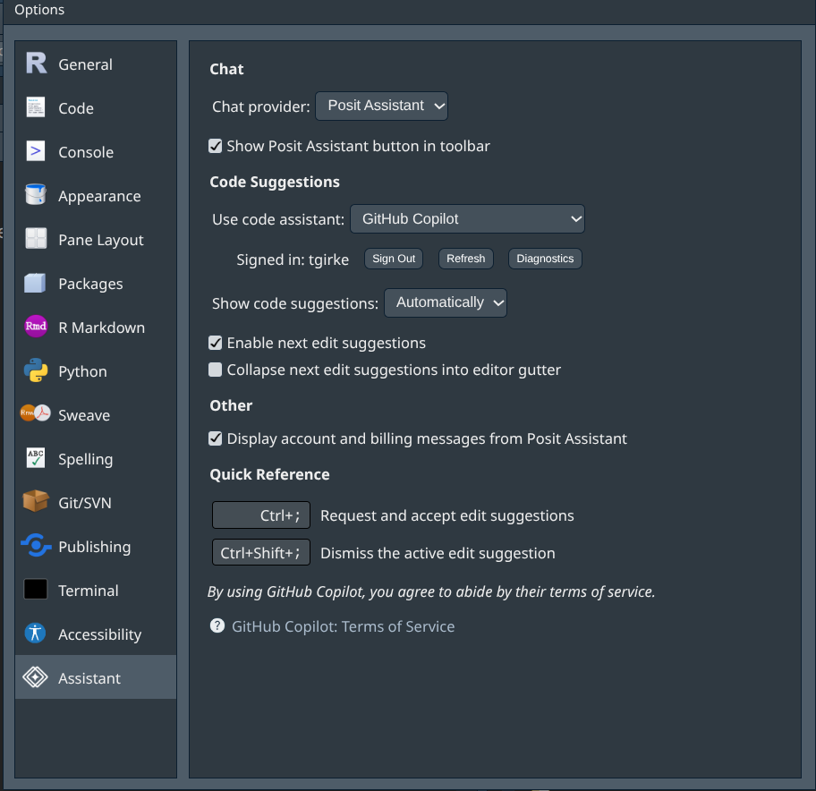

<p align="right">
  
  <a href="https://girke.bioinformatics.ucr.edu/GEN242/slides/aitutor/aitutor_slides.html" target="_blank" rel="noopener noreferrer" style="text-decoration:none">
    
  </a>
  <a href="https://raw.githubusercontent.com/tgirke/GEN242/main/tutorials/aitutor/aitutor.qmd">
    
  </a>
</p>

## Overview

This tutorial introduces four AI coding tools and shows how to use them
effectively for data analysis. The goal is not just to produce working
code faster, but to use AI as an active learning tool for efficient coding and data 
analysis.

This tutorial covers:

- **GitHub Copilot** — inline code completion as you type (free for students
  and educators via GitHub Education)
- **Claude Code** — a conversational terminal agent that reads and edits your
  project files directly (requires paid account; some labs cover this for students)
- **Antigravity CLI** — Google's terminal coding agent, successor to Gemini CLI
  (free tier available with academic Google account)
- **OpenAI Codex** — OpenAI's terminal coding agent
  (Codex); included for completeness as the most widely used AI tools in the field
  (free tier for ChatGPT; Codex via OpenAI API at $20/month)

Each section covers setup for both **Neovim/tmux** and **RStudio** environments.
Working through the sections users can decide which environment best meets their needs. 
To compare the functionalities of each tool, the same simple exercise is included under 
each tool.

---

## Installation

This section covers manual installation of all four tools. Going through
each step explicitly is intentional — understanding what you are installing
and why makes it easier to debug problems and adapt to future changes.

The tabs below cover each tool in sequence. Note that Claude Code does not
require Node.js — it uses its own native binary installer. Copilot and
Antigravity CLI both require Node.js 20 or higher, so the Node.js tab should
be completed first if you plan to use either of those tools.

| Tool | Node.js required | Install method |
|------|-----------------|----------------|
| Claude Code | No | `curl` native installer |
| Copilot (Neovim) | Yes (18+) | lazy.nvim plugin |
| Copilot (RStudio) | No | Built-in, enable in settings |
| Antigravity CLI | Yes (20+) | `npm install -g` |
| Codex | Yes (20+) | `npm install -g` |

::: {.panel-tabset}

## 👆 Select a tool

::: {style="padding: 1em; border: 1px solid #e0e0e0; border-radius: 8px; color: #666;"}
Select the tab above for the tool you want to install:

- **Node.js** — required prerequisite for Copilot, Antigravity CLI, and Codex (not needed for Claude Code)
- **Claude Code** — conversational terminal agent; most powerful option; requires paid account
- **Copilot** — inline code completion; free for students and educators via GitHub Education
- **Antigravity CLI** — Google's terminal agent; free tier available with Google account
- **OpenAI Codex** — OpenAI's chat and terminal agent; widely used reference tools

**nvim-R-Tmux users:** the `setup_ai_tools.sh` script in the
[nvim-R-Tmux](https://github.com/tgirke/nvim-R-Tmux) repository installs
Claude Code, but not Antigravity CLI and Copilot. The install instructions in this
section covers all four AI tools including Node.js.
:::

## Node.js

Both Copilot and Antigravity CLI require Node.js 20 or higher. Claude Code
does not require Node.js. Check first:

```bash
node --version    # should print v20.x or higher
```

If Node.js is missing or outdated, install it via nvm (Node Version Manager).
This installs entirely within your home directory — no root access needed:

```bash
# Install nvm
curl -o- https://raw.githubusercontent.com/nvm-sh/nvm/v0.40.0/install.sh | bash

# Reload shell configuration
source ~/.bashrc

# Install latest LTS version of Node.js
nvm install --lts

# Verify
node --version
npm --version
```

**HPCC:** check whether Node.js is available as a module before installing via nvm:

```bash
module avail node     # search all available modules
module load nodejs     # load required version (here default)
node --version
```

**Upgrading an existing Node.js installation:** if you have an older version
installed (e.g. at `/usr/local/bin/node`), nvm will shadow it automatically
since it prepends its own path to `$PATH`. After installing via nvm, verify
the correct version is active:

```bash
which node      # should show ~/.nvm/versions/node/.../bin/node
node --version  # should show v20.x or higher
```

If `which node` still shows the old path, ensure nvm's init lines are in
`~/.bashrc`:

```bash
export NVM_DIR="$HOME/.nvm"
[ -s "$NVM_DIR/nvm.sh" ] && \. "$NVM_DIR/nvm.sh"
```

**ChromeOS / Crostini note:** nvm installs cleanly in the Debian Linux
container on ChromeOS. No special steps needed beyond the commands above.

## Claude Code

Claude Code installs a native binary — no Node.js required:

```bash
# Install
curl -fsSL https://claude.ai/install.sh | bash

# Add to PATH if not done automatically
echo 'export PATH="$HOME/.local/bin:$PATH"' >> ~/.bashrc
source ~/.bashrc

# Verify
claude --version

# Authenticate — opens browser prompt, one time only
claude
```

**Account requirement:** Claude Pro ($20/month) or API access via
`console.anthropic.com` (pay per token). The free Claude.ai plan does
not include Claude Code.

**HPCC:** redirect the cache directory to bigdata to avoid home quota issues:

```bash
mv ~/.claude /bigdata/grpLABNAME/USERNAME/.claude
ln -s /bigdata/grpLABNAME/USERNAME/.claude ~/.claude
chmod 700 ~/.claude
```

## Copilot

**Account requirement:** free for students and educators via GitHub Education
(`education.github.com`). Sign up with your `.edu` email address. Individual
accounts without education status: $10/month.

### Neovim/tmux

Add the following plugin block to `~/.config/nvim/init.lua` inside the
`require("lazy").setup({...})` call, just before the closing `}, {` that
starts the lazy options table:

::: {style="max-height: 200px; overflow-y: auto;"}
```lua
{
  "zbirenbaum/copilot.lua",
  lazy  = false,
  cmd   = "Copilot",
  event = "InsertEnter",
  config = function()
    require("copilot").setup({
      suggestion = {
        enabled      = true,
        auto_trigger = false,   -- change to true for automatic suggestions
        keymap = {
          accept  = "<M-l>",    -- Alt-l to accept
          next    = "<M-]>",    -- Alt-] next suggestion
          prev    = "<M-[>",    -- Alt-[ previous suggestion
          dismiss = "<C-]>",    -- Ctrl-] dismiss
        },
      },
      panel     = { enabled = false },
      filetypes = {
        r        = true,
        rmd      = true,
        quarto   = true,
        python   = true,
        markdown = true,
        ["*"]    = false,       -- disable for all other filetypes
      },
    })
  end,
},
```
:::

&nbsp;

Then inside Neovim, install the plugin and authenticate:

```nvim
:Lazy sync
```

Restart Neovim, then run:

```nvim
:Copilot auth
```

A floating popup will appear in Neovim showing a one-time device code and URL.
Copy the code, open `https://github.com/login/device` in your browser, paste
the code and authorize.

**ChromeOS / Crostini note:** the browser cannot open automatically from the
terminal in ChromeOS. Before running `:Copilot auth`, first unset any
`GH_COPILOT_TOKEN` environment variable that may be set:

```bash
unset GH_COPILOT_TOKEN
```

Then open a fresh Neovim session and run `:Copilot auth` — the popup will
appear inside Neovim with the device code. Copy it and authorize manually in
the ChromeOS browser.

### CopilotChat (Neovim/tmux)

CopilotChat adds a conversational chat window to Neovim — similar to Claude
Code but using your Copilot subscription. It requires `copilot.lua` to be
installed first. Add this block to `init.lua` after the `copilot.lua` block:

```lua
{
  "CopilotC-Nvim/CopilotChat.nvim",
  lazy = false,
  dependencies = { "zbirenbaum/copilot.lua", "nvim-lua/plenary.nvim" },
  config = function()
    require("CopilotChat").setup()
  end,
  keys = {
    { "<leader>cc", "<cmd>CopilotChat<cr>",         desc = "Open Copilot Chat" },
    { "<leader>ce", "<cmd>CopilotChatExplain<cr>",  desc = "Copilot: explain selection" },
    { "<leader>cf", "<cmd>CopilotChatFix<cr>",      desc = "Copilot: fix selection" },
    { "<leader>co", "<cmd>CopilotChatOptimize<cr>", desc = "Copilot: optimize selection" },
  },
},
```

Then `:Lazy sync` and restart Neovim. No separate authentication needed —
CopilotChat uses the same credentials as `copilot.lua`.

### RStudio

Copilot is natively integrated in RStudio 2023.09 and later. It works in
RStudio Desktop and RStudio Server (OnDemand). No plugin installation needed.
Option names may vary slightly depending on your RStudio version:

1. **Tools → Global Options → Assistant → Enable GitHub Copilot**
2. Click **Sign In** and follow the browser authentication prompt
3. Select `Apply` and `OK`

{fig-align="center" width=60%}

## Antigravity CLI

Antigravity CLI is Google's terminal coding agent, announced at Google I/O
2026 as the successor to Gemini CLI. Node.js 20+ is required (see the
Node.js tab above).

```bash
# Install globally
npm install -g @google/antigravity-cli

# Verify
agy --version

# Authenticate with Google account
agy auth
```

Select **Sign in with Google** and follow the browser prompt. Use your
institutional Google account if you have UC Workspace access.

**Note on Gemini CLI:** Gemini CLI was sunset on June 18, 2026 for individual
and free-tier users. Antigravity CLI (`agy`) is the direct replacement with
an identical interaction model. Existing `GEMINI.md` and `CLAUDE.md` project
memory files are both recognised by Antigravity CLI without changes.

## OpenAI Codex

**Codex** is OpenAI's terminal coding agent — similar to Claude Code and
Antigravity CLI. It requires Node.js 20+ (see the Node.js tab above) and
an OpenAI API subscription ($20/month).

```bash
# Install Codex CLI globally
npm install -g @openai/codex

# Verify
codex --version
```

**Authentication:** Codex uses an OpenAI API key rather than browser login.
Get one at `platform.openai.com` → API Keys, then add to `~/.bashrc`:

```bash
export OPENAI_API_KEY="sk-..."
source ~/.bashrc
```

**Start a session:**
```bash
cd ~/my-project
codex
```

**Neovim/tmux:** same tmux pane workflow as Claude Code. Replace `claude`
with `codex`.

**RStudio:** Tools → Terminal → New Terminal. Run `codex` in the terminal
tab. No plugin needed.

**Key commands** — identical to Claude Code and Antigravity CLI:
```
/init       generate project memory file
/plan       show plan before acting
/clear      reset context
/exit       end session
```

**Note on ChatGPT vs Codex:** ChatGPT (browser) operates at stage 3 of the
AI assistance spectrum — you copy output manually into your editor. Codex
(terminal) operates at stages 4-5 — it reads and writes your files directly,
the same as Claude Code and Antigravity CLI.

:::

&nbsp;

---

## Before AI: The Code Snippet Approach

Before AI tools existed, the standard workflow for writing unfamiliar code was:

1. Search documentation or Stack Overflow for an example
2. Copy a code snippet
3. Adapt it to your data
4. Fix errors by searching again

This works but is slow and passive — you often copy without fully understanding.
Here is a simple example problem of looking up a ggplot2 scatter plot:

```r
# Traditional approach: find an example online, copy, adapt
# From Stack Overflow: "ggplot2 scatter plot with color"
ggplot(data, aes(x = var1, y = var2, color = group)) +
  geom_point()
```

**What AI changes:** instead of searching for a snippet and adapting it, you
describe what you want in plain English and get code tailored to your exact
data — and you can ask it to explain every line. The shift is from searching 
the internet to discussing solutions with AI tool.

---

## The Exercise

Download this [aitutor_exercise.R](https://raw.githubusercontent.com/tgirke/GEN242/refs/heads/main/tutorials/aitutor/aitutor_exercise.R) 
script, open it in your R session and follow the instructions. It includes two
sample exercises:

1. Simple ggplot2 example using the built-in diamonds dataset
2. Slightly more complex volcano plot example using a made-up differential gene expression (DEG) result table

For transparency, the chosen tasks are intentionally overly simple but open-ended. 
There is no single correct plot. Different tools will make different choices - 
comparing them is part of the learning.

For testing Claude Code, there also is a `CLAUDE.md` operational manifest file provided 
[here](https://raw.githubusercontent.com/tgirke/GEN242/refs/heads/main/tutorials/aitutor/CLAUDE.md). This file
needs to be saved to the working directory of Claude code.

---

## GitHub Copilot

GitHub Copilot provides inline code completion - suggestions appear as grey
ghost text as you type, accepted with a single key press. It is the lowest-
friction AI tool to get started with and works inside both Neovim and RStudio.

**Cost:** Free for students and educators via GitHub Education
(`education.github.com`). Sign up with your `.edu` email address. Individual
accounts without education status: $10/month.

**What Copilot does:** predicts and completes code based on what you are
typing and the surrounding context. It does not run code, does not read
your whole project, and does not explain its suggestions unless you ask
in a comment.

**What Copilot does not do (inline completion alone):** it cannot fix errors
autonomously, cannot read output, and does not have a conversation.

**CopilotChat extends this** — it adds a conversational chat window inside
Neovim that lets you ask questions, get explanations, and request fixes on
selected code. Together, inline completion handles the passive experience and
CopilotChat handles the active conversational one — comparable to Claude Code
but using your existing Copilot subscription.

### Copilot with Neovim/tmux

> **Setup:** see the [Installation](#installation) section above —
> Node.js, the `copilot.lua` and `CopilotChat.nvim` plugin blocks,
> `:Lazy sync`, and `:Copilot auth` are all covered there.

#### Inline completion usage

Open an R file and start typing. When Copilot has a suggestion, grey
ghost text appears after your cursor:

```
Key         Action
─────────────────────────────────────
Alt-l       Accept the suggestion
Alt-]       Next suggestion
Alt-[       Previous suggestion
Ctrl-]      Dismiss suggestion
```

**Toggling auto-trigger:** by default `auto_trigger = false` in the
configuration above, meaning suggestions appear only when you press
`Alt-]`. Change to `auto_trigger = true` if you prefer suggestions
to appear automatically as you type.

#### CopilotChat usage

Open a chat session from anywhere in Neovim:

```
Key             Action
──────────────────────────────────────────
Space-cc        Open CopilotChat window
Space-ce        Explain selected code
Space-cf        Fix selected code
Space-co        Optimize selected code
```

To use with a selection: visually select code in Neovim (`V` then move),
then press the keybinding. CopilotChat opens with the selection as context
and you type your question in plain English — the same conversational pattern
as Claude Code.

Inside the chat window, `Enter` sends your message and `q` closes it.

#### Exercise: diamonds visualization with Copilot in Neovim

**Part 1 — inline completion:**

Open a new R file:

```bash
nvim diamonds_plot.R
```

Type the following comment and let Copilot complete the code:

```r
# Load ggplot2 and create a scatter plot of carat vs price colored by cut
```

Press `Alt-]` to trigger a suggestion. Review it, press `Alt-l` to accept,
or `Alt-]` again for an alternative.

**Part 2 — CopilotChat:**

With the completed code in the buffer, select all lines (`ggVG`), then
type `:CopilotChatExplain` to open CopilotChat with an explain request.
Read the explanation — does it match what the code actually does?

Then ask a follow-up in the chat window:

```txt
Suggest one improvement to make this plot more informative.
What would change if the dataset had 10x more points?
```

**Learning tip:** the explanation step is where the learning happens.
Don't skip it — understanding why the code works is more valuable than
having working code.

### Copilot with RStudio

#### Setup

GitHub Copilot is natively integrated in RStudio 2023.09 and later.

Enable it under: **Tools → Global Options → Copilot → Enable GitHub Copilot**

Then click **Sign In** and follow the browser authentication prompt with
your GitHub account.

#### Usage

Once enabled, suggestions appear after typing one or more lines with instructions 
that start with `#`, and then pressing `Ctrl \`. Accept with `Tab`, dismiss with `Escape`.

RStudio also adds a **Copilot** panel in the top-right pane where you can
see and browse multiple suggestions.

#### Exercise: diamonds visualization with Copilot in RStudio

Open a new R script (**File → New File → R Script**) and type:

```r
library(ggplot2)

# Create a visualization of the diamonds dataset showing carat, price, and cut
```

Pause after the comment. A suggestion should appear within a second or two.
Accept with `Tab`, or wait for alternatives.

Then type:

```r
# What does this plot show? Suggest one improvement
```

Copilot will attempt to write a comment-based explanation. Read it and
compare to what you expected.

---

## Claude Code

Claude Code is a terminal-based conversational agent. Unlike Copilot, it
does not complete code as you type — instead you give it instructions in
plain English and it reads, writes, and runs code in your project directly.
It can explain its reasoning, fix errors autonomously, and work across
multiple files.

**Cost:** Claude Pro ($20/month) required. API access via
`console.anthropic.com` is available pay-per-token with no monthly fee —
a lighter option for occasional use. Some labs cover the Pro subscription
for their students.

**Full setup and workflow documentation:**
[CLAUDE_CODE.md](https://github.com/tgirke/nvim-R-Tmux/blob/main/CLAUDE_CODE.md)

### Claude Code with Neovim/tmux

> **Setup:** see the [Installation](#installation) section above —
> the `curl` installer, PATH setup, authentication, and HPCC bigdata
> redirect are all covered there.

#### tmux layout

Run Claude Code in one tmux pane, Neovim in another:

```
┌─────────────────────┬─────────────────────┐
│                     │                     │
│   Claude Code       │   Neovim            │
│   (claude)          │                     │
│                     │                     │
└─────────────────────┴─────────────────────┘
```

```bash
Ctrl-b |    # vertical split
Ctrl-b -    # horizontal split
Ctrl-b →    # switch panes
```

#### Project memory: CLAUDE.md

Every Claude Code project should have a `CLAUDE.md` manifest file at the 
repo root. A sample `CLAUDE.md` file for the exercise used by this tutorial is 
[here](https://raw.githubusercontent.com/tgirke/GEN242/refs/heads/main/tutorials/aitutor/CLAUDE.md). 
Claude reads this at the start of every session — it contains your
conventions, known issues, and any restrictions on file editing.

```bash
# Inside Claude Code, generate a CLAUDE.md for your project
/init
```

#### Session commands

```
/init       generate CLAUDE.md from repo structure
/plan       show plan before making any changes
/clear      reset context (use between unrelated tasks)
/exit       end session
```

Resume a previous session:
```bash
claude --continue    # resume last session
claude --resume      # choose from past sessions
```

#### Git workflow: review every change

Claude Code edits files directly. The recommended workflow uses git to
review every change before accepting it:

```bash
# 1. Set a baseline commit before starting
git add -A
git commit -m "before: starting exercise"

# 2. Give Claude an instruction
# 3. Claude works and commits

# 4. Review what changed
git diff --stat HEAD~1          # overview of all changed files

# 5. Open the file in Neovim and inspect the diff
:Gvdiffsplit HEAD~1             # side-by-side diff (requires vim-fugitive)
]c / [c                         # navigate between changes
do                              # revert a hunk you don't want
:diffoff | :w                   # exit diff mode and save

# 6. Accept
git add -A && git commit -m "add: diamonds plot"
```

This workflow is important for learning: reading the diff forces you to
understand every change Claude made rather than blindly accepting it.

#### Exercise: diamonds visualization with Claude Code

Set up a project directory:

```bash
mkdir ~/diamonds_exercise && cd ~/diamonds_exercise
git init
echo "## Project\nDiamonds ggplot2 exercise" > CLAUDE.md
git add . && git commit -m "initial"
```

Start Claude Code:
```bash
claude
```

Give this instruction (also in [aitutor_exercise.R](https://raw.githubusercontent.com/tgirke/GEN242/refs/heads/main/tutorials/aitutor/aitutor_exercise.R) script):

```txt
Using the diamonds dataset from ggplot2, create an R script called
diamonds_plot.R that visualizes the relationship between carat, price,
and cut. After writing the script, explain what the plot shows and
suggest one improvement. Commit when done.
```

Watch what Claude does in the terminal — it will describe its plan,
write the file, and explain the code. Then review the result:

```bash
git diff --stat HEAD~1
```

Open `diamonds_plot.R` in Neovim and run `:Gvdiffsplit HEAD~1` to see
exactly what was written. Read every line.

Then ask a follow-up question in the Claude pane:

```
Why did you choose those specific geoms and aesthetics?
What would change if I used geom_violin instead of geom_point?
```

This follow-up step is where the real learning happens — Claude will
explain the trade-offs, not just produce code.

**Plan mode:** for larger tasks, use `/plan` before giving an instruction.
Claude describes every file it intends to touch and waits for your approval
before making any changes.

### Claude Code with RStudio

Claude Code works alongside RStudio without any plugin. Open a terminal
tab within your RStudio session (**Tools → Terminal → New Terminal**) and
run **Claude in terminal** and your code in the **RStudio code ecitor**. Claude 
edits files on disk; RStudio detects the changes
and prompts you to reload.

The workflow is otherwise identical to the Neovim/tmux version — give
instructions in the terminal tab, review changes in the RStudio editor pane.

#### Exercise

The exercise is identical to the Neovim/tmux version. Use the RStudio
terminal tab for the Claude Code session, and the RStudio editor for
reviewing files. Run the script with **Ctrl+Shift+Enter** to verify
the plot renders correctly.

---

## Antigravity CLI

Antigravity CLI is Google's terminal coding agent, announced at Google I/O
2026 as the successor to Gemini CLI. It is structurally similar to Claude
Code — conversational, file-aware, and able to run commands.

**Cost and access:** free tier available with any Google account (rate-limited).
The UC system has institutional Google Workspace access — check with your
department for current subscription details, as Google's product naming and
access tiers are in active transition as of mid-2026.

**Note:** Antigravity CLI replaced Gemini CLI on June 18, 2026 for individual
and free-tier users. If you have existing Gemini CLI workflows, see the
migration guide at `antigravity.google/docs/gcli-migration`.

### Installation and Authentication

> **Setup:** see the [Installation](#installation) section above —
> Node.js, `npm install -g @google/antigravity-cli`, and `agy auth`
> are all covered there.

### Project memory: AGENTS.md

Antigravity CLI uses `AGENTS.md` as its project memory file — the
equivalent of Claude Code's `CLAUDE.md`. It also reads `CLAUDE.md` if
present, so existing Claude Code projects work without changes.

```bash
# Generate project memory
agy /init
```

### Usage

The interaction pattern is identical to Claude Code — plain English
instructions in the terminal, Antigravity reads and edits files directly.

```bash
cd ~/my-project
agy
```

Key commands:
```
/init       generate AGENTS.md
/plan       show plan before acting
/clear      reset context
/exit       end session
```

### Antigravity CLI with Neovim/tmux

The tmux layout is identical to Claude Code:

```
┌─────────────────────┬─────────────────────┐
│                     │                     │
│   Antigravity CLI   │   Neovim            │
│   (agy)             │                     │
│                     │                     │
└─────────────────────┴─────────────────────┘
```

Use the same git-based review workflow:

```bash
git add -A && git commit -m "before: starting exercise"
# give agy an instruction
git diff --stat HEAD~1
# open file in Neovim, :Gvdiffsplit HEAD~1
```

### Antigravity CLI with RStudio

Open a terminal tab in RStudio (**Tools → Terminal → New Terminal**) and
run `agy` there. The workflow is identical to Claude Code with RStudio —
Antigravity edits files on disk, RStudio detects changes.

### Exercise: diamonds visualization with Antigravity CLI

```bash
mkdir ~/diamonds_agy && cd ~/diamonds_agy
git init
git commit --allow-empty -m "initial"
agy
```

Give the same instruction as the Claude Code exercise:

```txt
Using the diamonds dataset from ggplot2, create an R script called
diamonds_plot.R that visualizes the relationship between carat, price,
and cut. After writing the script, explain what the plot shows and
suggest one improvement. Commit when done.
```

Review and compare the result to what Claude Code produced. Key questions:

- Did the two tools make the same visualization choices?
- Were the explanations equally clear?
- Which tool's code would you rather learn from?

---

## OpenAI Codex

OpenAI's tools cover two distinct interaction modes: ChatGPT (browser-based
chat) and Codex (terminal coding agent). They are included here as the most
widely used AI tools in the field and a useful reference point for comparison.

**Codex:** OpenAI's terminal coding agent, structurally identical to Claude
Code and Antigravity CLI. It reads and writes your project files directly,
runs code, and iterates on errors. Requires OpenAI API access ($20/month) plus
an API key.

**Cost:** ChatGPT free tier available. Codex requires OpenAI API access ($20/month)
and API key from `platform.openai.com`.

### Installation and Authentication

> **Setup:** see the [Installation](#installation) section above —
> Node.js, `npm install -g @openai/codex`, and `OPENAI_API_KEY` setup
> are all covered there.

### Codex with Neovim/tmux

The tmux layout is identical to Claude Code:

```
┌─────────────────────┬─────────────────────┐
│                     │                     │
│   Codex             │   Neovim            │
│   (codex)           │                     │
│                     │                     │
└─────────────────────┴─────────────────────┘
```

Use the same git-based review workflow as Claude Code:

```bash
git add -A && git commit -m "before: starting exercise"
# give codex an instruction
git diff --stat HEAD~1
# open file in Neovim, :Gvdiffsplit HEAD~1
```

### Codex with RStudio

Open a terminal tab in RStudio (**Tools → Terminal → New Terminal**) and
run `codex` there. The workflow is identical to Claude Code with RStudio —
Codex edits files on disk, RStudio detects changes.

### Exercise: diamonds visualization with ChatGPT / OpenAI Codex


**Codex (terminal):**

```bash
mkdir ~/diamonds_codex && cd ~/diamonds_codex
git init
git commit --allow-empty -m "initial"
codex
```

Give the same instruction as the Claude Code exercise:

```txt
Using the diamonds dataset from ggplot2, create an R script called
diamonds_plot.R that visualizes the relationship between carat, price,
and cut. After writing the script, explain what the plot shows and
suggest one improvement. Commit when done.
```

Review and compare across all four tools. Key questions:

- Did ChatGPT and Codex make the same visualization choices as Claude Code
  and Antigravity CLI?
- How did the copy-paste workflow (ChatGPT) feel compared to the terminal
  agents (Codex, Claude Code, Antigravity)?
- Which tool's explanation was most useful for learning?

---

## Comparison: Four Tools Side by Side

| Feature | Copilot (inline) | Copilot + CopilotChat | Claude Code | Antigravity CLI | OpenAI Codex |
|---------|-----------------|----------------------|-------------|-----------------|-----------------|
| Interaction style | Inline completion as you type | Inline + conversational chat | Conversational terminal | Conversational terminal | Browser chat / terminal agent |
| Reads whole project | No | No | Yes | Yes | No / Yes (Codex) |
| Runs code | No | No | Yes | Yes | No / Yes (Codex) |
| Explains reasoning | Limited (via comments) | Yes, in chat window | Yes, on request | Yes, on request | Yes |
| Neovim/tmux support | Plugin | Two plugins | Native terminal | Native terminal | Browser / native terminal |
| RStudio support | Native (built-in) | Native (built-in) | Terminal tab | Terminal tab | Browser / terminal tab |
| Cost | Free (GitHub Education) | Free (GitHub Education) | $20/month Pro | Free tier (rate-limited) | Free tier / $20/month Plus |
| Best for | Syntax, idioms, fast completion | Completion + explanation without leaving Neovim | Complex tasks, multi-file, research | Free alternative to Claude Code | Widely used reference; Codex comparable to Claude Code |

### When to use each

**Copilot (inline)** is best when you know roughly what you want to write and need
help with syntax, patterns, and boilerplate. It is fast, unobtrusive, and
works without any context-switching.

**CopilotChat** extends Copilot with a conversational window — select code,
ask a question, get an explanation or fix without leaving Neovim. The key
difference from Claude Code is that it doesn't read your whole project or run
code, but for explaining and iterating on code you already have open, it works
well and requires no additional subscription beyond Copilot.

**Claude Code** is best for tasks that require reasoning across the whole
project — debugging, refactoring, multi-file changes, and learning why
something works the way it does. The conversational model means you can push
back, ask follow-ups, and steer the output.

**Antigravity CLI** is best when you want Claude Code-style capabilities
without the subscription cost. The free tier is rate-limited but sufficient
for learning and exercises.

**Codex** is OpenAI's equivalent Claude Code — a terminal agent with comparable
capabilities. If your lab or institution already has OpenAI API access,
Codex is a natural choice. At $20/month it is the same price as Claude Code.

For most research and teaching workflows, the most productive setup is
Copilot running continuously for inline completion, CopilotChat for quick
explanations and fixes, and Claude Code or Antigravity CLI for heavier
multi-file reasoning tasks.

---

## Using AI as a Tutor: Key Principles

Getting the most educational value from these tools requires deliberate
habits. Code generation is the least valuable thing these tools can do.

#### Ask for explanations, not just code

Instead of:
```txt
"Write a function that fits a linear model and plots residuals"
```

Ask:
```txt
"Write a function that fits a linear model and plots residuals.
Explain each line and explain why you chose those specific diagnostics."
```

#### Ask what could go wrong

```txt
"What are the assumptions behind this model? Under what conditions
would this visualization be misleading?"
```

#### Challenge the output

```txt
"Is there a better way to visualize this? What would you do differently
if the dataset had 10x more observations?"
```

#### Use it to understand errors

When you hit an error, describe it to the AI before asking for a fix:

```txt
"I get 'Error in geom_point: aesthetics must be either length 1 or
the same as the data'. What does this mean and why does it happen?"
```

Understanding the error is more valuable than having it fixed silently.

#### The review habit

For Claude Code and Antigravity CLI, always review diffs before accepting.
The `:Gvdiffsplit HEAD~1` workflow in Neovim, or simply reading the changed
file in RStudio before running it, forces active engagement with the code
rather than passive acceptance.

---

## Further Reading

- Claude Code documentation: <https://code.claude.com/docs>
- GitHub Copilot for Education: <https://education.github.com>
- Antigravity CLI documentation: <https://antigravity.google/docs>
- ChatGPT: <https://chatgpt.com>
- OpenAI Codex CLI: <https://github.com/openai/codex>
- nvim-R-Tmux setup (includes Copilot and Claude Code): <https://github.com/tgirke/nvim-R-Tmux>
- Claude Code workflow guide: <https://github.com/tgirke/nvim-R-Tmux/blob/main/CLAUDE_CODE.md>
